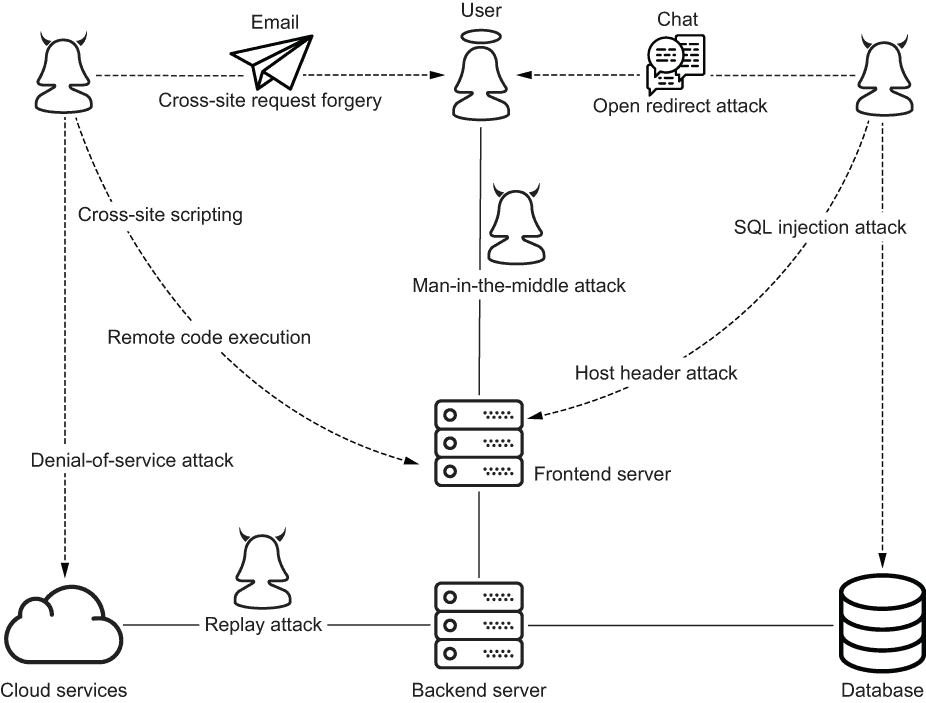
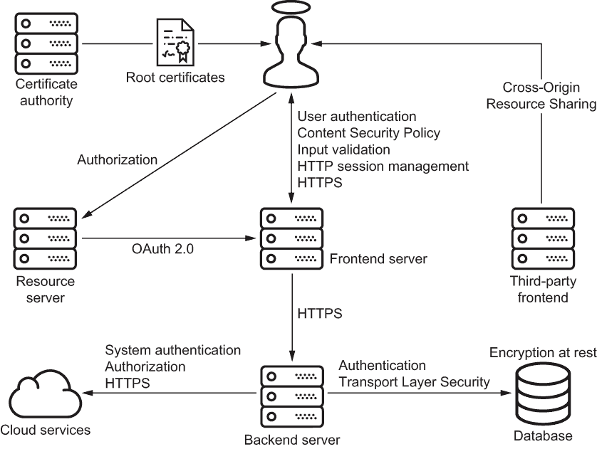
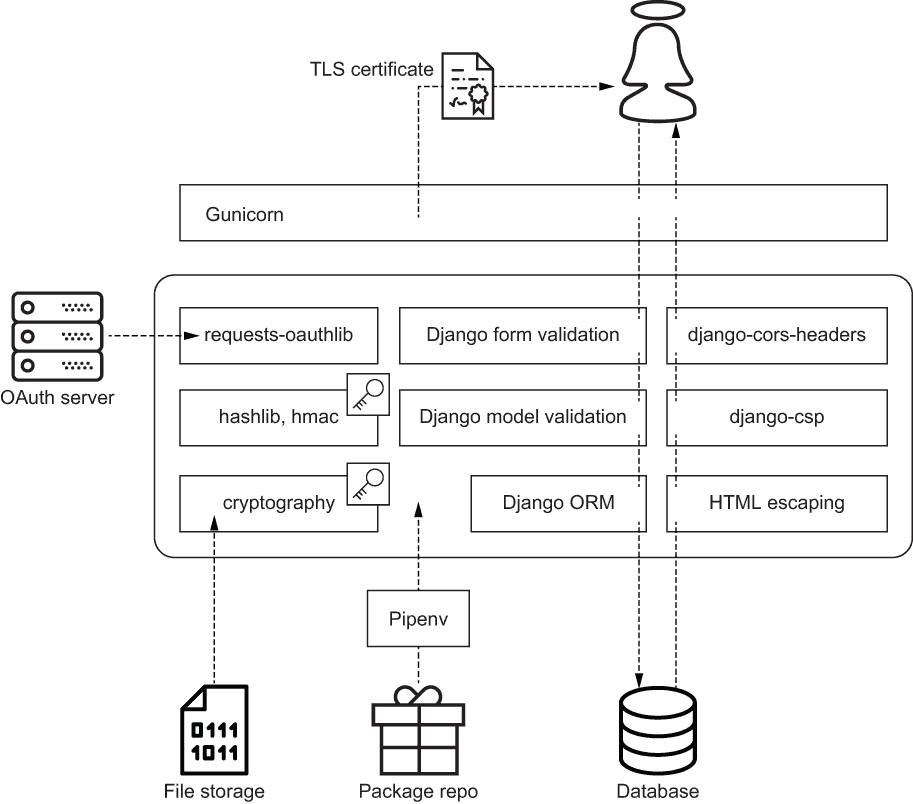

# 第一章：深度防御

本章涵盖

+   定义你的攻击面

+   引入深度防御

+   遵守标准、最佳实践和基本原则

+   识别 Python 安全工具

你现在比以往任何时候都更加信任组织保管你的个人信息。不幸的是，其中一些组织已经将你的信息交给了攻击者。如果你觉得难以置信，可以访问[`haveibeenpwned.com`](https://haveibeenpwned.com)。这个网站允许你轻松搜索一个包含数十亿被入侵账户的电子邮件地址的数据库。随着时间的推移，这个数据库只会变得更大。作为软件用户，通过这种共同经历，我们对安全有了一定的认识。

因为你打开了这本书，我敢打赌你对安全有了额外的认识。和我一样，你不仅想使用安全系统；你也想创建它们。大多数程序员重视安全，但他们并不总是有能力实现。我写这本书是为了为你提供一个建立这种背景的工具集。

*安全*是抵抗攻击的能力。本章从外部向内部分解安全性，从攻击开始。随后的章节涵盖了你在 Python 中实现防御层所需的工具。

每次攻击都始于一个入口点。一个特定系统的所有入口点的总和被称为*攻击面*。在一个安全系统的攻击面下面是安全层，一种被称为*深度防御*的架构设计。防御层遵循标准和最佳实践，以确保安全基础。

## 1.1 攻击面

信息安全已经从一小部分的做和不做发展成为一个复杂的学科。是什么驱使了这种复杂性？安全是复杂的，因为攻击是复杂的；出于必要性，它是复杂的。如今的攻击形式多种多样。在我们能够开发安全系统之前，我们必须对攻击有所了解。

正如我在前一节中所指出的，每次攻击都始于一个易受攻击的入口点，所有潜在入口点的总和就是你的*攻击面*。每个系统都有一个独特的攻击面。

攻击和攻击面处于不断变化的状态。攻击者随着时间变得更加复杂，新的漏洞也会定期被发现。保护你的攻击面因此是一个永无止境的过程，一个组织对这一过程的承诺应该是持续的。

攻击的入口点可以是系统的用户、系统本身，或者两者之间的网络。例如，攻击者可能通过电子邮件或聊天来针对用户作为某些形式攻击的入口点。这些攻击旨在诱使用户与恶意内容互动，以利用漏洞。这些攻击包括以下内容：

+   反射性跨站脚本（XSS）

+   社会工程（例如，网络钓鱼，短信欺诈）

+   跨站请求伪造

+   开放重定向攻击

或者，攻击者可能以系统本身为入口点进行攻击。这种形式的攻击通常旨在利用输入验证不足的系统。这些攻击的经典示例如下：

+   结构化查询语言（SQL）注入

+   远程代码执行

+   主机头攻击

+   拒绝服务

攻击者可能以用户和系统一起作为入口点，进行诸如持久性跨站脚本或点击劫持等攻击。最后，攻击者可能使用用户和系统之间的网络或网络设备作为入口点：

+   中间人攻击

+   重放攻击

本书教会你如何识别和抵御这些攻击，其中一些攻击有一个专门的章节（XSS 有可能有两个章节）。图 1.1 描绘了一个典型软件系统的攻击表面。四名攻击者同时向这个攻击表面施加压力，用虚线表示。尽量不要被细节淹没。这只是为你提供一个高层次概述。到本书结束时，你将了解每种攻击是如何工作的。

图 1.1 四名攻击者同时通过用户、系统和网络对攻击表面施加压力。

在每个安全系统的攻击表面下都有防御层；我们不只是保护周边。正如本章开头所述，这种分层的安全方法通常称为*防御深度*。

## 1.2 防御深度

防御深度，一种源自国家安全局内部的哲学，认为系统应该通过多层安全来应对威胁。每一层安全都是双重目的：它抵御攻击，并在其他层失败时充当备份。我们从不把所有的鸡蛋放在一个篮子里；即使是优秀的程序员也会犯错误，而且定期会发现新的漏洞。

让我们首先通过比喻来探讨防御的深度。想象一座只有一层防御的城堡，即一支军队。这支军队经常保卫城堡免受攻击者的攻击。假设这支军队有 10%的失败几率。尽管军队很强大，国王对当前的风险水平感到不安。你或我能否接受一个无法抵御所有攻击的系统？我们的用户能否接受这一点？

国王有两个选项来降低风险。一个选择是加强军队。这是可能的，但不是经济有效的。消除最后 10%的风险将比消除前 10%的风险显然要昂贵得多。国王决定不是加强军队，而是通过在城堡周围挖掘一道护城河来增加另一层防御。

护城河能减少多少风险？只有军队和护城河都失败了，城堡才会被攻陷，因此国王用简单的乘法计算风险。如果像军队一样，护城河有 10% 的失败几率，那么每次攻击成功的几率就是 10% × 10%，或者 1%。想象一下，与建造一个有 1% 失败几率的军队相比，仅仅挖个坑并注水填满要花多少钱。

最后，国王在城堡周围修建了一堵墙。像军队和护城河一样，这堵墙有 10% 的失败几率。现在，每次攻击的成功几率是 10% × 10% × 10%，或者 0.1%。

防御的成本效益分析归结为算术和概率。增加另一层始终比试图完善单一层更具成本效益。深度防御认识到完美的徒劳；这是一种优势，而不是一种弱点。

随着时间的推移，一种防御层的实现比其他层更成功和流行；挖护城河的方式有限。一个常见问题的常见解决方案出现了。安全社区开始认识到一个模式，并且一种新技术从实验性发展到标准化。标准化机构评估该模式，讨论细节，定义规范，一个安全标准就诞生了。

### 1.2.1 安全标准

许多成功的安全标准是由国家标准与技术研究院（NIST）、互联网工程任务组（IETF）和万维网联盟（W3C）等组织建立的。通过本书，你将学习如何使用以下标准来保护系统：

+   *高级加密标准* (*AES*) — 一种对称加密算法。

+   *安全哈希算法 2* (*SHA-2*) — 一族密码哈希函数。

+   *传输层安全* (*TLS*) — 一种安全的网络协议。

+   *OAuth 2.0* — 一种用于共享受保护资源的授权协议。

+   *跨源资源共享* (*CORS*) — 浏览器的资源共享协议。

+   *内容安全策略* (*CSP*) — 一种基于浏览器的攻击缓解标准。

为什么要标准化？安全标准为程序员提供了一个构建安全系统的共同语言。共同语言使来自不同组织的不同人员能够使用不同工具构建可互操作的安全软件。例如，一个 web 服务器向每种类型的浏览器提供相同的 TLS 证书；浏览器可以理解来自每种类型的 web 服务器的 TLS 证书。

此外，标准化促进了代码重用。例如，`oauthlib` 是 OAuth 标准的通用实现。这个库被 Django OAuth Toolkit 和 `flask-oauthlib` 包装，允许 Django 和 Flask 应用程序都使用它。

我会坦诚地告诉你：标准化并不能神奇地解决每个问题。有时候，一个漏洞是在大家都接受标准几十年后才被发现的。2017 年，一组研究人员宣布他们已经破解了 SHA-1 ([`shat tered.io/`](https://shattered.io/))，一个之前享受了 20 多年行业应用的加密哈希函数。有时候，供应商不会在相同的时间范围内实施标准。每个主要浏览器支持某些 CSP 功能花了好几年的时间。尽管如此，标准化大部分时间确实是有效的，我们不能忽视它。

几个最佳实践已经发展出来以补充安全标准。防御深度本身就是一种最佳实践。像标准一样，安全系统遵循最佳实践；与标准不同，最佳实践没有具体规范。

### 1.2.2 最佳实践

*最佳实践* 不是由标准机构制定的产品；相反，它们是由模因、口口相传和像这本书一样的书定义的。这些是你必须做的事情，有时候你是独自一人。通过阅读本书，你将学会如何识别和追求这些最佳实践：

+   在传输和静止状态下的加密

+   “不要自己造加密算法”

+   最小权限原则

数据要么在传输中，要么在处理中，要么在静止中。当安全专家说“传输和静止状态下的加密”时，他们建议在数据在计算机之间移动时和写入存储时都进行加密。

当安全专家说“不要自己造加密算法”的时候，他们建议你重用经验丰富的专家的工作，而不是试图自己实现。依赖工具并不仅仅是为了满足紧迫的期限和写更少的代码。它变得流行是为了安全起见。不幸的是，许多程序员通过艰难的方式学到了这一点。通过阅读本书，你也将学会这一点。

*最小权限原则*（*PLP*）保证用户或系统仅获得执行其职责所需的最小权限。在本书中，PLP 被应用于许多主题，如用户授权、OAuth 和 CORS。

图 1.2 描述了一个典型软件系统的安全标准和最佳实践的安排。

图 1.2 防御深度应用于具有安全标准和最佳实践的典型系统

无一层防御是万能药。没有安全标准或最佳实践能够独立解决所有安全问题。因此，这本书的内容，就像大多数 Python 应用程序一样，包含了许多标准和最佳实践。把每一章都看作是一个额外防御层的蓝图。

安全标准和最佳实践可能看起来听起来不同，但在幕后，每一个都只是应用相同基本原理的不同方式。这些基本原理代表了系统安全的最原子单位。

### 1.2.3 安全基础

*安全基础知识*反复出现在安全系统设计和本书中。算术与代数或三角函数之间的关系类似于安全基础知识与安全标准或最佳实践之间的关系。通过阅读本书，您将学习如何通过结合这些基础知识来保护系统：

+   *数据完整性*—数据是否改变了？

+   *认证*—你是谁？

+   *数据认证*—谁创作了这个数据？

+   *不可否认性*—谁做了什么？

+   *授权*—你可以做什么？

+   *机密性*—谁可以访问这个？

*数据完整性*，有时也称为*消息完整性*，确保数据没有意外损坏（比特腐败）。它回答了“数据是否改变了？”的问题。数据完整性保证了数据被读取的方式与其被写入的方式相同。数据读者可以验证数据的完整性，无论谁创作了它。

*认证*回答了“你是谁？”的问题。我们每天都在进行这项活动；这是验证某人或某物身份的行为。当一个人能成功回应用户名和密码的挑战时，身份得到了验证。不过，认证不仅仅适用于人，机器也可以被认证。例如，一个持续集成服务器在从代码仓库拉取更改之前进行身份验证。

*数据认证*，通常称为*消息认证*，确保数据读者可以验证数据写入者的身份。它回答了“谁创作了这个数据？”的问题。与数据完整性一样，当数据读者和写入者不同时，以及当数据读者和写入者相同时，数据认证也适用。

*不可否认性*回答了“谁做了什么？”的问题。它保证了个人或组织没有否认其行为的方式。不可否认性可以应用于任何活动，但对于在线交易和法律协议至关重要。

*授权*，有时也称为*访问控制*，经常与认证混淆。这两个术语听起来相似，但代表着不同的概念。正如先前所述，认证回答了“你是谁？”的问题。而授权则回答了“你可以做什么？”的问题。阅读电子表格、发送电子邮件和取消订单都是用户可能被授权或未被授权做的操作。

*机密性*回答了“谁可以访问这个？”的问题。这个基础保证了两个或更多方可以私下交换数据。以保密方式传输的信息不能被未经授权的任何方以任何有意义的方式阅读或解释。

本书教会您如何使用这些基础知识构建解决方案。表 1.1 列出了每个基础知识和其对应的解决方案。

表 1.1 安全基础知识

| 建筑块 | 解决方案 |
| --- | --- |
| 数据完整性 | 安全网络协议版本控制包管理 |
| 认证 | 用户认证系统认证 |
| 数据认证 | 用户注册用户登录工作流密码重置工作流用户会话管理 |
| 不可否认性 | 在线交易数字签名可信第三方 |
| 授权 | 用户授权系统对系统授权文件系统访问授权 |
| 机密性 | 加密算法安全网络协议 |

安全基础互相补充。单独使用每个基础并不是很有用，但是当它们结合在一起时就变得强大了。让我们考虑一些例子。假设一个电子邮件系统提供数据认证但不提供数据完整性。作为电子邮件接收者，你可以验证电子邮件发送者的身份（数据认证），但你无法确定电子邮件在传输过程中是否被修改。这并不是很有用，对吧？如果你无法验证实际数据，那么验证数据编写者的身份有什么意义呢？

想象一个新颖的网络协议，它保证了机密性但没有认证。窃听者无法访问你使用该协议发送的信息（机密性），但你无法确定你正在向谁发送数据。事实上，你可能正在向窃听者发送数据。上次你想与某人进行私人对话而不知道你在与谁交谈时是什么时候？通常，如果你想交换敏感信息，你也希望与你信任的人或事物进行交流。

最后，考虑一个支持授权但不支持认证的在线银行系统。这家银行始终确保你的资金由你管理；它只是不会要求你首先证明你的身份。一个系统如何在不知道用户是谁的情况下授权用户呢？显然，我们中没有人会把钱存入这家银行。

安全基础是安全系统设计的最基本构建模块。我们不能一遍又一遍地应用相同的基础。相反，我们必须混合搭配它们来构建防御层。对于每个防御层，我们希望将繁重的工作委托给工具。其中一些工具是 Python 的本机工具，其他工具则通过 Python 包提供。

## 1.3 工具

本书中的所有示例都是用 Python 编写的（具体来说是 3.8 版本）。为什么选择 Python？嗯，你不想读一本过时的书，我也不想写一本。Python 很受欢迎，而且越来越受欢迎。

*编程语言流行度* (*PYPL*) *指数*是基于谷歌趋势数据的编程语言流行度衡量标准。截至 2021 年中期，Python 在 PYPL 指数（[`pypl.github.io/PYPL.html`](http://pypl.github.io/PYPL.html)）上排名第一，市场份额为 30%。在过去五年中，Python 的流行度增长超过了其他任何编程语言。

为什么 Python 如此受欢迎？对于这个问题有很多答案。大多数人似乎都同意有两个因素。首先，Python 是一种适合初学者的编程语言。它易于学习、阅读和编写。其次，Python 生态系统已经爆炸式增长。2017 年，Python 包索引(PyPI)达到了 100,000 个包。这个数字仅用了两年半的时间就翻了一番。

我不想写一本只涵盖 Python Web 安全的书。因此，一些章节介绍了诸如加密、密钥生成和操作系统等主题。我使用一些与安全相关的 Python 模块探讨这些主题：

+   `hashlib` *模块* ([`docs.python.org/3/library/hashlib.html`](https://docs.python.org/3/library/hashlib.html))—Python 的加密哈希解决方案

+   `secrets` *模块* ([`docs.python.org/3/library/secrets.html`](https://docs.python.org/3/library/secrets.html))—安全的随机数生成

+   `hmac` *模块* ([`docs.python.org/3/library/hmac.html`](https://docs.python.org/3/library/hmac.html))—基于哈希的消息认证

+   `os` *和* `subprocess` *模块* ([`docs.python.org/3/library/os.html`](https://docs.python.org/3/library/os.html) 和 [`docs.python.org/3/library/subprocess.html`](https://docs.python.org/3/library/subprocess.html))—连接你与操作系统的门户

有些工具有专门的章节，其他工具则遍布全书。还有一些工具仅有简短的介绍。你将学到关于以下工具的一些或许很多的知识：

+   `argon2-cffi` ([`pypi.org/project/argon2-cffi/`](https://pypi.org/project/argon2-cffi/))—用于保护密码的函数

+   `cryptography` ([`pypi.org/project/cryptography/`](https://pypi.org/project/cryptography/))—一款用于常见加密功能的 Python 包

+   `defusedxml` ([`pypi.org/project/defusedxml/`](https://pypi.org/project/defusedxml/))—一种更安全的解析 XML 的方法

+   *Gunicorn* ([`gunicorn.org`](https://gunicorn.org))—用 Python 编写的 Web 服务器网关接口

+   *Pipenv* ([`pypi.org/project/pipenv/`](https://pypi.org/project/pipenv/))—一个带有许多安全功能的 Python 包管理器

+   `requests` ([`pypi.org/project/requests/`](https://pypi.org/project/requests/))—一个易于使用的 HTTP 库

+   `requests-oauthlib` ([`pypi.org/project/requests-oauthlib/`](https://pypi.org/project/requests-oauthlib/))—客户端 OAuth 2.0 实现

Web 服务器占据了典型攻击面的很大一部分。因此，本书有许多章节专门讨论保护 Web 应用程序的问题。在这些章节中，我不得不问自己一个许多 Python 程序员熟悉的问题：Flask 还是 Django？这两个框架都值得尊重；它们之间的主要区别是极简主义与开箱即用功能之间的差异。相对于彼此，Flask 默认使用基本功能，而 Django 默认使用功能丰富的功能。

作为一个极简主义者，我喜欢 Flask。不幸的是，它将极简主义应用到了许多安全功能上。使用 Flask，你的大部分防御层都是委托给第三方库的。另一方面，Django 则较少依赖第三方支持，具有许多内置的保护功能，默认情况下启用。在这本书中，我使用 Django 来演示 Web 应用程序安全性。当然，Django 不是万能的；我还使用了以下第三方库：

+   `django-cors-headers`（[`pypi.org/project/django-cors-headers/`](https://pypi.org/project/django-cors-headers/)）—CORS 的服务器端实现

+   `django-csp`（[`pypi.org/project/django-csp/`](https://pypi.org/project/django-csp/)）—CSP 的服务器端实现

+   *Django OAuth Toolkit*（[`pypi.org/project/django-oauth-toolkit/`](https://pypi.org/project/django-oauth-toolkit/)）—OAuth 2.0 的服务器端实现

+   `django-registration`（[`pypi.org/project/django-registration/`](https://pypi.org/project/django-registration/)）—用户注册库

图 1.3 展示了一个由这套工具组成的栈。在这个栈中，Gunicorn 通过 TLS 中继用户和服务器之间的流量。用户输入通过 Django 表单验证、模型验证和对象关系映射（ORM）进行验证；系统输出通过 HTML 转义进行清理。`django-cors-headers` 和 `django-csp` 确保每个出站响应都使用适当的 CORS 和 CSP 标头进行锁定。`hashlib` 和 `hmac` 模块执行哈希运算；`cryptography` 包执行加密操作。`requests-oauthlib` 与 OAuth 资源服务器进行接口交互。最后，Pipenv 防止包存储库中的漏洞。

图 1.3 一套常见 Python 组件的完整堆栈，在每个层级抵抗某种形式的攻击

这本书对框架和库没有偏见；它不偏袒任何一方。如果你钟爱的开源框架被另一种选择所取代，请不要把它当成个人攻击。这本书涵盖的每个工具都是通过问两个问题来选择的：

+   *这个工具成熟吗？* 我们俩最后不应该把职业生涯押在一个刚出生的开源框架上。我故意不涉及尖端工具；这叫做“尖端”不是没有原因的。按照定义，处于这个开发阶段的工具不能被认为是安全的。因此，这本书中的所有工具都是成熟的；这里的一切都经过了实战考验。

+   *这个工具受欢迎吗？* 这个问题与未来比过去更有关系，与过去无关。具体来说，读者在未来使用这个工具的可能性有多大？无论我使用哪种工具来演示一个概念，记住最重要的是概念本身。

### 1.3.1 保持务实

这是一本实用手册，而不是教科书；我更注重专业人士而不是学生。这并不是说安全的学术方面不重要。它非常重要。但安全和 Python 是广阔的主题。本材料的深度被限制在对目标受众最有用的内容上。

在这本书中，我涵盖了一些用于哈希和加密的功能。我不涉及这些功能背后的繁重数学。你将学习这些功能的行为；你不会学到这些功能是如何实现的。我会告诉你何时以及何时不应该使用它们。

阅读这本书会让你成为一个更好的程序员，但这并不能让你成为一个安全专家。没有一本书能做到这一点。不要相信那些承诺能做到这一点的书。阅读这本书，并写一个安全的 Python 应用程序！让现有系统更安全。自信地将你的代码推向生产环境。但不要将你的 LinkedIn 资料标题设置为*密码学家*。

## 概要

+   每次攻击都始于一个入口点，对于单个系统，这些入口点的总和被称为攻击面。

+   攻击复杂性推动了深度防御的需求，这是一种以层为特征的架构方法。

+   许多防御层坚持安全标准和最佳实践，以促进互操作性、代码重用和安全性。

+   在底层，安全标准和最佳实践是应用相同基本概念的不同方式。

+   你应该努力将繁重的工作委托给像框架或库这样的工具；许多程序员都是通过艰苦的方式学会这一点的。

+   通过阅读这本书，你会成为一个更好的程序员，但这并不会让你成为一个密码学专家。
