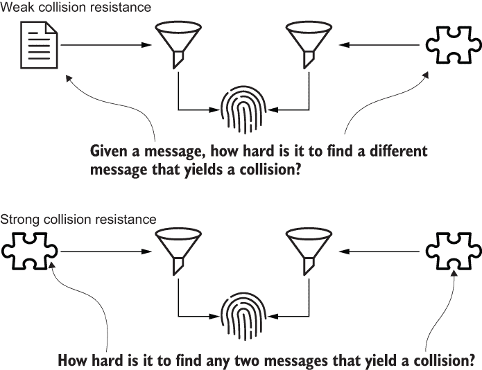

# 第二章：哈希

本章涵盖

+   定义哈希函数

+   引入安全原型

+   使用哈希验证数据完整性

+   选择加密哈希函数

+   使用`hashlib`模块进行加密哈希处理

在本章中，您将学习如何使用哈希函数来确保数据完整性，这是安全系统设计的基本构建块。您还将学习如何区分安全和不安全的哈希函数。在此过程中，我将向您介绍爱丽丝、鲍勃和其他几个原型角色。我使用这些角色贯穿整本书来说明安全概念。最后，您将学习如何使用`hashlib`模块对数据进行哈希处理。

## 2.1 什么是哈希函数？

每个*哈希函数*都有输入和输出。哈希函数的输入称为*消息*。消息可以是任何形式的数据。葛底斯堡演说、一张猫的图片和一个 Python 包都是潜在消息的例子。哈希函数的输出是一个非常大的数字。这个数字有许多名称：*哈希值*、*哈希*、*哈希码*、*摘要*和*消息摘要*。

在这本书中，我使用术语*哈希值*。哈希值通常表示为字母数字字符串。哈希函数将一组消息映射到一组哈希值。图 2.1 说明了消息、哈希函数和哈希值之间的关系。


图 2.1 哈希函数将一个称为消息的输入映射到一个称为哈希值的输出。

在这本书中，我将每个哈希函数描绘为一个漏斗。哈希函数和漏斗都接受可变大小的输入并产生固定大小的输出。我将每个哈希值描绘为一个指纹。哈希值和指纹分别唯一标识一条消息或一个人。

哈希函数彼此之间是不同的。这些差异通常归结为本节中定义的属性。为了说明前几个属性，我们将使用一个内置的 Python 函数，方便地命名为`hash`。Python 使用这个函数来管理字典和集合，而你和我将用它来进行教学目的。

内置的`hash`函数是介绍基础知识的好方法，因为它比本章后面讨论的哈希函数要简单得多。内置的`hash`函数接受一个参数，即消息，并返回一个哈希值：

```py
$ python
>>> message = 'message'   # ❶
>>> hash(message)
2010551929503284934       # ❷
```

❶ 消息输入

❷ 哈希值输出

哈希函数具有三个基本属性：

+   确定性行为

+   固定长度的哈希值

+   雪崩效应

确定性行为

每个哈希函数都是*确定性*的：对于给定的输入，哈希函数总是产生相同的输出。换句话说，哈希函数的行为是可重复的，而不是随机的。在 Python 进程中，内置的`hash`函数对于给定的消息值始终返回相同的哈希值。在交互式 Python shell 中运行以下两行代码。你的哈希值将匹配，但会与我的不同：

```py
>>> hash('same message')
1116605938627321843        # ❶
>>> hash('same message')
1116605938627321843        # ❶
```

❶ 相同的哈希值

我在本章后面讨论的哈希函数是普遍确定性的。这些函数无论在何时何地调用，行为都是相同的。

固定长度的哈希值

消息具有任意长度；对于特定哈希函数，哈希值具有固定长度。如果一个函数不具备这个属性，那么它就不符合哈希函数的标准。消息的长度不会影响哈希值的长度。将不同的消息传递给内置的`hash`函数将给出不同的哈希值，但每个哈希值始终是一个整数。

雪崩效应

当消息之间的微小差异导致哈希值之间的巨大差异时，哈希函数被认为表现出*雪崩效应*。理想情况下，每个输出位都取决于每个输入位：如果两个消息只有一个位不同，那么平均只有一半的输出位应该匹配。哈希函数的评判标准是它与理想情况有多接近。

看一下以下代码。字符串和整数对象的哈希值都具有固定长度，但只有字符串对象的哈希值表现出雪崩效应：

```py
>>> bin(hash('a'))
'0b100100110110010110110010001110011110011111011101010000111100010'
>>> bin(hash('b'))
'0b101111011111110110110010100110000001010000011110100010111001110'
>>> 
>>> bin(hash(0))
'0b0'
>>> bin(hash(1))
'0b1'
```

内置的`hash`函数是一个很好的教学工具，但不能被视为加密哈希函数。接下来的部分将阐述这一点的三个原因。

### 2.1.1 加密哈希函数属性

*加密哈希函数*必须满足三个额外的标准：

+   单向函数属性

+   弱碰撞抗性

+   强碰撞抗性

这些属性的学术术语分别是*前像抗性*、*第二前像抗性*和*碰撞抗性*。为了讨论方便，我避免使用学术术语，这并不是对学者们的有意不敬。

单向函数

用于加密目的的哈希函数，没有例外，必须是*单向函数*。如果一个函数易于调用但难以逆向工程，则称其为单向函数。换句话说，如果你有输出，那么很难确定输入。如果攻击者获得了一个哈希值，我们希望他们很难弄清楚消息是什么。

有多难？我们通常使用*不可行*这个词。这意味着*非常困难*—难到攻击者只有一个选择，如果他们想要逆向工程消息：暴力破解。

*暴力破解*是什么意思？每个攻击者，即使是一个不成熟的攻击者，也能够编写一个简单的程序来生成大量的消息，对每个消息进行哈希，并将每个计算出的哈希值与给定的哈希值进行比较。这是一个暴力破解攻击的例子。攻击者需要大量的时间和资源，而不是智力。

需要多少时间和资源？这是主观的。答案并非一成不变。例如，对本章后面讨论的一些哈希函数进行理论暴力攻击将需要数百万年和数十亿美元。一个理性的安全专业人士会认为这是不可行的。这并不意味着不可能。我们认识到没有完美的哈希函数，因为暴力攻击始终是攻击者的一个选择。

不可行性是一个不断变化的目标。几十年前被认为不可行的暴力攻击，今天或明天可能就变得实际。随着计算机硬件成本的持续下降，暴力攻击的成本也在降低。不幸的是，加密强度随着时间的推移而减弱。不要把这理解为每个系统最终都会变得脆弱。相反，要明白每个系统最终都必须使用更强大的哈希函数。本章将帮助您就使用哪些哈希函数做出明智的决定。

碰撞抗性

用于加密目的的哈希函数，没有例外，必须具有*碰撞抗性*。什么是碰撞？虽然不同消息的哈希值具有相同的长度，但它们几乎永远不会具有相同的值...几乎。当两个消息的哈希值相同时，称为*碰撞*。碰撞是不好的。哈希函数被设计来最小化碰撞。我们根据它们避免碰撞的能力来评判哈希函数；有些比其他的更好。

如果给定一个消息，一个哈希函数具有*弱碰撞抗性*，那么识别出一个第二个消息的哈希值与之相同是不可行的。换句话说，如果攻击者有一个输入，识别出另一个能够产生相同输出的输入是不可行的。

如果一个哈希函数具有*强碰撞抗性*，那么找到任何碰撞都是不可行的。弱碰撞抗性和强碰撞抗性之间的区别微妙。弱碰撞抗性限定于特定的给定消息；强碰撞抗性适用于任何一对消息。图 2.2 说明了这种差异。



图 2.2 弱碰撞抗性与强碰撞抗性的比较

强碰撞抗性意味着弱碰撞抗性，反之则不然。任何具有强碰撞抗性的哈希函数也具有弱碰撞抗性；具有弱碰撞抗性的哈希函数不一定具有强碰撞抗性。因此，强碰撞抗性是一个更大的挑战；这通常是攻击者或研究人员破解加密哈希函数时首先丢失的属性。本章后面，我将向您展示一个现实世界中的例子。

关键词是*不可行*。尽管识别一个无碰撞的哈希函数会有多好，但我们永远也找不到，因为它根本不存在。想想看。消息可以有任意长度；哈希值只能有一个长度。因此，所有可能消息的集合总是大于所有可能哈希值的集合。这被称为*鸽巢原理*。

在本节中，您了解了哈希函数是什么。现在是时候学习哈希如何确保数据完整性了。但首先，我将向您介绍一些原型角色。我在整本书中使用这些角色来说明安全概念，从本章开始讲述数据完整性。

## 2.2 原型角色

我在这本书中使用五个原型角色来说明安全概念（见图 2.3）。相信我，这些角色使阅读（和写作）这本书变得更容易。这本书中的解决方案围绕爱丽丝和鲍勃面临的问题展开。如果你读过其他安全书籍，你可能已经遇到过这两个角色。爱丽丝和鲍勃就像你一样——他们希望安全地创建和共享信息。偶尔，他们的朋友查理也会出现。这本书中每个示例的数据往往在爱丽丝、鲍勃和查理之间流动；记住 A、B 和 C。爱丽丝、鲍勃和查理是好角色。在阅读本书时，可以随意与这些角色产生共鸣。


图 2.3 带光环的原型角色是好的；攻击者被指定为有角的。

伊芙和玛洛丽是坏角色。记住伊芙是邪恶的。记住玛洛丽是恶意的。这些角色通过试图窃取或修改他们的数据和身份来攻击爱丽丝和鲍勃。伊芙是被动攻击者；她是窃听者。她倾向于向攻击面的网络部分靠拢。玛洛丽是主动攻击者；她更加复杂。她倾向于使用系统或用户作为入口点。

记住这些角色；你会再次见到它们。爱丽丝、鲍勃和查理有光环；伊芙和玛洛丽有角。在下一节中，爱丽丝将使用哈希来确保数据完整性。

## 2.3 数据完整性

*数据* *完整性*，有时被称为*消息完整性*，是确保数据没有意外修改的保证。它回答了这个问题，“数据是否改变了？”假设爱丽丝在一个文档管理系统上工作。目前，该系统存储每个文档的两份副本以确保数据完整性。为了验证文档的完整性，系统逐字节比较这两份副本。如果副本不匹配，文档被视为损坏。爱丽丝对系统消耗的存储空间感到不满。成本已经失控，随着系统容纳更多文档，问题变得更加严重。

爱丽丝意识到她有一个常见的问题，并决定用一个常见的解决方案来解决它，即一个加密散列函数。当每个文档被创建时，系统会计算并存储它的散列值。为了验证每个文档的完整性，系统首先重新计算其散列值。然后将新的散列值与存储中的旧散列值进行比较。如果散列值不匹配，则认为文档已损坏。

图 2.4 用四个步骤说明了这个过程。一个拼图图案描述了两个散列值的比较。


图 2.4 爱丽丝通过比较散列值而不是文档来确保数据完整性。

你能看出碰撞抵抗为什么很重要吗？假设爱丽丝使用的散列函数缺乏碰撞抵抗性。如果原始文件版本与损坏版本发生碰撞，系统就无法绝对地检测到数据损坏。

这一部分展示了散列的一个重要应用：数据完整性。在下一节中，你将学习如何选择一个适合做这件事的实际散列函数。

## 2.4 选择加密散列函数

Python 原生支持加密散列。无需第三方框架或库。Python 自带一个 `hashlib` 模块，提供了大多数程序员需要的加密散列的一切。`algorithms_guaranteed` 集合包含了保证在所有平台上可用的每个散列函数。这个集合中的散列函数代表了你的选择。很少有 Python 程序员会需要或者甚至看到这个集合之外的散列函数：

```py
>>> import hashlib
>>> sorted(hashlib.algorithms_guaranteed)
['blake2b', 'blake2s', 'md5', 'sha1', 'sha224', 'sha256', 'sha384', 
'sha3_224', 'sha3_256', 'sha3_384', 'sha3_512', 'sha512', 'shake_128',
 'shake_256']
```

面对如此多的选择，感到不知所措是很自然的。在选择散列函数之前，我们必须将选项划分为安全和不安全的选项。

### 2.4.1 哪些散列函数是安全的？

`algorithms_guaranteed` 的安全和可靠的散列函数属于以下散列算法族：

+   SHA-2

+   SHA-3

+   BLAKE2

SHA-2

*SHA-2* 散列函数族于 2001 年由 NSA 发布。该族由 SHA-224、SHA-256、SHA-384 和 SHA-512 组成。SHA-256 和 SHA-512 是该族的核心。不必费心记住所有四个函数的名称；现在只需关注 SHA-256 即可。在本书中你会经常看到它。

你应该用 SHA-256 进行通用加密散列。这是一个很容易的决定，因为我们所使用的每个系统都已经在使用它。我们部署应用程序所依赖的操作系统和网络协议都依赖于 SHA-256，所以我们别无选择。你必须非常努力才能不使用 SHA-256。它安全、可靠、受到良好支持，并且被广泛使用。

SHA-2 家族中每个函数的名称方便地自述其哈希值长度。哈希函数通常根据其哈希值的长度进行分类、评判和命名。例如，SHA-256 是一个产生——你猜对了——长度为 256 位的哈希值的哈希函数。较长的哈希值更有可能是唯一的，更不容易发生碰撞。越长越好。

SHA-3

*SHA-3*哈希函数家族由 SHA3-224、SHA3-256、SHA3-384、SHA3-512、SHAKE128 和 SHAKE256 组成。SHA-3 是安全的、可靠的，并被许多人认为是 SHA-2 的自然继任者。不幸的是，在撰写本文时，SHA-3 的采用尚未获得动力。如果您在高安全环境中工作，应考虑使用 SHA3-256 等 SHA-3 函数。只需注意，您可能无法找到与 SHA-2 存在的相同支持水平。

BLAKE2

*BLAKE2*不像 SHA-2 或 SHA-3 那样受欢迎，但有一个很大的优势：BLAKE2 利用现代 CPU 架构以极快的速度进行哈希。因此，如果您需要对大量数据进行哈希，应考虑使用 BLAKE2。BLAKE2 有两种版本：BLAKE2b 和 BLAKE2s。BLAKE2b 针对 64 位平台进行了优化。BLAKE2s 针对 8 到 32 位平台进行了优化。

现在您已经学会了如何识别和选择安全的哈希函数，您准备好学习如何识别和避免不安全的哈希函数了。

### 2.4.2 哪些哈希函数是不安全的？

`algorithms_guaranteed`中的哈希函数是流行的跨平台的。这并不意味着它们每一个都是密码学安全的。Python 中保留了不安全的哈希函数，以保持向后兼容性。了解这些函数是值得的，因为您可能会在传统系统中遇到它们。`algorithms_guaranteed`的不安全哈希函数如下：

+   MD5

+   SHA-1

MD5

*MD5*是在上世纪 90 年代初开发的过时的 128 位哈希函数。这是有史以来最常用的哈希函数之一。不幸的是，尽管研究人员早在 2004 年就展示了 MD5 碰撞，但 MD5 仍在使用中。今天，密码分析师可以在不到一个小时的时间内在商品硬件上生成 MD5 碰撞。

SHA-1

*SHA-1*是由 NSA 在上世纪 90 年代中期开发的过时的 160 位哈希函数。像 MD5 一样，这个哈希函数曾经很受欢迎，但现在不再被认为是安全的。SHA-1 的第一个碰撞是在 2017 年由 Google 和荷兰研究机构 Centrum Wiskunde & Informatica 的合作努力宣布的。在理论上，这一努力剥夺了 SHA-1 的强碰撞抵抗力，而不是弱碰撞抵抗力。

许多程序员熟悉 SHA-1，因为它用于验证版本控制系统（如 Git 和 Mercurial）中的数据完整性。这两个工具都使用 SHA-1 哈希值来标识并确保每个提交的完整性。Git 的创建者 Linus Torvalds 在 2007 年的 Google Tech Talk 中说：“就 Git 而言，SHA-1 甚至不是一个安全功能。它纯粹是一种一致性检查。”

警告：在创建新系统时，不应将 MD5 或 SHA-1 用于安全目的。任何使用这两个函数用于安全目的的遗留系统都应重构为安全替代方案。这两个函数都很流行，但 SHA-256 是流行且安全的。它们都很快，但 BLAKE2 更快更安全。

下面是选择哈希函数时的 dos 和 don'ts 摘要：

+   用于一般目的的加密哈希，请使用 SHA-256。

+   在高安全环境中，请使用 SHA3-256，但预期的支持会比 SHA-256 较少。

+   请使用 BLAKE2 对大消息进行哈希处理。

+   永远不要将 MD5 或 SHA1 用于安全目的。

现在您已经学会如何选择安全的加密哈希函数了，让我们在 Python 中应用这个选择。

## 2.5 Python 中的加密哈希处理

`hashlib` 模块提供了每个哈希函数的命名构造函数，在 `hashlib.algorithms_guaranteed` 中。或者，每个哈希函数都可以通过通用构造函数 `new` 动态访问。该构造函数接受 `algorithms_guaranteed` 中的任何字符串。命名构造函数比通用构造函数更快，更受欢迎。下面的代码演示了如何使用这两种构造函数类型构造 SHA-256 的实例：

```py
import hashlib

named = hashlib.sha256()           # ❶
generic = hashlib.new('sha256')    # ❷
```

❶ 命名构造函数

❷ 通用构造函数

可以使用或不使用消息初始化哈希函数实例。下面的代码初始化了一个带有消息的 SHA-256 函数。与内置的 `hash` 函数不同，`hashlib` 中的哈希函数要求消息的类型为字节：

```py
>>> from hashlib import sha256
>>> 
>>> message = b'message'
>>> hash_function = sha256(message)
```

无论如何创建，每个哈希函数实例都有相同的 API。对于 SHA-256 实例的公共方法类似于对于 MD5 实例的公共方法。`digest` 和 `hexdigest` 方法分别返回哈希值作为字节和十六进制文本：

```py
>>> hash_function.digest()        # ❶
b'\xabS\n\x13\xe4Y\x14\x98+y\xf9\xb7\xe3\xfb\xa9\x94\xcf\xd1\xf3\xfb"\xf7\x
1c\xea\x1a\xfb\xf0+F\x0cm\x1d'
>>> 
>>> hash_function.hexdigest()     # ❷
'ab530a13e45914982b79f9b7e3fba994cfd1f3fb22f71cea1afbf02b460c6d1d'
```

❶ 返回哈希值作为字节

❷ 返回哈希值字符串

以下代码使用 `digest` 方法演示了一个 MD5 碰撞。这两条消息只有少数不同的字符（加粗显示）：

```py
>>> from hashlib import md5
>>> 
>>> x = bytearray.fromhex(
...    
'd131dd02c5e6eec4693d9a0698aff95c2fcab58712467eab4004583eb8fb7f8955ad340609
f4b30283e488832571415a085125e8f7cdc99fd91dbdf280373c5bd8823e3156348f5bae6da
cd436c919c6dd53e2b487da03fd02396306d248cda0e99f33420f577ee8ce54b67080a80d1e
c69821bcb6a8839396f9652b6ff72a70')
>>> 
>>> y = bytearray.fromhex(
...     
'd131dd02c5e6eec4693d9a0698aff95c2fcab50712467eab4004583eb8fb7f8955ad340609
f4b30283e4888325f1415a085125e8f7cdc99fd91dbd7280373c5bd8823e3156348f5bae6da
cd436c919c6dd53e23487da03fd02396306d248cda0e99f33420f577ee8ce54b67080280d1e
c69821bcb6a8839396f965ab6ff72a70')
>>> 
>>> x == y                               # ❶
False                                    # ❶
>>> 
>>> md5(x).digest() == md5(y).digest()   # ❷
True                                     # ❷
```

❶ 不同的消息

❷ 相同的哈希值，碰撞

消息也可以使用 `update` 方法进行哈希处理，如下面的代码中所示。当需要单独创建和使用哈希函数时，这很有用。哈希值不受消息如何馈送到函数的影响：

```py
>>> message = b'message'
>>> 
>>> hash_function = hashlib.sha256()                             # ❶
>>> hash_function.update(message)                                # ❷
>>> 
>>> hash_function.digest() == hashlib.sha256(message).digest()   # ❸
True                                                             # ❸
```

❶ 构造的哈希函数没有消息

❷ 使用 update 方法传递的消息

❸ 相同的哈希值

一条消息可以被分成多个块，并通过多次调用 `update` 方法进行迭代哈希处理，如下面代码中加粗显示的部分所示。每次调用 `update` 方法都会更新哈希值，而不会复制或存储消息字节的引用。因此，当无法一次性将大消息加载到内存中时，此功能非常有用。哈希值对消息处理方式不敏感。

```py
>>> from hashlib import sha256
>>> 
>>> once = sha256()
>>> once.update(b'message')            # ❶
>>> 
>>> many = sha256()
>>> many.update(b'm')                  # ❷
>>> many.update(b'e') # ❷
>>> many.update(b's') # ❷
>>> many.update(b's') # ❷
>>> many.update(b'a') # ❷
>>> many.update(b'g')                  # ❷
>>> many.update(b'e')                  # ❷
>>> 
>>> once.digest() == many.digest()     # ❸
True
```

❶ 使用消息初始化哈希函数

❷ 将消息分块给哈希函数

❸ 相同的哈希值

`digest_size` 属性以字节为单位公开哈希值的长度。回想一下，SHA-256，正如其名称所示，是一个 256 位的哈希函数：

```py
>>> hash_function = hashlib.sha256(b'message')
>>> hash_function.digest_size
32
>>> len(hash_function.digest()) * 8
256
```

加密哈希函数在定义上是普遍确定性的。它们天然跨平台。本章示例中的输入在任何计算机、任何编程语言和任何 API 上都会产生相同的输出。以下两个命令演示了这一保证，使用 Python 和 Ruby。如果同一加密哈希函数的两个实现产生不同的哈希值，那么至少其中一个是有问题的：

```py
$ python -c 'import hashlib; print(hashlib.sha256(b"m").hexdigest())'
62c66a7a5dd70c3146618063c344e531e6d4b59e379808443ce962b3abd63c5a

$ ruby -e 'require "digest"; puts Digest::SHA256.hexdigest "m"'
62c66a7a5dd70c3146618063c344e531e6d4b59e379808443ce962b3abd63c5a
```

另一方面，内置的 `hash` 函数默认情况下仅在特定的 Python 进程内是确定性的。以下两个命令演示了两个*不同*的 Python 进程对相同消息进行哈希处理得到不同的哈希值：

```py
$ python -c 'print(hash("message"))'
8865927434942197212
$ python -c 'print(hash("message"))'    # ❶
3834503375419022338                     # ❷
```

❶ 相同的消息

❷ 不同的哈希值

警告：内置的 `hash` 函数绝对不应用于加密目的。这个函数非常快，但它没有足够的碰撞抵抗力，无法与 SHA-256 相提并论。

你可能会想到，“哈希值不就是校验和吗？” 答案是否定的。下一节将解释为什么不是。

## 2.6 校验和函数

哈希函数和校验和函数有一些共同点。*哈希函数*接受数据并生成哈希值；*校验和函数*接受数据并生成校验和。哈希值和校验和都是数字。这些数字用于检测不希望的数据修改，通常在数据静止或传输过程中。

Python 本身支持校验和函数，如循环冗余校验（CRC）和 Adler-32 在 `zlib` 模块中。以下代码演示了 CRC 的一个常见用例。该代码压缩和解压一个重复数据块。在此转换之前和之后计算数据的校验和（加粗显示）。最后，通过比较校验和来执行错误检测：

```py
>>> import zlib
>>> 
>>> message = b'this is repetitious' * 42         # ❶
>>> checksum = zlib.crc32(message)                # ❶
>>> 
>>> compressed = zlib.compress(message)           # ❷
>>> decompressed = zlib.decompress(compressed)    # ❷
>>> 
>>> zlib.crc32(decompressed) == checksum          # ❸
True                                              # ❸
```

❶ 对消息进行校验和

❷ 压缩和解压消息

❸ 通过比较校验和未检测到任何错误

尽管它们相似，但哈希函数和校验函数不应混淆。哈希函数和校验函数之间的权衡是在于加密强度与速度之间的权衡。换句话说，加密哈希函数具有更强的碰撞抵抗力，而校验函数更快。例如，CRC 和 Adler-32 比 SHA-256 快得多，但都不具有足够的碰撞抵抗力。以下两行代码演示了无数 CRC 碰撞之一：

```py
>>> zlib.crc32(b'gnu')
1774765869
>>> zlib.crc32(b'codding')
1774765869
```

如果您能够像这样使用 SHA-256 找到碰撞，那将在网络安全领域引发震动。将校验函数与数据完整性联系起来有点牵强。更准确地说，应该用*错误检测*来描述校验函数，而不是数据完整性。

警告：校验函数不应用于安全目的。可以使用加密哈希函数代替校验函数，但会付出相当大的性能代价。

在本节中，您学习了在加密哈希中使用 `hashlib` 模块，而不是 `zlib` 模块。下一章将继续介绍哈希。您将学习如何使用 `hmac` 模块进行键控哈希，这是一种常见的数据认证解决方案。

## 总结

+   哈希函数将消息确定性地映射到固定长度的哈希值。

+   您使用加密哈希函数来确保数据完整性。

+   通常应使用 SHA-256 进行通用加密哈希。

+   使用 MD5 或 SHA1 进行安全目的的代码存在漏洞。

+   在 Python 中，您可以使用 `hashlib` 模块进行加密哈希。

+   校验函数不适用于加密哈希。

+   爱丽丝（Alice）、鲍勃（Bob）和查理（Charlie）是好人。

+   伊夫（Eve）和玛洛丽（Mallory）是坏人。
