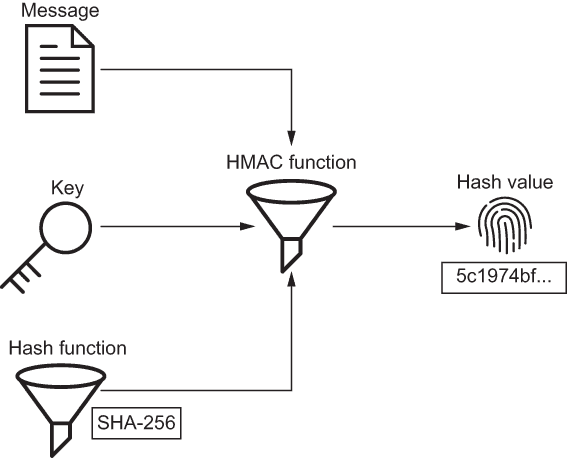

# 第三章：密钥生成

本章涵盖

+   生成安全密钥

+   使用键控哈希验证数据身份验证

+   使用`hmac`模块进行加密哈希

+   防止时序攻击

在上一章中，您学习了如何使用哈希函数确保数据的完整性。 在本章中，您将学习如何使用键控哈希函数确保数据的身份验证。 我将向您展示如何安全地生成随机数和口令。 在此过程中，您将了解有关`os`、`secrets`、`random`和`hmac`模块的知识。 最后，您将学习如何通过比较长度恒定的时间中的哈希值来抵抗时序攻击。

## 数据身份验证

让我们重新审视上一章中爱丽丝的文件管理系统。 系统在存储每个新文档之前对其进行哈希处理。 要验证文档的完整性，系统会重新对其进行哈希处理，并将新的哈希值与旧的哈希值进行比较。 如果哈希值不匹配，则文档被视为损坏。 如果哈希值匹配，则文档被视为完整。

爱丽丝的系统有效地检测到了意外数据损坏，但并不完美。 网络攻击者玛洛瑞可能会利用爱丽丝。 假设玛洛瑞获得了对爱丽丝文件系统的写入访问权限。 在这个位置，她不仅可以更改文档，还可以将其哈希值替换为更改后的文档的哈希值。 通过替换哈希值，玛洛瑞阻止了爱丽丝检测到文档已被篡改。 因此，爱丽丝的解决方案只能检测意外消息损坏； 它无法检测到有意的消息修改。

如果爱丽丝想要抵抗玛洛瑞，她需要改变系统以验证每个文档的完整性*和来源*。 系统不能只回答“数据是否改变？”的问题。 系统还必须回答“谁创作了这个数据？” 换句话说，系统需要确保数据的完整性和数据的身份验证。

*数据身份验证*，有时也称为*消息身份验证*，确保数据读取者可以验证数据写入者的身份。 此功能需要两个东西：一个密钥和一个键控哈希函数。 在接下来的几节中，我将介绍密钥生成和键控哈希； 爱丽丝将这些工具结合起来以抵抗玛洛瑞。

### 键控哈希

如果要保持秘密，每个密钥都应该难以猜测。 在本节中，我比较和对比了两种类型的密钥：随机数和口令。 您将学习如何生成这两种密钥，以及何时使用其中一种。

随机数

在生成随机数时无需使用第三方库；Python 本身有很多方法可以实现这一点。然而，其中只有一些方法适用于安全目的。Python 程序员传统上使用`os.urandom`函数作为密码安全的随机数源。此函数接受一个整数`size`并返回`size`个随机字节。这些字节来自操作系统。在类 UNIX 系统上，这是`/dev/urandom`；在 Windows 系统上，这是`CryptGenRandom`：

```py
>>> import os
>>> 
>>> os.urandom(16)
b'\x07;`\xa3\xd1=wI\x95\xf2\x08\xde\x19\xd9\x94^'
```

Python 3.6 引入了一个专门用于生成密码安全随机数的显式高级 API，即`secrets`模块。`os.urandom`没有问题，但在本书中，我使用`secrets`模块来生成所有随机数。该模块具有三个方便的用于生成随机数的函数。所有三个函数都接受一个整数并返回一个随机数。随机数可以表示为字节数组、十六进制文本和 URL 安全文本。所有三个函数名称的前缀如下代码所示，为`token_`：

```py
>>> from secrets import token_bytes, token_hex, token_urlsafe
>>> 
>>> token_bytes(16)                                     ❶
b'\x1d\x7f\x12\xadsu\x8a\x95[\xe6\x1b|\xc0\xaeM\x91'    ❶
>>> 
>>> token_hex(16)                                       ❷
'87983b1f3dcc18080f21dc0fd97a65b3'                      ❷
>>> 
>>> token_urlsafe(16)                                   ❸
'Z_HIRhlJBMPh0GYRcbICIg'                                ❸
```

❶ 生成 16 个随机字节

❷ 生成 16 个十六进制文本的随机字节

❸ 生成 16 个 URL 安全文本的随机字节

在计算机上键入以下命令以生成 16 个随机字节。我愿意打赌你得到的数字与我不同：

```py
$ python -c 'import secrets; print(secrets.token_hex(16))'
3d2486d1073fa1dcfde4b3df7989da55
```

第三种获取随机数的方法是使用`random`模块。该模块中的大多数函数不使用安全的随机数源。此模块的文档明确指出“不应用于安全目的”（[`docs .python.org/3/library/random.html`](https://docs.python.org/3/library/random.html)）。`secrets`模块的文档断言“应该优先使用`random`模块中的默认伪随机数生成器”（[`docs.python.org/3/library/secrets.html`](https://docs.python.org/3/library/secrets.html)）。

警告：永远不要将`random`模块用于安全或加密目的。该模块非常适用于统计学，但不适合安全或加密。

密码短语

*密码短语*是一系列随机单词，而不是一系列随机数字。列表 3.1 使用`secrets`模块从字典文件中随机选择的四个单词生成密码短语。

脚本首先将字典文件加载到内存中。该文件随标准类 UNIX 系统一起发货。其他操作系统的用户从网上下载类似的文件也不成问题（[www.karamasoft.com/UltimateSpell/Dictionary.aspx](https://www.karamasoft.com/UltimateSpell/Dictionary.aspx)）。脚本使用`secrets .choice`函数从字典中随机选择单词。此函数从给定序列返回一个随机项。

列表 3.1 生成一个四个单词的密码短语

```py
from pathlib import Path
import secrets

words = Path('/usr/share/dict/words').read_text().splitlines()    ❶

passphrase = ' '.join(secrets.choice(words) for i in range(4))    ❷

print(passphrase)
```

❶ 将字典文件加载到内存中

❷ 随机选择四个单词

像这样的字典文件是攻击者执行暴力攻击时使用的工具之一。因此，从相同来源构建秘密是非直观的。密码短语的力量在于大小。例如，密码短语`whereat` `isostatic custom` `insupportableness`的长度为 42 字节。根据[www.useapassphrase.com](https://www.useapassphrase.com/)的说法，这个密码短语的破解时间约为 163,274,072,817,384 世纪。对这么长的密钥进行暴力攻击是不可行的。密钥大小很重要。

一个随机数和一个密码短语自然满足秘密的最基本要求：两种密钥类型都难以猜测。随机数和密码短语之间的区别归结为长期人类记忆的局限性。

提示 随机数很难记住，而密码短语很容易记住。这种差异决定了每种密钥类型适用于哪些情景。

当一个人不需要或不应该记住一个秘密超过几分钟时，随机数是有用的。多因素认证（MFA）令牌和临时重置密码值都是随机数的良好应用场景。还记得`secrets.token_bytes`，`secrets.token_hex`和`secrets .token_urlsafe`吗？这个前缀是对这些函数应该用于什么的提示。

当一个人需要长时间记住一个秘密时，密码短语是有用的。网站的登录凭据或安全外壳（SSH）会话都是密码短语的良好应用场景。不幸的是，大多数互联网用户并没有使用密码短语。大多数公共网站不鼓励使用密码短语。

重要的是要理解，随机数和密码短语不仅在正确应用时解决问题；当它们被错误应用时，它们会产生新问题。想象一下以下两种情况，一个人必须记住一个随机数。首先，随机数被遗忘了，它所保护的信息变得无法访问。其次，随机数被手写到系统管理员桌上的一张纸上，这样它就不太可能保密了。

想象一下以下情景，在这种情景中，密码短语用于短期秘密。假设您收到一个包含密码重置链接或密码重置代码的密码短语。如果一个恶意旁观者看到它在您的屏幕上，他们更有可能记住这个密钥吗？作为密码短语，这个密钥不太可能保密。

注意 为了简单起见，本书中的许多示例都是在 Python 源代码中显示的密钥。然而，在生产系统中，每个密钥都应该安全地存储在密钥管理服务中，而不是您的代码库中。亚马逊的 AWS 密钥管理服务（[`aws.amazon.com/kms/`](https://aws.amazon.com/kms/)）和谷歌的云密钥管理服务（[`cloud.google.com/security-key-management`](https://cloud.google.com/security-key-management)）都是良好的密钥管理服务的示例。

你现在知道如何安全地生成一个密钥。你知道何时使用随机数，何时使用密码。这两种技能与本书的许多部分相关，从下一节开始。

### 3.1.2 带密钥的哈希

一些哈希函数接受一个可选的密钥。如图 3.1 所示，密钥是哈希函数的一个输入，就像消息一样。与普通哈希函数一样，带密钥哈希函数的输出是一个哈希值。


图 3.1 带密钥哈希函数除消息外还接受一个密钥。

哈希值对密钥值敏感。使用不同密钥的哈希函数会产生相同消息的不同哈希值。使用相同密钥的哈希函数会产生相同消息的匹配哈希值。下面的代码演示了带 BLAKE2 的带密钥哈希，BLAKE2 是一种可选密钥的哈希函数：

```py
>>> from hashlib import blake2b
>>> 
>>> m = b'same message'
>>> x = b'key x'                                               ❶
>>> y = b'key y'                                               ❷
>>> 
>>> blake2b(m, key=x).digest() == blake2b(m, key=x).digest()   ❸
True                                                           ❸
>>> blake2b(m, key=x).digest() == blake2b(m, key=y).digest()   ❹
False                                                          ❹
```

❶ 第一个密钥

❷ 第二密钥

❸ 相同密钥，相同哈希值

❹ 不同密钥，不同哈希值

Alice 在她的文档管理系统上工作，可以通过带密钥的哈希添加一层对抗 Mallory 的防御。带密钥的哈希允许 Alice 使用只有她能产生的哈希值存储每个文档。Mallory 不能再擅自修改文档并重新计算哈希值了。没有密钥，Mallory 在验证修改后的文档时无法产生与 Alice 相同的哈希值。因此，Alice 的代码，如下所示，可以抵抗意外数据损坏和恶意数据修改。

列表 3.2 Alice 抵抗意外和恶意数据修改

```py
import hashlib
from pathlib import Path

def store(path, data, key):
    data_path = Path(path)
    hash_path = data_path.with_suffix('.hash')

    hash_value = hashlib.blake2b(data, key=key).hexdigest()     ❶

    with data_path.open(mode='x'), hash_path.open(mode='x'):    ❷
        data_path.write_bytes(data)                             ❷
        hash_path.write_text(hash_value)                        ❷

def is_modified(path, key):
    data_path = Path(path)
    hash_path = data_path.with_suffix('.hash')

    data = data_path.read_bytes()                               ❸
    original_hash_value = hash_path.read_text()                 ❸

    hash_value = hashlib.blake2b(data, key=key).hexdigest()     ❹

    return original_hash_value != hash_value                    ❺
```

❶ 使用给定的密钥对文档进行哈希

❷ 将文档和哈希值写入单独的文件

❸ 从存储中读取文档和哈希值

❹ 使用给定的密钥重新计算新的哈希值

❺ 将重新计算的哈希值与从磁盘读取的哈希值进行比较

大多数哈希函数都不是带密钥的哈希函数。普通哈希函数，如 SHA-256，并不原生支持像 BLAKE2 那样的密钥。这启发了一群非常聪明的人来开发基于哈希的消息认证码（HMAC）函数。下一节将探讨 HMAC 函数。

## 3.2 HMAC 函数

*HMAC* *函数* 是一种通用方法，可以像使用带密钥的哈希函数一样使用任何普通哈希函数。HMAC 函数接受三个输入：消息、密钥和一个普通的密码哈希函数（图 3.2）。没错，你没看错：HMAC 函数的第三个输入是另一个函数。HMAC 函数将所有繁重的工作都包装并委托给传递给它的函数。HMAC 函数的输出是——你猜对了——基于哈希的消息认证码（MAC）。MAC 实际上只是一种特殊类型的哈希值。为了简单起见，在本书中，我使用 *哈希值* 一词来代替 *MAC*。



图 3.2 HMAC 函数接受三个输入：消息、密钥和哈希函数。

为自己着想，务必将 HMAC 函数牢记于心。HMAC 函数是本书后面提出的许多挑战的解决方案。当我讨论加密、会话管理、用户注册和密码重置流程时，这个主题将再次出现。

Python 对 HMAC 的回答是`hmac`模块。以下代码使用消息、密钥和 SHA-256 初始化了一个 HMAC 函数。通过将密钥和哈希函数构造函数引用传递给`hmac.new`函数来初始化 HMAC 函数。`digestmod`关键字参数指定了底层哈希函数。`hashlib`模块中对哈希函数构造函数的任何引用都是`digestmod`的可接受参数：

```py
>>> import hashlib
>>> import hmac
>>> 
>>> hmac_sha256 = hmac.new(
...     b'key', msg=b'message', digestmod=hashlib.sha256)
```

警告 `digestmod` kwarg 在 Python 3.8 发布时从可选变为必需。您应始终明确指定`digestmod` kwarg，以确保您的代码在不同版本的 Python 上顺利运行。

新的 HMAC 函数实例反映了它包装的哈希函数实例的行为。这里显示的`digest`和`hexdigest`方法，以及`digest_size`属性，现在应该看起来很熟悉：

```py
>>> hmac_sha256.digest()                                             ❶
b"n\x9e\xf2\x9bu\xff\xfcz\xba\xe5'\xd5\x8f\xda\xdb/\xe4.r\x19\x01\x19v\x91
sC\x06_X\xedJ"
>>> hmac_sha256.hexdigest()                                          ❷
'6e9ef29b75fffc5b7abae527d58fdadb2fe42e7219011976917343065f58ed4a'
>>> hmac_sha256.digest_size                                          ❸
32
```

❶ 以字节形式返回哈希值

❷ 以十六进制文本返回哈希值

❸ 返回哈希值大小

HMAC 函数的名称是基础哈希函数的衍生物。例如，您可以将包装 SHA-256 的 HMAC 函数称为 HMAC-SHA256：

```py
>>> hmac_sha256.name
'hmac-sha256'
```

按设计，HMAC 函数通常用于消息认证。*HMAC*的*M*和*A*字面上代表*消息认证*。有时，就像 Alice 的文档管理系统一样，消息的读者和消息的编写者是同一个实体。其他时候，读者和编写者是不同的实体。下一节将涵盖这种用例。

### 3.2.1 各方之间的数据认证

想象一下，Alice 的文档管理系统现在必须从 Bob 那里接收文档。Alice 必须确保每条消息在传输过程中没有被 Mallory 修改。Alice 和 Bob 就协议达成一致：

1.  Alice 和 Bob 共享一个秘密密钥。

1.  Bob 使用他的密钥副本和 HMAC 函数对文档进行哈希处理。

1.  Bob 将文档和哈希值发送给 Alice。

1.  Alice 使用她的密钥副本和 HMAC 函数对文档进行哈希处理。

1.  Alice 将她的哈希值与 Bob 的哈希值进行比较。

图 3.3 说明了这个协议。如果接收到的哈希值与重新计算的哈希值匹配，Alice 可以得出两个结论：

+   消息是由具有相同密钥的人发送的，据推测是 Bob。

+   Mallory 无法在传输过程中修改消息。

![CH03_F03_Byrne

图 3.3 Alice 使用共享密钥和 HMAC 函数验证 Bob 的身份。

Bob 在发送给 Alice 之前使用 HMAC-SHA256 对他的消息进行哈希处理的协议的实现，如下列表所示。

列表 3.3 Bob 在发送消息之前使用 HMAC 函数

```py
import hashlib
import hmac
import json

hmac_sha256 = hmac.new(b'shared_key', digestmod=hashlib.sha256)   ❶
message = b'from Bob to Alice'                                    ❶
hmac_sha256.update(message)                                       ❶
hash_value = hmac_sha256.hexdigest()                              ❶

authenticated_msg = {                                             ❷
   'message': list(message),                                      ❷
   'hash_value': hash_value, }                                    ❷
outbound_msg_to_alice = json.dumps(authenticated_msg)             ❷
```

❶ Bob 对文档进行哈希处理。

❷ 哈希值随文档一起传输

Alice 的协议实现，下图所示，使用 HMAC-SHA256 对接收到的文档进行哈希处理。如果两个 MAC 值相同，则消息被视为经过身份验证。

列表 3.4 Alice 在接收到 Bob 的消息后使用 HMAC 函数。

```py
import hashlib
import hmac
import json

authenticated_msg = json.loads(inbound_msg_from_bob)
message = bytes(authenticated_msg['message'])

hmac_sha256 = hmac.new(b'shared_key', digestmod=hashlib.sha256)    ❶
hmac_sha256.update(message)                                        ❶
hash_value = hmac_sha256.hexdigest()                               ❶

if hash_value == authenticated_msg['hash_value']:                  ❷
    print('trust message')
    ...
```

❶ Alice 计算自己的哈希值。

❷ Alice 比较两个哈希值。

作为一个中间人，Mallory 无法欺骗 Alice 接受已经修改的消息。由于无法获取 Alice 和 Bob 共享的密钥，Mallory 无法为给定消息生成与他们相同的哈希值。如果 Mallory 在传输过程中修改了消息或哈希值，Alice 收到的哈希值将与 Alice 计算的哈希值不同。

看一下列表 3.4 中代码的最后几行。注意 Alice 使用 `==` 运算符来比较哈希值。这个运算符，信不信由你，使 Alice 在另一个全新的方式上容易受到 Mallory 的攻击。接下来的部分将解释攻击者如何像 Mallory 发动时间攻击。

## 3.3 时间攻击

数据完整性和数据验证都归结为哈希值比较。虽然比较两个字符串可能看起来很简单，但实际上有一种不安全的方法。`==` 运算符一旦发现两个操作数之间的第一个差异，就会求值为 False。平均而言，`==` 必须扫描并比较所有哈希值字符的一半。至少，它可能只需要比较每个哈希值的第一个字符。最多，当两个字符串匹配时，它可能需要比较两个哈希值的所有字符。更重要的是，如果两个哈希值共享一个公共前缀，`==` 将花费更长的时间来比较两个哈希值。你能发现这个漏洞吗？

Mallory 通过创建一个她希望 Alice 接受的文档来开始新的攻击，使其看起来像是来自 Bob。没有密钥，Mallory 不能立即确定 Alice 将对文档进行哈希的哈希值，但她知道哈希值将是 64 个字符长。她还知道哈希值是十六进制文本，因此每个字符有 16 个可能的值。

攻击的下一步是确定或破解 64 个哈希值字符中的第一个。对于该字符可以是的所有 16 个可能值，Mallory 制造一个以该值开头的哈希值。对于每个制造的哈希值，Mallory 将其与恶意文档一起发送给 Alice。她重复这个过程，测量并记录响应时间。经过大量响应后，Mallory 最终能够通过观察与每个十六进制值相关联的平均响应时间来确定 64 个哈希值字符的第一个。匹配的十六进制值的平均响应时间将略高于其他值。图 3.4 描述了 Mallory 如何破解第一个字符。


图 3.4 Mallory 在观察到 b 的略高平均响应时间后破解哈希值的第一个字符。

Mallory 通过重复这个过程来完成攻击，对剩下的 63 个字符中的 64 个字符进行操作，此时她就知道了整个哈希值。这是一个 *时序攻击* 的例子。这种攻击是通过从系统执行时间中获取未经授权的信息来执行的。攻击者通过测量系统执行操作所需的时间来获得关于私有信息的提示。在这个例子中，操作是字符串比较。

安全系统在比较哈希值时使用长度恒定的时间，故意牺牲了一小部分性能，以防止时序攻击漏洞。`hmac` 模块包含一个名为 `compare_digest` 的长度恒定时间比较函数。此函数具有与 `==` 操作符相同的功能结果，但时间复杂度不同。`compare_digest` 函数在检测到两个哈希值之间有差异时不会提前返回。它总是在返回之前比较所有字符。平均情况、最快情况和最慢情况都是相同的。这可以防止时序攻击，攻击者可以确定一个哈希值的值，如果他们可以控制另一个哈希值：

```py
>>> from hmac import compare_digest
>>> 
>>> compare_digest('alice', 'mallory')    ❶
False                                     ❶
>>> compare_digest('alice', 'alice')      ❷
True                                      ❷
```

❶ 不同的参数，相同的运行时间

❷ 相同的参数，相同的运行时间

始终使用 `compare_digest` 来比较哈希值。为了谨慎起见，即使你正在编写的代码只使用哈希值来验证数据完整性，也要使用 `compare_digest`。这个函数在本书的许多示例中都有使用，包括前一节的示例。`compare_digest` 的参数可以是字符串或字节。

时序攻击是一种特定类型的侧信道攻击。*侧信道攻击* 用于通过测量任何物理侧信道来推导出未经授权的信息。时间、声音、功耗、电磁辐射、无线电波和热量都是侧信道。认真对待这些攻击，因为它们不仅仅是理论上的。侧信道攻击已被用于破解加密密钥、伪造数字签名和获取未经授权的信息。

## 摘要

+   通过密钥散列确保数据认证。

+   如果一个人需要记住一个密钥，可以使用一个口令作为密钥。

+   如果人类不需要记住一个密钥，可以使用一个随机数作为密钥。

+   HMAC 函数是你用于通用密钥散列的最佳选择。

+   Python 本身支持具有 `hmac` 模块的 HMAC 函数。

+   通过在长度恒定的时间内比较哈希值来抵御时序攻击。
