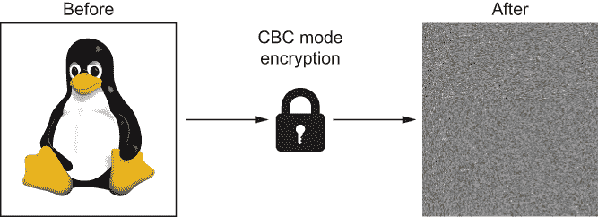

# 4 对称加密

本章涵盖内容

+   使用加密确保机密性

+   介绍 cryptography 包

+   选择对称加密算法

+   旋转加密密钥

在本章中，我将向你介绍`cryptography`包。你将学习如何使用这个包的加密 API 来确保机密性。前几章的键授权哈希和数据认证也会出现。在此过程中，你将学习有关密钥旋转的知识。最后，我将向你展示如何区分安全和不安全的对称分组密码。

## 4.1 什么是加密？

加密始于明文。*明文*是可以轻易理解的信息。《葛底斯堡演说》、一张猫的图片和一个 Python 包都是潜在的明文示例。*加密*是将明文混淆以隐藏信息不被未经授权的人看到。加密后的输出称为*密文*。

加密的逆过程，将密文转换回明文，称为*解密*。用于加密和解密数据的算法称为*密码*。每个密码都需要一个*密钥*。密钥旨在成为授权访问加密信息的各方之间的秘密（图 4.1）。


图 4.1 明文是加密的人类可读输入和解密的输出；密文是加密的机器可读输出和解密的输入。

加密确保机密性。机密性是安全系统设计的一个原子构建块，就像前几章中的数据完整性和数据认证一样。与其他构建块不同，*机密性*没有复杂的定义；它是隐私的保证。在本书中，我将机密性分为两种隐私形式：

+   个人隐私

+   群体隐私

举个例子，假设爱丽丝想要写和读取敏感数据，并且没有打算让其他人阅读。爱丽丝可以通过加密她写的内容和解密她读的内容来保证个人隐私。这种隐私形式是对第一章讨论的*静态和传输中的加密*的补充。

或者，假设爱丽丝想要与鲍勃交换敏感数据。爱丽丝和鲍勃可以通过加密他们发送的内容和解密他们接收的内容来保证群体隐私。这种隐私形式是对*静态和传输中的加密*的补充。

在这一章中，你将学习如何使用 Python 和`cryptography`包实现静态加密。要安装这个包，我们必须首先安装一个安全的包管理器。

### 4.1.1 包管理

在本书中，我使用 Pipenv 进行包管理。我选择这个包管理器是因为它配备了许多安全功能。其中一些功能在第十三章中介绍。

注意 有许多 Python 包管理器，您不必使用与我相同的包管理器来运行本书中的示例。您可以自由选择使用 `pip` 和 `venv` 等工具跟随，但您将无法利用 Pipenv 提供的多个安全功能。

要安装 Pipenv，请根据您的操作系统选择以下命令之一。不建议使用 Homebrew（macOS）或 LinuxBrew（Linux）安装 Pipenv。

```py
$ sudo apt install pipenv    ❶
$ sudo dnf install pipenv    ❷
$ pkg install py36-pipenv    ❸
$ pip install --user pipenv  ❹
```

❶ 在 Debian Buster+ 上

❷ 在 Fedora 上

❸ 在 FreeBSD 上

❹ 在所有其他操作系统上

接下来，运行以下命令。此命令在当前目录中创建两个文件，Pipfile 和 Pipfile.lock。Pipenv 使用这些文件来管理您的项目依赖项：

```py
$ pipenv install
```

除了 Pipfiles，上一个命令还创建了一个*虚拟环境*。这是一个针对 Python 项目的隔离、自包含的环境。每个虚拟环境都有自己的 Python 解释器、库和脚本。通过为每个 Python 项目提供自己的虚拟环境，可以防止它们相互干扰。运行以下命令以激活您的新虚拟环境：

```py
$ pipenv shell
```

警告 为自己做个好事，并在您的虚拟环境 shell 中运行本书中的每个命令。这确保您编写的代码能够找到正确的依赖关系。它还确保您安装的依赖关系不会与其他本地 Python 项目发生冲突。

与普通的 Python 项目一样，您应该在虚拟环境中运行本书中的命令。在下一节中，您将在此环境中安装许多依赖项的第一个，即 `cryptography` 包。作为 Python 程序员，这个包是您唯一需要的加密库。

## 4.2 `cryptography` 包

与其他一些编程语言不同，Python 没有原生的加密 API。少数开源框架占据了这一领域。最受欢迎的 Python 加密包是 `cryptography` 和 `pycryptodome`。在本书中，我专门使用 `cryptography` 包。我更喜欢这个包，因为它有一个更安全的 API。在本节中，我将介绍这个 API 的最重要部分。

使用以下命令将 `cryptography` 包安装到您的虚拟环境中：

```py
$ pipenv install cryptography
```

`cryptography` 包的默认后端是 OpenSSL。这个开源库包含了网络安全协议和通用加密函数的实现。这个库主要用 C 语言编写。OpenSSL 被许多其他开源库所包装，比如主要编程语言中的 `cryptography` 包。

`cryptography` 包的作者将 API 分为两个级别：

+   危险材料层，一个复杂的低级 API

+   配方层，一个简单的高级 API

### 4.2.1 危险材料层

位于`cryptography.hazmat`之下的复杂低级 API 被称为*危险材料层*。在生产系统中使用这个 API 之前三思。危险材料层的文档([`cryptography.io/en/latest/hazmat/primitives/`](https://cryptography.io/en/latest/hazmat/primitives/))中写道：“只有当你百分之百确定自己知道在做什么时才应该使用它，因为这个模块充满了地雷、龙和带激光枪的恐龙。” 安全地使用这个 API 需要对加密学有深入的了解。一个微小的错误可能使系统变得脆弱。

危险材料层的有效使用案例寥寥无几。例如：

+   你可能需要这个 API 来加密文件，文件太大无法放入内存。

+   你可能被迫使用一种罕见的加密算法处理数据。

+   你可能正在阅读一本使用这个 API 作为教学目的的书。

### 4.2.2 Recipes layer

简单的高级 API 被称为*recipes layer*。`cryptography`包的文档([`cryptography.io/en/latest/`](https://cryptography.io/en/latest/))中写道：“我们建议尽可能使用 recipes layer，并仅在必要时回退到 hazmat layer。” 这个 API 将满足大多数 Python 程序员的加密需求。

recipes layer 是一个称为*fernet*的对称加密方法的实现。这个规范定义了一种旨在以可互操作的方式抵抗篡改的加密协议。这个协议由一个类`Fernet`封装，在`cryptography.fernet`之下。

`Fernet`类被设计为加密数据的通用工具。`Fernet.generate_key`方法生成 32 个随机字节。`Fernet`的 init 方法接受这个密钥，如下所示：

```py
>>> from cryptography.fernet import Fernet     ❶
>>> 
>>> key = Fernet.generate_key()
>>> fernet = Fernet(key)
```

❶ 在`cryptography.fernet`之下是简单的高级 API。

在内部，`Fernet`将密钥参数分成两个 128 位密钥。一个用于加密，另一个用于数据认证。（你在上一章学过数据认证。）

`Fernet.encrypt`方法不仅加密明文，还使用 HMAC-SHA256 对密文进行哈希。换句话说，密文变成了一条消息。密文和哈希值一起作为一个*fernet token*对象返回，如下所示：

```py
>>> token = fernet.encrypt(b'plaintext')    ❶
```

❶ 加密明文，哈希密文

图 4.2 展示了如何使用密文和哈希值构建一个 fernet token。为简单起见，加密和有键哈希的密钥被省略。


图 4.2 Fernet 不仅加密明文，还对密文进行了哈希。

`Fernet.decrypt` 方法是 `Fernet.encrypt` 的反方法。该方法从 Fernet 令牌中提取密文并使用 HMAC-SHA256 进行身份验证。如果新的哈希值与 Fernet 令牌中的旧哈希值不匹配，则会引发 `InvalidToken` 异常。如果哈希值匹配，则解密并返回密文：

```py
>>> fernet.decrypt(token)     ❶
b'plaintext'
```

❶ 身份验证和解密密文

图 4.3 描述了解密方法如何解构 Fernet 令牌。与上一图一样，解密和数据认证的密钥被省略了。


图 4.3 Fernet 不仅对密文进行解密，还对其进行身份验证。

你可能想知道为什么 `Fernet` 确保密文身份验证而不只是保密性。保密性的价值直到与数据认证结合才能完全实现。例如，假设 Alice 打算实现个人隐私。她分别加密和解密她写的和读的内容。通过隐藏她的密钥，Alice 知道她是唯一能解密密文的人，但这本身并不能保证她创建了密文。通过对密文进行身份验证，Alice 增加了一层防御，防止 Mallory 修改密文。

假设 Alice 和 Bob 想要实现群体隐私。双方分别加密和解密他们发送和接收的内容。通过隐藏密钥，Alice 和 Bob 知道 Eve 无法窃听他们的对话，但仅凭这一点不能保证 Alice 实际上收到了 Bob 发送的内容，反之亦然。只有数据认证才能为 Alice 和 Bob 提供这一保证。

Fernet 令牌是一项安全功能。每个 Fernet 令牌都是不透明的字节数组；没有正式的 FernetToken 类来存储密文和哈希值的属性。如果你真的想要，你可以提取这些值，但这会变得混乱。Fernet 令牌是这样设计的，以阻止你尝试做任何容易出错的事情，比如使用自定义代码解密或身份验证，或在身份验证之前进行解密。该 API 提倡“不要自己编写加密算法”，这是第一章介绍的最佳实践。`Fernet` 故意设计成易于安全使用而难于不安全使用。

一个 `Fernet` 对象可以解密由具有相同密钥的 `Fernet` 对象创建的任何 Fernet 令牌。你可以丢弃一个 `Fernet` 实例，但密钥必须被保存和保护。如果密钥丢失，明文将无法恢复。在下一节中，你将学习如何使用 `Fernet` 的配套工具 `MultiFernet` 轮换密钥。

### 4.2.3 密钥轮换

*密钥轮换* 用于将一个密钥替换为另一个密钥。为了废弃一个密钥，必须用它生成的所有密文进行解密，并使用下一个密钥重新加密。密钥可能因多种原因而需要进行轮换。一旦密钥受到损害，必须立即废弃。有时候当一个能够访问密钥的人员离开组织时，必须对密钥进行轮换。定期进行密钥轮换可以限制密钥受损的损害，但无法降低密钥受损的概率。

`Fernet` 结合 `MultiFernet` 类实现密钥轮换。假设要用新密钥替换旧密钥。使用这两个密钥实例化单独的 `Fernet` 实例。使用这两个 `Fernet` 实例实例化单个 `MultiFernet` 实例。`MultiFernet` 的 rotate 方法将使用旧密钥解密所有使用旧密钥加密的内容，并使用新密钥重新加密。一旦所有令牌都使用新密钥重新加密，就可以安全地废弃旧密钥。以下清单演示了使用 `MultiFernet` 进行密钥轮换。

清单 4.1 使用 MultiFernet 进行密钥轮换

```py
from cryptography.fernet import Fernet, MultiFernet

old_key = read_key_from_somewhere_safe()
old_fernet = Fernet(old_key)

new_key = Fernet.generate_key()
new_fernet = Fernet(new_key)

multi_fernet = MultiFernet([new_fernet, old_fernet])        ❶
old_tokens = read_tokens_from_somewhere_safe()              ❶
new_tokens = [multi_fernet.rotate(t) for t in old_tokens]   ❶

replace_old_tokens(new_tokens)                              ❷
replace_old_key_with_new_key(new_key)                       ❷
del old_key                                                 ❷

for new_token in new_tokens:                                ❸
    plaintext = new_fernet.decrypt(new_token)               ❸
```

❶ 使用旧密钥解密，使用新密钥加密

❷ 弃用旧密钥，启用新密钥

❸ 需要新密钥才能解密新密文

密钥的角色决定了加密算法所属的类别。下一节将介绍 `Fernet` 所属的类别。

## 4.3 对称加密

如果一个加密算法使用相同的密钥进行加密和解密，就像 `Fernet` 封装的那种，我们称之为 *对称*。对称加密算法进一步分为两类：分组密码和流密码。

### 4.3.1 分组密码

*分组密码* 将明文加密为一系列固定长度的块。每个明文块被加密为一个密文块。块大小取决于加密算法。较大的块大小通常被认为更安全。图 4.4 演示了将三个明文块加密为三个密文块。


图 4.4 一个分组密码接受 N 个明文分组，并产生 N 个密文分组。

有许多种对称加密算法。对于程序员来说，面对这些选择可能会感到不知所措。哪些算法是安全的？哪些算法是快速的？这些问题的答案实际上相当简单。当你阅读本节时，你将明白其中的道理。以下是几个常见的分组密码的例子：

+   三重 DES

+   Blowfish

+   Twofish

+   高级加密标准

三重 DES

*三重 DES* (*3DES*) 是数据加密标准 (DES) 的一种改进。顾名思义，这个算法在内部使用 DES 进行三次加密，因此被认为速度较慢。3DES 使用 64 位块大小和 56、112 或 168 位的密钥大小。

警告 3DES 已被 NIST 和 OpenSSL 废弃。不要使用 3DES（有关更多信息，请访问 [`mng.bz/pJoG`](http://mng.bz/pJoG)）。

Blowfish

*Blowfish* 是由 Bruce Schneier 在 1990 年代初开发的。该算法使用 64 位块大小和 32 到 448 位的可变密钥大小。Blowfish 作为第一个主要没有专利的免费加密算法而获得了普及。

警告 Blowfish 在 2016 年失去了声望，因为它的分组大小使其容易受到一种名为 SWEET32 的攻击的影响。不要使用 Blowfish。即使 Blowfish 的创造者也建议使用 Twofish 替代。

Twofish

*Twofish* 在 1990 年代末作为 Blowfish 的后继者开发。该算法使用 128 位块大小和 128、192 或 256 位的密钥大小。Twofish 受到密码学家的尊重，但没有享受到其前身的流行。在 2000 年，Twofish 成为了一个为期三年的竞赛，被称为高级加密标准过程的决赛选手。你可以安全地使用 Twofish，但为什么不做每个人都做的事情，使用赢得这个比赛的算法呢？

高级加密标准

*Rijndael* 是一个由 NIST 在 2001 年标准化的加密算法，它在高级加密标准过程中击败了十多种其他密码。你可能从来没有听说过这个算法，尽管你经常使用它。这是因为 Rijndael 在被高级加密标准过程选中后采用了高级加密标准的名称。高级加密标准不仅仅是一个名称；它是一个竞赛称号。

*高级加密标准* (*AES*) 是典型应用程序员需要了解的唯一对称加密算法。该算法使用 128 位块大小和 128、192 或 256 位的密钥大小。它是对称加密的典范。AES 的安全记录非常强大和广泛。AES 加密的应用包括网络协议如 HTTPS、压缩、文件系统、哈希和虚拟私人网络 (VPN)。还有哪些加密算法有自己的硬件指令？即使你试过，也无法建立一个不使用 AES 的系统。

如果你到现在还没有猜到，`Fernet` 在底层使用的是 AES。AES 应该是程序员在一般情况下选择的第一个通用加密方法。保持安全，不要试图聪明，忘记其他的分组密码。下一节将介绍流密码。

### 4.3.2 流密码

*流* *密码* 不会按块处理明文。相反，明文被处理为一个个独立的字节流；一个字节进，一个字节出。顾名思义，流密码擅长加密连续或未知量的数据。这些密码通常被网络协议使用。

当明文非常小的时候，流密码比块密码有优势。例如，假设您正在使用块密码加密数据。您想加密 120 位的明文，但块密码将明文加密为 128 位块。块密码将使用填充方案来补偿 8 位的差异。通过使用 8 位填充，块密码可以操作，就好像明文位数是块大小的倍数一样。现在考虑当您需要加密仅 8 位的明文时会发生什么。块密码必须使用 120 位的填充。不幸的是，这意味着超过 90%的密文可以归因于填充。流密码避免了这个问题。它们不需要填充方案，因为它们不将明文处理为块。

RC4 和 ChaCha 都是流密码的示例。RC4 在网络协议中广泛使用，直到发现了半打漏洞。这种密码已被放弃，不应再使用。另一方面，ChaCha 被认为是安全的，而且无疑是快速的。您将在第六章中看到 ChaCha 的出现，那里我将介绍 TLS，一个安全的网络协议。

尽管流密码速度快且高效，但比块密码需求少。不幸的是，流密码的密文通常比块密码的密文更容易被篡改。在某些模式下，块密码也可以模拟流密码。下一节介绍了加密模式。

### 4.3.3 加密模式

对称加密算法在不同模式下运行。每种模式都有优点和缺点。当应用程序开发人员选择对称加密策略时，讨论通常不围绕块密码与流密码，或者使用哪种加密算法展开。相反，讨论围绕在哪种加密模式下运行 AES 展开。

电子密码本模式

*电子密码本*（*ECB*）*模式*是最简单的模式。以下代码演示了如何在 ECB 模式下使用 AES 加密数据。使用`cryptography`包的低级 API，此示例创建了一个具有 128 位密钥的加密密码。明文通过`update`方法输入到加密密码中。为了简单起见，明文是一个未填充的单个文本块：

```py
>>> from cryptography.hazmat.backends import default_backend
>>> from cryptography.hazmat.primitives.ciphers import (
...     Cipher, algorithms, modes)
>>> 
>>> key = b'key must be 128, 196 or 256 bits'
>>> 
>>> cipher = Cipher(
...     algorithms.AES(key),                             ❶
...     modes.ECB(),                                     ❶
...     backend=default_backend())                       ❷
>>> encryptor = cipher.encryptor()
>>> 
>>> plaintext = b'block size = 128'                      ❸
>>> encryptor.update(plaintext) + encryptor.finalize()
b'G\xf2\xe2J]a;\x0e\xc5\xd6\x1057D\xa9\x88'              ❹
```

❶ 使用 AES 在 ECB 模式下

❷ 使用 OpenSSL

❸ 一段纯文本块

❹ 一段密文块

ECB 模式异常脆弱。具有讽刺意味的是，ECB 模式的弱点使其成为教学的强大选择。ECB 模式不安全，因为它将相同的明文块加密为相同的密文块。这意味着 ECB 模式易于理解，但攻击者也很容易从密文中的模式推断出明文中的模式。

图 4.5 展示了这种弱点的一个经典示例。您在左侧看到一张普通的图像，右侧是它的实际加密版本。1


图 4.5 在使用 ECB 模式加密时，明文中的模式会在密文中产生相应的模式。

ECB 模式不仅会揭示明文中的模式；它还会揭示明文之间的模式。例如，假设 Alice 需要加密一组明文。她错误地认为在 ECB 模式下加密它们是安全的，因为每个明文中都没有模式。然后 Mallory 未经授权地获得了密文。在分析密文时，Mallory 发现有些密文是相同的；然后她得出结论相应的明文也是相同的。为什么？Mallory，不像 Alice，知道 ECB 模式会将匹配的明文加密为匹配的密文。

警告：永远不要在生产系统中使用 ECB 模式加密数据。即使您使用像 AES 这样的安全加密算法，也不能安全使用 ECB 模式。

如果攻击者未经授权地获得您的密文，他们不应该能够推断出有关您的明文的任何信息。一个好的加密模式，如下面描述的那样，会混淆明文之间和明文内的模式。

密码块链接模式

*密码块链接*（*CBC*）*模式*通过确保每个块的更改会影响所有后续块的密文，克服了 ECB 模式的一些弱点。正如图 4.6 所示，输入模式不会导致输出模式。2



图 4.6 在使用 CBC 模式加密时，明文中的模式不会在密文中产生相应的模式。

CBC 模式在使用相同密钥加密相同明文时也会产生不同的密文。CBC 模式通过使用*初始化向量*（IV）对明文进行个性化。与明文和密钥一样，IV 是加密密码的输入之一。AES 在 CBC 模式下要求每个 IV 都是不可重复的随机 128 位数字。

以下代码使用 CBC 模式的 AES 加密了两个相同的明文块。两个明文块都由两个相同的块组成，并与唯一的 IV 配对。请注意，两个密文都是唯一的，且都不包含模式：

```py
>>> import secrets
>>> from cryptography.hazmat.backends import default_backend
>>> from cryptography.hazmat.primitives.ciphers import (
...     Cipher, algorithms, modes)
>>> 
>>> key = b'key must be 128, 196 or 256 bits'
>>> 
>>> def encrypt(data):
...     iv = secrets.token_bytes(16)      ❶
...     cipher = Cipher(
...         algorithms.AES(key),          ❷
...         modes.CBC(iv),                ❷
...         backend=default_backend())
...     encryptor = cipher.encryptor()
...     return encryptor.update(data) + encryptor.finalize()
... 
>>> plaintext = b'the same message' * 2   ❸
>>> x = encrypt(plaintext)                ❹
>>> y = encrypt(plaintext)                ❹
>>> 
>>> x[:16] == x[16:]                      ❺
False                                     ❺
>>> x == y                                ❻
False                                     ❻
```

❶ 生成 16 个随机字节

❷ 使用 AES 在 CBC 模式下。

❸ 两个相同的明文块

❹ 加密相同的明文

❺ 密文中没有模式

❻ 密文之间没有模式

IV 在加密和解密时是必需的。与密文和密钥一样，IV 是解密密码的输入之一，必须保存。如果明文丢失，则无法恢复。

`Fernet` 使用 CBC 模式的 AES 加密数据。通过使用`Fernet`，您不必担心生成或保存 IV。`Fernet`会为每个明文自动生成一个合适的 IV。IV 嵌入在 fernet 令牌中，紧邻密文和哈希值。`Fernet`还会在解密密文之前从令牌中提取 IV。

警告：一些程序员不幸地想要隐藏 IV，就像它是一个密钥一样。请记住，IV 必须保存但不是密钥。密钥用于加密一个或多个消息；IV 用于加密一个且仅一个消息。密钥是保密的；IV 通常与密文一起保存，没有混淆。如果攻击者未经授权地访问了密文，请假设他们拥有 IV。没有密钥，攻击者实际上仍然一无所获。

除了 ECB 和 CBC 外，AES 还以许多其他模式运行。其中一种模式，Galois/counter mode（GCM），允许像 AES 这样的块密码模拟流密码。你将在第六章再次见到 GCM。

## 摘要

+   加密确保机密性。

+   `Fernet` 是对称加密和认证数据的安全简便方法。

+   `MultiFernet` 使密钥轮换变得不那么困难。

+   对称加密算法使用相同的密钥进行加密和解密。

+   AES 是对称加密的首选，可能也是最后的选择。

* * *

1. 左侧的图像来自 [`en.wikipedia.org/wiki/ile:Tux.jpg`](https://en.wikipedia.org/wiki/File:Tux.jpg)。该图像归功于 Larry Ewing，lewing@isc.tamu.edu，以及 GIMP。右侧的图像来自 [`en.wikipe dia.org/wiki/File:Tux_ecb.jpg`](https://en.wikipedia.org/wiki/File:Tux_ecb.jpg)。

2. 左侧的图像来自 [`en.wikipedia.org/wiki/File:Tux.jpg`](https://en.wikipedia.org/wiki/File:Tux.jpg)。该图像归功于 Larry Ewing，lewing@isc.tamu.edu，以及 GIMP。右侧的图像来自 [`en.wikipe dia.org/wiki/File:Tux_ecb.jpg`](https://en.wikipedia.org/wiki/File:Tux_ecb.jpg)。
