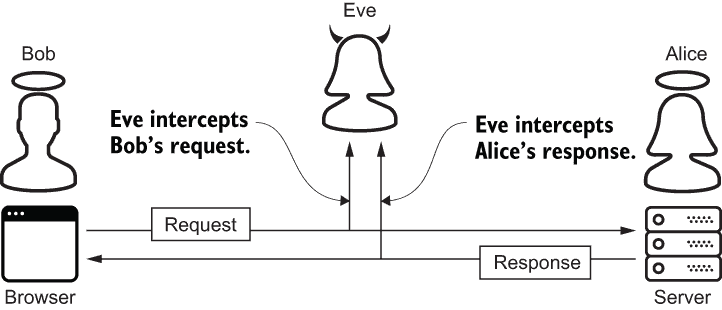
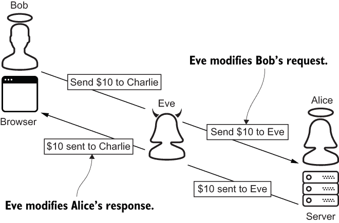
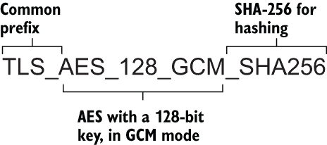
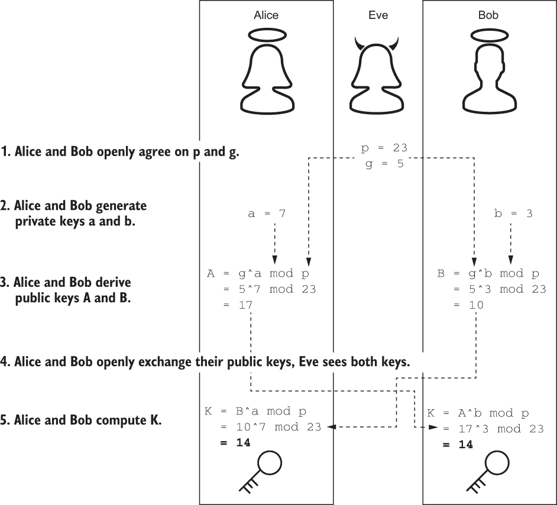
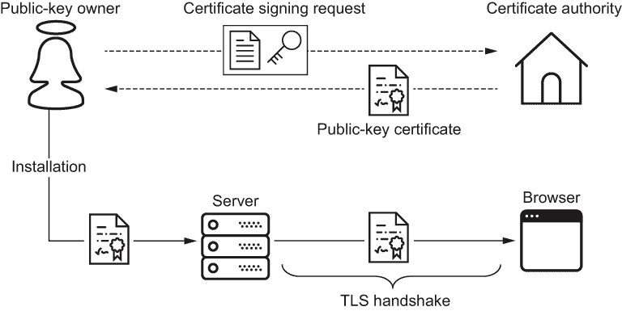
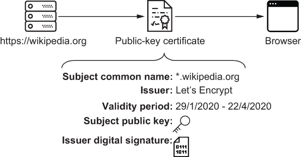
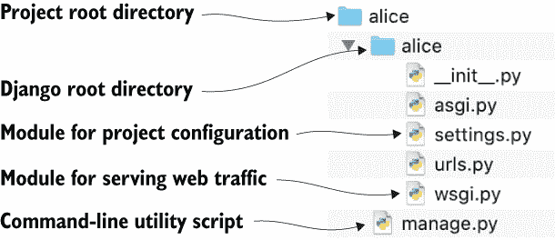
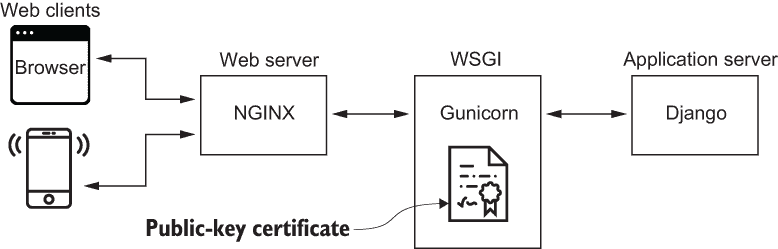

# 第六章：传输层安全性

本章内容包括

+   抵制中间人攻击

+   理解传输层安全握手

+   构建、配置和运行 Django Web 应用程序

+   在使用 Gunicorn 安装公钥证书

+   使用传输层安全保护 HTTP、电子邮件和数据库流量

在之前的章节中，我向你介绍了密码学。你学到了哈希、加密和数字签名等知识。在本章中，你将学习如何使用*传输层安全* (*TLS*)，这是一种普遍的安全网络协议。该协议是数据完整性、数据认证、机密性和不可否认性的应用。

阅读完本章后，你将了解 TLS 握手和公钥证书的工作原理。你还将学会如何生成和配置 Django Web 应用程序。最后，你将学会如何使用 TLS 保护电子邮件和数据库流量。

## 6.1 SSL? TLS? HTTPS?

在我们深入探讨这个主题之前，让我们先确定一些词汇术语。一些程序员将*SSL*、*TLS*和*HTTPS*这些术语用来互换使用，尽管它们的含义不同。

*安全套接字层* (*SSL*) 协议是 TLS 的不安全前身。SSL 的最新版本已经超过 20 年了。随着时间的推移，这个协议发现了许多漏洞。2015 年，IETF 废弃了它 ([`tools.ietf.org/html/rfc7568`](https://tools.ietf.org/html/rfc7568))。TLS 以更好的安全性和性能取代了 SSL。

SSL 已经过时，但是术语*SSL*遗憾地仍然存在。它在方法签名、命令行参数和模块名中保留下来；本书包含了许多例子。API 为了向后兼容性而保留了这个术语。有时，程序员在实际上指的是*TLS*时会提到*SSL*。

*安全超文本传输协议* (*HTTPS*) 简单地说就是 SSL 或 TLS 上的超文本传输协议(HTTP)。HTTP 是一种用于在互联网上传输数据（如网页、图像、视频等）的点对点协议；这在短期内不会改变。

为什么你应该在 TLS 上运行 HTTP？HTTP 是在上世纪 80 年代定义的，当时互联网是一个更小、更安全的地方。从设计上来看，HTTP 不提供任何安全性；对话不是机密的，也没有任何一方经过身份验证。在下一节中，你将了解一类旨在利用 HTTP 限制的攻击。

## 6.2 中间人攻击

*中间人攻击* (*MITM*) 是一种经典攻击。攻击者首先控制两个易受攻击的方之间的位置。这个位置可以是一个网络段或一个中间系统。攻击者可以利用他们的位置发起以下任一形式的中间人攻击：

+   被动中间人攻击

+   主动中间人攻击

假设伊夫，一个窃听者，在未经授权的情况下，获得了鲍勃的无线网络的访问权限后，发动了被动中间人攻击。鲍勃向 bank.alice.com 发送 HTTP 请求，bank.alice.com 向鲍勃发送 HTTP 响应。与此同时，伊夫，未经鲍勃和艾丽斯知情，被动拦截每个请求和响应。这使伊夫能够访问鲍勃的密码和个人信息。图 6.1 说明了被动中间人攻击。

TLS 无法保护鲍勃的无线网络。然而，它可以提供保密性——阻止伊夫以有意义的方式阅读对话。TLS 通过加密鲍勃和艾丽斯之间的对话来实现这一点。



图 6.1 伊夫通过 HTTP 进行被动中间人攻击。

现在假设伊夫在未经授权的情况下获得了位于鲍勃和 bank.alice.com 之间的中间网络设备的访问权限后，发动了主动中间人攻击。伊夫可以监听或甚至修改对话。利用这个位置，伊夫可以欺骗鲍勃和艾丽斯，使他们相信她是另一位参与者。通过欺骗鲍勃认为她是艾丽斯，以及欺骗艾丽斯认为她是鲍勃，伊夫现在可以在他们之间来回传递消息。在此过程中，伊夫修改了对话（图 6.2）。



图 6.2 伊夫通过 HTTP 进行主动中间人攻击。

TLS 无法保护位于鲍勃和艾丽斯之间的网络设备。然而，它可以防止伊夫冒充鲍勃或艾丽斯。TLS 通过认证对话来实现这一点，确保鲍勃正在直接与艾丽斯通信。如果艾丽斯和鲍勃想要安全地通信，他们需要开始使用 TLS 上的 HTTP。下一节将解释 HTTP 客户端和服务器如何建立 TLS 连接。

## 6.3 TLS 握手

TLS 是一种点对点的客户端/服务器协议。每个 TLS 连接都以客户端和服务器之间的握手开始。您可能已经听说过*TLS 握手*。实际上，并不存在一个 TLS 握手；有许多种。例如，TLS 的 1.1、1.2 和 1.3 版本都定义了不同的握手协议。即使在每个 TLS 版本中，握手也会受到客户端和服务器用于通信的算法的影响。此外，握手的许多部分，如服务器身份验证和客户端身份验证，都是可选的。

在本节中，我将介绍最常见的 TLS 握手类型：您的浏览器（客户端）与现代 Web 服务器执行的握手。此握手始终由客户端发起。客户端和服务器将使用 TLS 的 1.3 版本。版本 1.3 更快、更安全——而且，幸运的是，对您和我来说——比版本 1.2 更简单。这次握手的整个目的是执行三项任务：

1.  密码套件协商

1.  密钥交换

1.  服务器身份验证

### 6.3.1 密码套件协商

TLS 是加密和哈希的应用。为了通信，客户端和服务器必须首先就一组称为*密码套件*的算法达成一致。每个密码套件定义了一个加密算法和一个哈希算法。TLS 1.3 规范定义了以下五个密码套件：

+   TLS_AES_128_CCM_8_SHA256

+   TLS_AES_128_CCM_SHA256

+   TLS_AES_128_GCM_SHA256

+   TLS_AES_256_GCM_SHA384

+   TLS_CHACHA20_POLY1305_SHA256

每个密码套件的名称由三个部分组成。第一个部分是一个常见前缀，TLS_。第二部分指定一个加密算法。最后一部分指定一个哈希算法。例如，假设客户端和服务器同意使用密码套件 TLS_AES_128_GCM_SHA256。这意味着双方同意使用 AES 以 128 位密钥在 GCM 模式下，并使用 SHA-256 进行通信。GCM 是一种以速度著称的块密码模式。除了机密性外，它还提供数据认证。图 6.3 解剖了这个密码套件的结构。



图 6.3 TLS 密码套件解剖

这五个密码套件可以简单总结为：加密使用 AES 或 ChaCha20；哈希使用 SHA-256 或 SHA-384。在前几章中，你已经了解了这四种工具。花点时间欣赏一下 TLS 1.3 相对于其前身有多简单。TLS 1.2 定义了 37 个密码套件！

请注意，这五个密码套件都使用对称加密，而不是非对称加密。AES 和 ChaCha20 受邀参加了派对；RSA 没有。TLS 通过对称加密确保机密性，因为它比非对称加密更高效，效率提高了三到四个数量级。在前一章中，你了解到对称加密的计算成本比非对称加密低。

客户端和服务器在加密对话时必须共享不仅仅是相同的密码套件，还必须共享一个密钥。

### 6.3.2 密钥交换

客户端和服务器必须交换一个密钥。这个密钥将与密码套件的加密算法结合使用，以确保机密性。该密钥仅限于当前对话。这样，如果密钥某种方式被泄露，损害仅限于单个对话。

TLS 密钥交换是密钥分发问题的一个例子。（你在前一章中学习过这个问题。）TLS 1.3 通过 Diffie-Hellman 方法解决了这个问题。

Diffie-Hellman 密钥交换

*Diffie-Hellman*（*DH*）*密钥交换*方法允许两个方安全地在不安全的通道上建立共享密钥。这种机制是密钥分发问题的有效解决方案。

在本节中，我使用爱丽丝、鲍勃和伊夫来引导您了解 DH 方法。代表客户端和服务器的爱丽丝和鲍勃将各自生成临时密钥对。爱丽丝和鲍勃将使用他们的密钥对作为最终共享秘密密钥的跳板。在阅读本文时，重要的是不要将中间密钥对与最终共享密钥混淆。以下是 DH 方法的简化版本：

1.  爱丽丝和鲍勃公开同意两个参数。

1.  爱丽丝和鲍勃各自生成一个私钥。

1.  爱丽丝和鲍勃分别从参数和他们的私钥推导出一个公钥。

1.  爱丽丝和鲍勃公开交换公钥。

1.  爱丽丝和鲍勃独立计算一个共享的秘密密钥。

爱丽丝和鲍勃通过公开同意两个数字 p 和 g 开始此协议。这些数字是公开传输的。窃听者伊夫可以看到这两个数字。她不构成威胁。

爱丽丝和鲍勃分别生成私钥 a 和 b。这些数字是秘密的。爱丽丝将她的私钥隐藏起来，不让伊夫和鲍勃知道。鲍勃将他的私钥隐藏起来，不让伊夫和爱丽丝知道。

爱丽丝从 p、g 和她的私钥推导出她的公钥 A。同样，鲍勃从 p、g 和他的私钥推导出他的公钥 B。

爱丽丝和鲍勃交换他们的公钥。这些密钥是公开传输的；它们不是秘密。窃听者伊夫可以看到两个公钥。她仍然不构成威胁。

最后，爱丽丝和鲍勃使用彼此的公钥独立计算出相同的数字 K。爱丽丝和鲍勃丢弃他们的密钥对并保留 K。爱丽丝和鲍勃使用 K 加密他们余下的对话。图 6.4 说明了爱丽丝和鲍勃使用此协议达成共享密钥，即数字 14。



图 6.4 爱丽丝和鲍勃使用 Diffie-Hellman 方法独立计算出一个共享密钥，即数字 14。

在现实世界中，p、私钥和 K 要比这大得多。更大的数字使得即使伊夫窃听了整个对话，也不可能逆向工程私钥或 K。尽管伊夫知道 p、g 和两个公钥，但她唯一的选择是暴力破解。

公钥加密

许多人对握手过程中缺少公钥加密感到惊讶；它甚至不是密码套件的一部分。SSL 和较早版本的 TLS 通常使用公钥加密进行密钥交换。最终，这种解决方案并不具有良好的可扩展性。

在此期间，硬件成本的下降使得暴力破解攻击变得更便宜。为了弥补这一点，人们开始使用更大的密钥对，以保持暴力破解攻击的成本高昂。

更大的密钥对却带来了一个不幸的副作用：Web 服务器花费了不可接受的时间执行非对称加密以进行密钥交换。TLS 1.3 通过明确要求 DH 方法来解决了这个问题。

DH 方法是比使用 RSA 等密码系统产生计算开销的公钥加密更有效的解决方案，它使用模算术而不是分发密钥。这种方法实际上并不是从一方向另一方分发密钥；密钥是由双方独立创建的。公钥加密并没有死；它仍然用于身份验证。

### 6.3.3 服务器身份验证

密码套件协商和密钥交换是保密性的前提条件。但是，如果不验证与您交谈的人的身份，私密对话有何用？TLS 除了提供隐私外，还是一种*身份验证*手段。身份验证是双向的，也是可选的。对于这个握手版本（即你的浏览器和 Web 服务器之间的握手），服务器将由客户端进行验证。

服务器通过向客户端发送*公钥证书*来验证自身，并完成 TLS 握手。证书包含并证明了服务器的公钥的所有权。证书必须由*证书颁发机构*（*CA*）创建和颁发，这是一个致力于数字认证的组织。

公钥所有者通过向 CA 发送*证书签名请求*（*CSR*）申请证书。CSR 包含有关公钥所有者和公钥本身的信息。图 6.5 说明了此过程。虚线箭头表示成功的 CSR，因为 CA 向公钥所有者发放了公钥证书。实线箭头说明了证书安装到服务器上，其中它被提供给浏览器。



图 6.5 一个公钥证书被颁发给一个所有者并安装在一个服务器上。

公钥证书

*公钥证书*在很多方面类似于您的驾驶执照。您通过驾驶执照来识别自己；服务器通过公钥证书来识别自己。您的驾驶执照由政府机构颁发给您；证书由证书颁发机构颁发给密钥所有者。警察在信任您之前会仔细检查您的驾驶执照；浏览器（或任何其他 TLS 客户端）在信任服务器之前会仔细检查证书。您的驾驶执照确认了驾驶技能；证书确认了公钥所有权。您的驾驶执照和证书都有过期日期。

让我们解剖一个您已经使用过的网站维基百科的公钥证书。下一个清单中的 Python 脚本使用`ssl`模块下载维基百科的生产公钥证书。下载的证书是该脚本的输出。

代码清单 6.1 get_server_certificate.py

```py
import ssl

address = ('wikipedia.org', 443)
certificate = ssl.get_server_certificate(address)      # ❶
print(certificate)
```

❶ 下载维基百科的公钥证书

使用以下命令行运行此脚本。这将下载证书并将其写入名为 wikipedia.crt 的文件：

```py
$ python get_server_certificate.py > wikipedia.crt
```

公钥证书的结构由 RFC 5280 描述的安全标准 X.509 定义（[`tools.ietf.org/html/rfc5280`](https://tools.ietf.org/html/rfc5280)）。TLS 参与者使用 X.509 以实现互操作性。服务器可以向任何客户端标识自己，客户端可以验证任何服务器的身份。

X.509 证书的解剖结构由一组常见字段组成。通过从浏览器的角度思考这些字段，您可以更加欣赏 TLS 认证。下面的 `openssl` 命令演示了如何以人类可读格式显示这些字段：

```py
$ openssl x509 -in wikipedia.crt -text -noout | less
```

在浏览器信任服务器之前，它将解析证书并逐个检查每个字段。让我们检查一些更重要的字段：

+   主体

+   颁发者

+   主体的公钥

+   证书有效期

+   证书颁发机构签名

每个证书都像驾驶执照一样标识所有者。证书所有者由“主体”字段指定。 “主体”字段最重要的属性是*通用名称*，它标识了证书允许从中提供服务的域名。

如果浏览器无法将通用名称与请求的 URL 匹配，将拒绝该证书；服务器验证和 TLS 握手将失败。下面的列表以粗体显示了维基百科公钥证书的主体字段。`CN` 属性指定了通用名称。

列表 6.2 Wikipedia.org 的主体字段

```py
...
        Subject: CN=*.wikipedia.org     # ❶
        Subject Public Key Info:
...
```

❶ 证书所有者通用名称

每个证书都标识了颁发者，就像驾驶执照一样。颁发维基百科证书的 CA 是 Let's Encrypt。这家非营利 CA 专门提供免费的自动认证服务。下面的列表以粗体显示了维基百科公钥证书的颁发者字段。

列表 6.3 Wikipedia.org 的证书颁发者

```py
...
    Signature Algorithm: sha256WithRSAEncryption
        Issuer: C=US, O=Let's Encrypt, CN=Let's Encrypt Authority X3    # ❶
        Validity
...
```

❶ 证书颁发者，Let's Encrypt

每个公钥证书中都嵌入了证书所有者的公钥。下一个列表展示了维基百科的公钥；这是一个 256 位的椭圆曲线公钥。你在上一章已经介绍过椭圆曲线密钥对。

列表 6.4 Wikipedia.org 的公钥

```py
...
Subject Public Key Info:
    Public Key Algorithm: id-ecPublicKey                         # ❶
 Public-Key: (256 bit)                                    # ❷
 pub: 
 04:6a:e9:9d:aa:68:8e:18:06:f4:b3:cf:21:89:f2: # ❸
 b3:82:7c:3d:f5:2e:22:e6:86:01:e2:f3:1a:1f:9a: # ❸
 ba:22:91:fd:94:42:82:04:53:33:cc:28:75:b4:33: # ❸
 84:a9:83:ed:81:35:11:77:33:06:b0:ec:c8:cb:fa: # ❸
                a3:51:9c:ad:dc # ❸
...
```

❶ 椭圆曲线公钥

❷ 指定了一个 256 位的密钥

❸ 实际的公钥，已编码

每个证书都有一个有效期，就像驾驶执照一样。如果当前时间不在此时间范围内，浏览器将不信任服务器。下面的列表显示了维基百科的证书具有三个月的有效期，以粗体显示。

列表 6.5 Wikipedia.org 的证书有效期

```py
...
Validity
    Not Before: Jan 29 22:01:08 2020 GMT
    Not After : Apr 22 22:01:08 2020 GMT
...
```

在每个证书的底部都有一个数字签名，由 Signature Algorithm 字段指定。（您在上一章学习了数字签名。）谁签署了什么？在这个例子中，证书颁发机构 Let’s Encrypt 签署了证书所有者的公钥——与证书中嵌入的相同的公钥。下一个清单表明 Let’s Encrypt 通过使用 SHA-256 对其进行哈希并用 RSA 私钥加密哈希值来签署了维基百科的公钥，加粗显示。（您在上一章学习了如何在 Python 中执行此操作。）

清单 6.6 维基百科.org 的证书颁发机构签名

```py
...
Signature Algorithm: sha256WithRSAEncryption                  # ❶
    4c:a4:5c:e7:9d:fa:a0:6a:ee:8f:47:3e:e2:d7:94:86:9e:46:    # ❷
    95:21:8a:28:77:3c:19:c6:7a:25:81:ae:03:0c:54:6f:ea:52:    # ❷
    61:7d:94:c8:03:15:48:62:07:bd:e5:99:72:b1:13:2c:02:5e:    # ❷
...
```

❶ Let’s Encrypt 使用 SHA-256 和 RSA 进行签名。

❷ 数字签名，编码

图 6.6 展示了这个公钥证书的最重要内容。



图 6.6 维基百科.org Web 服务器向浏览器传输公钥证书。

浏览器将验证 Let’s Encrypt 的签名。如果签名未通过验证，浏览器将拒绝证书，TLS 握手将以失败结束。如果签名通过验证，浏览器将接受证书，握手将以成功结束。握手结束后，对话的其余部分将使用密码套件加密算法和共享密钥进行对称加密。

在本节中，您了解了 TLS 连接是如何建立的。一个典型的成功的 TLS 握手建立了三件事：

1.  一个商定的密码套件

1.  仅由客户端和服务器共享的密钥

1.  服务器认证

在接下来的两节中，您将应用这些知识，构建、配置和运行一个 Django Web 应用程序服务器。您将通过生成和安装自己的公钥证书来保护此服务器的流量。

## 6.4 使用 Django 进行 HTTP

在本节中，您将学习如何构建、配置和运行一个 Django Web 应用程序。*Django*是一个您可能已经听说过的 Python Web 应用程序框架。我在本书的每个 Web 示例中都使用 Django。在您的虚拟环境中，运行以下命令安装 Django：

```py
$ pipenv install django
```

安装完 Django 后，django-admin 脚本将会在您的 shell 路径中。这个脚本是一个管理实用程序，将生成您的 Django 项目的框架。使用以下命令启动一个简单但功能齐全的 Django 项目，命名为*alice*：

```py
$ django-admin startproject alice
```

`startproject`子命令将创建一个与您的项目同名的新目录。这个目录称为*项目根目录*。在项目根目录中有一个重要的文件名为 manage.py。这个脚本是一个特定于项目的管理实用程序。在本节的后面，您将使用它来启动您的 Django 应用程序。

在项目根目录旁边，就在 manage.py 旁边，有一个与项目根目录同名的目录。这个名称模糊的子目录称为*Django 根目录*。许多程序员会觉得这很令人困惑，可以理解。

在这一部分，你将使用 Django 根目录中的一个重要模块，即`settings`模块。这个模块是维护项目配置数值的中心位置。在本书中你会多次看到这个模块，因为我涵盖了与安全相关的许多 Django 设置。

Django 根目录还包含一个名为`wsgi`的模块。我稍后会介绍`wsgi`模块。你将使用它来在本章后面为你的 Django 应用程序提供 TLS 服务。图 6.7 展示了你项目的目录结构。



图 6.7 新 Django 项目的目录结构

注意 一些程序员对 Django 项目目录结构有着极强的意见。在本书中，所有 Django 示例都使用默认生成的项目结构。

使用以下命令运行你的 Django 服务器。从项目根目录中，使用`runserver`子命令运行 manage.py 脚本。命令行应该会挂起：

```py
$ cd alice                      # ❶
$ python manage.py runserver    # ❷
...
Starting development server at http://127.0.0.1:8000/
Quit the server with CONTROL-C.
```

❶ 从项目根目录开始

❷`runserver`子命令应该会挂起。

将浏览器指向 http:/./localhost:8000，以验证服务器是否正常运行。你将看到一个友好的欢迎页面，类似于图 6.8 中的页面。


图 6.8 Django 新项目的欢迎页面

欢迎页面上写着：“你看到这个页面是因为 DEBUG=True。”`DEBUG`设置是每个 Django 项目的重要配置参数。你可能已经猜到，`DEBUG`设置位于`settings`模块中。

### 6.4.1 DEBUG 设置

Django 生成带有`DEBUG`设置为`True`的 settings.py。当`DEBUG`设置为`True`时，Django 显示详细的错误页面。这些错误页面中的详细信息包括关于项目目录结构、配置设置和程序状态的信息。

警告 `DEBUG`对开发很有帮助，但对生产环境很糟糕。这个设置提供的信息帮助你在开发中调试系统，但也会暴露攻击者可以利用来破坏系统的信息。在生产环境中始终将`DEBUG`设置为`False`。

提示 在更改`settings`模块之前，必须重新启动服务器才能生效。要重新启动 Django，在 shell 中按下 Ctrl-C 停止服务器，然后再次使用 manage.py 脚本启动服务器。

此时，你的应用程序可以通过 HTTP 提供网页服务。如你所知，HTTP 不支持机密性或服务器身份验证。当前状态下的应用程序容易受到中间人攻击。为解决这些问题，协议必须从 HTTP 升级到 HTTPS。

像 Django 这样的应用服务器实际上并不知道或处理 HTTPS。它不托管公钥证书，也不执行 TLS 握手。在下一节中，你将学习如何通过 Django 和浏览器之间的另一个进程来处理这些责任。

## 6.5 使用 Gunicorn 进行 HTTPS

在本节中，您将学习如何使用 Gunicorn 托管公钥证书，Gunicorn 是 Web 服务器网关接口（WSGI）协议的纯 Python 实现。该协议由 Python 增强提案（PEP）3333 ([www.python.org/dev/peps/pep-3333/](https://www.python.org/dev/peps/pep-3333/)) 定义，旨在将 Web 应用程序框架与 Web 服务器实现分离。

您的 Gunicorn 进程将位于您的 Web 服务器和 Django 应用程序服务器之间。图 6.9 描绘了一个 Python 应用程序堆栈，使用 NGINX Web 服务器、Gunicorn WSGI 应用程序和 Django 应用程序服务器。



图 6.9 一个常见的 Python 应用程序堆栈，使用 NGINX、Gunicorn 和 Django

在你的虚拟环境中，使用以下命令安装 Gunicorn：

```py
$ pipenv install gunicorn
```

安装后，`gunicorn`命令将在您的 shell 路径中。此命令需要一个参数，即一个 WSGI 应用程序模块。django-admin 脚本已经为您生成了一个 WSGI 应用程序模块，位于 Django 根目录下。

在运行 Gunicorn 之前，请确保先停止正在运行的 Django 应用程序。在您的 shell 中按下 Ctrl-C 来执行此操作。接下来，从项目根目录运行以下命令，使用 Gunicorn 重新启动您的 Django 服务器。命令行应该会挂起：

```py
$ gunicorn alice.wsgi       # ❶
[2020-08-16 11:42:20 -0700] [87321] [INFO] Starting gunicorn 20.0.4
...
```

❶ alice.wsgi 模块位于 alice/alice/wsgi.py。

将您的浏览器指向 http:/./localhost:8000 并刷新欢迎页面。您的应用程序现在通过 Gunicorn 提供服务，但仍在使用 HTTP。要将应用程序升级为 HTTPS，您需要安装一个公钥证书。

### 6.5.1 自签名的公钥证书

如其名称所示，*自签名的公钥证书*是一个不由 CA 颁发或签名的公钥证书。您自己制作并签名。这是朝向正确证书的一条廉价便捷的过渡。这些证书提供机密性而无需认证；它们适用于开发和测试，但不适用于生产。创建一个自签名的公钥证书大约需要 60 秒，最多需要 5 分钟让您的浏览器或操作系统信任它。

使用以下`openssl`命令生成一个密钥对和自签名的公钥证书。此示例生成一个椭圆曲线密钥对和一个自签名的公钥证书。证书有效期为 10 年：

```py
$ openssl req -x509 \                                  # ❶
    -nodes -days 3650 \                                # ❷
    -newkey ec:<(openssl ecparam -name prime256v1) \   # ❸
    -keyout private_key.pem \                          # ❹
    -out certificate.pem                               # ❺
```

❶ 生成一个 X.509 证书

❷ 使用 10 年的有效期

❸ 生成一个椭圆曲线密钥对

❹ 将私钥写入此位置

❺ 将公钥证书写入此位置

此命令的输出会提示您输入证书主题详细信息。您是主题。指定一个通用名称为`localhost`，以便在本地开发中使用此证书：

```py
Country Name (2 letter code) []:US
State or Province Name (full name) []:AK
Locality Name (eg, city) []:Anchorage
Organization Name (eg, company) []:Alice Inc.
Organizational Unit Name (eg, section) []:
Common Name (eg, fully qualified host name) []:localhost    # ❶
Email Address []:alice@alice.com
```

❶ 用于本地开发

在提示符处按 Ctrl-C 停止运行的 Gunicorn 实例。要安装您的证书，请使用以下命令行重新启动 Gunicorn。`keyfile` 和 `certfile` 参数接受分别指向您的密钥文件和证书的路径。

```py
$ gunicorn alice.wsgi \            # ❶
    --keyfile private_key.pem \    # ❷
    --certfile certificate.pem     # ❸
```

❶ alice.wsgi 模块位于 alice/alice/wsgi.py。

❷ 您的私钥文件

❸ 您的公钥证书

Gunicorn 自动使用安装的证书来通过 HTTPS 而不是 HTTP 提供 Django 流量。将浏览器指向 https:/./localhost:8000 再次请求欢迎页面。这将验证您的证书安装并开始 TLS 握手。记得将 URL 方案从 *http* 更改为 *https*。

当您的浏览器显示错误页面时不要感到惊讶。此错误页面将特定于您的浏览器，但根本问题相同：浏览器无法验证自签名证书的签名。您现在正在使用 HTTPS，但握手失败了。要继续，您需要让操作系统信任您的自签名证书。我无法覆盖解决此问题的每种方法，因为解决方案特定于您的操作系统。以下是在 macOS 上信任自签名证书的步骤：

1.  打开密钥链访问，这是由 Apple 开发的密码管理实用程序。

1.  将您的自签名证书拖到密钥链访问的证书部分。

1.  在密钥链访问中双击证书。

1.  展开信任部分。

1.  在使用此证书下拉列表中，选择始终信任。

如果您使用不同的操作系统进行本地开发，我建议您搜索“如何在 <我的操作系统> 中信任自签名证书”。预计解决方案最多需要 5 分钟。与此同时，您的浏览器将继续防止中间人攻击。

浏览器会在操作系统之后信任您的自签名证书。重新启动浏览器以确保此过程快速完成。在 https:/./localhost:8000 上刷新页面以获取欢迎页面。您的应用程序现在正在使用 HTTPS，并且您的浏览器已成功完成握手！

将您的协议从 HTTP 升级到 HTTPS 是在安全方面的巨大进步。我用两件事情来结束这一节，您可以做两件事来使您的服务器更安全：

+   禁止具有 `Strict-Transport-Security` 响应头的 HTTP 请求

+   将入站 HTTP 请求重定向到 HTTPS

### 6.5.2 Strict-Transport-Security 响应头

服务器使用 HTTP `Strict-Transport-Security`（HSTS）响应头告诉浏览器只能通过 HTTPS 访问。例如，服务器将使用以下响应头指示浏览器在接下来的 3600 秒（1 小时）内只能通过 HTTPS 访问：

```py
Strict-Transport-Security: max-age=3600
```

冒号右侧的键值对，以粗体字显示，被称为*指令*。指令用于参数化 HTTP 头。在这种情况下，`max-age`指令表示浏览器应该仅在 HTTPS 上访问站点的时间，以秒为单位。

确保您的 Django 应用程序的每个响应都具有带有`SECURE_HSTS_SECONDS`设置的 HSTS 头。分配给此设置的值将转换为头文件的`max-age`指令。任何正整数都是有效值。

警告：如果您正在处理已经投入生产的系统，请非常小心处理`SECURE_HSTS_SECONDS`。此设置适用于整个站点，而不仅仅是请求的资源。如果您的更改导致任何问题，影响可能会持续与`max-age`指令值一样长。因此，向具有较大`max-age`指令的现有系统添加 HSTS 头是有风险的。逐步增加`SECURE_HSTS_SECONDS`从一个小数字开始是一个更安全的部署更改的方法。多小？问问自己如果出现问题，您可以承受多少停机时间。

服务器使用`includeSubDomains`指令发送 HSTS 响应头，告诉浏览器除了域名之外，所有子域都应该仅通过 HTTPS 访问。例如，alice.com 将使用以下响应头指示浏览器，alice.com 和 sub.alice.com 应该仅通过 HTTPS 访问：

```py
Strict-Transport-Security: max-age=3600; includeSubDomains
```

`SECURE_HSTS_INCLUDE_SUBDOMAINS`设置配置 Django 发送带有`includeSubDomains`指令的 HSTS 响应头。该设置默认为`False`，如果`SECURE_HSTS_SECONDS`不是正整数，则会被忽略。

警告：与`SECURE_HSTS_SECONDS`相关的每个风险都适用于`SECURE_HSTS_INCLUDE_SUBDOMAINS`。糟糕的部署可能会影响每个子域，持续时间为`max-age`指令值。如果您正在处理已经投入生产的系统，请从一个小值开始。

### 6.5.3 HTTPS 重定向

HSTS 头是一个很好的防御层，但作为响应头只能做到这么多；浏览器必须先发送请求，然后才能接收到 HSTS 头。因此，在初始请求结束时将浏览器重定向到 HTTPS 是很有用的。例如，对于 http:/./alice.com 的请求应该被重定向到 https:/./alice.com。

通过将`SECURE_SSL_REDIRECT`设置为`True`，确保您的 Django 应用程序将 HTTP 请求重定向到 HTTPS。将此设置分配为`True`会激活另外两个设置，`SECURE_REDIRECT_EXEMPT`和`SECURE_SSL_HOST`，下面将介绍这两个设置。

警告：`SECURE_SSL_REDIRECT`默认为`False`。如果您的站点使用 HTTPS，则应将其设置为`True`。

`SECURE_REDIRECT_EXEMPT`设置是用于暂停某些 URL 的 HTTPS 重定向的正则表达式列表。如果此列表中的正则表达式与 HTTP 请求的 URL 匹配，Django 将不会将其重定向到 HTTPS。此列表中的项目必须是字符串，而不是实际编译的正则表达式对象。默认值为空列表。

`SECURE_SSL_HOST` 设置用于覆盖 HTTPS 重定向的主机名。如果此值设置为 `bob.com`，Django 将永久重定向对 http:/./alice.com 的请求到 https:/./bob.com 而不是 https:/./alice.com。默认值为 `None`。

到目前为止，你已经学到了很多关于浏览器和 Web 服务器如何通过 HTTPS 通信的知识；但浏览器并不是唯一的 HTTPS 客户端。在下一节中，你将看到如何在 Python 中以编程方式发送请求时使用 HTTPS。

## 6.6 TLS 和 requests 包

`requests` 包是 Python 中流行的 HTTP 库。许多 Python 应用程序使用此包在其他系统之间发送和接收数据。在本节中，我将介绍几个与 TLS 相关的功能。在你的虚拟环境中，使用以下命令安装 `requests`：

```py
$ pipenv install requests
```

当 URL 方案为 HTTPS 时，`requests` 包会自动使用 TLS。下面代码中粗体显示的 `verify` 关键字参数禁用了服务器身份验证。此参数不会禁用 TLS；它放宽了 TLS。对话仍然是保密的，但服务器不再被验证：

```py
>>> requests.get('https://www.python.org', verify=False)
connectionpool.py:997: InsecureRequestWarning: Unverified HTTPS request is
being made to host 'www.python.org'. Adding certificate verification is
strongly advised.
<Response [200]>
```

显然，此功能在生产环境中是不合适的。它在集成测试环境中通常很有用，当系统需要与没有静态主机名的服务器通信时，或者与使用自签名证书的服务器通信时。

TLS 身份验证是双向的：除了服务器之外，客户端也可以被验证。TLS 客户端通过公钥证书和私钥进行自身验证，就像服务器一样。`requests` 包支持使用 `cert` 关键字参数进行客户端身份验证。下面代码中粗体显示的这个 kwarg 期望一个两部分元组。此元组表示证书和私钥文件的路径。`verify` kwarg 不影响客户端身份验证；`cert` kwarg 不影响服务器身份验证：

```py
>>> url = 'https://www.python.org'
>>> cert = ('/path/to/certificate.pem', '/path/to/private_key.pem')
>>> requests.get(url, cert=cert)
<Response [200]>
```

或者，`verify` 和 `cert` 关键字参数的功能可以通过 `requests` 的 `Session` 对象的属性来实现，如下所示：

```py
>>> session = requests.Session()
>>> session.verify=False
>>> cert = ('/path/to/certificate.pem', '/path/to/private_key.pem')
>>> session.cert = cert
>>> session.get('https://www.python.org')
<Response [200]>
```

TLS 不仅适用于 HTTP。数据库流量、电子邮件流量、Telnet、轻量级目录访问协议（LDAP）、文件传输协议（FTP）等都可以运行在 TLS 上。这些协议的 TLS 客户端具有比浏览器更多的“个性”。这些客户端在能力上差异很大，并且它们的配置更具供应商特定性。本章以超出 HTTP 范围的 TLS 两个用例结束：

+   数据库连接

+   电子邮件

## 6.7 TLS 和数据库连接

应用程序应确保数据库连接也使用 TLS 进行安全连接。TLS 确保你的应用程序连接到正确的数据库，并且从数据库写入和读取的数据不能被网络攻击者拦截。

Django 数据库连接由 `DATABASES` 设置管理。该字典中的每个条目代表不同的数据库连接。以下清单展示了默认的 Django `DATABASES` 设置。`ENGINE` 键指定了 SQLite，一个基于文件的数据库。`NAME` 键指定了存储数据的文件。

清单 6.7 默认的 Django DATABASES 设置

```py
DATABASES = {
   'default': {
       'ENGINE': 'django.db.backends.sqlite3',
       'NAME': os.path.join(BASE_DIR, 'db.sqlite3'),    # ❶
   }
}
```

❶ 在项目根目录的 db.sqlite3 中存储数据

默认情况下，SQLite 将数据存储为明文。很少有 Django 应用程序使用 SQLite 进入生产环境。大多数生产 Django 应用程序将通过网络连接到数据库。

数据库网络连接需要通用的自解释字段：`NAME`、`HOST`、`PORT`、`USER` 和 `PASSWORD`。另一方面，TLS 配置对每个数据库都是特定的。供应商特定的设置由 `OPTIONS` 字段处理。此清单展示了如何配置 Django 以在 PostgreSQL 中使用 TLS。

清单 6.8 安全地使用 Django 与 PostgreSQL

```py
DATABASES = {
   "default": {
       "ENGINE": "django.db.backends.postgresql",
       "NAME": "db_name",
       "HOST": db_hostname,
       "PORT": 5432,
       "USER": "db_user",
       "PASSWORD": db_password,
       "OPTIONS": {                     # ❶
           "sslmode": "verify-full",    # ❶
       },                               # ❶
   }
}
```

❶ 供应商特定的配置设置位于 OPTIONS 下

不要假设每个 TLS 客户端都像浏览器一样执行服务器身份验证。如果未配置，TLS 客户端可能不会验证服务器的主机名。例如，PostgreSQL 客户端在连接时以两种模式验证证书的签名：`verify-ca` 和 `verify-full`。在 `verify-ca` 模式下，客户端不会根据证书的通用名称验证服务器主机名。这种检查只在 `verify-full` 模式下执行。

注意：加密数据库流量不能替代加密数据库本身；请始终同时进行。请查阅您的数据库供应商文档，了解更多关于数据库级加密的信息。

## 6.8 TLS 和电子邮件

Django 对电子邮件的回应是 `django.core.mail` 模块，这是 Python 的 `smtplib` 模块的包装 API。Django 应用程序使用简单邮件传输协议（SMTP）发送电子邮件。这种流行的电子邮件协议通常使用端口 25。与 HTTP 类似，SMTP 是上世纪 80 年代的产物。它不会尝试确保机密性或身份验证。

攻击者极有动机发送和接收未经授权的电子邮件。任何易受攻击的电子邮件服务器都可能成为垃圾邮件收入的潜在来源。攻击者可能希望未经授权地访问机密信息。许多网络钓鱼攻击都是从受攻击的电子邮件服务器发起的。

组织通过在传输中加密电子邮件来抵御这些攻击。为防止网络窃听者拦截 SMTP 流量，必须使用 SMTPS。这只是 TLS 上的 SMTP。SMTP 和 SMTPS 类似于 HTTP 和 HTTPS。您可以通过下面两节中介绍的设置将连接从 SMTP 升级到 SMTPS。

### 6.8.1 隐式 TLS

有两种启动到电子邮件服务器的 TLS 连接的方式。RFC 8314 将传统方法描述为“客户端建立明文应用程序会话……随后进行 TLS 握手，可以升级连接。” RFC 8314 推荐“一种在连接开始时立即进行 TLS 协商的替代机制，使用单独的端口。” 推荐的机制称为 *隐式 TLS*。

`EMAIL_USE_SSL` 和 `EMAIL_USE_TLS` 设置配置 Django 以通过 TLS 发送电子邮件。这两个设置默认为 `False`，只能有一个设置为 `True`，而且两者都不直观。合理的观察者会假设 `EMAIL_USE_TLS` 优于 `EMAIL_USE_SSL`。毕竟，TLS 在安全性和性能方面多年来取代了 SSL。不幸的是，隐式 TLS 是由 `EMAIL_USE_SSL` 而不是 `EMAIL_USE_TLS` 配置的。

使用 `EMAIL_USE_TLS` 比什么都不用要好，但是如果您的电子邮件服务器支持隐式 TLS，请使用 `EMAIL_USE_SSL`。我不知道为什么 `EMAIL_USE_SSL` 没有命名为 `EMAIL_USE_IMPLICIT_TLS`。

### 6.8.2 电子邮件客户端身份验证

与 `requests` 包一样，Django 的电子邮件 API 支持 TLS 客户端身份验证。`EMAIL_SSL_KEYFILE` 和 `EMAIL_SSL_CERTFILE` 设置代表私钥和客户端证书的路径。如果未启用 `EMAIL_USE_TLS` 或 `EMAIL_USE_SSL`，这两个选项都不起作用，这是预期的。

不要假设每个 TLS 客户端都执行服务器身份验证。在撰写本文时，不幸的是 Django 在发送电子邮件时不执行服务器身份验证。

注意：与数据库流量一样，加密传输中的电子邮件不能替代加密静态电子邮件；一定要两者都做。大多数供应商会自动为您加密静态电子邮件。如果没有，请查阅您的电子邮件供应商文档，了解更多关于静态电子邮件加密的信息。

### 6.8.3 SMTP 身份验证凭据

与 `EMAIL_USE_TLS` 和 `EMAIL_USE_SSL` 不同，`EMAIL_HOST_USER` 和 `EMAIL _HOST_PASSWORD` 设置是直观的。这些设置代表 SMTP 认证凭据。SMTP 在传输过程中不会试图隐藏这些凭据；如果没有 TLS，它们很容易成为网络窃听者的目标。以下代码演示了在以编程方式发送电子邮件时如何覆盖这些设置。

清单 6.9 在 Django 中以编程方式发送电子邮件

```py
from django.core.mail import send_mail

send_mail('subject',
         'message',
         'alice@python.org',                    # ❶
         ['bob@python.org'],                    # ❷
         auth_user='overridden_user_name',      # ❸
         auth_password='overridden_password')   # ❹
```

❶ 发件人电子邮件

❷ 收件人列表

❸ 覆盖 EMAIL_HOST_USER

❹ 覆盖 EMAIL_HOST_PASSWORD

在本章中，您学到了关于 TLS 的很多知识，这是传输中的加密行业标准。您知道此协议如何保护服务器和客户端。您知道如何将 TLS 应用于网站、数据库和电子邮件连接。在接下来的几章中，您将使用此协议安全地传输诸如 HTTP 会话 ID、用户身份验证凭据和 OAuth 令牌等敏感信息。您还将在本章中创建的 Django 应用程序的基础上构建几个安全的工作流程。

## 概要

+   SSL、TLS 和 HTTPS 不是同义词。

+   中间人攻击有两种形式：被动和主动。

+   TLS 握手建立了一个密码套件、一个共享密钥和服务器身份验证。

+   Diffie-Hellman 方法是密钥分发问题的高效解决方案。

+   公钥证书类似于您的驾驶执照。

+   Django 不负责 HTTPS；Gunicorn 负责。

+   TLS 身份验证适用于客户端和服务器。

+   TLS 除了保护 HTTP 外，还保护数据库和电子邮件流量。
