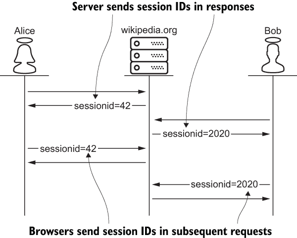
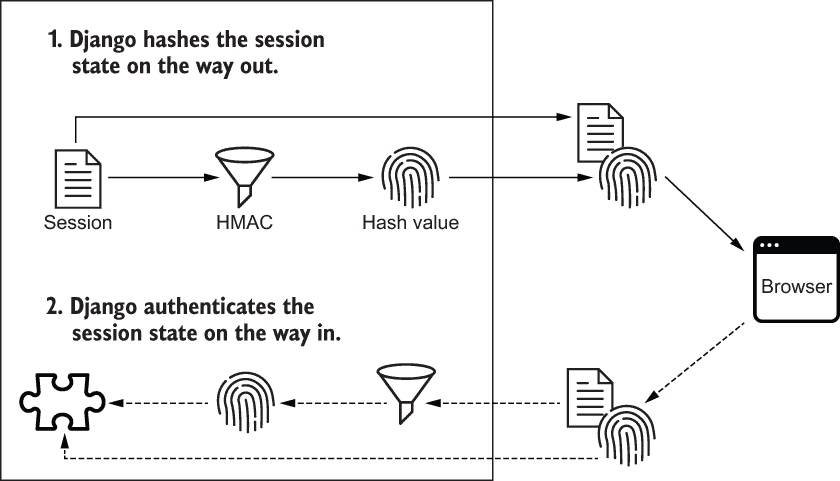
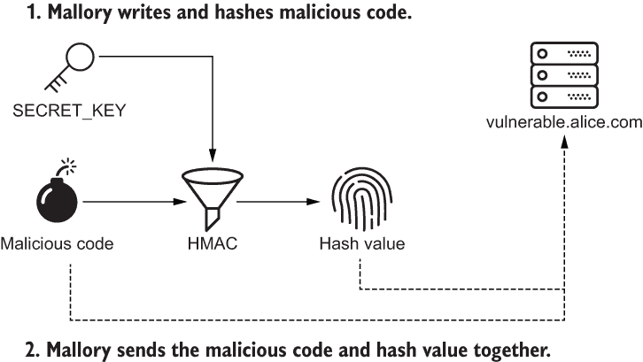

# 7 HTTP 会话管理

本章涵盖

+   理解 HTTP cookie

+   在 Django 中配置 HTTP 会话

+   选择一个 HTTP 会话状态持久化策略

+   防止远程代码执行攻击和重放攻击

在上一章中，你学习了有关 TLS 的知识。在本章中，你将在此基础上继续学习。你将了解如何使用 cookie 实现 HTTP 会话。你还将学习如何在 Django 中配置 HTTP 会话。在此过程中，我将向你展示如何安全地实现会话状态持久化。最后，你将学习如何识别和抵抗远程代码执行攻击和重放攻击。

## 7.1 什么是 HTTP 会话？

*HTTP* *会话* 对于除了最简单的 Web 应用程序之外的所有应用程序都是必需的。Web 应用程序使用 HTTP 会话来隔离每个用户的流量、上下文和状态。这是每种在线交易的基础。如果你在亚马逊购物，Facebook 上与某人通信，或者从银行转账，服务器必须能够在多个请求中识别你。

假设 Alice 第一次访问维基百科。Alice 的浏览器对维基百科不熟悉，因此它创建了一个会话。维基百科生成并存储了此会话的 ID。该 ID 在 HTTP 响应中发送给 Alice 的浏览器。Alice 的浏览器保存会话 ID，并在所有后续请求中将其发送回维基百科。当维基百科接收到每个请求时，它使用传入的会话 ID 来识别与请求相关联的会话。

现在假设维基百科为另一个新访客 Bob 创建了一个会话。像 Alice 一样，Bob 被分配了一个唯一的会话 ID。他的浏览器存储了他的会话 ID，并在每个后续请求中发送回来。维基百科现在可以使用会话 ID 来区分 Alice 的流量和 Bob 的流量。图 7.1 说明了这个协议。



图 7.1 维基百科管理两个用户 Alice 和 Bob 的会话。

Alice 和 Bob 的会话 ID 保持私密非常重要。如果 Eve 窃取了会话 ID，她可以使用它来冒充 Alice 或 Bob。包含 Bob 被劫持的会话 ID 的 Eve 的请求看起来与 Bob 的合法请求没有任何区别。许多利用漏洞，其中一些在本书中专门有章节介绍，都依赖于窃取或未经授权控制会话 ID。这就是为什么会话 ID 应该通过 HTTPS 而不是 HTTP 进行机密发送和接收。

你可能已经注意到一些网站使用 HTTP 与匿名用户通信，使用 HTTPS 与经过身份验证的用户通信。恶意网络窃听者通过尝试在 HTTP 上窃取会话 ID，等待用户登录，然后在 HTTPS 上劫持用户账户来攻击这些网站。这被称为*会话嗅探*。

Django，像许多 Web 应用程序框架一样，通过在用户登录时更改会话标识符来防止会话嗅探。为了保险起见，Django 无论协议是否从 HTTP 升级到 HTTPS 都会这样做。我建议增加一个额外的防御层：只为您的整个网站使用 HTTPS。

管理 HTTP 会话可能是一项挑战；本章涵盖了许多解决方案。每种解决方案都有不同的安全权衡，但它们都有一个共同点：HTTP cookies。

## 7.2 HTTP cookies

浏览器存储和管理称为*cookies*的小量文本。一个 cookie 可以由您的浏览器创建，但通常由服务器创建。服务器通过响应将 cookie 发送到您的浏览器。浏览器在随后对服务器的请求中回显 cookie。

网站和浏览器使用 cookies 进行会话 ID 通信。当创建新的用户会话时，服务器将会话 ID 作为 cookie 发送到浏览器。服务器使用`Set-Cookie`响应头将 cookie 发送到浏览器。此响应头包含表示 cookie 名称和值的键值对。默认情况下，Django 会话 ID 与名为`sessionid`的 cookie 通信，如以下粗体字所示：

```py
Set-Cookie: sessionid=<cookie-value>
```

Cookies 通过`Cookie`请求头在随后的请求中回显到服务器。该头部是一个以分号分隔的键值对列表。每对代表一个 cookie。以下示例说明了发送至 alice.com 的请求的一些头部。粗体显示的`Cookie`头部包含两个 cookie：

```py
...
Cookie: sessionid=cgqbyjpxaoc5x5mmm9ymcqtsbp7w7cn1; key=value;    ❶
Host: alice.com
Referer: https:/./alice.com/admin/login/?next=/admin/
...
```

❶ 向 alice.com 发送两个 cookie

`Set-Cookie`响应头可以容纳多个指令。当 cookie 是会话 ID 时，这些指令与安全相关。我在第十四章中涵盖了`HttpOnly`指令。我在第十六章中涵盖了`SameSite`指令。在本节中，我涵盖了以下三个指令：

+   `安全`

+   `域`

+   `Max-Age`

### 7.2.1 安全指令

服务器通过使用`安全`指令发送会话 ID cookie 来抵抗中间人攻击。以下是一个示例响应头，其中`安全`指令以粗体显示：

```py
Set-Cookie: sessionid=<session-id-value>; Secure
```

`安全`指令禁止浏览器通过 HTTP 将 cookie 发送回服务器。这确保 cookie 只会通过 HTTPS 传输，防止网络窃听者拦截会话 ID。

`SESSION_COOKIE_SECURE`设置是一个布尔值，它向会话 ID `Set-Cookie`头部添加或删除`安全`指令。您可能会惊讶地发现，该设置默认为`False`。这使得新的 Django 应用程序可以立即支持用户会话；这也意味着会话 ID 可能会被中间人攻击拦截。

警告：您必须确保在系统的所有生产部署中将`SESSION_COOKIE_SECURE`设置为`True`。Django 不会为您执行此操作。

提示 在更改 `settings` 模块后，必须重新启动 Django 才能生效。要重新启动 Django，请在你的 shell 中按 Ctrl-C 停止服务器，然后再次使用 `gunicorn` 启动。

### 7.2.2 Domain 指令

服务器使用 `Domain` 指令来控制浏览器应该将会话 ID 发送到哪些主机。下面是一个示例响应头，其中 `Domain` 指令被加粗显示：

```py
Set-Cookie: sessionid=<session-id-value>; Domain=alice.com
```

假设 alice.com 向浏览器发送一个不带 `Domain` 指令的 `Set-Cookie` 头部。没有 `Domain` 指令，浏览器会将 cookie 回显给 alice.com，但不会回显给子域名，比如 sub.alice.com。

现在假设 alice.com 发送了一个带有 `Domain` 指令设置为 `alice.com` 的 `Set-Cookie` 头部。现在浏览器将 cookie 回显给 alice.com 和 sub.alice.com。这允许 Alice 在两个系统之间支持 HTTP 会话，但这不够安全。例如，如果 Mallory 黑入 sub.alice.com，她就能更轻松地威胁到 alice.com，因为来自 alice.com 的会话 ID 就这样交给了她。

`SESSION_COOKIE_DOMAIN` 设置配置了会话 ID 的 `Set-Cookie` 头部的 `Domain` 指令。此设置接受两个值：`None` 和表示域名的字符串，例如 `alice.com`。此设置默认为 `None`，省略响应头中的 `Domain` 指令。以下是一个示例配置设置：

```py
SESSION_COOKIE_DOMAIN = "alice.com"      ❶
```

❶ 从 settings.py 配置 Domain 指令

提示 `Domain` 指令有时会与 `SameSite` 指令混淆。为了避免这种混淆，请记住这种对比：`Domain` 指令与 cookie *去向* 有关；`SameSite` 指令与 cookie *来源* 有关。我在第十六章中研究了 `SameSite` 指令。

### 7.2.3 Max-Age 指令

服务器发送 `Max-Age` 指令来声明 cookie 的过期时间。以下是一个示例响应头，其中有一个加粗显示的 `Max-Age` 指令：

```py
Set-Cookie: sessionid=<session-id-value>; Max-Age=1209600
```

一旦 cookie 过期，浏览器就不会再将其回显到它来自的站点。这种行为可能对你来说很熟悉。你可能已经注意到像 Gmail 这样的网站不会每次你返回时都强制你登录。但如果你有一段时间没有回来，你就会被迫重新登录。很有可能，你的 cookie 和 HTTP 会话已经过期。

选择站点的最佳会话长度归结为安全性与功能之间的权衡。极长的会话提供给攻击者一个易于攻击的目标，当浏览器处于无人看管状态时。另一方面，极短的会话强迫合法用户一遍又一遍地重新登录。

`SESSION_COOKIE_AGE` 设置配置了会话 ID 的 `Set-Cookie` 头部的 `Max-Age` 指令。此设置默认为 1,209,600 秒（两周）。对于大多数系统来说，这个值是合理的，但适当的值是特定于站点的。

### 7.2.4 浏览器长度的会话

如果设置的 Cookie 没有 `Max-Age` 指令，浏览器将在选项卡保持打开的时间内保持 Cookie 有效。这被称为*浏览器长度会话*。这些会话在用户关闭浏览器选项卡后无法被攻击者劫持。这似乎更安全，但是你如何强制每个用户在使用网站完成后关闭每个选项卡呢？此外，当用户不关闭浏览器选项卡时，会话实际上没有到期。因此，浏览器长度的会话会增加总体风险，通常应避免使用此功能。

浏览器长度会话由 `SESSION_EXPIRE_AT_BROWSER_CLOSE` 设置配置。将此设置为 `True` 将从会话 ID 的 `Set-Cookie` 头中删除 `Max-Age` 指令。Django 默认禁用浏览器长度会话。

### 7.2.5 以编程方式设置 Cookie

我在本章中涵盖的响应头指令适用于任何 Cookie，而不仅仅是会话 ID。如果您通过编程方式设置 Cookie，则应考虑这些指令以限制风险。以下代码演示了在 Django 中设置自定义 Cookie 时如何使用这些指令。

列表 7.1 在 Django 中以编程方式设置 Cookie

```py
from django.http import HttpResponse

response = HttpResponse()
response.set_cookie(
    'cookie-name',
    'cookie-value',
    secure=True,           ❶
    domain='alice.com',    ❷
    max_age=42, )          ❸
```

❶ 浏览器将仅通过 HTTPS 发送此 Cookie。

❷ alice.com 和所有子域都将接收到此 Cookie。

❸ 在 42 秒后，此 Cookie 将过期。

到目前为止，您已经学到了有关服务器和 HTTP 客户端如何使用 Cookie 来管理用户会话的很多知识。至少，会话可以区分用户之间的流量。此外，会话还可以作为每个用户管理状态的一种方式。用户的名称、语言环境和时区是会话状态的常见示例。下一节将介绍如何访问和持久化会话状态。

## 7.3 会话状态持久性

像大多数 Web 框架一样，Django 使用 API 对用户会话进行建模。通过 `session` 对象，可以访问此 API，该对象是请求的属性。`session` 对象的行为类似于 Python 字典，通过键存储值。通过此 API 创建、读取、更新和删除会话状态；这些操作在下一个列表中进行演示。

列表 7.2 Django 会话状态访问

```py
request.session['name'] = 'Alice'            ❶
name = request.session.get('name', 'Bob')    ❷
request.session['name'] = 'Charlie'          ❸
del request.session['name']                  ❹
```

❶ 创建会话状态条目

❷ 读取会话状态条目

❸ 更新会话状态条目

❹ 删除会话状态条目

Django 自动管理会话状态的持久性。会话状态在收到请求后从可配置的数据源加载和反序列化。如果会话状态在请求生命周期中被修改，Django 在发送响应时序列化并持久化修改。序列化和反序列化的抽象层称为*会话序列化器*。

### 7.3.1 会话序列化器

Django 将会话状态的序列化和反序列化委托给可配置的组件。该组件由 `SESSION_SERIALIZER` 设置配置。Django 本地支持两个会话序列化器组件：

+   `JSONSerializer`，默认会话序列化器

+   `PickleSerializer`

`JSONSerializer` 将会话状态转换为 JSON 并从 JSON 转换回来。这种方法允许您将会话状态与基本的 Python 数据类型（如整数、字符串、字典和列表）组合在一起。以下代码使用 `JSONSerializer` 来序列化和反序列化一个字典，如粗体所示：

```py
>>> from django.contrib.sessions.serializers import JSONSerializer
>>> 
>>> json_serializer = JSONSerializer()
>>> serialized = json_serializer.dumps({'name': 'Bob'})    ❶
>>> serialized
b'{"name":"Bob"}'                                          ❷
>>> json_serializer.loads(serialized)                      ❸
{'name': 'Bob'}                                            ❹
```

❶ 序列化一个 Python 字典

❷ 序列化的 JSON

❸ 反序列化 JSON

❹ 反序列化的 Python 字典

`PickleSerializer` 将会话状态转换为字节流并从字节流转换回来。顾名思义，`PickleSerializer` 是 Python `pickle` 模块的包装器。这种方法允许您存储任意 Python 对象以及基本的 Python 数据类型。一个应用���序定义的 Python 对象，如粗体所示，通过以下代码进行序列化和反序列化： 

```py
>>> from django.contrib.sessions.serializers import PickleSerializer
>>> 
>>> class Profile:
...     def __init__(self, name):
...         self.name = name
... 
>>> pickle_serializer = PickleSerializer()
>>> serialized = pickle_serializer.dumps(Profile('Bob'))          ❶
>>> serialized
b'\x80\x05\x95)\x00\x00\x00\x00\x00\x00\x00\x8c\x08__main__...'   ❷
>>> deserialized = pickle_serializer.loads(serialized)            ❸
>>> deserialized.name                                             ❹
'Bob'
```

❶ 序列化一个应用程序定义的对象

❷ 序列化的字节流

❸ 反序列化字节流

❹ 反序列化对象

`JSONSerializer` 和 `PickleSerializer` 之间的权衡是安全性与功能性。`JSONSerializer` 是安全的，但无法序列化任意 Python 对象。`PickleSerializer` 执行此功能，但存在严重风险。`pickle` 模块文档给出了以下警告（[`docs.python.org/3/library/pickle.html`](https://docs.python.org/3/library/pickle.html)）：

pickle 模块不安全。只有信任的数据才能反序列化。可能构造恶意 pickle 数据，在反序列化过程中执行任意代码。永远不要反序列化可能来自不受信任来源或可能被篡改的数据。

如果攻击者能够修改会话状态，`PickleSerializer` 可能会被恶意滥用。我将在本章后面讨论这种形式的攻击；请继续关注。

Django 会自动使用会话引擎持久化序列化的会话状态。*会话引擎* 是对底层数据源的可配置抽象层。Django 提供了这五个选项，每个选项都有其自己的优缺点：

+   简单基于缓存的会话

+   写入缓存的会话

+   基于数据库的会话，即默认选项

+   基于文件的会话

+   签名 cookie 会话

### 7.3.2 简单基于缓存的会话

*简单* *基于缓存的会话* 允许您将会话状态存储在诸如 Memcached 或 Redis 之类的缓存服务中。缓存服务将数据存储在内存中而不是在磁盘上。这意味着您可以非常快速地存储和加载数据，但偶尔数据可能会丢失。例如，如果缓存服务的空间用完了，它将覆盖最近访问的旧数据以写入新数据。如果缓存服务重新启动，所有数据都会丢失。

缓存服务的最大优势，速度，与会话状态的典型访问模式相辅相成。会话状态经常被读取（在每个请求上）。通过将会话状态存储在内存中，整个站点可以减少延迟，增加吞吐量，同时提供更好的用户体验。

缓存服务的最大弱点，数据丢失，并不像其他用户数据那样适用于会话状态。在最坏的情况下，用户必须重新登录网站，重新创建会话。这是不可取的，但称其为*数据丢失*有些牵强。因此，会话状态是可以牺牲的，而且缺点是有限的。

存储 Django 会话状态的最流行和最快的方法是将简单基于缓存的会话引擎与 Memcached 等缓存服务结合使用。在`settings`模块中，将`SESSION_ENGINE`分配给`django.contrib.sessions.backends.cache`会配置 Django 用于简单基于缓存的会话。Django 本地支持两种 Memcached 缓存后端类型。

Memcached 后端

`MemcachedCache`和`PyLibMCCache`是最快和最常用的缓存后端。`CACHES`设置配置了缓存服务集成。这个设置是一个字典，表示一组单独的缓存后端。第 7.3 节列举了两种配置 Django 用于 Memcached 集成的方法。`MemcachedCache`选项配置为使用本地回环地址；`PyLibMCCache`选项配置为使用 UNIX 套接字。

第 7.3 节 使用 Memcached 进行缓存

```py
CACHES = {
    'default': {
        'BACKEND': 'django.core.cache.backends.memcached.MemcachedCache',
        'LOCATION': '127.0.0.1:11211',        ❶
    },
    'cache': {
        'BACKEND': 'django.core.cache.backends.memcached.PyLibMCCache',
        'LOCATION': '/tmp/memcached.sock',    ❷
    }
}
```

❶ 本地回环地址

❷ UNIX 套接字地址

本地回环地址和 UNIX 套接字是安全的，因为到这些地址的流量不会离开机器。在撰写本文时，遗憾的是，Memcached 维基上的 TLS 功能被描述为“实验性”。

Django 支持四种额外的缓存后端。这些选项要么不受欢迎，要么不安全，或者两者兼而有之，因此我在这里简要介绍它们：

+   数据库后端

+   本地内存后端，默认选项

+   虚拟后端

+   文件系统后端

数据库后端

`DatabaseCache`选项配置 Django 使用您的数据库作为缓存后端。使用此选项可以让您有更多理由通过 TLS 发送数据库流量。没有 TLS 连接，您缓存的所有内容，包括会话 ID，都可以被网络窃听者访问。下一个列表说明了如何配置 Django 使用数据库后端进行缓存。

第 7.4 节 使用数据库进行缓存

```py
CACHES = {
    'default': {
        'BACKEND': 'django.core.cache.backends.db.DatabaseCache',
        'LOCATION': 'database_table_name',
    }
}
```

缓存服务和数据库之间的主要权衡是性能与存储容量之间的关系。您的数据库无法像缓存服务那样运行。数据库将数据持久化到磁盘；缓存服务将数据持久化到内存。另一方面，您的缓存服务永远无法存储与数据库一样多的数据。在会话状态不可牺牲的罕见情况下，这个选项是有价值的。

本地内存、虚拟和文件系统后端

`LocMemCache`将数据缓存在本地内存中，只有一个位置极佳的攻击者才能访问。`DummyCache`是比`LocMemCache`更安全的唯一选项，因为它不存储任何内容。这些选项，如下列表所示，非常安全，但在开发或测试环境之外并不实用。Django 默认使用`LocMemCache`。

列表 7.5 使用本地内存进行缓存，或者什么都不使用

```py
CACHES = {
    'default': {
        'BACKEND': 'django.core.cache.backends.locmem.LocMemCache',
    },
    'dummy': {
        'BACKEND': 'django.core.cache.backends.dummy.DummyCache',
    }
}
```

正如您可能已经猜到的，`FileBasedCache` 不受欢迎且不安全。`FileBasedCache` 用户不必担心它们的未加密数据是否会被发送到网络；相反，它会被写入文件系统，如下所示。

列表 7.6 使用文件系统进行缓存

```py
CACHES = {
    'default': {
        'BACKEND': 'django.core.cache.backends.filebased.FileBasedCache',
        'LOCATION': '/var/tmp/file_based_cache',
    }
}
```

### 7.3.3 基于写透式缓存的会话

基于写透式缓存的会话允许您将缓存服务和数据库组合起来管理会话状态。在这种方法下，当 Django 将会话状态写入缓存服务时，该操作也将“写透”到数据库中。这意味着会话状态是持久的，但写入性能会受到影响。

当 Django 需要读取会话状态时，它首先从缓存服务中读取，然后才考虑使用数据库。因此，您在读取操作上偶尔会受到性能影响。

将 `SESSION_ENGINE` 设置为 `django.contrib.sessions.backends.cache_db` 将启用基于写透式缓存的会话。

### 7.3.4 基于数据库的会话引擎

基于数据库的会话完全绕过了 Django 的缓存集成。如果您选择不将应用程序与缓存服务集成，这个选项非常有用。通过将 `SESSION_ENGINE` 设置为 `django.contrib.sessions.backends.db` 来配置基于数据库的会话。这是默认行为。

Django 不会自动清理被放弃的会话状态。使用持久会话的系统将需要确保定期调用 `clearsessions` 子命令。这将有助于您减少存储成本，但更重要的是，如果您在会话中存储敏感数据，它将有助于您减小攻击面的大小。下面的命令，从项目根目录执行，演示了如何调用 `clearsessions` 子命令：

```py
$ python manage.py clearsessions
```

### 7.3.5 基于文件的会话引擎

正如您可能已经猜到的，这个选项极不安全。每个基于文件的会话都被序列化为一个文件。会话 ID 在文件名中，会话状态以未加密形式存储。任何拥有文件系统读取权限的人都可以劫持会话或查看会话状态。将 `SESSION_ENGINE` 设置为 `django.contrib.sessions.backends.file` 将配置 Django 将会话状态存储在文件系统中。

### 7.3.6 基于 cookie 的会话引擎

基于 cookie 的会话引擎将会话状态存储在会话 ID cookie 中。换句话说，使用此选项时，会话 ID cookie 不仅仅 *标识* 会话；它 *是* 会话。Django 不是将会话存储在本地，而是将整个会话序列化并发送到浏览器。然后，当浏览器在后续请求中回显它时，Django 会对有效载荷进行反序列化。

在将会话状态发送到浏览器之前，基于 cookie 的会话引擎使用 HMAC 函数对会话状态进行哈希处理。（您在第三章学习了 HMAC 函数。）从 HMAC 函数获取的哈希值与会话状态配对；Django 将它们一起作为会话 ID cookie 发送到浏览器。

当浏览器回显会话 ID cookie 时，Django 提取哈希值并验证会话状态。Django 通过对入站会话状态进行哈希处理并比较新的哈希值和旧的哈希值来执行此操作。如果哈希值不匹配，Django 知道会话状态已被篡改，并拒绝请求。如果哈希值匹配，Django 信任会话状态。图 7.2 说明了这个往返过程。



图 7.2 Django 对发送的内容进行哈希处理，并对接收到的内容进行身份验证。

之前，您学习到 HMAC 函数需要一个密钥。Django 从 `settings` 模块中获取秘密密钥。

`SECRET_KEY` 设置

Django 应用程序的每个生成的应用程序都包含一个 `SECRET_KEY` 设置在 `settings` 模块中。这个设置很重要；它将在几个其他章节中重新出现。与流行观点相反，Django 并不使用 `SECRET_KEY` 来加密数据。相反，Django 使用此参数执行键控散列。此设置的值默认为唯一的随机字符串。在开发或测试环境中使用此值是可以的，但在生产环境中，重要的是从比您的代码存储库更安全的位置检索不同的值。

警告 `SECRET_KEY` 的生产值应保持三个属性。该值应该是唯一的、随机的，并且足够长。生成的默认值的长度为五十个字符，已经足够长了。不要将 `SECRET_KEY` 设置为密码或密码短语；没有人需要记住它。如果有人能记住这个值，系统就不够安全。在本章结束时，我会给你一个例子。

乍一看，基于 cookie 的会话引擎可能看起来是一个不错的选择。Django 使用 HMAC 函数对每个请求的会话状态进行身份验证和完整性验证。不幸的是，这个选项有许多缺点，其中一些是有风险的：

+   Cookie 大小限制

+   未经授权的会话状态访问

+   重放攻击

+   远程代码执行攻击

Cookie 大小限制

文件系统和数据库用于存储大量数据；而 cookie 则不是。RFC 6265 要求 HTTP 客户端支持“每个 cookie 至少 4096 字节”（[`tools.ietf.org/html/rfc6265#section-5.3`](https://tools.ietf.org/html/rfc6265#section-5.3)）。HTTP 客户端可以支持更大的 cookie，但不是必须的。因此，序列化的基于 cookie 的 Django 会话应保持在 4 KB 以下的大小。

未经授权的会话状态访问

基于 cookie 的会话引擎对传出的会话状态进行哈希处理；它不加密会话状态。这保证了完整性，但不保证机密性。因此，会话状态对恶意用户通过浏览器是容易获取的。如果会话包含用户不应该访问的信息，则系统容易受到攻击。

假设爱丽丝和伊芙都是 social.bob.com 的用户，这是一个社交媒体网站。爱丽丝因为伊芙在前一章执行了中间人攻击而对她感到愤怒，所以她屏蔽了她。与其他社交媒体网站不同的是，social.bob.com 不会通知伊芙她已被屏蔽。social.bob.com 将这些信息存储在基于 cookie 的会话状态中。

伊芙使用以下代码查看谁已经屏蔽了她。首先，她使用 `requests` 包进行程序化身份验证。（你在前一章学习了 `requests` 包）。接下来，她从会话 ID cookie 中提取、解码和反序列化自己的会话状态。反序列化的会话状态显示爱丽丝已经屏蔽了伊芙（用粗体字体表示）：

```py
>>> import base64
>>> import json
>>> import requests
>>> 
>>> credentials = {
...     'username': 'eve',
...     'password': 'evil', }
>>> response = requests.post(                               ❶
...     'https:/./social.bob.com/login/',                    ❶
...     data=credentials, )                                 ❶
>>> sessionid = response.cookies['sessionid']               ❷
>>> decoded = base64.b64decode(sessionid.split(':')[0])     ❷
>>> json.loads(decoded)                                     ❷
{'name': 'Eve', 'username': 'eve', 'blocked_by': ['alice']} ❸
```

❶ 伊芙登录到鲍勃的社交媒体网站。

❷ 伊芙提取、解码和反序列化会话状态。

❸ 伊芙看到爱丽丝已经屏蔽了她。

重放攻击

基于 cookie 的会话引擎使用 HMAC 函数对传入的会话状态进行身份验证。这告诉服务器负载的原始作者是谁。这不能告诉服务器接收到的负载是否是负载的最新版本。换句话说，浏览器不能通过修改会话 ID cookie 来逃避，但浏览器可以重放其较旧版本。攻击者可以利用这种限制进行*重放攻击*。

假设 ecommerce.alice.com 配置了基于 cookie 的会话引擎。该网站为每个新用户提供一次性折扣。会话状态中的一个布尔值表示用户的折扣资格。恶意用户玛洛丽首次访问该网站。作为新用户，她有资格获得折扣，她的会话状态反映了这一点。她保存了自己会话状态的本地副本。然后，她进行了第一次购买，获得了折扣，网站在捕获付款时更新了她的会话状态。她不再有资格获得折扣。后来，玛洛丽在后续购买请求中重放了她的会话状态副本，以获得额外的未经授权的折扣。玛洛丽成功执行了重放攻击。

重放攻击是利用在无效上下文中重复有效输入来破坏系统的任何利用。如果系统无法区分重放的输入和普通输入，则任何系统都容易受到重放攻击的影响。区分重放的输入和普通输入是困难的，因为在某一时间点，重放的输入*曾经*是普通输入。

这些攻击不仅限于电子商务系统。重放攻击已被用于伪造自动取款机（ATM）交易，解锁车辆，打开车库门，并绕过语音识别身份验证。

远程代码执行攻击

将基于 cookie 的会话与 `PickleSerializer` 结合使用是一条很危险的道路。如果攻击者能够访问 `SECRET_KEY` 设置，这种配置组合可能会被严重利用。

警告 远程代码执行攻击是残酷的。永远不要将基于 cookie 的会话与 `PickleSerializer` 结合使用；风险太大了。这种组合之所以不受欢迎是有充分理由的。

假设 vulnerable.alice.com 使用 `PickleSerializer` 对基于 cookie 的会话进行序列化。Mallory，一个对 vulnerable.alice.com 不满的前雇员，记住了 `SECRET_KEY`。她执行了对 vulnerable.alice.com 的攻击，计划如下：

1.  编写恶意代码

1.  使用 HMAC 函数和 `SECRET_KEY` 对恶意代码进行哈希

1.  将恶意代码和哈希值作为会话 cookie 发送给 vulnerable.alice.com

1.  坐下来，看着 vulnerable.alice.com 执行 Mallory 的恶意代码

首先，Mallory 编写恶意的 Python 代码。她的目标是欺骗 vulnerable.alice.com 执行这段代码。她安装 Django，创建 `PickleSerializer`，并将恶意代码序列化为二进制格式。

接下来，Mallory 对序列化的恶意代码进行哈希。她以与服务器哈希会话状态相同的方式进行，使用 HMAC 函数和 `SECRET_KEY`。Mallory 现在拥有恶意代码的有效哈希值。

最后，Mallory 将序列化的恶意代码与哈希值配对，伪装成基于 cookie 的会话状态。她将有效负载作为会话 cookie 发送到 vulnerable.alice.com 的请求头中。不幸的是，服务器成功验证了 cookie；毕竟，恶意代码是使用服务器相同的 `SECRET_KEY` 进行哈希的。在验证了 cookie 后，服务器使用 `PickleSerializer` 反序列化会话状态，无意中执行了恶意脚本。Mallory 成功执行了一次 *远程代码执行攻击*。图 7.3 说明了 Mallory 的攻击。



图 7.3 Mallory 使用被篡改的 SECRET_KEY 执行远程代码执行攻击。

以下示例演示了 Mallory 如何从交互式 Django shell 执行远程代码执行攻击。在这次攻击中，Mallory 通过调用 `sys.exit` 函数欺骗 vulnerable.alice.com 自杀。Mallory 在 `PickleSerializer` 反序列化她的代码时调用 `sys.exit`。Mallory 使用 Django 的 `signing` 模块对恶意代码进行序列化和哈希，就像基于 cookie 的会话引擎一样。最后，她使用 `requests` 包发送请求。请求没有响应；接收方（用粗体字体标记）就这样死了：

```py
$ python manage.py shell
>>> import sys
>>> from django.contrib.sessions.serializers import PickleSerializer
>>> from django.core import signing
>>> import requests
>>> 
>>> class MaliciousCode:
...     def __reduce__(self):                                              ❶
...         return sys.exit, ()                                            ❷
... 
>>> session_state = {'malicious_code': MaliciousCode(), }
>>> sessionid = signing.dumps(                                             ❸
...     session_state,                                                     ❸
...     salt='django.contrib.sessions.backends.signed_cookies',            ❸
...     serializer=PickleSerializer)                                       ❸
>>> 
>>> session = requests.Session()
>>> session.cookies['sessionid'] = sessionid
>>> session.get('https:/./vulnerable.alice.com/')                           ❹
Starting new HTTPS connection (1): vulnerable.com
http.client.RemoteDisconnected: Remote end closed connection without response❺
```

❶ Pickle 将此方法称为反序列化。

❷ Django 用这行代码自杀。

❸ Django 的签名模块序列化并哈希 Mallory 的恶意代码。

❹ 发送请求

❺ 收不到响应

将`SESSION_ENGINE`设置为`django.contrib.sessions.backends.signed_cookies`配置 Django 使用基于 cookie 的会话引擎。

## 摘要

+   服务器使用`Set-Cookie`响应头在浏览器上设置会话 ID。

+   浏览器使用`Cookie`请求头将会话 ID 发送给服务器。

+   使用`Secure`、`Domain`和`Max-Age`指令来抵抗在线攻击。

+   Django 本地支持五种存储会话状态的方式。

+   Django 本地支持六种缓存数据的方式。

+   重放攻击可以滥用基于 cookie 的会话。

+   远程代码执行攻击可以滥用 pickle 序列化。

+   Django 使用`SECRET_KEY`设置进行键控哈希，而不是加密。
