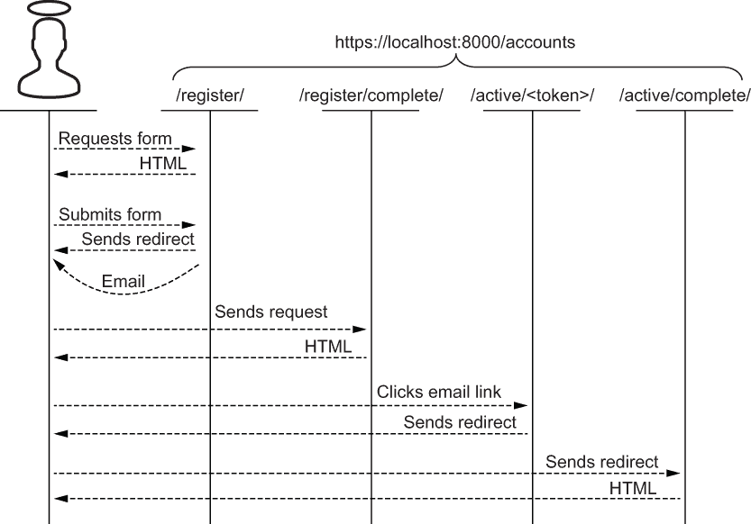
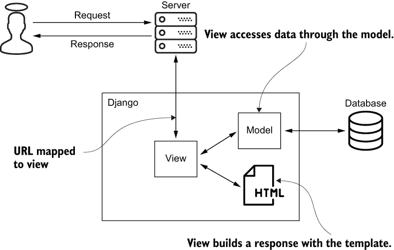
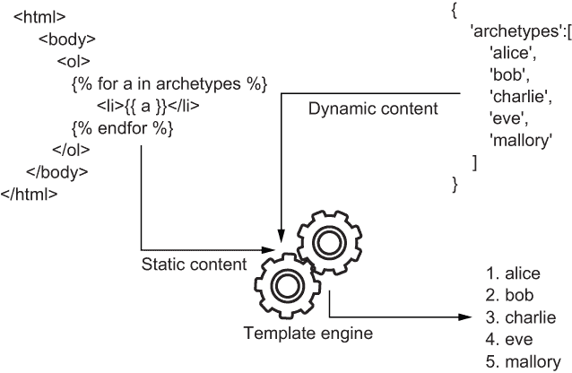
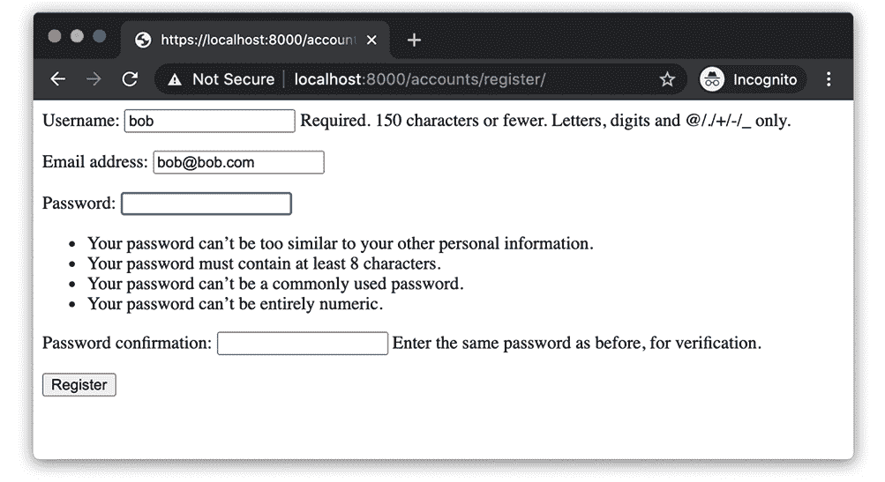
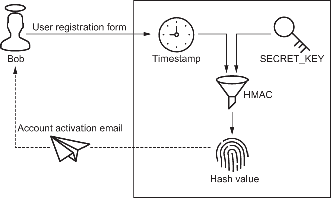
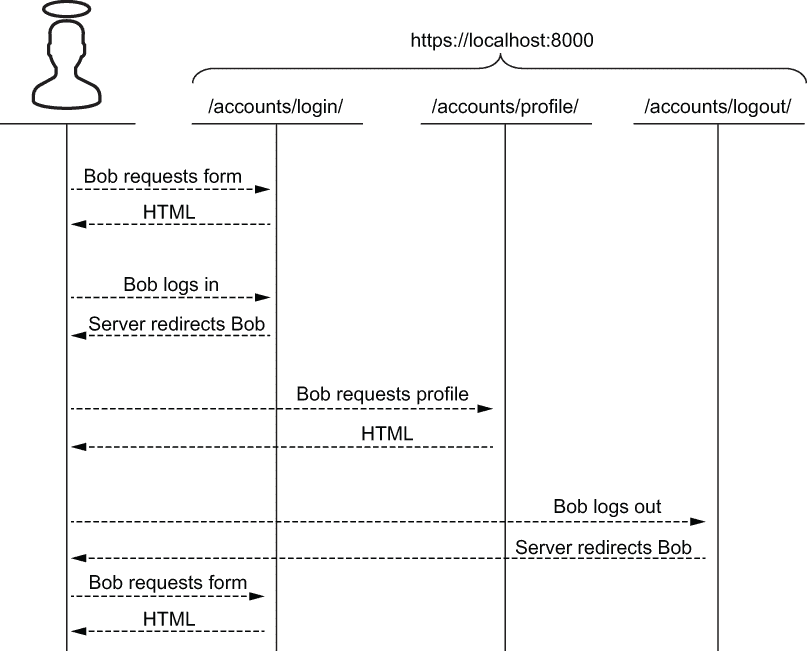
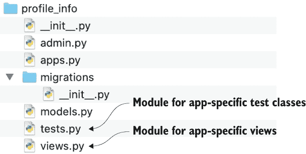

# 第八章：用户身份验证

本章涵盖

+   注册和激活新用户账户

+   安装和创建 Django 应用程序

+   登录和退出项目

+   访问用户个人资料信息

+   测试身份验证

身份验证和授权类似于用户和组。在本章中，你将通过创建用户来学习身份验证；在后面的章节中，你将通过创建组来学习授权。

注意 在撰写本文时，*破损的身份验证* 在 OWASP 十大安全风险中排名第 2 位（[`owasp.org/www-project-top-ten/`](https://owasp.org/www-project-top-ten/)）。什么是 OWASP 十大安全风险？它是一个旨在提高人们对网络应用程序面临的最关键安全挑战的认识的参考资料。开放网络应用安全项目（OWASP）是一个致力于提高软件安全性的非营利组织。OWASP 通过开源项目、会议和全球数百个地方分会促进安全标准和最佳实践的采纳。

你将通过向之前创建的 Django 项目添加一个新的用户注册工作流程来开始本章。Bob 使用这个工作流程为自己创建并激活一个账户。接下来，你将创建一个身份验证工作流程。Bob 使用这个工作流程来登录、访问他的个人资料信息和退出。HTTP 会话管理，来自上一章，也会出现。最后，你将编写测试来验证这些功能。

## 8.1 用户注册

在本节中，你将利用`django-registration`，一个 Django 扩展库，来创建一个用户注册工作流程。在此过程中，你将学习 Django Web 开发的基本构建模块。Bob 使用你的用户注册工作流程为自己创建并激活一���账户。这一节为你和 Bob 准备了下一节，在那里你将为他构建一个身份验证工作流程。

用户注册工作流程是一个两步过程；你可能已经体验过了：

1.  Bob *创建* 了他的账户。

1.  Bob *激活* 了他的账户。

Bob 通过请求用户注册表单进入用户注册工作流程。他提交这个表单，包括用户名、电子邮件地址和密码。服务器创建一个未激活的账户，将他重定向到注册确认页面，并发送给他一个账户激活的电子邮件。

Bob 目前无法登录他的账户，因为账户尚未激活。他必须验证他的电子邮件地址以激活账户。这可以防止 Mallory 使用 Bob 的电子邮件地址创建账户，保护你和 Bob；你将知道电子邮件地址是有效的，而 Bob 不会收到你的未经请求的电子邮件。

Bob 的电子邮件包含一个链接，他点击以确认他的电子邮件地址。这个链接将 Bob 带回服务器，然后激活他的账户。图 8.1 描述了这个典型的工作流程。



图 8.1 典型的用户注册工作流程，包括电子邮件确认

在你开始编写代码之前，我将定义一些 Django Web 开发的基本构建模块。你即将创建的工作流由三个基本构建模块组成：

+   视图

+   模型

+   模板

Django 用一个对象表示每个传入的 HTTP 请求。该对象的属性映射到请求的属性，比如 URL 和 Cookie。Django 将每个请求映射到一个*视图*—一个用 Python 编写的请求处理程序。视图可以由类或函数实现；我在本书的示例中使用类。Django 调用视图，将请求对象传递给它。视图负责创建并返回响应对象。响应对象表示出站的 HTTP 响应，携带数据如内容和响应头。

*模型*是一个对象关系映射类。与视图一样，模型是用 Python 编写的。模型弥合了应用程序的面向对象世界与存储数据的关系数据库之间的差距。*模型类*类似于数据库表。模型类的*属性*类似于数据库表列。模型*对象*类似于数据库表中的行。视图使用模型来创建、读取、更新和删除数据库记录。

*模板*代表了请求的响应。与视图和模型不同，模板主要是用 HTML 和简单的模板语法编写的。视图通常使用模板来组合静态和动态内容生成响应。图 8.2 描述了视图、模型和模板之间的关系。



图 8.2 Django 应用服务器使用模型-视图-模板架构来处理请求。

这种架构通常被称为*模型-视图-模板*（*MVT*）。如果你已经熟悉*模型-视图-控制器*（MVC）架构，这可能会有点令人困惑。这些架构对于模型的称呼是一致的：模型是一个对象关系映射层。但是对于视图的称呼则不一致。MVT 视图大致等同于 MVC 控制器；MVC 视图大致等同于 MVT 模板。表 8.1 比较了两种架构的词汇。

表 8.1 MVT 术语与 MVC 术语对照

| MVT 术语 | MVC 术语 | 描述 |
| --- | --- | --- |
| 模型 | 模型 | 对象关系映射层 |
| 视图 | 控制器 | 负责逻辑和协调的请求处理程序 |
| 模板 | 视图 | 响应内容的生成 |

在本书中，我使用 MVT 术语。你即将构建的用户注册工作流由视图、模型和模板组成。你不需要编写视图或模型；这项工作已经由`django-registration`扩展库为你完成。

通过将`django-registration`安装为*Django 应用*来利用它在你的*Django 项目*中。那么应用和项目有什么区别呢？这两个术语经常会令人困惑，可以理解：

+   *Django 项目*—这是一个配置文件集合，如 settings.py 和 urls.py，并且一个或多个 Django 应用程序。我在第六章用 django-admin 脚本向你展示了如何生成 Django 项目。

+   *Django 应用程序*—这是 Django 项目的模块化组件。每个组件负责一组离散的功能，如用户注册。多个项目可以使用相同的 Django 应用程序。一个 Django 应用程序通常不会变得足够大，以至于被视为一个应用程序。

在你的虚拟环境中，使用以下命令安装`django-registration`：

```py
$ pipenv install django-registration
```

接下来，打开你的`settings`模块，并添加下面加粗显示的代码行。这将`django-registration`添加到`INSTALLED_APPS`设置中。此设置是一个表示 Django 项目中 Django 应用程序的列表。确保不要删除任何现有的应用程序：

```py
INSTALLED_APPS = [
    ...
    'django.contrib.staticfiles',
    'django_registration',         # ❶
]
```

❶ 安装 django-registration 库

接下来，在 Django 根目录中运行以下命令。这个命令执行所有需要的数据库修改以适应`django-registration`：

```py
$ python manage.py migrate
```

接下来，在 Django 根目录中打开 urls.py。在文件开头添加一个`include`函数的导入，如列表 8.1 中加粗显示的。在导入下面是一个名为 urlpatterns 的列表。Django 使用这个列表将入站请求的 URL 映射到视图。将以下 URL 路径条目添加到 urlpatterns，也用加粗显示，不要删除任何现有的 URL 路径条目。

列表 8.1 将视图映射到 URL 路径

```py
from django.contrib import admin
from django.urls import path, include                                # ❶

urlpatterns = [
    path('admin/', admin.site.urls),
 path('accounts/',          include('django_registration.backends.activation.urls')),   # ❷
]
```

❶ 添加 include 导入

❷ 将 django-registration 视图映射到 URL 路径

添加这行代码会将五个 URL 路径映射到`django-registration`视图。表 8.2 说明了哪些 URL 模式映射到哪些视图。

表 8.2 URL 路径到用户注册视图的映射

| URL 路径 | django-registration 视图 |
| --- | --- |
| /accounts/activate/complete/ | TemplateView |
| /accounts/activate/<activation_key>/ | 激活视图 |
| /accounts/register/ | 注册视图 |
| /accounts/register/complete/ | TemplateView |
| /accounts/register/closed/ | TemplateView |

这些 URL 路径中的三个映射到`TemplateView`类。`TemplateView`不执行任何逻辑，只是简单地呈现模板。在下一节中，你将创建这些模板。

### 8.1.1 模板

每个生成的 Django 项目都配置有一个完全功能的模板引擎。*模板引擎*通过合并动态和静态内容将模板转换为响应。图 8.3 描述了一个模板引擎在 HTML 中生成一个有序列表。



图 8.3 模板引擎将静态 HTML 和动态内容结合在一起。

就像 Django 的每个其他主要子系统一样，模板引擎在`settings`模块中配置。打开 Django 根目录中的`settings`模块。在此模块的顶部，添加对`os`模块的导入，如下面代码中所示。在此导入下方，找到`TEMPLATES`设置，一个模板引擎列表。找到第一个且唯一的模板引擎的`DIRS`键。`DIRS`告诉模板引擎在搜索模板文件时要使用哪些目录。将以下条目添加到`DIRS`中，同样显示为粗体，告诉模板引擎在名为 templates 的目录中查找模板文件，位于项目根目录下方：

```py
import os                                                 # ❶

...

TEMPLATES = [
    {
        ...
        'DIRS': [os.path.join(BASE_DIR, 'templates')],    # ❷
        ...
    }
]
```

❶ 导入 os 模块

❷ 告诉模板引擎在哪里查找

在项目根目录下方，创建一个名为 templates 的子目录。在 templates 目录下，创建一个名为 django_registration 的子目录。这是`django-registration`视���期望您的模板存在的地方。您的用户注册工作流程将使用以下模板，按照 Bob 看到的顺序显示：

+   registration_form.html

+   registration_complete.html

+   activation_email_subject.txt

+   activation_email_body.txt

+   activation_complete.html

在 django_registration 目录下，创建一个名为 registration_form.html 的文件，其中包含列表 8.2 中的代码。此模板呈现 Bob 看到的第一件事，一个新的用户注册表单。忽略`csrf_token`标签；我将在第十六章中介绍这个。`form.as_` `p`变量将呈现带标签的表单字段。

列表 8.2 一个新的用户注册表单

```html
<html>
    <body>

        <form method='POST'>
                     <!-- ❶ -->
          {{ form.as_p }}            <!-- ❷ -->
          <button type='submit'>Register</button>
        </form>

    </body>
</html>
```

❶ 必要，但将在另一章节中介绍

❷ 动态呈现为用户注册表单字段

接下来，在同一目录中创建一个名为 registration_complete.html 的文件，并将以下 HTML 添加到其中。此模板在 Bob 成功注册后呈现一个简单的确认页面：

```html
<html>
    <body>
        <p>
            Registration is complete.
            Check your email to activate your account.
        </p>
    </body>
</html>
```

在同一目录中创建一个名为 activation_email_subject.txt 的文件。添加以下代码行，生成账户激活邮件的主题行。`site`变量将呈现为主机名；对于您来说，这将是`localhost`：

```py
Activate your account at {{ site }}
```

接下来，在同一目录中创建一个名为 activation_email_body.txt 的文件，并将以下代码行添加到其中。此模板代表账户激活邮件的正文：

```py
Hello {{ user.username }},

Go to https://{{ site }}/accounts/activate/{{ activation_key }}/ 
to activate your account.
```

最后，在创建一个名为 activation_complete.html 的文件，并将以下 HTML 添加到其中。这是 Bob 在工作流程中看到的最后一件事：

```html
<html>
    <body>
        <p>Account activation completed!</p>
    </body>
</html>
```

在此工作流程中，您的系统将向 Bob 的电子邮件地址发送一封电子邮件。在开发环境中设置电子邮件服务器将是一个很大的不便。此外，您实际上并不拥有 Bob 的电子邮件地址。打开设置文件，并添加以下代码以覆盖此行为。这将配置 Django 将出站电子邮件重定向到您的控制台，为您提供一种轻松访问用户注册链接的方式，而不会产生运行完全功能邮件服务器的开销：

```py
if DEBUG:
    EMAIL_BACKEND = 'django.core.mail.backends.console.EmailBackend'
```

将以下代码行添加到`settings`模块中。这个设置代表 Bob 有多少天时间来激活他的账户：

```py
ACCOUNT_ACTIVATION_DAYS = 3
```

好了，你已经完成了用户注册工作流程的编写。Bob 现在将使用它来创建和激活他的账户。

### 8.1.2 Bob 注册他的账户

重新启动服务器，并将浏览器指向 https:/./localhost:8000/accounts/regis ter/。你看到的用户注册表单包含几个必填字段：用户名、电子邮件、密码和密码确认。按照图 8.4 中显示的表单填写表单，为 Bob 设置一个密码，并提交表单。



图 8.4 Bob 为自己注册了一个账户，提交了一个用户名、他的电子邮件地址和一个密码。

提交用户注册表单为 Bob 创建了一个账户。Bob 目前无法登录这个账户，因为账户尚未激活。他必须验证自己的电子邮件地址以激活账户。这可以防止 Mallory 使用 Bob 的电子邮件地址创建账户；Bob 不会收到未经请求的电子邮件，而你将知道该电子邮件地址是有效的。

在创建账户后，你将被重定向到注册确认页面。该页面通知你检查你的电子邮件。之前你配置 Django 将出站邮件重定向到你的控制台。在你的控制台中查找 Bob 的电子邮件。

在 Bob 的电子邮件中找到账户激活的 URL。注意 URL 后缀是一个激活令牌。这个令牌不仅仅是一串随机的字符和数字；它包含一个 URL 编码的时间戳和一个带键的哈希值。服务器通过使用 HMAC 函数对用户名和账户创建时间进行哈希来创建这个令牌（你在第三章学习过 HMAC 函数）。HMAC 函数的密钥是`SECRET_KEY`。图 8.5 说明了这个过程。



图 8.5 Bob 提交用户注册表单并收到账户激活邮件；账户激活令牌是一个带键哈希的应用。

从你的控制台复制并粘贴账户激活邮件到你的浏览器。这将把账户激活令牌发送回服务器。服务器现在从 URL 中提取用户名和时间戳，并重新计算哈希值。如果重新计算的哈希值与传入的哈希值不匹配，服务器就知道令牌已被篡改；账户激活将失败。如果两个哈希值匹配，服务器就知道它是令牌的作者；Bob 的账户被激活。

激活 Bob 的账户后，你将被重定向到一个简单的确认页面。Bob 的账户已经被创建和激活；你已经完成了你的第一个工作流程。在下一节中，你将创建另一个工作流程，让 Bob 访问他的新账户。

## 8.2 用户认证

在本节中，你将为 Bob 构建第二个工作流程。此工作流程允许 Bob 在访问敏感个人信息之前证明他的身份。Bob 通过请求和提交登录表单开始此工作流程。服务器将 Bob 重定向到一个简单的个人资料页面。Bob 登出，服务器将他重定向回登录表单。图 8.6 说明了这个工作流程。



图 8.6 在此认证工作流程中，Bob 登录，访问他的个人资料信息，然后登出。

与用户注册工作流程一样，认证工作流程由视图、模型和模板组成。这次，Django 已经为你完成了大部分工作。Django 本地支持许多内置视图、模型和模板。这些组件支持常见的站点功能，如登录、登出、更改密码和重置密码。在下一节中，你将利用两个内置 Django 视图。

### 8.2.1 内置 Django 视图

要利用 Django 的内置视图，打开 Django 根目录中的 urls.py。将以下 URL 路径条目，显示为粗体，添加到 urlpatterns；不要删除任何现有的 URL 路径条目：

```py
urlpatterns = [
   ...
 path('accounts/', include('django.contrib.auth.urls')),     # ❶
]
```

❶ 将 URL 路径映射到内置 Django 视图

添加这行代码将八个 URL 路径映射到内置视图。表 8.3 显示了哪些 URL 模式映射到哪些视图类。在本章中，你将使用前两个视图，`LoginView` 和 `LogoutView`。后续章节将使用其他视图。

表 8.3 将 URL 路径映射到视图

| URL 路径 | Django 视图 |
| --- | --- |
| accounts/login/ | LoginView |
| accounts/logout/ | LogoutView |
| accounts/password_change/ | PasswordChangeView |
| accounts/password_change/done/ | PasswordChangeDoneView |
| accounts/password_reset/ | PasswordResetView |
| accounts/password_reset/done/ | PasswordResetDoneView |
| accounts/reset/<uidb64>/<token>/ | PasswordResetConfirmView |
| accounts/reset/done/ | PasswordResetCompleteView |

许多 Django 项目都使用这些视图进行生产。这些视图之所以受欢迎，有两个主要原因。首先，你可以在不重复造轮子的情况下更快地将代码推向生产。其次，更重要的是，这些组件通过遵循最佳实践来保护你和你的用户。

在下一节中，你将创建和配置你自己的视图。你的视图将存在于一个新的 Django 应用程序中。这个应用程序允许 Bob 访问他的个人信息。

### 8.2.2 创建一个 Django 应用程序

在之前，你生成了一个 *Django 项目*；在本节中，你将生成一个 *Django 应用程序*。从项目根目录运行以下命令来创建一个新应用程序。该命令在一个名为 profile_info 的新目录中生成一个 Django 应用程序：

```py
$ python manage.py startapp profile_info
```

图 8.7 显示了新应用程序的目录结构。注意，为应用程序特定的模型、测试和视图生成了一个单独的模块。在本章中，你将修改 `views` 和 `tests` 模块。



图 8.7 新 Django 应用程序的目录结构

打开`views`模块，并将列表 8.3 中的代码添加到其中。`ProfileView`类通过请求访问用户对象。此对象是由 Django 定义和创建的内置模型。Django 在调用视图之前自动创建用户对象并将其添加到请求中。如果用户未经身份验证，`ProfileView`将以 401 状态响应。此状态通知客户端未经授权访问配置文件信息。如果用户已经经过身份验证，`ProfileView`将以用户的配置文件信息响应。

列表 8.3 将视图添加到您的应用程序

```py
from django.http import HttpResponse
from django.shortcuts import render
from django.views.generic import View

class ProfileView(View):

    def get(self, request):
        user = request.user                      # ❶
        if not user.is_authenticated:            # ❷
            return HttpResponse(status=401)      # ❷
        return render(request, 'profile.html')   # ❸
```

❶ 以编程方式访问用户对象

❷ 拒绝未经身份验证的用户

❸ 渲染一个响应

在新的应用程序目录（而不是项目根目录）下，添加一个名为 urls.py 的新文件，并使用以下内容。此文件将 URL 路径映射到特定于应用程序的视图：

```py
from django.urls import path
from profile_info import views

urlpatterns = [
   path('profile/', views.ProfileView.as_view(), name='profile'),
]
```

在项目根目录（而不是应用程序目录）中，重新打开 urls.py 并添加一个新的 URL 路径条目，如下所示。此 URL 路径条目将 `ProfileView` 映射到 /accounts/profile/。保留 urlpatterns 中的所有现有 URL 路径条目不变：

```py
urlpatterns = [
   ...
 path('accounts/', include('profile_info.urls')),
]
```

到目前为止，您已经重用了 Django 的内置视图并创建了自己的视图，`ProfileView`。现在是为您的视图创建模板的时候了。在 templates 目录下创建一个名为 registration 的子目录。创建并打开一个名为 login.html 的文件，位于 registration 下。默认情况下，`LoginView` 在此处查找登录表单。

将以下 HTML 添加到 login.html；Bob 将使用此表单提交他的身份验证凭据。模板表达式 `{{ form.as_p }}` 为用户名和密码分别呈现一个带有标签的输入字段。与用户注册表单一样，请忽略 `csrf_token` 语法；这将在第十六章中介绍：

```html
<html>
    <body>

        <form method='POST'>
                                <!-- ❶ -->
          {{ form.as_p }}                       <!-- ❷ -->
          <button type='submit'>Login</button>
        </form>

    </body>
</html>
```

❶ 必要的，但将在另一章节中讨论

❷ 动态呈现为用户名和密码表单字段

创建并打开一个名为 profile.html 的文件，位于 templates 目录下。将以下 HTML 添加到 profile.html；此模板将呈现 Bob 的配置文件信息和注销链接。此模板中的 `{{ user }}` 语法引用了由 `ProfileView` 访问的同一用户模型对象。最后一个段落包含一个名为 `url` 的内置模板标签。此标签将查找并呈现映射到 `LogoutView` 的 URL 路径：

```html
<html>
    <body>

        <p>
            Hello {{ user.username }},                <!-- ❶ -->
            your email is {{ user.email }}.           <!-- ❶ -->
        </p>
        <p>
            <a href="">Logout</a>   # ❷
        </p>

    </body>
</html>
```

❶ 通过模型对象渲染配置文件信息，来自数据库

❷ 动态生成注销链接

现在是时候以 Bob 的身份登录了。在开始下一节之前，您应该做两件事。首先，确保所有更改都已写入磁盘。其次，重新启动服务器。

### 8.2.3 Bob 登录并退出他的帐户

将浏览器指向 https:/./localhost:8000/accounts/login/ 并以 Bob 的身份登录。成功登录后，`LoginView` 将向浏览器发送一个响应，其中包含两个重要的细节：

+   `Set-Cookie` 响应头

+   状态码为 302

`Set-Cookie`响应头将会将会话 ID 传递给浏览器。（你在上一章学习了这个头部。）Bob 的浏览器将保存一个本地副本的会话 ID，并在后续请求中将其发送回服务器。

服务器将浏览器重定向到/accounts/profile/，状态码为 302。在表单提交后进行重定向是最佳实践。这可以防止用户意外提交相同的表单两次。

重定向请求在您的自定义应用中映射到`ProfileView`。`ProfileView`使用 profile.html 生成包含 Bob 的个人资料信息和注销链接的响应。

注销

默认情况下，`LogoutView`呈现一个通用的注销页面。要覆盖此行为，请打开`settings`模块并添加以下代码行。这将配置`LogoutView`在用户注销时将浏览器重定向到登录页面：

```py
LOGOUT_REDIRECT_URL = '/accounts/login/'
```

重新启动服务器并点击个人资料页面上的注销链接。这将发送一个请求到/accounts/logout/。Django 将这个请求映射到`LogoutView`。

像`LoginView`一样，`LogoutView`响应一个`Set-Cookie`响应头和一个 302 状态码。`Set-Cookie`头将会话 ID 设置为空字符串，使会话无效。302 状态码将浏览器重定向到登录页面。Bob 现在已经登录和退出了他的账户，您已经完成了第二个工作流程。

多因素身份验证

不幸的是，密码有时会落入错误的手中。因此，许多组织要求额外的身份验证形式，这个功能被称为*多因素身份验证*（*MFA*）。您可能已经使用过 MFA。启用 MFA 的账户通常除了用户名和密码挑战外还受到以下一种或多种因素的保护：

+   一次性密码（OTP）

+   钥匙扣，门禁卡或智能卡

+   生物特征，如指纹或面部识别

在撰写本书时，很遗憾我无法找到一个令人信服的 Python MFA 库。希望在下一版出版之前能有所改变。不过我确实推荐 MFA，所以如果你选择采用它，这里是一些该做和不该做的事项清单：

+   抵制自己动手构建的冲动。这个警告类似于“不要自己编写加密算法。”安全是复杂的，自定义安全代码容易出错。

+   避免通过短信或语音邮件发送 OTP。这适用于您构建的系统和您使用的系统。尽管很常见，但这些形式的身份验证是不安全的，因为电话网络不安全。

+   避免问类似“你母亲的婚前姓是什么？”或“你三年级时最好的朋友是谁？”这样的问题。有些人称之为安全问题，但我称之为不安全问题。想象一下，攻击者只需找到受害者的社交媒体账户就能轻松推断出这些问题的答案。

在本节中，您编写了支持网站最基本功能的代码。现在是时候优化一些这些代码了。

## 8.3 简洁地要求身份验证

安全的网站禁止匿名访问受限资源。当请求到达时没有有效的会话 ID，网站通常会用错误代码或重定向来响应。Django 支持使用名为`LoginRequiredMixin`的类来支持此行为。当您的视图继承自`LoginRequiredMixin`时，无需验证当前用户是否已经通过身份验证；`LoginRequiredMixin`会为您执行此操作。

在`profile_info`目录中，重新打开`views.py`文件，并将`LoginRequiredMixin`添加到`ProfileView`。这会将来自匿名用户的请求重定向到您的登录页面。接下来，删除任何用于程序化验证请求的代码；这些代码现在已经是多余的。您的类应该像这里显示的一样；`LoginRequiredMixin`和删除的代码以粗体字显示。

清单 8.4 简洁地禁止匿名访问

```py
from django.contrib.auth.mixins import LoginRequiredMixin    # ❶
from django.http import HttpResponse                         # ❷
from django.shortcuts import render
from django.views.generic import View

class ProfileView(LoginRequiredMixin, View):                 # ❸

    def get(self, request):
        user = request.user                                  # ❹
        if not user.is_authenticated:                        # ❹
            return HttpResponse(status=401)                  # ❹
        return render(request, 'profile.html')
```

❶ 添加此导入。

❷ 删除此导入。

❸ 添加`LoginRequiredMixin`。

❹ 删除这些行代码。

`login_required`装饰器是函数式视图的等效物。以下代码示例说明了如何使用`login_required`装饰器禁止匿名访问函数式视图：

```py
from django.contrib.auth.decorators import login_required

@login_required               # ❶
def profile_view(request):
   ...
   return render(request, 'profile.html')
```

❶ 等同于`LoginRequiredMixin`

您的应用程序现在支持用户身份验证。有人说认证会使测试变得困难。在一些 Web 应用程序框架中，这可能是真的，但在接下来的章节中，您将了解为什么 Django 不是其中之一。

## 8.4 测试身份验证

安全性和测试有一个共同点：程序员经常低估了这两者的重要性。通常，在代码库年轻时，这两个领域都没有得到足够的关注。然后，系统的长期健康状态就会受到影响。

系统的每个新功能都应该配有测试。Django 通过为每个新的 Django 应用程序生成一个`tests`模块来鼓励测试。这个模块是您编写测试类的地方。测试类或`TestCase`的责任是为一组离散功能定义测试。`TestCase`类由测试方法组成。测试方法旨在通过执行单个功能并执行断言来维护代码库的质量。

身份验证对测试不构成障碍。具有真实密码的实际用户可以从测试中以编程方式登录和退出您的 Django 项目。在`profile_info`目录下，打开`tests.py`文件，并添加清单 8.5 中的代码。`TestAuthentication`类演示了如何测试本章中所做的一切。`test_authenticated_workflow`方法首先为 Bob 创建一个用户模型。然后，它以他的身份登录，访问他的个人资料页面，然后将其注销。

清单 8.5 测试用户身份验证

```py
from django.contrib.auth import get_user_model
from django.test import TestCase

class TestAuthentication(TestCase):

    def test_authenticated_workflow(self):
        passphrase = 'wool reselect resurface annuity'                   # ❶
        get_user_model().objects.create_user('bob', password=passphrase) # ❶

        self.client.login(username='bob', password=passphrase)           # ❷
        self.assertIn('sessionid', self.client.cookies)                  # ❷

        response = self.client.get(                                      # ❸
            '/accounts/profile/',                                        # ❸
            secure=True)                                                 # ❹
        self.assertEqual(200, response.status_code)                      # ❺
        self.assertContains(response, 'bob')                             # ❺

        self.client.logout()                                             # ❻
        self.assertNotIn('sessionid', self.client.cookies)               # ❻
```

❶ 为 Bob 创建一个测试用户帐户

❷ Bob 登录。

❸ 访问 Bob 的个人资料页面

❹ 模拟 HTTPS

❺ 验证响应

❻ 验证 Bob 已注销

接下来，添加`test_prohibit_anonymous_access`方法，如列表 8.6 所示。该方法尝试匿名访问个人资料页面。测试响应以确保用户被重定向到登录页面。

列表 8.6 测试匿名访问限制

```py
class TestAuthentication(TestCase):

...

    def test_prohibit_anonymous_access(self):
        response = self.client.get('/accounts/profile/', secure=True)   # ❶
        self.assertEqual(302, response.status_code)                     # ❷
        self.assertIn('/accounts/login/', response['Location'])         # ❷
```

❶ 尝试匿名访问

❷ 验证响应

从项目根目录运行以下命令。这会执行 Django 测试运行器。测试运行器会自动找到并执行这两个测试；两个测试都通过了：

```py
$ python manage.py test
System check identified no issues (0 silenced).
..
--------------------------------------------------------------------
Ran 2 tests in 0.294s
OK
```

在这一章中，你学会了如何构建任何系统中最重要的一些功能。你知道如何创建和激活账户；你知道如何让用户登录和退出他们的账户。在接下来的章节中，你将进一步扩展这些知识，涉及的主题包括密码管理、授权、OAuth 2.0 和社交登录。

## 摘要

+   使用两步用户注册工作流程验证用户的电子邮件地址。

+   视图、模型和模板是 Django Web 开发的构建模块。

+   不要重复造轮子；使用内置的 Django 组件对用户进行认证。

+   禁止匿名访问受限资源。

+   认证不是对未经测试功能的借口。
