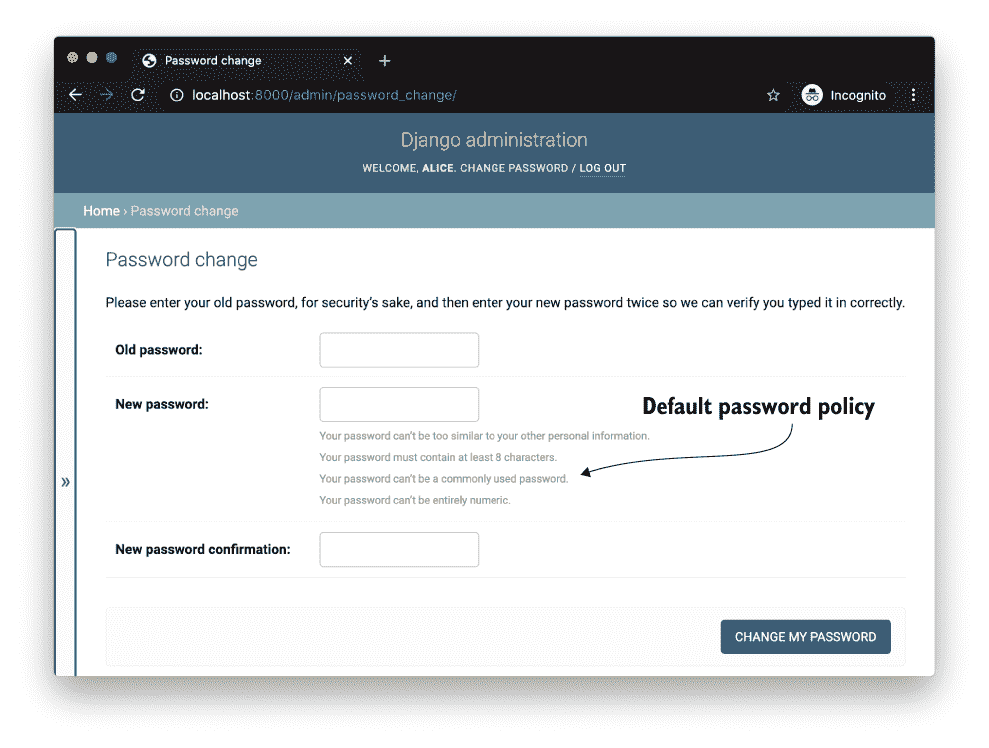
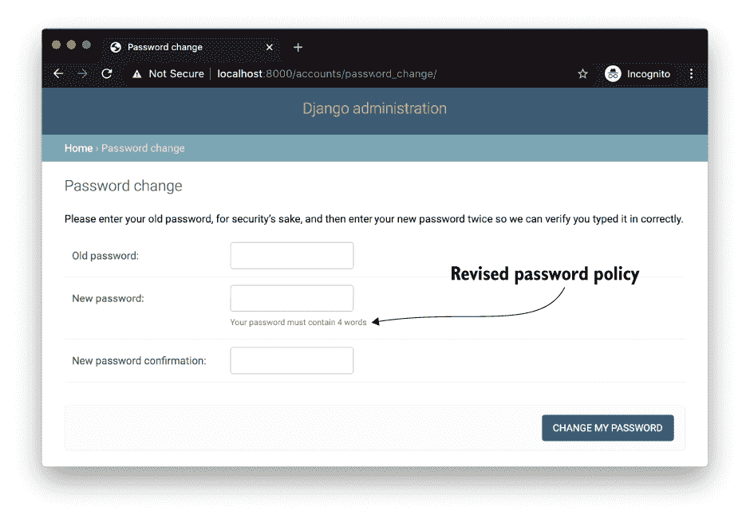
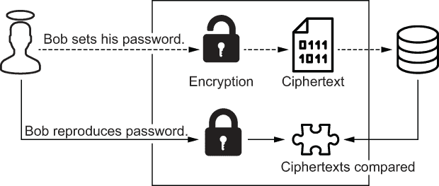
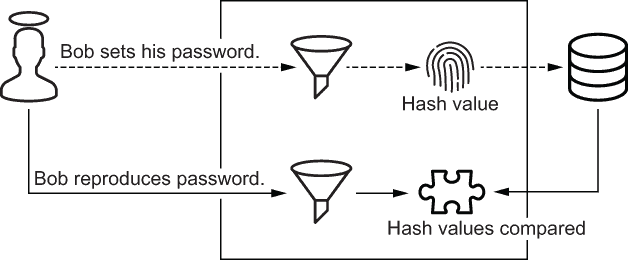
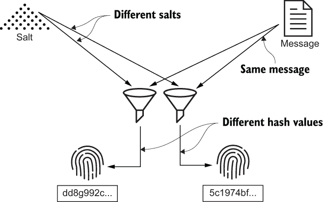
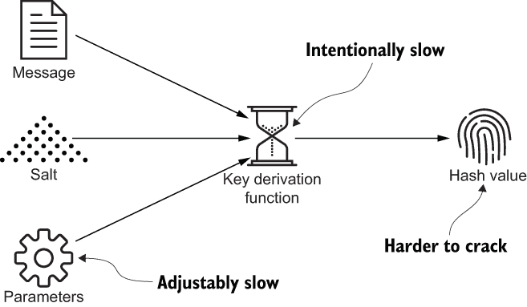
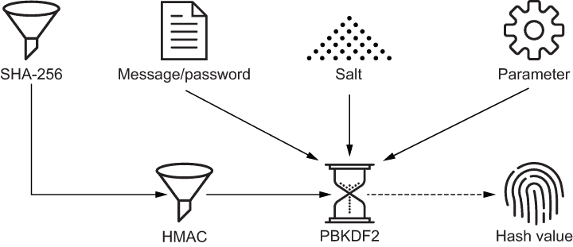
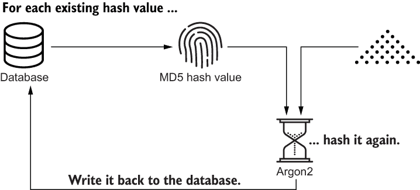
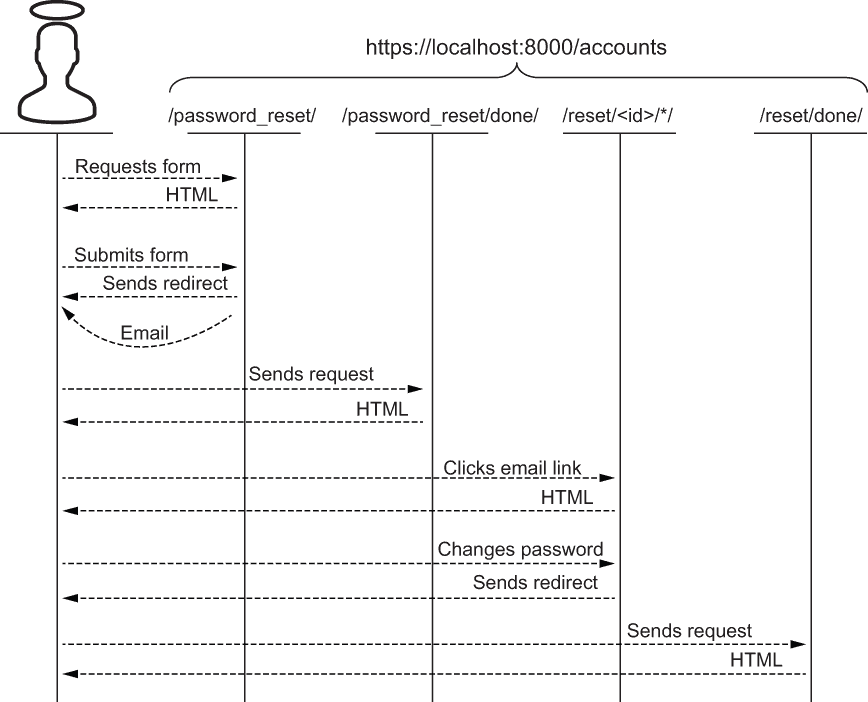
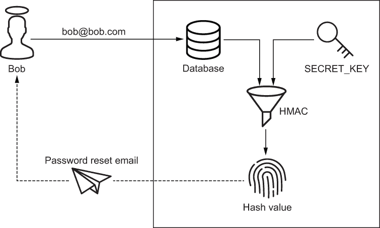

# 9 用户密码管理

本章内容

+   更改、验证和重置用户密码

+   使用加盐哈希抵抗突破

+   使用密钥派生函数抵抗暴力攻击

+   迁移哈希密码

在之前的章节中，你已经了解了哈希和认证； 在本章中，你将了解这些主题的交集。 Bob 在本章中使用了两个新的工作流程：密码更改工作流程和密码重置工作流程。 数据认证再次出现。 你将盐化哈希和密钥派生函数结合起来作为防范突破和暴力攻击的防御层。 在此过程中，我将向你展示如何选择和执行密码策略。 最后，我将向你展示如何从一种密码哈希策略迁移到另一种密码哈希策略。

## 9.1 密码更改工作流程

在前一章中，你将 URL 路径映射到一组内置 Django 视图。 你使用了其中的两个视图，`LoginView` 和 `LogoutView`，构建了认证工作流程。 在本节中，我将向你展示另一个由另外两个视图组成的工作流程：`PasswordChangeView` 和 `PasswordChangeDoneView`。

你很幸运；你的项目已经在使用内置视图进行此工作流程。 你在前一章已经完成了这项工作。 如果服务器尚未运行，请启动服务器，然后作为 Bob 重新登录，并将浏览器指向 [`localhost:8000/admin/password _change/`](https://localhost:8000/admin/password%20_change/)。 之前，你将此 URL 映射到 `PasswordChangeView`，一个用于更改用户密码的视图，该表单包含三个必填字段，如图 9.1 所示：

+   用户的密码

+   新密码

+   新密码确认

注意新密码字段旁边的四个输入约束。 这些约束代表项目的*密码策略*。 这是一组旨在防止用户选择弱密码的规则。 `PasswordChangeView` 在提交表单时执行此策略。



图 9.1 内置密码更改表单强制执行四个约束的密码策略。

Django 项目的密码策略由 `AUTH_PASSWORD_VALIDATORS` 设置定义。 此设置是用于确保密码强度的密码验证器列表。 每个密码验证器强制执行单个约束。 此设置默认为空列表，但每个生成的 Django 项目都配置有四个明智的内置验证器。 以下清单说明了默认密码策略； 这段代码已经出现在项目的 `settings` 模块中。

清单 9.1 默认密码策略

```py
AUTH_PASSWORD_VALIDATORS = [
    {
      'NAME': 'django.contrib.auth...UserAttributeSimilarityValidator',
    },
    {
      'NAME': 'django.contrib.auth...MinimumLengthValidator',
    },
    {
      'NAME': 'django.contrib.auth...CommonPasswordValidator',
    },
    {
      'NAME': 'django.contrib.auth...NumericPasswordValidator',
    },
]
```

`UserAttributeSimilarityValidator` 拒绝任何类似于用户名、名字、姓氏或电子邮件的密码。 这可以防止 Mallory 猜测像 `alice12345` 或 `bob@bob.com` 这样的密码。

此验证器包含两个可选字段：`user_attributes` 和 `max_similarity`。`user_attributes` 选项修改验证器检查的用户属性。`max_similarity` 选项修改验证器的严格程度。默认值为 0.7；降低此数字会使验证器更加严格。以下列表演示了如何配置 `UserAttributeSimilarityValidator` 来严格测试三个自定义属性。

列表 9.2 验证密码相似性

```py
{
   'NAME': 'django.contrib.auth...UserAttributeSimilarityValidator',
   'OPTIONS': {
       'user_attributes': ('custom', 'attribute', 'names'),
       'max_similarity': 0.6,      ❶
   }
}
```

❶ 默认值为 0.7

`MinimumLengthValidator`，如列表 9.3 所示，拒绝任何太短的密码。这可以防止 Mallory 通过诸如 `b06` 这样的密码暴力破解受密码保护的帐户。默认情况下，此验证器拒绝少于八个字符的任何密码。此验证器包含一个可选的 `min_length` 字段，以强制执行更长的密码。

列表 9.3 验证密码长度

```py
{
   'NAME': 'django.contrib.auth.password_validation.MinimumLengthValidator',
   'OPTIONS': {
       'min_length': 12,     ❶
   }
}
```

❶ 默认值为 8。

`CommonPasswordValidator` 拒绝在 20,000 个常见密码列表中找到的任何密码；请参见列表 9.4。这可以防止 Mallory 破解受密码保护的帐户，例如 `password` 或 `qwerty`。此验证器包含一个可选的 `password_list_path` 字段，以覆盖常见密码列表。

列表 9.4 禁止常见密码

```py
{
   'NAME': 'django.contrib.auth.password_validation.CommonPasswordValidator',
   'OPTIONS': {
       'password_list_path': '/path/to/more-common-passwords.txt.gz',
   }
}
```

`NumericPasswordValidator`，顾名思义，拒绝纯数字密码。在下一节中，我将向您展示如何通过自定义密码验证器加强密码策略。

### 9.1.1 自定义密码验证

在项目的 profile_info 目录下创建一个名为 validators.py 的文件。在此文件中，添加列表 9.5 中的代码。`PassphraseValidator` 确保密码是一个由四个单词组成的密码短语。您在第三章学习了有关密码短语的知识。`PassphraseValidator` 通过将字典文件加载到内存中来初始化自身。`get_help_text` 方法传达约束；Django 将此消息传递给用户界面。

列表 9.5 自定义密码验证器

```py
from django.core.exceptions import ValidationError
from django.utils.translation import gettext_lazy as _

class PassphraseValidator:

    def __init__(self, dictionary_file='/usr/share/dict/words'):
        self.min_words = 4
        with open(dictionary_file) as f:                                 ❶
            self.words = set(word.strip() for word in f)                 ❶

    def get_help_text(self):
        return _('Your password must contain %s words' % self.min_words) ❷

```

❶ 将字典文件加载到内存中

❷ 将约束传达给用户

接下来，在 `PassphraseValidator` 中添加列表 9.6 中的方法。`validate` 方法验证每个密码的两个属性。密码必须由四个单词组成，并且字典必须包含每个单词。如果密码不符合这两个条件，`validate` 方法会引发 `ValidationError`，拒绝密码。然后 Django 重新渲染带有 `ValidationError` 消息的表单。

列表 9.6 validate 方法

```py
class PassphraseValidator:

...

    def validate(self, password, user=None):
        tokens = password.split(' ')

        if len(tokens) < self.min_words:                                   ❶
            too_short = _('This password needs %s words' % self.min_words) ❶
            raise ValidationError(too_short, code='too_short')             ❶

        if not all(token in self.words for token in tokens):               ❷
            not_passphrase = _('This password is not a passphrase')        ❷
            raise ValidationError(not_passphrase, code='not_passphrase')   ❷
```

❶ 确保每个密码由四个单词组成

❷ 确保每个单词有效

默认情况下，`PassphraseValidator`使用许多标准 Linux 发行版中附带的字典文件。非 Linux 用户可以从网上下载替代品（[www.karamasoft.com/UltimateSpell/Dictionary.aspx](https://www.karamasoft.com/UltimateSpell/Dictionary.aspx)）。`PassphraseValidator`可以使用可选字段`dictionary_file`来适应替代字典文件。此选项表示覆盖字典文件的路径。

一个类似`PassphraseValidator`的自定义密码验证器配置方式与本机密码验证器相同。打开`settings`模块，将`AUTH_PASSWORD_VALIDATORS`中的所有四个本机密码验证器替换为`PassphraseValidator`：

```py
AUTH_PASSWORD_VALIDATORS = [
    {
        'NAME': 'profile_info.validators.PassphraseValidator',
        'OPTIONS': {
            'dictionary_file': '/path/to/dictionary.txt.gz',     ❶
        }
    },
]
```

❶ 可选地覆盖字典路径

重新启动您的 Django 服务器，并刷新页面/ accounts / password_change /。请注意，新密码字段的所有四个输入约束都被一个约束替换：`Your` `password` `must` `contain` `4` `words`（图 9.2）。这与您从`get_help_text`方法返回的消息相同。



图 9.2 需要口令的内置密码更改表单

最后，为 Bob 选择一个新的口令并提交表单。为什么要选择一个口令？一般来说：

+   Bob*记住*一个口令比记住一个常规密码*更容易*。

+   Mallory*猜测*一个口令比猜测一个常规密码*更难*。

提交表单后，服务器将您重定向到一个简单的模板，确认 Bob 的密码更改。在下一节中，我将解释 Bob 的密码是如何存储的。

## 9.2 密码存储

每个身份验证系统都存储着您密码的表示。当您登录时，必须根据用户名和密码的挑战来重现此密码。系统将您重现的密码与存储的表示进行比较，以验证您的身份。

组织以许多方式表示密码。一些方式比其他方式更安全。让我们看看三种方法：

+   明文

+   密文

+   哈希值

*明文* 是存储用户密码的最严重的方式。在这种情况下，系统存储密码的文字副本。存储的密码与用户登录时用户复制的密码直接进行比较。这是一个可怕的做法，因为如果攻击者未经授权地访问密码存储，他将可以访问每个用户的帐户。这可能是来自组织外部的攻击者，也可能是系统管理员等员工。

明文密码存储

幸运的是，明文密码存储很少见。不幸的是，一些新闻机构通过轰动的标题制造了一个假象，即这种现象很常见。

例如，在 2019 年初，安全领域出现了一波标题，比如“Facebook 承认以明文形式存储密码”。任何看过标题后面内容的人都知道 Facebook 并不是故意以明文形式存储密码；Facebook 是在意外记录它们。

这是不可原谅的，但并非标题所宣传的那样。如果您在互联网上搜索“以明文形式存储密码”，您会发现关于雅虎和谷歌的安全事件的类似耸人听闻的标题。

将密码存储为密文并没有比将其存储为明文好多少。在这种情况下，系统加密每个密码并存储密文。当用户登录时，系统加密再现密码并将密文与存储中的密文进行比较。图 9.3 说明了这个可怕的想法。



图 9.3 如何不存储密码

存储加密密码是一条很滑的坡。这意味着如果攻击者未经授权地访问密码存储和密钥，系统管理员通常都拥有这两者，那么攻击者就可以访问每个用户的账户。因此，加密密码对于恶意系统管理员或者可以操纵系统管理员的攻击者来说是一个容易的目标。

2013 年，超过 3800 万 Adobe 用户的加密密码被泄露并公开。这些密码是用 ECB 模式中的 3DES 加密的。（你在第四章学习了 3DES 和 ECB 模式。）一个月内，数百万这些密码被黑客和密码分析师逆向工程，或者*破解*。

任何现代身份验证系统都不会存储您的密码；它会对您的密码进行哈希。当您登录时，系统会将您再现密码的哈希值与存储中的哈希值进行比较。如果两个值匹配，您就通过了身份验证。如果两个值不匹配，您必须再试一次。图 9.4 说明了这个过程的简化版本。



图 9.4 基于哈希的密码验证的简化示例

密码管理是加密哈希函数属性的一个很好的现实世界示例。与加密算法不同，哈希函数是单向的；密码易于验证但难以恢复。碰撞抗性的重要性是显而易见的；如果两个密码与匹配的哈希值发生碰撞，任何一个密码都可以用来访问同一个账户。

一个哈希函数本身是否适合用于哈希密码？答案是否定的。2012 年，超过 600 万 LinkedIn 密码的哈希值被泄露并发布到一个俄罗斯黑客论坛。1 当时，LinkedIn 正在用 SHA1 对密码进行哈希，这是你在第二章学习过的一个哈希函数。两周内，超过 90%的密码被破解。

这些密码是如何被破解的呢？假设现在是 2012 年，Malory 想要破解最近发布的哈希值。她下载了包含被泄露的用户名和 SHA1 哈希值的表 9.1 数据集。

表 9.1 领英的摘要密码存储

| username | hash_value |
| --- | --- |
| ... | ... |
| alice | 5baa61e4c9b93f3f0682250b6cf8331b7ee68fd8 |
| bob | 6eb5f4e39660b2ead133b19b6996b99a017e91ff |
| charlie | 5baa61e4c9b93f3f0682250b6cf8331b7ee68fd8 |
| ... | ... |

Malory 可以使用多种工具：

+   常见密码列表

+   哈希函数确定性

+   彩虹表

首先，Malory 可以避免对每个可能的密码进行哈希，只需对最常见的密码进行哈希。之前，你了解了 Django 如何使用常见密码列表来执行密码策略。具有讽刺意味的是，Malory 可以使用相同的列表来破解没有此防御层的站点的密码。

其次，你有没有注意到 Alice 和 Charlie 的哈希值是相同的？Malory 不能立即确定任何人的密码，但是通过最小的努力，她知道 Alice 和 Charlie 使用相同的密码。

最后但并非最不重要的，Malory 可以尝试运气，使用 *彩虹表*。这是一个非常庞大的消息表，映射到预先计算的哈希值。这允许 Malory 快速找到哈希值映射到哪条消息（密码），而不必采用暴力破解；她可以用空间换时间。换句话说，她可以支付获取彩虹表的存储和传输成本，而不是支付暴力破解的计算开销。例如，[`project-rainbowcrack.com`](https://project-rainbowcrack.com) 上的 SHA1 彩虹表大小为 690 GB。

所有三个用户的密码都显示在表 9.2 中，这是一个极为简化的彩虹表。注意，Bob 使用的密码比 Alice 和 Charlie 的密码强得多。

表 9.2 Malory 下载的一个简化的 SHA1 彩虹表

| hash_value | sha1_password |
| --- | --- |
| ... | ... |
| 5baa61e4c9b93f3f0682250b6cf8331b7ee68fd8 | password |
| ... | ... |
| 6eb5f4e39660b2ead133b19b6996b99a017e91ff | +y;kns:]+7Y] |
| ... | ... |

显然，单独使用哈希函数不适合用于密码哈希。在接下来的两个部分中，我会展示几种抵抗像 Malory 这样的攻击者的方法。

### 9.2.1 加盐哈希

*加盐* 是一种通过两个或更多相同消息计算出不同哈希值的方法。*盐* 是一串随机的字节，作为输入附加到消息中，输入到哈希函数中。每个消息都与一个唯一的盐值配对。图 9.5 展示了加盐哈希。



图 9.5 对消息进行加盐会产生不同的哈希值。

在许多方面，盐就像哈希值，而初始化向量就像加密。在第四章中你学过 IVs。这里是一个比较：

+   盐值个性化哈希值；IV 个性化密文。

+   如果盐值丢失，加盐的哈希值就毫无用处；如果 IV 丢失，密文也毫无用处。

+   盐值或 IV 与哈希值或密文一起未经混淆地存储。

+   盐值或 IV 任何一个都不应该被重用。

警告：许多程序员混淆*盐*和*密钥*，但这是两个完全不同的概念。盐和密钥的处理方式不同，产生不同的效果。盐值不是秘密，应该用于哈希一个且仅一个消息。密钥是用来保密的，可以用于哈希一个或多个消息。盐值用于区分相同消息的哈希值；密钥绝不应该用于此目的。

盐处理是对付像 Mallory 这样的黑客的有效对策。通过使每个哈希值个性化，Alice 和 Charlie 的相同密码哈希成不同的哈希值。这使得 Mallory 失去了线索：她不再知道 Alice 和 Charlie 有相同的密码。更重要的是，Mallory 无法使用彩虹表来破解加盐哈希值。因为彩虹表中没有加盐哈希值，因为彩虹表作者无法预先预测盐值。

以下代码演示了使用 BLAKE2 进行盐处理。（你在第二章学到了 BLAKE2。）这段代码对同一消息进行了两次哈希处理。每个消息都使用一个唯一的 16 字节盐进行哈希处理，从而产生一个唯一的哈希值：

```py
>>> from hashlib import blake2b
>>> import secrets
>>> 
>>> message = b'same message'
>>> 
>>> sodium = secrets.token_bytes(16)       ❶
>>> chloride = secrets.token_bytes(16)     ❶
>>> 
>>> x = blake2b(message, salt=sodium)      ❷
>>> y = blake2b(message, salt=chloride)    ❷
>>> 
>>> x.digest() == y.digest()               ❸
False                                      ❸
```

❶ 生成两个随机的 16 字节盐值

❷ 相同的消息，不同的盐值

❸ 不同的哈希值

尽管 BLAKE2 内置支持盐处理，但不适合用于密码哈希，其他常规的加密哈希函数也是如此。这些函数的主要限制是反直觉的：这些函数太快了。哈希函数越快，通过暴力破解密码的成本就越低。这使得像 Mallory 这样的人更便宜地破解密码。

警告：BLAKE2 出现在本节是为了教学目的。它绝不能用于密码哈希。它太快了。

密码哈希是您实际上想要追求低效率的少数情况之一。快速是坏事；慢速是好事。常规哈希函数不是这项工作的正确工具。在下一节中，我将向您介绍一类设计上慢速的函数。

### 9.2.2 密钥派生函数

*密钥* *派生函数* (*KDFs*) 在计算机科学中占据着一个有趣的位置，因为它们是过度消耗资源的仅有的有效用例之一。这些函数在故意消耗大量计算资源、内存或两者的同时对数据进行哈希处理。因此，KDFs 已经取代了常规哈希函数成为哈希密码的最安全方式。资源消耗越高，使用暴力破解密码的成本就越高。

像哈希函数一样，KDF 接受一条消息并生成一个哈希值。该消息称为*初始密钥*，哈希值称为*派生密钥*。在本书中，我不使用*初始密钥*或*派生密钥*这两个术语，以避免向您提供不必要的词汇。KDF 还接受一个盐。就像之前看到的 BLAKE2 一样，

salt 个性化每个哈希值。



图 9.6 密钥派生函数接受一条消息、盐和至少一个配置参数。

与常规哈希函数不同，KDF 接受至少一个配置参数，旨在调整资源消耗。KDF 不仅运行缓慢；你告诉它要多慢。图 9.6 说明了 KDF 的输入和输出。

KDFs 通过其消耗的资源种类进行区分。所有的 KDF 都被设计为计算密集型；其中一些被设计为内存密集型。在本节中，我将研究其中的两种：

+   基于密码的密钥派生函数 2

+   Argon2

*基于密码的密钥派生函数 2*（*PBKDF2*）是一种流行的基于密码的 KDF。这可以说是 Python 中最广泛使用的 KDF，因为 Django 默认使用它来哈希密码。PBKDF2 被设计为包装并迭代调用哈希函数。迭代次数和哈希函数都是可配置的。在现实世界中，PBKDF2 通常包装一个 HMAC 函数，而 HMAC 函数又经常包装 SHA-256。图 9.7 描述了一个 PBKDF2 包装 HMAC-SHA256 的实例。



图 9.7 SHA-256 被 HMAC 包装，HMAC 被 PBKDF2 包装

创建一个名为 pbkdf2.py 的文件，并将列表 9.7 中的代码添加到其中。此脚本为 PBKDF2 建立了一个简单的性能基准。

它开始通过解析命令行中的迭代次数。这个数字通过告诉 PBKDF2 调整它调用 HMAC-SHA256 的次数来调整 PBKDF2。接下来，脚本定义了一个名为 `test` 的函数；此函数包装了 Python 的 `hashlib` 模块中的 `pbkdf2_hmac` 函数。`pbkdf2_hmac` 函数期望一个底层哈希函数的名称、一条消息、一个盐和迭代次数。最后，脚本使用 `timeit` 模块记录运行测试方法 10 次所需的秒数。

列表 9.7 对 PBKDF2 包装 HMAC-SHA256 的单个调用

```py
import hashlib
import secrets
import sys
import timeit

iterations = int(sys.argv[1])                                         ❶

def test():
    message = b'password'
    salt = secrets.token_bytes(16)
    hash_value = hashlib.pbkdf2_hmac('sha256',
                                     message,
                                     salt,
                                     iterations)                      ❷
    print(hash_value.hex())

if __name__ == '__main__':
    seconds = timeit.timeit('test()', number=10, globals=globals())   ❸
    print('Seconds elapsed: %s' % seconds)
```

❶ 参数化迭代次数

❷ 调整资源消耗

❸ 运行测试方法 10 次

运行以下命令，以粗体字体显示，以执行具有 260,000 次迭代次数的脚本。在撰写本文时，Django 在使用 PBKDF2 哈希密码时默认使用此数字。输出的最后一行，也以粗体显示，是运行 PBKDF2 10 次所需的秒数：

```py
$ python pbkdf2.py 260000
685a8d0d9a6278ac8bc5f854d657dde7765e0110f145a07d8c58c003815ae7af
fd723c866b6bf1ce1b2b26b2240fae97366dd2e03a6ffc3587b7d041685edcdc
5f9cd0766420329df6886441352f5b5f9ca30ed4497fded3ed6b667ce5c095d2
175f2ed65029003a3d26e592df0c9ef0e9e1f60a37ad336b1c099f34d933366d
1725595f4d288f0fed27885149e61ec1d74eb107ee3418a7c27d1f29dfe5b025
0bf1335ce901bca7d15ab777ef393f705f33e14f4bfa8213ca4da4041ad1e8b1
c25a06da375adec19ea08c8fe394355dced2eb172c89bd6b4ce3fecf0749aff9
a308ecca199b25f00b9c3348ad477c93735fbe3754148955e4cafc8853a4e879
3e8be1f54f07b41f82c92fbdd2f9a68d5cf5f6ee12727ecf491c59d1e723bb34
135fa69ae5c5a5832ad1fda34ff8fcd7408b6b274de621361148a6e80671d240
Seconds elapsed: 2.962819952
```

接下来，在命令行的末尾添加一个 0 并再次运行脚本。请注意响应时间的急剧增加，如下所示（粗体显示）：

```py
$ python pbkdf2.py 2600000
00f095ff2df1cf4d546c79a1b490616b589a8b5f8361c9c8faee94f11703bd51
37b401970f4cab9f954841a571e4d9d087390f4d731314b666ca0bc4b7af88c2
99132b50107e37478c67e4baa29db155d613619b242208fed81f6dde4d15c4e7
65dc4bba85811e59f00a405ba293958d1a55df12dd2bb6235b821edf95ff5ace
7d9d1fd8b21080d5d2870241026d34420657c4ac85af274982c650beaecddb7b
2842560f0eb8e4905c73656171fbdb3141775705f359af72b1c9bfce38569aba
246906cab4b52bcb41eb1fd583347575cee76b91450703431fe48478be52ff82
e6cd24aa5efdf0f417d352355eefb5b56333389e8890a43e287393445acf640e
d5f463c5e116a3209c92253a8adde121e49a57281b64f449cf0e89fc4c9af133
0a52b3fca5a77f6cb601ff9e82b88aac210ffdc0f2ed6ec40b09cedab79287d8
Seconds elapsed: 28.934859217
```

当 Bob 登录 Django 项目时，他必须等待 PBKDF2 返回一次。如果 Mallory 尝试破解 Bob 的密码，她必须一次又一次地等待它返回，直到她生成了 Bob 的任何密码。如果 Bob 选择了一个密码短语，这个任务可能需要比 Mallory 活着的时间更长。

类似 Mallory 这样的攻击者经常使用 *图形处理单元*（*GPUs*）来将暴力破解攻击的时间减少数个数量级。GPU 是专门的处理器，最初设计用于渲染图形。与 CPU 类似，GPU 使用多个核心处理数据。CPU 核心比 GPU 核心更快，但是 GPU 可以比 CPU 拥有更多的核心。这使 GPU 能够在许多可并行化的子任务中表现出色。此类任务包括机器学习、比特币挖掘，以及——你猜对了——密码破解。密码学家对这种威胁作出了回应，创建了一代新的 KDF，旨在抵抗这种类型的攻击。

2013 年，一群密码学家和安全从业者宣布了一个新的密码哈希竞赛（PHC）。其目标是选择并标准化一个能够抵抗现代破解技术的密码哈希算法（[`password-hashing.net`](https://password-hashing.net)）。两年后，名为 *Argon2* 的基于密码的 KDF 赢得了 PHC。

Argon2 既是内存密集型又是计算密集型。这意味着一个有抱负的密码破解者必须获取大量的内存以及大量的计算资源。Argon2 因其抵抗 FPGA 和 GPU 驱动的破解而受到赞扬。

Argon2 的主力是 BLAKE2。这是具有让人惊讶的缓慢速度的 Argon2 的讽刺。底层是什么？一个以速度著称的哈希函数。

注意：对于新项目，请使用 Argon2。PBKDF2 是一个比平均水平更好的 KDF，但不是最适合这项工作的工具。稍后我将向你展示如何将 Django 项目从 PBKDF2 迁移到 Argon2。

在下一节中，我将向你展示如何在 Django 中配置密码哈希。这使你可以加固 PBKDF2 或将其替换为 Argon2。

## 9.3 配置密码哈希

Django 的密码哈希是高度可扩展的。通常情况下，通过 `settings` 模块进行配置。`PASSWORD_HASHERS` 设置是一个密码哈希函数列表。默认值是四个密码哈希函数实现的列表。这些密码哈希器中的每一个都包装了一个 KDF。前三个应该看起来很熟悉：

```py
PASSWORD_HASHERS = [
   'django.contrib.auth.hashers.PBKDF2PasswordHasher',
   'django.contrib.auth.hashers.PBKDF2SHA1PasswordHasher',
   'django.contrib.auth.hashers.Argon2PasswordHasher',
   'django.contrib.auth.hashers.BCryptSHA256PasswordHasher',
]
```

Django 在密码列表中使用第一个密码哈希函数来对新密码进行哈希。这发生在你的账户创建时以及你更改密码时。哈希值存储在数据库中，可以用于验证未来的认证尝试。

列表中的任何密码哈希器都可以根据先前存储的哈希值验证认证尝试。例如，使用前面示例配置的项目将使用 PBKDF2 对新密码或更改的密码进行哈希，但它可以验证先前由 PBKDF2SHA1、Argon2 或 BCryptSHA256 哈希的密码。

每次用户成功登录时，Django 会检查他们的密码是否是使用列表中的第一个密码哈希器哈希的。如果不是，则会重新使用第一个密码哈希器对密码进行哈希，并将哈希值存储在数据库中。

### 9.3.1 本地密码哈希器

Django 原生支持 10 个密码哈希器。`MD5PasswordHasher`、`SHA1PasswordHasher`及其非盐值对应项都是不安全的。这些组件已用粗体显示。Django 保留这些密码哈希器以向后兼容旧系统：

+   `django.contrib.auth.hashers.PBKDF2PasswordHasher`

+   `django.contrib.auth.hashers.PBKDF2SHA1PasswordHasher`

+   `django.contrib.auth.hashers.Argon2PasswordHasher`

+   `django.contrib.auth.hashers.BCryptSHA256PasswordHasher`

+   `django.contrib.auth.hashers.BCryptPasswordHasher`

+   `**django.contrib.auth.hashers.SHA1PasswordHasher**`

+   `**django.contrib.auth.hashers.MD5PasswordHasher**`

+   `**django.contrib.auth.hashers.UnsaltedSHA1PasswordHasher**`

+   `**django.contrib.auth.hashers.UnsaltedMD5PasswordHasher**`

+   `django.contrib.auth.hashers.CryptPasswordHasher`

警告：使用`SHA1PasswordHasher`、`MD5PasswordHasher`、`UnsaltedSHA1PasswordHasher`或`UnsaltedMD5PasswordHasher`配置 Django 项目是不安全的。因为这些组件生成的密码易于破解，底层哈希函数速度快且加密弱。本章后面，我将向你展示如何解决这个问题。

在编写本文时，Django 默认使用具有 260,000 次迭代的`PBKDF2PasswordHasher`。随着每个新版本的发布，Django 开发团队会增加迭代次数。希望自行增加此值的 Python 程序员可以使用自定义密码哈希器。如果系统不幸卡在旧版本的 Django 上，则这是有用的。

### 9.3.2 自定义密码哈希器

当扩展本地密码哈希器时，配置自定义密码哈希器非常简单。请看以下代码中的`TwoFoldPBKDF2PasswordHasher`。此类继承自`PBKDF2PasswordHasher`，并将迭代次数增加了两倍。请记住，这样的配置更改并非没有代价。根据设计，此更改也会增加登录延迟：

```py
from django.contrib.auth.hashers import PBKDF2PasswordHasher

class TwoFoldPBKDF2PasswordHasher(PBKDF2PasswordHasher):

    iterations = PBKDF2PasswordHasher.iterations * 2      ❶
```

❶ 将迭代次数加倍

通过`PASSWORD_HASHERS`配置自定义密码哈希器，就像本地密码哈希器一样：

```py
PASSWORD_HASHERS = [
    'profile_info.hashers.TwoFoldPBKDF2PasswordHasher',
]
```

`TwoFoldPBKDF2PasswordHasher`可以验证先前由`PBKDF2PasswordHasher`计算的哈希值的认证尝试，因为底层的 KDF 是相同的。这意味着在现有生产系统上可以安全地进行这样的更改。当用户进行身份验证时，Django 会升级先前存储的哈希值。

### 9.3.3 Argon2 密码哈希

每个新的 Django 项目都应该使用 Argon2 进行密码哈希。如果在系统推送到生产环境之前进行此更改，这将只花费你几秒钟的时间。如果想要在用户为自己创建账户之后再进行此更改，工作量将会大幅增加。本节介绍了简单的方法；下一节将介绍困难的方法。

配置 Django 使用 Argon2 很容易。首先，确保`Argon2PasswordHasher`是`PASSWORD_HASHERS`中的第一个且唯一的密码哈希器。接下来，在虚拟环境中运行以下命令。这将安装`argon2-cffi`软件包，为`Argon2PasswordHasher`提供一个 Argon2 实现。

```py
$ pipenv install django[argon2]
```

警告：在已经处于生产状态的系统上将所有默认密码哈希器替换为`Argon2PasswordHasher`是不明智的。这样做会阻止现有用户登录。

如果系统已经处于生产状态，则`Argon2PasswordHasher`将无法单独验证现有用户的未来身份验证尝试；旧用户账户将变得不可访问。在这种情况下，`Argon2PasswordHasher`必须是`PASSWORD_HASHERS`的首选，并且传统的密码哈希器应该是尾部。这样配置 Django 可以使用 Argon2 对新用户的密码进行哈希。Django 还会在用户登录时将现有用户的密码升级为 Argon2。

警告：Django 仅在用户进行身份验证时才升级现有的密码哈希值。如果每个用户在短时间内都进行身份验证，则这不是问题，但通常情况下并非如此。

更强的密码哈希器提供的安全性直到用户升级后登录才会被用户意识到。对于一些用户，这可能是几秒钟；对于其他用户，永远不会发生。在他们登录之前，原始哈希值将保持不变（可能是脆弱的）存储在密码存储中。下一节将解释如何将所有用户迁移到升级后的密码哈希器。

### 9.3.4 迁移密码哈希器

在 2012 年 6 月，在 LinkedIn 宣布泄露的同一周，超过 150 万个 eharmony 密码的未加盐哈希值被泄露并发布。您可以在 [`defuse.ca/files/eharmony-hashes.txt`](https://defuse.ca/files/eharmony-hashes.txt) 上查看。当时，eharmony 使用的是 MD5 进行密码哈希，这是你在第二章学到的一种不安全的哈希函数。根据一个破解者 ([`mng.bz/jBPe`](http://mng.bz/jBPe)) 的说法：

如果 eharmony 在它们的哈希中使用了盐，就像它们应该的那样，我就不能运行这次攻击了。事实上，盐会迫使我对每个哈希值分别进行字典攻击，这将花费我超过 31 年的时间。

让我们考虑 eharmony 如何缓解这个问题。假设 Alice 在 eharmony 的第一天上班。她继承了一个具有以下配置的现有系统：

```py
PASSWORD_HASHERS = [
   'django.contrib.auth.hashers.UnsaltedMD5PasswordHasher',
]
```

这个系统的作者因使用 `UnsaltedMD5PasswordHasher` 而被解雇。现在轮到 Alice 负责将系统迁移到 `Argon2PasswordHasher` 而不会出现任何停机。该系统有 150 万用户，因此她不能强制每个用户都重新登录。可以理解的是，产品经理不想重置每个帐户的密码。Alice 意识到前进的唯一方法是对密码进行两次哈希，一次使用 `UnsaltedMD5PasswordHasher`，再一次使用 `Argon2PasswordHasher`。Alice 的游戏计划是 添加-迁移-删除：

1.  添加 `Argon2PasswordHasher`

1.  迁移哈希值

1.  删除 `UnsaltedMD5PasswordHasher`

首先，Alice 将 `Argon2PasswordHasher` 添加到 `PASSWORD_HASHERS` 中。这将问题限制在那些最近没有登录的现有用户身上。引入 `Argon2PasswordHasher` 是简单的一部分；摆脱 `UnsaltedMD5PasswordHasher` 则是困难的一部分。Alice 将 `UnsaltedMD5PasswordHasher` 保留在列表中以确保现有用户可以访问他们的帐户：

```py
PASSWORD_HASHERS = [
 'django.contrib.auth.hashers.Argon2PasswordHasher',       ❶
   'django.contrib.auth.hashers.UnsaltedMD5PasswordHasher',
]
```

❶ 将 Argon2PasswordHasher 添加到列表的开头

接下来，Alice 必须迁移哈希值；这是大部分工作。她不能只是用 Argon2 重新哈希密码，所以她必须将它们双重哈希。换句话说，她计划从数据库中读取每个 MD5 哈希值，并将其传递到 Argon2 中；Argon2 的输出，另一个哈希值，然后将替换数据库中的原始哈希值。Argon2 需要盐并且比 MD5 慢得多；这意味着像 Mallory 这样的破解者需要超过 31 年才能破解这些密码。图 9.8 说明了 Alice 的迁移计划。



图 9.8 用 MD5 哈希一次，然后用 Argon2 哈希

Alice 不能仅仅修改生产认证系统的哈希值而不影响用户。`Argon2PasswordHasher` 和 `UnsaltedMD5PasswordHasher` 都不知道如何处理新的哈希值；用户将无法登录。在 Alice 修改哈希值之前，她必须首先编写并安装一个能够解释新哈希值的自定义密码哈希器。

Alice 编写了 `UnsaltedMD5ToArgon2PasswordHasher`，如列表 9.8 所示。这个密码哈希器弥合了 `Argon2PasswordHasher` 和 `UnsaltedMD5PasswordHasher` 之间的差距。和所有密码哈希器一样，这个哈希器实现了两个方法：encode 和 verify。当你设置密码时，Django 调用 `encode` 方法；这个方法负责对密码进行哈希。当你登录时，Django 调用 `verify` 方法；这个方法负责比较数据库中的原始哈希值和重现密码的哈希值。

列表 9.8 使用自定义密码哈希器迁移哈希值

```py
from django.contrib.auth.hashers import (
    Argon2PasswordHasher,
    UnsaltedMD5PasswordHasher,
)

class UnsaltedMD5ToArgon2PasswordHasher(Argon2PasswordHasher):

    algorithm = '%s->%s' % (UnsaltedMD5PasswordHasher.algorithm,
                            Argon2PasswordHasher.algorithm)

    def encode(self, password, salt):                  ❶
        md5_hash = self.get_md5_hash(password)         ❷
        return self.encode_md5_hash(md5_hash, salt)    ❷

    def verify(self, password, encoded):               ❸
        md5_hash = self.get_md5_hash(password)         ❹
        return super().verify(md5_hash, encoded)       ❹

    def encode_md5_hash(self, md5_hash, salt):
        return super().encode(md5_hash, salt)

    def get_md5_hash(self, password):
        hasher = UnsaltedMD5PasswordHasher()
        return hasher.encode(password, hasher.salt())
```

❶ 当你设置密码时由 Django 调用

❷ 使用 MD5 和 Argon2 进行哈希

❸ 当你登录时由 Django 调用

❹ 比较哈希值

爱丽丝在`PASSWORD_HASHERS`中添加了`UnsaltedMD5ToArgon2PasswordHasher`，如下面代码中加粗显示的部分所示。这没有立即效果，因为尚未修改任何密码哈希值；每个用户的密码仍然使用 MD5 或 Argon2 哈希：

```py
PASSWORD_HASHERS = [
   'django.contrib.auth.hashers.Argon2PasswordHasher',
 'django_app.hashers.UnsaltedMD5ToArgon2PasswordHasher',
   'django.contrib.auth.hashers.UnsaltedMD5PasswordHasher',
]
```

爱丽丝现在终于有能力检索每个 MD5 哈希值，用 Argon2 哈希，并将其存储回数据库。爱丽丝使用 Django 的 *迁移* 执行计划的这部分。迁移让 Django 程序员可以在纯 Python 中协调数据库更改。通常，迁移会修改数据库模式；爱丽丝的迁移只会修改数据。

列表 9.9 展示了爱丽丝的迁移过程。它首先加载每个带有 MD5 哈希密码的账户的`User`模型对象。对于每个用户，MD5 哈希值会被 Argon2 哈希。然后将 Argon2 哈希值写入数据库。

列表 9.9 用于双重哈希的数据迁移

```py
from django.db import migrations
from django.db.models.functions import Length
from django_app.hashers import UnsaltedMD5ToArgon2PasswordHasher

def forwards_func(apps, schema_editor):
   User = apps.get_model('auth', 'User')                         ❶
   unmigrated_users = User.objects.annotate(                     ❷
       text_len=Length('password')).filter(text_len=32)          ❷

   hasher = UnsaltedMD5ToArgon2PasswordHasher()
   for user in unmigrated_users:
       md5_hash = user.password
       salt = hasher.salt()
       user.password = hasher.encode_md5_hash(md5_hash, salt)    ❸
       user.save(update_fields=['password'])                     ❹

class Migration(migrations.Migration):

   dependencies = [
       ('auth', '0011_update_proxy_permissions'),                ❺
   ]

   operations = [
       migrations.RunPython(forwards_func),
   ]
```

❶ 引用了用户模型

❷ 检索具有 MD5 哈希密码的用户

❸ 用 Argon2 哈希每个 MD5 哈希值

❹ 保存双重哈希值

❺ 确保此代码在密码表创建后运行

爱丽丝知道这个操作将花费不止几分钟；Argon2 是故意设计得慢。与此同时，在生产环境中，`UnsaltedMD5ToArgon2PasswordHasher` 用于验证这些用户。最终，每个密码都会在没有停机时间的情况下迁移；这打破了对`UnsaltedMD5PasswordHasher`的依赖。

最后，爱丽丝从`PASSWORD_HASHERS`中删除了`UnsaltedMD5PasswordHasher`。她还确保由它创建的哈希值被从所有现有生产数据库的备份副本中删除或废弃：

```py
PASSWORD_HASHERS = [
   'django.contrib.auth.hashers.Argon2PasswordHasher',
   'django_app.hashers.UnsaltedMD5ToArgon2PasswordHasher',
   'django.contrib.auth.hashers.UnsaltedMD5PasswordHasher',
]
```

像大多数添加-迁移-删除工作一样，第一步和最后一步是最容易的。添加-迁移-删除不仅适用于密码迁移。这种思维方式对于任何类型的迁移工作（例如，将 URL 更改为服务，切换库，重命名数据库列）都是有用的。

到目前为止，你已经学到了很多关于密码管理的知识。你已经将一个密码更改工作流程组合成了两个内置视图。你了解密码在存储中的表示方式，并知道如何安全地对其进行哈希。在下一节中，我将向你展示另一个基于密码的工作流程，由另外四个内置视图组成���

## 9.4 密码重置工作流程

鲍勃忘记了他的密码。在这一部分，你将帮助他通过另一个工作流程重置密码。你很幸运；这次你不必编写任何代码。在上一章中，当你将八个 URL 路径映射到内置的 Django 视图时，你已经完成了这项工作。密码重置工作流程由这些视图中的最后四个组成：

+   `PasswordResetView`

+   `PasswordResetDoneView`

+   `PasswordResetConfirmView`

+   `PasswordResetCompleteView`

Bob 通过未经身份验证的请求进入密码重置页面的工作流程。该页面呈现一个表单。他输入了他的电子邮件，提交表单，然后收到了一封带有密码重置链接的电子邮件。Bob 点击链接，进入一个页面，在那里他重置了密码。图 9.9 说明了这个工作流程。



图 9.9 密码重置工作流程

退出站点并重新启动您的 Django 服务器。将浏览器指向密码重置页面 https:/./localhost:8000/accounts/password_reset/。按设计，此页面可供未经身份验证的用户访问。此页面有一个表单，一个字段：用户的电子邮件地址。输入`bob@bob.com`并提交表单。

密码重置页面的表单提交由`PasswordResetView`处理。如果与账户关联的入站电子邮件地址，将向该地址发送带有密码重置链接的电子邮件。如果电子邮件地址未与账户关联，此视图将不发送任何内容。这可以防止恶意的匿名用户使用您的服务器向某人发送未经请求的电子邮件。

密码重置 URL 包含用户的 ID 和一个令牌。这个令牌不仅仅是一串随机的字符和数字；它是一个带键哈希值。`PasswordResetView`使用 HMAC 函数生成这个哈希值。消息是一些用户字段，如 ID 和`last_login`。密钥是`SECRET_KEY`设置。图 9.10 说明了这个过程。



图 9.10 Bob 提交密码重置请求并收到密码重置令牌；该令牌是一个带键哈希值。

在上一章中，您配置了 Django 将电子邮件重定向到控制台。从控制台复制并粘贴 Bob 的密码重置 URL 到另一个浏览器选项卡中。这将传递密码重置令牌和用户的 ID 回服务器。服务器使用用户 ID 重建令牌。然后重建的令牌与入站密码重置令牌进行比较。如果两个令牌匹配，服务器知道它是令牌的作者；Bob 被允许更改他的密码。如果令牌不匹配，服务器知道入站密码重置令牌是伪造的或被篡改的。这可以防止像 Mallory 这样的人为别人的帐户重置密码。 

密码重置令牌不可重复使用。如果 Bob 想再次重置密码，他必须重新开始并完成工作流程。这减轻了 Mallory 在 Bob 收到密码重置电子邮件后访问 Bob 的电子邮件账户的风险。在这种情况下，Mallory 仍然可以伤害 Bob，但她无法使用旧的和被遗忘的密码重置电子邮件更改 Bob 的密码。

密码重置令牌有一个过期时间。这也减轻了 Mallory 访问 Bob 的密码重置电子邮件的风险。默认的密码重置超时时间为三天。这对于一个社交媒体网站来说是合理的，但对于导弹制导系统来说是不合适的。只有你可以确定你构建的系统的适当值。

使用`PASSWORD_RESET_TIMEOUT`设置来配置密码重置的过期时间（以秒为单位）。该设置弃用了`PASSWORD_RESET_TIMEOUT_DAYS`，对于某些系统来说，这种设置太粗糙了。

在前几章中，您学到了很多关于哈希和认证的知识。在本章中，您了解了这两个主题之间的关系。更改和重置密码是任何系统的基本功能；两者都严重依赖哈希。到目前为止，您学到的关于认证的知识为下一章的主题做好了准备，即授权。

## 总结

+   不要重复造轮子；使用内置的 Django 组件更改和重置用户密码。

+   使用密码验证强制和微调您的密码策略。

+   用盐哈希抵御暴力破解攻击。

+   不要使用常规哈希函数对密码进行哈希；始终使用密钥派生函数，最好选择 Argon2。

+   使用 Django 数据迁移迁移遗留密码哈希值。

+   密码重置工作流是数据认证和键控哈希的又一应用。

* * *

1. 在 2016 年，LinkedIn 承认这个数字实际上超过了 1.7 亿。
