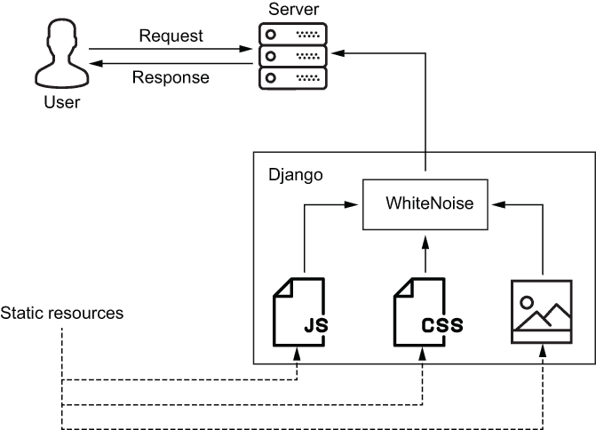

# 第十章：授权

本章内容包括

+   创建超级用户和权限

+   管理组成员

+   使用 Django 强制应用程序级别的授权

+   测试授权逻辑

认证和授权往往容易混淆。*认证* 关系到用户是谁；*授权* 关系到用户可以做什么。认证和授权通常分别称为 *authn* 和 *authz*。认证是授权的先决条件。在本章中，我涵盖了与应用程序开发相关的授权，也称为 *访问控制*。在下一章中，我将继续介绍 OAuth 2，一种标准化的授权协议。

注：在撰写本文时，*破坏授权*是 OWASP 十大关键安全风险清单上的第五项（[`owasp.org/www-project-top-ten/`](https://owasp.org/www-project-top-ten/)）。

你将从应用程序级别的权限授权开始本章。*权限* 是授权的最原子形式。它授权一个人或一组人只能执行一件事情。接下来，你将为 Alice 创建一个超级用户帐户。然后你将以 Alice 的身份登录 Django 管理控制台，在那里你将管理用户和组权限。之后，我将向你展示几种应用权限和组来控制谁可以访问受保护的资源。

## 10.1 应用程序级授权

在这一部分，你将创建一个名为*messaging*的新 Django 应用程序。该应用程序使你接触到 Django 授权、权限的最基本元素。要创建新的消息应用程序，请在项目根目录中运行以下命令。此命令将在一个名为 messaging 的新目录中生成一个 Django 应用程序：

```py
$ python manage.py startapp messaging
```

生成的应用程序的目录结构如图 10.1 所示。在这个练习中，你将在`models`模块中添加一个类，并通过对`migrations`包进行一些添加来多次修改数据库。


图 10.1 新 Django 应用程序 messaging 的目录结构

现在你需要在 Django 项目中注册你的 Django 应用程序。打开`settings`模块，找到`INSTALLED_APPS`列表。添加你在这里看到的加粗字体的行。确保不要改变之前安装的所有其他应用程序：

```py
INSTALLED_APPS = [
    ...
 'messaging',
]
```

接下来，打开 models.py 并将以下模型类定义放入其中。`AuthenticatedMessage`表示一个消息和一个具有两个属性的哈希值。在第十四章中，Alice 和 Bob 将使用此类进行安全通信：

```py
from django.db.models import Model, CharField

class AuthenticatedMessage(Model):
    message = CharField(max_length=100)
    hash_value = CharField(max_length=64)
```

正如所有模型一样，`AuthenticatedMessage`必须映射到一个数据库表。表是通过 Django 迁移创建的。（你在上一章学习过迁移。）映射由 Django 内置的 ORM 框架在运行时处理。

运行以下命令为你的模型类生成一个迁移脚本。此命令将自动检测新模型类并在迁移目录下创建一个新的迁移脚本，显示为粗体字体：

```py
$ python manage.py makemigrations messaging
Migrations for 'messaging':
 messaging/migrations/0001_initial.py      ❶
    - Create model AuthenticatedMessage
```

❶ 新的迁移脚本

最后，通过运行以下命令执行你的迁移脚本，显示为粗体：

```py
$ python manage.py migrate
Running migrations:
  Applying messaging.0001_initial... OK
```

运行你的迁移脚本不仅会创建一个新的数据库表，还会在后台创建四个新的权限。下一节将解释这些权限存在的方式和原因。

### 10.1.1 权限

Django 使用内置模型 Permission 来表示权限。Permission 模型是 Django 授权的最基本元素。每个用户可以关联零到多个权限。权限分为两类：

+   由 Django 自动创建的默认权限

+   由你创建的自定义权限

Django 会自动为每个新模型创建四个默认权限。当运行迁移时，这些权限在后台创建。这些权限允许用户创建、读取、更新和删除模型。在 Django shell 中执行以下代码，观察`AuthenticatedMessage`模型的所有四个默认权限，显示为粗体：

```py
$ python manage.py shell
>>> from django.contrib.auth.models import Permission
>>> 
>>> permissions = Permission.objects.filter(
...     content_type__app_label='messaging',
...     content_type__model='authenticatedmessage')
>>> [p.codename for p in permissions]
['add_authenticatedmessage', 'change_authenticatedmessage', 
'delete_authenticatedmessage', 'view_authenticatedmessage']
```

随着项目的发展，通常会需要自定义权限。通过将一个内部`Meta`类添加到你的模型中来声明这些权限。打开你的`models`模块，并向`AuthenticatedMessage`添加以下`Meta`类，显示为粗体，`Meta`类的`permissions`属性定义了两个自定义权限。这些权限指定了哪些用户可以发送和接收消息：

```py
class AuthenticatedMessage(Model):       ❶
    message = CharField(max_length=100)
    mac = CharField(max_length=64)

 class Meta:                          ❷
 permissions = [
 ('send_authenticatedmessage', 'Can send msgs'),
 ('receive_authenticatedmessage', 'Can receive msgs'),
 ]
```

❶ 你的模型类

❷ 你的模型 Meta 类

与默认权限类似，自定义权限在迁移期间会自动创建。使用以下命令生成一个新的迁移脚本。如粗体字体的输出所示，此命令会在迁移目录下生成一个新的脚本：

```py
$ python manage.py makemigrations messaging --name=add_permissions
Migrations for 'messaging':
 messaging/migrations/0002_add_permissions.py      ❶
    - Change Meta options on authenticatedmessage
```

❶ 新的迁移脚本

接下来，使用以下命令执行你的迁移脚本：

```py
$ python manage.py migrate
Running migrations:
  Applying messaging.0002_add_permissions... OK
```

现在，你已经向你的项目添加了一个应用、一个模型、一个数据库表和六个权限。在下一节中，你将为 Alice 创建一个账户，以她的身份登录，并将这些新权限授予 Bob。

### 10.1.2 用户和组管理

在本节中，你将创建一个超级用户 Alice。*超级用户*是具有执行所有操作权限的特殊管理用户；这些用户拥有所有权限。作为 Alice，你将访问 Django 内置的管理控制台。默认情况下，该控制台在每个生成的 Django 项目中都是启用的。管理控制台的简要介绍将向你介绍 Django 如何实现应用级授权。

如果您的 Django 项目能够提供静态内容，则管理控制台更易于使用且更好看。Django 可以自行通过 HTTP 完成此操作，但 Gunicorn 不设计通过 HTTPS 完成此操作。这个问题很容易通过 WhiteNoise 解决，它是一个专门设计用于有效地提供静态内容并最小化设置复杂性的软件包（如图 10.2 所示）。管理控制台（以及项目的其余部分）将使用 WhiteNoise 正确地向您的浏览器提供 JavaScript、样式表和图像。



图 10.2 一个 Django 应用服务器使用 WhiteNoise 提供静态资源。

在虚拟环境中运行以下 `pipenv` 命令来安装 WhiteNoise：

```py
$ pipenv install whitenoise
```

现在，您需要通过中间件在 Django 中激活 WhiteNoise。什么是中间件？*中间件*是 Django 中的一个轻量级子系统，位于每个入站请求和您的视图之间的*中间*，以及您的视图和每个出站响应之间的*中间*。从这个位置上，中间件应用前后处理逻辑。

中间件逻辑由一组中间件组件实现。每个组件都是一个独特的小型处理挂钩，负责执行特定任务。例如，内置的 `AuthenticationMiddleware` 类负责将入站 HTTP 会话 ID 映射到用户。我在后面的章节中介绍的一些中间件组件负责管理与安全相关的响应头。在本节中添加的组件 `WhiteNoiseMiddleware` 负责提供静态资源。

与 Django 的每个其他子系统一样，中间件在 `settings` 模块中进行配置。打开您的 `settings` 模块并找到 `MIDDLEWARE` 设置。该设置是一个中间件组件类名称列表。如下代码中加粗显示的那样，将 `WhiteNoiseMiddleware` 添加到 `MIDDLEWARE` 中。确保此组件紧随 `SecurityMiddleware` 之后，并位于所有其他内容之前。不要移除任何现有的中间件组件：

```py
MIDDLEWARE = [
    'django.middleware.security.SecurityMiddleware',   ❶
    'whitenoise.middleware.WhiteNoiseMiddleware',      ❷
    ...
]
```

❶ 确保 SecurityMiddleware 保持在第一位。

❷ 将 WhiteNoise 添加到您的项目中

警告：每个生成的 Django 项目都使用 `SecurityMiddleware` 作为第一个 `MIDDLEWARE` 组件进行初始化。`SecurityMiddleware` 实现了一些先前介绍过的安全特性，如 `Strict-Transport-Security` 响应头和 HTTPS 重定向。如果将其他中间件组件放在 `SecurityMiddleware` 前面，这些安全特性就会受到影响。

重新启动您的服务器，并将浏览器指向 https:/./localhost:8000/admin/ 的管理控制台登录页面。登录页面应该会显示如图 10.3\. 所示。如果您的浏览器以没有样式的相同表单呈现，则表示 WhiteNoise 尚未安装。如果 `MIDDLEWARE` 配置错误或服务器未重新启动，则会发生这种情况。管理控制台仍将在没有 WhiteNoise 的情况下工作；它只是看起来不太好而已。


图 10.3 Django 的管理登录页面

管理控制台登录页面需要具有超级用户或工作人员身份的用户的身份验证凭据；Django 不允许常规最终用户登录管理控制台。

从项目根目录运行以下命令以创建超级用户。此命令在您的数据库中创建一个超级用户；它将提示您输入新超级用户的密码：

```py
$ python manage.py createsuperuser \
         --username=alice --email=alice@alice.com
```

作为 Alice 登录管理控制台。作为超级用户，您可以从管理登录页面管理组和用户。单击组旁边的添加，导航到新的组输入表单。

小组

*组* 提供了一种将一组权限与一组用户关联起来的方法。一个组可以与零到多个权限以及零到多个用户关联。与组关联的每个权限都隐式授予该组的每个用户。

新的组输入表单，如图 10.4 所示，需要组名称和可选权限。请花一分钟观察可用权限。注意它们分成了四组。每个批次代表数据库表的默认权限，控制谁可以创建、读取、更新和删除行。


图 10.4 新的组输入表单接受组名称和多个组权限。

浏览可用权限选择器，并找到您为消息应用程序创建的权限。与其他批次不同，这个批次有六个元素：四个默认权限和两个自定义权限。

在名称字段中输入`observers`。`observers`组旨在对每个表具有只读访问权限。选择包含文本“Can view”的每个可用权限。通过单击保存提交表单。

提交表单后，您将被带到列出所有组的页面。通过单击左侧边栏中的“用户”导航到列出所有用户的类似页面。当前，此页面仅列出 Alice 和 Bob。通过单击其名称，导航到 Bob 的用户详细信息页面。向下滚动用户详细信息页面，直到找到两个相邻的组和权限部分。在此部分中，如图 10.5 所示，将 Bob 分配到`observers`组，并为他赋予消息应用程序的所有六个权限。滚动到底部，然后单击保存。


图 10.5 作为管理员分配组和权限

小组成员资格和权限不需要手动管理；相反，您可以通过编程方式进行管理。列表 10.1 展示了如何通过`User`模型的两个属性授予和撤销权限。小组成员资格通过`groups`属性授予和撤销。`user_permissions`属性允许向用户添加或删除权限。

列表 10.1 编程方式管理组和权限

```py
from django.contrib.auth.models import User
from django.contrib.auth.models import Group, Permission

bob = User.objects.get(username='bob')                                  ❶
observers = Group.objects.get(name='observers')                         ❶
can_send = Permission.objects.get(codename='send_authenticatedmessage') ❶

bob.groups.add(observers)                                               ❷
bob.user_permissions.add(can_send)                                      ❸

bob.groups.remove(observers)                                            ❹
bob.user_permissions.remove(can_send)                                   ❺
```

❶ 检索模型实体

❷ 将 Bob 添加到一个组

❸ 为 Bob 添加权限

❹ 将 Bob 从一个组中移除

❺ 从 Bob 中移除一个权限

到目前为止，你已经了解了组和权限是如何工作的。你知道它们是什么，如何创建它们，以及如何将它们应用到用户身上。但它们在实际应用中是什么样子呢？在接下来的部分，你将开始使用组和权限来解决问题。

## 10.2 强制授权

授权的整个目的是防止用户做他们不应该做的事情。这适用于系统内的操作，比如阅读敏感信息，以及系统外的操作，比如指挥飞行交通。在 Django 中有两种实施授权的方式：低级的困难方式和高级的简单方式。在本节中，我将先展示困难的方式。之后，我将向你展示如何测试你的系统是否正确地执行了授权。

### 10.2.1 低级的困难方式

`User` 模型提供了几种设计用于程序化权限检查的低级方法。下面的代码展示了 `has_perm` 方法，它允许你访问默认权限和自定义权限。在这个例子中，Bob 不被允许创建其他用户，但允许接收消息：

```py
>>> from django.contrib.auth.models import User
>>> bob = User.objects.get(username='bob')
>>> bob.has_perm('auth.add_user')                            ❶
False                                                        ❶
>>> bob.has_perm('messaging.receive_authenticatedmessage')   ❷
True                                                         ❷
```

❶ Bob 无法添加用户。

❷ Bob 可以接收消息。

对于超级用户，`has_perm` 方法将始终返回 `True`：

```py
>>> alice = User.objects.get(username='alice')
>>> alice.is_superuser                         ❶
True                                           ❶
>>> alice.has_perm('auth.add_user')
True
```

❶ Alice 可以做任何事情。

`has_perms` 方法提供了一种方便的方式来一次检查多个权限：

```py
>>> bob.has_perms(['auth.add_user',                              ❶
...                'messaging.receive_authenticatedmessage'])    ❶
False                                                            ❶
>>> 
>>> bob.has_perms(['messaging.send_authenticatedmessage',        ❷
...                'messaging.receive_authenticatedmessage'])    ❷
True                                                             ❷
```

❶ Bob 无法添加用户和接收消息。

❷ Bob 可以发送和接收消息。

低级 API 并没有错，但你应该尽量避免使用它，原因有两个：

+   低级权限检查需要比我后面介绍的方法更多的代码行。

+   更重要的是，以这种方式检查权限容易出错。例如，如果你查询这个 API 关于一个不存在的权限，它将简单地返回 `False`：

```py
>>> bob.has_perm('banana')
False
```

这是另一个陷阱。权限是一次从数据库中批量获取并缓存的。这带来了一个危险的折衷。一方面，`has_perm` 和 `has_perms` 在每次调用时不会触发数据库查询。另一方面，当你在将权限应用到用户之后立即检查权限时，你必须小心。下面的代码片段演示了为什么。在这个例子中，一个权限被从 Bob 那里拿走了。不幸的是，本地权限状态没有被更新：

```py
>>> perm = 'messaging.send_authenticatedmessage'    ❶
>>> bob.has_perm(perm)                              ❶
True                                                ❶
>>> 
>>> can_send = Permission.objects.get(              ❷
...     codename='send_authenticatedmessage')       ❷
>>> bob.user_permissions.remove(can_send)           ❷
>>> 
>>> bob.has_perm(perm)                              ❸
True                                                ❸
```

❶ Bob 从权限开始。

❷ Bob 失去了权限。

❸ 本地副本无效。

继续使用同一个例子，当在 `User` 对象上调用 `refresh_from_db` 方法时会发生什么？本地权限状态仍然没有被更新。为了获取最新状态的副本，必须重新从数据库加载一个新的 `User` 模型：

```py
>>> bob.refresh_from_db()                     ❶
>>> bob.has_perm(perm)                        ❶
True                                          ❶
>>> 
>>> reloaded = User.objects.get(id=bob.id)    ❷
>>> reloaded.has_perm(perm)                   ❷
False                                         ❷
```

❶ 本地副本仍然无效。

❷ 重新加载的模型对象有效。

这是第三个陷阱。列表 10.2 定义了一个视图。这个视图在渲染敏感信息之前执行授权检查。它有两个错误。你能发现其中任何一个吗？

列表 10.2 如何不强制授权

```py
from django.shortcuts import render
from django.views import View

class UserView(View):

    def get(self, request):
        assert request.user.has_perm('auth.view_user')   ❶
        ...
        return render(request, 'sensitive_info.html')    ❷
```

❶ 检查权限

❷ 渲染敏感信息

第一个错误在哪里？与许多编程语言一样，Python 有一个 `assert` 语句。该语句评估一个条件，如果条件为 `False`，则会引发一个 `AssertionError`。在这个例子中，条件是一个权限检查。在开发和测试环境中，assert 语句非常有用，但是当 Python 使用 `-O` 选项调用时，它们会产生一种虚假的安全感。（此选项代表 *优化*。）作为一种优化，Python 解释器会移除所有 `assert` 语句。在控制台中键入以下两个命令，自己看一下：

```py
$ python -c 'assert 1 == 2'               ❶
Traceback (most recent call last):        ❶
  File "<string>", line 1, in <module>    ❶
AssertionError                            ❶
$ python -Oc 'assert 1 == 2'              ❷
```

❶ 引发 AssertionError

❷ 不引发任何内容

警告 assert 语句是调试程序的一种好方法，但不应用于执行权限检查。除了权限检查之外，assert 语句也不应用于一般应用程序逻辑。这包括所有安全检查。`-O` 标志在开发或测试环境中很少使用；它经常在生产中使用。

第二个错误在哪里？假设断言实际上是在您的生产环境中执行的。与任何错误一样，服务器会将 `AssertionError` 转换为状态码 500\. 根据 HTTP 规范的定义，此代码指定为内部服务器错误（[`tools.ietf.org/html/rfc7231`](https://tools.ietf.org/html/rfc7231)）。您的服务器现在阻止未经授权的请求，但未生成有意义的 HTTP 状态码。一个出于善意的客户端现在收到这个代码，并错误地得出根本问题是服务器端的结论。

未经授权的请求的正确状态码是 403\. 服务器发送状态码 403 以指定资源为禁止。此状态码在本章中出现了两次，从下一节开始。

### 10.2.2 高级简单方法

现在我将向您展示简单的方法。这种方法更清洁，您不必担心任何上述的陷阱。Django 预装了几个专为授权而设计的内置 mixin 和装饰器。使用以下高级工具比使用一堆 `if` 语句更清洁：

+   `PermissionRequiredMixin`

+   `@permission_required`

`PermissionRequiredMixin` 强制执行各个视图的授权。此类自动检查与每个传入请求关联的用户的权限。您可以使用 `permission_required` 属性指定要检查的权限。此属性可以是表示一个权限的字符串，也可以是表示多个权限的字符串可迭代对象。

在第 10.3 节的视图中继承自 `PermissionRequiredMixin`，如粗体字所示。`permission_required` 属性，也以粗体字显示，确保在处理请求之前用户必须具有查看经过身份验证的消息的权限。

在 PermissionRequiredMixin 中进行授权的第 10.3 节

```py
from django.contrib.auth.mixins import PermissionRequiredMixin
from django.http import JsonResponse

class AuthenticatedMessageView(PermissionRequiredMixin, View):     ❶
 permission_required = 'messaging.view_authenticatedmessage'    ❷

    def get(self, request):
         ...
         return JsonResponse(data)
```

❶ 确保权限已检查

❷ 声明要检查的权限

`PermissionRequiredMixin` 对匿名请求作出响应，将浏览器重定向到登录页面。如预期，对未经授权的请求作出状态码为 403 的响应。

`@permission_required` 装饰器是 `PermissionRequiredMixin` 的功能等效物。列表 10.4 演示了 `@permission_ required` 装饰器的授权，它显示在粗体中，对基于函数的视图进行了授权。与前一个示例类似，此代码确保用户必须具有权限查看已认证消息才能处理请求。

10.4 列表使用 @permission_required 进行授权

```py
from django.contrib.auth.decorators import permission_required
from django.http import JsonResponse

@permission_required('messaging.view_authenticatedmessage', raise_exception=True)                      ❶
def authenticated_message_view(request):        ❷
    ...                                         ❷
    return JsonResponse(data)                   ❷
```

❶ 在处理请求之前检查权限

❷ 基于函数的视图

有时您需要使用比简单的权限检查更复杂的逻辑来保护资源。以下一对内置实用程序旨在使用任意 Python 强制授权；它们在其他方面的行为类似于 `PermissionRequiredMixin` 和 `@permission_required` 装饰器：

+   `UserPassesTestMixin`

+   `@user_passes_test`

在粗体显示的列表 10.5 中，`UserPassesTestMixin` 保护了使用 Python 中任意逻辑的视图。此实用程序为每个请求调用 `test_func` 方法。此方法的返回值确定了是否允许该请求。在此示例中，用户必须具有新账户或为 Alice。

10.5 列表使用 UserPassesTestMixin 进行授权

```py
from django.contrib.auth.mixins import UserPassesTestMixin
from django.http import JsonResponse

class UserPassesTestView(UserPassesTestMixin, View):

    def test_func(self):                                                ❶
        user = self.request.user                                        ❶
        return user.date_joined.year > 2020 or user.username == 'alice' ❶

    def get(self, request):
        ...
        return JsonResponse(data)
```

❶ 任意授权逻辑

在粗体显示的列表 10.6 中，`@user_passes_test` 装饰器是 `UserPassesTestMixin` 的功能等效物。与 `UserPassesTestMixin` 不同，`@user _passes_test` 装饰器对未经授权的请求作出将浏览器重定向到登录页面的响应。在此示例中，用户必须具有来自 alice.com 的电子邮件地址或名为 `bob` 的名字。

10.6 列表使用 @user_passes_test 进行授权

```py
from django.contrib.auth.decorators import user_passes_test
from django.http import JsonResponse

def test_func(user):                                                     ❶
    return user.email.endswith('@alice.com') or user.first_name == 'bob' ❶

@user_passes_test(test_func)
def user_passes_test_view(request):                                      ❷
    ...                                                                  ❷
    return JsonResponse(data)                                            ❷
```

❶ 任意授权逻辑

❷ 基于函数的视图

### 10.2.3 条件渲染

通常，向用户显示他们无权执行的操作是不可取的。例如，如果 Bob 没有权限删除其他用户，您希望避免用一个删除用户的链接或按钮误导他。解决方案是有条件地呈现控件：您将其从用户那里隐藏，或以禁用状态显示给他们。

基于授权的条件渲染内置于默认的 Django 模板引擎中。您通过 `perms` 变量访问当前用户的权限。以下模板代码说明了如何在当前用户被允许发送消息时有条件地呈现链接。`perms` 变量已用粗体标出：

```py

    <a href='/authenticated_message_form/'>Send Message</a>

```

或者，您可以使用此技术将控件呈现为已禁用状态。以下控件对任何人都可见；仅对被允许创建新用户的人启用：

```py
<input type='submit'
        disabled 
       value='Add User'/>
```

警告：永远不要让条件渲染成为一种虚假的安全感。它永远不会取代服务器端的授权检查。这适用于服务器端和客户端的条件渲染。

不要被这个功能所误导。条件渲染是改善用户体验的好方法，但它并不是执行授权的有效方法。控件是隐藏还是禁用都无关紧要；这两种情况都不能阻止用户向服务器发送恶意请求。授权必须在服务器端执行；其他任何事情都不重要。

### 10.2.4 测试授权

在第八章中，你了解到认证对于测试来说不是障碍；这也适用于授权。清单 10.7 展示了如何验证你的系统是否正确地保护了受保护的资源。

`TestAuthorization` 的设置方法创建并验证了一个名为 Charlie 的新用户。测试方法从断言 Charlie 被禁止查看消息开始，显示为粗体。（你之前学过服务器用状态码 403 来传达这一信息。）然后，测试方法验证了在授予 Charlie 权限后他可以查看消息；网络服务器用状态码 200 来传达这一信息，也显示为粗体。

清单 10.7 测试授权

```py
from django.contrib.auth.models import User, Permission

class TestAuthorization(TestCase):

    def setUp(self):
        passphrase = 'fraying unwary division crevice'     ❶
        self.charlie = User.objects.create_user(           ❶
            'charlie', password=passphrase)                ❶
        self.client.login(
            username=self.charlie.username, password=passphrase)

    def test_authorize_by_permission(self):
        url = '/messaging/authenticated_message/'
        response = self.client.get(url, secure=True)       ❷
 self.assertEqual(403, response.status_code)        ❷

        permission = Permission.objects.get(               ❸
            codename='view_authenticatedmessage')          ❸
        self.charlie.user_permissions.add(permission)      ❸

        response = self.client.get(url, secure=True)       ❹
 self.assertEqual(200, response.status_code)        ❹
```

❶ 为 Charlie 创建账户

❷ 断言无法访问

❸ 授予权限

❹ 断言可以访问

在前一节中，你学会了如何授予权限；在本节中，你学会了如何执行权限。我认为可以肯定地说，这个主题不像本书中的其他一些材料那么复杂。例如，TLS 握手和密钥派生函数要复杂得多。尽管授权看起来很简单，但令人惊讶的是，有相当高的组织都做错了。在下一节中，我会向你展示一个规则，以避免这种情况。

## 10.3 反模式和最佳实践

2020 年 7 月，一小群攻击者成功进入了 Twitter 的一个内部管理系统。攻击者通过这个系统重置了 130 个知名 Twitter 账户的密码。埃隆·马斯克、乔·拜登、比尔·盖茨等许多公众人物的账户受到了影响。其中一些被劫持的账户随后被用于针对数百万 Twitter 用户进行比特币诈骗，获得了约 12 万美元的收入。

根据两名前 Twitter 员工的说法，超过 1000 名员工和承包商可以访问受损的内部管理系统（[`mng.bz/9NDr`](http://mng.bz/9NDr)）。尽管 Twitter 拒绝就此数字发表评论，但我可以肯定地说这并不会使他们比大多数组织更糟糕。大多数组织至少有一个糟糕的内部工具，允许太多权限被授予太多用户。

这种反模式，即每个人都可以做任何事情，源于组织未能应用最小权限原则。正如第一章所指出的，PLP 表明用户或系统只应被赋予执行其职责所需的最低权限。越少越好；要保守行事。

相反，一些组织有太多的权限和太多的群组。这些系统更安全，但行政和技术维护成本是高得令人难以承受的。一个组织如何平衡？一般来说，你应该偏爱以下两个经验法则：

+   通过组成员资格授予权限。

+   通过独立的独立权限强制执行授权。

这种方法可以减少技术成本，因为每次一个群体增加或减少用户或职责时，你的代码都不需要改变。行政成本保持低廉，但前提是每个群体都以有意义的方式定义。作为一个经验法则，创建模拟实际现实世界组织角色的群体。如果你的用户属于“销售代表”或“后端运营经理”这样的类别，你的系统可能只需要用一个组来模拟他们。在为群体命名时不要创造性；只需使用他们自己称呼的名字。

授权是任何安全系统的重要组成部分。你知道如何授予、强制执行和测试它。在本章中，你了解了在应用程序开发中应用的这个主题。在下一章中，我将继续讲述这个主题，介绍 OAuth 2，一个授权协议。这个协议允许用户授权第三方访问受保护的资源。

## 概要

+   认证与你是谁有关；授权与你能做什么有关。

+   用户、组和权限是授权的构建模块。

+   WhiteNoise 是一种简单而高效的静态资源服务方式。

+   Django 的管理控制台使超级用户能够管理用户。

+   更倾向于使用高级授权 API 而不是低级 API。

+   通常情况下，通过独立权限来强制执行授权；通过组成员资格授予权限。
