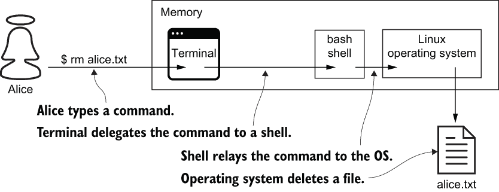
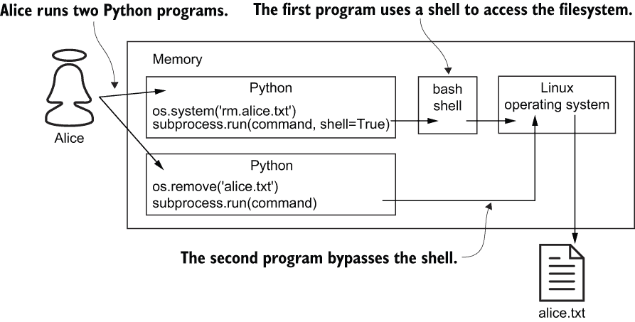

# 第十二章：使用操作系统

本章内容包括

+   使用`os`模块强制执行文件系统级别的授权

+   使用`tempfile`模块创建临时文件

+   使用`subprocess`模块调用外部可执行文件

+   抵御 shell 注入和命令注入

最近的几章都涉及授权。你学习了用户、组和权限。我通过将这些概念应用于文件系统访问来开始本章。此后，我将向你展示如何安全地从 Python 中调用外部可执行文件。在此过程中，你将学习如何识别和抵御两种类型的注入攻击。这为本书的其余部分奠定了基调，专注于攻击抵御。

## 12.1 文件系统级别的授权

像大多数编程语言一样，Python 本地支持文件系统访问；不需要第三方库。文件系统级别的授权比应用程序级别的授权工作量少，因为你不需要执行任何操作；你的操作系统已经做了这个。在这一部分中，我将向你展示如何执行以下操作：

+   安全地打开文件

+   安全地创建临时文件

+   读取和修改文件权限

### 12.1.1 请求权限

在过去几十年里，Python 社区中出现了许多缩写词。其中一个代表一种编码风格，称为*宁愿请求宽恕，而不是先请求允许*（*EAFP*）。EAFP 风格假设前提条件为真，然后在它们为假时捕获异常。

例如，以下代码假设具有足够的访问权限来打开文件。程序不尝试询问操作系统是否有权限读取文件；相反，如果权限被拒绝，程序通过`except`语句请求宽恕： 

```py
try:
    file = open(path_to_file)   ❶
except PermissionError:         ❷
    return None                 ❷
else:
    with file:
        return file.read()
```

❶ 假设权限，不要求权限

❷ 请求宽恕

EAFP 与另一种编码风格相对应，称为*先尝试，再请求允许*（*LBYL*）。这种风格首先检查前提条件，然后执行。EAFP 的特点是`try`和`except`语句；LBYL 的特点是`if`和`then`语句。EAFP 被称为*乐观*；LBYL 被称为*悲观*。

以下代码是 LBYL 的一个示例；它打开一个文件，但首先查看它是否具有足够的访问权限。注意，这段代码容易受到意外和恶意竞争条件的影响。一个错误或攻击者可能利用`os.access`函数返回和调用`open`函数之间的时间间隔。这种编码风格还会导致更多的文件系统访问：

```py
if os.access(path_to_file, os.R_OK):    ❶
    with open(path_to_file) as file:    ❷
        return file.read()              ❷
return None
```

❶ 看

❷ 跳

Python 社区中有些人强烈偏爱 EAFP 而不是 LBYL；我不是其中之一。我没有偏好，我根据具体情况使用*两种*风格。在这个特定的案例中，出于安全考虑，我使用 EAFP 而不是 LBYL。

EAFP 对比 LBYL

显然，Python 的创始人 Guido van Rossum 对 EAFP 也没有强烈偏好。Van Rossum 曾在 Python-Dev 邮件列表中写道（[`mail.python.org/pipermail/python-dev/2014-March/133118.html`](https://mail.python.org/pipermail/python-dev/2014-March/133118.html)）：

. . . 我不同意 EAFP 比 LBYL 更好，或者“Python 通常推荐”的立场。（你从哪里得到的？从那些如此痴迷于 DRY，宁愿引入高阶函数而不重复一行代码的来源？ :-)

### 12.1.2 使用临时文件

Python 本身支持使用专用模块 `tempfile` 进行临时文件使用；在处理临时文件时无需生成子进程。`tempfile` 模块包含一些高级工具和一些低级函数。这些工具以最安全的方式创建临时文件。以这种方式创建的文件不可执行，只有创建用户可以读取或写入它们。

`tempfile.TemporaryFile` 函数是创建临时文件的首选方式。这个高级工具创建一个临时文件并返回其对象表示。当您在 `with` 语句中使用这个对象时，如下面代码中所示，它会为您关闭和删除临时文件。在这个例子中，创建一个临时文件，打开，写入，读取，关闭和删除：

```py
>>> from tempfile import TemporaryFile
>>> 
>>> with TemporaryFile() as tmp:                           ❶
...     tmp.write(b'Explicit is better than implicit.')    ❷
...     tmp.seek(0)                                        ❸
...     tmp.read()                                         ❸
...                                                        ❹
33
0
b'Explicit is better than implicit.'
```

❶ 创建并打开一个临时文件

❷ 写入文件

❸ 从文件中读取

❹ 退出块，关闭并删除文件

`TemporaryFile` 有一些替代方案来解决边缘情况。如果需要一个具有可见名称的临时文件，请将其替换为 `NamedTemporaryFile`。如果需要在将数据写入文件系统之前在内存中缓冲数据，请将其替换为 `SpooledTemporaryFile`。

`tempfile.mkstemp` 和 `tempfile.mkdtemp` 函数是创建临时文件和临时目录的低级替代方案，分别。这些函数安全地创建临时文件或目录并返回路径。这与前述高级工具一样安全，但您必须承担关闭和删除使用它们创建的每个资源的责任。

警告 不要混淆 `tempfile.mkstemp` 或 `tempfile.mkdtemp` 与 `tempfile.mktemp`。这些函数的名称仅相差一个字符，但它们是非常不同的。`tempfile.mktemp` 函数由于安全原因已被 `tempfile.mkstemp` 和 `tempfile.mkdtemp` 废弃。

永远不要使用`tempfile.mktemp`。过去，这个函数被用来生成一个未使用的文件系统路径。调用者然后会使用这个路径来创建和打开一个临时文件。不幸的是，这是另一个你不应该使用 LBYL 编程的例子。考虑一下`mktemp`返回和临时文件创建之间的时间窗口。在这段时间内，攻击者可以在相同的路径上创建一个文件。从这个位置，攻击者可以向系统信任的文件写入恶意内容。

### 12.1.3 处理文件系统权限

每个操作系统都支持用户和组的概念。每个文件系统都维护关于每个文件和目录的元数据。用户、组和文件系统元数据决定操作系统如何执行文件系统级别的授权。在本节中，我将介绍几个设计用于修改文件系统元数据的 Python 函数。不幸的是，这些功能在只有类 UNIX 系统上完全支持。

类 UNIX 文件系统元数据指定一个所有者、一个组和三个类别：用户、组和其他人。每个*类别*代表三个权限：读取、写入和执行。用户和组类别适用于分配给文件的所有者和组。其他类别适用于其他所有人。

例如，假设 Alice、Bob 和 Mallory 有操作系统账户。一个由 Alice 拥有的文件分配给一个名为`observers`的组。Bob 是这个组的成员；Alice 和 Mallory 不是。这个文件的权限和类别由表 12.1 的行和列表示。

表 12.1 按类别的权限

|  | 拥有者 | 组 | 其他 |
| --- | --- | --- | --- |
| 读取 | 是 | 是 | 否 |
| 写入 | 是 | 否 | 否 |
| 执行 | 否 | 否 | 否 |

当 Alice、Bob 或 Mallory 尝试访问文件时，操作系统仅应用最本地类别的权限：

+   作为文件的所有者，Alice 可以读取和写入文件，但不能执行它。

+   作为`observers`的成员，Bob 可以读取文件，但不能对其进行写入或执行。

+   Mallory 根本无法访问文件，因为她既不是所有者也不在`observers`中。

Python 的`os`模块具有几个设计用于修改文件系统元数据的函数。这些函数允许 Python 程序直接与操作系统通信，消除了调用外部可执行文件的需要：

+   `os.chmod`—修改访问权限

+   `os.chown`—修改所有者 ID 和组 ID

+   `os.stat`—读取用户 ID 和组 ID

`os.chmod`函数修改文件系统权限。该函数接受一个路径和至少一个模式。每个模式在`stat`模块中被定义为一个常量，在表 12.2 中列出。在 Windows 系统上，`os.chmod`不幸地只能改变文件的只读标志。

表 12.2 权限模式常量

| 模式 | 拥有者 | 组 | 其他 |
| --- | --- | --- | --- |
| 读取 | S_IRUSR | S_IRGRP | S_IROTH |
| 写入 | S_IWUSR | S_IWGRP | S_IWOTH |
| 执行 | S_IXUSR | S_IXGRP | S_IXOTH |

以下代码演示了如何使用 `os.chmod`。第一次调用授予所有者读取权限；所有其他权限都被拒绝。此状态通过后续对 `os.chmod` 的调用而被擦除，而不是修改。这意味着第二次调用授予了群组读取权限；所有其他权限，包括先前授予的权限，都被拒绝：

```py
import os
import stat

os.chmod(path_to_file, stat.S_IRUSR)    ❶
os.chmod(path_to_file, stat.S_IRGRP)    ❷
```

❶ 只有所有者可以阅读此内容。

❷ 只有群组可以阅读此内容。

如何授予多个权限？使用 OR 运算符组合模式。例如，以下代码行同时向所有者和群组授予读取访问权限：

```py
os.chmod(path_to_file, stat.S_IRUSR | stat.S_IRGRP)    ❶
```

❶ 只有所有者和群组可以阅读此内容。

`os.chown` 函数修改文件或目录的所有者和群组。此函数接受路径、用户 ID 和群组 ID。如果将 -1 作为用户 ID 或群组 ID 传递，则相应的 ID 将保持不变。下面的示例演示了如何在保留群组 ID 的同时更改您的 `settings` 模块的用户 ID。在您自己的系统上运行此代码是不明智的：

```py
os.chown(path_to_file, 42, -1)
```

`os.stat` 函数返回文件或目录的元数据。此元数据包括用户 ID 和群组 ID。在 Windows 系统上，这些 ID 不幸地始终为 0。在交互式 Python shell 中键入以下代码以获取您的 `settings` 模块的用户 ID 和群组 ID，如加粗所示：

```py
>>> import os
>>> 
>>> path = './alice/alice/settings.py'
>>> stat = os.stat(path)
>>> stat.st_uid             ❶
501                         ❶
>>> stat.st_gid             ❷
20                          ❷
```

❶ 访问用户 ID

❷ 访问群组 ID

在本节中，您学习了如何创建与文件系统交互的程序。在下一节中，您将学习如何创建运行其他程序的程序。

## 12.2 调用外部可执行文件

有时，您想要在 Python 中执行另一个程序。例如，您可能希望练习使用非 Python 语言编写的程序的功能。Python 提供了许多调用外部可执行文件的方法；其中一些方法可能存在风险。在本节中，我将为您提供一些工具来识别、避免和最小化这些风险。

警告：本节中许多命令和代码具有潜在破坏性。在为本章测试代码时，我曾意外地从笔记本电脑上删除了一个本地 Git 仓库。如果您选择运行以下任何示例，请自己小心。

当您在计算机上键入并执行命令时，您并没有直接与操作系统通信。相反，您键入的命令被另一个称为 *shell* 的程序传递到您的操作系统。例如，如果您在类 UNIX 系统上，您的 shell 可能是 /bin/bash。如果您在 Windows 系统上，您的 shell 可能是 cmd.exe。图 12.1 描述了 shell 的作用。（虽然图表显示的是 Linux 操作系统，但在 Windows 系统上的过程类似。）



图 12.1 一个 bash shell 将 Alice 的终端上的命令传递给操作系统。

如其名称所示，shell 仅提供了一层薄薄的功能。其中一些功能是由*特殊字符*支持的。特殊字符具有超出其字面用途的含义。例如，类 Unix 系统的 shell 将星号（`*`）字符解释为通配符。这意味着诸如`rm` `*`这样的命令会删除当前目录中的所有文件，而不是删除一个（奇怪地）命名为`*`的单个文件。这称为*通配符展开*。

如果要求 shell 按字面意义解释特殊字符，则必须使用*转义字符*。例如，类 Unix 系统的 shell 将反斜杠视为转义字符。这意味着如果你只想删除一个（奇怪地）命名为`*`的文件，你必须输入`rm \*`。

从外部来源构建命令字符串而不转义特殊字符可能是致命的。例如，以下代码演示了一种糟糕的调用外部可执行文件的方式。此代码提示用户输入文件名并构建命令字符串。然后，`os.system`函数执行该命令，删除文件，并返回 0。按照惯例，返回代码 0 表示命令成功完成。当用户键入`alice.txt`时，此代码表现正常，但是如果恶意用户键入`*`，则会删除当前目录中的所有文件。这称为*shell 注入攻击*：

```py
>>> import os
>>> 
>>> file_name = input('Select a file for deletion:')   ❶
Select a file for deletion: alice.txt                  ❶
>>> command = 'rm %s' % file_name
>>> os.system(command)                                 ❷
0                                                      ❷
```

❶ 从不受信任的来源接受输入

❷ 成功执行命令

除了 shell 注入之外，此代码还容易受到*命令注入*的攻击。例如，如果恶意用户提交`-rf` `/` `;` `dd` `if=/dev/random` `of=/dev/sda`，则此代码将运行两个命令而不是一个。第一个命令删除根目录中的所有内容；第二个命令则通过向硬盘写入随机数据进一步恶化了情况。

Shell 注入和命令注入都是更广泛的攻击类别的特殊类型，通常称为*注入攻击*。攻击者通过向易受攻击的系统注入恶意输入来发起注入攻击。系统然后无意中执行输入，试图处理它，从而在某种程度上使攻击者受益。

注意：在撰写本文时，注入攻击位列 OWASP 十大安全威胁的第一位（[`owasp.org/www-project-top-ten/`](https://owasp.org/www-project-top-ten/)）。

在接下来的两节中，我将演示如何避免 shell 注入和命令注入。

### 12.2.1 使用内部 API 绕过 shell

如果你*想*执行外部程序，你应该首先问自己是否*需要*。在 Python 中，答案通常是否定的。Python 已经为最常见的问题开发了内部解决方案；在这些情况下，没有必要调用外部可执行文件。例如，以下代码使用`os.remove`而不是`os.system`删除文件。这样的解决方案更容易编写，更容易阅读，更少出错，更安全：

```py
>>> file_name = input('Select a file for deletion:')    ❶
Select a file for deletion:bob.txt                      ❶
>>> os.remove(file_name)                                ❷
```

❶ 从不受信任的来源接受输入

❷ 删除文件

这种替代方案更安全在哪里？与 `os.system` 不同，`os.remove` 免疫于命令注入，因为它只做一件事，这是设计原则；这个函数不接受命令字符串，因此没有办法注入其他命令。此外，`os.remove` 避免了 shell 注入，因为它完全绕过了 shell；这个函数直接与操作系统交流，而不需要 shell 的帮助，也没有 shell 的风险。如粗体所示，特殊字符如 `*` 被直接解释：

```py
>>> os.remove('*')                                             ❶
Traceback (most recent call last):
  File "<stdin>", line 1, in <module>
FileNotFoundError: [Errno 2] No such file or directory: '*'    ❷
```

❶ 这看起来不好 . . .

❷ . . . 但是没有东西被删除。

还有许多其他类似 `os.remove` 的函数；表格 12.3 列出了其中一些。第一列表示一个不必要的命令，第二列表示纯 Python 的替代方案。这个表格中的一些解决方案应该看起来很熟悉；在讨论文件系统级授权时，你已经见过它们。

表格 12.3 Python 替代简单命令行工具

| 命令行示例 | Python 等价物 | 描述 |
| --- | --- | --- |
| $ chmod 400 bob.txt | os.chmod('bob.txt', S_IRUSR) | 修改文件权限 |
| $ chown bob bob.txt | os.chown('bob.txt', uid, -1) | 更改文件所有者 |
| $ rm bob.txt | os.remove('bob.txt') | 删除文件 |
| > mkdir new_dir | os.mkdir('new_dir') | 创建新目录 |
| > dir | os.listdir() | 列出目录内容 |
| > pwd | os.getcwd() | 当前工作目录 |
| $ hostname | import socket;socket.gethostname() | 读取系统主机名 |

如果 Python 没有为某个命令提供安全的替代方案，那么很可能会有一个开源的 Python 库提供。表格 12.4 列出了一组命令及其 PyPI 包的替代方案。你在前几章学到了其中的两个，`requests` 和 `cryptography`。

表格 12.4 Python 替代复杂命令行工具

| 命令行示例 | PyPI 等价物 | 描述 |
| --- | --- | --- |
| $ curl http:/./bob.com -o bob.txt | requests | 通用 HTTP 客户端 |
| $ openssl genpkey -algorithm RSA | cryptography | 通用加密 |
| $ ping python.org | ping3 | 测试主机是否可达 |
| $ nslookup python.org | nslookup | 执行 DNS 查询 |
| $ ssh alice@python.org | paramiko | SSH 客户端 |
| $ git commit -m 'Chapter 12' | GitPython | 与 Git 仓库一起工作 |

表格 12.3 和 12.4 绝不是详尽无遗的。Python 生态系统中还有许多其他替代方案可用于外部可执行文件。如果你正在寻找一个不在这些表格中的纯 Python 替代方案，请在开始编写代码之前在网上搜索一下。

偶尔你可能会面临一个没有纯 Python 替代方案的独特挑战。例如，你可能需要运行一个你的同事编写的自定义 Ruby 脚本来解决领域特定的问题。在这种情况下，你需要调用一个外部可执行文件。在下一节中，我将向你展示如何安全地执行这样的操作。

### 12.2.2 使用 subprocess 模块

`subprocess` 模块是 Python 对外部可执行程序的答案。该模块废弃了 Python 的许多内置函数用于命令执行，列在这里。你在前一节中看到了其中之一：

+   `os.system`

+   `os.popen`

+   `os.spawn*`（八个函数）

`subprocess` 模块以简化的 API 和设计用于改善进程间通信、错误处理、互操作性、并发性和安全性的特性集取代了这些函数。在本节中，我只强调了该模块的安全特性。

以下代码使用 `subprocess` 模块从 Python 中调用一个简单的 Ruby 脚本。Ruby 脚本接受原型角色的名称，如 Alice 或 Eve；该脚本的输出是角色拥有的域的列表。请注意，`run` 函数不接受命令字符串；相反，它期望命令以列表形式提供，如粗体字所示。`run` 函数在执行后返回一个 `CompletedProcess` 实例。此对象提供对外部进程的输出和返回代码的访问：

```py
>>> from subprocess import run
>>> 
>>> character_name = input('alice, bob, or charlie?')        ❶
alice, bob, or charlie?charlie                               ❶
>>> command = ['ruby', 'list_domains.rb', character_name]    ❶
>>>
>>> completed_process = run(command, capture_output=True, check=True)
>>>
>>> completed_process.stdout                                 ❷
b'charlie.com\nclient.charlie.com\n'                         ❷
>>> completed_process.returncode                             ❸
0                                                            ❸
```

❶ 构建一个命令

❷ 打印命令输出

❸ 打印命令返回值

`subprocess` 模块从设计上是安全的。该 API 通过强制你将命令表达为列表来抵御命令注入。例如，如果一个恶意用户提交 `charlie ; rm -fr /` 作为一个角色名，`run` 函数仍然只执行 *一个* 命令，并且它执行的命令仍然只有 *一个* （奇怪的）参数。

`subprocess` 模块 API 也抵御了 shell 注入。默认情况下，`run` 函数绕过 shell 并将命令直接转发给操作系统。在极为罕见的情况下，当你确实需要特殊功能（例如通配符展开）时，`run` 函数支持一个名为 `shell` 的关键字参数。顾名思义，将此关键字参数设置为 `True` 会通知 `run` 函数将你的命令传递给 shell。

换句话说，`run` 函数默认是安全的，但你可以明确选择一个更危险的选项。相反，`os.system` 函数默认是危险的，你别无选择。图 12.2 说明了两个函数及其行为。



图 12.2 Alice 运行了两个 Python 程序；第一个通过 shell 与操作系统通信，第二个直接与操作系统通信。

在本章中，你学到了两种类型的注入攻击。当你阅读下一章时，你会看到为什么这些攻击在 OWASP 十大中排名第一。它们有很多不同的形式和大小。

## 总结

+   优先选择高级授权工具而不是低级方法。

+   根据具体情况选择 EAFP 和 LBYL 编码风格。

+   想要调用外部可执行程序与需要调用外部可执行程序是不同的。

+   在 Python 和 PyPI 之间，通常有你想要的命令的替代方案。

+   如果你需要执行一个命令，那么这个命令极有可能不需要一个 shell。
