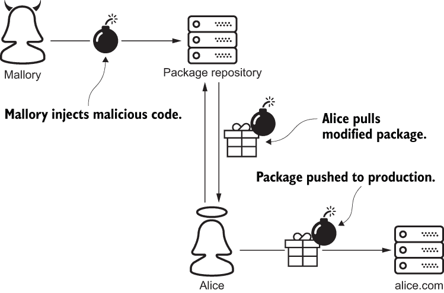
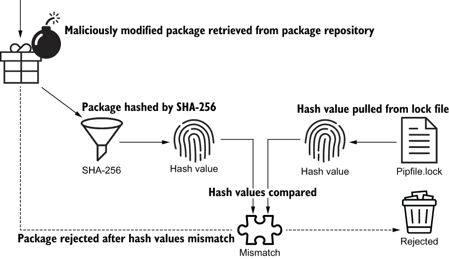
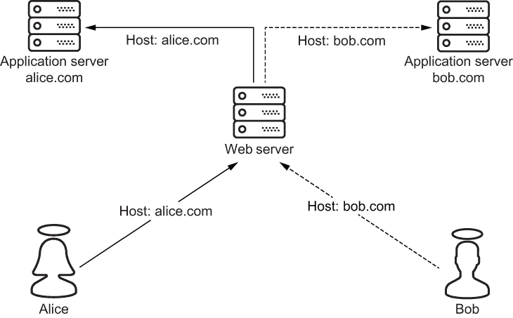
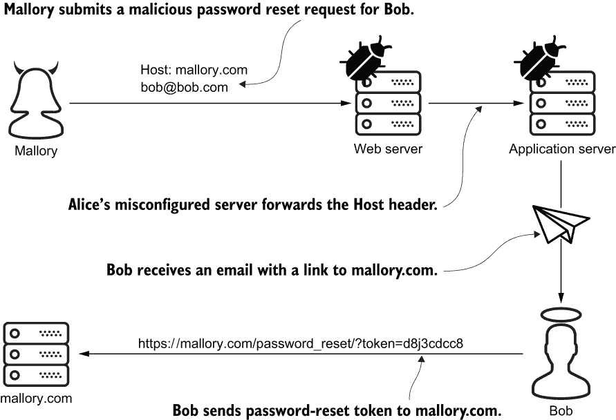
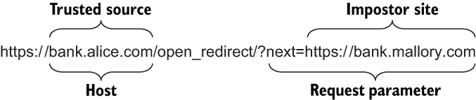
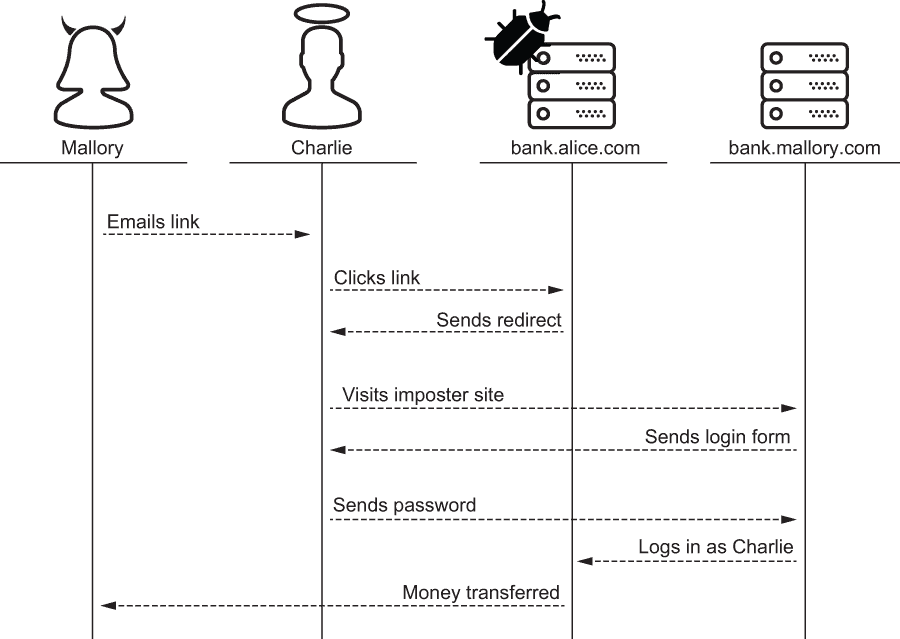

# 第十三章：永远不要信任输入

本章包括

+   使用 Pipenv 验证 Python 依赖项

+   使用 PyYAML 安全解析 YAML

+   使用 `defusedxml` 安全解析 XML

+   防止 DoS 攻击，`Host` 头攻击，开放重定向和 SQL 注入

在这一章中，Mallory 对 Alice、Bob 和 Charlie 发动了半打攻击。这些攻击及其对策并不像我后面涵盖的攻击那样复杂。本章中的每个攻击都遵循一种模式：Mallory 利用恶意输入滥用系统或用户。这些攻击以许多不同形式的输入形式出现：包依赖项、YAML、XML、HTTP 和 SQL。这些攻击的目标包括数据损坏、特权提升和未经授权的数据访问。*输入验证*是这些攻击的解药。

我在本章中涵盖的许多攻击都是注入攻击。（您在上一章中学习了关于注入攻击的知识。）在典型的注入攻击中，恶意输入被注入并立即由正在运行的系统执行。因此，程序员往往忽略了我在本章中开始讨论的非典型场景。在这种情况下，注入发生在上游，即构建时；执行发生在下游，即运行时。

## 13.1 使用 Pipenv 进行包管理

在本节中，我将向您展示如何使用 Pipenv 防止注入攻击。像之前学过的哈希和数据完整性一样，它们将再次出现。与任何 Python 包管理器一样，Pipenv 从诸如 PyPI 之类的包仓库检索并安装第三方包。不幸的是，程序员未能意识到包仓库是他们攻击面的重要部分。

假设 Alice 想要定期将新版本的 alice.com 部署到生产环境。她编写了一个脚本来拉取她代码的最新版本，以及她的软件包依赖项的最新版本。Alice 没有通过将她的依赖项检入版本控制来增加她代码仓库的大小。相反，她使用包管理器从包仓库拉取这些工件。

Mallory 已经入侵了 Alice 依赖的包仓库。在这个位置，Mallory 使用恶意代码修改了 Alice 的一个依赖项。最后，恶意代码由 Alice 的包管理器拉取并推送到 alice.com，在那里执行。图 13.1 说明了 Mallory 的攻击。



图 13.1 Mallory 通过包依赖注入恶意代码到 alice.com。

与其他包管理器不同，Pipenv 通过在从包仓库拉取每个包时验证包的完整性来自动阻止 Mallory 执行此攻击。如预期的那样，Pipenv 通过比较哈希值来验证包的完整性。

当 Pipenv 第一次获取一个包时，它会记录每个包构件的哈希值在你的锁定文件 Pipfile.lock 中。打开你的锁定文件，花一分钟观察一下你的一些依赖项的哈希值。例如，我的锁定文件的以下部分表明 Pipenv 拉取了`requests`包的 2.24 版本。两个构件的 SHA-256 哈希值以粗体显示：

```py
...
"requests": {
 "hashes": [
 "Sha256:b3559a131db72c33ee969480840fff4bb6dd1117c8...", # ❶
 "Sha256:fe75cc94a9443b9246fc7049224f756046acb93f87..." # ❶
 ],
    "version": "==2.24.0"                                          # ❷
},
...
```

❶ 包构件的哈希值

❷ 包版本

当 Pipenv 获取一个熟悉的包时，它会对每个入站包构件进行哈希，并将哈希值与您的锁定文件中的哈希值进行比较。如果哈希值匹配，Pipenv 可以假定该包未经修改，因此安全安装。如果哈希值不匹配，如图 13.2 所示，Pipenv 将拒绝该包。



图 13.2 包管理器通过将恶意修改的 Python 包的哈希值与锁定文件中的哈希值进行比较来抵御注入攻击。

下面的命令输出展示了当一个包验证失败时 Pipenv 的行为。本地哈希值和警告以粗体显示：

```py
$ pipenv install
Installing dependencies from Pipfile.lock
An error occurred while installing requests==2.24.0 
➥ --hash=sha256:b3559a131db72c33ee969480840fff4bb6dd1117c8...   # ❶
➥ --hash=sha256:fe75cc94a9443b9246fc7049224f756046acb93f87...   # ❶
...
[pipenv.exceptions.InstallError]: ['ERROR: THESE PACKAGES DO NOT
➥ MATCH THE HASHES FROM THE REQUIREMENTS FILE. If you have updated
➥ the package versions, please update the hashes. Otherwise,
➥ examine the package contents carefully; someone may have      # ❷
➥ tampered with them.                                           # ❷
...
```

❶ 包构件的本地哈希值

❷ 数据完整性警告

除了保护您免受恶意包修改之外，此检查还检测意外包损坏。这确保了本地开发、测试和生产部署的确定性构建——这是使用哈希进行现实世界数据完整性验证的一个很好的例子。在接下来的两节中，我将继续介绍注入攻击。

## 13.2 YAML 远程代码执行

在第七章，你看到 Mallory 进行远程代码执行攻击。首先，她将恶意代码嵌入到一个 *pickled*，或者序列化的 Python 对象中。接下来，她将这段代码伪装成基于 cookie 的 HTTP 会话状态并发送给服务器。服务器在不知不觉中使用 `PickleSerializer`，Python 的 `pickle` 模块的包装器，执行了恶意代码。在本节中，我将展示如何使用 YAML 而不是 `pickle` 进行类似的攻击——相同的攻击，不同的数据格式。

注意 在撰写本文时，*不安全的反序列化*在 OWASP 十大漏洞中排名第 8 位 ([`owasp.org/www-project-top-ten/`](https://owasp.org/www-project-top-ten/))。

像 JSON、CSV 和 XML 一样，YAML 是一种用人类可读的格式表示数据的常见方式。每种主要的编程语言都有工具来解析、序列化和反序列化这些格式的数据。Python 程序员通常使用 *PyYAML* 来解析 YAML。在您的虚拟环境中，运行以下命令安装 PyYAML：

```py
$ pipenv install pyyaml
```

打开一个交互式 Python shell 并运行以下代码。这个例子将一个小的内联 YAML 文档传递给 PyYAML。如粗体显示，PyYAML 使用`BaseLoader`加载文档并将其转换为 Python 字典：

```py
>>> import yaml
>>> 
>>> document = """                             # ❶
...   title: Full Stack Python Security        # ❶
...   characters:                              # ❶
...     - Alice                                # ❶
...     - Bob                                  # ❶
...     - Charlie                              # ❶
...     - Eve                                  # ❶
...     - Mallory                              # ❶
... """                                        # ❶
>>> 
>>> book = yaml.load(document, Loader=yaml.BaseLoader)
>>> book['title']                              # ❷
'Full Stack Python Security'                   # ❷
>>> book['characters']                         # ❷
['Alice', 'Bob', 'Charlie', 'Eve', 'Mallory']  # ❷
```

❶ 从 YAML . . .

❷ . . . 到 Python

在第一章中，你学到了最小权限原则。PLP 表明用户或系统应该只被赋予执行其职责所需的最小权限。我向你展示了如何将这个原则应用到用户授权上；这里我将向你展示如何将其应用到解析 YAML 上。

警告 当你将 YAML 加载到内存中时，限制你给予 PyYAML 的权限非常重要。

你可以通过 `Loader` 关键字参数将 PLP 应用到 PyYAML。例如，前面的例子使用了最不强大的加载器 `BaseLoader` 加载了 YAML。PyYAML 支持其他三种 `Loader`。以下从最不强大到最强大列出了这四种 `Loader`。每个 `Loader` 支持的功能更多，风险也更大。

+   `BaseLoader`—支持原始的 Python 对象，如字符串和列表

+   `SafeLoader`—支持原始的 Python 对象和标准 YAML 标签

+   `FullLoader`—完整的 YAML 语言支持（默认）

+   `UnsafeLoader`—完整的 YAML 语言支持和任意函数调用

如果你的系统接受 YAML 作为输入，不遵循 PLP 可能是致命的。以下代码演示了当使用 `UnsafeLoader` 从不受信任的源加载 YAML 时会有多么危险。此示例创建了一个内联 YAML，其中嵌入了对 `sys.exit` 的函数调用。如粗体字所示，然后将 YAML 输入给 PyYAML。然后，该过程使用退出码 42 调用 `sys.exit` 杀死自身。最后，`echo` 命令结合 `$?` 变量确认 Python 进程确实以值 42 退出：

```py
$ python                                           # ❶
>>> import yaml
>>> 
>>> input = '!!python/object/new:sys.exit [42]'    # ❷
>>> yaml.load(input, Loader=yaml.UnsafeLoader)     # ❸
$ echo $?                                          # ❹
42                                                 # ❹
```

❶ 创建进程

❷ 内联 YAML

❸ 杀死进程

❹ 确认死亡

你很可能永远不会需要以这种方式调用函数来进行商业用途。你不需要这个功能，那么为什么要冒险呢？`BaseLoader` 和 `SafeLoader` 是从不受信任的源加载 YAML 的推荐方式。或者，调用 `yaml.safe_load` 相当于使用 `SafeLoader` 调用 `yaml.load`。

警告 PyYAML 的不同版本默认使用不同的 `Loader`，所以你应该始终明确指定你需要的 `Loader`。调用 `yaml.load` 而不带 `Loader` 关键字参数已经被弃用。

在调用 `load` 方法时，始终指定 `Loader`。如果不这样做，可能会使您的系统在运行较旧版本的 PyYAML 时变得脆弱。直到版本 5.1，默认的 `Loader` 是（相当于）`UnsafeLoader`；当前的默认 `Loader` 是 `FullLoader`。我建议避免使用这两种。

保持简单

我们在撰写本文时，即使是 PyYAML 的网站（[`github.com/yaml/pyyaml/wiki/PyYAML-yaml.load(input)-Deprecation`](https://github.com/yaml/pyyaml/wiki/PyYAML-yaml.load(input)-Deprecation)）也不推荐使用 `FullLoader`：

目前应该避免使用 `FullLoader` 加载器类。2020 年 7 月在 5.3.1 版本中发现了新的漏洞。这些漏洞将在下一个版本中解决，但如果发现更多的漏洞，那么 `FullLoader` 可能会消失。

在下一节中，我将继续使用不同的数据格式 XML 进行注入攻击。XML 不仅令人讨厌；我认为您会对它有多危险感到惊讶。

## 13.3 XML 实体扩展

在这一节中，我讨论了一些旨在耗尽系统内存的攻击。这些攻击利用了一个鲜为人知的 XML 功能，称为*实体扩展*。什么是 XML 实体？*实体声明*允许您在 XML 文档中定义和命名任意数据。*实体引用*是一个占位符，允许您在 XML 文档中嵌入一个实体。XML 解析器的工作是将实体引用扩展为实体。

将以下代码键入交互式 Python shell 中作为一个具体的练习。这段代码以粗体字显示一个小的内联 XML 文档开头。在这个文档中只有一个实体声明，代表文本`Alice`。根元素两次引用这个实体。在解析文档时，每个引用都会被扩展，将实体嵌入两次：

```py
>>> from xml.etree.ElementTree import fromstring
>>> 
>>> xml = """                 # ❶
... <!DOCTYPE example [
...   <!ENTITY a "Alice">     # ❷
... ]>
... <root>&a;&a;</root>       # ❸
... """
>>> 
>>> example = fromstring(xml)
>>> example.text              # ❹
'AliceAlice'                  # ❹
```

❶ 定义一个内联 XML 文档

❷ 定义一个 XML 实体

❸ 根元素包含三个实体引用。

❹ 实体扩展演示

在这个例子中，一对三个字符的实体引用充当了一个五个字符的 XML 实体的占位符。这并没有以有意义的方式减少文档的总大小，但想象一下如果实体长度为 5000 个字符会怎样。因此，内存保护是 XML 实体扩展的一个应用；在接下来的两节中，您将了解到这个功能是如何被滥用以达到相反的效果。

### 13.3.1 二次膨胀攻击

攻击者通过武器化 XML 实体扩展来执行*二次膨胀攻击*。考虑以下代码。这个文档包含一个只有 42 个字符长的实体；这个实体只被引用了 10 次。二次膨胀攻击利用了一个像这样的文档，其中实体和引用计数的数量级更大。数学并不困难；例如，如果实体是 1 MB，实体被引用了 1024 次，那么文档的大小将约为 1 GB：

```py
<!DOCTYPE bomb [
  <!ENTITY e "a loooooooooooooooooooooooooong entity ...">   # ❶
]>
<bomb>&e;&e;&e;&e;&e;&e;&e;&e;&e;&e;</bomb>                  # ❷
```

❶ 单个实体声明

❷ 10 个实体引用

输入验证不足的系统很容易成为二次膨胀攻击的目标。攻击者注入少量数据；系统随后超出其内存容量，试图扩展数据。因此，恶意输入被称为*内存炸弹*。在下一节中，我将向您展示一个更大的内存炸弹，并教您如何化解它。

### 13.3.2 十亿笑攻击

这种攻击很有趣。*十亿笑攻击*，也被称为*指数级膨胀扩展攻击*，类似于二次膨胀攻击，但效果更加显著。这种攻击利用了 XML 实体可能包含对其他实体的引用的事实。很难想象在现实世界中有商业用途的情况下会使用这个功能。

以下代码示例说明了如何执行十亿笑话攻击。此文档的根元素仅包含一个实体引用，以粗体显示。此引用是实体嵌套层次结构的占位符：

```py
<!DOCTYPE bomb [
  <!ENTITY a "lol">                               # ❶
  <!ENTITY b "&a;&a;&a;&a;&a;&a;&a;&a;&a;&a;">    # ❶
  <!ENTITY c "&b;&b;&b;&b;&b;&b;&b;&b;&b;&b;">    # ❶
  <!ENTITY d "&c;&c;&c;&c;&c;&c;&c;&c;&c;&c;">    # ❶
]>
<bomb>&d;</bomb>
```

❶ 四个嵌套层次的实体

处理此文档将强制 XML 解析器将此引用展开为文本 `lol` 的仅 1000 个重复。一个十亿笑话攻击利用了这样一个具有更多层次嵌套实体的 XML 文档。每个级别将内存消耗增加一个数量级。这种技术将使用不超过本书一页的 XML 文档超出任何计算机的内存容量。

像大多数编程语言一样，Python 有许多解析 XML 的 API。`minidom`、`pulldom`、`sax` 和 `etree` 包都容易受到二次增长和十亿笑话攻击的影响。为了保护 Python，这些 API 只是遵循 XML 规范。

显然，向系统添加内存并不是解决此问题的方法；添加输入验证是。Python 程序员通过名为 `defusedxml` 的库来抵御内存炸弹。在您的虚拟环境中，运行以下命令来安装 `defusedxml`：

```py
$ pipenv install defusedxml
```

`defusedxml` 库旨在成为 Python 原生 XML API 的一个即插即用替代品。例如，让我们比较两个代码块。以下代码将使系统崩溃，因为它试图解析恶意 XML：

```py
from xml.etree.ElementTree import parse

parse('/path/to/billion_laughs.xml')    # ❶
```

❶ 打开了一个内存炸弹

相反，以下代码在尝试解析相同文件时会引发 `EntitiesForbidden` 异常。唯一的区别是 `import` 语句：

```py
from xml.etree.ElementTree import parse
from defusedxml.ElementTree import parse

parse('/path/to/billion_laughs.xml')    # ❶
```

❶ 引发一个 EntitiesForbidden 异常

在底层，`defusedxml` 封装了每个 Python 原生 XML API 的 `parse` 函数。`defusedxml` 定义的 `parse` 函数默认不支持实体展开。如果您需要在从受信任的来源解析 XML 时使用此功能，可以自由使用 `forbid_entities` 关键字参数覆盖此行为。表 13.1 列出了 Python 的每个原生 XML API 及其相应的 `defusedxml` 替代品。

表 13.1 Python XML API 和 defusedxml 替代方案

| 原生 Python API | defusedxml API |
| --- | --- |
| from xml.dom.minidom import parse | from defusedxml.minidom import parse |
| from xml.dom.pulldom import parse | from defusedxml.pulldom import parse |
| from xml.sax import parse | from defusedxml.sax import parse |
| from xml.etree.ElementTree import parse | from defusedxml.ElementTree import parse |

本章提出的内存炸弹既是注入攻击又是 *拒绝服务* (*DoS*) *攻击*。在下一节中，您将学习如何识别和抵御其他几种 DoS 攻击。

## 13.4 拒绝服务

你可能已经熟悉 *DoS* 攻击了。这些攻击旨在通过消耗过多的资源来压倒系统。DoS 攻击的目标资源包括内存、存储空间、网络带宽和 CPU。DoS 攻击的目标是通过损害系统的可用性来阻止用户访问服务。DoS 攻击有无数种方式进行。最常见的 DoS 攻击形式是通过向系统发送大量恶意网络流量来实施。

DoS 攻击计划通常比仅仅向系统发送大量网络流量更加复杂。最有效的攻击会操纵流量的特定属性，以增加对目标的压力。许多这些攻击利用了格式错误的网络流量，以利用低级网络协议实现。像 NGINX 这样的 Web 服务器，或者像 AWS 弹性负载均衡这样的负载均衡解决方案，是抵御这些攻击的合适场所。另一方面，像 Django 这样的应用服务器，或者像 Gunicorn 这样的 Web 服务器网关接口，则不适合这项工作。换句话说，这些问题不能用 Python 解决。

在本节中，我专注于更高级的基于 HTTP 的 DoS 攻击。相反，负载均衡器和 Web 服务器是抵御这些攻击的错误场所；应用服务器和 Web 服务器网关接口才是正确的场所。表 13.2 说明了一些 Django 设置，您可以使用这些设置来配置这些属性的限制。

表 13.2 Django 抗 DoS 攻击设置

| 设置 | 描述 |
| --- | --- |
| DATA_UPLOAD_MAX_NUMBER_FIELDS | 配置允许的请求参数最大数量。如果此检查失败，Django 将引发 SuspiciousOperation 异常。此设置默认为 1000，但合法的 HTTP 请求很少有这么多字段。 |
| DATA_UPLOAD_MAX_MEMORY_SIZE | 限制请求体的最大大小（以字节为单位）。此检查忽略文件上传数据。如果请求体超过此限制，Django 将引发 Suspicious-Operation 异常。 |
| FILE_UPLOAD_MAX_MEMORY_SIZE | 表示上传到内存中的文件在写入磁盘之前的最大大小（以字节为单位）。此设置旨在限制内存消耗；它不限制上传文件的大小。 |

警告 上一次你见到有 1000 个字段的表单是什么时候？将 `DATA_UPLOAD_MAX_NUMBER_FIELDS` 从 1000 减少到 50 或许值得您的时间。

`DATA_UPLOAD_MAX_MEMORY_SIZE` 和 `FILE_UPLOAD_MAX_MEMORY_SIZE` 合理地默认为 2,621,440 字节（2.5 MB）。将这些设置分配给 `None` 将禁用该检查。

表 13.3 说明了一些 Gunicorn 参数，用于抵御其他几种基于 HTTP 的 DoS 攻击。

表 13.3 Gunicorn 抗 DoS 攻击参数

| 参数 | 描述 |
| --- | --- |
| limit-request-line | 表示请求行的大小限制，以字节为单位。请求行包括 HTTP 方法，协议版本和 URL。URL 是明显的限制因素。此设置默认为 4094；最大值为 8190。将其设置为 0 将禁用检查。 |
| limit-request-fields | 限制请求允许具有的 HTTP 头数。此设置限制的“字段”不是表单字段。默认值合理设置为 100。limit-request-fields 的最大值为 32768。 |
| limit-request-field_size | 表示 HTTP 头的最大允许大小。下划线不是打字错误。默认值为 8190。将其设置为 0 允许无限大小的头。Web 服务器通常也执行此检查。 |

本节的主要观点是，HTTP 请求的任何属性都可以被武器化；这包括大小、URL 长度、字段计数、字段大小、文件上传大小、头计数和头大小。在下一节中，您将了解到由单个请求头驱动的攻击。

## 13.5 主机头攻击

在我们深入讨论`Host`头攻击之前，我将解释为什么浏览器和 Web 服务器使用`Host`头。Web 服务器在网站和其用户之间中继 HTTP 流量。Web 服务器经常为多个网站执行此操作。在这种情况下，Web 服务器将每个请求转发到浏览器设置`Host`头的任何网站。这样可以防止将 alice.com 的流量发送到 bob.com，反之亦然。图 13.3 说明了一个 Web 服务器在两个用户和两个网站之间路由 HTTP 请求的情况。



图 13.3 一个 Web 服务器使用主机头来在 Alice 和 Bob 之间路由 Web 流量。

Web 服务器通常配置为将缺少或无效的`Host`头的请求转发到默认网站。如果此网站盲目信任`Host`头值，它将变得容易受到`Host`头攻击的影响。

假设 Mallory 向 alice.com 发送密码重置请求。她伪造了`Host`头值，将其设置为`mallory.com`而不是`alice.com`。她还将电子邮件地址字段设置为`bob@bob.com`而不是`mallory@mallory.com`。

Alice 的 Web 服务器收到 Mallory 的恶意请求。不幸的是，Alice 的 Web 服务器配置为将包含无效`Host`头的请求转发到她的应用服务器。应用服务器接收到密码重置请求并向 Bob 发送密码重置电子邮件。就像你在第九章学习发送的密码重置电子邮件一样，发送给 Bob 的电子邮件包含一个密码重置链接。

Alice 的应用程序服务器如何生成 Bob 的密码重置链接？不幸的是，它使用了传入的 `Host` 头。这意味着 Bob 收到的 URL 是针对 mallory.com 而不是 alice.com 的；此链接还包含密码重置令牌作为查询参数。Bob 打开电子邮件，点击链接，不小心将密码重置令牌发送到 mallory.com。然后，Mallory 使用密码重置令牌重置了 Bob 的密码，并接管了 Bob 的帐户。图 13.4 描绘了这种攻击。



图 13.4 Mallory 利用 Host 头攻击接管了 Bob 的帐户。

您的应用程序服务器永远不应从客户端获取其标识。因此，直接访问 `Host` 头是不安全的，像这样：

```py
bad_practice = request.META['HTTP_HOST']    # ❶
```

❶ 绕过输入验证

如果需要访问主机名，请始终在请求上使用 `get_host` 方法。此方法验证并检索 `Host` 头：

```py
good_practice = request.get_host()    # ❶
```

❶ 验证 Host 头

`get_host` 方法如何验证 `Host` 头？通过根据 `ALLOWED_HOSTS` 设置对其进行验证。该设置是允许应用程序提供资源的主机和域名列表。默认值为空列表。如果 `DEBUG` 设置为 `True`，Django 允许使用 `localhost`、`127.0.0.1` 和 `[::1]` 的 `Host` 头来方便地进行本地开发。表 13.4 展示了如何为生产环境配置 `ALLOWED_HOSTS`。

表 13.4 ALLOWED_HOSTS 配置示例

| 示例 | 描述 | 匹配 | 不匹配 |
| --- | --- | --- | --- |
| alice.com | 完全合格的名称 | alice.com | sub.alice.com |
| sub.alice.com | 完全合格的名称 | sub.alice.com | alice.com |
| .alice.com | 子域通配符 | alice.com，sub.alice.com |  |
| * | 通配符 | alice.com，sub.alice.com，bob.com |  |

警告：不要将 `*` 添加到 `ALLOWED_HOSTS` 中。许多程序员出于方便而这样做，他们不知道这实际上是在禁用 `Host` 头验证。

配置 `ALLOWED_HOSTS` 的一种方便方法是在应用程序启动时从公钥证书中动态提取主机名。这对于在不同环境中部署具有不同主机名的系统非常有用。清单 13.1 展示了如何使用 `cryptography` 包执行此操作。此代码打开公钥证书文件，解析它，并将其存储在内存中作为对象。然后，从对象中复制主机名属性到 `ALLOWED_HOSTS` 设置。

清单 13.1 从公钥证书中提取主机

```py
from cryptography.hazmat.backends import default_backend
from cryptography.x509.oid import NameOID

with open(CERTIFICATE_PATH, 'rb') as f:                            # ❶
    cert = default_backend().load_pem_x509_certificate(f.read())   # ❶
atts = cert.subject.get_attributes_for_oid(NameOID.COMMON_NAME)    # ❶

ALLOWED_HOSTS = [a.value for a in atts]                            # ❷
```

❶ 在启动时从证书中提取通用名称

❷ 将常见名称添加到 ALLOWED_HOSTS 中

注意 `ALLOWED_HOSTS` 与 TLS 无关。像任何其他应用程序服务器一样，Django 在很大程度上不知道 TLS。Django 仅使用 `ALLOWED_HOSTS` 设置来防止 `Host` 头攻击。

再次强调，如果可能，攻击者将武器化 HTTP 请求的任何属性。在下一节中，我将介绍攻击者使用的另一种将恶意输入嵌入请求 URL 中的技术。

## 13.6 开放式重定向攻击

作为开放式重定向攻击主题的介绍，让我们假设 Mallory 想要偷走 Bob 的钱。首先，她冒充 bank.alice.com，使用 bank.mallory.com。Mallory 的网站看起来和感觉就像 Alice 的在线银行网站。接下来，Mallory 准备了一封设计成看起来像来自 bank.alice.com 的电子邮件。这封电子邮件的正文包含一个指向 bank.mallory.com 登录页面的链接。Mallory 把这封电子邮件发送给 Bob。Bob 点击链接，转到 Mallory 的网站，并输入他的登录凭据。然后 Mallory 的网站使用 Bob 的凭据访问他在 bank.alice.com 的账户。Bob 的钱随后被转移到 Mallory 那里。

通过点击链接，Bob 被认为是*钓鱼*，因为他上了钩。Mallory 已成功执行了一次*钓鱼*诈骗。这种诈骗有多种形式：

+   *钓鱼* 攻击通过电子邮件到达。

+   *Smishing* 攻击通过短信服务（SMS）到达。

+   *Vishing* 攻击通过语音邮件到达。

Mallory 的诈骗直接针对 Bob，Alice 几乎无能为力阻止它。然而，如果她不小心，Alice 实际上会让 Mallory 的事情变得更加轻松。假设 Alice 为 bank.alice.com 添加了一个功能。这个功能动态地将用户重定向到站点的另一部分。bank.alice.com 如何知道将用户重定向到哪里？重定向的地址由请求参数的值确定。（在第八章，您通过相同的机制实现了支持相同功能的身份验证工作流程。）

不幸的是，bank.alice.com 在将用户重定向到地址之前并未验证每个地址。这被称为*开放式重定向*，使得 bank.alice.com 容易受到开放式重定向攻击的影响。开放式重定向使得 Mallory 更容易发动更有效的钓鱼诈骗。Mallory 利用这个机会给 Charlie 发送一封带有指向开放式重定向的链接的电子邮件。这个 URL 在图 13.5 中显示，指向 bank.alice.com 的域名。



图 13.5 开放式重定向攻击的 URL 结构

在这种情况下，Charlie 更有可能上钩，因为他收到了一个带有他银行主机的 URL。不幸的是对于 Charlie，他的银行将他重定向到了 Mallory 的网站，在那里他输入了他的凭据和个人信息。图 13.6 描述了这种攻击。



图 13.6 Mallory 用开放式重定向攻击钓鱼 Bob。

列表 13.2 描述了一个简单的开放式重定向漏洞。`OpenRedirectView` 执行一个任务，然后读取查询参数的值。然后用户被盲目地重定向到下一个参数值。

列表 13.2 没有输入验证的开放式重定向

```py
from django.views import View
from django.shortcuts import redirect

class OpenRedirectView(View):
    def get(self, request):
        ...
        next = request.GET.get('next')    # ❶
        return redirect(next)             # ❷
```

❶ 读取下一个请求参数

❷ 发送重定向响应

相反，在第 13.3 节的`ValidatedRedirectView`通过输入验证抵抗开放式重定向攻击。这个视图将工作委托给 Django 内置的实用函数`url_has_allowed_host_and_scheme`。这个函数，以粗体字显示，接受一个 URL 和主机。只有当 URL 的域与主机匹配时，它才返回`True`。

第 13.3 节的抵抗开放式重定向攻击的输入验证

```py
from django.http import HttpResponseBadRequest
from django.utils.http import url_has_allowed_host_and_scheme

class ValidatedRedirectView(View):
    def get(self, request):
        ...
        next = request.GET.get('next')                                     # ❶
        host = request.get_host()                                          # ❷
        if url_has_allowed_host_and_scheme(next, host, require_https=True):# ❸
            return redirect(next)

        return HttpResponseBadRequest()                                    # ❹
```

❶ 读取下一个请求参数

❷ 安全确定主机

❸ 验证重定向的主机和协议

❹ 防止攻击

`ValidatedRedirectView`注意到使用`get_host`方法确定主机名，而不是直接访问`Host`头。在前一节中，您学会了通过这种方式避免`Host`头攻击。

在罕见的情况下，您的系统可能实际上需要动态地将用户重定向到多个主机。`url_has_allowed_host_and_scheme`函数通过接受单个主机名或多个主机名的集合来适应这种用例。

如果`require_https`关键字参数设置为`True`，`url_has_allowed_host_and_scheme`函数将拒绝使用 HTTP 的任何 URL。不幸的是，这个关键字参数默认为`False`，为另一种开放式重定向攻击创造了机会。

假设 Mallory 和 Eve 合作进行攻击。Mallory 通过针对 Charlie 的另一次网络钓鱼诈骗开始这次攻击。Charlie 收到一封包含以下 URL 的电子邮件。请注意，源和目标主机相同；协议以粗体字显示，不同：

```py
https:/./alice.com/open_redirect/?next=http:/./alice.com/resource/
```

Charlie 点击链接，将他带到 Alice 的站点，通过 HTTPS。不幸的是，Alice 的开放式重定向随后将他发送到站点的另一个部分，通过 HTTP。网络窃听者 Eve 接替 Mallory 继续进行中间人攻击。

警告：`require_https`的默认值为`False`。您应该将其设置为`True`。

在下一节中，我将本章结束于可能是最为人熟知的注入攻击。无需介绍。

## 13.7 SQL 注入

在阅读本书的过程中，您已经实现了支持用户注册、身份验证和密码管理等功能的工作流程。与大多数系统一样，您的项目通过在用户和关系数据库之间来回传递数据来实现这些工作流程。当这样的工作流程未能验证用户输入时，它们就成为*SQL 注入*的一个向量。

攻击者通过向易受攻击的系统提交恶意 SQL 代码作为输入来进行 SQL 注入。系统试图处理输入，但不慎执行它。这种攻击用于修改现有的 SQL 语句或将任意 SQL 语句注入系统。这使攻击者能够破坏、修改或未经授权地访问数据。

一些安全书籍专门有一整章内容介绍 SQL 注入。本书的少数读者会完整地读完关于这个主题的整个章节，因为像 Python 社区的其他成员一样，你们已经采用了 ORM 框架。ORM 框架不仅为您读写数据；它们还是防止 SQL 注入的一层防线。每个主要的 Python ORM 框架，如 Django ORM 或 SQLAlchemy，都通过自动查询参数化有效地抵抗 SQL 注入。

警告：ORM 框架优于编写原始 SQL。原始 SQL 容易出错，工作量更大，而且难看。

有时，对象关系映射并不是解决问题的正确工具。例如，您的应用程序可能需要执行复杂的 SQL 查询以提高性能。在这些罕见的场景中，当您必须编写原始 SQL 时，Django ORM 支持两个选项：原始 SQL 查询和数据库连接查询。

### 13.7.1 原始 SQL 查询

每个 Django 模型类都通过名为 `objects` 的属性引用查询接口。在其他功能中，此接口通过名为 `raw` 的方法容纳原始 SQL 查询。此方法接受原始 SQL 并返回一组模型实例。以下代码说明了一个可能返回大量行的查询。为了节省资源，仅选择表的两列：

```py
from django.contrib.auth.models import User

sql = 'SELECT id, username FROM auth_user'      # ❶
users_with_username = User.objects.raw(sql)
```

❶ 为所有行选择两列

假设以下查询旨在控制哪些用户被允许访问敏感信息。按预期，当 `first_name` 等于 `Alice` 时，`raw` 方法返回单个用户模型。不幸的是，Mallory 可以通过操纵 `first_name` 为 `"Alice' OR first_name = 'Mallory"` 来提升她的权限：

```py
sql = "SELECT * FROM auth_user WHERE first_name = '%s' " % first_name
users = User.objects.raw(sql)
```

警告：原始 SQL 和字符串插值是一种可怕的组合。

请注意，在占位符 `%s` 周围加引号会提供一种虚假的安全感。在占位符周围加引号不会提供任何安全性，因为 Mallory 可以简单地准备包含额外引号的恶意输入。

警告：对占位符加引号不会使原始 SQL 变得安全。

通过调用 `raw` 方法，您必须负责对查询进行参数化。这样可以通过转义所有特殊字符（如引号）来保护您的查询。以下代码演示了如何通过将参数值列表（以粗体显示）传递给 `raw` 方法来执行此操作。Django 会遍历这些值，并安全地将它们插入到您的原始 SQL 语句中，转义所有特殊字符。以这种方式准备的 SQL 语句不受 SQL 注入的影响。请注意，占位符周围没有引号：

```py
sql = "SELECT * FROM auth_user WHERE first_name = %s"
users = User.objects.raw(sql, [first_name])
```

或者，`raw` 方法接受一个字典而不是一个列表。在这种情况下，`raw` 方法安全地将 `%(dict_key)` 替换为字典中 `dict_key` 映射到的内容。

### 13.7.2 数据库连接查询

Django 允许你通过数据库连接直接执行任意原始 SQL 查询。如果你的查询不属于单个模型类，或者想要执行`UPDATE`、`INSERT`或`DELETE`语句，这将非常有用。

连接查询与原始方法查询一样具有很大的风险。例如，假设以下查询旨在删除单个经过身份验证的消息。当`msg_id`等于`42`时，此代码会按预期运行。不幸的是，如果 Mallory 能够操纵`msg_id`为`42 OR 1 = 1`，她将摧毁表中的每条消息：

```py
from django.db import connection

sql = """DELETE FROM messaging_authenticatedmessage    # ❶
         WHERE id = %s """ % msg_id                    # ❶
with connection.cursor() as cursor:                    # ❷
    cursor.execute(sql)                                # ❷
```

❶ 带有一个占位符的 SQL 语句

❷ 执行 SQL 语句

与`raw`方法查询一样，安全地执行连接查询的唯一方法是使用查询参数化。连接查询的参数化方式与`raw`方法查询相同。以下示例演示了如何使用`params`关键字参数安全地删除经过身份验证的消息，关键字参数以粗体显示：

```py
sql = """DELETE FROM messaging_authenticatedmessage
         WHERE id = %s """                 # ❶
with connection.cursor() as cursor:
    cursor.execute(sql, params=[msg_id])   # ❷
```

❶ 未引用的占位符

❷ 转义特殊字符，执行 SQL 语句

我在本章中涵盖的攻击和对策并不像我在其余章节中涵盖的那么复杂。例如，跨站请求伪造和点击劫持有专门的章节。下一章完全致力于一类攻击，称为*跨站脚本*。这些攻击比我在本章中介绍的所有攻击更复杂和常见。

## 摘要

+   哈希和数据完整性有效地抵抗包注入攻击。

+   解析 YAML 和解析`pickle`一样危险。

+   XML 不仅仅是丑陋的；从不受信任的来源解析它可能会导致系统崩溃。

+   你可以通过你的 Web 服务器和负载均衡器抵抗低级 DoS 攻击。

+   你可以通过你的 WSGI 或应用服务器抵抗高级 DoS 攻击。

+   开放重定向攻击会导致网络钓鱼和中间人攻击。

+   对象关系映射有效地抵抗 SQL 注入。
