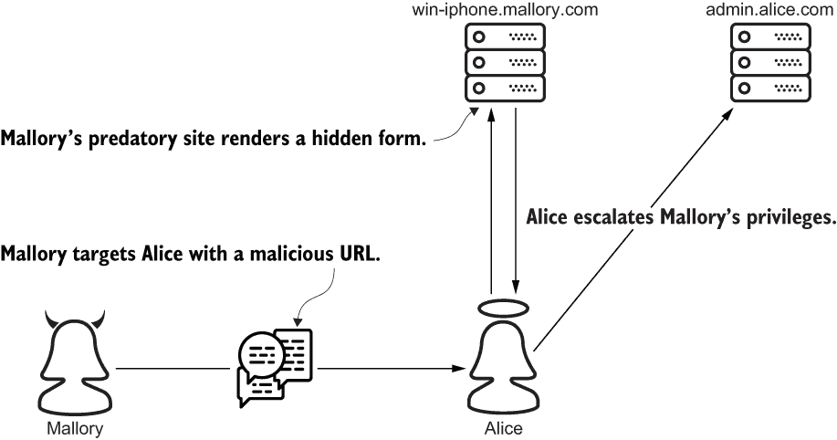
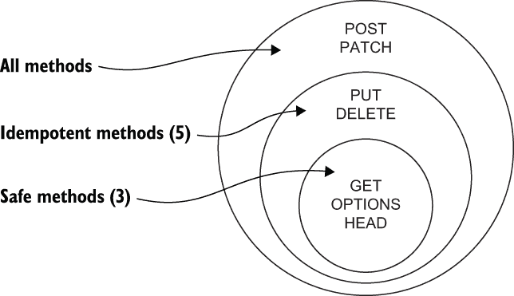

# 第十六章：跨站请求伪造

本章涵盖

+   管理会话 ID 的使用

+   遵循状态管理约定

+   验证`Referer`头

+   发送、接收和验证 CSRF 令牌

本章研究了另一个大类攻击，即*跨站请求伪造*（*CSRF*）。CSRF 攻击旨在诱使受害者向易受攻击的网站发送伪造请求。CSRF 抵抗取决于系统是否能区分伪造请求和用户的有意请求。安全系统通过请求头、响应头、cookies 和状态管理约定来实现这一点；*深度防御*并非可选。

## 16.1 什么是请求伪造？

假设 Alice 部署了 admin.alice.com，作为她在线银行的管理对应物。像其他管理系统一样，admin.alice.com 允许像 Alice 这样的管理员管理其他用户的组成员资格。例如，Alice 可以通过提交其用户名和组名到/group-membership/来将某人添加到一个组中。

有一天，Alice 收到了一条来自 Mallory 的文本消息，Mallory 是一个恶意的银行员工。这条短信包含一个链接到 Mallory 的捕食性网站 win-iphone.mallory.com。Alice 接了这个钓鱼。她导航到了 Mallory 的网站，在那里她的浏览器呈现了以下 HTML 页面。Alice 不知情，这个页面包含一个带有两个隐藏输入字段的表单。Mallory 已经预先填充了这些字段，分别是她的用户名和一个特权组的名称。

此攻击的剩余部分不需要 Alice 进行进一步操作。一个加粗的 body 标签的事件处理程序会在页面加载后自动提交表单。当前已经登录到 admin.alice.com 的 Alice 无意间将 Mallory 添加到管理员组中。作为管理员，Mallory 现在可以自由滥用她的新权限：

```py
<html>
  <body onload="document.forms[0].submit()">                      ❶
    <form method="POST"
          action="https:/./admin.alice.com/group-membership/">     ❷
      <input type="hidden" name="username" value="mallory"/>      ❸
      <input type="hidden" name="group" value="administrator"/>   ❸
    </form>
  </body>
</html>
```

❶ 此事件处理程序在页面加载后触发。

❷ 伪造请求的 URL

❸ 预填充的隐藏输入字段

在这个例子中，Mallory 实际上执行了 CSRF；她欺骗 Alice 从另一个站点发送伪造请求。图 16.1 说明了这种攻击。



图 16.1 Mallory 使用 CSRF 攻击提升她的权限。

这次，Alice 被欺骗升级了 Mallory 的权限。在现实世界中，受害者可能会被欺骗执行易受攻击的站点允许他们执行的任何操作。这包括转账、购买商品或修改自己的帐户设置。通常，受害者甚至不知道他们做了什么。

CSRF 攻击不仅限于不可信的网站。伪造请求也可以通过电子邮件或消息客户端发送。

无论攻击者的动机或技术如何，CSRF 攻击成功是因为易受攻击的系统无法区分伪造请求和有意请求。剩余部分将检查不同的方法来区分这种区别。

## 16.2 会话 ID 管理

成功的伪造请求必须携带经过身份验证用户的有效会话 ID cookie。如果会话 ID 不是必需的，攻击者将直接发送请求而不是试图诱骗受害者。

会话 ID 标识用户，但无法确定他们的意图。因此，当不必要时，禁止浏览器发送会话 ID cookie 非常重要。网站通过向`Set-Cookie`头部添加一个名为`SameSite`的指令来实现这一点（您在第七章学习过这个头部）。

`SameSite`指令告知浏览器将 cookie 限制在“同一站点”的请求中。例如，从 https://admin.alice.com/profile/ 提交表单到 https://admin.alice.com/group-membership/ 是*同站点请求*。表 16.1 列出了几个更多的同站点请求示例。在每种情况下，请求的源和目的地具有相同的可注册域，bob.com。

表 16.1 同站点请求示例

| 来源 | 目的地 | 原因 |
| --- | --- | --- |
| **https**://bob.com | **http**://bob.com | 不同协议不重要。 |
| https://**social**.bob.com | https://**www**.bob.com | 不同子域不重要。 |
| https://bob.com/**home/** | https://bob.com/**profile/** | 不同路径不重要。 |
| https://bob.com:**42** | https://bob.com:**443** | 不同端口不重要。 |

*跨站点请求*是除同站点请求之外的任何请求。例如，从 win-iphone.mallory.com 提交表单或导航到 admin.alice.com 都是跨站点请求。

注意跨站点请求不要与跨源请求混淆。（在前一章中，您了解到一个源由 URL 的三个部分定义：协议、主机和端口。）例如，从 https:/./social.bob.com 到 https:/./www.bob.com 的请求是跨源的，但不是跨站点的。

`SameSite`指令有三个可能的值：`None`、`Strict`或`Lax`。这里以粗体显示每个示例：

```py
Set-Cookie: sessionid=<session-id-value>; SameSite=None; ...
Set-Cookie: sessionid=<session-id-value>; SameSite=Strict; ...
Set-Cookie: sessionid=<session-id-value>; SameSite=Lax; ...
```

当`SameSite`指令为`None`时，浏览器将无条件地将会话 ID cookie 回送到它来自的服务器，即使是跨站点请求也是如此。这个选项不提供安全性；它使所有形式的 CSRF 都成为可能。

当`SameSite`指令为`Strict`时，浏览器只会为同站点请求发送会话 ID cookie。例如，假设 admin.alice.com 在设置 Alice 的会话 ID cookie 时使用了`Strict`。这不会阻止 Alice 访问 win-iphone.mallory.com，但会排除 Alice 的会话 ID 在伪造请求中。没有会话 ID，请求将不会与用户关联，导致网站拒绝它。

为什么不是每个网站都使用`Strict`设置会话 ID cookie？`Strict`选项在保障安全性的同时会牺牲功能性。没有会话 ID cookie，服务器无法识别有意的跨站点请求来源。因此，用户每次从外部来源返回网站时都必须进行身份验证。这对于社交媒体网站来说不太合适，但对于在线银行系统来说是理想的。

注意，`None`和`Strict`代表风险范围的两个相反的极端。`None`选项不提供安全性；`Strict`选项提供最高的安全性。

在`None`和`Strict`之间存在一个合理的平衡点。当`SameSite`指令为`Lax`时，浏览器会为所有同站点请求以及使用安全的 HTTP 方法（如 GET）的跨站点顶级导航请求发送会话 ID cookie。换句话说，用户每次通过点击电子邮件中的链接返回网站时都不必重新登录。会话 ID cookie 将在所有其他跨站点请求中被省略，就好像`SameSite`指令是`Strict`一样。这个选项对于在线银行系统来说不合适，但对于社交媒体网站来说是合适的。

`SESSION_COOKIE_SAMESITE`设置配置了会话 ID `Set-Cookie` 头的`SameSite`指令。Django 3.1 接受此设置的以下四个值：

+   `"None"`

+   `"Strict"`

+   `"Lax"`

+   `False`

前三个选项很简单。`"None"`、`"Strict"`和`"Lax"`选项分别配置 Django 发送具有`None`、`Strict`或`Lax`的`SameSite`指令的会话 ID。`"Lax"`是默认值。

警告：我强烈反对将`SESSION_COOKIE_SAMESITE`设置为`False`，特别是如果您支持较旧的浏览器。这个选项会使您的网站安全性降低，互操作性降低。

将`False`分配给`SESSION_COOKIE_SAMESITE`将完全省略`SameSite`指令。当`SameSite`指令不存在时，浏览器将回退到其默认行为。这将导致网站因以下两个原因而行为不一致：

+   默认的`SameSite`行为因浏览器而异。

+   在撰写本文时，浏览器正在从默认的`None`迁移到`Lax`。

浏览器最初将`None`用作默认的`SameSite`值。从 Chrome 开始，它们中的大多数都已切换到`Lax`以确保安全性。

浏览器、Django 和许多其他 Web 框架默认为`Lax`，因为这个选项在安全性和功能性之间提供了一个实际的权衡。例如，`Lax`在表单驱动的 POST 请求中排除了会话 ID，但在导航 GET 请求中包含了它。这只有在您的 GET 请求处理程序遵循状态管理惯例时才有效。

## 16.3 状态管理惯例

一个常见的误解是 GET 请求免疫 CSRF。实际上，CSRF 免疫实际上是请求方法和请求处理程序实现的结果。具体来说，安全的 HTTP 方法不应更改服务器状态。HTTP 规范（[`tools.ietf.org/html/rfc7231`](https://tools.ietf.org/html/rfc7231)）识别了四种安全方法：

根据本规范定义的请求方法中，GET、HEAD、OPTIONS 和 TRACE 方法被定义为安全的。

所有状态更改通常都保留给不安全的 HTTP 方法，如 POST、PUT、PATCH 和 DELETE。相反，安全方法意味着只读：

如果定义的语义本质上是只读的，则请求方法被认为是“安全的”；即，客户端不会请求，并且不期望对原始服务器应用安全方法以更改目标资源的状态。

不幸的是，安全方法经常与幂等方法混淆。*一个幂等方法*是可以安全重复的，但不一定是安全的。来自 HTTP 规范

如果使用该方法进行多个相同请求，其对服务器的预期效果与对单个此类请求的效果相同，则请求方法被认为是“幂等的”。根据本规范定义的请求方法中，PUT、DELETE 和安全请求方法是幂等的。

所有安全方法都是幂等的，但 PUT 和 DELETE 都是幂等且不安全的。因此，假设幂等方法免受 CSRF 的影响是错误的，即使实现正确也是如此。图 16.2 说明了安全方法和幂等方法之间的区别。



图 16.2 安全方法和幂等方法之间的区别

不正确的状态管理不仅仅是丑陋的；它实际上会使您的站点容易受到攻击。为什么？除了程序员和安全标准外，这些约定还得到了浏览器供应商的认可。例如，假设 admin.alice.com 为 Alice 的会话 ID 设置了`SameSite`为`Lax`。这使 Mallory 的隐藏表单失效，因此她将其替换为以下链接。Alice 点击链接，将带有她的会话 ID cookie 的 GET 请求发送到 admin.alice.com。如果/group-membership/处理程序接受 GET 请求，Mallory 仍然获胜：

```py
<a href="https://admin.alice.com/group-membership/?   ❶
➥ username=mallory&                                  ❷
➥ group=administrator">                              ❷
  Win an iPhone!
</a>
```

❶ 伪造请求的 URL

❷ 请求参数

这些约定甚至由 Web 框架如 Django 加强。例如，默认情况下，每个 Django 项目都配备了一些 CSRF 检查。这些检查，我将在后面的章节中讨论，故意针对安全方法暂停。再次强调，正确的状态管理不仅仅是一种外观设计特征；这是安全性问题。下一节将探讨鼓励正确状态管理的几种方法。

### 16.3.1 HTTP 方法验证

安全的方法请求处理程序不应更改状态。如果你正在使用基于函数的视图，这更容易说而不易做。默认情况下，基于函数的视图将处理任何请求方法。这意味着一个用于 POST 请求的函数可能仍然会被 GET 请求调用。

下面的代码块展示了一个基于函数的视图。作者在防御性地验证了`request`方法，但请注意这需要多少行代码。考虑一下这有多容易出错：

```py
from django.http import HttpResponse, HttpResponseNotAllowed

def group_membership_function(request):

    allowed_methods = {'POST'}                           ❶
    if request.method not in allowed_methods:            ❶
        return HttpResponseNotAllowed(allowed_methods)   ❶

    ...
    return HttpResponse('state change successful')
```

❶ 以编程方式验证请求方法

相反，基于类的视图将 HTTP 方法映射到类方法。无需以编程方式检查`request`方法。Django 会为您完成这项工作。错误发生的可能性较小，而且更可能被捕获：

```py
from django.http import HttpResponse
from django.views import View

class GroupMembershipView(View):

    def post(self, request, *args, **kwargs):    ❶

        ...
        return HttpResponse('state change successful')
```

❶ 明确声明请求方法

为什么有人在函数中*验证*`request`方法，而不是在类中*声明*它？如果你正在处理一个庞大的遗留代码库，将每个基于函数的视图重构为基于类的视图可能是不现实的。Django 通过一些方法验证实用程序来支持这种情况。在这里以粗体显示的`require_http_methods`装饰器限制了视图函数支持的方法：

```py
@require_http_methods(['POST'])
def group_membership_function(request):
    ...
    return HttpResponse('state change successful')
```

表 16.2 列出了另外三个内置装饰器，用于包装`require_http_methods`。

表 16.2 请求方法验证装饰器

| 装饰器 | 等效 |
| --- | --- |
| @require_safe | @require_http_methods(['GET', 'HEAD']) |
| @require_POST | @require_http_methods(['POST']) |
| @require_GET | @require_http_methods(['GET']) |

CSRF 抵抗是深度防御的一种应用。在下一节中，我将将这个概念扩展到一对 HTTP 头。在此过程中，我将介绍 Django 内置的 CSRF 检查。

## 16.4 Referer 头验证

对于任何给定的请求，如果服务器能够确定客户端获取 URL 的位置，则通常是有用的。这些信息通常用于提高安全性，分析 Web 流量和优化缓存。浏览器通过`Referer`请求头将此信息传递给服务器。

这个头的名称在 HTTP 规范中被意外地拼错了；整个行业都有意维持这个拼错以保持向后兼容性。这个头的值是引用资源的 URL。例如，Charlie 的浏览器在从 search.alice.com 导航到 social.bob.com 时将`Referer`头设置为`https:/./search.alice.com`。

安全站点通过验证`Referer`头来抵御 CSRF。例如，假设一个站点收到一个伪造的 POST 请求，其`Referer`头设置为`https:/./win-iphone.mallory.com`。服务器通过简单地比较其域和`Referer`头的域来检测攻击。最后，它通过拒绝伪造的请求来保护自己。

Django 会自动执行此检查，但在极少数情况下，您可能希望针对特定引用者放宽此检查。如果您的组织需要在子域之间发送不安全的同站点请求，则此功能非常有用。`CSRF_TRUSTED_ORIGINS` 设置通过放宽对一个或多个引用者的 `Referer` 头验证来适应此用例。

假设 Alice 配置 admin.alice.com 以接受来自 bank.alice.com 的 POST 请求，并使用以下代码。注意，此列表中的引用者不包括协议；假定为 HTTPS。这是因为 `Referer` 头验证以及 Django 的其他内置 CSRF 检查仅适用于不安全的 HTTPS 请求：

```py
CSRF_TRUSTED_ORIGINS = [
    'bank.alice.com'
]
```

此功能存在风险。例如，如果 Mallory 损坏了 bank.alice.com，她可以使用它对 admin.alice.com 发动 CSRF 攻击。在这种情况下，伪造的请求将包含一个有效的 `Referer` 头部。换句话说，此功能在这两个系统的攻击面之间建立了一个单向桥梁。

在本节中，您了解了服务器如何利用 `Referer` 头构建防御层。从用户的角度来看，这个解决方案不够完美，因为它引发了对公共网站隐私的关注。例如，Bob 可能不希望 Alice 知道他在访问 bank.alice.com 之前访问了哪个网站。下一节将讨论一个响应头，旨在缓解这个问题。

### 16.4.1 Referrer-Policy 响应头部

`Referrer-Policy` 响应头部为浏览器提供了有关何时以及如何发送 `Referer` 请求头的提示。与 `Referer` 头不同，`Referrer-Policy` 头的拼写是正确的。

此头部支持八种策略。表 16.3 描述了每种策略向浏览器传达的信息。不要费心记住每个策略；有些相当复杂。重要的是，某些策略，如 `no-referrer` 和 `same-origin`，在跨站点 HTTPS 请求中省略了引用地址。Django 的 CSRF 检查将这些请求识别为攻击。

表 16.3 Referrer-Policy 头部的策略定义

| Policy | 描述 |
| --- | --- |
| no-referrer | 无条件省略 Referer 头部。 |
| origin | 仅发送引用来源。这包括协议、域名和端口。不包括路径和查询字符串。 |
| same-origin | 对于同站点请求发送引用地址，对于跨站点请求不发送任何内容。 |
| origin-when-cross-origin | 对于同站点请求发送引用地址，但对于跨站点请求仅发送引用来源。 |
| strict-origin | 如果协议从 HTTPS 降级为 HTTP，则不发送任何内容；否则，发送引用来源。 |
| no-referrer-when-downgrade | 如果协议被降级，则不发送任何内容；否则，发送引用地址。 |
| strict-origin-when-cross-origin | 对于同源请求发送引用地址。对于跨源请求，如果协议被降级，则不发送任何内容，如果协议被保留，则发送引用来源。 |
| unsafe-url | 无条件地发送每个请求的引用地址。 |

`SECURE_REFERRER_POLICY`设置配置`Referrer-Policy`头。默认为`same-origin`。

你应该选择哪种策略？从这个角度来看。风险范围的极端端点由`no-referrer`和`unsafe-url`表示。 `no-referrer`选项最大化了用户隐私，但每个入站跨站点请求都会像一次攻击一样。另一方面，`unsafe-url`选项是不安全的，因为它泄露了整个 URL，包括域、路径和查询字符串，所有这些都可能携带私人信息。即使请求是通过 HTTP 进行的，但引用资源是通过 HTTPS 检索的，这也会发生。通常情况下，你应该避免极端情况；对于你的网站来说，最佳策略几乎总是在中间某处。

在下一节中，我将继续讨论 CSRF 令牌，这是 Django 内置的 CSRF 检查之一。与`Referer`头验证一样，Django 仅将此防御层应用于不安全的 HTTPS 请求。这是遵循适当的状态管理惯例并使用 TLS 的另一个原因。

## 16.5 CSRF 令牌

CSRF 令牌是 Django 的最后一道防线。安全的站点使用 CSRF 令牌来识别像 Alice 和 Bob 这样的普通用户的故意不安全的同站点请求。这个策略围绕着一个两步骤的过程展开：

1.  服务器生成一个令牌并发送到浏览器。

1.  浏览器以攻击者无法伪造的方式回显令牌。

服务器通过生成一个令牌并将其作为 cookie 发送到浏览器来启动这个策略的第一部分：

```py
Set-Cookie: csrftoken=<token-value>; <directive>; <directive>;
```

与会话 ID cookie 一样，CSRF 令牌 cookie 由一些设置配置。`CSRF_COOKIE_SECURE`设置对应于`Secure`指令。在第七章中，你学到了`Secure`指令禁止浏览器将 cookie 通过 HTTP 发送回服务器：

```py
Set-Cookie: csrftoken=<token-value>; Secure
```

警告 `CSRF_COOKIE_SECURE`默认为`False`，省略了`Secure`指令。这意味着 CSRF 令牌可以通过 HTTP 发送，在那里可能被网络窃听者截获。你应该将其更改为`True`。

Django 的 CSRF 令牌策略的详细信息取决于浏览器是否发送了 POST 请求。我在接下来的两节中描述了两种情况。

### 16.5.1 POST 请求

当服务器接收到一个 POST 请求时，它期望在两个地方找到 CSRF 令牌：一个 cookie 和一个请求参数。浏览器显然会处理 cookie。另一方面，请求参数是你的责任。

当涉及到老式的 HTML 表单时，Django 会让这变得很容易。你在之前的章节中已经看到了几个例子。例如，在第十章中，Alice 使用了一个表单，再次显示在这里，给 Bob 发送了一条消息。注意表单包含了 Django 的内置`csrf_token`标记，以粗体字显示：

```py
<html>

    <form method='POST'>
       ❶
        <table>
            {{ form.as_table }}
        </table>
        <input type='submit' value='Submit'>
    </form>

</html>
```

❶ 这个标记将 CSRF 令牌呈现为一个隐藏的输入字段。

模板引擎将`csrf_token`标记转换为以下 HTML 输入字段：

```py
<input type="hidden" name="csrfmiddlewaretoken"
➥     value="elgWiCFtsoKkJ8PLEyoOBb6GlUViJFagdsv7UBgSP5gvb95p2a...">
```

请求到达后，Django 从 cookie 和参数中提取令牌。只有当 cookie 和参数匹配时，请求才会被接受。

这如何阻止来自 win-iphone.mallory.com 的伪造请求呢？Mallory 可以轻松地在她的网站上嵌入自己的令牌，但是伪造的请求不会包含匹配的 cookie。这是因为 CSRF 令牌 cookie 的 `SameSite` 指令是 `Lax`。正如你在前面的章节中学到的那样，浏览器因此会在不安全的跨站点请求中省略 cookie。此外，Mallory 的网站根本无法修改该指令，因为 cookie 不属于她的域。

如果你通过 JavaScript 发送 POST 请求，你必须程序化地模拟 `csrf_token` 标签的行为。为此，你必须首先获取 CSRF 令牌。下面的 JavaScript 通过从 `csrftoken` cookie 中提取 CSRF 令牌来实现这一点：

```py
function extractToken(){
    const split = document.cookie.split('; ');
    const cookies = new Map(split.map(v => v.split('=')));
    return cookies.get('csrftoken');
}
```

接下来，令牌必须以 POST 参数的形式发送回服务器，如粗体字所示：

```py
const headers = {
   'Content-type': 'application/x-www-form-urlencoded; charset=UTF-8'
};
fetch('/resource/', {                                    ❶
        method: 'POST',                                  ❶
        headers: headers,                                ❶
 body: 'csrfmiddlewaretoken=' + extractToken()    ❶
    })
    .then(response => response.json())                   ❷
    .then(data => console.log(data))                     ❷
    .catch(error => console.error('error', error));      ❷
```

❶ 将 CSRF 令牌作为 POST 参数发送

❷ 处理响应

POST 只是许多不安全请求方法之一；Django 对其他请求方法有不同的期望。

### 16.5.2 其他不安全的请求方法

如果 Django 收到 PUT、PATCH 或 DELETE 请求，它期望在两个地方找到 CSRF 令牌：一个是 cookie，另一个是名为 `X-CSRFToken` 的自定义请求头。与 POST 请求一样，需要额外的工作。

下面的 JavaScript 代码展示了这种方法从浏览器的角度来看。这段代码从 cookie 中提取 CSRF 令牌，并将其程序化地复制到一个自定义请求头中，如粗体所示：

```py
fetch('/resource/', {
        method: 'DELETE',                    ❶
 headers: {                           ❷
 'X-CSRFToken': extractToken()    ❷
 }                                    ❷
    })
    .then(response => response.json())
    .then(data => console.log(data))
    .catch(error => console.error('error', error));
```

❶ 使用了一个不安全的请求方法

❷ 使用自定义头添加 CSRF 令牌

Django 在收到非 POST 不安全请求后，从 cookie 和请求头中提取令牌。如果 cookie 和请求头不匹配，则请求会被拒绝。

这种方法与某些配置选项不兼容。例如，`CSRF_COOKIE_HTTPONLY` 设置为为 CSRF 令牌 cookie 配置 `HttpOnly` 指令。在之前的章节中，你了解到 `HttpOnly` 指令会将 cookie 隐藏在客户端 JavaScript 中。将此设置为 `True` 将会导致前面的代码示例出现错误。

注意：为什么 `CSRF_COOKIE_HTTPONLY` 默认为 `False`，而 `SESSION_COOKIE_HTTPONLY` 默认为 `True`？或者，为什么 Django 在会话 ID 中使用 `HttpOnly`，而在 CSRF 令牌中却省略了它？当攻击者有能力访问 cookie 时，你不再需要担心 CSRF。网站已经遇到了一个更严重的问题：主动的 XSS 攻击。

前面的代码示例如果 Django 被配置为将 CSRF 令牌存储在用户会话中而不是 cookie 中，也会失败。通过将 `CSRF_USE_SESSIONS` 设置为 `True` 来配置这种替代方案。如果你选择了这个选项，或者选择使用 `HttpOnly`，那么如果你的模板需要发送不安全的非 POST 请求，你将不得不以某种方式从文档中提取令牌。

警告 无论请求方法如何，都很重要避免将 CSRF 令牌发送到另一个网站。如果你将令牌嵌入到 HTML 表单中，或者将其添加到 AJAX 请求头中，始终确保 cookie 被发送回到它来自哪里。如果不这样做，将会使 CSRF 令牌暴露给另一个系统，从而可能被用来攻击你。

CSRF 需要像 XSS 一样的防御层。安全系统通过请求头、响应头、cookie、令牌和适当的状态管理构建这些层。在下一章中，我将继续介绍跨域资源共享，这是一个经常与 CSRF 混淆的主题。

## 摘要

+   一个安全的站点可以区分意图请求和伪造请求。

+   `None` 和 `Strict` 处于 `SameSite` 风险谱的相反极端。

+   `Lax` 是一个合理的折中方案，处于 `None` 和 `Strict` 之间的风险之间。

+   其他程序员、标准机构、浏览器供应商和 Web 框架都同意：遵循适当的状态管理约定。

+   当你可以在类中声明请求方法时，不要在函数中验证请求方法。

+   简单的 `Referer` 头验证和复杂的令牌验证都是有效的 CSRF 抵抗形式。
