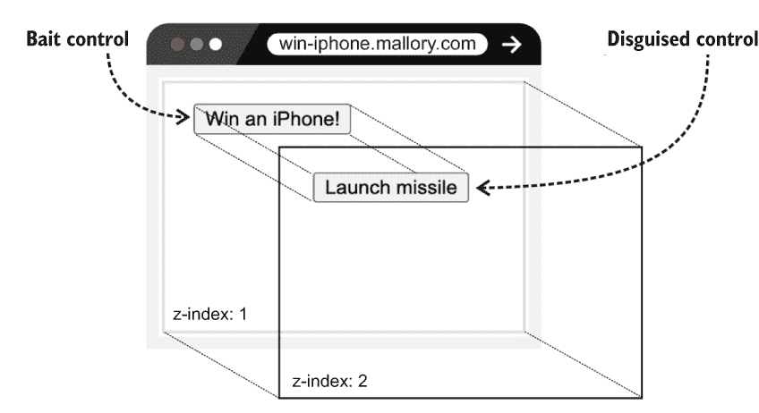

# 第十八章：点击劫持

本章包括

+   配置`X-Frame-Options`头部

+   配置`frame-ancestors`CSP 指令

这一简短的章节探讨了点击劫持并结束了本书。术语*点击劫持*是*点击*和*劫持*两个词的结合。点击劫持是通过诱骗受害者进入恶意网页来启动的。受害者被引诱点击一个看似无害的链接或按钮。点击事件被攻击者劫持并传播到另一个来自另一个站点的 UI 控件。受害者可能认为他们即将赢得一部 iPhone，但实际上他们正在向之前登录过的另一个站点发送请求。这个无意中的请求的状态变化是攻击者的动机。

假设查理刚刚完成了 charlie.mil，一个为高级军官设计的绝密网站。该网站提供列表 18.1 中的网页，launch-missile.html。正如名称所示，该页面使军官能够发射导弹。查理采取了一切必要的预防措施，确保只有授权人员能够访问和使用此表单。

列表 18.1 查理的网站使用普通的 HTML 表单发射导弹

```py
<html>
    <body>
        <form method='POST' action='/missile/launch/'>
          
          <button type='submit'>    # ❶
              Launch missile        # ❶
          </button>                 # ❶
        </form>
        ...
    </body>
</html>
```

❶ 一个简单的按钮用于发射导弹

玛洛瑞想要诱骗查理发射导弹。她引诱他访问 win-iphone.mallory.com，他的浏览器渲染列表 18.2 中的 HTML。此页面的正文包含一个作为诱饵的按钮，以全新的 iPhone 吸引查理。一个 iframe 加载 charlie.mil/launch-missile.html。内联样式表通过将`opacity`属性设置为`0`透明地渲染 iframe。该 iframe 也通过 z-index 属性叠放在诱饵控件之上。这确保了透明控件而不是诱饵控件接收点击事件。

列表 18.2 玛洛瑞的网站嵌入了查理网站的一个网页

```py
<html>
  <head>
    <style>
      .bait {
        position: absolute;                                  # ❶
        z-index: 1;                                          # ❶
      }
      .transparent {
        position: relative;                                  # ❷
        z-index: 2;                                          # ❷
        opacity: 0;                                          # ❷
      }
    </style>
  </head>
  <body>
    <div class='bait'>                                       # ❸
      <button>Win an iPhone!</button>                        # ❸
    </div>                                                   # ❸

    <iframe class='transparent'                              # ❹
            src='https://charlie.mil/launch-missile.html'>   # ❹
    </iframe>                                                # ❹
    ...
  </body>
</html>
```

❶ 将诱饵控件放在透明控件下方

❷ 将透明控件隐藏并堆叠在诱饵控件之上

❸ 诱饵控件

❹ 加载包含透明控件的页面

查理上了钩。他点击了一个看似赢得 iPhone 的按钮。点击事件被导弹发射表单的提交按钮劫持。从查理的浏览器发送了一个有效但是无意的 POST 请求到 charlie.mil。这个攻击在图 18.1 中被描述。



图 18.1 玛洛瑞让查理无意中发射导弹。

不幸的是，查理的 POST 请求没有被同源策略阻止；CORS 也无关紧要。为什么？因为它根本不是跨源请求。请求的来源是通过 iframe 加载的页面（charlie.mil）的来源，而不是包含 iframe 的页面（win-iphone.mallory.com）的来源。这个故事得到了请求的`Host`、`Origin`和`Referer`头部的证实，如下所示（加粗显示）：

```py
POST /missile/launch/ HTTP/1.1
...
Content-Type: application/x-www-form-urlencoded
Cookie: csrftoken=PhfGe6YmnguBMC...; sessionid=v59i7y8fatbr3k3u4... 
Host: charlie.mil
Origin: https://charlie.mil
Referer: https://charlie.mil/launch-missile.html
...
```

每个同源请求在定义上都是同站点请求。Charlie 的无意请求因此被服务器的 CSRF 检查错误地解释为有意的。毕竟，`Referer` 头是有效的，而 `Cookie` 头携带了 CSRF 令牌。

`Cookie` 头还携带了 Charlie 的会话 ID。因此，服务器会使用 Charlie 的访问权限处理请求，发射导弹。现实世界中的攻击者使用点击劫持来实现许多其他目标。这包括欺骗用户购买东西、转账或提升攻击者的权限。

点击劫持是一种特定类型的 UI 重定向攻击。UI 重定向攻击旨在劫持各种用户操作，而不仅仅是点击。这包括按键、滑动和轻触。点击劫持是最常见的 UI 重定向攻击类型。接下来的两节将教你如何防止它。

## 18.1 X-Frame-Options 头

网站传统上使用 `X-Frame-Options` 响应头来抵抗点击劫持。此头由 charlie.mil 等站点为 launch-missile.html 等资源提供。这告知浏览器是否允许将资源嵌入到 iframe、frame、object 或 embed 元素中。

此头的值为 `DENY` 或 `SAMEORIGIN`。这两个设置的行为直观。`DENY` 禁止浏览器在任何地方嵌入响应；`SAMEORIGIN` 允许浏览器在来自相同源的页面中嵌入响应。

默认情况下，每个 Django 项目都会向每个响应添加 `X-Frame-Options` 头。该头的默认值在 Django 3 发布时从 `SAMEORIGIN` 更改为 `DENY`。这种行为由 `X_FRAME_OPTIONS` 设置配置：

```py
X_FRAME_OPTIONS = 'SAMEORIGIN'
```

### 18.1.1 个性化响应

Django 支持一些装饰器，以便根据每个视图基础上修改 `X-Frame-Options` 头。这里以粗体显示的 `xframe_options_sameorigin` 装饰器为例，为单个视图设置 `X-Frame-Options` 的值为 `SAMEORIGIN`。

列表 18.3 允许浏览器嵌入单个同源资源

```py
from django.utils.decorators import method_decorator
from django.views.decorators.clickjacking import xframe_options_sameorigin

@method_decorator(xframe_options_sameorigin, name='dispatch')     # ❶
class XFrameOptionsSameOriginView(View):

   def get(self, request):
       ...
       return HttpResponse(...)
```

❶ 确保 X-Frame-Options 头为 SAMEORIGIN

Django 还附带了一个 `xframe_options_deny` 装饰器。此实用程序的行为类似于 `xframe_options_sameorigin`。

`xframe_options_exempt` 装饰器会根据每个视图基础上省略响应中的 `X-Frame-Options` 头，如下列表所示。只有当响应打算在来自不同源的页面上的 iframe 中加载时才有用。

列表 18.4 允许浏览器在任何地方嵌入单个资源

```py
from django.utils.decorators import method_decorator
from django.views.decorators.clickjacking import xframe_options_exempt

@method_decorator(xframe_options_exempt, name='dispatch')     # ❶
class XFrameOptionsExemptView(View):

   def get(self, request):
       ...
       return HttpResponse(...)
```

❶ 省略 X-Frame-Options 头

这些装饰器都适用于基于类的视图和基于函数的视图。

在之前的章节中，你学会了如何通过内容安全策略来抵抗跨站脚本和中间人攻击。CSP 在下一节中再次出现。

## 18.2 内容安全策略头

`Content-Security-Policy` 响应头部支持一个名为 `frame-ancestors` 的指令。这个指令是防止点击劫持的现代方式。像 `X-Frame-Options` 头部一样，`frame-ancestors` 指令旨在通知浏览器一个资源是否可以嵌入到 iframe、frame、object、applet 或 embed 元素中。像其他 CSP 指令一样，它支持一个或多个来源：

```py
Content-Security-Policy: frame-ancestors <source>;
Content-Security-Policy: frame-ancestors <source> <source>;
```

`CSP_FRAME_ANCESTORS` 设置配置了 `django-csp`（前一章节介绍的一个库）来向 CSP 头部添加 `frame-ancestors`。这个设置接受一个字符串的元组或列表，代表一个或多个来源。下面的配置等同于将 `X-Frame-Options` 设置为 `DENY`。`'none'` 来源禁止响应被嵌入到任何地方，即使是在与响应相同来源的资源中也是如此。单引号是必须的：

```py
CSP_FRAME_ANCESTORS = ("'none'", )

Content-Security-Policy: frame-ancestors 'none'
```

下面的配置允许响应被嵌入到与相同来源的资源中。这个来源等同于将 `X-Frame-Options` 设置为 `SAMEORIGIN`：

```py
CSP_FRAME_ANCESTORS = ("'self'", )

Content-Security-Policy: frame-ancestors 'self'
```

主机来源与特定起源共享资源。具有以下标头的响应只允许在使用 HTTPS 的 8001 端口上的 bob.com 页面中嵌入：

```py
CSP_FRAME_ANCESTORS = ('https://bob.com:8001', )

Content-Security-Policy: frame-ancestors https://bob.com:8001
```

`frame-ancestors` 指令是一个导航指令。与 `img-src` 和 `font-src` 等获取指令不同，导航指令与 `default-src` 无关。这意味着如果 CSP 头部缺少 `frame-ancestors` 指令，浏览器不会回退到 `default-src` 指令。

### 18.2.1 X-Frame-Options 与 CSP 的比较

CSP 的 `frame-ancestors` 指令比 `X-Frame-Options` 更安全、更灵活。`frame-ancestors` 指令提供了更精细的控制级别。多个来源允许您通过协议、域或端口来管理内容。单个内容安全策略可以适应多个主机。

CSP 规范（[www.w3.org/TR/CSP2/](https://www.w3.org/TR/CSP2/)）明确比较了这两种选项：

主要区别在于许多用户代理实现了 `SAMEORIGIN`，以便仅匹配顶级文档的位置。此指令检查每个祖先。如果任何祖先不匹配，则加载被取消。

`X-Frame-Options` 只有一个优势：它被老版本的浏览器支持。但是这些头部是兼容的。一起使用它们只会让网站更安全：

`frame-ancestors` 指令已经废弃了 `X-Frame-Options` 头部。如果一个资源同时拥有这两种策略，应该执行 `frame-ancestors` 策略，而忽略 `X-Frame-Options` 策略。

到现在为止，你已经学会了关于点击劫持的一切需要知道的知识。你也学到了很多其他形式的攻击。请放心，总会有新的攻击方式需要学习；攻击者不会停歇。下一节将为您提供在不断变化的网络安全世界中保持更新的三种方法。

## 18.3 跟上 Mallory 的步伐

保持时效性一开始可能会让人望而却步。为什么？除了源源不断的新攻击和漏洞外，在网络安全领域还有大量新的信息资源。说真的，没有人有足够的时间去消化每篇博客、播客和社交媒体帖子。此外，一些资源仅仅是标题党和危言耸听。在本节中，我将这个领域简化为三个类别：

+   影响者

+   新闻源

+   警报

对于每个类别，我在此提供三个选项。我挑战你至少订阅每个类别中的一个选项。

首先，至少订阅一个网络安全影响者。这些个人提供新闻和建议，担任研究员、作者、博主、黑客和播客主持人等角色。你可以选择以下列出的任何影响者。我更喜欢 Bruce Schneier。

+   Bruce Schneier，@schneierblog

+   Brian Krebs，@briankrebs

+   Graham Cluley，@gcluley

第二，订阅一个好的网络安全新闻来源。以下任何资源都会让你了解当前事件，如大规模泄露、新工具和网络安全法律。这些资源可以通过 RSS 方便地获取。我建议加入 Reddit 上的/r/netsec 社区。

+   [www.reddit.com/r/netsec/](https://www.reddit.com/r/netsec/)—信息安全新闻和讨论

+   [`nakedsecurity.sophos.com/`](https://nakedsecurity.sophos.com/)—新闻、观点、建议和研究

+   [`threatpost.com/`](https://threatpost.com/)—新闻、原创故事、视频和特写报道

第三，订阅风险警报通知。这些资源主要关注最近的攻击和新发现的漏洞。至少，你应该访问[`haveibeenpwned.com`](https://haveibeenpwned.com)并订阅泄露通知。该网站会在你的帐户受到侵害时给你发送电子邮件：

+   [`haveibeenpwned.com/NotifyMe`](https://haveibeenpwned.com/NotifyMe)—警报已被个人帐户泄露

+   [`us-cert.cisa.gov/ncas/alerts`](https://us-cert.cisa.gov/ncas/alerts)—当前安全问题和攻击

+   [`nvd.nist.gov/vuln/data-feeds`](https://nvd.nist.gov/vuln/data-feeds)—通用漏洞和暴露（CVE）

恭喜你完成了这本书。我很享受写作，希望你也喜欢阅读。幸运的是，Python 和安全性都将长期存在。

## 摘要

+   同源策略不适用于点击劫持，因为请求并非跨源。

+   跨站请求伪造检查无法防止点击劫持，因为请求并非跨站点。

+   `X-Frame-Options`和`Content-Security-Policy`响应头有效地抵抗点击劫持。

+   `X-Frame-Options`已被`Content-Security-Policy`所取代。

+   订阅有影响力的人、新闻源和警报，以保持你的技能与时俱进。
