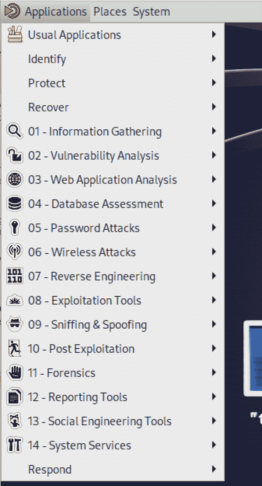

# 第一章：基础的 Kali Linux

Kali Linux 是基于 Ubuntu Linux（又基于 Debian Linux）的 Linux 操作系统的专业分布。Kali 面向希望从事安全工作的人群。这可能涉及安全测试、漏洞开发或逆向工程，或者是数字取证。关于 Linux 发行版的事情在于它们并不相同。Linux 实际上只是内核——实际的操作系统和分布的核心。每个发行版在这个核心上加入了额外的软件，使其变得独特。在 Kali 的情况下，添加的不仅仅是基本实用程序，还包括数百个专门用于安全工作的软件包。

Linux 的一个非常棒的特点，尤其是与其他操作系统相比，就是它几乎可以完全定制化。这包括选择你运行程序的 shell，包括你输入命令的终端环境，以及你使用的图形桌面。甚至更进一步，一旦你选择了环境，你还可以改变这些东西的外观。使用 Linux 允许你让系统按照你希望的方式运行，以符合你的工作风格，而不是让系统因为它的工作方式、外观和感觉而强制你按照它的方式运行。

Linux 实际上有着悠久的历史，如果你追溯其起源的话。理解这段历史将有助于解释为什么 Linux 是现在这个样子——特别是那些看似晦涩的命令，用来管理系统、操作文件，以及完成工作。

# Linux 的遗产

很久以前，在恐龙时代，存在着一个叫做 Multics 的操作系统。*Multics* 的目标是支持多用户，并在每个用户基础上提供进程和文件的隔离。当时，计算机硬件足以运行像 Multics 这样的操作系统的成本高达数百万美元。至少，计算机硬件成本也在数十万美元以上。作为对比，2023 年 4 月，一台价值 700 万美元的系统现在将花费约 6200 万美元。拥有只能支持一位用户的系统显然是不划算的——因此，MIT、贝尔实验室和 GE 共同开发了 Multics，这是使计算机更具成本效益的一种方式。

不可避免地，尽管操作系统最终发布了，项目却慢慢崩溃了。贝尔实验室派驻该项目的一位程序员最终回到了他的正常工作，并最终决定自己编写一个操作系统的版本，以便在贝尔实验室提供的 PDP-7 上玩他最初为 Multics 编写的游戏。这款游戏叫做 Space Travel，而这位程序员 Ken Thompson 需要一个良好的环境来重新开发这款游戏，使其适用于 PDP-7。那个时候，系统在很大程度上是不兼容的。它们有完全不同的硬件指令（操作码），有时还有不同的内存字大小，今天我们常称之为总线大小。因此，为一个环境编写的程序，特别是使用了非常低级别的语言，可能在另一个环境中无法工作。最终形成的环境被命名为 Unics。最终，其他贝尔实验室的程序员加入了这个项目，并最终将其重新命名为 Unix。

Unix 有一个简单的设计。由于最初是为单个用户开发的编程环境，因此它最终被贝尔实验室内外的其他程序员使用。与其他操作系统相比，Unix 的最大优势之一是内核在 1972 年被重写为 C 编程语言。使用比当时更常见的汇编语言更高级的语言使得 Unix 可以在多个硬件系统上移植。不再局限于 PDP-7，Unix 可以在任何具有 C 编译器的系统上运行，以编译构建 Unix 所需的源代码。这样就可以在多种硬件平台上实现标准操作系统。

###### 注意

如果你对汇编语言不熟悉，汇编语言是接近直接为计算机写入二进制代码而不是十进制代码的一种编程语言。汇编语言由助记符组成，这些助记符是人类用来引用处理器理解的操作的方式。助记符通常是描述操作的非常简短的单词。例如，CMP 是比较（compare），MOV 是移动（move），用于在内存中移动数据。汇编语言使你完全控制程序的工作方式，因为它直接被翻译成机器语言——处理器操作和内存地址的二进制值。

除了具有简单的设计外，Unix 还有一个优势，即随附源代码分发。这使得研究人员不仅可以阅读源代码以更好地理解它，还可以扩展和改进源代码。之前使用的汇编语言，如果没有大量时间和经验，阅读起来可能非常具有挑战性。像 C 这样的高级语言大大简化了阅读源代码的过程。Unix 衍生出许多子操作系统，它们的行为与 Unix 相同，并具有相同的功能。在某些情况下，这些其他操作系统发行版始于由 AT&T 提供的 Unix 源代码。在其他情况下，Unix 本质上是基于记录功能反向工程，是两个流行的类 Unix 操作系统的起点：BSD 和 Linux。

###### 注意

正如您将在后面看到的，Unix 设计的一个优点是使用小型、简单的程序，每个程序只做一件事情，但允许您将一个程序的输出作为另一个程序的输入，这样就可以进行链式操作。这个功能的一个常见用途是通过一个实用程序获取进程列表，然后将输出馈送到另一个实用程序进行处理，无论是专门搜索一个条目还是处理输出以去除其中的一些内容以便更容易理解。

# 关于 Linux

随着 Unix 的传播，其设计的简单性和专注于成为一个编程环境，尽管主要是源代码的可用性，使得它成为全球计算机科学课程的教材。20 世纪 80 年代写了许多关于操作系统设计的书籍，基于 Unix 的设计。虽然使用原始源代码会侵犯版权，但其广泛的文档和简单的设计使得可以开发克隆版本。其中一个实现是由 Andrew Tannenbaum 为他的书《操作系统：设计与实现》（Prentice Hall，1987 年）编写的 *Minix*。这个实现成为 Linus Torvalds 开发 Linux 的基础。Torvalds 开发的是 Linux 内核，有些人认为它就是操作系统。内核允许管理硬件，包括处理器，从而允许通过中央处理单元（CPU）运行进程。它没有提供用户与操作系统交互的设施，意味着执行程序。

GNU 项目始于 1970 年代末，由**理查德·斯托曼**创建，其包含一系列程序，这些程序要么是标准 Unix 实用工具的副本，要么在功能上与其相同但名称不同。GNU 项目主要使用 C 语言编写程序，这意味着它们可以轻松移植。因此，Torvalds 及其后来的其他开发者将 GNU 项目的实用工具与其内核捆绑在一起，创建了一套完整的软件发行版，任何人都可以开发并安装到其计算机系统中。GNU 实用工具的集合有时（或至少在历史上曾经）被称为用户空间（userland）。用户空间实用工具是用户与系统进行交互的方式。

Linux 在设计理念上继承了 Unix 的大部分理念，主要是因为它最初是作为标准 Unix 的功能相同版本开始开发的，后来由加州大学伯克利分校的一个小组重新实现为伯克利系统发行版（BSD）。这意味着任何熟悉 Unix 或甚至 BSD 工作原理的人都可以开始使用 Linux，并立即提高生产效率。自 Torvalds 首次发布 Linux 以来的几十年里，许多项目已启动，以增加 Linux 的功能和用户友好性。其中包括几个桌面环境，这些环境都建立在 X/Windows 系统之上，该系统最初由 MIT 开发（而 MIT 再次参与了 Multics 的开发）。

Linux 内核本身的发展改变了开发者的工作方式。举例来说，Torvalds 对允许并发开发者同时在同一文件上工作的软件仓库系统的能力感到不满意。因此，Torvalds 领导开发了*git*，一个版本控制系统，它在开源开发中已大幅取代了其他版本控制系统。如今，如果您想从大多数开源项目获取当前版本的源代码，您可能会通过 git 获得访问。此外，现在有公共代码库允许项目存储其代码，并支持使用 git，一种源代码管理器，来访问代码。即使在开源项目之外，许多（如果不是大多数）企业也已将其版本控制系统迁移到 git，因为其现代化的分布式管理源代码的方法。

Linux 通常免费提供发行版。Linux 的 *发行版* 是由发行版维护者选择的软件包集合。此外，这些软件包已经以特定方式构建，具有由软件包维护者确定的特性。这些软件包是作为源代码获取的，并且许多软件包可以有多个选项——如是否包括数据库支持，使用哪种类型的数据库，是否启用加密——这些选项在配置和构建软件包时必须启用。一个发行版的软件包维护者可能会对选项作出与另一个发行版的软件包维护者不同的选择。

不同的发行版还会有不同的软件包格式。例如，RedHat 及其关联的发行版，如 RedHat Enterprise Linux（RHEL）和 Fedora Core，使用 RedHat Package Manager（RPM）格式。此外，RedHat 使用 RPM 实用程序以及 Yellowdog Updater Modified（yum）来管理系统上的软件包。其他发行版可能使用 Debian 使用的不同软件包管理工具。Debian 使用 Advanced Package Tool（APT）来管理 Debian 软件包格式的软件包。无论发行版或软件包格式如何，软件包的目的都是收集使软件正常运行所需的所有文件，并使这些文件易于放置到位以使软件功能正常。由于最终 Kali Linux 继承自 Ubuntu，再由 Debian 继承，Kali 也使用 APT 来进行软件包管理，无论是从支持的软件包格式的角度还是从管理软件包的工具的角度来看。

多年来，发行版之间的另一个区别是默认由发行版提供的桌面环境。近年来，发行版已经为现有的桌面环境创建了他们自己的定制视图。无论是 GNU 对象模型环境（GNOME）、K 桌面环境（KDE）还是 Xfce，它们都可以通过不同的主题、壁纸以及菜单和面板的组织来进行定制。发行版通常会为不同的桌面环境提供他们自己的看法。一些发行版，如 ElementaryOS，甚至提供了自己的桌面环境，称为 Pantheon。

尽管包管理器的最终结果相同，但有时候包管理器或者甚至桌面环境的选择可能会对用户产生影响。此外，软件包存储库的深度对某些用户也可能有影响。他们可能希望通过存储库安装大量软件选择，而不是试图手动构建并安装软件。即使基于相同的包管理工具和格式，不同的发行版可能有较小的软件包存储库。由于需要在查找所需软件之前安装的软件依赖关系，即使是相关的发行版之间，软件包也并非总是可以混合使用。

有时，不同的发行版将专注于特定的用户群体，而不是为任何希望使用桌面的人提供通用目的的发行版。除此之外，像 Ubuntu 这样的发行版甚至会针对每个版本发布单独的安装发行版，例如服务器安装和桌面安装。桌面安装通常包括图形用户界面（GUI），而服务器安装则不包括，并且因此安装的软件包要少得多。软件包越少，受攻击的风险就越小，服务器通常存储敏感信息，可能更容易暴露给未经授权的用户，因为它们提供网络服务，这些服务在桌面系统上通常找不到。

Kali Linux 是专门针对特定类型用户的发行版——那些对信息安全和其广泛功能感兴趣的用户。作为一个专注于安全功能的发行版，Kali Linux 属于桌面类别，没有意图通过限制安装的软件包数量来增加攻击难度。专注于安全测试的人可能需要各种各样的软件包，而 Kali 则在初始加载时就提供了这些。这可能看起来有点讽刺，考虑到那些专注于保护系统免受攻击的发行版（有时被错误称为“安全”的）通常通过一种称为硬化的过程来限制软件包。然而，Kali 专注于测试，而不是为了防止分发受到攻击而限制软件包。

# 获取和安装 Kali Linux

获取 Kali Linux 的最简单方法是访问其[网站](http://www.kali.org)。从那里，您可以收集关于软件的其他信息，例如已安装软件包的列表。您将下载一个 ISO 映像，如果您安装到虚拟机（VM）中，可以直接使用，或者可以刻录到 DVD 以安装到物理机器上。

Kali Linux 基于 Debian。这并不是一直如此。曾经 Kali 被称为*BackTrack Linux*。BackTrack 基于 Knoppix Linux，这是一个主要用于现场启动的发行版，意味着它设计为从 CD、DVD 或 USB 驱动器启动并从源介质运行，而不是安装到目的地硬盘驱动器。Knoppix 又继承自 Debian。BackTrack 和 Kali Linux 一样，都是专注于渗透测试和数字取证的发行版。BackTrack 的最后一个版本发布于 2012 年，之后 Offensive Security 团队借鉴 BackTrack 的思想并重建了基于 Debian Linux 的 Kali Linux。Kali 保留了 BackTrack 中可用的一个功能，即可以进行现场启动。当您获取 Kali 的启动介质时，您可以选择安装或者现场启动。在图 1-1 中，您可以看到启动选项。


###### 图 1-1\. Kali Linux 启动屏幕

是否从 DVD 启动还是安装到硬盘完全取决于您。如果您从 DVD 启动并且没有将主目录存储在某些可写介质上，您将无法在一次启动和另一次启动之间维护任何信息。如果没有可写介质存储信息，您每次启动时都将从头开始。如果您不希望在操作系统运行时留下任何痕迹，这样做有其优势。如果您要定制或者维护 SSH 密钥或其他存储的凭据，您需要安装到本地介质。

安装 Kali 很简单。您不会像其他发行版那样有多种选择。您不会选择软件包类别。Kali 有一个定义好的软件包集合用于安装。您可以稍后添加更多软件包，甚至删除一些，但您将从一个相当全面的安全测试或取证工具集开始。您需要配置的是选择要安装到的磁盘，并进行分区和格式化。您还需要配置网络，包括主机名和是否使用静态地址而不是 DHCP。一旦您配置好这些并设置了时区以及其他一些基础配置设置，软件包将得到更新，您就可以准备启动到 Linux 了。

## 虚拟机

描述的方法在专用机器上可以运行得很好。专用机器可能很昂贵。即使是低成本的机器也是有成本的，还有机器运行所需的空间和电力。在某些情况下，您可能需要冷却，这取决于您所使用的硬件。

幸运的是，Kali 不需要自己的硬件。它可以在 VM 内良好运行。如果您打算进行安全测试，特别是渗透测试，启动一个虚拟实验室并不是一个坏主意。我发现 Kali 在 4GB 内存和大约 20GB 的磁盘空间下运行得非常好。如果您想存储大量测试产生的工件，可能需要额外的磁盘空间。您应该能够通过 2GB 内存，但显然，您可以节省的内存越多，性能就会更好。

有许多虚拟机监视器可供选择，具体取决于您的主机操作系统。VMware 为 Mac 和 PC 均提供虚拟机监视器。Parallels 可在 Mac 上运行。[VirtualBox](https://www.virtualbox.org/)则可以在 PC、Mac、Linux 系统甚至 Solaris 上运行。VirtualBox 自 2007 年起便存在，但在 2008 年被 Sun Microsystems 收购。随着 Sun 被 Oracle 收购，VirtualBox 目前由 Oracle 维护。不管是谁在维护，VirtualBox 都可以免费下载和使用。如果您刚开始涉足虚拟机领域，这可能是一个适合您的地方。每种虚拟机监视器与用户的互动方式略有不同。打破 VM 的不同键。与操作系统的互动水平不同。不同的客户操作系统支持，因为虚拟机监视器必须为客户提供驱动程序。最终，这取决于您愿意花多少钱以及您感觉舒适使用哪种。

###### 注意

作为可能感兴趣的一点，或至少是联系的一点，BSD 的主要开发人员之一是比尔·乔伊（Bill Joy），他曾是加州大学伯克利分校的研究生。乔伊负责在伯克利 Unix 中首次实现 TCP/IP。他于 1982 年成为 Sun Microsystems 的联合创始人，在那里撰写了一篇关于比 C++更好的编程语言的论文，这也为 Java 的创作提供了灵感。

一个考虑因素是虚拟机监视器提供的工具。这些工具是安装到内核中以更好地与主机操作系统集成的驱动程序。这可能包括打印驱动程序、将主机文件系统共享到客户机中的驱动程序以及更好的视频支持。VMware 可以使用开源的 VMware 工具，并在 Kali Linux 存储库中提供。您还可以从 Kali 存储库获取 VirtualBox 工具。另一方面，Parallels 提供自己的工具。使用 VMware 的一个优点是大多数 Linux 发行版都提供开源驱动程序。我过去在某些 Linux 版本中安装 Parallels 工具时遇到了一些问题，尽管我通常很喜欢 Parallels。如果您不希望在 Kali VM 中自动缩放显示或共享文档，您可能不会关心任何 VM 工具。

## 低成本计算

如果你不想从头开始安装但又有兴趣使用虚拟机，你可以下载 VMware 或 VirtualBox 镜像。Kali 不仅支持虚拟环境，还支持像 Raspberry Pi 和 BeagleBone 这样的基于 ARM 的设备。使用 VM 镜像的优势在于它能让你更快地启动和运行。你不必花时间进行安装。相反，你只需下载镜像，加载到你选择的虚拟化程序中，然后就可以运行了。如果你选择使用预配置的虚拟机路线，你可以在 Kali 网站的[*https://www.kali.org/get-kali/#kali-virtual-machines*](https://www.kali.org/get-kali/#kali-virtual-machines)上找到这些自定义镜像的下载链接。

另一个运行 Kali Linux 的低成本选择是 Raspberry Pi。Pi 是一台非常低成本且占用空间极小的计算机。你可以下载专门为 Pi 设计的镜像。Pi 不像大多数桌面系统那样使用 Intel 或 AMD 处理器。相反，它使用先进的 RISC 机器（ARM）处理器。这些处理器使用更小的指令集，消耗比通常在桌面计算机上看到的处理器更少的电力。Pi 只是一个非常小的板子，可以放在手掌上。你可以购买多种外壳将板子安装在其中，然后配备键盘、鼠标和显示器等任何外设。

Pi 的一个优点是可以用于物理攻击，考虑到其小尺寸。你可以安装 Kali 到 Pi 上，并将其留在你测试的位置，但这需要电源和某种网络连接。Pi 内置了以太网连接，但也有用于 WiFi 适配器的 USB 端口。一旦你安装好 Kali，你可以通过从网络内部访问你的 Pi 来远程执行甚至本地攻击。我们稍后会详细讨论这些内容。

## Windows 子系统 Linux（WSL）

许多人将 Windows 作为他们的主要操作系统，这在考虑到其对大多数桌面任务的实用性时是正当的。虚拟机是在任何系统上安装 Linux 的一种方式，而 Windows 则有更直接的安装 Linux 的方法。2016 年，Windows 推出了一个名为 Windows 子系统 Linux（WSL）的功能。这是一种在 Windows 上直接运行 Linux 默认可执行格式（ELF）二进制文件的方式。WSL 有两个版本。第一个版本是在 Windows 内核中直接实现 Linux 系统调用的一种方式。由于硬件架构不在考虑范围内，因为 Windows 和 Linux 可执行文件都基于 Intel 处理器架构，最大的考虑因素是 Linux 内核管理硬件的方式。这是通过系统调用来完成的。Windows 中的系统调用与 Linux 中的不同。在 Windows 中实现 Linux 的系统调用是允许 Linux 可执行文件几乎原生地在 Windows 上运行的一大步。

最近，Microsoft 改变了实现方式。Windows 的桌面版本现在包含一个轻量级的虚拟化管理程序，这是 Hyper-V 的一个实现，在之前仅作为 Windows 服务器上的本机虚拟化管理程序。WSL 现在使用在 Hyper-V 虚拟机中运行的 Linux 内核来实现。Linux 应用程序直接调用 Linux 内核而不是调用 Windows 内核。其中一个原因是一些 Linux 系统调用在 Windows 中难以实现。在虚拟化环境中实现 WSL 提供了隔离，因此 Linux 应用程序无法影响 Windows 应用程序，因为它们在单独的内存空间中执行。

安装 WSL 非常简单。使用命令行，无论是 PowerShell 还是旧版命令处理器，您都可以运行*wsl --install*。您可以在图 1-2 中看到，默认情况下 Windows 将安装 Ubuntu 内核的一个版本。如果您已经安装了较旧版本的 WSL，可以使用*wsl --upgrade*将其转换为 WSL2。安装环境后，您可以从 Windows 菜单启动它。菜单中默认的 Ubuntu 环境将命名为 Ubuntu。


###### 图 1-2\. 在 PowerShell 中安装 WSL

我们不想要 Ubuntu，我们想要 Kali。您可以在 Microsoft Store 应用程序中找到 Kali。如果您搜索 Kali，您将看到它就像图 1-3 中所示。然而，安装它实际上并不会安装整个发行版。它只安装运行 Kali Linux 的能力。在 Windows 中第一次打开 Kali Linux 时，将安装镜像以及您将要求的用户配置。您将被要求输入一个用户名和该用户名的密码。随后运行 Kali Linux 时，您将自动登录到命令行 shell。


###### 图 1-3\. Microsoft Store 中的 Kali Linux

在 WSL 中的 Kali 基础映像非常小。没有安装很多内容。使用 WSL2 的一个重大优势是能够直接在 Windows 中运行图形应用程序。这以前是不可能的。您可以在 Windows 中运行命令行程序，但是运行图形程序需要另一个软件来托管这些图形程序。如今，Windows 包括托管这些图形程序的功能。因此，您可能希望安装一些元包以获取一些额外的程序。首先，您可能想要安装 kali-linux-default。它将安装数百个额外的软件包，帮助您入门。您不会有完整的图形桌面，但可以直接在 Windows 上运行图形程序。您可以在图 1-4 中看到这一点，Ettercap 作为一个图形程序在 Windows 桌面上运行。


###### 图 1-4\. 在 Windows 桌面上运行的 Ettercap

有了这么多选项来开始你的工作，很容易快速安装起来。一旦安装完成并运行起来，如果你使用的是带有桌面环境的选项，你需要熟悉桌面环境，这样你才能开始提高工作效率。

# 桌面

您将花费大量时间与桌面环境进行交互，所以最好选择一些你感觉舒适的东西。与 Windows 和 macOS 等专有操作系统不同，Linux 有多个桌面环境可供选择。Kali 支持从其存储库中获取的流行桌面环境，无需添加任何额外的存储库。如果默认安装的桌面环境不适合您，更换它也很容易。因为您可能会在环境中花费大量时间，所以您确实希望不仅舒适，而且高效。这意味着找到适合您的正确环境和工具集。

## Xfce 桌面

到 2023 年中期，Kali 的默认桌面环境是 Xfce。尽管它不常作为默认选择，但它通常是一种受欢迎的替代桌面环境。它之所以受欢迎的原因之一是，它被设计成一种相对轻量级的完整桌面环境，因此更加响应迅速。多年来，我认识的许多 Linux 硬核用户倾向于选择 Xfce 作为他们的首选环境，如果他们需要桌面环境的话。再次强调的原因是它具有简单且高度可配置的设计。在 图 1-5 中，你可以看到 Xfce 的基本设置。桌面底部的面板完全可配置。您可以更改其位置和行为方式，并根据自己的喜好添加或删除项目，以适应您的工作方式。此面板包含一个应用程序菜单，其中包含与 GNOME 菜单相同的所有文件夹/类别。


###### 图 1-5\. Xfce 桌面显示应用程序菜单

尽管 Xfce 基于 GNOME 工具包（GTK），但它不是 GNOME 的分支。它是在旧版本的 GTK 之上开发的。其目的是创建比 GNOME 更简单的东西。它旨在更轻量级，因此性能更好。人们的感觉是桌面环境不应妨碍用户想要做的真正工作。

就像在 Windows 上一样，如果你对此比较熟悉，你会得到一个应用程序菜单，里面列出了已安装的程序的快捷方式。不同于按软件供应商或程序名称分组，Kali 根据功能将程序分组展示。本书介绍的类别如下：

+   信息收集

+   漏洞分析

+   网络应用程序分析

+   数据库评估

+   密码攻击

+   无线攻击

+   逆向工程

+   利用工具

+   嗅探与欺骗

+   后利用

+   反取证

+   报告工具

+   社会工程工具

+   系统服务

菜单栏旁边有一组启动器，类似于 Windows 菜单栏上可以找到的快速启动器。Xfce 默认设置了四个虚拟桌面。你可以在菜单栏上看到这些虚拟桌面，它们被编号为框。每个虚拟桌面可以是你运行应用程序的空间。这样可以使你的桌面更整洁。

## GNOME 桌面

GNOME 已经成为许多不同 Linux 发行版的默认桌面环境。它在 Kali Linux 上也可以选择。这个桌面环境是 GNU（GNU's Not Unix，被称为递归首字母缩写）项目的一部分。RedHat 是主要的企业贡献者，并将 GNOME 桌面用作其控制的发行版的主要界面，Ubuntu 和其他几个发行版也是如此。在图 1-6 中，你可以看到展开了主菜单的桌面环境。


###### 图 1-6\. 用于 Kali Linux 的 GNOME 桌面

主菜单可以从顶部菜单栏的“应用程序”菜单中访问。可以使用 Tweaks 程序对其进行最小配置，主要与时钟和日历相关。此外，还有一个“位置”菜单，允许你打开一个文件浏览器，显示“位置”菜单中位置的内容。例如，“主目录”和“文档”是两个位置。如果选择其中任何一个，将打开一个文件浏览器，显示你的主目录或主目录内的“文档”目录。在顶部面板的左侧，你可以打开虚拟桌面管理器。

除了顶部面板上的菜单外，还有一个类似 macOS 的底部坞。坞包括常用应用程序，如终端、Firefox、Metasploit、WireShark、Burp Suite 和 Files。单击其中一个图标一次即可启动该应用程序。你可以通过将它们从应用程序列表中拖出来将启动器添加到此坞。点击坞右侧的九方格图块可以显示这个，这将显示系统上安装的应用程序，按字母顺序显示，就像你在图 1-7 中看到的那样。坞中的应用程序也会显示为“应用程序”菜单中的收藏夹。在 Windows 任务栏横跨屏幕宽度的情况下，GNOME 和 macOS 中的坞仅宽到足以容纳已设置为持久存在的图标，以及运行中应用程序的图标。


###### 图 1-7\. GNOME 应用列表

###### 注意

macOS 中的 dock 源自 NeXTSTEP 操作系统的界面，后者是专为 NeXT 计算机设计的。这是史蒂夫·乔布斯在被迫离开苹果后成立公司设计和建造的计算机。当苹果收购 NeXT 时，许多 NeXTSTEP 用户界面（UI）的元素被整合到 macOS UI 中。顺便说一句，NeXTSTEP 是建立在 BSD 操作系统之上的，这就是为什么 macOS 在打开终端窗口时有 Unix 内核的原因。

## 通过桌面管理器登录

虽然 GNOME 是默认的桌面环境，但其他环境也可以轻松获得。如果安装了多个桌面环境，你可以在登录时的显示管理器中选择其中之一。首先，你需要输入用户名，以便系统识别你配置的默认环境。这可能是你最后登录的环境。图 1-8 展示了我在一台我的 Kali Linux 系统上可以选择的环境。


###### 图 1-8\. 登录时的桌面选择

多年来，显示管理器层出不穷。最初，登录屏幕是 X 窗口管理器提供的功能，但随着其他显示管理器的开发，其功能得到了扩展。LightDM 的一个优势在于它被认为是轻量级的。如果你在资源较少（如内存和处理器）的系统上工作，这可能尤为重要。

## Cinnamon 和 MATE

Cinnamon 和 MATE 这两个桌面环境也起源于 GNOME。Linux 发行版 Linux Mint 对 GNOME 3 及其附带的 GNOME shell（桌面界面）持保留态度。因此，它开发了 *Cinnamon*，最初只是位于 GNOME 之上的一个 shell。随着第二个版本的推出，Cinnamon 成为了一种独立的桌面环境。Cinnamon 的一个优势在于，它在位置和操作方式上与 Windows 非常相似。你可以看到底部左侧有一个类似 Windows 按钮的菜单按钮，以及菜单栏或面板右侧的时钟和其他系统小部件。你可以在 图 1-9 中看到面板和菜单。再次强调，该菜单与 GNOME 和 Xfce 中看到的菜单完全相同。


###### 图 1-9\. Cinnamon 桌面与菜单

正如我所暗示的，对于 GNOME 3 的变化和桌面外观及行为的改变存在一些担忧。有人可能会说这是一种轻描淡写，而一些发行版回到其他外观可能被认为是这一观点的证明。这包括 Kali Linux 中的最新 GNOME 实现。无论如何，Cinnamon 是对 GNOME 3 的一种响应，它通过在底层 GNOME 3 架构之上创建一个外壳来解决这个问题。另一方面，*MATE*则是对 GNOME 2 的直接分支。对于熟悉 GNOME 2 的人来说，MATE 会显得很熟悉。它实现了 GNOME 2 经典外观。您可以在 Kali 中看到它的运行效果，见图 1-10。同样，显示菜单以便您可以看到在所有环境中都能轻松访问应用程序。虽然 Xfce、Cinnamon、GNOME 和其他桌面环境随着时间的推移逐步改进它们的外观，但在 Kali 中实现的 MATE 与其首次发布时看起来几乎没有什么不同。



###### 图 1-10. MATE 桌面与菜单

桌面环境的选择完全是个人的。我这里没有提到但仍然是一个很好的选择的一个桌面环境是[K 桌面环境 (KDE)](https://zh.wikipedia.org/wiki/KDE)。有两个原因。第一个是我总是觉得 KDE 相对比较沉重，尽管随着 GNOME 3 和它带来的许多软件包，这种差距已经有所缩小。KDE 从来没有像 GNOME 或者 Xfce 那样感觉那么快。但是，很多人喜欢它。更具体地说，没有插入它的一个图像的一个原因是它看起来像某些版本的 Windows，还有一些替代的 Linux 桌面。KDE 背后的一个目标似乎总是克隆 Windows 的外观和感觉，以便从该平台过渡过来的用户感到舒适。

如果您真的想要开始使用 Kali 并与其一起工作，您可能需要花些时间尝试不同的桌面环境。重要的是，您要感到舒适并能够高效地使用界面。如果您的桌面环境阻碍了您或者难以导航，那么您可能并不适合它。您可以尝试另一个。安装其他环境非常容易。稍后我们将介绍软件包管理时，您将学会如何安装额外的软件包，因此也可以安装桌面环境。您甚至可能会发现一些未在本讨论中包含的内容。

# 使用命令行

在本书的过程中，你会发现我对命令行有很大的喜好。有很多原因支持这一点。首先，我是在终端没有我们所谓的*全屏幕*时开始计算机工作的。当然，我们当时肯定没有桌面环境。坦率地说，我第一次接触计算机是在一个完全没有屏幕的电传打印机上。在有屏幕的情况下，我们主要使用命令行。因此，我习惯了打字。当我开始使用 Unix 系统时，我只有一个命令行，因此我需要熟悉那里提供的命令集。习惯使用命令行的另一个原因是，你并不总能得到一个 UI。你可能在远程工作并通过网络连接。这可能只能让你使用命令行程序而不需要额外工作。所以，和命令行打好关系是很有用的。

习惯使用命令行和程序元素位置的另一个原因是，GUI 程序可能会出现故障或忽略可能有帮助的细节。这在某些安全或取证工具中尤其如此。举个例子，我更喜欢使用 The Sleuth Kit（TSK），这是一套命令行程序，而不是更视觉化的基于 Web 的界面 Autopsy。由于 Autopsy 建立在 TSK 之上，它只是一种不同的查看 TSK 信息的方式。区别在于，使用 Autopsy 时，你得不到所有的细节，尤其是一些较低层次的细节。如果你正在学习如何操作，理解发生了什么可能比学习 GUI 更有益。你的技能和知识将更易于应用到其他情境和工具中。所以，这也是一个原因。

UI 通常被称为*shell*。无论你是指管理桌面的程序还是接收你在终端窗口中键入的命令的程序，这个说法都是正确的。Linux 中的默认 shell 一直是*Bourne Again Shell*（bash）。这是对早期和长期存在的 Bourne Shell 的一种演变。然而，Bourne Shell 存在限制和缺失的功能。因此，1989 年推出了 Bourne Again Shell。自那以后，它已成为 Linux 发行版中常见的 shell。在命令行上你会运行两种类型的命令。一种是*内建命令*。这是 shell 本身的功能，不需要调用其他程序—shell 自己处理它。另一种命令是位于目录中的程序。shell 有一个目录列表，其中包含程序所在的目录，通过环境变量提供（并可配置）。

目前，在 Kali Linux 中，默认的 Shell 是*Z shell*（zsh）。这是一个基于 bash 但包含许多增强功能的 Shell。在大多数情况下，您不会注意到太多差异，特别是在运行命令时没有差异。zsh 包括许多定制选项，特别是在命令行完成和提示表示方式方面。在 Kali 中使用 zsh 的默认提示如图 1-11 所示。


###### 图 1-11\. zsh 提示

###### 注意

请记住，Unix 是由程序员为程序员开发的。重点是创建一个对使用它的程序员既舒适又有用的环境。因此，Shell 本质上是一种编程语言和环境。每个 Shell 对其使用的控制语句有不同的语法，但是您可以在命令行上创建一个程序，因为 Shell 作为一种编程语言能够执行所有语句。

简而言之，我们将花一些时间在命令行上，因为这是 Unix 起源的地方，而且也非常强大。首先，您会想要在文件系统中移动并获取文件列表，包括权限等详细信息。其他有用的命令包括管理进程和一般实用程序。

## 文件和目录管理

首先，让我们讨论如何让 Shell 告诉您当前所在的目录。这称为*工作目录*。要获取工作目录，也就是从 Shell 的角度看我们当前所在的目录，我们使用*pwd*命令，这是*打印工作目录*的简称。在示例 1-1 中，您可以看到提示符以#结尾，表示当前登录的有效用户是超级用户。#结束提示符，随后是输入和执行的命令。下一行是命令的结果或输出。

##### 示例 1-1\. 打印您的工作目录

```
┌──(kilroy@badmilo)-[~]
└─$ pwd
/home/kilroy
```

###### 注意

当您拥有多台机器（物理或虚拟）时，您可能会发现为不同系统命名主题很有趣。例如，有人以《银河系漫游指南》中的角色命名他们的系统。我也见过以硬币、行星和其他各种主题命名的系统。很长一段时间以来，我的系统以《布卢姆县》中的角色命名。这里的 Kali 系统是以 Basselope 的 Rosebud 命名的。

一旦我们知道在文件系统中的位置，它总是从根目录（/）开始，并在视觉上看起来像树的根部，我们可以获取文件和目录的列表。您会发现，在 Unix/Linux 命令中，通常使用最少数量的字符。在获取文件列表的情况下，命令是 *ls*。虽然 *ls* 很有用，但它只列出文件和目录的名称。您可能希望获取有关文件的其他详细信息，包括时间和日期以及权限。您可以通过使用命令 *ls -la* 来查看这些结果。*l*（ell）指定了*long*列表，包括详细信息。*a* 指定了 *ls* 应显示*所有*文件，包括通常隐藏的文件。您可以在 示例 1-2 中看到输出。

##### 示例 1-2\. 获取长列表

```
┌──(kilroy@badmilo)-[~]
└─$ ls -la
total 192
drwx------ 19 kilroy kilroy  4096 Jun 17 18:54 .
drwxr-xr-x  3 root   root    4096 Jun  3 07:17 ..
-rw-r--r--  1 kilroy kilroy   220 Jun  3 07:17 .bash_logout
-rw-r--r--  1 kilroy kilroy  5551 Jun  3 07:17 .bashrc
-rw-r--r--  1 kilroy kilroy  3526 Jun  3 07:17 .bashrc.original
drwxr-xr-x  8 kilroy kilroy  4096 Jun  3 18:24 .cache
drwxr-xr-x 13 kilroy kilroy  4096 Jun 13 17:37 .config
drwxr-xr-x  2 kilroy kilroy  4096 Jun  3 07:26 Desktop
-rw-r--r--  1 kilroy kilroy    35 Jun  3 07:44 .dmrc
drwxr-xr-x  2 kilroy kilroy  4096 Jun  3 07:26 Documents
drwxr-xr-x  5 kilroy kilroy  4096 Jun 12 19:21 Downloads
-rw-r--r--  1 kilroy kilroy 11759 Jun  3 07:17 .face
lrwxrwxrwx  1 kilroy kilroy     5 Jun  3 07:17 .face.icon -> .face
drwx------  3 kilroy kilroy  4096 Jun  3 07:26 .gnupg
-rw-------  1 kilroy kilroy     0 Jun  3 07:26 .ICEauthority
drwxr-xr-x  3 kilroy kilroy  4096 Jun 11 19:25 .ipython
drwxr-xr-x  4 kilroy kilroy  4096 Jun 11 12:04 .java
-rw-------  1 kilroy kilroy    34 Jun 17 18:53 .lesshst
drwxr-xr-x  4 kilroy kilroy  4096 Jun  3 07:26 .local
drwx------  4 kilroy kilroy  4096 Jun  3 18:24 .mozilla
drwxr-xr-x  2 kilroy kilroy  4096 Jun  3 07:26 Music
-rw-r--r--  1 kilroy kilroy    33 Jun 17 18:54 myhosts
drwxr-xr-x  2 kilroy kilroy  4096 Jun  3 07:26 Pictures
-rw-r--r--  1 kilroy kilroy   807 Jun  3 07:17 .profile
drwxr-xr-x  2 kilroy kilroy  4096 Jun  3 07:26 Public
-rw-r--r--  1 kilroy kilroy    37 Jun  3 18:28 pw.txt
-rw-r--r--  1 kilroy kilroy 28672 Jun 17 15:51 .scapy_history
-rw-r--r--  1 kilroy kilroy     0 Jun  3 07:26 .sudo_as_admin_successful
drwxr-xr-x  2 kilroy kilroy  4096 Jun  3 07:26 Templates
drwxr-xr-x  2 kilroy kilroy  4096 Jun  3 07:26 Videos
-rw-------  1 kilroy kilroy   948 Jun 17 18:54 .viminfo
drwxr-xr-x  3 kilroy kilroy  4096 Jun 11 12:02 .wpscan
-rw-------  1 kilroy kilroy    52 Jun 13 17:23 .Xauthority
-rw-------  1 kilroy kilroy  5960 Jun 17 18:36 .xsession-errors
-rw-------  1 kilroy kilroy  5385 Jun 12 19:23 .xsession-errors.old
drwxr-xr-x 20 kilroy kilroy  4096 Jun 11 13:55 .ZAP
-rw-------  1 kilroy kilroy  2716 Jun 14 18:47 .zsh_history
-rw-r--r--  1 kilroy kilroy 10868 Jun  3 07:17 .zshrc
```

从左列开始，您可以看到权限。Unix 拥有一组简单的权限。每个文件或目录都有一组与用户所有者相关联的权限，然后是与拥有该文件的组相关联的权限集，最后是属于其他所有人的权限集，称为 *world*。目录在第一个位置用 *d* 表示。其他可用的权限包括读取、写入和执行。在类 Unix 操作系统上，程序获得执行位设置以确定它是否可执行。这与 Windows 不同，Windows 中文件扩展名可能决定文件是否可执行。可执行位不仅确定文件是否可执行，还根据执行位所属的类别（用户、组、全局）确定谁可以执行它。

在这些情况下，您还可以查看所有者（用户）和组，两者都是 root。接下来是文件大小，文件或目录上次修改的时间，然后是文件或目录的名称。您可能会注意到顶部有以点或句号开头的文件。这些点文件和目录存储用户特定的设置和日志。通常情况下，它们由创建它们的应用程序管理，因此在常规目录列表中它们是隐藏的。

*touch* 程序可用于将修改日期和时间更新到 touch 运行的时刻。如果文件不存在，touch 将创建一个空文件，并将修改和创建的时间戳设置为执行 touch 的时刻。

其他与文件和目录相关的命令中，与设置权限和所有者相关的命令将非常有用。每个文件和目录都有一组权限，如前所述，以及一个所有者和一个组。要设置文件或目录的权限，您可以使用*chmod*命令，该命令可以为每个可能的权限值取一个数字值。使用三位，每位要么打开要么关闭，表示权限是否设置。您可以考虑权限顺序为从最低特权到最高特权，即读取、写入、执行。然而，由于最重要的位是第一位，读取具有三个位中的最高值。最重要的位的值为 2²，即 4。写入的值为 2¹，即 2。最后，执行的值为 2⁰，即 1。例如，如果您想在文件上设置读取和写入权限，您将使用 4 + 2，即 6。如果您更容易看到它，比特模式将是 110。

有三组权限：所有者、组和全局（每个人）。在设置权限时，您为每个权限指定一个数字值，这意味着您有一个三位数值。例如，为了为所有者设置读取、写入和执行权限，但仅为组和每个人设置读取权限，您可以使用*chmod 744 filename*，其中*filename*是您要设置权限的文件名。如果更容易，您也可以只指定您想要设置或取消设置的位。例如，您可以使用*chmod u+x filename*为所有者添加可执行位。

Linux 文件系统通常结构良好，因此您可以确保在哪里查找文件。然而，在某些情况下，您可能需要搜索文件。在 Windows 或 macOS 上，您可能知道如何查找文件，因为文件管理器中嵌入了必要的工具。如果您正在从命令行工作，您需要了解可以用来定位文件的方法。第一个是*locate*，它依赖于系统数据库。程序*updatedb*将更新该数据库，当您使用*locate*时，系统将查询数据库以查找文件的位置。

如果您正在寻找一个程序，您可以使用另一个实用程序。程序*which*将告诉您程序的位置。如果您有多个位置存储可执行文件，这可能很有用。这里需要注意的是*which*使用用户环境中的 PATH 变量来搜索程序。如果在 PATH 中找到可执行文件，将显示可执行文件的完整路径。

一个更通用的位置定位程序是*find*。虽然*find*具有多种功能，但简单的方法是使用类似*find / -name foo -print*这样的形式。你不必提供* -print*参数，因为打印结果是默认行为；这只是我学会运行该命令的方式，并一直保持至今。使用*find*时，你指定要搜索的路径。*find*执行递归搜索，这意味着它从指定目录开始搜索该目录下的所有目录。在前面的示例中，我们正在寻找名为*foo*的文件。你可以在搜索中使用包括通配符在内的正则表达式。如果要查找以字母*foo*开头的文件，可以使用*find / -name “foo*” -print*。在示例 1-3 中，你可以看到使用 find 在/etc 目录中定位文件的示例。你将看到由于搜索受到另一个用户拥有且没有为其他用户设置读取权限的目录，而导致的权限被拒绝错误。如果使用搜索模式，需要将字符串和模式放在双引号内。虽然*find*具有许多功能，但这将帮助你入门。

##### 示例 1-3\. 使用 find

```
┌──(kilroy@badmilo)-[/etc]
└─$ find . -name catalog.xml
find: ‘./redis’: Permission denied
find: ‘./ipsec.d/private’: Permission denied
find: ‘./openvas/gnupg’: Permission denied
find: ‘./ssl/private’: Permission denied
find: ‘./polkit-1/localauthority’: Permission denied
find: ‘./polkit-1/rules.d’: Permission denied
./vmware-tools/vgauth/schemas/catalog.xml
find: ‘./vpnc’: Permission denied
```

## 进程管理

当你运行一个程序时，你启动了一个进程。你可以将*进程*视为程序的动态运行实例，而程序则是静态的，位于存储介质上。每个正在运行的 Linux 系统在任何时候都有几十个或几百个进程在运行。在大多数情况下，你可以期望操作系统以最佳方式管理这些进程。但是，有时你可能希望自己参与其中。例如，你可能想检查进程是否在运行，因为并非所有进程都在前台运行。*前台进程*是指当前用户有可能看到并与之交互的进程，与*后台进程*相比，后者用户无法与之交互，除非将其调至前台并设计为用户交互。例如，仅仅是检查在其余空闲的 Kali Linux 系统上运行的进程数量，我发现有 141 个进程。在这 141 个进程中，只有一个是在前台运行的。其他全部是某种类型的服务。

要获取进程列表，可以使用*ps*命令。这个命令本身不会给你更多，只会列出属于运行程序用户的进程列表。每个进程都像文件一样，有一个所有者和一个组。原因是进程需要与文件系统和其他对象交互，而拥有所有者和组就是操作系统确定是否允许进程访问的方式。在示例 1-4 中，你可以看到运行*ps*命令的结果。

##### 示例 1-4\. 获取进程列表

```
┌──(kilroy@badmilo)-[~]
└─$  ps
  PID TTY          TIME CMD
 4068 pts/1    00:00:00 bash
 4091 pts/1    00:00:00 ps
 </pre>
```

在示例 1-4 中看到的是进程的识别号码，通常称为*进程 ID*或*PID*，后跟命令发出的电传打字机端口、在处理器上花费的时间，最后是命令。你会看到的大多数命令都有可以附加到命令行的参数，这些参数将改变程序的行为。

有趣的是，AT&T Unix 与 BSD Unix 有些不同。这导致了一些命令行参数的变化，取决于你从哪个 Unix 派生开始。要获取更详细的进程列表，包括所有用户的所有进程（因为未指定时，只获取属于你的进程），你可以使用*ps -ea*或*ps aux*。任何一个都将提供完整的列表，尽管提供的详细信息可能有所不同。

使用*ps*的情况是静态的：你运行一次，获取进程列表。另一个程序可用于实时监视进程列表的变化。虽然也可以从*ps*获取内存和处理器使用情况的统计信息，但使用*top*时，你无需再询问。运行*top*将提供刷新间隔的进程列表。你可以在示例 1-5 中看到示例输出。

##### 示例 1-5\. 使用 top 进行进程列表

```
top - 21:54:53 up 63 days,  3:20,  1 user,  load average: 0.00, 0.00, 0.00
Tasks: 253 total,   1 running, 252 sleeping,   0 stopped,   0 zombie
%Cpu(s):  0.1 us,  0.0 sy,  0.0 ni, 99.9 id,  0.0 wa,  0.0 hi,  0.0 si,  0.0 st
MiB Mem :  64033.1 total,   2912.2 free,   1269.2 used,  59851.7 buff/cache
MiB Swap:   8192.0 total,   8180.7 free,     11.2 used.  62114.3 avail Mem

    PID USER      PR  NI    VIRT    RES    SHR S  %CPU  %MEM     TIME+ COMMAND
 346409 plex      20   0  825004 640152  45780 S   0.3   1.0  94:56.45 Plex Me+
 347400 plex      20   0   55028  34432  11248 S   0.3   0.1  10:27.28 Plex Sc+
 419627 kilroy    20   0    7736   3864   3004 R   0.3   0.0   0:00.02 top
      1 root      20   0  167732  12648   7668 S   0.0   0.0   1:08.01 systemd
      2 root      20   0       0      0      0 S   0.0   0.0   0:00.47 kthreadd
      3 root       0 -20       0      0      0 I   0.0   0.0   0:00.00 rcu_gp
      4 root       0 -20       0      0      0 I   0.0   0.0   0:00.00 rcu_par+
      5 root       0 -20       0      0      0 I   0.0   0.0   0:00.00 slub_fl+
```

除了提供进程列表、它们正在使用的内存量、正在使用的 CPU 百分比以及其他具体信息外，*top*还显示有关运行系统的详细信息，这些信息将显示在顶部。每次显示刷新时，进程列表将重新排列，指示哪些进程消耗了最多资源位于顶部。正如你所见，*top*本身也会消耗一定量的资源，通常会在进程列表的顶部看到它。你将在*top*以及*ps*中看到的一个重要字段是 PID。除了提供一种清晰地区分一个进程与另一个进程（特别是当进程名称相同时）的方法外，它还提供了一种向进程发送消息的方式。

在管理进程时，你会发现两个命令非常宝贵。它们密切相关，执行相同的功能，尽管提供了略有不同的功能。第一个命令是*kill*，或许不出所料，可以终止正在运行的进程。更具体地说，它向进程发送一个信号。操作系统通过向进程发送信号来与进程进行交互。信号是进程间通信（IPC）的一种方式。*kill*的默认信号是 TERM 信号（SIGTERM），意思是*终止*，但如果指定不同的信号，*kill*将发送该信号。要发送不同的信号，你可以发出*kill -# pid*，其中#表示你打算发送的信号的编号，*pid*是你可以从*ps*或*top*中获取的进程标识号码。

第二个您应该熟悉的程序是 *killall*。*kill* 和 *killall* 的区别在于，使用 *killall* 时，您不一定需要 PID。相反，您使用进程的名称。这可能非常有用，特别是当父进程可能已经生成了几个子进程时。如果您想同时终止所有这些进程，可以使用 *killall*，它将查找进程表中的 PID，并向进程发送适当的信号。与 *kill* 一样，*killall* 也会接收信号编号以发送给进程。例如，如果您需要强制关闭所有名为 *firefox* 的进程实例，您将使用 *killall -9 firefox*。

## 其他实用程序

很显然，我们不会详细讨论 Linux 命令行上可用的所有命令。然而，某些其他命令对于理解会很有用。请记住，Unix 设计为具有可以链式连接的简单实用程序。它通过具有三个标准输入/输出流来实现这一点：STDIN、STDOUT 和 STDERR。每个进程在启动时都会继承这三个流。输入使用 STDIN 进入，输出则发送到 STDOUT，错误则发送到 STDERR，尽管这可能是显而易见的。这样做的好处是，例如，如果您不想看到错误信息，您可以将 STDERR 流发送到其他位置，以避免常规输出混乱。

每个这些流都可以重定向。通常情况下，STDOUT 和 STDERR 发送到同一个位置（通常是控制台）。STDIN 源自控制台。如果您希望将输出发送到其他位置，可以使用 *>* 操作符。例如，如果我想将 *ps* 命令的输出发送到一个文件中，我可能会使用 *ps auxw > ps.out*。这将 *ps* 命令的输出发送到名为 ps.out 的文件中。当您重定向输出时，就不再在控制台上看到它了。在此示例中，如果有错误发生，您将会看到它，但看不到任何输出到 STDOUT 的内容。如果您希望重定向输入，您将会反向操作。而不是使用 *>*，您将使用 *<*，指示您希望信息流动的方向。

理解不同的 I/O 流和重定向将帮助您理解 *|*（管道）操作符的使用。当您使用 *|* 时，您是在说：“取左侧的输出并发送到右侧的输入。”您实际上是在两个应用程序之间放置一个连接器，将 STDOUT 发送到 STDIN，而无需经过任何中间设备。

命令链或管道的最有用的用途之一是用于搜索或过滤。例如，如果你有一个长列表的进程，来自*ps*命令，你可以使用管道操作符将*ps*的输出发送到另一个程序*grep*，用于搜索字符串。例如，如果你想要找到所有名为*httpd*的程序的实例，你可以使用*ps auxw | grep httpd*。*grep*用于在输入流中搜索搜索字符串。虽然它对于过滤信息很有用，你也可以用*grep*搜索文件的内容。例如，如果你想在目录中所有文件中搜索字符串*wubble*，你可以使用*grep wubble **。如果你想确保搜索遍历所有目录，你可以告诉*grep*使用递归搜索，命令是*grep -R wubble **。

# 用户管理

在过去，Kali 默认要求以 root 身份登录，但在几个版本中这已经不再是真的了。你将被要求像其他 Linux 发行版一样创建将要使用的用户。这个用户被授予使用*sudo*实用程序临时获得超级用户权限的能力。你的用户将被添加到*sudo*组。这是必要的，因为在 Kali 中你将要做的许多事情都需要管理员权限。

你可能还想在 Kali 中添加额外的用户以及管理 Kali 中的用户，就像其他发行版一样。如果你想创建一个用户，你可以使用*useradd*命令。你也可以使用*adduser*。两者都可以达到相同的目标。在创建用户时，了解一些用户的特性是很有用的。每个用户至少应该有一个主目录，一个 shell，一个用户名和一个组。例如，如果我想要添加我的常用用户名，我会使用*useradd -d /home/kilroy -s /bin/bash -g users -m kilroy*。给定的参数指定了主目录，用户登录时应执行的 shell 以及默认组。指定的*-m*表示*useradd*应该创建主目录。这还将用于交互登录所需的骨架文件填充主目录。

在指定组 ID 的情况下，*useradd*要求该组存在。如果你想让你的用户拥有自己的组，你可以使用*groupadd*创建一个新组，然后使用*useradd*创建属于新组的用户。如果你想将你的用户添加到多个组中，你可以编辑*/etc/group*文件，并将你的用户添加到你想让用户成为成员的每个组行的末尾。为了获得与这些组对文件访问权限相关联的任何权限，例如，你需要注销并重新登录。这将获取到你的用户的更改，包括新组。

创建用户后，您应该设置密码。这可以使用*passwd*命令完成。如果您是 root 用户并希望更改其他用户的密码，则在前面的示例中，可以使用*passwd kilroy*。如果您只是使用*passwd*而没有指定用户名，则将更改您自己的密码。

# Shell

常用的默认 shell 是 Z shell（zsh），它取代了 Bourne Again Shell（bash）成为默认选项。但是，也可以使用其他 shell。如果您想尝试其他 shell，如 bash、fish、csh 或 ksh，可以冒险一试。bash shell 的行为与您将开始使用的 zsh 非常相似。其他 shell 提供了其他可能性，可能会引起兴趣，特别是如果您喜欢进行实验。如果您想永久更改 shell，可以编辑*/etc/passwd*文件，或者只需使用*chsh*命令，让系统为您更改 shell。

# 服务管理

长期以来，有两种服务管理方式：BSD 方式和 AT&T 方式。这不再正确。现在有三种管理服务的方式。在深入探讨服务管理之前，我们首先应该定义什么是服务。在这个背景下，*服务*是指一个可以在没有用户干预的情况下运行的程序。操作环境会自动启动它，并且它在后台运行。除非你获取进程列表，否则你可能永远不知道它在运行。大多数系统在任何时候都会运行相当数量的这些服务。它们被称为*服务*，因为它们为系统、用户或有时是远程用户提供服务。

由于这些服务通常没有直接的用户交互，因此在启动和停止这些服务时，需要另一种方法，可以在系统启动和关闭时自动调用。有了管理服务的功能，用户也可以使用同样的功能来启动、停止、重新启动和获取这些服务的状态。

# 管理服务的权限

服务是系统级别的。管理它们需要管理员权限。您需要是 root 用户，或者需要使用*sudo*来获取临时的 root 权限，以执行服务管理功能。

通常，Linux 发行版使用 AT&T 的*init*启动进程。这意味着服务是通过一组接受标准参数的脚本运行的。*init*启动系统使用运行级别来确定启动哪些服务。单用户模式将启动不同的服务集合，而多用户模式将启动更多服务。使用显示管理器时，还将启动更多服务，以为用户提供 GUI。这些脚本存储在*/etc/init.d/*中，并可以通过提供参数（如*start*、*stop*、*restart*和*status*）来管理。例如，如果要启动 SSH 服务，可能会使用命令*/etc/init.d/ssh start*。但*init*系统的问题是其一般是串行的。这导致系统启动时的性能问题，因为每个服务都会按顺序启动，而不是多个服务同时启动。*init*系统的另一个问题是它不太支持依赖关系。通常，一个服务可能依赖于其他必须首先启动的服务。

随着*systemd* 的出现，这是由 RedHat 的软件开发人员开发的。*systemd* 的目标是改善*init*系统的效率并克服其一些缺点。服务可以声明依赖关系，并且服务可以并行启动。不再需要编写 bash 脚本来启动服务。相反，有配置文件，并且所有服务管理都由程序*systemctl* 处理。要使用*systemctl* 管理服务，你将使用*systemctl verb service*，其中*verb* 是你传递的命令，*service* 是服务的名称。例如，如果你想启用 SSH 服务然后启动它，你会在示例 1-6 中发出这些命令。

##### 示例 1-6\. 启用和启动 SSH 服务

```
┌──(kilroy@badmilo)-[~]
└─$  sudo systemctl enable ssh
Synchronizing state of ssh.service with SysV service script with
/lib/systemd/systemd-sysv-install.
Executing: /lib/systemd/systemd-sysv-install enable ssh
┌──(kilroy@badmilo)-[~]
└─$  sudo systemctl start ssh
```

我们首先要做的是启用服务：告诉你的系统在启动时要启动此服务。服务将在与其关联的配置文件中配置为不同的系统启动模式。每个服务都有一个配置文件。*systemd* 使用目标而不是旧的*init*系统中的运行级别。*target* 本质上与运行级别相同，表示系统操作的特定模式。在示例 1-7 中，你可以看到一个来自*smartd*服务的脚本示例，该服务用于管理存储设备。

##### 示例 1-7\. 配置*systemd*服务

```
$ cat smartd.service
[Unit]
Description=Self Monitoring and Reporting Technology (SMART) Daemon
Documentation=man:smartd(8) man:smartd.conf(5)

# Typically physical storage devices are managed by the host physical machine
# Override it if you are using PCI/USB passthrough
ConditionVirtualization=no

[Service]
Type=notify
EnvironmentFile=-/etc/default/smartmontools
ExecStart=/usr/sbin/smartd -n $smartd_opts
ExecReload=/bin/kill -HUP $MAINPID

[Install]
WantedBy=multi-user.target
Alias=smartd.service
```

*Unit* 部分指示要求、描述以及文档。*Service* 部分指示了如何启动和管理服务。*Install* 服务指示要使用的目标。在本例中，*syslog* 在多用户目标中。

Kali 使用基于 *systemd* 的系统进行初始化和服务管理，因此您主要会使用 *systemctl* 来管理您的服务。在极少数情况下，已安装的服务不支持安装到 *systemd*。在这种情况下，您将安装一个服务脚本到 */etc/init.d/*，然后在那里调用该脚本来启动和停止服务。尽管如此，这类情况很少见。

# 软件包管理

虽然 Kali 自带大量软件包，但并非所有可以安装的软件包都包含在默认安装中。在某些情况下，您可能希望安装软件包。您还将需要更新您的软件包集。无论您要做什么，您都可以使用高级软件包工具 (*apt*) 来执行软件包管理功能。还有其他管理软件包的方法。您可以使用前端工具，但归根结底它们都只是在 *apt* 之上运行的程序。您可以使用任何您喜欢的前端工具，但是了解如何使用 *apt* 是很有用的，因为它非常易于使用。尽管它是命令行程序，但实际上比我多年来见过的某些前端工具要容易使用得多。

您可能希望执行的第一个任务是更新本地软件包数据库中的所有元数据。这些是有关远程存储库中软件包的详细信息，包括版本号。版本信息用于确定您当前安装的软件是否已过时并需要升级。要更新您的本地软件包数据库，您告诉 *apt* 您要更新，正如您可以在 示例 1-8 中看到的那样。

##### 示例 1-8\. 使用 apt 更新软件包数据库

```
┌──(kilroy@badmilo)-[~]
└─$  sudo apt update
Get:1 http://kali.localmsp.org/kali kali-rolling InRelease [30.5 kB]
Get:2 http://kali.localmsp.org/kali kali-rolling/main amd64 Packages [15.5 MB]
Get:3 http://kali.localmsp.org/kali kali-rolling/non-free amd64 Packages [166 kB]
Get:4 http://kali.localmsp.org/kali kali-rolling/contrib amd64 Packages [111 kB]
Fetched 15.8 MB in 2s (6437 kB/s)
Reading package lists... Done
Building dependency tree
Reading state information... Done
142 packages can be upgraded. Run 'apt list --upgradable' to see them.
```

一旦您的本地软件包数据库已更新，*apt* 会告诉您是否有需要更新的已安装软件。在这种情况下，有 142 个软件包需要更新。要更新系统上的所有软件，您可以使用 *apt upgrade* 命令。只需使用 *apt upgrade* 将更新所有软件包。如果您只需要更新单个软件包，可以使用 *apt upgrade packagename* 命令，其中 *packagename* 是您要更新的软件包的名称。Debian 及其衍生系统 Kali 使用的打包格式告诉 *apt* 所需的软件包是什么。这些依赖关系列表告诉 Kali 为使特定软件包正常工作需要安装什么。在升级软件的情况下，它有助于确定软件包应升级的顺序。

如果需要安装软件，只需键入 *apt install packagename* 即可。依赖关系在这里是重要的。*apt* 会确定在请求的软件包之前需要安装哪些软件。因此，当你要求安装某个软件时，*apt* 会告诉你需要其他软件。你会得到所有必需软件的列表，并被问及是否要全部安装。你可能还会得到一个可选软件包的列表。软件包可能会有一系列相关软件，可以与你正在安装的软件包一起使用。如果你想安装它们，你需要单独告诉 *apt* 你要安装它们。可选软件包并不是必需的。

移除软件包使用 *apt remove packagename*。删除软件的一个问题是，虽然安装时有依赖关系，但同样的软件可能不会被移除，因为一旦安装后，可能被其他软件包使用。但 *apt* 会确定哪些软件包不再使用。当你使用 *apt* 执行某个功能时，它可能会告诉你有些软件包可以被移除。要删除不再需要的软件包，使用 *apt autoremove*。

所有这些都假设你知道你在寻找什么。你可能不完全确定软件包的名称。在这种情况下，你可以使用 *apt-cache* 搜索软件包。你可以使用部分名称搜索术语，因为有时软件包的名称可能不是你所期望的。不同的 Linux 发行版可能会用不同的名称命名一个软件包。例如，正如你在 示例 1-9 中看到的那样，我搜索了 *sshd*，因为软件包的名称可能是 *sshd*、*ssh*，或者完全不同的其他名称。你可以看到搜索结果。

##### 示例 1-9\. 使用 apt-cache 搜索软件包

```
┌──(kilroy@badmilo)-[~]
└─$ apt-cache search sshd
fail2ban - ban hosts that cause multiple authentication errors
libconfig-model-cursesui-perl - curses interface to edit config data through Config::Model
libconfig-model-openssh-perl - configuration editor for OpenSsh
libconfig-model-tkui-perl - Tk GUI to edit config data through Config::Model
libnetconf2-2 - NETCONF protocol library [C library]
libnetconf2-dev - NETCONF protocol library [C development]
libnetconf2-doc - NETCONF protocol library [docs]
openssh-server - secure shell (SSH) server, for secure access from remote machines
tinysshd - Tiny SSH server - daemon
zsnapd - ZFS Snapshot Daemon written in python
zsnapd-rcmd - Remote sshd command checker for ZFS Snapshot Daemon
```

你可以看到，Kali 上的 SSH 服务器似乎被命名为 *openssh-server*。如果该软件包未安装但你需要安装它，你可以使用软件包名 *openssh-server* 进行安装。这种情况假设你知道系统上已安装了哪些软件包。由于安装了成千上万个软件包，你很可能不会知道已有的所有软件。如果你想知道系统上安装了哪些软件，可以使用程序 *dpkg*，它还可以用来安装不在远程仓库中但你已经找到的 *.deb* 文件，即 Debian 软件包文件。要获取已安装的所有软件包的列表，可以使用 *dpkg --list*。这与使用 *dpkg -l* 是一样的。两者都会给出已安装软件的列表。

返回的列表将提供软件包的名称以及软件包的描述和安装的版本号。您还将获得软件包构建的 CPU 架构。如果您有 64 位 CPU 并安装了 64 位版本的 Kali，您可能会看到大多数软件包的架构设置为*amd64*，尽管您可能还会看到一些标记为*all*，这可能只是表示软件包中没有可执行文件。任何文档软件包都将适用于所有架构，作为一个例子。

您可以使用*dpkg*安装在 Kali 存储库中找不到的软件。如果找到一个*.deb*文件，您可以下载它，然后使用*dpkg -i <packagename>*来安装它。您可能还想删除已安装的软件包。虽然您可以使用*apt*来完成这个操作，但您也可以使用*dpkg*，特别是如果软件包是以这种方式安装的。要使用 dpkg 删除软件包，您可以使用*dpkg -r <packagename>*。如果您不确定软件包的名称，您可以从已安装软件包的列表中获取，您可以使用*dpkg*来获取。

每个软件包可能包括一系列文件，包括可执行文件、文档、默认配置文件和所需的库。如果您想查看软件包的内容，可以使用*dpkg -c <filename>*，其中文件名是*.deb*文件的完整名称。在示例 1-10 中，您可以看到日志管理软件包*nxlog*的部分内容。这个软件包不是作为 Kali 存储库的一部分提供的，而是作为社区版的免费下载提供的。这个软件包的内容不仅包括文件，还包括权限，包括所有者和组。您还可以从软件包中看到与文件相关联的日期和时间。

##### 示例 1-10。nxlog 软件包的部分内容

```
┌──(kilroy@badmilo)-[~]
└─$ dpkg -c nxlog-ce_3.2.2329_ubuntu22_amd64.deb
drwxr-xr-x root/root         0 2023-04-14 09:14 ./
drwxr-xr-x root/root         0 2023-04-14 09:14 ./etc/
drwxr-xr-x root/root         0 2023-04-14 09:14 ./etc/nxlog/
-rw-r--r-- root/root      1275 2023-04-14 08:49 ./etc/nxlog/nxlog.conf
drwxr-xr-x root/root         0 2023-04-14 09:14 ./lib/
drwxr-xr-x root/root         0 2023-04-14 09:14 ./lib/systemd/
drwxr-xr-x root/root         0 2023-04-14 09:14 ./lib/systemd/system/
-rw-r--r-- root/root       349 2023-04-14 08:49 ./lib/systemd/system/nxlog.service
drwxr-xr-x root/root         0 2023-04-14 09:14 ./usr/
drwxr-xr-x root/root         0 2023-04-14 09:14 ./usr/bin/
-rwxr-xr-x root/root    517232 2023-04-14 09:14 ./usr/bin/nxlog
-rwxr-xr-x root/root    500856 2023-04-14 09:14 ./usr/bin/nxlog-processor
-rwxr-xr-x root/root    455808 2023-04-14 09:14 ./usr/bin/nxlog-stmnt-verifier
drwxr-xr-x root/root         0 2023-04-14 09:14 ./usr/lib/
drwxr-xr-x root/root         0 2023-04-14 09:14 ./usr/lib/nxlog/
drwxr-xr-x root/root         0 2023-04-14 09:14 ./usr/lib/nxlog/modules/
drwxr-xr-x root/root         0 2023-04-14 09:14 ./usr/lib/nxlog/modules/extension/
drwxr-xr-x root/root         0 2023-04-14 09:14 ./usr/lib/nxlog/modules/extension/python/
-rw-r--r-- root/root     15678 2023-04-14 09:14 ./usr/lib/nxlog/modules/extension/python/libpynxlog.a
```

需要考虑的一件事是，您在*.deb*文件中获得的软件包通常是为特定发行版创建的。这是因为通常有依赖关系，创建软件包的人或团体知道发行版可以提供这些依赖关系。其他发行版可能没有正确的版本来满足软件包的要求。如果是这种情况，软件可能无法正确运行。如果依赖关系未满足，*dpkg*会报错。您可以使用*--force-install*作为命令行参数来强制安装，但尽管软件会安装，但不能保证它会正确运行。

*dpkg*还具有其他功能，使您能够查看软件包、查询已安装的软件等。前面列出的选项将足以让您入门。在 Kali 存储库中提供的大量软件包中，您可能不太可能需要进行任何外部安装，尽管这并非不可能。然而，了解*dpkg*及其功能仍然是有用的。

# 日志管理

大多数情况下，如果你正在进行安全测试，你可能永远不需要查看系统上的日志。然而，多年来，我发现日志是非常宝贵的。尽管 Kali 是一个非常稳定的发行版，但仍然存在某些可能会出现问题需要调查的情况。即使一切正常，你可能仍然想查看应用程序记录了什么。因此，你需要了解 Linux 中的日志系统。要做到这一点，你需要知道你正在使用什么。Unix 长期以来一直使用 *syslog* 作为系统日志记录器，尽管它起初是 sendmail 邮件服务器的日志记录设施。

多年来，*syslog* 已经有了许多实现方式。Kali Linux 并没有安装常见的 syslog 实现，但你可以安装像 *rsyslog* 这样的典型系统日志记录器。这是一个相当简单的实现，很容易确定需要查看的日志信息文件的位置。通常，所有日志都存放在 */var/log* 中。但是，你需要查看不同信息类别的特定文件以获取日志条目。在 Kali 中，你需要检查 */etc/rsyslog.conf* 文件。除了许多其他配置设置外，你将看到 Example 1-11 中显示的条目。

##### Example 1-11\. rsyslog 的日志配置

```
auth,authpriv.*                 /var/log/auth.log
cron.*                          -/var/log/cron.log
kern.*                          -/var/log/kern.log
mail.*                          -/var/log/mail.log
user.*                          -/var/log/user.log

#
# Emergencies are sent to everybody logged in.
#
*.emerg                         :omusrmsg:*
```

你在左侧看到的是设施和严重级别的组合。点号前的单词是设施。设施基于使用 *syslog* 记录日志的不同子系统。你可能会注意到，*syslog* 已经存在很长时间了，因此仍然为你可能很少见到的子系统和服务识别出了设施。在 Table 1-1 中，你将看到 *syslog* 中定义的设施列表。描述栏指示设施在不提供信息的情况下用于什么目的。

Table 1-1\. Syslog 设施

| 设施编号 | 设施 | 描述 |
| --- | --- | --- |
| 0 | kern | 内核消息 |
| 1 | user | 用户级消息 |
| 2 | mail | 邮件系统 |
| 3 | daemon | 系统守护程序 |
| 4 | auth | 安全/授权消息 |
| 5 | syslog | 内部由 syslogd 生成的消息 |
| 6 | lpr | 行打印子系统 |
| 7 | news | 网络新闻子系统 |
| 8 | uucp | UUCP 子系统 |
| 9 |  | 时钟守护程序 |
| 10 | authpriv | 安全/授权消息 |
| 11 | ftp | FTP 守护程序 |
| 12 | - | NTP 子系统 |
| 13 | - | 日志审计 |
| 14 | - | 日志警告 |
| 15 | cron | 调度守护程序 |
| 16 | local0 | 本地使用 0 (local0) |
| 17 | local1 | 本地使用 1 (local1) |
| 18 | local2 | 本地使用 2 (local2) |
| 19 | local3 | 本地使用 3 (local3) |
| 20 | local4 | 本地使用 4 (local4) |
| 21 | local5 | 本地使用 5 (local5) |
| 22 | local6 | 本地使用 6 (local6) |
| 23 | local7 | 本地使用 7 (local7) |

伴随设施的是严重性。严重性可能的值包括 Emergency、Alert、Critical、Error、Warning、Notice、Informational 和 Debug。这些严重性按降序列出，最严重的在前面。你可能会确定 Emergency 日志应该发送到与每个设施相关的日志。在 示例 1-8 中，所有严重性都被发送到与每个设施相关联的日志。设施名称后的 “*” 表示所有设施。例如，如果你想将 auth 设施的错误发送到特定的日志文件，你将使用 *auth.error* 并指定你想使用的文件。

一旦你知道日志存放在哪里，你需要能够阅读它们。幸运的是，syslog 的日志条目足够容易解析。如果你查看 示例 1-12，你会看到来自 Kali 系统上 *auth.log* 的一组日志条目。在条目的左侧开始，你会看到写入日志条目的日期和时间。然后是主机名。由于 *syslog* 具有将日志消息发送到远程主机（如中央日志主机）的能力，主机名对于能够在同一日志文件中写入多个主机的日志条目进行区分非常重要。主机名之后是进程名称和 PID。这些条目大多数来自名为 *realmd* 的进程，PID 为 803。

##### 示例 1-12\. 部分 auth.log 内容

```
2023-05-21T18:14:30.094986-04:00 badmilo sudo: pam_unix(sudo:session): session closed for user root
2023-05-21T18:15:01.783725-04:00 badmilo CRON[41805]: pam_unix(cron:session): session opened for user root(uid=0) by (uid=0)
2023-05-21T18:15:01.787913-04:00 badmilo CRON[41805]: pam_unix(cron:session): session closed for user root
2023-05-21T18:16:59.653896-04:00 badmilo sudo:   kilroy : TTY=pts/0 ; PWD=/var/log ; USER=root ; COMMAND=/usr/bin/cat auth.log
2023-05-21T18:16:59.654531-04:00 badmilo sudo: pam_unix(sudo:session): session opened for user root(uid=0) by (uid=1000)
```

日志的挑战部分并非前言，这部分由 *syslog* 服务创建和编写，而是应用程序条目。只要你理解自己在查看什么，读英文就可以理解这里的内容。然而，日志条目的内容是由应用程序自身创建的，这意味着程序员必须调用生成和写入日志条目的函数。有些程序员可能更善于生成有用和易于理解的日志条目。一旦你习惯于阅读日志，你就会开始理解它们在说什么。如果你遇到一个真正需要但你不理解的日志条目，互联网搜索引擎总是可以帮助找到更理解该日志条目的人。或者，你可以联系软件开发团队寻求帮助。

并非所有日志都通过 *syslog* 运行，但所有与系统相关的日志都是如此。即使 *syslog* 不管理应用程序的日志，例如 Apache web 服务器，日志仍然可能位于 */var/log/*。在某些情况下，你可能需要搜索日志。这可能是一些安装到 */opt* 的第三方软件的情况。

# 摘要

Linux 有着悠久的历史，可以追溯到资源非常受限制的时代。这导致了一些目的是让用户（主要是程序员）高效的深奥命令。找到一个适合你的环境非常重要，这样你也可以在工作中高效率。以下是本章节的一些要点：

+   Unix 是由程序员为程序员使用命令行创建的环境。

+   Unix 是用简单、单一用途的工具创建的，这些工具可以组合成更复杂的任务。

+   Kali Linux 有几种潜在的 GUI 可以安装和使用；找到一个你最舒适的很重要。

+   每个桌面环境都有大量的自定义选项。

+   Kali 基于*systemd*，因此服务管理使用*systemctl*。

+   进程可以使用信号管理，包括中断和杀死。

+   日志将是你的朋友，并帮助你排除错误。日志通常存储在*/var/log*中。

+   配置文件通常存储在*/etc*中，尽管个别配置文件存储在用户主目录中。

# 测验问题

1) 你会用什么 Linux 命令来获取目录列表？a) dir b) fl c) ls d) list

2) Linux 派生自哪个操作系统？a) Windows b) Unix c) Multics d) macOS

3) 在 Kali Linux 中，默认的桌面环境是哪个？a) Xfce b) GNOME c) KDE d) Ratpoison

4) 在 Kali Linux 中，默认用来管理软件包的软件包管理实用程序是哪个？a) yum b) rpm c) slackpkg d) apt

5) 如果你想要获取定期自动更新的进程列表及相关利用情况，你会用什么工具？a) ps b) top c) free d) grep

6) Linux 中用于 I/O 的两个流的名称是什么？a) IN,OUT b) SIN,SOUT c) STDIN,STDOUT d) INPUT,OUTPUT

7) 下列哪个 Linux 实用程序不用于定位文件？a) which b) locate c) find d) search

8) 如果你想找到与你已知命令相关的帮助信息，你会用什么？a) apropos b) like c) regards d) similar

9) 如果你使用 ps aux | grep top，你在做什么？a) 将进程列表放入 top b) 使用 top 查找匹配项为 aux 的进程 c) 在进程列表中搜索名为 top 的进程 d) 格式化进程列表

10) 在 Kali Linux 上，你会用什么来管理像守护进程那样在系统启动时执行的系统服务？a) init b) update-rc c) inetd d) systemctl

# 有用资源

+   [*Linux in a Nutshell*, 6e](http://bit.ly/linux-in-a-nutshell)，由 Ellen Siever, Stephen Figgins, Robert Love 和 Arnold Robbins（O’Reilly，2009）

+   [*https://learning.oreilly.com/library/view/practical-linux-system/9781098109028/*](https://learning.oreilly.com/library/view/practical-linux-system/9781098109028/) [*Practical Linux System Administration*]，由 Kenneth Hess（O’Reilly，2023）

+   [*https://learning.oreilly.com/library/view/efficient-linux-at/9781098113391/*](https://learning.oreilly.com/library/view/efficient-linux-at/9781098113391/) 由 Daniel J. Barrettt 撰写的 [*高效 Linux 命令行*]

+   Kali Linux [网站](https://www.kali.org/)

+   [“Linux 系统管理基础”](http://bit.ly/linode-linux) 由 Linode 提供
