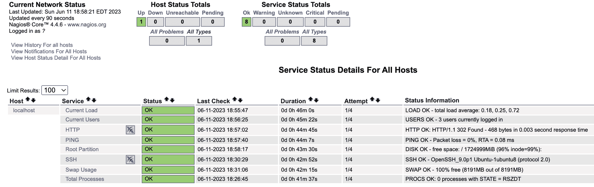
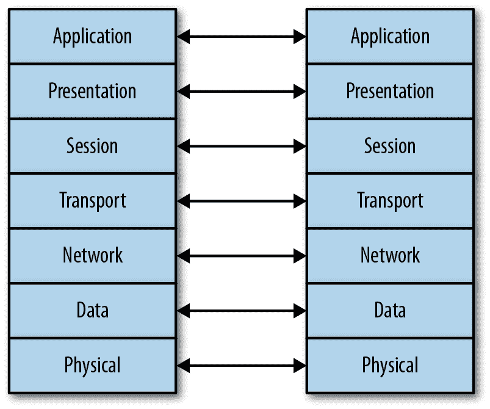
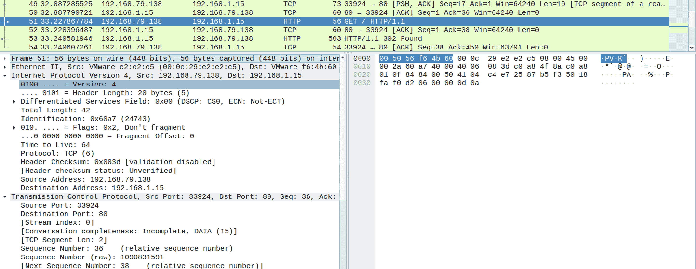
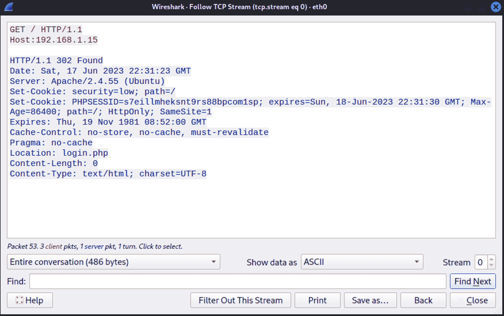
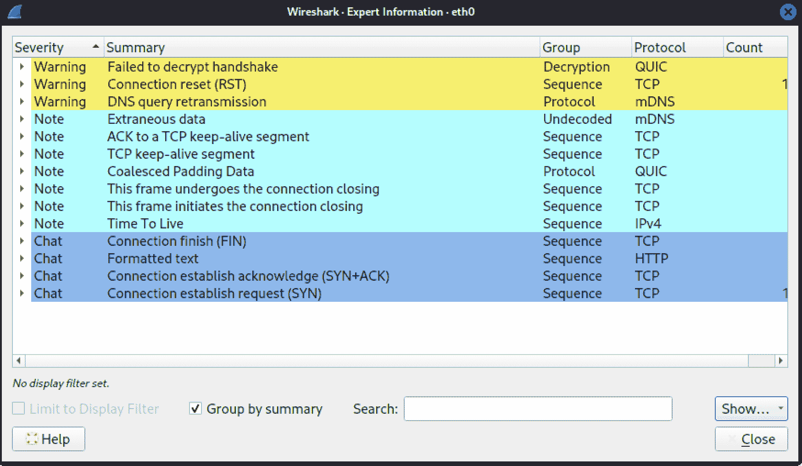
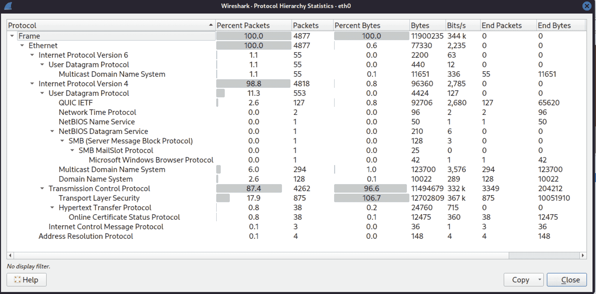
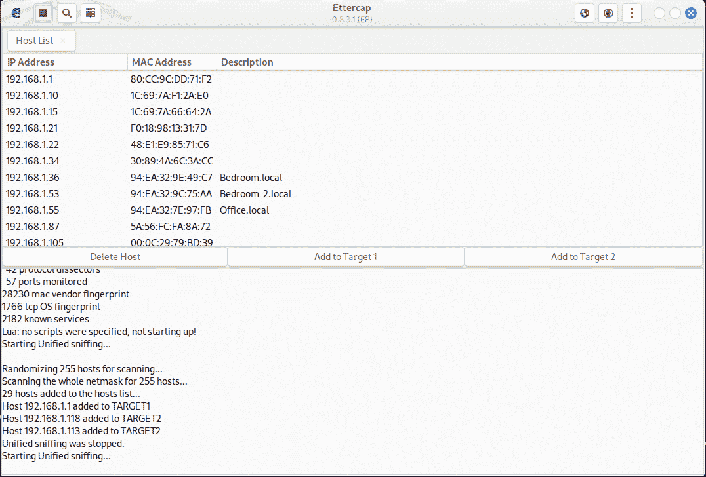

# 第二章：网络安全测试基础

*安全测试*是一个广义的术语，意味着很多不同的事物。通常，渗透测试是通过网络远程进行的。然而，并不是所有的安全测试都是渗透测试。有时，开发团队可能希望测试应用程序，包括 Web 应用程序。这些 Web 应用程序可能包括多个网络服务。有时，您可能不仅测试网络应用程序，还会测试设备。需要对应用程序和设备进行压力测试，以确保其能够处理各种类型的流量，甚至大量的流量。

如果您想执行任何基于网络的安全测试，理解网络协议栈的定义是至关重要的。定义协议以及更具体地说它们的互动，可以使用开放系统互联模型（OSI 模型）。使用 OSI 模型，我们可以将通信分解为不同的功能元素，并清楚地看到在创建网络数据包时不同信息块的添加。此外，还可以看到在功能元素之间从系统到系统的交互作用。

压力测试不仅仅是生成大量流量并发送到应用程序或设备。在某些情况下，您可能会通过发送未预期的数据来对应用程序或设备进行压力测试。即使是运行在限制使用设备上的应用程序（比如物联网设备，如恒温器、锁、灯开关），也对接收到的数据类型和结构有预期。发送意料之外的内容可能会导致应用程序失败。这是一个有用的信息。这是另一种压力测试类型，因为您正在测试应用程序的逻辑。

这部分原因之一是理解通信协议如何构建。执行网络安全测试需要理解通信模型的不同层如何结合。一旦理解了这一点，就可以考虑如何进行安全测试。当然，了解安全测试的定义也是有帮助的，所以让我们从这里开始，然后我们可以深入了解通信堆栈如何工作。

# 安全测试

当很多人听到*安全测试*这个术语时，他们可能会想到渗透测试，其目标是进入系统并获取尽可能高的权限。安全测试并不完全是关于弹出框。事实上，你可能会认为大多数安全测试并不是渗透测试。保护系统和软件的领域远不止于通常被认为是渗透测试的范畴。在我们开始讨论使用 Kali Linux 进行网络安全测试时，我们应该先了解一下安全是什么，这样你可以更好地理解这种情境下测试的含义。

当专业人士，尤其是认证机构讨论安全时，他们常常提到所谓的*三位一体*。有些人可能会添加其他要素，但信息安全的核心是三个基本原则：保密性、完整性和可用性。任何可能影响系统或软件这些方面的事物，都会影响该软件或系统的安全性。安全测试应该全面考虑所有这些方面，而不仅仅是渗透测试可能提供的有限视角。

如你所知，三位一体可以被表示为等边三角形。这个三角形是等边的，因为所有三个要素被认为具有相同的重要性。此外，如果任何一个要素丢失，你就不再有三角形。你可以在图 2-1 中看到一个常见的表示，其中所有三边长度相同。这些要素被认为是信息可靠和可信的关键因素。如今，由于企业和个人如此依赖存储在数字形式的信息，因此信息的可用性、在必要时的保密性和完整性至关重要。


###### 图 2-1\. 三位一体（CIA triad）

大多数企业都运作在秘密之上。人们也有秘密：他们的社会安全号码、使用的密码、税务信息、医疗信息以及各种其他数据。企业需要保护他们的知识产权，这是一方面。他们可能有许多商业秘密，如果这些信息泄露出去将对企业造成负面影响。无论是什么信息，保持其机密性都是*保密性*的核心。任何时候，只要未经许可的人员可以检索信息，机密性就会受到侵犯。这是无数数据盗窃事件中受到影响的主要因素，从 Target、国家人事管理局到 Equifax 和索尼。当消费者信息被窃取时，该信息的保密性就会受到损害。现代勒索软件攻击也会影响保密性。攻击者会威胁公开窃取的数据。

通常，我们期望当我们存储某些内容时，在检索时它保持不变。数据损坏或更改可能是由各种因素引起的，这些因素未必是恶意的。即使我们谈论安全性，并不总是意味着我们在谈论恶意行为。当然，我之前提到的案例是恶意的。然而，坏掉或失效的内存可能会导致磁盘上的数据损坏。我从个人经验中说这句话。类似地，失效的硬盘驱动器或其他存储介质可能会导致数据损坏。当然，在某些情况下，恶意和故意的行为会导致数据损坏或错误。当信息被损坏时，无论原因如何，这都是完整性的失败或违反。*完整性*完全是关于某物处于你合理期望的状态。再考虑一下勒索软件。当数据被攻击者加密时，由于它不再处于用户最后访问时的状态，它已经失去了完整性。

最后，让我们考虑*可用性*。如果我把插头从墙上踢下来，可能会摔到地上，甚至可能碰到头，你的电脑就会变得不可用（当然，我们说的是台式系统，而不是带电池的系统）。同样地，如果你的网络电缆夹子脱落，导致连接器无法留在墙插或网络接口卡中，你的系统将在网络上不可用。当然，这可能会影响你和你完成工作的能力，但如果其他人需要你电脑上的任何内容，这也可能会影响他们。每当服务器故障时，这就是可用性的影响。如果攻击者能够导致服务或整个操作系统暂时失败，这也会影响可用性，对业务可能造成严重后果。这可能意味着消费者无法访问宣传的服务。这可能意味着大量的人力和其他资源投入到维持服务的运行和可用性中，就像银行遭受了大规模、持续且长时间的拒绝服务攻击的情况。尽管可用性失败的企图并不成功，但在打击中业务受到了影响。再来谈谈勒索软件的问题，当你没有解密密钥时，加密数据就成了一个可用性问题。如果数据无法读取，那么至少在可用的形式上就是不可用的。

这引发了对 CIA 三元模型局限性的讨论。唐·帕克提议向 CIA 三元模型的三个属性添加三个信息安全属性。根据帕克的观点，安全性还涉及控制、真实性和实用性。控制是关于所有权的问题。如果我拥有某个资源，我就控制着它。真实性是关于验证的问题。被质疑的物品是否符合预期？这包括材料的来源，包括电子邮件。数字签名是验证真实性的方法。最后，实用性是指某物是否有用。当数据被勒索软件威胁行为者加密时，这可能是一个更好的术语。从技术上讲，文件是可用的，只是它们在目前的形式下并不十分有用。

与这些要素相关的任何测试都是安全测试，无论测试的形式如何。在网络安全测试方面，我们可能会测试服务的脆弱性、加密强度和其他因素。当我们谈论网络测试时，我们将首先看一组压力测试工具。我们还将研究其他有时会导致网络故障的工具。尽管操作系统的网络堆栈中的许多错误可能已经在多年前修复，但有时你可能会遇到更轻便、更脆弱的设备，这些设备可能连接到网络上。这些设备可能包括打印机、IP 电话、恒温器、冰箱以及近来越来越多地连接到网络的几乎无数其他设备。

# 网络安全测试

我们依靠网络生活；我们因网络而死。你的个人信息目前有多少是直接存储或者至少可以通过互联网访问的？无论你的信息存储在本地网络设备、雇主的企业网络或者互联网上的其他地方（通常称为*云*），当我们生活在期望一切都可以通过网络获得和访问的时候，确保我们的设备能够抵御攻击是至关重要的。

## 监控

在我们进行任何测试之前，我们需要谈论监控的重要性。如果你为公司或客户进行我们正在讨论的任何测试，理想情况下，除非有人要求，你不会故意关闭任何服务。然而，无论你多么小心，总有可能发生意外，服务或系统可能会崩溃。这就是为什么与拥有系统的人沟通至关重要，这样他们就可以监控他们的系统和服务。企业不会希望影响他们的客户，因此他们通常希望员工能够在必要时重新启动服务或系统。

###### 注意

一些公司可能希望测试其运营人员，这意味着他们期望你尽力渗透和击垮系统和服务，但不造成任何长期或永久性损害。这通常被称为红队测试。在这种情况下，你不会与任何人沟通，只与雇佣你的管理层联系。然而，在大多数情况下，公司会希望确保他们的生产环境正常运行。如果运营人员或其管理层的一部分参与其中，试图看看他们是否能够检测到渗透，这种测试被称为紫队测试。运营人员是蓝队，攻击团队是红队。将这两者结合起来，就得到了紫队。

如果运营人员参与其中，他们将希望有一些监控措施。这可能包括观察日志，这通常是明智的。然而，日志并不总是可靠的。毕竟，如果您能够崩溃一个服务，服务在失败之前可能没有足够的时间写入有用的内容到日志中。然而，这并不意味着您应该忽视日志。请记住，安全测试的目的是帮助提高您所工作的公司的安全姿态。在进程失败之前，日志可能是获取有关进程状态的重要线索。服务可能不会以进程停止的方式失败，但有时服务可能不像预期的那样运行。这就是日志的重要性所在，以了解应用程序尝试执行的操作。

可能会有一个看门狗在运行。看门狗有时用于确保进程保持运行。如果进程失败，PID 将不再出现在进程表中，看门狗将知道重新启动该进程。同样的看门狗功能可以用来确定进程是否失败。即使您不希望进程重新启动，只需监视进程表以查看进程是否失败，就可以作为进程是否发生故障的指标。

在旧的初始化系统中，您可以使用 /etc/inittab 文件指定在崩溃时应重新启动的进程。通过现代系统初始化软件 systemd，您可以配置服务在崩溃时自动重新启动。这是在配置文件中通过设置 *Restart=* 完成的。您可以将此参数设置为 *always* 或者 *on-failure*。不过，并非所有应用都是服务。您可以通过创建一个 systemd 配置文件并使用 *systemctl* 启动/停止服务，将任何内容转换为服务。不过，您可能不希望经历这个过程。您可以使用类似 Python 脚本的工具，在进程崩溃时自动重启一个进程。此处的脚本在进程失败时生成一条消息，然后再次启动它。您只需在运行脚本时在命令行上提供可执行文件名称。

+import sys from datetime import datetime import subprocess

cmd = sys.argv[1] retcode = 1 当 retcode != 0: prog = subprocess.run(cmd) retcode = prog.returncode if retcode != 0: print(“程序在“, datetime.now(),“失败”)

逃逸进程可能会开始消耗处理器资源。因此，查看处理器利用率和内存利用率至关重要。这可以通过使用开源监控工具来完成。您还可以使用商业软件或者在 Windows 或 macOS 中使用内置操作系统工具进行监控。一个流行的监控程序是 Nagios Core。在我的一个系统上，我安装了 Nagios Core。Nagios 有一个商业版本，长期以来一直是开源监控解决方案，但 Nagios Core 仍然是免费的，并且可以在许多发行版仓库中找到，包括 Ubuntu 和 Kali。在图 2-2 中，您可以看到服务页面，显示了 Nagios Core 所在主机上服务的状态。在没有任何额外配置的情况下，Nagios 监视进程数量、处理器利用率以及 SSH 和 HTTP 服务器的服务状态。



###### 图 2-2\. 监控资源

如果由于某种原因，您无法得到运维人员的合作，并且无法直接访问测试系统，您可能需要能够远程跟踪至少服务的状态。当您使用我们将在这里讨论的一些网络测试工具时，它们可能会停止从正在测试的服务获取响应。这可能是服务失败的结果，也可能是监控的问题，或者可能是一些安全机制防止网络滥用而关闭了服务。手动验证服务是否停止非常重要。

# 重要的报告

当你在测试时注意到某项服务失败时，请尽力记录失败发生的位置。告诉顾客或雇主某项服务失败并不是很有帮助，因为他们不知道如何修复它。保持详细的记录将有助于你进行报告，这样你可以告诉他们服务失败时你正在做什么，如果需要重新创建以解决问题，具体的时间可能允许他们在日志中找到详细信息，这可以帮助他们找出潜在的问题。

手动测试可以使用像*netcat*或者*telnet*客户端这样的工具来完成。当你使用这些工具连接到服务端口时，你会得到服务是否响应的指示。当然，这取决于你测试的是网络服务而不是本地应用程序。进行这种手动验证，特别是如果是从一个独立系统进行，以排除被阻止或黑名单的可能性，有助于排除误报。最终，很多安全测试的目的在于排除由我们使用的不同工具引起的误报。监控和验证是必不可少的，以确保你向雇主或客户展示的内容既有效又可操作。记住，你要帮助他们改善他们的安全姿态，而不仅仅是指出问题所在。

## 层次结构

根据电影*史莱克*中的小驴建议，层次结构非常重要。实际上，史莱克说过食人魔有层次，而小驴说蛋糕也有层次，但史莱克把食人魔比作洋葱，而蛋糕比洋葱好。而我仍然能听到艾迪·墨菲（Eddie Murphy）扮演的小驴说蛋糕有层次。当然，这些都不是重点。除了蛋糕。也许蛋糕才是重点——因为当我们谈论网络和系统之间的通信时，通常我们会提到层次。如果你想象一下七层蛋糕，每层都是薄薄的蛋糕，你也许能够理解我们思考网络的方式。另外，为了设想最佳流程，你需要设想两片蛋糕。两片蛋糕肯定比一片蛋糕好，对吧？

图 2-3 展示了 OSI 模型的七个层次的简单表示，以及每个层次如何与远程系统上的同一层次通信。你可以想象每个层次之间的连线实际上是糖霜，也许还有果酱，这样会更有趣。另外，果酱会帮助层次之间粘合，因为它是粘性的。你与每个系统通信的每一层次都完全相同，所以当你从一个蛋糕片发送消息到另一个蛋糕片时，发送蛋糕与接收蛋糕的匹配层次是相同的。



###### 图 2-3\. OSI 模型展示了系统间通信

让我们这样来思考。我们底部的第一层是*物理层*，所以我们可以把它想象成开心果。我们的开心果（物理）层是我们连接到网络的地方，或者在这种情况下，是蛋糕放置在的盘子。就像蛋糕一样，系统的物理层与网络之间没有任何东西。你拿起你的网络接口，插上一根电缆，将另一端连接到插孔。这就是物理层。在我们的蛋糕中，开心果直接放在盘子上，之间没有任何东西。

我们的下一层，必须穿过糖霜和果酱，以便操作系统可以区分一层和另一层，是奶糖（用牛奶制成的焦糖）。这是我们的*数据层*。这一层的寻址是使用媒体访问控制（MAC）地址完成的。这个地址包括 3 字节属于供应商（有时称为*组织唯一标识符*或 OUI）。另外的 3 字节，由于整个 MAC 地址长度为 6 字节，是您网络接口的唯一标识符。这两个组件加在一起就是 MAC 地址。您本地网络上的任何通信都必须在这一层进行。如果我想从我的奶糖与您的奶糖交流（因为除了另一个奶糖谁还能理解奶糖呢），我需要使用 MAC 地址，因为这是您的网络接口和我的网络接口唯一理解的地址。该地址物理上被固定在接口本身上，这就是为什么有时它被称为物理地址。在示例 2-1 中，您可以从程序*ifconfig*的输出的第二列看到 MAC 地址。

##### 示例 2-1\. MAC 地址

```
ether 52:54:00:11:73:65  txqueuelen 1000  (Ethernet)
```

下一层我们遇到的，再次穿过我们的糖霜和果酱以清楚区分彼此的是尼拉薄饼（香草），以及我们的*网络层*。在尼拉薄饼层（网络）上，我们使用 IP 地址进行寻址。这也是使我们能够通过本地网络传递到外部的地址。MAC 地址从不传递到本地网络之外。而 IP 地址却可以。因为我们可以使用 IP 地址与不同的面包店进行通信，这些面包店的蛋糕设计完全与我们的相同，这一层实现了路由。正是路由地址允许我们通过使用 IP 地址从一个面包店到另一个面包店获取方向。示例 2-2 展示了一个 IP 地址，由 4 个字节组成，有时被称为*八位组*，因为它们每个都是 8 位长。这是一个版本 4 的 IP 地址。版本 6 的 IP 地址长达 16 字节（128 位），用十六进制值表示。与前面的示例一样，这来自*ifconfig*的输出。您可以在这里看到 IPv4 和 IPv6 地址。

##### 示例 2-2\. IP 地址

```
inet 192.168.1.253  netmask 255.255.255.0  broadcast 192.168.1.255
inet6 fe80::20c:29ff:fee2:e2c5  prefixlen 64  scopeid 0x20<link>
inet6 fd23:5d5f:cd75:40d2:20c:29ff:fee2:e2c5  prefixlen 64  scopeid 0x0<global>
inet6 fd23:5d5f:cd75:40d2:2627:83d5:9f9b:59ec  prefixlen 64  scopeid 0x0<global>
inet6 2601:18d:8b7f:e33a::d9  prefixlen 128  scopeid 0x0<global>
```

我们蛋糕的第四层是茶莓层（*传输*）。是的，这将是一个味道奇特的蛋糕，但请跟着我。而且，如果你不知道什么是茶莓，你应该找到它。茶莓口香糖非常好吃。所以，茶莓层为我们提供了端口。这是另一种寻址方式。想象一下。一旦你到达面包店，你需要知道你要找哪个架子。端口也是同样的道理。一旦你找到了带有 IP 地址的面包店，你接下来需要找到架子，也就是你的端口。端口将连接你到一个运行中并附加到那个架子（端口）上的服务（程序）。有一些众所周知的端口，特定的服务（例如，Web 服务器）可以绑定到不同的端口并监听，但是众所周知的端口是常见的，因为大家都知道要找这个。

到了第五层，事情变得具有挑战性，因为这一层并不总是被很好地理解。第五层是草莓层，因为我们的蛋糕需要一些水果，即使只是水果味道的。这是*会话层*。会话层的作用是协调长期的通信，确保一切同步。你可以把它看作是会话层确保我们同时吃蛋糕（进行通信），以相同的速度前进，所以我们同时开始和结束。如果我们需要停下来喝水，会话层将确保我们同时做到这一点。如果我们想喝牛奶而不是水，会话层将确保我们完全同步，这样我们在吃东西时看起来一样。因为这一切都关乎外观。

这将我们带到花生酱层，因为没有花生酱的蛋糕算什么？特别是我们的蛋糕里还有果酱。这是*表达层*。表达层负责确保一切看起来正常和正确。比如，它会确保没有碎屑到处都是，确保你放入口中的东西实际上看起来像蛋糕。

最后，我们有杏仁酒层。这是*应用层*。最终，这一层距离食用者（用户）最近。它将呈现层输出的内容以用户期望的方式传递给用户，以便用户可以消费它。这里关于蛋糕类比的一个重要元素是，当您用叉子舀取一口时，您会从杏仁酒一直切到开心果。这是您将其装载到叉子上的方式。然而，当它被消费时，它会从开心果端进入您的口中。这与我们发送和接收数据消息的方式相同。它们是从应用层向下构建并发送的。当它们被接收时，它们会从物理层向上“消费”，逐层拆除头部以显示下一层。

因为我们正在进行网络测试，可能会在我们的“蛋糕”不同层次上进行工作。这就是为什么理解每一层是重要的。您需要了解每一层的期望，以便确定您看到的行为是否正确。随着我们继续前进，我们将处理跨多个层的测试，但通常，我们将看到的每个工具都会针对特定的层。网络通信是关于消费整个“蛋糕”的，但有时我们需要将我们的努力（味蕾）集中在特定的层上，以确保它单独消费时尝起来正确，即使我们不得不消费整个“蛋糕”来获得该层。

## **压力测试**

一些软件，甚至硬件，难以处理巨大的负载。这有许多原因。对于硬件而言，比如专门设计的设备或属于物联网（IoT）范畴的设备，可能有几个原因导致它无法承受大量流量。嵌入到网络接口的处理器可能性能不足，因为整体设备的设计从未预料到会看到大量流量。应用程序可能编写得很差，即使它内置在硬件中，一个设计不良的应用程序仍然可能会引发问题。因此，安全测试人员确保他们负责的基础设施系统在遇到问题时不会轻易崩溃非常重要。

将压力测试看作是洪水攻击可能很容易。然而，有其他方式可以对应用程序进行压力测试。其中一种方法是向应用程序发送它可能不知道如何处理的意外数据。有处理这种攻击的技术，因此我们将主要关注系统的过载，并稍后处理模糊攻击，即故意生成伪造数据。话虽如此，在某些情况下，嵌入式设备中的网络堆栈可能无法处理看起来不像它们应该的流量。

# **伦理警告**

你需要确保你正在工作的系统——特别是可能造成损害或中断的系统，我们讨论的几乎所有内容都具备这种潜力——要么是你自己的，要么是你已经获得测试权限的系统。测试任何你不拥有或没有权限测试的系统，最起码是不道德的，很可能是非法的。无论看起来多么简单，测试总有可能造成损害。务必书面获得许可！

最终，任何由压力测试导致的失败都是可用性问题。如果系统崩溃，任何人都无法访问任何内容。如果应用程序失败，用户无法访问服务。你正在进行的是一种拒绝服务攻击。因此，在执行这些攻击时要小心。正如前面提到的，这确实存在道德问题，但也有可能造成实质性的损害，包括对客户服务的显著中断。稍后我们会详细讨论这一点。进行压力测试的简单方法是使用像*hping3*这样的工具。这个神奇的工具可以在命令行上用来制作数据包。基本上，你告诉*hping3*你希望设置不同字段为什么值，它就会按照你的要求创建数据包。

这并不意味着你必须始终指定所有字段。你可以指定你想要的内容，*hping3*会像通常填充 IP 和传输头字段的其余部分。*hping3*能够通过不等待任何响应甚至不使用任何等待时间来进行洪泛攻击。该工具会尽可能快地发送尽可能多的流量。你可以在示例 2-3 中看到工具的输出。

##### 示例 2-3\. 使用 hping3 进行洪泛攻击

```
kilroy@rosebud:~$ sudo hping3 --flood -S -p 80 192.168.86.1
HPING 192.168.86.1 (eth0 192.168.86.1): S set, 40 headers + 0 data bytes
hping in flood mode, no replies will be shown
^C
--- 192.168.86.1 hping statistic ---
75425 packets transmitted, 0 packets received, 100% packet loss
round-trip min/avg/max = 0.0/0.0/0.0 ms
```

# 使用 sudo

在之前的 Kali 版本以及它之前的 BackTrack 中，你作为 root 用户登录。安装过程中没有创建单独的用户帐户。这意味着所有内容都默认以 root 用户身份运行，这是一个严重的安全漏洞。目前，Kali 要求你创建一个常规用户帐户。与其他 Linux 发行版一样，像*hping3*一样需要执行需要管理员权限的任务时，你需要使用*sudo*命令。

当我运行这个时，我远程连接到我的 Kali 系统。我一启动它，我就试图结束它，因为我已经得到了我想要的输出。然而，系统正努力将数据包塞入网络（并获得响应），以最快的速度。这使得我难以发送到我的 Kali 系统的 Ctrl-C，意味着*hping3*并没有退出，它只是愉快地将大量数据包发送到网络中（幸运的是，我在本地网络上进行了测试，而不是尝试测试别人的系统）。操作系统和网络正忙于其他事务，因此很长一段时间内没有响应。在示例 2-5 中，我正在使用*hping3*向 80 端口发送 SYN 消息。这是一种 SYN 洪水攻击。在这个示例中，我不仅在网络堆栈（操作系统）上测试系统处理洪水的能力，而且还在测试传输层。

操作系统必须保留一小块内存与传输控制协议（TCP）连接。多年前，用于这些初始消息的插槽数目，称为*半开放连接*，并不是很大。预期连接系统是表现良好的，它将完成连接，此时应用程序负责管理。一旦用于接受半开放连接的插槽数量耗尽，包括来自合法客户端的连接在内，将不再接受新的连接。如今，大多数系统都能够处理 SYN 洪水。操作系统将只处理这些入站的半开放连接，并使用多种技术处理它们，包括缩短允许连接半开放的超时期间。

这个测试使用 SYN 消息（*-S*）到 80 端口（*-p 80*）。其想法是我们应该在三次握手的第二阶段收到一个 SYN/ACK 消息。我不必指定一个协议，因为只需说我要发送一个 SYN 消息即可完成。TCP 是唯一具有 SYN 消息的协议。最后，我告诉*hping3*我希望它使用洪水模式（*--flood*）。通过指定交错率（发送下一条消息前等待的时间量），其他命令行标志也会执行相同的操作。这种方式更容易记住，也非常明确。

# hping 和 hping3

*hping*程序经历了几个版本，你很可能可以从末尾的数字 3 看出来。这个工具在多个 Linux 发行版中都是常见的。在某些系统上，你可以称之为*hping*，而在其他系统上，你可能需要指定版本号—比如*hping2*或*hping3*。

*hping3* 也非常适用于数据包构建测试，您可以创建在现实世界中不应存在的数据包，以查看目标系统是否能够处理。几乎任何类型的数据包篡改攻击都可以通过这个工具实现。例如，曾经有一个称为 LAND 攻击的拒绝服务攻击，它是局域网拒绝服务的简称。在这种攻击中，您向一个设备发送一个源地址与目标地址相同的 SYN 消息。如果接收端的网络堆栈无法识别这一点，系统将向目标地址发送一个 SYN/ACK，这个地址就是它自己。这可能导致网络接口上的消息无限循环。在 1990 年代末，许多操作系统都对此存在漏洞，这可能导致操作系统崩溃。虽然操作系统中大部分已经修复了这个问题，但仍然有发现存在漏洞的服务。此外，许多组织使用的旧操作系统可能仍然容易受到攻击，有时设备也可能会受到攻击，这取决于嵌入式操作系统。总体上来说，展示 LAND 攻击，就像在 示例 2-4 中看到的那样，展示了 *hping3* 可以做什么。您还将看到数据包捕获显示了一些生成的消息，显示源地址和目标地址是相同的。工具本身不会生成任何输出，因为从未接收到任何响应。在这里看到的 -a 标志将伪造一个源地址。

##### 示例 2-4\. 使用 hping3 进行 LAND 攻击

```
┌──(kilroy㉿badmilo)-[~]
└─$ sudo hping3 -S -p 80 192.168.1.1 -a 192.168.1.1
HPING 192.168.1.1 (eth0 192.168.1.1): S set, 40 headers + 0 data bytes

18:20:58.843654 IP 192.168.1.1.2258 > 192.168.1.1.http: Flags [S], seq 337020249, win 512, length 0
18:20:59.844076 IP 192.168.1.1.2259 > 192.168.1.1.http: Flags [S], seq 2123048602, win 512, length 0
18:21:00.844382 IP 192.168.1.1.2260 > 192.168.1.1.http: Flags [S], seq 1588084076, win 512, length 0
18:21:01.844912 IP 192.168.1.1.2261 > 192.168.1.1.http: Flags [S], seq 1297206682, win 512, length 0
18:21:02.845663 IP 192.168.1.1.2262 > 192.168.1.1.http: Flags [S], seq 1143979736, win 512, length 0
18:21:03.846443 IP 192.168.1.1.2263 > 192.168.1.1.http: Flags [S], seq 1068622138, win 512, length 0
18:21:04.847084 IP 192.168.1.1.2264 > 192.168.1.1.http: Flags [S], seq 894688939, win 512, length 0
```

所有的 TCP 标志都可以按照您的意愿进行修改。但是，您不仅限于简单的 TCP SYN 消息。您也可以发送 UDP 消息。示例 2-5 展示了一个 UDP 消息的示例。在这个例子中，源端口设置为 0，这不应该是一个正常使用的端口。在正常的流量中很少见到这种情况。您还可以看到我们设置了源地址为随机的情况。不过，这是一件需要非常小心的事情。请记住，当您使用随机的源地址发送消息时，对您发送的任何消息的响应都将发送到该随机源地址。如果您观察网络流量，您将看到响应来自于互联网上的主机，这些响应是对您发送的消息的响应。现在感到困惑了吗？只需小心发送的网络流量，因为如果您以任何方式连接到互联网，该流量将被发送出去，并可能引起问题。

##### 示例 2-5\. 使用 hping3 发送 UDP 消息

```
──(kilroy㉿badmilo)-[~]
└─$ sudo hping3 --udp --rand-source --baseport 0 --destport 53 192.168.1.15
HPING 192.168.1.15 (eth0 192.168.1.15): udp mode set, 28 headers + 0 data bytes
ICMP Port Unreachable from ip=192.168.1.15 name=UNKNOWN
status=0 port=8 seq=8
ICMP Port Unreachable from ip=192.168.1.15 name=UNKNOWN
status=0 port=9 seq=9
ICMP Port Unreachable from ip=192.168.1.15 name=UNKNOWN
status=0 port=11 seq=11
```

使用*hping3*等工具在网络堆栈的较低层进行测试可能会引发系统问题，特别是在更脆弱的设备上。然而，当我们在网络堆栈的较高层进行检查时，Kali Linux 有许多工具可以处理不同的服务。当您想到互联网时，首先想到的是什么服务？Spotify？Facebook？Twitter？Instagram？所有这些服务都是通过 HTTP 提供的，因此您经常与 Web 服务器进行交互。毫不奇怪，我们可以进行 Web 服务器的测试。这与运行在 Web 服务器上的应用程序不同，后者是完全不同的事情，我们稍后再讨论。与此同时，我们要确保 Web 服务器本身能够持续运行。

虽然 Kali 自带用于测试其他协议的工具，包括会话初始化协议（SIP）和实时传输协议（RTP），两者均用于互联网电话（VoIP）。SIP 使用一组类似 HTTP 的协议命令在服务器和终端之间进行交互。当终端想要发起通话时，它会发送一个 INVITE 请求。为了让 INVITE 到达接收方，它需要通过多个服务器或代理发送。由于 VoIP 在企业中是一种关键的应用程序，确定网络中的设备能否承受大量请求至关重要。

SIP 可以使用 TCP 或用户数据报协议（UDP）作为传输方式，尽管该协议的早期版本更倾向于使用 UDP 作为传输协议。因此，一些工具，特别是较旧的工具，会倾向于使用 UDP。现代实现不仅支持 TCP，还支持传输层安全性（TLS），以确保头部不被读取。请记住，SIP 基于 HTTP，这意味着所有头部和其他信息都是基于文本的，不像另一种 VoIP 协议 H.323 是二进制的，通常无法直观地进行协议解码。工具*inviteflood*使用 UDP 作为传输协议，无法切换到 TCP。尽管如此，这样做有一个好处，即允许洪水攻击发生得更快，因为无需等待建立连接。在示例 2-6 中，您可以看到*inviteflood*的运行。这在 Kali Linux 上默认未安装，因此您需要在使用之前先安装它。您会注意到版本中引用的旧日期。这仍然是最新版本。

##### 示例 2-6\. SIP 邀请洪水

```
kilroy@rosebud:~$ sudo inviteflood eth0 kilroy dummy.com 192.168.86.238 150000

inviteflood - Version 2.0
              June 09, 2006

source IPv4 addr:port   = 192.168.86.35:9
dest   IPv4 addr:port   = 192.168.86.238:5060
targeted UA             = kilroy@dummy.com

Flooding destination with 150000 packets
sent: 150000
```

我们可以分解命令行上发生的事情。首先，我们指定了*inviteflood*用于发送消息的接口。接下来是用户名。由于 SIP 是一种 VoIP 协议，可能会是一个数字，比如电话号码。在这种情况下，我正在针对配置了用户名的 SIP 服务器。用户名后面是用户名的域。这可能是一个 IP 地址，这取决于目标服务器的配置。如果你不知道用户的域，可以尝试使用目标系统的 IP 地址。在这种情况下，命令行上的下一个值将是相同的值。最后是要发送的请求数量。这 150,000 个请求只花了几秒钟就发送出去了，这意味着服务器能够支持每秒大量请求。

在继续讨论其他事项之前，我们需要谈谈 IPv6。虽然它不一定会被用作从您的网络到任何其他网络的传输协议，但它确实可以使用。例如，如果您要连接到 Google，很可能仍然会通过 IPv4 从您的网络进行连接。我特别提到 Google，因为 Google 通过其域名系统（DNS）服务器发布了 IPv6 地址。它远非唯一一个这样做的公司，但它确实是最早做到这一点的公司之一。尽管在撰写本文时 IPv6 已经接近 30 年，但它的运行时间并不比 IPv4 长，而且需要几十年的时间来解决各种 IPv4 实现中最严重的错误。这一切都是为了表明，尽管像 Microsoft 和 Linux 团队这样的操作系统供应商已经投入了大量时间进行开发和测试，但一些设备可能仍然存在 IPv6 实现的问题。

Kali 包含 IPv6 测试工具套件。其中有两个套件，每个套件都有一个相当大的工具集，因为 IPv6 的实现不仅仅涉及到地址变更。IPv6 的完整实现包括地址分配、主机配置、安全性、多播、大数据报、路由器处理以及一些其他区别。由于这些是不同的功能区域，因此需要多个脚本来处理这些区域。

IPv6 在本地网络上的行为方式已经改变。IPv6 不再使用地址解析协议（ARP）来识别本地网络上的邻居，而是通过新的互联网控制消息协议（ICMP）消息来替代和增强该功能。伴随 IPv6 而来的是邻居发现协议，它用于通过提供有关本地网络的详细信息来帮助系统连接到网络。ICMPv6 已通过路由器请求和路由器通告消息以及邻居请求和邻居通告消息进行增强。这四条消息帮助系统获取网络上的所有必要信息，包括本地网关和该网络上使用的域名服务器。

我们将能够测试一些这些功能，以确定系统在负载下的表现，还可以通过操纵消息的方式来测试目标系统可能出现异常行为的情况。工具*na6*、*ns6*、*ra6*和*rs6*专注于使用先前指定的不同 ICMPv6 消息向网络发送任意消息。虽然大多数系统将根据其知识和配置向网络提供合理的信息，但是这些工具允许我们向网络注入潜在的错误消息，以查看系统如何处理这些消息。除了这些程序之外，该套件还提供*tcp6*，可以用于向网络发送任意 TCP 消息，从而可能实施基于 TCP 的攻击。

# hping 和 hping3

这里提到的工具包含在*ipv6toolkit*中。但是，默认安装的 Kali Linux 中没有安装这个工具包。

在 Kali Linux 中用于压力测试的另一个工具是*t50*。它支持多种协议，包括 TCP、UDP、RIP、IGMP、OSPF 等。除了能够发送特定协议的消息外，*t50*还支持洪泛模式，尽管并非所有协议都支持洪泛。示例 2-7 不仅显示了*t50*支持的协议列表，还展示了使用*t50*来洪泛 IGMP 版本 1 消息的情况。

##### 示例 2-7\. 使用 t50 来洪泛 IGMP 消息

```
┌──(kilroy㉿badmilo)-[~]
└─$ sudo t50 -l
T50 Experimental Mixed Packet Injector Tool v5.8.7b
Originally created by Nelson Brito <nbrito@sekure.org>
Previously maintained by Fernando Mercês <fernando@mentebinaria.com.br>
Maintained by Frederico Lamberti Pissarra <fredericopissarra@gmail.com>

[INFO]  List of supported protocols (--protocol):
         1 - ICMP       (Internet Control Message Protocol)
         2 - IGMPv1     (Internet Group Message Protocol v1)
         3 - IGMPv3     (Internet Group Message Protocol v3)
         4 - TCP        (Transmission Control Protocol)
         5 - EGP        (Exterior Gateway Protocol)
         6 - UDP        (User Datagram Protocol)
         7 - RIPv1      (Routing Internet Protocol v1)
         8 - RIPv2      (Routing Internet Protocol v2)
         9 - DCCP       (Datagram Congestion Control Protocol)
         10 - RSVP      (Resource Reservation Protocol)
         11 - IPSEC     (Internet Security Protocl (AH/ESP))
         12 - EIGRP     (Enhanced Interior Gateway Routing Protocol)
         13 - OSPF      (Open Shortest Path First)
┌──(kilroy㉿badmilo)-[~]
└─$ sudo t50 192.168.1.1 --protocol IGMPv1 --flood -B
T50 Experimental Mixed Packet Injector Tool v5.8.7b
Originally created by Nelson Brito <nbrito@sekure.org>
Previously maintained by Fernando Mercês <fernando@mentebinaria.com.br>
Maintained by Frederico Lamberti Pissarra <fredericopissarra@gmail.com>

[INFO] Entering flood mode...[INFO] Performing stress testing...
[INFO] Hit Ctrl+C to stop...
[INFO] PID=46521
[INFO] t50 5.8.7b successfully launched at Tue Jun 13 18:53:35 2023

[INFO] (PID:46521) packets:    302395 (8467060 bytes sent).
[INFO] (PID:46521) throughput: 52449.93 packets/second.
```

无论进行何种类型的压力测试，都很重要尽可能多地记录笔记，以便在故障发生时提供详细信息。在这里，监控和日志记录非常重要。

## 拒绝服务工具

拒绝服务攻击与压力测试并不相同。两组工具使用时的目标可能不同。压力测试通常由开发工具执行，以提供性能指标。它用于确定程序或系统在压力下的功能性——无论是体积的压力还是畸形消息的压力。然而，这之间有一条细微的界限。在某些情况下，压力测试会导致应用程序或操作系统的失败。这将导致拒绝服务攻击。然而，压力测试也可能只是导致 CPU 或内存飙升。这些也是宝贵的发现，因为这是改进编程的机会。CPU 或内存飙升是 bug，而 bug 应该被消除。在本节中，我们将重点关注专门用于推翻服务的程序。

### 慢速攻击

就像 SYN 洪水旨在填满部分连接队列一样，有些攻击也会对 Web 服务器进行类似的操作。应用程序并不一定拥有无限的资源。通常情况下，应用服务器接受连接的数量是有限的。这取决于应用程序的设计，而不是所有的 Web 服务器都容易受到这些攻击的影响。这里需要注意的一点是，嵌入式设备在内存和处理器资源方面通常是有限的。想想任何具有远程管理 Web 服务器的设备——你的无线访问点、你的电缆调制解调器/路由器、打印机等。这些设备拥有 Web 服务器是为了简化管理，但这些设备的主要目的不是提供 Web 服务，而是充当无线访问点、电缆调制解调器/路由器或打印机。这些设备的资源主要用于设备的预期功能。

这些设备是使用这种类型测试的一个地方，因为它们通常不会预期大量连接。这意味着像 Slowloris 这样的攻击可能会使这些服务器离线，从而拒绝为其他任何试图连接的人提供服务。Slowloris 攻击旨在保持对 Web 服务器的大量连接打开。这种攻击与洪水攻击的区别在于这是一种缓慢的攻击。它不是一场洪水。相反，攻击工具通过长时间发送少量数据来保持连接开放。只要攻击工具继续发送甚至少量数据的部分请求，服务器就会保持这些连接，这些请求从未完全完成。

尽管 Slowloris 并不是唯一针对 Web 服务器的攻击类型。近年来，还有一些针对 Web 服务器的漏洞。另一个是 Apache Killer，它发送重叠的分块字节。Web 服务器在试图正确组装这些分块时最终会耗尽内存。这是在 Apache 的 1.x 和 2.x 版本中发现的漏洞。

Kali 可用的一个程序是*slowhttptest*。使用*slowhttptest*，你可以对目标发起四种 HTTP 攻击之一。第一种是慢头攻击，也称为 Slowloris（如前所述）。第二种是慢体攻击，也称为 R-U-Dead-Yet。还有一种范围攻击，称为 Apache Killer，以及慢读攻击。所有这些攻击本质上与前面讨论的洪水攻击相反，它们通过有限数量的网络消息实现了拒绝服务。在示例 2-8 中，对我的 Kali 盒子上的 Apache 运行了默认的慢头攻击（Slowloris）。没有流量离开我的系统，你可以看到在第 26 秒之后，测试结束时没有可用的连接。当然，这只是一个简单配置的 Web 服务器，配置了很少的线程。如果有多个 Web 服务器用于管理负载，那么 Web 应用程序可能会更长时间存活，如果它们存在的话。

##### 示例 2-8\. 慢 HTTP 输出

```
┌──(kilroy㉿badmilo)-[~]
└─$ slowhttptest -H -u http://192.168.1.15

        slowhttptest version 1.8.2
 - https://github.com/shekyan/slowhttptest -
test type:                        SLOW HEADERS
number of connections:            50
URL:                              http://192.168.1.15/
verb:                             GET
cookie:
Content-Length header value:      4096
follow up data max size:          68
interval between follow up data:  10 seconds
connections per seconds:          50
probe connection timeout:         5 seconds
test duration:                    240 seconds
using proxy:                      no proxy

Tue Jun 13 19:05:51 2023:
slow HTTP test status on 10th second:

initializing:        0
pending:             0
connected:           50
error:               0
closed:              0
service available:   YES
```

这里目标是使用多个子进程和多个线程来处理请求的 Apache 服务器。Apache 配置中设置了限制：默认情况下有 2 个服务器，每个线程限制为 64，每个子进程 25 个线程，最多 150 个请求工作进程。一旦*slowhttptest*的连接数达到上限，系统上的 Apache 进程数量就是 54 个。这包括 53 个子进程和一个主或父进程。为了处理请求所需的连接数，Apache 生成了多个子进程，并且每个子进程可能有多个线程。这是许多已启动的进程。考虑到此时正在运行的 Apache 服务器是完全更新的，看起来这些类型的攻击可能会成功，尽管它们已经存在多年。当然，正如前面提到的，这完全取决于被测试站点的架构。

### 基于 SSL 的压力测试

另一种不是关于带宽而是关于处理器利用率的基于资源的攻击是针对加密的处理需求。长期以来，电子商务网站使用安全套接字层（SSL）或传输层安全性（TLS）在客户端和服务器之间保持加密，以确保所有通信的隐私。虽然通常仍然被称为 SSL/TLS，但自 2015 年以来 SSL 已被弃用。TLS 的使用时间比 SSL 更长。因此，在这里我们将它称为 TLS，因为这是我们正在使用的。如今，许多服务器默认使用 TLS。如果您尝试在 Google 进行搜索，您会看到它默认是加密的。类似地，像微软和苹果这样的许多其他大型网站默认加密所有流量。如果您尝试使用未加密的统一资源定位器（URL）访问网站，例如指定 *http://* 而不是 *https://*，您会发现服务器会自动将连接转换为 *https*。

但是 TLS 的问题在于加密需要处理能力。现代处理器完全能够跟上正常的加密负载，尤其是现代加密算法通常能有效利用处理器。但是，使用 TLS 的任何服务器都会产生一些处理开销。首先，从服务器发送的消息通常更大，这意味着需要更多的处理来加密这些较大的消息，而相对较小的消息源自客户端。此外，客户端系统可能一次只发送少量消息，而服务器则预计要为许多并发客户端加密消息，这些客户端可能都与服务器有多个并发连接。负载主要来自于创建用于加密会话的密钥。

Kali 中存在用于攻击过时服务和功能的能力。问题在于，一些早已过时的程序仍然在许多地方使用。因此，能够测试它们仍然非常重要。其中一个服务是 SSL 加密。在这里我们将要看的最后一个拒绝服务测试程序针对使用 SSL 的服务器。SSL 不应再使用，因为已被不具有 SSL 漏洞的技术取代，但这并不意味着您不会遇到它。*thc-ssl-dos* 程序针对使用 SSL 的服务器，其理念是加密在服务器端是计算密集的。

示例 2-9 展示了针对配置了 SSL 的服务器运行*thc-ssl-dos*的情况。然而，SSL 存在的问题已为人所知，底层库通常会禁用 SSL。尽管针对旧版安装进行测试，你可以看到该程序无法完成 SSL 握手。然而，如果你找到一个配置了 SSL 的服务器，你将能够测试其是否易受拒绝服务攻击的影响。

##### 示例 2-9\. 使用 thc-ssl-dos 实用程序进行 SSL DoS 攻击

```
root@rosebud:~# thc-ssl-dos -l 100 192.168.86.239  443 --accept
     ______________ ___  _________
     \__    ___/   |   \ \_   ___ \
       |    | /    ~    \/    \  \/
       |    | \    Y    /\     \____
       |____|  \___|_  /  \______  /
                     \/          \/
            http://www.thc.org

          Twitter @hackerschoice

Greetingz: the french underground

Waiting for script kiddies to piss off................
The force is with those who read the source...
Handshakes 0 [0.00 h/s], 1 Conn, 0 Err
SSL: error:140770FC:SSL routines:SSL23_GET_SERVER_HELLO:unknown protocol
#0: This does not look like SSL!
```

这种*失败*突显了安全测试的挑战之一：发现漏洞可能很困难。利用已知漏洞也可能很难。这也是现代攻击通常利用社会工程学利用人类和他们对信任和可能导致利用的行为倾向的一个原因——通常技术漏洞比利用人们更难。这并不意味着这些非人类问题不可能存在，鉴于每天都会发现和公布的漏洞数量。请参见[Bugtraq](http://seclists.org/bugtraq/)和[通用漏洞和暴露项目](http://cve.mitre.org/)以获取相关证据。

### DHCP 攻击

动态主机配置协议（DHCP）有一个名为*DHCPig*的测试程序，是另一种消耗攻击，旨在耗尽 DHCP 服务器中的资源。有时也称为 DHCP 饥饿攻击，因为其目标是使其他使用者无法从 DHCP 服务器中获取 IP 地址。由于 DHCP 服务器分配 IP 地址和其他 IP 配置，如果企业的员工无法获取地址，将会成为一个问题。虽然 DHCP 服务器通常会分配长租约的 IP 地址（客户端可以在无需更新的情况下使用地址的时间段），但许多 DHCP 服务器具有短租约时间。当用户经常进出网络，有时停留时间较短时，短租约时间非常重要。当客户端抓住即将到期的租约时，这意味着像*DHCPig*这样的工具可以在客户端获取租约之前获取租约，使客户端无法在网络上做任何事情。运行*DHCPig*就像运行 Python 脚本*dhcpig*并指定要测试的网络上的接口一样简单。

在实际应用中，DHCP 饥饿攻击可以被攻击者用来帮助控制网络流量。攻击者发动 DHCP 饥饿攻击，消耗所有可用的 IP 地址。同时，攻击者启动他们自己的 DHCP 服务器，可能将系统指向攻击者控制的 DNS 服务器。也可能将默认路由器指向攻击者控制的系统，以便所有去往外网的网络流量都经过攻击者的系统。在[Example 2-10](https://example.org/EX_2_9)中，你可以看到使用*dhcpig*消耗所有本地 DHCP 服务器可用租约的情况。

##### 示例 2-10\. 使用 dhcpig

```
┌──(kilroy㉿badmilo)-[~]
└─$ sudo dhcpig -l eth0
[ -- ] [INFO] - using interface eth0
[DBG ] Thread 0 - (Sniffer) READY
[DBG ] Thread 1 - (Sender) READY
[--->] DHCP_Discover
[ ?? ]          waiting for first DHCP Server response
[ ?? ]          waiting for first DHCP Server response
```

### 使用 Scapy 构建数据包

如果你正在寻找完全的程序化访问来创建网络数据包，你可以使用工具 Scapy。Scapy 是一个提供访问网络协议的库，因此你可以创建一个你想要的样子的数据包。虽然你可以使用 Scapy 编写 Python 脚本，但你也可以使用*scapy*工具的命令行界面。你可以在*scapy*工具中实时编写 Python 代码，这意味着它在你写代码的同时就执行了。[Example 2-11](https://example.org/EX_2_10)展示了使用*scapy*在 IP 数据包上构建 TCP 段的用法，因为*scapy*允许你层次化地创建消息。一旦定义了数据包，你可以发送它，但有几种发送方式。在[Example 2-11](https://example.org/EX_2_10)中你会看到其中三种方式。

##### 示例 2-11\. 使用 scapy

```
>>> p=IP(dst="192.168.1.1", ttl=2, id=15)/TCP(seq=RandInt(), sport=RandShort(
...: ), dport=RandShort())
>>> send(p)
.
Sent 1 packets.
>>> sr(p)
Begin emission:
Finished sending 1 packets.
*
Received 1 packets, got 1 answers, remaining 0 packets
(<Results: TCP:1 UDP:0 ICMP:0 Other:0>,
 <Unanswered: TCP:0 UDP:0 ICMP:0 Other:0>)
>>> sr1(p)
Begin emission:
Finished sending 1 packets.
*
Received 1 packets, got 1 answers, remaining 0 packets
<IP  version=4 ihl=5 tos=0x0 len=40 id=40192 flags= frag=0 ttl=128 proto=tcp chksum=0xcbf3 src=192.168.1.1 dst=192.168.79.138 |<TCP  sport=849 dport=26901 seq=2570441854 ack=913161814 dataofs=5 reserved=0 flags=RA window=64240 chksum=0x1425 urgptr=0 |<Padding  load='\x00\x00\x00\x00\x00\x00' |>>>
```

因为我们使用的是程序接口，所以我们不仅仅限于为不同字段使用数值。相反，我们可以生成随机值。这个示例使用了 TCP 源端口和目的端口的随机值，这可能不是一个有价值的要创建和发送的数据包，但它演示了生成随机值的用法。我们可以生成完整的整数，也可以生成短整数，如果我们有一个 16 位的字段大小，比如端口值就会需要。正如所示，我们可以控制协议中的所有字段。这里没有显示以太网层，但如果我们想的话可以添加进去。例如，你可以将媒体访问控制（MAC）地址设置为你想要设置的系统，但更改 IP 地址以查看系统如何处理它。

当涉及到发送和接收时，我们可以只发送它，就像你在第一个发送示例中看到的那样。你也可以使用`sr()`，这是发送和接收的意思，但你不会从响应中获得细节。最后，显示的是`sr1()`，这是在发送后想要查看接收到的消息的完整数据包细节的函数。这假设你实际上会得到一个响应，这取决于你创建了什么样的数据包。使用`send()`，你还可以添加一个循环参数，告诉*scapy*你希望该数据包发送直到你键入 Ctrl-C 字符来停止它。对于我们的数据包 `p`，你可以使用循环发送 *send(p, loop=1)*。

因为我们完全控制数据包及其参数，我们也可以操纵源和目的地 IP 地址，正如示例 2-12 中所示，我们重新创建了先前提到的 LAND 攻击。在这种情况下，我们没有得到响应，正如你所见。这是因为源 IP 地址不是我们的地址，而接收系统上的网络堆栈将其发送回具有该 IP 地址的系统。

##### 示例 2-12\. 使用 *scapy* 进行 LAND 攻击

```
>>> p=IP(dst="192.168.1.1", src="192.168.1.1")/TCP(dport=80)
>>> sr1(p)
Begin emission:
Finished sending 1 packets.
....................................................................................................................................................................................................................................................................................................................................................................................................................................................................................................................................................................^C
Received 548 packets, got 0 answers, remaining 1 packets
```

当然，你也可以使用 *scapy* 发送合法的消息，它处理许多不同的协议。因为 HTTP 是一个常见的协议，我们可以使用 *scapy* 创建 Web 请求并发送它。在 示例 2-13 中展示了两种方法。第一种是直接使用套接字和要发送的 HTTP 文本。它被添加到你之前看到的数据包创建语法中作为有效负载。第二种方法是加载 *http* 层，这样我们就可以使用 HTTP 方法。我们将使用 *HTTP()/HTTPRequest()* 创建一个请求，该请求会生成我们需要的所有必要数据。虽然我们没有向 HTTPRequest 添加任何参数，但我们可以使用默认为 GET 的 Method，以及 Path 来指定要从服务器检索的资源。

##### 示例 2-13\. 使用 *scapy* 进行 HTTP 消息

```
>>> p = IP(dst="192.168.1.15")/TCP()/"GET / HTTP/1.1\rHost:192.168.1.15\r\n"
>>> reply = sr1(p)
Begin emission:
Finished sending 1 packets.
*
Received 1 packets, got 1 answers, remaining 0 packets
>>> print(reply)
IP / TCP 192.168.1.15:http > 192.168.79.138:ftp_data SA / Padding
>>> load_layer("http")
>>> request = HTTP()/HTTPRequest()
>>> socket = TCP_client.tcplink(HTTP, "192.168.1.15", 80)
>>> answer = socket.sr1(request)
Begin emission:
Finished sending 1 packets.
```

这只是对 *scapy* 可能性的浅显探讨。正如前面所说，这为我们提供了编写网络消息的简便方法，可以完全控制协议的不同元素。你可以轻松地使用 *scapy* 发送损坏的消息。例如，你不必使用 HTTP 服务器已知的标准请求。你可以创建自己的请求动词，只是为了查看服务器对其的响应。当涉及到像 IP 或 TCP 这样的二进制协议时，其中明确阻塞了字节序列，你将会受到发送内容的限制。你不能在目的地地址中发送 *AAAAAAAAAAA*。首先，IPv4 的目的地地址只有 4 字节。我们试图发送 11 字节，这将用 41414141 填充目的地地址。这相当于 65.65.65.65。我们从中得不到多少信息。每个字节只支持 0 到 255 的值，因此如果你想要玩弄这些基于二进制的协议，你需要有点创意。

# 加密测试

20 多年来，我们一直可以加密互联网连接的流量。加密，就像信息安全相关的许多其他事物一样，是一个不断发展的目标。1995 年，Netscape 发布了第一个版本的 SSL，其中一版本因其存在的问题被丢弃。第二个版本也没能持久，因为其存在的问题被迫发布了第三个版本，即在 1996 年发布的版本。由于它们在处理加密方面的问题，SSLv2 和 SSLv3 都被认定为禁止使用。

加密的网络流量遵循的过程并不像简单地将消息加密然后发送那么简单，尽管这是整个过程的一部分。加密依赖于密钥。任何加密过程中最敏感的部分始终是密钥。当然，加密的消息只有在能够解密时才有价值。如果我给你发送了一条加密消息，你需要密钥才能解密。这就是挑战开始的地方。

处理密钥有两种方法。第一种是*非对称加密*。这是指有两个密钥，一个用于加密，一个用于解密。你可能也听说过这被称为*公钥加密*。其核心理念是每个人都有两个密钥——一个公钥和一个私钥。公钥是所有人都可以拥有的。事实上，只有当每个人都能访问到每个其他人的公钥时，它才有效。使用公钥加密消息意味着只能通过私钥解密该消息。这两个密钥在数学上是相关联的，基于大数计算。这看起来是一个合理的方法，对吧？非对称加密的问题在于计算上的复杂性。

这就引出了*对称加密*。顾名思义，对称加密使用单一密钥来加密和解密。对称密钥加密在计算上更简单。然而，对称密钥加密有两个问题。首先是使用对称密钥的时间越长，它就越容易受到攻击。这是因为攻击者可以收集大量密文（将明文输入加密算法的结果）并开始分析，希望推导出密钥。一旦密钥被识别出来，使用该密钥加密的任何流量都可以轻松解密。

第二个更重要的问题是，当我们有了密钥之后，我们双方如何都拥有它？毕竟，只有当我们双方都有密钥时它才有效。那么，如果我们不在物理上靠近，我们如何同时拥有密钥？如果我们物理上靠近，我们是否需要加密我们之间的消息？我们可能在某个时候见过面并共享了密钥，但这意味着我们被困在使用同一密钥的过程中，直到我们再次见面并能创建一个新密钥，以便我们双方都拥有它。我们在没有再次见面的情况下使用同一密钥的时间越长，就会导致前面提到的问题＃1。

事实证明，有两位数学家解决了这个问题，尽管他们不是第一个解决的人。他们只是第一个可以发布他们的工作的人。那些先前工作的人为政府机构工作，不被允许与任何人分享他们正在进行的工作。惠特菲尔德·迪菲和马丁·赫尔曼提出了让双方独立派生密钥的想法。基本上，我们都从一个共享的值开始。这可以安全地未加密共享，因为之后的处理才是重点。我们都使用一个我们都知道的数学公式对这个初始值应用一个秘密值。再次强调，这是否公开并不重要，重要的是秘密值。我们分享彼此计算的结果，然后重新应用对方结果的秘密值。通过这种方式，我们将从单一起点经历相同的数学过程，最终我们都会得到相同的密钥。

之所以要经历所有这些过程，是因为在实践中，所有这些机制都在使用中。Diffie-Hellman 密钥交换与公钥加密一起用于生成会话密钥，这是对称密钥。这意味着会话使用更少计算密集的密钥和算法来处理服务器和客户端之间大部分通信的加密和解密工作。

如前所述，SSL 已不再用作加密协议。相反，TLS 是当前使用的协议。它本身经历了几个版本，再次展示了加密面临的挑战。当前版本是 1.2，而 1.3 目前处于草案阶段。每个版本都引入了修复和更新，基于对协议破解的持续研究。

用于确定你正在测试的服务器是否使用过时协议的一种方法是使用类似 *sslscan* 的工具。该程序会探测服务器以识别正在使用的加密算法。这很容易确定，因为在与服务器握手的过程中，它将提供一个供客户端选择的密码列表。因此，*sslscan* 需要做的就是与服务器建立加密会话，以获取所需的所有信息。示例 2-14 显示了使用配置了加密的 Apache 服务器进行测试的结果。

##### 示例 2-14\. 运行 sslscan 对本地系统进行扫描

```
┌──(kilroy㉿badmilo)-[~]
└─$ sslscan 192.168.1.15
Version: 2.0.16-static
OpenSSL 1.1.1u-dev  xx XXX xxxx

Connected to 192.168.1.15

Testing SSL server 192.168.1.15 on port 443 using SNI name 192.168.1.15

  SSL/TLS Protocols:
SSLv2     disabled
SSLv3     disabled
TLSv1.0   disabled
TLSv1.1   disabled
TLSv1.2   enabled
TLSv1.3   enabled

  TLS Fallback SCSV:
Server supports TLS Fallback SCSV

  TLS renegotiation:
Session renegotiation not supported

  TLS Compression:
Compression disabled

  Heartbleed:
TLSv1.3 not vulnerable to heartbleed
TLSv1.2 not vulnerable to heartbleed

  Supported Server Cipher(s):
Preferred TLSv1.3  256 bits  TLS_AES_256_GCM_SHA384        Curve 25519 DHE 253
Accepted  TLSv1.3  256 bits  TLS_CHACHA20_POLY1305_SHA256  Curve 25519 DHE 253
Accepted  TLSv1.3  128 bits  TLS_AES_128_GCM_SHA256        Curve 25519 DHE 253
Preferred TLSv1.2  256 bits  ECDHE-RSA-AES256-GCM-SHA384   Curve 25519 DHE 253
Accepted  TLSv1.2  256 bits  DHE-RSA-AES256-GCM-SHA384     DHE 2048 bits
Accepted  TLSv1.2  256 bits  ECDHE-RSA-CHACHA20-POLY1305   Curve 25519 DHE 253
Accepted  TLSv1.2  256 bits  DHE-RSA-CHACHA20-POLY1305     DHE 2048 bits
Accepted  TLSv1.2  256 bits  DHE-RSA-AES256-CCM8           DHE 2048 bits
Accepted  TLSv1.2  256 bits  DHE-RSA-AES256-CCM            DHE 2048 bits
Accepted  TLSv1.2  256 bits  ECDHE-ARIA256-GCM-SHA384      Curve 25519 DHE 253
Accepted  TLSv1.2  256 bits  DHE-RSA-ARIA256-GCM-SHA384    DHE 2048 bits
Accepted  TLSv1.2  128 bits  ECDHE-RSA-AES128-GCM-SHA256   Curve 25519 DHE 253
Accepted  TLSv1.2  128 bits  DHE-RSA-AES128-SHA            DHE 2048 bits
Accepted  TLSv1.2  128 bits  DHE-RSA-CAMELLIA128-SHA       DHE 2048 bits
Accepted  TLSv1.2  256 bits  AES256-GCM-SHA384
Accepted  TLSv1.2  256 bits  AES256-CCM8
Accepted  TLSv1.2  256 bits  AES256-CCM
Accepted  TLSv1.2  256 bits  ARIA256-GCM-SHA384

  Server Key Exchange Group(s):
TLSv1.3  128 bits  secp256r1 (NIST P-256)
TLSv1.3  192 bits  secp384r1 (NIST P-384)
TLSv1.3  260 bits  secp521r1 (NIST P-521)
TLSv1.3  128 bits  x25519
TLSv1.3  224 bits  x448
TLSv1.3  112 bits  ffdhe2048
TLSv1.3  128 bits  ffdhe3072
TLSv1.3  150 bits  ffdhe4096
TLSv1.3  175 bits  ffdhe6144
TLSv1.3  192 bits  ffdhe8192
TLSv1.2  128 bits  secp256r1 (NIST P-256)
TLSv1.2  192 bits  secp384r1 (NIST P-384)
TLSv1.2  260 bits  secp521r1 (NIST P-521)
TLSv1.2  128 bits  x25519
TLSv1.2  224 bits  x448

  SSL Certificate:
Signature Algorithm: sha256WithRSAEncryption
RSA Key Strength:    2048

Subject:  portnoy.washere.com
Issuer:   portnoy.washere.com

Not valid before: Jun 17 21:32:45 2023 GMT
Not valid after:  Jun 16 21:32:45 2024 GMT
```

*sslscan* 将确定服务器是否容易受到 Heartbleed 的攻击，这是一种已识别并针对服务器/客户端加密的漏洞，导致密钥暴露给恶意用户。然而，*sslscan* 最重要的是会给出支持的密码列表。在编辑过长度的列表中，标有“Supported Server Cipher(s)”的，你将看到多列信息，可能对你意义不大。第一列很容易阅读。它指示协议和密码套件是否被接受以及它们是否首选。首选的密码套件是 TLS 版本 1.3，带有 256 位 AES 密钥。你会注意到每个 TLS 版本都有自己首选的密码套件。目前仅有两个版本的 TLS 在使用，因此只有两种首选密码套件。第二列是协议和版本。由于底层库已经移除对 SSL 的支持，此服务器上根本没有启用 SSL。下一列是密钥强度。

###### 注意

密钥大小只能在同一算法内部进行比较。里维斯特-沙米尔-阿德尔曼（RSA）是一种非对称加密算法，其密钥大小是 1024 的倍数。AES 是一种对称加密算法，其密钥大小为 128 和 256 位。这并不意味着 RSA 比 AES 强出许多，因为它们以不同的方式使用密钥。即使是比较相同类型的算法（非对称与对称），也是具有误导性的，因为这些算法会以完全不同的方式使用密钥。

下一列是密码套件。你会注意到它被称为*密码套件*，因为它考虑了多种具有不同目的的算法。让我们以这个列表为例：DHE-RSA-AES256-GCM-SHA384。第一部分 DHE 表示我们使用临时迪菲-赫尔曼进行密钥交换。第二部分是 RSA，代表着开发该算法的里维斯特-沙米尔-阿德尔曼三人。RSA 是一种非对称加密算法。这被用来认证各方，因为密钥存储在包含服务器身份信息的证书中。如果客户端也有证书，则可以进行双向认证。否则，客户端可以根据其意图访问的主机名和证书中列出的主机名认证服务器。非对称加密也用于加密在客户端和服务器之间传输的密钥。

###### 注意

在这个讨论中，我经常使用 *客户端* 和 *服务器* 这两个词，对你来说理解这些词的含义是很有用的。在任何网络会话中，总会有一个客户端和一个服务器。这并不意味着服务器是实际位于数据中心的服务器。它意味着有一个正在被消费的服务。客户端始终是发起对话的一方，服务器始终是响应的一方。这使得很容易“看到”这两个参与方——谁发起了会话，谁对发起的会话做出了响应。

下一个部分是对称加密算法。这表明提供了具有 256 位密钥长度的高级加密标准（AES）。这里值得注意的是，AES 本身并不是算法，而是一个标准。该算法有自己的名称。几十年来，一直在使用的标准是基于 IBM 的 Horst Feistel 及其同事开发的 Lucifer 密码的数据加密标准（DES）。上世纪九十年代确定 DES 已经老旧且很快会被破解。于是开始寻找新的算法，最终选择了 Rijndael 算法作为高级加密标准的基础。最初，AES 使用 128 位密钥长度。直到最近，密钥强度普遍增加到 256 位。

AES 是用于加密会话的算法。这意味着会话密钥使用了 256 位密钥。这是在会话开始时派生和共享的密钥。如果会话持续时间足够长，会话密钥可能会重新生成，以防止密钥派生攻击。如前所述，该密钥被对话的双方用于加密和解密。

GCM 部分是 Galois/Counter Mode，这是块密码操作的一种方式，用于提供数据的完整性和保密性。加密数据与在加密数据时生成的标签相关联。此标签用于验证数据和标签是否被篡改。

最后，您会注意到 SHA384 算法。这是使用 384 位长度的安全哈希算法。SHA 是一种用于验证数据是否发生更改的加密算法。您可能熟悉具有相同功能的 MD5 算法。不同之处在于输出长度。对于 MD5，输出长度始终为 32 个字符，即 128 位（每字节仅使用 4 位）。这通常被 SHA1 或更高版本所替代。SHA1 生成 40 个字符，即 160 位（同样，每字节仅使用 4 位）。在我们的情况下，我们使用 SHA384，它生成 96 个十六进制字符，因为每个字节由两个十六进制字符表示，这将是 48 个字节。无论数据的长度如何，输出长度始终相同。此值从一方发送到另一方，以确定数据是否发生更改。即使一个位不同，哈希值——SHA 或 MD5 算法输出的术语——也将不同。

所有这些算法共同构成了 TLS 协议（之前是 SSL）。为了实现有效的加密并且抵御妥协，所有这些算法都是必需的。我们需要能够推导出会话密钥。我们需要能够对参与方进行身份验证并使用加密共享信息，而在生成会话密钥之前。我们需要有一个会话密钥和一个算法来加密和解密我们的会话数据。最后，我们需要确保没有被篡改过任何内容。在示例中看到的是一组强加密套件。

如果您在输出中看到类似于 3DES，那么您将看到一个服务器的示例，该服务器容易受到对会话密钥的攻击。这可能导致密钥被破坏，进而导致密文在未授权的人手中解密为明文。此外，尽管早些时候忽略了这一点，但像*sslscan*这样的工具可以验证所使用的协议是否不易受已知漏洞的攻击。

在罕见的情况下，您可能会看到在我们看到 AES384 的地方出现 NULL。这意味着请求不使用加密。这其中有原因。您可能并不太在意保护传输内容，但您可能非常关心确保您与之交流的对象以及数据在传输过程中未被修改。因此，您请求不使用加密以避免因加密而产生任何开销，但您可以从所选密码套件的其他部分中获益。

加密战斗永不休止。即使现在也在进行研究，以识别可以利用现有加密算法和协议中的漏洞。随着开始使用更强的密钥和开发新算法，您将会在您的测试输出中看到套件列表中的差异。

# 数据包捕获

在进行网络测试时，能够查看在网络上传输的内容是非常有用的。要查看发送的内容，我们需要使用一个捕获数据包的程序。不过公平地说，我们所做的是捕获帧。我之所以这么说是因为网络堆栈的每一层对包含该层的数据包有不同的术语。请记住，随着我们向下移动网络堆栈，头部信息会添加上去，所以最后添加的头部是第二层头部。在那一层的协议数据单元（PDU）是帧。当我们到达第三层时，我们谈论的是一个数据包。第四层有数据报或者段，这取决于那里使用的协议。

多年前，捕获数据包是一个昂贵的操作，因为它需要一个特殊的网络接口，可以进入混杂模式。它之所以被称为混杂模式，是因为默认情况下，网络接口查看 MAC 地址。网络接口知道自己的地址，因为它连接到硬件上。如果入站帧的地址与 MAC 地址匹配，则将该帧转发到操作系统上。同样，如果 MAC 地址是广播地址，则将帧转发。在混杂模式下，所有的帧都会被接受。这意味着所有帧，无论它们是否针对这个特定系统，都会被转发到操作系统上。能够查看仅针对该接口的帧是非常好和有价值的，但能够看到经过网络接口的所有帧更为有价值。

现代网络接口通常不仅支持全双工和自动协商，还支持混杂模式。这意味着我们不再需要协议分析器（通常是指能够完成此工作的硬件），因为每个系统都能够成为协议分析器。我们只需要知道如何捕获数据帧，然后查看其中发生的情况。

## 使用 tcpdump

尽管其他操作系统有其他的数据包捕获程序，比如 Solaris 有*snoop*，但目前事实上在 Linux 系统中，尤其是在只能使用命令行的情况下，*tcpdump*是主流的数据包捕获程序。稍后我们将看一下图形用户界面，但学习*tcpdump*是非常有价值的。你并不总是能够使用完整的带有图形用户界面的桌面。在很多情况下，你只能使用控制台或者 SSH 会话来运行命令行程序。因此，*tcpdump*将成为一个好朋友。比如，我之前使用它来验证我们的 SIP 测试程序所使用的协议确实只是在使用 UDP 而不是 TCP。它在理解一个程序的运行情况方面有很大的价值，这是其他方式无法告诉你的。

在我们开始查看选项之前，让我们先看看 *tcpdump* 的输出。通过查看输出来理解发生了什么需要一些时间。当我们没有任何选项地运行 *tcpdump* 时，我们会得到传输的数据包的简短摘要。示例 2-15 是 *tcpdump* 输出的一个示例。

##### 示例 2-15\. tcpdump 输出

```
10:26:26.543550 IP binkley.lan.57137 > testwifi.here.domain: 32636+ PTR?
  c.0.0.0.0.0.0.0.0.0.0.0.0.0.0.0.0.0.0.0.0.0.0.0.0.0.0.0.2.0.f.f.ip6.arpa. (90)
10:26:26.555133 IP testwifi.here.domain > binkley.lan.57137: 32636 NXDomain
  0/1/0 (154)
10:26:26.557367 IP binkley.lan.57872 > testwifi.here.domain: 44057+ PTR?
  201.86.168.192.in-addr.arpa. (45)
10:26:26.560368 IP testwifi.here.domain > binkley.lan.57872: 44057* 1/0/0 PTR
  kilroyhue.lan. (99)
10:26:26.561678 IP binkley.lan.57726 > testwifi.here.domain: 901+ PTR?
  211.1.217.172.in-addr.arpa. (44)
10:26:26.583550 IP testwifi.here.domain > binkley.lan.57726: 901 4/0/0 PTR
  den16s02-in-f19.1e100.net., PTR iad23s26-in-f211.1e100.net., PTR
  den16s02-in-f19.1e100.net., PTR iad23s26-in-f211.1e100.net. (142)
10:26:26.585725 IP binkley.lan.64437 > testwifi.here.domain: 23125+ PTR?
  0.0.0.0.in-addr.arpa. (38)
10:26:26.598434 IP testwifi.here.domain > binkley.lan.64437: 23125 NXDomain
  0/1/0 (106)
10:26:26.637639 IP binkley.lan.51994 > 239.255.255.250.ssdp: UDP, length 174
```

输出中的第一列是时间戳。这不是从数据包本身确定的任何东西，因为时间不作为任何标头的一部分传输。我们得到的是从午夜开始的小时、分钟、秒和秒的分数。换句话说，它是一天中到秒的时间。第二个字段是传输协议。我们不会得到层 2 协议，因为它由网络接口确定，所以不言而喻。要了解层 2 协议，你需要了解你的网络接口的一些信息。通常情况下，层 2 协议将是以太网。

下一组数据是会话的两个端点。这不仅包括 IP 地址，还包括端口信息。因此，*binkley.lan* 是第一个数据包的源，*testwifi.here* 是目的地。如果没有禁止它，*tcpdump* 将会将 IP 地址转换成主机名。要禁用该功能，你需要在命令行中提供 *-n*。这将加快捕获速度并减少捕获的数据包数量，因为系统不会为每个传输帧执行 DNS 查询。

每个 IP 地址旁边都有一个附加值。从我们的源地址 *binkley.lan.57137* 来看，57137 是一个端口号。这是源端口，在接收端，你可以看到 *testwifi.here.domain*。这意味着 *testwifi.here* 正在使用域名服务器的端口接收消息。再次强调，就像主机名与 IP 地址之间的区别一样，如果你不希望 *tcpdump* 根据众所周知的端口号进行查找，你可以在命令行中添加 *-n*，*tcpdump* 将只呈现给你数字信息。在这种情况下，*.domain* 转换成 *.53*，这就是其数值。我们知道这是一个 UDP 消息，因为它在目标信息后告诉了我们。

主要看到的是 示例 2-15 中的 DNS 请求和响应。这是由于 *tcpdump* 进行反向 DNS 查询以确定与 IP 地址关联的主机名。每行 *tcpdump* 输出的其余部分是对数据包的描述。在 TCP 消息的情况下，你可能会看到 TCP 头中设置的标志，或者你可能会看到序列号信息。

这次，我们将通过使用*-v*标志查看更详细的输出。*tcpdump*支持多个*-v*标志，具体取决于你需要的详细程度。我们还将使用*-n*标志，查看不带任何地址查找的输出。示例 2-16 展示了更详细的输出。

##### 示例 2-16. tcpdump 的详细输出

```
11:39:09.703339 STP 802.1d, Config, Flags [none], bridge-id
  7b00.18:d6:c7:7d:f4:8a.8004, length 35 message-age 0.75s, max-age 20.00s,
  hello-time 1.00s, forwarding-delay 4.00s root-id 7000.2c:08:8c:1c:3b:db,
  root-pathcost 4
11:39:09.710628 IP (tos 0x0, ttl 233, id 12527, offset 0, flags [DF], proto TCP (6),
  length 553) 54.231.176.224.443 > 192.168.86.223.62547: Flags [P.],
  cksum 0x6518 (correct), seq 3199:3712, ack 1164, win 68, length 513
11:39:09.710637 IP (tos 0x0, ttl 233, id 12528, offset 0, flags [DF], proto TCP (6),
  length 323) 54.231.176.224.443 > 192.168.86.223.62547: Flags [P.],
  cksum 0x7f26 (correct), seq 3712:3995, ack 1164, win 68, length 283
11:39:09.710682 IP (tos 0x0, ttl 64, id 0, offset 0, flags [DF], proto TCP (6),
  length 40) 192.168.86.223.62547 > 54.231.176.224.443: Flags [.],
  cksum 0x75f2 (correct), ack 3712, win 8175, length 0
11:39:09.710703 IP (tos 0x0, ttl 64, id 0, offset 0, flags [DF], proto TCP (6),
  length 40)
```

输出看起来基本相同，只是这些都是数字，没有主机名或端口名。这是在运行*tcpdump*时使用*-n*标志的结果。你仍然会看到每次对话的两个端点由 IP 地址和端口号标识。使用*-v*标志可以得到更多来自报头的细节。你将看到校验和被验证为正确（或不正确）。你还将看到其他字段，包括生存时间值和 IP 标识值。

即使我们切换到*-vvv*以获得最详细的输出，你也不会得到完整的数据包解码以供分析。但我们可以使用*tcpdump*来捕获数据包并将其写入文件。我们需要讨论的是*快照长度*。这是每个数据包在捕获时的长度，以字节计算。默认情况下，tcpdump 捕获 262144 字节。你可以尝试将该值设置得更低。将该值设置为 0 表示*tcpdump*应该捕获最大长度的数据包。实际上，这告诉*tcpdump*将快照长度设置为默认值 262144。要将数据包捕获写入文件，我们需要使用*-w*标志并指定一个文件名。完成后，我们就会得到一个可以导入到任何读取此类文件的工具中的数据包捕获（pcap）文件。稍后我们将详细介绍其中的一个工具。

## 伯克利数据包过滤器

*tcpdump*的另一个重要特性是伯克利数据包过滤器（BPF），这将在不久后对我们非常有用。这一组字段和参数允许我们限制我们捕获的数据包。在繁忙的网络中，捕获数据包可能会导致短时间内大量的数据存储在硬盘上。如果你事先知道你要查找的内容，可以创建一个过滤器，仅捕获你感兴趣的内容。这也可以使你更轻松地视觉解析你所捕获的内容，节省大量时间。

一个基本的过滤器是指定你想捕获的协议。例如，我可以选择只捕获 TCP 或 UDP 数据包。我还可以指定只捕获 IP 或其他协议的数据包。在示例 2-17 中，你可以看到仅捕获 ICMP 数据包的情况。请注意，为了应用过滤器，我只需将其放在命令行的末尾。结果将显示仅有的 ICMP 数据包。所有数据依然会通过接口传输并被*tcpdump*接收，但*tcpdump*决定显示或写入文件（如果需要）的内容。

##### 示例 2-17. 使用 BPF 的 tcpdump

```
root@rosebud:~# tcpdump icmp
tcpdump: verbose output suppressed, use -v or -vv for full protocol decode
listening on eth0, link-type EN10MB (Ethernet), capture size 262144 bytes
12:01:14.602895 IP binkley.lan > rosebud.lan: ICMP echo request, id 8203, seq 0,
  length 64
12:01:14.602952 IP rosebud.lan > binkley.lan: ICMP echo reply, id 8203, seq 0,
  length 64
12:01:15.604118 IP binkley.lan > rosebud.lan: ICMP echo request, id 8203, seq 1,
  length 64
12:01:15.604171 IP rosebud.lan > binkley.lan: ICMP echo reply, id 8203, seq 1,
  length 64
12:01:16.604295 IP binkley.lan > rosebud.lan: ICMP echo request, id 8203, seq 2,
  length 64
```

我可以使用这些过滤器之一来进行布尔逻辑运算；我可以使用逻辑运算符来开发复杂的过滤器。比如说，我想捕获网页流量。我可以这样做 *tcp and port 80*：我正在抓取所有端口为 80 的 TCP 数据包。您会注意到，我没有提到端口号与源或目的地。我当然可以。我可以使用 src port 80 或 dst port 80\. 但是，如果我不指定源或目的地，我会得到对话的两端。当消息以端口 80 作为目的地发送时，当接收系统回复时，端口号会交换。响应中的端口 80 变为源端口。如果我仅捕获 src port 80，我将不会得到反方向的任何消息。当然，这可能正是您要寻找的，但这也是需要记住的事情。您可能发现需要指定要抓取的一系列端口。例如，您可以使用端口范围原语来捕获一系列端口，比如 80–88。

用于 BPF 的语言提供了很多功能。如果您需要非常复杂的过滤器，您当然可以查找 BPF 的语法和可能为您提供的示例。我经常发现指定端口非常有价值。此外，我经常知道我想要捕获流量的主机。在这种情况下，我将使用 *host 192.168.86.35* 来仅抓取具有该 IP 地址的流量。同样，我没有指定地址的源或目的地。我可以通过指定 src host 或 dst host 来做到。如果我不指示，我会得到对话的两个方向。

即使是简单了解 BPF 也将帮助您将注意力集中到相关的数据上。当我们开始查看数据包捕获时，您将看到进行数据包分析可以是多么复杂，因为有很多帧包含大量细节需要查看。

## Wireshark

当您有了数据包捕获文件后，您可能希望进行一些分析。其中一个最好的工具就是 Wireshark。当然，Wireshark 也可以自行捕获数据包并生成 pcap 文件，以便稍后分析或由他人分析。然而，Wireshark 的主要优势在于提供了一种深入查看数据包内容的方式。而不是花时间浏览 Wireshark 的外观或如何使用 Wireshark 来捕获数据包，让我们直接进入使用 Wireshark 拆解数据包。图 2-4 显示了 HTTP 数据包的 IP 和 TCP 标头。



###### 图 2-4\. Wireshark 中的标头字段

您可以从这幅图像中看出，Wireshark 提供的细节远远超过我们从*tcpdump*中获取的信息。这是 GUI 在这方面具有显著优势的一个领域。这里有更多的空间和更好的方法来呈现每个头部中的数据量。头部中的每个字段都会单独呈现在一行中，因此清楚地表明正在发生的情况。在这里还可以看到一些字段可以进一步分解。例如，标志字段可以展开以查看详细信息。这是因为标志字段实际上是一系列位，因此如果您愿意，您可以通过单击箭头（或三角形）打开该字段，从而能够查看每个位的值。当然，您也可以通过查看 Wireshark 为我们提供的行来看出设置了哪些位。对于这个帧，不分段位已设置。

使用 Wireshark 这样的工具的另一个优点是，我们可以更轻松地获取数据包的内容。通过找到我们感兴趣的帧，因为它是我们认为具有一定价值的对话的一部分，我们只需选择“跟随 TCP 流”。除了仅显示那些对话部分的帧之外，我们还会得到一个窗口，显示所有帧的负载的 ASCII 解码。您可以在图 2-5 中看到这一点。Wireshark 还会对输出进行颜色编码。红色是客户端消息，蓝色是服务器消息。您还将在窗口底部得到一个简要的摘要，指示对话中客户端和服务器的比例。



###### 图 2-5. 跟随 TCP 流输出

Wireshark 具有与*tcpdump*相同的过滤能力。在 Wireshark 的情况下，我们可以将过滤器应用为捕获过滤器，这意味着我们只捕获与过滤器匹配的数据包，或者将过滤器应用为显示过滤器，以应用于已捕获的数据包。在过滤方面，Wireshark 将提供大量帮助。当您在屏幕顶部的过滤框中开始输入时，Wireshark 将开始尝试自动完成。它还会通过将框标记为红色（无效过滤器）或绿色（有效过滤器）来指示您是否有有效的过滤器。Wireshark 能够获取它了解的协议的每个字段或属性。例如，我们可以过滤所看到的 HTTP 响应代码的类型。如果您生成了错误并希望查看导致错误的对话，则此操作可能很有价值。

Wireshark 还将为我们进行大量分析。例如，在我们之前使用*fragroute*分片数据包时，Wireshark 会为颜色不正确的帧着色。例如，如果数据包的校验和不匹配，属于该数据包的帧将被着黑色。任何协议中的错误，如数据包格式不正确，都将导致帧被着红色。类似地，TCP 重置将使帧被着红色。警告将被着黄色，可能是应用程序生成的异常错误代码引起的。如果存在连接问题，也可能会看到黄色。如果您想节省一点时间，可以使用分析菜单并选择专家信息，以查看被标记的所有帧的完整列表。您可以在图 2-6 中看到此视图的样本。



###### 图 2-6. 专家信息输出

Wireshark 拥有如此多的功能；我们甚至没有涉及到它的表面。您可能发现它非常有用的一点是，可以按协议分解头部信息，以便您可以轻松阅读。这将帮助您在测试中遇到问题时了解正在发生的情况。我还应该提到的另一个功能是统计菜单。Wireshark 将提供捕获数据的图表和不同视图。其中之一是协议层次结构，您可以在图 2-7 中看到。



###### 图 2-7. Wireshark 中的协议层次结构

协议层次结构视图可用于快速识别您不认识的协议，以及帮助您确定哪些协议被最广泛使用。例如，如果您认为自己使用了大量基于 UDP 的攻击，但 UDP 只占发送消息总数的一小部分，您可能需要进行进一步的调查。

Wireshark 预装在 Kali Linux 上。但是，它也可以安装在其他操作系统，如 Windows 和 macOS，以及其他 Linux 发行版上。一旦掌握了使用方法，我无法再次强调这个特定工具的价值以及它可以节省的工作量。完全解码应用层协议，以便能够为您提供应用程序运行情况的摘要，是非常宝贵的。

几乎所有网站现在都存在使用加密流量的挑战，但可以绕过这一点。您可以将加密密钥添加到首选项中，但要确保为您要解码的通信流选择正确的密钥是很费事的。对于所有未加密的内容，您可以进行完全的协议解码，并始终查看头部信息以了解谁与谁通信。

# 毒化攻击

我们面临的挑战之一是大多数网络都是交换网络。您连接的设备只将消息发送到目标位置所在的网络端口。在旧日子里，我们使用的是集线器。而交换机是单播设备，集线器是广播设备。进入集线器的任何消息都会发送到集线器中的所有其他端口，让终端根据 MAC 地址确定该帧属于谁。集线器中没有任何智能。它只是一个中继器。

交换机改变了一切。交换机读取第二层头部以确定目标 MAC 地址。它知道拥有该 MAC 地址的系统所在的端口。它通过监视进入每个端口的流量来确定这一点。源 MAC 地址附加到端口上。交换机通常会将这些映射存储在内容可寻址存储器（CAM）中。交换机无需扫描整个表，而是直接通过 MAC 地址查找详细信息。这就是交换机获取端口信息时所引用的内容。

为什么这在这里相关呢？因为有时您希望收集从您无法访问的系统获取的信息。如果您拥有网络并且可以访问交换机，您可以配置交换机将来自一个或多个端口的流量转发到另一个端口。这将是一个镜像，而不是重定向。接收者将接收到流量，但捕获流量以供分析的监控设备或人员也将获得数据包。

如果您无法合法获取所需的消息，可以使用欺骗攻击。在*欺骗攻击*中，您会假装成其他人以获取流量。有几种不同的方式可以实现这一点，我们将看看这些不同的攻击方式。

# 道德警告

虽然攻击者使用欺骗攻击，但这不是您应该在测试的网络上做的事情，除非它属于您说过您要测试的范围内。使用这种技术可能会导致数据丢失的可能性。

## ARP 欺骗

地址解析协议（ARP）是一个简单的协议。假设当您的系统需要在网络上通信，但只有 IP 地址而没有 MAC 地址时，它会向网络发送一个请求（who-has）。拥有该 IP 地址的系统将会响应（is-at），并填写其系统的 MAC 地址。然后您的系统就知道了目标系统的 MAC 地址，并可以将一直持有的消息发送到正确的目的地。

为了提高效率，你的系统将缓存这些映射。事实上，它将缓存任何经过的映射。ARP 假设只有在有人询问时，系统才会指示它拥有一个 IP 地址。然而，事实并非如此。如果我让我的系统发送一个 ARP 响应（is-at），声称我拥有你的 IP 地址，并且任何试图访问该 IP 地址的人应该发送到我的 MAC 地址，那么我就会收到发给你的消息。通过发送一个 ARP 响应，指示你的 IP 地址在我的 MAC 地址上，我把自己置于通信流的中间。

然而，这只是单向的。如果我用我的 MAC 地址欺骗你的 IP 地址，那么我只会收到本来应该发给你的消息。要获取另一端的对话，我需要欺骗其他地址。例如，你可以欺骗本地网关以捕获你和互联网之间的消息。这只处理了只给我发送的消息。我还必须将消息转发到预期目标，否则通信将会停止，因为没有人会收到他们预期的消息。这要求我的系统将初始消息转发到预期的目标。

由于 ARP 缓存会超时，如果我不继续让我的系统发送这些消息，最终缓存会超时，然后我将不再收到我想要的消息。这意味着我需要继续发送这些消息，称为多余的 ARP 消息。*多余的 ARP 消息* 是一种未经请求但仍然提供的消息。有合法的原因可以解释这种行为，但并不常见。

尽管可以使用其他工具进行此操作，我们可以使用程序 Ettercap。Ettercap 有两种功能模式。第一种是类似 curses 风格的界面，意味着它在控制台中运行，但不严格是命令行。它呈现了一个基于字符的 GUI。另一种是完全基于 Windows 的 GUI。图 2-8 显示了在选择了目标主机并启动 ARP 毒化后的 Ettercap。为了开始欺骗攻击，我扫描主机以获取网络上的所有 MAC 地址。然后，我选择了两个目标并启动了 ARP 欺骗攻击。



###### 图 2-8\. 使用 Ettercap

有两个目标的原因是确保获取会话的双方。如果我只毒害一方，我只会得到会话的一半。我假设我想要收集的是目标和互联网之间的通信。因此，我将我的目标设为一个主机，将我的网络上的路由器设为第二个主机。如果我需要获取网络上两个系统之间的流量，我会选择那些系统。一个会在目标 1 中，另一个会在目标 2 中。在示例 2-18 中，你可以看到 ARP 欺骗攻击的包捕获。你将看到两个 ARP 回复，其中 IP 地址属于我的目标。我包含了我系统上*ifconfig*输出的一部分，所以你可以看到在包捕获中捕获的 MAC 地址是我运行 ARP 欺骗攻击的系统的 MAC 地址。

##### 示例 2-18\. tcpdump 显示 ARP 欺骗攻击

```
17:06:46.690545 ARP, Reply rosebud.lan is-at 00:0c:29:94:ce:06 (oui Unknown),
length 28
17:06:46.690741 ARP, Reply testwifi.here is-at 00:0c:29:94:ce:06 (oui Unknown),
length 28
17:06:46.786532 ARP, Request who-has localhost.lan tell savagewood.lan, length 46
^C
43 packets captured
43 packets received by filter
0 packets dropped by kernel
root@kali:~# ifconfig eth0
eth0: flags=4163<UP,BROADCAST,RUNNING,MULTICAST>  mtu 1500
        inet 192.168.86.227  netmask 255.255.255.0  broadcast 192.168.86.255
        inet6 fe80::20c:29ff:fe94:ce06  prefixlen 64  scopeid 0x20<link>
        ether 00:0c:29:94:ce:06  txqueuelen 1000  (Ethernet)
```

一旦我实施了 ARP 欺骗攻击，我可以使用*tcpdump*或 Wireshark 来捕获整个会话。请注意，这种类型的攻击仅适用于本地网络。这是因为 MAC 地址是一个第二层地址，因此它仅限于本地网络，不会跨越任何第三层边界（从一个网络移动到另一个网络）。Ettercap 还支持其他第二层攻击，如 DHCP 毒化和 ICMP 重定向攻击。任何这些方法都可能是确保你从本地网络上其他系统抓取流量的途径。

## DNS 欺骗

解决需要捕获可能超出本地网络的流量的问题的一个方法是使用 DNS 欺骗攻击。在这种攻击中，你干扰 DNS 查找，以确保当你的目标试图将主机名解析为 IP 地址时，目标获取的是你控制的系统的 IP 地址。这种类型的攻击有时被称为*缓存毒化攻击*。其原因是你可能会利用靠近你目标的 DNS 服务器。这通常是一个缓存服务器，意味着它代表你查询权威服务器的地址，然后缓存答案，时间由权威服务器决定。

一旦你访问了缓存服务器，你可以修改现有的缓存，将你的目标重定向到你控制的系统。你还可以通过编辑缓存来包括任何不存在的条目。这将影响使用该缓存服务器的任何人。这个过程的好处是在本地网络之外工作，但缺点是需要你妥协一个远程 DNS 服务器。

或许更容易的是，虽然仍需连接到本地网络，但可以使用*dnsspoof*程序。当系统向服务器发送 DNS 请求时，它期望从该服务器收到响应。请求包括一个标识符，因此受到保护，防止攻击者发送盲目响应。然而，如果攻击者能看到请求发送出去，它可以捕获标识符，并将其包含在响应中，该响应具有攻击者的 IP 地址。*dnsspoof*由 Dug Song 多年前编写，在那时可能较少有人使用交换网络。如果你在交换网络上，你需要通过额外的步骤来捕获 DNS 消息以查看请求。该程序不会默认安装，但可以作为*dsniff*包的一部分安装。

运行*dnsspoof*很容易，即使准备运行它可能不那么简单。你需要一个将 IP 地址映射到主机名的 hosts 文件。这些条目采用一行形式，包含 IP 地址，然后是一个空格，接着是与该 IP 地址关联的主机名。一旦你有了 hosts 文件，就可以运行*dnsspoof*，就像在示例 2-19 中看到的那样。

##### 示例 2-19。使用 dnsspoof

```
┌──(kilroy㉿badmilo)-[~]
└─$ sudo dnsspoof -i eth0 -f myhosts udp dst port 53
dnsspoof: listening on eth0 [udp dst port 53]
192.168.1.253.39071 > 192.168.1.1.53:  45040+ A? www.bogusserver.com
192.168.1.253.34786 > 192.168.1.1.53:  39506+ A? www.bogusserver.com
192.168.1.253.55556 > 192.168.1.1.53:  12829+ PTR? 15.1.168.192.in-addr.arpa
192.168.1.253.46864 > 192.168.1.1.53:  40977+ PTR? 15.1.168.192.in-addr.arpa
192.168.1.253.41132 > 192.168.1.1.53:  58799+ PTR? 15.1.168.192.in-addr.arpa
192.168.1.253.33490 > 192.168.1.1.53:  4611+ PTR? 15.1.168.192.in-addr.arpa
192.168.1.253.53561 > 192.168.1.1.53:  31549+ PTR? 15.1.168.192.in-addr.arpa
```

在命令行的最后，你会注意到我包含了 BPF 来集中捕获的数据包。如果没有这个选项，输出将默认仅查看 UDP 端口 53 的数据报，除非它们不是从运行*dnsspoof*的系统发出的。你可以像在*tcpdump*中一样使用 BPF 来查看更广泛的流量。我删除了未捕获来自本地系统流量的部分，并包含了自己的 BPF 以便本地测试。当符合你的 BPF 参数的请求进入时，你会看到打印输出。这个输出类似于你从*tcpdump*中看到的内容。

如果你不知道为什么要费力使用*dnsspoof*，如果你必须使用 Ettercap 或*arpspoof*（另一个 ARP 欺骗实用工具，尽管这个也是由 Dug Song 编写并包含在与*dnsspoof*相同的工具套件中），你可能会疑惑。*dnsspoof*能做的是，你只用 ARP 欺骗无法做到的，即指导系统实际访问另一个 IP 地址，认为它们正在访问合法的地方。例如，你可以创建一个恶意代码以收集数据或感染目标的恶意 Web 服务器，使其看起来像真正的服务器。这不是 DNS 欺骗的唯一目的，但是是一个常见的目的。

# 概要

通常，对系统的攻击会通过网络进行。尽管并非所有攻击都针对网络协议，但有足够多的攻击是针对网络协议的，因此值得花些时间理解不同层次的网络元素和相关的协议。以下是本章节的一些要点：

+   安全测试旨在发现机密性、完整性和可用性方面的缺陷。

+   基于 OSI 模型的网络堆栈依次为物理层、数据链路层、网络层、传输层、会话层、表示层和应用层。

+   压力测试可以揭示至少可用性的影响。

+   加密可以使观察网络连接变得困难，但弱加密可能会揭示机密性问题。

+   欺骗攻击可以提供一种从远程源观察和捕获网络流量的方法。

+   使用类似 tcpdump 和 Wireshark 的工具捕获数据包可以洞察应用程序的运行情况。

+   Kali 提供了用于网络安全测试的工具。

# 测验问题

1) 你将使用什么工具来帮助你进行欺骗攻击，帮助你从其他系统捕获数据包？a) Wireshark b) Dhcpig c) Scapy d) EttercapSS

2) OSI 模型的哪一层包含 IP 地址？a) 数据链路 b) 网络 c) 传输 d) 应用

3) 哪种加密元素用于相互派生加密密钥？a) AES b) DES c) SHA384 d) Diffie-Hellman

4) 如果你想对网络目标执行 SYN 洪水攻击，你最有可能使用哪个工具？a) Hping b) Dhcpig c) Ettercap d) Slowhttp

5) 如果你在执行网络测试时导致网络设备失效，会影响哪种安全性属性？a) 机密性 b) 完整性 c) 可用性 d) 真实性

6) 运行*slowhttptest*可能会导致什么结果？a) Web 服务器崩溃 b) 凭据被泄露 c) 获取 cookies d) 窃取数据

7) 当一个应用程序监视进程以确保进程保持运行状态时，你称之为什么？a) 系统管理器 b) 应用程序管理器 c) 看门狗 d) 日志监视器

8) 如果你要捕获仅包含未加密 Web 数据包且源地址为 192.168.10.250 的数据包，你会使用什么 BPF 语法？a) host 192.168.10.250 and web b) host 192.168.10.250 and port 80 c) ip 192.168.10.250 and port 80 d) ip 192.168.10.250 and port 443

9) 在使用 Scapy 发送和接收数据，并打印接收到的数据包头部详细信息时，你会使用哪个函数？a) sendrecv() b) send() c) sr() d) sr1()

10) 如果你想确保网络上的设备获取由你控制的 IP 配置，你可以使用什么工具来帮助你？a) Scapy b) Ettercap c) Dhcpig d) Wireshark

# 有用资源

+   Dug Song 的[dsniff 页面](https://monkey.org/~dugsong/dsniff/)

+   Ric Messier 的[“TCP/IP”视频](http://bit.ly/tcp-ip-video)（Infinite Skills, 2013）

+   [*TCP/IP 网络管理*, 3 版](http://bit.ly/tcp-ip-network-admin-3e)，Craig Hunt 著（O’Reilly, 2010）
