# 第一章：引言

本章涵盖

+   密码学的内涵

+   理论与现实中的密码学

+   你将在这次冒险中学到什么

问候，旅行者；坐稳了。你即将进入一个充满奇迹和神秘的世界——密码学的世界。*密码学*是一门古老的学科，旨在保护受到恶意人物侵扰的情况。这本书包括了我们需要防御自己免受恶意的咒语。许多人尝试学习这门技艺，但很少有人能在掌握之前生存下来，因为掌握这门技艺面临着重重挑战。的确，令人兴奋的冒险在等待着！

在这本书中，我们将揭示密码算法如何保护我们的信件，识别我们的盟友，并保护我们的宝藏免受敌人的侵害。穿越密码学的海洋将不会是一次最顺利的旅程，因为密码学是我们世界安全和隐私的基础——最轻微的错误都可能致命。

注意 如果你发现自己迷失了方向，请记得继续向前走。一切最终都会变得清晰起来。

## 1.1 密码学是关于保护协议的

我们的旅程从介绍密码学开始，这是一门旨在防御协议免受破坏者侵害的科学。但首先，什么是*协议*？简单来说，它是一个（或多个人）必须遵循一系列步骤以实现某事的步骤列表。例如，想象一下以下假设：你想将你的魔剑无人看管几个小时，这样你就可以小睡一会儿。一个做到这一点的协议可能是这样的：

1.  将武器放在地上

1.  在树下小睡一会儿

1.  从地上取回武器

当然，这并不是一个很好的协议，因为任何人都可以在你小睡时偷走你的剑……因此，密码学是考虑到那些想要利用你的对手的。

在古代，当统治者和将军们忙于背叛彼此和策划政变时，他们最大的问题之一就是如何*与他们信任的人分享机密信息*。从这里，密码学的概念诞生了。经过几个世纪的努力和辛勤工作，密码学才成为今天严肃的学科。现在，它在我们周围被广泛使用，以在我们混乱和不利的世界中提供最基本的服务。

这本书的故事是关于密码学的实践。它带领你在整个计算机世界中进行探险，介绍了当今正在使用的密码协议；它还向你展示了它们由什么部分组成以及如何组合在一起。虽然一本典型的密码学书通常是从密码学的发现开始，然后带你穿越它的历史，但我认为用这种方式开始事情没有太多意义。我想告诉你实用的东西。我想告诉你我亲眼所见的，作为一家大公司的顾问审查密码应用，或者作为领域工程师自己使用的密码学。

几乎不会有可怕的数学公式。本书的目的是揭示密码学的神秘，调查当今被认为有用的内容，并提供关于你周围事物是如何构建的直觉。本书面向对此感兴趣的人，有冒险精神的工程师，冒险的开发者和好奇的研究人员。第一章，本章，开始了对密码学世界的探索之旅。我们将发现不同类型的密码学，哪些对我们重要，以及世界是如何同意使用这些的。

## 1.2 对称加密：什么是对称加密？

密码学的一个基本概念是*对称加密*。它在本书中的大多数密码算法中使用，因此非常重要。我通过我们的第一个协议在这里介绍这个新概念。

让我们想象一下，女王爱丽丝需要给住在几个城堡之外的鲍勃勋爵发送一封信。她请求她忠诚的信使骑着他可靠的坐骑，冒着前方危险的土地，为了将珍贵的消息送到鲍勃勋爵手中。然而，她心存疑虑；即使她的忠诚信使为她服务多年，她希望在传输过程中的消息对所有被动观察者保密，包括信使！你看，这封信很可能包含了一些关于途中王国的有争议的八卦。

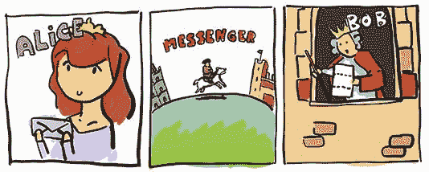

女王爱丽丝需要的是一个模拟将消息直接交给鲍勃勋爵而没有中间人的协议。这在实践中是一个几乎不可能解决的问题，除非我们引入密码学（或者传送）到方程中。这就是我们很久以前通过发明一种新类型的加密算法——称为*对称加密算法*（也称为*密码*）来解决的问题。

顺便说一下，一种加密算法通常被称为*原语*。你可以把原语看作是密码学中最小的、有用的构造，通常与其他原语一起使用以构建协议。这主要是一个术语，没有特别重要的意义，尽管它在文献中经常出现，但了解它是很好的。

让我们看看如何使用加密原语来隐藏女王爱丽丝的消息免受信使的干扰。现在想象一下，这个原语是一个黑匣子（我们看不到里面或者它内部在做什么），提供两个函数：

+   ENCRYPT

+   DECRYPT

第一个函数，ENCRYPT，通过取一个*秘钥*（通常是一个大数）和一个*消息*来工作。然后输出一系列看起来像随机数的数字，一些嘈杂的数据。我们将称这个输出为加密消息。我在图 1.1 中说明了这一点。

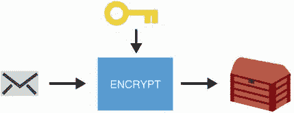

图 1.1 ENCRYPT 函数接受一个消息和一个秘钥，并输出加密消息——一长串看起来像随机噪音的数字。

第二个函数 DECRYPT 是第一个函数的反函数。它使用相同的秘钥和第一个函数的随机输出（加密的消息），然后找到原始消息。我在图 1.2 中进行了说明。

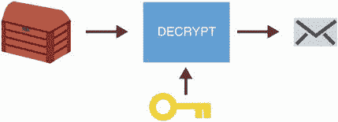

图 1.2 DECRYPT 函数接收一个加密的消息和一个秘钥，并返回原始消息。

要使用这个新的原语，女王艾丽斯和鲍勃勋爵必须首先在现实生活中见面并决定使用什么秘钥。稍后，女王艾丽斯可以使用提供的 ENCRYPT 函数，借助秘钥保护消息。然后，她将加密的消息传递给她的信使，最终将其传递给鲍勃勋爵。然后，鲍勃勋爵使用相同的秘钥对加密的消息使用 DECRYPT 函数来恢复原始消息。图 1.3 显示了这个过程。

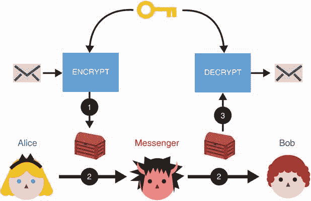

图 1.3（1）艾丽斯使用带有秘钥的 ENCRYPT 函数将她的消息转换为噪音。（2）然后她将加密的消息传递给她的信使，后者不会了解到底层消息的任何信息。（3）一旦鲍勃收到加密的消息，他可以使用与艾丽斯相同的秘钥使用 DECRYPT 函数来恢复原始内容。

在这个交换过程中，信使所拥有的只是看起来随机的东西，它对隐藏消息的内容没有任何有意义的见解。实际上，借助密码学的帮助，我们将我们的不安全协议增强为安全协议。新的协议使女王艾丽斯能够向鲍勃勋爵发送一封机密信件，而没有任何人（除了鲍勃勋爵）了解其内容。

使用秘钥将事物渲染成噪音，使其与随机无法区分的过程，在密码学中是一种常见的安全协议保护方式。随着你在接下来的章节中学习更多密码算法，你会看到更多这样的内容。

顺便说一句，对称加密是密码学算法的一个更大类别的一部分，称为*对称密码学*或*秘密密钥密码学*。这是由于密码原语暴露的不同函数使用相同的密钥。后面你会看到，有时会有不止一个密钥。

## 1.3 克尔克霍夫原则：只有密钥是保密的

设计一个密码算法（就像我们的加密原语）是一件容易的事情，但设计一个*安全*的密码算法并不是胆小之人能够做到的。虽然我们在这本书中避免创建这样的算法，但我们*确实*学会了如何识别优秀的算法。这可能会很困难，因为选择太多，超出了任务所需。在密码学的历史中反复失败的经验教训以及社区从中学到的教训中可以找到一些提示。当我们回顾过去时，我们将领会到什么将密码算法变成一个值得信赖的安全算法。

数百年过去了，许多皇后和领主被埋葬了。从那时起，纸张被放弃作为我们主要的交流方式，转而采用更好更实用的技术。如今，我们可以接触到强大的计算机以及互联网。更实用，当然，但这也意味着我们之前的恶意传送者变得更加强大。他现在无处不在：你所在的星巴克咖啡厅的 Wi-Fi、构成互联网并转发你的消息的不同服务器，甚至在运行我们算法的机器上。我们的敌人现在能够观察到更多的消息，因为你向网站发出的每个请求都可能通过错误的线路，并在几纳秒内被改变或复制，而没有人注意到。

在我们之前，我们可以看到最近的历史中有许多加密算法失效的例子，被秘密国家组织或独立研究人员破解，并未能保护其消息或实现其声明。我们吸取了许多教训，并逐渐了解了如何制造良好的密码学。

注意，密码算法可以通过多种方式被视为*破解*。对于加密算法，你可以想象到多种攻击算法的方法：秘密密钥可以泄露给攻击者，消息可以在没有密钥的情况下解密，仅通过查看加密消息就可以透露一些关于消息的信息，等等。任何会削弱我们对算法做出的假设的事情都可以被视为破解。

密码学经历了漫长的试验和错误过程后，产生了一个强有力的概念：要对密码原语所声称的安全性进行信任，就必须由专家公开分析该原语。否则，你就是在依赖*安全性通过模糊性*，这在历史上并不奏效。这就是为什么*密码学家*（构建者）通常会寻求*密码分析家*（破解者）的帮助来分析一个构造的安全性。（尽管密码学家经常自己也是密码分析家，反之亦然。）

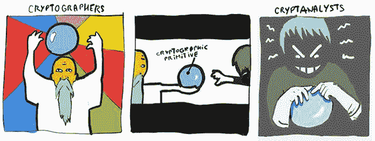

让我们以高级加密标准（AES）加密算法为例。AES 是由美国国家标准与技术研究院（NIST）组织的国际竞赛的产物。

注意，NIST 是一个美国机构，其角色是定义政府相关职能以及其他公共或私营组织使用的标准并制定指南。像 AES 一样，它标准化了许多广泛使用的密码原语。

AES 竞赛持续了数年，期间来自世界各地的许多志愿密码分析师聚集在一起，试图打破各种候选结构。几年后，通过这个过程建立了足够的信心后，一个单一的竞争性加密算法被提名为成为高级加密标准本身。现在，大多数人相信 AES 是一种可靠的加密算法，并且被广泛用于几乎所有的加密。例如，当你浏览网页时，你每天都在使用它。

在公开建立加密标准的想法与一个经常被称为*Kerckhoffs' principle*的概念有关，可以理解为这样一种情况：依赖于我们的敌人不会发现我们使用的算法是愚蠢的，因为他们很可能会发现。相反，让我们对此持开放态度。

如果女王艾丽斯和鲍勃勋爵的敌人确切地知道他们是如何加密消息的，那么他们的加密算法如何安全？答案是*秘钥*！秘钥的保密性使得协议安全，而不是算法本身的保密性。这是本书的一个常见主题：我们将要学习的所有加密算法，以及实际世界中使用的加密算法，大多数情况下是可以自由学习和使用的。只有作为这些算法输入的秘钥是保密的。1644 年，让·罗伯特·迪·卡莱特（Jean Robert du Carlet）说：“*Ars ipsi secreta magistro*”（即使对于大师来说也是秘密的艺术）。在接下来的部分中，我将谈论一种完全不同类型的密码原语。现在，让我们使用图 1.4 来整理我们迄今为止学到的知识。

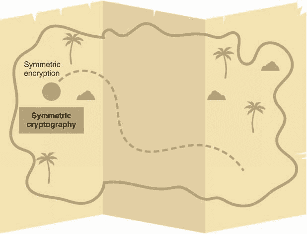

图 1.4 到目前为止你学到的密码算法。AES 是对称加密算法的一个实例，它是更广泛的对称加密算法类别的一部分。

## 1.4 非对称加密：两把钥匙比一把好

在我们关于对称加密的讨论中，我们说女王艾丽斯和鲍勃勋爵首先见面商定一个对称秘钥。这是一个合理的情景，实际上很多协议确实是这样工作的。然而，在有许多参与者的协议中，这很快就变得不太实际：我们需要我们的网络浏览器与谷歌、Facebook、亚马逊以及其他数十亿个网站见面，然后才能安全地连接到它们吗？

这个问题，通常称为*密钥分配*，在很长一段时间内一直很难解决，至少直到 20 世纪 70 年代末另一类大而有用的密码算法被发现，称为*非对称密码学*或*公钥密码学*。非对称密码学通常使用不同的密钥来执行不同的功能（与对称密码学中使用的单个密钥相对），或者为不同的参与者提供不同的观点。为了说明这意味着什么以及公钥密码学如何帮助建立人与人之间的信任，我将在本节中介绍一些非对称原语。请注意，这只是你将在本书中学到的内容的一个概述，因为我将在随后的章节中更详细地讨论这些密码原语中的每一个。

### 1.4.1 密钥交换或如何获得共享秘密

我们将要看的第一个非对称密码学原语是*密钥交换*。首次发现并发布的公钥算法是一种以其作者命名的密钥交换算法，称为 Diffie-Hellman（DH）。DH 密钥交换算法的主要目的是在两个参与方之间建立一个共同的秘密。然后可以将这个共同的秘密用于不同的目的（例如，作为对称加密原语的密钥）。

在第五章中，我将解释 Diffie-Hellman 的工作原理，但在此简介中，让我们使用一个简单的类比来理解密钥交换提供了什么。像密码学中的许多算法一样，密钥交换必须从参与者使用的一组共同参数开始。在我们的类比中，我们简单地让 Alice 女王和 Bob 勋爵同意使用一个正方形（■）。接下来的步骤是让他们选择自己的随机形状。他们俩都去各自的秘密地点，在不被看到的情况下，Alice 女王选择了一个三角形（▲），而 Bob 勋爵选择了一个星形（★）。他们选择的对象必须以任何代价保持秘密！这些对象代表他们的*私钥*（见图 1.5）。

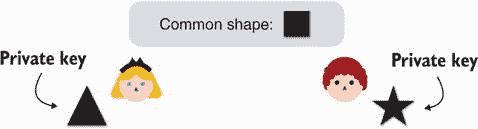

图 1.5 DH（Diffie-Hellman）密钥交换的第一步是让两个参与者生成一个私钥。在我们的类比中，Alice 女王选择一个三角形作为她的私钥，而 Bob 勋爵选择一个星形作为他的私钥。

一旦他们选择了他们的私钥，他们都会单独将他们的秘密形状与他们最初同意使用的共同形状（正方形）相结合。这些组合产生了代表他们的*公钥*的独特形状。Alice 女王和 Bob 勋爵现在可以交换他们的公钥（因此称为*密钥交换*），因为公钥被视为公共信息。我在图 1.6 中说明了这一点。

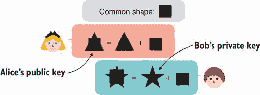

图 1.6 DH 密钥交换的第二步，两个参与者交换他们的公钥。参与者通过将他们的私钥与一个共同形状相结合来导出他们的公钥。

现在我们开始看到为什么这个算法被称为公钥算法。这是因为它需要一个由私钥和公钥组成的 *密钥对*。DH 密钥交换算法的最后一步非常简单：Alice 女王取 Bob 男爵的公钥并与她的私钥结合。Bob 男爵也同样对待 Alice 女王的公钥，并将其与自己的私钥结合。结果现在应该在每一方都是相同的；在我们的示例中，是一个形状结合了星形、正方形和三角形（见图 1.7）。

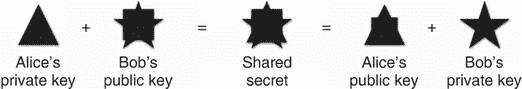

图 1.7 DH 密钥交换的最后一步，两个参与者产生相同的共享密钥。为此，Alice 女王将她的私钥与 Bob 男爵的公钥结合，而 Bob 男爵则将他的私钥与 Alice 女王的公钥结合。仅观察公钥无法获取共享密钥。

现在由协议参与者决定如何使用这个共享密钥。在本书中，你会看到几个示例，但最明显的场景是在需要共享密钥的算法中使用它。例如，Alice 女王和 Bob 男爵现在可以使用共享密钥作为对称加密原语进一步加密消息的密钥。概括一下

1.  Alice 和 Bob 交换他们的公钥，这掩盖了他们各自的私钥。

1.  使用另一方的公钥和各自的私钥，他们可以计算出一个共享密钥。

1.  观察公钥交换的对手没有足够的信息来计算共享密钥。

注意 在我们的示例中，最后一点很容易被绕过。实际上，在没有任何私钥知识的情况下，我们可以将公钥组合在一起生成共享密钥。幸运的是，这只是我们比喻的一个局限性，但它足以帮助我们理解密钥交换的作用。

实际上，DH 密钥交换非常不安全。你能花几秒钟想出为什么吗？

因为 Alice 女王接受她收到的任何公钥都是 Bob 男爵的公钥，所以我可以拦截交换并用我的公钥替换它，这样我就可以冒充 Bob 男爵向 Alice 女王发起攻击（同样也可以对 Bob 男爵进行相同操作）。我们称之为 *中间人* （MITM）攻击者可以成功攻击协议。我们如何解决这个问题？在后面的章节中，我们将看到我们要么需要用另一个加密原语增强此协议，要么需要事先知道 Bob 男爵的公钥是什么。但那样的话，我们不是回到了原点吗？

以前，Alice 女王和 Bob 男爵需要知道一个共享密钥；现在 Alice 女王和 Bob 男爵需要知道各自的公钥。他们如何知道呢？这是不是又是一个鸡生蛋蛋生鸡的问题？嗯，有点像。正如我们将看到的，实际上，公钥密码学并不能解决信任问题，但它简化了其建立（特别是当参与者数量很多时）。

让我们暂停一下，继续下一节，因为你将在第五章了解更多关于密钥交换的知识。我们还有一些非对称加密原语需要揭示（见图 1.8），以完成我们对现实世界密码学的概览。

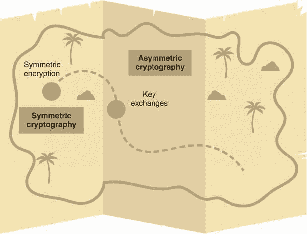

图 1.8 我们到目前为止学到的加密算法。两大类加密算法是对称加密（使用对称加密）和非对称加密（使用密钥交换）。

### 1.4.2 非对称加密，不像对称加密那样

DH 密钥交换算法的发明很快被 RSA 算法的发明紧随其后，该算法以 Ron Rivest、Adi Shamir 和 Leonard Adleman 命名。RSA 包含两种不同的原语：公钥加密算法（或非对称加密）和（数字）签名方案。这两种原语都是更大类别的加密算法称为非对称加密的一部分。在本节中，我们将解释这些原语的作用以及它们如何有用。

第一个，非对称加密，与我们之前讨论的对称加密算法有类似的目的：它允许加密消息以获得机密性。然而，与对称加密不同，对称加密是完全不同的：

+   它使用两个不同的密钥：一个公钥和一个私钥。

+   它提供了一个不对称的观点：任何人都可以使用公钥加密，但只有私钥的所有者可以解密消息。

现在让我们用一个简单的类比来解释如何使用非对称加密。我们再次从我们的朋友女王爱丽丝开始，她持有一个私钥（及其相关的公钥）。让我们把她的公钥想象成一个她向公众发布供任何人使用的开放箱子（见图 1.9）。

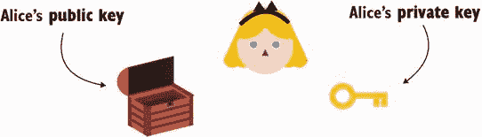

图 1.9 为了使用非对称加密，女王爱丽丝需要先发布她的公钥（这里用一个开放的盒子表示）。现在，任何人都可以使用这个公钥来加密发送消息给她。而且她应该能够使用相关的私钥解密它们。

现在，你、我和每个想要的人都可以使用她的公钥加密一条消息给她。在我们的类比中，想象一下你会把你的消息插入到开放的箱子里，然后关闭它。一旦箱子关闭了，除了女王爱丽丝之外，没有人能够打开它。这个盒子有效地保护了消息的保密性免受观察者的观察。然后，关闭的盒子（或加密内容）可以发送给女王爱丽丝，她可以使用她的私钥（只有她知道的）来解密它们（见图 1.10）。

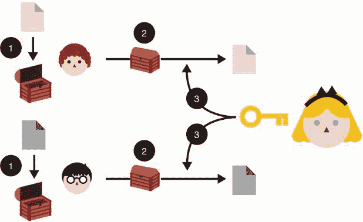

图 1.10 非对称加密：（1）任何人都可以使用艾丽丝女王的公钥将消息加密给她。（2）接收后，（3）她可以使用相关联的私钥解密内容。在消息发送给艾丽丝女王时，没有人能够观察到。

让我们在图 1.11 中总结到目前为止我们学到的加密原语。我们只需要再学习一个就可以完成我们的真实世界加密之旅了！

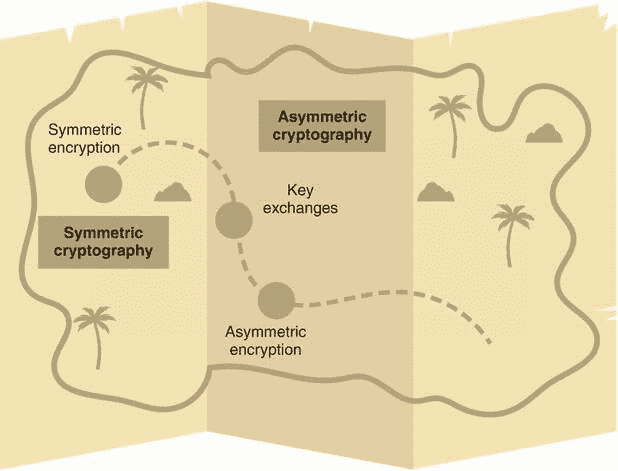

图 1.11 到目前为止我们学到的加密算法：两类大型加密算法是对称加密（使用对称加密）和非对称加密（使用密钥交换和非对称加密）。

### 1.4.3 数字签名，就像你的纸笔签名一样

我们看到 RSA 提供了一种非对称加密算法，但正如我们之前提到的，它也提供了一种*数字签名*算法。这一数字签名的加密原语的发明在建立我们世界的爱丽丝和鲍勃之间的信任方面帮助巨大。它类似于真实的签名；你知道的，比如当你试图租一间公寓时，你被要求在合同上签字的那种。

“如果他们伪造我的签名怎么办？”你可能会问，实际上，真实的签名在现实世界中并不提供太多安全性。另一方面，加密签名可以以同样的方式使用，但提供带有你名字的加密证书。你的加密签名是*无法伪造的*，并且可以很容易地被其他人验证。与你过去在支票上写的古老签名相比，非常有用！

在图 1.12 中，我们可以想象一个协议，艾丽丝女王想向大卫勋爵表明她信任鲍勃勋爵。这是一个典型的多参与者环境下建立信任的例子，以及非对称加密如何帮助。通过签署一份包含“我，艾丽丝女王，信任鲍勃勋爵”的文件，艾丽丝女王可以表明立场并通知大卫勋爵要信任鲍勃勋爵。如果大卫勋爵已经信任艾丽丝女王及其签名算法，那么他可以选择相应地信任鲍勃勋爵。

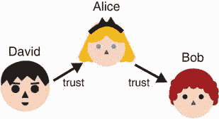

图 1.12 大卫勋爵已经信任艾丽丝女王。因为艾丽丝女王信任鲍勃勋爵，所以大卫勋爵能够安全地信任鲍勃勋爵吗？

更详细地说，艾丽丝女王可以使用 RSA 签名方案和她的私钥签署消息“我，艾丽丝女王，信任鲍勃勋爵”。这将生成一个看起来像随机噪音的签名（见图 1.13）。

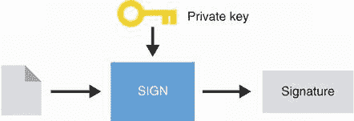

图 1.13 要签署一条消息，艾丽丝女王使用她的私钥并生成一个签名。

任何人都可以通过组合*验证签名*：

+   艾丽丝的公钥

+   签名的消息

+   签名

结果要么是*true*（签名有效），要么是*false*（签名无效），如图 1.14 所示。

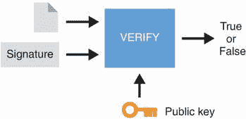

图 1.14 要验证来自阿丽斯女王的签名，还需要被签名的消息和阿丽斯女王的公钥。结果要么验证签名，要么无效化签名。

我们现在学到了三种不同的非对称基元：

+   与迪菲-赫尔曼（Diffie-Hellman）进行密钥交换

+   非对称加密

+   使用 RSA 进行数字签名

这三种密码算法是非对称加密中最知名和常用的基元。它们如何帮助解决现实问题可能并不完全明显，但请放心，它们每天都被许多应用程序用来保护周围的事物。现在是时候用我们迄今学到的所有密码算法来完整地描绘我们的图景了（见图 1.15）。

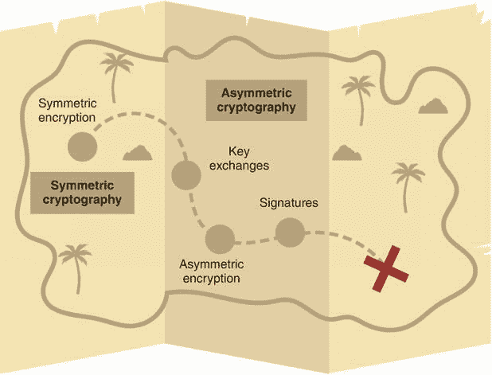

图 1.15 我们迄今学到的对称和非对称算法

## 1.5 对加密进行分类和抽象

在前一节中，我们调查了两类大型算法：

+   *对称加密（或秘密密钥加密）*—使用单个秘密。如果有多个参与者知道秘密，则称为*共享*秘密。

+   *非对称加密（或公钥加密）*—参与者对于密钥有不对称的视角。例如，有些人会知道公钥，而有些人会同时知道公钥和私钥。

对称和非对称加密不是加密中唯一的两类基元，而且很难对不同的子领域进行分类。但是，正如你将意识到的那样，我们书中的很大一部分内容都是关于（并且利用了）对称和非对称基元。这是因为当今加密中有用的很大一部分内容都包含在这些子领域中。另一种划分加密的方式可能是

+   *基于数学的构建*—这些依赖于数学问题，如分解数字。（RSA 算法用于数字签名和非对称加密就是这种构建的一个例子。）

+   *启发式构建*—这些依赖于密码分析人员的观察和统计分析。（对称加密的 AES 就是这种构建的一个例子。）

这种分类还涉及速度因素，因为基于数学的构建通常比基于启发式的构建慢得多。给你一个概念，对称构建通常基于启发式（看起来有效的东西），而大多数非对称构建基于数学问题（被认为是困难的问题）。

对我们来说，严格分类密码学所能提供的一切是很困难的。事实上，关于这个主题的每本书或课程都给出了不同的定义和分类。最终，这些区别对我们来说并不太有用，因为我们将看到大多数密码原语都是具有独特 *安全声明* 的独特工具。我们反过来可以使用这些工具中的许多作为构建协议的基础模块。因此，了解这些工具的每一个是如何工作的，以及它们提供了哪些安全声明，以便理解它们如何保护我们周围的协议，是非常重要的。因此，这本书的第一部分将介绍最有用的密码原语及其安全属性。

书中的很多概念第一次接触时可能会相当复杂。但像一切事物一样，我们越是阅读它们，越是在上下文中看到它们，它们就越自然，我们就能越抽象它们。这本书的作用是帮助你创建抽象，让你建立这些构造所做的事情的心理模型，并理解它们如何组合在一起产生安全协议。我经常会谈论构造的接口，并给出使用和组合的现实示例。

以前，密码学的定义很简单：女王爱丽丝和博伯爵想要交换秘密信息。现在不再是这样了。如今的密码学描述相当复杂，是围绕着发现、突破和实际需求有机发展起来的。归根结底，密码学是帮助增强协议以使其在对抗环境中运行的东西。

要准确理解密码学如何帮助，对我们而言最重要的是这些协议旨在实现的一系列目标。那才是有用的部分。本书中我们将了解的大多数密码原语和协议提供以下一种或两种属性：

+   *保密性* —— 它关乎掩盖和保护一些信息免受错误眼睛的侵害。例如，加密掩盖了传输中的消息。

+   *认证* —— 它关乎我们正在与谁交谈。例如，这有助于确保我们收到的消息确实来自女王爱丽丝。

当然，这仍然是密码学可以提供的内容的一个重要简化。在大多数情况下，细节都在原语的安全声明中。根据我们在协议中如何使用密码原语，它将实现不同的安全属性。

在本书中，我们将学习新的加密原语以及它们如何结合起来以暴露诸如保密性和认证等安全属性。目前，我们要欣赏的是，密码学是关于在对抗性环境中为协议提供保险的。虽然“对手”并没有明确定义，但我们可以想象他们是试图破坏我们协议的人：参与者、观察者、中间人。他们反映了真实生活中对手可能的情况。因为最终，密码学是一个实践领域，旨在防御血肉和骨头以及位的不良行为者。

## 1.6 理论密码学与现实世界密码学

1993 年，布鲁斯·施奈尔（Bruce Schneier）发布了《*应用密码学*》（Wiley），这是一本针对希望构建涉及密码学应用的开发人员和工程师的书籍。大约在 2012 年，肯尼·帕特森（Kenny Paterson）和奈杰尔·斯马特（Nigel Smart）开始了一年一度的名为真实世界密码（Real World Crypto）的会议，针对的是同一群人。但是应用密码学和现实世界密码学是指什么？是否有多种类型的密码学？

要回答这些问题，我们必须从定义*理论密码学*开始，这是密码学家和密码分析家从事的密码学。这些密码学人大多来自学术界，在大学工作，但有时来自行业或政府的特定部门。他们研究密码学的一切。结果通过国际期刊和会议的出版物和演示分享。然而，他们所做的并不是显然有用或实用的。通常情况下，没有“概念证明”或代码被发布。无论如何，这是毫无意义的，因为没有计算机足够强大来运行他们的研究。话虽如此，理论密码学有时变得如此有用和实用，以至于它会进入另一边。

另一方面是*应用密码学*或*现实世界密码学*的世界。它是你周围所有应用程序中发现的安全的基础。虽然它通常看起来好像不存在，几乎是透明的，但当你在互联网上登录银行账户时它就在那里；当你给朋友发消息时它与你同在；当你丢失手机时它帮助保护你。它是无处不在的，因为不幸的是，攻击者无处不在，并积极尝试观察和伤害我们的系统。从业者通常来自行业，但有时会与学术界合作评估算法并设计协议。结果通常通过会议、博客文章和开源软件分享。

现实世界的密码学通常非常关注现实世界的考虑因素：算法提供的确切安全级别是多少？运行算法需要多长时间？原语需要的输入和输出大小是多少？现实世界的密码学就是这本书的主题。虽然理论密码学是其他书的主题，但我们仍将在本书的最后几章中窥探一下那里正在酝酿的东西。准备好被惊讶吧，因为你可能会一瞥到明天的现实世界的密码学。

现在你可能想知道：开发人员和工程师如何选择用于他们的现实世界应用的密码学？

## 1.7 从理论到实践：选择你自己的冒险

*位于顶部的是提出并解决难题的密码分析师[...] 而在底部的是希望加密一些数据的软件工程师*。

—Thai Duong（“那么你想自己设计密码学？”，2020）

在我花费在研究和从事密码学的所有年份中，我从未注意到一个密码学原语在实际应用中被使用的单一模式。情况相当混乱。在一个理论原语被采用之前，有一长串人要处理这个原语，并将其塑造成某种可消费的东西，有时对大众更安全。我该如何向你解释呢？

你听说过*选择你自己的冒险*吗？这是一个旧书系列，你可以选择如何沿着故事前进。原则很简单：你读完书的第一部分；在部分结束时，书让你通过给出不同的选项来决定未来的道路。每个选项都与一个不同的部分号码相关，如果你愿意，可以直接跳转到该部分。所以，在这里我也做了同样的事情！从阅读下一段开始，按照它给出的方向前进。

* * *

*一切始于此。* 你是谁？你是爱丽丝，一位密码学家吗？你是大卫，私营行业工作者，需要解决问题吗？还是你是伊娃，工作在政府部门，忙于密码学？

+   你是爱丽丝，前往步骤 1。

+   你是大卫，前往步骤 2。

+   你是伊娃，前往步骤 3。

*步骤 1：研究员得研究。* 你是一名在大学工作的研究人员，或者在私营公司或非营利组织的研究团队工作，或者在像 NIST 或 NSA 这样的政府研究机构工作。因此，你的资金可能来自不同的地方，并可能激励你研究不同的东西。

+   你发明了一个新的原语，前往步骤 4。

+   你发明了一种新的结构，前往步骤 5。

+   你开始了一场公开竞赛，前往步骤 6。

*第 2 步：行业有需求。* 作为你的工作的一部分，出现了一些问题，你需要一个新的标准。例如，Wi-Fi 联盟是由感兴趣的公司资助的非营利组织，制定了围绕 Wi-Fi 协议的一套标准。另一个例子是银行联合起来制定了支付卡行业数据安全标准（PCI-DSS），该标准强制执行处理信用卡号码时要使用的算法和协议。

+   你决定资助一些急需的研究，前往第 1 步。

+   你决定标准化一个新的基元或协议，前往第 5 步。

+   你发起了一场公开竞赛，前往第 6 步。

*第 3 步：政府有需求。* 你为你国家的政府工作，需要推出一些新的加密。例如，NIST 负责发布*联邦信息处理标准*（FIPS），规定了哪些加密算法可以被与美国政府打交道的公司使用。虽然许多这些标准都是成功案例，人们倾向于对政府机构推动的标准有很多信任，但（不幸的是）对于失败还有很多话要说。

在 2013 年，根据爱德华·斯诺登的披露，发现 NSA 故意并成功地推动在标准中包含后门算法（参见 Bernstein 等人的“Dual EC: A Standardized Back Door”），其中包括一个隐藏的开关，允许 NSA，仅限 NSA，预测你的秘密。这些*后门*可以被视为魔法密码，允许政府（仅限政府，据说）颠覆你的加密。在此之后，密码学界对来自政府机构的标准和建议失去了很多信心。最近，在 2019 年，发现俄罗斯标准 GOST 也遭受了同样的对待。

*密码学家长期以来一直怀疑，该机构在 2006 年被国家标准技术研究所采纳并后来被国际标准化组织采纳的标准中植入了漏洞，该组织有 163 个成员国。机密的 N.S.A.备忘录似乎证实了这个致命弱点，由 2007 年两名微软密码学家发现，由该机构设计。N.S.A.编写了这一标准，并积极推动国际组织，私下称这一努力为“一项精湛的挑战”。*。

—*纽约时报*（“N.S.A. Able to Foil Basic Safeguards of Privacy on Web,” 2013）

+   你资助了一些研究，前往第 1 步。

+   你组织了一场公开竞赛，前往第 6 步。

+   你推动正在使用的基元或协议的标准化，前往第 7 步。

*第 4 步：提出一个新概念。* 作为研究人员，你成功做到了不可能的事情；你发明了一个新概念。当然，有人已经想到了加密，但在密码学领域每年仍然会提出一些新的原语。其中一些将被证明无法实现，而一些将最终得以解决。也许你的提议中有一个实际的构造，或者也许你得等待看看是否有人能想出有效的方法。

+   你的原始构造被实施，前往第 5 步。

+   你的原始构造最终无法实施，回到起点。

*第 5 步：提出新的构造或协议。* 一个密码学家或密码学家团队提出了一个实现概念的新算法。例如，AES 是加密方案的一种实例化。（AES 最初由文森特·瑞曼和约安·达门提出，他们将他们的构造命名为他们的名字的缩写，Rijndael。）接下来呢？

+   有人在你的构造基础上进行改进，前往第 5 步。

+   你参加了一个公开竞赛并赢得了胜利！前往第 6 步。

+   对你的工作有很多炒作；你将获得一个标准！前往第 7 步。

+   你决定对你的构造进行专利申请，前往第 8 步。

+   你或其他人决定实现你的构造会很有趣。前往第 9 步。

*第 6 步：一个算法赢得了比赛。* 密码学家们最喜欢的过程是一个公开的竞赛！例如，AES 就是一个邀请全球研究者参与的竞赛。经过数十次提交和分析以及密码分析师的帮助（可能需要数年），候选名单被缩减到几个（在 AES 的情况下，只有一个），然后开始标准化过程。

+   你很幸运，在多年的竞争后，你的构造赢得了胜利！前往第 7 步。

+   不幸的是，你失败了。回到起点。

*第 7 步：一个算法或协议被标准化。* 标准通常由政府或标准化机构发布。目的是确保每个人都在同一页面上，以最大限度地提高互操作性。例如，NIST 定期发布密码学标准。密码学中的一个知名标准化机构是互联网工程任务组（IETF），它是互联网上许多标准（如 TCP、UDP、TLS 等）的背后推动者，在本书中你会经常听到。在 IETF 中，标准称为 *请求评论*（RFC），几乎任何想要制定标准的人都可以编写。

*为了加强我们不投票的观念，我们还采用了“哼声”的传统：例如，当我们面对面开会时，工作组主席想要了解“房间的感觉”时，主席有时会要求每一方对特定问题哼唱，“支持”还是“反对”。*

—RFC 7282（《关于 IETF 中的共识和哼声》，2014）

有时，一家公司直接发布一个标准。例如，RSA 安全有限责任公司（由 RSA 算法的创建者资助）发布了一系列 15 个名为 *公钥密码学标准*（PKCS）的文档，以合法化该公司当时使用的算法和技术。如今，这种情况非常罕见，许多公司通过 IETF 来标准化他们的协议或算法，而不是通过自定义文档。

+   你的算法或协议得到了实现，前往步骤 9。

+   没有人关心你的标准，回到起点。

*步骤 8：专利到期。* 在密码学中，专利通常意味着没有人会使用该算法。一旦专利过期，重新对原语产生兴趣并不罕见。最著名的例子可能是 Schnorr 签名，它曾是最受欢迎的签名方案之一，直到 Schnorr 本人在 1989 年对算法进行了专利。这导致 NIST 标准化了一个较差的算法，称为数字签名算法（DSA），它成为了当时的首选签名方案，但现在已经不太使用。Schnorr 签名的专利在 2008 年到期，自那时起该算法开始重新受到关注。

+   时间过去太久了，你的算法将永远被遗忘。回到起点。

+   你的构建启发了更多的构建被发明在其之上，前往步骤 5。

+   现在人们想要使用你的构建，但在真正标准化之前不会这样。前往步骤 7。

+   一些开发人员正在实现你的算法！前往步骤 9。

*步骤 9：构建或协议被实现。* 实现者不仅要解读论文或标准（尽管标准 *应该* 面向实现者），而且还必须使他们的实现易于使用和安全。这并不总是一件简单的任务，因为在使用密码学的方式上可能会出现许多灾难性的错误。

+   有人决定是时候为这些实现提供一个标准支持了。没有标准支持是令人尴尬的。前往步骤 7。

+   炒作正落在你的加密库头上！前往步骤 10。

*步骤 10：开发人员在应用程序中使用协议或原语。* 开发人员有一个需求，而你的加密库似乎解决了这个需求 —— 轻而易举！

+   原语解决了需求，但它没有一个标准。不太好。前往步骤 7。

+   我希望这是用我的编程语言编写的。前往步骤 9。

+   我滥用了库或者构建已经损坏。游戏结束。

* * *

你成功了！原语实现到真实世界有很多方式。最好的方式涉及多年的分析，一个友好的实现标准和优秀的库。更糟糕的方式涉及一个糟糕的算法和糟糕的实现。在图 1.16 中，我说明了首选路径。

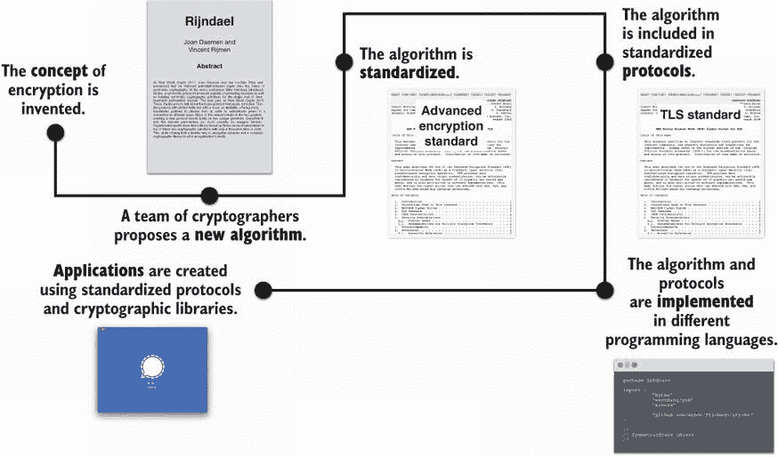

图 1.16 理想的加密算法生命周期始于密码专家在白皮书中实例化一个概念。例如，AES 是对称加密概念的一个实例化（还有许多其他对称加密算法）。然后可以对构造进行标准化：每个人都同意以某种方式实现它以最大程度地实现互操作性。然后通过在不同语言中实现标准来创建支持。

## 1.8 一个警告

*任何人，从最无知的业余爱好者到最优秀的密码学家，都可以创建一个他自己无法破解的算法*。

—布鲁斯·施奈尔（“给业余密码设计者的备忘录”，1998 年）

我必须警告您，密码学的艺术很难掌握。一旦您完成了这本书，就假设您可以构建复杂的密码协议是不明智的。这段旅程应该启发您，向您展示可能性，并向您展示事物是如何运作的，但它不会使您成为密码学大师。

本书并非圣杯。事实上，本书的最后几页将带你走过最重要的一课——不要独自踏上真正的冒险。龙可以杀人，你需要一些支持来陪伴你以便击败它们。换句话说，密码学很复杂，而仅凭本书无法让您滥用所学知识。要构建复杂的系统，需要研究自己的行业多年的专家。相反，您将学到的是如何识别何时应使用密码学，或者，如果有什么不对劲，可以使用什么密码原语和协议来解决您面临的问题，以及所有这些密码算法在表面下是如何工作的。既然您已经被警告，请转到下一章。

## 摘要

+   协议是一个逐步指南，在其中多个参与者尝试实现类似交换保密消息之类的目标。

+   密码学是关于增强协议以在对抗性环境中保护它们。它通常需要秘密。

+   密码原语是一种密码算法类型。例如，对称加密是一种密码原语，而 AES 是一种特定的对称加密算法。

+   对不同的密码原语进行分类的一种方法是将它们分为两种类型：对称和非对称密码学。对称密码学使用单一密钥（正如您在对称加密中所看到的），而非对称密码学则使用不同的密钥（正如您在密钥交换、非对称加密和数字签名中所看到的）。

+   密码学属性难以分类，但它们通常旨在提供以下两种属性之一：身份验证或保密性。身份验证涉及验证某物或某人的真实性，而保密性涉及数据或身份的隐私。

+   现实世界的密码学很重要，因为它在技术应用中无处不在，而理论密码学在实践中通常不那么有用。

+   本书中包含的大多数密码学基元是经过长时间的标准化过程达成一致的。

+   密码学很复杂，在实施或使用密码学基元时存在许多危险。
