# 第二章：哈希函数

本章内容包括

+   哈希函数及其安全属性

+   当今广泛采用的哈希函数

+   存在的其他类型的哈希函数

将全局唯一标识符分配给任何东西，这就是您将在本章中学到的第一个密码构造的承诺——*哈希函数*。哈希函数在密码学中随处可见——随处可见！非正式地说，它们以您希望的任何数据作为输入，并返回一个唯一的字节串。给定相同的输入，哈希函数始终会产生相同的字节串。这可能看起来像无足轻重的事情，但这个简单的构造在构建密码学中的许多其他构造时非常有用。在本章中，您将学到有关哈希函数的一切以及它们为什么如此多才多艺。

## 2.1 什么是哈希函数？

在你面前，一个下载按钮占据了页面的很大一部分。您可以读到字母*DOWNLOAD*，点击这个似乎会将您重定向到包含文件的不同网站。下面是一长串难以理解的字母：

```go
f63e68ac0bf052ae923c03f5b12aedc6cca49874c1c9b0ccf3f39b662d1f487b
```

紧接着是一个看起来像是某种首字母缩写的东西：`sha256sum`。听起来耳熟吗？你可能在以前的生活中下载过一些伴随着这样奇怪字符串的东西（见图 2.1）。

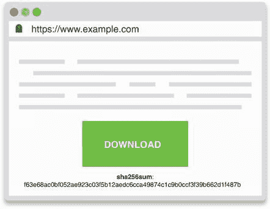

图 2.1 一个链接到包含文件的外部网站的网页。外部网站无法修改文件的内容，因为第一页提供了文件的哈希或摘要，这确保了下载的文件的完整性。

如果您曾经想知道那串长字符串要做什么：

1.  点击按钮下载文件

1.  使用 SHA-256 算法对下载的文件进行*哈希*处理

1.  将输出（摘要）与网页上显示的长字符串进行比较

这使您能够验证您下载了正确的文件。

注 哈希函数的输出通常称为*摘要*或*HASH*。我在本书中交替使用这两个词。其他人可能称其为*校验和*或*和*，但我避免使用这些术语，因为这些术语主要用于非密码哈希函数，可能会导致更多的混淆。当不同的代码库或文档使用不同的术语时，请记住这一点。

要尝试对某些东西进行哈希处理，您可以使用流行的 OpenSSL 库。它提供了一个多功能的命令行界面（CLI），在包括 macOS 在内的许多系统中默认提供。例如，可以通过打开终端并输入以下命令来完成这项工作：

```go
$ openssl dgst -sha256 downloaded_file
f63e68ac0bf052ae923c03f5b12aedc6cca49874c1c9b0ccf3f39b662d1f487b
```

通过该命令，我们使用了 SHA-256 哈希函数将输入（下载的文件）转换为一个唯一标识符（命令所回显的值）。这些额外的步骤提供了什么？它们提供了*完整性和真实性*。它告诉你，你下载的确实是你打算下载的文件。

所有这些都是由哈希函数的一个安全属性实现的，称为*第二原像抗性*。这个数学启发的术语意味着从哈希函数的长输出中，`f63e...`，你不能找到另一个会散列到相同输出`f63e....`的文件。在实践中，这意味着这个摘要与您正在下载的文件紧密相关，并且没有攻击者应该能够通过给您不同的文件来愚弄您。

十六进制表示

顺便说一句，长输出字符串`f63e...`表示十六进制中显示的二进制数据（一种基于 16 的编码，使用数字 0 到 9 和字母 a 到 f 来表示几位数据）。我们可以用 0 和 1（基数 2）来显示二进制数据，但这将占用更多的空间。相反，十六进制编码允许我们为每 8 位（1 字节）遇到的数据写 2 个字母数字字符。它对人类来说有点可读，并且占用更少的空间。有其他方式来为人类消费编码二进制数据，但最广泛使用的两种编码是十六进制和 base64。基数越大，显示二进制字符串所需的空间就越少，但在某些时候，我们会用完人类可读的字符。

请注意，这个长摘要由网页的所有者（们）控制，任何可以修改网页的人都可以轻松地替换它。（如果你还不相信，请花点时间考虑一下。）这意味着我们需要信任给我们摘要的页面，它的所有者以及用于检索页面的机制（尽管我们不需要信任给我们下载文件的页面）。在这个意义上，*哈希函数本身并不提供完整性*。下载文件的完整性和真实性来自于与给出摘要的受信任机制的摘要结合起来（在本例中是 HTTPS）。我们将在第九章讨论 HTTPS，但现在，想象它神奇地允许你与网站安全通信。

回到我们的哈希函数，它可以被可视化为图 2.2 中的黑匣子。我们的黑匣子接受单个输入并产生单个输出。

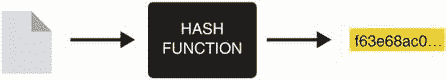

图 2.2 哈希函数接受任意长度的输入（文件、消息、视频等）并产生固定长度的输出（例如，SHA-256 的 256 位）。对相同输入进行哈希处理会产生相同的摘要或哈希。

这个函数的*输入*可以是任意大小。它甚至可以是空的。*输出*始终具有相同的长度和*确定性*：如果给定相同的输入，它总是产生相同的结果。在我们的例子中，SHA-256 始终提供 256 位（32 字节）的输出，始终以十六进制的 64 个字母数字字符编码。哈希函数的一个主要特性是不能逆转算法，这意味着不能仅凭输出就找到输入。我们说哈希函数是*单向*的。

为了说明哈希函数在实践中是如何工作的，我们将使用相同的 OpenSSL CLI 对不同的输入使用 SHA-256 哈希函数进行哈希。以下终端会话显示了这一点。

```go
$ echo -n "hello" | openssl dgst -sha256     
2cf24dba5fb0a30e26e83b2ac5b9e29e1b161e5c1fa7425e73043362938b9824    
$ echo -n "hello" | openssl dgst -sha256                                   // ❶
2cf24dba5fb0a30e26e83b2ac5b9e29e1b161e5c1fa7425e73043362938b9824
$ echo -n "hella" | openssl dgst -sha256                                   // ❷
70de66401b1399d79b843521ee726dcec1e9a8cb5708ec1520f1f3bb4b1dd984
$ echo -n "this is a very very very very very very                         // ❸
  ➥ very very very long sentence" | openssl dgst -sha256                  // ❸
1166e94d8c45fd8b269ae9451c51547dddec4fc09a91f15a9e27b14afee30006
```

❶ 对相同输入进行哈希会产生相同的结果。

❷ 输入中的微小变化会完全改变输出。

❸ 输出始终相同大小，无论输入大小如何。

在下一节中，我们将看到哈希函数的确切安全性质是什么。

## 2.2 哈希函数的安全性质

应用密码学中的哈希函数是常见的构造，通常被定义为提供三种特定安全性质。随着我们将在接下来的部分中看到的，这个定义随着时间的推移而改变。但是现在，让我们定义构成哈希函数的三个强基础。这很重要，因为您需要了解哈希函数可以在哪里有用，以及它们不起作用的地方。

第一个是*原像抗性*。这个属性确保没有人应该能够反转哈希函数以恢复给定输出的输入。在图 2.3 中，我们通过想象我们的哈希函数就像一个搅拌机，使得从制作的冰沙中恢复原料变得不可能。

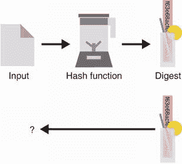

图 2.3 给定哈希函数产生的摘要（这里表示为搅拌机），逆转它并找到使用的原始输入是不可能的（或者在技术上如此困难，我们假设永远不会发生）。这种安全性质被称为*原像抗性*。

警告 如果您的输入很小，这是真的吗？假设它是*oui*或*non*，那么有人很容易对所有可能的 3 个字母单词进行哈希，找出输入是什么。如果您的输入空间很小呢？意味着您总是对句子的变体进行哈希，例如，“我将在星期一凌晨 3 点回家。”在这种情况下，一个人可以预测这一点，但不知道确切的星期几或小时，仍然可以对所有可能的句子进行哈希，直到产生正确的输出。因此，这个第一个原像安全性质有一个明显的警告：*您无法隐藏太小或可预测的东西*。

第二个属性是*第二原像抗性*。当我们想要保护文件的完整性时，我们已经看到了这个安全性质。该属性表明：如果我给你一个输入和它哈希到的摘要，你不应该能够找到一个不同的输入，其哈希到相同的摘要。图 2.4 说明了这个原则。

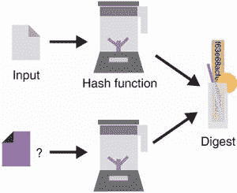

图 2.4 考虑一个输入及其相关的摘要，一个人永远不应该能够找到一个不同的输入，其哈希值相同。这种安全性质被称为*第二原像抗性*。

请注意*我们无法控制第一个输入*。这种强调对于理解哈希函数的下一个安全性质非常重要。

最后，第三个属性是*碰撞抗性*。它保证没有人能够产生两个不同的输入，其哈希为相同的输出（如图 2.5 所示）。在这里，攻击者可以选择两个输入，不像前一个属性固定了其中一个输入。

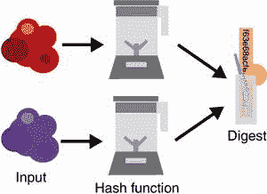

图 2.5 永远不应该找到两个输入（在左侧表示为两个随机数据块）哈希为相同的输出值（在右侧）。这种安全属性称为*碰撞抗性*。

人们经常混淆碰撞抗性和第二原像抗性。花点时间理解它们的区别。

随机预言机

另外，哈希函数通常设计成它们的摘要是*不可预测和随机*的。这是有用的，因为人们并不总是能够证明一个协议是安全的，多亏了我们讨论过的哈希函数的安全属性之一（比如碰撞抗性，例如）。许多协议实际上是在*随机预言机模型*中被证明的，在这种协议中，一个名为随机预言机的虚构和理想的参与者被使用。在这种类型的协议中，可以将任何输入作为请求发送给该随机预言机，据说它以完全随机的输出作为响应返回，并且像哈希函数一样，给它相同的输入两次会返回相同的输出两次。

在这个模型中的证明有时是有争议的，因为我们不确定我们是否可以用真实的哈希函数（在实践中）替换这些随机预言机。然而，许多合法的协议是通过这种方法被证明是安全的，其中哈希函数被视为比它们实际上更理想的东西。

## 2.3 哈希函数的安全考虑

到目前为止，我们看到了哈希函数的三个安全属性：

+   原像抗性

+   第二原像抗性

+   碰撞抗性

这些安全属性通常单独来看毫无意义；一切都取决于你如何使用哈希函数。尽管如此，重要的是在我们看一些现实世界的哈希函数之前，我们要理解这里的一些限制。

首先，这些安全属性假定你（合理地）使用哈希函数。想象一下，我要么对单词*yes*进行哈希，要么对单词*no*进行哈希，然后我发布摘要。如果你对我在做什么有一些想法，你可以简单地对这两个词进行哈希，并将结果与我给你的结果进行比较。因为没有涉及到任何秘密，而且我们使用的哈希算法是公开的，所以你可以这样做。事实上，你可能会认为这会破坏哈希函数的前像抗性，但我会认为你的输入不够“随机”。此外，由于哈希函数接受任意长度的输入并始终产生相同长度的输出，也有无限数量的输入哈希到相同的输出。同样，你可能会说，“嗯，这不是在破坏第二前像抗性吗？”第二前像抗性仅仅是说找到另一个输入是极其困难的，困难到我们认为在实践中是不可能的，但在理论上是可能的。

其次，摘要的大小*确实*很重要。这并不是哈希函数的奇特之处。在实践中，所有的加密算法都必须关心它们参数的大小。让我们想象一下以下极端情况。我们有一个哈希函数，它以均匀随机的方式生成长度为 2 位的输出（意味着它将`00`作为输出的概率为 25%，`01`为 25%，以此类推）。你不需要做太多工作就能产生碰撞：在对几个随机输入字符串进行哈希之后，你应该能够找到两个哈希到相同输出的字符串。因此，哈希函数在实践中*必须*产生的*最小输出大小*是 256 位（或 32 字节）。有了这么大的输出，除非计算方面发生突破，否则碰撞应该是不可能的。

这个数字是怎么得到的呢？在实际的密码学中，算法的目标是提供至少 128 位的安全性。这意味着一个想要攻破算法（提供 128 位安全性）的攻击者必须执行大约 2128 次操作（例如，尝试所有长度为 128 位的可能输入字符串将需要 2128 次操作）。为了让哈希函数提供前面提到的所有三个安全属性，它需要提供至少 128 位的安全性来抵御所有三种攻击。通常，最简单的攻击是由于*生日悖论*导致的碰撞查找。

生日悖论

生日悖论根源于概率论，其中生日问题揭示了一些不直观的结果。在一个房间里，至少需要多少人才能有至少 50%的机会两人拥有相同的生日（即发生碰撞）。事实证明，随机选择的 23 人就足够达到这个概率！很奇怪，对吧？

这被称为 *生日悖论*。实际上，当我们从 2^N 个可能性中随机生成字符串时，你可以期望有 50% 的概率在生成约 2^(N/2) 个字符串后发现冲突。

如果我们的哈希函数生成了 256 位的随机输出，所有输出的空间大小为 2²⁵⁶。这意味着在生成了 2¹²⁸ 个摘要之后，可以以较高的概率找到冲突（由于生日悖论）。这是我们的目标数字，这也是哈希函数最少必须提供 256 位输出的原因。

有时某些约束会迫使开发人员通过 *截断*（移除其中的一些字节）来减小摘要的大小。理论上，这是可能的，但会大大降低安全性。为了至少实现 128 位安全性，摘要不得被截断为：

+   256 位用于防冲突

+   128 位用于前像和第二前像防护

这意味着根据依赖的属性，哈希函数的输出可以被截断以获得更短的摘要。

## 2.4 实践中的哈希函数

正如我们之前所说的，在实践中，哈希函数很少单独使用。它们通常与其他元素结合在一起，以创建密码原语或密码协议。在本书中，我们将看到许多使用哈希函数构建更复杂对象的例子，但本节描述了在现实世界中哈希函数的几种不同用法。

### 2.4.1 承诺

想象一下，你知道市场上的一只股票将会增值并在未来一个月达到 50 美元，但由于某种法律原因，你真的不能告诉你的朋友（也许是出于某种法律原因）。尽管如此，你仍然希望能够事后告诉你的朋友你知道这件事，因为你自以为是（不要否认）。你可以做的是承诺一句话，如“股票 *X* 下个月将达到 50 美元。” 为此，将该句话哈希，并将输出给你的朋友。一个月后，揭示这句话。你的朋友将能够哈希这句话以观察到确实产生了相同的输出。

这就是我们所说的 *承诺方案*。密码学中的承诺通常试图实现两个属性：

+   *隐藏* —— 一个承诺必须隐藏底层值。

+   *绑定* —— 一个承诺必须隐藏一个单一值。换句话说，如果你承诺一个值 *x*，你不应该能够后来成功地透露一个不同的值 *y*。

练习

如果将哈希函数用作承诺方案，你能否判断它是否提供了隐藏和绑定？

### 2.4.2 子资源完整性

有时（经常）网页会导入外部 JavaScript 文件。例如，很多网站使用内容传送网络（CDN）在其页面中导入 JavaScript 库或与 web 框架相关的文件。这些 CDN 被放置在战略位置，以便快速向访问者传递这些文件。然而，如果 CDN 走向歧途并决定提供恶意的 JavaScript 文件，这可能是一个真正的问题。为了应对这种情况，网页可以使用一个名为*子资源完整性*的功能，允许在导入标签中包含摘要：

```go
<script src="https://code.jquery.com/jquery-2.1.4.min.js"
   integrity="sha256-8WqyJLuWKRBVhxXIL1jBDD7SDxU936oZkCnxQbWwJVw="></script>
```

这恰好是我们在本章开头讨论过的情景。一旦检索到 JavaScript 文件，浏览器对其进行哈希处理（使用 SHA-256），并验证其是否与页面中硬编码的摘要相对应。如果验证通过，JavaScript 文件将被执行，因为其完整性已经得到验证。

### 2.4.3 BitTorrent

世界各地的用户（称为*对等体*）使用 BitTorrent 协议直接在彼此之间共享文件（我们也称之为*点对点*）。为了分发一个文件，它被切成块，每个块都被单独散列。然后这些哈希值作为信任源被共享以代表要下载的文件。

BitTorrent 有几种机制允许对等体从不同的对等体获取文件的不同块。最后，通过对下载的每个块进行哈希处理并将输出与各自已知的摘要（在重新组装文件之前）匹配来验证整个文件的完整性。例如，以下“磁铁链接”代表 Ubuntu 操作系统，v19.04。它是通过对文件的元数据以及所有块的摘要进行哈希处理而获得的摘要（以十六进制表示）。

```go
magnet:?xt=urn:btih:b7b0fbab74a85d4ac170662c645982a862826455
```

### 2.4.4 Tor

Tor 浏览器的目标是让个人能够匿名浏览互联网。另一个特性是，可以创建隐藏的网页，其物理位置难以追踪。与这些页面的连接通过使用网页的公钥进行保护的协议来保护。（我们将在第九章讨论会话加密时详细了解其工作原理。）例如，Silk Road 曾是毒品的 eBay，直到被 FBI 查封，可以通过 Tor 浏览器中的`silkroad6ownowfk` `.onion`访问。这个 base32 字符串实际上代表了 Silk Road 的公钥的哈希值。因此，通过知道洋葱地址，你可以验证你正在访问的隐藏网页的公钥，并确保你正在与正确的页面交流（而不是冒充者）。如果这不清楚，不用担心，我会在第九章再次提到这一点。

练习

顺便说一句，这个字符串不可能代表 256 位（32 字节），对吗？那么根据你在第 2.3 节学到的内容，这样是安全的吗？另外，你能猜到 Dread Pirate Roberts（Silk Road 的网站管理员的化名）是如何获得一个包含网站名称的哈希值的吗？

在本节的所有示例中，哈希函数提供了*内容完整性*或*真实性*，用于以下情况：

+   有人可能会篡改被哈希的内容。

+   哈希已经安全地传达给你。

我们有时也会说我们*认证*某物或某人。重要的是要理解，如果哈希不是安全地获取的，那么任何人都可以用其他内容的哈希替换它！因此，它本身不提供完整性。下一章关于消息认证码将通过引入*密钥*来修复这一点。现在让我们看看你可以使用哪些实际的哈希函数算法。

## 2.5 标准化的哈希函数

在我们之前的示例中提到了 SHA-256，这只是我们可以使用的哈希函数之一。在我们继续列出我们这个时代推荐的哈希函数之前，让我们先提到其他在实际应用中人们使用但不被视为加密哈希函数的算法。

首先，像 CRC32 这样的函数*不是*加密哈希函数，而是错误检测代码函数。虽然它们有助于检测一些简单的错误，但它们没有提供先前提到的任何安全属性，并且不应与我们正在讨论的哈希函数混淆（尽管它们有时可能会共享名称）。它们的输出通常称为*校验和*。

其次，像 MD5 和 SHA-1 这样的流行哈希函数如今被认为是不安全的。尽管它们曾经是 20 世纪 90 年代的标准和广泛接受的哈希函数，但 MD5 和 SHA-1 在 2004 年和 2016 年被不同研究团队发布的碰撞攻击显示出是不安全的。这些攻击部分成功是因为计算机技术的进步，但主要是因为在哈希函数设计中发现了缺陷。

废弃是困难的

直到研究人员展示了它们缺乏抵抗碰撞的能力之前，MD5 和 SHA-1 都被认为是良好的哈希函数。尽管如今它们的原像和第二原像抵抗力尚未受到任何攻击的影响，但这对我们并不重要，因为我们只想在本书中谈论安全算法。尽管如此，你仍然会看到一些人在只依赖这些算法的原像抵抗力而不依赖它们的碰撞抵抗力的系统中使用 MD5 和 SHA-1。这些人经常争辩说，由于遗留和向后兼容性原因，他们无法将哈希函数升级为更安全的函数。由于本书意在长期存在并成为真实世界密码学未来的一束明亮光芒，这将是我最后一次提到这些哈希函数。

接下来的两个小节介绍了 SHA-2 和 SHA-3，这是两个最广泛使用的哈希函数。图 2.6 介绍了这些函数。

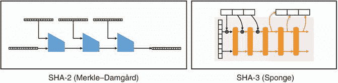

图 2.6 SHA-2 和 SHA-3，两种最广泛采用的哈希函数。SHA-2 基于 Merkle–Damgård 构造，而 SHA-3 基于海绵构造。

### 2.5.1 SHA-2 哈希函数

现在我们已经了解了哈希函数是什么，也瞥见了它们的潜在用途，接下来需要看看在实践中我们可以使用哪些哈希函数。在接下来的两节中，我介绍了两种广泛接受的哈希函数，并且从内部给出了它们工作的高级解释。这些高级解释不应该提供关于如何使用哈希函数的更深入见解，因为我给出的黑盒描述应该足够了。但尽管如此，了解这些加密原语是如何由密码学家设计的还是很有趣的。

最广泛采用的哈希函数是 *安全哈希算法 2*（SHA-2）。SHA-2 由 NSA 发明，并于 2001 年由 NIST 标准化。它旨在添加到 NIST 已经标准化的老化的安全哈希算法 1（SHA-1）中。SHA-2 提供了 4 个不同的版本，分别产生输出长度为 224、256、384 或 512 位。它们各自的名称省略了算法的版本：SHA-224、SHA-256、SHA-384 和 SHA-512。此外，另外两个版本，SHA-512/224 和 SHA-512/256，通过截断 SHA-512 的结果分别提供了 224 位和 256 位的输出。

在以下的终端会话中，我们使用 OpenSSL CLI 调用了 SHA-2 的各个变种。请注意，使用相同的输入调用不同的变种会产生完全不同长度的输出。

```go
$ echo -n "hello world" | openssl dgst -sha224
2f05477fc24bb4faefd86517156dafdecec45b8ad3cf2522a563582b
$ echo -n "hello world" | openssl dgst -sha256
b94d27b9934d3e08a52e52d7da7dabfac484efe37a5380ee9088f7ace2efcde9
$ echo -n "hello world" | openssl dgst -sha384
fdbd8e75a67f29f701a4e040385e2e23986303ea10239211af907fcbb83578b3
  ➥ e417cb71ce646efd0819dd8c088de1bd
$ echo -n "hello world" | openssl dgst -sha512
309ecc489c12d6eb4cc40f50c902f2b4d0ed77ee511a7c7a9bcd3ca86d4cd86f
  ➥ 989dd35bc5ff499670da34255b45b0cfd830e81f605dcf7dc5542e93ae9cd76f
```

现在，人们主要使用 SHA-256，它提供了我们三个安全性属性所需的最低 128 位安全性，而更多防范性的应用则使用 SHA-512。现在，让我们看一下 SHA-2 如何工作的简化解释。

异或运算

要理解接下来的内容，你需要理解 *XOR*（异或）操作。XOR 是位操作，意味着它在位上操作。下图显示了它的工作原理。XOR 在密码学中无处不在，所以确保你记住它。

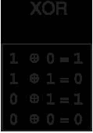

异或（Exclusive OR 或 XOR，通常表示为 ⊕）操作作用于 2 位。它类似于 OR 操作，但当两个操作数都是 1 时不同。

一切都始于一个称为 *压缩函数* 的特殊函数。压缩函数接受某些大小的两个输入，并产生一个输入大小的输出。简而言之，它接受一些数据并返回较少的数据。图 2.7 说明了这一点。

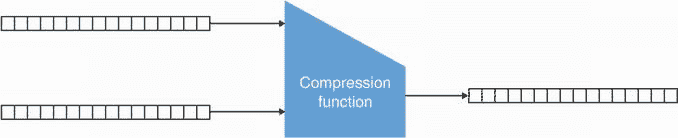

图 2.7 压缩函数接受两个不同大小的输入 *X* 和 *Y*（这里都是 16 字节），并返回一个大小为 *X* 或 *Y* 的输出。

虽然构建压缩函数有不同的方法，但 SHA-2 使用了 *Davies–Meyer* 方法（见图 2.8），它依赖于一个 *分组密码*（可以加密固定大小的数据块的密码）。我在第一章中提到了 AES 分组密码，但你还没有学习过它。目前，接受压缩函数是一个黑盒，直到你在第四章中学习了认证加密。

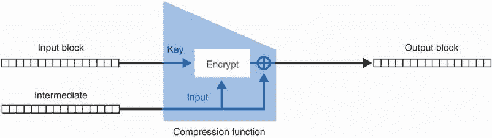

图 2.8 展示了通过戴维斯-迈耶构造构建的压缩函数的示意图。压缩函数的第一个输入（输入块）用作块密码的密钥。第二个输入（中间值）用作要由块密码加密的输入。然后，它再次通过与块密码的输出进行异或来使用自身。

SHA-2 是一种默克尔-达姆高构造，这是一种通过迭代调用这样的压缩函数对消息进行哈希的算法（由拉尔夫·默克尔和伊万·达姆高独立发明）。具体而言，它通过以下两个步骤进行。

首先，它对我们要哈希的输入应用填充，然后将输入切成可以适应压缩函数的块。填充意味着向输入附加特定字节，以使其长度成为某个块大小的倍数。将填充后的输入切成相同块大小的块使我们能够将这些块放入压缩函数的第一个参数中。例如，SHA-256 的块大小为 512 位。图 2.9 说明了这一步骤。

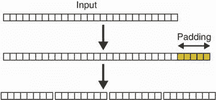

图 2.9 默克尔-达姆高构造的第一步是向输入消息添加一些填充。此步骤完成后，输入长度应为所使用压缩函数的输入大小的倍数（例如，8 字节）。为此，我们在末尾添加 5 字节填充使其为 32 字节。然后，我们将消息分割成 4 个 8 字节的块。

其次，它迭代地将压缩函数应用于消息块，使用前一个压缩函数的输出作为压缩函数的第二个参数。最终输出是摘要。图 2.10 说明了这一步骤。

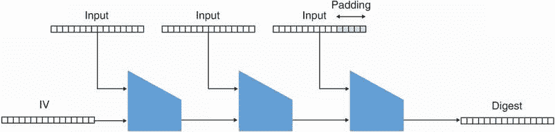

图 2.10 默克尔-达姆高构造迭代地对要散列的每个输入块和上一个压缩函数的输出应用压缩函数。对压缩函数的最终调用直接返回摘要。

这就是 SHA-2 的工作原理，通过迭代调用其压缩函数对输入的片段进行处理，直到全部处理为最终摘要。

注意，如果压缩函数本身是证明碰撞抵抗的，那么默克尔-达姆高构造就被证明是抗碰撞的。因此，任意长度输入的哈希函数的安全性降低到一个固定大小的压缩函数的安全性，这更容易设计和分析。这就是默克尔-达姆高构造的巧妙之处。

起初，压缩函数的第二个参数通常被固定和标准化为“无暗藏的”值。具体来说，SHA-256 使用第一个质数的平方根来导出这个值。无暗藏值的目的是让密码学界相信它不是为了使哈希函数更弱（例如，为了创建后门）而选择的。这是密码学中的一个流行概念。

警告：虽然 SHA-2 是一个完全可以使用的哈希函数，但不适合用于哈希秘密信息。这是因为 Merkle–Damgård 结构的一个缺点，使得 SHA-2 在处理秘密信息时容易受到攻击（称为*长度扩展攻击*）。我们将在下一章节中更详细地讨论这个问题。

### 2.5.2 SHA-3 哈希函数

正如我之前提到的，最近一段时间，MD5 和 SHA-1 哈希函数都被破解了。这两个函数都使用了我在前一节中描述的相同的 Merkle–Damgård 结构。因此，由于 SHA-2 容易受到长度扩展攻击的影响，NIST 于 2007 年决定组织一个新标准的公开竞赛：*SHA-3*。本节介绍了这个更新的标准，并试图对其内部工作原理进行高层次的解释。

2007 年，来自不同国际研究团队的 64 个不同候选者参加了 SHA-3 竞赛。五年后，其中一个提交的算法 Keccak 被提名为获胜者，并取名为 SHA-3。2015 年，SHA-3 被标准化为 FIPS 出版物 202（[`nvlpubs.nist.gov/nistpubs/FIPS/NIST.FIPS.202.pdf`](https://nvlpubs.nist.gov/nistpubs/FIPS/NIST.FIPS.202.pdf)）。

SHA-3 遵循我们之前讨论的三个安全属性，并提供与 SHA-2 变种一样多的安全性。此外，它不容易受到长度扩展攻击，并且可以用于哈希秘密信息。因此，现在推荐使用它作为哈希函数。它提供与 SHA-2 相同的变种，这次在它们的命名变种中标明了全名 SHA-3：SHA-3-224、SHA-3-256、SHA-3-384 和 SHA-3-512。因此，类似于 SHA-2，例如，SHA-3-256 提供 256 位的输出。现在让我花几页的篇幅来解释 SHA-3 的工作原理。

SHA-3 是建立在*置换*之上的密码算法。理解置换的最简单方法是想象以下：你在左边有一组元素，在右边也有同样的一组元素。现在画箭头从左边的每个元素指向右边。每个元素只能有一个从它开始并结束的箭头。现在你有了一个置换。图 2.11 说明了这个原理。根据定义，任何置换也是*可逆*的，这意味着从输出我们可以找到输入。

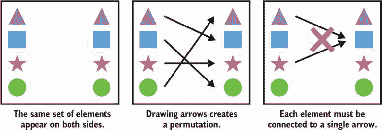

图 2.11 一个作用在四种不同形状上的示例置换。您可以使用中间图片中描述的置换来转换给定的形状。

SHA-3 是建立在*海绵构造*上的，这是 SHA-3 竞赛中发明的一种不同于 Merkle–Damgård 的构造。它基于一个特定的置换称为*keccak-f*，它接受一个输入并返回相同大小的输出。

注意 我们不会解释 keccak-f 是如何设计的，但是你将在第四章中对此有一个概念，因为它与 AES 算法实质上是相似的（除了它没有密钥）。这不是偶然的，因为 AES 的发明者之一也是 SHA-3 的发明者之一。

在接下来的几页中，我将使用一个 8 位排列来说明海绵结构的工作原理。因为排列已经固定，你可以想象图 2.12 很好地说明了这个排列在所有可能的 8 位输入上创建的映射。与我们之前对排列的解释相比，你也可以想象每个可能的 8 位字符串是我们所代表的不同形状（`000...`是一个三角形，`100...`是一个正方形，等等）。

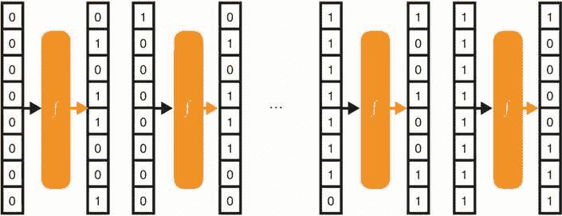

图 2.12 一个海绵结构利用了一个指定的排列 *f*。通过作用于输入，我们的示例排列创建了一个映射，将所有可能的 8 位输入和所有可能的 8 位输出联系起来。

要在我们的海绵结构中使用一个排列，我们还需要定义一个将输入和输出分成 *速率* 和 *容量* 的任意划分。这有点奇怪，但请坚持。图 2.13 说明了这个过程。

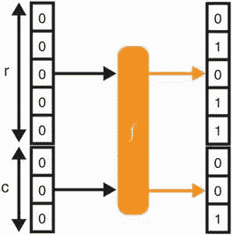

图 2.13 排列 *f* 将一个大小为 8 位的输入随机化为一个相同大小的输出。在海绵结构中，这个排列的输入和输出被分成两部分：速率（大小为 *r*）和容量（大小为 *c*）。

我们设置速率和容量之间的限制是任意的。不同版本的 SHA-3 使用不同的参数。我们非正式地指出容量应该像一个秘密一样对待，而且容量越大，海绵结构就越安全。

现在，像所有良好的哈希函数一样，我们需要能够哈希一些东西，对吧？否则，它有点没用。为了做到这一点，我们简单地将输入与排列的输入速率进行异或（⊕）。起初，这只是一堆 0。正如我们之前指出的，容量被视为一个秘密，所以我们不会与之进行任何异或运算。图 2.14 说明了这一点。

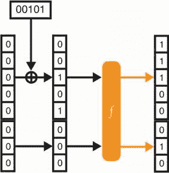

图 2.14 要吸收输入的 5 位 `00101`，一个速率为 5 位的海绵结构可以简单地将这 5 位与速率进行异或（其初始化为 0）。然后置换混淆状态。

现在获得的输出看起来应该是随机的（尽管我们可以轻松地找到输入，因为按照定义排列是可逆的）。如果我们想要输入更大的输入呢？嗯，类似于我们对 SHA-2 所做的，我们会

1.  如果需要，填充输入，然后将输入分成速率大小的块。

1.  迭代地调用排列，同时对每个块与排列的输入进行异或，并在每个块与排列的输入进行异或后对 *状态*（上次操作输出的中间值）进行排列。

为了简化起见，我在其余的解释中忽略了填充，但填充是区分诸如`0`和`00`之类的输入的重要步骤。图 2.15 展示了这两个步骤。

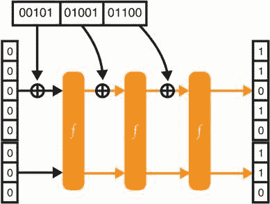

图 2.15 为了吸收比速率大小更大的输入，海绵构造会迭代地对输入块与速率进行异或运算，并对结果进行排列。

到目前为止一切顺利，但我们还没有生成摘要。为了做到这一点，我们可以简单地使用海绵的最后状态的速率（再次强调，我们不会触及容量）。要获得更长的摘要，我们可以继续对状态的速率部分进行排列和读取，正如图 2.16 所示。

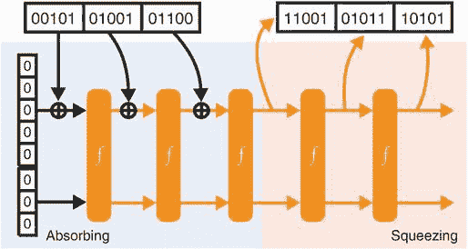

图 2.16 为了使用海绵构造获取摘要，需要迭代地排列状态并检索尽可能多的速率（状态的上部）。

这就是 SHA-3 的工作原理。因为它是一个*海绵构造*，所以摄取输入自然被称为*吸收*，创建摘要被称为*挤压*。海绵采用一个 1,600 比特的置换，根据 SHA-3 不同版本广告的安全性，使用不同的*r*和*c*值进行规定。

SHA-3 是一个随机神谕

我之前提到过随机神谕：这是一个理想的虚构构造，对查询返回完全随机的响应，并且如果我们用相同的输入两次查询它，它会重复自己。事实证明，只要构造所使用的置换看起来足够随机，海绵构造的行为就会接近随机神谕。我们如何证明这种置换的安全性质？我们最好的方法是尝试多次破解它，直到我们对其设计有了强烈的信心（这就是 SHA-3 竞赛期间发生的情况）。SHA-3 可以被建模为随机神谕的事实立即赋予了它我们期望从哈希函数得到的安全属性。

### 2.5.3 SHAKE 和 cSHAKE：两个可扩展输出函数（XOF）

我介绍了两个主要的哈希函数标准：SHA-2 和 SHA-3。这些都是明确定义的哈希函数，可以接受任意长度的输入，并产生看起来随机而固定长度的输出。正如您将在后面的章节中看到的，加密协议经常需要这种类型的原语，但不希望受到哈希函数摘要的固定大小的限制。因此，SHA-3 标准引入了一个更具多功能性的原语，称为*可扩展输出函数*或*XOF*（发音为“zoff”）。本节介绍了两个标准化的 XOF：SHAKE 和 cSHAKE。

*SHAKE*，在 FIPS 202 中规定，可以看作是返回任意长度输出的哈希函数。SHAKE 基本上与 SHA-3 相同的构造，只是它更快，并在挤压阶段中可以排列任意数量的排列。生成不同大小的输出非常有用，不仅用于创建摘要，还用于创建随机数，派生密钥等。我将在本书中再次讨论 SHAKE 的不同应用；现在，想象一下 SHAKE 就像 SHA-3，只是它提供任何你想要的长度的输出。

这种构造在密码学中非常有用，以至于在 SHA-3 标准化一年后，NIST 发布了其特殊出版物 800-185，其中包含了一个称为*cSHAKE*的*可定制 SHAKE*。cSHAKE 与 SHAKE 几乎完全相同，只是它还接受一个自定义字符串。这个自定义字符串可以为空，也可以是任何您想要的字符串。让我们首先看一个在伪代码中使用 cSHAKE 的示例：

```go
cSHAKE(input="hello world", output_length=256, custom_string="my_hash")
-> 72444fde79690f0cac19e866d7e6505c
cSHAKE(input="hello world", output_length=256, custom_string="your_hash")
-> 688a49e8c2a1e1ab4e78f887c1c73957
```

正如您所看到的，尽管 cSHAKE 与 SHAKE 和 SHA-3 一样确定性，但两个摘要不同。这是因为使用了不同的自定义字符串。*自定义字符串*允许您自定义您的 XOF！这在一些协议中非常有用，例如，必须使用不同的哈希函数才能使证明有效。我们称之为*领域分离*。

作为密码学中的黄金法则：如果相同的密码原语用于不同的用例，不要使用相同的密钥（如果需要密钥）和/或应用领域分离。在后续章节中，我们将在调查密码协议时看到更多领域分离的示例。

警告 NIST 倾向于指定以比特为单位而不是字节的参数算法。在示例中，请求了 256 比特的长度。想象一下，如果您请求了 16 字节的长度，却得到了 2 字节，因为程序认为您请求了 16 比特的输出。这个问题有时被称为*比特攻击*。

与密码学中的一切一样，像密钥、参数和输出这样的密码字符串的长度与系统的安全性密切相关。重要的是不要从 SHAKE 或 cSHAKE 请求太短的输出。*使用 256 比特的输出永远不会错*，因为它提供了 128 比特的安全性，可以抵御碰撞攻击。但是，现实世界的密码学有时在可能使用较短的密码值的受限环境中运行。如果系统的安全性经过仔细分析，可以这样做。例如，如果协议中不需要碰撞抵抗，只需要从 SHAKE 或 cSHAKE 获得 128 比特长的输出。

### 2.5.4 避免使用 TupleHash 进行模糊哈希

在本章中，我已经讨论了不同类型的密码原语和密码算法。这包括

+   SHA-2 哈希函数，容易受到长度扩展攻击的攻击，但在没有秘密被哈希时仍然广泛使用

+   SHA-3 哈希函数，现在是推荐使用的哈希函数

+   SHAKE 和 cSHAKE XOFs，比哈希函数更多变的工具，因为它们提供可变的输出长度

我将讨论另一个方便的函数，*TupleHash*，它基于 cSHAKE 并在与 cSHAKE 相同的标准中指定。TupleHash 是一个有趣的函数，它允许对*元组*（一些东西的列表）进行哈希。为了解释 TupleHash 是什么以及它为什么有用，让我给你讲个故事。

几年前，作为工作的一部分，我被委派审查一个加密货币。它包括一个加密货币应有的基本功能：账户、支付等。用户之间的交易将包含有关谁向谁发送多少的元数据。它还包括一笔小费用以补偿网络处理交易所需的成本。

例如，艾丽斯可以向网络发送交易，但要让它们被接受，她需要包含证明该交易来自她的证据。为此，她可以对交易进行哈希并签名（我在第一章中给出了一个类似的例子）。任何人都可以对交易进行哈希并验证哈希上的签名，以查看这是否是艾丽斯打算发送的交易。图 2.17 说明了一个中间人（MITM）攻击者在交易到达网络之前截取交易后，将无法篡改交易。这是因为哈希将会改变，然后签名将不会验证新的交易摘要。

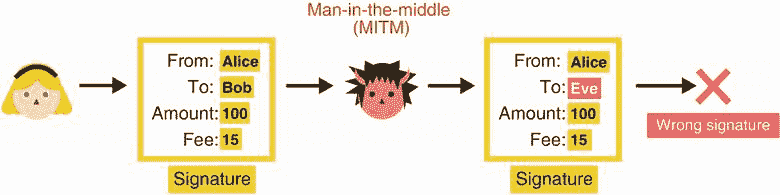

图 2.17 艾丽斯发送一个交易以及对交易哈希的签名。如果中间人攻击者试图篡改交易，哈希将会不同，因此附加的签名也将不正确。

你将在第七章看到，这样的攻击者当然无法伪造艾丽斯在新摘要上的签名。并且由于所使用的哈希函数的第二预像抗性，攻击者也无法找到一个完全不同的交易，其哈希为相同的摘要。

我们的中间人攻击者无害吗？我们还没有脱离危险。不幸的是，对于我审计的加密货币，交易是通过简单地串联每个字段进行哈希的：

```go
$ echo -n "Alice""Bob""100""15" | openssl dgst -sha3-256
34d6b397c7f2e8a303fc8e39d283771c0397dad74cef08376e27483efc29bb02
```

表面上看似乎一切正常，实际上完全破坏了加密货币的支付系统。这样做很容易使攻击者打破哈希函数的第二预像抗性。花点时间思考一下你如何找到一个不同的交易，其哈希为`34d6...`。

如果我们将一个数字从*fee*字段移到*amount*字段会发生什么？人们可以看到以下交易哈希到了同样的摘要，艾丽斯签署了：

```go
$ echo -n "Alice""Bob""1001""5" | openssl dgst -sha3-256
34d6b397c7f2e8a303fc8e39d283771c0397dad74cef08376e27483efc29bb02
```

因此，一个想让鲍勃获得更多钱的中间人攻击者可以修改交易而不使签名无效。正如您可能已经猜到的那样，这就是 TupleHash 解决的问题。它允许您通过使用非模糊编码来明确地对字段列表进行哈希处理。实际上发生的情况与以下内容类似（使用`||`字符串连接操作）：

```go
cSHAKE(input="5"||"Alice"||"3"||"Bob"||"3"||"100"||"2"||"10",
  ➥ output_length=256, custom_string="TupleHash"+"anything you want")
```

这次输入是通过在交易的每个字段前加上其长度来构造的。花点时间理解为什么这样解决了我们的问题。一般来说，通过在对其进行哈希处理之前始终确保*序列化*输入，可以安全地使用任何哈希函数。序列化输入意味着始终存在一种方法来*反序列化*它（即恢复原始输入）。如果可以反序列化数据，则字段分隔就不会存在任何歧义。

## 2.6 密码哈希

在本章中，您已经看到了几个有用的函数，这些函数要么是哈希函数，要么是扩展哈希函数。但在您跳转到下一章之前，我需要提到*密码哈希*。

想象一下以下情景：您有一个网站（这将使您成为网站管理员），您希望用户注册并登录到该网站，因此您为这两个功能分别创建了两个网页。突然间，您想知道，您将如何存储他们的密码？您在数据库中以明文存储这些密码吗？起初似乎没有什么问题，您认为。但这并不完美。人们倾向于在各处重复使用相同的密码，如果（或者当）您遭受攻击并且攻击者设法倾倒所有用户的密码，这对您的用户来说将是不好的，对您的平台声誉也将是不好的。您再仔细考虑一下，您意识到一个攻击者如果能够窃取这个数据库，那么他将能够以任何用户的身份登录。以明文存储密码现在不再理想，您希望有更好的处理方式。

一种解决方案可能是对密码进行哈希处理，然后仅存储摘要。当有人登录到您的网站时，流程将类似于以下内容：

1.  您收到用户的密码。

1.  您对用户提供的密码进行哈希处理并丢弃密码。

1.  您将摘要与先前存储的内容进行比较；如果匹配，则用户已登录。

该流程允许您在有限时间内处理用户的密码。但是，一旦攻击者进入您的服务器，就可以悄悄地保留从该流程中记录密码，直到您察觉到其存在。我们承认这仍然不是一个完美的情况，但我们仍然改进了网站的安全性。在安全领域，我们也称之为*深度防御*，即通过分层不完美的防御措施，希望攻击者无法击败所有这些层次。这也是现实世界的加密学所涉及的内容。但是，这种解决方案还存在其他问题：

+   *如果攻击者获取了哈希密码，可以进行暴力破解攻击或穷举搜索（尝试所有可能的密码）。* 这将针对整个数据库测试每个尝试。理想情况下，我们希望攻击者只能一次攻击一个哈希密码。

+   *哈希函数应该尽可能快。* 攻击者可以利用这一点进行暴力破解（每秒尝试许多密码）。理想情况下，我们应该有一种机制来减慢这种攻击。

第一个问题通常通过使用 *盐* 解决，盐是公开的随机值，每个用户都不同。当我们对用户的密码进行哈希处理时，我们使用一个盐，这在某种程度上类似于在 cSHAKE 中使用每个用户的自定义字符串：它实际上为每个用户创建了一个不同的哈希函数。由于每个用户使用不同的哈希函数，攻击者无法预先计算大量密码（称为 *彩虹表*），希望将其与窃取的密码哈希数据库整个测试相匹配。

第二个问题通过 *密码哈希* 解决，这些密码哈希设计为缓慢。目前用于此的最先进选择是 *Argon2*，它是从 2013 年到 2015 年举办的密码哈希竞赛 ([`password-hashing.net`](https://password-hashing.net)) 的获胜者。本文撰写时（2021 年），Argon2 正在按计划标准化为 RFC ([`datatracker.ietf.org/doc/draft-irtf-cfrg-argon2/`](https://datatracker.ietf.org/doc/draft-irtf-cfrg-argon2/))。在实践中，还使用其他非标准算法，如 PBKDF2、bcrypt 和 scrypt。问题在于这些算法可能使用不安全的参数，并且因此在实践中配置起来并不简单。

此外，只有 Argon2 和 scrypt 能够抵御来自攻击者的重度优化，因为其他方案不是内存硬化的。术语 *内存硬化* 意味着算法只能通过内存访问的优化来进行优化。换句话说，优化其余部分并不会带来太大好处。由于即使使用专用硬件（CPU 周围只能放置那么多缓存），内存硬化函数在任何类型的设备上运行速度都很慢。当你想要防止攻击者在评估函数时获得非可忽略的速度优势时，这是一种期望的属性。

图 2.18 回顾了本章中你所看到的不同类型的哈希函数。

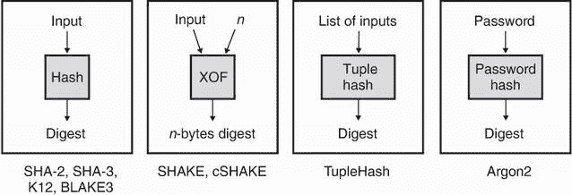

图 2.18 在本章中，你看到了四种类型的哈希函数：(1) 普通类型的哈希函数为任意长度的输入提供了一个唯一的随机标识符；(2) 可扩展输出函数与普通类型类似，但提供了任意长度的输出；(3) 元组哈希函数清楚地列出了哈希值；以及 (4) 无法轻易优化以安全存储密码的密码哈希函数。

## 摘要

+   哈希函数提供碰撞抗性、前像抗性和第二前像抗性。

    +   前像抗性意味着不应该能够找到产生摘要的输入。

    +   第二前像抗性意味着从一个输入及其摘要出发，不应该能够找到一个产生相同摘要的不同输入。

    +   碰撞抗性意味着不应该能够找到两个随机输入，它们的哈希值相同。

+   最广泛采用的哈希函数是 SHA-2，而推荐的哈希函数是 SHA-3，因为 SHA-2 缺乏对长度扩展攻击的抵抗力。

+   SHAKE 是一种可扩展输出函数（XOF），它的行为类似于哈希函数，但提供任意长度的摘要。

+   cSHAKE（用于定制 SHAKE）允许轻松创建行为像不同 XOF 的 SHAKE 实例。这被称为域分离。

+   对象在进行哈希处理之前应进行序列化，以避免破坏哈希函数的第二前像抗性。像 TupleHash 这样的算法会自动处理这一点。

+   对密码进行哈希处理时使用的是专门设计用于此目的的较慢的哈希函数。Argon2 是最先进的选择。
