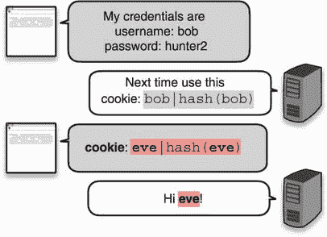
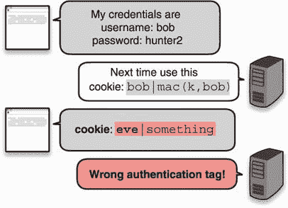

# 第三章：消息认证码

本章涵盖

+   消息认证码（MACs）

+   MAC 的安全性属性和陷阱

+   广泛采用的 MAC 标准

将哈希函数与秘密密钥混合在一起，你就得到了一种称为*消息认证码*（MAC）的东西，它是一种用于保护数据完整性的密码原语。添加秘密密钥是任何类型安全的基础：没有密钥就没有机密性，也没有认证。虽然哈希函数可以为任意数据提供认证或完整性，但这要归功于一个不可篡改的额外受信任的通道。在本章中，你将看到 MAC 如何用于创建这样一个受信任的通道，以及它还能做些什么。

注意 对于本章，您需要已阅读了第二章的哈希函数。

## 无状态 cookies，MAC 的一个激励示例

假设下面的场景：你是一个网页。你色彩明亮，充满活力，最重要的是，你以为一群忠实用户提供服务感到自豪。要与你互动，访客必须首先通过发送他们的凭据来登录，然后你必须验证这些凭据。如果凭据与用户首次注册时使用的凭据匹配，那么你已成功*验证*了用户。

当然，Web 浏览体验不仅仅是一个请求，而是多个请求的组合。为了避免用户在每个请求中重新进行身份验证，你可以让他们的浏览器存储用户凭据，并在每个请求中自动重新发送。浏览器就有一个专门的功能——*cookies*！ Cookies 不仅仅用于凭据。它们可以存储任何你希望用户在每个请求中发送给你的内容。

尽管这种天真的方法效果很好，但通常你不希望在浏览器中以明文形式存储诸如用户密码之类的敏感信息。相反，会话 cookie 最常携带一个随机字符串，在用户登录后立即生成。Web 服务器将随机字符串存储在临时数据库中，使用用户的昵称作为标识。如果浏览器以某种方式发布了会话 cookie，就不会泄露有关用户密码的任何信息（尽管可以使用它来冒充用户）。Web 服务器还有可能通过在其端删除 cookie 来终止会话，这很好。


这种方法没有问题，但在某些情况下，它可能不太适合扩展。如果你有许多服务器，让所有服务器共享用户和随机字符串之间的关联可能会很麻烦。相反，你可以在浏览器端存储更多信息。让我们看看如何做到这一点。

天真地，你可以让 cookie 包含一个用户名而不是一个随机字符串，但这显然是一个问题，因为我现在可以通过手动修改 cookie 中包含的用户名来冒充任何用户。也许你在第二章学到的哈希函数能帮助我们。花几分钟想想哈希函数如何防止用户篡改自己的 cookie。

第二种天真的方法可能是不仅在 cookie 中存储一个用户名，还存储该用户名的摘要。你可以使用像 SHA-3 这样的哈希函数来对用户名进行哈希。我在图 3.1 中说明了这一点。你认为这个方法可行吗？


图 3.1 为了验证浏览器的请求，web 服务器要求浏览器存储一个用户名和该用户名的哈希，并在每个后续请求中发送这些信息。

这种方法有一个很大的问题。请记住，哈希函数是一个公开的算法，恶意用户可以重新计算新数据上的哈希。如果你不信任哈希的来源，它就无法提供数据完整性！的确，图 3.2 显示，如果恶意用户修改了其 cookie 中的用户名，他们也可以简单地重新计算 cookie 的摘要部分。



图 3.2 恶意用户可以修改其 cookie 中包含的信息。如果一个 cookie 包含一个用户名和一个哈希，两者都可以被修改以冒充不同的用户。

使用哈希仍然不是一个愚蠢的想法。我们还能做什么？事实证明，有一种与哈希函数类似的原始方法，叫做 MAC，它正好可以满足我们的需求。

*MAC*是一个秘密密钥算法，它像哈希函数一样接受一个输入，但它还接受一个秘密密钥（谁会想到呢？）然后产生一个称为*认证标签*的唯一输出。这个过程是确定性的；给定相同的秘密密钥和相同的消息，MAC 会产生相同的认证标签。我在图 3.3 中说明了这一点。


图 3.3 一个消息认证码（MAC）的接口。该算法接受一个秘密密钥和一个消息，并确定性地生成一个唯一的认证标签。没有密钥的话，应该无法再现那个认证标签。

为了确保用户无法篡改他们的 cookie，让我们现在利用这种新的原始方法。当用户第一次登录时，你使用你的秘密密钥和他们的用户名生成一个认证标签，并要求他们将他们的用户名和认证标签存储在*cookie*中。因为他们不知道秘密密钥，所以他们将无法伪造出不同用户名的有效认证标签。

要验证他们的 cookie，你做同样的事情：使用你的秘密密钥和 cookie 中包含的用户名生成一个身份验证标签，并检查它是否与 cookie 中包含的身份验证标签匹配。如果匹配，那么它必定来自你，因为只有你能够生成有效的身份验证标签（在你的秘密密钥下）。我在图 3.4 中说明了这一点。



图 3.4 一个恶意用户篡改了他的 cookie，但无法伪造新 cookie 的有效身份验证标签。随后，网页无法验证 cookie 的真实性和完整性，因此丢弃了请求。

MAC 就像一个私有的哈希函数，只有你知道密钥才能计算出来。在某种意义上，你可以用密钥个性化一个哈希函数。与哈希函数的关系并不止于此。你将在本章后面看到，MAC 经常是从哈希函数构建的。接下来，让我们看一个使用真实代码的不同示例。

## 3.2 一个代码示例

到目前为止，只有你在使用 MAC。让我们增加参与者的数量，并以此为动机编写一些代码，看看 MAC 在实践中是如何使用的。想象一下，你想与其他人通信，而不在乎其他人是否阅读你的消息。但你真正关心的是消息的完整性：它们不能被修改！一个解决方案是你和你的通信对象使用相同的秘密密钥和 MAC 来保护通信的完整性。

对于这个示例，我们将使用最流行的 MAC 函数之一——*基于哈希的消息认证码*（HMAC）与 Rust 编程语言一起使用。HMAC 是一种使用哈希函数作为核心的消息认证码。它与不同的哈希函数兼容，但主要与 SHA-2 一起使用。如下列表所示，发送部分只需接受一个密钥和一个消息，然后返回一个身份验证标签。

列表 3.1 在 Rust 中发送经过身份验证的消息

```py
use sha2::Sha256;
use hmac::{Hmac, Mac, NewMac};

fn send_message(key: &[u8], message: &[u8]) -> Vec<u8> {
    let mut mac = Hmac::<Sha256>::new(key.into());          ❶

    mac.update(message);                                    ❷

    mac.finalize().into_bytes().to_vec()                    ❸
}
```

❶ 使用秘密密钥和 SHA-256 哈希函数实例化 HMAC

❷ 为 HMAC 缓冲更多输入

❸ 返回身份验证标签

另一方面，流程类似。在接收到消息和身份验证标签后，你的朋友可以使用相同的秘密密钥生成自己的标签，然后进行比较。与加密类似，双方需要共享相同的秘密密钥才能使其正常工作。以下列表显示了这是如何工作的。

列表 3.2 在 Rust 中接收经过身份验证的消息

```py
use sha2::Sha256;
use hmac::{Hmac, Mac, NewMac};

fn receive_message(key: &[u8], message: &[u8],
  authentication_tag: &[u8]) -> bool {
    let mut mac = Hmac::<Sha256>::new(key);         ❶
    mac.update(message);                            ❷

    mac.verify(&authentication_tag).is_ok()
}
```

❶ 接收方需要从相同的密钥和消息中重新创建身份验证标签。

❷ 检查重现的身份验证标签是否与接收到的标签匹配

注意，这个协议并不完美：它允许重放攻击。如果一个消息及其认证标签在以后的某个时间点被重放，它们仍然是真实的，但你将无法检测到它是一条旧消息被重新发送给你。本章后面，我会告诉你一个解决方案。现在你知道了 MAC 可以用来做什么，我会在下一节谈谈 MAC 的一些“坑”。

## 3.3 MAC 的安全属性

MACs，像所有的密码学原语一样，有它们的怪异之处和陷阱。在继续之前，我将对 MAC 提供的安全属性以及如何正确使用它们提供一些解释。你会依次学到（按顺序）：

+   MACs 抵抗认证标签的伪造。

+   一个认证标签需要有足够的长度才能保证安全。

+   如果简单地进行认证，消息可以被重放。

+   验证认证标签容易出现错误。

### 3.3.1 认证标签伪造

一个 MAC 的一般安全目标是防止在新消息上*伪造认证标签*。这意味着在不知道秘钥 *k* 的情况下，无法计算出认证标签 *t* = *MAC*(*k*, *m*) 在用户选择的消息 *m* 上。这听起来合理，对吧？如果我们缺少一个参数，我们就不能计算出一个函数。

然而，MACs 提供了比这更多的保证。现实世界的应用程序通常会让攻击者获取一些受限制的消息的认证标签。例如，在我们的介绍场景中，这就是问题所在，用户可以通过注册一个可用的昵称来获得几乎任意的认证标签。因此，MACs 必须甚至对这些更强大的攻击者也是安全的。一个 MAC 通常附带一个证明，即使攻击者可以要求你为大量的任意消息产生认证标签，攻击者也不能自己伪造一个以前从未见过的消息的认证标签。

注意有人可能会想知道证明这样一个极端性质的用处是什么。如果攻击者可以直接请求任意消息的认证标签，那么还剩下什么需要保护的呢？但这就是密码学中安全证明的工作原理：它们考虑到最强大的攻击者，甚至在那种情况下，攻击者也是无能为力的。在实践中，攻击者通常不那么强大，因此，我们相信如果一个强大的攻击者无法做出恶意行为，一个不那么强大的攻击者就更加无能为力了。

因此，只要与 MAC 一起使用的秘钥保持秘密，你就应该受到保护。这意味着秘钥必须足够随机（在第八章中详细讨论）和足够大（通常为 16 字节）。此外，一个 MAC 对于我们在第二章中看到的相同类型的模糊攻击也是脆弱的。如果你试图验证结构，请确保在用 MAC 验证之前将它们序列化；否则，伪造可能是微不足道的。

### 3.3.2 认证标签的长度

针对 MAC 的另一个可能攻击是*碰撞*。记住，找到哈希函数的碰撞意味着找到两个不同的输入 *X* 和 *Y*，使得 *HASH*(*X*) = *HASH*(*Y*)。我们可以通过定义当 *MAC*(*k*, *X*) = *MAC*(*k*, *Y*) 时输入 *X* 和 *Y* 发生碰撞来将此定义扩展到 MAC。

正如我们在第二章学到的生日攻击边界一样，如果我们算法的输出长度较小，则可以高概率地找到碰撞。例如，对于 MAC，如果攻击者可以访问生成 64 位认证标签的服务，则可以通过请求较少的标签数（232）高概率地找到碰撞。在实践中，这样的碰撞很少能够被利用，但存在一些碰撞抗性很重要的情况。因此，我们希望认证标签大小能够限制此类攻击。一般来说，使用 128 位认证标签是因为它们提供足够的抗性。

*[请求 2⁶⁴ 个认证标签] 在连续 1Gbps 链路上需要 250,000 年，并且在此期间不更改秘密密钥 K*。

—RFC 2104（“HMAC：用于消息认证的键控哈希”，1997）

使用 128 位认证标签可能看起来有些反直觉，因为我们希望哈希函数的输出为 256 位。但是哈希函数是公开算法，攻击者可以*离线*计算，这使得攻击者能够对攻击进行优化和并行化。使用像 MAC 这样的密钥函数，攻击者无法有效地离线优化攻击，而是被迫直接向您请求认证标签，这通常会使攻击速度变慢。128 位认证标签需要攻击者*在线*查询 2⁶⁴ 次，才有 50% 的机会找到碰撞，这被认为足够大。尽管如此，某些情况下可能仍希望将认证标签增加到 256 位，这也是可能的。

### 3.3.3 重播攻击

我还没提到的一件事是*重播攻击*。让我们看一个容易受到此类攻击的场景。假设 Alice 和 Bob 使用不安全的连接在公开场合进行通信。为了防止消息篡改，他们在每条消息后附上认证标签。更具体地说，他们都使用两个不同的秘密密钥来保护连接的不同侧面（按最佳实践）。我在图 3.5 中说明了这一点。


图 3.5 两个用户共享两个密钥 `k1` 和 `k2`，并随消息一起交换认证标签。这些标签是根据消息的方向从 `k1` 或 `k2` 计算出来的。恶意观察者会重播其中一条消息给用户。

在这种情况下，没有任何东西能阻止恶意观察者向其接收者重播其中一条消息。依赖于 MAC 的协议必须意识到这一点，并构建对抗措施。一种方法是像图 3.6 中所示，向 MAC 的输入添加一个递增计数器。


图 3.6 两个用户共享两个密钥 `k1` 和 `k2`，并与身份验证标签一起交换消息。这些标签是根据消息的方向从 `k1` 或 `k2` 计算的。恶意观察者向用户重播其中一个消息。因为受害者已经增加了他的计数器，标签将被计算为 `2, fine and you?`，并且不会与攻击者发送的标签匹配。这使得受害者能够成功拒绝重放的消息。

在实践中，计数器通常是固定的 64 位长度。这允许在填满计数器之前发送 2⁶⁴ 条消息（并且有风险包装和重复自身）。当然，如果共享的密钥经常旋转（意味着在*X*条消息后，参与者同意使用新的共享密钥），那么计数器的大小可以缩小，并且在密钥旋转后重置为 0。（你应该确信重复使用相同的计数器与两个不同的密钥是可以的。）再次强调，由于存在歧义攻击，计数器*永远不是可变长度*的。

练习

你能想象出一个可变长度计数器如何可能允许攻击者伪造身份验证标签吗？

### 3.3.4 在恒定时间内验证身份验证标签

最后一个注意事项对我来说很重要，因为我在审计的应用程序中多次发现了这个漏洞。在验证身份验证标签时，接收到的身份验证标签和你计算的标签之间的比较必须在*恒定时间*内完成。这意味着比较应该始终花费相同的时间，假设接收到的标签是正确大小的。如果比较两个身份验证标签所花费的时间不是恒定时间，那么很可能是因为它在两个标签不同时返回。这通常提供了足够的信息，以启用通过测量验证完成所需时间来逐字节重新创建有效身份验证标签的攻击。我在以下漫画中解释了这一点。我们将这类攻击称为*时序攻击*。

幸运的是，实现 MAC 的加密库还提供了方便的函数，以恒定的时间验证身份验证标签。如果你想知道这是如何做到的，清单 3.3 展示了 Golang 如何在恒定时间代码中实现身份验证标签比较。


清单 3.3 Golang 中的常量时间比较

```py
for i := 0; i < len(x); i++ {
    v |= x[i] ^ y[i]
}
```

窍门在于从不采取任何分支。具体工作原理留给读者作为练习。

## 3.4 现实世界中的 MAC

现在我已经介绍了 MAC 是什么以及它们提供的安全属性，让我们看看人们在实际环境中如何使用它们。以下章节将讨论这一点。

### 3.4.1 消息认证

MACs 被广泛用于确保两台机器或两个用户之间的通信不被篡改。这在通信以明文传输和通信以加密方式传输的情况下都是必要的。我已经解释了当通信以明文传输时会发生什么，而在第四章中，我将解释在通信加密时如何实现这一点。

### 3.4.2 密钥派生

MACs 的一个特点是它们通常被设计为生成看起来随机的字节（就像哈希函数）。您可以利用这个特性实现一个单一的密钥来生成随机数，或者生成更多的密钥。在第八章关于秘密和随机性中，我将介绍基于 HMAC 的密钥派生函数（HKDF），它通过使用 HMAC 来实现这一点，HMAC 是我们将在本章中讨论的 MAC 算法之一。

伪随机函数（PRF）

想象一下，所有接受可变长度输入并生成固定大小随机输出的函数的集合。如果我们可以从这个集合中随机选择一个函数并将其用作 MAC（没有密钥），那就太好了。我们只需就选择哪个函数达成一致（有点像达成一致选择密钥）。不幸的是，我们不能拥有这样的集合，因为它太大了，但我们可以通过设计一些接近的东西来模拟选择这样一个随机函数：我们称这样的构造为*伪随机函数（PRFs）*。HMAC 和大多数实用的 MAC 都是这样的构造。它们通过一个密钥参数进行随机化。选择不同的密钥就像选择一个随机函数。

练习

注意：并非所有的 MAC 都是 PRF。你能看出为什么吗？

### 3.4.3 Cookie 的完整性

要追踪用户的浏览器会话，您可以向他们发送一个随机字符串（与他们的元数据相关联）或直接发送元数据，附带身份验证标签，以便他们无法修改它。这就是我在引言例子中解释的内容。

### 3.4.4 哈希表

编程语言通常公开称为*哈希表*（也称为哈希映射、字典、关联数组等）的数据结构，这些数据结构使用非密码散列函数。如果一个服务以这样一种方式公开此数据结构，使得攻击者可以控制非密码散列函数的输入，这可能导致*拒绝服务*（DoS）*攻击*，意味着攻击者可以使服务无法使用。为了避免这种情况，非密码散列函数通常在程序启动时进行随机化。

许多主要的应用程序使用一个随机密钥的 MAC 代替非密码散列函数。这适用于许多编程语言（如 Rust、Python 和 Ruby）或主要应用程序（如 Linux 内核）。它们都使用*SipHash*，一个针对短身份验证标签进行优化的 MAC，该标签在程序启动时生成随机密钥。

## 3.5 实践中的消息认证码（MACs）

你已经了解到 MAC 是一种加密算法，可以在一个或多个参与方之间使用，以保护信息的完整性和真实性。由于广泛使用的 MAC 也表现出良好的随机性，MAC 也经常被用于在不同类型的算法中确定性地产生随机数（例如，你将在第十一章学习的基于时间的一次性密码[TOTP]算法）。在本节中，我们将介绍两种现在可以使用的标准化的 MAC 算法——HMAC 和 KMAC。

### 3.5.1 HMAC，一种基于哈希的 MAC

最广泛使用的 MAC 是 HMAC（*基于哈希的 MAC*），由 M. Bellare、R. Canetti 和 H. Krawczyk 于 1996 年发明，并在 RFC 2104、FIPS 出版物 198 和 ANSI X9.71 中指定。HMAC，正如其名称所示，是一种使用哈希函数和密钥的方法。使用哈希函数构建 MAC 的概念是一个流行的概念，因为哈希函数有广泛可用的实现，在软件中速度快，并且在大多数系统上也受到硬件支持。记得我在第二章提到过，由于*长度扩展攻击*（本章末尾将详细介绍），SHA-2 不应直接用于对秘密进行哈希处理。那么如何将哈希函数转换为带密钥的函数呢？这就是 HMAC 为我们解决的问题。在幕后，HMAC 遵循以下步骤，我在图 3.7 中通过可视化方式说明：

1.  它首先从主密钥中创建两个密钥：*k*1 = *k* ⊕ *ipad* 和 *k*2 = *k* ⊕ *opad*，其中*ipad*（内部填充）和*opad*（外部填充）是常数， ⊕ 是异或操作的符号。

1.  然后将一个密钥`k1`与消息进行串联并对其进行哈希运算。

1.  结果与一个密钥`k2`进行串联，并再进行一次哈希运算。

1.  这产生了最终的认证标签。


图 3.7 HMAC 通过对一个密钥`k1`和输入消息的串联(`||`)进行哈希运算，然后再对第一次操作的输出与另一个密钥`k2`的串联进行哈希运算来工作。`k1`和`k2`都是从一个秘密密钥`k`派生出来的确定性密钥。

由于 HMAC 是可定制的，其认证标签的大小取决于所使用的哈希函数。例如，HMAC-SHA256 使用 SHA-256 并产生 256 位的认证标签，HMAC-SHA512 产生 512 位的认证标签，依此类推。

警告虽然可以截断 HMAC 的输出以减小其大小，但认证标签应至少为 128 位，正如我们之前讨论的那样。这并不总是得到尊重，一些应用会降低到 64 位，因为明确处理了有限数量的查询。这种方法存在权衡，再次强调，在执行非标准操作之前，仔细阅读细则是很重要的。

HMAC 是这样构建的，以方便证明。在几篇论文中，已经证明 HMAC 在底层哈希函数具有一些良好属性时是安全的，而所有的密码学安全哈希函数都应该具备这些属性。由于这一点，我们可以将 HMAC 与大量的哈希函数结合使用。今天，HMAC 主要与 SHA-2 一起使用。

### 3.5.2 KMAC，基于 cSHAKE 的 MAC

由于 SHA-3 不容易受到长度扩展攻击的影响（这实际上是 SHA-3 竞赛的要求之一），在实践中使用 SHA-3 与 HMAC 相比，使用像`SHA-3-256(key` `||` `message)`这样的方法更合理。这正是*KMAC*所做的。

KMAC 利用了 cSHAKE，即您在第二章中看到的可定制版本的 SHAKE 可扩展输出函数（XOF）。KMAC 以一种明确的方式对 MAC 密钥、输入和请求的输出长度进行编码（KMAC 是一种可扩展输出 MAC），并将其作为 cSHAKE 的输入来吸收（参见图 3.8）。KMAC 还使用“KMAC”作为函数名称（以定制 cSHAKE），并且还可以接受用户定义的定制字符串。


图 3.8 KMAC 只是 cSHAKE 的一个包装器。为了使用密钥，它对密钥、输入和输出长度进行编码（以一种明确的方式），然后将其作为 cSHAKE 的输入。

有趣的是，由于 KMAC 还吸收了请求的输出长度，使用不同输出长度进行多次调用会得到完全不同的结果，这在一般情况下很少见于 XOFs。这使得 KMAC 在实践中成为一种非常多功能的函数。

## 3.6 SHA-2 和长度扩展攻击

我们已经多次提到，不应该使用 SHA-2 来哈希秘密，因为它对*长度扩展攻击*不具有抵抗力。在本节中，我们旨在对这种攻击进行简单解释。

让我们回到我们的引言情景，回到我们尝试简单地使用 SHA-2 来保护 cookie 的完整性的步骤。请记住，这还不够好，因为用户可以篡改 cookie（例如，添加一个`admin=true`字段）并重新计算 cookie 的哈希。确实，SHA-2 是一个公共函数，没有任何东西阻止用户这样做。图 3.9 说明了这一点。


图 3.9 一个网页发送一个 cookie，然后跟随着该 cookie 的哈希给一个用户。然后，要求用户在每次后续请求中发送 cookie 以验证自己。不幸的是，一个恶意用户可以篡改 cookie 并重新计算哈希，从而破坏完整性检查。然后网页接受该 cookie 为有效。

接下来最好的想法是在我们哈希的内容中添加一个秘钥。这样，用户无法重新计算摘要，因为需要秘钥，就像 MAC 一样。在接收到篡改的 cookie 时，页面计算`SHA-256(key` `||` `tampered_cookie)`，其中`||`表示两个值的连接，并得到一个与恶意用户可能发送的内容不匹配的结果。图 3.10 说明了这种方法。


图 3.10 通过在计算 cookie 的哈希时使用一个秘钥，人们可能会认为想要篡改自己的 cookie 的恶意用户无法计算出新 cookie 的正确摘要。我们将在后面看到，对于 SHA-256 来说这并不成立。

不幸的是，SHA-2 有一个令人讨厌的特点：从一个输入的摘要中，可以计算出输入的摘要以及更多内容。这是什么意思呢？让我们看看图 3.11，其中使用 SHA-256 作为`SHA-256(secret` `||` `input1)`。


图 3.11 SHA-256 对一个与 cookie（这里命名为`input1`）连接的秘密进行哈希。请记住，SHA-256 通过使用 Merkle–Damgård 构造来迭代地调用压缩函数对输入的块进行处理，从初始化向量（IV）开始。

图 3.11 非常简化，但想象一下`input1`是字符串`user=bob`。请注意，获得的摘要实际上是哈希函数在这一点的完整中间状态。没有什么可以阻止假装`填充`部分是输入的一部分，继续 Merkle–Damgård 舞蹈。在图 3.12 中，我们说明了这种攻击，其中一个人会取得摘要并计算`input1` `||` `padding` `||` `input2`的哈希。在我们的例子中，`input2`是`&admin=true`。


图 3.12 SHA-256 对 cookie 的哈希输出（中间摘要）用于扩展哈希到更多数据，创建一个哈希（右侧摘要），其中包括秘密与`input1`、第一个填充字节和`input2`的连接。

这个漏洞允许从给定的摘要继续哈希，就好像操作还没有完成一样。这打破了我们先前的协议，正如图 3.13 所示。


图 3.13 攻击者成功使用长度扩展攻击篡改他们的 cookie，并使用先前的哈希计算出正确的哈希。

现在第一个填充需要成为输入的一部分，这可能会阻止一些协议被利用。但是，最小的更改可能会重新引入漏洞。因此，永远不要使用 SHA-2 对秘密信息进行哈希。当然，还有几种正确的方法（例如，`SHA-256(k` `||` `message` `||` `k)`），这就是 HMAC 提供的功能。因此，如果要使用 SHA-2，请使用 HMAC，如果更喜欢 SHA-3，请使用 KMAC。

## 总结

+   消息验证码（MACs）是对称加密算法，允许共享相同密钥的一个或多个参与方验证消息的完整性和真实性。

    +   要验证消息及其相关的认证标签的真实性，可以重新计算消息和一个秘密密钥的认证标签，然后比较这两个认证标签。如果它们不同，则消息已被篡改。

    +   总是在恒定时间内将接收到的认证标签与计算得到的标签进行比较。

+   虽然消息验证码默认保护消息的完整性，但它们不能检测到消息被重播的情况。

+   标准化和广受认可的消息验证码包括 HMAC 和 KMAC 标准。

+   可以使用不同的哈希函数来进行 HMAC。实际上，HMAC 常与 SHA-2 哈希函数一起使用。

+   认证标签的最小长度应为 128 位，以防止认证标签的碰撞和伪造。

+   永远不要直接使用 SHA-256 来构建消息验证码，因为可能会出错。始终使用像 HMAC 这样的函数来完成这个任务。
