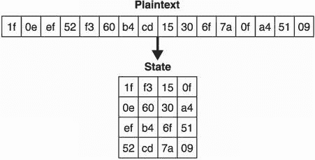
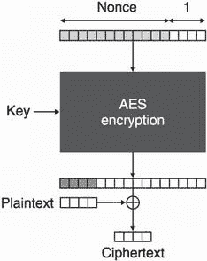
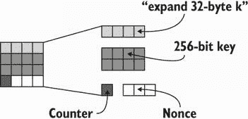

# 第四章：认证加密

本章涵盖

+   对称加密与认证加密的区别

+   流行的认证加密算法

+   其他类型的对称加密

保密性是关于隐藏数据不被未经授权的人看到，而加密是实现这一目标的方法。加密是密码学最初被发明的目的；它是早期密码学家最关心的问题。他们会问自己，“我们如何防止观察者理解我们的对话？”虽然最初科学及其进展是在闭门之后蓬勃发展的，只有政府和军队受益，但现在已经向全世界开放。今天，加密在现代生活的各个方面被广泛使用以增加隐私和安全性。在本章中，我们将了解加密的真正含义，它解决了哪些问题，以及当今的应用程序如何大量使用这种密码原语。

注意 对于本章，您需要已经阅读了第三章关于消息认证码的内容。

## 4.1 什么是密码？

*就像当你用俚语与兄弟姐妹谈论放学后要做什么，这样你的妈妈就不知道你在干什么*。

—Natanael L. (2020, [`twitter.com/Natanael_L`](https://twitter.com/Natanael_L))

让我们想象一下我们的两个角色，爱丽丝和鲍勃，想要私下交换一些消息。在实践中，他们有许多可供选择的媒介（邮件、电话、互联网等），每个媒介默认都是不安全的。邮递员可能会打开他们的信件；电信运营商可以窥探他们的通话和短信；互联网服务提供商或者在爱丽丝和鲍勃之间的网络中的任何服务器都可以访问正在交换的数据包的内容。

不再拖延，让我们介绍一下爱丽丝和鲍勃的救星：*加密算法*（也称为*密码*）。现在，让我们把这个新算法想象成爱丽丝可以用来加密她发送给鲍勃的消息的黑匣子。通过对消息进行*加密*，爱丽丝将其转换为看起来随机的内容。这个加密算法需要

+   *一个秘钥*—这个元素的不可预测性、随机性和良好的保护至关重要，因为加密算法的安全性直接依赖于密钥的保密性。我将在第八章关于秘密和随机性中更多地讨论这一点。

+   *一些明文*—这是你想要加密的内容。它可以是一些文本、一张图片、一个视频，或者任何可以转换为比特的东西。

这个加密过程产生了一个*密文*，即加密后的内容。爱丽丝可以安全地使用之前列出的媒介之一将该密文发送给鲍勃。对于不知道秘钥的任何人来说，密文看起来是随机的，消息内容（明文）的任何信息都不会泄露。一旦鲍勃收到这个密文，他可以使用一个*解密算法*将密文恢复为原始明文。解密需要

+   *一个秘密密钥* — 这是艾丽丝用于创建密文的相同秘密密钥。因为同一密钥用于两种算法，所以我们有时将密钥称为*对称密钥*。这也是为什么我们有时指定我们使用*对称加密*而不仅仅是*加密*。

+   *一些密文* — 这是鲍勃从艾丽丝那里收到的加密消息。

然后该过程显示出原始明文。图 4.1 说明了此流程。


图 4.1 艾丽丝（右上）用密钥 `0x8866...`（一个缩写的十六进制数）加密明文 *hello*，然后将密文发送给鲍勃。鲍勃（右下）使用相同的密钥和解密算法解密收到的密文。

加密允许艾丽丝将她的消息转换成看起来随机的内容，并可以安全地传输给鲍勃。解密允许鲍勃将加密消息还原为原始消息。这种新的加密原语为他们的消息提供了保密性（或秘密性或隐私性）。

注意 艾丽丝和鲍勃如何同意使用相同的对称密钥？现在，我们假设其中一个人有权访问一个生成不可预测密钥的算法，并且他们亲自见面交换密钥。实际上，如何用共享的秘密来启动这样的协议通常是公司需要解决的重大挑战之一。在本书中，您将看到许多解决这个问题的不同方法。

请注意，我尚未介绍本章标题“认证加密”指的是什么。到目前为止，我只谈到了单独的加密。虽然单独的加密并不安全（稍后再说），但我必须先解释它是如何工作的，然后才能介绍认证加密原语。所以请容我先讲解加密的主要标准：*高级加密标准*（AES）。 

## 4.2 高级加密标准（AES）块密码

1997 年，NIST 启动了一个旨在取代数据加密标准（DES）算法的*高级加密标准*（AES）的公开竞赛，他们以前的加密标准开始显露老化迹象。竞赛持续了三年，期间，来自不同国家的密码学家团队提交了 15 种不同的设计。竞赛结束时，只有一个提交作品，由文森特·赖曼和约翰·达曼设计的 Rijndael 被提名为获胜者。2001 年，NIST 发布了 AES 作为 FIPS（联邦信息处理标准）197 出版物的一部分。 AES，即 FIPS 标准中描述的算法，仍然是今天主要使用的密码。在本节中，我将解释 AES 的工作原理。

### 4.2.1 AES 提供了多少安全性？

AES 提供了三个不同版本：AES-128 使用 128 位（16 字节）密钥，AES-192 使用 192 位（24 字节）密钥，AES-256 使用 256 位（32 字节）密钥。密钥的长度决定了安全级别—*越大越强*。尽管如此，大多数应用都使用 AES-128，因为它提供足够的安全性（128 位安全性）。

术语 *位安全性* 常用来指示密码算法的安全性。例如，AES-128 指定我们已知的最佳攻击需要大约 2¹²⁸ 次操作。这个数字是巨大的，它是大多数应用所追求的安全级别。

位安全性是一个上限

128 位密钥提供 128 位安全性的事实是特定于 AES 的；这不是一个黄金法则。在某些其他算法中使用的 128 位密钥理论上可能提供的安全性不到 128 位。虽然 128 位密钥可以提供不到 128 位的安全性，但永远不会提供更多（总是有暴力破解攻击）。尝试所有可能的密钥最多需要 2¹²⁸ 次操作，将安全性至少降低到 128 位。

2¹²⁸ 有多大？注意两个 2 的幂之间的数量加倍。例如，2³ 是 2² 的两倍。如果说 2¹⁰⁰ 次操作几乎是不可能实现的，想象一下达到其两倍（2¹⁰¹）。要达到 2¹²⁸，你需要将你的初始数量加倍 128 次！简单来说，2¹²⁸ 是 340 个无法想象的无穷大。这个数字是相当巨大的，但你可以假设我们在实践中永远不可能达到这样的数字。我们也没有考虑到任何大规模复杂攻击所需的空间量，实际上同样是巨大的。

可预见的是，AES-128 将在很长一段时间内保持安全。除非密码分析方面的进展发现尚未发现的漏洞，这会减少攻击算法所需的操作数。

### 4.2.2 AES 的接口

查看 AES 加密的接口，我们可以看到以下内容：

+   正如前面讨论过的，该算法接受可变长度的密钥。

+   它还需要准确的 128 位纯文本。

+   它输出准确的 128 位密文。

因为 AES 加密了固定大小的纯文本，我们称其为 *分组密码*。后面你将在本章中看到，一些其他密码可以加密任意长度的纯文本。

解密操作恰好与此相反：它使用相同的密钥，一个 128 位密文，并返回原始的 128 位纯文本。实际上，解密是加密的逆过程。这是因为加密和解密操作是 *确定性* 的；无论你调用它们多少次，它们都会产生相同的结果。

从技术上讲，具有密钥的分组密码是一种*置换*：它将所有可能的明文映射到所有可能的密文（请参见图 4.2 中的示例）。更改密钥会更改该映射。置换也是可逆的。从密文，您可以得到回到其相应明文的映射（否则，解密将无法工作）。


图 4.2 具有密钥的密码可以被视为一种置换：它将所有可能的明文映射到所有可能的密文。

当然，我们没有空间列出所有可能的明文及其相关的密文。对于 128 位分组密码，这将是 2¹²⁸ 个映射。相反，我们设计像 AES 这样的结构，它们的行为类似于置换，并由密钥随机化。我们说它们是*伪随机置换*（PRPs）。

### 4.2.3 AES 的内部结构

让我们深入了解 AES 的内部。请注意，在加密过程中，AES 将明文的*状态*视为一个 4×4 字节矩阵（正如您在图 4.3 中所看到的）。



图 4.3 当进入 AES 算法时，16 字节的明文被转换为一个 4×4 矩阵。然后将对此状态进行加密，最终将其转换为 16 字节的密文。

实际上这并不重要，但这就是 AES 的定义方式。在幕后，AES 的工作方式类似于许多类似的对称密码原语，称为*分组密码*，它们是加密固定大小的块的密码。AES 还有一个*轮函数*，它会多次迭代，从原始输入（明文）开始。我在图 4.4 中对此进行了说明。


图 4.4 AES 通过对状态迭代一个轮函数来对其进行加密。轮函数接受多个参数，包括一个秘密密钥。（这些参数在图表中被省略以简化。）

每次调用轮函数都会进一步转换状态，最终产生密文。每个轮使用一个不同的*轮密钥*，它是从主对称密钥派生的（在所谓的*密钥调度*期间）。这允许对对称密钥位的细微更改产生完全不同的加密（这被称为*扩散*原理）。

轮函数由多个操作组成，这些操作混合和转换状态的字节。AES 的轮函数特别使用了四种不同的子函数。虽然我们会避免详细解释子函数的工作原理（您可以在任何关于 AES 的书籍中找到这些信息），但它们被命名为`SubBytes`、`ShiftRows`、`MixColumns`和`AddRoundKey`。前三者是容易可逆的（您可以从操作的输出中找到输入），但最后一个不是。它执行轮密钥和状态的异或（XOR）操作，因此需要轮密钥的知识才能反转。我在图 4.5 中说明了轮函数的内部。


图 4.5 AES 的典型轮次。（第一轮和最后一轮省略了一些操作。）四种不同的函数转换状态。每个函数都是可逆的，否则解密就不起作用。圆圈内的加法符号（⊕）是 XOR 操作的符号。

在 AES 中，轮函数的迭代次数，通常在减少的轮次上是实用的，被选择用来阻止密码分析。例如，在 AES-128 的三轮变种上存在非常有效的 *总破解*（恢复密钥的攻击）。通过多次迭代，密码将明文转换为看起来与原始明文完全不同的东西。明文中最微小的变化也会返回完全不同的密文。这个原则被称为 *雪崩效应*。

注意 现实世界中的加密算法通常通过它们提供的安全性、大小和速度进行比较。我们已经讨论了 AES 的安全性和大小；它的安全性取决于密钥大小，并且可以一次加密 128 位的数据块。就速度而言，许多 CPU 厂商已经在硬件中实现了 AES。例如，AES 新指令（AES-NI）是一组可在英特尔和 AMD CPU 中使用的指令，可用于有效地实现 AES 的加密和解密。这些特殊指令使 AES 在实践中变得极快。

你可能仍然有一个问题，那就是如何用 AES 加密超过或少于 128 位的内容？我下面会回答这个问题。

## 4.3 加密企鹅和 CBC 操作模式

现在我们已经介绍了 AES 分组密码并解释了它的内部工作原理，让我们看看如何在实践中使用它。分组密码的问题在于它只能单独加密一个块。要加密不是完全 128 位的内容，我们必须使用 *填充* 以及 *操作模式*。所以让我们看看这两个概念是什么。

想象一下，你想加密一条长消息。天真地，你可以将消息分成 16 字节的块（AES 的块大小）。然后，如果明文的最后一个块小于 16 字节，你可以在末尾添加一些字节，直到明文变成 16 字节长。这就是填充的目的！

有几种方式可以指定如何选择这些 *填充字节*，但填充的最重要方面是它必须是可逆的。一旦我们解密了密文，我们应该能够去除填充以检索原始的未填充消息。例如，简单地添加随机字节是行不通的，因为你无法辨别随机字节是否是原始消息的一部分。

最流行的填充机制通常被称为*PKCS#7 填充*，它首次出现在 RSA（一家公司）于 1990 年代末发布的 PKCS#7 标准中。PKCS#7 填充规定一条规则：每个填充字节的值必须设置为所需填充的长度。如果明文已经是 16 字节了怎么办？那么我们添加一个完整块的填充，设置为值 16。我在图 4.6 中用图示说明了这一点。要移除填充，你可以轻松地检查明文的最后一个字节的值，并将其解释为要移除的填充长度。


图 4.6 如果明文不是块大小的倍数，则填充所需长度以达到块大小的倍数。在图中，明文为 8 字节，因此我们使用 8 个字节（包含值 8）来填充明文，使其达到 AES 所需的 16 字节。

现在，有一个大问题我需要谈论。到目前为止，为了加密一条长消息，你只需将其分成 16 字节的块（也许你会填充最后一个块）。这种天真的方式被称为*电子密码本*（ECB）操作模式。正如你所学到的，加密是确定性的，因此对相同的明文块进行两次加密会导致相同的密文。这意味着通过单独加密每个块，生成的密文可能会有重复的模式。

这可能看起来没问题，但允许这些重复会导致许多问题。最明显的问题是它们泄露了有关明文的信息。其中最著名的例子是图 4.7 中的*ECB 企鹅*。


图 4.7 著名的 ECB 企鹅是使用电子密码本（ECB）操作模式加密的企鹅图像。由于 ECB 不隐藏重复模式，仅仅通过查看密文就可以猜出最初加密的内容。（图片来源于维基百科。）

为了安全地加密超过 128 位的明文，存在更好的操作模式可以“随机化”加密。对于 AES 来说，最流行的操作模式之一是*密码块链接*（CBC）。CBC 适用于任何确定性块密码（不仅仅是 AES），通过使用称为*初始化向量*（IV）的附加值来随机化加密。因此，IV 的长度为块大小（AES 为 16 字节）并且必须是随机且不可预测的。

要使用 CBC 操作模式加密，首先生成一个 16 字节的随机 IV（第八章告诉你如何做到这一点），然后在加密之前将生成的 IV 与明文的前 16 字节进行异或。这有效地随机化了加密。实际上，如果相同的明文使用不同的 IV 加密两次，操作模式会生成两个不同的密文。

如果有更多明文需要加密，使用前一个密文（就像我们之前使用 IV 一样）与下一个明文块进行异或运算，然后再加密。这样也会使下一个加密块变得随机。记住，加密的内容是不可预测的，应该和我们用来创建真正 IV 的随机性一样好。图 4.8 说明了 CBC 加密。


图 4.8 使用 AES 的 CBC 模式。为了加密，我们使用一个随机的初始化向量（IV），以及填充的明文（分成多个 16 字节的块）。

要使用 CBC 模式进行解密，需要反向操作。由于需要 IV，因此必须将其明文传输，与密文一起。由于 IV 应该是随机的，因此观察其值不会泄露任何信息。我在图 4.9 中说明了 CBC 解密。


图 4.9 使用 AES 的 CBC 模式。为了解密，需要相关的初始化向量（IV）。

附加参数如 IV 在密码学中很常见。然而，这些参数通常被理解不清楚，是漏洞的主要来源。在 CBC 模式下，IV 需要是*唯一*的（不能重复）以及*不可预测*的（真的需要是随机的）。这些要求可能由于多种原因而失败。因为开发人员经常对 IV 感到困惑，一些密码库已经删除了在使用 CBC 加密时指定 IV 的可能性，并自动生成一个随机的 IV。

警告 当 IV 重复或可预测时，加密再次变得确定性，并且可能出现许多巧妙的攻击。这就是著名的 BEAST 攻击（针对 TLS 协议的浏览器利用）在 TLS 协议上的情况。还要注意，其他算法可能对 IV 有不同的要求。这就是阅读手册总是很重要的原因。危险的细节隐藏在小字里。

请注意，仅仅使用一种操作模式和填充还不足以使密码可用。在下一节中，您将看到原因。

## 4.4 缺乏真实性，因此 AES-CBC-HMAC

到目前为止，我们未能解决一个根本性的缺陷：在 CBC 模式下，密文以及 IV 仍然可以被攻击者修改。实际上，没有完整性机制来防止这种情况！密文或 IV 的更改可能导致解密时出现意外的变化。例如，在 AES-CBC（使用 CBC 模式的 AES），攻击者可以通过翻转 IV 和密文中的特定位来翻转明文的特定位。我在图 4.10 中说明了这种攻击。


图 4.10 拦截 AES-CBC 密文的攻击者可以执行以下操作：（1）因为 IV 是公开的，所以将 IV 的位（例如从 1 到 0）进行翻转，也会（2）翻转第一个明文块的位。 （3）密文块上也可能发生位的修改。 （4）这样的更改会影响解密后的下一个明文块。 （5）请注意，篡改密文块会直接影响到该块的解密。

因此，密码或操作模式不能直接使用。它们缺乏某种完整性保护，以确保密文及其关联参数（这里是 IV）在没有触发警报的情况下无法修改。

为了防止对密文的修改，我们可以使用我们在第三章中看到的 *消息认证码*（MAC）。对于 AES-CBC，我们通常使用 HMAC（用于 *基于哈希的 MAC* ）与 SHA-256 哈希函数结合使用来提供完整性。然后我们在对明文进行填充并将其加密后，将 MAC 应用于密文和 IV 上；否则，攻击者仍然可以修改 IV 而不被发现。

警告 这种构造称为 *加密后进行认证*。替代方案（如 *认证后进行加密*）有时可能会导致巧妙的攻击（如著名的 Vaudenay 填充预言攻击），因此在实践中要避免使用。

创建的认证标签可以与 IV 和密文一起传输。通常，它们全部连接在一起，如图 4.11 所示。此外，最佳实践是为 AES-CBC 和 HMAC 使用不同的密钥。


图 4.11 AES-CBC-HMAC 构造产生三个参数，通常按以下顺序连接：公共 IV、密文和认证标签。

在解密之前，需要验证标签（正如您在第三章中看到的那样，以恒定时间）。所有这些算法的组合被称为 *AES-CBC-HMAC*，直到我们开始采用更现代的一体化构造为止，它是最广泛使用的经过身份验证的加密模式之一。

警告 AES-CBC-HMAC 不是最开发者友好的构造。它经常实现不良，而且在使用不正确时存在一些危险的陷阱（例如，每次加密的 IV *必须* 是不可预测的）。我花了几页的篇幅介绍这个算法，因为它仍然被广泛使用且仍然有效，但我建议不要使用它，而是使用我接下来介绍的更现代的构造。

## 4.5 一体化构造：经过身份验证的加密

加密的历史并不美好。不仅人们很少意识到没有认证的加密是危险的，而且错误地应用认证也是开发人员经常犯的系统性错误。因此，出现了大量研究，旨在标准化简化开发人员使用加密的全合一构造。在本节的其余部分，我将介绍这个新概念以及两种广泛采用的标准：AES-GCM 和 ChaCha20-Poly1305。

### 4.5.1 什么是带有关联数据的认证加密（AEAD）？

目前加密数据的最新方式是使用一种名为*带有关联数据的认证加密*（AEAD）的全合一构造。该构造与 AES-CBC-HMAC 提供的内容极为接近，因为它在保护明文的同时检测可能发生在密文上的任何修改。此外，它提供了一种验证*关联数据*的方法。

关联数据参数是可选的，可以为空，也可以包含与明文的加密和解密相关的元数据。这些数据不会被加密，要么是隐含的，要么与密文一起传输。此外，密文的大小比明文大，因为现在它包含了一个额外的认证标签（通常附加在密文的末尾）。

要解密密文，我们需要使用相同的隐含或传输的关联数据。结果要么是错误，表示密文在传输过程中被修改，要么是原始明文。我在图 4.12 中说明了这个新的原语。


图 4.12 Alice 和 Bob 亲自会面以达成共享密钥。然后 Alice 可以使用密钥使用 AEAD 加密算法将她的消息加密给 Bob。她可以选择验证一些关联数据（`ad`）；例如，消息的发送者。收到密文和认证标签后，Bob 可以使用相同的密钥和关联数据解密。如果关联数据不正确或密文在传输过程中被修改，解密将失败。

让我们看看如何使用*加密库*来使用认证加密原语进行加密和解密。为此，我们将使用 JavaScript 编程语言和 Web Crypto API（大多数浏览器支持的官方接口，提供低级加密功能），如下列表所示。

列表 4.1 在 JavaScript 中使用 AES-GCM 进行认证加密

```py
let config = {
    name: 'AES-GCM',
    length: 128                                                            ❶
};
let keyUsages = ['encrypt', 'decrypt'];
let key = await crypto.subtle.generateKey(config, false, keyUsages);

let iv = new Uint8Array(12);
await crypto.getRandomValues(iv);                                          ❷

let te = new TextEncoder();
let ad = te.encode("some associated data");                                ❸
let plaintext = te.encode("hello world");

let param = {
    name: 'AES-GCM',
    iv: iv,
    additionalData: ad
};
let ciphertext = await crypto.subtle.encrypt(param, key, plaintext);

let result = await window.crypto.subtle.decrypt(                           ❹
    param, key, ciphertext);                                               ❹
new TextDecoder("utf-8").decode(result);
```

❶ 生成一个 128 位密钥，提供 128 位的安全性

❷ 随机生成一个 12 字节的 IV

❸ 使用一些关联数据来加密我们的明文。解密必须使用相同的 IV 和关联数据。

❹ 如果 IV、密文或关联数据被篡改，解密将抛出异常。

请注意，Web Crypto API 是一个低级 API，因此并不会帮助开发人员避免错误。例如，它让我们指定 IV，这是一种危险的模式。在此列表中，我使用了 AES-GCM，这是最广泛使用的 AEAD。接下来，让我们更多地了解 AES-GCM。

### 4.5.2 AES-GCM AEAD

最广泛使用的 AEAD 是 *Galois/Counter Mode* (缩写为 AES-GCM) 的 AES。它通过利用 AES 的硬件支持以及使用可以有效实现的 MAC（GMAC），被设计为高性能。

AES-GCM 自 2007 年起已被包括在 NIST 的特殊出版物（SP 800-38D）中，它是用于加密协议的主要密码，包括 TLS 协议的多个版本，该协议用于安全连接到互联网上的网站。实际上，我们可以说 AES-GCM 加密了网络。

AES-GCM 结合了 AES 中的 Counter (CTR) 模式和 GMAC 消息认证码。首先，让我们看看 CTR 模式如何与 AES 结合使用。图 4.13 展示了 AES 如何与 CTR 模式一起使用。


图 4.13 将 AES 密码与操作模式 Counter（CTR 模式）结合使用的 AES-CTR 算法。将唯一的随机数与计数器串联，并加密以产生密钥流。然后，将密钥流与实际的明文字节进行异或运算以产生加密。

AES-CTR 使用 AES 来加密一个随机数和一个数字（从 1 开始），而不是明文。这个额外的参数，“一个用于数字一次的随机数”，起到与 IV 相同的作用：它允许操作模式对 AES 加密进行随机化。然而，其要求与 CBC 模式的 IV 有些不同。一个随机数需要是唯一的，但*不*需要是不可预测的。一旦这个 16 字节的块被加密，结果被称为*密钥流*，它与实际的明文进行异或运算以产生加密结果。

非分裂密钥 (IVs) 一样，随机数（nonces）是密码学中常见的术语，在不同的密码学原语中都有出现。随机数可能有不同的要求，尽管其名称通常暗示着不应该重复使用。但通常情况下，重要的是手册上说了什么，而不是参数名称暗示了什么。事实上，AES-GCM 的随机数有时被称为 IV。

AES-CTR 中的随机数为 96 位（12 字节），大部分用于加密 16 字节的内容。剩下的 32 位（4 字节）作为计数器，从 1 开始，并在每个块加密时递增，直到达到其最大值为 2^(4×8) – 1 = 4,294,967,295\. 这意味着，最多可以使用相同的随机数加密 4,294,967,295 个 128 位块（少于 69 GB）。

如果相同的随机数被使用两次，将创建相同的密钥流。通过对两个密文进行异或运算，可以取消密钥流，并且可以恢复两个明文的异或结果。这可能是毁灭性的，特别是如果你对两个明文的内容有一些了解。



图 4.14 如果 AES-CTR 的密钥流比明文长，则在与明文进行异或之前将其截断为与明文相同的长度。这使得 AES-CTR 可以在不填充的情况下工作。

图 4.14 展示了 CTR 模式的一个有趣特点：不需要填充。我们说它将分组密码（AES）转变为流密码。它按字节加密明文。

流密码

流密码是密码的另一类。它们与分组密码不同，因为我们可以直接使用它们通过与密钥流进行异或来加密密文。无需填充或操作模式，允许密文与明文长度相同。

在实践中，这两类密码之间没有太大的区别，因为通过 CTR 操作模式，分组密码很容易转换为流密码。但是，在理论上，分组密码具有优势，因为它们在构建其他类别的基元时可能会有用（类似于第二章中所见的哈希函数）。

此时也是值得注意的好时机，默认情况下，加密不会（或很差地）隐藏您正在加密的内容的长度。因此，在加密之前使用压缩可能会导致攻击，如果攻击者可以影响正在加密的部分。

AES-GCM 的第二部分是*GMAC*。它是从带有密钥散列（称为*GHASH*）构造的 MAC。从技术角度来看，GHASH 是几乎异或的通用哈希（AXU），也称为*差异不可预测函数*（DUF）。这样的函数的要求比哈希要弱。例如，AXU 不需要抗碰撞性。由于这个原因，GHASH 可以显着加快速度。图 4.15 说明了 GHASH 算法。


图 4.15 GHASH 使用密钥并以类似 CBC 模式的方式逐块吸收输入。它产生一个 16 字节的摘要。

使用 GHASH 进行哈希时，我们将输入分成 16 字节的块，然后以类似 CBC 模式的方式对它们进行哈希。由于此哈希需要一个密钥作为输入，因此理论上可以用作 MAC，但只能用一次（否则，算法就会破坏）—这是*一次性 MAC*。由于这对我们来说不理想，我们使用一种技术（由 Wegman-Carter 提出）将 GHASH 转换为*多次 MAC*。我在图 4.16 中进行了说明。


图 4.16 GMAC 使用带有密钥的 GHASH 对输入进行哈希，然后使用不同的密钥和 AES-CTR 进行加密，以生成认证标签。

GMAC 实际上是使用 AES-CTR（和不同的密钥）加密 GHASH 输出。再次强调，随机数必须是唯一的；否则，聪明的攻击者可以恢复 GHASH 使用的认证密钥，这将是灾难性的，并且将允许轻松伪造认证标签。

最后，AES-GCM 可以被看作是 CTR 模式和 GMAC 的交织组合，类似于我们之前讨论的加密-然后-MAC 构造。我在图 4.17 中说明了整个算法。


图 4.17 AES-GCM 通过使用对称密钥*K*的 AES-CTR 来加密明文，并使用 GMAC 来使用认证密钥*H*对相关数据和密文进行认证。

计数器从 1 开始加密，将 0 计数器留给由 GHASH 创建的加密标签。GHASH 反过来使用独立密钥*H*，这是使用密钥*K*对全零块进行加密。这样，一个密钥*K*就足以派生另一个密钥，不需要携带两个不同的密钥。

正如我之前所说，AES-GCM 的 12 字节 nonce 需要是唯一的，因此永远不会重复。请注意，它不需要是随机的。因此，一些人喜欢将其用作*计数器*，从 1 开始逐个加密。在这种情况下，必须使用一个允许用户选择 nonce 的加密库。这样可以在达到 nonce 的最大值之前加密 2^(12×8) - 1 条消息。可以说，这是一个在实践中无法达到的消息数量。

另一方面，拥有计数器意味着需要保持*状态*。如果一台机器在错误的时间崩溃，可能会发生 nonce 重用。因此，有时候更倾向于使用*随机 nonce*。实际上，一些库不允许开发人员选择 nonce，并会随机生成 nonce。这样做可以避免高概率重复，实际上不应该发生这种情况。然而，加密的消息越多，使用的 nonce 越多，发生碰撞的几率就越高。由于我们在第二章讨论的生日界限，建议在随机生成 nonce 时不要使用相同密钥加密超过 2^(92/3) ≈ 2³⁰ 条消息。

超越生日界限安全性

2³⁰ 条消息是相当大量的消息。在许多情况下可能永远不会达到这个数量，但现实世界的加密通常会推动被认为是合理的极限。一些长期存在的系统需要每秒加密许多消息，最终达到这些极限。例如，Visa 每天处理 1.5 亿笔交易。如果需要用唯一密钥加密这些交易，它将在仅一周内达到 2³⁰ 条消息的限制。在这些极端情况下，*重新生成密钥*（更改用于加密的密钥）可能是一个解决方案。还存在一个名为*超越生日界限安全性*的研究领域，旨在提高可以使用相同密钥加密的最大消息数量。

### 4.5.3 ChaCha20-Poly1305

我将要讨论的第二个 AEAD 是*ChaCha20-Poly1305*。它是两个算法的组合：ChaCha20 流密码和 Poly1305 MAC。这两个算法分别由 Daniel J. Bernstein 设计，用于在软件中快速使用，与 AES 相反，当硬件支持不可用时速度较慢。2013 年，Google 标准化了 ChaCha20-Poly1305 AEAD，以便在依赖低端处理器的 Android 手机中使用。如今，它被广泛应用于像 OpenSSH、TLS 和 Noise 这样的互联网协议中。

ChaCha20 是 Salsa20 流密码的修改版，最初由 Daniel J. Bernstein 在 2005 年左右设计。它是 ESTREAM 竞赛中的提名算法之一（[`www.ecrypt.eu.org/stream/`](https://www.ecrypt.eu.org/stream/)）。与所有流密码一样，该算法生成一个*密钥流*，一个与明文长度相同的随机字节序列。然后将其与明文进行异或运算以创建密文。要解密，使用相同的算法生成相同的密钥流，将其与密文进行异或运算以还原明文。我在图 4.18 中说明了这两个流程。


图 4.18 ChaCha20 通过使用对称密钥和唯一随机数生成密钥流，然后将其与明文（或密文）进行异或运算以生成密文（或明文）。加密是保持长度不变的，因为密文和明文长度相同。

在内部，ChaCha20 通过反复调用*块函数*生成许多 64 字节的密钥流块来生成密钥流。

+   一个 256 位（32 字节）的类似 AES-256 的密钥

+   一个 92 位（12 字节）的类似 AES-GCM 的随机数

+   一个 32 位（4 字节）的类似 AES-GCM 的计数器

加密过程与 AES-CTR 相同。（我在图 4.19 中说明了这个流程。）

1.  运行块函数，每次递增计数器，直到产生足够的密钥流

1.  将密钥流截断到与明文长度相同

1.  将密钥流与明文进行异或运算


图 4.19 ChaCha20 的密钥流是通过调用内部块函数生成足够的字节而创建的。一个块函数调用会创建 64 字节的随机密钥流。

由于计数器的上限，你可以使用 ChaCha20 加密与 AES-GCM 相同数量的消息（因为它是由类似的随机数参数化的）。由于这个块函数创建的输出要大得多，你可以加密的消息大小也会受到影响。你可以加密大小为 232 × 64 字节 ≈ 274 GB 的消息。如果重复使用一个随机数来加密明文，会出现与 AES-GCM 类似的问题。观察者可以通过对两个密文进行异或运算来获取两个明文的异或结果，并且还可以恢复随机数的认证密钥。这些是严重的问题，可能导致攻击者能够伪造消息！

随机数和计数器的大小

Nonce 和计数器的大小实际上并不总是相同（对于 AES-GCM 和 ChaCha20-Poly1305 都是如此），但它们是采用的标准推荐值。尽管如此，一些加密库接受不同大小的 nonce，一些应用程序增加计数器（或 nonce）的大小以允许加密更大的消息（或更多的消息）。增加一个组件的大小必然会减少另一个组件的大小。

为了防止这种情况，同时允许在单个密钥下加密大量消息，还有其他标准可用，例如 XChaCha20-Poly1305。这些标准增加了 nonce 的大小，同时保持其余部分不变，这在需要随机生成 nonce 而不是在系统中跟踪计数器的情况下很重要。

在 ChaCha20 块函数内部，形成一个状态。图 4.20 说明了这个状态。



图 4.20 ChaCha20 块函数的状态。它由 16 个字（每个字 32 字节）组成。第一行存储一个常量，第二和第三行存储 32 字节的对称密钥，接下来的一个字存储一个 4 字节的计数器，最后 3 个字存储 12 字节的 nonce。

这个状态然后通过将一个轮函数迭代 20 次（因此算法名称中有 20）转换为 64 字节的密钥流。这类似于 AES 及其轮函数的处理方式。轮函数本身每轮调用一次 *Quarter Round*（QR）*函数*，每次在内部状态的不同字上操作，具体取决于轮数是奇数还是偶数。图 4.21 展示了这个过程。


图 4.21 ChaCha20 中的一轮影响状态中包含的所有字。由于 Quarter Round (QR) 函数只接受 4 个参数，所以必须至少在不同的字上调用 4 次（在图表中显示为灰色）才能修改状态的所有 16 个字。

QR 函数接受四个不同的参数，并仅使用加法、旋转和异或操作来更新它们。我们说这是一个 *ARX* 流密码。这使得 ChaCha20 在软件中非常容易实现且速度快。

*Poly1305* 是通过 Wegman-Carter 技术创建的 MAC，与我们之前讨论的 GMAC 类似。图 4.22 说明了这个加密 MAC。


图 4.22 Poly1305 的核心函数通过每次接收一个输入块并取一个额外的累加器（最初设置为 0）和一个认证密钥 *r* 来吸收输入。输出被作为累加器馈送到下一个核心函数的调用。最终输出加上一个随机值 *s* 以成为认证标签。

在图中，*r* 可以看作是方案的认证密钥，就像 GMAC 的认证密钥 *H* 一样。而 *s* 通过加密结果使得 MAC 对多次使用具有安全性，因此它必须对每次使用都是唯一的。

*Poly1305 核心函数*将密钥与累加器（初始设置为 0）和要认证的消息混合在一起。操作是简单的乘法，对一个常数*P*取模。

注意 显然，我们的描述中缺少很多细节。我很少提到如何对数据进行编码或如何在执行之前对某些参数进行填充。这些都是实现特定的细节，对我们来说并不重要，因为我们正在努力理解这些事物的工作原理。

最终，我们可以使用 ChaCha20 和计数器设置为 0 来生成一个密钥流，并推导出我们需要的 16 字节*r*和 16 字节*s*值，以用于 Poly1305。我在图 4.23 中展示了结果的 AEAD 密码。


图 4.23 ChaCha20-Poly1305 通过使用 ChaCha20 加密明文并推导出 Poly1305 MAC 所需的密钥来工作。然后 Poly1305 用于认证密文以及相关数据。

首先使用普通的 ChaCha20 算法推导出 Poly1305 所需的认证密钥*r*和*s*。然后，计数器递增，并使用 ChaCha20 加密明文。之后，相关数据和密文（以及它们各自的长度）被传递给 Poly1305 以创建认证标签。

要解密，将应用完全相同的过程。ChaCha20 首先通过收到的标签验证密文和相关数据的认证。然后解密密文。

## 4.6 其他类型的对称加密

让我们暂停一下，回顾一下你迄今学到的对称加密算法：

+   *非认证加密*—带有操作模式但不带 MAC 的 AES。在实践中不安全，因为密文可能会被篡改。

+   *认证加密*—AES-GCM 和 ChaCha20-Poly1305 是两种最广泛采用的密码。

章节到此结束也没有问题。然而，现实世界的密码学并不总是遵循约定的标准；它还涉及到大小、速度、格式等方面的*限制*。因此，让我简要介绍一下当 AES-GCM 和 ChaCha20-Poly1305 不适用时可以有用的其他类型的对称加密。

### 4.6.1 密钥包装

基于 Nonce 的 AEAD 的问题之一是它们都需要一个 Nonce，这需要额外的空间。注意，当加密密钥时，您可能并不一定需要随机化，因为加密的内容已经是随机的，并且不会以高概率重复（或者如果它确实重复，这并不重要）。一个众所周知的密钥包装标准是 NIST 的 Special Publication 800-38F：“Recommendation for Block Cipher Modes of Operation: Methods for Key Wrapping。”这些密钥包装算法不需要额外的 Nonce 或 IV，并且根据它们加密的内容进行随机化。由于这一点，它们不必在密文旁边存储额外的 Nonce 或 IV。

### 4.6.2 防止滥用 Nonce 的认证加密

2006 年，菲利普·罗加韦（Phillip Rogaway）发布了一种名为*合成初始化向量*（SIV）的新密钥包装算法。作为提案的一部分，罗加韦指出，SIV 不仅对加密密钥有用，而且作为一种更能容忍重复 nonce 的通用 AEAD 方案。正如你在本章中学到的那样，在 AES-GCM 或 ChaCha20-Poly1305 中重复的 nonce 可能会导致灾难性后果。它不仅会揭示两个明文的异或，还允许攻击者恢复身份验证密钥并伪造消息的有效加密。

防止 nonce 误用的算法的要点是，使用相同的 nonce 加密两个明文只会显示两个明文是否相等，仅此而已。这并不理想，但显然不像泄漏身份验证密钥那样糟糕。该方案引起了很多关注，并且自那时起已被标准化为 RFC 8452：“AES-GCM-SIV：防止 nonce 误用的身份验证加密”。SIV 背后的诀窍是 AEAD 中使用的 nonce 是从明文本身生成的，这使得两个不同的明文最终被加密为相同的 nonce 的可能性极小。

### 4.6.3 磁盘加密

加密笔记本电脑或手机的存储有一些严重的限制：它必须快速（否则用户会注意到），而且只能在原地执行（对于大量设备来说，节省空间很重要）。由于加密不能扩展，需要一个 nonce 和身份验证标签的 AEAD 并不适合。相反，使用未经身份验证的加密。

为了防止*位翻转攻击*，大块（数千字节）数据的加密方式是，单个位翻转会使整个块的解密混乱。这样一来，攻击更有可能导致设备崩溃而不是达到其目标。这些构造被称为*宽块密码*，尽管这种方法也被称为*穷人的身份验证*。

Linux 系统和一些 Android 设备采用了这种方法，使用了 Adiantum，这是一种包装 ChaCha 密码的宽块构造，并于 2019 年由 Google 标准化。尽管如此，大多数设备仍然使用非理想的解决方案：微软和苹果都使用 AES-XTS，这是未经身份验证的，也不是宽块密码。

### 4.6.4 数据库加密

在数据库中加密数据很棘手。因为整个目的是防止数据库泄漏数据，所以用于加密和解密数据的密钥必须远离数据库服务器。因为客户端没有数据本身，所以它们在查询数据的方式上受到严重限制。

最简单的解决方案称为*透明数据加密*（TDE），只需加密选择的列。在某些情况下，这种方法效果很好，尽管需要小心对待用于标识正在加密的行和列的相关数据进行认证；否则，加密内容可能会被替换。但是，不能通过加密的数据进行搜索，因此查询必须使用未加密的列。

*可搜索加密*是旨在解决此问题的研究领域。已经提出了许多不同的方案，但似乎没有灵丹妙药。不同的方案提出了不同级别的“可搜索性”以及不同程度的安全降级。例如，盲目索引仅允许您搜索完全匹配，而保序和透露排序的加密允许您对结果进行排序。总的来说，这些解决方案的安全性需要仔细考虑，因为它们确实是一种权衡。

## 摘要

+   加密（或对称加密）是一种加密原语，可用于保护数据的机密性。安全性依赖于一个需要保密的对称密钥。

+   对称加密需要经过身份验证（之后我们称之为认证加密）才能确保安全，否则密文可能会被篡改。

+   认证加密可以通过使用消息认证码从对称加密算法构建。但最佳做法是使用关联数据认证加密（AEAD）算法，因为它们是一体化构造，更难被误用。

+   两个参与方可以使用认证加密来隐藏他们的通信，只要他们都知道相同的对称密钥。

+   AES-GCM 和 ChaCha20-Poly1305 是目前广泛采用的两种 AEAD（Authenticated Encryption with Associated Data）。如今大多数应用程序都使用其中一种。

+   重用一次性密码会破坏 AES-GCM 和 ChaCha20-Poly1305 的认证。诸如 AES-GCM-SIV 这样的方案是免受一次性密码误用的，而加密密钥可以避免该问题，因为一次性密码不是必需的。

+   现实世界的密码学涉及到约束，AEAD 并不总能适用于每种情况。例如，数据库或磁盘加密就需要开发新的构造。
