# 第五章：密钥交换

本章涵盖

+   密钥交换是什么以及它们如何有用

+   Diffie-Hellman 和椭圆曲线 Diffie-Hellman 密钥交换

+   使用密钥交换时的安全考虑

现在我们进入了 *非对称加密* 领域（也称为 *公钥加密* ） ，我们的第一个非对称加密原语：*密钥交换*。密钥交换正如其名称所示，是密钥的交换。例如，Alice 发送一个密钥给 Bob，Bob 发送一个密钥给 Alice。这使得两个对等方可以达成共识，产生一个共享密钥，然后可以使用认证加密算法对通信进行加密。

警告 正如我在本书引言中所暗示的，非对称加密涉及更多的数学；因此，接下来的章节对某些读者来说可能会更加困难。不要气馁！本章学到的内容将有助于理解基于相同基础的许多其他原语。

注意 对于本章，你需要已经阅读了第三章关于消息认证码和第四章关于认证加密。

## 5.1 什么是密钥交换？

让我们首先看一个场景，Alice 和 Bob 都想要私下交流，但之前从未互相交谈过。这将激发出在最简单的情况下密钥交换可以解锁什么。

要加密通信，Alice 可以使用你在第四章中了解到的认证加密原语。为此，Bob 需要知道相同的对称密钥，以便 Alice 可以生成一个并将其发送给 Bob。之后，他们可以简单地使用该密钥来加密他们的通信。但是，如果有人窃听他们的对话怎么办？现在敌人拥有对称密钥，可以解密 Alice 和 Bob 互相发送的所有加密内容！这就是在这种情况下使用密钥交换可以对 Alice 和 Bob（以及我们将来自己）有趣的地方。通过使用密钥交换，他们可以获得一个被动观察者无法复制的对称密钥。

*密钥交换* 从 Alice 和 Bob 生成一些密钥开始。为此，他们都使用一个密钥生成算法，生成一个*密钥对*：一个私钥（或秘密密钥）和一个公钥。然后 Alice 和 Bob 将各自的公钥发送给对方。这里的 *公开* 意味着敌人可以观察到，但不会产生后果。然后 Alice 使用 Bob 的公钥和她自己的私钥计算共享密钥。同样地，Bob 可以使用他的私钥和 Alice 的公钥来获得相同的共享密钥。我在图 5.1 中说明了这一点。

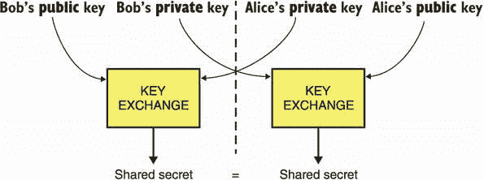

图 5.1 一个密钥交换提供以下接口：它采用你的对等方的公钥和你的私钥生成一个共享密钥。你的对等方可以通过使用你的公钥和他们自己的私钥获得相同的共享密钥。

从高层次了解密钥交换的工作原理后，我们现在可以回到我们的初始情景，看看这如何帮助。通过以密钥交换开始他们的通信，Alice 和 Bob 生成了一个共享的密钥，用作身份验证加密原语的密钥。因为任何观察交换的中间人（MITM）对手都无法推导出相同的共享密钥，他们将无法解密通信。我在图 5.2 中说明了这一点。

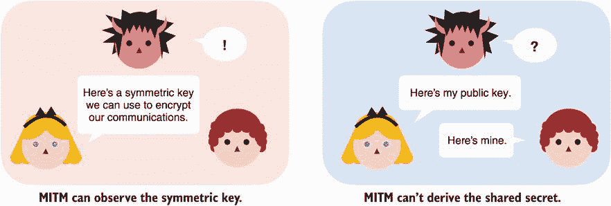

图 5.2 两个参与者之间的密钥交换使他们能够就一个密钥达成一致，而中间人（MITM）对手无法通过被动观察密钥交换来推导出相同的密钥。

请注意，这里的 MITM 是被动的；一个*主动的*MITM 将没有问题拦截密钥交换并冒充双方。在这种攻击中，Alice 和 Bob 实际上将与 MITM 执行密钥交换，都认为他们已经就密钥达成了一致。之所以可能是因为我们的任何一个角色都没有办法验证他们收到的公钥真正属于谁。这个密钥交换是*未经身份验证*的！我在图 5.3 中说明了这次攻击。

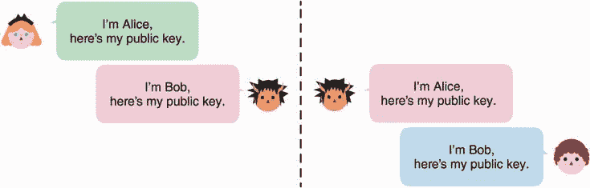

图 5.3 一个未经身份验证的密钥交换容易受到主动的中间人攻击。事实上，攻击者可以简单地冒充连接的双方并执行两次单独的密钥交换。

让我们看一个不同的情景来激发*经过身份验证的密钥交换*。想象一下，你想运行一个给你提供当天时间的服务。然而，你不希望这个信息被中间人攻击者修改。你最好的选择是使用你在第三章学到的消息认证码（MACs）对你的响应进行身份验证。由于 MACs 需要一个密钥，你可以简单地生成一个并手动与所有用户共享。但是，现在任何用户都拥有与其他用户一起使用的 MAC 密钥，并且可能有一天会利用它对其他人执行前面讨论的 MITM 攻击。你可以为每个用户设置不同的密钥，但这也不理想。对于想要连接到你的服务的每个新用户，你都需要手动为你的服务和用户提供一个新的 MAC 密钥。如果服务器端不需要做任何事情就好多了，是不是？

密钥交换可以在这里发挥作用！你可以做的是让你的服务生成一个密钥交换密钥对，并向服务的任何新用户提供服务的公钥。这被称为*身份验证密钥交换*；你的用户知道服务器的公钥，因此，主动的中间人对手无法冒充该密钥交换的一方。然而，一个恶意的人可以做的是执行他们自己的密钥交换（因为连接的客户端未经身份验证）。顺便说一句，当双方都经过身份验证时，我们称之为*双向身份验证密钥交换*。

这种情况非常普遍，密钥交换原语使其能够随着用户数量的增加而扩展得很好。但是，如果服务数量也增加，这种情况就不容易扩展！互联网就是一个很好的例子。我们有许多浏览器试图与许多网站进行安全通信。想象一下，如果你不得不在浏览器中硬编码你可能有一天会访问的所有网站的公钥，以及当更多的网站上线时会发生什么？

虽然密钥交换很有用，但在没有姊妹原语——*数字签名*的情况下，并不是所有情况下都能很好地扩展。不过这只是一个引子。在第七章中，你将了解到有关这种新的密码原语以及它如何帮助系统中的信任扩展的信息。密钥交换在实践中很少直接使用。它们通常只是更复杂协议的组成部分。话虽如此，在某些情况下它们仍然可以是有用的（例如，正如我们之前对抗被动对手时看到的）。

现在让我们看看在实践中如何*使用*密钥交换密码原语。libsodium 是最知名和广泛使用的 C/C++ 库之一。以下示例显示了在实践中如何使用 libsodium 来执行密钥交换。

5.1 C 语言中的密钥交换示例

```py
unsigned char client_pk[crypto_kx_PUBLICKEYBYTES];                ❶
unsigned char client_sk[crypto_kx_SECRETKEYBYTES];                ❶
crypto_kx_keypair(client_pk, client_sk);                          ❶

unsigned char server_pk[crypto_kx_PUBLICKEYBYTES];                ❷
obtain(server_pk);                                                ❷

unsigned char decrypt_key[crypto_kx_SESSIONKEYBYTES];             ❸
unsigned char encrypt_key[crypto_kx_SESSIONKEYBYTES];             ❸

if (crypto_kx_client_session_keys(decrypt_key, encrypt_key,
    client_pk, client_sk, server_pk) != 0) {                      ❹
    abort_session();                                              ❺
}
```

❶ 生成客户端的密钥对

❷ 我们假设我们有一种获取服务器公钥的方式。

❸ libsodium 根据最佳实践派生两个对称密钥，而不是一个；每个密钥用于加密单个方向。

❹ 我们使用我们的秘密密钥和服务器的公钥进行密钥交换。

❺ 如果公钥格式错误，则函数返回错误。

libsodium 将许多细节隐藏在开发者之外，同时还公开了安全可用的接口。在这种情况下，libsodium 使用 *X25519 密钥交换算法*，你将在本章后面更多了解这个算法。在本章的其余部分，你将了解有关密钥交换的不同标准以及它们在幕后的工作原理。

## 5.2 Diffie-Hellman（DH）密钥交换

1976 年，Whitfield Diffie 和 Martin E. Hellman 发表了题为“密码学的新方向”的关键论文，介绍了 Diffie-Hellman（DH）密钥交换算法。多么响亮的标题啊！DH 是第一个发明的密钥交换算法，也是第一个公钥加密算法的正式化之一。在本节中，我将阐述该算法的数学基础，解释其工作原理，并最终讨论规定如何在加密应用中使用它的标准。

### 5.2.1 群论

DH 密钥交换建立在一种称为*群论*的数学领域之上，这是当今大多数公钥加密的基础。因此，在本章中，我将花一些时间向你介绍群论的基础知识。我将尽力提供有关这些算法如何工作的深入见解，但无论如何，这都将涉及到一些数学。

让我们从一个显而易见的问题开始：什么是*群*？它有两个方面：

+   一组元素

+   在这些元素上定义的特殊二元运算（例如 + 或 ×）

如果集合和运算能够满足一些属性，那么我们就有了一个群。如果我们有一个群，那么我们就可以做出神奇的事情......（稍后详述）。注意，DH 工作在一个*乘法群*中：一种使用乘法作为定义的二元运算的群。由于这一点，其余的解释使用乘法群作为示例。我也经常省略乘号符号（例如，我会将 *a* × *b* 写成 *ab*）。

我需要在这里更加具体。为了使集合及其运算成为一个群，它们需要具有以下特性。（和往常一样，我会在图 5.4 中以更加视觉化的方式来说明这些特性，以提供更多材料来理解这个新概念。）

+   *封闭性*——对两个元素进行操作会得到同一集合的另一个元素。例如，对于群的两个元素 *a* 和 *b*，*a* × *b* 会得到另一个群元素。

+   *结合性*——同时对几个元素进行操作可以按任意顺序进行。例如，对于群的三个元素 *a*、*b* 和 *c*，那么 *a*(*bc*) 和 (*ab*)*c* 会得到相同的群元素。

+   *单位元素*——与此元素进行运算不会改变另一个操作数的结果。例如，我们可以在我们的乘法群中将单位元素定义为 1。对于任何群元素 *a*，我们有 *a* × 1 = *a*。

+   *逆元素*——存在一个逆元素与所有群元素相对应。例如，对于任何群元素 *a*，都存在一个逆元素 *a*^(–1)（也写作 1/*a*），使得 *a* × *a*^(–1) = 1（也写作 *a* × 1/*a* = 1）。

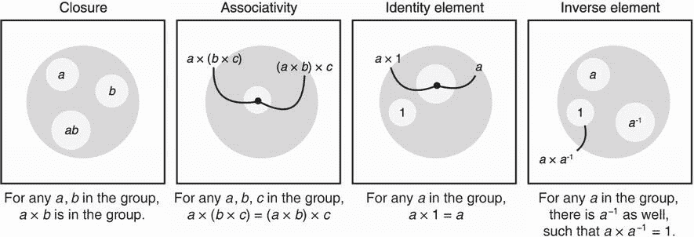

图 5.4 群的四个属性：封闭性、结合性、单位元素和逆元素。

我可以想象我对群的解释可能有点抽象，所以让我们看看 DH 在实践中使用的群是什么。首先，DH 使用由严格正整数集合组成的群：1、2、3、4、····、*p* – 1，其中 *p* 是素数，1 是单位元素。不同的标准为 *p* 指定不同的数字，但直观地说，它必须是一个大素数，以确保群的安全性。

素数

*素数* 是只能被 1 或它本身整除的数字。前几个素数是 2、3、5、7、11 等等。素数在非对称密码学中随处可见！而且，幸运的是，我们有高效的算法来找到大素数。为了加快速度，大多数密码库会寻找*伪素数*（有很高概率是素数的数字）。有趣的是，此类优化在过去几次被打破过；最臭名昭著的一次发生在 2017 年，当时 ROCA 漏洞发现了超过一百万台设备为其密码应用生成了不正确的素数。

第二，DH 使用 *模乘法* 作为一种特殊操作。在我解释模乘法是什么之前，我需要解释什么是 *模算术*。直观地说，模算术是关于在达到一个称为*模数*的某个数后“环绕”的数字。例如，如果我们将模数设置为 5，我们说超过 5 的数字回到 1；例如，6 变成 1，7 变成 2，依此类推。（我们也将 5 记为 0，但因为它不在我们的乘法群中，所以我们不太在乎它。）

表达模算术的数学方式是取一个数与其模数的*欧几里得除法*的余数。让我们以数字 7 为例，并将其与 5 进行欧几里得除法得到 7 = 5 × 1 + 2。注意余数为 2。然后我们说 7 = 2 mod 5（有时写成 7 ≡ 2 (mod 5)）。这个方程可以读作 7 对模 5 同余于 2。同样地

+   8 = 1 mod 7

+   54 = 2 mod 13

+   170 = 0 mod 17

+   等等

描绘这样一个概念的传统方式是用时钟。图 5.5 说明了这个概念。

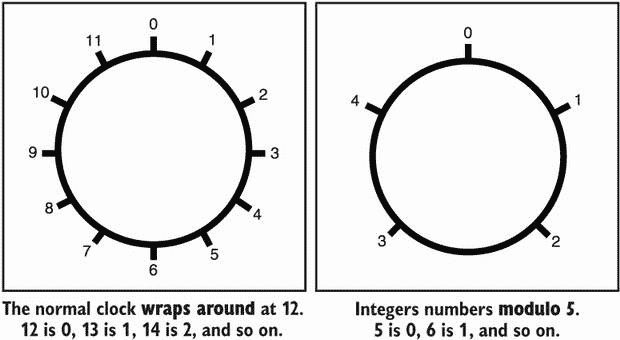

图 5.5 整数模素数 5 的群可以被描绘成一个时钟，在数字 4 之后重新归零。因此 5 被表示为 0，6 被表示为 1，7 被表示为 2，8 被表示为 3，9 被表示为 4，10 被表示为 0，依此类推。

在这样一组数字上定义模乘法是相当自然的。让我们以以下乘法为例：

3 × 2 = 6

根据你之前学到的知识，你知道 6 对模 5 同余于 1，因此方程可以重写为：

3 × 2 = 1 mod 5

相当直接，是吗？请注意，前一个方程告诉我们 3 是 2 的倒数，反之亦然。我们也可以写成以下形式：

3^(–1) = 2 mod 5

当上下文清晰时，方程中的模数部分（此处为 mod 5）通常会被省略。所以如果我在这本书中有时省略了它，请不要感到惊讶。

注 事实上，当我们使用素数模下的正数时，只有*零*元素缺乏逆元。（确实，你能找到一个元素 *b* 使得 0 × *b* = 1 mod 5 吗？）这就是为什么我们不将零包含在群的元素中的原因。

好的，现在我们有了一个组，其中包括严格正整数 1、2、···、*p* – 1，*p* 是一个素数，以及模乘法。我们形成的组也恰好是两者：

+   *交换性*——操作的顺序不重要。例如，给定两个群元素 *a* 和 *b*，则 *ab* = *ba*。具有此属性的群通常被称为*伽罗瓦群*。

+   *有限域*——具有更多属性的伽罗瓦群，以及一个额外的运算（在我们的例子中，我们也可以将数字相加）。

由于最后一点，DH 定义在这种类型的群上有时被称为*有限域 Diffie-Hellman*（FFDH）。如果你理解什么是群（并确保在继续阅读之前理解），那么*子群*只是原始群中包含的一个群。也就是说，它是群元素的子集。在子群元素上操作会产生另一个子群元素，并且每个子群元素在子群中都有一个逆元素，等等。

*循环子群*是可以从单个*生成器*（或*基数*）生成的子群。生成器通过反复相乘来生成循环子群。例如，生成器 4 定义了由数字 1 和 4 组成的子群：

+   4 mod 5 = 4

+   4 × 4 mod 5 = 1

+   4 × 4 × 4 mod 5 = 4（我们从头开始）

+   4 × 4 × 4 × 4 mod 5 = 1

+   以此类推

注意  我们也可以将 4 × 4 × 4 写为 43。

恰好当我们的模数是素数时，我们群中的每个元素都是一个子群的生成器。这些不同的子群可以有不同的大小，我们称之为*阶*。我在图 5.6 中进行了说明。

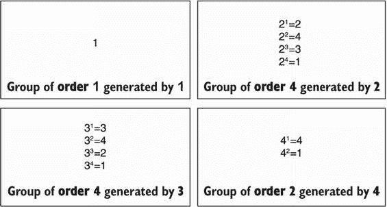

图 5.6 不同的模 5 乘法群的子群。这些都包括数字 1（称为*单位元素*）并且具有不同的阶（元素数量）。

好了，现在你明白了

+   一个群是一组具有二元运算的数字集合，遵守一些性质（封闭性，结合性，单位元素，逆元素）。

+   DH 在 Galois 群（一个具有交换性的群）中运行，由严格正数组成，直到一个素数（不包括在内）和模乘法形成。

+   在 DH 群中，每个元素都是一个子群的生成器。

群是大量不同加密原语的中心。如果你想要理解其他加密原语的工作原理，对群论有良好的直觉是很重要的。

### 5.2.2 离散对数问题：Diffie-Hellman 的基础

DH 密钥交换的安全性依赖于群中的*离散对数问题*，这是一个被认为难以解决的问题。在本节中，我简要介绍这个问题。

想象一下，我拿一个生成器，比如说 3，然后给你一个它可以生成的随机元素，比如说 2 = 3^x mod 5，其中*x*对你来说是未知的。问你“*x*是多少？”就等同于让你找到基于 3 的 2 的离散对数。因此，在我们的群中，离散对数问题就是找出我们将生成器与自身相乘多少次才能产生给定的群元素。这是一个重要的概念！在继续之前花几分钟思考一下。

在我们的示例群中，你可以快速发现答案是 3（确实，3³ = 2 mod 5）。但是，如果我们选择一个比 5 大得多的素数，事情就变得复杂得多：变得难以解决。这就是 Diffie-Hellman 背后的秘密。现在你已经了解如何在 DH 中生成密钥对了：

1.  所有参与者都必须就一个大素数 *p* 和一个生成器 *g* 达成一致。

1.  每个参与者都生成一个随机数 *x*，这个数就成了他们的私钥。

1.  每个参与者都根据 *g*^x mod *p* 推导出他们的公钥。

离散对数问题的“困难”意味着没有人应该能够从公钥中恢复出私钥。我在图 5.7 中进行了说明。

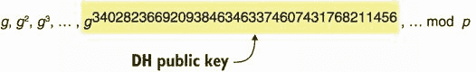

图 5.7 在 Diffie-Hellman 中选择私钥就像在生成器 *g* 产生的数字列表中选择索引一样。离散对数问题就是仅凭数字找到索引的问题。

尽管我们有算法来计算离散对数，但在实践中它们并不高效。另一方面，如果我给你问题的解 *x*，你就可以利用你手头上非常高效的算法来验证，确实我给你的是正确的解：*g*^x mod *p*。如果你感兴趣，计算模幂的最先进技术被称为“平方乘”。它通过逐位地遍历 *x* 来高效地计算结果。

注意就像密码学中的一切一样，仅仅通过猜测来找到解决方案是*不可能*的。然而，通过选择足够大的参数（在这里，一个大素数），可以将寻找解决方案的效果降低到可以忽略的几率。这意味着即使经过数百年的随机尝试，你找到解决方案的几率仍然在统计上接近于零。

很好。我们如何利用所有这些数学知识来进行 DH 密钥交换算法呢？想象一下

+   Alice 有一个私钥 *a* 和一个公钥 *A* = *g*^a mod *p*。

+   Bob 有一个私钥 *b* 和一个公钥 *B* = *g*^b mod *p*。

借助 Bob 的公钥，Alice 可以计算出共享秘密 *B*^a mod *p*。Bob 也可以利用 Alice 的公钥和他自己的私钥进行类似的计算：*A*^b mod *p*。自然地，我们可以看到这两个计算最终得到的结果是相同的：

*B*^a = (*g*^b)^a = *g*^(ab) = (*g*^a)^b = *A*^b mod *p*

这就是 DH 的魔力。从外部人士的角度来看，仅观察公钥 *A* 和 *B* 并不能以任何方式计算出密钥交换的结果 *g*^(ab) mod *p*。接下来，你将了解到现实世界的应用是如何利用这个算法以及存在的不同标准的。

计算和决策 Diffie-Hellman

顺便说一句，在理论密码学中，观察*g*^a mod *p*和*g*^b mod *p*并不会帮助你计算*g*^(ab) mod *p*的想法被称为*计算 Diffie-Hellman 假设*（CDH）。它经常与更强的*决策 Diffie-Hellman 假设*（DDH）混淆，直观地说明了在给定*g*^a mod *p*，*g*^b mod *p*和*z* mod *p*的情况下，没有人应该能够自信地猜测后者是否是两个公钥之间的密钥交换结果（*g*^(ab) mod *p*）还是组中的随机元素。这两者都是有用的理论假设，已被用于构建密码学中的许多不同算法。

### 5.2.3 Diffie-Hellman 标准

现在您已经了解了 DH 的工作原理，您可以理解参与者需要在一组参数上达成一致，具体来说是质数*p*和生成器*g*。在本节中，您将了解现实世界应用是如何选择这些参数以及存在的不同标准的。

首先是质数*p*。正如我之前所述，数字越大，效果越好。因为 DH 基于离散对数问题，其安全性与该问题已知的最佳攻击直接相关。该领域的任何进展都可能削弱算法。随着时间的推移，我们成功地对这些进展的速度（或缓慢程度）以及足够的安全性有了相当好的了解。目前已知的最佳实践是使用 2048 位的质数。

注意 一般来说，[`keylength.com`](https://keylength.com) 总结了常见加密算法的参数长度建议。结果来自研究组织或政府机构（如法国国家信息安全局（ANSSI）、美国国家标准与技术研究所（NIST）和德国联邦信息安全办公室（BSI））发布的权威文件。虽然它们并不总是一致，但它们通常会趋于类似数量级。

在过去，许多库和软件通常会生成和硬编码自己的参数。不幸的是，有时会发现它们要么是薄弱的，要么更糟，完全是破碎的。在 2016 年，有人发现了 Socat，一个流行的命令行工具，一年前已经使用了一个损坏的默认 DH 组，这就引发了一个问题，这是一个错误还是一个有意的后门。使用标准化的 DH 组可能看起来像一个更好的主意，但是 DH 是不幸的反例之一。在 Socat 问题发生几个月后，安东尼奥·桑索（Antonio Sanso）在阅读 RFC 5114 时发现，该标准也指定了损坏的 DH 组。

由于所有这些问题，更新的协议和库已经趋于要么弃用 DH 以支持椭圆曲线 Diffie-Hellman（ECDH），要么使用更好的标准 RFC 7919（[`www.rfc-editor.org/info/rfc7919`](https://www.rfc-editor.org/info/rfc7919)）定义的群。因此，现在的最佳实践是使用 RFC 7919，它定义了几种不同大小和安全性的群。例如，ffdhe2048 是由 2,048 位素数模定义的群：

*p*   =  3231700607131100730015351347782516336248805713348907517458843413926980683413621000279205636264016468

54585563579353308169288290230805734726252735547424612457410262025279165729728627063003252634282131457669

31414223654220941111348629991657478268034230553086349050635557712219187890332729569696129743856241741236

23722519734640269185579776797682301462539793305801522685873076119753243646747585546071504389684494036613

04976978128542959586595975670512838521327844685229255045682728791137200989318739591433741758378260002780

34973198552060607533234122603254684088120031105907484281003994966956119696956248629032338072839127039

以及生成器*g* = 2

注意 选择生成器的数字 2 是很常见的，因为计算机在使用简单的左移（`<<`）指令与 2 相乘时非常高效。

群大小（或*order*）也被指定为*q* = (*p* – 1)/2。这意味着私钥和公钥在大小上都会在 2,048 位左右。实际上，对于密钥来说，这些都是相当大的尺寸（例如，与通常为 128 位长的对称密钥相比）。您将在下一节中看到，通过定义椭圆曲线上的群，我们可以在相同的安全性下获得更小的密钥。

## 5.3 椭圆曲线 Diffie-Hellman（ECDH）密钥交换

结果证明，我们刚刚讨论的 DH 算法可以在不同类型的群中实现，而不仅仅是模素数的乘法群。事实证明，一个群可以由数学中研究的一种曲线——椭圆曲线构成。这个想法是由 Neal Koblitz 和 Victor S. Miller 在 1985 年独立提出的，而在 2000 年，当基于椭圆曲线的加密算法开始标准化时，这个想法得到了采纳。

应用密码学领域很快就采用了椭圆曲线密码学，因为它提供的密钥比上一代公钥密码学要小得多。与 DH 中建议的 2,048 位参数相比，椭圆曲线变体算法可以使用 256 位的参数。

### 5.3.1 什么是椭圆曲线？

现在让我们解释一下椭圆曲线是如何工作的。首先，首要的是要理解椭圆曲线只是曲线！这意味着它们由解方程的所有坐标*x*和*y*定义。具体来说，这个方程

*y*² + *a*[1]*xy* + *a*[3]*y* = *x*³ + *a*[2]*x*² + *a*[4]*x* + *a*[6]

对于一些*a*[1]、*a*[2]、*a*[3]、*a*[4]和*a*[6]。注意，对于今天的大多数实用曲线，这个方程可以简化为*短 Weierstrass 方程*：

*y*² = *x*³ + *ax* + *b*（其中 4*a*³ + 27*b*² ≠ 0）

虽然对于两种类型的曲线（称为*二进制曲线*和*特征 3 的曲线*），这种简化是不可能的，但这些曲线的使用频率很低，因此在本章的其余部分中我们将使用 Weierstrass 形式。图 5.8 显示了一个随机选取两个点的椭圆曲线示例。

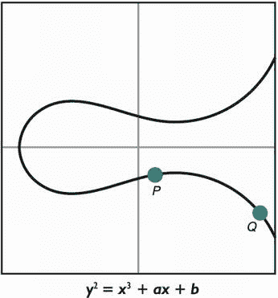

图 5.8 一个由方程定义的椭圆曲线示例。

在椭圆曲线的历史上的某个时候，人们发现可以在其上构建一个*群*。从那时起，在这些群上实现 DH 就变得简单了。我将利用这一节来解释椭圆曲线密码学背后的直觉。

椭圆曲线上的群通常被定义为*加法群*。与前一节中定义的乘法群不同，这里使用的是+号。

注意 在实践中，使用加法或乘法都没有太大关系，这只是一种偏好。虽然大多数密码学使用乘法符号，但围绕椭圆曲线的文献更倾向于使用加法符号，因此，在本书中提及椭圆曲线群时，我将使用这种表示法。

这一次，我会在定义群的元素之前定义操作。我们的*加法操作*定义如下。图 5.9 说明了这个过程。

1.  画一条穿过你想要相加的两个点的直线。这条直线在曲线上又碰到另一个点。

1.  从这个新找到的点画一条垂直线。垂直线在曲线上又碰到另一个点。

1.  这一点是将原始两点相加的结果。

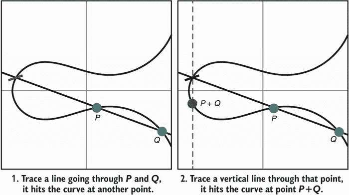

图 5.9 通过几何方法可以在椭圆曲线的点上定义加法操作。

有两种特殊情况，这个规则不适用。我们也定义一下这两种情况：

+   *我们如何将一个点加到自身？*答案是画出该点的切线（而不是在两点之间画一条线）。

+   *如果我们在第 1 步（或第 2 步）画的线不在曲线上碰到任何其他点会发生什么？*嗯，这很尴尬，我们需要这种特殊情况来产生一个结果。解决方案是将结果定义为一个虚构的点（我们自己编造的）。这个新发明的点称为*无穷远点*（通常用大写字母*O*表示）。图 5.10 说明了这些特殊情况。

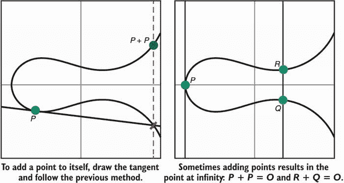

图 5.10 在图 5.9 的基础上构建，当将一个点与自身相加或当两个点相互抵消以得到无穷远点（*O*）时，也定义了在椭圆曲线上的加法。

我知道这个无穷点有些超级奇怪，但不要太担心。它实际上只是我们为了使加法运算有效而想出来的东西。哦，顺便说一下，它的行为就像一个零，它是我们的恒等元素：

*O* + *O* = *O*

对于曲线上的任意点*P*

*P* + *O* = *P*

一切都很好。到目前为止，我们看到要在椭圆曲线上创建一个群，我们需要

+   定义一组有效点的椭圆曲线方程。

+   在这个集合中定义加法的定义。

+   一个称为无穷点的虚拟点。

我知道这是很多需要理解的信息，但我们还缺少最后一点。椭圆曲线密码学利用之前讨论过的在*有限域*上定义的一种群类型。在实践中，这意味着我们的坐标是数字 1、2、···、*p* – 1，其中*p*是某个大素数。这应该听起来很熟悉！因此，当考虑椭圆曲线密码学时，您应该想象一个图形，它看起来更像图 5.11 右侧的图形。


图 5.11 椭圆曲线密码学（ECC）在实践中，主要是通过模一个大素数*p*的坐标椭圆曲线来指定。这意味着在密码学中使用的内容更像右图而不是左图。

就是这样！我们现在有了一个可以进行密码学运算的群，就像我们之前使用的是模一个素数的数字（排除 0）和 Diffie-Hellman 的乘法运算一样。我们如何在椭圆曲线上定义的这个群上进行 Diffie-Hellman 呢？现在让我们来看看在这个群中*离散对数*是如何工作的。

让我们取一个点*G*，并将其加上自身*x*次以通过我们定义的加法操作产生另一个点*P*。我们可以写成*P* = *G* + ··· + *G*（*x*次）或者使用一些数学上的糖来写成*P* = [*x*]*G*，读作*x*倍的*G*。椭圆曲线离散对数问题（ECDLP）就是要从仅知道*P*和*G*的情况下找到数字*x*。

注释 我们将[*x*]*G*标量乘法称为在这种群中通常称为标量的*x*。

### 5.3.2 椭圆曲线 Diffie-Hellman（ECDH）密钥交换如何工作？

现在我们在椭圆曲线上构建了一个群，我们可以在其上实例化相同的 Diffie-Hellman 密钥交换算法。要在 ECDH 中生成密钥对：

1.  所有参与者都同意一个椭圆曲线方程，一个有限域（很可能是一个素数），以及一个生成元*G*（在椭圆曲线密码学中通常称为*基点*）。

1.  每个参与者生成一个随机数*x*，这个随机数成为他们的私钥。

1.  每个参与者将他们的公钥派生为[*x*]*G*。

因为椭圆曲线离散对数问题很困难，你猜对了，没有人应该能够仅仅通过查看你的公钥就恢复出你的私钥。我在图 5.12 中有例证。

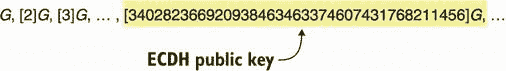

图 5.12 在 ECDH 中选择一个私钥就像在由生成器（或基点）*G* 产生的数字列表中选择一个索引一样。椭圆曲线离散对数问题（ECDLP）是仅通过数字找到索引。

所有这些可能有点令人困惑，因为我们为 DH 群定义的操作是乘法，而对于椭圆曲线，我们现在使用加法。再次强调，这些区别完全不重要，因为它们是等价的。您可以在图 5.13 中看到比较。

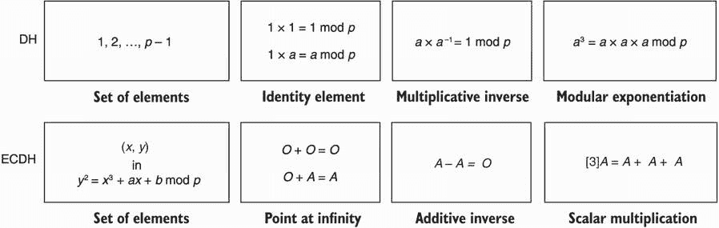

图 5.13 比较了在 Diffie-Hellman 中使用的群与在椭圆曲线 Diffie-Hellman（ECDH）中使用的群。

现在你应该相信，对于密码学来说唯一重要的是我们有一个定义了操作的群，并且该群的离散对数是困难的。为了完整起见，图 5.14 展示了我们所见过的两种类型群中离散对数问题的差异。

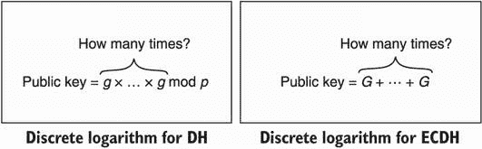

图 5.14 在大质数模下的离散对数问题与椭圆曲线密码学（ECC）中的离散对数问题的比较。它们都与 DH 密钥交换有关，因为问题是从公钥中找到私钥。

对于理论的最后一点说明，我们在椭圆曲线之上形成的群与我们在严格正整数模素数之上形成的群不同。由于一些差异，已知的对 DH 的最强攻击（称为*索引演算法*或*数域筛*攻击）在椭圆曲线群上并不起作用。这是为什么 ECDH 的参数可以远远低于相同安全级别下 DH 的参数的主要原因。

好了，我们已经结束了理论部分。让我们回到定义 ECDH。想象一下

+   Alice 有一个私钥 *a* 和一个公钥 *A* = [*a*]*G*。

+   Bob 有一个私钥 *b* 和一个公钥 *B* = [*b*]*G*。

拥有 Bob 的公钥知识后，Alice 可以计算出共享密钥为 [*a*]*B*。Bob 可以用 Alice 的公钥和他自己的私钥进行类似的计算：[*b*]*A*。自然地，我们可以看到这两个计算最终得到相同的数字：

[*a*]*B* = [*a*][*b*]*G* = [*ab*]*G* = [*b*][*a*]*G* = [*b*]*A*

没有被动的对手应该能够仅通过观察公钥来推导出共享点。听起来很熟悉，对吧？接下来，让我们谈谈标准。

### 5.3.3 椭圆曲线 Diffie-Hellman 的标准

*自 1985 年首次提出以来，椭圆曲线密码学一直保持着它的完整性。[...] 美国、英国、加拿大和某些其他北约国家都已经采用了某种形式的椭圆曲线密码学来保护政府之间和之内的机密信息*。

—NSA（《椭圆曲线密码学的理由》，2005 年）

ECDH 的标准化过程相当混乱。许多标准化机构努力指定许多不同的曲线，然后引发了许多关于哪个曲线更安全或更高效的争论。由 Daniel J. Bernstein 领导的大量研究指出了 NIST 标准化的一些曲线可能属于 NSA 所知的更弱的曲线类别。

*我不再相信这些常数。我相信美国国家安全局通过与行业的关系来操纵它们*。

——Bruce Schneier（“美国国家安全局正在破解互联网上的大多数加密”，2013）

如今，大多数使用的曲线都来自一对标准，大多数应用都固定在两条曲线上：P-256 和 Curve25519。在本节的其余部分，我将介绍这些曲线。

NIST FIPS 186-4，“数字签名标准”，最初作为 2000 年签名的标准发布，其中包含一个附录，指定了 15 个用于 ECDH 的曲线。其中一条曲线，P-256，在互联网上是最广泛使用的曲线。该曲线还在 2010 年以不同名称 secp256r1 发布的 “高效密码标准” (SEC) 2，v2 中指定。P-256 使用短 Weierstrass 方程定义：

*y*² = *x*³ + *ax* + *b* mod *p*

其中 *a* = –3，而

*b* = 41058363725152142129326129780047268409114441015993725554835256314039467401291

和

*p* = 2²⁵⁶ – 2²²⁴ + 2¹⁹² + 2⁹⁶ – 1

这定义了一个素数阶的曲线：

*n* = 115792089210356248762697446949407573529996955224135760342422259061068512044369

这意味着曲线上确切有 *n* 个点（包括无穷远处的点）。基点被指定为

*G* = (48439561293906451759052585252797914202762949526041747995844080717082404635286, 36134250956749795798585127919587881956611106672985015071877198253568414405109)

该曲线提供了 128 位的安全性。对于使用其他提供 256 位安全性而不是 128 位安全性的密码算法（例如，具有 256 位密钥的 AES）的应用程序，同样标准中还提供了 P-521，以匹配安全级别。

我们能相信 P-256 吗？

有趣的是，FIPS 186-4 中定义的 P-256 和其他曲线据说是从一个 *seed* 生成的。对于 P-256，种子已知为字节字符串

0xc49d360886e704936a6678e1139d26b7819f7e90

我之前谈过“什么都没有藏在我袖子里”的概念——旨在证明算法设计没有后门的常数。不幸的是，除了指定沿曲线参数的事实之外，对 P-256 种子几乎没有解释。

RFC 7748，“用于安全的椭圆曲线”，于 2016 年发布，规定了两个曲线：Curve25519 和 Curve448。Curve25519 提供了大约 128 位的安全性，而 Curve448 则提供了大约 224 位的安全性，用于协议希望对椭圆曲线的攻击潜力进行防范。我这里只会谈论 Curve25519，它是由以下方程定义的蒙哥马利曲线：

*y*² = *x*³ + 486662 *x*² + *x* mod *p*，其中 *p* = 2²⁵⁵ – 19

Curve25519 的阶数为

*n* = 2²⁵² + 27742317777372353535851937790883648493

使用的基点为

*G* = (9, 14781619447589544791020593568409986887264606134616475288964881837755586237401)

ECDH 与 Curve25519 的结合常被称为 *X25519*。

## 5.4 小子群攻击和其他安全考虑

今天，*我建议您使用 ECDH 而不是 DH*，原因是密钥的大小、已知强攻击的缺乏、可用实现的质量，以及椭圆曲线的固定性和良好的标准化（与 DH 群相反，后者随处可见）。后者一点非常重要！使用 DH 可能意味着使用破损的标准（如前面提到的 RFC 5114），过于松散的协议（许多协议，如较旧版本的 TLS，不强制使用什么样的 DH 群），使用破损的自定义 DH 群的软件（前面提到的 socat 问题），等等。

如果您确实必须使用 Diffie-Hellman，请确保*遵循标准*。我之前提到的标准使用安全素数作为模数：形式为 *p* = 2*q* + 1 的素数，其中 *q* 是另一个素数。关键是，这种形式的群只有两个子群：大小为 2 的小子群（由–1 生成）和大小为 *q* 的大子群。（顺便说一句，这是您能得到的最好的结果；在 DH 中不存在素数阶群。）小子群的稀缺性防止了一种被称为*小子群攻击*的攻击（稍后详细说明）。安全素数创建了安全群，因为有两个因素：

+   模素数 *p* 的乘法群的阶数计算为 p – 1。

+   一个群的子群的阶数是该群的阶数的因数（这就是拉格朗日定理）。

因此，我们模素数的乘法群的阶数是 *p* – 1 = (2*q* + 1) – 1 = 2*q*，它的因数为 2 和 *q*，这意味着它的子群只能是阶数为 2 或 *q* 的子群。在这样的群中，小子群攻击是不可能的，因为没有足够的小子群。*小子群攻击* 是一种针对密钥交换的攻击，攻击者会逐渐发送几个无效的公钥来逐渐泄漏您的私钥的位，而无效的公钥是小子群的生成器。

例如，攻击者可以选择–1（大小为 2 的子群的生成器）作为公钥，并将其发送给你。通过执行你的密钥交换部分，结果的共享密钥是小子群的一个元素（–1 或 1）。这是因为你只是将小子群的生成器（攻击者的公钥）提升到你的私钥的幂。根据你对共享密钥的处理方式，攻击者可以猜测它是什么，并泄露关于你的私钥的一些信息。

对于我们恶意公钥的示例，如果你的私钥是偶数，则共享密钥将为 1，如果你的私钥是奇数，则共享密钥将为–1。因此，攻击者了解了一个信息位：你的私钥的最低有效位。许多不同大小的子群可以导致攻击者有更多机会了解你的私钥，直到整个密钥被恢复。我在图 5.15 中说明了这个问题。

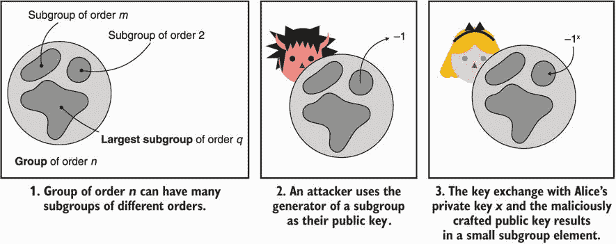

图 5.15 小子群攻击影响具有许多子群的 DH 群。通过选择小子群的生成器作为公钥，攻击者可以逐渐泄露某人的私钥的位。

虽然始终验证接收到的公钥是否位于正确的子群中是一个好主意，但并不是所有的实现都这样做。2016 年，一组研究人员分析了 20 种不同的 DH 实现，并发现没有一个在验证公钥（参见 Valenta 等人的“Measuring small subgroup attacks against Diffie-Hellman”）。确保你正在使用的 DH 实现是这样做的！你可以通过将公钥提升到子群的阶，如果它是该子群的元素，那么应该返回恒等元。

另一方面，椭圆曲线允许素数阶的群。也就是说，它们没有小子群（除了由恒等元素生成的大小为 1 的子群），因此它们对小子群攻击是安全的。好吧，不要那么快……在 2000 年，Biehl、Meyer 和 Muller 发现即使在这样的素数阶椭圆曲线群中，也可能发生小子群攻击，原因是一种被称为*无效曲线攻击*的攻击。

无效曲线攻击背后的思想是这样的。首先，为了实现使用短 Weierstrass 方程*y*² = *x*³ + *ax* + *b*（如 NIST 的 P-256）的椭圆曲线的标量乘法，与变量*b*无关。这意味着攻击者可以找到具有相同方程的不同曲线，除了值*b*之外，其中一些曲线将具有许多小的子群。你可能知道这将导致什么：攻击者选择另一个曲线中具有小子群的点，并将其发送到目标服务器。服务器通过对给定点执行标量乘法来继续进行密钥交换，从而有效地在不同的曲线上进行密钥交换。这个技巧最终重新启用了小子群攻击，即使在素数阶曲线上也是如此。

修复这个问题的明显方法是再次验证公钥。这可以通过检查公钥不是无穷远点，并将接收到的坐标插入曲线方程中来轻松完成。看看它是否描述了定义曲线上的一个点。不幸的是，在 2015 年，Jager、Schwenk 和 Somorovsky 在“Practical Invalid Curve Attacks on TLS-ECDH”中展示了几个流行实现没有执行这些检查。如果使用 ECDH，我建议你使用 X25519 密钥交换，因为它考虑了无效曲线攻击，可用实现的质量以及设计上对抗时序攻击的抵抗力。

Curve25519 有一个警告，即它不是一个素数阶群。该曲线有两个子群：一个大小为 8 的小子群和一个用于 ECDH 的大子群。此外，原始设计没有规定验证接收到的点，并且库也没有实现这些检查。这导致在使用原语的不同类型协议中发现问题。 （其中一个我在 Matrix 消息协议中发现的问题，在第十一章中有讨论。）

不验证公钥可能会导致与 X25519 不符合预期的行为。原因在于密钥交换算法没有*贡献行为*：它不允许双方共同为密钥交换的最终结果做出贡献。具体来说，参与者之一可以通过发送一个小子群中的点作为公钥，强制密钥交换的结果为全零。RFC 7748 确实提到了这个问题，并建议检查生成的共享秘钥不是全零输出，但让实现者决定是否进行检查！我建议确保你的实现执行这个检查，尽管除非你以非标准方式使用 X25519，否则不太可能遇到任何问题。

由于许多协议依赖于 Curve25519，这不仅仅是密钥交换的问题。*Ristretto*，即将成为 RFC 的互联网草案，是一种为 Curve25519 添加额外编码层的构造，有效模拟了一个素数阶曲线（参见 [`tools.ietf.org/html/draft-hdevalence-cfrg-ristretto-01`](https://tools.ietf.org/html/draft-hdevalence-cfrg-ristretto-01)）。这种构造已经开始受到关注，因为它简化了其他类型的加密原语对 Curve25519 的安全假设，但又希望得到素数阶域的好处。

## 概要

+   未经身份验证的密钥交换允许两方达成共享秘钥，同时阻止任何被动中间人攻击者能够推导出它。

+   身份验证的密钥交换阻止主动中间人攻击者冒充连接的一方，而双向身份验证的密钥交换阻止主动中间人攻击者冒充双方。

+   通过了解对方的公钥，可以执行经过身份验证的密钥交换，但这并不总是可扩展的，而签名将解锁更复杂的场景（见第七章）。

+   迪菲-赫尔曼（DH）是第一个发明的密钥交换算法，仍然被广泛使用。

+   用于 DH 的推荐标准是 RFC 7919，其中包括几个可供选择的参数。最小选项是推荐的 2,048 位素数参数。

+   椭圆曲线迪菲-赫尔曼（ECDH）的密钥尺寸比 DH 小得多。对于 128 位的安全性，DH 需要 2,048 位的参数，而 ECDH 只需要 256 位的参数。

+   ECDH 最广泛使用的曲线是 P-256 和 Curve25519。两者都提供 128 位的安全性。对于 256 位的安全性，同一标准中还提供了 P-521 和 Curve448。

+   确保实现验证你接收到的公钥的有效性，因为无效的密钥是许多错误的源头。
