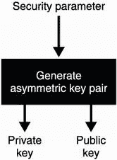

# 第六章：非对称加密和混合加密

本章内容包括

+   对秘密信息进行加密的非对称加密方法

+   对数据进行加密到公钥的混合加密方法

+   非对称和混合加密的标准

在第四章中，您了解到了认证加密，这是一种用于加密数据的加密原语，但受到对称性的限制（连接的两侧必须共享相同的密钥）。在本章中，我将通过介绍非对称加密来解除此限制，这是一种加密到其他人的密钥而无需知道密钥的原语。毫不奇怪，非对称加密利用密钥对，加密将使用公钥而不是对称密钥。

在本章的中间部分，您将看到非对称加密受其可以加密的数据量以及加密速率的限制。为了消除这一障碍，我将向您展示如何将非对称加密与认证加密混合在一起，形成我们所称的*混合加密*。让我们开始吧！

注意 对于本章，您需要已经阅读过第四章关于认证加密和第五章关于密钥交换。

## 6.1 什么是非对称加密？

了解如何加密消息的第一步是理解*非对称加密*（也称为*公钥加密*）。在本节中，您将了解此加密原语及其属性。让我们看一个以下真实场景：*加密电子邮件*。

您可能知道，您发送的所有电子邮件都是“明文”发送的，任何坐在您和您收件人的电子邮件提供商之间的人都可以阅读。这不太好。你该怎么解决这个问题？您可以使用像 AES-GCM 这样的加密原语，这是您在第四章学到的。为此，您需要为想要给您发消息的每个人设置一个不同的共享对称密钥。

练习

使用相同的共享密钥与所有人将非常糟糕；您能理解为什么吗？

但是您不能指望提前知道谁会给您发送消息，随着越来越多的人想要给您加密消息，生成和交换新的对称密钥会变得繁琐。这就是非对称加密的帮助所在，它允许拥有您公钥的任何人向您加密消息。此外，您是唯一能够使用您拥有的相关私钥解密这些消息的人。请参见图 6.1，了解非对称加密的示意图。


图 6.1 使用非对称加密，任何人都可以使用爱丽丝的公钥向她发送加密消息。只有拥有相关私钥的爱丽丝才能解密这些消息。

要设置非对称加密，首先需要通过某种算法生成一对密钥。与任何加密算法的设置函数一样，密钥生成算法接受一个安全参数。这个安全参数通常被翻译为“你想要多大的密钥？”更大意味着更安全。图 6.2 说明了这一步骤。



图 6.2 要使用非对称加密，首先需要生成一对密钥。根据您提供的安全参数，您可以生成不同安全强度的密钥。

*密钥生成算法*生成由两个不同部分组成的密钥对：公钥部分（如名称所示）可以在不太担心的情况下发布和共享，而私钥必须保持秘密。与其他加密原语的密钥生成算法类似，需要一个安全参数来决定算法的位安全性。然后任何人都可以使用公钥部分加密消息，您可以使用私钥部分解密，就像图 6.3 所示。与经过认证的解密类似，如果提供不一致的密文，解密可能会失败。


图 6.3 非对称加密允许使用接收者的公钥加密消息（*明文*）。接收者随后可以使用与先前使用的公钥相关的私钥使用不同的算法解密加密的消息（*密文*）。

请注意，到目前为止我们还没有讨论认证问题。考虑电线的两侧：

+   您正在使用您认为是 Alice 拥有的公钥进行加密。

+   Alice 并不确定是谁发送了这条消息。

现在，我们将假设我们以一种非常安全的方式获得了 Alice 的公钥。在涵盖数字签名的第七章中，您将了解现实世界协议如何解决这个实践中的引导问题。您还将在第七章中学习如何以加密方式向 Alice 传达您的真实身份。剧透警告：您将签署您的消息。

让我们继续下一节，您将了解非对称加密在实践中的应用（以及为什么在实践中很少直接使用）。

## 6.2 实践中的非对称加密和混合加密

您可能认为非对称加密可能足以开始加密您的电子邮件。实际上，由于它可以加密的消息长度受限，非对称加密相当受限。与对称加密相比，非对称加密和解密的速度也较慢。这是由于非对称构造实施数学运算，而对称原语通常只是操作位。

在本节中，你将了解这些限制，实际上非对称加密用于什么，最后，密码学是如何克服这些障碍的。本节分为两个部分，分别介绍了非对称加密的两个主要用例：

+   *密钥交换* —— 你会发现使用非对称加密原语执行密钥交换（或密钥协商）是相当自然的。

+   *混合加密* —— 你会发现由于你可以加密的最大大小的限制，非对称加密的用例相当有限。为了加密更大的消息，你将了解到一种更有用的原语，称为 *混合加密*。

### 6.2.1 密钥交换和密钥封装

原来非对称加密可以用于执行密钥交换——与我们在第五章中看到的一样！为了做到这一点，你可以开始生成一个对称密钥，并用 Alice 的公钥对其进行加密——我们也称之为 *封装密钥* ——就像图 6.4 所示。


图 6.4 要将非对称加密用作密钥交换原语，你需要（1）生成一个对称密钥，然后（2）用 Alice 的公钥对其进行加密。

你随后可以将密文发送给 Alice，她将能够解密它并学习对称密钥。接下来，你们将有一个共享的秘密！图 6.5 展示了完整的流程。


图 6.5 要将非对称加密用作密钥交换原语，你可以（1）生成一个对称密钥，然后（2）用 Alice 的公钥对其进行加密。之后（3）将其发送给 Alice，她可以（4）用她关联的私钥对其进行解密。在协议结束时，你们都拥有共享的秘密，而其他人无法仅从观察到的加密对称密钥中推导出它。

使用非对称加密执行密钥交换通常使用一种称为 *RSA* 的算法（按照其发明者 Rivest、Shamir 和 Adleman 的名字命名），并在许多互联网协议中使用。今天，RSA 通常*不是*进行密钥交换的首选方式，并且在协议中的使用越来越少，而更偏爱椭圆曲线 Diffie-Hellman（ECDH）。这主要是出于历史原因（发现了许多与 RSA 实现和标准相关的漏洞）和 ECDH 提供的更小参数大小的吸引力。

### 6.2.2 混合加密

实际上，非对称加密只能加密长度不超过一定限制的消息。例如，可以通过 RSA 加密的明文消息的大小受到生成密钥对时使用的安全参数的限制（更具体地说，是模数的大小）。现今，使用的安全参数（4,096 位模数），限制约为 500 个 ASCII 字符 —— 相当小。因此，大多数应用程序使用混合加密，其限制与使用的认证加密算法的加密限制相关联。

混合加密在实践中与非对称加密具有相同的接口（见图 6.6）。人们可以使用公钥加密消息，拥有相关私钥的人可以解密加密的消息。真正的区别在于您可以加密的消息的大小限制。


图 6.6 混合加密与非对称加密具有相同的接口，只是可以加密的消息大小要大得多。

在幕后，混合加密只是一个*非对称*加密原语与一个*对称*加密原语的结合（因此得名）。具体来说，它是与接收者进行的非交互式密钥交换，然后使用经过身份验证的加密算法加密消息。

警告 您也可以使用简单的对称加密原语，而不是经过身份验证的加密原语，但对称加密无法防止有人篡改您的加密消息。这就是为什么在实践中我们从不单独使用对称加密的原因（如第四章所示）。

让我们了解一下混合加密的工作原理！如果您想将消息加密给爱丽丝，您首先生成一个对称密钥并使用它加密您的消息，然后使用一个经过身份验证的加密算法，正如图 6.7 所示。


图 6.7 使用混合加密和非对称加密将消息加密给爱丽丝，您（1）为经过身份验证的加密算法生成对称密钥，然后您（2）使用对称密钥将消息加密给爱丽丝。

一旦您加密了您的消息，爱丽丝仍然无法在不知道对称密钥的情况下解密它。我们如何向爱丽丝提供对称密钥？使用爱丽丝的公钥对对称密钥进行非对称加密，就像图 6.8 中所示的那样。


图 6.8 在图 6.7 的基础上，（3）你使用爱丽丝的公钥和非对称加密算法加密对称密钥本身。

最后，你可以将两个结果都发送给爱丽丝。这些包括

+   **非对称加密的对称密钥**

+   对称加密的消息

这对于爱丽丝解密消息已经足够了。我在图 6.9 中详细说明了整个流程。


图 6.9 在图 6.8 的基础上，（4）在你将加密的对称密钥和加密的消息都发送给爱丽丝后，（5）爱丽丝使用她的私钥解密对称密钥。（6）然后她使用对称密钥解密加密的消息。（请注意，如果在步骤 4 时通信被中间人攻击者篡改，步骤 5 和 6 都可能失败并返回错误。）

这就是我们如何利用两者之间的最佳特性：将非对称加密和对称加密混合以向公钥加密大量数据。我们通常将算法的第一个非对称部分称为*密钥封装机制*（KEM），将第二个对称部分称为*数据封装机制*（DEM）。

在我们转向下一节并学习存在的不同算法和标准以及非对称加密和混合加密的方法之前，让我们看看（实践中）如何使用加密库执行混合加密。为此，我选择了 Tink 加密库。Tink 是由 Google 的一组密码学家开发的，以支持公司内外的大型团队。由于项目的规模，进行了有意识的设计选择，并暴露了健全的功能，以防止开发人员误用密码原语。此外，Tink 可在几种编程语言中使用（Java、C++、Obj-C 和 Golang）。

列表 6.1 Java 中的混合加密

```go
import com.google.crypto.tink.HybridDecrypt;
import com.google.crypto.tink.HybridEncrypt;
import com.google.crypto.tink.hybrid.HybridKeyTemplates
➥ .ECIES_P256_HKDF_HMAC_SHA256_AES128_GCM;
import com.google.crypto.tink.KeysetHandle;

KeysetHandle privkey = KeysetHandle.generateNew(          // ❶
   ECIES_P256_HKDF_HMAC_SHA256_AES128_GCM);               // ❶

KeysetHandle publicKeysetHandle =                         // ❷
   privkey.getPublicKeysetHandle();                       // ❷

HybridEncrypt hybridEncrypt =                             // ❸
   publicKeysetHandle.getPrimitive(                       // ❸
      HybridEncrypt.class);                               // ❸
byte[] ciphertext = hybridEncrypt.encrypt(                // ❸
   plaintext, associatedData);                            // ❸

HybridDecrypt hybridDecrypt =                             // ❹
   privkey.getPrimitive(HybridDecrypt.class);             // ❹
byte[] plaintext = hybridDecrypt.decrypt(                 // ❹
   ciphertext, associatedData);                           // ❹
```

❶ 为特定混合加密方案生成密钥

❷ 获取我们可以发布或共享的公钥部分

❸ 任何知道此公钥的人都可以用它加密明文，并可以验证一些关联数据。

❹ 使用相同的关联数据解密加密消息。如果解密失败，它会抛出异常。

为了帮助你理解`ECIES_P256_HKDF_HMAC_SHA256_AES128_GCM`字符串：ECIES（椭圆曲线集成加密方案）是要使用的混合加密标准。你将在本章后面学到这一点。字符串的其余部分列出了用于实例化 ECIES 的算法：

+   P256 是你在第五章学到的 NIST 标准化椭圆曲线。

+   HKDF 是一个密钥派生函数，你将在第八章学习它。

+   HMAC 是你在第三章学到的消息认证码。

+   SHA-256 是你在第二章学到的哈希函数。

+   AES-128-GCM 是你在第四章学到的使用 128 位密钥的 AES-GCM 验证加密算法。

看到一切是如何开始拼凑在一起的了吗？在下一节中，你将学习 RSA 和 ECIES，这两种广泛采用的非对称加密和混合加密标准。

## 6.3 使用 RSA 进行非对称加密：好的和不那么好的

是时候让我们来看一下在实践中定义了非对称加密和混合加密的标准了。在历史上，这两个原语都未能幸免于密码分析家的手，许多漏洞和弱点都被发现在这些标准和实现中。这就是为什么我将从介绍 RSA 非对称加密算法及其不正确使用方式开始这一节。本章的其余部分将介绍你可以遵循的实际标准来使用非对称和混合加密：

+   *RSA-OAEP* — 使用 RSA 进行非对称加密的主要标准

+   *ECIES* — 使用椭圆曲线 Diffie-Hellman（ECDH）进行混合加密的主要标准

### 6.3.1 教科书 RSA

在本节中，你将了解 RSA 公钥加密算法及其在多年来的标准化。这对理解基于 RSA 的其他安全方案很有用。

不幸的是，自从 1977 年首次发布以来，RSA 一直受到了相当大的诟病。流行的理论之一是 RSA 太容易理解和实现，因此许多人自行实施，这导致了许多易受攻击的实现。这是一个有趣的想法，但它没有抓住整个故事的要点。尽管 RSA 的概念（通常称为*教科书 RSA*）如果被天真地实现是不安全的，但甚至标准也被发现是不安全的！但是不要那么快，要理解这些问题，您首先需要了解 RSA 的工作原理。

还记得模素数*p*的乘法群吗？（我们在第五章中谈论过。）它是严格正整数的集合：

1, 2, 3, 4, ···, *p* – 1

让我们假设其中一个数字是我们的消息。对于足够大的*p*，比如 4,096 位，我们的消息最多可以包含约 500 个字符。

注意对于计算机来说，一条消息只是一系列字节，也可以解释为一个数字。

我们已经看到通过对一个数字进行幂运算（比如我们的消息），我们可以生成其他形成一个*子群*的数字。我在图 6.10 中进行了说明。


图 6.10 对于模素数（这里为 5）的整数被划分为不同的子群。通过选择一个元素作为生成器（假设是数字 2）并对其进行指数运算，我们可以生成一个子群。对于 RSA，生成器就是消息。

当我们定义如何使用 RSA 加密时，这对我们很有用。为此，我们发布一个公共指数*e*（用于*加密*）和一个素数*p*。（实际上*p*不能是素数，但我们暂时忽略这一点。）要加密一个消息*m*，需要计算

密文 = *m*^e mod *p*

例如，要使用*e* = 2 和*p* = 5 加密消息*m* = 2，我们计算

密文 = 2² mod 5 = 4

这就是使用 RSA 加密的理念背后的想法！

注意通常情况下，会选择一个小的数作为公共指数*e*，以便加密速度更快。从历史上看，标准和实现似乎已经确定了素数 65,537 作为公共指数。

太棒了！现在你有了一种让人们向你加密消息的方法。但是如何解密呢？记住，如果你继续对一个生成器进行幂运算，你实际上会回到原始数字（见图 6.11）。


图 6.11 假设我们的消息是数字 2。通过对其进行幂运算，我们可以获得我们群中的其他数字。如果我们对其进行足够多次幂运算，我们将回到我们的原始消息 2。我们称该群是*循环的*。这个属性可以用来在将消息提升到某个幂之后恢复消息。

这应该让你有一个实现解密的思路：找出你需要对密文进行多少次幂运算才能恢复原始生成器（即消息）。假设你知道这样一个数字，我们将其称为*私有指数 d*（*d*表示*解密*）。如果你收到

密文 = 消息^e mod *p*

你应该能够将其提升到幂次*d*以恢复消息：

密文^d = (消息^e)^d = 消息^(*e*×*d*) = 模*p*的消息

找到这个私有指数*d*的实际数学有点棘手。简单来说，你计算群的阶（元素数量）对公共指数取模的逆元：

*d* = *e*^(–1) mod order

我们有一个有效的算法来计算模反函数（如扩展欧几里得算法），所以这不是问题。不过我们有另一个问题！对于一个素数*p*，阶很简单，就是*p* – 1，因此，*任何人都可以很容易地计算出私有指数*。这是因为除了*d*之外，这个方程中的每个元素都是公开的。

欧拉的定理

我们如何得到前述方程以计算私有指数*d*？欧拉定理说明，对于与*p*互质的*m*（意味着它们没有公共因数）：

*m*^(order) = 1 mod *p*

对于*order*，即整数对*p*取模创建的乘法群中的元素数。这又意味着，对于任何整数*multiple*

*m*^(1+)^(*multiple*×*order*) = *m* × (*m*^(order))^(multiple) mod *p* = *m* mod *p*

这告诉我们我们要解决的方程

*m*^(e × d) = *m* mod *p*

可以简化为

*e* × *d* = 1 + *multiple* × *order*

这可以重写为

*e* × *d* = 1 mod *order*

这意味着*d*是模*order*下的*e*的逆元。

我们可以防止他人从公共指数计算私有指数的一种方法是隐藏我们群的阶。这是 RSA 背后的精妙思想：如果我们的模数不再是一个素数而是一个素数*p* × *q*的乘积（其中*p*和*q*是只有你知道的大素数），那么我们的乘法群的阶就不容易计算，只要我们不知道*p*和*q*！

RSA 群的阶

你可以用欧拉的欧拉函数ϕ(*N*)计算模数*N*的乘法群的阶，它返回与*N*互质的数字的计数。例如，5 和 6 是互质的，因为唯一能够同时整除它们的正整数是 1。另一方面，10 和 15 不是，因为 1 和 5 分别能整除它们。对于 RSA 模数*N* = *p* × *q*的乘法群的阶是

ϕ(*N*) = (*p* – 1) × (*q* – 1)

这太难计算了，除非你知道*N*的因数。

我们都搞定了！总结一下，这就是 RSA 的工作原理：

+   用于密钥生成

    1) 生成两个大素数*p*和*q*。

    2) 选择一个随机的公共指数*e*或一个固定的像*e* = 65537 这样的。

    3) 你的公钥是公共指数*e*和公共模数*N* = *p* × *q*。

    4) 求得你的私有指数*d* = *e*^(–1) mod (*p* – 1) (*q* – 1)。

    5) 你的私钥是私有指数*d*。

+   用于加密，计算消息^e mod *N*。

+   用于密文的解密，计算密文^d mod *N*。

图 6.12 回顾了 RSA 如何在实践中工作。


图 6.12 RSA 加密通过使用公共指数 *e* 对消息进行模公共模数 *N* = *p* × *q* 进行指数运算。RSA 解密通过使用私有指数 *d* 对加密数字进行模公共模数 *N* 进行指数运算。

我们说 RSA 依赖于*因子分解问题*。没有 *p* 和 *q* 的知识，没有人可以计算出顺序；因此，除了你之外，没有人可以从公共指数计算出私有指数。这类似于迪菲-赫尔曼基于离散对数问题的方式（见图 6.13）。


图 6.13 迪菲-赫尔曼（DH）、椭圆曲线迪菲-赫尔曼（ECDH）和 RSA 是依赖于数学中三个我们认为难以解决的问题的非对称算法。*难以解决* 意味着我们不知道如何用大数实例化时解决它们的高效算法。

因此，教科书上的 RSA 在一个复合数 *N* = *p* × *q* 上运行，其中 *p* 和 *q* 是两个需要保持秘密的大素数。现在你了解了 RSA 的工作原理，让我们看看它在实践中有多不安全以及标准如何使其安全。

### 6.3.2 为什么不使用 RSA PKCS#1 v1.5

你了解了“教科书上的 RSA”，由于许多原因，默认情况下是不安全的。在学习 RSA 的安全版本之前，让我们看看你需要避免的内容。

有许多原因导致你不能直接使用教科书上的 RSA。一个例子是，如果你加密小消息（例如 *m* = 2），那么一些恶意行为者可以加密 0 到 100 之间的所有小数字，然后迅速观察他们的加密数字是否与你的密文匹配。如果匹配，他们将知道你加密了什么。

标准通过使你的消息变得过大，以至于无法以这种方式暴力破解来解决这个问题。具体来说，它们通过添加一个 *非确定性* 填充来最大化消息（加密前）的大小。例如，RSA PKCS#1 v1.5 标准定义了一个填充，向消息添加一些随机字节。我在图 6.14 中进行了说明。


图 6.14 RSA PKCS#1 v1.5 标准指定了在加密之前应用于消息的填充。填充必须是可逆的（以便解密可以去除它），并且必须向消息添加足够的随机字节，以避免暴力破解攻击。

PKCS#1 标准实际上是基于 RSA 的第一个标准，是 RSA 公司在 90 年代初撰写的一系列公钥密码标准（PKCS）文件的一部分。尽管 PKCS#1 标准修复了一些已知问题，但在 1998 年，Bleichenbacher 发现了对 PKCS#1 v1.5 的实际攻击，允许攻击者解密使用标准指定的填充加密的消息。由于需要百万条消息，因此这个攻击被恶名昭彰地称为*百万消息攻击*。后来找到了一些缓解方法，但有趣的是，多年来，攻击一再被重新发现，因为研究人员发现这些缓解方法过于难以安全地实现（如果可能的话）。

自适应选择密文攻击

Bleichenbacher 的百万消息攻击是理论密码学中一种称为*自适应选择密文攻击*（CCA2）的攻击类型。CCA2 意味着为了执行此攻击，攻击者可以提交任意的 RSA 加密消息（*选择密文*），观察它如何影响解密，并根据先前的观察继续攻击（*自适应*部分）。CCA2 经常用于模拟密码学安全证明中的攻击者。

要理解攻击为何可能，您需要了解 RSA 密文是*可塑*的：您可以篡改 RSA 密文而不使其解密无效。如果我观察到密文 *c* = *m*^e mod *N*，那么我可以提交以下密文：

3^e × *m*^e = (3*m*)^e mod *N*

解密结果将为

((3*m*)^e)^d = (3*m*)^(*e*×*d*) = 3*m* mod *N*

我在这里以数字 3 作为示例，但我可以用任意数字乘以原始消息。在实践中，消息必须格式良好（由于填充），因此，篡改密文应该会破坏解密。然而，有时，即使在恶意修改之后，解密后仍然接受填充。

Bleichenbacher 在他对 RSA PKCS#1 v1.5 的百万消息攻击中利用了这个属性。他的攻击是通过截获加密消息，修改它，并发送给负责解密的人。通过观察那个人是否能解密它（填充仍然有效），我们可以获得关于消息范围的一些信息。因为前两个字节是 0x0002，所以我们知道解密结果小于某个值。通过迭代执行此操作，我们可以将该范围缩小到原始消息本身。

尽管 Bleichenbacher 攻击是众所周知的，但今天仍然有许多系统使用 RSA PKCS#1 v1.5 进行加密。作为安全顾问工作的一部分，我发现许多应用程序容易受到此攻击的影响——所以要小心！

### 6.3.3 使用 RSA-OAEP 进行非对称加密

1998 年，同一 PKCS#1 标准的 2.0 版本发布了一个名为*Optimal Asymmetric Encryption Padding*（OAEP）的 RSA 新填充方案。与其前身 PKCS#1 v1.5 不同，OAEP 不容易受到 Bleichenbacher 的攻击，因此是目前用于 RSA 加密的强标准。让我们看看 OAEP 是如何工作并防止先前讨论的攻击。

首先，让我们提到，像大多数加密算法一样，OAEP 带有一个密钥生成算法。这需要一个安全参数，如图 6.15 所示。


图 6.15 RSA-OAEP，像许多公钥算法一样，首先需要生成一个密钥对，以便后来在加密原语提供的其他算法中使用。

此算法需要一个安全参数，即位数。与 Diffie-Hellman 一样，操作发生在模一个大数的数字集合中。当我们谈论 RSA 的一个实例的安全性时，我们通常指的是那个大模数的大小。如果你记得的话，这与 Diffie-Hellman 类似。

目前，大多数指南（参见[`keylength.com`](https://keylength.com)）估计模数在 2,048 到 4,096 位之间，以提供 128 位安全性。由于这些估计相当不同，大多数应用程序似乎保守地选择了 4,096 位参数。

注意我们看到 RSA 的大模数不是一个素数，而是两个大素数*p*和*q*的乘积*N* = *p* × *q*。对于 4,096 位模数，密钥生成算法通常将事情一分为二，并生成大约 2,048 位大小的*p*和*q*。

加密时，算法首先对消息进行填充，并与每次加密生成的随机数混合。然后使用 RSA 对结果进行加密。解密密文时，过程与图 6.16 所示相反。


图 6.16 RSA-OAEP 通过在加密之前将消息与随机数混合来工作。混合可以在解密后恢复。在算法的中心，使用掩码生成函数（MGF）来随机化和扩大或缩小输入。

RSA-OAEP 使用这种混合方式，以确保如果 RSA 加密的几位泄漏，就无法获取有关明文的任何信息。实际上，要撤销 OAEP 填充，您需要获取（接近）OAEP 填充明文的所有字节！此外，Bleichenbacher 的攻击不应再起作用，因为该方案使得通过修改密文无法获得格式良好的明文。

注意*明文感知性*是一种属性，使得攻击者很难创建一个成功解密的密文（当然没有加密的帮助）。由于 OAEP 提供的明文感知性，Bleichenbacher 的攻击对该方案不起作用。

在 OAEP 内部，*MGF*代表*掩码生成函数*。在实践中，MGF 是一个可扩展输出函数（XOF）；你在第二章已经了解了 XOF。由于 MGF 是在 XOF 之前发明的，因此它们是使用散列函数反复散列输入与计数器的输入来构建的（见图 6.17）。这就是 OAEP 的工作原理！


图 6.17 掩码生成函数（MGF）只是一个接受任意长度输入并产生随机外观任意长度输出的函数。它通过对输入和计数器进行散列，将摘要连接在一起，并截断结果以获得所需长度来工作。

Manger 的填充预言攻击

OAEP 标准发布仅三年后，James Manger 发现了一个与 Bleichenbacher 的百万消息攻击类似但更加实用的 OAEP 定时攻击，如果实现不正确的话。幸运的是，与 PKCS#1 v1.5 相比，安全地实现 OAEP 要简单得多，并且对该方案实现中的漏洞要少得多。

此外，OAEP 的设计并不完美；多年来已经提出并标准化了更好的构造。一个例子是 RSA-KEM，它具有更强的安全性证明，并且要安全地实现要简单得多。您可以观察到设计在图 6.18 中更加优雅。


图 6.18 RSA-KEM 是一种通过简单地使用 RSA 加密随机数来工作的加密方案。不需要填充。我们可以通过密钥派生函数（KDF）传递随机数以获得对称密钥。然后，我们使用对称密钥通过身份验证加密算法加密消息。

注意这里使用的密钥派生函数（KDF）。这是另一个可以用 MGF 或 XOF 替换的加密原语。我将在第八章关于随机性和机密性中更多地谈到 KDF 是什么。

如今，大多数使用 RSA 的协议和应用程序仍然实现不安全的 PKCS#1 v1.5 或 OAEP。另一方面，越来越多的协议正在摒弃 RSA 加密，转而采用椭圆曲线 Diffie-Hellman（ECDH）进行密钥交换和混合加密。这是可以理解的，因为 ECDH 提供更短的公钥，并且通常从更好的标准和更安全的实现中受益。

## 6.4 使用 ECIES 进行混合加密

虽然存在许多混合加密方案，但最广泛采用的标准是*椭圆曲线整合加密方案*（ECIES）。该方案已被指定用于与 ECDH 一起使用，并包含在许多标准中，如 ANSI X9.63，ISO/IEC 18033-2，IEEE 1363a 和 SECG SEC 1。不幸的是，每个标准似乎都实现了不同的变体，并且不同的加密库以不同的方式实现混合加密，部分原因是如此。

出于这个原因，在野外我很少看到两个相似的混合加密实现。重要的是要理解，虽然这很烦人，但如果协议的所有参与者使用相同的实现或记录了他们实现的混合加密方案的详细信息，那么就不会有问题。

ECIES 的工作方式与第 6.2 节中解释的混合加密方案类似。不同之处在于，我们使用 ECDH 密钥交换实现了 KEM 部分，而不是使用非对称加密原语。让我们逐步解释这一点。

首先，如果你想将消息加密给 Alice，你使用基于(EC)DH 的密钥交换与 Alice 的公钥以及你为此生成的密钥对（这称为*临时密钥对*）。然后你可以使用获得的共享秘密与像 AES-GCM 这样的认证对称加密算法加密一个更长的消息给她。图 6.19 说明了这一点。


图 6.19 使用混合加密将消息加密给 Alice，使用(EC)DH，你（1）生成一个临时（椭圆曲线）DH 密钥对。然后（2）使用你的临时私钥和 Alice 的公钥进行密钥交换。（3）使用生成的共享秘密作为对称密钥，使用认证加密算法加密你的消息。

之后，你可以将临时公钥和密文发送给 Alice。Alice 可以使用你的临时公钥与自己的密钥对进行密钥交换。然后她可以使用结果来解密密文并恢复原始消息。结果要么是原始消息，要么是错误，如果公钥或加密消息在传输中被篡改。图 6.20 说明了完整的流程。


图 6.20 在图 6.19 的基础上构建，（4）在你将你的临时公钥和你的加密消息发送给 Alice 后，（5）Alice 可以使用她的私钥和你的临时公钥进行密钥交换。（6）最后，她使用生成的共享秘密作为对称密钥，使用相同的认证加密算法解密加密消息。

这基本上就是 ECIES 的工作原理。还有一种使用 Diffie-Hellman 的 ECIES 变体，称为 IES，工作方式基本相同，但似乎没有多少人使用它。

消除密钥交换输出中的偏差

注意，我简化了图 6.20。大多数认证加密原语期望一个均匀随机的对称密钥。因为密钥交换的输出通常*不*是均匀随机的，所以我们需要先通过 KDF 或 XOF（在第二章中见过）传递共享秘密。你将在第八章中了解更多相关内容。

*这里的*不是均匀随机*意味着从统计上看，密钥交换结果的某些比特可能更多地是 0，或者相反。例如，前几位可能总是被设置为 0。

练习

你看出为什么不能立即使用密钥交换输出了吗？

这就是你可以使用的不同标准。在下一章中，你将学习关于签名的内容，这将是第一部分中最后，也许是最重要的公钥密码算法。

## 摘要

+   我们很少使用非对称加密直接加密消息。这是因为非对称加密可以加密的数据相对较小。

+   混合加密可以通过将非对称加密（或密钥交换）与对称认证加密算法结合来加密更大的消息。

+   RSA PKCS#1 版本 1.5 标准用于非对称加密在大多数情况下已经被破解。建议使用在 RSA PKCS#1 版本 2.2 中标准化的 RSA-OAEP 算法。

+   ECIES 是最广泛使用的混合加密方案。由于其参数大小和对坚实标准的依赖，它比基于 RSA 的方案更受青睐。

+   不同的加密库可能以不同的方式实现混合加密。如果可互操作的应用程序使用相同的实现，这在实践中并不是问题。
