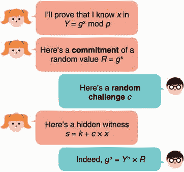

# 第七章：签名和零知识证明

本章包括

+   零知识证明和数字签名

+   密码签名的现有标准

+   签名的微妙行为和避免它们的陷阱

你即将学到一种最普遍和最强大的密码原语——数字签名。简单来说，数字签名类似于你习惯的现实生活中的签名，就像你在支票和合同上写的那种。当然，数字签名是密码学的，所以它们提供比纸笔等价物更多的保证。

在协议的世界里，数字签名解锁了许多不同的可能性，你将会在本书的第二部分中反复遇到它们。在这一章中，我将介绍这个新原语是什么，它如何在现实世界中使用，以及现代数字签名标准是什么。最后，我将谈论安全考虑和使用数字签名的危险。

注：在密码学中，签名经常被称为*数字签名*或*签名方案*。在本书中，我会交替使用这些术语。

对于本章，你需要阅读

+   第二章关于哈希函数

+   第五章关于密钥交换

+   第六章关于非对称加密

## 7.1 什么是签名？

我在第一章解释过，密码签名基本上就像现实生活中的签名一样。因此，它们通常是最直观的密码原语之一：

+   只有你可以使用你的签名来签署任意消息。

+   任何人都可以验证你在消息上的签名。

因为我们处于非对称密码学的领域，你可能已经猜到了这种不对称性会如何发挥作用。一个*签名方案*通常由三种不同的算法组成：

+   一个签名者用来创建新的私钥和公钥的密钥对生成算法（然后可以将公钥与任何人分享）。

+   一个签名算法，它接受一个私钥和一个消息，然后产生一个签名。

+   一个验证算法，它接受一个公钥、一个消息和一个签名，并返回一个成功或错误的消息。

有时私钥也被称为*签名密钥*，公钥被称为*验证密钥*。有道理吧？我在图 7.1 中总结了这三个算法。


图 7.1 数字签名的接口。像其他公钥密码算法一样，你首先需要通过一个接受安全参数和一些随机性的密钥生成算法生成密钥对。然后你可以使用一个带有私钥的签名算法对消息进行签名，并使用带有公钥的验证算法验证消息上的签名。如果你没有访问其关联私钥，你就无法伪造一个验证公钥的签名。

签名有什么用？它们用于验证消息的来源以及消息的完整性：

+   *原始性* —— 如果我的签名在上面，那么它来自我。

+   *完整性* —— 如果有人修改了消息，则签名将失效。

注意：虽然这两个属性与认证相关联，但通常被区分为两个单独的属性：*原始认证* 和 *消息认证*（或完整性）。

从某种意义上说，签名类似于第三章中您了解到的消息认证码（MACs）。但与 MAC 不同的是，它们允许我们对消息进行非对称认证：参与者可以验证消息未被篡改，而无需私钥或签名密钥的知识。接下来，我将向您展示这些算法如何在实践中使用。

练习

正如您在第三章中看到的那样，MAC 生成的认证标签必须以恒定时间验证，以避免时间攻击。您认为我们需要对验证签名做同样的事情吗？

### 7.1.1 如何在实践中签名和验证签名

让我们看一个实际的例子。为此，我使用了 pyca/cryptography（[`cryptography.io`](https://cryptography.io)），一个广受尊敬的 Python 库。以下清单简单地生成一个密钥对，使用私钥部分签名消息，然后使用公钥部分验证签名。

代码清单 7.1 在 Python 中签名和验证签名

```go
from cryptography.hazmat.primitives.asymmetric.ed25519 import (
    Ed25519PrivateKey                                              // ❶
)

private_key = Ed25519PrivateKey.generate()                         // ❷
public_key = private_key.public_key()                              // ❷

message = b"example.com has the public key 0xab70..."              // ❸
signature = private_key.sign(message)                              // ❸

try:                                                               // ❹
    public_key.verify(signature, message)                          // ❹
    print("valid signature")                                       // ❹
except InvalidSignature:                                           // ❹
    print("invalid signature")                                     // ❹
```

❶ 使用 Ed25519 签名算法，这是一种流行的签名方案

❷ 首先生成私钥，然后生成公钥

❸ 使用私钥对消息进行签名并获得签名

❹ 使用公钥验证消息上的签名

正如我之前所说，数字签名在现实世界中解锁了许多用例。让我们在下一节中看一个例子。

### 7.1.2 签名的主要用例：认证密钥交换

第 5 和 6 章介绍了两个参与者之间执行密钥交换的不同方法。在同一章节中，您了解到这些密钥交换对于协商一个共享密钥是有用的，然后可以使用该密钥来使用经过身份验证的加密算法来保护通信。然而，密钥交换并未完全解决在两个参与者之间建立安全连接的问题，因为主动的中间人（MITM）攻击者可以轻易地冒充密钥交换的双方。这就是签名的用武之地。

假设 Alice 和 Bob 正试图在它们之间建立安全通信渠道，并且 Bob 知道 Alice 的验证密钥。知道这一点，Alice 可以使用她的签名密钥来认证她的密钥交换的一面：她生成一个密钥交换密钥对，用她的签名密钥对公钥部分进行签名，然后发送密钥交换的公钥以及签名。Bob 可以使用他已经知道的关联验证密钥验证签名是否有效，然后使用密钥交换的公钥执行密钥交换。

我们称这样的密钥交换为*身份验证密钥交换*。如果签名无效，鲍勃可以知道有人正在积极地中间人攻击密钥交换。我在图 7.2 中说明了身份验证密钥交换。


图 7.2 第一张图片（顶部）代表了一个未经身份验证的密钥交换，这对于一个可以轻松伪装成交换双方的主动中间人攻击者来说是不安全的，因为他可以用自己的公钥与双方交换公钥。第二张图片（底部）代表了一个密钥交换的开始，通过爱丽丝对她的公钥签名来进行身份验证。由于被主动中间人攻击者篡改了消息，鲍勃（知道爱丽丝的验证密钥）无法验证签名，于是他中止了密钥交换。

请注意，在此示例中，密钥交换只在一侧进行了身份验证：尽管爱丽丝无法被冒充，但鲍勃可以。如果双方都经过了身份验证（鲍勃会签署他的密钥交换的一部分），我们称这种密钥交换为*相互身份验证密钥交换*。签署密钥交换可能看起来并不是很有用。我们似乎是把事先不知道爱丽丝的密钥交换公钥的问题转移到了事先不知道她的验证密钥的问题上。下一节将介绍身份验证密钥交换的一个实际应用，这将更容易理解。

### 7.1.3 实际应用：公钥基础设施

如果您假设信任是*传递*的，签名就会变得更加强大。我的意思是，如果您信任我，我信任爱丽丝，那么您就可以信任爱丽丝。她很酷。

信任的传递允许您以极端的方式扩展系统中的信任。想象一下，您对某个权威及其验证密钥有信心。此外，想象一下，这个权威已经签署了指示查尔斯公钥是什么、戴维公钥是什么等消息。然后，您可以选择相信这个映射！这样的映射称为*公钥基础设施*。例如，如果您尝试与查尔斯进行密钥交换，并且他声称他的公钥是一个看起来像 3848... 的大数，您可以通过检查您“心爱的”权威是否已签署了类似“查尔斯的公钥是 3848...”的消息来验证。

这个概念的一个现实应用是*网络公钥基础设施*（web PKI）。Web PKI 是您的网络浏览器用来验证其与您每天访问的众多网站执行的密钥交换的机制。Web PKI 的简化解释（如图 7.3 所示）如下：当您下载浏览器时，它会带有一些验证密钥嵌入到程序中。这个验证密钥与一个权威机构相关联，其责任是签署成千上万个网站的公钥，以便您可以信任这些而不必了解它们。您看不到的是这些网站必须向权威机构证明他们真正拥有自己的域名，然后才能获得对其公钥的签名。（实际上，您的浏览器信任许多权威机构来执行这项工作，而不仅仅是一个。）


图 7.3 在网络 PKI 中，浏览器信任一个权威机构来证明某些域名与某些公钥相关联。当安全访问网站时，您的浏览器可以通过验证来自权威机构的签名来验证网站的公钥确实属于他们自己（而不是来自某个中间人）。

在本节中，您从高层次的角度了解了签名。让我们深入了解签名的实际工作原理。但是为此，我们首先需要绕个弯，看看称为零知识证明（ZKP）的东西。

## 7.2 零知识证明（ZKP）：签名的起源

理解密码学中签名工作原理的最佳方法是了解它们的来源。因此，让我们花点时间简要介绍 ZKP，然后我会回到签名。

想象一下，佩姬想向维克多证明某事。例如，她想证明自己知道某个群元素的离散对数。换句话说，她想证明自己知道*x*，给定*Y* = *g*^x，其中*g*是某个群的生成元。


当然，最简单的解决方案是佩姬简单地发送值*x*（称为*见证*）。这个解决方案将是一个简单的*知识证明*，这样就可以了，除非佩姬不希望维克多知道它。

注意 在理论上，我们说用于生成证明的协议如果*完备*，那么佩姬可以使用它向维克多证明她知道见证。如果她无法使用它证明自己所知，那么这个方案就是无用的，对吧？

在密码学中，我们主要关注不向验证者泄露见证的知识证明。这样的证明被称为*零知识证明*（ZKP）。

### 7.2.1 Schnorr 身份验证协议：一个交互式零知识证明

在接下来的页面中，我将逐步从破损的协议构建一个 ZKP，以向您展示爱丽丝如何证明她知道*x*而不泄露*x*。

在密码学中解决这种问题的典型方法是用一些随机性“隐藏”这个值（例如，通过加密）。但我们不仅仅是隐藏：我们还想证明它是存在的。为此，我们需要一种代数方法来隐藏它。一个简单的解决方案是简单地将一个随机生成的值 *k* 添加到证人中。

*s* = *k* + *x*

佩姬随后可以将隐藏的证人 *s* 与随机值 *k* 一起发送给维克多。此时，维克多没有理由相信佩姬确实将证人隐藏在 *s* 中。实际上，如果她不知道证人 *x*，那么 *s* 可能只是一些随机值。维克多知道的是，证人 *x* 正隐藏在 *g* 的指数中，因为他知道 *Y* = *g*^x。

为了确定佩姬是否真的知道这个证人，维克多可以检查她给他的东西是否与他所知的相匹配，这也必须在 *g* 的指数中进行（因为这是证人所在的地方）。换句话说，维克多检查这两个数字是否相等：

+   *g*^s (= *g*^(*k*+*x*))

+   *Y* × *g*^k (= *g*^x × *g*^k = *g*^(*x*+*k*))

思路是只有知道证人 *x* 的人才能构造出满足这个方程的“蒙眼”证人 *s*。因此，这是一种知识证明。我在图 7.4 中重述了这个零知识证明系统。


图 7.4 为了向维克多证明她知道证人 *x*，佩姬隐藏它（通过将其添加到随机值 *k*）并发送隐藏的证人 *s*。

不要那么快。这个方案有一个问题——显然不安全！实际上，由于隐藏证人 *x* 的方程只有一个未知数（*x* 本身），维克多可以简单地反转方程以检索证人：

*x* = *s* – *k*

为了解决这个问题，佩姬可以隐藏随机值 *k* 本身！这次，她必须将随机值隐藏在指数中（而不是将其加到另一个随机值中），以确保维克多的等式仍然成立：

*R* = *g*^k

这样，维克多就不会得知值 *k*（这是第五章介绍的离散对数问题），因此无法恢复证人 *x*。然而，他仍然拥有足够的信息来验证佩姬是否知道 *x*！维克多只需检查 *g*^s (= *g*^(*k*+*x*) = *g*^k × *g*^x) 是否等于 *Y* × *R* (= *g*^x × *g*^k)。我在图 7.5 中审查了这个第二次尝试的零知识证明协议。


图 7.5 为了使知识证明**零知识**，证明者可以用随机值 *k* 隐藏证人 *x*，然后隐藏随机值本身。

我们方案还有一个问题——佩姬可以欺骗。她可以让维克多相信她知道 *x*，而实际上并不知道 *x*！她所要做的就是反转她计算证明的步骤。她首先生成一个随机值 *s*，然后基于 *s* 计算值 *R*：

*R* = *g*^s × *Y*^(–1)

维克托然后计算*Y* × *R* = *Y* × *g*^s × *Y*^(–1)，这确实与*g*^s 匹配。（佩吉使用逆来计算值的技巧在密码学中的许多攻击中都有所应用。）

注意 在理论上，我们说方案“可靠”，如果佩吉无法作弊（如果她不知道*x*，那么她无法愚弄维克托）。

为了使 ZKP 协议可靠，维克托必须确保佩吉从*R*计算出*s*而不是反向计算。为此，维克托使协议*交互式*：

1.  佩吉必须对她的随机值*k*进行承诺，以便以后无法更改。

1.  在收到佩吉的承诺后，维克托在协议中引入了一些自己的随机性。他生成一个随机值*c*（称为*挑战*）并将其发送给佩吉。

1.  佩吉随后可以根据随机值*k*和挑战*c*计算她的隐藏承诺。

注意 在第二章中，您学习了承诺方案，我们使用哈希函数对我们可以稍后揭示的值进行承诺。但基于哈希函数的承诺方案不允许我们对隐藏值进行有趣的算术运算。相反，我们可以简单地将我们的生成器提升到该值，*g*^k，这是我们已经在做的事情。

因为佩吉无法在没有维克托的挑战*c*的情况下执行最后一步，而维克托又不会在看到随机值*k*的承诺之前发送挑战给她，所以佩吉被迫根据*k*计算*s*。获得的协议，我在图 7.6 中说明，通常被称为*Schnorr 身份验证协议*。



图 7.6 Schnorr 身份验证协议是一个*完备的*（佩吉可以证明她知道某个见证人）、*可靠的*（如果佩吉不知道见证人，她无法证明任何事情）和*零知识的*（维克托对见证人一无所知）交互式 ZKP。

所谓的*交互式 ZKP 系统*遵循三个步骤（承诺、挑战和证明）的模式，在文献中通常被称为*Sigma 协议*，有时写作Σ协议（因为希腊字母的形状具有说明性）。但这与数字签名有什么关系呢？

注意 Schnorr 身份验证协议在*诚实验证者零知识*（HVZK）*模型*中运作：如果验证者（维克托）表现不诚实并且不随机选择挑战，他们可以了解见证人的一些信息。一些更强大的 ZKP 方案在验证者恶意时仍然是零知识的。

### 7.2.2 签名作为非交互式零知识证明

以前的交互式 ZKP 的问题在于，嗯，它是*交互式*的，而现实世界的协议通常不喜欢交互性。交互式协议会增加一些不可忽略的开销，因为它们需要多个消息（可能通过网络）并且会增加无限延迟，除非两个参与者同时在线。由于这个原因，交互式 ZKP 在应用密码学领域中大多缺席。

所有这些讨论都不是毫无意义的！在 1986 年，Amos Fiat 和 Adi Shamir 发表了一种技术，允许将一个交互式的零知识证明（ZKP）轻松转换为一个非交互式的 ZKP。他们引入的技巧（称为*费曼-沙米尔启发式*或*费曼-沙米尔变换*）是让证明者自己计算挑战，以一种他们无法控制的方式。

这是一个诀窍——将挑战计算为到目前为止协议中发送和接收的所有消息的哈希（我们称之为*转录*）。如果我们假设哈希函数产生的输出与真正的随机数不可区分（换句话说，看起来是随机的），那么它可以成功模拟验证者的角色。

Schnorr 更进一步。他注意到任何东西都可以包含在那个哈希中！例如，如果我们在其中包含一条消息会怎样？我们得到的不仅是一个证明我们知道某个见证者*x*的证据，而且还是与证据密切相关的密码学链接的消息承诺。换句话说，如果证据是正确的，那么只有知道见证者的人（它变成签名密钥）才能承诺那条消息。

*这就是一个签名！*数字签名只是非交互式 ZKP。将 Fiat-Shamir 转换应用到 Schnorr 识别协议，我们得到了*Schnorr 签名方案*，我在图 7.7 中进行了说明。


图 7.7 左边的协议是之前讨论过的 Schnorr 识别协议，这是一个交互式协议。右边的协议是 Schnorr 签名，是左边协议的非交互式版本（其中验证者消息被替换为对转录进行哈希的调用）。

总结一下，Schnorr 签名基本上是两个值，*R*和*s*，其中*R*是对某个秘密随机值的承诺（通常称为*nonce*，因为它每个签名需要是唯一的），而*s*是通过承诺*R*、私钥（见证者*x*）和一条消息的帮助计算得出的值。接下来，让我们看一下签名算法的现代标准。

## 7.3 你应该使用（或不使用）的签名算法

像密码学中的其他领域一样，数字签名有许多标准，有时很难理解应该使用哪一个。这就是我在这里的原因！幸运的是，签名算法的类型与密钥交换的类型类似：有基于大数算术模的算法，如 Diffie-Hellman（DH）和 RSA，也有基于椭圆曲线的算法，如椭圆曲线 Diffie-Hellman（ECDH）。

请确保你对第五章和第六章的算法了解足够深入，因为我们现在要基于这些内容进行讨论。有趣的是，引入 DH 密钥交换的论文也提出了数字签名的概念（没有给出解决方案）：

*为了开发一种能够用一些纯电子形式的通信替代当前书面合同的系统，我们必须发现一个具有与书面签名相同属性的数字现象。 任何人都必须能够轻松识别签名的真实性，但除了合法签署者之外，任何其他人都不可能产生签名。 我们将称这样的技术为单向认证。 由于任何数字信号都可以精确复制，真正的数字签名必须在不被知道的情况下识别*。

——Diffie 和 Hellman（《密码学的新方向》，1976 年）

一年后（1977 年），第一个签名算法（称为 RSA）与 RSA 非对称加密算法一起被引入（您在第六章中学到了）。 RSA 用于签名是我们将学习的第一个算法。

1991 年，NIST 提出了*数字签名算法（DSA）*，试图避开 Schnorr 签名的专利。 出于这个原因，DSA 是 Schnorr 签名的一种奇怪的变体，发布时没有安全性证明（尽管目前尚未发现任何攻击）。 该算法被许多人采用，但很快被一个称为*ECDSA*（代表椭圆曲线数字签名算法）的椭圆曲线版本取代，就像椭圆曲线 Diffie-Hellman（ECDH）取代 Diffie-Hellman（DH）一样，由于其更小的密钥（请参见第五章）。 ECDSA 是我将在本节中讨论的第二种签名算法。

在 2008 年，Schnorr 签名的专利过期后，Daniel J. Bernstein，也就是 ChaCha20-Poly1305（在第四章中介绍）和 X25519（在第五章中介绍）的发明者，推出了一种新的签名方案，称为*EdDSA*（代表 Edwards 曲线数字签名算法），基于 Schnorr 签名。 自推出以来，EdDSA 迅速获得了采用，并且现在被认为是实际应用中数字签名的最新技术。 EdDSA 是我将在本节中讨论的第三种也是最后一种签名算法。

### 7.3.1 RSA PKCS#1 v1.5：一个糟糕的标准

RSA 签名目前被广泛应用，尽管它们不应该被使用（正如您将在本节中看到的，它们存在许多问题）。 这是因为该算法是第一个被标准化的签名方案，并且实际应用领域迟迟未能转向更新更好的算法。 因此，在您的学习过程中很可能会遇到 RSA 签名，我无法避免解释它们的工作原理和采用的标准。 但让我说，如果您理解了第六章中 RSA 加密的工作原理，那么本节应该很简单，因为使用 RSA 进行签名与使用 RSA 进行加密相反：

+   要进行签名，您需要使用私钥（而不是公钥）对消息进行*加密*，这将生成一个签名（组中的随机元素）。

+   要验证签名，您需要使用公钥（而不是私钥）对签名进行*解密*。 如果它将原始消息还原出来，则签名有效。

注意 实际上，在签名之前，消息通常会被散列，因为这样会占用更少的空间（RSA 只能签署比其模数小的消息）。结果也被解释为一个大数，以便可以在数学运算中使用。

如果你的私钥是私钥指数*d*，公钥是公钥指数*e*和公共模数*N*，你可以

+   通过计算*signature* = *message*^d mod *N*来签署消息

+   通过计算*signature*^e mod *N*来验证签名，并检查它是否等于消息

我在图 7.8 中以图示方式说明了这一点。


图 7.8 要使用 RSA 签名，我们只需对 RSA 加密算法进行逆操作：我们使用私钥指数对消息进行指数运算，然后进行验证，我们使用公钥指数对签名进行指数运算，返回到消息。

这样做的原因是只有了解私钥指数*d*的人才能对消息产生签名。与 RSA 加密一样，安全性与因子分解问题的难度紧密相连。

那么用 RSA 进行签名的标准是什么？幸运的是，它们遵循与 RSA 加密相同的模式：

+   *RSA 用于加密在 PKCS#1 v1.5 文档中松散标准化。*同一文档还包含了 RSA 签名的规范（没有安全证明）。

+   *然后在 PKCS#1 v2 文档中对 RSA 进行了重新标准化，采用了更好的构造方法（称为 RSA-OAEP）。*同一文档中也对 RSA 签名进行了标准化，RSA-PSS 方案也在其中标准化（附带安全证明）。

我在第六章关于非对称加密中讨论了 RSA PKCS#1 v1.5。在该文档中标准化的签名方案与加密方案几乎相同。要签名，首先使用所选的哈希函数对消息进行哈希，然后根据 PKCS#1 v1.5 的签名填充进行填充（这与相同标准中的加密填充类似）。接下来，使用私钥指数对填充和散列消息进行加密。我在图 7.9 中说明了这一点。


图 7.9 RSA PKCS#1 v1.5 用于签名。要签名，先使用 PKCS#1 v1.5 填充方案对消息进行哈希和填充。最后一步使用私钥指数*d*对填充的哈希消息进行指数运算取模*N*。要验证，只需使用公钥指数*e*对签名进行指数运算取模*N*，并验证它是否与填充的哈希消息匹配。

多个 RSAs

顺便说一句，不要被 RSA 周围的不同术语搞混了。有 RSA（*非对称加密原语*）和 RSA（*签名原语*）。此外，还有 RSA（*公司*），由 RSA 的发明者创立。提到用 RSA 加密时，大多数人指的是 RSA PKCS#1 v1.5 和 RSA-OAEP 方案。提到用 RSA 签名时，大多数人指的是 RSA PKCS#1 v1.5 和 RSA-PSS 方案。

我知道这可能会让人感到困惑，特别是对于 PKCS#1 v1.5 标准。 尽管在 PKCS#1 v1.5 中有官方名称来区分加密和签名算法（RSAES-PKCS1-v1_5 用于加密，RSASSA-PKCS1-v1_5 用于签名），但我很少看到这些名称被使用。

在第六章中，我提到了对 RSA PKCS#1 v1.5 进行加密的破坏性攻击；不幸的是，对于 RSA PKCS#1 v1.5 签名也是如此。 1998 年，Bleichenbacher 发现了对 RSA PKCS#1 v1.5 加密的毁灭性攻击后，他决定看看签名标准。 Bleichenbacher 在 2006 年提出了对 RSA PKCS#1 v1.5 的*签名伪造*攻击，这是对签名的最灾难性的攻击类型之一——攻击者可以在不知道私钥的情况下伪造签名！ 与直接破解加密算法的第一次攻击不同，第二次攻击是一种实现攻击。 这意味着如果签名方案按照规范正确实现，攻击就不会奏效。

实现缺陷听起来不像算法缺陷那么糟糕，也就是说，如果很容易避免并且不影响许多实现。 不幸的是，2019 年已经表明，尴尬的是，许多开源实现的 RSA PKCS#1 v1.5 签名实际上陷入了这个陷阱，并且错误地实现了标准（参见 Chau 等人的“使用符号执行分析语义正确性的案例研究：PKCS#1 v1.5 签名验证”）。 各种实现缺陷最终导致了不同变体的 Bleichenbacher 的伪造攻击。

不幸的是，RSA PKCS#1 v1.5 签名仍然被广泛使用。 如果您真的*必须*出于向后兼容性原因使用此算法，请注意这些问题。 话虽如此，这并不意味着 RSA 签名是不安全的。 故事并没有在这里结束。

### 7.3.2 RSA-PSS：更好的标准

RSA-PSS 在更新的 PKCS#1 v2.1 中标准化，并包括了安全性证明（与之前的 PKCS#1 v1.5 中标准化的签名方案不同）。 新规范的工作方式如下：

+   使用 PSS 编码算法对消息进行编码

+   使用 RSA 对编码消息进行签名（就像在 PKCS#1 v1.5 标准中所做的那样）

PSS 编码稍微复杂，类似于 OAEP（Optimal Asymmetric Encryption Padding）。 我在图 7.10 中进行了说明。


图 7.10 RSA-PSS 签名方案使用掩码生成函数（MGF）对消息进行编码，就像你在第六章中学到的 RSA-OAEP 算法一样，然后以通常的 RSA 方式进行签名。

验证由 RSA-PSS 产生的签名只是在将签名提升到公共模数的公共指数模下，反转编码的问题。

PSS 的可证明安全性

PSS（*概率签名方案*）是可证明安全的，意味着没有人应该能够在不知道私钥的情况下伪造签名。 PSS 并非证明了如果 RSA 安全则 RSA-PSS 安全，而是证明了逆否命题：如果有人能够破解 RSA-PSS，那么该人也能够破解 RSA。这是密码学中证明事物的一种常见方式。当然，这仅在 RSA 安全时才有效，这是我们在证明中假设的。

如果你还记得，我在第六章也谈到了 RSA 加密的第三种算法（称为 RSA-KEM）——这是一种没有任何人使用但被证明安全的更简单的算法。有趣的是，RSA 签名也反映了 RSA 加密历史的这一部分，并且有一个几乎没有人使用的更简单的算法；它被称为*完全域哈希*（FDH）。 FDH 通过简单地对消息进行哈希，然后使用 RSA 签名（通过将摘要解释为数字）来工作。

尽管 RSA-PSS 和 FDH 都具有安全性证明并且更容易正确实现，但今天大多数协议仍然使用 RSA PKCS#1 v1.5 进行签名。这只是加密算法淘汰通常发生的缓慢的又一个例子。由于旧的实现仍然必须与新的实现一起工作，因此删除或替换算法变得困难。考虑一下不更新应用程序的用户、不提供软件新版本的供应商、无法更新的硬件设备等等。接下来，让我们看看一个更现代的算法。

### 7.3.3 椭圆曲线数字签名算法（ECDSA）

在本节中，让我们看看 ECDSA，这是 DSA 的椭圆曲线变体，它本身只是为了规避 Schnorr 签名的专利而发明的。该签名方案在许多标准中指定，包括 ISO 14888-3、ANSI X9.62、NIST 的 FIPS 186-2、IEEE P1363 等等。并非所有标准都兼容，希望进行互操作的应用程序必须确保它们使用相同的标准。

不幸的是，与 DSA 一样，ECDSA 没有安全性证明，而 Schnorr 签名却有。尽管如此，ECDSA 已被广泛采用，并且是最常用的签名方案之一。在本节中，我将解释 ECDSA 的工作原理以及如何使用它。与所有这些方案一样，公钥几乎总是根据相同的公式生成：

+   私钥是一个随机生成的大数*x*。

+   公钥是通过将*x*视为椭圆曲线密码学中的一个生成器（称为*基点*）中的索引而获得的。

更具体地说，在 ECDSA 中，公钥是使用[*x*]*G*计算的，其中*x*与基点*G*的标量乘积。

加法还是乘法符号？

请注意，我使用*加法符号*（在标量周围放置括号的椭圆曲线语法），但如果我想使用*乘法符号*，我可以写*public_key* = *G*^x。这些差异在实践中并不重要。大多数时候，不关心群的基础性质的加密协议使用乘法符号编写，而专门在椭圆曲线群中定义的协议倾向于使用加法符号编写。

要计算 ECDSA 签名，你需要与 Schnorr 签名所需的相同输入：签署消息的哈希值(*H*(*m*))，你的私钥*x*，以及每个签名唯一的随机数*k*。ECDSA 签名是两个整数，*r*和*s*，计算如下：

+   *r*是[*k*] *G*的 x 坐标

+   *s*等于*k*^(–1) (*H*(*m*) + *xr*) mod *p*

要验证 ECDSA 签名，验证者需要使用相同的哈希消息*H*(*m*)，签名者的公钥，以及签名数值*r*和*s*。验证者然后

1.  计算[*H*(*m*) *s*^(–1)]*G* + [*rs*^(–1)]*public_key*

1.  验证所得点的 x 坐标是否与签名值*r*相同

你肯定能够认识到与 Schnorr 签名有一些相似之处。随机数*k*有时被称为*nonce*，因为它是一个只能使用一次的数字，有时也被称为*ephemeral key*，因为它必须保持秘密。

警告我再次强调：*k*绝对不能重复或可预测！没有这一点，恢复私钥就变得微不足道。

一般来说，加密库在幕后执行此 nonce（*k*值）的生成，但有时不会让调用者提供它。这当然是一场灾难。例如，在 2010 年，索尼的 Playstation 3 被发现使用重复 nonce 的 ECDSA（泄漏了他们的私钥）。

警告更加微妙的是，如果 nonce *k*不是均匀和随机选择的（特别是，如果你可以预测前几位），仍然存在可以在瞬间恢复私钥的强大攻击（所谓的*格攻击*）。在理论上，我们称这种密钥检索攻击为*全面破解*（因为它们破坏了一切！）。这种全面破解在实践中非常罕见，这使得 ECDSA 算法可能以惊人的方式失败。

存在避免 nonce 问题的尝试。例如，RFC 6979 指定了一个基于消息和私钥生成 nonce 的*确定性 ECDSA*方案。这意味着两次签署相同消息涉及两次相同的 nonce，因此产生两次相同的签名（这显然不是问题）。

倾向于与 ECDSA 一起使用的椭圆曲线基本上与椭圆曲线 Diffie-Hellman（ECDH）算法（参见第五章）中流行的曲线相同，但有一个显着的例外：*Secp256k1*。Secp256k1 曲线在 SEC 2 中定义：“推荐的椭圆曲线域参数” ([`secg.org/sec2-v2.pdf`](https://secg.org/sec2-v2.pdf))，由高效密码学标准组（SECG）编写。在比特币决定使用它而不是更流行的 NIST 曲线之后，它受到了很多关注，原因是我在第五章中提到的对 NIST 曲线的不信任。

Secp256k1 是一种称为 *Koblitz 曲线* 的椭圆曲线类型。Koblitz 曲线只是具有一些参数约束的椭圆曲线，这些约束允许在曲线上优化一些操作。椭圆曲线具有以下方程式：

*y*² = *x*³ + *ax* + *b*

其中 *a* = 0 和 *b* = 7 是常数，*x* 和 *y* 定义在模素数 *p* 上：

*p* = 2¹⁹² – 2³² – 2¹² – 2⁸ – 2⁷ – 2⁶ – 2³ – 1

这定义了一个素数阶的群，与 NIST 曲线相似。今天，我们有有效的公式来计算椭圆曲线上点的数量。这是 Secp256k1 曲线中点的数量（包括无穷远点）的素数：

115792089237316195423570985008687907852837564279074904382605163141518161494337

我们使用固定点 *G* 作为生成器（或基点）的坐标

*x* = 55066263022277343669578718895168534326250603453777594175500187360389116729240

和

*y* = 32670510020758816978083085130507043184471273380659243275938904335757337482424

尽管如此，今天 ECDSA 大多数与 NIST 曲线 P-256（有时称为 *Secp256r1*；注意区别）一起使用。接下来让我们看另一种广泛流行的签名方案。

### 7.3.4 Edwards 曲线数字签名算法（EdDSA）

让我介绍一下本章的最后一个签名算法，*Edwards 曲线数字签名算法*（EdDSA），由 Daniel J. Bernstein 于 2011 年发布，以回应对 NIST 和其他政府机构创建的曲线的不信任。EdDSA 这个名字似乎表明它基于 DSA 算法，就像 ECDSA 一样，但这是误导的。EdDSA 实际上基于 Schnorr 签名，这是由于 Schnorr 签名专利在 2008 年早些时候到期而可能的。

EdDSA 的一个特殊之处在于该方案不需要每次签名操作都产生新的随机数。EdDSA *确定性地*生成签名。这使得该算法相当具有吸引力，并且已被许多协议和标准采用。

EdDSA 正在着手包括在 NIST 的即将更新的 FIPS 186-5 标准中（截至 2021 年初仍是草案）。当前的官方标准是 RFC 8032，它定义了两个不同安全级别的曲线，可用于 EdDSA。所定义的两个曲线都是 *扭曲的 Edwards 曲线*（一种启用有趣的实现优化的椭圆曲线类型）：

+   *Edwards25519 基于 Daniel J. Bernstein 的 Curve25519（在第五章中介绍）*。由于椭圆曲线的类型所启用的优化，其曲线操作可以比 Curve25519 更快地实现。由于它是在 Curve25519 之后发明的，基于 Curve25519 的密钥交换 X25519 并未从这些速度改进中受益。与 Curve25519 一样，Edwards25519 提供了 128 位安全性。

+   *Edwards448 基于 Mike Hamburg 的 Ed448-Goldilocks 曲线*。它提供了 224 位安全性。

在实践中，EdDSA 主要使用 Edwards25519 曲线实例化，该组合被称为 *Ed25519*（而带有 Edwards448 的 EdDSA 则缩写为 Ed448）。与现有方案不同，EdDSA 的密钥生成略有不同。EdDSA 不直接生成签名密钥，而是生成一个秘密密钥，然后用于派生实际的签名密钥和我们称之为随机数密钥的另一个密钥。那个随机数密钥很重要！它是用于确定性地生成所需每个签名的随机数的密钥。

注意 根据您使用的加密库，您可能正在存储秘密密钥或两个派生密钥：签名密钥和随机数密钥。不是这很重要，但如果您不知道这一点，那么如果遇到将 Ed25519 秘密密钥存储为 32 字节或 64 字节，具体取决于所使用的实现，则可能会感到困惑。

要签名，EdDSA 首先通过将随机数密钥与要签名的消息进行哈希运算来确定性地生成随机数。之后，类似于 Schnorr 签名的过程如下进行：

1.  计算随机数为 *HASH*(*nonce key* || *message*)

1.  计算承诺 *R* 为 [*nonce*]*G*，其中 *G* 是群的基点

1.  计算挑战为 *HASH*(*commitment* || *public key* || *message*)

1.  计算证明 *S* 为 *nonce* + *challenge* × *signing key*

签名是（*R*，*S*）。我在图 7.11 中说明了 EdDSA 的重要部分。


Figure 7.11 EdDSA 密钥生成产生一个秘密密钥，然后用于派生另外两个密钥。第一个派生密钥是实际的签名密钥，因此可用于派生公钥；另一个派生密钥是随机数密钥，在签名操作期间用于确定性地派生随机数。然后，EdDSA 签名类似于 Schnorr 签名，唯一的异常是（1）随机数是根据随机数密钥和消息确定性生成的，并且（2）签名者的公钥包含在挑战的一部分中。

注意随机数（或临时密钥）如何确定性地而不是概率性地从随机数密钥和给定的消息中派生出来。这意味着签署两个不同的消息应该涉及两个不同的随机数，巧妙地防止签署者重复使用随机数，从而泄漏密钥（就像 ECDSA 可能发生的情况一样）。两次签署相同的消息会产生两次相同的随机数，然后也会产生两次相同的签名。这显然不是问题。可以通过计算以下两个方程式来验证签名：

[*S*]*G*

*R* + [*HASH*(*R* || *public key* || *message*)] *public key*

如果这两个值匹配，则签名有效。这与 Schnorr 签名的工作方式完全相同，只是现在我们处于一个椭圆曲线组中，我在这里使用了加法表示法。

EdDSA 的最广泛使用的实例是 Ed25519，它使用 Edwards25519 曲线和 SHA-512 作为哈希函数进行定义。 Edwards25519 曲线的定义包含满足以下方程的所有点：

–*x*² + *y*² = 1 + *d* × *x*² × *y*² mod *p*

其中值 *d* 是大数

37095705934669439343138083508754565189542113879843219016388785533085940283555

变量 *x* 和 *y* 取模 *p*，即大数 2²⁵⁵ – 19（用于 Curve25519 的相同素数）。基点是坐标为 *G*

*x* = 15112221349535400772501151409588531511454012693041857206046113283949847762202

和

*y* = 46316835694926478169428394003475163141307993866256225615783033603165251855960

RFC 8032 实际上定义了三种使用 Edwards25519 曲线的 EdDSA 变体。所有三种变体都遵循相同的密钥生成算法，但具有不同的签名和验证算法：

+   *Ed25519（或 pureEd25519）* —— 这就是我之前解释过的算法。

+   *Ed25519ctx* —— 此算法引入了一个强制的定制字符串，并且在实践中很少被实现，甚至很少被使用。唯一的区别是在每次调用哈希函数时都添加了一些用户选择的前缀。

+   *Ed25519ph（或 HashEd25519）* —— 这允许应用程序在签名之前对消息进行预哈希（因此名称中有 *ph*）。它还基于 Ed25519ctx，允许调用者包含一个可选的自定义字符串。

在密码学中增加一个 *定制字符串* 是相当常见的，就像你在第二章中看到的某些哈希函数，或者在第八章中看到的密钥派生函数一样。当协议中的参与者在不同的上下文中使用相同的密钥对消息进行签名时，这是一个有用的补充。例如，你可以想象一个应用程序，允许你使用私钥签名交易，也可以向你交谈的人签署私人消息。如果你错误地签署并发送了一个看起来像交易的消息给你的邪恶朋友 Eve，她可能会尝试将其重新发布为有效的交易，如果无法区分你签署的两种类型的有效载荷的话。

Ed25519ph 仅为了满足需要签署大型消息的调用者而引入。正如您在第二章中看到的，哈希函数通常提供“初始化-更新-完成”接口，允许您连续哈希数据流，而无需将整个输入保留在内存中。

现在您已经完成了对实际应用中使用的签名方案的介绍。接下来，让我们看看在使用这些签名算法时可能如何自掘坟墓。但首先，让我们回顾一下：

+   RSA PKCS#1 v1.5 仍然被广泛使用，但正确实现很困难，许多实现已被发现存在问题。

+   RSA-PSS 具有安全性证明，更易于实现，但由于基于椭圆曲线的新方案而受到较少采用。

+   ECDSA 是 RSA PKCS#1 v1.5 的主要竞争对手，大多数情况下与 NIST 的曲线 P-256 一起使用，除了在加密货币世界中，Secp256k1 似乎占主导地位。

+   Ed25519 基于 Schnorr 签名，已经得到广泛采用，并且与 ECDSA 相比更容易实现；它不需要每次签名操作都产生新的随机数。如果可以的话，这是您应该使用的算法。

## 7.4 签名方案的微妙行为

签名方案可能具有一些微妙的特性。虽然它们在大多数协议中可能并不重要，但在处理更复杂和非常规的协议时，不了解这些“陷阱”可能会给您带来麻烦。本章的最后部分重点介绍了数字签名的已知问题。

### 7.4.1 签名替换攻击

*数字签名并不能唯一地识别密钥或消息*。

——Andrew Ayer（《让我们加密中的重复签名密钥选择攻击》，2015）

*替换攻击*，也称为*重复签名密钥选择*（DSKS），对 RSA PKCS#1 v1.5 和 RSA-PSS 都是可能的。存在两种 DSKS 变体：

+   *密钥替换攻击*——使用不同的密钥对或公钥来验证给定消息上的给定签名。

+   *消息密钥替换攻击*——使用不同的密钥对或公钥来验证给定消息上的*新*签名。

再说一遍：第一次攻击同时修复了消息和签名；第二次攻击只修复了签名。我在图 7.12 中总结了这一点。


图 7.12 类似 RSA 的签名算法易受密钥替换攻击的影响，这对大多数密码学用户来说是意外且意想不到的行为。*密钥替换* 攻击允许某人获取消息的签名，并制作一个新的密钥对，以验证原始签名。一种变体称为*消息密钥替换*允许攻击者创建一个新的密钥对和一个新的消息，这些消息在原始签名下是有效的。

存在适应性选择消息攻击下的存在性不可伪造性 (EUF-CMA)

替换攻击是理论密码学和应用密码学之间差距的一种综合症。密码学中的签名通常使用 EUF-CMA 模型进行分析，该模型代表自适应选择消息攻击下的存在性不可伪造性。在这个模型中，您生成一对密钥，然后我请求您对一些任意消息进行签名。当我观察您产生的签名时，如果我能在某个时间点生成一个我以前没有请求过的消息的有效签名，那么我就赢了。不幸的是，这个 EUF-CMA 模型似乎并不包括每个边缘情况，而且危险的细微差别，如替换攻击，也没有被考虑在内。

### 7.4.2 签名可塑性

*2014 年 2 月，曾经是最大比特币交易所的 MtGox 关闭并申请破产，声称攻击者利用可塑性攻击来清空其账户*。

—Christian Decker 和 Roger Wattenhofer（“比特币交易可塑性和 MtGox”，2014）

大多数签名方案都是可塑的：如果您给我一个有效的签名，我可以修改签名，使其成为一个不同但仍然有效的签名。我不知道签名密钥是什么，但我设法创建了一个新的有效签名。

非可塑性并不一定意味着签名是唯一的：如果我是签名者，通常可以为相同的消息创建不同的签名，这通常是可以接受的。一些构造，如可验证随机函数（你将在第八章中看到），依赖于签名的唯一性，因此它们必须处理这个问题或使用具有唯一签名的签名方案（如 Boneh–Lynn–Shacham，或 BLS，签名）。

强 EUF-CMA

一个称为 SUF-CMA（用于强 EUF-CMA）的新安全模型试图在签名方案的安全定义中包含非可塑性（或抵抗可塑性）。一些最近的标准，如 RFC 8032，规定了 Ed25519，包括对抗可塑性攻击的缓解措施。由于这些缓解措施并不总是存在或常见，您不应该依赖于您的协议中的签名是非可塑的。

如何处理所有这些信息？请放心，签名方案绝对没有问题，如果您使用的签名不太超出常规，那么您可能不必担心。但是，如果您正在设计加密协议，或者您正在实现比日常密码学更复杂的协议，您可能希望将这些微妙的属性记在心中。

## 摘要

+   数字签名类似于笔和纸签名，但是由密码学支持，使得除了控制签名（私钥）的人之外，任何人都无法伪造。

+   数字签名可以用于验证来源（例如，密钥交换的一方）以及提供传递信任（如果我信任 Alice，她信任 Bob，我就可以信任 Bob）。

+   零知识证明（ZKPs）允许证明者证明对特定信息（称为见证）的知识，而不泄露任何信息。签名可以被视为非交互式 ZKPs，因为在签名操作期间不需要验证者在线。

+   您可以使用许多标准进行签名：

    +   RSA PKCS#1 v1.5 如今被广泛使用，但不建议，因为很难正确实现。

    +   RSA-PSS 是一种更好的签名方案，因为它更容易实现并且有安全性证明。不幸的是，由于支持更短密钥的椭圆曲线变体现在更受网络协议青睐，因此它如今并不流行。

    +   目前最流行的签名方案基于椭圆曲线：ECDSA 和 EdDSA。ECDSA 经常与 NIST 的曲线 P-256 一起使用，而 EdDSA 经常与 Edwards25519 曲线一起使用（这种组合被称为 Ed25519）。

+   一些微妙的属性可能会很危险，如果签名被以非常规方式使用：

    +   始终避免对谁签署了消息产生歧义，因为一些签名方案容易受到密钥替换攻击的影响。外部参与者可以创建一个新的密钥对，该密钥对将验证已经存在的消息上的签名，或者创建一个新的密钥对和一个新消息，该消息将验证给定的签名。

    +   不要依赖签名的唯一性。首先，在大多数签名方案中，签名者可以为同一消息创建任意数量的签名。其次，大多数签名方案都是*可塑性*的，这意味着外部参与者可以获取一个签名并为同一消息创建另一个有效的签名。
