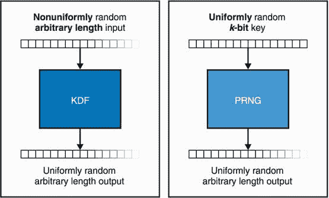

# 第八章：随机性和秘密

本章涵盖了

+   随机性是什么以及为什么它很重要

+   获取强随机性并生成秘密

+   随机性的陷阱

这是本书第一部分的最后一章，在我们转到第二部分并了解实际世界中使用的协议之前，我有最后一件事要告诉你。这是我迄今为止严重忽视的一点 —— 随机性。

你一定注意到了，在你学过的每个密码算法中（哈希函数除外），你都必须在某个时候使用随机性：秘密密钥、随机数、初始化向量、素数、挑战等等。当我讲解这些不同的概念时，随机性总是来自某个神奇的黑盒子。这并不罕见。在密码学白皮书中，随机性通常被用一个带有美元符号的箭头表示。但是在某些时候，我们需要问自己一个问题，“这个随机性到底来自哪里？”

在这一章中，我将为你解释当密码学提到随机性时它意味着什么。我还将为你提供有关现实世界密码应用中获取随机性的实用方法的指引。

注意 对于这一章，你需要已经阅读了第二章关于哈希函数和第三章关于消息认证码。

## 8.1 什么是随机性？

每个人在某种程度上都理解随机性的概念。无论是玩骰子还是买彩票，我们都曾接触过它。我第一次遇到随机性是在很小的时候，当我意识到计算器上的一个 RAND 按钮每次按下都会产生不同的数字时。这让我感到非常困扰。我对电子学了解甚少，但我觉得我可以理解一些它的限制。当我将 4 和 5 相加时，肯定会有一些电路进行计算并给我结果。但是一个随机按钮？随机数从哪里来的？我无法理解。

我花了一些时间才问出正确的问题，并且了解到计算器其实是作弊的！它们会硬编码大量随机数列表，并逐一遍历这些列表。这些列表会展现出良好的随机性，这意味着如果你看着得到的随机数，1 的数量和 9 的数量相等，1 的数量和 2 的数量相等，依此类推。这些列表会模拟*均匀分布*：数字均匀分布在等比例中。

当需要用于安全和密码学目的时，随机数必须是*不可预测*的。当然，在那个时候，没有人会将那些计算器的“随机性”用于与安全有关的任何事情。相反，密码应用从观察难以预测的物理现象中提取随机性。

举例来说，即使投掷骰子是一个确定性过程，预测其结果也很困难；如果你知道了所有的初始条件（你如何投掷骰子、骰子本身、空气摩擦、桌面的摩擦力等），你应该能够预测结果。话虽如此，所有这些因素对最终结果的影响如此之大，以至于对初始条件的知识有轻微的不准确性就会影响我们的预测。结果对初始条件的极度敏感性被称为*混沌理论*，这就是为什么像天气这样的事情很难在一定数量的天数后准确预测的原因。

下面的图片是我在访问 Cloudflare 在旧金山总部期间拍摄的一张照片。LavaRand 是一堵熔岩灯墙，这些灯产生难以预测的蜡形状。一台摄像机放置在墙前，提取并将图像转换为随机字节。


应用程序通常依赖操作系统提供可用的随机性，而操作系统又根据运行的设备类型使用不同的技巧收集随机性。常见的随机性来源（也称为*熵源*）可以是硬件中断的时间（例如，您的鼠标移动）、软件中断、硬盘寻道时间等。

熵

在信息理论中，*熵*一词用于判断一个字符串包含多少随机性。该术语是由克劳德·香农创造的，他设计了一个熵公式，该公式将随着字符串表现出越来越多的不可预测性而输出越来越大的数字（从完全可预测的 0 开始）。对于我们来说，公式或数字本身并不那么有趣，但在密码学中，你经常会听到“这个字符串的熵低”（意思是可预测的）或“这个字符串的熵高”（意思是不太可预测的）。

观察中断和其他事件以产生随机性并不理想；当设备启动时，这些事件往往是高度可预测的，它们也可能受到外部因素的恶意影响。如今，越来越多的设备可以访问额外的传感器和硬件辅助设备，提供更好的熵源。这些硬件随机数发生器通常称为*真随机数发生器*（TRNG），因为它们利用外部不可预测的物理现象（如热噪声）来提取随机性。

通过所有这些不同类型的输入获得的噪声通常不是“干净”的，有时甚至没有足够的熵（如果有的话）。例如，从某些熵源获得的第一个比特往往是 0，或者连续的比特可能（比机会更大）相等。因此，在用于密码应用之前，*随机性提取器*必须清理和收集几种噪声源。例如，可以通过将不同源应用哈希函数并将摘要进行异或来完成此操作。

随机性就只有这些吗？不幸的是不是。从噪声中提取随机性是一个可能会很慢的过程。对于一些可能需要快速生成大量随机数的应用程序，这可能成为瓶颈。下一节将描述操作系统和现实世界应用程序如何提高随机数的生成。

## 8.2 慢随机性？使用伪随机数生成器（PRNG）

随机性随处可见。此时，您应该至少相信这对于密码学是真实的，但令人惊讶的是，密码学并不是唯一一个大量使用随机数的地方。例如，像 ls 这样的简单 Unix 程序也需要随机性！由于程序中的错误如果被利用可能会产生灾难性后果，二进制文件试图通过多种技巧来防御低级攻击；其中之一是*ASLR*（地址空间布局随机化），它在每次运行时随机化进程的内存布局，因此需要随机数。另一个例子是网络协议 TCP，每次创建连接时都使用随机数来产生不可预测的数字序列，并阻止试图劫持连接的攻击。虽然所有这些都超出了本书的范围，但了解现实世界中出于安全原因使用了多少随机性是很好的。

在上一节中，我暗示了，不幸的是，获得不可预测的随机性有点慢。这有时是因为熵源产生噪声的速度较慢。因此，操作系统通常通过使用*伪随机数生成器*（PRNGs）来优化它们的随机数生成过程。

注意为了与那些不设计为安全的随机数生成器进行对比（在不同类型的应用程序中很有用，比如视频游戏），PRNG 有时被称为*CSPRNGs*，代表*密码学安全*PRNGs。NIST 想要以不同的方式做事情（像往常一样），通常将他们的 PRNG 称为*确定性随机位生成器*（DRBGs）。

PRNG 需要一个初始秘密，通常称为*种子*，我们可以通过混合不同的熵源来获得，然后可以快速产生大量随机数。我在图 8.1 中说明了一个 PRNG。


图 8.1 伪随机数生成器（PRNG）基于种子生成随机数序列。使用相同的种子使 PRNG 产生相同的随机数序列。应该不可能使用随机输出的知识来恢复状态（函数`next`是一种方式）。由此得出，仅从观察产生的随机数就不可能预测未来的随机数或恢复先前生成的随机数。

加密安全的 PRNG 通常具有以下属性：

+   *确定性*— 使用相同的种子两次会产生相同的随机数序列。这与我之前谈到的不可预测的随机性提取不同：如果你知道 PRNG 使用的种子，那么 PRNG 应该是完全可预测的。这就是为什么这种构造被称为*伪*随机的原因，这也是使 PRNG 能够非常快速的原因。

+   *与随机不可区分*— 在实践中，你不应该能够区分 PRNG 输出的随机数与一个小精灵公正地从相同集合中选择随机数的情况（假设该精灵知道一种魔法方式来选择一个数，以使每个可能的数都可以等概率地被选择）。因此，仅观察生成的随机数不应该允许任何人恢复 PRNG 的内部状态。

最后一点非常重要！PRNG 模拟从*均匀随机*选择一个数字，这意味着集合中的每个数字都有相等的被选中的机会。例如，如果你的 PRNG 生成 8 字节的随机数，那么集合就是所有可能的 8 字节字符串，每个 8 字节值都应该有相等的概率成为可以从你的 PRNG 获得的下一个值。这包括已经由 PRNG 在过去某个时候生成的值。

此外，许多 PRNG 还表现出其他安全性质。如果攻击者学习到状态（例如在某个时间点进入您的计算机），则 PRNG 不会允许其检索先前生成的随机数，那么 PRNG 具有*正向保密性*。我在图 8.2 中进行了说明。


图 8.2 如果 PRNG 的状态泄露不会导致恢复先前生成的随机数，则 PRNG 具有正向保密性。

获取 PRNG 的*状态*意味着你可以确定它将生成的所有未来伪随机数。为了防止这种情况发生，一些 PRNG 具有定期“修复”自身的机制（以防出现泄密）。这种修复可以通过在 PRNG 已经被种子化后重新注入（或重新播种）新的熵来实现。这种属性被称为*逆向保密性*。我在图 8.3 中进行了说明。


图 8.3 如果 PRNG 的状态被泄露，而这并不会导致能够预测 PRNG 生成的未来随机数，则 PRNG 具有逆向保密性。这仅在产生新的熵并在泄密后注入更新函数时才成立。

注意 *前向* 和 *后向保密性* 这两个术语经常让人感到困惑。如果你读到这一部分时认为前向保密性应该是后向保密性，反之亦然，那么你并不疯狂。因此，后向保密性有时被称为*未来保密性*，甚至是*事后妥协安全*（PCS）。

如果适当地种子化，PRNGs 可以非常快速，并被认为是生成大量用于加密目的的随机值的安全方法。使用可预测的数字或数字过小显然不是安全的种子 PRNG 的方式。这实际上意味着我们有安全的加密方式，可以快速地将适当大小的秘密扩展到数十亿个其他秘密密钥。很酷，对吧？这就是为什么大多数（如果不是全部）加密应用程序不直接使用从噪声中提取的随机数，而是在初始步骤中使用它们来种子 PRNG，然后在需要时切换到从 PRNG 生成随机数。

双重 EC 后门

如今，伪随机数生成器（PRNGs）主要是基于启发式构建的。这是因为基于困难数学问题（如离散对数）的构建方式速度太慢，不够实用。一个臭名昭著的例子是由 NSA 发明的*双重 EC*，依赖于椭圆曲线。双重 EC PRNG 被推广到各种标准，包括 2006 年左右的一些 NIST 出版物，不久之后，几位研究人员独立发现了算法中的潜在后门。这在 2013 年斯诺登的披露中得到了确认，一年后，该算法被撤回了多个标准。

要保证安全，PRNG 必须用一个*不可预测*的秘密种子。更准确地说，我们说 PRNG 以* n *字节的密钥均匀随机采样。这意味着我们应该从所有可能的* n * -字节字符串集中随机选择密钥，每个字节字符串被选中的机会相同。

在本书中，我谈到了许多产生与随机输出不可区分的密码算法（从将被均匀选择的值）。直觉上，你应该在想我们能否使用这些算法来生成随机数呢？你是对的！哈希函数、XOFs、块密码、流密码和 MACs 可以用来生成随机数。哈希函数和 MACs 在理论上并没有被定义为提供与随机不可区分的输出，但在实践中，它们经常是如此。另一方面，像密钥交换和签名这样的非对称算法（几乎总是）不可区分于随机。因此，它们的输出在被用作随机数之前经常被哈希。

实际上，因为大多数计算机上都支持 AES，因此通常会看到使用 AES-CTR 来生成随机数。对称密钥成为种子，而密文成为随机数（例如，用于加密无限的 0 字符串）。在实践中，为了提供前向和后向保密性，对这些构造添加了一些复杂性。幸运的是，您现在已经了解足够多的内容，可以进入下一节，该节提供了实际获取随机性的概述。

## 8.3 在实践中获取随机性

您已经了解了操作系统向其程序提供加密安全随机数所需的三个要素：

+   *噪声源* — 这些是操作系统从不可预测的物理现象（如设备温度或鼠标移动）中获取原始随机性的方法。

+   *清理和混合* — 虽然原始随机性可能质量较差（一些位可能是偏倚的），但操作系统会清理并混合多个来源，以产生良好的随机数。

+   *PRNGs* — 因为前两个步骤很慢，所以可以使用单个、均匀分布的随机值来种子一个可以快速生成随机数的 PRNG。

在本节中，我将解释系统如何将这三个概念捆绑在一起，以向开发人员提供简化的接口。操作系统提供的这些函数通常允许您通过发出系统调用生成随机数。在这些系统调用背后，确实有一个系统将噪声源、混合算法和 PRNG 捆绑在一起（在图 8.4 中总结）。


图 8.4 在系统上生成随机数通常意味着从不同的噪声源混合熵并用于种子长期 PRNG。

根据操作系统和可用硬件的不同，这三个概念可能会以不同的方式实现。在 2021 年，Linux 使用基于 ChaCha20 流密码的 PRNG，而 macOS 使用基于 SHA-1 散列函数的 PRNG。此外，向开发人员公开的随机数生成器接口将根据操作系统而异。在 Windows 上，可以使用 `BCryptGenRandom` 系统调用生成随机数，而在其他平台上，则公开了一个特殊文件（通常称为 /dev/urandom），可以读取以提供随机性。例如，在 Linux 或 macOS 上，可以使用 `dd` 命令行工具从终端读取 16 字节：

```py
$ dd if=/dev/urandom bs=16 count=1 2> /dev/null | xxd -p
40b1654b12320e2e0105f0b1d61e77b1
```

`/dev/urandom` 的一个问题是，如果在设备启动后太早使用，可能提供的熵不足（其数字不够随机）。像 Linux 和 FreeBSD 这样的操作系统提供了一种称为 `getrandom` 的解决方案，它是一种系统调用，几乎提供与从 `/dev/urandom` 读取相同功能的功能。在很少的情况下，如果初始化其 PRNG 的熵不足，`getrandom` 将阻止程序的继续运行，并等待适当的种子化。因此，如果系统可用，建议您使用 `getrandom`。以下清单显示了如何在 C 中安全使用 `getrandom`：

`8.1` 在 C 中获取随机数示例

```py
#include <sys/random.h>

uint8_t secret[16];                                ❶
int len = getrandom(secret, sizeof(secret), 0);    ❷

if (len != sizeof(secret)) {
    abort();                                       ❸

}
```

❶ 使用随机字节填充缓冲区（请注意，`getrandom` 每次调用最多限制为 `256` 字节）。

❷ 默认标志（`0`）是不阻塞的，除非适当种子化。

❸ 函数可能失败或返回少于所需的随机字节数。如果是这种情况，则系统已损坏，中止可能是最好的选择。

有了这个例子，还要指出许多编程语言都有标准库和密码库，提供更好的抽象。例如，很容易忘记 `getrandom` 每次调用最多只返回 `256` 个字节。因此，您应该始终尝试通过所使用的编程语言的标准库生成随机数。

警告 注意许多编程语言公开了产生可预测随机数的函数和库。这些不适用于密码学用途！确保使用生成*密码强度强*的随机数的随机库。通常库的名称有助于选择（例如，在 Golang 中，您可能可以猜出应该使用 `math/rand` 和 `crypto/rand` 包之间的哪一个），但是阅读手册是无可替代的！

清单 `8.2` 显示了如何在 PHP `7` 中生成一些随机字节。任何密码算法都可以使用这些随机字节。例如，作为使用认证加密算法加密的秘密密钥。每种编程语言都有不同的做法，因此请务必查阅您的编程语言文档，以找到获取密码用途的随机数的标准方法。

`8.2` 在 PHP 中获取随机数示例

```py
<?php
$bad_random_number = rand(0, 10);    ❶

$secret_key = random_bytes(16);      ❷
?>
```

❶ 产生 `0` 到 `10` 之间的随机整数。虽然快速，但 `rand` 不会产生密码学安全的随机数，因此不适用于密码算法和协议。

❷ `random_bytes` 创建并填充一个包含 `16` 个随机字节的缓冲区。结果适用于密码算法和协议。

现在您已经了解了如何在程序中获得密码学安全的随机性，让我们思考一下在生成随机性时需要牢记的安全考虑事项。

## `8.4` 随机性生成与安全考虑

在这一点上记住是很好的，任何基于密码学的有用协议都需要良好的随机性，一个破损的 PRNG 可能导致整个密码协议或算法不安全。你应该清楚地知道，MAC 只有与其一起使用的密钥一样安全，或者即使有微小的可预测性通常也会破坏 ECDSA 等签名方案，等等。

到目前为止，本章让生成随机性听起来应该是应用密码学的一个简单部分，但实际上并非如此。由于多种问题：使用非密码学 PRNG、错误地种子化 PRNG（例如使用可预测的当前时间）等，随机性实际上是真实世界密码学中许多许多错误的根源。

一个例子包括使用*用户空间 PRNG*而不是*内核 PRNG*的程序，后者在系统调用后面。用户空间 PRNG 通常会增加不必要的摩擦，如果被误用，最坏的情况下可能会破坏整个系统。这在 2006 年某些操作系统中补丁到的 OpenSSL 库提供的 PRNG 中就是一个明显的例子，无意中影响了使用受影响 PRNG 生成的所有 SSL 和 SSH 密钥。

*删除这段代码的副作用是瘫痪了 OpenSSL PRNG 的种子过程。而不是混合随机数据用于初始种子，唯一使用的随机值是当前进程 ID。在 Linux 平台上，默认的最大进程 ID 是 32,768，导致所有 PRNG 操作只使用了很少的种子值*。

—H. D. Moore（“Debian OpenSSL 可预测 PRNG 玩具”，2008）

出于这个原因和其他原因，我将在本章后面提到明智的做法是避免使用用户空间 PRNG，并在可用时坚持使用操作系统提供的随机性。在大多数情况下，坚持使用编程语言的标准库或一个良好的加密库提供的内容应该足够了。

*我们不能在开发人员在编写日常代码时需要记住的‘最佳实践’之后不断添加更多内容*。

—Martin Boßlet（“OpenSSL PRNG 不是（真的）分叉安全的”，2013）

不幸的是，任何建议都无法真正为你准备好获取良好随机性的许多陷阱。因为随机性是每个加密算法的核心，做出微小错误可能导致灾难性后果。如果你遇到以下边缘情况，记住以下内容是很好的：

+   *分叉进程*——当使用用户空间伪随机数生成器（一些对性能要求极高的应用可能别无选择）时，重要的是要记住，一个分叉的程序会产生一个新的子进程，其 PRNG 状态与其父进程相同。因此，从那时起，两个 PRNG 将产生相同的随机数序列。因此，如果你真的想使用用户空间 PRNG，你必须小心让分叉使用不同的种子来生成他们的 PRNG。

+   *虚拟机（VMs）*—当使用操作系统 PRNG 时，克隆 PRNG 状态也可能成为一个问题。想想虚拟机。如果整个 VM 的状态被保存，然后从这一点开始多次启动，每个实例可能会产生完全相同的随机数序列。有时这可以通过虚拟化程序和操作系统来解决，但在运行请求在虚拟机中生成随机数的应用程序之前，最好了解一下您正在使用的虚拟化程序的操作。

+   *早期启动熵*—虽然操作系统在用户操作设备时应该没有问题收集熵，因为用户与设备的交互产生的噪声，但嵌入式设备和无头系统在启动时需要克服更多的挑战以产生良好的熵。历史表明，一些设备倾向于以类似的方式启动并从系统中积累相同的初始噪声，导致使用相同种子用于其内部 PRNG 并生成相同系列的随机数。

*存在一个漏洞窗口—启动时的熵空洞—在这个窗口期内，Linux 的 urandom 可能是完全可预测的，至少对于单核系统来说。[...] 当我们禁用了可能在无头或嵌入式设备上不可用的熵源时，Linux RNG 在每次启动时产生了相同可预测的流*。

—Heninger 等人（“挖掘您的 P 和 Q：检测网络设备中普遍存在的弱密钥”，2012）

在这些罕见的情况下，当您确实需要在启动过程中尽早获取随机数时，可以通过提供从另一台机器的良好种子的`getrandom`或/dev/urandom 生成的初始熵来帮助系统。不同的操作系统可能提供此功能，如果您发现自己处于这种情况，请查阅它们的手册（像往常一样）。

如果可用，TRNG 为这个问题提供了一个简单的解决方案。例如，现代英特尔 CPU 嵌入了一个特殊的硬件芯片，从热噪声中提取随机性。这种随机性可以通过一个名为`RDRAND`的指令获得。

`RDRAND`争议

有趣的是，英特尔的`RDRAND`由于存在后门的恐惧而引起了很大争议。大多数集成了`RDRAND`作为熵源的操作系统会将其与其他熵源混合在一起，以*协同*的方式。这里的协同意味着一个熵源不能强制影响随机数生成的结果。

练习

想象一下，如果将不同的熵源简单地通过异或操作在一起，您能看出这可能无法成为协同的吗？

最后，让我提一下避免随机性缺陷的一个解决方案是使用更少依赖于随机性的算法。例如，你在第七章看到了，ECDSA 要求你每次签名时都要生成一个随机的 nonce，而 EdDSA 则不需要。另一个例子是在第四章中看到的 AES-GCM-SIV，如果你偶尔重复使用相同的 nonce，它不会发生灾难性的故障，而 AES-GCM 则会泄露认证密钥，然后失去密文的完整性。

## 8.5 公共随机性

到目前为止，我主要谈论了*私密随机性*，即你可能需要用于私钥的类型。有时，不需要隐私，需要*公共随机性*。在本节中，我简要概述了一些获得此类公共随机性的方法。我区分了两种情况：

+   *一对多* —— 你想为其他人产生随机性。

+   *多对多* —— 一组参与者希望共同产生随机性。

首先，让我们想象一下，你想以一种许多参与者可以验证的方式生成一系列的随机性。换句话说，这个流应该是不可预测的，但是从你的角度来看不可能被更改。现在想象一下，你有一个签名方案，它基于一个密钥对和一个消息提供唯一的签名。有了这样的签名方案，存在一种叫做*可验证随机函数*（VRF）的构造来以可验证的方式获得随机数（图 8.5 说明了这个概念）。以下是它的工作原理：

1.  你生成一个密钥对并公布验证密钥。你还公布了一个公共种子。

1.  为了生成随机数，你对公共种子进行签名并哈希签名。摘要就是你的随机数，签名也被公布为证明。

1.  要验证随机数，任何人都可以对签名进行哈希以检查是否与随机数匹配，并使用公共种子和验证密钥验证签名是否正确。


图 8.5 可验证随机函数（VRF）通过公钥密码学生成可验证的随机性。要生成一个随机数，只需使用一个产生唯一签名的签名方案（如 BLS）对种子进行签名，然后对签名进行哈希以生成公共随机数。要验证生成的随机性，确保签名的哈希确实是随机数，并验证种子上的签名。

这个构造可以通过使用公共种子类似于计数器来产生许多随机数。因为签名是唯一的且公共种子是固定的，签署者无法生成不同的随机数。

练习

像 BLS（在图 8.5 和第七章中提到）这样的签名方案会生成唯一的签名，但对于 ECDSA 和 EdDSA 并非如此。你知道为什么吗？

要解决这个问题，互联网草案（一个旨在成为 RFC 的文档）[`tools.ietf.org/html/draft-irtf-cfrg-vrf-08`](https://tools.ietf.org/html/draft-irtf-cfrg-vrf-08) 指定了如何使用 ECDSA 实现 VRF。在某些场景中（例如，抽奖游戏），几个参与者可能希望随机决定一个赢家。我们称他们为*去中心化随机信标*，因为他们的角色是即使一些参与者决定不参与协议，也要产生相同的可验证随机性。一个常见的解决方案是使用先前讨论过的 VRF，不是使用单一密钥，而是使用*阈值分布密钥*，即将密钥分割在许多参与者之间，只有在一定数量的参与者签署消息后才为给定消息生成唯一有效签名。这可能听起来有点混乱，因为这是我第一次谈到分布式密钥。请注意，您将在本章后面更多地了解这些内容。

一个流行的去中心化随机信标称为*drand*，由几个组织和大学共同运行。它可以在[`leagueofentropy.com`](https://tools.ietf.org/html/draft-irtf-cfrg-vrf-08)找到。

*生成良好随机性的主要挑战在于参与随机性生成过程的任何一方都不应能够预测或偏向最终输出。drand 网络不受其任何成员控制。没有单点故障，也没有任何 drand 服务器运营商可以偏向网络生成的随机性*。

—[`drand.love`](https://drand.love)（“drand 的工作原理”，2021）

现在我已经广泛讨论了随机性以及程序如何获取它，让我们将讨论转向密码学中秘密的作用以及如何管理这些秘密。

## 8.6 使用 HKDF 进行密钥派生

PRNG 并不是唯一可以用来从一个秘密派生更多秘密（换句话说，拉伸密钥）的构造。从一个秘密派生多个秘密实际上是密码学中如此频繁的模式，以至于这个概念有自己的名字：*密钥派生*。所以让我们看看这是什么意思。

*密钥派生函数*（KDF）在许多方面类似于 PRNG，除了以下列表中指出的一些微妙之处。这些差异在图 8.6 中总结。

+   *KDF 并不一定需要一个均匀随机的秘密（只要有足够的熵）。* 这使得 KDF 可以从密钥交换输出中派生秘密，产生高熵但有偏差结果的密钥（参见第五章）。结果的秘密反过来是均匀随机的，因此您可以在需要均匀随机密钥的构造中使用这些密钥。

+   *KDF 通常用于需要参与者多次重新派生相同密钥的协议中。* 在这个意义上，KDF 被期望是确定性的，而 PRNG 有时通过频繁地使用更多熵重新种子化自身来提供向后保密性。

+   *KDF 通常不被设计用来产生大量随机数*。相反，通常用于派生有限数量的密钥。



图 8.6 密钥派生函数（KDF）和伪随机数发生器（PRNG）是两个类似的构造。主要区别在于 KDF 不期望输入是完全均匀随机的秘密（只要具有足够的熵）并且通常不用于生成太多的输出。

最流行的 KDF 是基于 HMAC 的密钥派生函数（HKDF）。您在第三章中学到了 HMAC（基于哈希函数的 MAC）。HKDF 是建立在 HMAC 之上的轻量级 KDF，并在 RFC 5869 中定义。因此，人们可以使用不同的哈希函数来使用 HKDF，尽管它最常用于 SHA-2。HKDF 被指定为两个不同的函数：

+   *HKDF-Extract*—从一个秘密输入中移除偏差，产生一个均匀随机的秘密。

+   *HKDF-Expand*—产生任意长度和均匀随机的输出。与伪随机数发生器一样，*它期望一个均匀随机的秘密作为输入*，因此通常在 HKDF-Extract 之后运行。


图 8.7 HKDF-Expand 是由 HKDF 指定的第二个函数。它接受一个可选的`info`字节串和一个需要均匀随机的输入秘密。使用相同的输入秘密与不同的`info`字节串会产生不同的输出。输出的长度由`length`参数控制。

首先让我们看一下 HKDF-Extract，我在图 8.7 中进行了说明。从技术上讲，哈希函数足以使输入字节串的随机性均匀化（请记住，哈希函数的输出应该是不可区分于随机的），但是 HKDF 更进一步，接受一个额外的输入：*盐*。对于密码哈希，盐区分了同一协议中对 HKDF-Extract 的不同用法。虽然这个盐是可选的，如果不使用，则设置为全零字节串，但建议您使用它。此外，HKDF 不期望盐是一个秘密；它可以被所有人，包括对手，知道。HKDF-Extract 不使用哈希函数，而是使用一个 MAC（具体来说是 HMAC），巧合的是，它有一个接受两个参数的接口。

现在让我们看看 HKDF-Expand，我在图 8.8 中进行了说明。如果您的输入秘密已经是均匀随机的，您可以跳过 HKDF-Extract 并使用 HKDF-Expand。


图 8.8 HKDF-Extract 是由 HKDF 指定的第一个函数。它接受一个可选的盐，该盐用作 HMAC 中的密钥，以及可能不是均匀随机的输入秘密。使用相同的输入秘密与不同的盐会产生不同的输出。

与 HKDF-Extract 类似，HKDF-Expand 还接受一个名为`info`的附加和可选的自定义参数。虽然盐旨在在 HKDF（或 HKDF-Extract）的相同协议中的调用之间提供一些域分隔，但`info`旨在用于区分您的 HKDF（或 HKDF-Expand）版本与其他协议。您还可以指定您需要多少输出，但请记住，HKDF 不是 PRNG，并且不设计为导出大量的密钥。HKDF 受您使用的哈希函数的大小限制；更准确地说，如果您使用 SHA-512（产生 512 位输出）与 HKDF，则对于给定的密钥和一个`info`字节字符串，您限于 512 × 255 位 = 16,320 字节的输出。

多次使用相同的参数调用 HKDF 或 HKDF-Expand，除了输出长度之外，会产生相同的输出截断为不同长度的请求（请参阅图 8.9）。此属性称为*相关输出*，在罕见情况下，可能会令协议设计人员感到惊讶。记住这一点是很好的。


图 8.9 HKDF 和 HKDF-Expand 提供相关输出，这意味着使用不同输出长度调用该函数会将相同结果截断为所请求的长度。

大多数密码库将 HKDF-Extract 和 HKDF-Expand 组合成单个调用，如图 8.10 所示。通常，在使用 HKDF 之前，请务必阅读手册（在本例中为 RFC 5869）。


图 8.10 HKDF 通常以单个函数调用的形式实现，该函数同时结合了 HKDF-Extract（从输入密钥中提取均匀随机性）和 HKDF-Expand（生成任意长度的输出）。

HKDF 并不是从一个秘密中导出多个秘密的唯一方法。更为朴素的方法是使用*哈希函数*。由于哈希函数不期望均匀随机的输入并产生均匀随机的输出，因此它们适合这项任务。然而，哈希函数并不完美，因为它们的接口不考虑*域分隔*（没有自定义字符串参数），并且它们的输出长度是固定的。最佳做法是在可以使用 KDF 时避免使用哈希函数。尽管如此，一些被广泛接受的算法确实使用哈希函数来实现这一目的。例如，您在第七章学到的 Ed25519 签名方案就是使用 SHA-512 对 256 位密钥进行哈希以产生两个 256 位密钥。

这些函数真的会产生随机输出吗？

理论上，哈希函数的属性并不代表输出是均匀随机的；这些属性仅仅规定了哈希函数应该具备抗碰撞、抗原像和抗第二原像的特性。然而，在现实世界中，我们到处使用哈希函数来实现随机预言机（正如你在第二章学到的那样），因此，我们假设它们的输出是均匀随机的。这与 MAC（在理论上不应产生均匀随机输出，不像第三章中介绍的 PRF 那样）也是一样的，但在实践中，大多数情况下确实如此。这就是为什么 HMAC 被用于 HKDF 的原因。在本书的其余部分，我会假设流行的哈希函数（如 SHA-2 和 SHA-3）和流行的 MAC（如 HMAC 和 KMAC）产生随机输出。

我们在第二章看到的扩展输出函数（XOFs）也可以用作 KDF！记住，XOF

+   不期望均匀随机输入

+   可以产生一个实际上无限大的均匀随机输出

此外，KMAC（第三章介绍的 MAC）没有我之前提到的相关输出问题。实际上，KMAC 的长度参数随机化了算法的输出，有效地起到了额外的定制字符串的作用。

最后，存在低熵输入的边缘情况。例如，考虑密码，相对于 128 位密钥，密码可能相对容易猜测。用于哈希密码的基于密码的密钥派生函数（在第二章中介绍）也可以用于派生密钥。

## 8.7 管理密钥和秘密

好了，一切顺利，我们知道如何生成加密随机数，也知道如何在不同类型的情况下派生秘密。但我们还没有摆脱困境。

现在我们正在使用所有这些加密算法，我们最终需要维护大量的秘密密钥。我们如何存储这些密钥？我们如何防止这些极度敏感的秘密被泄露？如果一个密钥被泄露了，我们该怎么办？这个问题通常被称为*密钥管理*。

*加密是将一系列问题转化为密钥管理问题的工具*。

—Lea Kissner（2019，[`mng.bz/eMrJ`](http://mng.bz/eMrJ)）

虽然许多系统选择将密钥留在使用它们的应用程序附近，但这并不意味着应用程序在出现问题时没有任何补救措施。为了应对可能发生的违规行为或泄漏密钥的漏洞，大多数严肃的应用程序采用了两种深度防御技术：

+   *密钥轮换*— 通过为密钥（通常是公钥）关联到期日期，并定期用新密钥替换你的密钥，你可以从可能的妥协中“恢复”。到期日期和轮换频率越短，你就可以更快地替换可能已知给攻击者的密钥。

+   *密钥吊销* — 密钥轮换并不总是足够的，当你听说密钥已被泄露时，你可能希望立即取消一个密钥。因此，一些系统允许你在使用密钥之前询问该密钥是否已被吊销。（你将在下一章关于安全传输中了解更多信息。）

自动化通常是使用这些技术成功的不可或缺的部分，因为一个运转良好的机器在危机时更容易正常工作。此外，你还可以将特定角色与密钥关联起来，以限制妥协的后果。例如，你可以在某个虚构的应用程序中区分两个公钥，公钥 1 仅用于签署交易，而公钥 2 仅用于进行密钥交换。这样，与公钥 2 关联的私钥的妥协不会影响交易签署。

如果不想让密钥留在设备存储介质上，硬件解决方案可以防止密钥被提取。你将在第十三章关于硬件密码学中了解更多信息。

最后，应用程序有许多方式可以委托密钥管理。这在提供*密钥存储*或*密钥链*的移动操作系统中经常发生，这些系统将为你保留密钥，甚至执行加密操作！

存在一些云应用程序可以访问云密钥管理服务。这些服务允许应用程序委托创建秘密密钥和加密操作，并避免考虑攻击这些方式的许多方法。尽管如此，与硬件解决方案一样，如果应用程序受到妥协，它仍然可以向委托服务发出任何类型的请求。

注意：并没有银弹，你仍应考虑如何检测和应对妥协。

密钥管理是一个棘手的问题，超出了本书的范围，所以我不会过多讨论这个话题。在下一节中，我将介绍试图避免密钥管理问题的加密技术。

## 8.8 使用阈值密码学去分散信任

密钥管理是一个广阔的研究领域，投资其中可能会令人烦恼，因为用户并不总是有资源来实施最佳实践，也没有空间中可用的工具。幸运的是，密码学为那些想减轻密钥管理负担的人提供了一些东西。我将首先讨论的是*秘密共享*（或*秘密分割*）。秘密分割允许你将一个秘密分成多个部分，可以在一组参与者之间共享。在这里，秘密可以是任何你想要的东西：对称密钥、签名私钥等等。

通常，一个称为*经销商*的人生成秘密，然后将其拆分并将不同的部分分享给所有参与者，然后删除秘密。最著名的秘密分享方案由 Adi Shamir（RSA 的共同发明人之一）发明，称为*Shamir 的秘密分享*（SSS）。我在图 8.11 中说明了这个过程。


图 8.11 给定一个密钥和一些份额* n *，Shamir 的秘密分享方案创建与原始密钥大小相同的* n *部分密钥。

当时机成熟并且需要秘密来执行一些加密操作（加密、签名等）时，所有股东都需要将他们的私密份额归还给负责重建原始秘密的经销商。这种方案防止了攻击者针对单个用户，因为每个份额本身都是无用的，而是迫使攻击者在利用密钥之前先妥协所有参与者！我在图 8.12 中说明了这一点。


图 8.12 Shamir 的秘密分享方案用于分割* n *部分密钥以重构原始密钥需要所有* n *部分密钥。

该方案算法背后的数学实际上并不难理解！所以让我在这里花几段文字给你一个简化的想法。

想象一条二维空间中的随机直线，假设其方程为—* y * = * ax * + * b *—是秘密。通过让两个参与者持有线上的两个随机点，他们可以合作恢复线方程。该方案推广到任何次数的多项式，因此可以用于将秘密分割成任意数量的份额。这在图 8.13 中有所说明。


图 8.13 Shamir 的秘密分享方案背后的想法是将定义曲线的多项式视为秘密，将曲线上的随机点视为部分密钥。要恢复定义曲线的次数为* n *的多项式，需要知道曲线上的* n * + 1 个点。例如，* f *（* x *）= 3 * x * + 5 是 1 次，因此您需要任何两个点（* x *，* f *（* x *））来恢复多项式，而* f *（* x *）= 5 * x * ² + 2 * x * + 3 是 2 次，因此您需要任何三个点来恢复多项式。

秘密分割是一种常用的技术，因其简单性而被广泛采用。然而，为了有用，密钥份额必须收集到一个地方，以便在每次用于加密操作时重新创建密钥。这会创建一个窗口期，其中秘密变得容易受到盗窃或意外泄漏的机会，有效地使我们回到了一个*单点故障*模型。为了避免这种单点故障问题，在不同场景中存在几种有用的加密技术。

例如，想象一个只有被 Alice 签署的财务交易才能被接受的协议。这给 Alice 带来了很大的负担，她可能害怕成为攻击者的目标。为了减少对 Alice 攻击的影响，我们可以改变协议，接受（在同一交易中）来自 *n* 个不同公钥的 *n* 个签名，其中包括 Alice 的签名。攻击者必须破坏所有 *n* 个签名才能伪造有效交易！这种系统被称为 *多重签名*（通常缩写为 *multi-sig*），在加密货币领域被广泛采用。

然而，天真的多重签名方案可能会增加一些烦人的开销。实际上，在我们的示例中，交易的大小随所需签名数量的增加而线性增长。为了解决这个问题，一些签名方案（如 BLS 签名方案）可以将多个签名压缩成一个。这被称为 *签名聚合*。一些多重签名方案甚至通过允许将 *n* 个公钥聚合成一个单一公钥来进一步压缩。这种技术被称为 *分布式密钥生成*（DKG），是一种称为 *安全多方计算* 的密码学领域的一部分，我将在第十五章中介绍。

DKG 让 *n* 个参与者在计算公钥时不需要在过程中明文存储相关私钥（与 SSS 不同，没有经销商）。如果参与者想要签署一条消息，他们可以协作使用每个参与者的私密份额来创建签名，这些签名可以使用他们之前创建的公钥进行验证。再次强调，私钥在物理上从未存在，避免了 SSS 存在的单点故障问题。因为你在第七章看到了 Schnorr 签名，图 8.14 展示了简化的 Schnorr DKG 方案背后的直觉。


图 8.14 Schnorr 签名方案可以分散为分布式密钥生成方案。

最后，请注意

+   我提到的每种方案都可以在只有 *n* 个参与者中的阈值 *m* 参与协议时运行。这对于大多数现实世界系统必须容忍一些恶意或不活跃的参与者非常重要。

+   这些类型的方案可以与其他非对称加密算法一起使用。例如，使用阈值加密，一组参与者可以协作地对一条消息进行非对称解密。

我在图 8.15 中回顾了所有这些示例。


图 8.15 对将我们对一个参与者的信任分割为多个参与者的现有技术进行了回顾。

阈值方案是密钥管理领域的一个重要新范式，跟踪它们的发展是一个好主意。NIST 目前有一个阈值密码学组，组织研讨会，并有意在长远的未来标准化原语和协议。

## 摘要

+   如果一个数字是与该集合中的所有其他数字相比以相等的概率选择的，则从集合中均匀且随机地获取一个数字。

+   熵是衡量字节串具有多少随机性的度量标准。高熵指的是均匀随机的字节串，而低熵指的是容易猜测或预测的字节串。

+   伪随机数生成器（PRNGs）是一种算法，它以均匀随机的种子生成（实际上）几乎无限数量的随机性，如果种子足够大，则可以用于加密目的（例如作为加密密钥）。  

+   要获取随机数，应该依赖于编程语言的标准库或其知名的加密库。如果这些不可用，操作系统通常提供接口来获取随机数：  

    +   Windows 提供了`BCryptGenRandom`系统调用。

    +   Linux 和 FreeBSD 提供了`getrandom`系统调用。

    +   其他类 Unix 操作系统通常有一个名为`/dev/urandom`的特殊文件，显示出随机性。  

+   密钥派生函数（KDF）在希望从偏向但熵值高的秘密派生密钥的场景中非常有用。

+   HKDF（基于 HMAC 的密钥派生函数）是最广泛使用的 KDF，基于 HMAC。

+   密钥管理是保持秘密的领域，主要包括找到存储秘密的位置、积极地过期和轮换秘密、确定秘密被泄露时该做什么等。

+   为了减轻密钥管理的负担，可以将一个参与者的信任分散到多个参与者中。
