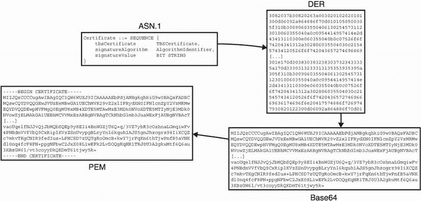

# 9 安全传输

这一章涵盖了

+   安全传输协议

+   传输层安全协议（TLS）

+   噪声协议框架

今天加密通信最大的使用量可能是为了加密通信。毕竟，加密学就是为了这个目的而发明的。为了做到这一点，应用程序通常不直接使用像认证加密这样的加密原语，而是使用更复杂的协议来抽象加密原语的使用。我将这些协议称为*安全传输协议*，因为没有更好的术语。

在本章中，你将了解到最广泛使用的安全传输协议：传输层安全协议（TLS）。我也会简要介绍其他安全传输协议以及它们与 TLS 的区别。

## 9.1 SSL 和 TLS 安全传输协议

为了理解为什么*传输协议*（用于加密机器间通信的协议）是必要的，让我们通过一个激励场景来走一遍。当你在浏览器中输入，比如说，`http://example.com`，你的浏览器会使用多个协议来连接到一个网络服务器并获取你请求的页面。其中一个是*超文本传输协议*（HTTP），你的浏览器用它来告诉另一边的网络服务器它感兴趣的是哪个页面。HTTP 使用的是一种人类可读的格式。这意味着你可以查看正在通过网络发送和接收的 HTTP 消息，并且不需要任何其他工具就可以阅读它们。但这对于你的浏览器来与网络服务器通信还不够。

HTTP 消息被封装到其他类型的消息中，称为*TCP 帧*，这些帧在传输控制协议（TCP）中定义。TCP 是一个二进制协议，因此，它不是人类可读的：你需要一个工具来理解 TCP 帧的字段。TCP 消息进一步被封装到 Internet 协议（IP）中，并且 IP 消息进一步被封装到其他东西中。这被称为*Internet 协议套件*，因为它是许多书籍的主题，我不会进一步深入讨论这个。

回到我们的场景，因为存在保密性问题，我们需要谈论一下。任何坐在你的浏览器和[example.com](http://example.com)的网络服务器之间的线上的人都有一个有趣的位置：他们可以被动地观察和读取你的请求以及服务器的响应。更糟糕的是，中间人攻击者也可以主动篡改和重新排序消息。这并不好。

想象一下，每次在互联网上购物时您的信用卡信息泄露，每次登录网站时密码被盗，每次向朋友发送图片和私人消息时被窃取等等。这足以让足够多的人感到恐慌，以至于在 1990 年代，TLS 的前身——*安全套接字层*（SSL）*协议*诞生了。虽然 SSL 可以用于不同类型的情况，但它最初是由网页浏览器构建和用于的。因此，它开始与 HTTP 一起使用，将其扩展为*超文本传输安全协议*（HTTPS）。现在，HTTPS 允许浏览器将其与访问的不同网站之间的通信安全地连接起来。

### 9.1.1 从 SSL 到 TLS

尽管 SSL 并不是唯一尝试保护网络的协议，但它吸引了大部分关注，并且随着时间的推移，已成为事实上的标准。但这并不是整个故事。在第一个 SSL 版本和我们今天使用的之间，发生了很多事情。所有版本的 SSL（最后一个是 SSL v3.0）由于设计不良和加密算法不佳的组合而被破解。（许多攻击已在 RFC 7457 中总结。）

在 SSL 3.0 之后，该协议正式转移到了互联网工程任务组（IETF），这是负责发布*请求评论*（RFCs）标准的组织。SSL 的名称被更改为 TLS，TLS 1.0 于 1999 年作为 RFC 2246 发布。TLS 的最新版本是 TLS 1.3，规定在 RFC 8446 中，并于 2018 年发布。与其前身不同，TLS 1.3 源自行业和学术界之间的紧密合作。然而，如今，互联网仍然在许多不同版本的 SSL 和 TLS 之间分裂，因为服务器更新速度缓慢。

注意 关于 SSL 和 TLS 这两个名称存在很多混淆。该协议现在被称为*TLS*，但许多文章甚至库仍然选择使用术语*SSL*。

TLS 已经不仅仅是保护网络的协议；它现在在许多不同的场景和各种类型的应用程序和设备中被用作保护通信的协议。因此，在本章中学到的关于 TLS 的知识不仅对网络有用，而且对任何需要保护两个应用程序之间通信的场景都有用。

### 9.1.2 在实践中使用 TLS

人们如何使用 TLS？首先让我们定义一些术语。在 TLS 中，想要保护通信的两个参与者被称为*客户端*和*服务器*。它的工作方式与其他网络协议（如 TCP 或 IP）相同：客户端是发起连接的一方，服务器是等待连接被发起的一方。一个 TLS 客户端通常是由

+   *一些配置*—客户端配置了它想要支持的 SSL 和 TLS 版本，愿意使用的加密算法来保护连接，可以对服务器进行身份验证的方式等。

+   *它想要连接的服务器的一些信息* — 至少包括 IP 地址和端口，但对于 Web，通常会使用完全合格的域名（如 example.com）。

有了这两个参数，客户端就可以与服务器建立连接以建立一个安全的 *会话*，这是客户端和服务器都可以用来相互分享加密消息的通道。在某些情况下，安全会话可能无法成功创建并在中途失败。例如，如果攻击者试图篡改连接，或者服务器的配置与客户端不兼容（稍后详细介绍），客户端将无法建立安全会话。

TLS 服务器通常要简单得多，因为它只需要一个配置，这与客户端的配置类似。然后服务器等待客户端连接以建立一个安全会话。在实践中，在客户端使用 TLS 可以像下面的清单所示那样简单（即，如果你使用像 Golang 这样的编程语言）。

清单 9.1 Golang 中的 TLS 客户端

```py
import "crypto/tls"

func main() {
    destination := "google.com:443"                           ❶
     TLSconfig := &tls.Config{}                               ❷
     conn, err := tls.Dial("tcp", destination, TLSconfig)
    if err != nil {
        panic("failed to connect: " + err.Error())
    }
    conn.Close()
}
```

❶ 完全合格的域名和服务器的端口（443 是 HTTPS 的默认端口）。

❷ 空配置作为默认配置。

客户端如何知道它建立的连接确实是与 [google.com](http://google.com) 而不是某个冒名顶替者？默认情况下，Golang 的 TLS 实现使用您操作系统的配置来确定如何对 TLS 服务器进行身份验证。（本章后面，您将了解 TLS 中身份验证的确切工作原理。）在服务器端使用 TLS 也非常简单。下面的清单展示了这是多么简单。

清单 9.2 Golang 中的 TLS 服务器

```py
import (
    "crypto/tls"
    "net/http"
)

func hello(rw http.ResponseWriter, req *http.Request) {
    rw.Write([]byte("Hello, world\n"))
}

func main() {
    config := &tls.Config{                                 ❶
         MinVersion: tls.VersionTLS13,                     ❶
     }                                                     ❶

    http.HandleFunc("/", hello)                            ❷

    server := &http.Server{                                ❸
         Addr:      ":8080",                               ❸
         TLSConfig: config,                                ❸
     }

    cert := "cert.pem"
    key := "key.pem"
    err := server.ListenAndServeTLS(cert, key)             ❹
     if err != nil {
        panic(err)
    }
}
```

❶ TLS 1.3 服务器的稳定最小配置

❷ 提供一个显示“Hello, world”的简单页面。

❸ 在端口 8080 上启动一个 HTTPS 服务器。

❹ 包含证书和私钥的一些 .pem 文件（稍后详细介绍）

Golang 及其标准库在这方面为我们做了很多工作。不幸的是，并非所有语言的标准库都提供易于使用的 TLS 实现，如果提供的话，也并非所有 TLS 库都提供默认安全的实现！因此，根据库的不同，配置 TLS 服务器并不总是直截了当的。在下一节中，你将了解 TLS 的内部工作原理及其不同的微妙之处。

注意 TLS 是在 TCP 之上运行的协议。为了保护 UDP 连接，我们可以使用 DTLS（*D* 代表 *数据报*，即 UDP 消息的术语），它与 TLS 非常相似。因此，本章中我忽略了 DTLS。

## 9.2 TLS 协议是如何工作的？

正如我之前所说，如今 TLS 是保护应用程序之间通信的事实标准。在本节中，您将了解 TLS 在表面下如何工作以及它在实践中的使用方式。您会发现这一节对于学习如何正确使用 TLS 以及理解大多数（如果不是全部）安全传输协议如何工作非常有用。您还将了解为什么重新设计或重新实现这些协议是困难的（并且强烈不建议）。

在高层次上，TLS 分为两个阶段，如下列表所示。图 9.1 说明了这个概念。

+   *握手阶段*—两个参与者之间协商并创建了安全通信。

+   *后握手阶段*—两个参与者之间的通信被加密。


图 9.1 在高层次上，安全传输协议首先在握手阶段创建安全连接。之后，安全连接两侧的应用程序可以安全通信。

此时，由于您在第六章学习了混合加密，您应该对这两个步骤的工作原理有以下（正确的）直觉：

+   *握手本质上只是一个密钥交换过程。* 握手最终导致两个参与者就一组对称密钥达成一致。

+   *后握手阶段纯粹是关于在参与者之间加密消息。* 这个阶段使用经过认证的加密算法和在握手结束时产生的密钥集。

大多数传输安全协议都是这样工作的，这些协议的有趣部分总是在握手阶段。接下来，让我们看看握手阶段。

### 9.2.1 TLS 握手

正如您所见，TLS（以及大多数传输安全协议）分为两部分：*握手*和*后握手*阶段。在本节中，您将首先了解握手。握手本身有四个方面，我想告诉您：

+   *协商*—TLS 高度可配置。客户端和服务器都可以配置为协商一系列 SSL 和 TLS 版本以及一组可接受的加密算法。握手的协商阶段旨在在客户端和服务器的配置之间找到共同点，以便安全连接两个对等方。

+   *密钥交换*—握手的整个目的是在两个参与者之间执行密钥交换。要使用哪种密钥交换算法？这是客户端/服务器协商过程的一部分决定的事情之一。

+   *认证*—正如您在第五章中学到的关于密钥交换的知识，中间人攻击者可以轻易冒充密钥交换的任何一方。因此，密钥交换必须经过认证。例如，您的浏览器必须有一种方式来确保它正在与 google.com 通信，而不是您的互联网服务提供商（ISP）。

+   *会话恢复*—由于浏览器经常连接到同一网站，密钥交换可能成本高昂，可能会减慢用户体验。因此，TLS 集成了快速跟踪安全会话而无需重新进行密钥交换的机制。

这是一个全面的列表！像闪电一样快，让我们从第一项开始。

TLS 中的协商：选择哪个版本和哪些算法？

TLS 中的大部分复杂性来自协议的不同部分的协商。臭名昭著的是，这种协商也是 TLS 历史上许多问题的根源。像 FREAK、LOGJAM、DROWN 等攻击利用旧版本中存在的弱点来破坏协议的更近期版本（有时甚至在服务器不支持旧版本的情况下！）。虽然并非所有协议都具有版本控制或允许协商不同算法，但 SSL/TLS 是为网络设计的。因此，SSL/TLS 需要一种方式来与可能更新缓慢的旧客户端和服务器保持向后兼容性。

这就是今天网络上发生的事情：你的浏览器可能是最新的，支持 TLS 版本 1.3，但当访问一些旧网页时，很可能其背后的服务器只支持 TLS 版本 1.2 或 1.1（或更糟糕）。反之亦然，许多网站必须支持旧浏览器，这意味着支持旧版本的 TLS（因为一些用户仍停留在过去）。

旧版 SSL 和 TLS 安全吗？

大多数 SSL 和 TLS 版本都存在安全问题，除了 TLS 版本 1.2 和 1.3。为什么不只支持最新版本（1.3）并结束呢？原因在于一些公司支持无法轻松更新的旧客户端。由于这些要求，通常会发现库实施对已知攻击的缓解措施，以安全地支持旧版本。不幸的是，这些缓解措施通常太复杂，难以正确实施。

例如，像 Lucky13 和 Bleichenbacher98 这样的著名攻击一再被安全研究人员在各种 TLS 实现中重新发现，这些实现先前曾试图修复这些问题。虽然可以减轻对旧版 TLS 的一些攻击，但我建议不要这样做，而且我不是唯一一个这样告诉你的人。2021 年 3 月，IETF 发布了 RFC 8996：“淘汰 TLS 1.0 和 TLS 1.1”，从而正式宣布了淘汰。

协商始于客户端向服务器发送第一个请求（称为*ClientHello*）。ClientHello 包含一系列支持的 SSL 和 TLS 版本，客户端愿意使用的一套加密算法，以及可能与握手的其余部分或应用程序相关的其他信息。加密算法套件包括

+   *一个或多个密钥交换算法*——TLS 1.3 定义了用于协商的以下算法：ECDH 与 P-256、P-384、P-521、X25519、X448，以及 FFDH 与 RFC 7919 中定义的群。这些内容在第五章中有介绍。TLS 的先前版本也提供了 RSA 密钥交换（在第六章中介绍），但它们已在最新版本中删除。

+   *握手的不同部分需要两个或更多数字签名算法*——TLS 1.3 规定了 RSA PKCS#1 版本 1.5 和更新的 RSA-PSS，以及更近期的椭圆曲线算法如 ECDSA 和 EdDSA。这些内容在第七章有介绍。请注意，数字签名是用散列函数指定的，这使得你可以协商使用，例如，RSA-PSS 与 SHA-256 或 SHA-512。

+   *用于 HMAC 和 HKDF 的一个或多个散列函数*——TLS 1.3 指定了 SHA-256 和 SHA-384，这是 SHA-2 散列函数的两个实例。（你在第二章学习过 SHA-2。）这种散列函数的选择与数字签名算法使用的散列函数无关。作为提醒，HMAC 是你在第三章学习的消息认证码，而 HKDF 是我们在第八章介绍的密钥派生函数。

+   *一个或多个经过身份验证的加密算法*——这些可以包括 128 位或 256 位密钥的 AES-GCM，ChaCha20-Poly1305 和 AES-CCM。这些内容在第四章有介绍。

然后服务器以*ServerHello*消息回复，其中包含从客户端的选择中精选出的每种类型的加密算法。下图描述了这个响应。


如果服务器无法找到支持的算法，它将中止连接。但在某些情况下，服务器不必中止连接，而是可以要求客户端提供更多信息。为此，服务器将以一条称为*HelloRetryRequest*的消息回复，要求提供缺失的信息。然后客户端可以重新发送其 ClientHello，这次带上额外请求的信息。

TLS 和前向安全密钥交换

密钥交换是 TLS 握手中最重要的部分！没有它，显然就没有对称密钥的协商。但是要进行密钥交换，客户端和服务器必须首先交换各自的公钥。

在 TLS 1.2 和之前的版本中，客户端和服务器只有在双方同意使用哪种密钥交换算法后才开始密钥交换。这发生在协商阶段。TLS 1.3 通过尝试同时进行协商和密钥交换来优化这个流程：客户端推测选择一个密钥交换算法，并在第一条消息（ClientHello）中发送一个公钥。如果客户端未能预测服务器选择的密钥交换算法，则客户端回退到协商的结果，并发送包含正确公钥的新 ClientHello。以下步骤描述了这种情况可能是什么样子。我在图 9.2 中说明了这种差异。

1.  客户端发送一个 TLS 1.3 ClientHello 消息，宣布它可以执行 X25519 或 X448 密钥交换。它还发送了一个 X25519 公钥。

1.  服务器不支持 X25519，但支持 X448。它向客户端发送一个 HelloRetryRequest，宣布它只支持 X448。

1.  客户端发送相同的 ClientHello，但是使用 X448 公钥。

1.  握手继续进行。


图 9.2 在 TLS 1.2 中，客户端在发送公钥之前等待服务器选择要使用的密钥交换算法。在 TLS 1.3 中，客户端推测服务器将选择哪种密钥交换算法，并在第一条消息中预先发送一个（或多个）公钥，可能避免额外的往返。

TLS 1.3 中充满了这样的优化，对于网络来说非常重要。事实上，全球许多人拥有不稳定或缓慢的连接，保持非应用通信的最低限度是非常重要的。此外，在 TLS 1.3 中（与之前的 TLS 版本不同），所有密钥交换都是*临时*的。这意味着对于每个新会话，客户端和服务器都会生成新的密钥对，然后在密钥交换完成后将其丢弃。这为密钥交换提供了*前向保密性*：客户端或服务器的长期密钥泄露不会允许攻击者解密此会话，只要临时私钥被安全删除。

想象一下，如果一个 TLS 服务器在与客户端执行每次密钥交换时都使用单个私钥会发生什么。通过执行临时密钥交换并在握手结束后立即摆脱私钥，服务器可以防止此类攻击者。我在图 9.3 中进行了说明。


图 9.3 在 TLS 1.3 中，每个会话都以临时密钥交换开始。如果服务器在某个时间点被攻破，之前的会话不会受到影响。

练习

如果服务器的私钥在某个时间点被泄露，那么中间人攻击者将能够解密所有先前记录的对话。你明白这是如何发生的吗？

一旦临时公钥交换完成，就会执行密钥交换，并且可以推导出密钥。TLS 1.3 在不同时间点推导出不同的密钥，以使用独立密钥加密不同的阶段。

前两条消息，即 ClientHello 和 ServerHello，在此时不能加密，因为此时没有交换公钥。但是在此之后，一旦密钥交换发生，TLS 1.3 就会加密握手的其余部分。（这与之前的 TLS 版本不同，之前的版本没有加密任何握手消息。）

为了推导出不同的密钥，TLS 1.3 使用与协商的哈希函数的 HKDF。在密钥交换的输出上使用 HKDF-Extract 来消除任何偏差，而使用不同的 `info` 参数与 HKDF-Expand 来推导出加密密钥。例如，`tls13` `c` `hs` `traffic`（表示“客户端握手流量”）用于推导出客户端在握手期间加密到服务器的对称密钥，而 `tls13` `s` `ap` `traffic`（表示“服务器应用流量”）用于推导出服务器在握手之后加密到客户端的对称密钥。请记住，*未经身份验证* 的密钥交换是不安全的！接下来，您将看到 TLS 如何解决此问题。

TLS 身份验证和 web 公钥基础设施

经过一些协商和密钥交换之后，握手必须继续。接下来发生的是 TLS 的另一个最重要的部分 —— *身份验证*。在密钥交换的第五章中，您看到拦截密钥交换并冒充密钥交换的一方或双方是微不足道的。在本节中，我将解释您的浏览器如何通过密码验证确保它正在与正确的网站通信，而不是与冒充者通信。但首先，让我们退一步。实际上，TLS 1.3 握手分为三个不同的阶段（如图 9.4 所示）：

1.  *密钥交换* —— 此阶段包含提供一些协商并执行密钥交换的 *ClientHello* 和 *ServerHello* 消息。此阶段之后的所有消息，包括握手消息，在此阶段之后都将被加密。

1.  *服务器参数* —— 此阶段的消息包含来自服务器的附加协商数据。这是不必包含在服务器的第一条消息中的协商数据，但是可以受益于加密。

1.  *身份验证* —— 此阶段包括来自服务器和客户端的身份验证信息。


图 9.4 TLS 1.3 握手分为三个阶段：密钥交换阶段、服务器参数阶段以及（最后）身份验证阶段。

在网络上，TLS 中的身份验证通常是单向的。只有浏览器验证例如 google.com 是否确实是 google.com，但是 google.com 不验证您是谁（或至少不是作为 TLS 的一部分）。

双向认证的 TLS

客户端认证通常通过应用层进行，最常见的方式是通过一个表单要求您输入凭据。也就是说，如果服务器在服务器参数阶段请求，客户端认证也可以在 TLS 中发生。当连接的双方都经过认证时，我们称之为*相互认证的 TLS*（有时缩写为 mTLS）。

客户端认证与服务器认证的方式相同。这可以在服务器认证之后的任何时候发生（例如，在握手期间或在握手后阶段）。

现在让我们回答一个问题，“当连接到 google.com 时，您的浏览器如何验证您确实正在与 google.com 握手？”答案是通过使用*web 公钥基础设施（web PKI）*。

在第七章关于数字签名中，您了解了公钥基础设施的概念，但让我简要地重新介绍一下这个概念，因为它在理解 Web 运作方式方面非常重要。Web PKI 有两个方面。首先，浏览器必须信任一组我们称之为*证书颁发机构*（CAs）的根公钥。通常，浏览器要么使用一组硬编码的受信任公钥，要么依赖操作系统提供它们。

web PKI

对于 Web，存在数百家由世界各地不同公司和组织独立运行的这些 CA。这是一个相当复杂的系统，这些 CA 有时也可以签署中间 CA 的公钥，而中间 CA 反过来也有权签署网站的公钥。因此，像*证书颁发机构浏览器论坛*（CA/Browser Forum）这样的组织制定规则，并决定何时新组织可以加入受信任公钥集合，或者何时 CA 不再可信并必须从该集合中移除。

其次，想要使用 HTTPS 的网站必须有一种方式从这些 CA 那里获取认证（对其签名公钥的签名）。为了做到这一点，网站所有者（或者我们过去常说的网站管理员）必须向 CA 证明他们拥有特定的域名。

注意：为自己的网站获取证书过去需要支付费用。现在情况已经不同了，因为像 Let's Encrypt 这样的 CA 提供免费证书。

要证明你拥有 example.com，例如，CA 可能会要求你在 example.com/some_path/file.txt 上托管一个包含为你的请求生成的一些随机数字的文件。以下漫画展示了这个交换过程。


在此之后，CA 可以对网站的公钥提供签名。由于 CA 的签名通常有效期数年，我们称其为长期签名公钥（与临时公钥相对）。更具体地说，CA 实际上并不签署公钥，而是签署*证书*（稍后详细介绍）。证书包含长期公钥，以及一些额外重要的元数据，如网页的域名。

为了向您的浏览器证明其正在与 google.com 通信，服务器在 TLS 握手的一部分发送一个*证书链*。该链包括

+   其自身的叶子证书，包含（其他内容）域名（[google .com](http://google.com)，例如），谷歌的长期签名公钥，以及 CA 的签名

+   从签署谷歌证书的中间 CA 证书链到签署最后一个中间 CA 的根 CA 的一系列中间 CA 证书

这有点冗长，所以我在图 9.5 中进行了说明。


图 9.5 Web 浏览器只需信任相对较小的一组根 CA 即可信任整个网络。这些 CA 存储在所谓的*信任存储*中。为了让浏览器信任网站，该网站必须将其叶子证书签名为这些 CA 之一。有时根 CA 只签署中间 CA，然后中间 CA 签署其他中间 CA 或叶子证书。这就是所谓的 Web PKI。

服务器通过 TLS 消息和客户端发送证书链，就好像要求客户端进行身份验证一样。随后，服务器可以使用其经过认证的长期密钥对来签署所有已接收和先前发送的握手消息，这称为*CertificateVerify*消息。图 9.6 回顾了这个流程，其中只有服务器对自己进行身份验证。

CertificateVerify 消息中的签名向客户端证明了服务器目前所见的内容。如果没有此签名，中间人攻击者可以拦截服务器的握手消息，并替换 ServerHello 消息中包含的服务器的临时公钥，从而使攻击者能够成功冒充服务器。请花点时间理解在 CertificateVerify 签名存在的情况下，攻击者为何不能替换服务器的临时公钥。


图 9.6 握手的身份验证部分始于服务器向客户端发送证书链。证书链以叶子证书开始（包含网站的公钥和附加元数据，如域名），并以浏览器信任的根证书结束。每个证书都包含上面证书的签名。

故事时间

几年前，我被聘请来审查一个大公司制作的自定义 TLS 协议。结果他们的协议让服务器提供了一个不包含临时密钥的签名。当我告诉他们这个问题时，整个房间沉默了整整一分钟。这当然是一个重大错误：一个能够拦截自定义握手并用自己的密钥替换临时密钥的攻击者将成功冒充服务器。

这里的教训是重复造轮子很重要。安全传输协议很难正确实现，如果历史已经表明了什么，那就是它们可能以许多意想不到的方式失败。相反，你应该依赖于成熟的协议如 TLS，并确保你使用的是一个受到大量公众关注的流行实现。

最后，为了正式结束握手，连接的双方都必须在身份验证阶段发送一个 *Finished* 消息。Finished 消息包含一个由 HMAC 生成的认证标签，用于与会话协商的哈希函数。这允许客户端和服务器告诉对方，“这些是我在这个握手过程中发送和接收的所有消息的顺序。”如果握手被中间人攻击者拦截和篡改，这个完整性检查允许参与者检测并中止连接。这尤其有用，因为一些握手模式*没有*签名（稍后详细介绍）。

在继续谈握手的不同方面之前，让我们先来看看 X.509 证书。它们是许多密码协议的重要细节。

通过 X.509 证书进行身份验证

虽然在 TLS 1.3 中证书是可选的（您始终可以使用普通密钥），但许多应用程序和协议，不仅仅是网络，都大量使用它们来认证额外的元数据。具体来说，使用了 X.509 证书标准第 3 版。

X.509 是一个相当古老的标准，旨在足够灵活，可以用于多种场景：从电子邮件到网页。X.509 标准使用了一种称为 *Abstract Syntax Notation One* (ASN.1) 的描述语言来指定证书中包含的信息。在 ASN.1 中描述的数据结构如下所示：

```py
Certificate  ::=  SEQUENCE  {
    tbsCertificate       TBSCertificate,
    signatureAlgorithm   AlgorithmIdentifier,
    signatureValue       BIT STRING  }
```

你可以把它看作是一个包含三个字段的结构：

+   `tbsCertificate` — 待签名的证书。这包含了想要认证的所有信息。对于网络，这可以包含域名（例如 google.com）、公钥、过期日期等。

+   `signatureAlgorithm` — 用于签署证书的算法。

+   `signatureValue` — 来自 CA 的签名。

练习

值 `signatureAlgorithm` 和 `signatureValue` 不包含在实际的证书 `tbsCertificate` 中。你知道为什么吗？

您可以通过使用 HTTPS 连接到任何网站，然后使用浏览器功能观察服务器发送的证书链来轻松检查 X.509 证书中的内容。请参见图 9.7 以获取示例。


图 9.7 使用 Chrome 的证书查看器，我们可以观察到谷歌服务器发送的证书链。根 CA 是 Global Sign，这是您的浏览器信任的。在链中，一个名为 GTS CA 101 的中间 CA 由于其证书包含来自 Global Sign 的签名而受到信任。反过来，谷歌的叶子证书，适用于*.google.com（google.com，mail.google.com 等），包含来自 GTS CA 101 的签名。

您可能会遇到以.pem 文件形式存在的 X.509 证书，其中包含一些被 base64 编码的内容，周围包含一些人类可读的提示，说明 base64 编码的数据包含的内容（这里是一个证书）。以下代码片段表示.pem 格式证书的内容：

```py
-----BEGIN CERTIFICATE-----
MIIJQzCCCCugAwIBAgIQC1QW6WUXJ9ICAAAAAEbPdjANBgkqhkiG9w0BAQsFADBC
MQswCQYDVQQGEwJVUzEeMBwGA1UEChMVR29vZ2xlIFRydXN0IFNlcnZpY2VzMRMw
EQYDVQQDEwpHVFMgQ0EgMU8xMB4XDTE5MTAwMzE3MDk0NVoXDTE5MTIyNjE3MDk0
NVowZjELMAkGA1UEBhMCVVMxEzARBgNVBAgTCkNhbGlmb3JuaWExFjAUBgNVBAcT
[...]
vaoUqelfNJJvQjJbMQbSQEp9y8EIi4BnWGZjU6Q+q/3VZ7ybR3cOzhnaLGmqiwFv
4PNBdnVVfVbQ9CxRiplKVzZSnUvypgBLryYnl6kquh1AJS5gnJhzogrz98IiXCQZ
c7mkvTKgCNIR9fedIus+LPHCSD7zUQTgRoOmcB+kwY7jrFqKn6thTjwPnfB5aVNK
dl0nq4fcF8PN+ppgNFbwC2JxX08L1wEFk2LvDOQgKqHR1TRJ0U3A2gkuMtf6Q6au
3KBzGW6l/vt3coyyDkQKDmT61tjwy5k=
-----END CERTIFICATE-----
```

如果您解码被`BEGIN` `CERTIFICATE`和`END` `CERTIFICATE`包围的 base64 内容，您将得到一个*Distinguished Encoding Rules*（DER）编码的证书。DER 是一种*确定性*（只有一种编码方式）的二进制编码，用于将 X.509 证书转换为字节。所有这些编码对新手来说通常相当令人困惑！我在图 9.8 中总结了所有这些。



图 9.8 在左上角，使用 ASN.1 表示法编写了一个 X.509 证书。然后将其转换为可以通过 DER 编码进行签名的字节。由于这不是可以轻松复制或被人类识别的文本，因此进行了 base64 编码。最后一步是使用 PEM 格式将 base64 数据包装在一些方便的上下文信息中。

DER 只编码信息为“这是一个整数”或“这是一个字节数组”。在编码后，ASN.1 中描述的字段名称（如`tbsCertificate`）将丢失。因此，如果没有原始 ASN.1 描述每个字段真正含义的知识，解码 DER 就毫无意义。像 OpenSSL 这样的便捷命令行工具允许您解码和将 DER 编码的证书内容翻译成人类术语。例如，如果您下载 google.com 的证书，您可以使用以下代码片段在终端中显示其内容。

```py
$ openssl x509 -in google.pem -text
Certificate:
    Data:
        Version: 3 (0x2)
        Serial Number:
            0b:54:16:e9:65:17:27:d2:02:00:00:00:00:46:cf:76
        Signature Algorithm: sha256WithRSAEncryption
        Issuer: C = US, O = Google Trust Services, CN = GTS CA 1O1
        Validity
            Not Before: Oct  3 17:09:45 2019 GMT
            Not After : Dec 26 17:09:45 2019 GMT
        Subject: C = US, ST = California, L = Mountain View, O = Google LLC,
CN = *.google.com
        Subject Public Key Info:
            Public Key Algorithm: id-ecPublicKey
                Public-Key: (256 bit)
                pub:
                    04:74:25:79:7d:6f:77:e4:7e:af:fb:1a:eb:4d:41:
                    b5:27:10:4a:9e:b8:a2:8c:83:ee:d2:0f:12:7f:d1:
                    77:a7:0f:79:fe:4b:cb:b7:ed:c6:94:4a:b2:6d:40:
                    5c:31:68:18:b6:df:ba:35:e7:f3:7e:af:39:2d:5b:
                    43:2d:48:0a:54
                ASN1 OID: prime256v1
                NIST CURVE: P-256
[...]
```

尽管如此，X.509 证书颇具争议。在 2012 年，一组研究人员将验证 X.509 证书戏称为“世界上最危险的代码”。这是因为 DER 编码是一个难以正确解析的协议，而 X.509 证书的复杂性可能导致许多错误具有潜在的破坏性。因此，我不建议任何现代应用程序使用 X.509 证书，除非必须使用。

预共享密钥和 TLS 中的会话恢复，或者如何避免密钥交换

密钥交换可能是昂贵的，有时是不必要的。例如，您可能有两台只连接到彼此的机器，并且您可能不想为了保护它们之间的通信而处理公钥基础结构。TLS 1.3 提供了一种使用*预共享密钥*（PSKs）避免这种开销的方法。PSK 只是客户端和服务器都知道的一个密钥，可以用来为会话导出对称密钥。

在 TLS 1.3 中，PSK 握手的工作原理是使客户端在其 ClientHello 消息中宣布它支持一系列 PSK 标识符。如果服务器识别其中一个 PSK ID，它可以在其响应中（ServerHello 消息）表示如此，然后双方可以避免进行密钥交换（如果他们想要的话）。通过这样做，认证阶段被跳过，使得握手结束时的 Finished 消息成为防止中间人攻击的重要手段。

客户端随机和服务器随机

一个热心的读者可能已经注意到，临时公钥为会话带来了随机性，如果没有它们，握手结束时的对称会话密钥可能始终相同。为不同的会话使用不同的对称密钥非常重要，因为您不希望这些会话被关联起来。更糟糕的是，由于会话之间的加密消息可能不同，这可能导致使用 nonce 重用及其灾难性后果（见第四章）。

为了减轻这一点，客户端 Hello 和服务器 Hello 消息都有一个`random`字段，为每个新会话随机生成（通常称为*客户端随机*和*服务器随机*）。由于这些随机值用于在 TLS 中导出对称密钥，因此它有效地为每个新连接的会话对称密钥进行了随机化。

PSK 的另一个用例是*会话恢复*。会话恢复是指重用从先前会话或连接创建的密钥的过程。如果您已经连接到 google.com 并已验证其证书链，执行了密钥交换，同意了共享密钥等等，为什么在几分钟或几小时后重新访问时还要再做一次这个过程呢？TLS 1.3 提供了一种在成功执行握手后生成 PSK 的方法，该方法可用于后续连接，以避免必须重新执行完整的握手。

如果服务器想提供此功能，它可以在后握手阶段的任何时候发送一个新的会话票证消息。服务器可以通过几种方式创建所谓的*会话票证*。例如，服务器可以发送一个与数据库中相关信息关联的标识符。这不是唯一的方式，但由于这种机制相当复杂，而且大多数情况下并不必要，所以我在本章中不会深入讨论更多。接下来，让我们看看 TLS 中最简单的部分——通信最终如何加密。

### 9.2.2 TLS 1.3 如何加密应用数据

一旦握手完成并派生了对称密钥，客户端和服务器都可以相互发送加密的应用程序数据。TLS 还确保这样的消息不能被重播或重新排序！为了做到这一点，认证加密算法使用的 nonce 从一个固定值开始，并在每个新消息中递增。如果消息被重播或重新排序，nonce 将与预期值不同，解密将失败。当发生这种情况时，连接将被终止。

隐藏明文长度

正如您在第四章中学到的，加密并不总是隐藏被加密内容的长度。TLS 1.3 附带了*记录填充*，您可以配置为在加密之前使用随机数量的零字节填充应用程序数据，从而有效地隐藏消息的真实长度。尽管如此，可能存在去除添加噪声的统计攻击，并且不容易缓解它们。如果您确实需要这种安全属性，您应该参考 TLS 1.3 规范。

从 TLS 1.3 开始，如果服务器决定允许，客户端可以在 ClientHello 消息之后的第一系列消息中发送加密数据。这意味着浏览器不一定需要等到握手结束才开始向服务器发送应用数据。这种机制称为*早期数据*或*0-RTT*（零往返时间）。它只能与 PSK 的组合一起使用，因为它允许在 ClientHello 消息期间派生对称密钥。

注意 这个特性在 TLS 1.3 标准制定过程中引起了很大争议，因为被动攻击者可以重放观察到的 ClientHello，然后是加密的 0-RTT 数据。这就是为什么只能使用 0-RTT 来传输可以安全重播的应用程序数据。

对于网络，浏览器将每个 GET 查询视为*幂等*，这意味着 GET 查询不应更改服务器端的状态，只能用于检索数据（与 POST 查询不同）。当然，并不总是如此，应用程序可以随心所欲。因此，如果您面临是否使用 0-RTT 的决定，最简单的方法就是不要使用它。

## 9.3 加密网络的当前状态

如今，标准推动废弃所有不是 TLS 版本 1.2 和 TLS 1.3 的 SSL 和 TLS 版本。然而，由于旧客户端和服务器，许多库和应用程序仍然支持协议的旧版本（有时直到 SSL 版本 3！）。这并不是一件简单的事情，由于需要防御的漏洞数量，许多难以实现的缓解措施必须得到维护。

警告 使用 TLS 1.3（和 TLS 1.2）被认为是安全和最佳实践。使用任何更低版本意味着您将需要咨询专家，并且必须想办法避免已知的漏洞。

默认情况下，浏览器仍然使用 HTTP 连接到 Web 服务器，网站仍然必须手动向 CA 申请证书。这意味着使用当前协议，Web 永远不会完全加密，尽管一些估计显示截至 2019 年全球 Web 流量的 90% 已加密。

默认情况下，您的浏览器始终使用不安全的连接也是一个问题。现今的 Web 服务器通常会将通过 HTTP 访问其页面的用户重定向到 HTTPS。Web 服务器还可以（而且通常会）告诉浏览器使用 HTTPS 进行后续连接。这是通过一个名为*HTTP 严格传输安全*（HSTS）的 HTTPS 响应头完成的。然而，对网站的第一次连接仍然不受保护（除非用户考虑在地址栏中键入 `https`），并且可以被拦截以移除到 HTTPS 的重定向。

此外，其他像*NTP*（获取当前时间）和*DNS*（获取域名背后的 IP）等 Web 协议目前主要是未加密的，并容易受到中间人攻击。虽然有研究努力改善现状，但这些都是需要注意的攻击向量。

TLS 用户面临的另一个威胁是行为不端的 CA。如果今天，一个 CA 决定为您的域名签发证书和它控制的公钥，会怎么样？如果它可以获取 MITM 位置，它可以开始冒充您的网站向您的用户发送消息。如果您控制连接的客户端部分，明显的解决方案是要么不使用 Web PKI（并依赖自己的 PKI），要么将特定证书或公钥*固定*。

证书或公钥固定是一种技术，其中服务器的证书（通常是其哈希），或者公钥，直接硬编码在客户端代码中。如果服务器未提供预期的证书，或者证书不包含预期的长期公钥，客户端会在握手的认证阶段中中止连接。这种做法通常在移动应用程序中使用，因为它们确切地知道服务器的公钥或证书应该是什么样子的（不像浏览器必须连接到无数的服务器）。然而，硬编码证书和公钥并非总是可行的，还有其他两种机制共存来处理不良证书：

+   *证书吊销*—顾名思义，这允许 CA 撤销证书并警告浏览器。

+   *证书监控*—这是一个相对较新的系统，强制 CA 公开记录每个签发的证书。

证书吊销的故事在历史上一直曲折。首先提出的解决方案是*证书吊销列表*（CRLs），它允许 CA 维护一份吊销的证书列表，即不再被视为有效的证书。CRLs 的问题在于它们可能会变得相当庞大，并且需要不断检查。

CRLs 已被淘汰，取而代之的是*在线证书状态协议*（OCSP），这是一种简单的网络接口，您可以查询以查看证书是否被吊销。OCSP 也有自己的问题：它要求 CA 拥有一个高度可用的服务来回答 OCSP 请求，它会向 CA 泄漏网络流量信息，并且浏览器经常决定忽略超时的 OCSP 请求（以不干扰用户体验）。目前的解决方案是通过*OCSP 装订*来增强 OCSP：网站负责查询 CA 签署其证书状态的响应，并在 TLS 握手期间将响应附加（装订）到其证书上。我在图 9.9 中回顾了这三种解决方案。


图 9.9 网络上的证书吊销有三种流行的解决方案：证书吊销列表（CRLs）、在线证书状态协议（OCSP）和 OCSP 装订。

证书吊销可能看起来不是一个主要的支持功能（特别是对比全球网络的较小系统），直到证书被 compromise。就像汽车安全带一样，证书吊销是一个大部分时间无用但在罕见情况下可能拯救生命的安全功能。这就是我们在安全领域所说的“深度防御”。

注意 对于网络来说，证书吊销在很大程度上被证明是一个明智的决定。在 2014 年，心脏出血漏洞证明是 SSL 和 TLS 历史上最具破坏性的漏洞之一。最广泛使用的 SSL/TLS 实现（OpenSSL）被发现存在*缓冲区过读*漏洞（超出数组限制的读取），允许任何人向任何 OpenSSL 服务器发送一个特制消息并接收其内存转储，通常会显示其长期私钥。

然而，如果 CA 真的行为不端，它可以决定不吊销恶意证书或不报告它们。问题在于我们在盲目地信任一定数量的行为者（CA）做正确的事情。为了在规模上解决这个问题，*证书透明度*在 2012 年由谷歌提出。证书透明度的背后思想是强制 CA 将每个颁发的证书添加到一个巨大的证书日志中供所有人查看。为了做到这一点，像 Chrome 这样的浏览器现在会拒绝那些不包含在公共日志中的证书。这种透明度允许您检查是否为您拥有的域错误颁发了证书（过去应该没有其他证书除了您以前请求的）。

请注意，证书透明度依赖于人们监控自己域的日志以在事后捕捉到不良证书。CA 也必须迅速做出反应，一旦检测到错误颁发的证书就吊销它们。在极端情况下，浏览器有时会从信任存储中移除行为不端的 CA。因此，证书透明度并不像证书或公钥固定那样强大，可以减轻 CA 的不端行为。

## 9.4 其他安全传输协议

您现在已经了解了 TLS，这是加密通信的最流行协议。但是，您还没有完成。TLS 并不是安全传输协议类中唯一的协议。还有许多其他协议存在，您很可能已经在使用它们。然而，大多数都是类似 TLS 的协议，定制以支持特定用例。例如：

+   *Secure Shell (SSH)*—用于安全连接到不同机器上的远程终端的最广泛使用的协议和应用程序。

+   *Wi-Fi Protected Access (WPA)*—连接设备到私人网络访问点或互联网的最流行协议。

+   *IPSec*—用于连接不同私人网络的最流行的虚拟网络协议（VPN）之一。它主要由公司用于连接不同办公网络。正如其名称所示，它在 IP 层起作用，通常在路由器、防火墙和其他网络设备中找到。另一个流行的 VPN 是 OpenVPN，它直接使用 TLS。

所有这些协议通常重新实现握手/后握手范式并在其上添加一些自己的特色。重新发明轮子并非没有问题，例如，几种 Wi-Fi 协议已经被破解。为了完成本章，我想向您介绍*噪声协议框架*。噪声是 TLS 的一个更现代的替代品。

## 9.5 噪声协议框架：TLS 的现代替代品

由于历史原因、向后兼容性约束和整体复杂性，TLS 现在已经相当成熟，并在大多数情况下被认为是一个可靠的解决方案。然而，TLS 给使用它的应用程序增加了很多开销，这是由于历史原因、向后兼容性约束和整体复杂性。实际上，在许多情况下，您可能不需要 TLS 提供的所有功能，尤其是在您控制所有端点的情况下。下一个最佳解决方案被称为*噪声协议框架*。

噪声协议框架通过避免握手中的所有协商来消除 TLS 的运行时复杂性。运行噪声的客户端和服务器遵循一个不分支的线性协议。与可以根据不同握手消息中包含的信息采取许多不同路径的 TLS 相比，噪声将所有复杂性推到设计阶段。

想要使用噪声协议框架的开发人员必须决定他们的应用程序要使用框架的什么特定实例。 (这就是为什么它被称为协议*框架*而不是协议。) 因此，他们必须首先决定将使用什么加密算法，哪一端的连接被认证，是否使用任何预共享密钥等。之后，协议被实现并变成一系列严格的消息，如果需要在维护与无法更新的设备的向后兼容性的同时稍后更新协议可能会成为问题。

### 9.5.1 噪声的许多握手

Noise 协议框架提供了不同的*握手模式*供您选择。握手模式通常带有指示正在进行的操作的名称。例如，*IK* 握手模式表示客户端的公钥作为握手的一部分被发送（第一个 *I* 表示*即时*），并且服务器的公钥已被客户端预先知道（*K* 表示*已知*）。一旦选择了握手模式，使用它的应用程序将永远不会尝试执行任何其他可能的握手模式。与 TLS 相反，这使得 Noise 在实践中成为一个简单而线性的协议。

在本节的其余部分中，我将使用一个名为 *NN* 的握手模式来解释 Noise 的工作原理。这个模式足够简单来解释，但是不安全，因为有两个 *N* 表示双方都没有进行认证。在 Noise 的术语中，该模式被写成这样：

```py
NN:
  -> e
  <- e, ee
```

每一行代表一个消息模式，箭头指示消息的方向。每个消息模式都是一系列标记的连续（这里只有两个：`e` 和 `ee`），指示连接的两侧需要做什么：

+   `->` `e`—表示客户端必须生成临时密钥对并将公钥发送给服务器。服务器解释此消息方式不同：它必须接收临时公钥并存储它。

+   `<-` `e,` `ee`—表示服务器必须生成临时密钥对，并将公钥发送给客户端，然后必须与客户端的临时（第一个 `e`）和自己的临时（第二个 `e`）进行 Diffie-Hellman（DH）密钥交换。另一方面，客户端必须从服务器接收临时公钥，并使用它进行 DH 密钥交换。

注意 Noise 使用一组定义的标记来指定不同类型的握手方式。例如，`s` 标记表示*静态密钥*（另一个词是*长期密钥*），而不是临时密钥，而 `es` 标记表示两个参与者必须使用客户端的临时密钥和服务器的静态密钥进行 DH 密钥交换。

这还不止：在每个消息模式（`->` `e` 和 `<-` `e,` `ee`）的结尾，发送方还可以传输有效载荷。如果先前进行了 DH 密钥交换（这在第一个消息模式 `->` `e` 中并非如此），则有效载荷将被加密和验证。在握手结束时，双方派生一组对称密钥，并开始像 TLS 一样加密通信。

### 9.5.2 使用 Noise 进行握手

Noise 的一个特点是它持续验证其握手记录。为了实现这一点，双方维护两个变量：哈希（`h`）和链接密钥（`ck`）。发送或接收的每个握手消息都与上一个 `h` 值一起进行哈希处理。我在图 9.10 中说明了这一点。


在噪声协议框架中，连接的每一侧都跟踪一条摘要`h`，其中包括在握手期间发送和接收的所有消息。当发送消息并使用带有相关数据的认证加密（AEAD）算法进行加密时，当前的`h`值将用作相关数据，以便对到目前为止的握手进行认证。

在每个消息模式结束时，一个（可能为空的）有效负载将使用带有相关数据的认证加密（AEAD）算法（在第四章中介绍）进行加密。发生这种情况时，`h`值将通过 AEAD 的相关数据字段进行认证。这使得噪声能够持续验证连接的双方是否以相同的消息序列和相同的顺序进行查看。

此外，每当进行 DH 密钥交换时（在握手期间可能会发生多次），其输出将连同前一个链密钥（`ck`）一起输入到 HKDF 中，该密钥将导出一个新的链密钥和一组新的对称密钥，以用于对随后的消息进行认证和加密。我在图 9.11 中说明了这一点。


在噪声协议框架中，连接的每一侧都跟踪一个*链密钥*，`ck`。每次执行 DH 密钥交换时，此值都用于导出新的链密钥和新的加密密钥，以在协议中使用。

这使得噪声在运行时成为一个简单的协议；没有分支，连接的双方只需做他们需要做的事情。实现噪声的库也非常简单，最终只有几百行代码，而 TLS 库有数十万行代码。虽然噪声使用起来更复杂，需要了解噪声如何工作的开发人员将其集成到应用程序中，但它是 TLS 的强大替代品。

## 摘要

+   传输层安全性（TLS）是一种安全传输协议，用于加密机器之间的通信。它以前被称为安全套接字层（SSL），有时仍然被称为 SSL。

+   TLS 在 TCP 之上运行，并且每天都用于保护浏览器、网络服务器、移动应用程序等之间的连接。

+   为了在用户数据报协议（UDP）之上保护会话，TLS 有一种称为数据报传输层安全性（DTLS）的变体，它与 UDP 一起使用。

+   TLS 和大多数其他传输安全协议都有一个握手阶段（在此阶段创建安全协商）和一个后握手阶段（在此阶段使用从第一阶段导出的密钥进行加密通信）。

+   为了避免向 Web 公钥基础设施委托过多的信任，使用 TLS 的应用程序可以使用证书和公钥固定来仅允许与特定证书或公钥进行安全通信。

+   作为深度防御措施，系统可以实现证书吊销（以删除受损的证书）和监视（以检测到受损的证书或 CA）。

+   为了避免 TLS 的复杂性和大小以及连接双方是否受控制，可以使用 Noise 协议框架。

+   要使用 Noise，必须在设计协议时决定要使用哪种握手的变体。因此，它比 TLS 更简单、更安全，但灵活性较差。
