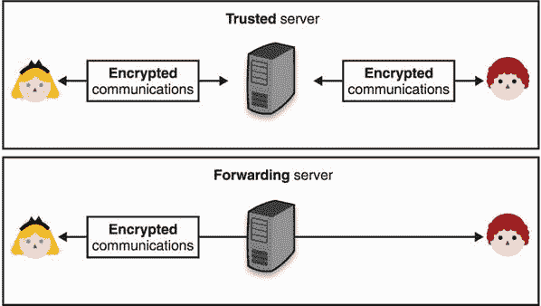
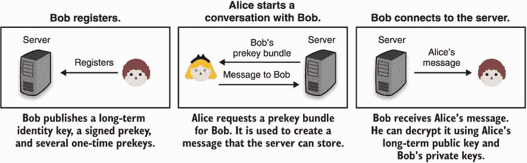

# 第十章：端到端加密

本章涵盖

+   端到端加密及其重要性

+   解决电子邮件加密的不同尝试

+   端到端加密如何改变消息传递的格局

第九章解释了通过诸如 TLS 和 Noise 等协议的传输安全。同时，我花了相当多的时间解释了信任在网络上的根基：由您的浏览器和操作系统信任的数百个证书颁发机构（CA）。虽然并不完美，但这个系统迄今为止在 Web 上运作良好，Web 是一个复杂的参与者网络，他们彼此一无所知。

找到信任他人（及其公钥）并使其规模化的方法是现实世界密码学的核心问题。一位著名的密码学家曾经说过，“对称加密问题已经解决了”，以描述一门已经过时的研究领域。而且，在很大程度上，这种说法是正确的。我们很少遇到加密通信的问题，我们对当前使用的加密算法有很强的信心。在加密方面，大多数工程挑战不再是关于算法本身，而是关于谁是 Alice 和 Bob 以及如何证明它的问题。

密码学没有提供对信任的一个解决方案，而是提供了许多不同的解决方案，这些解决方案更或者更少地依赖于上下文。在本章中，我将调查人们和应用程序用于创建用户之间信任的一些不同技术。

## 10.1 为什么端到端加密？

本章以“为什么”而不是“什么”开始。这是因为端到端加密是一个概念而不是一个密码协议；它是一个在敌对路径上保护两个（或更多）参与者之间通信的概念。我在这本书中以一个简单的例子开始：女王 Alice 想要向爵士 Bob 发送一条消息，而中间没有任何人能够看到。如今，许多应用程序如电子邮件和消息传递存在以连接用户的方式，并且大多数情况下很少对消息进行端到端加密。

你可能会问，TLS 不够吗？在理论上，它可能足够。在第九章中，你了解到 TLS 被用于许多地方来保护通信。但端到端加密是涉及实际人类的概念。相比之下，TLS 大多被设计为“中间人”，在这些系统中，TLS 仅用于保护中央服务器与其用户之间的通信，允许服务器看到一切。实际上，这些 MITM 服务器位于用户之间，对应用程序的功能是必要的，并且是协议的*受信任的第三方*。也就是说，为了使协议被视为安全（剧透警告：这不是一个很好的协议），我们必须信任系统的这些部分。

图 10.1 在大多数系统中，一个中央服务器（顶部图表）在用户之间传递消息。通常在用户和中央服务器之间建立安全连接，因此中央服务器可以看到所有用户消息。提供端到端加密的协议（底部图表）将通信从一个用户加密到其预期接收者，防止中间任何服务器观察明文消息。

在实践中，存在更糟糕的拓扑结构。用户和服务器之间的通信可能经过许多网络跳点，其中一些跳点可能是查看流量的机器（通常称为*中间盒*）。即使流量被加密，有些中间盒被设置为终止 TLS 连接（我们称之为*终止 TLS*），然后要么从那一点开始明文转发流量，要么与下一个跳点建立另一个 TLS 连接。有时终止 TLS 是出于“好”的原因：为了更好地过滤流量，地理上或数据中心内部平衡连接等。这增加了攻击面，因为流量现在在更多地方以明文形式可见。有时，终止 TLS 是出于“坏”的原因：为了拦截、记录和监视流量。

2015 年，联想被发现销售预装有自定义 CA（在第九章中介绍）和软件的笔记本电脑。该软件使用联想的 CA 进行 HTTPS 连接的中间人攻击，并向网页注入广告。更令人担忧的是，像中国和俄罗斯这样的大国被发现在互联网上重定向流量，使其经过他们的网络以拦截和观察连接。2013 年，爱德华·斯诺登泄露了来自 NSA 的大量文件，显示了许多政府（不仅仅是美国）在通过拦截连接世界的互联网电缆来监视人们通信方面的滥用行为。

拥有和查看用户数据对公司也是一种责任。正如我在本书中多次提到的那样，数据泄震和黑客攻击发生得太频繁，可能对公司的信誉造成毁灭性打击。从法律角度来看，像《通用数据保护条例》（GDPR）这样的法律可能会让组织付出巨额代价。政府要求，比如臭名昭著的国家安全信函（NSLs），有时会阻止公司和相关人员甚至提及他们收到了信函（所谓的禁言令），这也可以被视为对组织的额外成本和压力，除非你没有太多可以分享的内容。

总的来说，如果你正在使用一个流行的在线应用程序，很可能一个或多个政府已经可以访问或有能力访问你在那里写下或上传的所有内容。根据应用程序的*威胁模型*（应用程序想要防范的威胁）或应用程序最容易受到攻击的用户的威胁模型，端到端加密在确保最终用户的机密性和隐私方面发挥着重要作用。

本章介绍了为建立人与人之间的信任而创建的不同技术和协议。特别是，你将了解当今电子邮件加密的工作原理以及安全消息传递如何改变端到端加密通信的格局。

## 10.2 无处可寻的信任根源

最简单的端到端加密场景之一是：Alice 想要通过互联网向 Bob 发送加密文件。通过本书前几章学到的所有加密算法，你可能可以想到一种方法来实现这一点。例如

1.  Bob 向 Alice 发送他的公钥。

1.  Alice 用 Bob 的公钥加密文件并发送给 Bob。

或许 Alice 和 Bob 可以在现实生活中见面，或者使用他们已经共享的另一个安全渠道来在第一条消息中交换公钥。如果这是可能的，我们称他们有一种*out-of-band*的方式来建立信任。然而，并非总是如此。你可以想象我在这本书中包含了我的公钥，并要求你使用它向我发送加密消息到某个电子邮件地址。谁说我的编辑没有用她的公钥替换我的公钥呢？

对于 Alice 也是一样：她如何确定她收到的公钥是否真的是 Bob 的公钥？中间某人可能篡改了第一条消息。正如你将在本章中看到的，密码学对于这个信任问题没有真正的答案。相反，它提供了不同的解决方案来帮助不同的情况。没有真正解决方案的原因是我们试图将现实（真实的人类）与理论的加密协议联系起来。

*保护公钥免受篡改的整个过程是实际公钥应用中最困难的问题。这是公钥密码学的“阿喀琉斯之踵”，许多软件复杂性都与解决这一问题有关*。

—Zimmermann 等人（“PGP 用户指南第一卷：基本主题”，1992）

回到我们简单的设置，Alice 想要向 Bob 发送文件，并假设他们不受信任的连接是他们唯一拥有的，他们面临着一种几乎不可能解决的信任问题。Alice 没有好的方法确切地知道什么才是 Bob 的真正公钥。这是一种鸡生蛋蛋生鸡的情况。然而，让我指出，如果没有恶意的*主动*中间人攻击者在第一条消息中替换了 Bob 的公钥，那么协议是安全的。即使消息被被动记录，攻击者也来不及事后解密第二条消息。

当然，依赖于你被主动中间人攻击的机会*不太高*并不是进行密码学的最佳方式。不幸的是，我们通常无法避免这种情况。例如，Google Chrome 预装了一组证书颁发机构（CA），它选择信任这些机构，但你最初是如何获取 Chrome 的呢？也许你使用了操作系统的默认浏览器，它依赖于自己的一组 CA。但这些又是从哪里来的呢？从你购买的笔记本电脑。但这台笔记本电脑又是从哪里来的呢？很快你就会发现，这是“无穷的乌龟”。在某个时刻，你将不得不相信某件事是正确的。

威胁模型通常选择在特定的层次停止解决问题，并认为任何更深层次的问题都不在范围之内。这就是为什么本章的其余部分将假设你有一种安全的方式来获取一些*信任根源*。所有基于密码学的系统都依赖于一个信任根源，一个协议可以在其上构建安全性的东西。信任根源可以是一个我们用来启动协议的秘密或公共值，或者是一个我们可以用来获取它们的带外信道。

## 10.3 加密电子邮件的失败

电子邮件被创建为（今天仍然是）一个*未加密*的协议。我们只能责怪一个安全性是次要考虑的时代。电子邮件加密开始变得不再只是一个想法，是在 1991 年发布了一个名为*Pretty Good Privacy*（PGP）的工具之后。当时，PGP 的创造者 Phil Zimmermann 决定在同一年早些时候几乎成为法律的一项法案发布 PGP。该法案允许美国政府从任何电子通信公司和制造商获取所有语音和文本通信。在他 1994 年的文章“为什么你需要 PGP？”中，Philip Zimmermann 结束时说：“PGP 让人们能够掌握自己的隐私。这是一个日益增长的社会需求。这就是为什么我写了它。”

该协议最终在 1998 年的 RFC 2440 中标准化为*OpenPGP*，并随着开源实现*GNU Privacy Guard*（GPG）的发布而受到关注。今天，GPG 仍然是主要的实现，人们可以互换使用术语 GPG 和 PGP 来几乎表示相同的意思。

### 10.3.1 PGP 还是 GPG？它是如何工作的？

PGP，或者 OpenPGP，通过简单地使用混合加密（在第六章中介绍）来工作。详细信息在 RFC 4880 中，这是 OpenPGP 的最新版本，可以简化为以下步骤：

1.  发件人创建一封电子邮件。在加密之前，电子邮件的内容会被压缩。

1.  OpenPGP 实现生成一个随机对称密钥，并使用该对称密钥对电子邮件进行对称加密。

1.  对称密钥被非对称加密到每个接收者的公钥上（使用你在第六章学到的技术）。

1.  所有预期收件人的加密版本的对称密钥都与加密消息连接在一起。电子邮件正文被替换为此数据块并发送给所有收件人。

1.  要解密电子邮件，收件人使用他们的私钥解密对称密钥，然后使用解密后的对称密钥解密电子邮件的内容。

请注意，OpenPGP 还定义了如何签署电子邮件以验证发件人的方法。为此，明文电子邮件的主体被散列，然后使用发件人的私钥进行签名。在第 2 步加密之前，签名然后被添加到消息中。最后，为了使接收者能够找出要用于验证签名的公钥，发件人的公钥在第 4 步加密电子邮件中发送。我在图 10.2 中说明了 PGP 流程。

图 10.2 PGP 的目标是加密和签署消息。当与电子邮件客户端集成时，它不关心隐藏主题或其他元数据。

练习

你知道为什么电子邮件内容在加密之前被压缩而不是之后吗？

乍一看，这种设计本质上没有问题。它似乎防止中间人攻击者查看您的电子邮件内容，尽管主题和其他电子邮件标题未加密。

注意：重要的是要注意，加密并不总是能够隐藏所有元数据。在注重隐私的应用程序中，元数据是一个大问题，而且在最糟糕的情况下，可以对您进行去匿名化！例如，在端到端加密协议中，您可能无法解密用户之间的消息，但您可能可以知道他们的 IP 地址、他们发送和接收的消息的长度、他们通常与谁交谈（他们的社交图谱）等信息。有很多工程工作被投入到隐藏这种类型的元数据中。

然而，在细节方面，PGP 实际上相当糟糕。OpenPGP 标准及其主要实现 GPG 使用了老算法，并且向后兼容性阻碍了它们改善情况。最关键的问题是加密没有经过身份验证，这意味着拦截未签名的电子邮件的任何人可能能够在一定程度上篡改加密内容，具体取决于所使用的确切加密算法。仅因为这个原因，我不建议任何人今天使用 PGP。

PGP 的一个令人惊讶的缺陷源于签名和加密操作的不合理组合。在 2001 年，唐·戴维斯指出，由于这种加密算法的天真组合，一个人可以重新加密他们收到的已签名电子邮件，并将其发送给另一个收件人。这实际上允许 Bob 将 Alice 发送给他的电子邮件发送给你，就好像你是预期的收件人一样！

如果你想知道，用密文而不是明文签名仍然有缺陷，因为然后可以简单地删除随密文一起发送的签名，然后添加自己的签名。实际上，Bob 可以假装他发送给你一封实际上来自 Alice 的电子邮件。我在图 10.3 中总结了这两个签名问题。

图 10.3 在顶部图中，Alice 使用 Bob 的公钥对消息进行加密，并对消息进行签名。Bob 可以重新加密此消息给 Charles，Charles 可能认为最初就是为他准备的。这是 PGP 的流程。在底部图中，这次 Alice 向 Charles 加密了一条消息。她还对加密消息进行了签名，而不是明文内容。截获加密消息的 Bob 可以用自己的签名替换签名，愚弄 Charles 以为他写了消息的内容。

练习

你能想到一种明确的签名消息的方式吗？

雪上加霜的是，默认情况下该算法不提供*前向保密性*。作为提醒，没有前向保密性，你的私钥被泄露意味着可以解密以该密钥加密的所有先前发送给你的电子邮件。你仍然可以通过更改你的 PGP 密钥来强制前向保密性，但这个过程并不简单（你可以，例如，用你的旧密钥签署你的新密钥），大多数用户并不在意。总之，记住

+   PGP 使用旧的加密算法。

+   PGP 没有经过身份验证的加密，因此，如果没有签名，它是不安全的。

+   由于设计不良，收到签名消息并不一定意味着我们是预期的接收者。

+   默认情况下没有前向保密性。

### 10.3.2 在用户之间使用信任网络进行信任扩展

那么我为什么在这里谈论 PGP 呢？好吧，PGP 有件有趣的事情我还没谈到：你如何获取并信任其他人的公钥？答案是在 PGP 中，你自己建立信任！

好的，这意味着什么？想象一下，你安装了 GPG，并决定想给你的朋友发送一些加密消息。首先，你必须找到一种安全的方式获取你朋友的 PGP 公钥。面对面见面是一种确保这样做的方法。你们见面了，你抄写下他们的公钥在一张纸上，然后你回到家里将那些密钥输入你的笔记本电脑。现在，你可以用 OpenPGP 发送给你的朋友签名和加密的消息了。但这很繁琐。你必须为每个你想发送电子邮件的人都这样做吗？当然不是。让我们看看以下情景：

+   你已经在现实生活中获得了 Bob 的公钥，因此你信任它。

+   你没有 Mark 的公钥，但 Bob 有，并且他信任它。

在这里花一点时间思考一下如何信任马克的公钥。鲍勃可以简单地签署马克的密钥，向你展示他信任公钥与马克的电子邮件之间的关联。如果你信任鲍勃，现在你就可以信任马克的公钥并将其添加到你的资源库中。这就是 PGP 概念中 *分散式* 信任的主要思想。正如图 10.4 所示，这被称为 *信任网络*（WOT）。

图 10.4 信任网络（WOT）是指用户可以通过依赖签名来转移信任给其他用户的概念。在这个图中，我们可以看到爱丽丝信任鲍勃，鲍勃信任查理。爱丽丝可以使用鲍勃对查理身份和公钥的签名来信任查理。

有时你会在会议上看到“密钥派对”，人们在现实生活中相遇并签署各自的公钥。但其中大部分都是角色扮演，在实践中，很少有人依赖 WOT 来扩大他们的 PGP 圈子。

### 10.3.3 密钥发现是一个真实的问题

PGP 确实尝试了另一种解决发现公钥问题的方法—— *密钥注册表*。这个概念非常简单：在某个公共列表上发布你的 PGP 公钥和其他人为你的身份作证的关联签名，以便人们可以找到它。在实践中，这并不奏效，因为任何人都可以发布一个与你的电子邮件相匹配的密钥和关联签名。事实上，一些攻击者故意在密钥服务器上伪造密钥，尽管可能更多是为了制造混乱而不是窃听电子邮件。在某些情况下，我们可以放宽我们的威胁模型，允许一个可信任的权威对身份和公钥进行证明。例如，想象一家公司管理他们员工的电子邮件。

1995 年，RSA 公司提出了作为 MIME 格式的扩展（MIME 本身是电子邮件标准的扩展）和 PGP 的一种替代方案的 *安全/多用途互联网邮件扩展*（S/MIME）。S/MIME，标准化在 RFC 5751 中，通过使用公钥基础设施来构建信任，与 WOT 有了有趣的区别。这几乎是 S/MIME 与 PGP 唯一的概念性区别。随着公司建立起了适用于员工的流程，开始使用诸如 S/MIME 之类的协议来启动对内部电子邮件生态系统的信任也就有了意义。

需要注意的是，PGP 和 S/MIME 通常用于 *简单邮件传输协议*（SMTP），这是今天用于发送和接收电子邮件的协议。PGP 和 S/MIME 也是后来才被发明出来的，因此它们与 SMTP 和电子邮件客户端的集成远非完美。例如，只有电子邮件的正文是加密的，而不是主题或任何其他电子邮件头部信息。与 PGP 类似，S/MIME 也是一个相当古老的协议，使用过时的加密和做法。与 PGP 类似，它也不提供身份验证加密。

最近的研究（Efail：“利用渗透通道破解 S/MIME 和 OpenPGP 电子邮件加密”）关于在电子邮件客户端中集成这两种协议显示，大多数客户端都容易受到*渗透攻击*的影响，攻击者可以通过发送篡改版本的加密邮件给接收者来检索内容。

最终，这些缺点甚至可能无关紧要，因为世界上发送和接收的大多数电子邮件都在全球网络上未加密传输。对于非技术人员以及需要理解 PGP 的许多微妙之处和流程才能加密他们的电子邮件的高级用户来说，PGP 使用起来相当困难。例如，经常会看到用户在不使用加密的情况下回复加密邮件，以明文引用整个线程。此外，流行电子邮件客户端对 PGP 的支持（或根本没有支持）也没有帮助。

*在 1990 年代，我对未来感到兴奋，梦想着一个每个人都会安装 GPG 的世界。现在，我仍然对未来感到兴奋，但我梦想着一个我可以卸载它的世界*。

—Moxie Marlinspike（“GPG 和我”，2015）

由于这些原因，PGP 已经逐渐失去了支持（例如，Golang 在 2019 年从其标准库中移除了对 PGP 的支持），而越来越多的真实世界的加密应用程序正致力于取代 PGP 并解决其可用性问题。如今，很难争辩电子邮件加密会像 HTTPS 那样取得相同的成功和普及。

*如果消息可以以明文发送，它们就会以明文发送。电子邮件默认是端到端未加密的。电子邮件的基础是明文。所有主流电子邮件软件都期望明文。在某种意义上，互联网电子邮件系统简单地设计成不加密*。

—Thomas Ptacek（“停止使用加密电子邮件”，2020）

### 10.3.4 如果不是 PGP，那又是什么呢？

我花了几页的篇幅讨论了像 PGP 这样简单的设计在实践中可能以许多不同和令人惊讶的方式失败。是的，我建议不要使用 PGP。虽然电子邮件加密仍然是一个未解决的问题，但正在开发替代方案来取代不同的 PGP 使用情况。

*saltpack* 是一种类似于 PGP 的协议和消息格式。它试图修复我所谈到的一些 PGP 的缺陷。在 2021 年，saltpack 的主要实现是 keybase（[`keybase.io`](https://keybase.io)）和 keys.pub（[`keys.pub`](https://keys.pub)）。图 10.5 展示了 keys.pub 工具。

图 10.5 keys.pub 是一个实现 saltpack 协议的本地桌面应用程序。您可以使用它导入其他人的公钥，并向他们加密和签名消息。

这些实现都已经摆脱了信任路径（WOT），允许用户在不同的社交网络上广播他们的公钥，以将他们的身份融入到他们的公钥中（如图 10.6 所示）。PGP 显然无法预见到这种密钥发现机制，因为它早于社交网络的蓬勃发展。

图 10.6 一个 keybase 用户在 Twitter 社交网络上广播他们的公钥。这使得其他用户可以获得额外的证据，证明他的身份与特定的公钥相关联。

另一方面，如今大多数安全通信远非一次性消息，使用这些工具的意义越来越不明显。在下一节中，我将讨论*安全通信*，这是一个旨在取代 PGP 通信方面的领域。

## 10.4 安全通信：使用 Signal 进行端到端加密的现代视角

2004 年，*Off-The-Record*（OTR*）* 在一篇名为“离线记录通信，或者，为什么不使用 PGP”的白皮书中介绍。与 PGP 或 S/MIME 不同，OTR 不用于加密电子邮件，而是聊天消息；具体来说，它扩展了一种称为*可扩展消息和出席协议*（XMPP）的聊天协议。

OTR 的一个独特特性是*可否认性*——即您的消息接收者和被动观察者无法在法庭上使用您发送给他们的消息。因为您发送的消息是经过身份验证和对称加密的，使用的密钥是您的接收者与您共享的，他们很容易伪造这些消息。相比之下，使用 PGP，消息被签名，因此，与否认相反——消息是*不可否认的*。据我所知，这些属性实际上没有在法庭上进行过测试。

在 2010 年，Signal 手机应用程序（当时称为 TextSecure）发布，使用了一个新创建的协议，称为*Signal 协议*。当时，大多数安全通信协议如 PGP、S/MIME 和 OTR 都是基于*联邦协议*的，即网络无需中央实体即可运行。Signal 手机应用程序在很大程度上背离了传统，通过运行一个中央服务并提供一个官方 Signal 客户端应用程序。

虽然 Signal 阻止了与其他服务器的互操作性，但 Signal 协议是开放标准，并已被许多其他消息应用程序采用，包括 Google Allo（现已停用）、WhatsApp、Facebook Messenger、Skype 等等。Signal 协议真正是一个成功的故事，透明地被数十亿人使用，包括记者、政府监视目标，甚至是我 92 岁的奶奶（我发誓我没有让她安装）。

研究 Signal 如何工作是很有趣的，因为它试图修复我之前提到的 PGP 的许多缺陷。在本节中，我将逐个讨论 Signal 的以下有趣特性：

+   我们能比 WOT 做得更好吗？有没有办法升级现有的社交图与端到端加密？Signal 的答案是使用*首次使用信任*（TOFU）方法。TOFU 允许用户在第一次通信时盲目信任其他用户，依靠这种首次不安全的交换来建立持久的安全通信渠道。然后用户可以自由地通过在任何时候在辅助渠道上匹配会话密钥来检查第一次交换是否被 MITM 攻击。

+   我们如何升级 PGP 以在每次与某人开始对话时都获得前向保密性？Signal 协议的第一部分与大多数安全传输协议类似：它是一个密钥交换，但是一个特殊的称为*扩展三重 Diffie-Hellman*（X3DH）的密钥交换。稍后详细介绍。

+   我们如何升级 PGP 以使每条消息都获得前向保密性？这很重要，因为用户之间的对话可能会跨越多年，某个时间点的泄密不应该暴露多年的通信。Signal 用一种称为*对称棘轮*的东西来解决这个问题。

+   如果两个用户的会话密钥在某个时间点被泄露，会怎么样？这意味着游戏结束吗？我们是否也可以从中恢复？Signal 引入了一个称为*后置泄密安全*（PCS）的新安全属性，并用所谓的*Diffie-Hellman*（DH）*棘轮*来解决这个问题。

让我们开始吧！首先，我们将看看 Signal 的 TOFU 是如何工作的。

### 10.4.1 比 WOT 更用户友好：信任但验证

电子邮件加密最大的失败之一是其依赖于 PGP 和 WOT 模型将社交图转化为*安全*的社交图。PGP 的原始设计打算让人们面对面进行*密钥签名仪式*（也称为*密钥签名派对*）来确认彼此的密钥，但这在许多方面都很繁琐和不方便。今天很少见到人们互相签署 PGP 密钥。

大多数人使用 PGP、OTR、Signal 等应用程序的方式是盲目信任第一次见到的密钥，并拒绝任何未来的更改（如图 10.7 所示）。这样，只有第一次连接才可能受到攻击（而且仅受到主动 MITM 攻击者的攻击）。

图 10.7 的首次使用信任（TOFU）允许 Alice 信任她的第一个连接，但如果后续连接没有展示相同的公钥，则不信任。当第一个连接被潜在的中间人攻击的可能性很低时，TOFU 是一种建立信任的简单机制。公钥与身份（这里是 Bob）之间的关联也可以在之后的不同渠道中验证。

尽管 TOFU 不是最佳的安全模型，但它通常是我们拥有的最佳模型，并且已被证明非常有用。例如，安全外壳（SSH）协议通常在初始连接时信任服务器的公钥（参见图 10.8），并拒绝任何未来的更改。

图 10.8 SSH 客户端使用第一次使用时信任。当您第一次连接到 SSH 服务器时（左图），您可以选择盲目地信任 SSH 服务器和显示的公钥之间的关联。如果 SSH 服务器的公钥稍后更改（右图），您的 SSH 客户端将阻止您连接到它。

虽然 TOFU 系统信任它们看到的第一个密钥，但它们仍允许用户稍后验证该密钥是否确实正确，并捕捉任何冒充尝试。在现实世界的应用中，用户通常比较*指纹*，这些指纹通常是公钥的十六进制表示或公钥的哈希值。当然，此验证是在带外完成的。（如果 SSH 连接被破坏，那么验证也会被破坏。）

注意 当然，如果用户不验证指纹，则可能在不知情的情况下成为中间人攻击的受害者。但这是现实世界应用在实现大规模端到端加密时必须处理的一种权衡。事实上，WOT 的失败表明，面向安全的应用必须考虑可用性才能被广泛采用。

在 Signal 移动应用中，Alice 和 Bob 之间的指纹是通过以下方式计算的：

1.  以 Alice 的用户名（在 Signal 中是电话号码）作为前缀，对她的身份密钥进行哈希，并将该摘要的截断解释为一系列数字

1.  对 Bob 做同样的操作

1.  将两系列数字的串联显示给用户

应用程序像 Signal 使用*QR 码*让用户更轻松地验证指纹，因为这些码可能很长。图 10.9 展示了这种用法。

图 10.9 使用 Signal，您可以通过使用不同的通道（就像在现实生活中一样）来验证与朋友的连接的真实性和机密性，以确保您和朋友的两个指纹（Signal 称它们为*安全号码*）匹配。通过使用 QR 码，可以更容易地完成此操作，该码以可扫描的格式编码此信息。Signal 还对会话密钥进行哈希处理，而不是两个用户的公钥，使它们可以验证一个大字符串而不是两个。

接下来，让我们看看 Signal 协议在幕后是如何工作的——具体来说，Signal 如何确保前向安全性。

### 10.4.2 X3DH：Signal 协议的握手

在 Signal 之前，大多数安全消息应用程序都是*同步*的。这意味着，例如，如果 Bob 不在线，Alice 就无法开始（或继续）与 Bob 进行端到端加密的对话。另一方面，Signal 协议是*异步*的（像电子邮件一样），这意味着 Alice 可以开始（并继续）与离线的人进行对话。

记住 *前向保密性*（在第九章中介绍）意味着密钥的泄露不会泄露先前的会话，并且前向保密性通常意味着密钥交换是交互式的，因为双方都必须生成临时的 Diffie-Hellman（DH）密钥对。在本节中，您将了解 Signal 如何使用 *非交互式* 密钥交换（其中一方有可能处于离线状态）仍然保持前向安全性。好的，让我们开始吧。

要与 Bob 开始对话，Alice 与他启动密钥交换。Signal 的密钥交换 X3DH 将三（或更多）个 DH 密钥交换组合成一个。但在了解其工作原理之前，您需要了解 Signal 使用的三种不同类型的 DH 密钥：

+   *身份密钥* — 这些是代表用户的长期密钥。您可以想象，如果 Signal 只使用身份密钥，那么该方案与 PGP 非常相似，并且不会有前向保密性。

+   *一次性 prekeys* — 为了在密钥交换中添加前向保密性，即使新对话的接收方不在线，Signal 让用户上传多个 *单次使用* 公钥。它们只是预先上传的短暂密钥，在使用后将被删除。

+   *签名的 prekeys* — 我们可以到此为止，但是有一个边缘情况被忽略了。因为用户上传的一次性 prekeys 在某个时候会用完，用户还必须上传一个被签名的 *中期* 公钥：一个签名的 prekey。这样，如果服务器上您用户名下没有更多的一次性 prekeys，某人仍然可以使用您的签名 prekey 来添加前向保密性，直到您上次更改签名 prekey 的时间。这也意味着您必须定期轮换您的签名 prekey（例如，每周）。

这足以预览 Signal 中对话创建流程的流程。图 10.10 提供了概述。

图 10.10 信号流程始于用户注册一系列公钥。如果 Alice 想和 Bob 聊天，她首先要获取 Bob 的公钥（称为 *prekey bundle*），然后她使用这些密钥进行 X3DH 密钥交换，并使用密钥交换的输出创建初始消息。收到消息后，Bob 可以在他这边执行相同的操作来初始化并继续对话。

让我们更深入地了解每个步骤。首先，用户通过发送以下内容进行注册：

+   一个身份密钥

+   一个签名的 prekey 及其签名

+   一定数量的一次性 prekeys

在此时，用户有责任定期轮换签名 prekey 并上传新的一次性 prekeys。我在图 10.11 中总结了这个流程。

请注意，Signal 使用身份密钥对签名进行签名，并在 X3DH 密钥交换期间执行密钥交换。虽然我已经警告不要将同一密钥用于不同的目的，但 Signal 已经故意分析过，在他们的情况下不应该有问题。这并不意味着这会在*您*的情况下以及*您*的密钥交换算法中起作用。我建议一般情况下不要为不同的目的使用同一密钥。

图 10.11 基于图 10.10，第一步是用户通过生成一些 DH 密钥对并将公共部分发送给中央服务器来注册。

在图 10.11 中引入的步骤之后，**Alice**（回到我们的示例中）然后通过检索开始与 **Bob** 对话：

+   **Bob** 的身份密钥。

+   **Bob** 的当前签名前置密钥及其相关签名。

+   如果仍然存在一些情况，那么是 **Bob** 的一次性预密钥之一（然后服务器会删除发送给 **Alice** 的一次性预密钥）。

**Alice** 可以验证签名是否正确。然后，她与以下人进行 X3DH 握手：

+   来自 **Bob** 的所有公钥

+   她为此生成的一对临时密钥，以添加前向保密性

+   她自己的身份密钥

X3DH 的输出然后用于后-X3DH 协议，该协议用于将她的消息加密发送给 **Bob**（关于此后详细介绍）。X3DH 由三（可选四）个 DH 密钥交换组成，分组在一起。DH 密钥交换是在以下之间进行的：

1.  **Alice** 的身份密钥和 **Bob** 的签名前置密钥

1.  **Alice** 的临时密钥和 **Bob** 的身份密钥

1.  **Alice** 的临时密钥和 **Bob** 的签名前置密钥

1.  如果 **Bob** 仍然有一个可用的一次性预密钥，他的一次性预密钥和 **Alice** 的临时密钥

X3DH 的输出是所有这些 DH 密钥交换的连接，传递给密钥派生函数（KDF），我们在第八章中介绍了它。不同的密钥交换提供不同的属性。前两个是用于相互认证，而最后两个是用于前向保密性。所有这些都在 X3DH 规范中更深入地分析了（[`signal.org/docs/specifications/x3dh/`](https://signal.org/docs/specifications/x3dh/)），我建议您阅读，因为它写得很好。图 10.12 概述了这个流程。

图 10.12 基于图 10.10，要向 **Bob** 发送消息，**Alice** 获取一个预密钥包，其中包含 **Bob** 的长期密钥、**Bob** 的签名前置密钥，以及可选地，**Bob** 的一次性预密钥之一。在与不同密钥进行不同的密钥交换后，所有输出都被串联并传递到 KDF 中，以生成在后续的后-X3DH 协议中用于加密消息发送给 **Bob** 的输出。

现在，Alice 可以将她的身份公钥、她生成的用于开始对话的临时公钥以及其他相关信息（比如她使用了 Bob 的一次性预密钥中的哪个）发送给 Bob。Bob 收到消息后，可以使用其中包含的公钥执行与 X3DH 相同的密钥交换。（因此，我跳过了此流程的最后一步的说明。）如果 Alice 使用了 Bob 的一次性预密钥之一，Bob 将其丢弃。X3DH 完成后会发生什么？让我们来看看接下来发生了什么。

### 10.4.3 双扭转：Signal 的后握手协议

在双方用户不删除对话或不丢失任何密钥的情况下，后 X3DH 阶段将持续存在。因此，Signal 在消息级别引入*前向保密性*。在这个部分，您将学习到这个后握手协议（称为*双扭转*）是如何工作的。

但首先，想象一下一个简单的后 X3DH 协议。Alice 和 Bob 可以将 X3DH 的输出作为会话密钥，并将其用于加密他们之间的消息，如图 10.13 所示。

图 10.13 像个简单的后 X3DH 协议，Alice 和 Bob 可以将 X3DH 的输出作为会话密钥，用于加密他们之间的消息。

通常，我们希望将用于不同目的的密钥分开。我们可以将 X3DH 的输出用作 KDF 的*种子*（或根密钥，根据双扭转规范），以便派生出另外两个密钥。Alice 可以使用一个密钥来加密发给 Bob 的消息，而 Bob 可以使用另一个密钥来加密发给 Alice 的消息。我在图 10.14 中说明了这一点。

在图 10.13 的基础上构建一个更好的后 X3DH 协议会利用 KDF 与密钥交换的输出来区分用于加密 Bob 和 Alice 消息的密钥。这里 Alice 的发送密钥与 Bob 的接收密钥相同，而 Bob 的发送密钥与 Alice 的接收密钥相同。

这种方法可能已经足够了，但 Signal 指出，短信会话可能持续数年。这与通常预期是短暂的第九章的 TLS 会话不同。因此，如果在任何时间点会话密钥被窃取，所有先前记录的消息都可以被解密！

为了解决这个问题，Signal 引入了所谓的*对称扭转*（如图 10.15 所示）。*发送密钥*现在被重命名为*发送链密钥*，并且不直接用于加密消息。在发送消息时，Alice 将不断将发送链密钥传入一个单向函数，该函数产生下一个发送链密钥以及实际用于加密她的消息的发送密钥。另一方面，Bob 将不得不使用接收链密钥执行相同的操作。因此，通过牺牲一个发送密钥或发送链密钥，攻击者无法恢复以前的密钥。（接收消息时也是如此。）

图 10.15 在图 10.14 的基础上构建，在 post-X3DH 协议中可以通过 *ratcheting*（传递到 KDF）每次需要发送消息时引入前向保密性，并在每次接收消息时对另一个链密钥进行 *ratcheting*。因此，发送或接收链密钥的 compromise 不允许攻击者恢复先前的密钥。

很好。我们现在在我们的协议中和消息级别都嵌入了前向保密性。每个发送和接收的消息都保护了所有先前发送和接收的消息。请注意，这在某种程度上是值得商榷的，因为一个攻击者如果 compromise 了一个密钥，可能是通过 compromise 一个用户的手机，而这很可能会在密钥旁边以明文的方式包含所有先前的消息。尽管如此，如果对话中的两个用户都决定删除先前的消息（例如，通过使用 Signal 的“消失消息”功能），则实现了前向保密性属性。

Signal 协议还有一件我想谈论的有趣事情：PCS（*post-compromise security*，也称为 *backward secrecy*，正如你在第八章学到的）。PCS 是一个想法，即如果你的密钥在某个时候被 compromise，你仍然可以设法恢复，因为协议会自动修复。当然，如果攻击者在 compromise 后仍然可以访问你的设备，那么这就没有用了。

PCS 只能通过重新引入非持久性 compromise 无法访问的新熵来工作。新熵必须对两个对等体相同。Signal 找到这种熵的方法是通过进行短暂密钥交换。为此，Signal 协议在所谓的 *DH ratchet* 中不断执行密钥交换。协议发送的每个消息都带有当前的 *ratchet* 公钥，如图 10.16 所示。

图 10.16 Diffie-Hellman（DH）*ratchet* 通过在每个发送的消息中广告一个 *ratchet* 公钥来工作。这个 *ratchet* 公钥可以与上一个相同，也可以在参与者决定刷新自己的时候广告一个新的 *ratchet* 公钥。

当 Bob 察觉到来自 Alice 的新 *ratchet* 密钥时，他必须与 Alice 的新 *ratchet* 密钥和 Bob 自己的 *ratchet* 密钥进行新的 DH 密钥交换。然后可以将输出与对称 *ratchet* 一起用于解密接收到的消息。我在图 10.17 中说明了这一点。

图 10.17 当 Bob 从 Alice 那里接收到一个新的 *ratchet* 公钥时，他必须与它和他自己的 *ratchet* 密钥进行密钥交换，以派生解密密钥。这是用对称 *ratchet* 来完成的。然后可以解密 Alice 的消息。

当 Bob 接收到新的 *ratchet* 密钥时，他必须为自己生成一个新的随机 *ratchet* 密钥。通过他的新 *ratchet* 密钥，他可以与 Alice 的新 *ratchet* 密钥进行另一次密钥交换，然后用它来加密发给她的消息。这应该看起来像图 10.18。

图 10.18 在图 10.17 的基础上构建，在接收到新的棘轮密钥后，Bob 还必须为自己生成新的棘轮密钥。这个新的棘轮密钥用于派生加密密钥，并在他的下一系列消息中向 Alice 广告（直到他收到来自 Alice 的新的棘轮密钥）。

在双棘轮规范中，密钥交换的这种来回被提及为“乒乓”：

*这导致了一种“乒乓”行为，因为各方轮流替换棘轮密钥对。一个窃听者可能会短暂地 compromise 其中一方，但他可能了解当前棘轮私钥的值，但该私钥最终将被替换为未被 compromise 的私钥。在这一点上，棘轮密钥对之间的 Diffie-Hellman 计算将定义攻击者不知道的 DH 输出*。

—双棘轮算法

最后，DH 棘轮和对称棘轮的组合被称为*双棘轮*。作为一个图表来视觉化有点密集，但图 10.19 尝试这样做。

图 10.19 双棘轮（从 Alice 视角）将 DH 棘轮（左侧）与对称棘轮（右侧）结合起来。这为后 X3DH 协议提供了 PCS 和前向保密性。在第一条消息中，Alice 还不知道 Bob 的棘轮密钥，因此她使用了他的预签名密钥。

我知道最后这个图表相当密集，所以我鼓励你查看 Signal 的规范，这些规范已经发布在 [`signal.org/docs`](https://signal.org/docs) 上。它们提供了协议的另一个写得很好的解释。

## 10.5 端到端加密的状态

如今，用户之间的大多数安全通信都是通过安全的消息应用程序进行而不是加密电子邮件。在其类别中，Signal 协议一直是明确的赢家，被许多专有应用程序采用，也被开源和联合协议如 XMPP（通过 OMEMO 扩展）和 Matrix（IRC 的现代替代品）采用。另一方面，PGP 和 S/MIME 正在被放弃，因为已经发表的攻击导致了信任的丧失。

如果你想编写自己的端到端加密消息应用程序怎么办？不幸的是，这个领域使用的大部分东西都是临时的，你必须自己填写许多细节才能获得一个功能齐全且安全的系统。Signal 已经开源了大部分代码，但缺乏文档，并且可能难以正确使用。另一方面，你可能会更容易地使用像 Matrix 这样的分散式开源解决方案，这可能更容易与之集成。这就是法国政府所做的。

在我们结束本章之前，我还想谈谈一些未解决的问题和正在进行的研究问题。例如

+   群组消息

+   对多个设备的支持

+   比 TOFU 更好的安全保证

让我们从第一项开始：*群组消息传递*。目前，虽然不同应用程序以不同的方式实现，但群组消息传递仍在积极研究中。例如，Signal 应用程序让客户端理解群聊。服务器只看到一对一的用户交谈——从来不少，也从来不多。这意味着客户端必须将群聊消息加密发送给所有群聊参与者并单独发送。这称为*客户端端点扩散*，并不是非常适合扩展。当服务器看到例如 Alice 向 Bob 和 Charles 发送多条长度相同的消息时，它也不太难弄清楚谁是群组成员（见图 10.20）。

图 10.20 有两种方法可以实现群聊的端到端加密。客户端端点扩散方法意味着客户端必须使用其已经存在的加密通道向每个接收者单独发送消息。这是一个很好的方法，可以隐藏群组成员。服务器端端点扩散方法允许服务器将消息转发给每个群聊参与者。从客户端的角度来看，这是一种减少发送消息数量的好方法。

另一方面，WhatsApp 使用 Signal 协议的变体，其中服务器知道群聊成员。这一变化允许参与者向服务器发送单个加密消息，服务器负责将其转发给群成员。这称为*服务器端端点扩散*。

群聊的另一个问题是*扩展性*，可以扩展到大量成员。为此，行业中的许多参与者最近围绕*消息层安全*（MLS）标准聚集在一起，以应对大规模安全的群组消息传递。但是似乎还有很多工作要做，人们可以想象一下，在拥有一百多名参与者的群聊中是否真的有保密性？

注意 这仍然是一个积极研究的领域，不同的方法具有安全性和可用性方面的不同权衡。例如，在 2021 年，似乎没有任何群聊协议提供*转录一致性*，这是一种确保群聊所有参与者以相同顺序看到相同消息的加密属性。

支持多个设备要么根本不存在，要么以各种方式实现，最常见的是假装你的不同设备是群聊的不同参与者。TOFU 模型可以使处理多个设备变得非常复杂，因为每个设备具有不同的身份密钥可能会成为一个真正的密钥管理问题。想象一下，为每个设备以及每个朋友的设备验证指纹。例如，Matrix 让用户签署自己的设备。然后其他用户可以通过验证其关联的签名来信任所有你的设备作为一个实体。

最后，我提到 TOFU 模型也不是最好的，因为它是基于第一次看到公钥时信任它，而大多数用户后来并不验证指纹是否匹配。这个问题能做些什么？如果服务器决定只向 Alice 冒充 Bob 怎么办？这是*密钥透明度*试图解决的问题。密钥透明度是 Google 提出的一个协议，类似于我在第九章讨论过的证书透明度协议。还有一些研究利用区块链技术，我将在第十二章关于加密货币的部分谈到。

## 摘要

+   端到端加密是为了保护真实人类之间的通信。实施端到端加密的协议对于服务器之间发生的漏洞更具弹性，并且可以极大地简化公司的法律要求。

+   端到端加密系统需要一种方法来在用户之间建立信任。这种信任可以来自我们已经知道的公钥，或者是我们信任的带外信道。

+   PGP 和 S/MIME 是今天用于加密电子邮件的主要协议，然而它们都不被认为是安全的使用方式，因为它们使用了旧的密码算法和实践。它们还与已经被证明在实践中容易受到不同攻击的电子邮件客户端集成很差。

    +   PGP 使用信任网（WOT）模型，用户相互签署公钥以便让其他人信任他们。

    +   S/MIME 使用公钥基础设施来建立参与者之间的信任。它最常用于公司和大学。

+   PGP 的一种替代方案是 saltpack，它修复了一些问题，同时依赖社交网络来发现其他人的公钥。

+   电子邮件在加密方面始终存在问题，因为该协议并未考虑加密。另一方面，现代消息传递协议和应用程序被认为是加密电子邮件的更好选择，因为它们在设计时考虑了端到端加密。

    +   Signal 协议被大多数消息传递应用程序用于保护用户之间的端到端通信。Signal Messenger、WhatsApp、Facebook Messenger 和 Skype 都宣称他们使用 Signal 协议来保护消息。

    +   其他协议，如 Matrix，试图标准化端到端加密消息传递的联邦协议。联邦协议是任何人都可以与之交互操作的开放协议（与限制在单个应用程序中的集中协议相对）。
