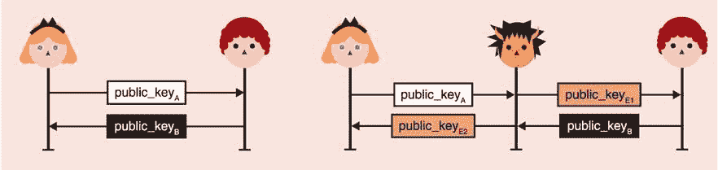

# 第十一章：用户认证

本章涵盖了

+   认证人员和数据之间的区别

+   用户认证，根据密码或密钥对用户进行身份验证。

+   用户辅助认证以保护用户设备之间的连接

在本书的介绍中，我将密码学简化为两个概念：机密性和认证。 在实际应用中，保密性（通常）不是你的问题所在； 认证是大部分复杂性产生的地方。 我知道我已经在整本书中大量谈论了认证，但是它在密码学中使用的含义不同，可能是一个令人困惑的概念。 因此，本章从介绍认证的真正含义开始。 与密码学一样，没有协议是万能药，本章的其余部分将教你大量在实际应用中使用的认证协议。

## 11.1 认证回顾

到目前为止，你已经多次听说过认证，所以让我们回顾一下。 你学到了关于

+   在密码学原语中的认证，如消息认证码（在第三章中介绍）和认证加密（在第四章中介绍）

+   密码协议中的认证，如 TLS（在第九章中介绍）和 Signal（在第十章中介绍），其中协议的一个或多个参与者可以被认证

在第一种情况下，认证指的是消息的*真实性*（或*完整性*）。 在后一种情况下，认证是指*向别人证明自己是谁*。 这些是由相同单词涵盖的不同概念，这可能会相当令人困惑！ 但是牛津英语词典（[`www.oed.com/`](http://www.oed.com/)）指出，这两种用法都是正确的：

*认证。证明或展示某事物为真实、真正或有效的过程或行为*。

由于这个原因，你应该将认证视为密码学术语，根据上下文传达两个不同的概念：

+   *消息/有效载荷认证*—你正在证明一条消息是真实的，并且自其创建以来没有被修改过。 （例如，这些消息是否已经认证，还是有人可能篡改它们？）

+   *源/实体/身份认证*—你正在证明一个实体确实是他们声称的那个人。 （例如，我是否真的在与[google.com](http://google.com)通信？）

底线：认证是关于证明某物是它应该是的，而某物可以是人、消息或其他东西。 在本章中，我将仅使用术语*认证*来指代识别人或机器。 换句话说，*身份*认证。 顺便说一句，你已经看到了很多关于这种类型认证的内容：

+   在第九章，关于安全传输，你学到了机器如何通过使用公钥基础设施（PKI）来大规模认证其他机器。

+   在第十章中，关于端到端加密，您了解了人类如何通过使用*首次使用信任*（TOFU）（然后稍后验证）或使用信任网络（WOT）技术来规模化认证彼此。

在本章中，您将学习到前面未提及的其他两种情况。（我在图 11.1 中进行了回顾。）

+   *用户认证*，或者说机器如何认证人类——滴滴滴滴

+   *用户辅助认证*，或者说人类如何帮助机器认证彼此

图 11.1 在本书中，我讨论了三种情景下的源认证。当设备认证人类时，就发生了用户认证。当机器认证另一台机器时，就发生了机器认证。当一个人参与机器认证另一台机器时，就发生了用户辅助认证。

身份认证的另一个方面是身份部分。确实，我们如何在密码协议中定义像爱丽丝这样的人？机器如何认证你和我？遗憾的是（或者幸运的是），肉体和比特之间存在固有的差距。为了弥合现实和数字世界之间的鸿沟，我们总是假设爱丽丝是唯一知道一些秘密数据的人，为了证明她的身份，她必须证明她知道那些秘密数据。例如，她可以发送她的密码，或者她可以使用与她的公钥相关联的私钥签署一个随机挑战。

好了，介绍就到此为止。如果这一部分让你感到有些迷糊，接下来的众多例子会让你明白的。现在让我们首先看看机器找到的认证我们人类的多种方式！

## 11.2 用户认证，或摆脱密码的追求

本章的第一部分是关于机器如何认证人类，换句话说就是*用户认证*。有很多方法可以做到这一点，没有一种解决方案是万能的。但在大多数用户认证场景中，我们假设

+   服务器已经经过认证。

+   用户与之共享安全连接。

例如，您可以想象服务器通过网络公钥基础设施（PKI）对用户进行了认证，并且连接通过 TLS（在第九章中都有涉及）。在某种意义上，本节的大部分内容都是关于将单向认证连接升级为双向认证连接，就像图 11.2 所示的那样。

图 11.2 用户认证通常发生在已经安全的通道上，但只有服务器经过认证的情况。一个典型的例子是当您使用 HTTPS 浏览网页并使用您的凭据登录网页时。

我必须警告你：用户认证是一个充满了空头支票的广阔领域。您肯定已经多次使用密码对不同的网页进行认证，而您自己的经历可能类似于这样：

1.  您在网站上注册了用户名和密码。

1.  使用新凭据登录网站。

1.  当您恢复您的账户或者因为网站强制要求时，您需要更改密码。

1.  如果您运气不佳，您的密码（或其哈希值）可能会在一系列数据库泄露中泄露。

听起来耳熟吗？

请注意，本章节将忽略*密码/账户恢复*，因为它们与密码学关系不大。只需知道它们通常与您最初注册的方式相关联。例如，如果您在工作场所的 IT 部门注册，那么如果您忘记密码，您可能需要去找他们，如果不小心的话，他们可能是系统中最薄弱的环节。事实上，如果我可以通过拨打一个号码并告诉某人您的生日来恢复您的账户，那么在登录时进行的任何酷炫的密码学都无济于事。

实现先前用户认证流程的一个天真的方法是在注册时存储用户密码，然后在登录时要求用户输入密码。正如第三章所述，一旦成功认证，用户通常会获得一个可以在每个后续请求中发送的 cookie，而不是用户名和密码。但是等等；如果服务器以明文形式存储您的密码，那么其数据库的任何泄露都会将您的密码暴露给攻击者。这些攻击者随后将能够使用它登录您在其中使用相同密码注册的任何网站。

更好的存储密码的方法是使用像您在第二章中学到的标准化的 Argon2 这样的*密码哈希*算法。这将有效地防止对数据库进行的一种破坏性攻击，以泄露您的密码，尽管一个过度进入的入侵者仍然可以在您每次登录时看到您的密码。然而，许多网站和公司仍然以明文形式存储密码。

练习

有时，应用程序试图通过让客户端在发送密码之前对密码进行哈希处理（也许使用密码哈希）来解决服务器在注册时了解用户密码的问题。您能确定这是否真的有效吗？

此外，人类在密码方面天生就不擅长。我们通常更喜欢使用简单易记的短密码。而且，如果可能的话，我们希望可以在所有地方都重复使用相同的密码。

*81%的黑客入侵事件利用了被盗或弱密码*。

—Verizon 数据泄露报告（2017）

弱密码和密码重用的问题导致了许多愚蠢和恼人的设计模式，试图迫使用户更加认真对待密码。例如，一些网站要求您在密码中使用特殊字符，或者强制您每 6 个月更改一次密码，等等。此外，许多协议试图“修复”密码或完全摆脱它们。每年，新的安全专家似乎都认为“密码”这个概念已经过时。然而，它仍然是最广泛使用的用户认证机制。

所以在这里，密码可能会一直存在。然而，存在许多可以改进或替代密码的协议。让我们看看这些。

### 11.2.1 一切由一个密码控制：单点登录（SSO）和密码管理器

好的，密码重用是不好的，那我们能做些什么呢？天真地，用户可以为不同的网站使用不同的密码，但这种方法有两个问题：

+   用户不擅长创建许多不同的密码。

+   记住多个密码所需的心理负担是不切实际的。

为了缓解这些问题，已经广泛采用了两种解决方案：

+   *单点登录*（SSO）—SSO 的理念是允许用户通过证明他们拥有单个服务的帐户来连接到许多不同的服务。这样，用户只需记住与该服务关联的密码，就能连接到许多服务。想象一下“使用 Facebook 登录”类型的按钮，正如图 11.3 所示。

+   *密码管理器*—如果您使用的不同服务都支持前述 SSO 方法，那么这种方法很方便，但显然对于像网页这样的场景来说并不可扩展。在这些极端情况下，一个更好的方法是改进客户端，而不是试图在服务器端解决问题。如今，现代浏览器内置了密码管理器，当您在新网站注册时可以建议复杂的密码，并且只要您记住一个主密码，它们就可以记住您的所有密码。

图 11.3 网页上单点登录（SSO）的示例。通过在 Facebook 或 Google 上拥有帐户，用户可以连接到新服务（在此示例中是 Airbnb），而无需考虑新密码。

单点登录（SSO）的概念在企业世界并不新鲜，但它在普通终端用户中的成功是比较近期的。如今，在建立 SSO 时，有两个主要竞争者协议：

+   *安全断言标记语言 2.0*（SAML）—一种使用可扩展标记语言（XML）编码的协议。

+   *OpenID Connect*（OIDC）—OAuth 2.0（RFC 6749）授权协议的扩展，使用 JavaScript 对象表示法（JSON）编码。

SAML 仍然被广泛使用，主要是在企业环境中，但（目前）它是一种遗留协议。另一方面，OIDC 可以在网页和移动应用程序中随处可见。你很可能已经使用过它！

认证协议通常被认为很难正确使用。OIDC 依赖的协议 OAuth2 以易被滥用而臭名昭著。另一方面，OIDC 被很好地规范化（参见[`openid.net`](https://openid.net)）。确保你遵循标准并查看最佳实践，因为这可以避免许多麻烦。

注意 这里有另一个例子，一个相当大的公司决定*不*遵循这些建议。2020 年 5 月，苹果登录 SSO 流程不遵循 OIDC 的做法被发现存在漏洞。任何人都可以通过查询苹果的服务器获得任何苹果账户的有效 ID 令牌。

SSO 对用户很有好处，因为它减少了他们需要管理的密码数量，但它并没有完全消除密码。用户仍然必须使用密码连接到 OIDC 提供者。接下来，让我们看看密码学如何帮助隐藏密码。

### 11.2.2 不想看到他们的密码？使用非对称密码身份验证密钥交换

前一节调查了试图简化用户身份管理的解决方案，允许他们使用仅链接到单个服务的一个帐户来认证到多个服务。虽然 OIDC 等协议很好，因为它们有效地减少了用户需要管理的密码数量，但它们并不改变某些服务仍然需要以明文形式查看用户密码的事实。即使密码在密码哈希后存储，每次用户注册、更改密码或登录时仍然以明文形式发送。

称为*非对称（或增强型）密码身份验证密钥交换*（PAKEs）的加密协议试图提供用户身份验证，而无需用户直接将其密码传递给服务器。这与*对称或平衡的 PAKEs*协议形成对比，后者双方都知道密码。

目前最流行的非对称 PAKE 是*安全远程密码*（SRP）协议，该协议于 2000 年首次标准化于 RFC 2944（“Telnet Authentication: SRP”），后来通过 RFC 5054（“Using the Secure Remote Password (SRP) Protocol for TLS Authentication”）集成到 TLS 中。它是一个相当古老的协议，并且存在许多缺陷。例如，如果注册流程被中间人攻击者拦截，那么攻击者将能够冒充并登录为受害者。它还不能很好地与现代协议配合使用，因为它无法在椭圆曲线上实例化，更糟糕的是，它与 TLS 1.3 不兼容。

自 SRP 发明以来，已经提出并标准化了许多非对称 PAKE。2019 年夏季，IETF 的 Crypto Forum Research Group（CFRG）开始了一个 PAKE 选择过程，目标是为每个 PAKE 类别（对称/平衡和非对称/增强型）选择一个算法进行标准化。2020 年 3 月，CFRG 宣布 PAKE 选择过程结束，选择

+   *CPace*——由 Haase 和 Benoît Labrique 发明的推荐的对称/平衡 PAKE

+   *OPAQUE*——由 Stanislaw Jarecki、Hugo Krawczyk 和 Jiayu Xu 发明的推荐的非对称/增强型 PAKE

在本节中，我将讨论 OPAQUE，在 2021 年初仍在标准化过程中。在本章的第二节中，您将了解更多关于对称 PAKEs 和 CPace 的信息。

OPAQUE 从同音异义词 *O-PAKE* 中取其名称，其中 *O* 指的是术语 *oblivious*。这是因为 OPAQUE 依赖于本书中尚未提到的密码原语：一个 *oblivious pseudorandom function*（OPRF）。

无意识伪随机函数（OPRFs）

OPRFs 是一个模拟第三章中所学的 PRFs 的两方协议。作为提醒，PRF 在某种程度上等同于人们对 MAC 的预期：它接受一个密钥和一个输入，并给出一个固定长度的完全随机输出。

注意：密码学中的术语 *oblivious* 通常指的是一个参与方计算加密操作而不知道另一方提供的输入的协议。

下面是 OPRF 的高层次工作方式：

1.  Alice 想要对输入计算一个 PRF，但希望输入保持秘密。她使用一个随机值（称为 *blinding factor*） “盲化” 她的输入，并将其发送给 Bob。

1.  Bob 使用他的秘钥在这个被盲化的数值上运行 OPRFs，但输出仍然被盲化，所以对 Bob 毫无用处。Bob 然后将这个返回给 Alice。

1.  Alice 最后使用与之前用于获取真实输出相同的盲化因子 “解盲” 结果。

需要注意的是，每次 Alice 想要执行这个协议时，她都必须创建一个不同的盲化因子。但无论她使用什么盲化因子，只要她使用相同的输入，她总是会得到相同的结果。我在图 11.4 中进行了说明。

图 11.4 一个无意识 PRF（OPRF）是一种构造，允许一个参与方在不了解该参与方输入的情况下计算 PRF。为了实现这一点，Alice 首先生成一个随机的盲化因子，然后使用它来盲化她的输入，然后发送给 Bob。Bob 使用他的秘密密钥在被盲化的数值上计算 PRF，然后将盲化输出发送给 Alice，Alice 可以对其进行解盲。结果不依赖于盲化因子的值。

这是在离散对数问题难度高的群中实现的 OPRF 协议的一个示例：

1.  Alice 将她的输入转换为一个群元素 *x*。

1.  Alice 生成一个随机的盲化因子 *r*。

1.  Alice 通过计算 *blinded_input* = *x*^r 来盲化她的输入。

1.  Alice 将 *blinded_input* 发送给 Bob。

1.  Bob 计算 *blinded_output* = *blinded_input*^k，其中 *k* 是秘密密钥。

1.  Bob 将结果发送回给 Alice。

1.  Alice 然后可以通过计算 *output* = *blinded_output*^(1/*r*) = *x*^k 来解盲产生的结果，其中 1/*r* 是 *r* 的倒数。

OPAQUE 如何使用这个有趣的构造是非对称 PAKE 的整个技巧。

OPAQUE 非对称 PAKE，它是如何工作的？

我们的想法是，我们希望客户端，比如 Alice，能够与某个服务器进行经过身份验证的密钥交换。我们还假设 Alice 已经知道服务器的公钥或已经有一种方法对其进行身份验证（服务器可以是 HTTPS 网站，因此 Alice 可以使用 Web PKI）。让我们看看如何逐步构建这个来逐渐理解 OPAQUE 的工作原理。

*第一个想法：* 使用公钥密码学来验证 Alice 的连接一侧。如果 Alice 拥有长期密钥对并且服务器知道公钥，她可以简单地使用她的私钥与服务器进行相互验证的密钥交换，或者她可以签署服务器给出的挑战。不幸的是，非对称私钥太长了，Alice 只能记住她的密码。她可以在当前设备上存储一对密钥，但她也想以后能够从另一台设备登录。

*第二个想法：* Alice 可以使用类似 Argon2 这样的基于密码的密钥派生函数（KDF）从她的密码派生非对称私钥，你在第二章和第八章学到了。然后，Alice 的公钥可以存储在服务器上。如果我们想要在数据库泄露的情况下避免有人对整个数据库进行密码测试，我们可以让服务器为每个用户提供一个不同的盐，他们必须将其与基于密码的 KDF 一起使用。

这已经相当不错了，但 OPAQUE 想要抛弃一种攻击：*预计算攻击*。我可以尝试以你的身份登录，接收到你的盐，然后*离线*预计算大量非对称私钥及其关联的公钥。在数据库被破坏的那一天，我可以迅速查看是否可以在我的大量预计算的非对称公钥列表中找到您的公钥和关联的密码。

*第三个想法：* 这就是 OPAQUE 的主要技巧所在！我们可以使用 OPRF 协议和 Alice 的密码来派生非对称私钥。如果服务器为每个用户使用不同的密钥，那么这就等同于有盐（攻击只能针对一个用户）。这样，想要基于我们密码的猜测预先计算非对称私钥的攻击者必须执行*在线*查询（防止离线暴力攻击）。在线查询很好，因为它们可以进行速率限制（例如，每小时不超过 10 次登录尝试），以防止这种类型的在线暴力攻击。

注意，这实际上并不是 OPAQUE 的工作方式：与其让用户派生非对称私钥，OPAQUE 让用户派生对称密钥。然后，对称密钥用于加密您的非对称密钥对的备份和一些附加数据（例如可以包括服务器的公钥）。我在图 11.5 中说明了算法。

图 11.5 使用 OPAQUE 注册到服务器时，Alice 生成一个长期密钥对并将其公钥发送到服务器，服务器将其存储并与 Alice 的身份关联起来。然后，她使用 OPRF 协议从她的密码获取一个强对称密钥，并将密钥对的加密备份发送给服务器。要登录，她从服务器获取她的加密密钥对，然后使用她的密码执行 OPRF 协议以获取能够解密她的密钥对的对称密钥。现在只需使用这个密钥执行一个互认证的密钥交换（或者可能签署一个挑战）。

在进入下一节之前，让我们回顾一下你在这里学到的内容。图 11.6 对此进行了说明。

图 11.6 密码是验证用户身份的方便方式，因为它们存在于某人的头脑中，并且可以在任何设备上使用。另一方面，用户很难创建强密码，因为用户往往在网站之间重复使用密码，密码泄漏可能会造成严重损失。SSO 允许您使用一个（或几个）服务连接到多个服务，而不对称（或增强）密码验证密钥交换允许您在服务器不了解真实密码的情况下进行身份验证。

### 11.2.3 一次性密码并不真的是密码：使用对称密钥实现无密码登录

好了，到目前为止一切都很好。你已经了解了应用程序可以利用的不同协议来使用密码对用户进行身份验证。但是，你可能已经听说了，密码也不是那么好。它们容易受到暴力破解攻击，往往被重复使用，被窃取等等。如果我们可以避免使用密码，我们可以使用什么？

答案就是——密钥！正如你所知，在密码学中有两种类型的密钥，而且两种类型都可能很有用：

+   对称密钥

+   不对称密钥

本节介绍基于对称密钥的解决方案，而下一节介绍基于不对称密钥的解决方案。让我们想象一下，Alice 使用对称密钥（通常由服务器生成并通过 QR 码传输给你）注册了一个服务。后来验证 Alice 的一个天真的方法是简单地要求她发送对称密钥。当然，这并不好，因为她的秘密泄漏将给攻击者无限制的访问权限。相反，Alice 可以从对称密钥中派生出所谓的*一次性密码*（OTPs），并在长期对称密钥的位置发送这些 OTP。尽管 OTP 不是密码，但其名称表明 OTP 可以代替密码使用，并警告不应重复使用。

基于 OTP 的用户身份验证背后的想法很简单：你的安全性来自于一个（通常是）16 到 32 字节的均匀随机对称密钥的知识，而不是一个低熵密码。这个对称密钥允许你按需生成 OTP，如图 11.7 所示。

图 11.7 一次性密码（OTP）算法允许您从对称密钥和一些附加数据创建任意数量的一次性密码。附加数据不同，取决于 OTP 算法。

OTP 身份验证通常在移动应用程序中实现（请参见图 11.8 中的一个热门示例）或安全密钥中（这是一个可以插入计算机 USB 端口的小设备）。可以使用两种主要方案来生成 OTP：

+   基于 HMAC 的一次性密码（HOTP）算法，标准化在 RFC 4226 中，这是一种额外数据为计数器的 OTP 算法。

+   基于时间的一次性密码（TOTP）算法，标准化在 RFC 6238 中，这是一种额外数据为时间的 OTP 算法。

大多数应用程序现在使用 TOTP，因为 HOTP 需要客户端和服务器都存储状态（计数器）。如果一方失去同步，无法再生成（或验证）合法的 OTP，存储状态可能会导致问题。

图 11.8 Google Authenticator 移动应用程序的屏幕截图。该应用程序允许您存储唯一的应用程序专用对称密钥，然后可与 TOTP 方案一起使用生成 6 位数的一次性密码（OTP），仅有效 30 秒。

在大多数情况下，这就是 TOTP 的工作方式：

+   *在注册时，服务向用户通信一个对称密钥（也许使用 QR 码）。* 然后，用户将此密钥添加到 TOTP 应用程序中。

+   *在登录时，用户可以使用 TOTP 应用程序计算一次性密码。* 这是通过计算*HMAC*（*symmetric_key*，*time*）来完成的，其中*time*表示当前时间（四舍五入到分钟，以使一次性密码在 60 秒内有效）。然后

    a) TOTP 应用程序向用户显示派生的一次性密码，截断并以人类可读的基数显示（例如，缩减为 10 进制的 6 个字符，使其全部为数字）。

    b) 用户将一次性密码复制或键入到相关应用程序中。

    c) 应用程序检索用户关联的对称密钥，并以与用户相同的方式计算一次性密码。如果结果与接收到的一次性密码匹配，则用户成功验证身份。

当然，用户的一次性密码（OTP）与服务器计算的密码必须在恒定时间内进行比较。这类似于 MAC 身份验证标签检查。我在图 11.9 中展示了这个流程。

图 11.9 Alice 使用 TOTP 作为认证在 example.com 上注册。她将网站的对称密钥导入到她的 TOTP 应用程序中。稍后，她可以要求应用程序为 example.com 计算一次性密码，并将其用于与网站进行身份验证。网站 example.com 获取与 Alice 关联的对称密钥，并使用 HMAC 和当前时间计算一次性密码。网站接下来以常量时间比较 Alice 发送的一次性密码。

这种基于 TOTP 的身份验证流程并不理想。有许多可以改进的地方，例如：

+   由于服务器也拥有对称密钥，认证可以被伪造。

+   您可以被社会工程学方式获得您的一次性密码。

因此，对称密钥是另一种*不完美的密码替代方案*。接下来，让我们看看如何使用非对称密钥来解决这些缺点。

钓鱼

钓鱼（或*社会工程学*）是一种不针对软件漏洞而是针对人的漏洞的攻击。想象一下，一个应用程序要求您输入一次性密码进行身份验证。在这种情况下，攻击者可能会尝试以您的身份登录应用程序，并在提示输入一次性密码时，给您打电话要求您提供有效的密码（假装他们为该应用程序工作）。

你在告诉我你不会上当吗！优秀的社会工程师擅长编织可信度很高的故事，并制造出一种紧迫感，使我们中的大多数人都会不假思索地泄露秘密。如果你仔细想想，我们之前谈论过的所有协议都容易受到这些类型的攻击的影响。

### 11.2.4 用非对称密钥替换密码

现在我们正在处理公钥密码学，有多种方法可以使用非对称密钥对服务器进行身份验证。我们可以

+   在密钥交换中使用我们的非对称密钥来验证连接的我们这一侧

+   在已经获得验证的连接中使用我们的非对称密钥与认证的服务器

让我们看看每种方法。

密钥交换中的双向认证

你已经听说过第一种方法了：使用密钥交换中的非对称密钥。在第九章中，我提到 TLS 服务器可以要求客户端在握手中使用*证书*。通常，公司会向其员工的设备配备唯一的员工证书，允许他们对内部服务进行身份验证。图 11.10 从用户的角度提供了一个大致的外观。

图 11.10 一页提示用户的浏览器获取客户端证书。用户然后可以从本地已安装的证书列表中选择要使用的证书。在 TLS 握手中，客户端证书的密钥用于签署握手记录，包括客户端的临时公钥，该公钥用作握手的一部分。

客户端证书相当简单。例如，在 TLS 1.3 中，服务器可以在握手期间通过发送 `CertificateRequest` 消息来请求客户端进行身份验证。然后，客户端通过在 `Certificate` 消息中发送其证书，然后在 `CertificateVerify` 消息中对发送和接收的所有消息进行签名（其中包括用于密钥交换的临时公钥）。如果服务器能够识别证书并成功验证客户端的签名，则客户端经过身份验证。另一个例子是安全外壳（SSH）协议，该协议也要求客户端使用服务器已知的公钥对握手的部分进行签名。

请注意，在握手阶段使用公钥加密进行身份验证的方法不仅限于签名。Noise 协议框架（在第九章中也有介绍）有几种握手模式，可以仅使用 DH 密钥交换进行客户端身份验证。

使用 FIDO2 进行握手后的用户身份验证

使用非对称密钥的第二种身份验证类型使用已经 *安全* 的连接，仅服务器被验证。为此，服务器可以简单地要求客户端对一个 *随机* 挑战进行签名。这样，重放攻击就被防止了。

在这个领域有一个有趣的标准是*快速身份在线 2*（FIDO2）。FIDO2 是一个开放标准，定义了如何使用非对称密钥对用户进行身份验证。该标准专门针对钓鱼攻击，并且为此，FIDO2 只能与*硬件认证器*一起使用。硬件认证器只是可以生成和存储签名密钥，并能签署任意挑战的物理组件。FIDO2 分为两个规范（图 11.11）：

+   *客户端到认证器协议*（CTAP）—CTAP 指定了漫游认证器和客户端可以使用的通信协议。漫游认证器是外部于您的主设备的硬件认证器。在 CTAP 规范中，客户端被定义为要查询这些认证器的软件的一部分，作为身份验证协议的一部分。因此，客户端可以是操作系统、本地应用程序（如浏览器）等。

+   *Web 身份验证*（WebAuthn）—WebAuthn 是 Web 浏览器和 Web 应用程序可以使用的协议，用于使用硬件认证器对用户进行身份验证。因此，必须由浏览器来实现它以支持认证器。如果您正在构建一个 Web 应用程序，并希望支持通过硬件认证器进行用户身份验证，则需要使用 WebAuthn。

图 11.11 FIDO2 可用的两种硬件认证器类型：（左侧）Yubikey，一种漫游认证器，以及（右侧）TouchID，一种内置认证器。

WebAuthn 允许网站不仅使用漫游验证器，还可以使用*平台*验证器。平台验证器是设备提供的内置验证器。它们在各种平台上实现不同，并且通常受生物识别技术保护（例如，指纹识别器、面部识别等）。

我们现在结束了本章的第一部分。但在我这样做之前，图 11.12 总结了我谈论过的非基于密码的认证协议。

图 11.12 要进行无密码认证，应用程序可以允许用户通过基于 OTP 的协议使用对称密钥，或者通过 FIDO2 标准使用非对称密钥。FIDO2 支持不同类型的验证器，例如漫游验证器（通过 CTAP 标准）或内置验证器。

现在，您已经了解了许多不同的技术和协议，这些技术和协议旨在改善密码或将其替换为更强大的加密解决方案，您可能会想知道，应该使用哪一种？每种解决方案都有其自己的局限性，可能没有一种解决方案能够胜任。如果没有，那就结合多种解决方案吧！这个想法被称为*多因素认证*（MFA）。实际上，很有可能您已经在密码之外使用了 OTP 或 FIDO2 作为第二个身份验证因素。

这结束了本章关于用户身份验证的前半部分。接下来，让我们看看人类如何帮助设备相互认证。

## 11.3 用户辅助认证：使用人类帮助配对设备

人类每天都在帮助机器相互认证 —— 每一天！您通过将无线耳机与手机配对，或者将手机与汽车配对，或者将某个设备连接到家庭 WiFi，等等来完成了这一点。而且与任何配对一样，底层很可能是密钥交换。

上一节中的身份验证协议是在已经安全的通道中进行的（可能是通过 TLS），服务器进行了身份验证。与之相反，本节大部分内容试图为两个不知道如何相互认证的设备提供一个安全通道。在这个意义上，您将在本节中学到的内容是人类如何帮助将一个不安全的连接升级为一个*相互认证的连接*。因此，接下来您将学到的技术应该让您想起第十章端到端协议中的一些建立信任的技术，只是在那里，两个人试图相互认证。

如今，你将遇到的最常见的不安全连接（不通过互联网），都是基于短程无线电频率的协议，如蓝牙、WiFi 和近场通信（NFC）。 NFC 是你用来用手机或银行卡的“非接触”支付。使用这些通信协议的设备通常从低功耗电子设备到功能齐全的计算机都有。这已经给我们设置了一些限制：

+   *您正在尝试连接的设备可能没有屏幕来显示密钥或手动输入密钥的方法。*我们称之为*配置*该设备。例如，今天大多数无线音频耳机只有几个按钮而已。

+   *由于人类是验证过程的一部分，必须键入或比较长字符串通常被认为是不切实际和不用户友好的。*因此，许多协议试图将安全相关字符串缩短为 4 位或 6 位数字密码。

练习

想象一种协议，你必须输入正确的 4 位数字密码才能安全连接到设备。只通过猜测选择正确密码的机会有多大？

你可能会回想起你的一些设备配对经历，并且意识到现在很多情况*都是自动完成的*。例如

1.  你按下了设备上的一个按钮。

1.  设备进入配对模式。

1.  你接着试图在手机的蓝牙列表中找到设备。

1.  在点击设备图标后，它成功地将设备与您的手机配对。

如果你读过第十章，这应该让你想起了*第一次使用时信任*（TOFU）。不过，这次我们手头还有一些其他的牌：

+   *接近性*——两个设备必须彼此靠近，特别是如果使用 NFC 协议。

+   *时间*——设备配对通常受时间限制。如果，例如，在 30 秒的时间窗口内，配对不成功，必须手动重新启动该过程是很常见的。

与 TOFU 不同，这些真实场景通常不允许你事后验证你是否已连接到正确的设备。这并不理想，如果可能的话，应该努力提升安全性。

注意顺便提一下，这就是蓝牙核心规范实际上将类似 TOFU 的协议称为的内容：“Just Works”。我应该提到，目前所有内置的蓝牙安全协议都因许多攻击而破坏，包括 2019 年发布的最新 KNOB 攻击（[`knobattack.com`](https://knobattack.com)）。尽管如此，本章介绍的技术如果设计和实施正确，仍然是安全的。

我们工具箱中的下一步是什么？这就是我们将在本节中看到的内容：人类帮助设备进行身份验证的方法。剧透：

+   你会发现，加密密钥始终是最安全的方法，但不一定是最用户友好的。

+   您将了解关于对称 PAKE 和如何在两个设备上输入相同密码以安全连接它们的内容。

+   你将了解基于短认证字符串（SAS）的协议，这些协议通过让你比较和匹配两个设备显示的两个短字符串来验证密钥交换的有效性。

让我们开始吧！

### 11.3.1 预共享密钥

幼稚地，将用户连接到设备的第一种方法将是重用你在第九章或第十章学到的协议（例如，TLS 或 Noise），并向两个设备提供对称共享密钥或更好地，提供长期公钥以为将来的会话提供前向保密性。这意味着每个设备学习另一个设备的公钥需要两件事：

+   你需要一种方法来*导出*设备的公钥。

+   你需要一种方法来*导入*公钥。

正如我们将看到的，这并不总是简单或用户友好的。但请记住，我们有一个参与的人可以观察和（也许）操纵这两个设备。这与我们以前见过的其他场景不同，我们可以利用这一点！

*认证问题 - 密码学中的一个主要问题是在不安全的通道上建立安全的点对点（或群组）通信。在没有额外安全通道的假设下，这个任务是不可能的。但是，假设有一些前提条件，存在许多建立安全通信的方法*。

—Sylvain Pasini（《使用认证通道进行安全通信》，2009 年）

所有接下来的协议都基于这样一个事实：你（负责人类）拥有一个额外的*带外*通道。这使您可以安全地通信一些信息。添加此带外通道可以被建模为两个设备可以访问两种类型的通道（如图 11.13 所示）：

+   *一个不安全的通道*——想象一下与设备连接的蓝牙或 WiFi 连接。默认情况下，用户无法对设备进行身份验证，因此可能会受到中间人攻击（MITM）。

+   *一个经过认证的通道*——想象一下设备上的屏幕。该通道提供了所传输信息的完整性/真实性，但机密性较差（有人可能在你旁边偷看）。

图 11.13 用户辅助身份验证协议允许用户配对两个设备，这些协议模拟了设备之间的两种类型的通道：一个不安全的通道（例如，NFC、蓝牙、WiFi 等），我们假设该通道由对手控制，以及一个经过认证的通道（例如，现实生活中的通道），该通道不提供机密性，但可以用于交换相对较小的信息量。

由于这种带外通道提供的保密性较差，我们通常不希望使用它来导出机密信息，而是用于公共数据。例如，设备的屏幕可以显示公钥或某些摘要。但是一旦您导出了一个公钥，您仍然需要另一个设备来导入它。例如，如果密钥是一个二维码，那么另一个设备可能能够扫描它，或者如果密钥以人类可读的格式编码，那么用户可以使用键盘在另一个设备上手动输入它。一旦两个设备都配置了彼此的公钥，您可以使用我在第九章中提到的任何协议来执行两个设备之间的相互认证密钥交换。

我希望您从本节中了解到，在您的协议中使用加密密钥始终是实现某些目标的最安全方式，但并不总是最用户友好的方式。然而，现实世界的密码学充满了妥协和权衡，这就是为什么下面的两种方案不仅存在，而且是认证设备最流行的方式。

让我们看看在无法导出和导入长公钥的情况下如何使用*密码*启动双向认证密钥交换。然后我们将看看短*认证字符串*如何在无法将数据导入到一个或两个设备的情况下提供帮助。

### 11.3.2 使用 CPace 进行对称密码认证密钥交换

如果可能的话，您应该采用上述解决方案，因为它依赖于强大的非对称密钥作为信任的根源。然而，实践中发现，手动使用一串长字符串表示的密钥在一些笨重的键盘上输入是很繁琐的。那么这些亲爱的密码呢？它们要短得多，因此更容易处理。我们喜欢密码对吧？也许我们不喜欢，但用户喜欢，而现实世界的密码学充满了妥协。所以就这样吧。

在关于对称密码认证密钥交换的部分中，我提到了存在一个对称（或平衡）版本，其中知道共同密码的两个对等方可以执行相互认证密钥交换。这正是我们需要的。

*可组合密码认证连接建立*（CPace）于 2008 年由 Björn Haase 和 Benoît Labrique 提出，并于 2020 年初被 CFRG（密码论坛研究小组）选为官方推荐。该算法目前正在作为 RFC 标准化。简化的协议看起来类似于以下内容（图 11.14 说明了该算法）：

+   两个设备基于一个共同的密码派生一个生成器（用于某个预定循环群）。

+   然后两个设备使用这个生成器在其上执行临时 DH 密钥交换。

图 11.14 CPace PAKE 的工作原理是让两个设备基于一个密码创建一个生成器，然后将其用作通常的临时 DH 密钥交换的基础。

当然，魔鬼在细节中，作为一个现代规范，CPace 针对椭圆曲线的“陷阱”，并定义了何时必须验证接收到的点是否在正确的群中（由于时髦的 Curve25519，不幸的是，它不构成一个素数群）。它还指定了如何基于密码在椭圆曲线群中派生生成器（使用所谓的哈希到曲线算法）以及如何做到这一点（不仅使用普通密码，还使用唯一的会话 ID 和一些附加的上下文元数据，比如对等方 IP 地址等等）。

这些步骤很重要，因为双方都必须以防止它们知道其离散对数 *x* 的方式派生生成器 *h*，使得 g^x = *h*。最后，会话密钥是从 DH 密钥交换输出、记录（临时公钥）和唯一的会话 ID 派生的。

直觉上，你可以看到冒充其中一方并在握手的一部分发送一个群元素意味着你发送了一个公钥，这个公钥与你无法知道的私钥相关联。这意味着如果你不知道密码，你永远无法执行 DH 密钥交换。记录看起来就像一个正常的 DH 密钥交换，所以，没有运气（只要 DH 是安全的）。

### 11.3.3 我的密钥交换被 MITM 攻击了吗？只需检查一个短认证字符串（SAS）。

在本章的第二部分中，你看到了不同的协议，它们允许两个设备在人类的帮助下配对。然而，我提到有些设备受限制以至于无法使用这些协议。让我们来看看一种方案，当两个设备无法导入密钥但可以向用户显示一些有限的数据时使用（也许通过屏幕、或者通过打开一些 LED、或者通过发出一些声音等等）。

首先，记住在第十章中，你学到了如何在 *握手后*（密钥交换后）使用 *指纹*（传输的哈希）对会话进行认证。我们可以像这样使用一些东西，因为我们有我们的带外信道来传递这些指纹。如果用户能够成功比较和匹配从两台设备获取的指纹，那么用户就知道密钥交换没有被 MITM 攻击。

指纹的问题在于它们是长字节串（通常为 32 个字节长），可能难以显示给用户。它们也很笨重，难以比较。但对于设备配对，我们可以使用更短的字节串，因为我们在实时进行比较！我们称这些为 *短认证字符串*（SAS）。SAS 被广泛使用，特别是由于它们相当用户友好（请参见图 11.15 中的示例）。

图 11.15 要通过蓝牙将手机与汽车配对，可以使用数字比对模式生成一个短的经过身份验证的字符串（SAS），该字符串是两个设备之间协商的安全连接的一部分。不幸的是，正如我在本章早些时候所述，由于 KNOB 攻击，蓝牙的安全协议目前已经破解（截至 2021 年）。如果你控制着这两个设备，你需要实现自己的 SAS 协议。

SAS-based schemes 没有任何标准，但大多数协议（包括蓝牙的数字比对）实现了一种变种的*手动认证迪菲-赫尔曼*（MA-DH）。MA-DH 是一种简单的密钥交换协议，其附加的技巧使得攻击者很难在中间人攻击中主动干预协议。你可能会问，为什么不只是从截断的指纹中创建 SAS？为什么需要一种技巧？

SAS 通常是一个 6 位数，可以通过将传输的哈希值截断为少于 20 位并将其转换为十进制数字来获得。因此，SAS 实际上非常小，这使得攻击者更容易在截断的哈希上获取*第二个前像*。在图 11.16 中，我们以两个设备为例（尽管我们使用了 Alice 和 Bob），执行一个未经身份验证的密钥交换。一个主动的 MITM 攻击者可以在第一个消息中用他们自己的公钥替换 Alice 的公钥。一旦攻击者收到 Bob 的公钥，他们就会知道 Bob 将计算什么样的 SAS（基于攻击者的公钥和 Bob 的公钥的截断哈希）。攻击者只需生成许多公钥，以找到一个（*public_key*[E]2），使得 Alice 的 SAS 与 Bob 的匹配。

图 11.16 典型的未经身份验证的密钥交换（左侧）可以被主动的 MITM 攻击者（右侧）拦截，后者可以替换 Alice 和 Bob 的公钥。如果 Alice 和 Bob 都生成相同的短的经过身份验证的字符串，则 MITM 攻击成功。也就是说，如果 *HASH*(*public_key*[A] || *public_key*[E2]) 和 *HASH*(*public_key*[E2] || *public_key*[B]) 匹配。

生成一个公钥以使两个 SAS 匹配实际上相当容易。想象一下 SAS 是 20 位，那么只需要 2²⁰ 次计算，你就应该能够找到一个第二个前像，使得 Alice 和 Bob 都生成相同的 SAS。即使在一部廉价手机上，这也应该是相当快速的计算。

SAS-based key exchanges 的技巧在于防止攻击者能够选择他们的第二个公钥，从而强制两个 SAS 匹配。为了做到这一点，Alice 在看到 Bob 的公钥之前简单地发送了她的公钥的一个*承诺*（如图 11.17 所示）。

图 11.17 左侧的图示了一个安全的 SAS-based 协议，其中 Alice 首先发送她的公钥的承诺。在收到 Bob 的公钥后，她只在之后才揭示自己的公钥。因为她已经对其进行了承诺，所以她不能根据 Bob 的密钥自由选择她的密钥对。如果交换被主动进行了 MITM 攻击（右侧的图示），攻击者将无法选择任何密钥对以强制 Alice 和 Bob 的 SAS 匹配。

与以前的不安全方案一样，攻击者选择的 *public_key*[*E*1] 不会给他们任何优势。但现在，他们也不能选择一个 *public_key*[*E*2] 来帮助，因为在协议的这一点上他们不知道 Bob 的 SAS。他们被迫“盲目射击”，希望 Alice 和 Bob 的 SAS 会匹配。

如果 SAS 是 20 位，那么概率是 1,048,576 中的 1。攻击者可以通过多次运行协议来增加机会，但请记住，协议的每个实例都必须由用户手动匹配 SAS。实际上，这种摩擦自然地防止了攻击者获得过多的彩票。

图 11.18 你学到了关于配对两台设备的三种技术：（1）用户可以帮助设备获取彼此的公钥，以便它们可以执行密钥交换；（2）用户可以在两台设备上输入相同的密码，以便它们可以执行对称密码认证密钥交换；或者（3）用户可以事后验证密钥交换的指纹，以确认没有 MITM 攻击者拦截了配对。

故事时间

有趣的是，当我写第十章关于端对端加密时，我开始研究 Matrix 端对端加密聊天协议的用户是如何验证他们的通信的。为了使验证更加用户友好，Matrix 创建了自己的 SAS-based 协议变种。不幸的是，它对 X25519 密钥交换的共享密钥进行了哈希处理，但在哈希中没有包含要交换的公钥。

在第五章中，我提到验证 X25519 公钥是很重要的。Matrix 没有这样做，这使得 MITM 攻击者能够向用户发送不正确的公钥，迫使他们最终得到相同的可预测的共享密钥，进而得到相同的 SAS。这完全破坏了协议的端对端加密声明，并且很快由 Matrix 进行了修复。

这就是全部内容！图 11.18 回顾了本章第二部分中学到的不同技术。下次见在第十二章。

## 摘要

+   用户身份验证协议（机器验证人类的协议）通常在安全连接上进行，只有机器（服务器）已经通过验证。在这个意义上，它将单向验证连接升级为双向验证连接。

+   用户认证协议大量使用密码。密码已被证明是一种相对实用的解决方案，并被用户广泛接受。但由于密码卫生不佳、熵值低和密码数据库泄露等问题，密码也导致了许多问题。

+   有两种方法可以避免用户携带多个密码（并可能重复使用密码）：

    +   *密码管理器*—用户可以使用的工具，用于为他们使用的每个应用程序生成和管理强密码。

    +   *单点登录*（SSO）—一种联合协议，允许用户使用一个帐户注册并登录其他服务。

+   服务器避免了解和存储其用户密码的一个解决方案是使用非对称密码认证密钥交换（非对称 PAKE）。非对称 PAKE（如 OPAQUE）允许用户使用密码对已知服务器进行身份验证，但无需实际向服务器透露密码。

+   避免密码的解决方案包括用户通过一次性密码（OTP）算法使用对称密钥或通过 FIDO2 等标准使用非对称密钥。

+   用户辅助认证协议通常在不安全的连接（WiFi，蓝牙，NFC）上进行，并帮助两个设备相互认证。为了在这些情景下保护连接，用户辅助协议假设两个参与者拥有一个额外的经过身份验证的（但不保密的）通道可供使用（例如，设备上的屏幕）。

+   将设备的公钥导出到另一个设备可以允许进行强相互认证的密钥交换。不幸的是，这些流程不够用户友好，有时由于设备限制（例如无法导出或导入密钥）而不可能。

+   对称密码认证密钥交换（对称 PAKEs）如 CPace 可以通过只需用户手动输入密码而无需导入长公钥来减轻用户的负担。例如，大多数人已经使用对称 PAKEs 来连接到他们的家庭 WiFi。

+   基于短身份验证字符串（SAS）的协议可以为无法导入密钥或密码但能够在密钥交换后显示短字符串的设备提供安全性。为了确保未经认证的密钥交换未被主动中间人攻击，这个短字符串必须在两个设备上相同。
