# 12 加密货币是指加密货币吗？

本章包括

+   共识协议及其如何使加密货币可能

+   不同类型的加密货币

+   比特币和 Diem 加密货币如何在实践中运作

密码学能否成为新金融系统的基础？这是自 2008 年以来加密货币一直在试图回答的问题，当时比特币是由中本聪提出的（至今仍未透露他或他们的身份）。在那之前，术语*加密*始终是用于指涉密码学领域。但自从比特币的创建以来，我看到它的含义迅速改变，现在也用于指代加密货币。加密货币爱好者反过来越来越有兴趣学习密码学。这是有道理的，因为密码学是加密货币的核心。

什么是*加密货币*？它有两个方面：

+   *它是一种数字货币。*简单来说，它允许人们以电子方式交易货币。有时会使用由政府支持的货币（如美元），有时会使用虚拟货币（如比特币）。你很可能已经在使用数字货币——每当你在互联网上向某人汇款或使用支票账户时，你都在使用数字货币！事实上，你不再需要通过邮件寄送现金，今天大多数货币交易只是数据库中行的更新。

+   *它是一种严重依赖密码学来避免使用信任第三方和提供透明度的货币。*在加密货币中，没有必须盲目信任的中央权威，如政府或银行。我们经常将这种属性称为*去中心化*（就像“我们正在去中心化信任”）。因此，正如你将在本章中看到的那样，加密货币被设计为容忍一定数量的恶意行为者，并允许人们验证它们是否正常运作。

加密货币相对较新，因为第一个成功的实验是比特币，它是在 2008 年提出的，当时正值全球金融危机中。虽然危机始于美国，但很快就传播到世界其他地区，侵蚀了人们对金融体系的信任，并为比特币等更透明的倡议提供了平台。那时，许多人开始意识到金融交易的现状是低效、昂贵且大多数人不透明的。其余的就是历史，我相信这本书是第一本包含有关加密货币章节的密码学书籍。

## 12.1 一种温和的拜占庭容错（BFT）共识算法简介

想象一下，你想要创建一种新的数字货币。构建一个运作良好的系统实际上并不复杂。你可以在专用服务器上设置一个数据库，用于跟踪用户及其余额。通过这样做，你可以为人们提供一个界面，让他们查询余额或允许他们发送支付请求，这将在数据库中减少他们的余额并增加另一行中的余额。最初，你也可以随机将一些虚拟货币分配给你的朋友，以便他们可以开始向你的系统转账。但是这样一个简单的系统有一些缺陷。

### 12.1.1 弹性问题：分布式协议来拯救

我们刚刚看到的系统是一个*单点故障*。如果停电，你的用户将无法使用系统。更糟糕的是，如果某种自然灾害意外摧毁了你的服务器，每个人可能会永久丢失他们的余额。为了解决这个问题，存在着一些众所周知的技术，你可以用来为你的系统提供更强大的弹性。*分布式系统*领域研究了这些技术。

在这种情况下，大多数大型应用程序使用的常见解决方案是将数据库内容（在某种程度上）实时地复制到其他备份服务器上。这些服务器可以分布在各个地理位置，随时准备作为备份使用，甚至在主服务器故障时接管。这被称为*高可用性*。现在你拥有了*分布式数据库*。

对于服务大量查询的大型系统，备份数据库通常不仅仅是闲置在一旁等待发挥作用，而是被用于提供状态读取。很难让超过一个数据库接受写入和更新，因为这样可能会引发冲突（就像两个人同时编辑同一份文件一样危险）。因此，你通常希望一个数据库充当*领导者*，并对所有写入和更新操作进行排序，而其他数据库则用于读取状态。

数据库内容的复制可能会很慢，预计你的一些数据库会落后于主数据库，直到它们追赶上去。这在使用复制数据库读取状态时尤其如此。（想象一下，你和你的朋友查询不同的服务器，因此看到了不同的账户余额。）

在这些情况下，应用程序通常被编写以容忍这种滞后。这被称为*最终一致性*，因为最终数据库的状态会变得一致。（存在更强的一致性模型，但它们通常速度较慢且不切实际。）这样的系统也存在其他问题：如果主数据库崩溃，哪个数据库将成为主数据库？另一个问题是，如果备份数据库在主数据库崩溃时落后，我们会丢失一些最新的更改吗？

这就是在需要整个系统就某个决定达成一致意见时，更强大的算法—*共识算法*（也称为*日志复制*、*状态机复制*或*原子广播*）—发挥作用的地方。想象一下，一个共识算法解决了一群人试图就要点什么披萨达成一致意见的问题。如果每个人都在同一个房间里，很容易看出大多数人想要什么。但如果每个人都通过网络进行通信，消息可能会延迟、丢失、被拦截和修改，那么就需要一个更复杂的协议。

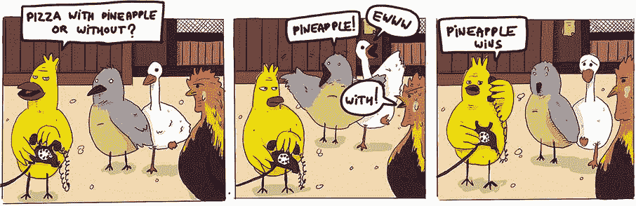

让我们看看共识如何用来回答前两个问题。在崩溃的情况下哪个数据库可以接管的第一个问题被称为*领导者选举*，通常使用共识算法来确定哪个将成为下一个领导者。第二个问题通常通过将数据库更改视为两个不同步骤来解决：*待定*和*已提交*。对数据库状态的更改始终首先是待定的，只有足够多的数据库同意提交它才能被设置为已提交（这也是共识协议可以使用的地方）。一旦提交，对状态的更新不容易丢失，因为大多数参与的数据库已经提交了更改。

一些知名的共识算法包括 Paxos（由 Lamport 于 1989 年发表）及其后续简化版本 Raft（由 Ongaro 和 Ousterhout 于 2013 年发表）。您可以在大多数分布式数据库系统中使用这些算法来解决不同的问题。（要了解关于 Raft 的出色互动解释，请查看[`thesecretlivesofdata.com/raft`](https://thesecretlivesofdata.com/raft)。）

### 12.1.2 信任的问题？分权有助于解决

分布式系统（从操作角度）为那些充当单点故障的系统提供了一个弹性的替代方案。大多数分布式数据库系统使用的共识算法不够容错。一旦机器开始崩溃，或由于硬件故障而开始表现不良，或开始与某些其他机器断开连接，比如网络分区，问题就会出现。此外，从用户角度来看，没有办法检测到这一点，如果服务器被入侵，这就更成问题了。

如果我向服务器查询，它告诉我 Alice 的账户里有 50 亿美元，我只能相信它。如果服务器在响应中包含了自她账户开户以来所收到和发送的所有货币转账，并将它们全部加起来，我可以验证她账户中确实有 50 亿美元是正确的。但是谁能保证服务器没有对我撒谎呢？也许当 Bob 询问另一个服务器时，它返回的是完全不同的余额和/或 Alice 账户的历史记录。我们称之为*分叉*（以两种相互矛盾的状态呈现为有效），这是历史中不应该发生的一个分支。因此，你可以想象，其中一个复制的数据库的妥协可能会导致相当严重的后果。

在第九章中，我提到了*证书透明性*，这是一种旨在检测 Web 公钥基础设施（PKI）中这种分叉的八卦协议。金钱的问题在于仅仅检测是不够的。你希望首先防止分叉发生！1982 年，Paxos 共识算法的作者 Lamport 提出了*拜占庭容错*（BFT）*共识算法*的概念。

*我们想象拜占庭军队的几个师分驻扎在一座敌方城市外面，每个师分都由自己的将军指挥。将军们只能通过信使相互通信。观察敌人之后，他们必须决定一个共同的行动计划。然而，一些将军可能是叛徒，试图阻止忠诚的将军达成一致意见*。

——Lamport 等人（《拜占庭将军问题》，1982 年）

Lamport 通过他的拜占庭类比开启了 BFT 共识算法领域，旨在防止不良共识参与者在达成决策时对系统产生不同的冲突观点。这些 BFT 共识算法高度类似于之前的共识算法，如 Paxos 和 Raft，只是复制的数据库（协议参与者）不再盲目地相互信任了。BFT 协议通常大量使用密码学来验证消息和决策的真实性，而这反过来可以被其他人用来对共识协议输出的决策进行密码学验证。

这些 BFT 共识协议因此解决了我们的韧性和信任问题。不同的复制数据库可以运行这些 BFT 算法，以便在新系统状态（例如用户余额）上达成一致，同时通过验证状态转换（用户之间的交易）是否有效，并获得大多数参与者的同意来相互监督。我们说信任现在是*分散的*。

第一个真实世界的 BFT 共识算法是 1999 年发表的*实用 BFT*（PBFT）。PBFT 是一种基于领导者的算法，类似于 Paxos 和 Raft，其中一个领导者负责提出提案，而其他人试图就提案达成一致。不幸的是，PBFT 相当复杂，缓慢，并且在超过十几个参与者后无法很好地扩展。如今，大多数现代加密货币使用更高效的 PBFT 变体。例如，Facebook 于 2019 年推出的加密货币 Diem 基于 HotStuff，这是一种受 PBFT 启发的协议。

### 12.1.3 规模问题：无许可和抗审查网络

这些基于 PBFT 的共识算法的一个局限性是它们都需要一个已知且固定的参与者集合。更为棘手的是，超过一定数量的参与者后，它们开始分崩离析：通信复杂性急剧增加，变得极其缓慢，选举领导者变得复杂等等。

加密货币如何决定共识参与者？有几种方式，但最常见的两种方式是

+   *权威证明*（PoA）—共识参与者事先确定。

+   *权益证明*（PoS）—共识参与者是动态选择的，基于谁拥有的权益最大（因此，更不愿意攻击协议）。一般来说，基于 PoS 的加密货币根据持有的数字货币数量选举参与者。

话虽如此，并非所有的共识协议都是经典的 BFT 共识协议。例如，比特币在提出一种没有已知参与者名单的共识机制时采取了不同的方法。这在当时是一个相当新颖的想法，比特币通过放宽经典 BFT 共识协议的约束来实现这一点。正如你将在本章后面看到的，由于这种方法，比特币可以分叉，这带来了自己的一系列挑战。

没有参与者，你如何选择领导者？您可以使用 PoS 系统（例如，Ouroboros 共识协议就是这样做的）。相反，比特币的共识依赖于一种称为*工作量证明*（PoW）的概率机制。在比特币中，这意味着人们试图找到解决方案来成为参与者和领导者。正如你将在本章后面看到的，这个谜题是一个密码学谜题。

由于缺乏已知参与者，比特币被称为*无许可*网络。在无许可网络中，您无需额外权限即可参与共识；任何人都可以参与。这与*有许可*网络形成对比，后者有一个固定的参与者集合。我在图 12.1 中总结了一些这些新概念。

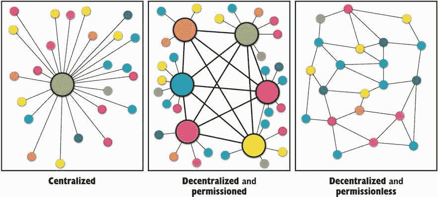

图 12.1 一个集中式网络可以被视为单点故障，而分布式和去中心化网络对一些服务器关闭或恶意行为具有弹性。在许可网络中，有一组已知和固定的主要参与者，而在无许可网络中，任何人都可以参与。

直到最近，人们还不知道如何将经典的 BFT 共识协议与允许任何人加入的无许可网络一起使用。如今，存在许多使用 PoS 动态选择参与者子集作为共识参与者的方法。其中最值得注意的是 2017 年发布的 Algorand，它根据持有的货币数量动态选择参与者和领导者。

比特币还声称对审查具有抵抗力，因为你无法预先知道谁将成为下一个领导者，因此无法阻止系统选举新领导者。在 PoS 系统中是否可能实现这一点尚不太清楚，因为在这种系统中更容易确定大量货币背后的身份。

我应该提到，并非所有的 BFT 共识协议都是基于领导者的。有些是*无领导者*的，它们不是通过选举领导者决定下一个状态转换的。相反，每个人都可以提出变更，共识协议帮助每个人就下一个状态达成一致。2019 年，Avalanche 推出了这样一种加密货币，允许任何人提出变更并参与共识。

最后，如果你认为共识对于去中心化支付系统是必要的，那也不完全正确。2018 年，Guerraoui、Kuznetsov、Monti、Pavlovic 和 Seredinschi 提出了“AT2: 异步可信转账”中的无共识协议。考虑到这一点，我在本章中不会讨论无共识协议，因为它们是相对较新的，尚未经过实战测试。在本章的其余部分，我将介绍两种不同的加密货币，以展示该领域的不同方面：

+   *比特币*—基于 PoW 的最流行的加密货币，于 2008 年推出。

+   *Diem*—一种基于 BFT 共识协议的加密货币，由 Facebook 和一群其他公司在 2019 年宣布。

## 12.2 比特币是如何运作的？

2008 年 10 月 31 日，一位匿名研究人员以化名 Satoshi Nakamoto 发布了“比特币：一个点对点的电子现金系统”。直至今日，仍然不知道 Satoshi Nakamoto 是谁。不久之后，“他们”发布了比特币核心客户端，这是任何人都可以运行以加入和参与比特币网络的软件。比特币所需要的唯一一件事情就是足够多的用户运行相同的软件或至少相同的算法。第一个加密货币诞生了——比特币（或 BTC）。

比特币是一个真正的成功故事。这种加密货币已经运行了十多年（截至撰写本文时），并且已经允许来自世界各地的用户使用数字货币进行交易。2010 年，开发者拉斯洛·汉野奇（Laszlo Hanyecz）用 10,000 BTC 买了两块披萨。当我写下这些文字时（2021 年 2 月），BTC 几乎价值 57,000 美元。因此，我们已经可以得出结论，加密货币有时可能极度波动。

### 12.2.1 比特币如何处理用户余额和交易

让我们深入了解比特币的内部结构，首先看看比特币如何处理用户余额和交易。作为比特币的用户，您直接处理密码学。您不像在任何银行网站上一样有用户名和密码登录；相反，您有自己生成的椭圆曲线数字签名算法（ECDSA）密钥对。用户的余额只是与公钥关联的一定数量的 BTC，因此，要接收 BTC，您只需与他人共享您的公钥。

要使用您的 BTC，您需要使用您的私钥签署交易。交易基本上说明了您认为的内容，“我将 *X* BTC 发送到公钥 *Y*”，忽略了一些我稍后会解释的细节。

注意：在第七章中，我提到比特币使用带有 ECDSA 的 secp256k1 曲线。不要将此曲线与 NIST 的 P-256 曲线混淆，后者被称为 secp256r1。

您的资金安全直接与您的私钥安全性相关。而且，正如您所知，密钥管理很困难。在过去的十年中，加密货币中的密钥管理问题导致了价值数百万美元的密钥的意外丢失（或盗窃）。小心！

比特币存在不同类型的交易，实际上，在网络上看到的大多数交易都通过对其进行哈希来隐藏接收方的公钥。在这些情况下，公钥的哈希被称为帐户的*地址*。（例如，这是我的比特币地址：`bc1q8y6p4x3rp32dz80etpyffh6764ray9842egchy`。）地址有效地隐藏了帐户的实际公钥，直到帐户所有者决定花费 BTC（在这种情况下，需要揭示地址的预图，以便其他人可以验证签名）。这使地址的大小更短，并防止有人在某天破解 ECDSA 后检索您的私钥。

不同类型的交易存在是比特币的一个有趣细节。交易不仅仅是包含一些信息的有效载荷；它们实际上是用虚构和相当有限的指令集编写的简短脚本。当交易被处理时，必须执行脚本，然后生成的输出才能确定交易是否有效，以及如果有效，则需要采取哪些步骤来修改所有帐户的状态。

像以太坊这样的加密货币通过允许在执行交易时运行更复杂的程序（所谓的*智能合约*）将这个脚本思想推向了极限。这里有几件事情我没有触及到：

+   一个交易中包含什么？

+   交易执行意味着什么？谁来执行它？

我将在下一节解释第二项内容。现在，让我们看看一个交易中有什么。

比特币的一个特点是没有真正的账户余额数据库。相反，用户拥有的是可供支出的比特币“零钱”，称为*未花费交易输出*（UTXOs）。你可以将 UTXOs 的概念想象成一个大碗，对所有人可见，里面装满了只有它们的所有者才能花费的硬币。当一笔交易花费了一些硬币时，这些硬币就会从碗里消失，同时为同一交易的收款方产生新的硬币。这些新硬币就是交易中列出的输出。

要知道你账户里有多少比特币，你需要数一下分配给你地址的所有 UTXOs。换句话说，你需要数一下所有发给你但你尚未花费的钱。图 12.2 举例说明了 UTXOs 在交易中的使用方式。

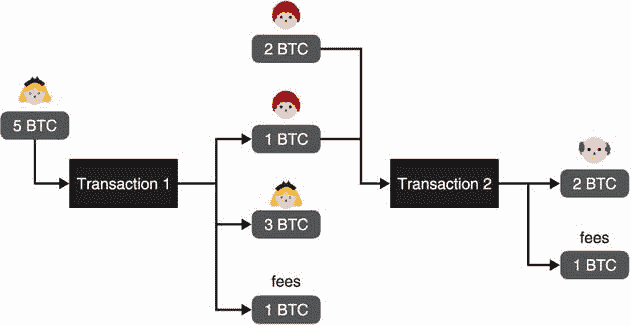

图 12.2 交易 1 由 Alice 签名，将 1 BTC 转给 Bob。由于它使用了 5 BTC 的 UTXO，该交易还需要将找零发送回 Alice，并保留一些找零作为费用。交易 2 由 Bob 签名，合并了两个 UTXO 以将 2 BTC 转给 Felix。（请注意，实际中，费用要低得多。）

现在有一个先有鸡还是先有蛋的问题：第一个 UTXO 从哪里来？这个问题我将在下一节中回答。

### 12.2.2 在数字黄金时代挖掘比特币

你现在了解了比特币交易中的内容以及如何管理你的账户或查明某人的余额。但是实际上是谁跟踪所有这些交易的呢？答案是每个人！

实际上，使用比特币意味着每笔交易都必须公开共享并记录在历史中。比特币是一个*只追加的分类帐*——一本交易记录的书，每页都与上一页相连。我在这里要强调的是，只追加意味着你不能回去修改书中的某一页。还要注意的是，因为每笔交易都是公开的，你唯一能得到的匿名性只是可能很难弄清谁是谁（换句话说，实际上什么公钥与什么人联系在一起）。

任何人都可以通过下载比特币客户端并使用它下载整个历史来轻松检查自比特币创立以来发生的任何交易。通过这样做，你成为了网络的一部分，并且必须根据比特币客户端中编码的规则重新执行每个交易。当然，比特币的历史非常庞大：在撰写本文时，它大约是 300 GB，根据你的连接速度，可能需要几天的时间来下载整个比特币分类账。你可以通过使用一个为你做繁重工作的在线服务更轻松地检查交易（只要你信任在线服务）。我在图 12.3 中给出了这些所谓的*区块链浏览器*的一个例子。

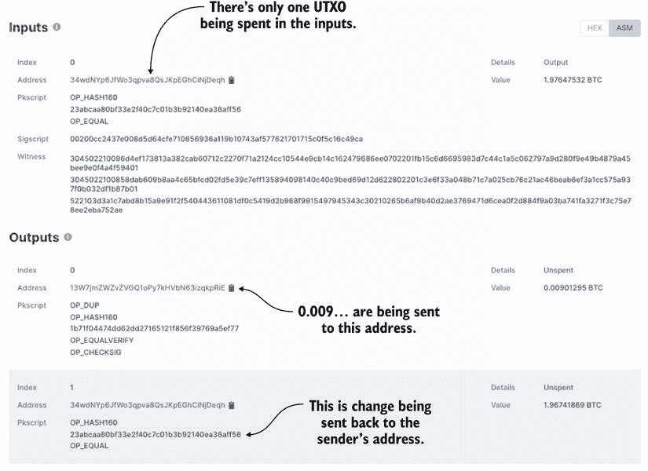

图 12.3 我选择在[`blockchain.com`](https://blockchain.com)上分析的一笔随机交易（[`mng.bz/n295`](http://mng.bz/n295)）。该交易使用一个输入（约 1.976 BTC）并将其分成两个输出（约 0.009 BTC 和 1.967 BTC）。总输入金额与总输出金额之间的差额是交易费（不作为输出表示）。其他字段是使用比特币脚本语言编写的脚本，以便花费输入中的 UTXO 或使输出中的 UTXO 可花费。

比特币实际上只是自其创世以来已处理的所有交易的列表（我们称之为*起源*）直到现在。这应该让你思考：谁负责选择和排序交易在这个分类账中？

为了就交易的排序达成一致，比特币允许任何人（甚至是你）提出要包含在下一个分类账页面中的交易列表。包含交易列表的这个提案在比特币的术语中被称为一个*块*。但是，让任何人提出一个块是灾难的预兆，因为比特币中有很多参与者。相反，我们希望只有一个人提出下一个交易块的提案。为了做到这一点，比特币让每个人都在一些概率谜题上工作，并且只允许第一个解决谜题的人提出他们的块。这就是我之前谈到的工作证明（PoW）机制。比特币的 PoW 是基于找到一个哈希值小于某个值的块。换句话说，块的哈希值必须具有以一些给定的零开始的二进制表示。

除了你想要包含的交易之外，块还必须包含上一个块的哈希值。因此，比特币分类账实际上是一系列块，其中每个块都指向前一个块，一直到第一个块，即创世块。这就是比特币所谓的*区块链*。区块链的美妙之处在于，对块的最轻微修改都会使链无效，因为块的哈希值也会改变，从而破坏下一个块对它的引用。

请注意，作为一个寻求提出下一个区块的参与者，你不需要对你的区块做太多更改来从中派生一个新的哈希。你可以首先固定它的大部分内容（包括其中的交易、它扩展的区块的哈希等），然后仅修改一个字段（称为区块的 nonce），以影响区块的哈希。你可以将这个字段视为一个计数器，递增其值直到找到符合游戏规则的摘要，或者你可以生成一个随机值。我在图 12.4 中阐述了区块链的这个概念。

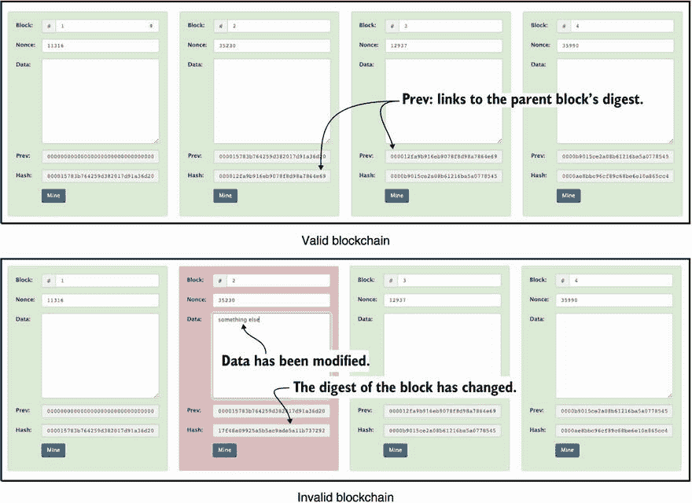

图 12.4 在[`andersbrownworth.com/blockchain/blockchain`](https://andersbrownworth.com/blockchain/blockchain)上，人们可以与一个玩具区块链进行互动。每个区块都包含其父区块的摘要，每个区块都包含一个允许其摘要以四个 0 开头的随机 nonce。注意，对于顶部的区块链是如此，但是底部的区块链包含一个已经被修改的区块（编号为 2）（其数据最初为空）。由于修改改变了区块的摘要，所以它不再被后续区块认证。

所有这一切都是因为每个人都在运行相同的协议，使用相同的规则。当你与区块链同步时，你从其他节点下载每个区块，并验证：

+   对每个区块进行哈希确实会产生一个比某个预期值更小的摘要。

+   每个区块都指向历史中的前一个区块。

并非每个人都必须提出区块，但如果你愿意，你可以这样做。如果你这样做，你就被称为*矿工*。这意味着为了让你的交易进入区块链，你需要矿工的帮助（正如图 12.5 所示）。

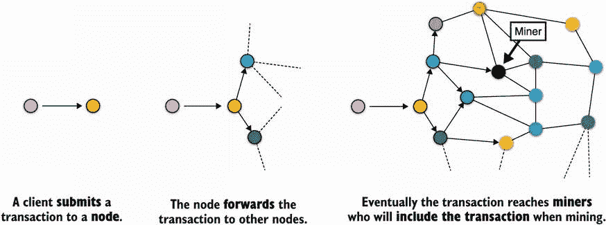

图 12.5 比特币网络是许多节点（矿工或其他）相互连接的网络。要提交一个交易，你必须将其发送给一个能够将其放入区块链中的矿工（通过将其包含在一个区块中）。由于你不知道哪个矿工将成功地挖掘一个区块，你必须通过网络传播你的交易，以尽可能多地达到矿工。

矿工不是无偿工作的。如果一个矿工找到了一个区块，他们会收集：

+   *奖励* —— 一定数量的比特币将被创建并发送到你的地址。一开始，每个挖掘的区块都会获得 50 个比特币。但是奖励值会在每挖掘 210,000 个区块时减半，并最终减少到 0，限制可以创建的比特币总量为 2100 万。

+   包含在区块中的*所有交易费* ——这就是为什么在你的交易中增加费用可以让它们更快被接受，因为矿工倾向于在他们挖掘的区块中包含费用更高的交易。

这就是比特币用户被激励推动协议向前发展的方式。一个区块总是包含所谓的*coinbase*，即收集奖励和费用的地址。矿工通常将 coinbase 设置为他们自己的地址。

现在我们可以回答本节开头提出的问题：第一个 UTXO 是从哪里来的？答案是，历史上的所有比特币在某个时候都是作为矿工的区块奖励的一部分而创建的。

### 12.2.3 分叉地狱！解决挖矿中的冲突

比特币通过基于 PoW 的系统分配选择下一组要处理的交易的任务。你挖掘一个区块的机会与你能计算的哈希数量直接相关，因此，你可以产生的计算量。如今，很多计算能力都被用于在比特币或其他基于 PoW 的加密货币中挖矿。

注意：PoW 可以被视为比特币应对*西比尔攻击*的方式，这些攻击利用了你可以在协议中创建任意多个账户的事实，给不诚实的参与者带来了不对称的优势。在比特币中，获得更多算力的唯一途径实际上是购买更多硬件来计算哈希值，而不是在网络中创建更多地址。

然而，仍然存在一个问题：找到一个低于某个值的哈希的难度不能太低。如果太容易，那么网络中将有太多参与者同时挖掘一个有效的区块。如果发生这种情况，那么在链中哪个被挖掘的区块是合法的下一个区块呢？这本质上就是我们所说的*分叉*。

为了解决分叉问题，比特币有两种机制。第一种是*保持 PoW 的难度*。如果区块挖掘得太快或太慢，那么每个人都在运行的比特币算法会根据网络条件动态调整，并增加或减少 PoW 的*难度*。简单来说，矿工必须找到一个具有更多或更少零的区块摘要。

注意：如果难度要求区块摘要以 0 字节开头，你需要尝试 2⁸个不同的区块（更具体地说是不同的 nonce，如前面所述），直到找到有效的摘要。将这个数字提高到 2 字节，你现在需要尝试 2¹⁶个不同的区块。你达到这个目标所需的时间取决于你拥有的计算能力以及是否有专门的硬件来更快地计算这些哈希值。目前，比特币的算法会动态调整难度，以确保每 10 分钟挖出一个区块。

我们的第二个机制是确保每个人在发生分叉时都有相同的前进方式。为了做到这一点，规则是*遵循工作量最大的链*。2008 年的比特币白皮书指出，“最长的链不仅作为事件序列的证明，还证明它来自 CPU 算力最大的池”，规定参与者应该尊重他们认为是最长链的链。协议后来更新为遵循具有最高累积工作量的链，但在这里这个区别并不太重要。我在图 12.6 中进行了说明。

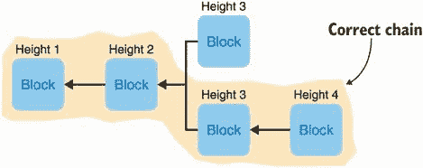

图 12.6 区块链中的分叉：两个矿工在高度 3 发布了一个有效区块（意味着创世区块之后的第 3 个区块）。后来，另一个矿工在高度 4 挖掘了一个指向高度 3 的第二个区块的区块。由于第二个分叉现在更长，这是矿工应该继续扩展的有效分叉。请注意，指向区块的箭头指向父区块（它们扩展的区块）。

我之前说过比特币的共识算法不是 BFT 协议。这是因为共识算法允许这样的分叉。因此，如果你正在等待你的交易被处理，绝对不应该仅仅依靠观察你的交易是否被包含在一个区块中！观察到的区块实际上可能是一个分叉，而且是一个失败的分叉（相对于更长的分叉）。

你需要更多的保证来决定你的交易是否已经真正被处理。大多数钱包和交易平台都等待一定数量的*确认区块*在你的区块之上被挖掘出来。在包含你的交易的那个区块之上挖掘出来的区块越多，链被重新组织成另一条链的机会就越小，因为已存在的分叉更长。

确认数通常设置为 6 个区块，这使得你的交易确认时间大约为一小时。话虽如此，比特币仍然不能提供 100% 的保证，即在 6 个区块之后不会发生分叉。如果挖矿难度调整得很好，那么应该没问题，我们有理由相信比特币是这样的。

随着加密货币变得越来越流行，比特币的 PoW 难度逐渐增加。难度现在已经非常高，大多数人无法负担得起所需的硬件来有机会挖掘一个区块。如今，大多数矿工会聚集在所谓的*挖矿池*中，以分配挖掘一个区块所需的工作。然后，他们分享奖励。

*在区块 632874 [. . .] 中，比特币区块链的预期累积工作量超过了 2⁹² 次双 SHA256 哈希运算*。

—Pieter Wuille (2020, [`mng.bz/aZNJ`](http://mng.bz/aZNJ))

要理解分叉为何具有破坏性，让我们想象以下情景。Alice 从你这里购买了一瓶葡萄酒，而你一直在等待她将她账户中的 5 BTC 发送给你。最终，你观察到高度为 10 的新区块（意味着创世区块之后的第 10 个区块）包含了她的交易。谨慎起见，你决定等待再添加 6 个区块在其上。等待了一段时间后，你最终看到了高度为 16 的区块，延伸了包含你的高度为 10 的区块的链。你将葡萄酒送给了 Alice，并称其为一天结束。但这还不是故事的结束。

后来，高度为 30 的区块突然出现，延伸了一个刚在你的区块之前（高度为 9）分叉出来的不同区块链。由于新链更长，最终被所有人接受为合法链。你之前所在的链（从你的高度为 10 的区块开始）被丢弃，网络中的参与者简单地重新组织他们的链，指向新的最长链。正如你所猜测的，这个新链中没有包含爱丽丝的交易。相反，它包含一笔交易，将她所有的资金转移到另一个地址，阻止你重新发布将她的资金转移到你地址的原始交易。爱丽丝有效地*双重花费*了她的钱。

这就是*51%攻击*。这个名称来自爱丽丝执行攻击所需的计算能力的数量；她只需要比其他人多一点点。([`crypto51.app`](https://crypto51.app)有一张有趣的表格，列出了根据 PoW 在不同加密货币上执行 51%攻击的成本。)这不仅仅是一个理论上的攻击！51%攻击在现实世界中发生。例如，在 2018 年，一名攻击者成功地在 Vertcoin 货币上进行了 51%攻击，双重花费了一些资金。

*攻击者实质上重写了账本的部分历史，然后利用他们的主导哈希算力生成最长链，说服其他矿工验证这个新版本的区块链。有了这个，他或她可以实施终极的加密犯罪：对先前交易进行双重花费，让先前的收款人持有无效的硬币*。

—迈克尔·J·凯西（“Vertcoin 的困境是真实的：为什么最新的加密 51%攻击很重要”，2018）

在 2019 年，以太坊经典（以太坊的一个变种）发生了同样的事情，导致当时损失超过 100 万美元，出现了超过 100 个区块深度的多次重组。2020 年，比特币黄金（比特币的一个变种）也遭受了 51%攻击，从加密货币的历史中删除了 29 个区块，并在不到两天内双重花费了超过 7 万美元。

### 12.2.4 通过使用默克尔树来减小区块的大小

我想谈谈比特币的另一个有趣方面，即它如何压缩部分可用信息。比特币中的一个区块实际上不包含任何交易！交易是单独共享的，而一个区块包含一个认证一系列交易的单一摘要。该摘要可以简单地是区块中包含的所有交易的哈希值，但它比那更聪明。相反，该摘要是一个*Merkle 树*的根。

什么是默克尔树？简单来说，它是一个树（数据结构），其中内部节点是它们子节点的哈希值。这可能有点令人困惑，一幅图值千言，所以看看图 12.7。

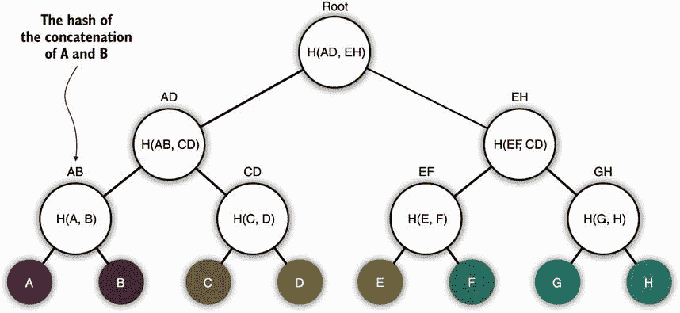

图 12.7 梅克尔树，一种验证其叶子元素的数据结构。在树中，内部节点是其子节点的哈希值。根哈希可以用来验证整个结构。在图中，`H()`表示哈希函数，逗号分隔的输入可以实现为连接（只要没有歧义）。

梅克尔树是有用的结构，你会在各种实际协议中找到它们。它们可以将大量数据压缩为一个小的、固定大小的值——树的根。不仅如此，你不一定需要所有的叶子来重建根。

例如，想象一下，你知道梅克尔树的根是因为它包含在一个比特币区块中，你想知道一个交易（树中的一个叶子）是否包含在该区块中。如果它在树中，我可以与你分享路径上的相邻节点作为*成员证明*。（一种在树的深度上对数大小的证明。）你需要做的是通过对路径中的每一对进行哈希运算，计算出根节点的内部节点直到根节点。在文字上解释这个过程有点复杂，所以我在图 12.8 中用图示来说明这个证明。

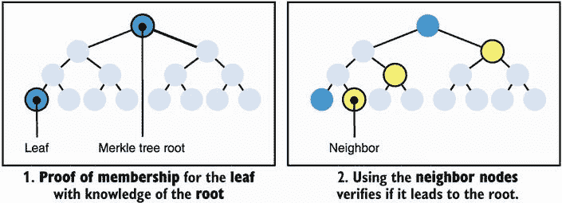

图 12.8 知道梅克尔树的根，可以通过重构所有叶子的根哈希来验证一个叶子是否属于树。为此，你首先需要所有叶子，在我们的图中是 8 个摘要（假设叶子是某个对象的哈希）。如果你不需要所有其他叶子，还有一种更有效的方法来构建成员证明：你只需要路径中从叶子到根的相邻节点，这包括你的叶子在内的 4 个摘要。验证者可以使用这些相邻节点来计算路径上所有缺失节点的哈希，直到重建根哈希并查看它是否与他们期望的相匹配。

在一个区块中使用梅克尔树而不是直接列出所有交易的原因是为了减轻下载所需信息以执行对区块链的简单查询。例如，想象一下，你想要检查你最近的交易是否包含在一个区块中，而不必下载比特币区块链的整个历史记录。你可以做的是仅下载区块头，因为它们不包含交易而更轻，一旦你拥有了它，就可以询问一个节点告诉你哪个区块包含了你的交易。如果有这样的一个区块，他们应该能够提供一个证明，证明你的交易在你在区块头中拥有的摘要所认证的树中。

对于比特币还有很多要讲，但这本书的页数有限。因此，我将利用本章剩余的空间带你了解这个领域，并解释经典的 BFT 共识协议是如何工作的。

## 12.3 加密货币的概览

比特币是第一个成功的加密货币，尽管已经创建了数百种其他加密货币，但比特币仍然保持着最大市场份额和价值。有趣的是，比特币存在许多问题，其他加密货币已经尝试解决（有些成功）。更有趣的是，加密货币领域利用了许多直到现在都没有许多实际应用或甚至不存在的加密原语！所以，话不多说，以下部分列出了自比特币诞生以来已经研究的问题。

### 12.3.1 波动性

目前大多数人使用加密货币作为投机工具。比特币的价格显然有助于这个故事，因为它已经证明它可以在一天内轻松地上千美元地上下波动。有些人声称稳定性将随着时间的推移而来，但事实仍然是，比特币现在不能用作货币。其他加密货币已经尝试使用*稳定币*的概念，将其代币的价格与现有的法定货币（如美元）挂钩。

### 12.3.2 延迟

您可以通过许多方式来衡量加密货币的效率。加密货币的*吞吐量*是它可以处理的每秒交易数量。例如，比特币的吞吐量相当低，每秒只有 7 笔交易。另一方面，*确定性*是一旦您的交易被包含在区块链中就被视为已确定的时间。由于分叉，比特币的确定性永远无法完全实现。被认为是在交易被包含在新区块中的至少一小时后，交易被撤销的概率变得可接受。这两个数字都极大地影响了*延迟*，延迟是从用户的角度来看，交易被最终确认所需的时间。在比特币中，延迟包括交易的创建，将其传播到网络的时间，将其包含在区块中的时间，最后是等待区块确认的时间。

这些速度问题的解决方案可以通过 BFT 协议解决，这些协议通常提供仅需几秒钟即可完成的确定性，并保证不会发生分叉，并且每秒可处理数千笔交易。然而，有时这仍然不够，正在探索不同的技术。所谓的*第二层协议*尝试提供额外的解决方案，可以在链下更快地进行支付，并周期性地将进度保存在主区块链上（与第一层相比称为层 1）。

### 12.3.3 区块链大小

比特币和其他加密货币的另一个常见问题是区块链的大小可能迅速增长到不切实际的大小。当用户想要使用加密货币（例如查询其账户余额）时，会出现可用性问题，因为他们预期必须首先下载整个链才能与网络交互。处理大量交易每秒的基于 BFT 的加密货币预计将在几个月甚至几周内轻松达到几 TB 的数据。存在几种解决方案。

其中最有趣的之一是 Mina，它不需要您下载整个区块链的历史记录才能到达最新状态。相反，Mina 使用零知识证明（ZKPs），在第七章中提到，我将在第十五章中更深入地介绍，将所有历史记录压缩成固定大小的 11 KB 证明。这对于像手机这样的轻客户端特别有用，通常必须信任第三方服务器才能查询区块链。

### 12.3.4 保密性

比特币提供了*伪匿名性*，因为账户仅与公钥相关联。只要没有人能将公钥与个人联系起来，相关账户就保持匿名。请记住，与该账户有关的所有交易都是公开的，社交图仍然可以创建，以了解谁倾向于与谁更频繁地交易，以及谁拥有多少货币。

有许多加密货币尝试使用 ZKPs 或其他技术来解决这些问题。*Zcash*是最知名的保密加密货币之一，因为其交易可以加密发送者地址、接收者地址和交易金额。所有这些都使用 ZKPs！

### 12.3.5 能源效率

比特币因为在电力消耗方面过于庞大而受到了严厉批评。事实上，剑桥大学最近评估，挖掘比特币所花费的所有能源使比特币成为世界前 30 大能源使用国（如果视为一个国家），在一年内消耗的能源比阿根廷还多（2021 年 2 月；[`cbeci.org/`](https://cbeci.org/)）。另一方面，BFT 协议不依赖于 PoW，因此避免了这种沉重的开销。这无疑是为什么任何现代加密货币似乎都避免基于 PoW 的共识，甚至像以太坊这样重要的 PoW-based 加密货币也宣布计划转向更环保的共识协议。在进入下一章之前，让我们看看基于 BFT 共识协议的这些加密货币。

## 12.4 DiemBFT：拜占庭容错（BFT）共识协议

许多现代加密货币已经放弃了比特币的 PoW 方面，转而采用更环保和更高效的共识协议。这些共识协议大多基于经典的 BFT 共识协议，这些协议大多是原始 PBFT 协议的变体。在本节中，我将使用 Diem 来说明这种 BFT 协议。

*Diem*（之前称为 Libra）是一种数字货币，最初由 Facebook 在 2019 年宣布，由 Diem 协会管理，该协会是由公司、大学和非营利组织组成，旨在推动开放和全球支付网络。Diem 的一个特点是它由真实货币支持，使用法定货币储备。这使得数字货币稳定，不像它的老表兄比特币。为了以安全和开放的方式运行支付网络，使用了一种 BFT 共识协议称为 *DiemBFT*，这是 HotStuff 的一个变种。在本节中，让我们看看 DiemBFT 是如何工作的。

### 12.4.1 安全性和活性：BFT 共识协议的两个属性

BFT 共识协议旨在在容忍一定比例的恶意参与者的情况下实现两个属性。这些属性包括

+   *安全性*—不会达成矛盾的状态，意味着不应该发生分叉（或以极小的概率发生）。

+   *活性*—当人们提交交易时，状态最终会处理它们。换句话说，没有人可以阻止协议完成其任务。

请注意，如果参与者不按照协议行事，则通常被视为恶意（也称为 *拜占庭*）。这可能意味着他们什么也不做，或者他们没有按照正确顺序执行协议的步骤，或者他们没有遵守一些旨在确保没有分叉的强制性规则，等等。

BFT 共识协议通常很容易实现安全性，而活性则被认为更加困难。事实上，1985 年由 Fischer、Lync 和 Paterson 提出的著名不可能结果（“一个故障进程下的分布式共识不可能性”）与 BFT 协议相关，指出在 *异步* 网络（消息可以花费任意时间到达）中，没有 *确定性* 共识协议能够容忍故障。大多数 BFT 协议通过将网络视为某种程度上的 *同步*（事实上，如果你的网络长时间宕机，任何协议都是无用的）或者在算法中引入随机性来避免这一不可能结果。

出于这个原因，即使在极端网络条件下，DiemBFT 也永远不会分叉。此外，即使存在网络分区，即网络的不同部分无法到达其他部分，只要网络最终恢复和稳定足够长的时间，它总是会取得进展。

### 12.4.2 DiemBFT 协议中的一轮

Diem 在一个预先知道参与者（称为 *验证者*）的许可设置中运行。协议在严格递增的轮次（第 1 轮、第 2 轮、第 3 轮等）中前进，在此期间验证者轮流提出交易块。在每一轮中

1.  被选择为领导者（确定性地）的验证者收集一定数量的交易，将它们组合成一个新的区块，延伸区块链，然后对区块进行签名并将其发送给所有其他验证者。

1.  在收到建议的区块后，其他验证者可以通过签名并将签名发送给下一轮的领导者来对其进行认证。

1.  如果下一轮的领导者收到足够多的选票支持该区块，他们可以将所有这些选票捆绑在一个称为*quorum certificate*（QC）的证书中，该证书证明了该区块，并使用该 QC 提出一个新的区块（在下一轮中）来延伸现在已经被认证的区块。

另一种看待这个问题的方式是，在比特币中，一个区块只包含它所延伸的区块的哈希值，而在 DiemBFT 中，一个区块还包含对该哈希值的一定数量的签名。（签名的数量很重要，但稍后再详细说明。）

请注意，如果验证者在一轮中没有看到建议（例如，因为领导者离线了），他们可以超时并警告其他验证者没有发生任何事情。在这种情况下，将触发下一轮，提议者可以延伸他们已看到的最高认证区块。我在图 12.9 中总结了这一点。

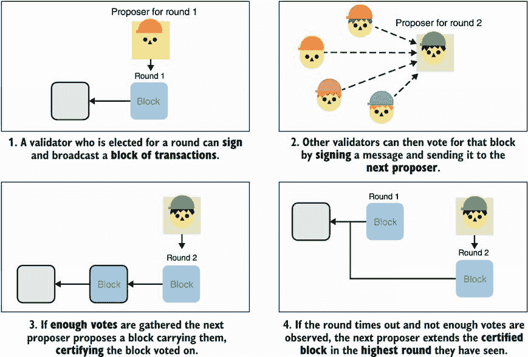

图 12.9 DiemBFT 的每一轮都是由指定的领导者提出延伸他们所见到的最后一个区块的区块开始的。其他验证者随后可以对该区块进行投票，将他们的投票发送给下一轮的领导者。如果下一轮的领导者收集到足够的选票以形成一个 quorum certificate（QC），他们可以提出一个包含 QC 的新区块，有效地延伸之前看到的区块。

### 12.4.3 协议能容忍多少不诚实行为？

假设我们希望在最多容忍*f*个恶意验证者的情况下（即使他们全部串通作恶），那么 DiemBFT 规定协议需要至少有 3*f* + 1 个验证者参与（换句话说，对于*f*个恶意验证者，至少需要有 2*f* + 1 个诚实验证者）。只要这个假设成立，该协议就能提供安全性和活力。

有了这个前提，只有获得大多数诚实验证者的投票才能形成 QC，即使有 3*f* + 1 个参与者，这也需要 2*f* + 1 个签名。这些数字可能有点难以想象，因此我展示了它们对我们观察到的投票信心的影响，见图 12.10。

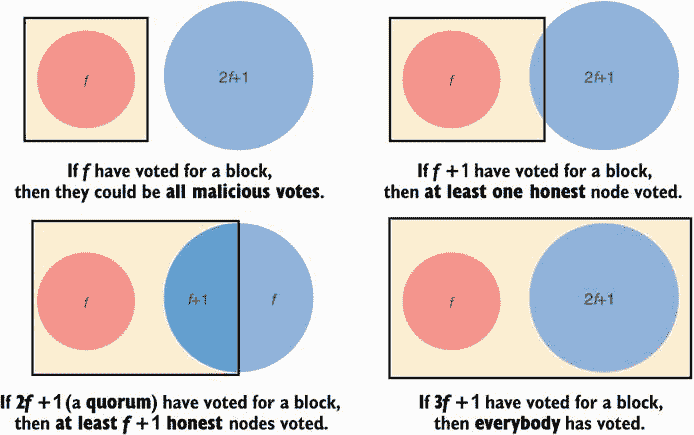

图 12.10 在 DiemBFT 协议中，至少有三分之二的验证者必须是诚实的，协议才能安全（不会分叉）和活跃（会取得进展）。换句话说，只要有 2*f* + 1 个验证者是诚实的，该协议就能容忍*f*个不诚实的验证者。一个已认证的区块至少收到了 2*f* + 1 个投票，因为这是能够代表大多数诚实验证者的最低投票数。

### 12.4.4 DiemBFT 投票规则

验证者必须始终遵循两个投票规则，否则将被视为拜占庭式的：

1.  他们不能在过去投票（例如，如果你刚刚在第 3 轮投票，你只能在第 4 轮及以上投票）。

1.  他们只能为延伸到他们首选轮次或更高轮次的区块投票。

什么是*首选轮次*？默认情况下是 0，但如果你为一个延伸到一个延伸到一个区块的区块投票（我的意思是你为一个有祖父区块的区块投票），那么那个祖父区块的轮次就成为你的首选轮次，除非你之前的首选轮次更高。复杂吗？我知道，这就是为什么我制作了图 12.11。

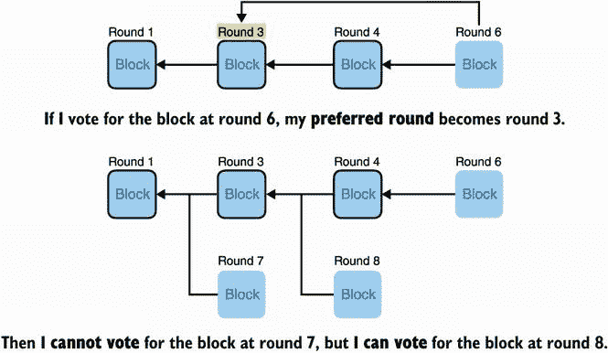

图 12.11 在为一个区块投票后，验证者将他们的首选轮次设置为祖父区块的轮次，如果它高于他们当前的首选轮次。要为一个区块投票，其父区块的轮次必须大于或等于首选轮次。

### 12.4.5 交易何时被视为最终确定？

请注意，已认证的区块尚未最终确定，或者我们也可以说是*已提交*。没有人应该假设包含在待处理区块中的交易不会被撤销。只有当*提交规则*被触发时，区块和其中包含的交易才能被视为最终确定。提交规则（在图 12.12 中说明）表示，如果：

+   区块开始了一个由 3 个在*连续轮次*（例如，在第 1、2 和 3 轮）中提出的区块组成的链。

+   这个 3 个区块链的最后一个区块被认证。

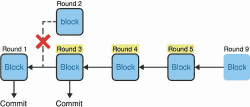

图 12.12 三个连续轮次（3、4、5）恰好有一条链由认证的区块组成。观察到第 5 轮的最后一个区块被第 9 轮的 QC 认证的任何验证者可以提交第 3 轮的链的第一个区块，以及其所有祖先（这里是第 1 轮的区块）。任何相矛盾的分支（例如第 2 轮的区块）都会被丢弃。

这就是协议的高层次内容。但是，当然，细节才是关键。

### 12.4.6 DiemBFT 安全性背后的直觉

虽然我鼓励你阅读 DiemBFT 论文中的一页安全性证明，但我想在这里用几页来让你直观地理解它为什么有效。首先，我们注意到在同一轮中不能认证两个不同的区块。这是一个重要的特性，我在图 12.13 中用视觉方式解释。

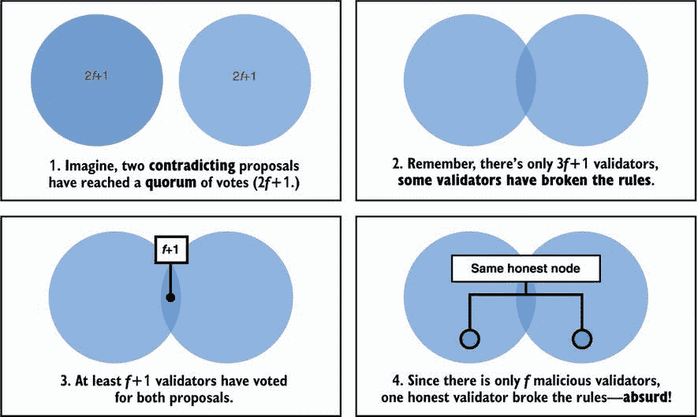

图 12.13 假设在一个由 3*f* + 1 个验证者组成的协议中只能有最多*f*个恶意验证者，并且一个法定证书是由 2*f* + 1 个签名投票创建的，那么每轮只能有一个经过认证的区块。图中展示了一个*反证法*，证明这是不可能的，因为那样会与我们最初的假设相矛盾。

利用只有一个区块可以在给定轮次获得认证的属性，我们可以简化我们讨论区块的方式：区块 3 在第 3 轮，区块 6 在第 6 轮，依此类推。现在，看一下图 12.14，并花点时间弄清楚为什么一个经过认证的区块，或两个经过认证的区块，或三个非连续轮次的经过认证的区块不能在不冒风险的情况下导致提交。

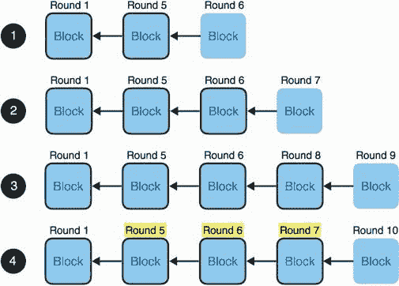

图 12.14 在所有这些场景中，提交区块 5 可能导致分叉。只有在第 4 个场景中提交区块 5 是安全的。你能告诉为什么在所有场景中除了第 4 个场景提交区块 5 是危险的吗？

你能找出所有场景的答案吗？简短的答案是，除了最后一个场景外，所有场景都留有一个区块可以延伸到第 1 轮。这个晚到的区块实际上会分叉并根据共识协议的规则进一步延伸。如果发生这种情况，区块 5 和其他延伸它的区块将被丢弃，因为另一个更早的分支被提交。对于场景 1 和 2，这可能是由于提议者没有看到之前的区块。在场景 3 中，一个更早的区块可能出现得比预期晚，可能是由于网络延迟，或者更糟糕的是，由于验证者在合适的时机才公布它。我在图 12.15 中进一步解释这一点。

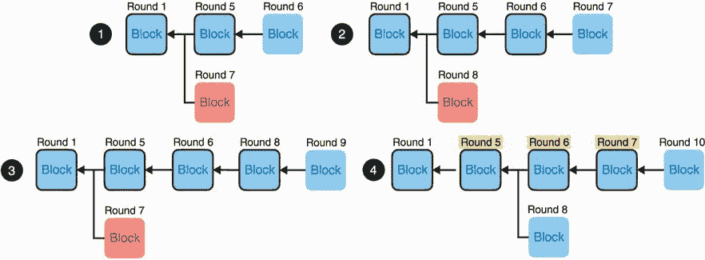

图 12.15 在图 12.14 的基础上，除了最后一个场景外，所有场景都允许一个可以最终获胜并丢弃区块 5 分支的并行链。最后一个场景有一个由三个连续轮次的经过认证的区块组成的链。这意味着区块 7 有大多数诚实选民，他们反过来更新了他们的首选轮次到第 5 轮。之后，没有区块可以在区块 5 之前分叉并同时获得 QC。最糟糕的情况是一个区块延伸区块 5 或区块 6，这最终会导致相同的结果—区块 5 被提交。

## 摘要

+   加密货币是关于去中心化支付网络，以避免单点故障。

+   为了让每个人对加密货币的状态达成一致，我们可以使用共识算法。

+   拜占庭容错（BFT）共识协议于 1982 年发明，并已发展成为更快速和更简单易懂的形式。

+   BFT 共识协议需要一个已知且固定的参与者集合（许可网络）。这样的协议可以决定谁是这个参与者集合的一部分（权威证明或 PoA），或者根据他们持有的货币数量动态选举参与者集合（权益证明或 PoS）。

+   比特币的共识算法（中本聪共识）使用工作量证明（PoW）来验证正确的链并允许任何人参与（无许可网络）。

+   比特币的 PoW 让参与者（称为矿工）计算大量哈希以找到具有特定前缀的哈希。成功找到有效摘要允许矿工决定下一个交易区块并收取奖励以及交易费。

+   比特币中的账户只是使用 secp256k1 曲线的 ECDSA 密钥对。用户可以通过查看尚未花费的所有交易输出（UTXO）知道他们的账户持有多少比特币。因此，交易是一条已签名的消息，授权将一定数量的旧交易输出移动到新输出，可以花费给不同的公钥。

+   比特币使用默克尔树来压缩区块的大小，并允许交易包含验证的大小较小。

+   稳定币是一种加密货币，试图通过将其代币与美元等法定货币的价值挂钩来稳定其价值。

+   加密货币使用所谓的第二层协议，以减少其延迟，通过在链下处理交易并周期性地保存进度在链上。

+   零知识证明（ZKPs）在许多不同的区块链应用中使用（例如，在 Zcash 中提供保密性，在 Coda 中将整个区块链压缩为短的有效性证明）。

+   Diem 是一种稳定币，它使用称为 DiemBFT 的 BFT 共识协议。只要 3*f* + 1 参与者中不超过 *f* 个恶意参与者存在，它就保持安全（没有分叉）和活跃（总是取得进展）。

+   DiemBFT 通过在轮次中让参与者提议延伸先前区块的交易的区块来运作。其他参与者随后可以为该区块投票，如果收集到足够的票数（2*f* + 1），可能会创建一个法定证书（QC）。

+   在 DiemBFT 中，当触发提交规则（一系列连续轮次的 3 个已认证区块）时，区块及其交易将被最终确定。发生这种情况时，链的第一个区块及其延伸的区块将被提交。
