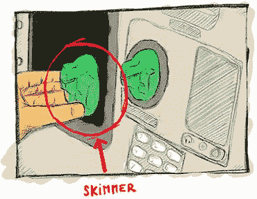
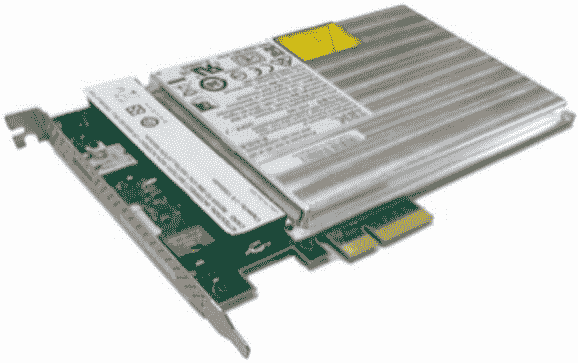
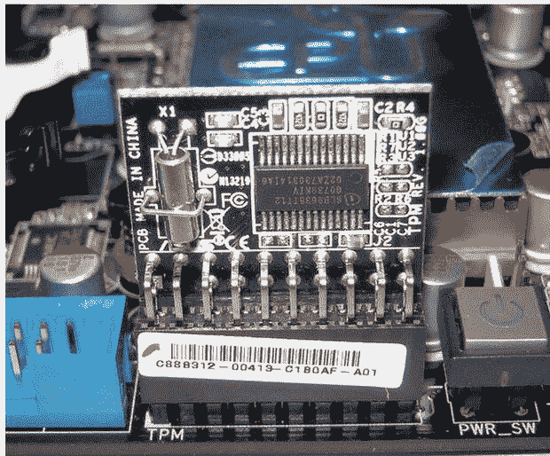
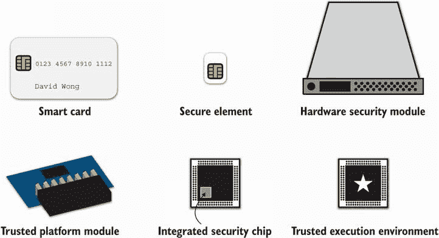
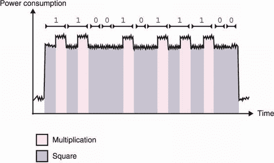

# 第十三章：硬件加密

本章内容包括

+   高度对抗性环境中的密码学问题

+   增加攻击者成本的硬件解决方案

+   侧信道攻击和软件缓解措施

密码学原语和协议经常被描述为孤立的构建模块，仿佛它们在远离任何对手的星系中运行。实际上，这是一个不切实际的假设，经常被证明是错误的。在现实世界中，密码学在各种环境中运行，并受到各种威胁的影响。在本章中，我们将研究更极端的场景——*高度对抗性环境*——以及您在这些情况下可以采取的措施以保护您的密钥和数据。（剧透警告：这涉及使用专门的硬件。）

## 13.1 现代密码学攻击模型

*当今的计算机和网络安全始于这样一个假设，即存在一个我们可以信任的域。例如：如果我们为了在互联网上传输数据而加密数据，我们通常假设进行加密的计算机没有被损害，并且存在一些其他的“终点”，可以在那里安全地解密它*。

— Joanna Rutkowska（《Intel x86 可恶之处》，2015）

密码学曾经是关于“爱丽丝想要将消息加密发送给鲍勃，而不让伊娃能够截获它”。如今，它的大部分内容已经转移到了更类似于“爱丽丝想要将消息加密发送给鲍勃，但爱丽丝已经受到了损害。”这是一个完全不同的攻击者模型，通常在理论密码学中没有被预料到。我这是什么意思？让我给你一些例子：

+   在可能装有*读取器假面*（skimmer）的自动取款机（ATM）上使用信用卡。读取器假面是窃贼可以放置在读卡器顶部的设备，用于复制您银行卡的内容（见图 13.1）

+   在您的手机上下载一个破坏操作系统（OS）的应用程序

+   在共享网络托管服务中托管网站，另一个恶意客户可能与您共用同一台机器

+   在被来自不同国家间谍访问的数据中心中管理高度敏感的机密



图 13.1 读取器假面，一种恶意设备，可放置在 ATM 或付款终端的读卡器前，以复制磁条中的数据。磁条通常包含账号、到期日期和其他元数据，您用于在线支付或在许多付款终端上支付。假面有时伴随着隐藏摄像头一起使用，以获取您的个人识别码（PIN），从而潜在地使窃贼能够进行取款和要求输入 PIN 的付款终端。

所有这些示例都是在许多密码学家忽视或完全不了解的威胁模型中对密码学的现代应用。事实上，您在文献中读到的大多数密码学原语都假设例如，艾丽丝完全控制她的执行环境，只有当密文（或签名或公钥或……）离开她的计算机进入网络时，中间人攻击者才能执行他们的技巧。但是，在现实和现代，我们经常在更具对抗性的模型中使用密码学。

警告 安全性毕竟是您的假设和对潜在攻击者的期望的产物。如果您的假设是错误的，那么您将度过糟糕的时光。

现实世界中的应用如何将理论加密与这些更强大的攻击者相协调？它们做出*妥协*。换句话说，他们试图让攻击者的生活更加困难。这些系统的安全性通常是以*成本*（攻击者需要花费多少来破解系统？）而不是计算复杂性来计算的。

在本章中，您将学到很多*不完美的*加密技术，这在现实世界中我们称之为*深度防御*。有很多东西需要学习，这一章带来了许多新的缩略词和不同的解决方案，不同的供应商以及他们的营销团队和销售人员提出了。所以让我们开始学习在不受信任的环境中的可信系统。

## 13.2 不受信任的环境：硬件拯救

实践中攻击系统有不同的方法。将它们归类的一种方式是这样思考：

+   *软件攻击*—利用在您设备上运行的代码的攻击。

+   *硬件攻击*—需要攻击者物理接近您的设备的攻击方式。

在之前的章节中，我已经反复讨论了针对加密的软件攻击以及如何减轻它们的影响，但是如果利用硬件解决方案，有些软件攻击会更容易防御。例如，通过在连接到您计算机的独立设备上生成和使用加密密钥，一个感染您计算机的病毒将无法提取密钥。

然而，硬件攻击更加棘手，因为获得设备访问权限的攻击者几乎可以为所欲为：磁盘上的数据可以任意修改，激光可以瞄准特定位置以迫使计算产生错误值（所谓的*故障攻击*），芯片可以打开以显示其部件，聚焦离子束（FIB）显微镜可用于逆向工程组件等等。天空是极限，保护免受这种有动机的攻击者是很困难的。通常，可用的不同解决方案归结为尽可能添加更多层次的防御以使攻击者的生活更加困难。这一切都是关于提高成本！

恶意女佣攻击

并非所有的硬件攻击者都是一样的。例如，有些攻击者可以花费一些时间与您的设备相处，而其他人可能只有有限的时间。想象一下以下情景：您把手机或笔记本电脑放在酒店房间里不管，一个“恶意”的女佣进来，打开设备，使用低成本的现成工具修改系统，然后离开设备看起来未经触碰就回到您的房间之前的地方。在文献中，这被称为*恶毒女佣攻击*，并且可以推广到许多情况（例如，携带设备在飞行时的托运行李中，将敏感密钥存储在不安全的数据中心中等）。

当然，并非所有系统都必须防范最强大的硬件攻击，也不是所有应用程序都面对相同级别的威胁。不同的硬件解决方案适用于不同的情境，因此本节剩余内容是关于理解“这样那样”的区别。

### 13.2.1 白盒密码学，一个糟糕的想法

在涉及不受信任环境的硬件解决方案之前，为什么不使用软件解决方案呢？密码学能否提供不泄露自己密钥的原语？

*白盒密码学*正是这样：密码学的一个领域，试图将其使用的密钥与加密实现混合在一起。目标是防止观察者从中提取密钥。攻击者获取了某个带有固定密钥的白盒 AES 实现的源代码，它可以很好地加密和解密，但是密钥与实现混合得太好了，以至于任何人都很难从算法中提取它。这至少是理论上的。在实践中，尚未发现任何已发布的白盒密码算法是安全的，大多数商业解决方案由于这个原因是闭源的。

注意*安全通过模糊和混淆*（将代码混淆以使其看起来难以理解）是一种通常不受欢迎的技术，因为它们尚未被证明有效。尽管如此，在现实世界中，这些技术有时会有用，并且可以用来延迟和挫败对手。

总的来说，白盒密码学是一个大行业，向需要*数字版权管理*（DRM）解决方案的企业销售可疑的产品（控制客户对其购买的产品的访问权限的工具）。例如，您可以在播放您在商店购买的电影的硬件中找到这些白盒解决方案，或者在您正在观看的流媒体服务中播放电影的软件中找到这些解决方案。实际上，DRM 并不能强力阻止这些攻击；它只是让他们的客户的生活变得更加困难。更严肃的是，有一个称为*不可区分混淆*（iO）的密码学分支试图在密码学上实现这一点。iO 是一个理论上的、不切实际的、到目前为止还没有真正被证明的研究领域。我们将看看这个领域的发展如何，但我不会抱太大希望。

### 13.2.2 它们在你的钱包里：智能卡和安全元素

白盒密码学并不是很好，但这几乎是对抗强大对手的最佳软件解决方案。因此，让我们转向硬件方面寻找解决方案。（剧透警告：事情即将变得更加复杂和令人困惑。）如果您认为现实世界的密码学很混乱，有太多的标准或做同样事情的方法，那么等到您了解硬件世界正在发生的事情时，您会感到更加惊讶。不同的术语已经被创造并以不同的方式使用，标准不幸地像密码学标准一样多样化（如果不是更多）。

要了解所有这些硬件解决方案以及它们之间的区别，让我们从一些必要的历史开始。*智能卡*是通常包装在塑料卡（如银行卡）内的小芯片，于 20 世纪 70 年代初在微电子技术的进步之后发明。智能卡最初是让每个人都有一个口袋计算机的实用方式！事实上，现代智能卡嵌入了自己的 CPU、不同类型的可编程或不可编程存储器（ROM、RAM 和 EEPROM）、输入和输出、硬件随机数生成器（也称为 TRNG，正如你在第八章中学到的），等等。

他们在“智能”方面是指它们可以运行程序，不像以前的不那么智能的卡片只能通过磁条存储数据，这些数据可以很容易通过我之前提到的偷取器复制。大多数智能卡允许开发人员编写可以在卡上运行的小型、独立的应用程序。智能卡支持的最流行的标准是*JavaCard*，它允许开发人员编写类似于 Java 的应用程序。

要使用智能卡，您首先需要通过将其插入读卡器来激活它。最近，卡片已经通过近场通信（NFC）协议进行了增强，以通过无线电频率实现相同的结果。这使您可以通过靠近读卡器来使用卡片，而不是物理接触。

银行和传统密码学

顺便说一句，银行利用智能卡存储每张卡的唯一卡密，能够表明：“我确实是您给这位客户的卡。”直觉上，您可能认为这是通过公钥加密实现的，但银行业仍然停留在过去，使用对称加密（由于仍在使用的大量传统软件和硬件）！

更具体地说，大多数银行卡存储着一个*三重 DES*（3DES）对称密钥，这是一个旧的 64 位分组密码，旨在使不安全的数据加密标准（DES）安全。该算法用于生成 MAC（消息认证码）而不是加密，用于对某些挑战生成 MAC。持有每位客户当前 3DES 对称密钥的银行可以验证 MAC。这是现实世界加密通常涉及的一个绝佳例子：在许多地方以一种危险的方式使用的传统算法。（这也是为什么密钥轮换是一个如此重要的概念，以及为什么你必须定期更换银行卡。）

智能卡结合了许多物理和逻辑技术，以防止其执行环境和存储秘密的部分的观察、提取和修改。存在许多试图破解这些卡片和硬件设备的攻击。这些攻击可以分为三种不同的类别：

+   *非侵入式攻击*—不会影响目标设备的攻击。例如，差分功耗分析（DPA）攻击评估智能卡在执行加密操作时的功耗，以提取其密钥。

+   *半侵入式攻击*—利用对芯片表面的访问以非破坏性方式进行攻击以实施利用。例如，差分故障分析（DFA）攻击利用热量、激光等技术修改智能卡上运行的程序的执行，以泄露密钥。

+   *侵入式攻击*—打开芯片以探测或修改硅片电路，以改变芯片的功能并揭示其秘密的攻击。这些攻击是显著的，因为它们可能损坏设备，并且有更大的可能性使设备无法使用。

硬件芯片非常小且紧密封装的事实可能使攻击变得困难。但专门的硬件通常通过使用不同层次的材料防止解封和物理观察，并使用硬件技术增加已知攻击的不准确性而进一步防范。

智能卡迅速变得非常流行，很快就变得明显，将这样一个安全的黑匣子放入其他设备中可能是有用的。一个*安全元件*的概念诞生了：一个防篡改的微控制器，可以以可插拔的形式找到（例如，您手机中用于访问运营商网络所需的 SIM 卡）或直接粘贴在芯片和主板上（例如，连接到 iPhone NFC 芯片进行支付的嵌入式安全元件）。安全元件实际上只是一个小型、独立的硬件部件，旨在保护您的机密信息及其在加密操作中的使用。

安全元件是保护*物联网*（IoT）中的加密操作的重要概念，这是一个口头上的（并且有点过载的）术语，指的是可以与其他设备通信的设备（比如信用卡、手机、生物识别护照、车库钥匙、智能家居传感器等等）。您可以将本节中的所有解决方案视为以不同形式实现的安全元素，使用不同的技术来实现几乎相同的功能，但提供不同级别的安全性和速度。

关于安全元素的主要定义和标准是由 Global Platform 制定的，这是一个由行业内不同参与者的需求而创建的非营利性协会，旨在促进不同供应商和系统之间的互操作性。还有更多关于安全元素的安全声明的标准和认证，来自 Common Criteria（CC）、NIST 或 EMV（欧洲支付、万事达卡和 Visa）等标准机构。

由于安全元素是高度保密的配方，将它们集成到您的产品中意味着您将不得不签署保密协议并使用闭源硬件和固件。对于许多项目来说，这被视为透明度的严重限制，但可以理解，因为这些芯片的安全性部分来自于其设计的模糊性。

### 13.2.3 银行喜欢它们：硬件安全模块（HSM）

如果你了解什么是安全元件，那么*硬件安全模块*（HSM）基本上就是一个更大更快的安全元件，而且像一些安全元件一样，一些 HSM 也可以运行任意代码。然而，这并不总是正确的。一些 HSM 很小（比如 YubiHSM，一个微型 USB dongle，类似于 YubiKey），而术语*硬件安全模块*可能会因人而异地被用来表示不同的事物。

许多人会认为到目前为止讨论的所有硬件解决方案都是不同形式的 HSM，并且安全元素只是由 GlobalPlatform 指定的 HSM，而 TPM（可信平台模块）是由 Trusted Computing Group 指定的 HSM。但大多数时候，当人们谈论 HSM 时，他们指的是大型设备。

HSM 经常根据 FIPS 140-2 进行分类，“加密模块的安全要求”。该文档相当古老，于 2001 年出版，自然而然地，并未考虑在其出版后发现的许多攻击。幸运的是，在 2019 年，它被更现代的版本 FIPS 140-3 所取代。FIPS 140-3 现在依赖于两个国际标准：

+   *ISO/IEC 19790:2012*—为硬件安全模块定义了四个安全等级。一级 HSM 不提供任何防御措施（你可以将其视为纯软件实现），而三级 HSM 如果检测到任何入侵，就会擦除其秘密！

+   *ISO 24759:2017*—定义了 HSM 必须如何测试以标准化 HSM 产品的认证。

不幸的是，这两个标准都不是免费的。如果你想阅读它们，就得付费。

美国、加拿大和一些其他国家规定某些行业（如银行）必须使用根据 FIPS 140 等级认证的设备。全球许多公司也遵循这些建议。

注意：擦除秘密是一种叫做 *零化* 的做法。与三级 HSM 不同，四级 HSM 可以多次覆盖秘密数据，即使在停电情况下也是如此，这要归功于备份内部电池。

通常，你会发现 HSM 是一个外部设备，有自己的货架放在机架上（见图 13.2），插入到数据中心中的企业服务器上，作为插入到服务器主板上的 PCIe 卡，或者甚至是类似硬件安全令牌的小型 dongle。它们可以通过 USB 设备插入到你的硬件中（如果你不介意较低的性能）。回到原点，其中一些 HSM 可以使用智能卡进行管理，用于安装应用程序，备份密钥等等。



图 13.2 作为 PCI 卡的 IBM 4767 HSM。来自维基百科的照片（[`mng.bz/XrAG`](http://mng.bz/XrAG)）。

一些行业高度利用 HSM。例如，每当你在 ATM 中输入你的 PIN 时，PIN 最终都会由某个地方的 HSM 进行验证。每当你通过 HTTPS 连接到网站时，信任的根源来自存储其私钥在 HSM 中的证书颁发机构（CA），而 TLS 连接可能是由 HSM 终止的。你有安卓手机或 iPhone 吗？谷歌或苹果很有可能使用一批 HSM 来安全地备份你的手机。最后一种情况很有趣，因为威胁模型被颠倒了：用户不信任云端的数据，因此，云服务提供商声称其服务无法查看用户的加密备份，也无法访问用于加密的密钥。

HSM 实际上没有标准的接口，但其中大多数至少会实现*公钥密码标准 11*（PKCS＃11），这是由 RSA 公司发起的一个古老标准，2012 年逐渐转移到 OASIS 组织，以促进标准的采用。虽然 PKCS＃11 的最新版本（v2.40）发布于 2015 年，但它只是一个标准的更新，最初始于 1994 年。因此，它规定了许多旧的加密算法或旧的操作方式，这可能会导致漏洞。尽管如此，对于许多用途来说它已经足够好，并且指定了一个允许不同系统轻松互操作的接口。好消息是，PKCS＃11 v3.0 在 2020 年发布，包括许多现代加密算法，例如 Curve25519、EdDSA 和 SHAKE 等。

HSM 的真正目标是确保没有人可以从中提取密钥材料，但它们的安全性并不总是闪耀的。关于这些硬件解决方案的安全性很大程度上依赖于它们的高价格、未公开的硬件防御技术以及主要关注硬件方面的认证（如 FIPS 和 Common Criteria）。实际上，已经发现了严重的软件漏洞，而且你使用的 HSM 是否受到这些漏洞的威胁并不总是一目了然。2018 年，Jean-Baptiste Bédrune 和 Gabriel Campana 在他们的研究中展示了一种软件攻击方法（“Everybody be Cool, This is a Robbery”），可以从流行的 HSM 中提取密钥。

注意一个 HSM 的价格不仅高（根据安全级别，它可能轻松达到数万美元），而且除了一个 HSM 外，您通常至少还有另一个用于测试的 HSM，以及至少还有一个用于备份（以防您的第一个 HSM 因密钥而损坏）。这可能会加起来！

此外，我还没有涉及所有这些解决方案中的“大象在房间里”：虽然你可能会阻止大多数攻击者获取你的秘密密钥，但你无法阻止攻击者破坏系统并对 HSM 进行自己的调用（除非 HSM 具有需要多个签名或存在阈值智能卡的逻辑才能运行）。但是，在大多数情况下，HSM 提供的唯一服务是防止攻击者偷偷窃取秘密并在其他时间使用它们。在集成像 HSM 这样的硬件解决方案时，首先了解您的威胁模型、您要防范的攻击类型以及我在第八章中提到的多签名等阈值方案是否更好。

### 13.2.4 可信平台模块（TPM）：安全元素的有用标准化

尽管安全元件和 HSM（硬件安全模块）被证明是有用的，但它们仅限于特定用例，并且编写自定义应用程序的过程被认为是乏味的。 出于这个原因，*可信计算组*（TCG）（由行业参与者组成的另一个非营利组织）提出了一个可用的替代方案，旨在面向个人和企业计算机。 这就是*可信平台模块*（TPM）。

TPM 不是芯片，而是一个标准（TPM 2.0 标准）；任何选择都可以实现它的供应商。 符合 TPM 2.0 标准的 TPM 是一个安全微控制器，具有硬件随机数生成器、用于存储机密的安全存储器，可以执行加密操作，整个系统是防篡改的。 这个描述可能听起来很熟悉，确实，常见的 TPM 实现方式是作为安全元件的重新打包。 通常情况下，您会在企业服务器、笔记本电脑和台式电脑的主板上直接焊接或插入一个 TPM（见图 13.3）。



图 13.3 实现 TPM 2.0 标准的芯片，插入主板。 该芯片可以被系统的主板组件以及运行在计算机操作系统上的用户应用程序调用。 来自维基百科的照片（[`mng.bz/Q2je`](http://mng.bz/Q2je)）。

与智能卡和安全元件不同，TPM 不运行任意代码。 相反，它提供了一个明确定义的接口，一个更大的系统可以利用它。 TPM 通常相当便宜，今天许多普通笔记本电脑都携带一个。

现在让我们看看坏消息：TPM 和处理器之间的通信渠道通常只是一个总线接口，如果您设法窃取或获得临时物理访问权限，这个通道很容易被截取。 尽管许多 TPM 提供了高度抵抗物理攻击的水平，但它们的通信渠道有些开放的事实确实将它们的用例大部分限制在防御软件攻击上。

为了解决这些问题，已经出现了将类似 TPM 的芯片直接集成到主处理器中的趋势。 例如，苹果有安全信封，微软有 Pluton。 不幸的是，这些安全处理器似乎没有遵循标准，这意味着用户应用程序可能很难，甚至不可能利用它们的功能。 让我们看一些例子，了解像 TPM 这样的硬件安全芯片可以做些什么。

TPM 的最简单的用例是保护数据。要保护密钥很简单：只需在安全芯片中生成它们，并禁止提取。如果您需要密钥，请要求芯片执行加密操作。要保护数据，就对其进行加密。如果你加密单个文件，那概念就叫做*基于文件的加密*（FBE）；如果是整个磁盘，那就叫做*全盘加密*（FDE）。FDE 听起来要好得多，因为它是一种全盘加密的方法。这是大多数笔记本电脑和台式机使用的方式。但实际上，FDE 并不那么好：它没有考虑到我们人类如何使用我们的设备。我们经常将设备锁定，而不是关闭，以便后台功能可以继续运行。计算机通过保留数据加密密钥（DEK）来处理这一点，即使您的计算机已锁定也是如此。 （下次你在星巴克上厕所时，留下你锁定的电脑不受监管时，请考虑一下这一点。）现代手机提供了更多的安全性，根据手机是锁定还是关闭，对不同类型的文件进行加密。

实际上，FDE 和 FBE 都有许多实施问题。2019 年，Meijer 和 Gastel（在“自我加密的欺骗：固态硬盘（SSD）加密中的弱点”中）表明，几个 SSD 供应商完全没有安全的解决方案。2021 年，Zinkus 等人（在“移动设备上的数据安全：现状、存在的问题和提出的解决方案”中）发现手机磁盘加密也存在许多问题。

当然，在解密数据之前，用户应该经过身份验证。通常通过要求用户输入 PIN 码或密码来实现。但是仅仅使用 PIN 码或密码是不够的，因为这会导致简单的暴力攻击（尤其是对于 4 位或 6 位 PIN 码）。一般来说，解决方案尝试将 DEK 与用户凭据和保留在围栏上的对称密钥绑定起来。

但是芯片制造商不能在他们生产的每个设备中硬编码相同的密钥；这会导致像 DUHK 攻击（[`duhkattack.com`](https://duhkattack.com)）这样的攻击，其中发现数千个设备都硬编码了相同的秘密。这反过来意味着一个设备的妥协会导致所有设备的妥协！解决方案是每个设备都有一个设备密钥，该密钥可以在制造时被熔入芯片中，或者由芯片自己通过称为*物理不可克隆函数*的硬件组件创建。例如，每个苹果安全围栏都有一个 UID，每个 TPM 都有一个唯一的认证密钥和证书密钥，等等。为了防止暴力攻击，苹果的安全围栏将 UID 密钥和用户 PIN 与基于密码的密钥导出函数混合（我们在第二章中介绍了这一点）以导出 DEK。除了我撒了个谎：为了允许用户快速更改他们的 PIN，DEK 并不直接派生，而是由一个密钥加密密钥（KEK）加密。

另一个例子是*安全启动*。当启动计算机时，会经过不同的阶段，直到最终进入想要的屏幕。用户面临的一个问题是病毒和恶意软件，如果它们感染了启动过程，那么你就会运行在一个邪恶的操作系统上。

为了保护引导的完整性，TPM 和集成的安全芯片提供了一个信任根，这是我们百分之百信任的东西，它使我们能够信任后续的其他东西。这个信任根通常是一些只读存储器（ROM），无法被覆盖（也称为*一次可编程存储器*，因为它在制造过程中被写入，不能更改）。例如，当最近的苹果设备上电时，首先执行的代码是位于苹果安全区 ROM 内部的引导 ROM。这个引导 ROM 非常小，所以通常它所做的唯一的事情就是：

1.  准备一些受保护的内存，并加载下一个要运行的程序（通常是另一个引导加载程序）

1.  对程序进行哈希处理，并针对 ROM 中的硬编码公钥验证其签名

1.  执行程序

下一个引导加载程序也会执行相同的操作，依此类推，直到最终一个引导加载程序启动操作系统。顺便说一句，这就是为什么没有经过苹果签名的操作系统更新无法安装到您的手机上的原因。

TPM 和集成了类似 TPM 的芯片是一个有趣的发展，它们在最近几年极大地增加了我们设备的安全性。随着它们变得更便宜，以及一个胜出的标准出现，越来越多的设备将能够从中受益。

### 13.2.5 受信执行环境（TEE）的机密计算

智能卡、安全元件、HSM 和 TPM 是独立的芯片或模块；它们带有自己的 CPU、内存、TRNG 等，其他组件可以通过一些导线或 NFC 启用芯片中的无线电频率与它们通信。类似 TPM 的芯片（微软的 Pluton 和苹果的安全区）也是独立的芯片，尽管与系统片上的主处理器紧密耦合。在本节中，我将讨论在这种安全硬件分类法中您可以采取的下一个逻辑步骤，*集成安全*，硬件强制执行安全性在主处理器内部。

集成安全功能的处理器被称为为用户代码创建了一个*受信任执行环境*（TEE），通过扩展处理器的指令集，允许程序在一个单独的安全环境中运行。这个安全环境与我们通常处理的环境（通常称为*富执行环境*）之间的分离是通过硬件实现的。最终发生的是，现代 CPU 同时运行正常的操作系统和安全操作系统。两者都有自己的寄存器集，但大部分 CPU 结构是共享的。通过使用 CPU 强制逻辑，来自安全世界的数据无法从正常世界访问。例如，CPU 通常会分割其内存，将一部分专门用于 TEE 的专用。因为 TEE 直接在主处理器上实现，这不仅意味着 TEE 比 TPM 或安全元件更快、更便宜，而且在许多现代 CPU 中都是免费的。

与所有其他硬件解决方案一样，TEE 是由不同供应商独立开发的概念，标准（由全球平台）试图追赶发展。最知名的 TEE 是英特尔的软件保护扩展（SGX）和 ARM 的 TrustZone。

TEE 有什么用？让我们举个例子。在过去的几年里，有了一个新的范式——云计算——大公司运行服务器来托管您的数据。亚马逊有 AWS，谷歌有 GCP，微软有 Azure。换句话说，人们正在从自己运行事物转向在别人的计算机上运行事物。在一些需要保护隐私的场景中，这会带来一些问题。为了解决这个问题，*机密计算*试图提供解决方案，以便运行客户端代码而无法查看或修改其行为。SGX 的主要用例似乎正是这些天的客户端运行代码，而服务器不能查看或篡改。

一个有趣的问题是，如何确信响应来自 SGX，例如，而不是来自某个冒充者。这就是 *认证*试图解决的问题。认证有两种类型：

+   *本地认证*——在同一平台上运行的两个隔离区需要进行通信并向对方证明它们是安全的隔离区。

+   *远程认证*——客户端查询远程隔离区，并需要确保它是生成请求结果的合法隔离区。

每个 SGX 芯片在制造时都提供了唯一的密钥对（*根密封密钥*）。公钥部分然后由一些英特尔 CA 签名。首先假设，如果忽略硬件安全的假设，那么就是 Intel 正确地为安全 SGX 芯片签署公钥。有了这个前提，现在您可以从 Intel 的 CA 获取签名的认证，证明您正在与真实的 SGX 隔离区通信，并且它正在运行某些特定的代码。

TEE 的首要目标是防止*软件攻击*。虽然声称的软件安全看起来很吸引人，但实际上，由于现代 CPU 的极端复杂性和动态状态，难以在同一芯片上分隔执行。这可以通过针对 SGX 和 TrustZone 的许多软件攻击来证明（[`foreshadowattack.eu`](https://foreshadowattack.eu)，[`mdsattacks.com`](https://mdsattacks.com)，[`plundervolt.com`](https://plundervolt.com)和[`sgaxe.com`](https://sgaxe.com)）。

作为概念的 TEE 提供了一定程度的抵抗物理攻击，因为在这个微观层面上的东西太小、太紧密地包装在一起，以至于没有昂贵的设备无法分析。对于一个积极进取的攻击者，情况可能会不同。

## 13.3 什么解决方案适合我？

在本章中，你已经了解了许多硬件产品。作为总结，这里是列表，我也在图 13.4 中加以说明：

+   *智能卡是需要外部设备（如支付终端）打开的微型计算机。* 它们可以运行小型自定义类似 Java 的应用程序。银行卡就是广泛使用的智能卡的一个例子。

+   *安全元件是智能卡的一种泛化，依赖于一组全球平台标准。* SIM 卡是安全元件的一个例子。

+   *HSMs（硬件安全模块）可以看作是企业服务器的较大的可插拔安全元件。* 它们更快、更灵活，主要用于数据中心存储秘密密钥，使密钥攻击更加明显。

+   *TPM（可信平台模块）是插入个人和企业计算机主板的重新打包的安全元件。* 它们遵循由可信计算组织制定的标准 API，可以为操作系统和最终用户提供功能。

+   *安全处理器是建立在主处理器极为接近的 TPM 样式芯片，不可编程。* 它们不遵循任何标准，不同的参与者推出了不同的技术。

+   *信任执行环境（TEEs，如 TrustZone 和 SGX）可以被视为实现在 CPU 指令集内的可编程安全元件。* 它们更快、更便宜，主要提供对软件攻击的抵抗。大多数现代 CPU 都配备了 TEE，并提供各种级别的硬件攻击防御。



图 13.4 你在本章学到的不同硬件解决方案以及它们的外观概念。

什么是最适合你的解决方案？通过自问一些问题来缩小你的选择范围：

+   *采用何种形态？* 例如，在小型设备中需要安全元件的需求决定了你不能使用哪些解决方案。

+   *你需要多快的速度？* 需要每秒执行大量加密操作的应用程序将在可以使用的解决方案上受到严格的限制，可能仅限于 HSM 和 TEE。

+   *你需要多少安全性？* 供应商的认证和声明对应于不同级别的软件或硬件安全性。天空是极限。

请记住，没有硬件解决方案是万灵药；你只是增加了攻击的成本。对于一个复杂的攻击者来说，所有这些都几乎没有用。设计你的系统，以便一个被 compromized 的设备不意味着所有的设备都被 compromized。

## 13.4 泄漏弹性密码学或如何在软件中减轻侧信道攻击

我们看到硬件试图防止直接观察和提取秘密密钥，但硬件能做的事情有限。归根结底，软件可能会不在乎并且尽管所有这些硬件加固，仍然提供密钥。软件可以直接这样做 (像后门) ，或者它可以间接地泄漏足够的信息，让某人重构密钥。后者被称为 *侧信道*，侧信道漏洞大多数情况下是不经意的漏洞 (至少人们希望如此)。

我在第三章提到了定时攻击，你在那里学到了 MAC 认证标签必须在恒定的时间内进行比较；否则，攻击者可以在发送了许多不正确的标签并测量等待你回复的时间后，推断出正确的标签。定时攻击在现实世界中的所有领域通常都受到严肃对待，因为它们可以在网络上潜在地远程执行，而不像物理侧信道那样。

最重要的和已知的侧信道是 *电源消耗*，我在本章前面提到过。这被发现是一种攻击，称为 *差分电源分析* (DPA)，由 Kocher、Jaffe 和 Jun 在 1998 年发现，当他们意识到他们可以将示波器连接到设备并观察设备随时间变化的电力消耗，同时执行已知明文的加密。这种变化显然取决于所使用的密钥位，以及像异或这样的操作是否会消耗更多或更少的电力，这取决于操作数位是否设置。这个观察结果导致了一种 *密钥提取攻击* (所谓的 *完全破解*)。

这个概念可以用 *简单的功耗分析* (SPA) 攻击来说明。在理想的情况下，并且没有硬件或软件对抗功耗分析攻击的实施，只需测量和分析涉及秘密密钥的单个加密操作的功耗消耗即可。我在图 13.5 中说明了这一点。



图 13.5 一些加密算法通过其功耗泄露了大量信息，以至于对单个功耗跟踪（一段时间内的功耗测量）进行简单的功耗分析就可以泄漏算法的私钥。例如，本图表示了 RSA 指数运算的跟踪（消息被指数化为私钥指数；见第六章）。RSA 指数运算采用了一个通过私钥指数的位来迭代的平方乘算法；对于每一位，它只在该位被设置时应用一个平方运算，然后是一个乘法运算。在这个例子中，乘法显然消耗了更多的功耗；因此，功耗跟踪的清晰度。

电源并不是唯一的物理侧信道。一些攻击依赖于电磁辐射、振动，甚至是硬件发出的声音。让我再提到另外两种非物理侧信道。我知道我们处于一个硬件为主的章节，但这些非物理侧信道攻击同样重要，因为它们需要在许多现实世界的加密应用中得到缓解。

首先，返回的错误有时可能泄漏关键信息。例如，在 2018 年，ROBOT 攻击找到了一种利用 Bleichenbacher 攻击（在第六章提到）的方法，攻击了许多实现 RSA PKCS#1 v1.5 解密的服务器，在 TLS 协议中（在第九章中有所涉及）。Bleichenbacher 的攻击只在你可以区分 RSA 密文是否具有有效填充时才有效。为了防止该攻击，安全实现在常量时间内执行填充验证，并且在检测到填充无效时避免提前返回。例如，在 TLS 中的 RSA 密钥交换中，如果 RSA 载荷的填充不正确，服务器必须伪造其响应，使其看起来像是已经完成了成功的握手。然而，如果在填充验证的最后，实现决定根据填充的有效性向客户端返回不同的错误，那么这一切都是徒劳的。

第二，访问内存可能需要更多或更少的时间，这取决于数据是否之前已被访问过。这是由于计算机中存在着众多层次的缓存。例如，如果 CPU 需要某些东西，它首先会检查它是否已经被缓存在其内部存储器中。如果没有，它就会到更远的缓存中去寻找。缓存越远，花费的时间就越长。不仅如此，一些缓存是特定于核心的（例如 L1 缓存），而一些缓存是在多核机器中共享的（例如 L3 缓存、RAM、磁盘）。

*缓存攻击*利用了一个事实：恶意程序有可能在同一台计算机上运行，使用与敏感密码程序相同的密码库。例如，许多云服务在同一台计算机上托管不同的虚拟服务器，许多服务器使用 OpenSSL 库进行密码操作或提供 TLS 页面。恶意程序找到方法将已加载到与受害者进程共享的缓存中的库的部分逐出，然后定期测量重新读取该库的某些部分所需的时间。如果花费了很长时间，那么受害者没有执行该程序的这部分；如果不花费很长时间，则受害者访问了该程序的这部分并重新填充了缓存，以避免再次将程序从远处的缓存中获取或者更糟的是从磁盘获取。您获得的是类似于功率跟踪的跟踪，而且确实可以以类似的方式进行利用！

好了，侧信道攻击就说到这里。如果您对通过这些侧信道攻击攻击密码学感兴趣，那么有比本书更好的资源。在本节中，我只想讨论密码实现可以和应该实施的软件缓解措施，以保护免受侧信道攻击的影响。这个研究领域整体被称为*泄漏韧性密码学*，因为密码学家在这里的目标是不泄漏任何信息。

防御物理攻击者是一场永无止境的战斗，这解释了为什么许多这些缓解措施是专有的且类似于混淆。这一部分显然不是详尽无遗的，但应该让您了解应用密码学家正在致力于解决侧信道攻击的类型。

### 常量时间编程

任何密码学实现的第一道防线是在常量时间内实现其密码学敏感部分（考虑任何涉及秘密的计算）。显而易见，以常量时间实现某事会取消时间攻击，但这也会摆脱许多攻击类别，如缓存攻击和简单的电源分析攻击。

如何以常量时间实现某事？永远不要*分支*。换句话说，无论输入是什么，始终执行相同的操作。例如，列表 13.1 显示了 Golang 语言如何实现 HMAC 算法的认证标签的常量时间比较。直觉上，如果两个字节相等，那么它们的异或将是 0。如果我们比较的每一对字节都满足这个属性，那么对它们进行 OR 运算也将导致一个 0 值（否则是一个非零值）。请注意，如果这是您第一次看到常量时间技巧，那么阅读这段代码可能会令人困惑。

[Golang 如何实现两个字节数组之间的常量时间比较](https://wiki.example.org/constant_time_comparison_in_golang)

```py
func ConstantTimeCompare(x, y []byte) byte {
    if len(x) != len(y) {                        ❶
        return 0                                 ❶
    }                                            ❶

    var v byte                                   ❷
    for i := 0; i < len(x); i++ {                ❷
        v |= x[i] ^ y[i]                         ❷
    }                                            ❷

    return v                                     ❸
}
```

❶ 如果两个字符串长度不同，那么在常量时间内比较它们就没有意义。

❷ 这就是魔法发生的地方。循环 OR 将每个字节的异或值累加到一个值 v 中。

❸ 当 v 等于 0 时仅返回 0，否则返回非零值

对于 MAC 身份验证标签比较，仅需要在此处停止通过分支（使用条件表达式，如`if`）来检查结果是否为 0 或非 0。另一个有趣的例子是椭圆曲线密码中的*标量乘法*，正如你在第五章中学到的那样，它包括将一个点添加到自身*x*次数，其中*x*是我们称之为标量的值。这个过程可能有点慢，因此存在一些聪明的算法来加速这部分。其中一个流行的算法称为蒙哥马利阶梯，基本上等同于我之前提到的 RSA 的平方乘算法（但在不同的群中）。

*蒙哥马利阶梯算法*在两点相加和一个点加倍之间交替进行（将点加到自身）。RSA 的平方乘和蒙哥马利阶梯算法都有一种简单的方法来缓解时间攻击：它们不分支并且总是执行两个操作。 （这就是为什么 RSA 指数算法通常称为*square and multiply always*的原因。）

注意 在第七章中，我提到签名方案可能以多种方式出错，并且针对泄漏它们使用的一些字节（在 ECDSA 等签名方案中）的非 ces 存在密钥恢复攻击。这就是 Minerva 和 TPM-Fail 攻击发生的情况，它们发生在同一时间。这两次攻击发现了许多设备由于签名操作所花费的时间变化量而易受攻击。

在实践中，缓解时间攻击并不总是直截了当的，因为 CPU 指令是否用于乘法或条件移动并不总是在恒定的时间内。此外，当使用不同的编译标志时，高级代码如何被编译成机器代码并不总是清楚的。因此，有时会对生成的汇编进行手动审核，以便更加信任编写的恒定时间代码。存在用于分析恒定时间代码的不同工具（如 ducdect、ct-verif、SideTrail 等），但它们在实践中很少被使用。

### 13.4.2 不要使用秘密！屏蔽和 blinding

另一种常见的阻止或至少混淆攻击者的方法是在涉及秘密的任何操作中添加间接层。其中一种技术称为*blinding*，这通常得益于公钥密码算法的算术结构。你在第十一章看到了类似于密码认证密钥交换算法的遗忘算法中使用了 blinding，我们可以在我们想要让遗忘的一方成为攻击者观察我们计算中的泄漏的地方同样使用 blinding。让我们以 RSA 为例。

记住，RSA 解密是通过将密文*c*提升到私有指数*d*来完成的，其中私有指数*d*取消了用于计算密文的公共指数*e*，该公共指数*e*被用于计算密文为*m*^e mod *N*。如果你不记得细节，请务必查阅第六章。增加间接性的一种方法是在攻击者所知的不是密文的值上执行解密操作。这种方法称为*基础掩码*，操作如下：

1.  生成一个随机的掩盲因子*r*。

1.  计算*message* = (*ciphertext* × *r*^e)^d mod *N*。

1.  通过计算*real_message* = *message* × *r*^(–1) mod *N*来解除掩码，其中*r*^(–1)是*r*的逆。

这种方法对正在使用的值进行了掩盲，但我们也可以对秘密本身进行掩盲。例如，椭圆曲线标量乘法通常与秘密标量一起使用。但是由于计算发生在一个循环群中，将阶的倍数添加到该秘密中不会改变计算结果。这种技术称为*标量掩码*，操作如下：

1.  生成随机值*k*[1]。

1.  计算标量*k*[2] = *d* + *k*[1] × *order*，其中*d*是原始的秘密标量，*order*是它的阶数。

1.  要计算*Q* = *P*，而不是计算*Q* = [*k*[2]] *P*，结果是相同的点。

所有这些技术都被证明多多少少是有效的，并且通常与其他软件和硬件缓解措施组合使用。在对称密码中，另一种有些类似的技术称为*掩码*。

掩码的概念是在将输入（在密码中为明文或密文）传递给算法之前对其进行转换。例如，通过将输入与随机值进行异或操作。然后解除掩码以获得最终正确的输出。由于任何中间状态都被掩码，因此这为密码计算提供了一定程度的与输入数据的去相关性，并使得侧信道攻击变得更加困难。算法必须意识到这种掩码，以便在保持原始算法的正确行为的同时正确执行内部操作。

### 13.4.3 关于故障攻击的问题？

我之前谈到了*故障攻击*，这是一种更具侵入性的侧信道攻击类型，它通过引入故障来修改算法的执行。注入故障可以通过许多创造性的方式来实现，例如通过物理方式，例如增加系统的热量，或者甚至通过向目标芯片的计算点发射激光。

令人惊讶的是，故障也可以通过软件引起。例如，在 Plundervolt 和 V0LTpwn 攻击中独立发现了一个例子，它们成功地改变了 CPU 的电压以引入自然故障。这也发生在臭名昭著的 rowhammer 攻击中，该攻击发现了在一些 DRAM 设备上重复访问内存可以翻转附近的位。这些类型的攻击可能很难实现，但非常强大。在密码学中，计算出错误结果有时可能会泄漏密钥。这就是例如使用一些特定优化实现的 RSA 签名的情况。

虽然无法完全消除这些攻击，但存在一些技术可以增加成功攻击的复杂性；例如，多次计算相同的操作并在发布之前比较结果以确保它们匹配，或者在发布之前验证结果。对于签名，可以在返回之前通过公钥验证签名。

故障攻击也可能对随机数生成器产生严重后果。一个简单的解决方案是使用不在每次运行时使用新随机性的算法。例如，在第七章中，您了解到了 EdDSA，这是一种签名算法，签名时不需要新的随机性，与 ECDSA 签名算法相比。

总的来说，这些技术都不是绝对可靠的。在高度敌对的环境中进行密码学始终是关于你能承受多大成本以应对攻击者的问题。

## 总结

+   今天的威胁不仅是攻击者拦截信息传输，而且是攻击者窃取或篡改运行您的密码学的设备。所谓的物联网设备通常会遇到威胁，并且默认情况下不受复杂攻击者的保护。最近，云服务也被认为是用户威胁模型的一部分。

+   硬件可以帮助保护密码应用程序及其密钥在高度敌对的环境中。其中一个想法是提供一个具有防篡改芯片的设备来存储和执行加密操作。也就是说，如果设备落入攻击者手中，提取密钥或修改芯片行为将会很困难。

+   人们普遍认为，必须结合不同的软件和硬件技术来加固密码学以应对敌对环境。但硬件保护的密码学并非万能药；它只是多层防御，有效地减慢和增加了攻击的成本。有无限时间和金钱的对手总是能够破坏你的硬件。

+   减少攻击的影响也可以帮助吓阻攻击者。这必须通过良好设计系统来完成（例如，确保一个设备的妥协不意味着所有设备都妥协）。

+   虽然有很多硬件解决方案，但最流行的是以下几种：

    +   智能卡是最早的这种安全微控制器之一，可用作微型计算机来存储机密信息并执行加密操作。 它们应该使用多种技术来阻止物理攻击者。 智能卡的概念被概括为安全元素，这是一个在不同领域中以不同方式使用的术语，但归结为可以用作辅助处理器的智能卡，用于已经具有主处理器的更大系统中。

    +   硬件安全模块（HSM）通常被称为行为类似安全元素的可插拔卡。 它们不遵循任何标准接口，但通常实现 PKCS#11 标准用于加密操作。 HSM 可以通过一些 NIST 标准（FIPS 140-3）获得不同级别的安全认证。

    +   受信平台模块（TPM）类似于具有规定接口的安全元素，标准化为 TPM 2.0。 TPM 通常被视为插入笔记本电脑或服务器主板中。

    +   受信执行环境（TEE）是在安全环境和潜在不安全环境之间隔离执行环境的一种方式。 TEE 通常作为 CPU 指令集的扩展来实现。

+   在高度对抗环境中，硬件不足以保护加密操作，因为软件和硬件侧信道攻击可以利用以不同方式发生的泄漏（时间、功耗、电磁辐射等）。 为了抵御侧信道攻击，加密算法实施软件减轻措施：

    +   严肃的加密实现基于恒定时间算法，并避免所有分支以及依赖于秘密数据的内存访问。

    +   基于模糊和掩蔽的减轻技术使敏感操作与秘密或已知要操作的数据脱钩。

    +   故障攻击更难以防范。 减轻措施包括多次计算一个操作，并在发布结果之前比较和验证操作的结果（例如，使用公钥验证签名）。

+   在对抗环境中加固加密是一场永无止境的战斗。 人们应该使用软件和硬件减轻措施的组合，将成功攻击的成本和时间增加到可接受的风险水平。 人们还应该通过为每个设备使用唯一密钥以及可能为每个加密操作使用唯一密钥来减少攻击的影响。
