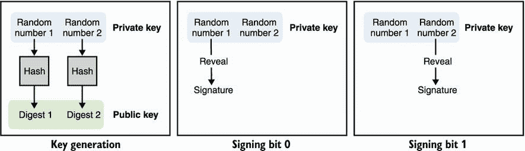

# 14 后量子密码学

本章包括

+   量子计算机及其对密码学的影响

+   后量子密码学抵御量子计算机的攻击

+   今天和明天的后量子算法

“量子计算机可以破解密码学，”麻省理工学院数学教授彼得·肖尔暗示道。那是 1994 年，肖尔刚刚提出了一个新算法。他的发现解锁了整数的高效因式分解，如果量子计算机真的成为现实，将摧毁像 RSA 这样的密码算法。当时，量子计算机只是一个理论，一个基于量子物理的新型计算机概念。这个想法仍然有待证明。2015 年中期，国家安全局（NSA）在宣布他们计划过渡到*量子抗性算法*（不易受量子计算机攻击的密码算法）后，让所有人都感到意外。

*对于那些尚未过渡到 Suite B 椭圆曲线算法的合作伙伴和供应商，我们建议暂时不要在这一点上进行重大支出，而是准备好迎接即将到来的量子抗性算法过渡。[...] 不幸的是，椭圆曲线的使用增长与量子计算研究的持续进展相冲突，这清楚地表明椭圆曲线密码学并不是许多人曾经希望的长期解决方案。因此，我们不得不更新我们的策略*。

—国家安全局（“今日密码学”，2015 年）

尽管*量子计算*的概念（基于量子力学领域研究的物理现象构建计算机）并不新鲜，但近年来在研究资助和实验突破方面都经历了巨大提升。然而，至今还没有人能够展示用量子计算机破解密码学。国家安全局知道我们不知道的事情吗？量子计算机真的会破解密码学吗？量子抗性密码学又是什么？在本章中，我将尝试回答你所有的问题！

## 14.1 量子计算机是什么，为什么会让密码学家感到恐慌？

自国家安全局的宣布以来，量子计算机已经多次成为新闻头条，因为诸如 IBM、Google、阿里巴巴、微软、英特尔等许多大公司已经投入了大量资源进行研究。但这些量子计算机到底是什么，为什么这么令人担忧？一切都始于*量子力学*（也称为*量子物理学*），这是一门研究小东西行为的物理学领域（想想原子和更小的东西）。由于这是量子计算机的基础，这就是我们调查的起点。

*曾经有一段时间，报纸上说只有十二个人理解相对论的理论。我不相信真有这样的时候。可能有一个人理解了，因为他是唯一一个在写论文之前就理解了的人。但是在人们读了这篇论文之后，许多人以某种方式理解了相对论，肯定不止十二个。另一方面，我可以肯定地说，没有人理解量子力学*。

—— 理查德·费曼（《物理定律的性质》，麻省理工学院出版社，1965 年）

### 14.1.1 量子力学，研究微观世界

物理学家长期以来一直认为整个世界是确定性的，就像我们的加密伪随机数生成器一样：如果你知道宇宙是如何运作的，如果你有一台足够大的计算机来计算“宇宙函数”，那么你所需要的只是*种子*（大爆炸中所包含的信息），然后你就可以从那里预测一切。是的，*一切*，甚至是宇宙开始后仅仅 137 亿年，你将要读到这行文字的事实。在这样一个世界中，没有随机性的余地。你所做的每个决定都是被过去事件所确定的，甚至是在你出生之前发生的事件。

虽然这种对世界的看法令许多哲学家感到困惑——“那我们真的有自由意志吗？” 他们问道——但在 1990 年代开始出现了一个有趣的物理领域，从那时起就困扰着许多科学家，我们称之为*量子物理学*（也称为*量子力学*）。原来，非常小的物体（想想原子和更小的物体）的行为往往与我们迄今使用的所谓的古典物理学观察到的和理论化的行为大不相同。在这个（亚）原子尺度上，粒子有时候似乎像波一样行动，就像不同的波可以相叠加到一起形成一个更大的波，或者在短暂的时刻互相抵消。

我们可以对电子等粒子进行的一种测量是它们的*自旋*。例如，我们可以测量电子是自旋向上还是向下旋转。到目前为止，还没什么太奇怪的。奇怪的是，量子力学说一个粒子可以*同时*处于这两种状态中，旋转上升*和*下降。我们称这种粒子处于*量子叠加态*。

这种特殊状态可以通过不同的技术手段人工诱导，具体取决于粒子的类型。一个粒子可以保持在叠加态直到我们对其进行测量；在这种情况下，粒子将*坍缩*成这些可能状态中的一个（自旋向上或向下）。这种量子叠加态就是量子计算机最终使用的：与其拥有可以是 1 或 0 的位，一个*量子位*或*qubit*可以同时是 0 和 1。

-   更怪异的是，量子理论认为只有当测量发生时，而不是之前，粒子才会随机决定取哪种状态（每种状态有 50%的概率被观察到）。如果这看起来很奇怪，你并不孤单。许多物理学家无法想象这在他们描绘的确定性世界中是如何工作的。爱因斯坦坚信这个新理论有问题，曾经说过“上帝不玩骰子”。然而，密码学家们很感兴趣，因为这是获得*真正*随机数的方法！这就是*量子随机数生成器*（QRNGs）通过不断将光子等粒子设置在超定态然后测量它们所做的事情。

-   物理学家还推测了如果我们的尺度上有物体时量子力学会是什么样子。这导致了*薛定谔的猫*的著名实验：一个盒子里的猫同时死和活，直到有人观察里面（这引发了关于什么才算观察者的许多争论）。

-   *一只猫被困在一个钢制容器里，与以下装置一同（必须防止猫直接干扰）：在一个盖革计数器中，有一小片放射性物质，可能在一个小时内，一个原子会衰变，但也有可能一个都不衰变；如果发生衰变，计数器管就会放电，通过继电器释放一个锤子，破坏一小瓶氰化氢。如果一个小时都让这整个系统自己，而与此同时没有原子衰变，那么我们会说猫还活着。第一个原子的衰变就会毒死它。整个系统的Ψ-函数将通过将活猫和死猫（原谅这个表达）混合或平均分布来表达这一点*。

-   —艾尔温·薛定谔（“量子力学中的现状”，1935 年）

-   这一切对我们来说都是非常不直观的，因为我们在日常生活中从未遇到过量子行为。现在，让我们再增加一些怪异吧！

-   有时粒子相互作用（例如相互碰撞）并最终处于强烈*相关*状态，其中描述一个粒子而不包括其他粒子是不可能的。这种现象被称为*量子纠缠*，它是量子计算机性能提升的秘密之一。比如说，如果两个粒子被纠缠在一起，那么当其中一个被测量时，两个粒子都会坍缩，其中一个的状态被完全地与另一个的状态相关联。好了，那太令人困惑了。让我们举个例子：如果两个电子被纠缠在一起，然后测量其中一个发现它自旋向上，那么我们知道另一个此时是自旋向下的（但在第一个被测量之前是不知道的）。此外，任何这样的实验结果都是一样的。

这很难相信，但更令人震惊的是，已经证明纠缠甚至可以在非常长的距离上起作用。爱因斯坦、波多尔斯基和罗森曾经争论说量子力学的描述是不完整的，很可能缺少*隐藏变量*，这将解释纠缠（也就是说，一旦粒子分开，它们就知道它们的测量结果将是什么）。

爱因斯坦、波多尔斯基和罗森还描述了一个思想实验（*EPR 悖论*，以他们姓氏的首字母命名），在这个实验中，两个纠缠粒子被分开了很大的距离（想象一下光年的距离），然后几乎同时被测量。根据量子力学，对其中一个粒子的测量会立即影响另一个粒子，这是不可能的，因为根据相对论的理论，没有信息可以传播得比光速更快（因此产生了悖论）。这个奇怪的思想实验就是爱因斯坦著名地称之为“远距离的诡异作用”。

约翰·贝尔后来提出了一个被称为*贝尔定理*的概率不等式；如果该定理被证明为真，将证明 EPR 悖论的作者提到的隐藏变量的存在。这个不等式后来在实验中被违反（很多很多次），足以让我们相信纠缠是真实的，排除了任何隐藏变量的存在。

今天，我们说对纠缠粒子的测量会导致粒子相互协调，这就绕过了相对论的预测，即通信不能比光速更快。事实上，试着想想你如何利用纠缠来设计一个通信渠道，你会发现这是不可能的。然而，对于密码学家来说，远距离的诡异作用意味着我们可以开发新颖的方法来进行密钥交换；这个想法被称为*量子密钥分发*（QKD）。

想象一下将两个纠缠粒子分发给两个同行：然后他们测量各自的粒子以开始形成相同的密钥（因为测量一个粒子会给你关于另一个粒子的测量信息）？量子密钥分发的概念更加吸引人的地方在于*不可克隆定理*，该定理指出你不能被动地观察这样的交换并创建被发送在通道上的粒子的精确副本。然而，这些协议容易受到简单的中间人攻击，并且在没有已经有一种验证数据的方法的情况下几乎是无用的。这个缺陷导致一些密码学家如布鲁斯·施奈尔声称“量子密钥分发作为一种产品没有未来”。

至于量子物理，这就是我对密码学书籍的讲解。如果你不相信刚刚读到的所有奇异的事情，那你并不孤单。在他的书《工程师的量子力学》中，里昂·范·多姆伦写道：“物理学最终采用了量子力学，并不是因为它似乎是最合乎逻辑的解释，而是因为无数的观察使其不可避免。”

### 14.1.2 从量子计算机诞生到量子霸权

1980 年，*量子计算*的概念诞生了。是保罗·贝尼奥夫首次描述了量子计算机可能的样子：一台由量子力学最近几十年的观察结果构建的计算机。同年晚些时候，保罗·贝尼奥夫和理查德·费曼认为，这是模拟和分析量子系统的唯一方法，而不受经典计算机的限制。

仅仅 18 年后，IBM 首次演示了在实际量子计算机上运行的量子算法。快进到 2011 年，量子计算机公司 D-Wave Systems 宣布推出了第一台商用量子计算机，推动整个行业向前迈进，致力于创建第一台可扩展的量子计算机。

目前仍然有很长的路要走，而且有用的量子计算机还没有实现。在撰写本文时（2021 年），最近一个引人注目的成果是谷歌声称在 2019 年用一台 53 量子比特的量子计算机实现了*量子霸权*。量子霸权意味着，首次有一台量子计算机做到了经典计算机无法做到的事情。在 3 分 20 秒内，它完成了一些分析，而这些分析如果由经典计算机完成，需要大约 1 万年的时间。也就是说，在你激动得太早之前，它在一个无用的任务上胜过了经典计算机。然而，这是一个令人难以置信的里程碑，人们只能想象这将引领我们走向何方。

量子计算机基本上使用量子物理现象（如叠加和纠缠）进行计算，就像经典计算机使用电来进行计算一样。量子计算机不使用比特，而是使用*量子比特*或*qubit*，可以通过*量子门*转换它们以设置特定值或使它们处于叠加状态，甚至是纠缠状态。这在某种程度上类似于经典计算机电路中使用门的方式。计算完成后，可以测量量子比特以经典方式解释它们——作为 0 和 1。此时，可以进一步使用经典计算机解释结果，以完成有用的计算。

一般来说，*N*个纠缠的量子比特包含等价于 2^N 个经典比特的信息。但是，在计算结束时测量量子比特只会给出*N*个 0 或 1。因此，并不总是清楚量子计算机如何帮助，量子计算机只对有限数量的应用程序有用。随着人们找到巧妙的方法利用它们的力量，它们可能会变得越来越有用。

今天，你已经可以在家中舒适地使用量子计算机了。像 IBM 量子计算（[`quantum-computing.ibm.com`](https://quantum-computing.ibm.com)）这样的服务允许你构建量子电路并在托管在云中的真实量子计算机上执行。当然，目前（2021 年初）这类服务相当有限，只有少量的量子比特可用。但是，创建自己的电路并等待其在真实量子计算机上运行的体验令人叹为观止，而且这一切都是免费的。

### 14.1.3 Grover 和 Shor 算法对密码学的影响

不幸的是，正如我之前所说的，量子计算机并不适用于每一种类型的计算，因此，它们不是我们经典计算机的更强大的替代品。但是，它们究竟有什么用处呢？

1994 年，在量子计算机的概念只是一种思想实验的时候，彼得·肖尔提出了一个解决离散对数和因子化问题的量子算法。肖尔有洞察力地认为量子计算机可以用于快速计算与密码学中看到的难题相关的问题的解决方案。事实证明，存在一种高效的量子算法，可以帮助找到一个*周期*，使得*f*(*x* + *period*) = *f*(*x*)对于任何给定的*x*成立。例如，找到值为*period*的周期，使得 g^(x+period) = g^x mod *N*。这反过来导致可以有效地解决因子化和离散对数问题的算法，从而影响了像 RSA（在第六章中讨论）和 Diffie-Hellman（在第五章中讨论）这样的算法。

Shor 算法对*非对称密码学*具有毁灭性影响，因为今天大多数使用的非对称算法依赖于离散对数或因子化问题——实际上，你在本书中看到的大部分内容都是如此。你可能会认为离散对数和因子化仍然是困难的数学问题，而我们可以（也许）增加算法参数的大小以提升其抵抗量子计算机的能力。不幸的是，由 Bernstein 等人于 2017 年证明，尽管提高参数是有效的，但这是极不切实际的。研究估计，将 RSA 的参数增加到 1 TB 可以使其对抗量子计算机。说实话，这是不现实的。

*Shor 算法颠覆了部署的公钥加密技术的基础：RSA 和有限域和椭圆曲线上的离散对数问题。长期保密的文件，如患者医疗记录和国家机密，必须在多年内保证安全性，但今天使用 RSA 或椭圆曲线加密的信息，存储到量子计算机可用时，将像今天的 Enigma 加密消息一样容易解密*。

—PQCRYPTO：长期安全后量子系统的初始建议（2015）

对于*对称加密*来说，情况要好得多。Grover 算法于 1996 年由 Lov Grover 提出，作为优化无序列表中搜索的一种方式。在经典计算机上，对 *N* 个项目的无序列表进行搜索平均需要 *N*/2 次操作；而在量子计算机上，只需要 √*N* 次操作。这是相当大的加速！

Grover 算法是一种非常多才多艺的工具，可以在许多密码学领域应用，例如提取密码的对称密钥或在哈希函数中找到碰撞。要搜索一个 128 位密钥，Grover 算法在量子计算机上运行的操作次数为 2⁶⁴，而在经典计算机上为 2¹²⁷。对于我们所有的对称加密算法来说，这是一个相当可怕的说法，但我们只需将安全参数从 128 位提升到 256 位，就足以抵御 Grover 的攻击。因此，如果你想保护对称加密技术免受量子计算机的攻击，你可以简单地使用 SHA-3-512 替代 SHA-3-256，使用 AES-256-GCM 替代 AES-128-GCM，等等。

总结一下，对称加密大部分情况下是安全的，而非对称加密则不然。这甚至比你一开始想象的更糟：对称加密通常需要进行密钥交换，而这一过程容易受到量子计算机的攻击。那么，这是否意味着我们所熟知的加密技术将走向终结呢？

### 14.1.4 后量子密码学，对抗量子计算机的防御

幸运的是，这并不是加密技术的终结。社区迅速应对量子威胁，通过组织自身并研究新旧算法，以抵御 Shor 和 Grover 的攻击。*抗量子密码学*领域，也被称为*后量子密码学*，因此诞生了。互联网上存在着不同地方的标准化努力，但最受尊敬的努力来自 NIST，该机构于 2016 年启动了后量子密码学的标准化进程。

*似乎过渡到后量子密码学并不简单，因为我们当前的公钥密码算法不太可能有一个简单的“即插即用”替代方案。将需要进行大量的工作来开发、标准化和部署新的后量子密码系统。此外，这种过渡需要在任何大规模量子计算机建成之前进行，以便任何后期由量子密码分析而泄露的信息在泄露时不再敏感。因此，尽早为这种过渡做好规划是可取的*。

—NIST 标准化过程的后量子密码学页面 (2016)

自 NIST 开始这个过程以来，有 82 个候选者申请，并且经过了 3 轮，将候选者名单缩减到了 7 个决赛选手和 8 个备用决赛选手（不太可能被考虑用于标准化，但如果决赛选手中的某个范式被破解了，则是一个很好的选择）。NIST 的标准化工作旨在替换最常见的非对称密码学基元，其中包括签名方案和非对称加密。后者也可以轻松地作为密钥交换基元，正如你在第六章中所学到的。

在本章的其余部分，我将介绍正在考虑标准化的不同类型的后量子密码算法，并指出你今天可以使用哪些算法。

## 14.2 基于哈希的签名：除了哈希函数外不需要任何东西

尽管所有实际的签名方案似乎都使用哈希函数，但存在一种方法可以构建只使用哈希函数而不使用其他东西的签名方案。更好的是，这些方案倾向于仅依赖于哈希函数的前像抗性而不是它们的碰撞抗性。这是一个相当吸引人的建议，因为应用密码学的巨大部分已经基于稳固和被充分理解的哈希函数。

现代哈希函数也能抵抗量子计算机，这使得这些基于哈希的签名方案自然而然地具有量子抗性。让我们看看这些基于哈希的签名是什么，以及它们是如何工作的。

### 14.2.1 一次性签名 (OTS) 使用 Lamport 签名

1979 年 10 月 18 日，莱斯利·兰波特（Leslie Lamport）发布了他的 *一次性签名* (OTS) 的概念：只能用于签名一次的密钥对。大多数签名方案（部分地）依赖于单向函数（通常是哈希函数）来进行安全证明。兰波特方案的美妙之处在于，他的签名完全依赖于这样的单向函数的安全性。

假设你想要签名一个单个比特。首先，通过生成密钥对

1.  生成两个随机数 *x* 和 *y*，它们将作为私钥

1.  对 *x* 和 *y* 进行哈希运算得到两个摘要 *h*(*x*) 和 *h*(*y*)，你可以将其公开为公钥

要将一个比特设为 0，揭示你的私钥的*x*部分；要将一个比特设为 1，揭示*y*部分。要验证一个签名，只需对其进行哈希，以检查其是否与公钥的正确部分匹配。我在图 14.1 中说明了这一点。

图 14.1 Lamport 签名是一种仅基于哈希函数的一次性签名（OTS）。为了生成一个可以签署一个比特的密钥对，生成两个随机数，这将是你的私钥，并分别对这两个数进行哈希，以产生你的公钥的两个摘要。要将一个比特设为 0，揭示第一个随机数；要将一个比特设为 1，揭示第二个随机数。

签署一个比特并不那么有用，你说。没问题；Lamport 签名通过为每个比特创建更多的秘密对，一个比特一个秘密对，来对更大的输入进行签名（参见图 14.2）。显然，如果你的输入大于 256 位，你首先会对其进行哈希，然后再对其进行签名。

图 14.2 为了生成一个 Lamport 签名密钥对，可以签署一个*n*位消息，生成 2*n*个随机数，这将是你的私钥，并分别对这些数进行哈希，以产生你的公钥的 2*n*个摘要。要签名，遍历秘密和*n*位的对，揭示第一个元素以将一个比特设为 0，或揭示第二个元素以将一个比特设为 1。

这种方案的一个主要限制是你只能使用它签名一次；如果你用它签名两次，你最终会授权别人混合这两个签名来伪造其他有效的签名。我们可以通过天真地生成大量一次性密钥对而不是单个密钥对来改善这种情况，然后确保在使用后丢弃一个密钥对。这不仅使你的公钥变得像你认为你可能会使用的签名数量一样大，而且还意味着你必须跟踪你使用过的密钥对（或者更好的是，丢弃你使用过的私钥）。例如，如果你知道你将要使用具有 256 位输出大小的哈希函数签署最大为 256 位的 1,000 个消息，那么你的私钥和公钥都必须是 1000 × (256 × 2 × 256)位，约为 16 兆字节。对于只有 1,000 个签名来说，这是相当多的。

今天提出的大多数基于哈希的签名方案都建立在 Lamport 创造的基础上，以允许更多的签名（有时是几乎无限量的签名），无状态的私钥（尽管一些提出的方案仍然是有状态的），以及更实用的参数大小。

### 14.2.2 Winternitz 一次签名（WOTS）的较小密钥

在 Lamport 发表几个月后，斯坦福大学数学系的 Robert Winternitz 提出了发布一个秘密的哈希的哈希的哈希* h *（* h *（...* h *（* x *）））= * h ^ w *（* x *）而不是发布多个秘密的多个摘要，以优化私钥的大小（参见图 14.3）。这个方案被称为作者之后的 *Winternitz 一次签名*（WOTS）。

例如，选择 *w* = 16 允许你签署 16 个不同的值，换句话说，4 位输入。你首先生成一个作为私钥的随机值 *x*，并将其哈希 16 次以获得你的公钥，*h*¹⁶(*x*)。现在想象一下，你想要签署位 1001（十进制中的 9）；你发布哈希的第九次迭代，*h*⁹(*x*)。我在图 14.3 中进行了说明。

图 14.3 Winternitz 一次签名（WOTS）方案通过仅使用一个被迭代哈希的秘密来优化 Lamport 签名，以获得许多其他秘密和最终的公钥。揭示不同的秘密允许签署不同的数字。

花几分钟时间来理解这个方案是如何工作的。你看到其中有什么问题吗？一个主要问题是这个方案允许*伪造签名*。想象一下，你看到别人对位 1001 的签名，根据我们之前的例子，这将是 *h*⁹(*x*)。你可以简单地对其进行哈希以检索任何其他迭代，比如 *h*¹⁰(*x*) 或 *h*¹¹(*x*)，这将为你提供位 1010 或 1011 的有效签名。这可以通过在消息后添加一个短的认证标签来规避，你也必须对其进行签名。我在图 14.4 中进行了说明。为了说服自己这解决了伪造问题，请尝试从另一个签名中伪造一个签名。

图 14.4 WOTS 使用额外的签名密钥来验证签名，以防篡改。它的工作原理是：在签名时，第一个私钥用于签署消息，第二个私钥用于签署消息的补码。很明显，在所示的任何情况下，篡改签名都不会导致新的有效签名。

### 14.2.3 使用 XMSS 和 SPHINCS+ 的多次签名

到目前为止，你已经看到了只使用哈希函数签名的方法。虽然 Lamport 签名是有效的，但它们具有较大的密钥大小，因此 WOTS 通过减小密钥大小改进了这一点。然而，这两种方案仍然不具有良好的可扩展性，因为它们都是一次性签名（重复使用密钥对会破坏方案），因此，它们的参数会随着你认为需要的签名数量的增加而线性增加。

一些方案允许密钥对重复使用几次（而不是一次）。这些方案被称为*少次签名*（FTS），如果重复使用次数太多，将会破坏，从而允许伪造签名。FTS 依赖于从秘密池中重复使用相同组合秘密的低概率。这是对一次性签名的小改进，允许减少密钥重用的风险。但我们可以做得更好。

在这本书中，你学到的一个技术是将许多事物压缩成一个事物的技术是什么？答案是默克尔树。正如你可能还记得第十二章所述，*默克尔树*是一种数据结构，为诸如我的数据是否在这个集合中之类的问题提供简短的证明。在 1990 年代，提出默克尔树的默克尔还发明了一种基于哈希函数的签名方案，将多个一次性签名压缩成一个默克尔树。

这个想法非常简单：你的树的每个叶子都是一次性签名的哈希，而根哈希可以用作公钥，将其大小减小到哈希函数的输出大小。要签名，你选择一个之前未使用过的一次性签名，然后按照第 14.2.2 节中的说明应用它。签名是一次性签名，以及证明它属于你的默克尔树的默克尔证明（所有邻居）。这个方案显然是有状态的，因为人们应该小心不要在树中重复使用一次性签名之一。我在图 14.5 中说明了这一点。

图 14.5 默克尔签名方案是一种有状态的基于哈希的算法，利用默克尔树将许多 OTS 公钥压缩为更小的公钥（根哈希）。树越大，它可以产生的签名就越多。请注意，签名现在具有*成员证明*的开销，这是一些邻居节点，允许验证签名的相关 OTS 是否属于树。

*扩展默克尔签名方案*（XMSS），在 RFC 8391 中标准化，旨在通过向默克尔方案添加一些优化来实现默克尔签名的生产。例如，为了生成能够签署*N*条消息的密钥对，你必须生成*N*个 OTS 私钥。虽然公钥现在只是一个根哈希，但你仍然必须存储*N*个 OTS 私钥。XMSS 通过使用种子和树中的叶子位置确定性地生成树中的每个 OTS，从而减小了你持有的私钥的大小。这样，你只需要将种子存储为私钥，而不是所有 OTS 私钥，并且可以快速从树中的位置和种子重新生成任何 OTS 密钥对。为了跟踪上次使用的叶子/OTS，私钥还包含一个计数器，每次用于签名时都会递增。

提到这一点，Merkle 树中只能容纳有限的 OTS。树越大，重建树以签署消息就越耗时（因为您需要重建所有叶子以生成 Merkle 证明）。树越小，在签名时需要重建的 OTS 私钥就越少，但这显然违背了初衷：我们现在又回到了有限数量的签名。解决方案是使用一个较小的树，其中叶子中的 OTS 不用于签署消息，而是用于签署其他 OTS 的 Merkle 树的根哈希。这将我们的初始树转换为*超树*——树的树——是 XMSS 的一种变体称为 XMSS^(MT)。对于 XMSS^(MT)，仅需要基于相同的技术重建与 OTS 路径有关的树。我在图 14.6 中进行了说明。

图 14.6 XMSS^(MT) 有状态基于哈希的签名方案使用多个树来增加方案支持的签名数量，同时减少密钥生成和签名时间的工作量。只有当它们在路径到包含用于签署消息的 OTS 的最终叶子中使用时，每个树才会被确定性地生成。

请注意，XMSS 和 XMSS^(MT) 的状态性在某些情况下可能不是问题，但总的来说不是一种理想的属性。必须跟踪一个计数器是反直觉的，因为我们不希望从主流签名方案的用户那里期待这种行为。这种实践的变化可能会导致 OTS 的重用（从而导致签名伪造），如果不当使用，例如，回滚到文件系统的先前状态或在多个服务器上使用相同的签名密钥可能导致超树中的相同路径两次用于签署消息。

为了解决 XMSS 最大的缺点之一（其状态性）并展现类似于我们习惯的签名方案的接口，*SPHINCS+ 签名方案*作为 NIST 的后量子密码竞赛的一部分提出。这个无状态签名方案通过三个主要变化来增强 XMSS^(MT)：

+   *两次签署相同的消息会导致相同的签名。*与第七章介绍的 EdDSA 类似，超树中使用的路径是根据私钥和消息确定性地派生的。这确保了两次签署相同的消息会导致相同的 OTS，从而导致相同的签名；由于使用了私钥，攻击者也无法预测您在签署其他人消息时将采取哪条路径。

+   *使用更多的树.* XMSS^(MT)通过追踪上次使用的 OTS 来避免两次重复使用相同的 OTS。由于 SPHINCS+的整个目的是避免追踪状态，因此它需要在选择伪随机路径时避免冲突。为此，SPHINCS+简单地使用了更多的 OTS，减少了两次重复使用相同 OTS 的概率。由于 SPHINCS+还使用了超树，这意味着更多的树。

+   *使用少次签名*（FTS）。由于方案的安全性是基于两次重复使用相同路径的概率，因此 SPHINCS+还用我之前提到的 FTS 替换了用于签署消息的最终 OTS。这样，重复使用相同路径来签署两个不同的消息仍然不会直接导致签名方案的破坏。

虽然 SPHINCS+正在考虑在 NIST 后量子密码竞赛中进行标准化，但它并不是主要的竞争者。SPHINCS+不仅速度慢，而且与提议的替代方案（如基于格的方案，在本章后面将会介绍）相比，其签名大小也较大。基于状态的哈希签名方案（如 XMSS）提供更快的速度和更好的签名大小（小于 3 KB，而 SPHINCS+的最小签名大小为 8 KB）。（在公钥大小方面，这两种方案提供了与预量子签名方案（如 ECDSA 和 Ed25519）类似的大小。）由于更现实的参数大小和良好理解的安全性，NIST 在 SP 800-208 中推荐了 XMSS 作为早期标准，“基于状态的哈希签名方案的建议”。

接下来，让我们来看看另外两种构建抗量子密码原语的方法。温柔的警告：它们的数学内容要多得多！

## 14.3 基于格的密码学中的更短密钥和签名

大量的后量子密码方案基于格，这是一种您将在本节中了解的数学结构。NIST 后量子密码竞赛本身已经选定了基于格的方案作为其半决赛选手的一半。这使得基于格的密码学成为最有可能赢得并从 NIST 获得标准的范式。在本节中，我将告诉您关于两种基于格的算法：Dilithium，一种签名方案，以及 Kyber，一种公钥加密原语。但在此之前，让我们先了解一下什么是格。

### 14.3.1 什么是格？

首先，基于格的概念可能不是你想象的那样。以 RSA 为例（第六章讨论过），我们说 RSA 是基于因子分解问题的。这并不意味着我们在 RSA 中使用了因子分解，而是意味着因子分解是你攻击 RSA 的方法，并且因为因子分解很难，所以我们说 RSA 是安全的。基于格的密码系统也是如此：*格*是具有困难问题的结构，只要这些问题保持困难，这些密码系统就是安全的。

说到这里，什么是格？嗯，它就像一个*向量空间*，但带有整数。如果你不记得向量空间是什么，那就是所有可以使用以下内容创建的向量的集合：

+   *基*—一组向量；例如，(0,1) 和 (1,0)。

+   *向量之间的运算*—向量可以相加；例如，(0,1) + (1,0) = (1,1)。

+   *标量运算*—向量可以乘以我们称为标量的东西；例如，3 × (1,2) = (3,6)。

在我们的例子中，向量空间包含所有可以表示为基的线性组合的向量，这意味着任何可以写为*a* × (0,1) + *b* × (1,0)的向量。例如，0.5 × (0,1) + 3.87 × (1,0) = (3.87,0.5)在我们的向量空间中，99 × (0,1) + 0 × (1,0) = (0,99)也是如此，等等。

格是一个向量空间，其中涉及的所有数字都是整数。是的，在密码学中，我们喜欢整数。我在图 14.7 中说明了这一点。

图 14.7 左侧绘制了两个向量的基。通过取这两个向量的所有可能的整数线性组合可以形成一个格点（中间图）。所得的格点可以被解释为空间中永远重复的点的模式（右图）。

在格空间中存在几个众所周知的难题，针对这些问题，我们有解决方案。这些算法通常是我们能想到的最好的，但这并不一定意味着它们是高效的，甚至是实用的。因此，这些问题至少被认为是困难的，直到找到更高效的解决方案。最知名的两个困难问题如下。（我在图 14.8 中说明了这两个问题。）

+   *最短向量问题*（SVP）—回答这个问题：你的格点中最短的非零向量是什么？

+   *最近向量问题*（CVP）—给定一个不在格点上的坐标，找到该坐标在格点上最近的点。

图 14.8 展示了密码学中使用的两个主要格问题：最短向量问题（SVP）和最近向量问题（CVP）

通常，我们使用像 LLL（Lenstra–Lenstra–Lovász 算法）或 BKZ（Block-Korkine-Zolotarev 算法）这样的算法来解决这两个问题（CVP 可以归约为 SVP）。这些算法会缩减格点的基，意味着它们试图找到一组比给定的更短的向量，并且能够产生完全相同的格点。

### 14.3.2 含有错误的学习（LWE），密码学的基础？

在 2005 年，Oded Regev 提出了*含有错误的学习*（LWE）问题，它成为了许多密码方案的基础，包括本章中的一些算法。在继续之前，让我们看看 LWE 问题是什么。让我们从以下方程式开始，它们是相同整数*s*[0]和*s*[1]的线性组合：

+   5 *s*[0] + 2 *s*[1] = 27

+   2 *s*[0] + 0 *s*[1] = 6

我们知道，通过使用*高斯消元*算法，只要我们有足够多的这些方程，我们就可以快速有效地学到*s*[0]和*s*[1]是什么。现在有趣的是，如果我们给这些方程添加一些噪音，问题就变得更加困难：

+   5 *s*[0] + 2 *s*[1] = 28

+   2 *s*[0] + 0 *s*[1] = 5

当你增加所涉及的数字的大小和*s*[i]的数量时，通过更多嘈杂的方程可能并不太难找到答案，但一旦增加了这些因素，问题就变得更加困难。

这本质上就是 LWE 问题，尽管通常用向量来表述。想象一下，你有一个带有模一些大数的秘密向量**s**。给定相同大小的任意数量的随机向量**a**[i]和计算**a**[i]*s* + *e*[i]的结果，其中*e*[i]是一个随机小误差，你能找到值**s**吗？

注意 对于两个向量**v**和**w**，可以使用*点积*计算乘积**vw**，即每对坐标的乘积之和。让我们看一个例子：如果**v** = (*v*[0], *v*[1])，而**w** = (*w*[0], *w*[1])，那么**vw** = *v*[0] × *w*[0] + *v*[1] × *w*[1]。

例如，如果我使用秘密**s** = (3,6)并给你随机向量**a**[0] = (5,2)和**a**[1] = (2,0)，我得到了我在例子中开始的方程。正如我之前所说，基于格的方案实际上并不使用格；相反，它们被证明是安全的，如果 SVP 保持困难（对于某些定义的困难）。只有在我们将以前的方程以矩阵形式写出时，才能看到归约，如图 14.9 所示。

图 14.9 学习中的错误问题（LWE）被认为是基于格的构造，因为存在到格问题的归约：CVP。换句话说，如果我们可以找到 CVP 的解，那么我们就可以找到 LWE 问题的解。

这种矩阵形式很重要，因为大多数基于 LWE 的方案都是以这种形式表达和解释的。花几分钟时间复习矩阵乘法。另外，如果你还没有注意到，我使用了一些常见的符号技巧，这些技巧对于阅读涉及矩阵和向量的方程非常有帮助：两者都以粗体字体书写，矩阵始终是大写字母。例如，**A**是矩阵，**a**是向量，*b*只是一个数字。

注意 LWE 问题存在几个变体（例如，环-LWE 或模-LWE 问题），它们基本上是相同的问题，但坐标位于不同类型的群中。由于它们的紧凑性和解锁的优化，通常更喜欢这些变体。LWE 变体之间的差异不影响接下来的解释。

现在你知道 LWE 问题是什么了，让我们学习一些基于它的后量子密码学：代数格密码套件（CRYSTALS）。 方便的是，CRYSTALS 包含两个密码学原语：一个称为 *Kyber* 的密钥交换和一个称为 *Dilithium* 的签名方案。

### 14.3.3 Kyber，基于格的密钥交换

两个 NIST 最终方案密切相关： CRYSTALS-Kyber 和 CRYSTALS-Dilithium，这两个方案都是来自同一研究团队的候选方案，都基于 LWE 问题。 *Kyber* 是一个可以用作密钥交换原语的公钥加密原语，在本节中我将解释。 *Dilithium* 是一个签名方案，我将在下一节中解释。 还要注意，由于这些算法仍在变化中，我将只写出这两个方案背后的思想和直觉。

首先，让我们假设所有操作都在模一个大数 *q* 的整数群中进行。 我们还假设错误和私钥是从以 0 为中心的小范围内（均匀随机选择）*采样*的。 具体来说，错误范围是范围 [–*B*, *B*]，其中 *B* 远远小于 *q*。 这很重要，因为某些项需要比某个值小才能被视为错误。

要生成私钥，只需生成一个随机向量 **s**，其中每个系数都在错误范围内。 公钥的第一部分是相同大小的随机向量 **a**[i] 的列表，第二部分是相关的噪声点乘列表 **t**[i] = **a**[i] *s* + **e**[i] mod *q*。 这正是我们之前学到的 LWE 问题。 对于其余部分很重要的是，我们可以用矩阵来重写这个问题：

**t** = **As** + **e**

其中矩阵 **A** 包含随机向量 **a**[i] 作为行，而错误向量 **e** 包含单个错误 **e**[i]。

要使用 Kyber 进行密钥交换，我们使用方案加密一个 1 位的对称密钥（是的，只有一个位！）。 这类似于您在第六章中看到的 RSA 密钥封装机制。 以下四个步骤显示了加密的工作原理：

1.  生成一个短暂的私钥向量 **r**（系数在错误范围内），及其关联的短暂公钥 **rA** + **e**[1] 与一些随机错误向量 **e**[1]，使用对等方的 **A** 矩阵作为公共参数。 注意，矩阵乘法在右侧执行，这涉及将向量 **r** 与 **A** 的列相乘，而不是计算 **Ar**（向量 **r** 与 **A** 的行的乘积）。 这是一个细节，但对解密步骤的工作是必要的。

1.  我们通过将其与 *q*/2 相乘将消息向左移动，以避免小错误影响我们的消息。 注意，*q*/2 模 *q* 通常意味着 *q* 乘以 2 模 *q* 的倒数，但这里它只是意味着 *q*/2 的最接近的整数。 

1.  用我们的临时私钥和对等方的公钥的点积计算共享密钥。

1.  通过将其添加到共享密钥以及随机错误**e**[2]来加密您的（移位的）消息。这将产生一个密文。

执行完这些步骤后，我们可以将临时公钥和密文都发送给另一个对等方。收到临时公钥和密文后，我们可以按照以下步骤解密消息：

1.  通过计算您的秘密与收到的临时公钥的点积来获得共享密钥。

1.  将共享密钥从密文中减去（结果包含移位的消息和一些错误）。

1.  通过将其除以*q*/2，将消息移回原始位置，有效地消除错误。

1.  如果消息接近*q*/2，则为 1，否则为 0。

当然，1 位是不够的，所以当前方案采用不同的技术来克服这个限制。我在图 14.10 中总结了所有三个算法。

图 14.10 Kyber 公钥加密方案。请注意，在加密和解密过程中，共享密钥几乎相同，因为**r**、**s**和错误远小于*q*/2。因此，解密的最后一步（除以*q*/2，可以看作是向右的位移）消除了两个共享密钥之间的任何差异。请注意，所有操作都是模*q*进行的。

在实践中，对于密钥交换，您加密到对等方的公钥的消息是一个随机密钥。然后，结果是从密钥交换的记录和对等方的公钥、您的临时密钥和密文中确定性地派生出来的。

Kyber 的推荐参数导致公钥和密文约为 1 千字节，这比我们使用的预量子方案要大得多，但对于大多数用例来说仍然是实用的范畴。虽然时间会告诉我们是否可以进一步减少这些方案的通信开销，但迄今为止，量子后的韵律似乎与更大的尺寸相呼应。

### 14.3.4 Dilithium，一个基于格的签名方案

我将解释的下一个方案*Dilithium*也是基于 LWE 的，是 Kyber 的姊妹候选方案。与我们见过的其他类型的签名（如第七章中的 Schnorr 签名）一样，Dilithium 基于一个零知识证明，通过 Fiat-Shamir 技巧使其非交互式。

对于密钥生成，Dilithium 与先前的方案类似，只是我们将错误作为私钥的一部分保留。我们首先生成两个作为私钥的随机向量**s**[1]和**s**[2]，然后计算公钥为**t** = **As**[1] + **s**[2]，其中**A**是以与 Kyber 类似的方式获得的矩阵。公钥是**t**和**A**。请注意，我们将错误**s**[2]视为私钥的一部分，因为我们需要在每次签署消息时重复使用它（不像在 Kyber 中，错误可以在密钥生成步骤之后丢弃）。

要签署，我们创建一个 sigma 协议，然后通过费亚特-沙米尔转换将其转换为非交互式、零知识证明，这类似于第七章中 Schnorr 识别协议转换为 Schnorr 签名的方式。交互式协议如下：

1.  证明者通过发送**Ay**[1] + **y**[2]对两个随机向量**y**[1]和**y**[2]进行承诺。

1.  在收到此提交后，验证者会回复一个随机挑战*c*。

1.  然后，证明者计算两个向量**z**[1] = *c* **s**[1] + **y**[1]和**z**[2] = *c* **s**[2] + **y**[2]，并仅在它们是小值时将它们发送给验证者。

1.  验证者检查**Az**[1] + **z**[2] – *c* **t**和**Ay**[1] + **y**[2]是否为相同的值。

费亚特-沙米尔技巧通过让证明者从要签名的消息和已承诺的**Ay**[1] + **y**[2]值的哈希中生成挑战，取代了第 2 步中验证者的角色。我在图 14.11 中总结了这个转换，使用了第七章中类似的图表。

图 14.11 Dilithium 签名是对秘密向量**s**的知识证明，通过费亚特-沙米尔转换变为非交互式。左侧的图表显示了交互式证明协议，而右侧的图表显示了一个非交互式版本，其中挑战被计算为**y**和要签名的消息的承诺。

再次强调，这只是对签名方案的粗略简化。实际上会使用更多的优化来减少密钥和签名的大小。通常，这些优化会尝试通过从较小的随机值确定性生成随机数据来减少任何随机数据，并通过自定义方法压缩非随机数据来减少非随机数据，不一定通过已知的压缩算法。由于 LWE 的独特结构，还有许多其他可能的优化。

在推荐的安全级别下，Dilithium 提供约 3 KB 的签名和不到 2 KB 的公钥。这显然远远超过了前量子方案的 32 字节公钥和 64 字节签名，但也比无状态基于哈希的签名要好得多。值得注意的是，这些方案仍然相当新颖，可能会找到更好的算法来解决 LWE 问题，潜在地增加公钥和签名的大小。同时，我们也可能找到更好的技术来减小这些参数的大小。总的来说，量子抗性很可能总是伴随着尺寸成本。

后量子密码学并不仅仅是这些；NIST 后量子密码学竞赛还有许多基于不同范式的构造。NIST 已宣布将于 2022 年发布初步标准，但我预计这个领域将继续快速发展，至少在后量子计算机被视为合法威胁的情况下。虽然仍有许多未知因素，但这也意味着有很多令人兴奋的研究空间。如果你对此感兴趣，我建议查看 NIST 报告（[`nist.gov/pqcrypto`](https://nist.gov/pqcrypto)）。

## 14.4 我需要恐慌吗？

总结一下，如果量子计算机得以实现，对于密码学来说将是一个巨大的挑战。这里的要点是什么？你需要放弃手头的一切，转向后量子算法吗？嗯，事情并不那么简单。

询问任何专家，你会得到不同类型的答案。对于一些人来说，这可能是 5 到 50 年的事情；对于其他人来说，这永远不会发生。量子计算研究所所长米歇尔·莫斯卡估计“到 2026 年有 1/7 的机会破解 RSA-2048，到 2031 年有 1/2 的机会”，而法国国家科学研究中心研究员米哈伊尔·迪亚科诺夫公开表示“我们能否学会控制定义这种系统量子状态的超过 10³⁰⁰个连续可变参数？我的答案很简单。不，永远不会。”虽然物理学家而非密码学家更了解情况，但他们仍可能被激励夸大自己的研究以获取资金。作为一个非物理学家，我只能说我们应该对不寻常的声明保持怀疑，同时做最坏的准备。问题不是“它会起作用吗？”；而是“它会扩展吗？”

要使可扩展的量子计算机（可能破坏密码学）成为现实存在许多挑战；最大的挑战似乎在于难以减少或纠正的噪声和错误量。德克萨斯大学计算机科学家斯科特·亚伦森将其描述为“你试图建造一艘保持不变的船，即使其中的每块木板都腐烂并需要更换。”

那么 NSA 说了什么呢？人们需要记住政府对保密性的需求往往超过个人和私营公司的需求。认为政府可能希望将一些绝密数据保密超过 50 年并不是疯狂的想法。然而，这让许多密码学家感到困惑（例如，参见 Neal Koblitz 和 Alfred J. Menezes 的“A Riddle Wrapped In An Enigma”），他们一直在思考为什么我们要保护自己免受尚不存在或可能永远不会存在的东西的威胁。

无论如何，如果你真的担心并且你的资产的保密性需要长时间保持，增加你正在使用的每个对称加密算法的参数并不是疯狂的，而且相对容易。话虽如此，如果你正在进行密钥交换以获得 AES-256-GCM 密钥，那么非对称加密部分仍然容易受到量子计算机的攻击，仅保护对称加密是不够的。

对于非对称加密，现在还为时过早真正知道什么是安全的。最好等待 NIST 竞赛结束，以获得更多的密码分析，进而对这些新算法更有信心。

*目前，已经提出了几种后量子密码系统，包括基于格的密码系统、基于码的密码系统、多元密码系统、基于哈希的签名等。然而，对于大多数这些提议，需要进一步研究以获得对其安全性（特别是针对拥有量子计算机的对手）更多的信心，并改进其性能*。

—NIST 后量子密码学提案征集（2017）

如果你太不耐烦，无法等待 NIST 竞赛结果，你可以做的一件事是在你的协议中同时使用当前方案*和*后量子方案。例如，你可以使用 Ed25519 和 Dilithium 交叉签署消息，换句话说，附加一条消息，带有来自两种不同签名方案的两个签名。如果 Dilithium 被破解，攻击者仍然需要破解 Ed25519，如果量子计算机真的存在，那么攻击者仍然拥有无法伪造的 Dilithium 签名。

注意：这就是 Google 在 2018 年以及 2019 年与 Cloudflare 一起所做的，尝试在 Google Chrome 用户和 Google 以及 Cloudflare 的服务器之间的 TLS 连接中使用混合密钥交换方案。混合方案是 X25519 和一个后量子密钥交换（2018 年的 New Hope，2019 年的 HRSS 和 SIKE）的混合，其中当前密钥交换和后量子密钥交换的输出被混合在一起进入 HKDF 以产生一个共享密钥。

最后，我将再次强调基于哈希的签名已经得到充分研究和理解。尽管它们存在一些开销，像 XMSS 和 SPHINCS+这样的方案现在就可以使用，而且 XMSS 具有即用的标准（RFC 8391 和 NIST SP 800-208）。

## 概要

+   量子计算机基于量子物理学，可以为特定的计算提供非常大的加速。

+   并非所有算法都可以在量子计算机上运行，也不是所有算法都能与经典计算机竞争。令密码学家担心的两个显著算法是

    +   Shor 算法可以高效地解决离散对数问题和因子分解问题。它破坏了大多数当今的非对称密码学。

    +   Grover 算法可以有效地搜索 2¹²⁸个值的空间中的密钥或值，影响大多数具有 128 位安全性的对称算法。将对称算法的参数提升到提供 256 位安全性足以抵御量子攻击。

+   后量子密码学领域旨在寻找新的加密算法来替代今天的非对称加密原语（例如，非对称加密、密钥交换和数字签名）。

+   NIST 于 2016 年启动了后量子密码学标准化工作。目前有七个决赛选手，该工作现已进入最后一轮选拔阶段。

+   基于哈希的签名是仅基于哈希函数的签名方案。两个主要标准是 XMSS（一种有状态的签名方案）和 SPHINCS+（一种无状态的签名方案）。

+   基于格的密码学是有希望的，因为它提供了较短的密钥和签名。最有前途的两个候选方案基于 LWE 问题：Kyber 是一种非对称加密和密钥交换原语，而 Dilithium 是一种签名方案。

+   还存在其他后量子方案，并作为 NIST 后量子密码学竞赛的一部分提出。这些包括基于代码理论、同源性、对称密钥密码学和多项式的方案。NIST 的竞赛计划于 2022 年结束，这仍然为发现新攻击或优化留下了很大的空间。

+   尚不清楚量子计算机何时能够足够高效地破坏密码学，或者它们是否能够达到那个水平。

+   如果您有长期保护数据的需求，应考虑过渡到后量子密码学：

    +   将所有对称加密算法的使用升级为提供 256 位安全性的参数（例如，从 AES-128-GCM 迁移到 AES-256-GCM，从 SHA-3-256 迁移到 SHA-3-512）。

    +   使用混合方案将后量子算法与前量子算法混合。例如，始终使用 Ed25519 和 Dilithium 对消息进行签名，或始终使用 X25519 和 Kyber 进行密钥交换（从获得的两个密钥交换输出中派生出共享密钥）。

    +   使用像 XMSS 和 SPHINCS+这样基于哈希的签名算法，这些算法经过了深入研究和广泛理解。XMSS 的优势在于已经被 NIST 标准化和批准。
