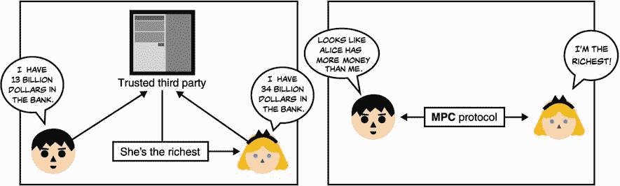
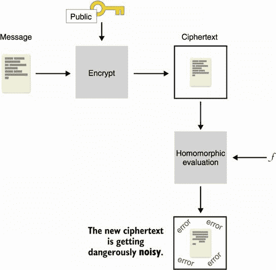

# 第十五章：这就是全部吗？下一代密码学

本章涵盖

+   通过安全多方计算（MPC）摆脱信任的第三方

+   允许他人对加密数据进行操作通过全同态加密（FHE）

+   通过零知识证明（ZKPs）隐藏程序执行的部分

我开始写这本书的时候，认为大部分章节读完的读者也会对现实世界密码学的未来感兴趣。虽然您正在阅读一个侧重于当今使用的应用和实用书籍，但密码学领域正在迅速变化（例如，最近几年我们看到的加密货币）。

当您阅读本书时，许多理论密码原语和协议正在进入应用密码学领域——也许是因为这些理论原语终于找到了用例，或者是因为它们终于变得足够高效，可以用于实际应用。无论原因是什么，密码学的现实世界肯定在增长并变得更加令人兴奋。在本章中，我通过简要介绍三种原语，为您展示了未来实际密码学可能会是什么样子（也许在未来 10 到 20 年内）：

+   *安全多方计算*（MPC）—密码学的一个子领域，允许不同参与者一起执行程序，而不必向程序透露自己的输入。

+   *全同态加密*（FHE）—密码学的圣杯，一种用于允许对加密数据进行任意计算的原语。

+   *通用零知识证明*（ZKPs）—您在第七章学到的原语，允许您证明自己知道某事而不泄露该事情，但这次更普遍地应用于更复杂的程序。

本章包含了本书中最先进和复杂的概念。因此，我建议您先浏览一下，然后转到第十六章阅读结论。当您有动力想要了解这些更高级概念的内部机制时，请回到这一章。让我们开始吧！

## 15.1 人越多越热闹：安全多方计算（MPC）

安全多方计算（MPC）是密码学领域的一个子领域，始于 1982 年的著名百万富翁问题。在他 1982 年的论文“用于安全计算的协议”中，Andrew C. Yao 写道：“两位百万富翁想知道谁更富有；然而，他们不想无意中获得有关对方财富的任何额外信息。他们如何进行这样的对话？”简而言之，MPC 是多个参与者一起计算程序的一种方式。但在了解更多关于这种新原语之前，让我们看看它为什么有用。

我们知道，在可信第三方的帮助下，任何分布式计算都可以轻松解决。这个可信第三方可以可能维护每个参与者输入的隐私，同时可能限制计算所透露给特定参与者的信息量。然而，在现实世界中，我们不太喜欢可信第三方；我们知道它们很难找到，并且它们并不总是遵守自己的承诺。

MPC 允许我们完全将可信第三方从分布式计算中移除，并使参与者能够自行计算计算，而不会向彼此透露各自的输入。这是通过一个加密协议完成的。考虑到这一点，在系统中使用 MPC 基本上等同于使用一个可信第三方（见图 15.1）。



图 15.1 安全多方计算（MPC）协议将一个可以通过可信第三方进行计算的分布式计算（左侧图像）转变为一个不需要可信第三方帮助的计算（右侧图像）。

请注意，您已经看到了一些 MPC 协议。阈值签名和分布式密钥生成，涵盖在第八章中，是 MPC 的示例。更具体地说，这些示例是 MPC 的一个子领域，称为*阈值密码学*，在近年来受到了很多关注，例如，2019 年中期 NIST 启动了阈值密码学的标准化过程。

### 15.1.1 私有集合交集（PSI）

另一个众所周知的 MPC 子领域是*私有集合交集*（PSI）的领域，它提出了以下问题：Alice 和 Bob 有一组单词，他们想知道他们有哪些单词（或者可能只是有多少）是共同的，而不暴露各自的单词列表。解决这个问题的一种方法是使用你在第十一章学到的遗忘伪随机函数（OPFR）构造。（我在图 15.2 中说明了这个协议。）如果您回忆起来

1.  Bob 为 OPRF 生成一个密钥。

1.  Alice 使用 OPRF 协议为她列表中的每个单词获取随机值*PRF*（*key*，*word*）（因此她不会得知 PRF 密钥，Bob 也不会得知这些单词）。

1.  然后 Bob 可以计算他自己单词的*PRF*（*key*，*word*）值列表，并将其发送给 Alice，然后 Alice 可以将其与她自己的 PRF 输出进行比较，以查看 Bob 的任何 PRF 输出是否匹配。


图 15.2 私有集合交集（PSI）允许 Alice 了解她与 Bob 有哪些共同的单词。首先，她会对她列表中的每个单词进行盲化，并使用 OPRF 协议与 Bob 一起对每个单词应用 PRF，使用 Bob 的密钥。最后，Bob 发送给她他的单词与其密钥的 PRF。然后，Alice 可以查看是否有任何匹配项，以了解他们共有哪些单词。

PSI 是一个前景广阔的领域，近年来开始越来越多地得到应用，因为它显示出比过去更实用的特点。例如，Google 的 Chrome 浏览器集成的密码检查功能使用 PSI 来在密码泄露后的密码转储中检测到您的某些密码时向您发出警告，而不实际看到您的密码。有趣的是，微软也为其 Edge 浏览器做了同样的事情，但使用全同态加密（我将在下一节介绍）执行私有集交。另一方面，Signal 消息应用的开发人员（在第十章讨论）认为 PSI 速度太慢，无法执行联系发现，以便根据您手机的联系人列表确定可以与您交谈的人，并且改用了 SGX（在第十三章介绍）作为可信第三方。

### 15.1.2 通用型多方计算

总的来说，MPC 有许多不同的解决方案，旨在计算任意程序。通用型 MPC 解决方案提供不同级别的效率（从几小时到几毫秒）和不同类型的属性。例如，协议可以容忍多少不诚实的参与者？参与者是恶意的还是只是诚实但好奇（也称为*半诚实*，是 MPC 协议中的一种参与者类型，他们愿意正确执行协议，但可能试图了解其他参与者的输入）？如果其中一些参与者提前终止协议，那么所有参与者是否都公平？

在使用 MPC 可以安全计算程序之前，需要将其转换为*算术电路*。算术电路是一系列的加法和乘法，因为它们是图灵完备的，所以它们可以表示*任何*程序！有关算术电路的说明，请参见图 15.3。


图 15.3 一个算术电路是一些将输入与输出连接起来的加法或乘法门。在图中，数值从左到右传播。例如，*d* = *a* + *b*。在这里，电路只输出一个值 *f* = *a* + *b* + *bc*，但理论上它可以有多个输出值。请注意，电路的不同输入由不同的参与者提供，但它们也可以是公共输入（为所有人所知）。

在看下一个原语之前，让我给你一个通过 Shamir 的秘密共享构建的（诚实多数）通用型多方计算的简化示例。存在许多更多的方案，但这个方案足够简单，可以在这里进行三步解释：在电路中共享每个输入的足够信息，评估电路中的每个门，以及重构输出。让我们更详细地看看每一步。

第一步是每个参与者对电路的每个输入都有足够的信息。公共输入是公开分享的，而私有输入是通过 Shamir 的秘密共享（在第八章中介绍）分享的。我在图 15.4 中说明了这一点。


图 15.4 通用 MPC 的第一步是使用 Shamir 的秘密共享方案，让参与者分割各自的秘密输入并将部分分发给所有参与者。例如，在这里，Alice 将她的输入 *a* 分割成 *a*[1] 和 *a*[2]。因为在这个例子中只有两个参与者，她将第一个份额给了自己，将第二个份额给了 Bob。

第二步是评估电路的每个门。由于技术原因，我将在这里省略，加法门可以在本地计算，而乘法门必须通过交互方式计算（参与者必须交换一些消息）。对于加法门，只需将您拥有的输入份额相加；对于乘法门，将输入份额相乘。您得到的是一个结果份额，如图 15.5 所示。此时，份额可以交换（以重建输出）或保持分开以继续计算（如果它们代表中间值）。


图 15.5 通用 MPC 的第二步是让参与者计算电路中的每个门。例如，参与者可以通过添加他们拥有的两个输入 Shamir 份额来计算一个加法门，这将产生一个输出的 Shamir 份额。

最后一步是重建输出。此时，参与者应该都拥有输出的一个份额，他们可以使用这个份额来使用 Shamir 的秘密共享方案的最后一步来重建最终输出。

### 15.1.3 MPC 的现状

在过去的十年中，MPC 的实用性取得了巨大进展。这是一个涵盖许多不同用例的领域，人们应该密切关注可以从这种新型原语中受益的潜在应用。需要注意的是，不幸的是，目前并没有真正的标准化努力，虽然今天有几种 MPC 实现可以被认为对许多用例来说是实用的，但它们并不容易使用。

顺便提一下，在本节前面我解释的通用 MPC 构造是基于秘密共享的，但构造 MPC 协议的方法还有很多。一个著名的替代方案叫做*加密电路*，这是姚期智在他 1982 年的论文中首次提出 MPC 时提出的一种构造类型。另一个选择是基于全同态加密，这是你将在下一节中了解的一种基本原语。

## 15.2 完全同态加密（FHE）和加密云的承诺

在密码学领域长期以来，一个问题困扰着许多密码学家：是否可能在加密数据上计算任意程序？想象一下，您可以分别加密值 *a*、*b* 和 *c*，将密文发送到一个服务，然后要求该服务返回 *a* × 3*b* + 2*c* + 3 的加密结果，然后您可以解密它。这里的重要思想是服务永远不会了解您的值，并始终处理密文。这个计算可能不太有用，但是通过加法和乘法，可以在加密数据上计算实际程序。

这个有趣的概念最初是由 Rivest、Adleman 和 Dertouzos 在 1978 年提出的，我们称之为 *完全同态加密*（FHE）（或者以前被称为 *密码学圣杯*）。我在图 15.6 中说明了这个密码学原语。


图 15.6 完全同态加密（FHE）是一种加密方案，允许对加密内容进行任意计算。只有密钥的所有者可以解密计算结果。

### 15.2.1 使用 RSA 加密的同态加密示例

顺便说一句，您已经看到了一些加密方案，应该让您感觉自己知道我在说什么。想想 RSA（在第六章中讨论过）：给定一个 *ciphertext* = *message*^e mod *N*，某人可以轻松计算密文的某些受限函数

*n*^e × *ciphertext* = (*n* × *message*)^e mod *N*

他们想要的任何数字（虽然不能太大）。结果是一个解密为

*n* × *message*

当然，这并不是 RSA 想要的行为，这导致了一些攻击（例如第六章提到的 Bleichenbacher 的攻击）。在实践中，RSA 通过使用填充方案来打破同态性质。请注意，RSA 仅对乘法同态，这对于计算任意函数是不够的，因为这需要乘法和加法。由于这个限制，我们说 RSA 是 *部分同态*。

### 15.2.2 不同类型的同态加密

其他类型的同态加密包括

+   *部分同态*—意味着对于一种操作（加法或乘法）部分同态，另一种操作在有限的方式上是同态的。例如，加法在一定数量上是无限制的，但只能进行少量乘法。

+   *分层同态*—可以进行一定次数的加法和乘法。

+   *完全同态*—加法和乘法无限制（这才是真正的东西）。

在 FHE 的发明之前，提出了几种类型的同态加密方案，但没有一种能够实现完全同态加密所承诺的功能。原因是通过在加密数据上评估电路，一些*噪声*会增加；在某个点之后，噪声已经达到了使解密变得不可能的阈值。多年来，一些研究人员试图证明也许有一些信息理论可以表明完全同态加密是不可能的；直到被证明是可能的。

### 15.2.3 启动引导，完全同态加密的关键

*一天晚上，爱丽丝梦见了巨大的财富，洞穴里堆满了银、金和钻石。然后，一只巨龙吞噬了财富，并开始吃自己的尾巴！她醒来时感到平静。当她试图理解她的梦时，她意识到她已经找到了解决问题的方法*。

—克雷格·根特里（“计算加密数据的任意函数”，2009）

2009 年，丹·博内的博士生克雷格·根特里提出了有史以来第一个完全同态加密构造。根特里的解决方案被称为*启动引导*，实际上是每隔一段时间在密文上评估解密电路，以将噪声降低到可管理的阈值。有趣的是，解密电路本身不会泄露私钥，并且可以由不受信任的一方计算。启动引导允许将分层的 FHE 方案转变为 FHE 方案。根特里的构造速度很慢且相当不切实际，每个基本位操作大约需要 30 分钟，但与任何突破一样，随着时间的推移变得更好。它还表明完全同态加密是可能的。

启动引导是如何工作的？让我们看看是否能获得一些见解。首先，我需要提到我们不需要对称加密系统，而是需要一个公钥加密系统，其中公钥可用于加密，私钥可用于解密。现在，想象一下，你在一个密文上执行了一定数量的加法和乘法运算，并达到了一定的噪声水平。噪声足够低，仍然可以正确解密密文，但太高了，不会让你执行更多同态操作而不破坏加密内容。我在图 15.7 中说明了这一点。



图 15.7 在使用完全同态加密算法加密消息后，对其进行操作会将其噪声增加到危险的阈值，解密变得不可能。

你可能认为自己陷入了困境，但启动引导通过从那个密文中去除噪声来解决问题。为此，你需要使用另一个公钥（通常称为*启动引导密钥*）重新加密有噪声的密文，以获得该有噪声的密文的加密。请注意，新的密文没有噪声。我在图 15.8 中说明了这一点。


图 15.8 在图 15.7 的基础上，为了消除密文的噪声，你可以对其进行解密。但是因为你没有秘密密钥，所以你将嘈杂的密文重新加密在另一个公钥下（称为引导密钥）以获得一个新的密文，该密文是没有错误的嘈杂密文。

现在来到了魔法的部分：你被提供了初始的私钥，但不是以明文形式，而是在那个引导密钥下加密的。这意味着你可以使用解密电路与同态地解密内部带有噪声的密文。如果解密电路产生的噪声量是可接受的，那么它就起作用了，你将得到第一个同态操作的结果，其密文是在引导密钥下加密的。我在图 15.9 中进行了说明。


图 15.9 在图 15.9 的基础上，你使用了初始的加密到引导密钥的秘密密钥来对新的密文应用解密电路。这有效地在原地解密了带有噪声的密文，消除了错误。由于解密电路，会产生一定数量的错误。

如果剩余的错误量允许你至少进行一次同态操作（+或×），那么你就成功了：你拥有一个完全同态加密算法，因为你可以始终在实践中在每个操作之后或之前运行引导。请注意，你可以将引导密钥对设置为与初始密钥对相同。这有点奇怪，因为你会得到一些循环安全问题，但似乎它可以运行，且没有已知的安全问题。

### 15.2.4 基于学习中的错误问题的 FHE 方案

在继续之前，让我们看一个基于我们在第十四章中看到的学习中的错误问题的 FHE 方案的示例。我将解释一个简化版本的 GSW 方案，以作者 Craig Gentry、Amit Sahai 和 Brent Waters 的名字命名。为了保持简单，我将介绍算法的秘密密钥版本，但请记住，将这样的方案转换为我们需要的公钥变体是相对简单的，这是我们用于引导的。看看下面的方程式，其中**C**是一个方阵，**s**是一个向量，而*m*是一个标量（一个数字）：

**Cs** = *m***s**

在这个方程中，**s**被称为*eigenvector*而*m*被称为*eigenvalue*。如果这些词对你来说很陌生，不用担心；它们在这里并不重要。

我们 FHE 方案中的第一个直觉是通过观察特征向量和特征值得到的。观察到的是，如果我们将*m*设置为要加密的单个位，**C**设置为密文，**s**设置为秘密密钥，则我们有一个（不安全的）同态加密方案来加密一个位。 （当然，我们假设存在一种方法从固定位*m*和固定秘密密钥**s**获取随机密文**C**。）我在图 15.10 中以一种乐高方式进行了说明。


图 15.10 我们可以通过将 *m* 解释为一个特征值，**s** 解释为一个特征向量，然后找到关联矩阵 **C** 来生成一个不安全的同态加密方案，该方案将密文。

要解密密文，您需要用秘密向量 **s** 乘以矩阵，然后查看是否获得了秘密向量或 0。您可以验证该方案是完全同态的，方法是检查两个密文加在一起的解密结果是否是相应位相加的结果：

(**C**[1] + **C**[2])**s** = **C**[1]**s** + **C**[2]**s** = *b*[1]**s** + *b*[2]**s** = (*b*[1] + *b*[2])**s**

此外，两个密文相乘的解密结果 (**C**[1] × **C**[2]) 是相应位相乘的结果：

(**C**[1] × **C**[2])**s** = **C**[1] (**C**[2]**s**) = **C**[1] (*b*[2]**s**) = *b*[2]**C**[1]**s** = (*b*[2] × *b*[1]) **s**

不幸的是，该方案不安全，因为很容易从 **C** 中检索出特征向量（秘密向量 **s**）。增加一点噪声呢？我们可以稍微改变这个方程，使它看起来像我们的误差学习问题：

**Cs** = *m***s** + **e**

这应该更加熟悉了。同样，我们可以验证加法仍然是同态的：

(**C**[1] + **C**[2])**s** = **C**[1]**s** + **C**[2]**s** = *b*[1]**s** + **e**[1] + *b*[2]**s** + **e**[2] = (*b*[1] + *b*[2])**s** + (**e**[1]+**e**[2])

在这里，注意到误差正在增加（**e**[1] + **e**[2]），这正是我们预期的。我们还可以验证乘法仍然有效：

(**C**[1] × **C**[2])**s** = **C**[1] (**C**[2]**s**) = **C**[1] (*b*[2]**s** + **e**[2]) = *b*[2]**C**[1]**s** + **C**[1]**e**[2] = *b*[2] (*b*[1]**s** + **e**[1]) + **C**[1]**e**[2]

= (*b*[2] × *b*[1]) **s** + *b*[2]**e**[1] + **C**[1]**e**[2]

在这里，*b*[2]**e**[1] 很小（因为它要么是 **e**[1] 要么是 0），但 **C**[1]**e**[2] 可能很大。这显然是一个问题，我会忽略它以避免深入研究细节。如果你有兴趣了解更多，请务必阅读沙伊·哈莱维（Shai Halevi）于 2017 年发表的《同态加密》报告，该报告在解释所有这些内容及更多内容方面做得非常出色。

### 15.2.5 它在哪里使用？

FHE 最被吹捧的用例一直是云。如果我可以继续将我的数据存储在云中而不被看到怎么办？而且，此外，如果云可以在加密数据上提供有用的计算呢？事实上，人们可以想到许多应用场景可以使用 FHE。一些例子包括

+   垃圾邮件检测器可以扫描您的电子邮件而不看这些内容。

+   可以对您的 DNA 进行遗传研究，而无需实际存储和保护您的隐私敏感人类编码。

+   数据库可以加密存储，并且在服务器端进行查询而不泄露任何数据。

然而，菲利普·罗加韦在他 2015 年关于“密码工作的道德性质”的开创性论文中指出，“全同态加密[...]引发了一波新的狂热。在资助提案、媒体采访和演讲中，领先的理论家们谈论全同态加密[...]作为我们取得进展的标志性迹象。没有人似乎强调这种假设性的东西是否会对实践产生任何影响。”

尽管罗加韦并没有错，全同态加密仍然非常缓慢，但该领域的进展令人兴奋。截至撰写本文时（2021 年），操作速度比正常操作慢约十亿倍，但自 2009 年以来，已经有了 10⁹倍的加速。毫无疑问，我们正在朝着未来的方向前进，至少对于某些有限的应用来说，全同态加密将成为可能。

此外，并非每个应用都需要全面的原语；有些同态加密可以在广泛的应用中使用，比全同态加密更有效。一个理论密码原语进入现实世界的一个良好指标是标准化，而事实上，全同态加密并不陌生于此。[`homomorphicencryption.org`](https://homomorphicencryption.org)的标准化工作包括许多大公司和大学。目前尚不清楚全同态加密何时、何地以及以何种形式进入现实世界。但可以肯定的是，它将会发生，敬请关注！

## 15.3 通用零知识证明（ZKPs）

第七章中我谈到了零知识证明（ZKPs）与签名有关。在那里，我指出签名类似于离散对数的非交互式 ZKPs。这种 ZKPs 是由沙菲·戈德瓦塞、席尔维奥·米卡利和查尔斯·拉科夫教授于上世纪 80 年代中期发明的。不久之后，戈德雷希、米卡利和威格德森发现我们不仅可以证明离散对数或其他类型的难题，还可以证明任何程序的正确执行，即使我们删除了一些输入或输出（参见图 15.11 的示例）。本节重点讨论这种通用类型的 ZKP。


图 15.11 通用 ZKPs 允许证明者说服验证者关于执行轨迹的完整性（程序的输入以及执行后获得的输出），同时隐藏了计算中涉及的一些输入或输出。一个例子是证明者试图证明数独可以被解决。

自其早期以来，ZKP 作为一个领域已经有了巨大的增长。这种增长的一个主要原因是加密货币的繁荣以及对链上交易提供更多保密性以及优化空间的需求。截至撰写本文时，ZKP 领域仍然以极快的速度增长，很难跟上现代方案的发展以及通用 ZKPs 的类型。

幸运的是，这个问题变得足够严重，已经触发了*标准化阈值*，一条虚拟线，一旦达到，几乎总是会激励一些人共同努力，以澄清该领域。2018 年，来自行业和学术界的人士联合起来，成立了 ZKProof 标准化工作组，旨在“标准化使用加密零知识证明”。直至今日，这仍然是一个正在进行的工作。您可以在[`zkproof.org`](https://zkproof.org)上阅读更多信息。

您可以在许多不同的情况下使用通用型 ZKPs，但据我所知，迄今为止它们主要已被用于加密货币领域，可能是因为对密码学感兴趣并愿意尝试最前沿技术的人数众多。尽管如此，通用型 ZKPs 在许多领域都有潜在应用：身份管理（能够证明您的年龄而不暴露它）、压缩（能够隐藏大部分计算）、机密性（能够隐藏协议的某些部分）等等。更多应用采用通用型 ZKPs 的最大障碍似乎是以下几点：

+   大量的 ZKP 方案以及每年都有更多方案被提出。

+   理解这些系统如何工作以及如何将它们用于特定用例的困难。

不同提议方案之间的区别非常重要。由于这是一个极易引起混淆的来源，这是一些方案被分割的方式：

+   *零知识或非零知识*—如果某些信息需要对某些参与者保密，那么我们需要零知识性。注意，无秘密的证明也可能有用。例如，您可能想将一些密集计算委托给一个服务，而该服务又必须向您证明他们提供的结果是正确的。

+   *交互式或非交互式*—大多数 ZKP 方案可以变成非交互式的（有时使用我在第七章中讨论的 Fiat-Shamir 变换），而协议设计者似乎最感兴趣的是该方案的非交互式版本。这是因为在协议中来回传输的信息可能会耗费时间，但也因为有时交互性可能不可行。所谓的非交互式证明通常被称为*NIZKs*，代表*非交互式 ZKPs*。

+   *简洁证明或非简洁证明*—聚光灯下的大多数 ZKP 方案通常被称为*zk-SNARKs*，代表*零知识简洁非交互知识证明*。尽管定义可能有所不同，但它着重于这些系统生成的证明的大小（通常在数百字节的数量级），以及验证这些证明所需的时间（在毫秒级范围内）。zk-SNARKs 因此简短且易于用于验证 ZKPs。请注意，一个方案不是 zk-SNARK 并不意味着它在现实世界中无法使用，因为通常在不同的用例中可能有用的不同属性。

+   *透明的设置或不是*—像每个密码原语一样，ZKP 需要一种设置来同意一组参数和公共值。这称为*共同参考字符串*（CRS）。但是，ZKP 的设置可能比最初想象的限制或危险得多。有三种类型的设置：

    +   *可信任的*—意味着创建 CRS 的人也可以访问允许他们伪造证明的秘密（因此，这就是为什么这些秘密有时被称为“有毒废物”的原因）。这是一个相当严重的问题，因为我们又回到了需要信任的第三方，然而具有这种属性的方案通常是效率最高且证明大小最短的。为了降低风险，MPC 可以用于让许多参与者帮助创建这些危险的参数。如果单个参与者是诚实的，并在典礼结束后删除他们的密钥，那么有毒废物就会被清除。

    +   *通用的*—如果信任的设置被称为通用，则您可以使用它来证明任何电路的执行（受某些大小限制）。否则它是特定于单个电路的。

    +   *透明的*—对于我们来说，幸运的是，许多方案也提供透明的设置，这意味着不需要存在信任的第三方来创建系统的参数。透明的方案按设计是通用的。

+   *是否抗量子*—一些 ZKP 利用公钥加密和高级原语，如双线性配对（稍后我会解释），而另一些则仅依赖对称加密（如哈希函数），这使它们在本质上抗量子计算（通常以更大的证明为代价）。

由于在撰写本文时，zk-SNARKs 备受关注，让我向您解释一下它们的工作原理。

### 15.3.1 zk-SNARKs 的工作原理

首先，有许多许多 zk-SNARK 方案—实际上有太多了。大多数都建立在这种类型的构造之上：

+   一个证明系统，允许证明者向验证者证明某些事情。

+   程序的翻译或编译为证明系统可以证明的东西。

第一部分并不太难理解，而第二部分在某种程度上需要一个研究生课程的知识。首先，让我们来看看第一部分。

zk-SNARKs 的主要思想是证明您知道一些多项式*f*(*x*)具有一些根。根的意思是验证者心中有一些值（例如，1 和 2），证明者必须证明他们心中的秘密多项式对这些值（例如，*f*(1) = *f*(2) = 0）进行评估为 0。顺便说一句，一个具有 1 和 2 作为根的多项式（如我们的例子）可以写为*f*(*x*) = (*x* – 1)(*x* – 2)*h*(*x*)，其中*h*(*x*)是某个多项式。 （如果你不相信，请尝试在*x* = 1 和*x* = 2 处评估它。）我们说证明者必须证明他们知道一个*f*(*x*)和*h*(*x*)，使得*f*(*x*) = *t*(*x*)*h*(*x*)，其中*t*(*x*) = (*x* – 1)(*x* – 2)是目标多项式。在这个例子中，1 和 2 是验证者想要检查的根。

但就是这样！这就是 zk-SNARKs 证明系统通常提供的东西：证明你知道某些多项式。我再次强调这一点，因为我第一次了解这个概念时觉得很难理解。如果你只能证明你知道一个多项式，你怎么能证明你知道程序的某个秘密输入呢？好吧，这就是 zk-SNARK 的第二部分如此困难的原因。它涉及将程序转化为多项式。但稍后再详述。

回到我们的证明系统，如何证明他们知道这样一个函数*f*(*x*)？他们必须证明他们知道一个*h*(*x*)，使得你可以将*f*(*x*)写成*f*(*x*) = *t*(*x*)*h*(*x*)。啊，... 别那么快。我们说的是*零知识*证明，对吧？我们怎么能在不泄露*f*(*x*)的情况下证明这一点？答案就在以下三个技巧中：

+   *同态承诺*——类似于我们在其他零知识证明中使用的承诺方案（在第七章中讨论）

+   *双线性配对*——一种具有一些有趣特性的数学构造；稍后详述

+   *大多数情况下，不同的多项式求值不同*

所以让我们逐个看看这些，好吗？

### 15.3.2 同态承诺以隐藏证明的部分

第一个技巧是使用*承诺*来隐藏我们发送给证明者的值。但我们不仅要隐藏它们，还要允许验证者对它们执行一些操作，以便他们可以验证证明。具体来说，他们需要验证，如果证明者对他们的多项式*f*(*x*)以及*h*(*x*)进行承诺，那么我们就有

*com*(*f*(*x*)) = *com*(*t*(*x*)) *com*(*h*(*x*)) = *com*(*t*(*x*)*h*(*x*))

其中承诺*com*(*t*(*x*))由验证者计算为多项式上的约束。这些操作称为*同态操作*，如果我们使用哈希函数作为承诺机制（如第二章所述），我们无法执行这些操作。由于这些同态承诺，我们可以“隐藏指数中的值”（例如，对于值*v*，发送承诺*g*^v mod *p*）并执行有用的身份验证：

+   承诺的等式——等式*g*^a = *g*^b 意味着 *a* = *b*

+   承诺的添加——等式*g*^a = *g*^b*g*^c 意味着 *a* = *b* + *c*

+   承诺的缩放——等式*g*^a = (*g*^b)^c 意味着 *a* = *bc*

注意，最后一个检查只有在*c*是公共值而不是一个承诺（*gc*）时才有效。仅通过同态承诺，我们无法检查承诺的乘法，这正是我们所需的。幸运的是，密码学有另一个工具可以将这样的方程式隐藏在指数中——*双线性配对*。

### 15.3.3 双线性配对以改进我们的同态承诺

双线性配对可用于解除我们的阻碍，这是我们在 zk-SNARK 中使用双线性配对的**唯一原因**（真的，只是为了能够在承诺内部相乘的值）。我不想深入讨论什么是双线性配对，但只需知道它是我们工具箱中的另一个工具，允许我们将以前无法相乘的元素从一个群移到另一个群。

使用 *e* 作为写双线性配对的典型方式，我们有 *e*(*g*[1], *g*[2]) = *h*[3]，其中 *g*[1]、*g*[2] 和 *h*[3] 是不同群的生成器。在这里，我们将在左侧使用相同的生成器（*g*[1] = *g*[2]），这使得配对对称。我们可以使用双线性配对通过这个方程来执行指数中隐藏的乘法：

*e*(*g*^b, *g*^c) = *e*(*g*)^(bc)

再次，我们使用双线性配对使得我们的承诺不仅对加法是同态的，而且对乘法也是同态的。（请注意，这不是一个完全同态的方案，因为乘法仅限于单个乘法。）双线性配对也用于密码学的其他地方，并且正在逐渐成为更常见的构建块。它们可以在同态加密方案中看到，也可以在像 BLS（我在第八章提到的）这样的签名方案中看到。

### 15.3.4 紧凑性来自何处？

最后，zk-SNARK 的**紧凑性**来自于两个不同函数的评估大多数情况下会得到不同的点。这对我们意味着什么？假设我没有一个多项式 *f*(*x*) 真正具有我们与验证者选择的根，这意味着 *f*(*x*) 不等于 *t*(*x*)*h*(*x*)。然后，在随机点 *r* 上评估 *f*(*x*) 和 *t*(*x*)*h*(*x*) 不会大部分时间返回相同的结果。对于几乎所有的 *r*，*f*(*r*)≠ *t*(*r*)*h*(*r*)。这就是**Schwartz-Zippel 引理**，我在图 15.12 中有所说明。


图 15.12 Schwartz-Zippel 引理指出，两个不同的 *n* 次多项式最多可以在 *n* 个点相交。换句话说，两个不同的多项式在大多数点上会有所不同。

了解这一点，证明 *com*(*f*(*r*)) = *com*(*t*(*r*)*h*(*r*)) 对于某个随机点 *r* 就足够了。这就是为什么 zk-SNARK 证明如此小的原因：通过比较群中的点，最终你会比较更大的多项式。但这也是大多数 zk-SNARK 构造中需要可信设置的原因。如果证明者知道将用于检查等式的随机点 *r*，那么他们可以伪造一个无效的多项式，仍然会验证相等。因此，可信设置就是

1.  创建一个随机值 *r*

1.  承诺不同幂次的 *r*（例如，g, g^r, g^(*r*²), g^(*r*³)，等等），以便证明者可以计算他们的多项式而不知道点 *r*

1.  销毁值 *r*

第二点有意义吗？如果我作为证明者的多项式是*f*(*x*) = 3*x*² + *x* + 2，那么我所要做的就是计算(g^(*r*²))³ g^r g²，以获得我在那个随机点*r*处评估的多项式的承诺（不知道*r*）。

### 15.3.5 从程序到多项式

到目前为止，证明者必须找到的多项式的约束是它需要有一些根：一些用我们的多项式计算为 0 的值。但是我们如何将一个更一般的语句转换成多项式知识证明？目前最多使用 zk-SNARKs 的应用是加密货币，其中典型的语句的形式为：

+   证明一个值在范围[0, 2⁶⁴]内（这被称为范围证明）

+   证明一个（秘密）值包含在给定的（公开）Merkle 树中

+   证明某些值的和等于另一些值的和

+   依此类推

这就是困难的部分所在。正如我之前所说，将程序执行转换为多项式的知识是非常困难的。好消息是我不会告诉你所有的细节，但我会告诉你足够让你了解事情的工作原理。从那里开始，你应该能够理解我解释中缺少的部分，并根据自己的需要填补缺漏。接下来将会发生以下事情：

1.  我们的程序将首先被转换成算术电路，就像我们在 MPC 部分看到的那样。

1.  那个算术电路将被转换成一种特定形式的方程组（称为秩-1 约束系统或 R1CS）。

1.  然后我们使用一个技巧将我们的方程组转换为一个多项式。

### 15.3.6 程序适用于计算机；我们需要算术电路而不是

首先，让我们假设几乎任何程序都可以更多或更少地轻松地用数学重写。为什么我们想这样做的原因应该是显而易见的：我们不能证明代码，但我们可以证明数学。例如，以下列表提供了一个函数，其中除了`a`是我们的秘密输入之外，每个输入都是公开的。

列表 15.1 一个简单的函数

```py
fn my_function(w, a, b) {
  if w == true {
    return a * (b + 3);
   } else {
    return a + b;
   }
}
```

在这个简单的例子中，如果除了`a`之外的每个输入和输出都是公开的，人们仍然可以推断出`a`是什么。这个列表也是一个例子，说明你不应该试图在零知识中证明什么。无论如何，该程序可以用以下方程重写成数学形式：

*w* × (*a* × (*b* + 3)) + (1 – *w*) × (*a* + *b*) = *v*

其中*v*是输出，*w*要么是 0（`false`）要么是 1（`true`）。请注意，这个方程实际上不是一个程序或电路，它只是一个约束条件。如果你正确执行程序，然后填写方程中得到的输入和输出，等式应该是正确的。如果等式不正确，那么你的输入和输出就不对应于程序的有效执行。

这就是你必须思考这些通用零知识证明的方式。我们不是在零知识中执行一个函数（实际上这并没有什么意义），而是使用 zk-SNARKs 来证明一些给定的输入和输出正确地匹配了程序的执行，即使其中一些输入或输出被省略了。

### 15.3.7 从算术电路到 rank-1 约束系统（R1CS）

无论如何，我们只是将我们的执行转换为可以用 zk-SNARKs 证明的东西的过程中的一步。下一步是将其转换为一系列约束条件，然后可以将其转换为证明某个多项式的知识。zk-SNARKs 想要的是*rank-1 约束系统*（R1CS）。一个 R1CS 实际上只是一系列形式为*L* × *R* = *O*的方程，其中*L*、*R*和*O*只能是一些变量的加法，因此唯一的乘法是在*L*和*R*之间。我们为什么需要将我们的算术电路转换为这样的方程系统其实并不重要，除了在将其转换为最终可以证明的东西时会有所帮助。尝试用我们的方程做这个，我们得到的东西就像是

+   *a* × (*b* + 3) = *m*

+   *w* × (*m* – *a* – *b*) = *v* – *a* – *b*

我们实际上忘记了*w*只能是 0 或 1 的约束条件，我们可以通过一个巧妙的技巧来将其添加到我们的系统中：

+   *a* × (*b* + 3) = *m*

+   *w* × (*m* – *a* – *b*) = *v* – *a* – *b*

+   *w* × *w* = *w*

有意义吗？你真的应该将这个系统看作一组约束条件：如果你给我一组值，声称这些值与我程序的输入和输出匹配，那么我应该能够验证这些值也正确地验证了等式。如果其中一个等式是错误的，那么这必须意味着该程序没有输出你给我的这些输入的值。另一种思考方式是，zk-SNARKs 允许你可验证地删除程序正确执行的传输的输入或输出。

### 15.3.8 从 R1CS 到多项式

问题仍然是：我们如何将这个系统转化为一个多项式？我们已经快要完成了，而且一如既往的答案是通过一系列的技巧！因为我们的系统中有三个不同的方程，第一步是为我们的多项式确定三个根。我们可以简单地选择 1、2、3 作为根，这意味着我们的多项式对*x* = 1、*x* = 2 和*x* = 3 都解出了*f*(*x*) = 0。为什么这样做？通过这样做，我们可以使我们的多项式同时代表我们系统中的所有方程，通过在 1 处求值时代表第一个方程，在 2 处求值时代表第二个方程，依此类推。现在验证者的工作是创建一个多项式*f*(*x*)，使得：

+   *f*(1) = *a* × (*b* + 3) – *m*

+   *f*(2) = *w* × (*m* – *a* – *b*) – (*v* – *a* – *b*)

+   *f*(3) = *w* × *w* – *w*

请注意，如果这些方程的值正确匹配我们原始程序的执行，所有这些方程应该评估为 0。换句话说，我们的多项式*f*(*x*)只有在我们正确创建它时才有根 1、2、3。记住，这就是 zk-SNARK 的全部意义：我们有协议来证明，确实，我们的多项式*f*(*x*)有这些根（由证明者和验证者都知道）。

如果我的解释到此为止就太简单了，因为现在的问题是证明者在选择他们的多项式*f*(*x*)时有太多的自由。他们可以简单地找到一个具有根 1、2、3 的多项式，而不关心值*a*、*b*、*m*、*v*和*w*。他们可以做任何他们想做的事情！相反，我们想要的是一个系统，锁定多项式的每个部分，除了验证者必须*不*了解的秘密值。

### 15.3.9 两个人评估隐藏在指数中的多项式

让我们回顾一下，我们希望一个证明者必须使用他们的秘密值*a*和公共值*b*和*w*正确执行程序，并获得他们可以发布的输出*v*。然后，证明者必须创建一个多项式，只填写验证者不应该了解的部分：值*a*和*m*。因此，在一个真正的 zk-SNARK 协议中，当证明者创建他们的多项式并将其评估到一个随机点时，你希望证明者在创建他们的多项式时拥有尽可能少的自由。

为了做到这一点，多项式是通过让证明者只填写他们的部分而在一定程度上动态地创建的，然后让验证者填写其他部分。例如，让我们以第一个方程为例，*f*(1) = *a* × (*b* + 3) – *m*，表示为

*f*1 = *aL*1 × (*b* + 3)*R*1 – *mO*1

其中*L*1、*R*1、*O*1 是多项式，当*x* = 1 时评估为 1，当*x* = 2 和*x* = 3 时评估为 0。这是必要的，以便它们只影响我们的第一个方程。（请注意，通过拉格朗日插值等算法很容易找到这样的多项式。）现在，请注意另外两点：

+   我们的多项式的系数是输入、中间值和输出。

+   多项式*f*(*x*)是和 *f*1 + *f*2 + *f*3 的总和，其中我们可以定义*f*2 和*f*3 来表示方程 2 和 3，类似于*f*1。

正如你所看到的，我们的第一个方程仍然在点*x* = 1 处表示：

*f*(1) = *f*1 + *f*2 + *f*3

= *f*1

= *aL*1 × (*b* + 3)*R*1 – *mO*1

= *a* × (*b* + 3) – *m*

采用这种新的表示方程的方式（记住，表示我们程序执行的方程），证明者现在可以通过以下方式评估与他们相关的多项式的部分：

1.  对隐藏在指数中的随机点*r*进行指数运算，以重构多项式*L*1 和*O*1

1.  对秘密值*a*进行指数运算 g^(L1)以获得(g^(L1))^a = g^(aL1)，表示*a* × *L*1 在未知且随机点*x* = *r*处的评估，并隐藏在指数中。

1.  对秘密中间值*m*进行指数运算 g^(O1)以获得(g^(O1))^m = g^(mO1)，表示在随机点*r*处评估*mO*1，并隐藏在指数中。

验证者可以通过使用与证明者相同的技术，重建(g^(R1))^b 和(g^(R0))³来填补缺失的部分，其中*b*是一个已同意的值。将两者相加，验证者得到 g^(bR1) + g^(3R1)，表示在未知且随机点*x* = *r*处(*b* + 3) × *R*1 的（隐藏）评估。最后，验证者可以通过使用双线性配对重建隐藏在指数中的*f*1：

e(g^(aL1), g^((b+3)R1)) – e(g, g^(mO1)) = e(g, g)^(aL1) × (b + 3)R1 – mO1

如果将这些技术推广到整个多项式*f*(*x*)，你可以了解最终的协议。当然，这仍然是对真实 zk-SNARK 协议的严重简化；这仍然给证明者留下了太多的权力。

zk-SNARKs 中使用的所有其他技巧都旨在进一步限制证明者的行为，确保他们正确且一致地填补缺失的部分，并优化可以优化的部分。顺便说一句，我读过的最好的解释是 Maksym Petkus 的论文《zk-SNARK 为什么以及如何工作：权威解释》，该论文深入探讨了我忽视的所有部分。

这就是 zk-SNARKs 的全部内容。这实际上只是一个介绍；在实践中，了解和使用 zk-SNARKs 要复杂得多！将程序转换为可被证明的东西的工作量不仅仅是非平凡的，有时还会对密码协议添加新的约束。例如，主流的哈希函数和签名方案通常对于通用 ZKP 系统来说过于重型，这导致许多协议设计者研究了不同的 ZKP 友好方案。此外，正如我之前所说的，有许多不同的 zk-SNARKs 构造，还有许多不同的非 zk-SNARKs 构造，根据您的用例，后者可能更相关作为通用 ZKP 构造。

不幸的是，并不存在一种大小适合所有的 ZKP 方案（例如，具有透明设置、简洁、通用和抗量子的 ZKP 方案），目前尚不清楚在哪些情况下使用哪种方案。该领域仍然很年轻，每年都会发布新的更好的方案。也许几年后会出现更好的标准和易于使用的库，所以如果你对这个领域感兴趣，继续关注吧！

## 总结

+   在过去的十年中，许多理论密码学原语在效率和实用性方面取得了巨大进步；其中一些正在逐渐走向现实世界。

+   安全多方计算（MPC）是一种原语，允许多个参与者共同正确执行程序，而不暴露各自的输入。阈值签名正在开始在加密货币中被采用，而私密集合交集（PSI）协议正在被用于现代和大规模协议，如谷歌的密码检查。

+   完全同态加密（FHE）允许在不解密的情况下对加密数据进行任意函数计算。它在云中具有潜在应用，可以防止除用户之外的任何人访问数据，同时允许云平台对数据进行用户有用的计算。

+   通用零知识证明（ZKPs）已经找到了许多用例，并且在快速验证小证明方面取得了最近的突破。它们主要用于加密货币，以增加隐私或压缩区块链的大小。然而，它们的用例似乎更广泛，随着更好的标准和更易于使用的库进入现实世界，我们可能会看到它们被越来越广泛地使用。
