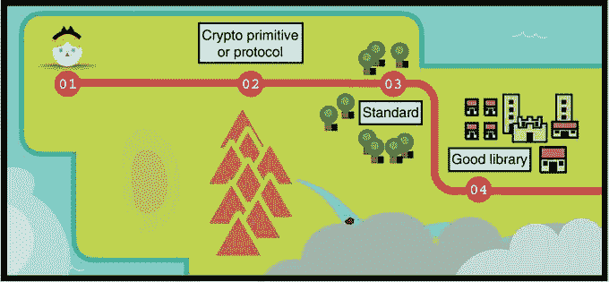
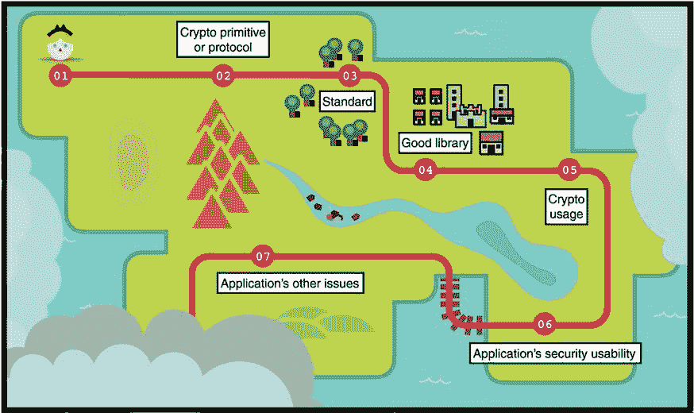

# 加密何时何地失败

本章涵盖

+   使用加密时可能遇到的一般问题

+   遵循烘烤良好的加密的要点

+   加密从业者的危险和责任

问候，旅行者；你走了很长的路。虽然这是最后一章，但重要的是旅程，而不是终点。你现在已经装备好了进入真正的加密世界所需的装备和技能。剩下的就是应用你所学到的知识。

在我们分道扬镳之前，我想给你一些提示和工具，这些对接下来的事情会有用。你将面临的任务经常遵循相同的模式：它始于一个挑战，将你引向一个现有的加密原语或协议的追求。从那里，你会寻找一个标准和一个良好的实现，然后你会尽可能地利用它。这是如果一切按计划进行的话。 . . .

在我们分别之前

试图弥合理论与实践之间差距的人将不得不打倒许多龙。这是你的剑 —— 拿去吧。

## 找到正确的加密原语或协议是一项无聊的工作

你面对的是未加密的流量，或者需要相互认证的多个服务器，或者需要存储而不会成为单点故障的一些秘密。你会怎么做？

你可以使用 TLS 或噪声（在第九章提到）来加密你的流量。你可以建立一个公钥基础设施（在第九章提到）来通过某个证书颁发机构的签名来验证服务器，你还可以使用阈值方案（在第八章中涵盖）来分发一个秘密，以避免一个秘密的泄露导致整个系统的崩溃。这些将是很好的答案。

如果你面临的问题是常见的，那么你很有可能会发现一个已经存在的加密原语或协议直接解决你的使用情况。本书给出了标准原语和常见协议的良好概念，所以在这一点上，当你面临加密问题时，你应该很清楚你可以使用什么。

加密是一个非常有趣的领域，随着新的发现和原语的提出，它遍布各个地方。虽然你可能会被诱惑去探索奇特的加密来解决你的问题，但你的责任是保持保守。原因是*复杂性是安全的敌人*。无论何时做某事，尽可能简单是更容易的。尝试过于炫耀已经引入了太多的漏洞。这个概念被 Bernstein 在 2015 年称为*无聊的加密*，并且是 Google 的 TLS 库 BoringSSL 命名背后的灵感来源。

*加密提议需要经受多年的仔细审查，才能成为可信任的字段使用候选人，尤其是当提议基于新颖的数学问题时*。

—Rivest 等人（“对 NIST 提案的回应”，1992）

如果找不到解决您问题的加密原语或协议怎么办？ 这就是您必须踏入 *理论* 密码学世界的地方，显然这不是本书的主题。 我只能给出建议。

我将给你的第一个建议是免费书籍 *A Graduate Course in Applied Cryptography*，由 Dan Boneh 和 Victor Shoup 撰写，可在 [`cryptobook.us`](https://cryptobook.us) 获取。 这本书提供了出色的支持，涵盖了我在这本书中涵盖的所有内容，但更加深入。 Dan Boneh 还有一个令人惊叹的在线课程，“Cryptography I”，也可在 [`www.coursera.org/learn/crypto`](https://www.coursera.org/learn/crypto) 免费获得。 这是一个更温和的理论密码学入门。 如果你想阅读介于这本书和理论密码学世界之间的东西，我强烈推荐 *Serious Cryptography: A Practical Introduction to Modern Encryption*（No Starch Press，2017），作者 Jean-Philippe Aumasson。

现在，让我们想象一下，您确实有一个现有的解决方案解决了您的问题。 加密原语或协议仍然是一个非常理论的东西。 如果它有一个您可以立即使用的实用标准，那不是很棒吗？

## 16.2 我如何使用加密原语或协议？ 有礼貌的标准和形式验证

您意识到存在符合您需求的解决方案，那么它是否有标准呢？ 没有标准，原语往往是在不考虑其真实世界使用的情况下提出的。 密码学家通常不考虑使用其原语或协议的不同陷阱以及实施它们的细节。 *有礼貌的密码学* 是 Riad S. Wahby 曾称之为关心其实现并且不留给实施者多少错误空间的标准。

*可怜的用户被给予足够的绳子来上吊自己——这是标准不应该做的事情*。

—Rivest 等人（“对 NIST 提案的回应”，1992）

一个有礼貌的标准是一项旨在通过提供安全且易于使用的接口来解决所有边缘情况和潜在安全问题的规范，并提供了关于如何实现以及如何使用原语或协议的良好指导。 此外，良好的标准还具有相应的测试向量：匹配输入和输出的列表，您可以将其馈送到您的实现中以测试其正确性。

不幸的是，并非所有标准都是“友好的”，它们所造成的密码学陷阱是我在本书中谈论的大多数漏洞的原因。有时标准过于模糊，缺乏测试向量，或者试图一次做太多事情。例如，*密码学灵活性*是指协议在支持的密码算法方面的灵活性。支持不同的密码算法可以使一个标准具有优势，因为有时一个算法被破解和废弃，而其他算法没有。在这种情况下，一个不灵活的协议会阻止客户端和服务方轻松迁移。另一方面，过多的灵活性也会严重影响标准的复杂性，有时甚至会导致漏洞，正如 TLS 上的许多降级攻击所证明的那样。

不幸的是，更多的时候，密码学家不愿承认，当你的问题遇到主流原语或协议没有解决的边缘情况，或者当你的问题与标准化解决方案不匹配时，你会遇到麻烦。因此，看到开发人员创建自己的迷你协议或迷你标准是极其常见的。这就是麻烦开始的时候。

当对原语的威胁模型（它所保护的内容）或其可组合性（如何在协议中使用）做出错误假设时，就会出现问题。这些特定于上下文的问题被放大，因为加密原语通常是在一个独立的环境中构建的，设计者并没有必然考虑一旦原语在多种方式或在另一个原语或协议中使用时可能出现的所有问题。我举了很多例子：X25519 在边缘情况协议中破解（第十一章），签名被假定为唯一（第七章），以及在谁与谁通信方面的模糊性（第十章）。这并不一定是你的错！开发人员已经比密码学家聪明，揭示了没有人知道存在的陷阱。这就是发生的事情。

如果你发现自己处于这种情况下，密码学家的首选工具是纸笔证明。对于我们这些从业者来说，这并不是很有帮助，因为我们要么没有时间去做这项工作（确实需要很多时间），要么没有专业知识。不过，我们并不无助。我们可以利用计算机来简化分析迷你协议的任务。这被称为*形式验证*，可以很好地利用你的时间。

形式化验证允许您在某种中间语言中编写协议并对其进行一些属性测试。例如，*Tamarin 协议证明器*（见图 16.1）是一款形式验证工具，已经（并且正在）被用来发现许多不同协议中的微妙攻击。要了解更多信息，请参阅论文“Prime, Order Please! Revisiting Small Subgroup and Invalid Curve Attacks on Protocols using Diffie-Hellman”（2019）和“Seems Legit: Automated Analysis of Subtle Attacks on Protocols that Use Signatures”（2019）。

图 16.1 Tamarin 协议证明器是一款免费的形式验证工具，您可以使用它来对加密协议进行建模并找到其中的攻击。

另一面硬币是，使用形式化验证工具通常很困难。第一步是理解如何将协议转换为工具使用的语言和概念，这通常并不直观。在用形式语言描述了一个协议之后，您仍然需要弄清楚您想要证明什么以及如何在形式语言中表达它。

实际上，见到一个证明实际上证明了错误的事情并不少见，所以人们甚至可以问，谁来验证形式化验证？在这个领域的一些有希望的研究致力于让开发者更容易地形式化验证他们的协议。例如，工具 Verifpal ([`verifpal.com`](https://verifpal.com)) 通过简化使用来换取声音（能够找到所有攻击）。

KRACK 攻击

在编写协议的形式描述与实际实现的协议之间，可能会产生关键性差异，从而导致现实世界的攻击和漏洞。这就是 2017 年发生的情况，当时 KRACK 攻击 ([`krackattacks.com`](https://krackattacks.com)) 破解了 Wi-Fi 协议 WPA2，尽管它先前已经经过形式验证。

你也可以使用形式化验证来验证密码学原语的安全性证明，使用像 Coq、CryptoVerif 和 ProVerif 这样的形式化验证工具，甚至可以在不同的语言中生成“经过形式验证”的实现（参见像 HACL*、Vale 和 fiat-crypto 这样的项目，这些项目实现了具有验证属性（如正确性、内存安全等）的主流密码学原语）。话虽如此，形式化验证并非万无一失的技术；论文协议与其形式描述之间或形式描述与实现之间的差距总是存在的，并且看起来无害，直到被发现是致命的。

研究其他协议失败的方式是避免犯同样的错误的绝佳方法。[cryptopals.com](http://cryptopals.com)或[cryptohack.org](http://cryptohack.org)挑战是了解在使用和组合加密原语和协议中可能出错的内容的好方法。底线——你需要彻底了解你正在使用的东西！如果你正在构建一个迷你协议，那么你需要小心，要么正式验证该协议，要么向专家寻求帮助。好了，我们有了一个标准，或者看起来像是标准，现在谁负责实现它呢？

## 16.3 哪里有好的库？

你离解决问题更近了一步。你知道你想使用的原语或协议，你也有了一个标准。同时，你也离规范更远了一步，这意味着你可能会产生错误。但首先，代码在哪里？

你四处看看，发现有许多可供您使用的库或框架。这是一个好问题。但是，你应该选择哪个库？哪一个最安全？这是一个难以回答的问题。一些库备受尊敬，我在本书中列出了一些：谷歌的 Tink、libsodium、cryptography.io 等等。

有时，找到一个好的库使用是困难的。也许你使用的编程语言对加密支持不多，或者你想使用的原语或协议没有那么多的实现。在这些情况下，谨慎一些并向加密社区寻求建议是很好的，看看库背后的作者，也许甚至向专家请求代码审查。例如，Reddit 上的 r/crypto 社区非常乐意帮助；直接给作者发邮件有时会奏效；在会议的开放麦克风环节询问观众也可能有所作用。

如果你处于绝望的境地，甚至可能不得不自己实现加密原语或协议。此时可能会出现许多问题，检查加密实现中常见问题是个好主意。幸运的是，如果你遵循一个好的标准，那么犯错就不那么容易了。但是，实现加密是一种艺术，如果可以避免的话，你不应该涉足其中。

一种有趣的测试加密实现的方法是使用*工具*。虽然没有单一的工具适用于所有加密算法，但谷歌的 Wycheproof 值得一提。Wycheproof 是一套测试向量，您可以使用它来查找常见加密算法（如 ECDSA、AES-GCM 等）中的棘手错误。该框架已被用于发现不同加密实现中令人印象深刻的大量错误。接下来，假设您没有自己实现加密，并找到了一个加密库。

## 16.4 加密的错误使用：开发者是敌人

你找到了一些可以使用的代码，你又前进了一步，然而你发现还有更多的机会引入错误。这就是应用密码学中大多数错误发生的地方。我们在本书中一再看到了错误使用密码学的例子：在 ECDSA（第七章）和 AES-GCM（第四章）等算法中重用 nonce 是不好的，当滥用哈希函数（第二章）时会出现碰撞，由于缺乏源身份验证（第九章），参与方可能会被冒充，等等。

*结果显示，仅有 17%的错误出现在加密库中（这往往会产生严重后果），而其余 83%是由个别应用程序错误使用加密库造成的*。

—David Lazar, Haogang Chen, Xi Wang, and Nickolai Zeldovich（“加密软件为什么会失败？案例研究和未解决的问题”，2014 年）

一般来说，原语或协议越抽象，使用起来就越安全。例如，AWS 提供了一个密钥管理服务（KMS），可以将您的密钥托管在 HSM 中，并按需执行加密计算。这样，加密就在应用程序级别上抽象化了。另一个例子是编程语言在其标准库中提供加密功能，这些功能通常比第三方库更可信。例如，Golang 的标准库非常出色。

加密库对可用性的关注通常可以概括为“将开发者视为敌人”。这是许多加密库采取的方法。例如，Google 的 Tink 不允许您在 AES-GCM（见第四章）中选择 nonce/IV 值，以避免意外的 nonce 重用。为了避免复杂性，libsodium 库只提供了一组固定的原语，而没有给您任何自由。一些签名库在签名中包装消息，强制您在发布消息之前验证签名，等等。在这个意义上，加密协议和库有责任尽可能地使其接口对误用具有抵抗力。

我以前说过，我会再次说一遍——确保您理解您正在使用的所有细节。正如您在本书中所看到的，错误使用加密原语或协议可能以灾难性的方式失败。阅读标准，阅读安全注意事项，阅读您加密库的手册和文档。这就是全部吗？嗯，并不完全是这样……您不是唯一的用户。 

## 16.5 你在做错事：可用安全

使用加密可以在很多时候以透明的方式解决应用程序的问题，但并非总是如此！有时，加密的使用会泄露给应用程序的用户。

通常，教育只能起到有限的帮助作用。因此，当发生不良事件时，指责用户绝非明智之举。相关的研究领域被称为*可用安全性*，在这个领域里，人们致力于使安全和与密码学相关的功能对用户尽可能透明化，尽量消除用户滥用的机会。一个很好的例子是浏览器逐渐改变了在 SSL/TLS 证书无效时发出简单警告的方式，而是使用户更难接受风险。

*我们观察到的行为与警告疲劳理论相一致。在 Google Chrome 中，用户对最常见的 SSL 错误的点击速度更快、频率更高。 [. . .] 我们还发现，对于 Google Chrome 的 SSL 警告，点击通过率高达 70.2%，这表明警告的用户体验对用户行为有巨大影响*。

——Devdatta Akhawe 和 Adrienne Porter Felt（《警告国的爱丽丝：浏览器安全警告有效性的大规模现场研究》，2013）

另一个很好的例子是，安全敏感的服务已经从密码转向支持第二因素认证（在第十一章介绍）。因为强制用户使用强大的每服务密码太困难了，所以找到了另一个解决方案来消除密码泄露的风险。端到端加密也是一个很好的例子，因为用户始终很难理解他们的对话是端到端加密的意义，以及安全性有多大程度来自于他们主动验证指纹（在第十章介绍）。每当将密码学推给用户时，都必须付出巨大的努力来减少用户错误的风险。

故事时间

几年前，有人请我审查一个广泛使用的消息应用的端到端加密方案。该方案包括了常见的最先进协议，即 Signal 协议（在第十章介绍），但却没有提供用户验证其他用户的公钥（或会话密钥）的功能。这意味着，虽然在被动攻击者存在时，您的通信是端到端加密的，但恶意员工却可以轻易更新用户的公钥（或某些用户的会话密钥），而您却无法检测到中间人攻击。

## 16.6 密码学不是孤立存在的

密码学通常被用作更复杂系统的一部分，而这些系统也可能存在漏洞。实际上，大多数漏洞存在于与密码学本身无关的部分。攻击者通常寻找链条中最脆弱的环节，最容易攻击的目标，而密码学往往在提高门槛方面表现良好。涵盖系统可能更大更复杂，往往会产生更多可访问的攻击向量。阿迪·沙密尔曾经说过：“密码学通常是被绕过，而不是被突破。”

虽然努力确保系统中的密码学是保守的、实现良好且经过充分测试是好事，但也有益于确保对系统的其余部分也应用了同样程度的审查。否则，你可能白费了所有努力。

## 16.7 作为密码学从业者，不要自己设计加密算法

就是这样，这本书到此结束，你现在可以在荒野中自由驰骋。但我必须警告你，阅读这本书并不赋予你超能力；它只应该让你感到脆弱。让你意识到密码学很容易被误用，最简单的错误可能导致灾难性后果。请谨慎前行！

现在你已经掌握了丰富的密码学工具。你应该能够识别周围使用的密码学类型，甚至可能识别出可疑之处。你应该能够做出一些设计决策，知道如何在应用程序中使用密码学，并了解何时你或他人开始做一些可能需要更多关注的危险行为。永远不要犹豫寻求专家的意见。

“不要自己设计加密算法”可能是软件工程中最被滥用的密码学说法。然而，这些人在某种程度上是正确的。虽然你应该有能力实现甚至创建自己的加密原语和协议，但不应在生产环境中使用它。制作密码学需要多年才能做到正确：多年来学习该领域的方方面面，不仅从设计的角度，还从密码分析的角度。即使是终身研究密码学的专家也会构建破损的密码系统。Bruce Schneier 曾经著名地说过：“任何人，从最无知的业余爱好者到最优秀的密码学家，都可以创建一个他自己无法破解的算法。”此时，继续学习密码学就取决于你。这些最后的页面并不是旅程的终点。

我希望你意识到你处于一个特权地位。密码学起初是一个在闭门之后进行的领域，只限于政府成员或学术界保密，慢慢地演变成了今天的样子：一门在全世界公开研究的科学。但对于一些人来说，我们仍然处于（冷）战争时期。

2015 年，Rogaway 对密码学和物理学两个研究领域进行了有趣的比较。他指出，物理学在二战结束后不久就变成了一个高度政治化的领域。研究人员开始感到深刻的责任，因为物理学开始明显且直接地与许多人的死亡以及可能更多人的死亡相关联。不久之后，切尔诺贝利核事故将加剧这种感觉。

另一方面，密码学是一个经常被讨论隐私问题的领域，使密码学研究成为无政治性。然而，您和我做出的决定可能会对我们的社会产生长远影响。下次设计或实施使用密码学的系统时，请考虑您将使用的威胁模型。您是将自己视为可信方，还是以一种即使您也无法访问用户数据或影响其安全性的方式设计事物？您如何通过密码学赋予用户权力？您加密了什么？前 NSA 局长迈克尔·海登曾说：“我们根据元数据杀人” ([`mng .bz/PX19`](http://mng.bz/PX19))。

2012 年，在圣巴巴拉海岸附近，数百名密码学家聚集在一个黑暗的讲堂里，聆听乔纳森·齐特兰的演讲，“加密的终结” ([`www.youtube.com/watch?v=3ijjHZHNIbU`](https://www.youtube.com/watch?v=3ijjHZHNIbU))。这是世界上最受尊敬的密码学会议 Crypto。乔纳森向房间里播放了来自电视剧《权力的游戏》的片段。在视频中，一个阉人瓦里斯向国王之手提利昂提出了一个谜语。这是谜语：

*三位伟大的人坐在一个房间里：一个国王，一个神父和一个富人。他们之间站着一个普通的雇佣兵。每位伟大的人都让雇佣兵杀死其他两个。谁活着，谁死了？提利昂迅速回答：“取决于雇佣兵”，阉人回答：“如果是剑客统治，为什么我们要假装国王拥有所有权力？”*。

乔纳森停止了视频并指向观众，对他们大喊道：“你们明白你们是雇佣兵，对吧？”

## 摘要

+   真实世界的密码学在应用方面往往失败。我们已经知道在大多数用例中使用的好原语和好协议，这使得它们的误用成为大多数错误的根源。

+   大多数典型用例已经通过加密原语和协议解决。大多数情况下，您只需找到一个受人尊敬的实现来解决您的问题。确保阅读手册并了解在什么情况下可以使用原语或协议。

+   真实世界的协议是通过像乐高积木一样组合加密原语构建的。当没有受人尊敬的协议解决您的问题时，您将不得不自己组装这些部件。这是极其危险的，因为加密原语有时在特定情况下使用或与其他原语或协议组合时会出现问题。在这些情况下，形式验证是发现问题的绝佳工具，尽管可能难以使用。

+   实施加密不仅仅是困难的；您还必须考虑难以误用的接口（好的加密代码留给用户的空间很小，不容易出错）。

+   保持保守，并使用经过验证的加密技术是避免后续问题的好方法。源自复杂性的问题（例如，支持过多的加密算法）是社区中的一个重要话题，远离过度设计的系统被称为“无聊的加密”。尽可能无聊。

+   加密原语和标准都可能由于过于复杂难以实现或者对实现者应该注意的事项描述不清而导致实现中的漏洞。有礼貌的加密是指一种难以糟糕实现的加密原语或标准的概念。要有礼貌。

+   应用中使用的加密有时会泄漏给用户。可用安全性是确保用户了解如何处理加密并且不会误用它的一种方式。

+   加密并不是孤立存在的。如果你遵循本书给出的所有建议，那么你的大多数错误可能会发生在系统的非加密部分。不要忽视这些！

+   通过这本书所学到的知识，确保对自己的工作负责，并且认真思考工作带来的后果。
