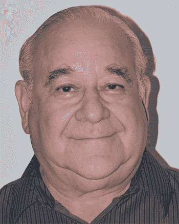

# 前言

## 序言

从秘密解码环到政府政策声明，隐藏和发现信息的挑战长期以来一直吸引着智慧。密码学是一个引人入胜的主题，几乎每个学童都有一些实践经验。然而，出于良好的原因，它是一个被深度保密包裹的学科，并被政府用来保护其最敏感的武器。密码学在军事和外交事务中的作用一直非常严肃。毫不夸张地说，密码学的成功和失败塑造了战争的结局和历史的进程；而且毫不夸张地说，密码学的成功和失败正在制定我们当前的历史进程。

回想一下美国南北战争中的安提塔姆战役，发生在 1862 年 9 月，当时乔治·麦克莱兰指挥联盟军对抗罗伯特·E·李的南方联盟军，位于马里兰州夏普斯堡附近。几天前，两名联盟士兵在他们的营地附近发现了一张纸条，结果证明这是李发出的一份详细说明马里兰入侵计划的命令副本。这份命令没有加密。凭借其中的信息，麦克莱兰准确地知道了李散兵游勇的位置，并在他们重新联合之前摧毁了李的军队。

密码学的成功和失败也塑造了更近期的历史。1914 年 8 月，俄罗斯在坦尼斯堡的可怕失败是德军截获俄罗斯通讯的直接结果。令人惊讶的是，俄罗斯的通讯完全是明文的，因为俄罗斯没有为其野战指挥官配备密码和密钥。因此，俄罗斯无法安全地协调各军中邻近单位的活动。

第二次世界大战后即将发生的 50 年冷战也是由一个密码学失误引起的，这次是在 1942 年中途岛战役中对日本人的失败。美国密码分析员破译了日本的密码，并阅读了大量联合舰队的消息。这类故事属于古典密码学的范畴。*秘钥密码学*就是在这个领域中发挥作用的。

没有人比 Frank Rubin 博士更能启发对古典娱乐性密码学各个方面感兴趣的读者，从其数学传承到社会学影响。Frank Rubin 博士的教育背景是数学和计算机科学。他在 IBM 的设计自动化领域工作了 30 年，并从事密码学工作超过 50 年。Frank Rubin 博士曾担任《Cryptologia》等出版物的编辑。他撰写了数十种数学和计算机算法，并创建了数千个数学谜题。

*秘钥密码学* 不仅仅是 Helen F. Gaines 的经典作品 *Elementary Cryptanalysis* 的更新。它涵盖了从古代到量子计算时代的领域。*秘钥密码学* 提出了新的方法和“破译”技术。最后，它解释了一种测量密码强度的独特方法。^(1,2)

这本书出版在密码学发展史上一个战略性的时刻。它为理解这一关键技术提供了及时而重要的贡献。无论读者是寻求关于密码学本身的启迪，还是信息安全从业者，这些页面中包含的知识的深度和广度都将是一份有用的信息来源和图书馆的宝贵补充。

——Randall K. Nichols，DTM

*Randall K. Nichols 是美国密码协会（ACA）的前任主席、贵族和书评编辑；堪萨斯州立大学萨利纳分校无人机系统网络安全证书课程的主任；以及尤蒂卡学院研究生网络安全与取证的名誉教授。*

参考文献

Gaines, H. F.（1956）。*密码分析：密码及其解决方案研究*。纽约市：Dover。

LANAKI.（1998）。*古典密码学课程 Vol. I.*。加州拉古纳山：爱琴海公园出版社。

LANAKI.（1999）。*古典密码学课程 Vol. II*。加州拉古纳山：爱琴海公园出版社。

Nichols, R. K.（1999）。*ICSA 密码学指南*。纽约市：麦格劳希尔。

Rubin, F.（2022）。*秘钥密码学*。纽约州 Shelter Island：Manning Books。

Schneier, B.（1995）。*应用密码学：C 语言协议、算法和源代码*。纽约：John Wiley & Sons。

## 前言

写这本书有几个线索。让我们从我的高中朋友查理·罗斯开始。查理在学校书店工作。有一天，在为商店订购书籍时，他注意到了 Helen F. Gaines 的书 *Cryptanalysis*。查理想要这本书，他也想要员工折扣。但出现了一个问题。商店最少订购数量是三本。

查理需要让其他两个人购买这本书。他承诺我们会一起阅读这本书，然后制作其他人解密的密码。我买了这本书，读了它，然后制作了密码，但查理失去了兴趣。

*Cryptanalysis* 的封底上给出了美国密码协会（[www.cryptogram.org](http://www.cryptogram.org/)）的一个长期不更新的街道地址，但我找到了他们并加入了。我开始解决他们在业余爱好者通讯 *The Cryptogram* 中发布的各种类型的密码，几年后我成为了一名助理编辑。我在那里是会员超过 40 年。

1977 年，一个更专业的密码学期刊*Cryptologia*开始发行。你可以在[`www.tandfonline.com/toc/ucry20/current`](https://www.tandfonline.com/toc/ucry20/current)找到它。我开始阅读这些文章，然后贡献文章，最终成为一名编辑。不知何故，我成了“疯子处理者”。所有那些文章都送到了我手上，我不得不摸索出其中的道理，看看是否隐藏着一个好主意。仅有一个案例符合条件。我把它写成了一篇文章发表在*The Cryptogram*上。作者非常感激，他以我的名义在以色列种了一棵树。

这段经历教会了我如何区分那些只是写得很糟糕的文章，或者作者简单地高估了密码强度的文章，与那些真正离谱的文章。我学到了这个：用一个弱密码的业余爱好者可以描述密码并写出步骤。真正的疯子无法将他们模糊而宏大的想法写在纸上。他们可以滔滔不绝地写自己的密码有多么精彩，但他们无法写出步骤。他们无法将他们的初步想法转化为具体的算法。

大约在 2005 年左右，我开始在马里斯特学院 CLS（继续生活学习）上课。不久后，我开始就数独、SumSum 和其他谜题（我写了三本数独谜题书）进行讲座；我的坦桑尼亚和蒙古之行；帝国大厦的建造；艾伦·图灵的一生；以及其他主题。我成为了课程委员会的一员。

2018 年，我自愿为一门两学期的密码学课程做讲师。在为课程准备近 450 张幻灯片的过程中，我意识到我有足够的材料写一本书。幸运的是，我发现一年前我已经开始写了这样一本书。就是这本。

## 致谢

几天前，我无意中听到妻子米里亚姆在电话里对朋友说：“就像我和弗兰克和这本书住在一个*ménage à trois*里一样。”谢谢你，米里亚姆，在写这本书花了 18 个月的时间里，一年寻找出版社，6 个月找文学经纪人，一年看文学经纪人毫无进展，最后一个月才在 Manning 找到了这本书的归属。再加上 18 个月的审阅、修改、编辑、修订、排版、修订、索引、撰写营销文案等等。

我要感谢所有在 Manning 出版社帮助过我这本书的人，特别是迈克尔·斯蒂芬斯，他冒了险给了我一个合同，并在整个过程的每个阶段都给予了帮助；玛丽娜·迈克尔斯为她的许多编辑改进；丽贝卡·莱因哈特为平滑道路；詹·霍尔和苏珊·霍尼韦尔为插图工作；蒂凡尼·泰勒在语法和标点方面提出了许多宝贵的建议；保罗·威尔斯和凯里·哈尔斯为书的制作工作；萨姆·伍德为营销文案；丹尼斯·达林尼克为排版；当然，还有出版商马尔金·巴斯。

特别感谢 Randall K. Nichols 教授在极短时间内撰写本书前言并在《密码》杂志上进行评论。同时也感谢 Enigma 博物馆的 Thomas Perera 教授提供 Fialka 图像。

感谢那些阅读手稿并提出许多建议和有用批评的审稿人：Christopher Kardell、Alex Lucas、Gabor Hajba、Michal Rutka、Jason Taylor、Roy Prins、Matthew Harvell、Riccardo Marotti 和 Paul Love。你们的建议帮助使这本书更加优秀。

最后，我必须感谢李·哈维·奥斯瓦尔德，他那令人发指的暗杀总统约翰·F·肯尼迪的行为阻止了我去联邦调查局总部进行安全面试，这也使我无法加入国家安全局，否则我写这本书就会成为一种重罪。

## 关于本书

### 谁应该阅读这本书？

本书面向广泛的读者群体：一般读者、密码学爱好者、历史爱好者、计算机科学学生、电气工程师、数学家和专业的密码学家。这使得我的工作变得更加困难，因为不可能使书中的每一部分都适合每一类读者。对于某些读者来说，书中的某些部分可能需要太多的数学知识。对于某些读者来说，有些部分可能太基础了。在本节中，我试图引导读者找到我认为最适合他们的材料。

+   **一般读者**可以直接阅读至第八章结束。只需跳过数学太难或技术性太强的部分。从第九章开始，情况开始变得棘手。从这一点开始，他们可以略读，并挑选感兴趣的主题。他们可能想阅读第十二章以获取一般概念，而不深入细节。

+   **密码学爱好者**可能会想阅读整本书，然后再仔细研究第 4.2 至 5.11 节，第 6.1 至 6.5 节，第 6.7 节，大部分第七章以及第 9.1 至 9.9 节，加上有趣的页面和挑战页面。

+   **历史爱好者**可以阅读整本书，忽略数学部分，以了解每种方法是何时以及由谁开发的时间线。

+   **计算机科学学生**可能会特别重视第 5.6 至 5.11 节，第八章和第 11 至 16 章。

+   **电气工程师**将寻找实用方法。他们应首先阅读第二章和第四章以建立基础，然后阅读第 7.2 至 7.8 节，第九章和第 11 至 16 章，特别强调第十二章。

+   **数学家**对第 4.5 节，第 5.6 至 5.12 节，第 10.4 至 10.7 节，第 11.7 至 11.10 节，第 12.3 至 12.6 节，第 13 至 16 章，特别是第 16.4.6 节和第十八章最感兴趣。

+   **专业的密码学家**对第 7.8、8.2、10.5、10.7、11.4、12.3 至 12.6、13.8、13.15、14.2、14.4、15.4 至 15.14、16.4、16.5 和 18.12 节最感兴趣。

### 关于密码学

我包含了一些有趣的密码和挑战密码，供想尝试解决的读者使用。 有趣的密码使用书中描述的标准方法。

挑战密码使用我自己发明的方法。 它们非常简单，以至于业余爱好者既可以猜测方法，又可以解决它们。 我试图做到公平，以便感兴趣的读者可以解决它们。 没有奇怪或复杂的东西。 没有奇怪的词语或扭曲的字母频率。 而且提供足够的材料来解决它们。

您可能会注意到一些以粗体 ***** 开头并以 ***** 结尾的部分。 这些是可选部分，可能包含计算机算法或更深层次的数学。 一些读者可能选择跳过这些部分。

### liveBook 讨论论坛

购买 *密钥密码学* 包括免费访问 liveBook，Manning 的在线阅读平台。 使用 liveBook 的独家讨论功能，您可以将评论附加到全书或特定部分或段落。 为自己做笔记，提出和回答技术问题，并从作者和其他用户那里获得帮助，都是轻而易举的。 要访问论坛，请转到 [`livebook.manning.com/book/secret-key-cryptography/discussion`](https://livebook.manning.com/book/secret-key-cryptography/discussion)。 您还可以在 [`livebook.manning.com/discussion`](https://livebook.manning.com/discussion) 上了解有关 Manning 论坛和行为规则的更多信息。

Manning 对我们的读者的承诺是提供一个有意义的对话场所，个别读者之间以及读者与作者之间可以进行对话。 这并不是对作者参与的任何特定数量的承诺，他在论坛上的贡献仍然是自愿的（并且无报酬）。 只要这本书还在印刷中，论坛和以前讨论的档案将可以从出版商的网站访问。

### 其他在线资源

您可以在作者的网站 [www.mastersoftware.biz](http://www.mastersoftware.biz) 上找到作者的密码学产品。

## 作者简介

弗兰克·鲁宾拥有数学学士和硕士学位以及计算机科学博士学位。他在 IBM 工作了 28 年，从事设计自动化领域，在那里他设计并编写了专门用于设计计算机和电路的软件，IBM 工程师使用这些软件。他是 Master Software Corp.的所有者，该公司生产密码软件。弗兰克已获得四项关于密码方法的美国专利。弗兰克在密码学、计算机电路、图论和纯数学等领域发表了约 50 篇经过同行评议的期刊论文，以及几本（用户手册和项目规范）在 IBM 内部出版的书籍。在密码学领域，他以解决杰斐逊密码轮而闻名。在计算机科学领域，弗兰克以算术编码而闻名，这现在是文本压缩的标准方法之一，以及他的寻找哈密顿路径的算法。在纯数学领域，他可能以引入有限状态识别器概念而闻名。弗兰克有三本数独谜题书和两本自出版的 SumSum 谜题书。他是*The Cryptogram，Technology Review*和*Journal of Recreational Mathematics*等刊物上发表的超过 3500 个谜题的作者，他是唯一一个被授予专门为他自己的谜题而献给的*JRM*特刊的人。

## 关于封面插图

*秘钥密码学*封面上的图案是“Le Garçon de Bureau”，或者“办公室助理”，取自路易·库尔默编辑的一本 1841 年出版的书。每幅插图都是精心绘制和手工上色的。

在那些日子里，人们很容易通过他们的服装来辨认他们住在哪里，以及他们的行业或社会地位是什么。曼宁通过基于几个世纪前地区文化的丰富多样性的书籍封面，再现了今天计算机业的创造力和主动性，这些插图来自于这样的收藏品。

* * *

^(1.) R. K. 尼科尔斯的*ICSA 密码学指南*和 Bruce Schneier 的*应用密码学*都介绍了密码强度和随机性方法。前者集中在古典密码学上，后者集中在现代密码（尼科尔斯，1999；Schneier，1995）。

^(2.) *秘钥密码学*的定义和写作比我前两本关于古典密码学的书更好，即*古典密码学课程第一卷和第二卷*（LANAKI，1998；1999）。
