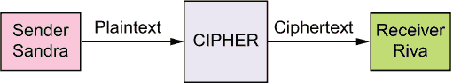
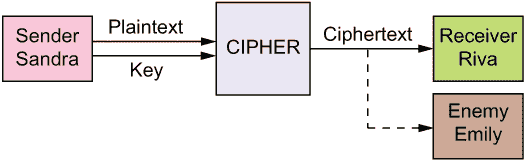
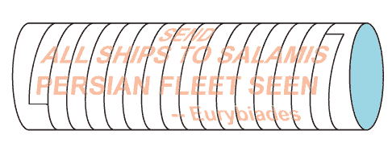
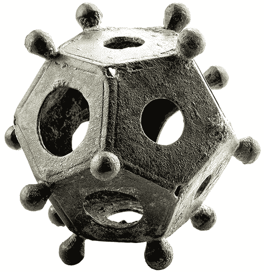
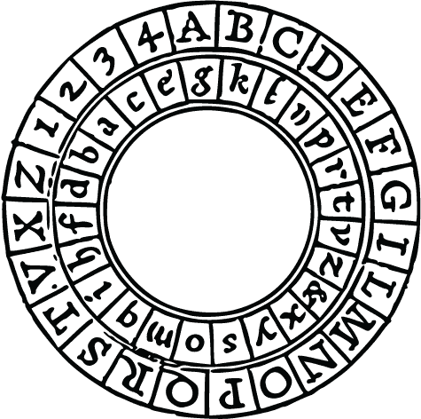

# 什么是密码学？

本章涵盖

+   密码学中使用的基本术语

+   什么是不可破解的密码？

+   有哪些不同类型的密码学？

密码学通常被称为“秘密写作的艺术”。它不仅仅是那样。它涵盖了从隐形墨水到通过光子的量子纠缠传输消息的所有内容。特别是，密码学包括制作和破译代码和密码。

不同的作者以不一致的方式使用密码学术语，因此让我们首先就一些基本术语达成一致。

*明文* 或 *纯文本* 是你希望保密的消息或文档。在传统密码学中，消息是发送者和接收者都知道的某种语言编写的文本。在计算机环境中，这可以是任何类型的文件，例如 PDF（文本）、JPG（图像）、MP3（音频）或 AVI（多媒体）。

*密码* 是一种用于使消息变得不可读的方法，或 *算法*：例如，通过改变字符的顺序或用不同的字符替换一些字符。通常，密码对文本中的单个字符或字符组进行操作，而不考虑它们的含义。

*密钥* 是仅知道发送者和合法接收者的秘密信息，用于选择每条消息使用的转换的信息。例如，如果密码（方法）是改变消息中字母的顺序，密钥可能指定当天消息使用的顺序。密钥可以是字母、单词或短语、数字或字母、单词和数字的序列。密码的强度高度依赖于它使用的密钥的总大小。

*关键字* 或 *关键短语* 是用作密钥的单词或短语。

*加密* 或 *加密* 是将明文变成不可读杂乱的过程，合法发送者知道密钥。

*密文* 是结果杂乱不可读的消息或文档，将被传输或存储。

*解密* 或 *解密* 是合法接收者使用的过程，合法接收者知道方法和密钥，将杂乱的密文转换回原始明文消息。

*代码* 也是一种使消息变得不可读的方法。与密码相比，代码通常是对消息中的单词或短语进行操作。典型的代码用数字或字母组成的组替换单词或短语。（令人困惑的是，“代码”这个词也用来表示字母的标准化表示，例如莫尔斯电码。希望从上下文中可以清楚地理解其含义。）

*密码学* 是对密码学的形式化研究，用于构建和解决密码的数学和方法论。学者们研究密码学；破译者研究密码分析。

*密码分析* 是研究代码和密码的专门目的，以识别弱点并找到突破它们或相反，加强它们的方法。

*破译*是指通过没有密钥并且可能不知道加密方法的第三方（敌人或对手）解决加密消息的过程。这可以通过数学方法或通过耐心地收集和整理拦截来完成，但实际上通常归结为三个 B：贿赂、勒索和入侵。

## 2.1 无法破解的密码

现在我们有了一些共同的语言，让我来解决主要问题。我所说的“无法破解”到底是什么意思？首先，我指的是一个密码不能通过密码学手段破解。这排除了入侵、贿赂、胁迫、叛变、敲诈勒索、诱捕等手段。这些超出了我们的范围。其次，我指的是密码在实践中无法被破解。任何对手都有有限的资源和有限的时间来投入到破译任务中。在选择密码时，你需要对你的潜在对手可能用来破解你的密码的人力资源和计算机资源有一定的了解。做一个保守的猜测，考虑计算机的改进，增加安全边际，然后选择一个数字。然后，当你选择一个密码时，你就有了一个目标。达到这个目标，你的密码就是有效无法破解的。

记住，许多消息的寿命有限。如果你的消息是攻击在黎明时分，而你的敌人在中午读到了你的消息，那就太晚了。你已经发动了攻击。一个在 12 小时内可以被破解的密码，在你的对手没有 12 小时的情况下是无法被破解的。

只是为了让这个概念更加清晰，当我说一个密码已经被*破解*时，我是指对手可以读取使用该密码发送的消息。即使对手只能读取 1%或 0.01%的消息，该密码也被破解了。但是有一个截止点。如果对手只有在拦截了许多使用相同密钥加密的相同长度的消息，或者其中 63 个密钥位为零时才能读取消息，则密码仍然未破解。对手没有*先验*的方法来确定哪些消息使用了哪些密钥，或者哪些密钥几乎全为零。你可能永远不会发送两条相同长度且使用相同密钥的消息，或者其中 63 个密钥位中有 64 个为零的消息。

如果你的密码使用了一个 256 位的密钥，而一个敌方密码分析家找到了一个将其减少到 200 位甚至 150 位的数学或计算方法，那么该密码可能会被削弱，但如果你选择的安全级别是 128 位，它仍然未被破解。使用 256 位密钥来实现 128 位安全级别提供了巨大的安全保障。

当政府决定旧的数据加密标准不再安全时，它举行了一场新密码的国际竞赛。在全球范围内征集提案。数十种密码被提交。数百名密码学家评估了这些候选密码的安全性、速度和易于实施性。从 1997 年到 2000 年 4 月，进行了三轮淘汰，直到选出了一个获胜者。当你的密码将成为政府、银行、工业和军事的全球标准时，你需要做的就是这样。如果你决定参加下一次的竞赛，这本书将帮助你做好准备。

大多数读者不会尝试那样做。他们的密码会有更有限的范围。他们可能会信任自己的判断，或者他们设计的任何验证过程，来评估他们的密码。第十二章的原则将帮助他们做出明智和自信的决定。

## 2.2 密码学的类型

密码学有许多不同的类型。过去使用的一些类型是

+   *隐藏消息*：例如，信使可以吞下消息，或将其藏在靴子跟或马鞍中，或者简单地记住它。在古代，让信使把消息以他们不理解的语言的发音记忆是很常见的。

+   *秘密方法*，比如*凯撒密码*，其中字母表中的每个字母都被替换为后面 3 个位置的字母。也就是说，A 变成了 D，B 变成了 E，C 变成了 F，依此类推。

+   *伪装消息*，其中消息被制成看起来像其他东西，比如信使的衣服设计。

+   *隐形信息*，如微点或在加热或暴露于酸性物质时变得可见的隐形墨水。

+   *误导*：例如，签名或纸张的形状和颜色是真正的消息，而其他一切都是干扰或虚假信息。

所有隐藏消息的方法统称为*隐写术*，最早在 1499 年本笃会修士约翰内斯·特里特米乌斯（Johannes Trithemius）的著作《隐写术》（Steganographia）中描述，特里特米乌斯出生于约翰内斯·海登贝格。特里特米乌斯的书本身就是一种隐写术，因为它伪装成一本魔法书。

这些隐写术方法有现代对应物。例如，可以通过仅使用每个像素的低阶位在 JPEG 图像文件中隐藏消息。另一个例子是使用随机数生成器来选择文件的每个字节中的特定位。所选位包含消息，其余位可以是随机的无用信息。

在描述现代密码之前，让我介绍一个有用的简化方法。一条消息从发送者发送给接收者，加密的目的是阻止某个敌人阅读消息。为了简洁起见，我将发送者称为桑德拉，预期接收者称为莉娃，敌人称为艾米丽。这比艾丽斯、鲍勃和卡罗尔更自然，不是吗？

通常桑德拉在本地对消息进行加密，然后再发送给莉娃。消息可以通过任何方式发送：信件、电话、互联网、短波无线电、阿尔迪斯灯、微气泡、电报、光纤电缆、信号旗、量子纠缠，甚至如果有直线视野的话，还可以使用烟信号。为了使这个图像更加完整，密码可能需要一个密钥以及明文，可能会有敌人在监听。这是一个更完整的图像。

现代密码通常分为三大类：**秘钥**、**公钥**和**个人钥匙**。它们的主要区别如下。

*秘钥*：桑德拉有一个秘密密钥，用于加密消息。莉娃有一个对应的秘密密钥，用于解密这些消息。这可能是相同的密钥或者一个*反向*密钥。通常情况下，桑德拉控制着密钥。当桑德拉更改密钥时，她必须将新密钥或其反向密钥发送给莉娃。这是经典密码学的标准范例。

*公钥*：莉娃有一个公共加密密钥，她向所有人公开。每当桑德拉想要给莉娃发送消息时，她都会使用莉娃的公钥对其进行加密。莉娃还有一个秘密解密密钥，只有她自己知道，她可以用来解密她收到的消息。要使这个方案工作，重要的是没有其他人可以从公共信息计算出这个秘密密钥。主要的公钥方法是由罗纳德·里韦斯特、阿迪·沙米尔和伦·阿德曼于大约 1975 年发明的 RSA 算法。

*个人钥匙*：桑德拉和莉娃各自拥有一个个人钥匙，不与任何人分享，甚至不与彼此分享。由于从未传输或分享任何密钥，个人密钥密码学有时被称为*无密钥*密码学。它是如何工作的：（第一步）桑德拉用她的个人密钥对消息进行加密，并将加密的消息发送给莉娃。 （第二步）莉娃用她的个人密钥对该消息进行再次加密，并将这个双重加密的消息发送回给桑德拉。 （第三步）桑德拉使用她的个人密钥对该消息进行解密，并将其发送回给莉娃。 现在消息只使用莉娃的密钥加密，她可以使用该密钥来阅读消息。

这里的棘手之处在于桑德拉的加密和莉娃的加密需要*交换律*。也就是说，无论桑德拉先加密还是莉娃先加密，它们都必须产生相同的结果。符号上，我们将其表示为 SRM=RSM，其中 M 是消息，S 和 R 分别是桑德拉和莉娃的加密。个人密钥加密的优势在于，任何人都可以与任何其他人安全地通信，而无需预先安排任何密钥或传输任何密钥，因此不存在密钥被拦截的可能性。

个人密钥密码学也称为*三次传递协议*。*协议*只是用于某种目的（如传输消息）的一系列步骤。换句话说，协议就是一种算法。三次传递协议的基本思想是由 Adi Shamir 在大约 1975 年发明的，我在本书中介绍的具体方法则是我自己的。

## 2.3 对称与非对称密码学

许多书籍指出，密码学可以分为两种类型：*对称*和*非对称*密码。其观点是，在秘密密钥密码学中，Sandra 和 Riva 使用相同的密钥来加密和解密消息，而在公钥密码学中，Sandra 使用一个密钥，而 Riva 使用其逆密钥。这种二分法忽视了个人密钥密码学，既不对称也不对称，以及第 2.2 节开头描述的各种经典方法。此外，对称/非对称分类并不总是准确的。在第 15.1 节中，我描述了 *希尔密码*，一种加密方法，其中加密是通过密钥乘以消息来完成的，而解密是通过乘以逆密钥来完成的——就像公钥密码学一样。

将密码作为对称或非对称的分类并不特别有用。它未能捕捉到秘密密钥和公钥密码学之间的本质区别，即在秘密密钥密码学中，所有密钥都保持秘密，而在公钥密码学中，每个参与方都保持一个密钥秘密，并将一个密钥公开并提供给所有人。

公钥密码学和个人密钥密码学都诞生于 1975 年左右。公钥密码学引发了人们的想象力，因此自那时以来，秘密密钥和个人密钥方法受到了少数关注。许多书籍对公钥密码学有详尽的介绍。本书主要关注秘密密钥密码学，这是密码学的主要支柱和基石。

## 2.4 块密码与流密码

另一种分类是将密码分为块密码和流密码。块密码对消息中的字符块进行操作，比如 5 个字符的块。通常所有的块大小都相同，并且每个块都使用相同的密钥。

流密码是一次处理消息的一个字符。每个字符都有自己的密钥，称为*字符密钥*，通常取自称为*消息密钥*的较大密钥。在旧的流密码中，消息密钥被重复使用。例如，如果消息密钥大小为 10 个字符，那么第一个密钥字符将用于加密消息的第 1、11、21、31 等字符，第二个密钥字符将用于加密消息的第 2、12、22、32 等字符，依此类推。使用定期重复密钥的密码称为*周期性*密码。在较新的流密码中，消息密钥通常与消息本身一样长，并称为*密钥流*。这种*非周期性*或非周期性的加密方式称为*一次性密码本*。在第十三章中，将讨论如何生成密钥流。

区块/流分类并不是互斥的。还有混合密码，其中消息被分成块，但不同的块用不同的密钥加密，因此密码是对一系列块而不是一系列字符进行操作。

## 2.5 机械与数字

密码也可以根据产生它们的方法进行分类。最早的密码完全是手工完成的。不是用铅笔和纸，而是用尖笔和羊皮纸，或尖笔和粘土板。

第一种机械加密手段是由古希腊人和斯巴达人使用的*天线*或*斯底尔*（发音为 SKIT-a-lee），可能早在公元前 700 年就已经存在了。它由一个棒状物组成，周围缠绕着一条窄窄的皮革或羊皮纸条，以便每个转的边缘与相邻转的边缘完全匹配。换句话说，没有间隙，也没有重叠。消息的字母被写在带子的两个或更多转上。当带子解开时，只有断断续续的字母片段可见，以便敌人不会意识到其中包含一条消息。还可以添加额外的波纹或颜色斑块，使其看起来像是装饰品。

发件人保留棒以供阅读和编写未来的消息。信使可以将带子当作腰带佩戴，或用来扎头发或勒马鞍。收件人需要一个与之直径相同的棒来重建消息。当然，信使们不会被告知带子或鞍带的目的。它甚至可能被偷偷地缝进他们的衣服中而不被察觉。

在乔瓦尼·巴蒂斯塔·波尔塔（Giovanni Battista Porta）的 1593 年版《关于隐秘文字记号》中有一张关于天线的图片。它展示了每个希腊字母是如何跨越几个转的皮带的。这是一个现代版本。

希腊人保守了 skytale 的秘密约 700 年。然而，罗马人并不那么成功。最终，他们在北欧的敌人了解了这些棒子的意义和用途。因此，罗马人发明了一种特殊的测量工具，由一个空心的黄铜或青铜十二面体组成，这是一个具有 12 个相同五边形面的固体形状，每个面上有一个圆孔。这些孔允许他们制作精确直径的木棍。当派驻需要穿越敌对领土的总督（satrap）、大使或间谍时，携带这种工具比携带可能被捕获的实际 skytale 更安全。这 12 个孔具有不同的直径，以便与其他总督、大使和间谍进行安全通信：例如，伦敦（现为伦敦）的小孔，里昂（现为里昂）的中等孔，以及塔拉戈纳（现为加泰罗尼亚的塔拉戈纳）的大孔。

据所知，这些十二面体的用途从未被北欧人或现代考古学家发现。考古学家为这些物品提出了许多荒谬的目的，如儿童玩具、鞍饰、铁匠的练习作品、烛台、火炮测距器，或者最后的答案，宗教物品。

这是在比利时最古老的城镇汤根附近发现的一枚青铜罗马十二面体，并展示在加洛-罗马博物馆。

这里有一个有趣的注释：如果你在维基百科和其他网站上查找 *skytale*，它说 skytale 被用来通过在带子的一个转动内写每个字母来生成换位密码。这是错误的。这样的带子很容易被识别为密码信息。无论敌人能否读懂这条消息，他们肯定不会让信使传递它。关于整个字母与断开字母问题的彻底审查可以在 [cryptiana.web.fc2.com/code/scytale.htm](http://cryptiana.web.fc2.com/code/scytale.htm) 找到。1841 年，埃德加·爱伦·坡，一个才华横溢的密码学家，写了一篇名为“关于秘密写作的几句话”的论文，其中描述了 skytale 和他通过匹配断裂字母碎片来解密这些消息的方法。

要进一步弄错，如果你在维基百科中查找“换位密码”，它说 skytale 被用来制造“栅栏密码”，也称为“锯齿密码”。栅栏密码有交替向上和向下的列。在棒子上写信息不涉及任何方向的改变。因此，如果使用 skytale 生成换位密码，结果可能是列置换，而不是栅栏。 （我在维基百科上更正了这些错误，但我的更正被删除了。我已经放弃了试图成为维基百科警察。）

20 世纪 60 年代的一种天线是对一叠计算机打孔卡进行排序，用铅笔在卡片的外表面写下消息，然后彻底洗牌，只留下零散的点。当卡片通过卡片分类机时，卡片将恢复到原始顺序，消息可以被读取。程序员们广泛讨论了这个想法，但我不知道它是否被实践过。另一个现代等价物是在拼图的空白背面写下消息，然后打乱拼图块。接收者需要解决拼图，然后翻转它以阅读消息。

另一种机械密码是托马斯·杰斐逊在 1790 年至 1793 年间发明的杰斐逊轮密码机。它由 36 个相同大小的木制圆盘穿在一根铁棒上形成一个木制圆柱。在每个盘的外缘，按某种乱序写有 26 个字母。盘可以独立旋转以拼写任何消息。使用盘或纸条的杰斐逊密码的版本直到 20 世纪 60 年代仍在使用。

从 15 世纪到 19 世纪，许多类型的盘式密码机被发展出来。最常见的类型使用几个薄平面同心圆盘，可以围绕中心枢轴旋转。每个盘的上表面边缘写有字母或某些数字或符号，按某种顺序。盘逐渐变小，以便同时看到所有字母表。盘被对齐在某个位置，加密包括在一个盘上找到明文字母，然后使用另一个盘上对应的字母或符号作为密文字母。后来的盘式密码机在每个字母被加密后，手动或通过钟表机构推进内盘。

这是奥古斯托·布纳法尔切绘制的莱昂·巴蒂斯塔·阿尔贝蒂密码盘的图片，取自他 1467 年的著作*De compendis cifri*。（图片由维基共享资源分发。）

从 1915 年开始，一系列长期的电机机械转子密码机被发明出来。最著名的是 20 世纪 20 年代由德国工程师阿瑟·谢比乌斯开发的恩尼格玛机。直到计算机时代开始，几十种类型的密码机被推出市场。它们都产生流密码。基本思想是，字母的替代品由电流通过一系列旋转转子的路径确定。每个字母被加密后，一些转子转动，由各种凸轮、齿轮、凸耳和爪控制，以各种方式改变替代品。因此，如果单词 INFANTRY 变成**PMRNQGFW**，可能在数十亿次转动后不会再次发生。

自 1960 年代以来，密码学变得越来越计算机化和数字化。数据加密标准（DES）是由 IBM 在 1975 年开发的，并在 1977 年获得了国家标准局的认证。这引发了一系列带有名称的分组密码，如 Serpent 和 Twofish，最终以 2001 年由国家标准技术研究所（NIST）采用的高级加密标准（AES）告终。这类密码在第十一章中涵盖。

进展已经从手动 ➔ 机械 ➔ 电动机械 ➔ 数字化。

## 为什么选择秘密密钥？

在这个公钥密码学时代，自然会产生一个问题，为什么有人会选择秘密密钥密码学？有几个原因。

秘密密钥密码学速度更快。即使是最强大、最复杂的秘密密钥方法，其速度也往往是领先的公钥方法的数百甚至数千倍。事实上，公钥密码学的主要用途是为秘密密钥密码学加密密钥。密钥是使用公钥方法发送的，但消息本身是使用秘密密钥方法发送的。

公钥密码学（PKC）需要公钥基础设施。必须有公钥服务器将公钥分发给潜在的通信者。PKC 受到各种中间人和欺骗攻击的影响，对手冒充发送者、和/或接收者和/或密钥服务器，因此 PKC 需要大量的身份验证和验证。请求公钥的人必须证明与接收者在同一网络中。包含公钥的消息必须经过验证，以确保其来自服务器。接收者在首次在服务器上发布公钥时和每次更改时必须进行身份验证。当向网络中添加新方时，必须对授权新方的人进行身份验证。当将新网络添加到服务器时，必须对所涉及的每一方进行身份验证。接收者必须验证接收到的消息未经第三方篡改或替换。所有这些都导致了大量的消息。

秘钥密码学可以在没有任何行政负担的情况下运作。两个个体可以交换秘密密钥消息，而不需要涉及任何其他人或任何中间系统。当几个人交换秘密密钥消息时，唯一需要的授权是每个参与方都有当前的密钥。未经授权的人将没有密钥，也无法阅读消息。

交换消息并不是密码学的唯一用途。同样重要的作用是保护存储在计算机上、外部设备（如闪存驱动器）或云存储中的数据文件的机密性，通常需要很长时间。PKC 不能用于此目的。只有秘密密钥方法适用于保持数据文件机密。

当需要向许多接收者同时广播消息时，可以很容易地使用秘钥方法来实现。每个参与方只需拥有秘钥即可。他们可以使用一个特殊的广播秘钥，与他们的个人秘钥分开。或者，每个参与方可以通过使用一个单独的秘钥传输秘钥来发送消息秘钥。使用公钥方法，您需要获取所有接收者的个人公钥，以及所有相关的授权和验证。这不能事先安排，因为参与者可以随时更改他们的公钥。

最常见的公钥方法是 RSA 方法。该方法的强度取决于目前很难分解大数的事实（见第 3.4 节）。给定一个没有小质因数的 200 位十进制数，目前没有可行的方法来分解它。然而，当量子计算机可用时，这一切都会改变。麻省理工学院教授彼得·肖尔开发了一个可以轻松分解那么大数字的量子算法。当这发生时，存储在计算机上的所有 RSA 消息都将能够被读取。

到目前为止，尚无已知方法可以利用量子计算机来破解秘钥密码。如果量子计算机是一个问题，秘钥密码学是唯一的选择。

## 为什么要自己构建？

如果您是一个密码爱好者，为什么要构建自己的密码是显而易见的。您构建自己的密码是因为这是您的爱好。模型火车爱好者设计、构建和运行模型火车。模型飞机爱好者设计、构建和飞行模型飞机。密码爱好者设计、构建和解密密码。

如果您是一个密码学学生，构建自己的密码是很好的训练。这是学习如何构建和评估密码的最佳方式。当前标准密码 AES（第 11.5 节）不会永远持续下去，必须有人设计它的替代品。如果您想成为这一努力的一部分，这本书可能是您最好的起点。

如果您是一名负责保护高价值数据和通信的严肃密码学家，您可能会出于对政府批准的密码是否像您的政府声称的那样安全的健康怀疑而构建自己的密码。让我给您一个故事来支持您的怀疑。

大约在 1975 年，IBM 提出了现在称为 DES 的密码，即数据加密标准。它成为了全球标准的秘钥加密。正如 IBM 最初设计的那样，DES 具有 64 位秘钥。国家安全局（NSA）要求将秘钥从 64 位减少到 56 位，并将其他 8 位用作校验和。

这毫无意义。如果真的需要一个校验和，那么秘钥可以从 64 位增加到 72 位。人们普遍认为，NSA 提出这一要求的真正原因是它知道如何破解使用 56 位秘钥的消息，但不知道如何破解使用 64 位秘钥的消息。这被证明是真实的。

你可以合理地得出结论，NSA 绝不会批准任何它无法破解的加密标准。在这种情况下，你可以推断 NSA 可以破解所有不同形式的 AES。如果 NSA 可以破解 AES，那么它的俄罗斯和中国的对手很可能也可以破解 AES。

只有少数几位专家构建候选密码，从中选择全球标准密码。众所周知，这些专家在马里兰州的 NSA 总部 Fort Meade 接受简报。在这些会议期间，NSA 人员向他们提供可能加强或削弱密码的技术。可能隐藏在推荐方法中的是一些后门，让 NSA，只有 NSA，能够轻松解决这些密码。NSA 还可能提供工作、合同和研究资助，可能诱使专家采用那些脆弱的方法。

这里有很多猜测，但密码学家往往非常保守。如果你能想象出一个可能的弱点或漏洞，无论你的对手是否真的能够利用它，最好在能够时防范。

最后，你可能只是追求速度、更简单的实现或更便宜的硬件。你可能想构建自己的密码来实现这些目标而不放弃安全性。你会在这本书中找到可以帮助你做到这一点的方法。

话虽如此，请记住存在许多陷阱。不要仅仅创建一个密码并假设它足够“强大”。许多密码最终被发现存在意想不到的弱点。即使是最强大的密码也可能被操作员的错误所击败，比如每条消息都以标准头部开始，频繁重用密钥，或者使用不同密钥发送相同消息。例如，许多德国消息在二战期间被解密，因为它们都以“希特勒万岁”开始。

这本书包含了构建不可破解密码所需的所有信息，但请记住，仅阅读一本关于密码学的书并不会让你一夜之间成为专家。一定要使用第十二章详细介绍的原则来检查你的密码的强度。
