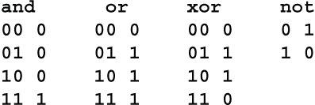

# 3 初步概念

本章涵盖

+   位和字节

+   函数和布尔运算符

+   素数和模算术

在我们深入主题之前，让我们先看一些初步概念。我会快速地介绍这些主题，因为如今许多这些想法甚至在低年级就开始教授。更多这些基本概念将在书中后面根据需要给出。

## 3.1 位和字节

数据以*位*的形式存储在计算机中，这是*二进制数字*的简称。一个位只是一个可以取值为 0 或 1 的数字。一个位可以以几种方式存储在计算机中。开关可以是打开或关闭的。磁铁的北极可以朝上或朝下。光可以是顺时针或逆时针极化的。电脉冲可以具有小幅度或大幅度。

这些二进制数字可以用来形成二进制数。以下是 3 位二进制数及其十进制等价物。这些 3 位数被称为*八进制*数，意味着它们是基数为 8 的数：

位也用于表示计算机逻辑中的*逻辑值*或*真值*。0 表示逻辑值*假*，1 表示逻辑值*真*。

一个字符，比如字母或数字，可以用一个 8 位二进制数表示，这被称为*字节*。术语*字节*是由 IBM 的 Werner Buchholz 在 1954 年创造的。由于每个位有 2 个可能的值，8 位可以表示 2⁸个不同的字符：也就是 2 的 8 次方，即 256。这足以表示 26 个小写字母、26 个大写字母、10 个十进制数字、33 个标点符号，如=和$，再加上一些控制字符，如制表符和换行符。

有几种方案可以表示额外的字符，比如西里尔字母Ж，阿拉伯字母س，甚至中文是，每个表意符号最多使用 4 个字节。这对我们来说并不相关。密码可以处理字符串而不考虑它们的含义。被加密的字节可能是表示某个中文表意符号的 4 个字节中的第三个是无关紧要的。

对于我们的目的，一个字节有 3 个身份：（1）它是一个包含 8 个逻辑真/假值的字符串；（2）它是一个 8 位二进制数，因此是一个介于 0 和 255 之间的整数，包括 0 和 255；（3）它是某个字符的表示，比如字母、数字、标点符号或表意符号的一部分。

## 3.2 函数和运算符

数学函数现在在小学阶段就开始教授，所以我相信我不需要解释这个概念，但建立一些符号和术语是有帮助的。一个函数接受一个或多个值，并产生另一个值作为结果。被接受的值称为函数的*输入*或*参数*，返回的值称为*输出*或*结果*。我们说你*应用*函数到参数上以产生结果。

一个函数可以用符号表示，例如+或字母。当使用符号时，它被称为*运算符*，因此+和×是运算符，参数被称为*操作数*。当函数有一个参数时，符号可以放在参数前面，如-5 或√9，或者在参数后面，如 5！（5 的阶乘，即 1×2×3×4×5 = 120）。如果有两个参数，符号就放在它们之间，如 3+4 或 6×7。当符号是一个字母时，参数被括在括号中，如 f(x)。函数由 f 表示，参数由 x 表示。如果有多个参数，则用逗号分隔，如 f(a，b，c)。一些关于计算机语言的书籍区分参数和参数，但这在这里并不重要。

## 3.3 布尔运算符

正如加法、减法、乘法等函数对数字进行操作一样，当位表示真值时，有几个函数对位进行操作。这些函数被称为*逻辑运算符*，或者为了英国数学家乔治·布尔而称之为*布尔运算符*。

如果 A 和 B 是真值，则逻辑函数**not**，**and**，**or**和**xor**定义如下：

**not** A 如果 A 为假，则为真，如果 A 为真，则为假。

如果 A 和 B 都为真，则 A **and** B 为真，否则为假。

如果 A 或 B 或两者都为真，则 A **or** B 为真，否则为假。

如果 A 或 B 中只有一个为真，则 A **xor** B 为真，否则为假。

换句话说，如果 A 为真且 B 为假，或者如果 B 为真且 A 为假，则 A **xor** B 为真。**xor**被称为*异或*运算符。它通常用符号⊕表示，里面有一个带加号的圆圈。**and**和**or**运算符通常用符号∧和∨表示。很容易记住哪个是哪个，因为**and**的符号∧看起来像一个没有横杠的大写 A。

这里是四个布尔函数的值的表格形式：

这四个运算符可以通过对应的位对操作来将单个位扩展为位字符串。如果 A 是 0011，表示逻辑值为 false,false,true,true，如果 B 是 0101，表示逻辑值为 false,true,false,true，则应用四个布尔运算符得到

异或运算符在密码学中被广泛使用。例如，一次性密码本的简单实现（见第十四章）是将消息的字节与密钥流的字节进行异或运算，如下所示：

## 3.4 数字进位制

在普通算术中，数字用十进制表示。这种表示法是印度人和阿拉伯人在 5 至 7 世纪之间发明的。因此十进制数字也称为*阿拉伯数字*。这个系统由比萨的列奥纳多（列奥纳多·皮萨诺）引入欧洲，他在他那个时代被称为斐波那契。

历史趣闻

在莱昂纳多的时代，大约 1175-1250 年，滑动块拼图是风靡一时的。 （有些人认为这个谜题与据说是由诺伊斯·查普曼（Noyes Chapman）于 1874 年发明的十五拼图相同。）公开竞赛并奖金丰厚。莱昂纳多在这个谜题上是一个天才。他每次都赢。他的竞争对手给了他一个嘲笑的名字“斐波那契”，意思是“笨蛋”，莱昂纳多接受了这个名字。斐波那契在整个意大利都出名了。当斐波那契在 1202 年写了他的*《计算之书》（Liber Abaci）*时，他想让人们知道其作者是著名的斐波那契。直接说出这样的话会显得自夸和不体面，所以在封面上他写着*Filius Bonacci*，这可以理解为“幸运之子”或“Bonacci 之子”。

后来的作者没有理解这个意图，并拒绝认为伟大的莱昂纳多·皮萨诺应该被称为“笨蛋”。他们猜测莱昂纳多的姓可能是 Bonacci。出于同样的原因，为了提醒他的读者他是著名的斐波那契，莱昂纳多在他的私人文集中有时会狡猾地称自己为莱昂纳多·博纳奇（Lucky Leonardo）。

随着时间的推移，人们忘记了数学谜题天才斐波那契的名字和声誉，直到 1836 年，当书籍爱好者和臭名昭著的书籍盗窃犯古古列尔莫·利布里（Guglielmo Libri）将碎片拼凑在一起，并领悟到*Filius* + *Bonacci* = *Fibonacci*。术语*斐波那契数*和*斐波那契数列*是由法国数学家爱德华·卢卡斯（Edouard Lucas）于 1870 年左右创造的。

好的，回到工作上。为了解释十进制数，我们使用*指数表示法*。指数意味着一个数字乘以自身指定的次数。例如，5³表示 5 乘以自身 3 次，即 5×5×5，等于 125。在指数表达式 B^E 中，读作“B 的 E 次方”，或简称“B 的 E 次方”，B 称为*底数*，E 称为*指数*。如果 N 是任何数字，则 N¹是 N 本身。按照惯例，除了 0 之外的任何数字 N⁰均为 1。术语 0⁰没有定义的值，因为对 0⁰进行不同的计算会得到不同的结果。

当我们写一个十进制或者十进制，即底数为 10 的数，比如 3456 时，它表示 3×1000+4×100+5×10+6×1。使用指数表示法，这等同于 3×10³+4×10²+5×10¹+6×10⁰。从右边开始，低位数字，即此处的 6，乘以 1，下一个数字，即 5，乘以 10，接下来的数字分别乘以 10²，然后是 10³，依此类推。如果有 50 位数，左边的高位数字将乘以 10⁴⁹。

在其他数制中也是一样的。例如，二进制系统使用基数 2。二进制数 11001 被计算为 1×2⁴+1×2³+0×2²+0×2¹+1×2⁰，即 16+8+0+0+1，等于 25。计算机工作中常用的一种数制是*十六进制*，或基数 16。十六进制中使用的数字是 0123456789ABCDEF，或 0123456789abcdef。我更喜欢使用大写字母 ABCDEF，因为这样所有的十六进制数字高度都一样，更容易阅读。十六进制数 9AB 被计算为 9×16²+10×16¹+11×16⁰，即 9×256+10×16+11，等于十进制表示的 2475。

数制在密码学中的一个用途是将文本转换为数字。将字母表的 26 个字母与 26 进制的数字自然地关联起来，如下所示：

单词**WORK**可以表示为数字 22×26³+14×26²+17×26+10，即 396,588。这个值可以像任何数字一样进行操作，例如加法、减法或乘法。

大数可以用指数表示法，也称为*科学*表示法，例如：1.23×10⁷。这是 1.23 与 10⁷的乘积，即 10,000,000，所以 1.23×10⁷是 12,300,000。这与将 1.23 移动小数点 7 位的操作相同。

## 3.5 素数

数字，特别是大于 1 的整数，被分类为*素数*或*合数*。如果一个数是两个较小的正整数的乘积，则称为合数；否则它是素数。最初的几个合数是 4 = 2×2，6 = 2×3，8 = 2×4 和 9 = 3×3。最初的几个素数是 2、3、5、7 和 11。数 1 既不是素数也不是合数。

素数的一个重要性质是任何数都可以唯一地写成素数的乘积（除了因子的顺序）。例如，由于 30 = 2×3×5，除了 2、3 或 5 之外的素数都不能整除 30。这里的 2、3 和 5 被称为 30 的*素数因子*。任何整数的素数因子集合是唯一的。确定整数的素数因子称为*因数分解*或*因式分解*。

如果两个整数 A 和 B 没有共同的素数因子，则它们被称为*互质*或*互素*。例如，20 和 27 是互质的。如果 N 是一个整数，则 N 和 1 总是互质，而 N 和 0 只有当 N = 1 时互质。N 和 N+1 总是互质。

使用正整数时，当任何数 A 被另一个称为*除数*的数 B 除时，结果是一个*商*和一个*余数*。称商为 Q，余数为 R。然后 Q 被定义为最大的整数，使得 QB 不超过 A。余数指示剩余的量，即 R = A-QB。注意 0 ≤ R < N。例如，假设 A 是 40，B 是 11。不超过 40 的 11 的最大倍数是 33，因此商是 3，因为 3×11 = 33。余数是 7，因为 40-33 = 7。

## 3.6 模算术

残余的研究被称为*模运算*。模运算由哥廷根大学的数学家卡尔·弗里德里希·高斯于 1801 年引入。在模运算中，商被忽略，除数称为*模数*，余数称为*剩余*。在前面的例子中，模数是 11，剩余是 7。如果模数是 N，而两个数字 X 和 Y 有相同的剩余，我们说 X 和 Y 在模 N 下是*同余的*，或者等价地说，X 和 Y 在模 N 下属于同一个*剩余类*。这表示为 X≡Y (mod N)。例如，40≡7 (mod 11)，因此 40 和 7 在模 11 下属于同一个剩余类。只要 X-Y 是 N 的倍数，或者等价地，只要 X = Y+aN 对某个整数 a 成立，X 和 Y 就在模 N 下是同余的。

剩余类遵循与普通整数相同的算术规则，例如

我们将-a 称为*a 的加法逆元*。记号 a-b 可以被看作 a+(-b)的简写。

*乘法逆元*的情况更为复杂。同余方程 ax≡b (mod N)有 3 种情况需要考虑：(1) 当 a 和 N 互质时，(2) 当 a 和 N 有一个不整除 b 的公因数 d 时，以及(3) 当 a、b 和 N 都能被公因数 d 整除时。

1.  假设 a 和 N 互素。那么存在唯一的剩余 a'，它是模 N 的乘法逆元，使得 aa'≡1 (mod N)且 a'a≡1 (mod N)。如果 a'存在，那么同余方程 ax≡b (mod N)可以轻松求解为 x≡a'b (mod N)。在第 15.3.2 节中，我介绍了当 N 很大时计算 a'的高效方法。

1.  如果 a 和 N 有一个大于 1 的公因数 d，则 a 在模 N 下没有乘法逆元。就是说不存在一个 a'使得 aa'≡1 (mod N)。如果 b 不能被 d 整除，则同余方程 ax≡b (mod N)没有解。例如，4x≡5 (mod 12)没有解。

1.  假设 d 是 a 和 N 的最大公约数，记为 gcd(a,N)。也就是说，d 是能够同时整除 a 和 N 的最大整数。如果 a、b 和 N 都能被 d 整除，则可以通过将 a、b 和 N 除以 d 来简化同余方程，即(a/d)x≡(b/d) (mod N/d)。

让我们看一个例子。考虑同余方程 8x≡4 (mod 12)。通过除以 4 得到简化的同余方程 2x≡1 (mod 3)。这个同余方程的解为 x≡2 (mod 3)，意味着 x 可以是任何形式为 3n+2 的整数。回到原始同余方程，x 是模 12 的一个剩余，因此 x 必须在 0 到 11 的范围内。落在此范围内的形式为 3n+2 的数字是 2、5、8 和 11。这意味着 x 可以有值 2、5、8 或 11。因此，同余方程 8x≡4 (mod 12)有 4 个解。

在本书的后文中，**mod**被用作算术运算符。表达式 x mod y，其中 x 是整数，y 是正整数，表示 x 除以 y 的余数。因此 27 mod 3 是 0，27 mod 4 是 3，27 mod 5 是 2。
