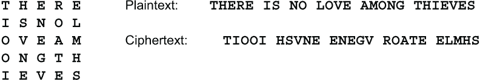

# 第四章：密码学家的工具箱

本章涵盖

+   用于密码的评级系统

+   替换密码

+   置换密码

+   分数化，将字母分解为更小的单元

+   伪随机数生成器

秘钥密码是由几个基本元素构建的。您可以将这些视为行业工具。要构建一个强大的密码，您希望在工具箱中拥有所有这些工具。这并不意味着您应该在每个密码中使用每个元素。这可能会导致过度复杂化而没有安全性的改善。您的密码会变得更慢，但没有任何额外的好处。本章涵盖了替换、置换、分数化和随机数等工具。我在第十章介绍了其他工具，如文本压缩，第十一章介绍了块链。

在讨论元素之前，让我们谈谈强度。密码的强度以比特为单位衡量。每个比特代表一个二进制选择。如果有一个密码，每个密文只能代表两种可能的明文之一，那么该密码的强度将为 1 比特。例如，

0 = 我们输了。

1 = 我们赢了。

密钥的大小是确定密码强度的限制因素。如果一个密码使用 64 位密钥，那么它的强度最多可以达到 64 位，但如果密码弱，则强度可能会更低。

## 4.1 评级系统

为了让您对本书中描述的密码的强度有一个大致了解，我使用了一个从一到十的评级标准。这些是我个人的评级，基于我的经验和我对使用我所知道的最佳技术来破解密码所需的努力以及密码之间以及与历史密码的比较，无论是实际上被破解还是未被破解。我在每个评级前面的部分中给出了大部分分析：

+   One 表示一个初学者可以仅使用纸和铅笔以及适度的努力来破解的密码。

+   Two 表示一个经验丰富的业余爱好者可以仅使用纸和铅笔破解的密码。

+   Three 是一个熟练的业余密码学家可以用手工方法破解的密码。

+   Four 或 Five 意味着需要计算机、训练有素的密码学家或两者兼而有之。

+   从六到九表示专家对手需要多少计算能力。

+   Ten 表示一个密码可以抵抗拥有大量训练有素的密码学家和当今最大超级计算机的国家加密机构。

有时我会超出这个范围。零表示该密码可以在不需要纸和铅笔的情况下理解，例如 Pig Latin 或 **GNITIRW** **EHT** **SDROW** **SDRAWKCAB**。十一的评级意味着该密码将能够抵御未来潜在的比我们目前构想的量子计算机或超级计算机更强大得多的超级计算机。

通过查看我对不同密码的评价，您可以了解如何评价您在其他地方看到的或您自己可能发明的密码的要点。每个评分只是一个估计，而不是强度的保证。保证来自于执行第十二章中描述的分析。

## 4.2 替代

密码学家工具箱中的第一个工具是替代。在文本中，一个单位被另一个单位替换。明文单位可以是单个字母、字母对或更长的块。密文单位可以是字母、字母块、数字块或字母数字组合。当所有单位都是单个字母时，该密码称为*简单替换*或*单字母替代*。在计算机密码学中，单位可以是位、字节或任意长度的位或字节块。本节给出了一个快速的预览。在第 5 和第六章中有一个全面的讨论。

已知的最古老的替代密码之一是*凯撒密码*，由尤利乌斯·凯撒使用并可能发明，其中字母表中的每个字母都被替换为后面第 3 个位置的字母。在现代使用中，这个数字可能是之前或之后的任何固定数字。凯撒密码被评为 One。

并非所有明文单位都要求具有相同的长度。假设密码采用字母表的字母并替换为 2 位数字对。字母表只有 26 个字母，但是 100 个可能的数字对。这意味着密码学家可以使用其他 74 对数字来进行其他用途。一个已经使用了数百年的方法是提供常见字母对的替代，例如 TH、ER、ON、AS 和 NT，以及可能的短词，如 THE 和 AND，除了单个字母。然后，明文单位将是 1、2 或 3 个字母长。这使得数字对的频率更加均匀。由于字母频率的差异可以用于解密密码，使频率更加均匀可以使密码更加强大。

另一种方法是使用额外的对提供某些常见字母的附加替代。这称为*同音*替代。例如，您可以为 E 提供 10 个替代品，为 T 提供 8 个替代品，依此类推。给定字母的多个替代称为*同音字*。这类似于同音字 F 和 PH 在英语中代表相同的音素的方式。提供多个替代品使得 100 个数字对的频率更加均匀。当然，字母对和同音替代两种方法可以结合起来，以获得更加均匀的数字对频率。换句话说，这些方法防止对手使用频率分析。

### 4.2.1 霍夫曼编码

在计算机环境中，密文单元可以是比特串。 一个很好的例子是*哈夫曼编码*，由 David A. Huffman 在 1952 年在麻省理工学院时开发。 我不会涵盖优化代码集的方法，我只会给出一般概念，作为可变长度二进制代码的示例。 在哈夫曼编码中，最常见的字母获得短代码，而较少见的字母获得长代码，基于底层字母频率表。 因此，需要更少的位来表达消息。 这被称为*文本压缩*。 在第 10.7 节中甚至有更强大的文本压缩方法。

英语中最常见的字母是 E 和 T，每个字母大约出现 1/8 的时间。 由于 8 = 2³，我们使用 3 位来表示 E 和 T。 我们可以任意选择任何 3 位值，比如 E = 100 和 T = 111。 我称这种方法为*混合哈夫曼*。 接下来最常见的是 A，O，I，N，S，R，H。 每个字母大约每 16 次出现一次，因此我们为每个字母使用 4 位。 我们可以使用任何 4 位代码，除了以 100 或 111 开头的代码，因为这些代码已经被使用。 下一组字母是 D，L，U，C，M，F，Y，每个字母大约每 32 次出现一次，因此需要 5 位代码。 依此类推。

这是我根据 15 万个英文文本字母计数创建的一组混合哈夫曼代码。 其他语言有所不同。 哈夫曼代码具有*前缀属性*，即没有代码是任何更长代码的前缀。 例如，如果 ABCD 是一个代码，那么对于任何二进制数字 A，B，C，D，E，ABCD 都不能是代码。 前缀属性最早由数学家埃米尔·莱昂·波斯特在 1920 年描述。

使用这些代码组，单词 STYLE 将被编码为**0110** **111** **11011** **01000** **100**。 将这些重新编写为 4 位组得到**0110** **1111** **1011** **0100** **0100**，这是十六进制**6FB44**。

尽管对于艾米莉，桑德拉的敌人，来说，要识别密文中每个字母的代码组几乎是不可能的，但艾米莉可以搜索更长的重复比特串。 这些将代表常见的字母对，称为*双字母组*，字母三元组，称为*三字母组*，或单词。 例如，任何给定的 10 位比特串应该大约每 2¹⁰，或 1024 次出现一次。 如果一个 10 位比特串在 1024 个字符串中出现 20 次或更多次，那么它几乎肯定代表单词 THE，这是英语中最常见的单词。 如果你在文本中识别出单词 THE，那么你可以寻找类似 THERE 或 THESE 的扩展，因为 E 的重复很容易发现。 混合哈夫曼评为三级。

## 4.3 转位

第二个主要的加密工具是转位，改变消息中字符的顺序。 最简单的方法是*路由转位*。 消息的字母按一定顺序写入���格中，然后按不同的顺序读取。 本节只是一个快速的概述。 全面讨论在第七章中。

例如，消息 THERE IS NO LOVE AMONG THIEVES，有 25 个字母，从左到右跨行写入到这个 5×5 网格中，并且从上到下跨列读出。在这个网格中，从上到下读取时，最左边的一列是**TIOOI**。

将字母写入网格和从网格中读出字母的常见路径包括直接穿过行，要么向左要么向右，直接向上或向下列，交替向左和向右穿过行，交替向上和向下列，对角线从任何角开始，交替方向对角线，或者顺时针或逆时针螺旋，要么向内要么向外。路由置换密码评定为 One。

## 4.4 分数化

分数化是将字符分割成较小单位。我们已经看到一种方式，将字符表示为二进制数。该二进制数的每一位可以作为一个单独的单位进行操作，替换或转置。本节介绍了分数化。第九章和第十章有详细讨论。

表示字母为两位数字的古典方式是*Polybius Square*，由希腊历史学家波利比乌斯在公元前二世纪发明。这是一个使用关键字 SAMPLE 的 5×5 方格。请注意，字母 I 和 J 共享一个单元格，以便将 26 个字母的字母表适合到 25 个单元格的网格中。

由于 A 在第 2 行第 3 列，它由 23 表示。B 是 33，C 是 34，依此类推，通过 Z 由 21 表示。I 和 J 都由 44 表示。然后可以以各种方式进行替换、转置和重新分组这些数字。可以使用这个网格或另一个按不同混合顺序排列的 Polybius 方格将数字对转换为字母。

现代版本将每个字符替换为其 ASCII 或 UTF-8 代码中的十六进制表示。因此 A = 41，B = 42，C = 43，一直到 Z = 5A。这些十六进制数字可以类似地被替换、转置、重新分组并重新转换为字节。

一个有趣的例子是*M. E. Ohaver*在 1910 年发明的*分数化摩尔斯*。Ohaver 总是使用 M.E.，因为他不喜欢自己的名字，这个名字是 Merle。

历史注解

在克雷格·鲍尔的《秘密历史：密码学故事》第 241 页的脚注中提到，M.E. Ohaver 是多产的低俗小说作家肯德尔·福斯特·克罗森的化名之一。这是不正确的。克罗森有时使用希伯来语的 *mechaber*，מחבר，意思是 *作者*，的化名 M.E. Chaber。

在分数化摩尔斯中，字母按固定大小的组，比如 7，被替换为它们的摩尔斯代码等效项，使用/作为字母分隔符。然后，代码组的长度被反转，调整大小后的组被转换回字母。

摩尔斯电码是由阿尔弗雷德·维尔于 1840 年发明的，以他的雇主塞缪尔·F·B·摩尔斯的名字命名。

这种密码有几个明显的弱点。因为它使用标准的摩尔斯字母表，所以唯一的密钥是字母组的长度，这只需要几次尝试就能猜到。明文字母经常被它们自己替换。有 30 个不同的摩尔斯代码组，但只有 26 个字母，所以需要 4 个额外的字符。奥哈弗使用了日耳曼语的ä、ë、ö和ü。分数化摩尔斯评级为一级。

这些问题可以通过两个变化来部分修复：(1) 仅使用长度为 1、3 和 4 的摩尔斯组。有 26 个这样的组，完全符合 26 个字母的字母表。(2) 打乱字母表的顺序，或者等价地打乱摩尔斯代码组的顺序。我称这个增强版为*FR-Actionated Morse*。例如，使用关键词 MIXEDALPHBT 来混合字母表，摩尔斯组按标准顺序排列，你会得到

即使有了这些改进，FR-Actionated Morse 的评级仍然只有二级。

## 4.5 随机数生成器

随机数生成器可以是任何在给定范围内产生数字序列的东西。数字可以是单个位、8 位字节、十进制数字，或者是任何其他所需范围内的数字。例如，范围在 0 到 25 之间的数字，对应于 26 个字母表中的字母，对某些加密目的是有用的。本节介绍了该主题。完整的讨论在第十三章中。

重要的是要认识到“随机数”这种东西是不存在的。你不能说 51 是一个随机数，而 52 不是，反之亦然。但是，你可以说序列 51，52，53，54，...不是随机的。那个序列是完全可预测的。随机性是序列或生成器的属性，而不是序列中的个别数字的属性。说“一系列随机数”比说“随机数序列”更准确。

生成器可能是一种物理过程，比如宇宙射线、盖革计数器的嗒嗒声、计算机按键的精确时间、风中飘扬的旗帜、海浪拍打的水花或者人们赶着赶火车的景象。大多数物理来源都不够快以用于加密目的，但数字序列可能会被存储在计算机文件中以供日后使用。

生成器也可以是一个数学函数或计算机程序，在每次调用时产生一个数字。由数学算法产生的随机数被称为*伪随机*数，以区别于*真随机*数。它们被认为比真随机数弱，因为确定随机序列的一部分的对手可能能够计算出前后的数字，从而读取消息。真随机数永远不能由数学函数产生。在第 13.8 节中，我展示了生成密码安全的伪随机数序列的方法，设计用于防止对手扩展序列的部分。

伪随机序列和真随机序列之间的一个关键区别是，伪随机序列最终会重复，而真随机序列永远不会重复。序列在重复之前的项数称为其*周期*。例如，序列 3,1,9,2,4,3,1,9,2,4,3,1,9,2,4,...的周期为 5，以下划线标出。一般来说，周期越长，密码越强。

仅仅因为一串数字是随机的，并不意味着这些数字是等概率的。例如，假设你观察到穿过繁忙桥梁的汽车的颜色。颜色是随机的，但某些颜色比其他颜色更常见。白色、黑色、银色和红色比橙色、紫红色或嫩黄色要常见得多。同样，在 crap 游戏中，如果骰子是公平的，那么每次掷骰子都是随机的，然而掷出 7 的可能性是掷出 12 的六倍。

在第 13.14.1 节和第 13.14.2 节中，我讨论了如何“收获”这种序列中的随机性，以获得数字具有基本相等概率的序列。从现在开始，我将假定任何随机数生成器都产生具有相等概率的数字。这被称为*均匀分布*或*等概率分布*。通过一个良好的随机数生成器，生成的数字对、三元组等也将具有均匀的概率，甚至可能达到八元组或更多。

### 4.5.1 链数字生成器

让我用纸和铅笔轻松完成的样本伪随机数生成器来结束这一节。不需要电脑。我们将其称为*链数字生成器*。首先写下任意 7 位的十进制数。这 7 位数字称为*种子*，或*初始值*，或*初始化向量*。它们可以被视为任何使用此生成器的密码的密钥，或密钥的一部分。要获得第一个伪随机数字，只需将第一个数字和最后一个数字相加。将这个新数字添加到序列中，并将第一个数字涂黑。所以，从 3920516 开始，我们将 3+6 加起来得到 9。

任何时候，如果总和超过 9，我们就去掉十位数。也就是说，加法是模 10 的。这有时被称为*不进位加法*。要获得第二个伪随机数字，我们重复这个过程。这里 9+9 得到 18。我们去掉十位数得到 8。

这个过程可以重复，以获得所需的伪随机十进制数字。 

结果得到的伪随机序列是**9800562199940232...**。

注意，如果种子中的所有数字都是偶数，则生成的所有数字都将是偶数。同样，如果所有数字都可被 5 整除，即为 0 或 5，则生成的所有数字都将是 5 的倍数。在这种情况下，周期最多只能为 128，因为种子中有 7 个数字，而且只有 2⁷ = 128 种 0 和 5 的组合。由于这种种子无法产生长周期，因此它们被称为*不合格的*。对于链式数字生成器，*合格的*种子必须至少包含一个奇数数字和一个不是 5 的倍数的数字。例如，2222225 是合格的种子，但 2222222 和 5555555 不合格。使用合格的 7 位数字种子，周期将始终为 2,480,437。

这个生成器具有自制伪随机数生成器的典型行为。有 10⁷个可能的 7 位数字种子。如果你从任意种子开始，生成器将循环一些数字序列，直到再次产生该种子，因此 7 位数字的集合被分割成几个离散的周期，每个周期都有自己的周期。如果选择一个合格的种子，那么周期将始终具有最大可能的 2,480,437 个数字的周期。这种长度有 4 个单独的周期，再加上一些由不合格种子产生的远比这个短的周期。

对于其他大小的种子，行为类似。即使最大周期非常短，也经常有很高的概率获得最大周期，因为可能有许多最大周期。此表显示使用合格种子获得给定长度周期的概率： 

| **数字** | **周期** | **概率** |
| --- | --- | --- |
| 4 | 1,560 | 100% |
| 5 | 168 | 86.7% |
| 6 | 196,812 | 99.974% |
| 7 | 2,480,437 | 100% |
| 8 | 15,624 | 98.817% |
| 9 | 28,515,260 | 79.999% |
| 至少 2,851,526 | 99.9988% |
| 10 | 1,736,327,236 | 86.9% |
| 至少 248,046,748 | 99.31% |
| 至少 13,671,868 | 100% |

表格显示，5 位和 8 位数字种子长度不安全。它们产生了大量非常短的周期。7 位和 10 位数字种子长度最好，因为你总是保证有一个长周期。

这个随机数生成器严格来说只是一个演示模型，只是展示了使用简单手工方法可以实现什么。它不适用于高安全性工作。

## 4.6 有用的组合，浪费的组合

本章的 4 种基本技术可以以无数种方式组合，我将在本书的剩余部分中进行探讨。然而，首先要认识到并非每种组合都是有益的。一些组合会增加工作量而不增加强度。

考虑一种一些初学者尝试的想法。他们对一条消息进行简单替换，然后对结果文本进行第二次简单替换，然后第三次，依此类推，进行 5、10，甚至 100 轮。这是一种浪费精力的做法。进行两次简单替换与进行一次相同，但使用不同的混合字母表，因此进行多次简单替换不会增加任何强度。这里有一个例证。两次替换使用了关键字 FIRST 和 SECOND。第三次替换等同于先进行第一次替换，然后进行第二次替换。

让我们来看一个例子。如果我们使用第一个替换对**EXAMPLE**进行加密，结果是**IUXEJDI**。如果**IUXEJDI**使用第二个替换进行加密，结果是**CLQYOXC**。你可以自行验证，使用等效替换对**EXAMPLE**进行加密会得到**CLQYOXC**。

进行一次加密，然后再进行第二次加密被称为*组合*这两次加密。前面的例子表明，组合两个简单的替换只会产生另一个简单的替换。如果第一个加密使用了代码，那么在代码后面跟着一个密码被称为*超加密*。最常见的超加密形式是非进位加法，或者模 10 加法，其工作原理如下：

### 4.6.1 巴泽里 4 型密码

让我们看看相反的情况。让我们看一个使用替换步骤后跟着一个非常简单的置换产生了更强大密码的密码。

这种密码是由才华横溢、易怒且辱骂性的法国密码学家埃蒂安·巴泽里于 1898 年提出的。我不知道巴泽里给这种密码起了什么名字。我称之为*Bazeries Type 4*，因为这是他在 1890 年代向外交密码局提出的 4 种密码中的最后一种。这种密码可以很容易地手工完成。

巴泽里 4 型密码由一个简单的替换后跟着一个简单的置换组成，我称之为*逐段反转*。置换根据一个由小整数序列组成的密钥，对文本的短片段进行反转。这里有一个使用关键字 BAZERIS 混合替换字母表，以及关键字 4,2,3 进行置换的示例。

这种置换可以用来加强许多不同类型的密码，因此它值得拥有自己的名称。让我们称之为*逐段反转*。你可以通过混合一些正常顺序的文本段来加强这种置换，也许可以使用数值密钥中的负数。这里有一个使用数值密钥 3, 4, -3, 2 的示例。请注意，这个密钥等同于 3, 4, 1, 1, 1, 2。

密码学家们在密码局无法解决巴泽里斯提供的任何样本消息。尽管付出了相当大的努力，这些消息仍然在 40 年内未解决，直到著名建筑师和业余密码学家罗萨里奥·卡德拉解决了它们，并写了一本关于他是如何做到的书（*巴泽里斯指挥官的军事密码*，卡尔丹纳斯出版社：纽约，1938 年）。

然而，卡德拉无法直接解密这些消息。相反，他确定并利用了巴泽里斯从密钥生成替换字母表的方式中存在的弱点。如果巴泽里斯使用了更强大的方法来混合密码字母表，卡德拉就无法解密这些消息。因此，使用混合良好的字母表的巴泽里斯 4 型被评为五级。将两种分别评为一级的方法结合起来是相当不错的。

历史小贴士

卡德拉是哥伦比亚建筑学院的毕业生，所以他计划在哥伦比亚大学出版他的书。威廉·F·弗里德曼，当时是美国密码学家的院长，得知此事后，秘密阻止了出版。这再次证明了巴泽里斯 4 型密码的强大。
