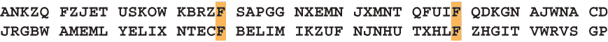
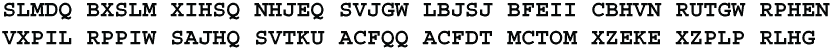
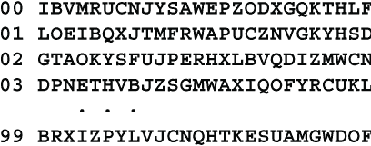

# 5 替换密码

本章包括

+   简单替换和多字母替换密码

+   使用 Kasiski 检测和重合指数解决多字母替换密码

+   自密钥和流动密钥密码以及解决它们的方法

+   模拟转子密码机

我们现在已经准备好更深入地探讨上一章描述的基本工具。在我开始描述所有不同的密码之前，让我明确陈述一下这些密码试图实现的目标。荷兰语言学家和博学家奥古斯特·克尔克霍夫斯（Auguste Kerckhoffs）首次在 1883 年的《军事科学杂志》上发表了这些原则的一对文章：

1.  即使在理论上不可破解，密码在实践中也应该是无法破解的。

1.  即使敌人了解了系统，这也应该成立。

1.  密钥应该容易记忆（无需笔记）且易于更改。

1.  应该能够通过电报传输加密的消息。

1.  仪器和文件应该方便一个人携带和操作。

1.  密码应该易于使用；不应有复杂的规则或计算。

规则 4 可能会更新为“数字方式传输加密的消息”。否则，这些原则今天仍然像 1883 年一样有效。

第二个原则的一个推论是，密码的强度应该完全取决于密钥。克尔克霍夫斯还相信*只有密码学家有资格评判密码的安全性*。太多时候，选择使用哪种密码的决定是由缺乏密码学专业知识的政府官员做出的，有时会造成灾难性的后果。

## 5.1 简单替换

*简单* *替换*，也称为*单字母替换*，是你在报纸和杂志的谜题部分看到的熟悉类型的密码。在简单替换中，消息中的每个字母都被另一个字母一致且均匀地替换。因此，如果字母 M 在一个地方被 T 替换，那么消息中的每个 M 都将被 T 替换，而密码文中的每个 T 将表示一个 M。

由于大多数人熟悉解决简单替换密码的技巧，我只会简单提一下：字母频率、首字母频率、末字母频率、双字母频率、字母对频率、短单词、常见前缀和后缀、元音和辅音的分布、模式单词以及利用标点符号。

对于报纸中的简单密码，通常只需要查看短单词。如果你发现 AB 和 CBA，这些单词可能是 TO 和 NOT，而 AB 和 BAC 最常见是 OF 和 FOR。模式 ABCA 很可能是 THAT，ABCDC 暗示着 THERE，而 ABCDB 可能是 WHICH。如果你在互联网上搜索，你可能会找到出售模式单词列表的网站，或者会根据你提供的模式找到匹配的单词的网站。

对于更难的密码，像 **FOXY PIXY MANX AXED TOXIC LUXURY ONYX SPHINX** 这样的文本，需要更有组织的方法。

我将使用以下样本密码演示该过程。已知语言为英语。文本有 73 个字母和 11 个单词，平均每个单词长度为 6.64 个字母，而正常的英语为 5.0 个字母。缺少少于 5 个字母的短单词以及缺少模式单词表明这个密码已经被故意构造得很困难。

第一阶段是识别元音和辅音。首先计算每个字母的出现次数以获得*频率计数*。在样本密码中，A 的字母计数为 0，B 为 3，C 为 3，以此类推。完整的频率计数如下：

注意这里只有两个高频字母，**L** 和 **S**，出现的频率分别为 8 和 7。在正常的英文文本中，元音字母占 40%。这个百分比很稳定，即使字母频率被故意操纵也通常保持不变。在这个密码中有 73 个字母，应该有 29 个元音。这几乎要求 **L** 和 **S** 都代表元音，除非频率被严重扭曲。

接下来，你需要制作一个联系表格，将字母垂直地列在页面的中心。在密码中出现的每个不同的字母都有自己的行。在每一行上，出现在中心字母之前的每个字母都列在其左侧，而出现在中心字母之后的每个字母都列在其右侧。例如，表格的第一行，**EO B DWZ**，表示在密码中字母 **B** 分别被 **E** 和 **O** 前导一次，分别被 **D**、**W** 和 **Z** 后导一次。以下是这个密码的完整联系表格（为节省空间显示为 3 列）。

联系表格用于识别元音和辅音。一般来说，元音与左右两侧的字母有广泛的联系，而辅音则往往与有限数量的不同字母有联系。从联系表格中我们可以确定 4 个可能的元音，**L**、**Q**、**S** 和 **V**，以及 4 个可能的辅音，**E**、**O**、**R** 和 **U**。让我们用 **°** 标记这些元音字母，用 **˟** 标记这些辅音字母，并看看分布是否合理。

在第 3 个单词**EYXDO**、第 7 个单词**KIGXG**和第 8 个单词**YIWZ**中都有 3 个长的没有元音的字母串。这表明**I**和/或**X**可能是元音。虽然它们都有很多不同的接触点，但**X**代表元音的可能性极小，因为那样的话第 11 个单词将以 3 个元音字母开头并以元音结尾。这在英语中很罕见。我找到的唯一例子是 OUIJA。（**SQXMV**不能是 AIOLI，因为 I 重复了。）因此，**I**很可能是元音，而**X**是辅音。

让我们再次尝试区分元音和辅音。在密码中有 5 对暂定元音，**VL**、**VS**、**VQ**、**QL**和**SQ**。在英语中，双元音并不常见，因此很可能**V**或**Q**实际上是辅音。很可能不是**Q**，因为那样的话第 10 个单词将以 5 个辅音结尾。我知道的唯一这样的 6 个字母单词是 ANGSTS。

让我们将**I**作为元音，将**V**和**X**作为辅音，看看我们的情况如何。

看起来是正确的。从第 3 个单词中，我们现在可以确定**D**是元音，从第 11 个单词中，**M**很可能是元音。现在所有 6 个元音都已找到，所以其他每个字母必须是辅音。以下是辅音和元音的完整分布。

第二阶段是识别单个字母。以下字母接触表显示了英语字母的接触特征。不同的语言会有不同的特征。例如，字母 M、V 和 Z 通常都是前导和后跟元音，而字母 N 通常是前导元音，但后跟辅音。我使用古腾堡计划的英语语料库编制了这个表。

在密码中，有一个很好的 H 明文候选者，即密文**U**。然而，**U**在以 US 结尾的双字母组中出现两次，因此这是不太可能的。

在密码中，有两个强有力的 N 候选者，即密文**E**和**O**。**E**和**O**都代表总是由元音前导和辅音后跟的辅音。然而，**O**是更强的选择，因为它的频率更高，并且因为它在单词**ZLORUS**中的两个已知辅音之前。在英语中，3 个辅音组合通常以 N 开头，例如**NST**和**NTH**。更有可能**O**代表 N。这产生了

现在可以尝试找到符合某些模式的可能单词。我找到了 67 个符合**ZLORUS** **˟°N˟˟°**的单词。其中 32 个以 E 结尾，27 个以 Y 结尾。我找到了 37 个符合**SQXMV** **°°˟°˟**且不包含 N 的单词。其中 15 个以 Y 开头，但只有 1 个以 E 开头。因此，密文**S**最有可能代表明文 Y。这给了我们

密文单词 **IVQOR** 和 **ZLORUS** 都包含双字母 **OR**。让我们试着识别一下。知道 **IVQOR** **°˟°N˟** 不含有 Y，剩下的有可能的单词只有 24 个。其中，有 12 个以 G 结尾，有 8 个以 S 结尾，因此密文 **OR** 可能是 NG 或者 NS。现在，对于 **ZLORUS** **˟°N˟˟Y** 的可能明文单词减少到了 26 个。在这些中，第四个字母是 G 的有 8 次，是 T 的有 6 次，但是只有 1 次是 S。因此，密文 **OR** 最可能的选择是明文 NG。现在我们有了

对于第一个单词 **RULEYS** 有 8 种可能性。这些只包含双字母 **UL** 的 6 种可能性。对于这些选择中的每一个，让我们来看看单词 **ZLORUS** 的可能性。

选择 **ZLORUS** = JUNGLY 可以立即被排除，因为 **KSYIWZ** 将呈现出 **˟Y˟°˟J** 的形式。在英语中没有这样的单词。这意味着 **RULEYS** 表示 GRUMPY，**ZLORUS** 表示 HUNGRY。填入这些新字母后得到

其余的字母可以凭眼识别填入。现在显然第二个单词是 PUDGY，第三个单词是 BUMPKIN，这使得第八个单词成为 BYPATH，等等。

完成的密码读起来是 GRUMPY PUDGY BUMPKIN CLUMSILY STUMBLED ALONG BACKCOUNTRY BYPATH，HUNGRY UNSHOD YOKEL。

简单替换被评为 One。当字母频率和接触频率被故意扭曲时，就像这个例子一样，评级可以达到 Two 或可能 Three。这是一个很好的谜题，但对于一般通信是无用的。

## 5.2 混合字母表

简单替换需要一个混合字母表。有几种传统的纸笔方法可以做到这一点。获得混合字母表的一种方法是使用一个关键词。在最简单的情况下，您只需从某个位置开始写入关键词，然后在其后填入剩余的字母，根据需要进行环绕。剩余的字母可以向前或向后填写。以下是三个示例：

这种方法最早由 Argenti 家族使用，他们是约 1600 年教皇和主教的密码秘书。这些字母表混合得不太好。一种稍微好一些的方法是使用两个关键词，就像这样：

列混合

将字母写入一个块中。将关键词写在顶行，其余的字母写在需要的行数中。较长的关键词可以提供更好的混合效果。然后从块中读出字母，沿着列向下读取。在这个例子中，关键词 SAMPLE 已经写在顶行。第一列向下读取是 **SBIRY**，第二列是 **ACJTZ**，依此类推。如果愿意，可以交替地沿着列向上和向下读取，或者使用其他路径。

SkipMix

在我上高中的时候，我发明了另一种适合纸笔密码学的方法，我称之为*SkipMix*。它使用一串称为*跳数*的小数字作为混合字母表的密钥，例如 3, 1, 4。从标准字母表开始。跳过 3 个字母并取下一个字母，即为 D。

删除该字母，然后跳过 1 个字母并取下一个字母，即为 F。

删除该字母，然后跳过 4 个字母并取下一个字母，即为 K。

然后重复 3,1,4 的循环。跳过 3 个字母并取下一个字母，即为 O。

继续重复键数的循环，直到选择了所有 26 个字母。生成的混合字母表是

SkipMix 可以与关键词一起使用。假设关键词是 SAMPLE。将每个字母替换为它在字母表中的位置，即 19,1,13,16,12,5。可选地，将任何 2 位数替换为其各位数字，即 1,9,1,1,3,1,6,1,2,5。使用这串跳数作为混合密钥。注意，0 是一个有效的值。

SkipMix 非常适合计算机使用。在这种情况下，字母表是 256 个不同的 8 位字符代码。跳数可以是从 0 到 255 的任何整数。数字密钥仍然可以由关键词派生而来。使用关键词而不仅仅是一串整数的优点是人们更容易记住和准确输入。再次假设关键词是 SAMPLE。这些字母在 ASCII 码中的数值等价于 83, 65, 77, 80, 76 和 69。这些值落在从 65 到 90 的窄范围内，这导致混合程度较低。为了将字母代码分散到更广泛的范围内，它们可以乘以某个常数值模 256。乘数可以是介于 7 到 39 之间的任何奇数。例如，关键词 SAMPLE 的 ASCII 码乘以 17 模 256 的结果是 131, 81, 29, 80, 12 和 149。这覆盖了一个范围为 149-12 = 137 的范围，远比原始范围 83-65 = 18 要宽。

跳数仍然只有 26 个可能的值。获得更大的值集合的一种方法是将相邻的数字进行模 256 的乘法。然后，跳数序列为 83×65, 65×77, 77×80, 80×76, 76×69 和 69×83，全部取模 256。因此，83×65 = 5395≡19 (mod 256)。数字密钥变为 19, 141, 16, 192, 124, 95，覆盖了范围 192-16 = 176。

产生更大的跳数集合的另一种方法是将关键词的第一个字母乘以 7，第二个字母乘以 9，第三个字母乘以 11，依此类推，所有乘法都在模 256 下进行。

由于将关键词转换为数字密钥将由计算机而不是人类操作员完成，因此可以使用任意复杂的计算。我建议使用二次函数而不是线性函数，以使对手在获得一些消息的明文后更难推断关键词。例如，如果 N[i]是数字密钥的项，K[i]是关键词中字符的数字值，则一个合适的函数可能是

当下标超过关键词的长度时会循环。例如，如果关键词有 10 个字符，则 K[11]会循环到 K[1]，K[12]会循环到 K[2]，依此类推。

*****函数 K[i]K[i+1]+K[i+2]K[i+3]的强度不会那么强。如果关键词的长度为 L，则只会有 L 个不同的二次项。艾米莉可以将这些视为 L 个变量，并解出一组 L 个线性方程以找到 L 个乘积 K[1]K[2]，K[2]K[3]，K[3]K[4]，... K[L]K[1]的值。然后很容易找到各个 K[i]的值。******

在本书中，我展示了字母表与简单关键词混合在一起，这样您可以一目了然地看到它们是如何形成的，例如，字母表

**样本 BCDFGHIJKNOQRTUVWXYZ**

这非常薄弱。*实践中不要这样做*。我在这里这样做是为了帮助读者。由于您不希望帮助您的对手，始终使用混合良好的字母表，使用列混合、SkipMix 或其他强大的混合功能。有关其他方法，请参见第 12.3.8 节。

## 5.3 代号书

从 15 世纪到 18 世纪，替代密码的国王是*代号书*，被国王、教皇、外交官和间谍们广泛使用。每个代号书都有数百甚至数千个项目的列表，单个字母、数字、双字母、音节、单词和名称，为每个提供多达 25 个替代品。代号书更像是代码而不是密码，因此不在本书的范围之内。

## 5.4 多字母替换

解决简单替换的技术涉及字母频率和字母接触。如果要设计一个密码来抵御这种攻击，一个好的起点是破坏字母频率和字母接触。

假设不是使用相同的字母表对每个字母进行加密，而是使用两个不同的字母表。使用第一个字母表对奇数位置的字母进行加密，并使用第二个字母表对偶数位置的字母进行加密。也就是说，第一个字母表将加密消息中的第一个、第三、第五...个字母，而第二个字母表用于加密第二、第四、第六...个字母。

现在，密文字母的频率一半来自第一个字母表，一半来自第二个字母表。它们是两组频率的平均值。一个密文字母只有在它同时代表两个字母表中的高频字母时才会有高频率。例如，密文**K**可能代表第一个字母表中的 E，代表第二个字母表中的 A，因此其频率将介于正常文本中 E 的频率和 A 的频率之间。

相反，密文中的一个字母只有在它同时代表两个字母表中的低频字母时才会有低频率，比如第一个字母表中的 K 和第二个字母表中的 V。因此，密文中的高频字母和低频字母会比正常文本少。如果你制作一个字母频率的柱状图，或者*直方图*，峰值会更低，谷值会更浅。因此，使用两个字母表会使频率计数变得更平坦。

联系频率也会发生同样的情况。任何常见的二字母组合，比如 TH，大约一半时间会在消息中的奇数位置开始，另一半时间会在偶数位置开始。一半时间，T 会与第一个字母表一起加密，而 H 会与第二个字母表一起加密，另一半时间则相反。因此，联系频率也会变得更平坦。

使用的字母表越多，频率就变得越平坦。实际上，从大约美国内战到第一次世界大战期间，使用大约 20 个字母表是很典型的。有一个统计测试可以测量字母频率的平坦度，并使用它来估计字母表的数量，但它不太准确，特别是对于超过 10 个字母表的情况。更好的方法在 5.6 和 5.7 节中描述。

让我们来看看多表密码的历史发展。多表密码的早期形式由利昂·巴蒂斯塔·阿尔贝蒂（Leon Battista Alberti）于 1467 年和约翰内斯·特里西米乌斯（Johannes Trithemius）于 1499 年开发（但直到 1606 年才发表）。多表密码在 1553 年出版的*La cifra del Sig. Giovan Battista Belaso*一书中开始采用现代形式。

## 5.5 **贝拉索密码**

由乔凡·巴蒂斯塔·贝拉索（Giovan Battista Belaso）于 1553 年发明的*贝拉索密码*使用了 26 个不同的字母表，每个字母表只是标准字母表移位了一定数量的位置。这 26 个密码字母表可以显示为一个表格，其中每个水平行包含一个移位后的字母表，就像这样：

每行的第一个字母标识字母表，所以顶行是 A 字母表，第二行是 B 字母表，依此类推。Belaso 是第一个使用密钥选择消息中哪个字母使用哪个字母表的人。（相比之下，Argenti 家族使用关键字来混合字母表。）Belaso 会水平书写消息。在明文字母的上方，他会重复写入所需次数的密钥。要加密一个字母，他会在表格的顶行找到该字母，使用密钥字母选择表格的行，并将明文字母替换为所选行中直接位于它下面的密文字母。以下是如何使用密钥字母 C 对明文字母 S 进行加密的示例：

我们在表格的顶行找到了字母 S。它的密钥是 C，因此使用表格的第三行进行加密。在第三行，直接在 S 下面，我们找到了字母 U。所以 S 被替换为**U**。

使用前述表格，使用密钥 CAB 对单词 SAMPLE 进行加密，S 被替换为**U**。

消息中的下一个字母是 A，使用 A 作为密钥，所以 A 使用顶行进行加密。它被加密成**A**。样本中的 M 使用密钥 B，它使用第二行加密，变成了**N**，依此类推。最终的密文是**UANRLF**。

与使用表格不同，可以使用*St. Cyr slide*进行加密，该幻灯片以法国圣西尔军校命名。幻灯片在 M 位置显示。

你可以用木头、硬纸板或塑料制作自己的幻灯片。顶部的双宽行固定在原位，而单宽底行滑动。橡皮筋可以使其保持紧绷并处于正确位置。两个字母表中的一个或两个都可以混合。

Belaso 密码是*对称*的，因为使用密钥 K 加密字母 X 与使用密钥 X 加密字母 K 完全相同。基于将密钥添加到明文或使用异或运算密钥和明文的密码在这个意义上倾向于是对称的。

由于我无法理解的原因，Belaso 密码现在被称为*Vigenère* *Cipher*，而由 Blaise de Vigenère 发明的密码，描述在 5.8.2 节中，现在称为*Autokey*密码。为了给予应有的认可，我将继续称由 Belaso 发明，使用标准字母表的密码为 Belaso 密码。使用混合字母表的密码我将称之为 Vigenère 密码。我将由 Vigenère 发明的自密钥密码称为*Vigenère Autokey*。

将 Belaso 密码归因于维吉尼亚密码是斯蒂格勒命名法则的一个例子，斯蒂芬·M·斯蒂格勒认为，没有重要的科学发现是以其发现者命名的。一些密码学的例子包括由查尔斯·韦斯顿发明的 Playfair 密码和由阿尔弗雷德·维尔发明的摩尔斯电码。斯蒂格勒法则本身是由罗伯特·K·默顿提出的，他将其命名为*马太效应*，以纪念圣马太。

## 5.6 卡西斯基方法

300 多年来，Belaso 密码被认为是无法破解的。法国人称之为*Le Chiffre Indéchiffrable*，即*无法破译的密码*。转折点出现在 1863 年，当时普鲁士步兵军官弗里德里希·W·卡西斯基少校出版了一本详细介绍如何确定多表密码周期的书。这就是现在所称的*卡西斯基方法*或*卡西斯基测试*。有证据表明查尔斯·巴贝奇可能在 1846 年使用了这种方法，但没有公开发表。丹麦技术大学的奥勒·伊曼纽尔·弗兰克森，他对巴贝奇及其差分机写了大量文章，写了一本名为*巴贝奇先生的秘密*的书，提出了这一说法。

这个想法是在密文中寻找重复的字母序列。一些序列可能是偶然发生的，尤其是双字母组，但大多数重复序列将是由明文中相同字母被密钥的相同部分加密产生的。重复序列越长，发生偶然性的概率就越低。如果同一密钥部分用于加密两个重复的字母序列，那么它们之间的距离必须是密钥长度的倍数。距离是从一个出现的第一个字符到另一个出现的第一个字符的距离。考虑使用关键词 EXAMPLE 的密码片段。

密文三字母组**PTR**出现了 3 次，分别在位置 5、12 和 33。所有这三次出现都是由明文 AIN 用密钥字符 PLE 加密产生的。也就是说，它们都是由相同的明文三字母组用密钥的相同部分加密产生的。

明文三字母组 AIN，从位置 21 开始，产生了不同的密文三字母组**EMK**，因为它是由不同部分的密钥 EEX 加密的。同样，明文三字母组 THE，在位置 1 和 29 出现，以及明文三字母组 INS，在位置 8 和 13 出现，不会产生重复的密文三字母组，因为它们是用密钥的不同部分加密的。

在这个片段中，重复的三字母组之间的距离为 12-5 = 7，33-5 = 28 和 33-12 = 21。这些距离，7、21 和 28，都是 7 的倍数，而 7 是关键词 EXAMPLE 的长度。卡西斯基展示了如何利用这些重复来揭示加密的周期。

让我们看另一个例子，一个密码。

这是一段普通英语文本的贝拉索加密。在搜索重复的字母序列时，我们发现**EK**位于位置 10、64 和 90，**RYR**位于位置 17 和 53，等等。重复字母序列的完整列表是：

我们立即注意到两个重复的四元组**YHCI**和**YXYR**。重复的四元组几乎不会出现偶然。两个**YHCI**出现之间的距离是 79-43 = 36，而两个**YXYR**出现之间的距离是 69-57 = 12。距离 12 和 36 暗示着密钥长度为 4、6 或 12。我们可以通过查看一些其他重复序列来缩小范围。

**RYR**的距离为 36，**ZHZ**的距离为 6。另外两个重复的三元组**HCI**和**XYR**只是两个重复的四元组**YHCI**和**YXYR**的一部分，所以它们不提供额外的信息。这个密码的最可能周期是 6。

好吧，这太容易了。让我们看看在更困难的情况下会发生什么。其他书籍推荐的一种方法是取所有重复序列之间的距离，并找出它们的所有因数。他们声称，最频繁的因子将是周期。例如，如果距离是 36，那么因子是 1、2、3、4、6、9、12、18 和 36。这可能会以几种方式误导你。

*首先*，你可能会错误地得出周期是其实际值的两倍。这是因为大约一半的距离仅仅是偶然的。有效距离的一半，即由重复的明文序列引起的距离，将是周期的偶数倍。对于某些消息来说，这些周期的偶数倍将超过那些周期的奇数倍的距离。同样，一半的偶然重复的密文序列将有偶数的距离。可能会出现许多偶然的距离。同样，1/3 的距离会偶然成为 3 的倍数。

当你计算距离的因数数量时，你应该将因子 2 出现的次数减少 1/2，将因子 3 出现的次数减少 1/3，依此类推。这样会给你一个更准确的比较。例如，如果距离 3 出现了 6 次，那么将其减少 1/3 到 4 次，因为这 6 次中有 2 次很可能是纯粹的偶然。

*第二*，当重复的序列出现多次时，这些重复之间的距离可能会误导人。如果有 N 个重复，则对这些重复的成对数量为 N(N-1)/2。在示例密文中，有 4 个**YR**的出现，因此有 6 对，即 4×3/2 对。因此，有 6 个成对的距离，54-18 = 36，59-18 = 41，71-18 = 53，59-54 = 5，71-54 = 17 和 71-59 = 12。这些中的哪一个，如果有的话，是周期的倍数？假设密文**XYZ**出现了 5 次，其中有 3 次重复是由相同的明文造成的。将会有 10 个距离，其中只有 3 个是由重复的明文造成的，而其他 7 个是虚假的。

你不想因为无法区分有效重复和偶然重复而将其抛弃。你可以做以下事情。假设你有一个周期候选者。例如，假设你怀疑周期是 6。将重复序列出现的位置减去 6 的模数。（还记得模数算术吗？如果不记得，再看一下第 3.5 节。）

让我们尝试一下*模数法*。再次看看**YR**的 4 次出现，并将它们的位置减去 5、减去 6 和减去 7，看看会发生什么。

所有 4 个模 7 余数都不同。如果周期是 7，那么**YR**的所有重复都是偶然的。模 5 余数只有 2 个相等。如果周期是 5，那么 4 次出现中只有 2 次来自重复的明文。但是如果周期是 6，那么我们现在看到**YR**的 4 次出现来自明文中的 2 个不同的重复双字母组，一个双字母组在明文的位置 18 和 54 处，距离为 36，另一个双字母组在明文的位置 59 和 71 处，距离为 12。

那是怎么发生的？回顾一下重复序列的列表。你可以看到重复的双字母组**YR**在重复的三字母组**RYR**和重复的四字母组**YXYR**中出现。每个重复都贡献了一个重复。

让我们看看第二种确定多表密码周期的方法。如果重复序列的证据不足以得出结论，那么有备用计划是很好的。

## 5.7 巧合指数

*巧合指数*由美国密码分析专家威廉·F·弗里德曼于 1922 年发明。这个想法非常简单，但其重要性深远。想象一下，使用多表密码编写了两条消息，但使用了不同的密钥，可能还有不同的周期。如果逐字比较两个密文，两个对应字母相同的概率是 26 分之 1，约为 0.0385。如果两条消息都是 52 个字符长，你期望有 52/26=2 对相应字母相等。在这里，我使用密钥分别为火星和金星的 Belaso 密码编写了 52 字母的明文“春日少年的幻想变成了棒球”。两个相同的字母已经被突出显示。（两对相同字母都是 F 纯属偶然。）

现在想象一下两条消息被同一个密钥加密。每对相应的字母都被相同的密钥字符加密，所以如果明文字母相同，那么密文字母也将相同。A 的频率约为 0.08，所以明文字母都是 A 的概率为 0.08²，约为 0.0064。它们都是 B 的概率约为 0.015² = 0.000225，依此类推通过字母表。所有 26 个字母的总和约为 0.0645 到 0.0675，约为 1/15，取决于你使用的字母频率表。当使用相同密钥时，两个相应的密码文字母相等的机会大约是 1/15，比不同密钥时的 1/26 机会高出约 73%。

这个事实可以被利用来确定多表密码的密钥长度。让我们给密文中的字符编号为 C[1]、C[2]、C[3]，...，并且让密钥的长度为 L。我们可以将密文中的字符与同一字符移动了一定数量的位置后的字符进行比较，比如移动了 S 个位置。也就是说，我们将 C[1] 与 C[1+S]、C[2] 与 C[2+S]、C[3] 与 C[3+S] 进行比较，依此类推。

当移位 S 是 L 的倍数时，对于每个位置 i，C[i] 就会被与 C[i+S] 相同的字母表进行加密，因此两个相应的密码文字符相等的机会是 1/15。如果移位不是 L 的倍数，则相应的字符将不会被相同的字母表进行加密，它们相等的机会只有 1/26。当 S = L，S = 2L 时，相等字符的数量应该最多。尝试几种不同的移位应该能够清晰地显示这种模式。产生最多匹配的移位通常会是周期的倍数。

尝试许多不同的移位听起来像是计算机的工作，但实际上可以手动完成而不需要太多的努力。将密码文写在两张长条纸上。然后将一条纸滑动到另一条上，并计算每次移位时相等字符的数量。你需要均匀地间隔字母以便正确对齐。这很容易通过使用格子纸或者在写字时在每条纸旁边放置尺子来实现。

相关性指数还有另一种用途，对于密码分析师来说非常有价值。它可以检测出两条消息是否使用相同的密钥进行了加密。想象一下，艾米莉正在使用一个机器密码，它生成一个具有非常长周期的多表密码，比如说 100,000。作为对比，德国军队在第二次世界大战中使用的恩尼格玛机的周期是 26×25×26 = 16,900。假设你有数千条拦截到的消息。每条消息都使用了这个长密钥的一部分进行了加密。将每条消息与其他消息进行比较，并使用相关性指数和重复的密码文序列，你可以检测出被同一密钥部分加密的不同消息段落。

当你找到足够多重叠的密钥片段时，你可以开始将这些片段拼接在一起，以获得更长的片段。一旦找到足够多使用相同密钥片段加密的消息，你就可以开始通过通常的方法解读这些消息，比如字母频率、字母组合频率、识别常见词等。

## 5.8 再次关于巧合指数

还有另一种估算多表密码周期的方法，也称为巧合指数，同样由威廉·F·弗里德曼提出。这种方法计算了当有 2 个字母表、3 个字母表等时，两个字母相等的概率。这些概率提前计算并保存在表中。其思想是计算给定消息的相同统计数据，并将该数字与表格进行比较。最接近的匹配应该是密码的周期。在实践中，这种方法通常很接近，但通常会偏离 1、2 或 3。当周期超过 10 时，该方法无效。这种方法不比随机猜测好多少，因此没有必要解释细节。

Belaso 和 Vigenère 密码在 1880 年代仍然被广泛使用。随着 Kasiski 方法的知名度逐渐增加，它们的使用减少了，并且在巧合指数发布后基本消失了。然而，直到今天，它仍然是最受欢迎的业余密码之一。有好几次，当我告诉人们我正在写一本关于密码学的书时，他们会告诉我他们知道一种无法破解的密码。这总是指 Belaso 密码，他们称之为 Vigenère。然后我不得不证明它是可以被破解的，通过解读他们编造的密码。这些密码被搞得一团糟，以至于我不得不创建一个网页 *mastersoftware.biz/vigenere.htm* 来确保密码的正确性。

## 5.9 解密多表密码

一旦你使用 Kasiski 方法或巧合指数法找到周期，下一步就是解读各个字母。首先让我们看一下最简单的情况，即 Belaso 密码。

### 5.9.1 解密 Belaso 密码

使用 Belaso 密码，所有替换字母表都只是标准字母表按一定数量的位移。确定这个数量，你就解开了密码。第一步是将使用每个密钥字母加密的字符分开。让我们再次看一下第 5.5 节中的示例。由于我们已经确定周期是 6，让我们将密文写成 6 个一组。

这些组中的每个字母的第一个字母都已经用密钥的第一个字母加密，每个组中的第二个字母都由密钥的第二个字母加密，依此类推。如果我们将密文垂直地写在 6 列中，就像这样

那么第一列字母将用密钥的第一个字母加密，第二列字母将用第二个密钥字母加密，依此类推。

分别考虑每个字母列。每列都将具有正常的英文字母频率，但根据其密钥字母进行了偏移。如果我们能够确定偏移量，那么我们就解密了密码。我将描述两种方法，一种是手工解决方案，一种是计算机解决方案。我们先看看纸和铅笔的方法。

对于每一列，我们可以进行频率统计。这将给我们 26 个数字。对于纸和铅笔解决方案，最好将频率显示为直方图（条形图）。密文的第一列直方图将是

只有 18 个字母，这相当稀疏，但已足够。让我们将其与标准英文字母频率的直方图进行比较，接下来显示，并尝试找出偏移量。

这个频率分布的一些视觉特征是（1）E 是远远最高的峰值；（2）有三个均匀间隔为 4 列的峰，即 A，E，I，其中 I 有伴随 H；（3）在 N，O 有双峰；（4）在 R，S，T 有三重峰。

让我们尝试将这个直方图与密文直方图匹配。我们首先寻找一个可能代表 E 的高峰。有两个高峰，**R** 和 **Y**，分别对应密钥字母 N 和 U。也就是说，如果 E 被 N 加密，则结果是 **R**，如果 E 被 U 加密，则结果是 **Y**。

接下来，让我们寻找间隔为 4 个空格的 3 个峰。有两个候选者，**G,K,O** 和 **N,R,V**，分别对应密钥字母 G 和 N。双峰呢？可能的候选者是 **N,O** 和 **Y,Z**，分别对应密钥字母 A 和 L。三重峰呢？只有一个选择，**X,Y,Z** 的三重峰。这对应于密钥字母 G。

第一列最可能的密钥是 G，它产生**A,E,I**峰和**R,S,T**三重峰。第二可能的密钥是 N，它使得 E 成为最常见的字母，并且有**N,O**双峰。

让我们把注意力转向密文的第二列。字母频率直方图是

这次密文字母 S 引起了我们的注意。如果 S 代表明文 E，则密钥必须是 O。让我们通过比较密文直方图和偏移字母表来检查这一点。

你可以看到密文中所有高频字母，即 **C**，**G**，**H** 和 **S**，分别对应于高频明文字母，即 O，S，T 和 E。这是一个很好的匹配，第二个密钥字母很可能是 O。关键词以 GO 开始。

另外 4 个关键字母的确定方式相同。关键词是 GOVERN，明文是 THE LEGISLATURE SHALL BE DIVIDED INTO TWO CHAMBERS THE UPPER CALLED THE SENATE AND THE LOWER IS THE HOUSE OF REPRESENTATIVES。

这就是手动方法：通过使用直方图使频率分布可视化，然后通过目视匹配分布。对于计算机解决方案，我们需要一种数值方法来目测分布以找到匹配项。在每本讨论多字母密码的书籍中都可以找到的标准方法是使用相关系数，具体来说是 Pearson 积差相关系数，以 Karl Pearson，现代统计学的创始人命名。

如果你懂统计学，这会很熟悉。毫无疑问，你已经有一个带有此功能的统计软件包。好好使用它。对于其他人，我将向你展示一种更简单、更快速——而且准确无误的方法。

当我们通过目视将两个频率分布进行匹配时，我们试图将一个直方图中最高的峰与另一个直方图中最高的峰进行匹配。如果我们将它们的高度相乘，我们试图获得最大的乘积。如果你沿着字母表向下走，并添加 26 个乘积，那么当高峰与另一个高峰对齐时，总和将最高，当最高峰与最低谷对齐时，总和将最低。

这就是想法。尝试 26 种可能的移位。将密文的字母频率与标准英语的移位频率对齐，并加总 26 个乘积。最高总和将指示最有可能的移位。这告诉你最可能的关键字母。第二高的总和是第二可能的移位，依此类推。我称这种技术为*Tall Peaks*方法。

Belaso 密码评级为 Two。

### 5.9.2 解密 Vigenère 密码

在 Belaso 之后大约 30 年，Blaise de Vigenère 对 Belaso 密码进行了两项改进。第一个是在表格的外部添加指南。这样做的效果是产生了一个混合字母表，而不需要混合表格。以下是一个示例，使用水平指南中的关键词 FIRST LOVE，以及垂直指南中的关键词 YOUTH。第二项改进，自动关键字，请参阅第 5.10 节。

要使用关键字 U 加密字母 B，找到左边或右边的行中的关键字 U，在列的顶部或底部的字母指南中找到明文字母 B。密文字母是 U 行和 B 列中的字母，即**M**。要解密，使用关键字找到行，找到该行上的密文字母，并从顶部或底部的字母指南中获取明文。

如果你是手动加密，我建议每 4 或 5 行和列绘制水平和垂直规则。或者，使用透明的塑料 L 型工具精确找到交点。

这是使用这种形式的维吉尼亚密码加密的样本消息。其周期为 5。

这种密码有一个严重的弱点。由于表中的每一行都是标准字母表移位了一些位置，因此每个密码字母表将与所有其他密码字母表移位了一些位置相同。您无法将密码字母表与标准字母表有用地比较，因为它们是按混合顺序排列的，但是，您可以通过直接比较密码字母表或使用 Tall Peaks 方法来确定移位。

下图显示了 5 个密码字母表的直方图，将它们移位以匹配它们的峰值和谷值。第一列（阴影）中的所有密文字母代表相同的明文字母。这意味着第一个字母表中的 S，第二个字母表中的 C 和第四个字母表中的 L 都代表相同的字母。将所有这些替换为 A。第二列中没有字母。在第三列中，第三个字母表中的 M 和第五个字母表中的 T 代表相同的明文字母。将所有这些替换为 C，依此类推。第 26 列中的密文字母将全部替换为 Z。

这将把密文转换为一个简单的替换，现在可以使用第 5.1 节的方法解决。维吉尼亚密码的评级为 Two。

### 5.9.3 解决一般多表密码

也可以使用表格来完成一般的多表密码。表格的行可以根据任何方案混合，彼此独立地进行。值得注意的是，行数不必与列数相同。对于计算机密码，将表格宽度设置为 256 个字符，深度设置为 512 行，以便每个密文字符在每列中出现两次。这将使已获得密文及其相应明文的对手难以确定密钥。以下是 100 行表格的部分示例：

该表将与数值键一起使用，其中 2 位小数将用于选择用于加密的行。20 位数字键将产生周期为 10 的多表密码。

解决一般多表密码与解决单表密码非常相似。您首先进行频率统计，并为每一列制作一个接触表。在这种情况下，列 C 的联系将在 C-1 和 C+1 列中，必要时从最右边的列绕到第一列。每列中的每个字母的出现次数会减少，因此您需要从较少的数据中进行推断。这需要很多经验来自的灵感猜测。

让我们从这个多表密码开始。

快速检查此密文显示两个长重复序列，位置分别为 13 和 93 的**YSUZONSOO**，以及位置分别为 39 和 124 的**SNZYYZK**。在这两种情况下，两次出现之间的距离是 5 的倍数，证实了周期为 5。这些长重复可能代表常见的单词或短语，或者是与消息主题相关的单词。

每个 5 个关键字母的联系图表如下。为了更容易解释推断，我将使用数字标记每个密文字母，指定其字母编号。所以**C1**表示字母**C**在字母表 1 中的密文字母（即使用密钥的第一个字母进行加密），**H3**表示字母**H**在字母表 3 中的密文字母（使用密钥的第三个字母），依此类推。

请记住，两边有许多不同接触的字母倾向于是元音，而具有较少不同接触的字母倾向于是辅音。

根据这些联系，我们可以暂时将**G2**，**K2**，**O2**，**P2**，**H3**，**K5**识别为元音，将**R1**，**Z1**，**K3**，**N3**，**D4**，**S4**，**O5**识别为辅音。基于其高频率，**S4**可能代表明文 T。

您的操作步骤与简单替换一样。您更新联系图表以显示已被识别为元音和辅音的字母，并且还将带有标记的元音和辅音的密文写下。您使用这个来完善和修复元音/辅音的识别，并识别单个字母。

我不会重复 5.1 节中所采取的所有步骤。逻辑是相同的，但增量步骤更小，更多，需要更多的回溯。一般的多字母密码评定为三。

## 5.10 自动关键字

您可能还记得我在 5.9.2 节中提到维吉尼亚对贝拉索密码进行了两项改进。第一个改进是将指南放在表的边缘以产生混合字母表。第二个改进是*自动关键字*。

自动关键字使用消息的明文作为密钥来加密消息的其余部分。早期版本是由意大利医生/数学家/占星家吉罗拉莫·卡尔达诺发明的。在卡尔达诺的系统中，每个字母都使用自身作为密钥进行加密。这仅在您拥有具有奇数字母的字母表时才有效。使用 26 个字母的英文字母表，A 会产生一个**A**，而 N 也会产生一个**A**，所以受信者必须弄清楚哪一个是指的。即使使用了奇数大小的字母表，卡尔达诺自动关键字也仅仅产生了简单的替换。

Vigenère 通过使用滞后改进了 Cardano 方法。Vigenère 使用一个字母密钥来加密第一个字母，使用第一个明文字母来加密第二个字母，使用第二个明文字母来加密第三个字母，依此类推。在现代实践中，使用关键词来加密第一组字母，然后使用该组明文字母来加密第二组字母，依此类推。这个例子使用了关键词 SAMPLE 和 Belaso 表，即未混合的字母表。

使用未混合的字母表，解密是直接的。在第 5.7 节中描述的重合指数可以用来确定关键词的长度。当密文偏移了密钥长度的倍数时，指数通常会显著增加，就像这样：

假设你已经发现关键词有 6 个字母。尝试字母表中的每个字母作为密钥的第一个字母。从 A 开始。由于第一个密文字母是 L，第一个明文字母也必须是 L。这也将是消息第 7 个字母的密钥。由于第 7 个密文字母是 X，第 7 个明文字母必须是 M。

按照这种方式进行，对于第一个密钥字母的每个猜测都会给出明文的第 1、7、13、19、25 和 31 个字符。也就是说，它会给出每 6 个明文字母。有 26 组字母，每个可能的密钥字母对应一组。这些 6 个字母的一些组会有正常的英文字母频率，一些则不太可能。对第二个密钥字母重复这个过程。对于第二个密钥字母的每个猜测都会给出明文的第 2、8、14、20、26 和 32 个字符。

现在，取出第 1、7、13 等 5 个字母的最有可能的选择，并将它们与第 2、8、14 等 5 个字母的最有可能的选择配对。这将给出 25 组双字母组合。其中一些可能性很高，一些则不太可能。取出其中最合理的 10 组，并将它们与第三个密钥字母的 5 个最可能的选择配对。这将给出 50 组三字母组合。选择其中最合理的 10 组，并将它们与第四个密钥字母的 5 个最佳选择配对。到这一步，一些明文单词将开始出现，正确的密钥字母选择将变得明显。

如果你是通过计算机进行这个过程，请跳过双字母组合。直接尝试前 3 个密钥字母的所有 26³种组合，然后直接进入三字母组合。然后对第 2、3 和 4 个密钥字母重复这个过程。前 3 个密钥字母和后 3 个密钥字母的最可能选择会有重叠。第三组和第四组密钥字母也会发生同样的情况。这将迅速缩小到正确的关键词。

使用标准字母表的 Vigenère 自动密钥被评为 Three。

## 5.11 运行密钥

运行密钥类似于自动密钥，但是不是使用一个简短的关键词或短语，而是使用一个*密钥文本*，它可能和消息本身一样长。运行密钥从未在实践中被广泛使用，因为它要求双方都完全正确地获得密钥文本。如果一方记住或复制了密钥为“MINE EYES HAVE SEEN THE GLORY OF THE COMING OF THE LORD”，而另一方记住了“MY EYES HAVE SEEN THE GLORY OF THE COMING OF THE LORD”，那么他们将无法进行通信。解决这个问题的一种方法是使用双方都有的印刷书籍中的密钥文本，尽管他们必须随身携带这本书。对于计算机通信来说，这不是问题，因为计算机可以存储成千上万本书籍。

假设使用标准的英文字母表构成的贝拉索表，运行密钥的解密方法虽然直截了当，但也很费力。有一种技巧，适用于自动密钥和运行密钥，就是猜测文本中可能出现的一个合适的单词。这个单词可能出现在密钥文本中，也可能出现在明文中。密码学家稍后需要解开这个谜。这个可能的单词，或者*暗语*，可能是一个常见的英文单词，比如 THE 或 AND，也可能是与疑似主题相关的词。例如，如果消息涉及贸易谈判，那么可能的单词可能是 TARIFF、SHIPPING、REPRESENTATIVE、BARGAINING 等。

思路是在消息中尝试可能的单词的所有可能位置。这被称为*词拖拽*。知道明文单词和相应的密文可以给你一个密钥的片段。如果单词放置正确，那么这个片段看起来就像正常的英语。可能的单词越长，你就越有信心它是正确的。一旦找到一个单词，你就尝试猜测字母，然后是文本中在它之前或之后的单词，以扩大漏洞。

还有一种技术，适用于计算机求解。这需要一个新的数学概念，叫做*条件概率*。这是事件 A 在事件 B 发生时发生的概率。单个事件 A 的概率用 P(A)表示，给定事件 B 发生的条件下事件 A 的条件概率用 P(A|B)表示。如果 AB 表示事件“A 和 B”，那么给定 B 的条件下 A 的条件概率是 P(A|B) = P(AB)/P(B)。这意味着 P(AB) = P(A|B)P(B)。

举个例子来帮助澄清这个问题。如果你掷两个标准骰子，掷出 12 的概率是 1/36。然而，如果你掷第一个骰子，结果是 6，那么掷出 12 的机会变成了 1/6。令 A 表示“掷出 12”，B 表示“第一次掷出 6”。那么 P(A) = 1/36，P(B) = 1/6。P(AB) 意味着第一次掷出 6 时掷出 12。P(AB) 也是 1/36，因为如果你掷出 12，第一次掷出的一定是 6。使用条件概率符号，P(A|B) = P(AB)/P(B) = (1/36)/(1/6) = 1/6。因此，当第一次掷出 6 时掷出 12 的条件概率是 1/6。

让我们使用条件概率来解密一个流动密钥密码。所需的工具是单个字母、二字母和三字母概率表。这些可以通过统计大量文本中的字母、二字母和三字母来编制。你可以在古腾堡计划网站 [www.gutenberg.org](http://www.gutenberg.org) 上找到许多这样的文本。选择明文选项。你也可以在互联网上找到一些统计表。

你需要为每个可能的二字母和三字母分配一个概率，而不仅仅是在那个文本中找到的。对于二字母组，这是显而易见的。如果 AB 是一个没有出现在计数中的二字母组，你可以设置 P(AB) = P(A)P(B)，然而，我建议将其设置得更低，简单地因为 AB 从未被发现。我使用 P(AB) = P(A)P(B)/3。一旦你有了完整的二字母组概率集合，你可以通过将 P(ABC) 设置为 P(A)P(BC) 和 P(AB)P(C) 中较大的一个来扩展到三字母组。同样，我建议将它们设置得更低，因为三字母组 ABC 从未出现过。例如，将 P(ABC) 设置为 P(A)P(BC)/3 和 P(AB)P(C)/3 中较大的一个。这些人为的概率意味着所有二字母组和所有三字母组的总概率都大于 1。数学上来说这是无意义的，但它没有实际影响。

现在我们有了必要的工具，可以解决一个流动密钥密码。选择消息中的一个起始位置，比如 s，并尝试位置为 s，s+1，s+2 的所有可能的关键三字母组。查看相应的明文三字母组。将关键三字母组和文本三字母组的概率相乘以获得该位置的概率。保留这些位置中的前 10000 个，并丢弃其余的。对于每个选择的三字母组，尝试 s+3 位置的所有可能的关键字母，并查看相应的明文字母是什么。假设关键三字母组是 JKL，下一个关键字母是 M，相应的明文四字母组是 ABCD。您可以使用条件概率 P(KLM|KL) 来估计关键四字母组 JKLM 的概率，这是 M 跟在 KL 后面的概率。这是根据三字母组的概率计算出来的，如 P(KLM)/P(KL)，这是三字母组 KLM 的概率除以二字母组 KL 的概率。因此，四字母组的概率被估计为 P(JKL)P(KLM|KL)。这对于关键四字母组和明文四字母组都是如此。

通过将关键四字母组和明文四字母组的概率相乘来估计这个位置的概率。同样，保留前 10,000 个，丢弃其余的。一直持续到解决方案变得明显为止。所有这些都可以由计算机完成，无需任何人的监督。

使用标准字母表的维吉尼亚运行密钥评为四级。

## *5.12 模拟转子机

多表密码的必不可少之物是从 20 世纪 20 年代开始使用的电机械转子机。这些机器的周期可以达到数十亿或数万亿，或者如果转子的运动取决于明文或密文字符，则根本没有周期。从大约 1915 年到二战后，至少生产了 70 种不同类型的机器。有几个网站有这些机器的图片和描述。

每台机器都有一个或多个转子，通常为 3 到 6 个，但有时多达 10 个。每个转子执行简单的替换。在每个字母被加密后，一些转子会转动，以便下一个字母使用不同的替换。各种齿轮、凸缘、凸轮、杠杆和棘轮的系统使得转子以不可预测的方式转动。也就是说，对于你的对手来说是不可预测的。

如果我们用数字替换字母表中的字母，描述转子机器会更容易。对于机械转子机器，每个转子有 26 个位置对应于字母表的 26 个字母，我们用数字代替 A 为 0，B 为 1，C 为 2，直到 Z，其被 25 代替。换句话说，我们使用经典的数字系统减去 1。对于计算机模拟，我们使用 8 位字节，并用一些标准化系统（如 UTF-8 编码）中的数字代码替换字符。在这个系统中，A 是 65，B 是 66，C 是 67，直到 Z，其为 90。其他字符，如小写字母、数字和标点符号，也被它们的 UTF-8 字符代码替换。

既然我们在处理数字，我们可以对它们进行算术运算，例如加法和取模 26 或 256 的余数，视情况而定。如果你想复习模数算术，请参考第 3.6 节。

生产了多达 16 个转子的密码机。这是俄罗斯制造的菲阿尔卡机器的 10 个转子组件，它从 1956 年直到 1990 年代被华沙条约国家使用。照片由保罗·哈德森提供，并根据 CC BY 2.0 许可证授权。

### 5.12.1 单转子机

让我们从一个单独的机械转子开始。转子执行简单的替换，因此可以通过替换表 S 进行模拟。表 S 只是一个乱序的字母表，就像一个表的一行。列表中的条目从 0 到 25 编号，对应于字母表的 26 个字母。替换表中的第 N 个条目，表示为 S(N)，是字母表的第 N 个字母的替换。因此，S(0) 是 A 的替换，S(1) 是 B 的替换，依此类推。

当转子转动时，它们会改变位置。位置可以用一个数字 P 来表示，它的范围是从 0 到 25。当一个转子转动了 26 个位置时，它会回到起始位置，即位置 0。当转子处于位置 P 时，第 N 个字母的替代是 S(N+P)。因此，当转子处于位置 5 时，S(5) 是 A 的替代，S(6) 是 B 的替代，依此类推。我们理解 N+P 会循环，所以 S(26) 和 S(0) 是相同的，S(27) 和 S(1) 是相同的，依此类推。换句话说，N+P 实际上是 (N+P) mod 26 的简写。

在机械转子机器中，每个字母加密后，转子的转动量不同。这种不规则的运动可以通过使用一个 *步数序列* 来模拟，比如 (a,b,c,d,e)。在第一个周期，转子向前推进 a 个位置。在第二个周期，它向前推进 b 个位置，依此类推。第六个周期序列重复。因此，如果转子从位置 P 开始，经过一个周期后，它将处于位置 P+a。经过两个周期后，它将处于位置 P+a+b。经过 5 个周期后，它将处于位置 P+a+b+c+d+e。经过 6 个周期后，转子将处于位置 P+2a+b+c+d+e。在机械设备中，每个转子通常只转动几个位置，通常是 0 或 1 个位置，具体取决于特定凸轮的位置是上还是下。在计算机模拟中，我们没有这样的限制。在模拟机械转子时，步数可以是从 0 到 25 个位置，或者使用 8 位字节来表示字符时，可以是从 0 到 255 个位置。

由于我们选择了 5 步的密钥，这台单转子机器将在 5×26 = 130 个周期后重复。当 a+b+c+d+e 是偶数时，机器将在 65 个周期后重复，如果 a+b+c+d+e 是 13 的倍数，机器将在仅 10 个周期后重复。显然，一个转子不能提供太多安全性。单转子机器密码被评为 Three。

### 5.12.2 三转子机器

让我们来看看如何模拟一种更实用的转子机器。这台机器有 3 个转子，使用 8 位 UTF-8 代码。三个转子需要 3 个替换表，S[1]、S[2] 和 S[3]。当转子处于位置 P[1]、P[2] 和 P[3] 时，字母表的第 N 个字母被加密为 S3+P[2])+P[3])。

每个 3 个替换表都有自己的步骤列表：假设 S[1] 有步骤 (a[1],a[2],a[3],...,a[i])，S[2] 有步骤 (b[1],b[2],b[3],...,b[j])，而 S[3] 有步骤 (c[1],c[2],c[3],...,c[k])。如果每个转子的步数之和是奇数，并且 i、j 和 k 是互质的，那么该机器的周期是 256ijk。例如，如果 i = 10，j = 11，k = 13，则 ijk 为 1430，周期为 1430×256 = 366,080。效果就像是有一个多表代换密码，其表格有 366,080 行，每个周期只使用一次每行。

假设已知三个替换表和步骤序列，例如，假设它们已经在一个大型网络上标准化。一个可能想象的是，艾米丽只需要尝试 256³ = 1.67×10⁷个初始转子设置就能破解每个消息。这可能在当前的个人电脑上只需要几秒钟。这是误导性的。

考虑机器的两种不同状态。两个状态的转子处于相同的位置，但它们处于步进序列的不同部分。从这两个状态开始加密将会产生不同的密码字母序列，因此相同的消息将会被加密成不同的样子。通过穷举搜索来破解此密码将需要尝试所有可能的转子设置和步骤序列中的所有可能位置，总共为 256³×1430，或 2.40×10¹⁰个情况。这仍然可以使用个人电脑来完成，但需要几个小时，而不是几秒钟。

对于已知转子和已知步骤序列，这个三转子密码的等级是 Four。

如果转子和步骤序列是保密的，那么艾米丽必须回到一般多表密码的技术上，即收集大量拦截并将它们匹配起来找出使用相同设置加密的部分。为了区分真实匹配和偶然匹配，需要对长重叠进行重合指数测试（第 5.7 节）。建议至少 200 个字符。匹配应仅尝试长于 200 个字符的消息。对于长度为 L 个字符的消息，其中 L ≥ 200，可匹配位置的数量为 L-199。当所有拦截消息的可匹配位置的组合总数 M 超过√2.40×10¹⁰ = 1.55×10⁵时，可以开始检测文本部分的匹配。

这似乎不算什么，但是检测这些重叠的工作是按 M²量级的。此外，单个重叠远远不够。你需要足够的重叠，以便开始区分高频字母，并将元音与辅音分开。这将需要一台大型机和一些有才华的密码分析员。未知转子和未知步骤序列的三转子机的等级是 Six。

### 5.12.3 八转子机器

三个转子是一个很好的开始。为了真正提高模拟转子机的强度，让我们将转子的数量从 3 增加到 8。让转子的步数为 11、13、17、19、23、25、27 和 31，按某种顺序，并且使每个转子的步数总和为奇数。这台机器的周期约为 5.69×10¹²。

如果这是一个硬件设备，转子的内部布线和步骤序列可能已经内置。即使是这种情况，也不可能像我们在 3 转子版本中那样匹配消息。这是因为现在有 256⁸ = 1.84×10¹⁹个 8 个转子的可能初始位置。由于周期为 5.69×10¹²，机器的总状态数变为(1.84×10¹⁹)×(5.69×10¹²) = 1.05×10³²。当转子和步进序列无法更改时，这个 8 转子机器被评为九级。

让我们再深入一点。假设我们有 16 个可能的转子供应。对于每个消息，我们以某种顺序选择其中的 8 个转子。有 5.19×10⁸种这样的排列。对于每种排列，有 1.84×10¹⁹个可能的初始转子位置和 5.69×10¹²个步进序列位置，总共有 5.43×10⁴⁰个状态。

即使艾米丽以某种方式知道所有 16 个转子的替换表和步进序列，使用这台机器加密的消息也不可能被破解，即使使用世界上最大最快的超级计算机也不行。（目前世界上最快的超级计算机是 Summit 计算机，最高可达 200 petaflops。）这个 8 转子密码被评为十级。

如果替换表和步进序列的内容保密，或者经常更改，这个具有 8 个可互换转子的转子密码应该在未来 10、20 或甚至 30 年内仍远远超出最大超级计算机的能力范围。

由于这是一个转子机器的软件模拟，转子可以随意更改。可以通过使用密钥来混合每个 8 个转子字母表，为每个消息更换转子，而不是固定的 16 个转子集合。这将大大增加安全性，但需要为每个消息进行单独的设置阶段。中等安全级别是使用 16 个转子集合中的 7 个标准转子，以及为每个消息独立生成字母表的 1 个转子。这将减少 87%的设置时间。

即使这个密码已经获得了十级评价，你可能仍希望加强它。你可能不相信我的评价，或者你认为你的对手拥有惊人的计算能力。一种方法是使用一些转子的输出来修改操作。我建议在加密过程中的中途取第四个转子的输出，并使用该字符来推进第一个转子。可以直接使用字符，也可以对字符进行简单的替换以获得推进第一个转子的位置数。除了消息中的第一个字符外，第一个转子被推进两次，一次来自其步进序列，一次使用第四个转子的反馈。

这种双步进不会影响当前字符的加密。使用这种修改后的设置对下一个消息字符进行加密。在硬件转子机器上实现双步进可能会很困难，但在模拟机器上可以很容易地完成，因为转子是依次模拟的。

顺便说一下，使用第八转子的输出似乎会更强大，但这是不正确的。第八转子的输出是密文字符，这对窃听者是已知的。中间两个转子的输出，即第四和第五转子，对窃听者的获取是最困难的，因此最安全。

第四转子的反馈使得模拟的 8 转子机器是非周期性的。无论发送多少消息，埃米莉都永远找不到具有相同转子设置序列的两条消息。
