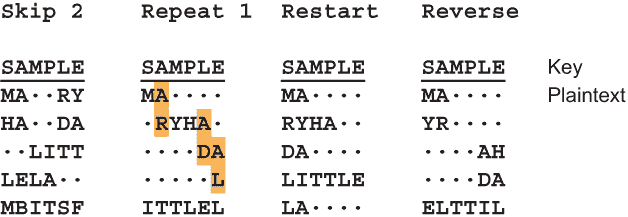
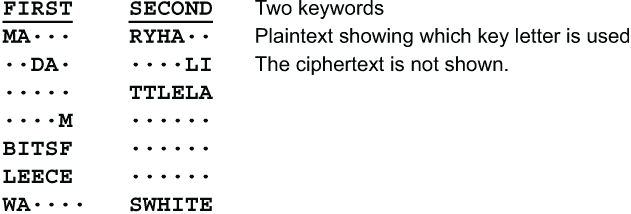
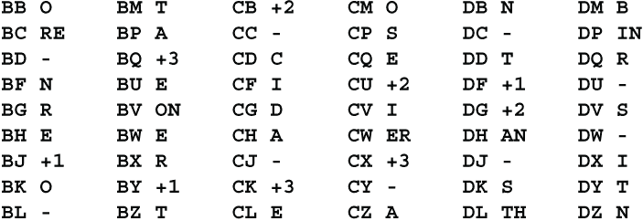
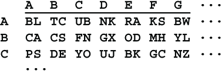
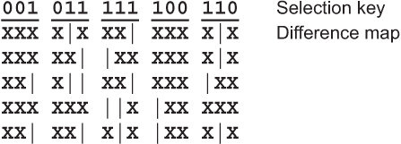
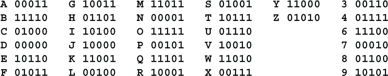
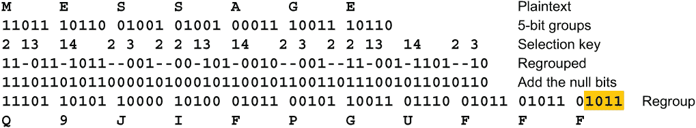
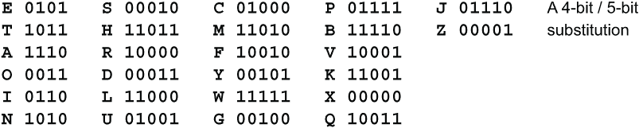
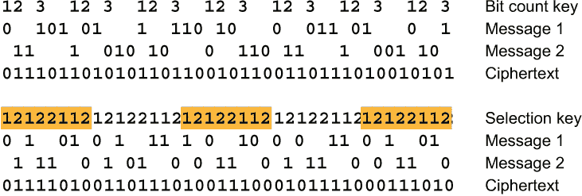

# 第六章：对策

本章内容包括

+   双重加密

+   空字符和空位

+   同音字

+   在图像或计算机文件中隐藏消息

总结第 5.9 节，多表密码可以通过两步过程解决。首先，使用 Kasiski 方法或 Coincidence 指数确定周期或密钥长度。这将把密文分成几个较小的文本，每个文本只有一个字母的密钥。其次，使用标准的简单替换密码方法对这些单独的文本进行解密，包括频率和接触。

让我们把它反过来。密码分析者可以采取哪些措施来防止多表密码被这两个步骤破解？我们将看几种对策。

## 6.1 双重加密

如果一条消息使用一个周期为 P 的多表密码加密，然后使用周期为 Q 的第二个多表密码加密结果中间文本，那么结果等同于一个周期为 P 和 Q 的最小公倍数的多表密码，表示为*lcm(P,Q)*。也就是说，周期是 P 和 Q 的最小整数倍数。例如，如果 P 为 10，Q 为 11，那么双重加密将具有 110 的周期，但如果 P 为 10，Q 为 12，那么双重加密将具有 60 的周期，因为 60 是 10 和 12 的倍数。

双重加密中的每个个体字母都是第一次和第二次加密中的两个字母的组合，如第 11.7.4 节所述。如果这些是移位标准字母表，那么结果也是移位标准字母表。如果这些是混合字母表，那么结果很可能是更彻底混合的字母表。

尽管双重加密仍然是多表加密，但它可能比单个多表加密更强，因为周期更长，每个密钥字符将加密的字母更少。这种类型的双重加密评为三级。

如果两个多表加密是自动键、流动密钥或一个键，双重加密将是流动密钥加密。然而，密钥不会是英文文本，所以第 5.11 节的单词拖拽技术无法使用。那节的概率技术，尽管如此，可以用于两个流动密钥。

如果加密使用直接字母表，即使用 Belaso 表，那么加密顺序并不重要。用流动密钥 R 加密消息 M，然后用流动密钥 S 重新加密与用流动密钥 S 加密流动密钥 R 以获取新的复合流动密钥 C，然后用该复合流动密钥 C 加密消息 M 是相同的。

通过用一个流动密钥对另一个流动密钥进行加密而派生的密钥并不是随机的。它们具有自己的特征字母频率和接触频率。有常见的序列，比如 THE 被 THE 加密，或者 AND 被 THE 加密。所有这些都可以列成表。如果将长短语（如 UNITED STATES OF AMERICA 或 NEGOTIATING STRATEGY）拖过文本，您可以寻找符合此分布的流动密钥部分。因此，双流动密钥加密可以通过计算机解决。

使用未混合字母表，两个自动密钥和/或流动密钥加密的组合被评为四。使用混合良好的密钥字母表，该组合被评为六。

## 6.2 空字符

空字符是阻止敌人破译代码的一种历史悠久的方法。它们至少可以追溯到 15 世纪的阿根提家族。空字符是插入到消息中以迷惑敌方密码分析员的无意义字符。它们最常与代码一起使用。对于多表密码，它们可以污染频率计数并破坏卡西斯基或重合指数分析。

空字符可以有几种使用方式。最直接的方法是向字母表中添加一个空字符。这通常表示为一个*星号。然后可以将此字符散布到明文中。应该适度使用，以免显眼和明显。约 3%至 6%的空字符是合理的。使用空字符的一个有用方法是将它们插入高频词中以迷惑卡西斯基攻击。这应该是随机的。如果您将*每个* THE 更改为 T*HE，则正在通过提供 4 个字符重复来帮助 Emily。最好一半时间使用 THE，四分之一时间使用 T*HE，四分之一时间使用 TH*E。使用*THE 或 THE*并不有益，因为 THE 三字母组保持完整。

加密表将变为 27 列宽，并且星号将出现在密文中。您可能会认为这将透露正在使用空字符，但有一种称为三重密码的密码，描述在第 9.9 节中，它利用了一个 27 字符的字母表。Emily 可能会认为您的多表密码是三重密码（不要与约翰·温德姆 1951 年小说《三脚怪植物的末日》中的三条腿怪物植物混淆）。

以这种方式使用空字符相当薄弱。它不会显著改变字母频率，并且不会对卡西斯基或重合指数产生不良影响。该方法被评为三。

使用空字符的第二种方法是在明文中插入一些特定的空字母序列。这些序列需要容易识别。我建议从一小部分中频字母（如 C、D 和 P）形成空序列。双字母组 CC、DD 和 PP 可以用来表示字母 C、D 和 P，这些字母的其他 6 个双字母组合将成为空字符。这种方法也被评为三。

## 6.3 中断密钥

使用空字符的更强大的方法是将空字符插入到密文中，以打破重复周期。这样做的简单方法首先是以正常方式使用多表密码加密消息。然后每次在密文中发生某些*触发*事件，例如某个选择的字母或双字母时，在其后插入一个空字符。空字符可以是任何字母，甚至是双字母。触发器的存在标记它为一个空字符。

这种空字符插入类型可能相当复杂。你可以插入一个空字符

+   在密文中每个 W 之后的 4 个字符，例如密文**NPGWSOVKLEWPIDF**可能变为**NPGWSOV****T****KLEWPID****C****F**，

+   在密文中每第二个 H 之后，

+   在密文中每个跟随 Q 的第一个 A 之后，

+   第一个 V 之后的 1 个位置，然后下一个 B 之后的 2 个位置，下一个 L 之后的 3 个位置，然后重复 V、B、L、V、B、L、...，

+   在密文中每个双字母之后，或在连续 3 个元音之后，或在字母表中按升序或降序连续 4 个字母之后，

或者这些的组合。唯一的限制是你的想象力。只是不要让它变得太复杂，以至于桑德拉和里瓦无法快速准确地加密和解密。如果桑德拉应该在每第二个 K 之后插入一个空字符，以及每第三个 M 之后，而她错过了一个，或者在第四个 M 之后放置了空字符，那么里瓦可能无法解密消息。

这种插入空字符的方法使用标准字母评为四，使用混合字母评为五，前提是，如常，混合字母保密。

还有几种打破关键周期重复的方法。一种方法是在明文中发生某些触发器时重新启动关键。这比前一种方法更安全，因为触发器在密文中，艾米丽可以看到密文，但看不到明文。另一方面，对于合法的接收者来说更困难。当触发器在密文中时，里瓦只需扫描并通过眼睛删除空字符。当触发器在明文中时，里瓦必须逐个解密字符，注意触发器。

触发器可以类似于刚才提到的密文触发器，只不过在明文中，而不是在密文中。触发器发生后所采取的行动可能是

+   跳过关键中特定数量的字符，或

+   重复关键中特定数量的字符，或

+   从第一个字符重新启动关键，或

+   切换方向，通过关键向后走。

这里是使用关键 SAMPLE 和触发字母 A 的这 4 种类型的关键中断的示例：

这种形式的关键中断使用直接字母评为五，使用混合字母评为六。关键不应该经常重新启动，否则关键的第一个字符将被过度使用，而关键的最后一个字符可能会被忽略。

更强的关键中断形式是使用两个不同长度的密钥。当密钥长度互质时，此密码最强。当触发器发生时，您从一个密钥切换到另一个密钥。当混合字母表混合良好时，此方法评为六。这是一个使用密钥 FIRST 和 SECOND 以及触发器 A 的示例：

此密码会跟踪上次使用的密钥字母。当你切换到另一个字母表时，加密将继续使用密钥的下一个字母。例如，明文 MA 使用密钥字母 FI 进行加密，因此下一个密钥字母是 R。在使用第二个密钥 SECO 加密 RYHA 后，加密将在第一个密钥 RS 的密钥字母中继续。

这样，每个密钥中的所有字母大致相同的次数。

## 6.4 同音字替换

同音字替换，介绍在 4.2 节中，为了平坦化字母频率，为每个明文字母提供几个替代字。最常见的方法是扩大密文字母表以提供额外的替代字。由于经典的多字母密码使用固定的 26 个字母表，至少对于英语来说，它们通常不使用同音字替换。

对于使用 8 位字节的计算机实现，同音字替换很容易实现。一个字节有 256 个可能的值。26 个大写字母，26 个小写字母，10 个数字，以及可能的 32 个标点符号只使用了 256 个值中的 94 个。如果包括制表符、退格、换行和回车，就有 98 个。这样就留下了 158 个字符，可以用于空字符、双字母组合和三字母组合以及关键中断。

让我们看看如何使用纸和笔以及正常的 26×26 混合表进行同音字替换。如果您将一个字母保留为触发字母，那么该字母的频率将非常高，很容易被发现。同样，使用 2 个触发字母也是可能的。我建议使用 3 个触发字母，每个字母的频率都低于 4%。让我们称这个密码为*Trig3*。字母 BCDFGJKLMPQUVWXYZ 是合适的。假设您选择了 B、C 和 D。以这 3 个字母开头的双字母组合有 78 个，即 3×26。您不会使用包含高频字母 AEINORST 的双字母组合，因为那会增加它们的频率，这与平坦化字母频率的目标相悖。这样就留下了 54 个可以用作空字符、同音词和关键中断的双字母组合。这里是一组可能的双字母组合：

这里的**-**代表空字符，所以明文 BD、BL、CC 等都是空的。Codes +1、+2 和+3 是关键中断符，意思是跳过 1 个、跳过 2 个和跳过 3 个关键字母。同音词集包括 6 个双字母组合，AN、ER、IN、ON、RE 和 TH 以及单个字母。

保持平衡很重要。如果你过度使用这些替代字符，那么字母 B、C 和 D 的频率就会过高，很容易被发现作为触发器。如果你使用得太少，那么它们就不会有任何有用的影响。大约 10%是正确的，使用 B、C 和 D 的双字母组合频率大致相等，每个约为 3%。记住，使用这种密码时不能单独使用字母 B、C 和 D，必须使用它们的替代品 DM、CD 和 CG。

如果正确使用，使用混合得很好的键入字母表，Trig3 密码的评级为五。

### 6.4.1 密码 5858

在转向双字母组合替换之前，让我再介绍一个密码。我称之为*Cipher 5858*。这是一个使用 5 位字符的计算机密码。五位字符给出 32 个字符的字母表，足够 26 个字母、3 个空字符和 3 个同音字使用。（1）明文被写成一个混合字母的 5 位字符序列。（2）插入空字符和同音字，每个约占明文的 3%，总共占明文的 18%。最好是以随意的方式使用它们，而不是以系统化的方式。（3）明文被填充，使其长度成为 8 的倍数，如果需要，添加一个空字符，并最多添加 4 个随机位。（4）填充后的消息被视为 8 位字节的字符串，并进行混合替换。例如，如果消息包含 80 个 5 位字符，则将按顺序取 400 位，作为 50 个 8 位字节。（5）将消息再次视为 5 位字符的字符串。选择其中的三个字符作为键中断器+1、+2 和+3，就像 Trig3 密码一样。（6）使用一个通用的多表多字母密码和一个混合得很好的 32×32 的 5 位字符表对消息进行加密。（7）5 位字符的字符串然后重新分组成 8 位字节，并进行第二次 8 位替换。

总之，密码 5858 使用 4 个替换步骤，一个初始的 5 位替换，一个 8 位替换，一个带有键中断的 5 位通用多字母替换，以及最后一个 8 位替换。这个密码的评级为七。

## 6.5 双字母组合和三字母组合替换

防止 Emily 使用字母和联系频率破解您的密码的另一种方法是对双字母组合甚至三字母组合进行替换。最简单的方法是使用一个表格。对于双字母组合，您可以使用一个 26×26 的表格，其中每个条目都是一个双字母组合。以下是这样一个表格的开头：

AA 的替代品将是**BL**，AB 的替代品将是**TC**，依此类推。对于三字母组合替换，您可以使用一个小册子，其中包含 26 个这样的表格，每个表格对应三字母组合的第一个字母。

这种替换方法可以单独使用，也可以与另一种方法结合使用，例如多表替换。单独使用时，二元替换评为三，三元替换评为四。二元替换后跟着使用混合良好的秘密字母表的多表替换评为五，三元替换后跟着使用混合良好的秘密字母表的多表替换评为六。

## *6.6 在图像中隐藏消息

一个有趣的想法，可以追溯到大约 1999 年，是将消息隐藏在计算机上各种类型的数据文件中。这是隐写术（第 2.2 节）的现代版本。让我们看看其中一种方法，将消息隐藏在位图或 BMP 文件中。位图是以像素为单位存储的图像。最常见的位图格式通过 3 个字节表示每个像素，指定图像上单个点的蓝色、绿色和红色色深度。 （这是微软位图图像标准中的设备无关顺序。如果你记不住顺序，注意蓝色、绿色和红色按字母顺序排列。）例如，0,0,0 表示没有颜色，因此是纯黑色，255,255,255 表示所有 3 种颜色的最大深度，因此是白色，255,0,0 将是纯蓝色。

像素通常用十六进制表示，因此纯蓝色将是 FF0000。在一些计算机语言中，这样写$FF0000 或 X'FF0000'甚至 0xFF0000，因为十进制 255 在十六进制中是 FF。在一些语言中，颜色组件的顺序是相反的。例如，在 HTML 中，纯蓝色将是#0000FF。

整个图像可能包含数百或数千行像素，每行包含数百或数千个像素。一个位图包含 3000 行，每行包含 4000 个像素并不罕见。这样的图像将有 12,000,000 个像素，并且需要 36,000,000 字节的存储空间，再加上 54 字节的头部信息。这就是为什么许多高分辨率图像会迅速填满计算机的内存。

诀窍是使用像素的每个组件中的低阶位来携带一位消息。这可能不会被察觉，因为 FF0000 和 FE0000 甚至 FE0101 之间的差异对肉眼几乎是不可察觉的。在大图像的单个像素中，这将在视觉上是不可察觉的。此外，一半的位不会改变值。在图像中隐藏消息时，关键是传输包含图像的文件时必须完全准确。图像不得放大、缩小、裁剪、旋转、倾斜、压缩或转换为另一种图像格式。

消息可以用任何方法加密。但是，如果 Emily 怀疑你是以这种方式隐藏消息，那么它不会增加任何额外的安全性。你将为每个消息位传输 8 位数据而不获得任何相应的好处。如果你简单地依次取每个像素的低阶位，评级将与你选择的加密方法相同。

从这种方案中获得额外安全性的一种方法是不使用所有位，而是以某种循环顺序从每个像素中选择特定位。为此，您可以使用一串八进制数字（请参阅第 3.1 节中的表）作为选择消息位的密钥，例如 1,3,7,4,6。这可以称为*选择密钥*。它有 5 个八进制数字，因此有 15 个选择位。从图像的第一个像素和选择密钥的第一个数字开始。如果该数字的第一个位为 1，则将消息的一位放入像素的蓝色分量的低阶位，否则将低阶位随机设置为 0 或 1。如果第二个密钥位为 1，则对绿色分量执行相同操作，如果第三位为 1，则对红色分量执行相同操作。然后对第二个像素和选择密钥的第二个数字重复此操作。依此类推。

有人可能会认为，当密钥位为 0 时，最好保持图像对应位不变。这样会导致图像失真较小，并且使得 Emily 更难检测到其中包含隐藏消息。没错，但如果 Emily 怀疑你在使用这种方法，那么就可能确定选择密钥。

假设情况如此。Emily 拦截了包含位图图像的消息。进一步假设 Emily 在互联网上进行了图像搜索，并找到了原始图像。Emily 可以逐像素和颜色分量地将两个图像进行匹配。这使得 Emily 能够制作出两个图像版本之间差异的地图。在低阶位匹配的地方，Emily 可以在地图中标记一个 X，而在不匹配的地方，Emily 可以标记一个 |。然后，Emily 可以尝试每个可能的选择密钥长度。当选择正确长度 L，并且标记以 L 像素间隔对齐时，那么每一列选择位为 0 的地方将包含所有的 X，而选择位为 1 的列将包含一半的 X 和一半的 |。例如，再次使用选择密钥 1,3,7,4,6，你可能会看到

对于每一列包含 | 的情况，选择密钥的对应位必须为 1。选择密钥的所有其他位可能为 0。随着差异图中行数的增加，概率会变得更高。

因此，无论选择位是 0 还是 1，颜色分量的低阶位都应该随机设置。使用循环选择密钥，隐藏消息的这种方法在底层密码的评级为 1 到 4 时添加 2，或者在评级为 5 到 8 时添加 1。

选择密钥也可以使用第 4.5 节的链式数字伪随机生成器生成，使用 7、9 或 10 位数的合格种子。使用从 0 到 7 生成的数字作为选择数字。如果生成的数字是 8 或 9，则丢弃它并生成下一个数字。这里不重要伪随机数字是否具有统计随机性。重要的性质是生成的数字序列比消息更长，以比特为单位衡量，这样艾米丽就不能匹配具有相同选择密钥的密文部分。

使用链式数字选择密钥，如果底层密码的评级为一到四，则此隐藏消息的方法添加 3，如果评级为五到七，则添加 2，如果评级为八，则添加 1。

## 6.7 添加空位

将消息的位与空位的这种混合思想也可以在不嵌入消息于图像或其他文件中的情况下实现，并且可以手工完成。首先使用简单替换法或您选择的任何方法对消息进行加密。将这个初步的密文写成二进制形式，比如 5 位二进制。简单替换和转换为二进制可以一步完成。您可以只是按一些混合顺序替换字母表的 26 个字母为 5 位二进制数，就像这样：

注意，除了字母表的 26 个字母外，还有 6 个十进制数字。省略了数字 0、1、2 和 5，以防止手写时与字母 O、I、Z 和 S 混淆。这给了您将 5 位数转换回符号以进行传输所需的 32 个字符。

现在，消息以位串的形式给出，可以添加空位了。选择密钥用于指定插入空位的位置。选择密钥的形式是 m1,n1,m2,n2,m3,n3,...，表示取 m[1] 位消息并插入 n1 个空位，再取 m2 位消息并添加 n2 个空位，再取 m3 位消息并添加 n3 个空位，依此类推。以下是使用选择密钥 2,1,3,1,4,2,3,2 的示例。

使用此方案，消息被加密为**Q9JIF PGUFF F**。四个空位（阴影部分）被附加以完成最后一组 5 位。这称为*填充*或*空填充*。

选择密钥也可以以二进制形式给出，比如 110111011110011100。密钥中的每个 1 位表示取下一个消息位，而每个 0 位表示插入一个空位。

当使用两个不同的字母表来将字母转换为比特和将比特转换回字母时，此方案更加强大。使用可变长度的替代品，如第 10.4 节中描述的哈夫曼编码，也可以提高强度。为此，代码的长度不需要与字母的频率相对应，但它们仍然必须具有前缀属性，以便里瓦能够解密消息。

你可以通过两种方式避免在第二次替换时添加额外字符，即从比特到字母的替换。 (1) 你可以每次取 4 个比特，并且只使用字母表的 16 个字母，或者使用 16 个十六进制数字，或者 (2) 你可以使用一个具有六个 4 比特代码组和二十个 5 比特代码组的可变长度编码。同样，这些代码组必须具有前缀属性。以下是一个示例：

注意，我为 6 个最高频率的字母使用了 4 比特的替代物。这将使这 6 个字母在密文中的频率大约是其他 20 个字母的两倍。这可能会使一个不警惕的对手认为这是一种完全不同类型的密码。

添加空位适用于许多类型的加密。由于空位和其他任何比特都无法区分，因此添加空位比添加空字符更强大。它可以使密码的评级提高高达三分。

让我们看一个具体的例子。称之为*Cipher Null5*。和之前一样，有 3 个步骤，将字母转换为比特，添加空位，然后将比特转换回字母。字母被转换为比特，使用从字母到 5 比特组的同音替换。为每个字母 E、T、A、O、I、N 提供了两个替代物。空位通过使用选择密钥插入，如第 6.6 节所示。比特通过类似于上表的 4 比特/5 比特替换转换回字母。

Cipher Null5 的评级为六。

## 6.8 合并多个消息

二进制形式的密钥也可以作为合并密钥来合并两个消息。也就是说，两个消息的比特会交错以形成单个消息。基数为 3 或 4 的合并密钥可以用来合并 3 或 4 个消息。基数为 4 的合并密钥同样可以合并 3 个消息加空位。

合并多个消息的两个优点是，你不会像使用空位一样增加太多额外长度，而且可以使用更简单、更快速的加密。如果你使用一个长的合并密钥交替四个消息，并且对每个消息使用不同的简单替换，那么单单这一步就能获得五分的评价。如果你对合并的消息再进行一次简单替换，评价就会提升到八分。

合并消息的密钥可以采用两种形式，一种是比特计数形式，一种是选择形式。在比特计数形式中，消息会轮流被取出。密钥的每一位指定了从每个连续消息中取出多少比特。在选择形式中，消息可以按任意顺序被取出，但每次只取出一个比特。密钥的每一位指定了从哪个消息中取出下一个比特。以下示例展示了如何通过比特计数方法使用密钥 123123 合并消息 010101111010001101011 和 11101010011011100110，以及如何通过选择方法使用密钥 12122112 合并消息。

合并多条消息时，如果这些消息长度不同可能会显得混乱。除了最长的消息外，其他消息都需要有一个消息结束标记。另一种处理长度不匹配的方法是平衡合并。首先，将所有消息依次写在一起，用某个预留的字符或字符序列分隔开。然后简单地将这个长字符串分成相等的部分。例如，如果消息长度分别为 50、60、70 和 80 个字符，总共是 260 个字符，再加上 3 个分隔符共 263 个字符。你可以将它分成 4 条长度分别为 66、66、66 和 65 个字符的子串。如果使用的是 8 位字节，你可以将 263×8 = 2104 位分成 4 条每条 526 位的子串。不需要在比特字符串上按照偶数字节边界进行分割，但是你应该选择从每条子串中取相等位数的密钥。

顺便说一下，消息数和子串数是独立的。可以只有一条消息，也可以有多条消息，子串数从 2 开始。例如，一条消息可以分成 3 个子串，也可以有 3 条消息分成 2 个子串。

平衡是解决方案的一半。另一半在合并过程接近尾声时出现。最终，你将会合并来自其中一条字符串的所有比特，而其他字符串还剩下一些比特。如果合并密钥指定了另一条没有剩余比特的字符串的另一个比特，则跳到下一个比特选择。

让我们把所有内容汇总成一个密码，称为 *Merge8*。Merge8 密码作用于一个或多个连接在一起的消息。在基于 26 进制的版本中，26 个字母使用类似于第 6.7 节中的 4 比特/5 比特编码转换为二进制。消息分隔符可以是一串字母，如 XXX 或 END。在基于 256 进制的版本中，对 ASCII 码应用混合良好的简单置换。生成的比特字符串被分成 8 个长度相等的比特串。使用 32 个八进制数字的密钥来合并这 8 条比特串。每个 8 进制值在密钥中出现 4 次，因此有 32!/(4!)⁸ = 2.39×10²⁴ 种可能的合并密钥。对生成的字符串执行第二个简单的置换。基于 26 进制和基于 256 进制的版本都使用 8 比特置换。Merge8 评级为六。

## 6.9 在文件中嵌入消息

当将消息隐藏在图片文件中时，每个消息比特至少有 7 个图像比特。这相当低效。如果不试图让它看起来像其他东西，你可以在文件中隐藏更多的消息比特。它是密文，就让它看起来像密文。有数十种方法可以在文件中隐藏明文消息。我将简单列举一些选项。与第 6.6 节一样，对于文件的每个字节，一定数量的明文比特被隐藏在其中的 8 比特中。

+   每次取固定数量的明文比特或可变数量的明文比特。

+   每个字节内的位可以放置在固定的位位置或可变的位位置。

+   位按顺序放置，或者重新排列。

+   明文位可以原样插入，也可以轻微加密，例如通过简单的替换。

+   密文位可以原样保留，也可以轻微加密，例如通过简单替换。

位的数量、位的位置和位的顺序可以由周期性密钥或某些随机序列控制。根据所选择的选项，这一类密码的评级可以从一到十不等。

这是一个这样密码的例子。 (1) 对消息执行混合良好的密钥简单替换。(2) 使用具有大内部状态的伪随机数生成器，在每个字节中选择 2 到 6 位位置。按顺序将消息的下一个 2 到 6 位放置到这些 2 到 6 位位置中。将剩余位位置设置为随机值。(3) 执行第二次混合良好的密钥简单替换。

这种称为*EmbedBits*的方法极其快速简单。缺点是密文长度约为明文的两倍。EmbedBits 被评为八分。要将评级提升到十分，可以将简单替换替换为双字母替换，例如 Two Square。
