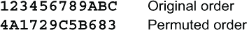
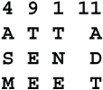

# 第七章：置换

本章涵盖

+   路径和列置换

+   随机数置换

+   密钥置换

+   多重变位词

在第五章和第六章，我们讨论了替换密码。秘密密钥加密方法的第二大类别是置换。置换意味着改变消息中元素的顺序。这些元素可以是单词、音节、字母或代表字母的个别数字或位。在本章中，我们将主要处理字母置换，但请记住，您可以使用相同的方法处理其他元素，例如第 7.2.2 节中的单词置换。本章将涵盖许多不同类型的置换密码。大多数这些置换密码只需用铅笔和纸就可以完成。

## 7.1 路径置换

*路径* *置换* 是最简单、最古老的置换密码形式。没有涉及密钥。保密性来自路径或路径选择。

路径置换是让孩子们对密码学感兴趣的好方法。这是一个适合课堂、童子军团或其他俱乐部的活动。主要注意事项是孩子们必须以直立的列均匀地写字母，否则消息会混乱。可以通过使用间距较宽的方格纸来避免这种情况。

基本思想是将消息用一条路径写入矩形中，然后用另一条路径读出。例如，如果消息有 30 个字符，那么 5×6 的矩形最合适。如果消息有 29 个字符，只需添加一个空字符。用空字符填充消息，直到它适合合适大小的矩形。在开始填写之前，画出矩形的轮廓是有帮助的。如果消息很长，将其分成方便大小的块。例如，1000 个字符的消息可以分成二十个 5×10 的块。

我们已经在第 4.3 节看到了路径置换的一个示例。消息是水平地从左到右跨行写入 5×5 网格中，然后垂直地从上到下沿列读出。水平和垂直是两种路径。以下是更完整的列表。

+   水平方向，从左到右，从右到左，或交替左右

+   垂直方向，从上到下，从下到上，或交替上下

+   对角线方向，从左上到右下，从左下到右上，等等，或交替

+   螺旋，从任何一个角向内或从中心向外，顺时针或逆时针

你可以从矩形的任何一个角开始，使用任何路径写入消息，并使用任何其他路径读出消息。这里是一个花式路径的示例：

消息将按照数字指示的顺序写入网格中，并按列读出，即 1、36、37、39、42、2、6、38，...

对于路线置换，Emily 只需要猜测您用来读取消息的路线。在 Emily 将消息填入矩形之后，可以通过检查来读取。请注意，对于 Emily 来说，您是将消息水平写入 5×6 矩形还是垂直写入 6×5 矩形都无所谓。同样，您是从顶行向下工作还是从底行向上工作也无所谓。Emily 无法区分这两者之间的差异。

路线置换评为一级。

## 7.2 纵列置换  

*纵列* *置换* 是置换密码的主力军。自 17 世纪以来，它一直被军队、外交官和间谍使用。该方法首次在约翰·法尔科纳（John Falconer）于 1685 年撰写的《密信解密》（Cryptomenysis Patefacta）一书中描述。1688 年的光荣革命之后，约翰·法尔科纳跟随詹姆斯二世流亡到法国，在那里去世，而第二版于 1692 年以新标题《解释和解密各种秘密写作规则》（Rules for Explaining and Decyphering all Manner of Secret Writing）出版之前已经出版。  

纵列置换使用的密钥可以是混合顺序的连续数字字符串，也可以是关键字或密语，通过将字母按字母表顺序编号来将其转换为数字字符串。考虑关键字 SAMPLE。字母 A 在字母表中最早，因此编号为 1。字母 E 在字母表中次序排在第二，编号为 2。然后是 L、M、P 和 S。因此 SAMPLE 转换为字符串 6,1,4,5,3,2。如果同一字母出现多次，则按从左到右的顺序编号。例如，ANACONDA 变为 1,6,2,4,8,7,5,3。

将消息从左到右水平写入网格。列数等于密钥的大小。如果密钥是 SAMPLE，则有 6 列。如果密钥是 ANACONDA，则有 8 列。像这样在网格上方写下数字密钥：

根据数字密钥从顶部到底部垂直读取消息，从编号为 1 的列开始，EKFHE，然后是列 2，ESRAT，列 3，NROW，直至列 8，YCYI，如图所示。

合法接收者 Riva 需要做一点算术才能阅读此消息。密钥长度为 8 个字母，消息长度为 35 个字母。35 除以 8 等于 4，余数为 3。这意味着数组将包含 4 行完整的 8 个字母，加上 3 个字母的短行。Riva 应该在开始填写列之前画出此数组的轮廓，以便将正确数量的字符放入其中。

艾米莉，敌人的任务有点困难。技巧是将每列的字母垂直写在一条纸条上，然后将这些条纸对齐以确定列的顺序。她寻找那些匹配字母形成常见双字母组合的条纸对。当她找到一个好的匹配时，她尝试在这两个条纸之前或之后添加第三个条纸。一旦正确匹配了 3 或 4 个条纸，短单词就开始出现，任务变得容易起来。

艾米莉不知道关键字的长度，所以她需要猜测。她可能从 5 开始并逐渐增加。假设她已经增加到 8，正确的长度。像丽娃一样，她将 35 除以 8。她知道有 5 个由 4 个字母组成的短列，和 3 个由 5 个字母组成的长列。艾米莉的问题是在哪里开始和结束每个条纸，以便至少包含一个完整的列。

第一条纸条从密文的第一个字符开始，如果第一列读出的数组是长列，则必须是 5 个字母长。第二条纸条从密文的第五个字母开始，如果第一列是短列，则在第十个字母结束。对于第三和第四条纸条也是如此。然后，艾米莉将对其他 4 条纸条做相反的操作，从密文的最后一个字母向中心反向工作。

然后，艾米莉将匹配这些条纸，将它们相互滑动以确定正确的对齐方式。所有这些都是凭眼睛完成的，所以艾米莉必须熟记最常见的双字母组合和三字母组合的频率。这也可以通过计算机以简单直接的方式完成。

针对这种匹配程序的最常见对策是，发送者桑德拉从上到下读出一些列，从下到上读出另一些列。这意味着艾米莉需要一套读取反向的第二套条纸。然后她将有两倍多的条纸来尝试匹配。

如果数组是矩形，则所有列向下读取时，列置换评为二，如果不是，则评为三。如果网格是矩形，或者列很长并且交替方向读取时，列置换评为三，否则为四。

列置换是一种为任何类型的替换密码增加强度的经过验证的方法。列置换与混合良好的简单替换相结合评为五。当与混合良好的一般多表密码相结合时，评为七。如果两个密钥的长度互质，则组合最强。

加强柱形置换的最常见技巧是使一些行的长度不同。这样会让艾米丽难以确定条带应该从哪里开始和结束。有四种这样的想法。其中，编号（4）是最强的，因为它在中间的一个不可预测的点破坏了条带，而不是在末端。更复杂的空白模式可能在某些列中有 2 个或更多的空白。

这些变种的柱形置换评分为四，前提是艾米丽不知道模式。如果密钥很长，并且列中有可变数量的空格，那么变种（4）的评分将提高到五。法国人在一战结束时使用了这样的系统。据信德国人能够读取其中至少一部分消息，主要是因为法国人多次重复使用了他们的密钥。

对数字（3）的两个进一步变种，楼梯，是（5）当你到达右边缘时从第一列开始，形成一个斜线模式，和（6）当你到达右边缘时反向，创建一个燕尾或之字形图案。这些模式的优点是每一行的字符数除了最后一行可能不同外，其他都相同，这样瑞娃很容易计算行数。以下是这两种变体的示例。

你也可以有两个或更多不同宽度的分开的楼梯，或者在对角线和反对角线方向上有楼梯 **\** 和 **/**。

当你解密使用任何这些柱形置换变种发送的消息时，如果你有任何难以计算需要多少行，或者最后一行有多长的困难，这里有一个技巧。数一下消息中的字母，并从左到右用那么多的小点填写数组，按照桑德拉用来书写字母的相同模式。然后在点上填写字母。

例如，在变种（2）中，假设你已经同意你将始终从第一行开始使用 7 个字母。密文（2）有 38 个字母，所以你在第一行放置了 7 个点，第二行放置了 8 个点，直到你总共放置了 38 个点。然后你开始在它们的正确列中填写字母，像这样替换点：

使用有黑色方块的另一种方法是用空值填充它们。空值应该选择成为不常见的字母对，以使艾米丽更难匹配列。最好使用常见的字母而不是罕见的字母，这些字母可能很容易被识别为空值。这是一个例子。

有空格的柱形置换评为三。有固定的空格模式，评分为四。

### 7.2.1 Cysquare

历史趣闻：在第二次世界大战期间，英国使用了这个想法的一个变体，称为*Cysquare*，由约翰·H·蒂尔特曼准将于 1941 年发明。Cysquare 是一个具有大量涂黑的列置换密码。英国发行了 26×26 网格的填充物，大约 60%的方块以随机模式涂黑。每页有不同的模式。消息被写入横跨行的白方块中，然后以某种顺序垂直读出。网格是正方形的，因此可以以任何方向使用。

关键是填充物中的页码、方向以及网格内的起始和结束位置。密码员会在页面上画线标记消息区域。使用不同的区域可以让页面用于多条消息。

缺点在于需要分发如此多的填充物。为了最小化填充物的数量，英国人每天将每页用于可能多达 50 条消息。这意味着要写得很淡并且擦拭多次。页面变得难以阅读，最终密码员拒绝使用它们。Cysquare 在 1944 年被放弃了。

德国人在战争结束前从 1944 年开始使用这些填充物之一，连同说明书一起。他们开始自己使用这个系统，直到战争结束。他们称之为*Rasterschlüssel*，意思是*网格密钥*。然而，德国人在选择黑白方块时做得不好。他们使用了太多相邻的白方块，因此当他们将条带匹配时，英国人可以识别出二元组和三元组。这些消息成为英国情报的宝贵来源。Cysquare 评分为七分。Rasterschlüssel 评分为四分。

值得注意的是，在计算机时代，黑白方块可以作为比特模式传输，网格可以是任意大小，并且网格可以针对每条消息进行更改。我建议使用 65%到 75%的黑方块。这样做，cysquare 将被评为八分。

有一个简化版本的 cysquare 可供手动使用，不需要印刷网格，并且允许您使用数字密钥指定哪些方块被涂黑。这里有两种*Blackout*置换密码的变体，一种是左右交替版本，另一种是阶梯版本。两者都使用数字密钥 3174255 进行涂黑。涂黑密钥可以是重复的密钥，或者可以由伪随机数生成器生成。您将使用单独的密钥指定读取列的顺序。

加强列置换的另一种方法是将文本分成不规则大小的块。例如，如果消息长度为 150，您可以将其分成 37、71 和 42 个字母的块。这种方法被评为四分。如果您为每个块使用不同的密钥，评分将提高到五分。

将栏式置换与任何类型的替换密码结合在一起会极大增强其安全性。即使与简单的替换结合，等级也会提高到五级，因为匹配条变得更加困难。哪个先做都没有关系。将通用多表密码与至少 12 列的栏式置换结合会将等级提高到七级，即使多表密码的周期只有 3。这是因为您基本上消除了匹配条的可能性。

### 7.2.2 单词置换

*Word* *transposition* 是一个基于单词而不是字母的具有历史重要性的栏式置换。这是美国内战期间联邦军队使用的主要方法。这个想法来自安森·斯泰格（Anson Stager），一个后来创立了西联电报公司的联邦电报员。联邦军队的通信受到高传输错误率的影响。在许多情况下，指挥官们会放弃电报，而只是派遣步行或骑马的信使。斯泰格意识到，发送单词而不是单个字母将减少错误率，并减少重发消息的需要。

联邦密码员将消息逐字从左到右写成矩形数组，然后使用各种路线读出，例如交替上下读取列，或者交替从数组的左半部分和右半部分取列。空单词被大量使用。这里是一个例子。请注意第三行是空的。列按顺序读取为 1,3,5,2,4。

## 7.3 双栏式置换

如其名称所示，*双栏式置换* 意味着连续进行两次栏式置换，最好使用两个不同的密钥。这消除了匹配条的可能性。值得注意的是，1934 年，所罗门·库尔巴克（Solomon Kullback）找到了一个通用解决方案，并由信号情报局发布。这本 31 页的书在 1980 年解密，并由爱琴海公园出版社出版。爱琴海公园出版社多年来一直是密码学书籍的宝贵资源。在其创始人韦恩·G·巴克（Wayne G. Barker）去世后的 2001 年后不久，该公司停业，书籍不再可用。我很高兴地说，[www.openlibrary.org](http://www.openlibrary.org/) 现在有这些书籍（2019 年 7 月访问）。

我不会在这里重复库尔巴克的分析，除了说它是基于确定每个明文字母在密文中出现的位置。相反，我将讨论 3 种打败库尔巴克解决方案的方法。（顺便说一句，库尔巴克和我父亲上了同一所高中，只是早了 6 年。）

一个简单的方法是通过涂黑几个方块来改变网格的形状。这些方块可以形成一个矩形，或者在一个角落，甚至在网格的中间形成其他形状。这里有一些例子：

黑掉的部分在两个置换步骤中可以具有不同的大小、形状或位置。黑掉的部分的大小、形状和位置可以附加到密钥中，以便为每个消息使用不同的黑掉。具有黑掉的双栏置换等级为 Five。

相反的方法称为*NullBlock*，也很有效。您可以将一块空字符块插入中间密文或最终密文，或两者都插入。将空块添加到明文中并不有助于加密。块的大小和位置可以由数字密钥指定。这些应该在消息之间变化。

将任何置换密码与任何替换密码结合使用会增强两者的安全性。双栏置换与简单替换的组合等级为 Six。双栏置换与通用多表替换的组合等级为 Eight。

## 7.4 循环栏置换

栏置换的另一种变体是*循环栏置换*。它有两种变体，水平循环和垂直循环。水平循环需要两个密钥，一个用于循环行，一个用于确定列顺序。首先，从左到右将消息写入矩形块的行。接下来，在行的左侧写入循环密钥。如果行数多于此密钥的长度，则根据需要重复使用该密钥。如果循环密钥是一个词或短语，请使用字母顺序将其转换为数字。

将循环密钥转换为数字形式后，将每行向左循环移动所指定的位置数。然后按列密钥指定的顺序垂直读出字母。以下是使用循环密钥 CYCLES 和列密钥 PAULREVERE 的示例。

解决栏置换所使用的匹配纸条方法也适用于循环栏置换。这只是稍微困难一点，因为每行的最后一个字母与第一个字母相邻，可能形成低频的二元组。这对 Emily 来说最多只是一个轻微的阻碍。具有水平循环的栏置换等级为 Three。

垂直循环类似。不是将块的行向左循环移动，而是将块的列向上循环移动。以下是使用关键字 CYCLE 来循环列和使用密钥短语 PAULREVERE 来选择列读取顺序的示例。

这种密码仍然可以通过匹配纸条来解决，就像普通的栏置换一样，但 Emily 需要为每个列使用两条纸条，一条用于顶部部分，一条用于底部部分。当每列循环时，某些字符从列的顶部移动到底部，并成为新的底部部分。剩下的字母向上移动，并成为新的顶部部分。在例子中，左列 **ODYTEL** 向上移动 1 个位置，所以 **DYTEL** 成为新的顶部部分，**O** 成为新的底部部分。这些部分需要放在不同的纸条上，因为 Emily 不知道这些字母是来自长列还是短列。这使得匹配过程变得相当困难。带有垂直循环的栏置换被评为 Four。

在这个区块上可以执行垂直和水平循环。这与双栏置换的强度相当。但请记住，你的密码越复杂，花费的时间就越长，而且正确地加密和解密也就越困难。*双循环栏置换* 被评为 Five。

## 7.5 随机数置换

让我们来看一个完全不同类型的置换。这种置换不涉及任何形式的数组或网格。相反，它只是随机对消息中的字母进行编号。

你可以使用任何随机数生成器。第十三章中介绍了几种随机数生成器。到目前为止，我只描述了第 4.5.1 节中的链式数字生成器，所以让我们使用那个生成器来说明。为消息的每个字母生成一个随机数字，像这样：

首先取所有从左到右编号为 1 的字母。这些是 C、V 和 I。

接下来取所有编号为 2 的字母。这些是 A、O 和 L。

然后取所有编号为 3 的字母，即 N、E、E 和 M。

持续这样做，直到所有的字母都被取走。

要解密这条消息，Riva 首先会生成随机数字。有三个 1，所以她会在三个 1 下面写下密文的前 3 个字母 **CVI**，像这样：

Riva 会将密文的下一个 3 个字母 **AOL** 写在 2 下面，像这样：

以此类推。

随机数置换被评为 Four。可以通过尝试所有可能的随机数生成器种子来破解它。

通过使用更长的种子或通过以 1、2、3、...以外的顺序选择明文中的字母来增强密码。 这相当于对随机数生成器的输出应用简单的替换。 例如，如果您想从标记为 4 的字母开始，那么您将把所有的 4 改为 1。 如果接下来想要取出所有标记为 7 的字母，那么您将把所有的 7 改为 2，依此类推。 然后按照描述的方式进行。 这将使可能的密钥数量增加到 10！，即 3,628,800。

通过这种改进，链式数字置换评级为五。 对于计算机版本，其中随机数生成器产生随机字节，该方法评级为七，因为重新排列 256 个不同字节的可能顺序太多。

## 7.6 选择器置换

由于我们正在研究随机数，让我们看看基于随机数的另一种置换密码，即*选择器置换*。 思路是将消息分成大致相等的部分，然后使用随机数序列合并这些部分。

假设明文有 100 个字符，你想将其分成 3 部分。 假设你有一个随机数生成器，以相等的概率产生数字 0、1 和 2，并且你已经选择了一个种子，它作为置换的密钥。 你需要知道如何将消息的每个部分做多大。 这很容易做到。 只需生成前 100 个随机数字，并计算产生的每个数字的数量。 假设有 36 个零，25 个一和 39 个二。 你将消息切成 3 部分，P0 有 36 个字母，P1 有 25 个字母，P2 有 39 个字母。

加密很容易。 每当生成器产生一个 0 时，从 P0 中取下一个字母。 每当生成器产生一个 1 时，从 P1 中取下一个字母。 每当生成器产生一个 2 时，从 P2 中取下一个字母。 解密甚至更容易，因为 Riva 不需要知道每个部分有多大。 每当她得到一个 0 时，她将下一个字母放入 P0 中。 每当她得到一个 1 时，她将下一个字母放入 P1 中。 每当她得到一个 2 时，她将下一个字母放入 P2 中。 然后她连接这 3 个部分，或者简单地忽略换行符读取消息。

当只用 2 部分完成时，Emily 可以轻松重构消息。 评级为一。 用 3 部分时稍微困难，评级为二。 用 20 个或更多部分时，评级为五。

## 7.7 密钥置换

有时，逐块移位消息是首选。用于置换块的最佳选择是 *主要置换*。在消息的字符上方写下数字密钥，然后将每个字符移动到其密钥编号指示的位置。在此示例中，块大小为 8，数字密钥为 41278563。第一个字母 **R** 的密钥编号为 4，因此将 **R** 移动到块中的第四个位置。第二个字母 **U** 的密钥编号为 1，因此将 **U** 移动到块中的第一个位置，依此类推。

主要置换可以用于明文、密文或两者。仅使用主要置换是弱的。根据块大小，主要置换的等级从一到三。

*****让我们深入了解置换。在数学中，置换被称为 *排列*。这里有一个例子。我用十六进制数字 A、B 和 C 来表示数字 10、11 和 12。在密码中，这些数字将代表被置换的位、字母或其他单元。

顶行是标准的。它表示置换之前的原始顺序。第二行是置换后的顺序。在本节的后面，第二行将用于描述置换。

在此置换中，位置 1 的数字移动到位置 4，位置 4 的数字移动到位置 7，位置 7 的数字移动到位置 12，位置 12 的数字移动到位置 3，位置 3 的数字移动到位置 1，完成循环 **1****➔****4****➔****7****➔****C****➔****3****➔****1**。循环可以表示为 (1,4,7,12,3)。

不在此循环中的第一个数字是 2。从位置 2 开始，我们找到循环 **2****➔****A****➔****6****➔****9****➔****B****➔****8****➔****5****➔****2**，可以表示为 (2,10,6,9,11,8,5)。整个置换可以表示为 (1,4,7,12,3) (2,10,6,9,11,8,5)。

这两个循环的周期分别为 5 和 7，因此此置换的周期为 35。也就是说，如果你将此置换一直应用到一个由 12 个字母组成的块上，它将产生 35 种不同的字母置换，而第 36 种置换将与原始明文相同。

假设你想要生成一个强大的块置换密码，其中每个块都有不同的置换。对于每个块分别应用先前的置换不足够，因为它每 35 个周期就重复一次。可以通过使用两个不同的置换并交替使用来解决这个问题。

让两个置换分别是 A 和 B。如果 A 和 B 被适当选择，那么你可以生成大量不同的置换 A、B、AA、AB、BA、BB、AAA、AAB、ABA，...。

理解排列的循环结构变得很重要。假设你选择了排列 (1,4,7,12,3) (2,10,6,9,11,8,5) 和 (1,4,3,12,7) (2,10,9,6,5,11,8)。这两个排列以相同的方式划分了 12 个单位的块，即 [1,3,4,7,12] 和 [2,5,6,8,9,10,11]。当你交替使用这两个排列时，[1,3,4,7,12] 的分区将与 [2,5,6,8,9,10,11] 的分区分别排列。也就是说，这两组数字之间没有相互作用。为了获得长周期，第二个排列的每个循环应尽可能与第一个排列的每个循环重叠。下面是一组适合的排列。

(1,4,7,12,3) (2,10,6,9,11,8,5)

(1,10,8) (4,6,5,12) (2,11,9,7,3)

这个转位密码被评为三。它可以通过尝试所有 12! 种可能的排列来简单解决第一个块。这只有 4.79×10⁸。对于为第一个块生成合理文本的每个排列，艾米莉可以尝试第二个块的 12! 种排列。实际上，这并不需要 (12!)² = 2.29×10¹⁷ 次尝试，因为仅查看块的前 3 或 4 个字符就可以消除许多不合理的组合。事实上，通过手工方法解决这个密码是可行的。随着块大小的增加，难度增加得很慢。

有几种增加密钥置换安全性的方法。一种方法是重叠块。例如，如果块大小为 16，则在消息中不是从位置 1、17、33、... 开始块，而是从位置 1、9、17、25、33、... 开始块。这样，每个块与前一个块重叠 8 个单位，并且与后一个块重叠 8 个单位。消息的最后 8 个单位可以与前 8 个单位组合成一个环绕块。这个密码被评为四。

重叠量可以是可变的。如果当前块从位置 P 开始，块长度为 L，则下一个块可以从位置 P+1 到位置 P+L 的任何位置开始。这个密码被评为五。如果使用两个不同的转位，并随机选择，评分将提高到七。

*****加强块置换密码的第二种方法是通过组合置换。如果 T 和 U 是转置，则 T 和 U 的组合，表示为 TU，是通过首先执行转置 U 然后执行 T 而形成的。结果的转置与使用 T 转置 U 然后使用结果的转置转置文本相同。让我们试试一个例子。假设 T 是**419628573**，U 是**385917462**。由于 U 是一个包含 10 个字符的块，您可以使用 T 来转置 U，就像您使用 T 来转置一个 10 字母的单词一样。将 T 写在顶行上用作置换键，并将 U 写在第二行上作为被转置的文本。结果的第一个数字是键中数字 1 下面的数字，即**8**（见阴影）。结果的第二个数字是键中数字 2 下面的数字，即**1**，依此类推。使用 T 来排列 U 得到**812349675**。

通过这种方式组合转置，您可以生成一个转置序列，U，TU，TTU，TTTU，... 。此序列的周期与 T 的周期相同。对于块大小为 12，当循环的长度为 3、4 和 5 时，最长可能的周期为 3×4×5 = 60\. 如果您的消息长于 60 个块，则可能需要更长的周期。这可以通过以某种重复或随机模式排列转置与 U 或 T 之一来完成，例如 U，TU，TTU，UTTU，UUTTU，... 这可以生成一个非常大的不同转置集合，前提是 T 和 U 各自具有较长的周期，并且 T 的循环重叠 U 的循环，如前文所述。

您可以使用*累积测试*来测试循环是否重叠足够。从 T 或 U 的任何一个循环开始。这形成一个只包含该循环的集合。将与其具有共同元素的 T 或 U 的任何其他循环添加到该集合中。现在将具有与您已选择的循环具有共同元素的 T 或 U 的任何其他循环添加到此较大的集合中。继续这样做，直到没有更多的共同元素为止。如果循环集现在包含 T 和 U 的所有循环，则具有很好的重叠。如果您决定使用超过两个转置，比如 T，U 和 V，则 T 和 U 应该重叠，T 和 V 应该重叠，U 和 V 也应该重叠。

这里有一个例子，使用本节早些时候的一些转置，T = (1,4,7,12,3) (2,10,6,9,11,8,5)，U = (1,10,8) (4,6,5,12) (2,11,9,7,3)。从循环(1,4,7,12,3)开始。

(1,4,7,12,3)

这个与循环 U 的(1,10,8)共有元素 1，因此将该循环添加到集合中。

(1,4,7,12,3) (1,10,8)

这个与循环 U 的(4,6,5,12)共有元素 4，因此将该循环添加到集合中。

(1,4,7,12,3) (1,10,8) (4,6,5,12)

依此类推。因为这将包括 T 和 U 的所有循环，它们是很好的重叠对，当它们组合时会产生非常庞大的转置家族。******

## 7.8 分半置换

*分半* *置换* 是我发明的一种计算机技术，使用二进制密钥交换可能是位或字节，或者可能是十六进制数字的单元。IBM 在公司的发明披露公告中发布了这一技术，并考虑将其纳入数据加密标准（DES）中。分半置换作用于块的大小为 2 的某个幂次方，通常为 32 或 64 个单元。对于 n 个单元的块，密钥将有 n-1 位。

让我们以 16 个字符的块大小为例。明文是乔治·华盛顿。置换将使用一个 15 位的密钥。密钥的第一位确定了块的左右 8 单元半部分是否交换。0 表示不交换，1 表示交换两部分。接下来的 2 位密钥位确定了这些半部分的 4 单元是否交换。如果密钥的第 2 位是 1，则块的第一季度与第二季度交换。如果密钥的第 3 位是 1，则块的第三季度与第四季度交换。密钥的接下来的 4 位确定了这些季度的半部分是否交换。例如，如果密钥的第四位是 1，则块的第一八分之一与第二八分之一交换。最后的 8 位控制了块的 16 分之一是否交换。例如，如果密钥的最后一位是 1，则块的最后 2 个单元，第 15 和第 16 个单元，字母 O 和 N 被交换。

要解密这个置换，步骤必须按相反顺序进行。也就是说，首先应该交换单元，然后是对、四个一组等。

## 7.9 多次变位

解决置换密码的一般技术，适用于许多类型的置换，即使类型未知，也是*多次变位*。要使用这种技术，您需要拦截几条相同长度的消息。如果这些消息使用相同的密钥进行置换，那么每条消息的第一个字母将在所有密码文本中的相同位置，第二个字母将在所有密码文本中的相同位置，依此类推。

我们可以利用这一事实。用所有密码文本中的第一个字母制作纸条 1。用所有密码文本中的第二个字母制作纸条 2，依此类推。制作与每个密码文本长度相同的纸条。这些纸条可以像解决列置换时那样匹配。可用的消息越多，纸条就越长，成功的机会就越大。通常认为需要至少 3 条消息。

让我们看一个例子。假设我们有这 3 个密码消息：

消息长度为 12。右侧显示了 12 条条带。

消息（1）包含一个 K。可能在 K 之前的字母有 C 和 N。消息（1）各包含一个。消息（2）包含一个 D。在 D 之前可能的字母是 N。消息（2）包含一个 N。让我们检查这些是否是合理的选择。我们有

在消息（2）中，最有可能在**ND**之前的字母是**A**或**E**。这给出 3 种可能性：

将这 3 个选择与剩下的 9 条纸条进行匹配，最佳匹配是与第 4 条纸条。

这与我们之前已经组合的第 5 列和第 10 列非常匹配。

现在这 3 条消息很容易完成，（1）黎明时攻击，（2）发送更多弹药，和（3）立即见我。
