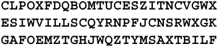

# 8 杰斐逊轮式密码

本章包括

+   托马斯·杰斐逊的轮式密码

+   使用已知单词解密轮式密码

+   当不知道任何单词时解密轮式密码

托马斯·杰斐逊（Thomas Jefferson）在 1790 年至 1793 年间发明了*杰斐逊轮式密码*，当时他担任乔治·华盛顿（George Washington）的国务卿。该装置由直径为 1/8 至 1/4 英寸，长为 6 到 8 英寸的铁棒或纺锤和直径约为 2 英寸，厚约为 1/6 英寸的 36 个木制圆盘组成。每个圆盘在中心都有一个与棒相同大小的孔，以便所有圆盘都可以紧密地放在棒上，形成一个木制圆筒。圆盘的平面面对着彼此，外圆的圆边可见。棒的一端有一个类似钉头的头部。另一端有螺纹，以便螺母可以拧紧到棒上，将圆盘牢固地固定在位。

圆盘的平面侧编号为 1 到 36。外圆边被分为 26 个相等的部分。字母表的 26 个字母以某种混乱的顺序写入或刻在这些 26 个部分中的每一个中，每个圆盘的顺序都不同。棒上圆盘的顺序是密码的关键，这种密码现在被称为*复用密码*。

这是位于马里兰州福特米德（Fort Meade）的国家密码博物馆（National Cryptologic Museum）展示的一台 26 片杰斐逊密码轮的复制品。（照片由 Daderot 拍摄，根据知识共享 CC0 1.0 许可证发布。）

使用该装置对消息进行加密的方法是首先按照密钥指定的顺序将圆盘放在轴上。螺母松开，以便可以转动各个圆盘。消息的第一个字母在第一个圆盘上找到，然后转动第二个圆盘，使消息的第二个字母紧挨着第一个字母。然后转动第三个圆盘，使消息的第三个字母紧挨着第二个字母，依此类推，直到消息的前 36 个字母排成一行。然后拧紧螺母以固定它们的位置。

转动圆筒，还有其他 25 行字母，所有这些都是无意义的混乱。桑德拉可以选择其中任意一行作为密文。里瓦重复这个过程，在圆筒的一行上设置密文。很明显，其他 25 行中哪一行是预期的信息。

杰斐逊显然从未将这种密码投入使用。这个概念一直搁置，直到 19 世纪 90 年代初由Étienne Bazeries 重新发明。它于 1901 年被法国采用。Bazeries 的版本有两个改进。它有一个支架，这样设备可以放在桌子上进行双手操作，并且有一个导轨，帮助用户将字母对齐并选择用于读出密文的行。1914 年，上校帕克·希特发明了一种使用 25 个铝盘的密码版本，并于 1922 年被美国陆军采用为 M-94，于 1926 年被美国海军采用为 CSP-488。希特的版本只有 4.25 英寸长，足够小，可以放在口袋里，盘片的平面面上有凹槽和齿，使得它们在对齐后不会滑动。

这是国家密码博物馆展示的一张 CSP-488 的照片。

1916 年，Hitt 发明了密码的平面版本，并于 1935 年被军方采用，称为 M-138。这个版本是一个带有 25 个通道的平面铝板，上面放置着可以前后滑动的纸条，以模拟盘片的旋转。每个纸条上都有两份乱序的字母表。这个设备更加安全，因为纸条可以很容易地更换，甚至在必要时可以在野外手写。这很快被 M138A 或海军的 CSP-845 所取代，后者有 30 个纸条槽。设备附带 100 条纸条，用 2 位数字编号，因此任何消息使用了 100 条中的 30 条。这样可以产生 100!/70!=7.79×10⁵⁷种可能的密钥。

M-138A 中间有一个铰链，可以折叠以便携带。每半部分都有一个独立的导轨，用于对齐纸条并读出密码的 15 个字母。这些改进显著增强了密码的安全性。

军方在 1942 年或 1943 年左右放弃了这种带纸条的密码，但海军仍将其作为备用，以防止电力故障使得无法使用任何电子或电机式密码设备。

如果 Emily 没有设备的副本并且不知道字母表，解密多路复用密码是不可行的。如果 Emily 拥有设备，如果她知道一些可能的单词，解密就相对容易。当 Emily 拥有设备的副本并且知道一些可能的单词时，杰斐逊密码轮的评级为四到五。如果没有已知的可能单词，评级为六到七。Emily 拥有的密文越多，评级越低。相反，如果设备有很多额外的盘片，评级就会提高。例如，如果设备有 30 个盘片，用户可以从 100 个盘片中选择，评级可以达到八。对于非常短的消息，少于两倍盘片数量，除非 Emily 拦截使用相同密钥的多个消息，否则解密可能是不可能的。如果发件人每天只更改盘片的顺序一次，这种情况可能会发生。

## 8.1 已知单词解答

当你有足够的文本，并且知道至少部分消息时，可以解密使用杰斐逊密码轮加密的消息。通常，只要知道一个单词就足够了。假设你知道 Sandra 正在使用 M-94 设备，它有 25 个盘片，并且你拦截到了一条消息：

假设你还知道明文消息以 URGENT 开始。这已经被转换成了密文 **CLPOXF**。由于 URGENT 在一行上，而 **CLPOXF** 在另一行上，因此相应字母对之间的距离必须相同。让我们将带有 URGENT 的行称为第 1 行，假设带有 **CLPOXF** 的行是第 8 行。明文的第一个字母 U 和密文的第一个字母 C 分别来自第一个盘片的第 1 行和第 8 行。因此，在第一个盘片上，从 U 到 C 的距离必须为 7\. 在第二个盘片上，从 R 到 L 的距离必须为 7\. 在第三个盘片上，从 G 到 P 的距离必须为 7，E 到 O 也是，N 到 X 也是，T 到 F 也是。

搜索的最简单方法是依次尝试从 1 到 25 的每个可能的距离。从距离为 1 开始。找出所有距离 U 到 C 的距离为 1 的盘片。换句话说，U 的下一个字母是 C 的盘片。如果没有这样的盘片，那么你知道距离不是 1\. 然后找出所有距离 R 到 L 的距离为 1 的盘片。同样，如果没有，那么距离也不能是 1。

假设你已经找到了 12 组盘片，其中字母对的距离都是 1\. 现在你需要测试这 12 组盘片，看看它们中是否有任何一组是正确的。假设第一组盘片是 18-4-21-9-13-11\. 从密文的第二块开始测试，字母从 26 到 50\. 这个块以 **ESIWVI** 开头。将盘片 18 设置为字母 **E**，盘片 4 设置为字母 **S**，盘片 21 设置为字母 **I**，依此类推。现在看其他 25 行。如果它们都是无意义的，比如 **HNSAEI** 或 **TFPGUW**，那么你就知道 18-4-21-9-13-11 不是正确的盘片顺序。另一方面，如果你看到一些像 NCONDI 这样的合理文本，它可能是 UNCONDITIONAL 的一部分，那么 18-4-21-9-13-11 可能是正确的盘片顺序。再次测试，使用以 **GAFOEM** 开头的密文的第三块。如果第三和第四块都导致合理的文本片段，那么 18-4-21-9-13-11 可能是正确的...但继续搜索，因为你可能会找到更好的盘片顺序。

如果你没有看到任何可能的文本片段，那么尝试其他 11 组盘片顺序。如果这些都不起作用，尝试距离为 2、距离为 3，... 直到距离为 25\. 可能会有几百种盘片顺序和距离的组合需要测试。这很乏味，但手工仍然可行。如果没有任何组合有效，请返回查找其中 2 个测试给出合理文本的盘片顺序。

一旦你确定了前 6 个盘的最有可能的序列以及相应的距离，然后尝试将其扩展到第 7 个盘。对于每个已知的盘的选择，你已经知道了从明文到密文的距离，因此扩展过程会相当快速。

## *8.2 仅密文解决方案

当没有已知单词时，也可以解密多重密码。这被称为仅密文解决方案。我是第一个找到这种解决方案的人（“解密多重密码的计算机方法。” *Cryptologia* 2 (1978 年 4 月), pp. 152-160）。在原始的 1978 年论文中，我使用了二元频率，并逐步发展到三元组。如今的计算机速度更快，存储更多，所以我们可以跳过二元组步骤。该方法假设你有一张表，列出了英语中每个可能三元组的概率。你可以自己编制这样一张表，或者只需从互联网上下载一个三元组表。以下是该方法的要点。

假设与之前一样，艾米莉正在使用具有 25 个密码字母表的 M-94 设备，并且我们拦截了至少 3 个区块或 75 个字母的消息。我们知道关于消息的一切就是它是用英语写的。例如，假设我们拦截到了

首先尝试前 3 个盘的所有可能选择。有 25×24×23 = 13,800 种这样的选择。对于每个选择，将盘设置为密文每个区块的前 3 个字母，即**CLP**，**ESI**和**GAF**。对于这些三字母组中的每一个，查看其他 25 行。这些行包含与密文三字母组对应的可能的明文三字母组。由于每个 3 行有 25 种选择，所以总的可能性数为 13800×25³ = 215,625,000。这可以很容易地通过台式电脑或甚至笔记本电脑处理。

对于每个 3 个盘和 3 行的组合，该组合的概率是 3 个明文三字母组的概率的乘积。等价地，概率的对数是 3 个三字母组概率的对数之和。这个想法是只保留最有可能的组合并丢弃其余的。例如，你可以只保留前 1%，或者你可以保留一定数量的好组合，也许是最好的 1,000,000 个。假设你选择保留前 2,000,000 个。

一种方法是生成所有 215,625,000 个组合，然后按概率对它们进行排序，并且去掉最低的 99%。这需要大量的存储空间。有更好的方法来做这件事。首先分配一个比你想要的组合数大 10%到 25%的表，比如说 2,500,000 个组合。开始生成这些组合并将它们放入表中。当表满了之后，需要将其减少大约 20%。

通过对表格进行排序并删除底部 20%，可以实现这一点。也就是说，你按照概率降序排序，然后将表格条目数量设置为 2,000,000。对 2,500,000 个项目进行排序比对 215,625,000 个项目进行排序要快得多，但有更快的方法。从表格中随机选择 10 个项目。（如果你不知道如何随机选择，那么选择距离表格 1/11、2/11、...、10/11 处的项目。）将这 10 个项目按照从最不可能到最可能的顺序排序。将这些排序好的项目命名为 a、b、c、d、e、f、g、h、i、j。设 P 为项目 b 的概率。删除表格中概率小于 P 的每个项目。

继续生成组合，但不要向表中添加任何概率小于或等于 P 的项目。每当表填满时，重复抽样、对样本进行排序并重新设置截止概率 P 的过程。

在所有这些步骤结束后，你将获得约 2,000,000 种由 3 个磁盘和 3 行组成的组合。下一步是将此扩展到 4 个磁盘。尝试所有 22 种可能的选择来选择第 4 个磁盘。这将给你约 44,000,000 个组合。现在查看由磁盘 2、3 和 4 形成的三元组。对于每种组合，将磁盘 1、2、3 上的三元组的概率乘以磁盘 2、3、4 上的三元组的概率，以获得所有 4 个磁盘上的四元组的近似概率。将对应于 3 个密文三元组**CLPO**、**ESIW**和**GAFO**的明文四元组的概率相乘。

这将为你提供 4 个磁盘和 3 行的 44,000,000 种组合的概率。同样，你可以保留最佳的 1% 来给你 440,000 组四元组。使用与三元组相同的方法。

以此方式继续获取五元组、六元组、七元组等。每次添加一个磁盘时，你可以保留的组合比上一次少。当你的组合数量少于 100 时，你可以通过眼睛直接选择出正确的组合，并手动完成解决方案。

可能导致此过程失败的一个问题是：即使在普通文本中，也可能出现在你的三元组表中概率为 0 的三元组。如果 Emily 使用了空值，这种情况可能经常发生。这可能导致合法明文被拒绝。

一种解决方案是调整三元组概率，使得 0 概率永远不会出现。让 P(x) 表示字符串 x 的概率。如果一个三元组，比如 XYZ，的概率为零，你可以使用 P(X)P(YZ) 和 P(XY)P(Z) 中较大的那个。我建议将这个值除以 3，比如说，因为 XYZ 从未在你的三元组计数中出现过。如果 XYZ 的概率仍然为 0，则使用各个字母。例如，将 P(XYZ) 设置为 P(X)P(Y)P(Z)/10。

另一种解决方案是不要将概率相乘，而是使用其他函数将它们组合起来。例如，你可以将概率的平方和相加。这将强烈奖励常见的三元组，而大部分忽略罕见的三元组。

如果所有这些方法都失败了，那么就从密文中的另一个起始点再次尝试该过程。例如，从第五个磁盘开始。
