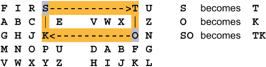
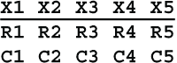
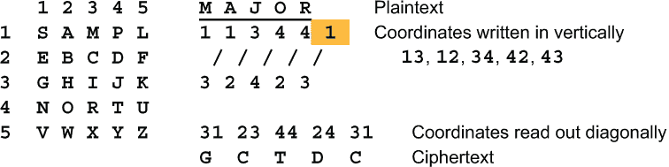

# 第九章：分数化

本章涵盖

+   Polybius 方阵

+   将一封信拆分成较小的部分，如比特或十六进制数字

+   混合和重新组合这些部分

密码学的前两个基本工具是替换和置换，这些内容涵盖在第 5 至 8 章。密码学的第三个基本元素是分数化。这意味着将语言的正常单位，即字母、音节和单词，拆分为较小的单位并对这些单位进行操作。较小的单位通常是比特、十进制数字、十六进制数字或其他进制的数字。本章涵盖了使用 2、3、5、6 和 16 进制的数字进行分数化，以及其他形式的分数化。

## 9.1 Polybius 方阵

可能是将字母表示为较小单位的最古老方法是*Polybius 方阵*，我们在第 4.4 节中看到过。在这里，每个字母由两个基数 5 位数字表示，共有 25 种可能的 2 位数字组合。（希腊人没有 0 的表示，因此他们的数字从 1 开始。）

这是第 4.4 节的 Polybius 方阵。每个字母都用方阵中的*坐标*表示，即通过其行号和列号表示。例如，字母 P 在第 2 行第 5 列，因此表示为 25。需要时，为了清晰起见，也可以写成 2,5。

Polybius 方阵本身可以产生多种不同的密码。例如，它可以通过用方阵中右边的字母（U 变成**V**）、下面的字母（U 变成**Z**）、下面和右边的字母（U 变成**S**）或左边的字母（U 变成**P**）等方式产生简单的替换。这个想法可以通过改变方向来扩展为多表密码，比如向右、向左、向下、向右、向左、向下等。你也可以走 2 个字母的距离或使用象棋中的骑士走法。

Polybius 方阵也可以用于生成*Polybius Ripple*密码。首先，将消息中的每个字母替换为其坐标，简单地写在一行中。从此列表中的第二个数字开始，将前一个数字加到当前数字上。如果总和超过 5，减去 5 以保持数字在 1 到 5 的范围内。然后再次使用 Polybius 方阵将这些数字转换回字母。

Polybius 涟漪密码评级为三。通过使用不同的 Polybius 方阵将坐标转换回字母，可以加强密码。

让我们看一下基于 Polybius 方阵的几种手写密码，涵盖在第 9.2 至 9.7 节。我在第 9.8 至 9.11 节中介绍了一些额外的手写方法。然后我在本章的其余部分讨论了一些计算机方法。

## 9.2 Playfair

*普莱费尔*密码是由查尔斯·维特斯通（发音为 WHIT-stun）于 1854 年发明的。维特斯通在电气工程师中以发明维特斯通电桥而闻名，该电桥用于测量电阻。维特斯通和威廉·库克在塞缪尔·摩尔斯发明他的键式电报几年前就发明了指针电报。库克在英格兰商业化了指针电报，比摩尔斯在美国成立电报公司早了几年。

维特斯通的密码被称为普莱费尔密码，因为维特斯通的长相类似的朋友利昂·普莱费尔男爵（两人都有红头发，身高约 5'2''）主张使用它，并说服英国外交部在外交通信中使用该密码。

历史插曲

由于这个密码并不被称为维特斯通密码，这使得维特斯通的名字可以用于他大约在 1860 年发明并在 1867 年巴黎世界博览会上展示的第二个密码。维特斯通密码机看起来像一个大口袋手表，由两个固定的硬纸板同心圆环和两个可移动的时钟指针组成，通过简单的钟表机制连接。内环可擦拭，每条消息都可以更改。这个环上有乱序的 26 个字母表，而外环有标准的 26 个字母表加一个空格，共 27 个位置。您将长时钟指针移动到外环上的明文字母位置，短指针移动到内环上的密文字母位置。当长时钟指针完成 27 个位置的一次旋转时，短指针也会移动 27 个位置，即完成一次完整的旋转再加上 1 个额外的字母位置。因此，短指针在每次旋转时都从不同的位置开始。相当于具有可移动环而没有指针的设备于 1817 年由军械长德西厄斯·沃兹沃斯制造，该设备基于托马斯·杰斐逊于 1790 年制定的计划，但维特斯通的名字永远与这个概念联系在一起。

照片由拉尔夫·辛普森提供。铭文如下

“密码学。C.维特斯通 Inv^r。”

普莱费尔密码基于波利比奥斯方阵，每次加密两个字母。也就是说，它加密的是双字母组。方阵可以通过使用第 5.2 节中的任何方法混合字母来准备。为了使字母适应 5×5 方阵，会省略一个低频字母，如 J、Q 或 Z。（在法语中，J、Q 和 Z 很常见，所以省略 W。在德语中，省略 Q、X 或 Y。）当省略的字母出现在消息中时，会选择其他字母替换它。在我们的例子中，每个 J 都被**I**替换。

下一步是将信息分成二元素，例如 ME ET ME TO MO RR OW。如果一个二元素是双字母的，则应该将其分开，通常是通过在中间插入一个 X 来实现。（这是不应该从方块中省略 X 的一个很好的理由。）另外，如果消息包含奇数个字母，则在末尾添加一个 X。消息变为 ME ET ME TO MO RX RO WX。现在我们准备好加密它了。

普莱菲尔有 3 条规则：（1）如果两个字母位于同一行，则每个字母都被其右侧的字母替换；（2）如果字母位于同一列，则每个字母都被其下方的字母替换；（3）对于所有其他字母，每个字母都被二元素的另一个字母所在的同一行中的字母替换。理解方块环绕，因此在第 9.1 节的方块中，Y 的右侧字母是 U，Q 下方的字母是 W。

这些规则可以用坐标来重新表述。让我们要加密的二元素是 r1c1 r2c2，因此第一个字母在第 r1 行第 c1 列，第二个字母在第 r2 行第 c2 列。现在这 3 条规则变为

1.  如果 r1 = r2，那么将替换为 r1，c1+1 r2，c2+1。

1.  如果 c1 = c2，那么将替换为 r1+1，c1 r2+1，c2。

1.  否则替换为 r1，c2 r2，c1。

让我们对我们的样本信息 ME ET ME TO MO RX RO WX 进行加密，看看这些规则是如何起作用的。第一个二元素是 ME。M 和 E 位于不同的行和不同的列，因此适用规则 3。M 位于第 2 行第 4 列，E 位于第 3 行第 2 列。因此，M 被替换为同一行的字母，即第 2 行，与字母 E 相同的列，即第 2 列。第 2 行第 2 列的字母是 S，所以 M 被替换为**S**。同样，E 被替换为第 3 行第 4 列的字母，即**C**。

同样地，ET 被**DO**替换，第二个 ME 被**SC**替换。字母 T 和 O 位于同一行，因此适用规则 1。它们被替换为其右侧的字母。T 被**N**替换，O 被**Q**替换。所以 TO 被替换为**NQ**。

MO 按照规则 3 进行。它被替换为**SR**。R 和 X 位于同一列，因此适用规则 2。RX 被替换为**XM**。RO 和 WX 都使用规则 1，被替换为**TQ**和**XY**。因此整个消息变为**SC DO SC NQ SR XM TQ XY**，在重新分组后变为**SCDOS CNQSR XMTQX Y**。

这里有一些图表可以帮助你形象化地理解大二元素 LY、TO 和 RX 是如何被加密的。

普莱菲尔密码一直被军事和外交用途使用，至少持续到 1960 年。接下来，让我们简要地看一下普莱菲尔密码如何被解密。

### 9.2.1 解密普莱菲尔密码

请注意，每个字母只能由其所在行上的其他 4 个字母和其下方的字母替换。对于每个字母，在网格中有其他 24 个字母。其中，只有其所在列中的 4 个字母会导致该字母被其下方的字母替换。因此，被下方字母替换的概率为 4/24，或 1/6。因此，它被其所在行上的另一个字母替换的概率为 5/6。

由于方格中有 5 行，而英语字母中频率超过 5% 的有 9 个字母，因此至少有几行包含至少 2 个高频字母。如果这样的行少于 4 行，则必须至少有一行包含 3 个高频字母。这些行中的其他字母在密文中将比任何其他字母更频繁地出现。如果您有足够的密文，那么密文中出现频率最高的 3 到 5 个字母很可能在方格的同一行上。

如果我们去除包含这些字母的所有双字母组合，那么剩余双字母组合中出现频率最高的 3 到 5 个字母很可能在方格的同一行上。知道了 5 行中的 2 行上的高频字母就足以开始重建方格了。下一步是尝试放置一些可能的单词。

Playfair 密码的评级为三。有几种方法可以增强 Playfair 密码的强度。我就提几种。

### 9.2.2 强化 Playfair 密码

这里有几种更强的 Playfair 密码变体。

Nullfair 或 nofair

在密文中可以按照重复的间隔添加空值，就像这样：

Nullfair 的评级为五。

Playfair+1

这种超级简单的增强方式在 Playfair 密文中添加了重复的二进制密钥。在有 1 位的地方，使用字母表的下一个字母。如果二进制密钥的长度为奇数，则 Playfair+1 更强大。

Playfair+1 的评级为五。 Playfair+1 也可以用三进制数完成。加法密钥中的数字保持较小，因此可以在脑中进行加法，而不需要表格。

双 Playfair

Playfair 密码可以通过两次应用来加强。在第二轮中，成对字母应跨越第一轮创建的双字母组合。 (1) 使用 Playfair 密码对消息进行加密。 (2) 将第一个字母移到末尾，将最后一个字母移到开头，或在两端都添加一个空值。 (3) 应用另一轮 Playfair。如果第二个 Playfair 密码使用了不同的混合字母表，则这是最强的。双 Playfair 的评级为六。

Playfair 涟漪

这是双 Playfair 的一种变体，只需通过消息进行一次传递，而且只需要一个 Polybius 方块。让明文为 P[1]P[2]P[3]P[4] ... 从左端开始，使用 Playfair 对明文二元组 P[1]P[2] 进行加密，产生密文二元组 C[1]C[2]。然后将 C[2]P[3] 作为第二个二元组进行加密，得到 D[2]C[3]。注意，D[2] 已经加密了两次。接下来，你将 C[3]P[4] 进行加密，得到 D[3]C[4]，依此类推，每一步向右移动一个字符。Playfair 波动被评为 Six。

由于密文的第一个字母 C[1] 和最后一个字母 C[n] 仅加密了一次，因此你可能希望将它们作为一个二元组加密以完成循环。

PolyPlayfair

使用两个不同的 Polybius 方块，并通过使用重复密钥在它们之间交替。例如，密钥为 11212 意味着在每个 5 个二元组的周期中，第一个、第二个和第四个二元组将使用方块 1 进行加密，而第三个和第五个二元组将使用方块 2 进行加密。这可以扩展到三个或更多方块，相应的设置时间会更长。使用两个方块和不超过 10 位数字的密钥，PolyPlayfair 的评级为 Five。如果密钥是由 Chained Digit 算法生成的，当数字为 0 到 4 时使用第一个方块，当数字为 5 到 9 时使用第二个方块，评级会增加到 Six。（注意：使用链式数字序列的奇偶性具有更短的周期，因此它更弱。）

转位

使用 Playfair 密码对明文进行加密后，可以对结果的密文进行转置。转置可以像第 7.2 节的栏转置那样复杂，也可以像第 4.6.1 节的 Bazeries 类型 4 密码那样简单。使用栏转置，Playfair 评为 Seven。使用分段反转，Playfair 评为 Five。

## 9.3 双方块

*Two Square* 密码，有时称为 *双 Playfair*，是 Playfair 密码的改进版本。它是由法国业余密码学家费利克斯·玛丽·德拉斯泰尔（Félix-Marie Delastelle）发明的，并在他的 1902 年著作 *Traité Élémentaire de Cryptographie* 中描述。顾名思义，它使用两个 Polybius 方块而不是一个，因此有两个混合字母表而不是一个。这两个方块可以水平并排放置，也可以垂直从底部到顶部放置。水平版本如图所示。在此示例中，使用关键词 FIRST 和 SECOND 混合了两个方块，并且省略了字母 Q 以适应 5×5 网格。

与 Playfair 一样，消息每次加密 2 个字母。也就是说，Two Square 加密双字母组。要加密双字母组 SO，我们在左方块中找到 S，在右方块中找到 O。S 的替代字母是右方块中与 S 同一行且与 O 同一列的字母，即**T**。O 的替代字母是左方块中与 O 同一行且与 S 同一列的字母，即**K**。因此，双字母组 SO 变成了**TK**。

与 Playfair 不同，不需要分开双字母。两个字母可以在两个方块的不同行上。例如，SS 变成**MK**。在大多数情况下，密文中的双��母不会对应于明文中的双字母。

这里是替换过程的可视化展示。

Two Square 密码的一个重要弱点是，当一个双字母组的两个字母在网格中的同一行时，替代字母就是这两个字母的反向。例如，ST 会变成**TS**。这种弱点被称为*透明性*，有时会导致整个单词泄露出来。例如，SU ND AY 会变成**US DN YA**。

为了防止这种情况，我提出了这个*相同行规则*：当两个字母在同一行上时，它们被它们下面的字母替换，必要时回到顶行。例如，ST 现在会变成**DY**，VI 会变成**FP**。

使用相同行规则，Two Square 评级为四。将这种变体称为*Two Square B*。

德国人字面上采用了“双 Playfair”这个名称。他们使用了 Two Square 密码对每个双字母组进行加密，然后再次使用相同的两个方块进行加密。结果基本上是一个通用的双字母替换（第 6.5 节）。

加强 Playfair 密码所使用的方法也可以用于加强 Two Square 密码，比如*TwoSquare+1*和*Two Square Ripple*，评级相同。这里是一个额外的变体。

Playfair TwoSquare

Two Square 密码使用了两个 Polybius 方块。这两个方块中的任何一个都可以用于 Playfair 密码。这提示了一种混合方法，将 Playfair 和 Two Square 结合起来。同样，我们将使用一个数字密钥来控制每个连续双字母组的加密。1 表示使用左方块中的 Playfair 加密双字母组，2 表示使用右方块中的 Playfair 加密双字母组，3 表示使用 Two Square 或 Two Square B 加密双字母组。最好是数字密钥至少包含每个数字。由于 Two Square 比 Playfair 更强大，3 应该比 1 或 2 在密钥中更频繁出现。大约 50% 是合适的。*Playfair TwoSquare* 评级为六。

## 9.4 三方块

*Three Square* 是我的独创想法。否则，它没有特别的优点。我在这里包括它只是因为我在为这本书做研究时阅读的一本书说 Two Square 不能扩展到超过两个方块。我喜欢挑战。

顾名思义，Three Square 使用三个 Polybius 方格。这些方格应该与独立的密钥混合得很好。Three Square 每次加密 3 个字母，也就是加密三字母组合。这比 Two Square 更强大。

基本思想是，每个字母都被其右侧方格中的一个字母替换。替换字母与原字母在同一行，但在下一个三字母组合中的列中。

假设我们希望加密三字母组合 THE。第一个字母是 T，第二个字母是 H，第三个字母是 E。我们使用第一个方格中的 T，第二个方格中的 H 和第三个方格中的 E 进行加密，就像这样。

T 的替代字母位于包含 T 的行，以及第二个方格中包含 H 的列，所以 T 被替换为**V**。H 的替代字母与第三个方格中包含 E 的列上的 H 在同一行，所以 H 被替换为**R**。E 的替代字母与第一个方格中包含 T 的列上的 E 在同一行，所以 E 被替换为**Z**。因此，THE 变成了**VRZ**。

这可以如下图所示：

解密是相反的过程。由于密文三字母组合**VRZ**的第一个字母来自第二个方格，我们从第二个方格开始解密，像这样：

Three Square 比 Two Square 更容易出现字母位于同一行的问题。在 XYZ 这样的三字母组合中，可能出现 X 和 Y 在同一行，Y 和 Z 在同一行，或者 Z 和 X 在同一行。这需要额外的两条规则来防止透明度，其中一个字母表示它自己。

*规则 1：* 如果三字母组合中连续的两个字母位于同一行，则这两个字母中的第一个被加密为第二个字母的右侧字母，如果需要则绕到左侧列。例如，在三字母组合 SUB 中，S 在第一个方格的顶行，而 U 在第二个方格的顶行。因此 S 被替换为**V**而不是**U**。类似地，在三字母组合 LET 中，T 在第三个方格的第三行，而 L 在第一个方格的第三行。所以 T 被替换为**G**而不是**L**。

这个图示说明了规则 1。没有规则 1，在三字母组合 SUB 中，S 将被**U**替换。相反，它被中间方格中 U 右侧的字母替换，即**V**。没有规则 1，在三字母组合 LET 中，T 将被**L**替换。相反，它被左方格中 L 右侧的字母替换。这从第 5 列绕到第 1 列，其中有字母**G**。

*规则 2：* 如果三元组中的所有三个字母都在同一行上，那么每个字母将被其下方的字母替换，如果需要，将回到顶行。因此，FUN 将被替换为**AZV**，而 WRE 将被替换为**IXL**。

根据这些规则，三方格被评为五。

Playfair ThreeSquare

三方格密码使用三个波利比斯方格。这些方格中的任何一个都可以用于 Playfair 密码。这表明了一种混合方法，将 Playfair 和三方格密码混合在一起。您可以使用数字密钥，例如 1,4,1,3,4,2,4 来控制每个连续的二元组或三元组的加密方式。1 表示使用第一个方格中的 Playfair 将下一个 2 个字母加密为二元组。2 表示使用第二个方格中的 Playfair 将下一个 2 个字母加密为二元组。3 表示使用第三个方格中的 Playfair 将下一个 2 个字母加密为二元组。4 表示使用三方格将下一个 3 个字母加密为三元组。最好是数字密钥至少包含每个数字。由于三方格比 Playfair 更强大，数字 4 应该比数字 1、2 或 3 更频繁地出现在数字密钥中。大约 50% 的频率是合适的。也就是说，4 应该与 1、2 和 3 的总和一样频繁出现。同样，生成从 1 到 6 的随机数，并使用 4、5 或 6 进行三方格加密。

由于 Playfair ThreeSquare 混合了二元组和三元组，大约一半的二元组和三分之二的三元组不会落在偶数边界上。这意味着强度的增加比 Playfair TwoSquare 的增加更大。Playfair ThreeSquare 被评为七。

可以将 Playfair、Two Square 和 Three Square 结合成一个更复杂的密码，毫无疑问具有更强的强度，但是 Playfair ThreeSquare 已经在推动人类代码员的极限。速度和准确性都会受到影响。

还有一种相反的方法，我称之为*跨三方格*。将明文分组成包含每行四个 3 个字符块的行。使用三方格密码对每个块进行加密。现在，取第一个块的最后一个字母和第二个块的第一个字母，并使用第一个波利比斯方格的 Playfair 密码对该二元组进行加密。取第二个块的最后一个字母和第三个块的第一个字母，并使用第二个波利比斯方格的 Playfair 密码对该二元组进行加密。取第三个块的最后一个字母和第四个块的第一个字母，并使用第三个波利比斯方格的 Playfair 密码对该二元组进行加密。这样可以提高三方格密码的强度，而不会增加太多复杂性或时间。始终使用相同行规则。

## 9.5 四方格

*四方密码*是由 Félix-Marie Delastelle 大约于 1890 年发明的，并在他于 1902 年去世后的 3 个月出版的书籍*Traité Élémentaire de Cryptographie*中描述。Delastelle 在四方密码之后发明了双方密码，作为简化且稍微不那么安全的版本。然而，使用第 9.3 节中描述的同行规则，可以认为这两种密码的强度相等。

如其名称所示，四方密码利用四个 Polybius 方块。其中两个方块包含标准字母表，另外两个方块包含使用独立密钥混合的字母表。消息以两个字母为一组进行加密，即四方加密二元组。

这是一个示例排列。

加密使用熟悉的矩形方案。您在标准字母表中定位两个明文字母，并将它们替换为矩形对角线上的字母，如下所示：

由于两个明文字母永远不可能在 10×10 网格的同一行或同一列中，因此无需特殊规则或分隔双字母。唯一需要空字符的情况是为了完成最后一个双字母组合。四方加密的评级为五。

循环方法

要获得更大的强度，您可以使用类似于第 4.6.1 节中的分段反转的简单换位。此换位使用重复的数字密钥，例如 1、3、1、4、2、6。将密文分成 7 个字符或任何其他奇数长度的块。在每个块的上方写下连续的密钥数字。然后将每个块左移其密钥数字指示的位置数。例如，如果密钥数字是 4，则将最左边的 4 位数字移动到块的右端。这是一个例子：

使用循环方法的四方加密的评级为六。

分半方法

加强四方加密的另一种方法是事先转置消息。假设消息是 AMBASSADOR WILKINS ASSASSINATED KABUL TODAY。这有 39 个字母。将 39 除以 2 并四舍五入得到 20。将消息写成两行，每行 20 个字母，并从垂直方向读取双字母组合。使用四方进行这些双字母组合的加密。

这些双字母组合不再具有正常的双字母组合频率或英语双字母组合的正常联系频率。使用分半方法的四方加密的评级为七。

## 9.6 双分

让我们再看一个基于 5×5 波利比乌斯方阵的历史手工密码。这是*双重*密码，也是在 19 世纪 90 年代由菲利克斯·玛丽·德拉斯特尔发明的。双重是一个 3 步密码，其中(1)字母被转换为它们的波利比乌斯坐标，(2)这些坐标被重新排列，(3)然后坐标被转换回字母。最初，德拉斯特尔将整个消息写出，坐标垂直写在每个字母下面，然后他将坐标对水平地读出，先横穿顶行，然后横穿底行。

现代方法是将消息分成固定大小的块。块大小应该是奇数，如 5、7 或 9。如果块大小是偶数，则艾米莉可以将块分成二元组。

第一步是将字母转换为波利比乌斯方阵中的坐标。假设块长度为 5。5 个明文字母可以表示为 X1、X2、X3、X4 和 X5。它们的行和列坐标可以表示为 R1C1、R2C2、R3C3、R4C4 和 R5C5。这些 R 和 C 符号各自是从 1 到 5 的数字，先是行坐标，然后是列坐标。这些坐标对是垂直地写在每个块的每个字母下面，像这样：

然后按照 R1R2、R3R4、R5C1、C2C3、C4C5 的顺序读取。这里是一个例子。使用关键词 SAMPLE 混合的波利比乌斯方阵对单词 MAJOR 进行了加密。

请注意，密文中的第三组字母坐标，**R5C1**，是一个行/列对。这意味着第三个密文字母将来自与第五个明文字母相同的行，**R5**，以及与第一个明文字母相同的列，**C1**。这个同时出现行坐标和列坐标的情况被称为*自然*。

由于方阵中每行有 5 个字母，每列有 5 个字母，所以第三个密文字母与第五个明文字母相同的概率为 1/5，第三个密文字母与第一个明文字母相同的概率也是 1/5。也就是说，**R5C1**与**R5C5**相同的概率是 20%，而**R5C1**与**R1C1**相同的概率也是 20%。在这个例子中，确实发生了这种情况。第五个明文字母是 R，第三个密文字母也是**R**。

现在看看第一个密文字母**R1R2**。这是一个行/行对，而不是一个行/列对。在这里，只有第一个坐标**R1**处于正确的位置，形成了一个行/列对。另一个坐标**R2**是列位置上的行坐标。这样的单一放置被称为*半自然*。它意味着第一个密文字母来自波利比奥斯方阵的与第一个明文字母相同的行。因此，第一个密文字母与第一个明文字母相同的机会为 20%。

第二、第四和第五个密文字母也是如此。它们中的每一个都落在明文字母的同一行或同一列中的一个。因此，它们每一个有 20%的机会与该明文字母相同。在这个例子中发生了这种情况，第二个密文字母**J**与第三个明文字母相同。

这是 bifid 密码的一个严重弱点，使得 Emily 能够猜测并放置可能的单词。另一方面，如果明文和密文字母不同，则知道它们位于同一行或列中。在本例中，第一个明文字母**R1C1**是 M，第一个密文字母**R1R2**是**S**。这意味着 M 和 S 必须在波利比奥斯方阵的同一行中。当 Emily 推断或猜测一个单词时，这提供了几个这样的等价物。这反过来又使得放置其他单词变得更容易。当积累了足够多的这些字母对时，Emily 可以重构方阵。

由于这些弱点，bifid 密码评分为三。

### 9.6.1 共轭矩阵 bifid

这些问题可以通过使用不同的 Polybius 方阵将坐标转换回字母来消除。例如，方阵 2 产生的密文是**VBJEF**。

两个单独的波利比奥斯方阵组成的双重 Polybius 方阵被称为*共轭矩阵 Bifid*。在这个上下文中，矩阵只是指一个字母或字符的矩形数组。共轭矩阵 bifid 密码评分为五。

有几种方法可以增强 bifid 密码的强度。一种方法是使用重复的数字密钥来改变块长度，例如 5、11、7。块长度将是该密钥的循环重复，即 5、11、7、5、11、7、5、... 如果您愿意，您可以通过使用链式数字生成器生成块长度，并将数字翻译为奇数块长度。一种可能性是

因此，如果生成器生成数字 3、6、2、7，...，那么块长度将为 11、7、9、9、...

使用短重复密钥和共轭矩阵的密码评分为六。使用长重复密钥或使用随机数生成器生成块长度的密码评分为七。

另一个类似的想法是从每个块的不同起点开始读出坐标。你可以使用一个数字密钥来指定起点的顺序。如果块的长度为 L，密钥中的每个数字可以是从 1 到 2L 的任何位置。从 1 到 L 的数字表示坐标顶行的起始位置，而从 L+1 到 2L 的数字表示底行的起始位置，就像这样：

坐标将成对地从左到右读取。这是使用数字密钥 4、9 读取坐标的顺序。起始位置 4 和 9 已经阴影化。

这种方法将评级提高到六。

加强双重栅栏密码的另一种方法是使用更强的置换来混合坐标。使用长度为 L 的标准双重栅栏将 2L 个坐标写入 2×L 块中。坐标被垂直写入块中，水平读出。我们将其识别为一个非常简单的路径置换，描述在第 7.1 节。在第七章中涵盖了几种更强的置换，尤其是列置换。这种密码的一个例子是由情报官尼布尔中尉发明并由德国人在第一次世界大战中使用的*ADFGVX*密码。在 ADFGVX 密码中，由字母 A、D、F、G、V、X 表示的坐标通过列置换混合，然后作为这些字母的字符串传输。这种密码的评级为五。

如果你使用更长的块，比如 20 个字符，那么将会得到 40 个坐标。（使用这种方法，块的长度可以是偶数也可以是奇数。）这足以有效地使用列置换来混合坐标。或者，你可以回到德拉斯泰尔的原始概念，并将整个消息的坐标作为单个块。无论哪种方式，使用共轭矩阵，此密码的评级为八。使用双列置换，密码的评级为十。假设有四个长的独立密钥和混合良好的字母表，这是一种无法破解的纸笔密码。称之为*双列置换双重栅栏*。

## 9.7 对角双重栅栏

对双重栅栏密码的变种是将波利比斯坐标垂直地写在每个字母下面，然后沿对角线从左下到右上（或从西南到东北）读取它们。这被称为*左对角线*或*反对角线*。（在纹章的冠上，它被称为*邪恶的酒吧*，并表示非婚生的出生。）对于最后一个字母，你会回到第一列（阴影部分的数字 1）。这样做的好处是没有自然数或半自然数可以帮助艾米莉猜测单词。这是一个例子。

对角 bifid 被评为 Four。与共轭矩阵一起，它被评为 Five。与共轭矩阵和定期变化的块大小一起，它被评为 Six。与古典 bifid 不同，对角 bifid 可以使用奇数和偶数块大小。

## 9.8 6×6 方阵

如果你的消息包含很多数字，使用 6×6 的 Polybius 方阵而不是 5×5 方阵可能会更有优势。6×6 方阵允许您使用完整的 26 个字母表以及从 0 到 9 的数字。不需要从字母表中省略 J 或 Q。如果你正在手动加密，这就需要额外小心地区分字母 O、I、Z、S 和 G 与数字 0、1、2、5 和 6。一些人采用特殊的惯例，例如在所有数字下划线。我觉得这样很麻烦且容易出错。我通常只是夸大区分这些字符与它们的同伴的特征，例如用额外宽的衬线写字母 I。

前面 5 节中的所有方法，即 Playfair、Two Square、Three Square、Four Square 和 Bifid，都可以与 6×6 方阵一起使用，以及它们的所有变体。

## 9.9 三重置

如果你喜欢方阵，那么立方体呢？另一种分数方法，也是在 1890 年代由 Félix-Marie Delastelle 发明的，是 *Trifid* 密码。与通过在基数 5（五进制数）中的两位数字来代表字母不同，每个字母由三位基数为 3 的数字（三进制数）表示。这给出了 3×3×3，或 3³，不同的 3 位数字组合。这足以表示字母表中的所有 26 个字母加上一个额外的字符。Delastelle 使用了一个 + 加号表示第 27 个字符。

额外的字符 + 可以用作标点符号的形式，或者它可能是一个信号，表示接下来的明文字母应该被解释为一个数字。对应关系 +A = 1, +B = 2, ... , +J = 0 可以被使用。字母表的其余部分也可以被用作特殊字符。例如，+K 可以表示句号，+L 可以表示逗号，等等。

就像 2 位数字组合可以显示为 5×5 字母方阵一样，3 位数字组合可以显示为 3×3×3 字母立方体。每个三元组中的 3 位数字可以被解释为该字母位于的立方体中的坐标。这些坐标通常称为层、行和列。

这里是 27 个三元组合，按顺序排列，字母等效通过使用关键词 EXAMPLE 弱混合，并交替列。例如，字母 N 由三元组 102 表示，因此它将位于 3×3×3 字母立方体的第 1 层、第 0 行和第 2 列。

三方加密器的工作原理与双重加密器类似。明文按固定大小的块写入。大小可以是任何不是 3 的倍数的数字。将这 3 位数字垂直写在每个消息字母下面，然后水平分组读取。然后使用相同的等价关系将它们转换回字母。这里有一个明文为 SEND HELP，块大小为 4 的示例。

用于双重加密器的相同分析和技术也可以应用于 trifid，并且具有相同的评级。您可以使用两个单独的替换表将字母转换为数字，然后将数字转换回字母。您可以变化块的大小。您可以从每个块的不同位置开始读取数字。您可以使用强大的置换来混合三进制数字。

一个自然的问题是是否有与对角双重加密器类似的对角 trifid 加密器。对角双重加密器比原始双重加密器的优势在于，对角版本不会产生削弱原始版本的半自然数。在类似的对角 trifid 中，每组的中间数字将是第三自然数，因此失去了优势。然而，如果您使用两个不同的混合字母表，一个用于数字的书写，另一个用于读取它们，则自然问题会消失。带有两个字母表的对角 trifid 的评分为五。

## 9.10 三方加密器

当我在打前面关于 trifid 加密器的段落时，我意识到 3×3×3 的立方排列非常适合于描述第 9.3 节中描述的双重加密器的三维类比。在两个维度中很容易想象双重加密器，但在三个维度中很难想象一个立方体，因此我将仅根据坐标描述新的加密器。让我们将此加密器称为 *三方加密器*。

两方加密器一次加密两个字母，使用两个替换表，因此三方加密器会一次使用三个替换表加密三个字母。这里是使用关键字 COLUMBIA、STANFORD 和 HOPKINS 很好地混合了的三个表。这三个替换表分别标记为 S、T 和 U。这里的 S 表示替换（Substitution），T 表示表（Table），U 表示字母表中的下一个字母。

替换表对应字母表的 26 个字母和字符 + 与 27 个三元组。

与 trifid 类似，三方加密器首先将每个字母的 3 位数字三元组垂直写在其下方。第一个字母的 3 位数字来自替换表 S，第二个字母的 3 位数字来自表 T，第三个字母的 3 位数字来自 U。该模式在此处显示，并由三元组 FLY 进行说明。

然后从左到右读出数字，并将这些水平三元组转换回字母。使用表 S 转换顶行，表 T 转换中行，表 U 转换底行似乎很自然。然而，这会导致顶行与左列相同的概率为 9 分之 1，因此第一个明文字母将被自身替换。也就是说，S1S2S3 与 S1T1U1 相同的可能性为 9 分之 1。中行和底行也是如此。让我们将这种情况称为*部分自然*。

为此，第二行使用替换表 S，第三行使用表 T，顶行使用表 U。这样就消除了自然性。以下是模式。

由于手动加密时很难保持清晰，我建议在每个数字三元组上面写上替换表的选择。这类似于使用贝拉索密码（第 5.5 节）时在每个明文字母上写上密钥字母。以下是使用明文消息 FLY TO ROME 的三方块加密的示例。

三方块密码的评级为七。

有一种简单的方法可以加强三方块密码。不再像刚才那样使用三个替换表严格轮换地将三元组转换回字母，而是使用一个密钥来设置读出表的顺序。该密钥将由字母 S、T 和 U 以某种打乱的顺序组成，例如 SUTUTTUUSTS。这个密钥的长度不应该是 3 的倍数。我将这个变种称为*三方块加密*。以下是使用这个读出密钥对 FLY TO ROME 进行加密的方法。

使用三方块加密，大约有三分之一的字母会有部分自然性。也就是说，三个填写数字中的一个将与三个读出数字中的一个相同。然而，艾米丽不会知道哪些字母有这种缺陷，也无法利用它。

三方块加密的评级为九。

因此，你可能会说，是否可能将评级提高到十，而不使密码对手工使用过于复杂？感谢你的提问。首先，让我们将替换表的数量从 3 增加到 6。让我们称它们为 S、T、U、V、W 和 X。我们将不再使用严格的 STU、STU、STU...轮换写入三元组，而是使用另一个字母密钥，该密钥由这 6 个字母以某种打乱的顺序组成。填写密钥可以是 TWXUSTTVWV，读出密钥可以是 VWTXXSUSVTU。理想情况下，这些密钥的长度应该是互质的，并且两者的长度都不可被 3 整除。在这里，长度分别为 10 和 11。我们将这个密码称为*三方块超级密码*。这是一个使用明文 FLY TO NEW YORK 的三方块超级密码的示例。

三方块超级密码的评级为十。这是另一种不可破解的手工加密。

## 9.11 矩形网格

到目前为止，我们只讨论了字母的方形和立方体阵列。在密码学中，没有要求字母网格的所有维度都相同的限制。英文字母表有 26 个字母基本上是历史的偶然。如果我们使用 33 个字母的俄语字母表，我们可能会选择 4×8 或 5×7 的矩形。

如果我们想要所有 26 个字母的字母表，那么 3×9 或 4×7 的矩形可能更可取。这些给您提供了完整的 26 个字母的字母表，再加上一个或两个额外字符。我们之前已经讨论过这些额外字符的使用，例如用于在字母和数字之间切换。基于波利比奥斯方格的大多数密码与 5×5 方格一样适用于 3×9 或 4×7 的矩形，假设所有矩形都以相同的方向排列。这些是 Playfair、Two Square、Three Square、Four Square 和对角线 bifid 密码。

实际上，当与那些矩形一起使用时，这 5 种密码可能更强大，因为字母表中的每个字母都有更多可能的替代字符。使用 Playfair 或 Two Square 时的缺点是，两个字母在同一行的概率较高，因此它们将被其下方或右侧的字母替换。

下面是使用 3×9 矩形进行 Playfair 密码的示例：

## 9.12 十六进制分数

到目前为止，本章仅专注于手动方法。这意味着仅使用大写字母的小数组。对于计算机使用，通常希望使用完整的字母表，包括大写和小写字母、数字、标点符号、特殊符号、音标，以及可能是多个字母表。简而言之，您可能希望拥有计算机的完整文本功能。做到这一点的最简单方法是使用标准计算机代码之一，如 UTF-8 或 UTF-16，将每个字符表示为一个 8 位字节。

将 8 位字节分数化的一种自然方式是将其拆分为两个 4 位十六进制数字，或十六进制数字。所有基于波利比奥斯方格的分数化方法也适用于 16×16 方格，即 Playfair、Two Square、Three Square、Four Square 和 bifid。如果 16×16 方格使用大密钥混合得很好，那么这些方法比使用 5×5 方格的同一方法更强大。这是因为 256 个字符的排列方式远远多于 25 个字符的排列方式，即 8.58×10⁵⁰⁶与 1.55×10²⁵。

使用十六进制分数化的简单方法是：(1)通过使用混合得很好的密钥替换表将消息的字符转换为十六进制数字，(2)使用一些置换密码对这些数字进行混淆，然后(3)使用第二个混合得很好的密钥替换表将十六进制数字的对转换回字节。

最简单的转位法就是将第一个十六进制数字移到末尾，这样 `12 34 56 78` 就会变成 `23 45 67 81`。这可能被称为 *Cycle Hex*。它本质上是对角线的二重置位（第 9.7 节），只不过是在基数为 16 而不是基数为 5 下进行的。Cycle hex 评级为 Five。你也可以使用第 4.6.1 节描述的逐段反转置换来打乱字母顺序。这可能被称为 *Piecewise Hex*。它也评级为 Five。一种更强大的方法是使用列转位密码来打乱十六进制数字。这可以称为 *Columnar Hex*。它评级为 Seven。使用双列转位置换后，评级增至 Ten。

这些方法可以用于对任何计算机文件进行加密。但是，如果文件是纯文本，则可以进一步增强这些方法。纯文本通常会使用少于 256 个可能的字节值中的 100 个以下。其余的字符代码可以用于空值、双字母组、三字母组和第 6.4 节描述的其他用途。如果做得好，这会将 cycle hex 的评级提升至 Six，piecewise hex 的评级提升至 Six，columnar hex 的评级提升至 Eight。

## 9.13 位级分数化

分数化也可以用于表示消息中代表字符的各个位。长度为 N 的字符块将由 8N 位表示。这些可以以几种方式形成矩形，例如 2×4N、4×2N、8×N 和 N×8。例如，5 个字母的块将由 40 位表示，可以写成 2 行 20 位、4 行 10 位、8 行 5 位或 5 行 8 位。这对手工操作来说很麻烦，但在计算机上很容易实现。

这是一个示例，展示了如何将 5 个字符水平写入一个 5×8 的块中，然后垂直读出。此示例使用标准的 UTF-8 字符代码。例如，大写字母 A 表示为 01000001。明文是单词 DELTA。

位按列向下读取。由于每列只包含 5 位，因此每个密文字节必须跨越两列或更多列。第一个密文字节的 8 位位于列 1 和列 2 中，并用中等高亮度显示。第一列包含 00000，第二列的前 3 位为 111，因此密文的第一个字节为 00000111，或十六进制 07。这是控制字符 BELL，可以追溯到电传打字机时代，当时会发出退格铃声。它现在已经没有图形表示。我会用符号 **♪** 来代表铃声字符。

第二个密文字节来自跨越列 2、3 和 4 的较暗突出部分。第二列的最后 2 位是 11，第三列包含 00000，第四列的第一位是 0。结合这些，第二个密文字节为 11000000。这代表字符 **À**，是一个带重音符号的大写字母 **A**。

密文的第 3 和第 4 个字节是**“**和**x**，即双引号和小写字母 x。第五个字节来自第 7 和第 8 列，即 000 和 01001。字节 00001001 代表**HTAB**，或水平制表符，是看不见的。我将使用箭头头部**►**来表示它。因此密文是**♪À“x►**。

这看起来很神秘，但这种方法很弱，因为它在将明文转换为比特和将比特转换回字符时使用了标准字母表。它被评为一。如果这些步骤使用了两个独立的混合密钥字母表，则此密码只是共轭矩阵双字母变体（9.6.1 节）的二进制版本。这种方法可以称为*Hex Rectangle*。它与共轭矩阵双字母变体密码具有相同的评级，即五。

自然地将八个 8 位字节形成一个 8×8 比特方块。使用一个混合字母表将每个字符的 8 位写入方块中，并使用另一个混合字母表水平地读取它们。这只是十六进制矩形的一个 8×8 方块版本，评级为六。

### 9.13.1 循环 8×N

提高此密码的强度很容易。对于任何 N 个字符的块，垂直地将它们的 8 位表示写入 8×N 的矩形中。将每行循环地向左移动 0 到 N-1 位位置。例如，abcdefgh 循环左移 2 个位置将得到 cdefghab。然后垂直地读取每个 8 位列。这里有一个使用 8×8 比特方块的示例。每行都按其左侧指示的量向左循环。

这种密码已经达到了手工操作的极限。它需要 3 个密钥，即两个用于混合两个字母表的密钥，以及一个用于指定位移量的 8 位数字密钥。它可以称为*Cyclic 8×N*。当 N 为 6 或更大时，它被评为七。随着块大小 N 的增加，密码变得更强大。

当矩形是正方形时，你可以同时旋转行和列，得到一个*Bicyclic 8×8*密码。你应该交替方向进行。水平写入位，垂直循环位，水平循环位，然后垂直读取字符。Bicyclic 8×8 被评为八。

循环 8×N 密码可以重复以获得*双循环 8×N*密码。这需要 5 个密钥，即 3 个用于混合 3 个字母表的密钥，以及两个用于控制 2 轮移位的 8 位密钥。共有 5 个步骤。（1）使用第一个字母表进行简单替换。生成的 N 个字节被垂直地写入 8×N 位的矩形中。（2）使用第一个移位密钥循环移动行。（3）使用第二个字母表对 N 列执行简单替换。（4）使用第二个移位密钥循环移动行。（5）使用第三个字母表对垂直列执行最终的简单替换。注意，所有的移位都是水平的，所有的替换都是垂直的。双重循环 8×N 密码的评级为九。

如果需要，可以继续进行*三重*、*四重*等等。所有这些变化都可以通过周期性地或使用随机数发生器来变化块大小来进一步增强。

## 9.14 其他分数

在第 9.12 和 9.13 节中，我们看过将一个字节分成两个十六进制数字或分成八个单独的位。将 8 位分成许多其他方式，如 3,2,3。如果将每个字符的 3,2,3 位表示垂直地写下来，然后将 3 行按某个位置数循环向左移动，那么每一列仍然会有 3,2,3 位的分布，因此 8 位可以被转换回字节。这里是一个例子。每一行按左边显示的位置数循环左移，即分别为 1 个位置，3 个位置和 2 个位置。

这里明文 RETEAT 已经被转换成了密文**@w«****θ****K_****╝**。我们称之为*BitCycle Substitution*。这种方法的评级为五。与第 9.13.1 节中的循环 8×N 密码一样，这可以加倍、三倍或更多，并且块大小可以变化。

这个基本思想可以以两种强大的方式进行增强。

首先，字节可以被分成几种不同的方式，例如 1,3,2,2 或 2,4,2。例如，你可以首先使用 3,2,3 的分割方式对块进行加密，然后使用 1,3,2,2 的分割方式重新加密，然后再使用 2,4,2 的分割方式重新加密。这将涉及 7 个密钥和 7 个步骤。（1）使用第一个替换产生消息的 3,2,3 位表示。（2）使用第一个移位密钥移动 3 行。（3）使用第二个替换产生字节的 1,3,2,2 位表示。（4）根据第二个移位密钥移动 4 行。（5）使用第三个替换产生字节的 2,4,2 位表示。（6）根据第三个移位密钥移动 3 行。（7）使用第四个替换产生最终的密文字节。

其次，消息区块可以以几种不同的方式划分。假设你使用长的明文区块，比如 32 个字符。对于前一种技术的第 2 步，你可以将 32 字节分成 6、14 和 12 字节的组。对于第 4 步，你可以将 32 字节分成 11、8 和 13 字节的组。对于第 6 步，你可以将 32 字节分成 8、17 和 7 字节的组。每个组都将独立移位。这种划分对每条消息可能是不同的。

或者，你可以采取更包容的方法。对于第 2 步，将整个消息划分为大小为 X 的区块。对于第 4 步，将消息划分为大小为 Y 的区块。对于第 6 步，将消息划分为大小为 Z 的区块。X、Y 和 Z 的长度可以是从 6 字节到整个消息长度的任意长度。

我不会评价所有 BitCycle 替换的变体。可以说，评级可能从五到十不等。在第十二章中，我将描述如何验证一个区块密码是否真正值得得到十分评级。

## 9.15 更强大的区块

本章描述的几种密码技术适用于明文区块。有几种方法可以对明文区块进行处理，使你的密码对艾米莉来说稍微困难一些。以下是一些想法的简短列表：

+   周期性或伪随机地改变区块长度。

+   反转每个区块的前几个字母，周期性或伪随机地。

+   反转每个区块的最后几个字母，周期性或伪随机地。

+   周期性或伪随机地将每个区块向左或向右循环。

+   将区块的最后 N 个字母与下一个区块的前 N 个字母交换。

但要警告一句：如果你手动加密和解密，请谨慎使用这些方法。如果你使你的密码变得如此复杂以至于无法准确加密和解密，那么它就变得毫无价值。
