# 第十章：可变长度分数化

本章涵盖

+   基于摩尔斯电码的密码

+   混合字母和双字母

+   可变长度二进制码字

+   基于文本压缩的密码

本章涵盖了一系列广泛的分数化密码，其中明文组和/或密文组具有可变长度。 这些包括单体-双体（第 10.2 节）、哈夫曼替代（第 10.4 节）和 Post 标签系统（第 10.5 节）。

在第 4.4 节中，我用 M. E. Ohaver 的分数化摩尔斯密码的两个版本描述了分数化的概念。 分数化摩尔斯是可变长度分数化的示例，因为它使用 1、3 和 4 个符号的摩尔斯组。 让我用一个类似于第 9.9 节中描述的三重密码的不同形式的摩尔斯分数化来开始可变长度分数化的更广泛讨论。 让我们称之为 Morse3。

## 10.1 Morse3

*Morse3*是一个分为 4 步的密码。（1）用摩尔斯码组替换消息的字母。 您可以使用标准摩尔斯码，也可以使用第 4.4 节中的混合摩尔斯字母。 （2）使用**/**符号分隔摩尔斯组。 使用双**//**来分隔单词并标记消息的结束。 （3）将符号分成 3 个组。 如果需要，附加额外的**·**或**··**以完成最后一个 3 个符号的组。 收件人将忽略在最后**//**之后的这些额外点。 （4）使用第二个混合字母表为每个 3 个符号组替换一个字母。

为了说明，我将使用第 4.4 节中的混合摩尔斯字母（在这里显示在左侧）来形成摩尔斯组。 这仅使用 1、3 和 4 个符号的组，但也可以使用 2 个符号的组，例如作为空或同音字。 从摩尔斯符号到字母的替换使用了一种类似于三合一密码的混合字母表，只是使用了摩尔斯符号**· - /**，而不是数字 0 1 2\. 请注意，**///**永远不会出现，因此不必提供它的字母替代。 因此，只需要 26 个替代品。

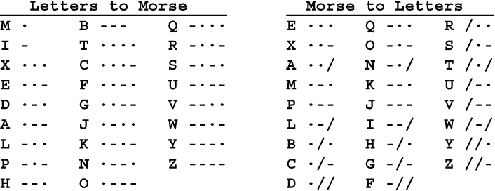

让我们对样本消息 SEND AMMO 进行加密。

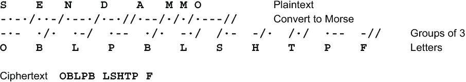

如果在替换步骤中使用了混合的键入字母表，则此密码被评为五。 Morse3 的一个缺点是密文比明文要长。 在此示例中，8 个字母的明文变成了 11 个字母的密文。

## 10.2 单体-双体

*Monom-Binom*，或*Monome-Binome*，是一类密码，其中每个字母都被单个数字或一对数字替换。 这些密码中最著名的是*VIC*密码，由俄罗斯间谍于大约 1920 年至 1960 年使用。 名称来自于联邦调查局给予克格勃间谍 Reino Häyhänen 的代号 VICTOR。 VIC 密码直到 1957 年 Häyhänen 叛逃到美国并泄露其细节之前从未被破解过。

VIC 密码有两部分，单-双替换和模 10 加上一串随机数字的部分。让我们从单-双替换开始。字母表中的每个字母都被 1 或 2 个十进制数字替换。为了让接收方 Riva 能够读取消息，两个数字被选为所有 2 位数对的第一个数字。假设发送方 Sandra 选择了 2 和 5。所有 2 位数的替代字母将以 2 或 5 开始，而其他所有数字都将是 1 位数的替代字母。每当消息中的下一个数字是 2 或 5 时，读者就知道这是 2 位数替代的开始，否则就是单个数字的替代。这些替换可以用一个名为 *跨距校验板* 的 3 行图表来表示。这个名字并不合适，因为图表不是方形的，不是 8×8 的，也没有交替的黑白方格模式。噢，而且它不是用来玩跳棋的。除此之外，这个名字完美无缺。下面是一个示例：

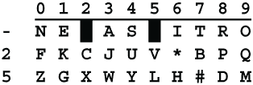

八个 1 位数的替代字母在顶行，而从 2 和 5 开始的二十个 2 位数的替代字母在第二和第三行。数字 2 和 5 不能用作 1 位数的替代字母，所以这些空格在顶行被涂黑了。例如，S 的替代字母是 4，U 的替代字母是 24，Y 的替代字母是 54。

由于有 28 个方格，而英文字母表只有 26 个字母，所以有 2 个额外的字符，我用 * 和 # 表示。通常使用 * 作为一种通用的标点符号，例如 . ? , “ 或任何其他使消息更易读的符号。# 用于在字母和数字之间切换。消息 600 TANKS ARRIVE 1800 TODAY 将被发送为 #600#TANKSARRIVE#1800#TODAY，并被加密为 **57600 57730 21438 86251 57180 05779 58354**。

这种类型的替换的一个明显的弱点是，超过 1/3 的替代字母（实际上是 10 个中的 28 个，或者 35.7%）以 2 开头，同样的百分比以 5 开头，因此所选的 2 位数比其他 8 位数要频繁得多。它们将像华尔兹比赛中的大象一样显眼。为了帮助缓解这个问题，将最频繁出现的 8 个字母放在顶行。它们是 ETAONIRS。为了帮助记忆它们，你可以使用 SERRATION 的记忆法，即去掉重复的 R 后剩下的 SERATION。或者，你可以使用我的最爱，RAT NOISE。对于最常见的字母使用 1 位数的替代字母也有助于减少密文的长度。

单独使用时，跨距校验板的评级为三级。

然而，VIC 密码增加了第二步。（在其最复杂的形式中还会对数字进行转置。）单项二项式替换的结果被视为中间密文。对于中间文本中的每个数字，都会添加一个密钥数字，取模 10，也就是说，不带进位地相加。这有两种风格。你可以简单地添加一个重复的数字密钥，比如 2793。它将像这样工作：

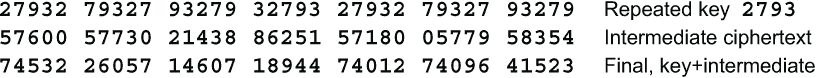

VIC 密码的这种形式被评为五级。

*****VIC 密码的一种更强形式是使用由随机数生成器产生的非重复数字密钥。为此，俄罗斯人使用了所谓的*滞后斐波那契生成器*。你可能已经熟悉斐波那契数列，它是一个整数序列，其中每一项是前两项的和。该序列从 x[0] = 0 和 x[1] = 1 开始。序列的其他项由以下数学公式生成：

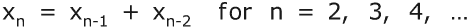

也就是说，第 n 项是第 n-1 项和第 n-2 项的和。对于 VIC 密码，只有低位数字是相关的。这可以写成

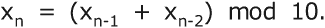

滞后斐波那契生成器可以通过三种不同的方式推广。首先，它可以添加除最后两个以外的其他项，例如

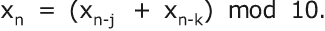

注意，4.5.1 节中描述的链式数字生成器具有这种形式，其中 j = 1 并且 k = 7。

第二，这些数字可以用不同的模生成。最常见的模是某个素数 p 的某个幂 p^e：

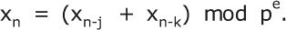

第三，两个项可以使用除加法以外的二元运算符结合。常见的选择有减法、乘法和异或。这可以写成

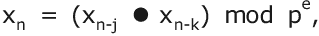

其中 ● 可以表示 + - × ⊕ 或其他二元运算符。（也可以使用除法。它与乘以第二个操作数的乘法逆元相同。请参阅第 3.6 节。）实际上，最常用的是加法，因为加法生成器产生最长的周期。

使用这种形式的伪随机数字生成器，单项二项式评为七级。

## 10.3 周期长度

实现可变长度加密的一种简单方法是使用多个替换表，每个所需的块长度一个表。如果这些是字母块，替换表将很快变得庞大。相反，我们将使用位。让消息表示为位字符串。消息通过将其分成短位块并使用该长度的替换表替换相同长度的块来加密。块的长度可以使用重复的数字密钥进行周期性设置，或者可以由随机数生成器产生。

让我用一个小例子来演示。有三个用于 2、3 和 4 比特块的替代表。在实际密码中，我会使用 3、4、5 和 6 比特块，但如果你有存储空间，你可以增加到 16 比特，甚至更长。

对于这个简单的演示，我使用了一个标准字母表，通过从键盘的顶部行开始直接从左到右填充它到 32 个字符。

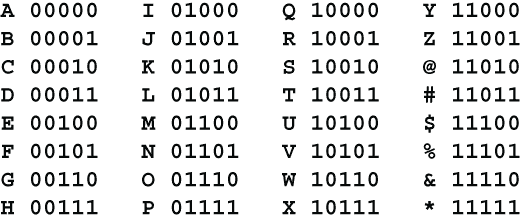

这三个替代表是

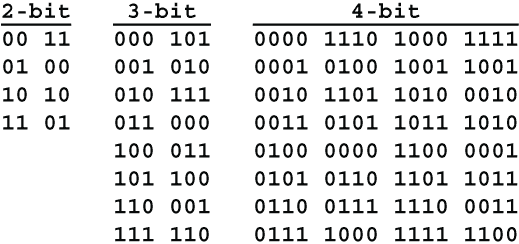

这里是使用重复密钥 3,2,2,4,2 的样本加密：

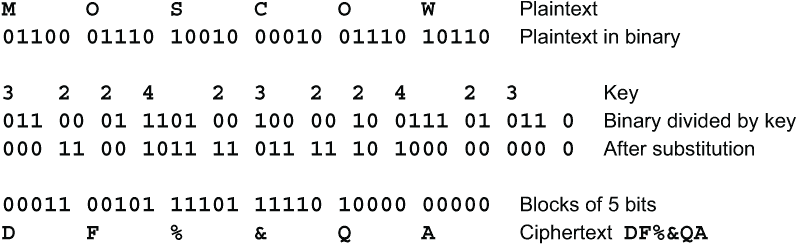

这个版本，我将其称为*BitBlock SA*，标准字母表，具有适度的强度。每个替代表的混合都有一个密钥，块大小序列还有一个额外的密钥。当只有少数替代表，所有块大小都很小，并且块大小序列很小时，BitBlock SA 被评为三级。否则评为四级。

强化这种密码的一种方法是使用混合密钥字母表将字母转换为比特，并将结果比特重新转换为字母。让我们将混合字母表版本称为*BitBlock MA*。它被评为七级。

## 10.4 霍夫曼替代

第 4.2 节描述了如何使用霍夫曼编码进行文本压缩。*霍夫曼替代*是一种可以使用霍夫曼编码进行加密的方式。霍夫曼替代使用两组编码。第二组的编码替换第一组的编码。这些可能是相同的编码集，但是顺序不同。

消息被表示为比特串，例如通过使用标准的计算机表示之一，如 UTF-8 或 Unicode。这个比特串被分割成来自第一组霍夫曼编码的代码串，然后这些代码被第二组的代码替换。霍夫曼替代并不压缩消息，尽管消息的长度（以比特为单位）可能会因为第一组中的代码与第二组中的替代代码的长度不同而发生变化。

请回忆一下，一组霍夫曼编码必须具有前缀属性。也就是说，一组中的霍夫曼编码不能以另一组中的霍夫曼编码开始。例如，你不能同时有**1101**和**11011**，因为如果你正在解码的字符串以**11011**开头，你就不知道第一个编码是 4 比特还是 5 比特。有了前缀属性，就不需要像摩尔斯码组那样在编码之间有一个分隔符。

让我们看看如何构建具有前缀属性的一组霍夫曼编码。首先列出单个比特，无论顺序是 0,1 还是 1,0。例如，

对于此列表中的每一项，要么将其接受为完整代码，要么通过将一个副本附加 0 和另一个副本附加 1 的方式将其扩展为两个更长的代码，再以任何顺序。例如，我们可以接受代码 1 作为完整的，并将代码 0 扩展为两个代码，00 和 01，如下所示：

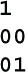

这个过程可以根据需要重复进行。例如，我们可以接受代码 01 作为完成，但是将代码 00 再延长一步，使代码 000 和 001。

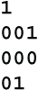

这个过程可以继续进行，直到你获得了所需数量的代码或所需长度范围。但是，对于这个例子，4 个代码就足够了。我们将接受代码 000 和 001 作为完整代码，组成完整的 4 个代码。

*****当我们使用这些代码对比特串进行加密时，可以估计平均代码的长度。字符串以 1 开头的概率为 1/2，因此代码长度为 1 位的概率为 1/2。字符串以 000 开头的概率为 1/8，以 001 开头的概率也为 1/8。无论哪种情况，代码都将是 3 位长。字符串以 01 开头的概率为 1/4，代码长度为 2 位。这是一个完整的代码集，因此没有其他可能性。将它们组合在一起得到预期的代码长度 1/2+3/8+3/8+2/4 = 14/8 = 1.75 位。

在第一个代码被替换后，下一个代码的概率相同，因此所有代码的期望长度都是 1.75 位。这比代码的平均长度小，平均长度为 2.25 位。******

这是 Huffman 替换的一个例子。有两组 Huffman 代码。左列中的代码被右列中的代码替换。两组代码都具有前缀属性。明文是用标准的 5 位表示 A = 00000，B = 000001，C = 00010 等编码的 LIBERTY。

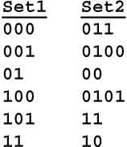

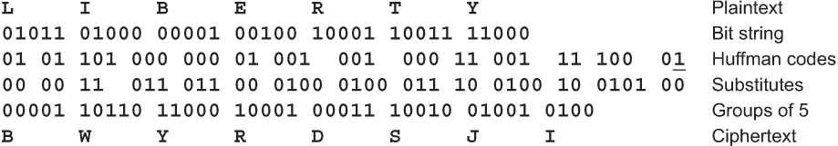

5 位组的第一行是用标准方式编码的单词 LIBERTY，A = 00000，B = 00001 等等。二进制的第二行是相同的比特串，但是分为了来自 Set1 的 Huffman 编码。下划线下的数字 1 是填充，用于填充最后一个 Huffman 编码。二进制的第三行用 Set1 中的每个编码替换为相应的 Set2 中的编码，也就是说，第三行是替换步骤的结果。二进制的第四行是与第三行相同的比特串，但是分为 5 位组。请注意，第 4 行比第 1 行长了 4 位。最后一行是使用相同的标准 5 位表示法为字母加密的密文。密文的最后一个字母可能是 I 或 J，因为最后一个二进制组只有 4 位。

*****如果您正在使用计算机执行此操作，则无需逐个将比特串的前端与每个赫夫曼编码进行比较。假设最长的编码有 6 位。您可以制作一个包含所有 64 种可能的 6 位组合的表。表中的每个条目都将告诉编码的长度（以比特为单位），并给出其替代项。每次执行替换时，您都可以使用字符串的前 6 位直接查找表。

例如，假设第一个赫夫曼编码是 00000，其替代项是 0110。以该编码开头的字符串的前 6 位的可能值是 000000 和 000001。因此，表中的条目 000000 和 000001 都将给出编码长度为 5，以及该编码的替代项为 0110。要执行替换，您将删除字符串的前 5 位，并将 0110 附加到结果字符串中。******

## 10.5 波斯特标签系统

纽约大学 Courant 研究所的数学家埃米尔·莱昂·波斯特（Emil Leon Post）于 1920 年发明了*波斯特标签系统*。其基本思想非常简单。您从一串比特开始。然后，您从字符串的前面取一些比特，用不同的比特替换它们，并将它们放在字符串的末尾。您继续这样做。其中的一种情况会发生：要么字符串缩小直到您无法再这样做，要么您陷入无尽的重复周期，要么字符串永远增长。

历史背景

波斯特并未为密码学而创建他的波斯特标签。波斯特证明了字符串增长、缩小或重复的问题不能在标准数学框架内得到解答，然后他利用这一事实构建了对库尔特·哥德尔（Kurt Gödel）著名的不完备性定理的证明。我认为这是一个比阿兰·图灵（Alan Turing）使用符号写在无限带上的证明更简单、更优雅的证明，尽管波斯特的比特串与图灵的磁带之间的相似之处令人惊讶。

这个*后替换*与赫夫曼替换类似，只是你将替换移到了比特串的末尾。这个系统的优势在于，当你替换完整个字符串后，你可以继续进行下去。也就是说，你可以多次遍历字符串。这消除了赫夫曼编码之间的分割。

你从字符串前面取出的部分被称为*标签*。标签集必须被选择，以便每一步最多只能取一个标签。也就是说，替换过程是*确定性*的。这要求标签集具有前缀属性。这将允许你使用标签集来加密表示为比特字符串的消息。前缀属性在第 4.2.1 节中与 Huffman 编码一起讨论。简而言之，没有任何标签可以以任何其他标签开头。例如，你不能同时拥有 1101 和 11011，因为如果字符串以 11011 开头，你将不知道是取前 4 位还是前 5 位。有了前缀属性，就不需要在标签之间加上分隔符，就像莫尔斯电码组需要分隔一样。Huffman 编码和 Post 标签具有相同的形式，但它们的使用方式不同。首先，Huffman 编码用于缩短比特字符串，而 Post 标签则不是。

构建一组 Huffman 编码的方法在第 10.4 节中描述。

当你使用 Post 标签进行加密时，你会用另一个标签替换每个标签，并将新标签移到字符串的末尾。由于 Riva 将不得不从右边解密消息，替换标签将需要具有*后缀属性*，即与前缀属性相反。没有一个后缀标签可以以另一个后缀标签结尾。例如，如果 1011 是其中一个后缀标签，那么 01011 或 11011 都不能是后缀标签。

你可以以与构建前缀标签相同的方式构建后缀标签集，只是在左边扩展每个标签而不是右边。如果这让你困惑，你可以简单地构建第二组前缀标签，然后颠倒该集合中的位的顺序以获得后缀标签。后缀标签必须至少与前缀标签一样多。可以有更多。额外的标签可以用作同音字。例如，前缀标签 0111 可能被后缀标签 110 或 10101 的选择替换。

当后缀的预期长度小于前缀的预期长度时，字符串可能会缩短。也就是说，很可能有一些初始字符串会变短。相反，如果后缀比前缀长，那么一些初始字符串可能会变长。这通常发生在使用同音字时。预期长度的差异越大，初始字符串的缩短或延长就越多。然而，“可能”并不是保证。可以构建具有相反行为的前缀/后缀集。

要使用 Post 标签进行加密，首先将消息表示为一串比特，然后进行几次标签替换。如果你是手动加密，你将这些比特转换回字符。如果你是通过计算机加密，最后一步可能是不必要的；你只需传输生成的比特字符串。

### 10.5.1 相同长度的标签

在上一节描述的密码中存在一个问题，Riva 不知道如何将她收到的消息分成块。你可能需要为每个块设置一个单独的长度字段，或者将整个消息视为一个单独的块。当消息很长时，这可能会很笨重。解决这个问题的一种方法是用相同长度的后缀标签替换每个前缀标签。这样，块在整个过程中保持相同的长度，而且没有标记块的结束的问题。32 位或 64 位的块大小是典型的。

我建议对每个块进行固定数量的替换。你可以从最短长度和标签的预期长度确定适当的数量。假设块大小为 32 位，最短标签为 3 位，预期标签长度为 4.3 位。使用最短长度，如果至少进行 32/3 = 10.67 次替换，那么可以保证每个块中的每个比特至少被替换一次。将其四舍五入到 11。使用预期长度，平均需要 32/4.3 = 7.44 次替换，以便每个比特都被替换。

一个良好的安全保障是每个比特平均替换两次。将 7.44 倍于 2 并四舍五入得到 15 次替换步骤。这大于 11，因此可以确定每个比特至少被替换一次。平均每个比特替换两次。大约一半的时间，一些比特被替换 3 次。最重要的是，Emily 不会知道任何给定比特替换了多少次。

你可能已经注意到，我一直在说“每个 *比特* 被替换”而不是“每个 *标签* 被替换”。这可能会让人困惑。第一轮通过块时，每个标签都会被一个具有相同长度的新标签替换。所以，在第一轮中，被替换的是标签。但是当第二轮替换开始时，可能不会从一个偶数标签边界开始。也就是说，下一个标签可能横跨第一轮的两个或多个标签。

这里有一个迷你示例来说明使用 12 位块的观点。块的第一个比特被阴影覆盖，前缀标签被下划线划分。

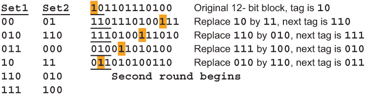

经过四次替换后，第一个比特现在位于下一个前缀标签的中间位置，即 011。

对于手工使用，我建议将字母表编码为 5 位或 6 位组，使用 3 到 6 位的 20 到 30 对标签，32 位块和 16 次替换步骤，即大约通过块两次。将结果位串转换回字符，使用 4 位组表示字母 A 到 P 以某种混合顺序。这样的密码将被评为六级。

对于计算机使用，建议使用标准的 8 位表示，如 UTF-8，对消息中的字母、数字和特殊字符进行编码。使用 40 到 80 对标签，每个标签 4 到 8 位，64 位块和 32 次替换步骤。使用 32 步足以确保通过块的 3 次。在进行后标签替换之前，在字符上执行混合的关键替换，并在完成后标签替换后，在结果字节上进行第二个独立的关键替换。这个密码，称为*Post64*，将被评为十。它将有 4 个单独的密钥用于混合初始替换、最终替换、后标签及其替代物。

使用后标签替换的另一种方法是使用短重叠块。从消息的前 4 个字节开始，并执行 2 次后标签替换。假设标签每个为 4 到 8 位，这足以确保所有第一个字节中的位都已被替换。然后向右移动 1 字节。消息的下一个 4 字节块是字节 2、3、4 和 5。再次对这个块执行 2 次后标签替换。以此类推，直到消息的最后一个 4 字节块。最后的 3 个块将会回绕到消息的前面。这种方法称为*PostOv*，评级为六。

### 10.5.2 不同长度的标签

当每个标签的替代物长度不同时，会涉及到各种复杂性，每个块的长度可能会发生变化，并且块可能不会对齐在字节边界上。例如，一个 32 位的块可能会变成一个 35 位的块。这意味着 Riva 需要一种方法来分隔这些块。最简单的方法是传输每个块的长度。

简单地对一个块执行后标签替换，直到其长度再次成为 8 位的倍数，似乎是可行的。不幸的是，这可能需要数千甚至数百万次替换步骤，甚至可能永远不会发生。

最简单的解决方案是将整个消息作为一个单独的块进行编码。消息的长度告诉 Riva 块中有多少个字节。Sandra 只需要在消息中添加一个 3 位字段，告诉 Riva 最后一个字节有多少位，范围从 1 到 8 位。这可以放在消息的开头，也可以是最后一个字节的最后 3 位。长度字段可能需要额外的一个字节。

这里有一个不同长度的后标签编码的示例。每个前缀标签及其相应的后缀标签都有匹配的下划线。

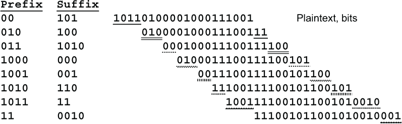

*****看起来好像每次从前面删除标记时都需要移动整个消息。通过保持对消息的第一个位和最后一个位的指针来消除这些移位。每个指针只是一个整数，给出每个端点的位置。指针的低 3 位将给出字节内的位位置，高位将给出字节位置。分配一个长度为消息长度 4 倍的空间。将消息放在此空间的开头，并将其余部分清零。

要从字符串的前面删除一个标记，只需将前指针递增标记前缀的长度。要在末尾附加标记，只需将标记移动到所需的位位置，并与字符串的最后 2 个字节进行 OR 运算，然后递增结束指针。继续这个过程直到到达空间的末尾。这意味着 Post 替换步骤的数量取决于消息本身。

这就只剩下一个移位操作要在最后执行，将位字符串放在偶字节边界上。然而，这个长移位也可以通过在消息的第一个字节和最后一个字节中告诉你的对方起始和结束位位置来消除。这仅需要 6 位，可以打包到一个字节中，并放在消息的开头。我建议用简单的替换对这个字节进行加密，以免给 Emily 起始和结束位置。还要确保用随机位填充消息的第一个字节和最后一个字节的未使用部分。

仍然有一个问题：因为 Riva 不知道消息的原始长度，因此也不知道加密空间的原始大小，她如何知道何时停止解密？Riva 不知道进行了多少次替换步骤，她不能简单地分配一个长度为接收到的消息长度 4 倍的空间，因为这可能与发送的消息长度不同。

这就是方法。Riva 知道三件事：明文消息从一个字节边界开始，消息在一个字节边界结束，加密空间是原始消息长度的 4 倍。Riva 可以开始将接收到的消息放在长度为密文消息 5 倍的空间的末尾。那应该足够了。Riva 从后向前工作，直到满足三个条件，特别是直到部分解密消息的开始到解密空间末尾的距离恰好是消息长度的 4 倍。这只会发生一次。******

我建议您使用 50 到 80 对标签，每个标签长 4 到 8 位。原始标签的预期长度应该接近于替换标签的预期长度。大约 1/3 的替换标签应该比原始标签短，1/3 应该是相同大小的，1/3 的替换标签应该比原始标签长。不要坚持使每个标签与其替代品的长度不同。消息字符应该表示为混合良好的字母表中的 8 位字节。如果标签的预期长度为 T 位，消息的长度为 L 位，则至少应进行 3L/T 次替换步骤。也就是说，你要对整个消息进行 3 次或更多次处理。最终的位字符串，包括长度指示器，应该使用第二个、独立的、简单的替换键转换回字符。如果所有这些建议都遵循，则此密码称为*PostDL*，评级为十。

当您到达第 12.6 节时，您将会看到 PostDL 密码不符合保证不可破解的所有标准。之所以获得十分评级是因为 Emily 不知道明文位在密文中的任何给定位置。位置将在块与块之间不同。所以 Emily 不能建立明文位和密文位之间的对应关系，因此不能建立密文位与明文和密钥位之间的方程。

### 10.5.3 多字母表

有几种方法可以加强 Post 标记密码或 Huffman 替换密码。我们已经讨论过多轮替换的情况。另一个技巧是使用多个字母表。每个字母表将包括一组具有前缀属性的标签和相应的一组替换标签，这些替换标签必须具有后缀属性。你可以简单地轮流使用多个字母表，或者你可以使用关键字来在它们之间进行选择。如果你是手工操作，你不会想要超过 2 个，或者最多 3 个这样的字母表，所以我建议使用一个数值密钥，比如 01101011。

这些密码，可能称为*PolyPost*和*PolyHuff*，根据轮数、字母表数量和密钥长度的不同评为四到八。

### 10.5.4 短距离和长距离移动

到目前为止，我们假设当一个 Post 标记有 B 位时，这些 B 位被移动到块的末尾。然而，可以移动少于 B 位，或者多于 B 位。例如，您可以移动 B-1 位，留下 1 位作为下一个标签的一部分再次替换。这使得标签重叠。优点是它隐藏了标签之间的边界。缺点是每轮需要更多的替换步骤，使得密码变慢。

相反，当后缀标签有 B 位时，你可以将 B+1 位移动到块的末尾。这样留下一位不变，而这一位始终是块中的最后一位。如果密码有多轮，那么未更改的比特很可能在其他轮中被替换。仍然有可能某些比特完整地通过这个密码。如果 Emily 无法确定哪些是未更改的比特，这不是一个严重的问题。比特是匿名的。关于任何比特都没有说，“这个比特来自明文的第 5 个字节，第 2 位”。

最后，移动的比特数可以与标签长度无关。你可以有一个表格告诉你要移动的比特数。这可以少于、多于或等于标签的长度。你可以有多个这样的表格。

当移动的比特数与标签长度不同时，后缀属性不再适用于替代标签集。相反，实际移动的比特字符串集必须具有后缀属性。例如，如果标签 0110 被替换为 1101，但移动了 5 位，则后缀字符串集必须包括**1101**0 和**1101**1。

## 10.6 其他进制中的分数化

到目前为止，本章已经讨论了五进制中的单-双替换，以及二进制中的 Huffman 替换和 Post 替换。可变长度替换也可以在其他进制中进行。对于手工加密来说，在三进制或四进制中进行 Huffman 替换和 Post 替换比在二进制中更容易。然而，可变长度替换可以在任何进制中进行，甚至是奇怪的进制，比如 11 或 13。这可以给你额外的替代品，可以用于同音词或编码二元组。

当你使用十三进制时，你可以使用任意十六进制数字中的 13 个进行替换，将另外 3 个数字留为空。如果做得好，使得所有 16 个数字的频率和分布大致相等，Emily 将无法区分有效数字和空位。

## 10.7 文本压缩

第 4.2.1 节讨论了使用 Huffman 编码压缩文本的方法。几种强大的加密方案可以基于文本压缩。在本节中，我提出了几种更高级的文本压缩方案和一些基于 Huffman 编码的加密方案。第十章的其余部分是可选的。如果在任何时候数学变得太令人畏惧，可以直接跳到下一章。

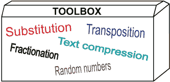

### 10.7.1 Lempel-Ziv

*Lempel-Ziv* 文本压缩方案是由以色列计算机科学家亚伯拉罕·莱姆佩尔和雅各布·齐夫在 1977 年开发的，被称为 *LZ77*，并在 1978 年改进了一个版本，称为 *LZ78*。它基于与赫夫曼编码相同的基本概念，即字母和字母组合由二进制代码表示，即一组比特。然而，莱姆佩尔-齐夫采取了与此相反的方法。赫夫曼使用较短的代码以节省空间。莱姆佩尔-齐夫使用大致相同长度的代码，但有些代码表示较长的字母组合以节省空间。

在另一个意义上，赫夫曼和莱姆佩尔-齐夫是相反的。赫夫曼将代码的长度基于固定的预设字母频率表。莱姆佩尔-齐夫在编码文本时动态确定最常见的字母组合。这被称为 *自适应编码*。赫夫曼编码仅适用于单一语言的文本。不同的语言将具有不同的字母频率。即使从大写文本转换为大小写混合文本也需要不同的赫夫曼编码集。相比之下，莱姆佩尔-齐夫可用于任何类型的计算机文件，任何语言或混合语言的文本，计算机代码，图像，遥测，音乐视频等。

有几个版本的莱姆佩尔-齐夫。我在这里介绍的版本，称为 *莱姆佩尔-齐夫-韦尔奇*，或 *LZW*，是由斯佩里研究公司的特里·韦尔奇于 1984 年开发的。LZW 具有固定宽度和可变宽度版本。我展示的是可变宽度版本，易于用于加密。

所有版本的莱姆佩尔-齐夫都使用称为 *字典* 的字母和字母组合列表。字典随着算法在文件中的进行而实时构建。在 LZ77 和 LZ78 版本中，字典起始为空。给定任何字母组合的代码是它在字典中的位置。

LZW 首先为文件中的每个单个字符分配一个代码。LZW 的所有代码都具有相同数量的比特。例如，如果文件是一条用英语写成的消息，全为大写且没有标点或单词分隔，则您将需要 26 个代码，因此您可以使用 5 位代码。更常见的是从 256 个代码开始，每个代码对应一个 8 位字节的 256 个可能值之一。

随着算法在文件中进行，它寻找尚未在字典中的字母组合。找到一个后，将该组合添加到字典中。例如，假设算法在文件中找到了 THE，并且 THE 已经在字典中。假设文件中的下一个字母是 M，并且 THEM 不在字典中。它输出 THE 的代码，后跟 M 的代码，并将 THEM 添加到字典中。THEM 的代码是字典中的下一个可用位置，假设是 248。

由于 THE 已经在字典中，算法不会查找以 HE 或 E 开头的组合。它将从 M 开始查找另一个不在字典中的组合。如果该组合是 MOR，则将 MOR 放入字典条目 249 中，并具有代码 249。算法下次在文件中找到 THEM 时，将被编码为 248，并且下一个 MOR 的出现将被编码为 249。

当算法填满了所有 256 个 8 位代码的字典条目时，下一个分配的代码将需要 9 位。此时，算法将从 8 位代码切换到 9 位代码。THEM 仍然具有代码 248，但它将是 9 位代码 011111000，而不是 8 位代码 11111000。当算法填满了所有 512 个 9 位代码的字典槽时，THEM 的代码变为 10 位代码 0011111000，仍然是 248。请注意这些操作的顺序。当前字母组合的代码首先以旧大小输出，然后将新组合添加到字典中，并增加代码大小。Sandra 和 Riva 必须使用相同的顺序，否则消息将无法正确解压缩。通常在 12 位停止扩展代码。将代码大小从 12 位增加到 13 位通常不会改善压缩，并且甚至可能使其恶化。

让我们看一个例子。让我们使用此算法对单词 TETE-A-TETE 进行编码。假设字典以单个字母 A、E 和 T 以 2 位代码开头。让我们跟随字典的构建过程。每个阶段左边的位字符串显示编码的单词，右边的字母显示剩余部分的单词。

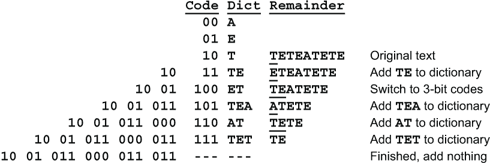

当 Riva 解压缩消息时，字典必须以完全相同的方式构建。请注意，仅仅是二进制字符串**10** **01** **011** **000** **011** **011**本身不足以让 Riva 解压缩消息。她还需要知道代码**00**、**01**和**10**代表字符 A、E 和 T。

好的。这就是 Lempel-Ziv 压缩。这是一本关于密码学的书。Lempel-Ziv 压缩如何用于加密？

在构建字典时，Lempel-Ziv 按顺序分配代码。第 43 个字母或字母组合将获得代码 42（不是 43，因为代码从 0 开始）。要使用此方案进行加密，请向字典添加第二列。第一列包含字母组合，第二列包含相应的代码。不要使用字典中的位置作为每个字母组合的代码，而是使用字典的第二列中的数字。

假设字典以 256 个单字节字符开头。第一列包含字符。在第二列中，以某种乱序方式放置从 0 到 255 的数字。它们可以通过第 5.2 节中描述的任何方法进行混合。桑德拉和瑞娃必须使用相同的顺序，可以由关键字或随机数生成器的种子确定。当需要第一个 9 位编码时，下一个 256 个字典条目将以乱序方式获取代码从 256 到 511。同样，当您从 9 位代码转移到 10 位代码时，将一次分配下一个 512 个代码。批量分配代码比逐个分配代码更有效。

一种替代批量分配代码的方法是仅使用关键字或随机数序列分配前 256 个代码。之后，每个新代码通过在 256 个条目之前的代码上加 256 来计算。也就是说，X(N) = X(N-256)+256。

我将称之为*Lempel-Ziv 替换*的这个密码被评为 Three。评分很低是因为消息的前几个字符基本上是用简单的替换进行了加密。每个代码将代表一个单字符，直到出现第一个重复的双字母组为止。这可能要等到编码了 30、40 甚至更多个字符之后才会发生。即使在那之后，大多数的 9 位代码仍然表示单个字母。这些代码很容易区分，因为它们是以 0 开头的唯一的 9 位代码。艾米丽将有很多机会使用字母频率和接触频率来破译消息。

要使 Lempel-Ziv 替换变得强大，您可以添加第二个替换步骤。这个替换不应该在字节边界上进行。我建议使用 7 位组。这些组将不会与代码组重合，直到代码达到 14 位。这可能永远不会发生，因为代码通常限制为 12 位。Lempel-Ziv 替换后跟 7 位替换的评分为 Six。这两种替换可以在单向左到右的通道中完成。

### 10.7.2 算术编码

*算术编码*（发音为“a-rith-MET-ic”）是一种文本压缩方法，我在 1970 年代发明的（“使用固定精度寄存器的算术流编码”，*IEEE 信息论杂志*第 25 卷（1979 年 11 月），第 672-675 页）。它基于麻省理工学院的彼得·伊莱亚斯的一个聪明想法。

埃利亚斯的想法是将每个字符串编码为分数。想象一下，从 0 到 0.999 的所有可能的分数...省略号...表示该分数以无限的 9 序列结尾。现在根据字符串的第一个字符将此范围分割。为简单起见，假设字母表中有 25 个字符，就像一个 Polybius 方块字母表。每个字母将获得全范围的 1/25。那些以 A 开头的字符串将获得全范围的第 1/25，即 4%，范围为 0 到 0.04。以 B 开头的字符串将获得全范围的下一个 1/25，即 0.04 到 0.08。以 Z 开头的字符串将获得全范围的最后 1/25，即 0.96 到 0.999...（我使用十进制表示这个例子是为了更容易阅读。在计算机中，将使用二进制分数。）

对于第二个字符，你再次分割这个范围。以 AA 开头的字符串将在范围 0 到 0.0016 内。以 AB 开头的字符串将在范围 0.0016 到 0.0032 内。以 BA 开头的字符串将在范围 0.0400 到 0.0416 内。以此类推。以 ZZ 开头的字符串将在范围 0.9984 到 0.9999...内。

为了可视化，让我们使用一个小型的 5 个字母的字母表，其中 A 从 0 到 0.2，B 从 0.2 到 0.4，C 从 0.4 到 0.6，D 从 0.6 到 0.8，E 从 0.8 到 0.999...。使用这个字母表，让我们将单词 BED 编码。

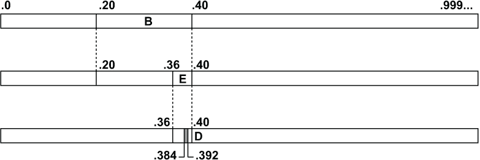

BED 可以编码为任何满足 0.384 ≤ f < 0.392 的分数 f。随着添加更多字符，此间隔将继续缩小。

这就是概念。然而，将字符串编码为分数并没有提供任何压缩。需要另一个想法来实现压缩。与其给予字母表中的每个字母相同比例的分数，不如将分数与该字母的频率成比例。A 将获得 8.12%，B 将获得 1.49%，依此类推，直到 Z，Z 将获得 0.07%。A 的范围为 0 到 0.0812。B 的范围为 0.0812 到 0.0961。Z 的范围为 0.9993 到 0.9999...。

从理论上讲，这将根据各个字母的频率提供最佳压缩。不幸的是，存在一个实际问题。该方法产生的分数可能需要数千甚至数百万位数。如何在计算机中表示这样的分数？如何对它们进行算术运算？

因此，这个方法在理论上很好，但在实践中似乎不可行。它似乎需要无界精度的分数。增加和乘以长分数的时间（无论是十进制还是二进制）都会随着它们的长度增加而增加，所以即使有一种好的方法来表示这些分数，该方法也会变得难以忍受的缓慢。

我找到的解决方法是使用一个移动窗口，在其中进行所有的算术操作。这样可以使用普通的 32 位整数。不需要浮点运算。为了保持整数在 32 位大小内，字母频率被近似为 15 位整数，即形式为 N/2¹⁵ 或 N/32768 的分数。例如，字母 A 的频率是 8.12%。这可以表示为 2660/32768 或 665/8192。发现这个近似没有导致压缩程度的可检测减少。

这是一个十进制示例，展示了一个字母如何被编码以及移动窗口的工作原理。假设前几个字符已被编码，并且范围现在为 .784627 到 .784632。范围的起始和结束的前 4 位数字是相同的，即 .7846。这 4 位数字将被输出，并且窗口将向右移动 4 个数字以显示范围 .2700 到 .3200。

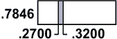

这个范围的宽度是 .0500。假设消息中的下一个字符的频率是 .0300，其范围是 .4050 到 .4350。这个字符被编码为当前范围 .2700 到 .3200 的那一部分。其宽度是 .0500×.0300，即 .0015。它将从 .2700+.0500×.4050 运行到 .2700+.0500×.4350，即 .29025 到 .29175。注意这个范围的宽度是 .0015，正如预期的那样。

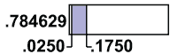

由于这个范围的起始和结束都以数字 .29 开头，这些数字可以输出。已输出的数字现在是 784629。窗口现在可以再向右移动 2 个数字，使当前范围为 .0250 到 .1750。

算术编码非常适合用于加密，因为不再有每个字母或字母组合的离散编码。没有边界，可以将比特流分割为单独的代码。相反，每个字母的代码影响如何表示所有后续字母。

现在我们了解了算术编码方法的工作原理，下一步是看如何将其用于加密。我们不希望改变分配给每个字符的范围的百分比，因为那样会失去压缩。相反，我们可以改变字符的顺序，使得每个字符的范围都落在整个范围中不可预测的部分。也就是说，对于艾米莉来说是不可预测的。例如，仅使用字母 A、B、C、D、E，范围可能是：

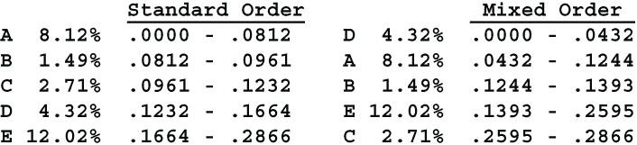

这些区间可以用来编码消息的字母。我们将这种方法称为*算术加密*。由于艾米莉不知道任何范围的起始点或结束点，因此没有攻击的机会。艾米莉知道第一个范围从 .0 开始，最后一个范围结束于 .999...，但她不知道这些范围代表哪些字符。

算术编码存在一个尚未讨论的困难。使用正常的字母表，Riva 不知道消息何时结束。代表 ROTUND 的相同代码也可以代表 ROTUNDA、ROTUNDAA、ROTUNDAAA，依此类推，假设 A 的范围从 0 开始。使用传统算术编码，可以通过使用各种方法对消息长度进行编码并将该长度码附加到密文中，或者通过向字母表添加特殊的消息结束字符来解决此问题。此前没有讨论过这一点，因为算术加密不需要它。

使用算术加密时，您只需将罕见的字符分配给第一个范围，即从.0000 开始的范围。然后，当 Riva 看到 ROTUNDVVV...或 ROTUND###...时，消息的结束就显而易见了。

如本节所述，使用 26 字母表对算术加密评为 Five，或者使用 256 字符字母表评为 Six。这里可以使用所有常用的技巧，如空字符、同音字和双字母组。使用空字符会减少或破坏压缩，因此我不建议使用。使用同音字会将字母的范围分成两个或更多的单独范围。这使得字母的范围更加均匀，这相当于平衡了字母的频率。这可以在不影响压缩程度的情况下提高安全性。有时，使用双字母组甚至三字母组可以提高压缩水平同时提高安全性。使用同音字和双字母组，算术加密评为 Eight。

由于算术加密本身非常强大，所以只需很少的额外工作就可以将其提升到 Ten 的评级。我建议使用周期为 4 的一般多表密码，即使用四个独立混合良好的字母表以轮换方式使用的替换。使用周期为 4 或更高的一般多表加密后的算术加密评为 Ten。它让对手毫无线索可循，没有字母频率，没有联系频率，也没有利用可能的单词的方法。

### 10.7.3 自适应算术编码

Lempel-Ziv 给任何类型的文件提供了良好的压缩，因为它是自适应的。Huffman 编码和算术编码提供了更好的压缩，但只适用于字符频率与基础频率表相匹配的文件。有几种方法可以使 Huffman 编码和算术编码自适应，所有这些方法都使相应的加密方法更加强大。所有这些方法都涉及对文件中的字符进行计数，然后再对其进行编码。

字符计数与文件中的字符频率越接近，获得的压缩效果就越好。你可能会认为你可以简单地计算文件中的所有字符，然后使用实际的计数。问题是 Riva 不能统计文件中的字符。Riva 必须使用与 Sandra 相同的频率，否则她无法解密文件。解决这个困境的方法是 Sandra 在加密时计数字符，Riva 在解密时计数字符，这样他们在所有阶段都会拥有相同的计数。

所有字符计数从 1 开始。如果你事先知道字符的频率，即使它们只是粗略的估计，你也可以增加更频繁出现的字符的计数。例如，如果你使用的是 256 个字符集，并且你预计消息将包含约 1%的大写字母 E 和约 10%的小写字母 e，那么你可以将 E 的字符计数增加 2，将 e 的字符计数增加 25，即 256 的约 10%。每个字符的初始范围与其初始计数成比例。例如，如果 256 个字符计数总共为 500，并且小写字母 e 的初始计数为 25，那么 e 的范围将为 25/500，即 0.05。

调整代码有两种基本方法，字符模式和批处理模式。字符模式只适用于算术编码。在字符模式中，每当在文件中找到一个字符时，它的范围和两个相邻范围都会被调整。（当字符具有第一个或最后一个范围时，有一个相邻范围。对于 26 个字母的标准字母表，这意味着 A 或 Z。）

这里有一个例子。假设已经遇到了字母 T，并且相邻范围属于字母 S 和 U。（这可能不适用于算术加密。混合字母表可能不会按顺序包含 S、T、U。）假设 S、T 和 U 的字符计数分别为 15、20 和 5，因此它们总共为 40。假设 S、T 和 U 的范围分别为 0.062、0.074 和 0.024，因此它们总共为 0.160。这个合并范围按比例重新分配为 15:20:5。S 获得 0.160×15/40，即 0.060。T 获得 0.160×20/40，即 0.080。U 获得 0.160×5/40，即 0.020。随着时间的推移，字符的范围将收敛到正确的宽度。

字符模式在 26 个字母的字母表中效果还不错。但在 256 个字符的字母表中效果非常差。大多数 256 个字符不会与任何高频字符相邻，因此它们的频率将保持不变。这在所有字母都聚集在一起的标准 ASCII 表示中尤其明显。

批处理模式适用于算术编码和哈夫曼编码。在批处理模式下，在编码过程中的特定点调整整个范围。例如，在编码 64 个字符后，128 个字符后，256 个字符后等等可以调整范围。在这些点上，整个范围将根据当前字符计数重新分配。这比字符模式更快地收敛，但在重新分配之间，您正在使用旧的未调整频率。

在批处理模式下，可以计算二元组甚至三元组的频率。出现多次的二元组或三元组可以被赋予自己的哈夫曼代码或算术代码范围。通过这种改进，算术编码几乎总是比 Lempel-Ziv 提供更好的压缩。

计算二元组和三元组频率存在一个问题，即存储。对于一个 256 字符的字母表，有 65,536 个不同的二元组和 16,777,216 个不同的三元组。如果存储空间充足，这可能不是问题。如果存储空间有限，一个解决方案是仅计算包含最常见字母的二元组和三元组。例如，如果将二元组和三元组限制为最常见的 20 个字符，则只有 400 个二元组和 8,000 个三元组需要计算。为了确定最常见的字符，可以推迟计算二元组和三元组频率，直到编码了一定数量的单个字符，比如 256 或 1024 个字符。

实现这些受限制的计数的一种方法是仅在第一个批次中计算单个字符，以确定最常见的字符。在第二批次中使用这些高频字符计算二元组。在第三批次中，仅使用高频二元组加上高频字母计算三元组。一旦选择了高频二元组和三元组，它们将被赋予自己的哈夫曼代码或算术范围。换句话说，它们被视为单个字符处理。

对于算术编码，字符模式和批处理模式并不是互斥的。您可以在遇到每个单个字符时平衡各个字符的范围，并在每个批次结束时平衡扩展字符集以及二元组和三元组。

在进行哈夫曼加密或算术加密时，在每个批次结束时，字母表应在代码被替换或范围重新平衡之前重新洗牌。如果添加或删除了二元组或三元组，则特别需要这样做。这意味着艾米莉在代码改变之前只有有限的材料可以攻击。对于加密，最好使用不规则长度的批次，比如在 217 个字符后，然后在 503 个字符后，以此类推，这样艾米莉就不会知道代码何时改变。

对自适应编码的另一项改进是在重新平衡范围后将所有计数除以 2。这样可以让编码适应字符频率发生变化的情况。较旧的频率对范围的影响会减少，而较新的频率则会增加影响。例如，假设文本是一本由不同作者撰写的故事书。每个作者可能有不同的词汇或不同的主题，甚至用不同的语言书写。

当然，Sandra 和 Riva 必须事先就所有这些达成一致，这样 Riva 才能正确解密和解压消息。
