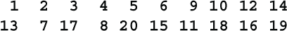

# **11** 块密码

本章涵盖

+   DES 和 AES 加密标准

+   基于矩阵乘法的密码

+   **对称密码**，其中加密和解密是相同的

+   **涟漪密码**

+   **块链**

我们已经看到了几种对文本进行分块处理的密码。一些操作于仅由 2 或 3 个字符组成的小块，例如 Playfair、Two Square、Three Square 和 Four Square。一些操作于更长的块，但每次只更改 2 或 3 个字符，例如 bifid、trifid 或 FR-Actionated Morse。这些密码在每个块的一部分上进行局部操作。明文中的一个字符的变化通常最多会改变 2 或 3 个密文字符。

本章涉及更强大类型的块密码。在这些密码中，即使改变明文的一个比特，或者密钥的一个比特，也会改变大约一半的密文比特，以及几乎所有的密文字节。这表明密码是高度非线性的。这些密码仅适用于计算机使用，通常配有专用硬件来加速加密。

本书的大部分其余内容都与计算机密码和方法有关。如果您不关心计算机方法，只需跳过这些部分。

## **11.1** 替代-置换网络

许多块密码采用*替代-置换网络*（SPN）的形式。这个想法首次由 IBM 的 Horst Feistel 于 1971 年描述。加密由几轮组成，每轮可能包括一个或多个替代步骤和/或一个或多个置换步骤。通常有一个主键来控制整体操作。

替代步骤的最常见选择是（1）简单替代，（2）用密钥的一部分与块的一部分进行异或，或者（3）在密钥的控制下进行多表替代。密钥可以由主密钥和/或未被替代的块的部分的位组成。例如，块中的奇数字节可以用作对偶数字节进行加密的密钥，反之亦然。一种稍微复杂的替代形式是从密钥中获取一些比特，将它们与块中相同数量的比特进行异或，并将结果用作替换块的另一部分的多表密钥。

替代字母表通常是预先选择的，永远不会改变。这些被称为*S-boxes*。它们可能是简单的替代，也可能是多表替代，因此 S-box 是计算机的等价物。它们通常需要 4 到 8 个关键位来选择表格的行，并以相同数量的位作为输入和输出。通常会有一些复杂的数学运算用于构建替代字母表。特别是，这些字母表被设计为非线性的，这在第 12.3 节中有详细说明。

每一轮的置换通常是预先确定且不变的。置换可以操作单个比特、4 位组或 8 位字节。在大多数分组密码中，置换没有密钥；它们是硬编码在软件中或硬连到加密芯片中的。

现代分组密码中最早的是*Lucifer*，由 IBM 的 Horst Feistel 设计。在 Feistel 最终确定 Lucifer 之前，名称已经多次更改，因为他想要一个体现设计的邪恶本质的名称。Feistel 还反复改变了 Lucifer 的设计，从最初的在 128 位块上工作的 48 位密钥到在 128 位块上工作的 128 位密钥。您可以在 [`derekbruff.org/blogs/fywscrypto/tag/lucifer`](https://derekbruff.org/blogs/fywscrypto/tag/lucifer) (访问时间：2022 年 5 月) 上阅读有关 Lucifer 的更多信息。

这是一个微型置换-置换网络密码的图示。此密码接受 16 位明文并产生 16 位密文。它有 4 轮替换和 3 轮换位。替换和换位是固定的；它们内置到硬件中。使用了 4 种不同的替换，分别是 S[1]、S[2]、S[3] 和 S[4]。每个替换需要 4 个输入比特加上一个密钥，通常是 4、6 或 8 位，因此如果所有密钥都是独立的，则密码可能具有 64、96 或 128 位密钥。每一轮的换位都不同。

这个微型网络密码被评为三级，因为它相当于一个双字母替换，但它可以通过 6 轮替换从 16 位扩展到 64 位，评为八级，或者通过 8 轮替换从 16 位扩展到 128 位，评为十级。

最终版本的 Lucifer 设计直接导致了*数据加密标准* (DES)，该标准于 1977 年正式由国家标准局 (NBS) 采纳。因此，让我们直接进入它。

## 11.2 数据加密标准 (DES)

DES 是 1976 年在 IBM 开发的，通过削减当时的 Lucifer 版本实现。该版本使用了 128 位密钥，并且在消息的 128 位块上工作。块大小缩小为 64 位，这是可以接受的，因为这降低了硬件成本。IBM 想要使用 64 位密钥，但 NSA 坚持进一步减少密钥，降至 56 位，理由薄弱，声称额外的 8 位可以用作校验和。普遍认为，实际原因是 NSA 能够解决 56 位 DES，但无法解决 64 位 DES。

IBM 最初计划将 DES 设计为 6 轮密码。当 NSA 告诉 IBM 它可以破解 6 轮版本时，IBM 直接跳到 16 轮，与 Feistel 在他的 Lucifer 最终版本中使用的轮数相同。

DES 的一个新特性，在任何 Lucifer 版本中都找不到，就是在第一个和最后一个替换步骤之前进行位转置。这些是 8×8 列转置，其中列的顺序和行的顺序都被改变。对于初始置换，块的 64 位从左到右写入网格中。列按相反顺序读出，即 8、7、6、5、4、3、2、1。行按顺序读出，即 2、4、6、8、1、3、5、7。最终置换是其逆置。

这些置换对加密的价值是没有的。它们并没有增加 DES 的强度。它们之所以被添加，是因为 NSA 告诉 IBM，硬件加密应该很快，但在软件中模拟时应该很慢。其想法是通过软件尝试所有可能的密钥来使 Emily 破解密码更加耗时，即通过穷举法尝试破解密码。IBM 相信，置换位会使任何软件实现非常慢。IBM 可能设想了一种逐位提取比特并通过掩码进行位移的过程，然后将其移动到位。

结果证明这完全是错误的。首先，希望破解 DES 的敌人可以简单地通过代理购买加密芯片。其次，对于一些合法的应用程序，DES 需要嵌入软件中，因此软件必须快速。第三，位置换可以快速完成，而不必提取单个位或进行位移。我将在第 11.2.3 节中展示如何做到这一点。

在初始和最终置换之间，DES 有 16 个替换轮。64 位块分为两个 32 位的半块。在每一轮中，右半部分用于加密左半部分。首先，将右半部分从 32 位扩展到 48 位，如下所示。将 32 位视为八个 4 位组。这些组中的每个都通过附加前面和后面的位（来自相邻的组）从 4 位扩展到 6 位。例如，第三组将由第 9 到 12 位组成。这个 4 位组将通过在左边附加第 8 位和在右边附加第 13 位来从 4 位扩展到六位。换句话说，6 位组将是位 8、9、10、11、12、13。八个这样的 6 位组形成一个 48 位块。

然后，将此 48 位块与从 56 位密钥中取出的 48 位进行异或。确定每一轮使用哪 48 位由一个*密钥调度*确定，基本上是在每一轮后将完整的 56 位密钥向左或向右移动几个位置。然后，得到的八个 6 位组被输入到八个固定的 S 盒中，即替换。每个 S 盒给出一个 4 位结果，因此八个 4 位结果组成一个 32 位块。然后将此块与整个 64 位块的左半部分进行异或。

历史小插曲

IBM 并未设计 DES 以具有密钥调度。最初的想法是在每个 16 轮后将 64 位密钥循环移位 4 位位置。这样留下了密钥在其原始位置，准备加密下一个块。当 NSA 要求 IBM 将密钥大小减小到 56 位时，IBM 被迫引入了密钥调度。四位移位不再起作用。当然，IBM 将密钥调度称为“功能”。

查看每个 S-box 的另一种方法是将其想象为一个 4×16 的表格。像 Belaso 或 Vigenère 表格一样，每行都是 4 位组的替换表。附加到 4 位组的两个额外位用于选择表格的 4 行中的哪一行。

每个 S-box 都经过精心设计，以尽可能减少 6 个输入位和 4 个输出位之间的相关性。NSA 发现了一种最低相关性的设计 S-box 的绝密方法。由于 DES 如此重要，NSA 决定与 DES 的 IBM 设计者分享这个秘密。然而，在检查 IBM 设计后，NSA 发现 IBM 也发现了这种方法，并在其设计中使用了它。

每轮结束后，除了最后一轮外，64 位块的左半部分和右半部分被交换。

### 11.2.1 Double DES

从一开始就明白，56 位密钥对于强大的安全性来说太小了。仅在 DES 被采纳后的 4 个月，电子前沿基金会构建了一台名为 Deep Crack 的 25 万美元的专用计算机，仅用了 56 小时就解密了一条 DES 消息。

对这种明显的弱点的第一个提出的解决方案是使用两个不同的密钥两次使用 DES 加密消息。这个想法被拒绝了，因为从理论上讲可以发动一种中间相遇攻击来破解 DES。也就是说，你从明文向前工作，从密文向后工作，并在中间相遇。你通过获取已知明文的密文块来执行此操作。你使用所有 2⁵⁶ 可能的密钥加密明文，然后使用所有 2⁵⁶ 可能的密钥解密密文。您比较这些结果，无论您在哪里找到匹配项，您都有可能的密钥对。

这种攻击仅仅是理论性的。您需要存储 2 组 2⁵⁶ 解决方案，即 2⁶⁰ 字节，以进行所有比较。1970 年代的计算机都没有达到那个存储水平。此外，您预计将获得约 2⁴⁸ 个匹配项。所有这些都需要被检查。这是一个艰巨的任务。但是 IBM 和 NSA 希望 DES 能够持续 20 到 30 年，并且有可能在这段时间内这种攻击变得实用。可能会使用 Double DES，但从未被接受为标准。

### 11.2.2 Triple DES

*三重 DES*，或 *3DES*，是另一种补偿 DES 小 56 位密钥尺寸的尝试。它包括将一个 64 位块加密一个 DES 密钥，用第二个 DES 密钥解密，然后用第三个 DES 密钥加密。显然，这比普通 DES 花费的时间多 3 倍。它没有被广泛使用，因为这使它变得很慢。

提高 DES 安全性的更快方法是使用一个 64 位密钥在 DES 步骤之前对 64 位块进行异或操作，并在 DES 步骤之后使用另一个 64 位密钥进行异或操作。将有 3 个独立的密钥，两个 64 位异或密钥和 56 位 DES 密钥，总共 184 位。这种方法只比单个 DES 加密多花一点时间。

即使第二个异或密钥可以通过查看波形来确定，这仍然比单个 DES 更强大。你可以通过在 DES 步骤之前和之后执行键控简单的替换来消除波形撤销异或的危险。

### *11.2.3 快速位换位

DES 的起始和结束都涉及位换位。这样做的朴素方式是逐个解压位，将它们移动到期望的位置，然后将它们 OR 到位。有一种更快的方法，大约在 1975 年，由我和 IBM 纽约约克镇研究中心的 David Stevenson 独立发明。我将用一个 32 位块的换位来演示这种技术。假设明文，以位形式表示，是

其中每个拉丁字母或希腊字母代表一个比特的值，即它可以是 0 或 1。让我们看看如何进行转置，使得 a 移动到第三个位置，b 移动到第六个位置，c 移动到第九个位置，依此类推。

通过使用 4 个特殊表，每个表都有 256 个条目，可以实现转位。每个条目都是一个 32 位块或计算机字。第一个表显示了 32 位块的第一个字节中 8 位的转置位置，如下所示：

第二个表显示了 32 位块的第二个字节中 8 位的位置：

第三个表显示了 32 位块的第三个字节中 8 位的位置：

第四个表显示了 32 位块的第四个字节中 8 位的位置：

点的存在使你能够轻松看到 32 位的放置位置。它们代表计算机字中的零。现在可以通过查找这些特殊表中的 4 个字节并将四个结果 32 位块进行 OR 运算来实现转置，就像这样：

这不需要移位和掩码。整个 32 位的置换只使用了 4 个表查找和 3 个 OR 操作。这种技术的一个用途是翻转一个 8×8 位的块。这可以使用 8 个 256 个条目的表，或者只是一个单表来完成，将位移动到每个字节内的正确位置，就像这样：

******

### 11.2.4 短块

在 DES 和其他块密码中遇到的一个问题是如何处理短块。对于 DES，所有的块必须恰好有 8 个字符。假设您的消息有 803 个字符，即 100 个 8 个字符的块加上 3 个多余的字符。你如何处理那最后的 3 个字符？

传统的解决方案是用空值填充最后一个块。使用纸和笔密码学时，一些常用的技术是在最后 5 个字符附加 XXXXX 或 NULLS。不幸的是，这给了 Emily 5 个已知明文字母。对于手动密码的一些更好的解决方案是使用标记，比如 XX 或 JQ，然后将剩余的填充字符随机选择，比如 XXESV，或者简单地使用任意组合的低频字符进行填充，比如 ZPGWV。解密取决于 Riva 能否识别真实消息的结束和填充的开始。

在计算机中，填充必须解决两个问题。首先，Riva 必须能够确定消息的结束位置，或者等效地说，填充有多少字节。其次，Sandra 希望尽可能少地给出已知明文。一些提议的方案在这两个方面都失败了。例如，有一种方案建议在消息的末尾填充以下内容之一：

当块大小为 32 时，这可能会给出高达 31 个字节的已知明文给 Emily。在一般文件中，最后一个块可以是以 01 结尾的完整块，甚至是 02 02，这可能会被误认为是填充。

更好的解决方案是在明文文件中的某个位置放置一个长度字段。这不必是文件中的字节数，这可能需要一个 4 字节的长度字段，它可以是最后一个块中填充字节的数量。对于 DES，这是一个从 0 到 7 的数字，因此只需要 3 位。长度字段可以放在文件的任何位置。最常见的地方是第一个字节、最后一个字节和最后一个块的第一个字节。填充字节本身可以随机选择。

为了避免给 Emily 甚至一个字节的已知明文，长度可以编码为长度指示符的低位或高位比特，并且其余未使用的比特可以是随机的。这样，长度指示符可以取值从 0 到 255。

顺便说一句，没有规定你必须在文件末尾填充。如果你想在文件开头、最后一个块的开头或第 13 个块的中间填充，随便你。只要桑德拉和里瓦同意，他们可以做任何他们认为会最大程度地阻碍艾米莉的事情。一种可能性是将填充字节分散开来。例如，如果文件需要 4 个填充字节，你可以将它们放在文件的第二、第四、第六和第八个块的末尾，只要里瓦能够知道添加了多少填充字节。

*重叠方法*是填充的一种替代方法。假设，再次，块大小 B 为 8，消息有 803 个字符，你将前 800 个字符加密为 8 个字符的 100 个块。然后你将第 796 到 803 个字符加密为第 101 个块。这样，消息的长度不会改变，但里瓦必须在解密第 100 个块之前解密第 101 个块。

## 11.3 矩阵乘法

我们将要看的下一个分组密码是*高级加密标准*（AES）。然而，AES 使用一种称为矩阵乘法的数学运算，这在本书中尚未涵盖。我在介绍中承诺会呈现每个需要的数学概念，因此我将在这里介绍矩阵乘法。这个概念在后面的几章中是必需的。除非你已经很熟悉矩阵乘法，最好不要跳过这部分。

*矩阵*只是一个称为*标量*的元素的矩形数组。一系列标量形成一个*向量*，因此矩阵的每一行和每一列都是一个向量。它们分别称为*行向量*和*列向量*。具有 m 行和 n 列的矩阵称为 m×n 矩阵。如果 m = n，则该矩阵称为*方阵*。这里是一个具有 3 行 5 列的矩阵 M 的示例，称为 3×5 矩阵。它有 15 个标量元素，用字母 a 到 o 表示。

在这个矩阵中，3 个行向量分别是[a,b,c,d,e]，[f,g,h,i,j]和[k,l,m,n,o]，5 个列向量分别是[a,f,k]，[b,g,l]，[c,h,m]，[d,i,n]和[e,j,o]。矩阵的行从上到下编号，列从左到右编号。在 M 中找到的第 i 行第 j 列的元素表示为 M[ij]，因此 M[11]是 a，M[15]是 e，M[31]是 k。

标量的类型包括整数、模 N 的整数、有理数、实数、复数和其他稍后描述的类型。矩阵乘法对于每种类型的数字都是相同的。

两个矩阵 X 和 Y 的乘积，记作 XY，是通过将 X 的行乘以 Y 的列得到的。让我们详细看看这是如何工作的。矩阵的行是向量，矩阵的列也是向量。长度相同的两个向量可以进行所谓的*内积*乘法，有时也称为*点乘*，因为向量乘法有时用 ● 点表示。这个操作将一个向量的元素与第二个向量的对应元素逐个相乘，然后取这些乘积的和。

假设第一个向量是 [a,b,c,d]，第二个向量是 [e,f,g,h]。它们长度相同，都有 4 个元素，因此它们可以相乘。它们的内积是

设 X 和 Y 是 4×4 矩阵，P 是它们的乘积。也就是说，P = XY。假设 [a,b,c,d] 是 X 的第 i 行，[e,f,g,h] 是 Y 的第 j 列。它们的乘积记为 P[ij]。换句话说，第 i 行第 j 列的元素是 X 的第 i 行与 Y 的第 j 列的乘积。这可以用下标写成

对于其他矩阵大小也使用了类似的表达式。只要 b = c，大小为 a×b 和 c×d 的两个矩阵就可以相乘。

## 11.4 矩阵乘法

不，这个重复的章节标题并不是错误。除了数字之外，数学中还有许多其他可以进行加法和乘法的对象。一些例子包括向量、矩阵、多项式、四元数，以及更一般地，环的元素。甚至可以有矩阵的向量、多项式的矩阵等等。关于环的更多内容请参见第 15.6 至 15.8 节。矩阵乘法可以基于这些类型的元素及其乘法和加法规则。过程是相同的。你将 X 的第 i 行与 Y 的第 j 行进行内积，以得到乘积矩阵的第 i 行第 j 列的元素。

矩阵乘法不是交换的，这意味着当你将给定的方阵 X 与第二个方阵 A 左乘或右乘时通常会得到不同的结果。AX ≠ XA。这被称为方阵 X 左乘或右乘 A。

对于 AES，我们关注的是多项式的乘法和加法。我们在高中代数课上学过如何加和乘多项式。继续从事科学和工程职业的人可能仍然记得如何做。多项式也可以被除。这种除法可能会有余数，所以多项式也有与整数相同的模概念。（如果你想复习一下，可以回顾一下第 3.6 节。）

AES 中使用的标量乘法不是整数乘法，而是多项式乘法模另一个多项式。这可能是我们在这本面向普通读者的书中所能深入讨论的了。

## 11.5 高级加密标准（AES）

*高级加密标准*是一种新的分组密码，于 2001 年取代了 DES。最初被称为 *Rijndael*，以其发明者，比利时密码学家文森特·赖曼和乔安·达门命名。AES 最初有五种组合，包括 128 位或 256 位的块，以及 128 位、192 位或 256 位的密钥。然而，美国国家标准与技术研究院（NIST）确定了 128 位块大小的标准。轮数取决于密钥大小：128 位密钥为 10 轮，192 位密钥为 12 轮，256 位密钥为 14 轮。

每一轮使用一个由完整密钥中选择的 128 位组成的轮密钥，根据 *密钥调度*。在第一轮之前，执行初步操作 AddRoundKey，简单地将块与轮密钥进行异或运算。接下来的 9、11 或 13 轮中的每一轮都包括 4 个操作，SubBytes、ShiftRows、MixColumns 和 AddRoundKey。最后一轮没有 MixColumns 步骤。

将 128 位块视为字节的 4×4 矩阵，称为 *列主序*，这意味着字节是按列写入矩阵，而不是按行写入，如下所示：

每一轮中的第一步是 SubBytes。这是对每个字节分别执行的固定简单替换。替换被设计为高度非线性。线性性质在第 12.3.1 节中详细讨论。

下一步是 ShiftRows。这是一种置换，其中矩阵的行分别向左循环移动 0、1、2 和 3 个位置，像这样：

每轮的第三步，MixColumns，是矩阵乘法。这不是普通的整数矩阵乘法，如第 11.3 节所述。矩阵中的元素被视为多项式的系数。标量加法和乘法运算是在另一个多项式上做的多项式运算。所有这些都经过了精心设计，以便可以在硬件中快速执行这些操作。最后一轮省略了 MixColumns。

每一轮中的最后一步是 AddRoundKey。这只是块与由密钥调度确定的密钥部分进行位异或。

我发现最后的异或运算非常可疑。几位电气工程师告诉我，00 和 11 的异或产生的波形与 01 和 10 的异或产生的波形是不同的，因此窃听者可以分辨出两位的值。这可能向窃听者显示 128 位密钥。在进行高安全性加密时，我尽量避免使用异或运算。

当我被迫在加密结束时使用异或，例如当我正在实现一个标准化算法时，我确保每个密文位的位都被反转偶数次。我保留两个与块大小相同的随机位串 R1 和 R2，以及它们的异或 R3 = R1⊕R2。然后我首先将密文与 R1 进行异或，然后与 R2 进行异或，最后与 R3 进行异或。这将使位串恢复到其原始值，希望波形特征被抹去。

或者，您可以使用替换而不是异或来反转块的所有位。您需要这样做两次，因此您可以使用两个替换步骤来代替三个异或。如果您正在使用 AES，我强烈建议添加这个额外的最终步骤。

## 11.6 固定替换 vs. 带密钥替换

在本书的早期，所有替换都使用了使用关键字或数字密钥混合的字母表。本章中的密码，DES 和 AES，使用可以嵌入硬件 S 盒的固定替换。哪个更好？哪个更强大？

当您使用固定替换时，您可以使用复杂的数学来设计一个可以抵抗各种攻击的替换。例如，如果一些输出位与一些输入位有很强的相关性，那么 Emily 可以使用密码的统计攻击，例如我在第 8.2 节中对 Jefferson Wheel Cypher 使用的攻击。

不幸的是，固定替换对 Emily 来说是一个易受攻击的目标。她可以研究替换数月甚至数年，并可能发现设计师忽略的弱点。精心设计的替换往往具有数学规律性。替代物被表达为特定的数学函数。这本身可能是一个弱点，因为它为 Emily 提供了模拟您密码的捷径。

我更喜欢使用由可以为每条消息更改的密钥确定的替换。每个带有密钥的替换实例可能比固定替换更弱，但 Emily 无法利用这种弱点，因为她没有替换表供她研究。如果 Emily 设法获取明文，也许是通过间谍活动，她可能能够恢复替换并了解其弱点，但那时已经太迟了。了解弱点的唯一价值是解密消息并获取明文。如果 Emily 已经有了明文，那么密钥就不再有价值。这种弱点不会帮助她解密下一条消息，因为该消息将具有不同的密钥，因此如果有任何不同的弱点。

任何其他替换的实例，当字母表通过相同的方法混合但使用不同的密钥时，可能不会有相同的弱点。它可能具有相同类型的弱点，例如块的某些位和/或密钥的某些位与输出的某些位之间的相关性，但这些对于每个实例都是不同的位。

使用固定的 S 盒的一个论点是，它允许加密硬件的同步操作，其中一个消息紧跟另一个消息，没有间隙。使用混合字母可能需要暂停，而字母被混合。使用混合字母需要一个设置。如果可以并行混合字母，暂停可以被消除或至少减少。也就是说，下一条消息的字母可以在当前消息被加密或解密时被混合。或者，让用户混合字母，并将混合字母包含在长密钥的一部分中。

如果需要同步操作，并且并行混合字母不可行，则回退技术是对块进行与块大小相同的密钥进行两次 DES 或 AES 步骤前后的互斥。我称这种方法为*XDESX*或*XAESX*，视情况而定。这些互斥运算非常快速，并且提供了显著的安全性提升。总密钥大小为 184 位，比 3DES 大 16 位。我建议最终输出被反转两次以掩盖波形。

## 11.7 反身密码

*反身密码*是说“一个与自身相反的密码”的花哨说法。换句话说，加密和解密是相同的。如果使用反身密码（使用相同的密钥）进行两次加密，你将得到原始明文。这也被称为*自反*或*自逆*。我们已经见过一些反身密码。使用二进制密钥对明文进行异或运算是反身的（第 3.3 节）。Bazeries 类型 4 密码中的逐段反转置换（第 4.6.1 节）是反身的。翻转一个方阵，即将字符从左到右写入方形网格，然后从上到下读取，是反身的。以下是一个 3×3 方阵翻转的示例：

数学家称此操作为*转置*矩阵。由于在密码学中转置有不同的含义，我将称之为*翻转*矩阵。一个快速翻转矩阵的方法在第 11.2.3 节中已经描述过。

如果你正在硬件中构建你的密码，使用反身密码可以降低成本并简化操作。你的密码机不需要单独的加密和解密模式。

让我们看看如何构造一些类型的反身密码。

### 11.7.1 反身替换

在反身替换中，如果字母 X 变为 Y，那么 Y 必须变为 X。这意味着字母必须成对出现。要构造一个反身替换，首先列出所有字母或字符。选择任何一个字母，然后选择它的伙伴。划掉列表中的这些字母。然后选择另一个字母及其伙伴。划掉这些字母。继续这样做，直到大部分字母都成对出现。任何剩余的字母都是它们自己的逆。选择连续的字母可以使用数字密钥，就像 SkipMix 一样（第 5.2 节）。

可逆替换可以方便地用两行表示。顶部行的字母直接得到下面的替代，底部行的字母直接得到上面的替代。以下是使用关键词 WORDGAME 和 TULIP 形成的示例。在这个示例中，R 会变成 L，而 L 会变成 R。

换句话说，这个可逆替换的密钥是这个 2 行数组。

并非每个字母都必须与不同的字母配对。一些字母可能保持不变。这些被称为*不变量*或*固定点*。

可以通过相同的方法构造可逆的双字母替换。

### 11.7.2 可逆多表代换

要构造一个可逆的多表密码，只需使表格的每一行都是一个可逆替换。

### 11.7.3 可逆置换

如果消息被分成固定大小的块，那么构造可逆置换最容易。让我们假设。称固定块大小为 B。如果每个从位置 X 移动到位置 Y 的字母，位置 Y 的字母移动到位置 X，则置换是可逆的。换句话说，置换将由字母的成对交换组成。

要构造一个可逆置换，首先在列表中写下从 1 到 B 的数字。从列表中选择任意 2 个数字。它们是交换的第一对位置。从列表中删除这 2 个数字，并从列表中选择另一对数字。这是第二对。从列表中删除它们。继续这样做，直到列表最多只剩下 1 个数字。如果您选择在置换中有一些固定点，只需更早地停止配对。创建固定点的另一种方法是随机从列表中一次选择 2 个数字。如果这两个数字相同，那就成为一个固定点。

表示一般置换密码的一种方法是列出块中的所有位置，然后在它们下面显示它们的新位置。例如，

这是计算机使用的最佳格式。当一个人在进行置换时，将其折叠到半宽可能更方便，就像这样：

这是相同的置换，但是在一半的空间中。任何一种形式都可以用作置换的密钥。在这两种情况下，第一个位置的字母移动到第 13 个位置，而第 13 个位置的字母移动到第一个位置，第二个位置的字母移动到第 7 个位置，而第 7 个位置的字母移动到第二个位置，依此类推。

### *11.7.4 可逆块密码

现在我们已经看到如何构造可逆替换和置换，我们准备将这些元素结合在一起制作一个可逆块密码。

此时，引入更多符号会有所帮助。设 M 是任意消息，可以是明文或密文。我们将将密码 C 应用于该消息表示为 CM。如果 D 是另一个密码，则将 D 应用于文本 CM 的表示为 DCM。这种表示看起来有点奇怪，因为 DCM 意味着先应用 C，然后是 D，但这很有效。你可以将 DCM 理解为 D(C(M)) 的简写。

DC 然后是通过使用 C 和 D 分别进行加密形成的密码。这个新密码被称为 D 和 C 的 *组合*。组合是一种将两个密码结合起来形成新密码的操作。（有些作者称之为 C 和 D 的 *乘积*，并用 C◦D 表示。）

例如，Bazeries 类型 4（第 4.6.1 节）将替换与转位结合起来。组合具有一个对于形成可逆密码而言很重要的数学属性：组合是结合的。这意味着如果 A、B 和 C 是密码，则 (AB)C = A(BC)。由于这个属性，多个密码的组合可以不带括号地写成 ABC 或甚至 ABCDEFGH。在这样的组合中可以插入括号而不改变结果。例如，ABCDEFGH 可以写成 A((BC)(DE))F(GH)。

令 I 代表 *单位密码*，即将每个明文转换为其本身的密码。也就是说，对于任何消息 M，IM = M。设 C 是任意密码。将其逆表示为 C'。（C 必须有一个逆，否则消息就无法阅读。）然后 CC' = C'C = I。当 C = C' 时，密码 C 是可逆的。

假设 T 是一个可逆密码，C 是任意密码。那么密码 CTC' 就是一个可逆密码。这是因为

类似地，如果 A 和 B 是任意密码，则 BCTC'B' 和 ABCTC'B'A' 都是可逆密码，依此类推。

### **11.7.5 例子，多重翻转**

让我们看一个名为 *多重翻转* 的可逆分组密码的示例。这个密码对 64 位分组进行操作，其形式为 ABCTC'B'A'，其中 A 和 C 是一般的多表密码，B 是对 64 位进行的列转置，T 是对 64 位方阵进行翻转。

密码 A 和 C 是周期为 8 的多表密码。也就是说，每个分组的每一行都有一个单独的字母表。每个密码的表格都将有 8 行，按顺序使用。没有用于选择表格行的密钥。相反，8 个密钥用于混合 8 个字母表。总共，A 和 C 需要 16 个不同的密钥，每个密钥可能是与 SkipMix 算法（第 5.2 节）一起使用的数字序列。我建议这 16 个密钥每个包含 3 到 8 个数字，每个数字的范围是 0 到 255。

Cipher B 是一种列置换密码，将 64 位块视为 4×16 网格，因此有 16! 种列的排列方式。64 位被写入网格，从左到右横穿行读出，从上到下竖直读出。列的顺序由一个关键字、关键短语或等效的 16 位数字字符串确定。

Poly triple flip 被评为 Ten.******

## 11.8 可变长度替换

块密码可以使用固定长度或可变长度替换来构建。*VLA* 和 *VLB* 是使用可变长度替换的块密码的示例。VLA 和 VLB 块密码都使用 128 位块，分别视为每个 32 位的 4 行。其思想是在行中使用可变长度替换，然后通过在列中执行 4 位替换来混合块。每个密码的密钥是用于混合标签集和 4 位替换的密钥。

VLA 和 VLB 使用相同长度的后标签替换，如第 10.5.1 节所述。因此，一个 4 位标签被一个 4 位替换所取代，一个 5 位标签被一个 5 位替换所取代，依此类推。这样，块中的每一行保持为恒定的 32 位长。每次替换后，新标签被移动到其行的末尾，并且行被左移以保持其在 4 字节边界上。标签应该平均长度至少为 6 位。

VLA 是更简单的版本。在每轮中，您首先对行的最左边（高位）进行 4 位替换。然后您对每行执行一次后标签替换，带有位移。这将重复 32 轮。整个加密使用 128 个可变长度替换和 32 个固定长度 4 位替换。这个密码评级为 Eight.

当平均标签长度为 6 位时，我建议 VLB 应该有 4 轮，每轮在第 1 行有 6 次替换步骤，在第 2 行有 7 次替换步骤，在第 3 行有 8 次替换步骤，在第 4 行有 9 次替换步骤。

列中的垂直替换应在第 1、2 和 3 轮之后进行。为了提高速度，不需要在每一列的每一轮都进行列替换。一个合理的选择是例如在第一轮后每 3 列进行一次替换，即在第 1,4,7, ... ,31 列，在第 2 轮后在第 2,5,8, ... ,32 列进行替换，在第 3 轮后在第 3,6,9, ... ,30 列进行替换。

VLB 被评为 Ten，可能是具有这个评级的最快密码。它需要 120 个可变长度替换，带有位移，并且 32 个垂直 4 位替换，因此比 VLA 稍快。

## 11.9 波纹密码

*Ripple* 密码，也称为 *wraparound* 密码或 *end-around* 密码，是基于本章前面的密码完全不同原理的块密码。其基本思想是，块中的每个 8 位字符都用作加密其右侧的下一个字符的密钥。然后再用这个字符来加密下一个字符，依此类推，一直到块的长度结束并在结尾处环绕。也就是说，块中的最后一个字符用作加密第一个字符的密钥。Ripple 密码最适合软件实现，因为它们几乎不提供并行操作的机会。

有各种各样的 Ripple 密码。它们的块长度可以从 2 开始，长度可以周期性地或随机变化。我建议最小的块长度为 5 个字符，但你可能更喜欢从 8 开始。例如，你可以使用链接的数字生成器来选择块长度。当生成器产生数字 D 时，你可以使下一个块的长度为 D+5，或者可能是 D+8，甚至是 20-D。

块可以重叠。例如，你可以使用固定的块长度为 8，块从位置 1、6、11、16、... 每 5 个字符开始。最后一个块可以环绕到消息的开头。当消息长度为 20 时，最后一个块可以由字符 16、17、18、19、20、1、2、3 组成。

Ripple 密码纯粹是替换密码；它们根本不涉及置换。Ripple 密码的最简单形式是对每个连续的字符进行异或，因此 x[n] 被替换为 x[n-1]⊕x[n]。然后 x[n+1] 被替换为 x[n]⊕x[n+1]，依此类推，通过整个块进行波动。

有很多种方法可以利用前一个字符来对下一个字符进行加密。下面是部分列表。这里 A、B 和 C 是简单的替换密码，P 是一般的多表密码。A(x)、B(x) 和 C(x) 分别表示用 A、B 和 C 加密的字符 x，而 P(k,x) 表示用密钥 k 选择表格中的行来加密 x。

| **xor** | 异或 | x[n] 被替换为 x[n-1]⊕x[n]。 |
| --- | --- | --- |
| **sxor** | 替换和异或 | 有三种变体，x[n] 可以被替换为 A(x[n-1])⊕x[n]，或者 x[n-1]⊕B(x[n])，或者 A(x[n-1])⊕B(x[n])。 |
| **xors** | 异或和替换 | x[n] 被替换为 A(x[n-1]⊕x[n])。 |
| **add** | 加法 | x[n] 被替换为 x[n-1]+x[n]。如常，加法为模 256。 |
| **madd** | 乘法和添加，也称为 **线性替换** | x[n] 被替换为 px[n-1]+x[n]，或者 x[n-1]+qx[n]，或者 px[n-1]+qx[n]，其中 p 可以是任意整数，q 可以是任意奇数。（如果你使用的字母表大小与 256 不同，q 必须与字母表大小互质。） |
| **sadd** | 替换和添加 | x[n] 被替换为 A(x[n-1])+x[n]，或者 x[n-1]+B(x[n]) 或者 A(x[n-1])+B(x[n])。 |
| **adds** | 加法和替换 | x[n] 被替换为 A(x[n-1]+x[n])。 |
| **poly** | 通用多表替换 | x[n]被 P(x[n-1], x[n])替换。 |

由于**xor**或**sxor**可能会泄露有关其操作数的信息，我建议改用**xors**，这样在执行异或操作后进行简单替换以掩盖波形，即 A(x[n-1]⊕x[n])。

请注意，**madd**只是**sadd**的一个特例。也就是说，px[n-1]只是 A(x[n-1])的一个特定选择。**madd**的优点在于它不需要预先设置阶段来混合替换字母表。同样地，请注意 P(A(x[n-1]), B(x[n]))只是对表格的行和列进行排列，因此等同于 P(x[n-1], x[n])，只是使用了不同的表格。

这些涟漪方法中最强大的是**poly**，其中前一个字符 x[n-1]被用作选择用于加密 x[n]的表格中的行的关键。我将这种方法称为*关键涟漪*。这将需要一个 256×256 字节的表格。如果这太大了，可以通过在使用它作为密钥之前对 x[n-1]应用*减少替换*来将 x[n-1]减小到更小的范围。例如，x 可以被减小为 x mod 16，或者为(13x+5) mod 32。适当的减小范围是 0 到 15，0 到 31 和 0 到 63。如果 R 是减少替换，P 是多表替换，那么 x[n]将被 Q(R(x[n-1]),x[n])替换，其中 Q 是一个由 P 的表格顶部 16、32 或 64 行组成的减少表的多表密码。

如果您无法使用多表密码，也许是因为即使减少表格也使用了太多空间，或者因为设置时间太长，那么下一个最佳选择是使用 3 个简单替换。将 x[n]替换为 A(B(x[n-1])+C(x[n])或 A(B(x[n-1])⊕C(x[n])。这被称为*空间-时间权衡*。这 3 个简单替换可能比单个多表替换需要更长的时间，但它们将空间需求从 65,536 字节减少到 768 字节，减少了 98.8%。

涟漪密码不限于仅使用前一个字符来加密当前字符。如果愿意，可以回溯几个字符，例如用 A(x[n-i]⊕x[n])替换 x[n]，其中 i 可以是小于块大小的任何值。也可以使用多个先前的字符，例如 x[n-2]+x[n-1]+x[n]或更一般地 x[n-j]+x[n-k]+x[n]。使用通用多表替换，x[n]可以被 P(x[n-4]⊕x[n-2],x[n])替换，或者 P(x[n-5],P(x[n-1],x[n]))或其他无限组合。

正如我提到的，可以使用任何块大小。替换可以从块中的任何字符开始，并在块中的任何字符结束，只要每个字符至少被替换一次。如果需要，您可以绕块走几次，从最后一个字符到第一个字符。甚至可以重叠超过 2 个块，或者使一个块完全位于另一个块或一组块内。块大小、块内的起始位置、要替换的字符数以及与前一个和/或后一个块的重叠可以固定，可以定期变化，也可以随机生成。

涟漪密码甚至可以进一步发展。一条消息可以使用几轮涟漪密码进行加密。在每一轮中，消息可以被分成不同大小的块，以便块边界很少或从不对齐，并且加密在块中的不同点开始和结束。这会产生马赛克甚至万花筒效果。

涟漪密码的变体太多，无法一一列举。这些密码的评级可以从四到十不等。以下是一些示例。简单的**xor**涟漪使用固定大小的块，进行 2 轮替换，从块的第一个字节开始，以最后一个字节结束，并且只使用前一个字节作为替换密钥，评级为四。使用不同大小块的**sadd**涟漪密码，从块中的可变位置开始，进行至少 3 轮替换，以可变位置结束，并且使用前一个字节作为替换密钥，评级为七。使用不同大小块的**poly**涟漪密码，从块中的可变位置开始，进行至少 3 轮替换，以可变位置结束，并且使用前一个字节加上另一个从块到块变化的字节作为替换密钥，评级为十。马赛克方法比单层方法更强大。

## 11.10 块链接

块链接是一种增强任何块密码的有价值工具。块链接意味着使用每个块来帮助加密下一个块。实际上，链接是一个在块上操作的涟漪密码，而不是在单个字符上操作。从第 N 块传递到第 N+1 块的字节组称为*链向量*。由于消息中的第一个块没有前驱，大多数链接方案使用*初始化向量*（IV）来加密第一个块，就好像它是从某个虚构的前身块的链向量一样。初始化向量可以从加密密钥派生，也可以被视为加密的附加密钥。

旁注：比特币和其他加密货币使用的块链接是密码学中使用的块链接的一种专门形式。这就是他们得到这个想法的地方。

最常见的链接形式是逐字符将链向量与下一块结合起来。结合字符的最常见方法是独占或。然而，在第 11.8 节中描述的任何结合方法都可以使用。这通常以四种模式之一进行。

| **模式** | **描述** |
| --- | --- |
| **PP** | 第 N 块的明文在加密第 N+1 块之前与第 N+1 块的明文组合。 |
| **PC** | 第 N 块的明文在加密第 N+1 块之后与第 N+1 块的密文结合。 |
| **CP** | 第 N 块的密文在加密第 N+1 块之前与第 N+1 块的明文组合在一起。 |
| **CC** | 第 N 块的密文在加密第 N+1 块之后与第 N+1 块的密文结合。 |

为了最大的强度，链接操作应该是累积的。首先，将第 N-1 块的链向量与第 N 块组合。这个结果成为新的链向量，与第 N+1 块组合。链接模式 **PP** 最强，链接模式 **PC** 次之。模式 **CP** 和 **CC** 远远较弱，因为艾米丽可以看到链向量。我建议只有在使用 **xors**、**adds** 和 **poly** 这些组合函数时才使用模式 **CP** 和 **CC**。

虽然 **CC** 和 **CP** 模式较弱，但使用它们有优势。在 **CC** 和 **CP** 模式下，无需单独的初始化向量。桑德拉可以使用明文消息的最后一个块作为初始化向量。瑞娃可以简单地先解密最后一个块。事实上，瑞娃可以解密任何块，而无需解密前一个块。如果密码使用指示符（第 14.3 节），则这可能非常有价值。瑞娃会首先解密指示块。

让我们来看一些更强的块链接方式。

### 11.10.1 多表链接

独占或（Exclusive-OR）是一种将第 N 块与第 N+1 块结合的弱方法。一种更好的方法是 **xors**，即首先使用独占或，然后对结果字符进行简单的替换。比那更好的是使用 **poly**，一种通用的多表密码。使用链向量中的每个字符作为密钥，选择用于加密第 N+1 块中相应字符的表中的行。可以使用任何 4 种链接模式。模式 PP 最强大。

### 11.10.2 加密链接

链接的标准模式将第 N 块的明文或密文作为链向量使用，不进行修改。将某些加密应用于链向量会更强大。这可以是简单的，如简单的替换或分段反转（第 4.6 节）。如果替换或置换对于每个块都不同，这种简单的方法可能是有效的。钥匙脉冲很适合这个目的（第 11.8 节）。用于链向量的加密应具有自己独立的密钥。如果链向量更强加密，模式 **CC** 和 **CP** 将不再是弱项。

### 11.10.3 拖延链接

链接不仅限于前一个块。链接还可以利用更早的块。块 N 可以与块 N-i 或多个先前的块组合，例如块 N-i 和块 N-j。如果 i > j，则需要 i 个块的初始化向量。

同样，链接向量可以跨越多个先前的块。例如，链接向量可以来自第 N-2 块的后半部分和第 N-1 块的前半部分。

### 11.10.4 内部 *tap*

使用明文或密文作为链接向量的一个弱点是，这些内容可能为 Emily 所知。一个解决方案是对链接向量进行加密，如第 11.10.2 节所述。第二个解决方案是从块加密的某个中间轮获取链接向量。这称为 *tap*。例如，如果块密码有 10 轮，您可以使用第 5 轮的输出作为链接向量。在开始加密下一个块之前，将此链接向量与下一个块的明文组合。这是模式 **IP**。

这可以进一步发展。您可以使用多个 *tap*，它们可以与以下块的多个位置组合，可以与明文、密文或加密的轮之间组合。每个 *tap* 产生一个单独的链接向量，因此对于 N 个 *tap*，您必须有 N 个初始化向量。这些链接向量可以使用相同的密钥加密，或者每个都可以有自己独立的密钥。涟漪密码（第 11.8 节）非常适合加密链接向量。

### 11.10.5 密钥链接

通常，链接是在每个块的文本上进行的。但是，也可以将链接与密钥一起使用。假设您有一个块密码，其中每个块都使用相同的密钥 K。通过链接，可以极大地增强该密码。您使用 K 作为密钥对第一个块进行加密（初始化向量对于密钥链接是可选的）。然后，您可以使用 K●P[1]、K●C[1] 或 K●I[1] 作为密钥对第二个块进行加密，其中 ● 表示逐字节执行的某种组合函数，例如 **xors** 或 **adds**。同样，您可以使用 K●P[2]、K●C[2] 或 K●I[2] 作为密钥对第三个块进行加密，依此类推。这给您带来了三种新的链接模式，**PK**、**CK** 和 **IK**。可以同时使用密钥链接和块链接，例如 **PK** 与 **IP**。这是一种非常强大的组合。

### 11.10.6 链接模式总结

总共有 12 种可能的链接模式。链接向量可以来自三个来源之一：明文、内部阶段或当前块的密文。链接向量可以与四个目标之一结合使用：密钥、明文、内部阶段或下一个块的密文。

除了这些选择之外，链向量可以每次都新生成，也可以与前一个分组的链向量合并。链向量可以原样使用，也可以在与目标合并之前加密。链接可以作用于连续的分组，也可以滞后。有很多很多选择。

### 11.10.7 链接短分组

当消息中的最后一个分组较短，并且您使用重叠方法（11.2.4 节）来处理短分组时，不清楚如何链接重叠的分组。解决方法是从倒数第二个分组开始链接。如果有 N 个分组，则从第 N-2 个分组的链接向量用于第 N-1 个分组和第 N 个分组。

### 11.10.8 链接可变长度分组

在我们离开分组链接主题之前，还有一个问题需要解决，即可变分组大小。我建议链向量保持固定长度。如果消息分组的长度 L 小于链向量的长度，则将链向量的前 L 个字节与消息分组结合。替换链向量的这些 L 个字节，保持其余部分不变。例如，如果链向量为 **1234567890**，而分组为 **SAMPLE**，则将 **123456** 与 **SAMPLE** 结合。如果结果是 **ZQm”w+**，则分组变为 **ZQm”w+**，链向量变为 **ZQm”w+7890**。

如果链接向量短于消息分组，则使用所需数量的自身副本扩展此分组的链接向量。例如，如果链接向量为 **123456**，而分组为 **CONVENTION**，则将 **1234561234** 与 **CONVENTION** 结合。如果结果是 **qA&Vm!7^oS**，则分组变为 **qA&Vm!7^oS**，链接向量变为 **qA&Vm!**。

在两种情况下，分组在链接后仍保持相同的长度，链向量也保持相同的长度。

## 11.11 加强分组密码

一旦您拥有了强大的分组密码，就可以通过很少的额外工作进一步加固它。所需的只是在应用分组密码之前轻微地加密明文，并在完成分组密码后轻微地加密密文。我称之为*三明治*技术，额外的步骤称为*预加密*和*后加密*步骤。如果你感觉顽皮，你可以称之为*鲁宾三明治*。所谓“轻微地”，我是指使用简单的一轮一步密码，例如简单替换或密钥置换（7.6 节）。例如，您可以在分组密码之前使用简单替换，之后使用密钥置换，或者反之亦然。一种更强大但更快速的选择是将分组的前 8 个字节视为两个 32 位整数，并将每个整数乘以范围在 3 到 2³²-1 的奇数乘数模 2³²。

由于块密码已经足够强大，这些额外步骤的主要目的是增加总键大小，以阻止暴力破解攻击和中间人攻击。这在预密码和后密码步骤具有长键且与块密码键独立的情况下效果最佳。例如，如果预密码或后密码是简单的替代，它可能具有长的 SkipMix 密钥。

作为一个实际的例子，DES 使用了一个小的 56 位密钥。如果您添加了简单的替换预密码和后密码步骤，每个步骤都有一个独立的 64 位混合密钥，那么总密钥大小将达到 184 位。这比 3DES 更强大，几乎快 3 倍。

DES，然而，是没有任何设置阶段的设计。预密码可以轻松完成，没有设置。只需将一个 64 位的预密码密钥与明文进行异或运算。这将总键大小从 56 位增加到 120 位。这单独就比 2DES 更强大，更抵抗中间人攻击。后密码步骤有点棘手。我们希望避免使用异或作为最后一步，原因前面已经讨论过，并且我们也不想有设置。这可以通过使用固定的多表密码来实现。也就是说，表格是事先选择并内置到设备或软件中。

一个可能性是使用 16×16 的 4 位组表。64 位块被视为十六个 4 位组。每个 4 位组使用 64 位后密码键的 4 位进行加密。因此，总键大小再次为 184 位。这也比 3DES 更强大，几乎快 3 倍。

这种方法有效的原因是 DES 本身已经足够强大，以至于唯一实际的攻击是暴力破解。将额外的 128 位添加到密钥使暴力破解变得不可行。
