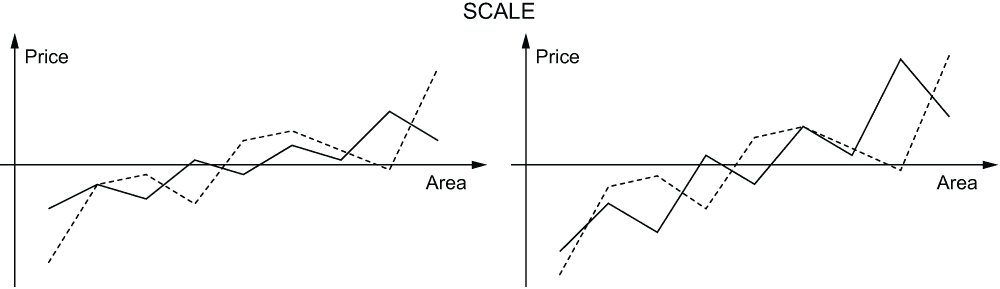
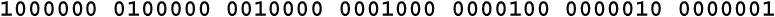

# 第十二章：安全加密的原则

本章涵盖

+   安全加密的五个原则

+   大块和长密钥

+   混淆或非线性

+   扩散和饱和

让我们将在第十一章学到的一切汇总起来。在 12.1 到 12.5 节中，我们将概括出使块密码安全的 5 个基本原则。安全块密码的一个标志是，改变密钥中的任何位或明文中的任何位将导致密文块中约 50%的位发生变化，最好是以看似随机的模式。改变任何其他位也会导致密文块中约 50%的位发生变化，但是以不同的模式。让我们称之为*五五开*特性。本章将描述如何实现这一点。

## 12.1 大块

我们已经看到，双字母密码可以像简单替换密码一样解决，方法是编制双字母频率和接触频率。这也可以用于三字母和四字母，尽管需要大量的密文。对于手工完成的块密码，应考虑的最小块大小是 5 个字符。对于计算机密码，最小块大小是 8 字节。大块大小的一个目的是防止 Emily 像解码一样解决密码。也就是说，Emily 会找到重复的密文块，并从它们的频率和在消息中的位置推断它们的含义。以极端情况为例，如果块大小为 1 个字符，那么无论密钥有多大，使用了多少加密步骤，密码仍然只是一个简单的替换。

在英语中有许多 8 个字符的序列是足够常见的，以至于在长消息中会重复出现。以下是一打例子，使用省略号...表示空格。

如今的标准块大小是 16 字节。没有那么长的高频英文短语。可能会有一些长的上下文短语，比如 UNITED STATES GOVERNMENT，EXECUTIVE COMMITTEE，INTERNATIONAL WATERS 等等。然而，要产生重复的密文块，这些明文重复必须以相同的方式与块边界对齐。例如，16 字节的明文块 UNITED**...**STATES**...**GO 和 NITED**...**STATES**...**GOV 在使用强大的块密码时不会产生可识别的密文重复。

当您使用块链接（第 11.9 节）时，重复的密文块问题消失了。使用块链接时，可以使用任何大于等于 8 字节的块大小。

## 12.2 长密钥

我们知道，安全的密码必须具有一个大密钥以防止暴力破解攻击。当前的标准是 128 位密钥。如果您希望您的消息保密 20 年或更长时间，我建议最低使用 160 位。这相当于约 48 个十进制数字，40 个十六进制数字或 34 个单个字母。

如果你是手动输入密钥，我建议你以统一的方式构建你的密钥。用一致的格式将密钥分成相同大小的块。这里有两种统一结构密钥的样式。在第一种样式中，每个块中的所有字符都是相同类型的，大写字母、小写字母或数字。在第二种样式中，块的格式相同，有两个大写字母和三个数字。

这两个密钥中的第一个相当于约 191 位，第二个相当于约 174 位。对于这样长的密钥，你必须能够在输入时看到字符，以便在需要时进行复查和更正。当密钥完成时，应用程序应显示一个校验和，以便您验证密钥是否正确。

这种规律的一个好处是防止将字母 O 误认为数字 0，或者字母 I 误认为数字 1。我不建议随机混合字符，比如**$v94H;t}=Nd⁸**，因为这会导致错误。如果你使用密钥**$v94H;t}=Nd⁸**加密了一个数据文件，然后你用密钥**$V94H;t}=Nd⁸**解密它，那么该数据文件现在可能无法恢复。你可能永远都不知道出了什么问题以及如何解决。在你的密钥中使用统一的块有助于防止这种灾难发生。

另一种有助于防止输入错误的密钥形式是人工词。制造你自己的可以发音的字母组合，就像这样：

尽量避免模式，比如使用相同的元音组合，**palek mafner vadel glabet**之类的，所有单词都使用 A-E 元音模式。

这些字母数字密钥可以被软件转换成二进制形式。**madd**连锁密码（第 11.8 节）非常适合这个任务。

作为加密每条消息或数据文件的关键字的替代方案是使用一个*关键字管理器*，它生成关键字并将它们与消息或文件关联起来。关键字管理器可以安装在一个对桑德拉和里娃都可访问的网站上。这个话题不会在本书中涵盖。请注意，关键字管理器与密码管理器不同，因为桑德拉和里娃在不同的计算机上工作时必须为每个文件使用相同的关键字。

### 12.2.1 冗余密钥

在某些情况下，艾米丽可能会设计方程，将密文与明文和密钥相关联。如果艾米丽知道或能够猜测一些明文，这些方程可能使她能够确定密钥。例如，她可能知道一些消息以全大写字母 ATTENTION 开头。这可能足以使她在使用 8 字节块大小时解决 64 位密钥。

战胜这种潜在攻击的一种方法是扩大密钥。 例如，如果块大小为 64 位，但密钥大 32 位，即 96 位，则您可以期望，平均而言，会有大约 2³²个可能的密钥将已知的明文转换为密文。 艾米莉需要筛选这 2³²个解决方案以找到正确的解决方案。 这可能是一项困难的任务，因为超过 4,000,000,000 个可能性中的许多可能看起来像合理的文本。

扩大密钥会使艾米莉的任务变得更加困难，但不一定是不可能的。 如果她有两倍于已知明文的量，则可能使用两个密码块的方程式来解出密钥。 但是，拥有这么多已知明文是非常罕见的，解决两倍数量的方程可能需要的时间远远超过两倍。 根据艾米莉使用的方程式类型，解决一组 64 个方程可能是可行的，但解决一组 128 个方程可能是不可行的。

如果艾米莉没有可解的方程式，则冗余密钥可使暴力攻击变得更加困难和昂贵。 无论如何，冗余密钥都会使艾米莉工作更加艰难。

## 12.3 混淆

在 1945 年，信息论创始人克劳德·香农描述了强密码必须具备的两个属性。 他称这些为*混淆*和*扩散*。 通过*混淆*，香农指的是明文和密文之间不应有强相关性。 同样，密钥和密文之间也不应有强相关性。 通过*扩散*，香农指的是密文的每一部分都应该依赖于明文的每一部分和密钥的每一部分。

我将添加到香农两个属性的第三个属性。 我称这个属性为*饱和*。 这个想法是衡量密文的每一位或每一字节如何依赖于明文的每一位或每一字节以及密钥的每一位或每一字节。 饱和度越高，密码就越强。 本节以及接下来的两节将详细讨论这三个属性，混淆、扩散和饱和。

在分组密码中有两种替换类型，固定和键入。 键入的替换是可变的，可以为每个消息甚至每个块更改。 在第 11.6 节中讨论了这些方法的利弊。 如果您决定使用键入的替换，或者如果您发现本节中的数学很困难，那么您可以直接跳转到第 12.4 节。 您可以使用在第 5.2 节和 12.3.7 节中描述的 SkipMix 算法构建您的混合字母表或表，然后使用伪随机数生成器选择跳过的顺序。

在香农的理解中，混淆基本上是线性与非线性的问题。 如果您的分组密码使用固定的字母表或表格，线性性质至关重要。 整个线性代数领域都建立在线性概念上。 *线性性* 这个术语来自解析几何学。 一条直线的方程是 ax+by = c，其中 a、b 和 c 是常数，变量 x 和 y 表示直线上某点的笛卡尔坐标。 如果直线不与 y 轴平行，方程可以表示为 y = ax+b。 ax+by = c 和 y = ax+b 都是线性方程或线性关系的例子。

凯撒密码（第 4.2 节）是线性密码的一个例子。 凯撒密码可以被看作是将密钥加到明文上以获得密文，c = p+k。 这里 c 是密文字母，p 是明文字母，k 是密钥。 密钥是字母已经移动的量。 凯撒大帝使用了一个移位为 3 位的密码，这意味着字母表中的每个字母都被替换为后面 3 位的字母，c = p+3，字母接近字母表末尾的位置将被移到字母表的开头。

顺便说一句，凯撒的方法并不像听起来那样脆弱，因为凯撒用希腊字母写他的信息。 在凯撒时代，受过良好教育的上层罗马人，如凯撒及其将军，懂希腊语，就像 19 世纪的上层英国人学习拉丁语和贵族俄罗斯人说法语一样。

在涉及替换步骤和置换步骤的分组密码中，如果单个替换是非线性的，则整个密码是非线性的。 实际上，如果分组密码有多轮替换，那么只要有一个早期轮次是非线性的，整个密码就是非线性的，前提是该轮次涉及块中的所有单元。 一旦失去了线性性质，就无法在后来的轮次中重新获得它。 让每一轮都是非线性的将会更加强大，但是即使只有一个非线性轮次，特别是如果它出现在开始位置，也比没有强。

有线性和非线性的程度。 替换可以是高度线性的、弱线性的、弱非线性的或高度非线性的。 每种情况的一个例子应该可以说明问题。 我已经在明文字母表中的每个字母位置与密文字母表中的对应位置之间画了一条线。 你可以立即看到，随着替换变得更加非线性，字母表的混合程度有多好。

在接下来的讨论中，我将 S 盒的输入称为明文和密钥，将输出称为密文。这些术语指的是该单个 S 盒的明文和密文，并不一定是整个多轮分组密码的明文和密文。在某些分组密码中，S 盒没有密钥，它们仅执行简单的替换。在这种情况下，你可以想象 S 盒具有一个密钥，其常量值为 0，或者 S 盒密钥的长度为 0 位。

假设 Emily 能够测试 S 盒的线性度，因为密码已经发表，或者她已经获得了该设备的副本。如果 Emily 所拥有的仅仅是第一轮的输入和最后一轮的输出，那么线性度测试可能就不可行了。

### 12.3.1 相关系数

有一种既定的统计方法用于测试两个数值变量之间的相关性。例如，你可以测试温度和阳光之间的相关性，温度以摄氏度度量，阳光以小时为单位度量。温度和小时是数值变量。你可以进行多次试验，在某个固定的时间测量温度，并记录那天的阳光小时数。这将为你提供两个数字列表，一个列表用于温度，另一个列表用于相应的阳光小时数。该统计量衡量这两个数字列表之间的相关性。

在我们的情况下，两个变量是明文字母和密文字母。"试验"是字母在字母表中的位置。例如，第一个试验可以是"A"，最后一个试验可以是"Z"。字母表中的字母需要以某种方式编号。编号将取决于字母表的大小。例如，一个 27 个字母的字母表可以使用 3 个三进制（基数 3）数字编号，就像我们在第 9.9 节中对三肽密码所做的那样。相关性可以是明文字母的任何三进制数字与密文字母的任何三进制数字之间的相关性。在接下来的两节中，我将详细讨论这一点，分别讨论 26 个字母的字母表和 256 个字符的字母表。

线性度通过计算两个变量之间的相关性来衡量。到目前为止，最广泛使用的相关性度量是由英国数学家卡尔·皮尔逊（Karl Pearson）开发的皮尔逊积差相关系数，他是生物统计学的奠基人，并于 1895 年发表，尽管这个公式本身在 1844 年由法国物理学家奥古斯特·布拉维斯（Auguste Bravais）发布，他以晶体学的工作而闻名。相关系数的目的是得到一个单一的数字，告诉我们两个变量的相关程度，这个数字的含义不受测量单位或所涉及的数字大小的影响。

如果两个变量具有线性关系，则相关性为 1。如果变量之间没有任何相关性，则相关性为 0。如果两者具有反向关系，则相关性为-1。例如，抛硬币 20 次中正面朝上的次数与反面朝上的次数将具有反向关系。相关性为 0.8 表示强烈的线性关系，而相关性为 0.2 表示关系高度非线性。

与大多数教科书一样，我不仅仅是呈现公式，我将解释它是如何以及为什么有效的。理解它的工作原理将帮助您正确和适当地使用它。

这里的目标是比较两个变量。这是通过比较一系列试验中的值来完成的。例如，我们可能想比较在伊斯法罕的凯萨里耶巴扎尔出售的魔毯价格与其尺寸。影响魔毯价格的因素有很多，包括纱线类型、结的密度、设计的复杂性，当然还有飞行速度。

居中

比较变量的第一步是将它们并排放置，就像您通过视觉比较它们一样。换句话说，您希望消除线性关系 P = mA+x 中的+x 项，其中 P 是价格，A 是面积。看起来您可以计算差值 P[i]-A[i]，然后从 P 中减去平均差值。然而，这是没有意义的，因为 P 和 A 是以不同单位表示的。地毯面积 A 以平方阿尔萨尼（大约一米）为单位，而巴扎尔中的地毯价格 P 以图曼（波斯货币）计价。

您需要分别调整面积数字和价格数字，因为它们是以不同单位表示的。诀窍是取平均价格并从所有价格数字中减去以获得新的调整后的价格数字 P'。您通过将地毯价格相加并除以地毯数量来计算平均价格μ[P]。例如，如果价格分别为 1000、1200 和 1700 图曼，您将把这 3 个价格相加 1000+1200+1700，然后除以 3 得到平均价格 1300。您将从每个价格中减去 1300 以获得调整后的价格-300、-100 和 400。正如您所看到的，调整后的价格 P'相加为 0。在某种意义上，调整后的价格围绕 0 居中。

区域图形以相同的方式居中。您将所有区域相加，然后除以地毯数量得到平均面积。例如，如果面积分别为 10、12 和 17 平方阿尔萨尼，您将把这 3 个面积相加 10+12+17，然后除以 3 得到平均面积 13。然后，您将从每个面积中减去 13 以获得调整后的面积-3、-1 和 4。调整后的面积 A'也相加为 0。现在，调整后的面积和调整后的价格都围绕 0 居中。它们并排放置，准备进行比较。

缩放

下一步是将价格和面积放在同一尺度上。价格是以土曼为单位的，面积是以平方阿尔萨尼为单位的，而从土曼到平方阿尔萨尼的转换是不存在的。那就像是从蒲式耳到摄氏度的转换一样。皮尔逊，或者更确切地说是布拉维，使用了线性代数中的一个概念，称为*归一化*。

假设你有一个向量（a，b），你想找到一个指向同一方向的向量，但长度为 1。任何向量（a，b）的倍数，比如（ma，mb），都会指向同一方向。乘以一个向量会改变它的长度，但不会改变它的方向。如果你将向量除以它的长度，新向量（a/L，b/L）的长度将为 1，并且方向与原始向量相同。这也清除了单位。想象一下，向量的长度是用英尺来衡量的。如果你将向量除以它的长度，那么你得到的就是英尺除以英尺。结果只是一个数字，没有单位。它是无量纲的。当向量用土曼或平方阿尔萨尼来衡量时，情况也是如此。

向量的长度可以很容易地通过使用勾股定理找到，*L* = √(*a*² + *b*²)。这可以扩展到任意维度，*L* = √(*a*² + *b*² + *c*² + ...)。让我们试一个例子来看看这是否有效。尝试向量（3，4）。这个向量的长度是 √(3² + 4²) = √(9 + 16) = √25 = 5。归一化向量是 (3/5,4/5)。因此 √((3/5)² + (4/5)²) = √(9/25 + 16/25) = √25/25 = 1 是归一化向量的长度，如预期的那样。它有效。

P、A、P' 和 A' 都是数字列表，因此它们是向量。它们像任何向量一样有长度，并且可以像任何向量一样归一化。在几何学中，通过将向量除以其长度来归一化向量。任何归一化向量的长度始终为 1。

要将 P' 归一化，你只需对所有调整后的价格进行平方，然后将这些平方相加并取这个和的平方根。这给出了 P' 的长度。将调整后的价格 P' 除以长度得到归一化价格 P''。要将 A' 归一化，你只需对所有调整后的面积进行平方，然后将这些平方相加并取这个和的平方根。这给出了 A' 的长度。将所有调整后的面积 A' 除以长度得到归一化面积 A''。

总结一下，（1）通过减去平均值来将价格和面积居中，然后（2）通过除以长度来归一化价格和面积。结果是一个标准化的价格列表和一个标准化的面积列表，其中每个列表中项的总和为 0，每个列表中项的平方和为 1。

现在我们准备好使用公式了。将价格的归一化列表中的每一项乘以面积的归一化列表中的相应项，即 P''[i]×A''[i]。将这些乘积相加。这就是相关系数。（在线性代数中，这被称为归一化价格向量和归一化面积向量的*内积*或*点积*。）

让我们对此进行现实检验。想象我们正在测试摄氏温度和华氏温度之间的相关性。我们知道它们通过线性公式 F = 1.8C+32 相关，因此相关系数应该为 1。假设我们在上午 11 点、下午 3 点、晚上 7 点和 11 点测量温度，并发现摄氏温度分别为（14，24，6，0），华氏温度为（57.2，75.2，42.8，32）。摄氏温度的平均值为（14+24+6+0）/4 = 11，因此调整后的摄氏温度 C' 为（3，13，-5，-11），对应的调整后的华氏温度 F' 为（5.4，23.4，-9，-19.8）。摄氏温度 C' 的长度为 18。将 C' 除以 18 得到 C''，归一化后的摄氏温度（3/18，13/18，-5/18，-11/18）。调整后的华氏温度 F' 的长度为 32.4，归一化后的华氏温度 F'' 为（3/18，13/18，-5/18，-11/18）。

我们将 C'' 逐个元素与 F'' 相乘，然后将 4 个乘积相加以得到相关系数。这个和是（3/18）²+（13/18）²+（-5/18）²+（-11/18）²。总和为 1。这支持了先前描述的过程，即通过减去平均值进行居中，通过除以长度进行归一化，然后逐项相乘并求和，确实产生了有效的相关系数。

总结一下：通过计算相关系数来测试线性。本节向您展示了如何计算相关系数。计算结果为介于-1 和+1 之间的数字。以下是解释相关系数的图表。

### 12.3.2 基-26 线性

让我们从基于 26 个字符的字母表的替换开始调查线性。如果您正在设计机械或机电密码设备，或者正在模拟这样一个设备，这可能很有价值。这种机器中的每个转子都对一个包含 26 个字符的字母表进行替换。首先考虑一个没有密钥的 S-box。在使用 26 个字母表时，可能会出现多种形式的线性，这取决于字母的编号方式。可以从 3 种方式来看待字母表：将字母表视为一个 26 个字母的序列，将其视为一个 2×13 的字母数组，或者将其视为一个 13×2 的字母数组。这导致 3 种不同的字符编号方式：N1、N2 和 N3，如所示。对这 3 种编号方案的讨论使用模运算。如果您现在想复习模运算，请参阅第 3.6 节。

编号方案 N2 和 N3 遵循常规约定，使用字母 A、B 和 C 表示 9 以外的数字。也就是说，它们使用了 16 个十六进制数字中的前 13 个。在最简单的线性加密（Belaso 密码）中，密钥只是加到明文中。当将密钥加到明文字符中时，在 N1 编号方案中，它使用传统的模 26 加法。当将密钥加到 N2 编号方案中的明文字符时，第一个数字是模 2 加法，第二个数字是模 13 加法。相反，当将密钥加到 N3 编号方案中的明文字符时，第一个数字是模 13 加法，第二个数字是模 2 加法。以下是展示单词 THE 如何在每种方案中通过添加密钥 J 进行加密的示例。

如果纯文本、密钥和密文字母都使用 N1 方案编号，则线性替换或线性变换会将明文字符 p 转换成密文字符 c = mp+f(k)，其中 m 是一个乘数，必须与 26 互质，f(k) 是任意整数值函数，算术运算是模 26 运算。例如，如果 m = 5，p = 10，k = 3，而 f(k) = k²+6，则 c = 13，因为 5×10+3²+6 = 65 ≡ 13 (mod 26)。常数 m 和函数 f(k) 可以构建到替换表中。

如果纯文本、密钥和密文字母都使用 N2 或 2×13 编号方案进行编号，则第一个数字或第二个数字或两个数字都可以是线性的。假设两个数字都是线性的。那么，一个明文字符 p = a,b 使用密钥 k 转换成密文字符 c = ma+f(k),nb+g(k)，其中 m 必须与 2 互质，即 m = 1，n 必须与 13 互质，而 f(k) 和 g(k) 可以是任意整数值函数。分别进行模 2 和模 13 运算。常数 m 和 n，以及函数 f(k) 和 g(k) 可以构建到替换表中。

如果纯文本、密钥和密文字母都使用 N3 或 13×2 编号方案进行编号，则第一个数字或第二个数字或两个数字都可以是线性的。假设两个数字都是线性的。那么，一个明文字符 p = a,b 使用密钥 k 转换成密文字符 c = ma+f(k),nb+g(k)，其中 m 必须与 13 互质，n 必须与 2 互质，即 n = 1，而 f(k) 和 g(k) 可以是任意整数值函数。分别进行模 13 和模 2 运算。常数 m 和 n，以及函数 f(k) 和 g(k)，可以构建到替换表中。

平文和密文没有必要以相同的方式编号。在任何编号中，平文的任何数字与密文的任何数字之间都可能存在相关性。艾米莉可能会测试这些组合中的任何一个或全部，寻找可利用的弱点。因此，密码的设计者必须测试所有可能的编号和相关性，以验证没有这种弱点存在，或者了解必须采取哪些对策以防止艾米莉利用这种弱点。例如，您可以在分组密码的交替轮次中使用具有不同弱点的替换。在大多数情况下，每个替换都会减弱另一个的弱点。当然，您应该通过搜索明文和最终密文之间的线性关系来测试这一点，后者是由最后一轮产生的。

如果你想测试替换的线性性，就不能直接应用相关系数。这是因为所有这些替换都是使用模算术完成的。考虑一下使用 N1 编号方案进行的这种替换：

这几乎完全是 c = 2p，所以它非常线性。然而，使用该编号方案计算的明文和密文字母之间的相关系数为 0.55556，表明替换只是弱线性的。应该使用以下分布计算相关系数，该分布在模 26 下是等效的。

使用该编号的相关系数为 0.99987，正确显示了非常强的线性性。

这说明了在密码学中使用相关系数的困难。你总是在字母表的大小模下工作。要找到正确的相关性，你需要添加 26，然后是 52、78 等等，对于 N1 编号是这样，或者对于 N2 和 N3 编号是 13、26、39 等等。在前面的例子中，你需要开始添加 26 的地方是显而易见的。它是在密文编号变为**22 24 1 3**的地方。从 24 降到 1 就表明了这一点。

当密文字母表的线性性较低，即在一定程度上跳动时，可能更难以发现。例如，这种替换的相关性为 0.3265，具有中度非线性。

当通过这种方式调整时

相关性变为 0.9944，非常线性。我已经使用单个、双重和  下划线来显示在密文字符中添加了 26、52 和 ，分别对应的是明文字符。在此要注意的一个重要特征是，在密文字符 2 处添加了 26，对应于明文字符 5，但没有添加到后续的密文字符 21 和 25。同样，对于密文字符 1，添加了 52，对应于明文字符 14，但没有添加到后续的密文字符 24。

当密文字母接近线性时，确定要添加的 26 的倍数相当容易。当密文字母行为不良时，这变得更加困难。但是...那没关系。当替代是非线性的时候，这就是您需要知道的全部。相关系数是 0.01 还是 0.35 都没有关系。在任一情况下，没有足够的相关性供 Emily 利用。不要浪费时间计算精确值。

处理没有密钥的情况。现在假设有一个密钥。如果替代是线性的，那么它将具有形式 d(p)+f(k)，其中 p 是明文，k 是密钥，d 和 f 是整数值函数。加法可以在任何 3 个编号方案 N1、N2 或 N3 中进行。在这种情况下，密钥在测试线性方面没有任何作用。f(k)只是添加到密文的常量。添加常量对相关系数没有影响，因为当您从每个值列表中减去均值（居中操作）时，它只是被再次减去。很容易测试替换 S(k,p)是否采用形式 d(p)+f(k)。只需选择两个密钥 k[1]和 k[2]，并取差异 S(k[1],0)-S(k[2],0)，S(k[1],1)-S(k[2],1)，S(k[1],2)-S(k[2],2)，...如果 S-box 具有形式 d(p)+f(k)，那么所有这些差异将相等。如果您对所有可能的密钥重复这样做，那么您可以确定 S(k,p)具有所需的形式，并且您可以在不考虑密钥的情况下测试线性。

### 12.3.3 256 进制线性

对于 26 进制线性的分析只是对 256 进制线性的热身，因为在 256 进制中可能会发生两种不同的线性形式。我们称它们为*串行*和*压缩*。在串行线性中，每组位代表一个整数。例如，3 位组 000、001、010、...，111 表示数字 0、1、2、...，7。可以将两种形式的线性结合起来，以制作混合形式的线性。这在第 12.3.6 节中讨论。

串行线性是我们在 26 进制中看到的。在 26 进制中，N1、N2 和 N3 编号之间可能存在任何组合和任何顺序的相关性，因此必须测试许多成对是否具有线性。在 256 进制中有更多的可能性。串行线性可能存在于明文字母和/或密钥与密文字母中的任何位组之间。这些位组的大小不必相同。从明文中取出的 4 位组，覆盖范围从 0 到 15，可能与覆盖范围从 0 到 7 的 3 位密文组高度相关，因此可能的配对数量更多。

事情变得更糟，那个 4 位组中的 4 位可能是明文字节中的任意位。按顺序的位 7、2、5、1 和位 1、2、3、4 一样有效。线性替换可能将这 4 位加到密钥字节的 4 个不同位上，取模 16。可能的组合数量变得巨大。总之，明文字符和密钥字符中任何顺序的任何位组合都可能与密文字符中任何顺序的任何位组合线性相关。这是一大堆需要测试的相关性。

在你伸手拿阿司匹林或者龙舌兰酒之前，这里有个好消息。你可能不需要测试它们中的任何一个。除非密码是专门设计成从一轮传递到下一轮保持这些值不变，否则这些相关性不会有所影响。它们会随着每一轮的进行而逐渐削弱，以至于从初始明文到区块密码的最后一轮都不会被检测出来。

### 添加后门

你可能已经注意到我说了“可能”。例外情况是当你怀疑一个密码可能有后门时，也就是说，它已经被故意设计成让知道秘密的人可以在不知道密钥的情况下阅读消息。例如，一个国家间谍机构可能会向其特工提供一个带有后门的密码，以便该机构可以监视他们的消息并检测叛徒。

此时，让我们换个角色。假设你是 Z，被委派设计这个密码的间谍大师。你需要构建一个看起来和表现得像一个强大的区块密码的密码，这样用户就不会起疑。例如，你希望你的密码具有五十五的属性，即仅改变密钥或明文中的一个比特就会导致大约一半的密文比特以随机的模式改变。如果你的区块密码中的替代不都是线性的，那就是一个强大的区块密码的确切迹象。你希望你的假密码模仿这种属性。

这里有一种方法可以在密码中隐藏后门。它基于串行线性性，所以让我们称之为 *后门串行* 方法来构建密码，并让使用这种方法构建的密码称为 *后门串行* 密码。Z 可以阅读使用后门串行密码发送的消息，而无需知道密钥，但是对于不知道后门工作原理的任何人来说，它们看起来像是强大的、安全的区块密码。该方法分为三个部分：*伪装*、*隐藏* 和 *伪装*。

伪装

后门串行密码将对十六进制数字进行线性替换。明文块和密钥的每个块都被视为一个 4 位十六进制数字的序列。加密操作是在消息块和密钥的十六进制数字上进行的模 16 加法。假设字节中的两个十六进制数字是 p[1] 和 p[2]，用于对它们进行加密的密钥的十六进制数字是 k[1] 和 k[2]。线性替换将 p[1] 和 p[2] 替换为

系数 a、b、c、d、e、f、g、h、i 和 j 可以是从 0 到 15 的任意整数，而 ag-fb 必须是奇数。如果您的密码有多轮，这 10 个值可以每轮不同。

这种线性替换易于 Emily 发现。特别是，每个十六进制数位的低阶位纯粹是线性的，因此对线性的简单位对位测试将找到它。为了避免检测，我们可以伪装十六进制数位。首先，按某种乱序列出十六进制数位，就像这样：

要将两个伪装的十六进制数位相加，您将它们在乱序列表中的位置相加，以获得总和在乱序列表中的位置。例如，要计算 **1**+**2**，您发现数字 **1** 在位置 9，数字 **2** 在位置 F，因此您将 9+F 模 16 得到 8。总和在列表中的位置 8。位置 8 中的数字是 **D**，因此 **1**+**2** = **D**。

同样地，要将两个伪装的十六进制数位相乘，您将它们在乱序列表中的位置相乘，以获得乘积在乱序列表中的位置。例如，要计算 **2**×**3**，您注意到数字 **2** 在位置 F，数字 **3** 在位置 2，因此您将 F×2 模 16 得到 E。该产品位于列表中的位置 E。位置 E 中的数字是 **7**，所以 **2**×**3** = **7**。

本质上，伪装是对十六进制数位进行的简单替换。如果替换是非线性的，则没有一个位将在明文和密文之间具有线性关系。这种伪装的线性性质对于 Emily 来说要难得多，但是要真正迷惑 Emily，您可以隐藏伪装的十六进制数位。

隐蔽性

如果十六进制数的位始终是每个字节的块和密钥的位 1-4 和位 5-8，那么 Emily 仍有可能发现线性性。为了使 Emily 的任务真正艰难，您可以隐藏每个字节中的位。而不是使用明文的位（1,2,3,4）和密钥的位（1,2,3,4），并将结果总和放入密文的位（1,2,3,4），您可以按顺序使用明文的位（2,7,4,1）的十六进制数位，以及密钥的位（4,8,3,5），并将结果总和放入密文字节的位（8,6,1,7）。您可以选择任意顺序的 4 位的任何组合，只要每个字节中的 2 个十六进制数位都使用了所有 8 位。

为了明确起见，我们并不是说 Sandra 从每个字节中提取这些位，解密伪装的线性置换，执行算术，然后以不同顺序重新打包结果位。那样太慢了，而且 Emily 会清楚地知道发生了什么。相反，Sandra 在构建替代表时进行了这项工作。为了加密，她只需使用密钥字节选择表中的一行，然后对明文字节执行替代。所有的伪装和隐蔽都内置在替代表中。

伪装

到目前为止，所描述的密码仅仅是一个非常复杂的多表密码。Emily 可以使用第 5.8.3 节的技术解密消息。为了使后门序列密码看起来像一个强大的区块密码，你需要一些伪装来隐藏其核心的多表密码。

一种方法是在每一轮后对块应用位转置。这将使密码看起来像是一个置换-置换网络（第 11.1 节）。为了保留隐藏的线性性，组成每个十六进制数字的 4 位必须最终位于一个字节中。它们不必在该字节中的相同位位置，也不必是连续的，但它们必须在一个字节中。换句话说，输入的每个字节都被分成两个十六进制数字，这些数字以某种转置顺序被馈送到下一轮的两个其他字节中。不幸的是，如果 Emily 能够获得后门序列密码的发布规范，她很可能会发现这种类型的伪装。

让我们看看另一种更难于 Emily 揭示的伪装方式。这种方法借鉴了数据加密标准（DES）的一个想法（第 11.2 节）。每个密码块被分为两半。在每一轮中，首先使用左半部分作为密钥来加密右半部分，然后使用右半部分作为密钥来加密左半部分。我们已经看到了如何将线性性质伪装并隐藏在替代表中，所以让我们利用这一点来制造一个强大的区块密码的幻觉。

每轮密码会包括四个步骤。(1) 左半部分中的每个字节都使用一个字节的密钥进行加密。(2) 右半部分的每个字节都使用左半部分的一个字节作为密钥进行加密。(3) 右半部分中的每个字节都使用一个字节的密钥进行加密。(4) 左半部分的每个字节都使用右半部分的一个字节作为密钥进行加密。

为了使其看起来非常强大，每个块的每个字节应在每一轮中使用不同的密钥字节进行加密，并且每个块的一半的每个字节应在每一轮中使用来自另一半的不同字节进行加密。您可以通过在每一轮中对块中的字节和密钥中的字节进行洗牌来使其更加复杂。您可以使密钥比块更大，以展示更强大的印象。然而，密码仍然是线性的，因为在每一轮的每一步中都保持了线性性。

存储

让我们来看看后门串行密码的机制。在密钥的每个字节中，明文和密文中都有两个十六进制数字。每个数字可以占据字节的任何 4 位，以任何顺序。让我们称这组有序的 4 位为十六进制数字的*位配置*，并且字节中的 2 个十六进制数字的组合为*字节配置*。密钥通常不会更改配置，但是明文和密文的字节配置可以在加密的任何阶段更改。

对于每个替换，有 6 种位配置，2 种用于密钥，2 种用于明文，2 种用于密文。对于每个十六进制数字，16 个十六进制值的排列（乱序）也可以不同，因此对于每个替换，每个位配置和排列也有 6 种排列，2 种用于密钥，2 种用于明文，2 种用于密文。这种 6 种配置和 6 种排列的组合确定了替换表。对于每个不同的位配置和排列组合，都需要一个单独的替换表。

每个表格使用 65,536 字节，因此存储可能会成为问题。如果这是一个问题，我建议最多使用 2 字节配置，并且对于每个位配置最多使用 2 种不同的排列，也许可以在每一轮中交替使用。为了进一步减少所需的存储量，您可以考虑每次使用任何给定的位配置时都使用相同的排列。

### 12.3.5 精简线性

在大多数情况下，您将不会在密码中构建后门，也不会关注串行线性性。让我们把注意力转向第二种线性性，即压缩线性性。在这种线性性形式中，一组位通过将它们进行异或运算压缩为单个位。因此，000、011、101 或 110 将被压缩为 0，而 001、010、100 或 111 将被压缩为 1。明文和/或密钥的任何位组合都可能与每个 S-box 的密文的位组合相关。如果块密码使用异或将 S-box 的输出与块的其余部分结合在一起，则此线性性可以从一轮传递到另一轮，并且原始第一轮明文与最终最后一轮密文之间将存在线性关系。密码的设计者必须避免以这种方式使用异或，或者必须进行彻底的检查，以确保 S-box 不包含任何这样的线性性。

假设 S-box 接受一个 8 位明文并产生一个 8 位密文。从明文中选择一组位有 255 种不同的方式，同样地，从密文中选择一组位也有 255 种方式。（位的顺序并不重要，因为 a⊕b = b⊕a。）这使得有 255² = 65,025 种不同的组配对需要测试。每个测试都是 256 个明文值与 256 个密文值之间的相关性。即使在个人电脑上，这也是很容易实现的。

如果 S-box 接受一个 8 位明文加上一个 8 位密钥并产生一个 8 位密文，那么从明文加密钥中选择一组位有 65,535 种不同的方式，同样地从密文中选择一组位也有 255 种方式。这使得有 65,535×255 = 16,711,425 种不同的配对需要测试。这在个人电脑上需要花费一段时间，因为每个相关性都涉及所有 65,536 个明文和密钥组合。这是需要居中、缩放和求和的超过 10¹²个值。

这是谈论如何高效进行这些测试的理想时间。有一些技巧可以大大加快这个过程。 (1) 为了选择一组位，使用一个从每个字节中选择这些位的掩码。例如，如果你想要第 2、4 和 7 位，使用掩码 01010010，它在位位置 2、4 和 7 上有 1。将这个掩码与每个明文字节进行 AND 运算，以选择所需的位。 (2) 要尝试所有可能的位组合，不要逐个构造掩码，只需将掩码步进到所有值 1 到 255。 (3) 要压缩位，不要每次都使用移位和 XOR。只需执行一次并构建压缩值的表。然后，通过表查找可以将位组合压缩。如果有一组密钥位和明文位，这些位可以通过异或在一起，然后使用表来压缩，这样您只需要一次表查找而不是两次。

### 12.3.6 混合线性性

为了完整起见，我要提到可以有一种混合形式的线性性，将串行和压缩线性结合起来是可能的。假设你将每个 8 位字节分成四个 2 位组。这些 2 位组可以通过加法模 4 串行线性。你可以通过将它们模 4 相加来压缩两个或多个这些组。同样的操作也可以用于模 8 的 3 位组或模 16 的 4 位组。

让我们坚持使用 2 位组。每个组可以由字节中的任何 2 位组成。例如，一个字节可以分解为 4 个组，位 (6,1)，(4,8)，(2,5) 和 (7,3)。你可以通过将几个 2 位组相加模 4 或取任意的线性组合模 4 来压缩几个 2 位组为一个 2 位组。例如，如果 2 位组是 A、B、C 和 D，你可以将它们组合成一个新的 2 位组 pA+qB+rC+sD+t (mod 4)，其中 p、q、r、s 和 t 是固定整数，范围为 0 到 3，其中至少有一个是奇数。

这些类型的压缩组可能与密文中类似的混合组或正常位组或密文中的压缩位组相关联。如果你想要绝对彻底，那么所有可能的线性组、压缩组和混合组的配对都需要进行相关性测试。

### 12.3.7 构建 S 盒

有三种构建具有良好非线性特性的 S 盒的方法：*时钟方法*，*SkipMix* 和 *Meld8* *方法*。

时钟方法

在一张纸上，将字母按照顺时针均匀间隔地排列在一个大圆圈周围，就像时钟表盘上的数字一样。选择一个起始字母和一个第二个字母，并从第一个字母到第二个字母之间画一条直线。然后选择一个第三个字母，并从第二个字母到第三个字母之间画一条直线，依此类推。将每条线的 *跨度* 定义为从每个字母顺时针移动到下一个字母的字母位置数。例如，使用 26 个字母的字母表，从 C 到 D 的跨度是 1，从 D 到 C 的跨度是 25。为了使替换尽可能非线性，使每个跨度长度都不同。

下面是具体操作。为字母表中的每个字母制作一个列表，其中包含可能跟随它的所有字母。当你开始时，每个字母的列表都会包含其他每个字母，所以你会得到 26 个含有 25 个字母的列表。每次选择一个字母并将其添加到混合字母表中时，从所有列表中删除该字母。如果从前一个字母到该字母的跨度是 s，则还要从所有列表中删除任何跨度为 s 的其他字母。例如，假设你已经将 P 和 R 添加到字母表中。从 P 到 R 的跨度是 2 个位置，PQR。因此，在 A 列表中，你会删除 C，在 B 列表中，你会删除 D，在 C 列表中，你会删除 E，依此类推。

最终，一些列表会变为空。如果只有一个字母的列表为空，那么该字母将成为混合字母表中的最后一个字母。如果有两个空列表，那么你已经陷入了僵局。重新开始，或者回溯并再试一次。每次选择要添加到字母表中的下一个字母时，选择一个列表较短的字母，但不要选择一个空列表的字母，除非那是剩下的最后一个字母。

历史背景

这种启发式方法称为 Warnsdorff 规则，以 H. C. von Warnsdorff 的名字命名，他在 1823 年用于在棋盘上构建骑士之旅。1965 年左右，加州大学圣克鲁斯分校的 Ira Pohl 提出了一个向前看 2 步的改进版本。

这是一个通过时钟方法构建的字母表示例：

有 5 种不同的编号需要测试，以检查该字母表的线性性：N1 编号，N2 编号的第一和第二位数字，以及 N3 编号的第一和第二位数字。每个都必须与标准拉丁字母表的相同 5 个编号相关联，总共有 25 个相关性。你希望所有相关性都在-.5 和+.5 之间。最好的情况是它们都在-.333 和+.333 之间。

这些测试的结果如下，25 个相关系数。

正如你所看到的，所有相关性都在-.226 和+.288 之间，其中有 6 个落在-.1 和+.1 之间，因此时钟方法是构建非线性替换的绝佳方法。

并不保证每次都能获得如此好的结果。你仍然需要测试线性性。

SkipMix

在本节（12.3）的前面，我提到可以使用 SkipMix 算法（第 5.2 节）与伪随机数生成器构建字母表。一般来说，随机选择字母表不会导致良好的非线性特性，所以让我更详细地描述如何最好地使用 SkipMix。这次我将以 256 个字符的字母表为例进行说明。

一如既往，你首先列出 256 个可用字符。在 1 到 256 的范围内生成一个随机数以选择第一个字符。假设那是字母表中的第 54 位。取出该字符，然后从列表中删除它。现在剩下 255 个字符。在 1 到 255 的范围内生成一个随机数。假设该数字是 231。下一个位置将是 54+231 = 285。由于这大于 255，你减去 255 得到 30。从位置 30 取下一个字符，并从列表中删除它。现在你已经取了 2 个字符，剩下 254 个字符，所以你在 1 到 254 的范围内生成一个随机数。依此类推。

生成的字母表具有良好的非线性特性，因为您每次生成不同范围的随机数。这与时钟方法中使所有跨度不同的情况类似。这是通过 SkipMix 的这个版本生成的一个 26 个字母的字母表示例。

这可以像测试时钟字母一样进行测试。结果如下：

这些结果很好。所有相关性都介于 -.127 和 +.344 之间，其中 5 个介于 -.1 和 +.1 之间，但是它们不如时钟方法的结果好。

Meld8 方法

这种方法基本上是一种特殊用途的伪随机数生成器。我将假设您正在使用的计算机语言能够操作 64 位整数。根据大整数的表示方式，您可以处理 2⁶² 或 2⁶³ 的整数。为了谨慎起见，我将假设 2⁶²。第一步是选择两个数字，一个乘数 m，位于 24 到 26 位之间，和一个模数 N，位于 35 到 37 位之间。模数必须是素数。如果 m 是 N 的原根，则最好，但由于我尚未解释那是什么，所以只需使 m 和 N 都是素数。

通过将它们相乘来测试您选择的 m 和 N。如果结果大于 2⁶²，约为 4.611×10¹⁸，则使 m 或 N 中的一个较小。

要生成随机数，从 2 到 N-1 之间选择任何整数 s 作为种子。将种子乘以 m，并对 N 取模以获得第一个伪随机数。将第一个随机数乘以 m 并对 N 取模以获得第二个随机数，依此类推。这给了你一个范围为 1 到 N-1 的随机数序列。您将使用这些随机数来生成字母。

假设 N 有 36 位。从高位开始，将 N 的位编号从 1 到 36。取每个随机数的前 8 位，位于 1 到 8 位。从高位开始删除它们，并将它们与下一个 8 位，即 9 到 16 位，进行异或。这就是 Meld8 操作。它的目的是使字符序列非线性。以下是一个示例：

下一步是使用 28 位随机数生成一个字符。这取决于您是要构建一个 26 个字符还是一个 256 个字符的字母表。对于 26 个字符的字母表，将此数字乘以 26 并除以 2²⁸（或向右移动 28 位）以获得下一个字符。对于 256 个字符的字母表，只需除以 2²⁰，或向右移动 20 位以获得下一个字符。

从空字母表开始，每次添加一个字符。如果这是一个新字符，则将其追加到字母表中。如果这是一个重复字符，则将其丢弃。由于您没有连续的随机数，因此这也适用于使字母表非线性。以下是使用模数 N = 90392754973、乘数 m = 23165801 和种子 s = 217934 生成的此类字母表的示例：

结果相关系数为

相关性范围从-.170 到+.267，其中有 11 个落在-.1 和+.1 之间。这是三个示例中最好的，然而，基于每种技术的单个示例得出 Meld8 是最佳方法的结论是愚蠢的。始终进行测试。

### 12.3.8 带有密钥的 S 盒

在第 12.3.7 节中，我们处理了没有密钥的 S 盒。它们执行简单的替换。当使用密钥时，S 盒执行一般的多表替换（第 5.8.3 节）。S 盒可以被视为一个表，其中每一行都是一个混合字母表。可以通过使用时钟方法、SkipMix 或 Meld8 构建每个混合字母表来生成 S 盒，或者通过任何组合方法。

如果使用时钟方法或 SkipMix，请每次使用不同的随机种子。如果使用 Meld8，则可以每次使用相同的模数，但使用不同的种子和不同的乘数。一如既往，测试，测试，测试。你的目标是避免密钥和明文与密文的组合之间存在任何线性关系。如果结果不佳，即许多相关系数在-.35 到+.35 范围之外，也许只需替换一个行或交换两个行的表就能解决问题。

## 12.4 扩散

香农的第二个特性是*扩散*。这个想法是密文的每一位或每一字节都应该依赖于明文和密钥的每一位或每一字节。

为了说明这一点，让我们回到第 9.6 节中描述的 Delastelle 的 bifid 密码。为了提醒你，bifid 是基于 Polybius 方阵的分组密码。如果块大小为 S，则消息的每个字母将被两个基于 5 的数字替换，并且这些数字被垂直写入一个 2×S 网格并水平读出。然后这些数字对再使用相同或不同的 Polybius 方阵转换回字母。

让块大小为 7，并将明文块中的字母称为 A、B、C、D、E、F、G。让表示这些字母的数字为 aa,bb,cc,dd,ee,ff,gg。我没有写下标，因为这里不重要哪个数字先出现，哪个数字后出现。那么块将是

当字母水平读出时，你会得到 ab,cd,ef,ga,bc,de,fg。请注意，密文的每个字母都取决于明文的两个字母。第一个密文字母取决于 A 和 B，第二个字母取决于 C 和 D，依此类推。

在这一点上，我需要引入一种特殊的符号来显示每个密文字母依赖于哪些明文字母。如果一个密文字母依赖于明文字母 P、Q 和 R，则它被指定为 pqr。使用这种符号，如果你再次加密字母 A、B、C、D、E、F、G，块会像这样：

将这些字母水平读出，你会得到 abcd，efga，bcde，fgab，cdef，gabc，defg。由于数字的顺序无关紧要，这也可以表示为 abcd，aefg，bcde，abfg，cdef，abcg，defg。经过两次加密后，每个密文字母都依赖于四个明文字母。

如果您使用双密码加密这个区块第三次，那么每个密文字母将取决于所有 7 个明文字符。对于区块大小为 7 的双密码，需要三轮加密才能实现完全扩散。如果区块大小为 9、11、13 或 15，那么需要四轮加密。（请回忆一下，双密码中的区块大小应始终为奇数。）

一般来说，要测试扩散，您首先使每个明文字符或位仅依赖于自身。如果密码操作的是整个字节或字符，则根据字节跟踪扩散。如果它操作十六进制数字、其他基数的数字或者单个位，则根据这些单元跟踪扩散。对于双密码，单元是 Polybius 方格坐标，或者是基数为 5 的数字。

为了追踪扩散，您需要一种方式来表示明文单元和密钥单元在区块密码的轮次中随着流动的方式。当只有少数明文单元时，就像双密码示例一样，仅列出它们就能很好地工作。当明文、密钥和密文单元的数量较大时，可能需要更紧凑的表示。一个好的策略是为每个密文单元创建一个二进制向量。让我们称之为*依赖向量*。依赖向量的每个元素将对应于一个输入，即明文或密钥单元。如果密文单元取决于该输入单元，则该依赖元素的值为 1，否则为 0。

当两个或多个输入单元组合成一个输出单元时，它们的依赖向量将被 OR 运算在一起，形成输出单元的依赖向量。为了说明这是如何工作的，让我们再次使用这种符号通过双密码示例。最初，每个字符仅依赖于自身。这由向量表示

在第一次应用双密码后，每个结果字母都依赖于两个明文字母。第一轮输出字节依赖于第一轮输入字节的前两个字节，因此你将它们的依赖向量进行 OR 运算得到 1100000。第二个输出字母依赖于第三和第四个明文字母，因此你将它们的依赖向量进行 OR 运算得到 0011000，依此类推。第一轮输出由向量表示

在第二轮的双重转置之后，第一个输出字母取决于第一轮的第一个和第二个输出，所以你将它们的依赖向量进行 OR 运算 **1100000**∨**0011000** 得到 **1111000**。第二个输出字母取决于第一轮的第三个和第四个输出，所以你将它们的依赖向量进行 OR 运算 **0000110**∨**1000001** 得到 **1000111**，依此类推。经过两轮的双重转置后，每个字母都取决于四个明文字母，表示为

在第三轮的双重转置之后，每个输出字母都取决于第一轮明文的所有 7 个字母，例如，**1111000**∨**1000111** 就是 **1111111**。第三轮的输出表示为

每当遇到一个 S 盒时，输出单元的依赖向量是通过对贡献到该输出的每个输入的向量进行 OR 运算形成的。让我们看看在块密码中可能发生的其他情况。

如果两个单元进行异或运算，输出单元的依赖向量是通过对每个输入的向量进行 OR 运算形成的。当使用任何组合函数（如**sxor**或**madd**）将多个单元组合在一起时，也是如此。

当块的单元使用密钥进行转置时，每个输出单元都依赖于该密钥的所有单元，因此密钥的向量与每个输出单元的向量进行 OR 运算。

假设一个 S 盒是通过使用密钥混合其字母表而创建的。如果 S 盒是固定的或静态的，比如通过嵌入硬件来实现，那么混合密钥将不再参与其中。如果 S 盒是可变的，也许每次加密都使用不同的密钥进行混合，那么该 S 盒的输出单元将依赖于该密钥的所有单元。密钥的向量与每个输出单元的向量进行 OR 运算。

可以将扩散表示为一个单一数字。从所有输出单元的依赖向量构建一个矩阵。矩阵中的每一行代表块密码最终轮的一个输出单元。矩阵中的每一列代表一个输入单元，可以是密钥或明文。扩散的度量，或*扩散指数*，是矩阵中这些元素中为 1 的部分。如果矩阵中的元素都是 1，那么就有完全扩散，扩散指数为 1。如果 S 盒是非线性的且密钥很长，这表明块密码很强大。

扩散并非全部。有些有效的密码设计中，扩散指数可能小于 1，但密码仍然很强大。一个例子是每轮都有单独密钥的块密码。早期轮次的密钥可能实现完全扩散，但晚期轮次，尤其是最后一轮的密钥可能不会。然而，如果完全扩散的密钥包含您所需的位数，则该密码很可能是安全的，而部分扩散的密钥只是一种保险。

这里有一个示例，可能有助于说明即使扩散不完全，密码也可以很强大。考虑一个具有 12 轮的密码，每轮具有独立的 24 位密钥。在这个密码中，需要 6 轮才能实现完全扩散，因此经过 6 轮后，明文和第一轮密钥完全扩散。经过 7 轮后，明文和第一轮和第二轮密钥完全扩散。依此类推。经过 12 轮后，明文和前 7 轮的密钥完全扩散。使用 24 位轮密钥，这是 168 位完全扩散的密钥。如果您的目标强度是 128 位密钥位，那么您已经超过了目标。第 8 至 12 轮的部分扩散密钥是额外的奖励。

## 12.5 饱和

混淆和扩散是安全框架的两大支柱。为了确保分组密码建立在坚实的基础上，我建议添加第三支柱，我称之为*饱和*。扩散仅表示给定输出单元是否依赖于给定输入单元。饱和度衡量给定输出单元依赖于给定输入单元的程度。我展示了如何计算类似于前一节扩散指数的*饱和指数*。饱和实质上是扩散的更精细版本。通过扩散，依赖性只能具有 0 或 1 的值，但通过饱和，依赖性可以具有任何非负值。

这里是饱和的简要解释。假设分组密码 X 由几轮替换组成。在每一轮中，消息的每个字节都与密钥的一个字节进行异或运算，然后对结果进行简单的替换。假设每一轮中使用不同的密钥字节，以便每个密钥字节每次用于每个分组字节。密码 X 的饱和度会很低，因为每个密文字节仅依赖于每个密钥字节一次。要获得更高的饱和度，每个输出字节需要多次依赖于每个输入字节。

另一个示例可能有助于更清晰地说明。想象一个在 48 位块上运行的密码，视为六个 8 位字节。这个密码的每一轮包括两个步骤：（1）块向左循环移动一个位位置，因此最左边的位移动到最右边的位置，然后（2）对每个 8 字节执行简单的替换 S。第一轮后，第一个输出字节**C1**依赖于第一个明文字节的最后 7 位和第二个明文字节的第一个位，如下所示：

密文字符**C1**依赖于明文字节**P1**的 7 位和明文字节**P2**的 1 位。可以说**C1**对**P1**依赖 7/8，对**P2**依赖 1/8。

让我们看看第二轮。将第二轮输出称为**D1** ... **D6**。

密文字符 **D1** 对 **C1** 依赖程度为 7/8，对 **C2** 依赖程度为 1/8。在这里，**C1** 对 **P1** 依赖程度为 7/8，对 **P2** 依赖程度为 1/8，而 **C2** 对 **P2** 依赖程度为 7/8，对 **P3** 依赖程度为 1/8。**P1** 对 **D1** 的唯一贡献来自 **C1**。因为 **D1** 对 **C1** 的依赖程度为 7/8，**C1** 对 **P1** 的依赖程度为 7/8，因此可以合理地说 **D1** 对 **P1** 的依赖程度为 49/64。出于同样的原因，**D1** 对 **P3** 的依赖程度为 1/64。让我们称这些数字为 *饱和系数*，将这个计算称为 *S1 计算*，当存在单一依赖关系时。

图表可能会使配置更清晰。

**P2** 呢？**D1** 通过 **C1** 和 **C2** 从 **P2** 获取贡献。或许认为 **D1** 对 **C1** 的依赖程度为 7/8，对 **P2** 的依赖程度为 1/8，对 **C2** 的依赖程度为 1/8，而 **C2** 对 **P2** 的依赖程度为 7/8，因此 **D1** 对 **P2** 的依赖程度为 (7/8)(1/8)+(1/8)(7/8) = 14/64。这是一个合理的计算，它导致了扩散的更复杂版本。然而，使用这个计算，任何给定单位的总贡献总是 1。总数永远不会增长。如果这个计算重复多次，所有这些扩散数字将收敛到 1/48。这并不是饱和概念试图捕捉的内容。只要一个单位从多个不同的来源接收贡献，饱和度就应该增加。

当一个单位获得多个贡献时，使用不同的计算方法来确定饱和系数。假设两个来源的饱和系数分别为 a 和 b，其中 a ≥ b。那么合并后的饱和系数为 a+b/2。如果有三个贡献的饱和系数分别为 a、b 和 c，其中 a ≥ b ≥ c，那么合并后的饱和系数为 a+b/2+c/4。在每种情况下，组件饱和系数按降序排列，a ≥ b ≥ c ≥ d ≥ e... 。总之，当多个饱和系数被合并时，结果如下：

让我们称这个计算为 *S2 计算*，当存在多个依赖关系时使用 S2 计算。对于单一来源使用 S1 计算。

S2 计算可能看起来是临时的，甚至是古怪的，但它具有饱和计算所需的恰到好处的属性。首先，当一个单位依赖于多个前导时，它总是会增加。这是因为 a+b/2 总是大于 a。其次，它的增长速度不会太快。最多，饱和系数可以从一个回合翻倍到下一个回合。这是因为 a+a/2+a/4+...+a/2^n < 2a 对于任何 n 都成立。例如，1+1/2+1/4+1/8 = 15/8 = 1.875。

在当前情况下，**D1**依赖于**P2**，贡献系数分别为 7/8 和 1/8，因此组合系数为 7/8+(1/8)/2 = 15/16。 输出单元的饱和系数可以组成一个向量，就像扩散数一样。 因此，**D1**的饱和向量为(49/64, 15/16, 1/64, 0, 0, 0)。 然后，这些向量可以组成饱和矩阵。 饱和指数是饱和矩阵中最小的系数。

让我们看一个更现实的密码，这是文献中提出的一种密码，可能已经在实践中使用过。 我将其称为*SFlip*，简称*Substitute and Flip*。 它是第 11.7.5 节中多项式三次翻转的近亲。 如果您不记得矩阵翻转是什么意思，请参阅第 11.7 节。 SFlip 密码适用于一个 8 字节的块，并由几个轮次加上一个完成步骤组成。 每一轮都有两个步骤。（1）将简单的替换应用于八个 8 位字节。（2）8×8 比特位矩阵翻转。 完成步骤是再次为每个 8 位字节进行替换。

8×8 比特位矩阵需要一个 64×64 的依赖矩阵。 这个矩阵太大了，无法清晰显示，因此我将以微型形式显示密码。 让我们使用一个 3×3 的比特位矩阵，其具有 9×9 的依赖矩阵。 这个密码将被分析两次，一次使用扩散，一次使用饱和。 先进行扩散。 让我们从在文本块和依赖矩阵中标记比特位开始，就像这样：

在第一轮之前，每个比特位只依赖于自己，因此依赖矩阵看起来像（1）。 在第一轮替换之后，每个比特位依赖于其字符中的所有 3 位，因此依赖矩阵看起来像（2）。 在第一轮翻转之后，依赖矩阵看起来像（3）。 在第二轮替换之后，依赖矩阵看起来像（4）。

换句话说，此时密文的每一位都取决于明文的每一位。 这在第二轮翻转之后以及最后的替换之后仍然成立。 因此，如果我们仅依赖依赖计算，我们会得出结论，此密码在两轮后将是安全的。 这是不正确的。 阿迪·沙米尔已经证明两轮是不够的。

现在让我们使用饱和指数来分析 SFlip 密码。 在第一轮替换之后，密文的每个比特位都依赖于其对应的 3 个明文比特位中的 1/3。 饱和矩阵将看起来像（5）。 在第一轮翻转之后，饱和矩阵将看起来像（6）。

第二轮替换使得输出的每一位取决于第一轮明文的所有 9 位。饱和系数为 1/3+(1/3)/2+(1/3)/4 = 1/3+1/6+1/12 = 7/12，约为 0.583。饱和矩阵中的每个元素都将具有这个值，因此饱和指数将为 7/12。饱和指数的目标值为 1，尽管如果您想要更大的确定性，也可以将其设置得更高。以下是几轮后饱和指数的情况。

所以对于 3×3 密码，3 轮就足够了，但对于 8×8 密码，需要 5 轮。

现在让我们转向其他一些情况，其中输出单元取决于一个或多个输入单元。

当一个 S 盒同时具有明文和密钥输入时，例如 p 个明文单元和 k 个密钥单元，每个输出单元的依赖性将为 1/(p+k)。例如，如果输入为 6 个密钥位和 4 个明文位，则每个输出位的依赖性将为 1/10。如果 S 盒的输入本身依赖于先前的输入，则应根据需要使用 S1 或 S2 计算来计算饱和指数。

同样，如果使用异或或其他组合函数将两个或更多单元组合在一起，则依赖性为 n 个总输入的 1/n。计算饱和指数的方法与具有相同输入的 S 盒相同。

当使用 k 位密钥进行置换时，置换的每个输出单元对每个密钥位的依赖性为 1/k，并对明文输入的依赖性为 1。假设明文字符 p 通过置换从位置 a 移动到位置 b。置换后，p 的饱和向量将与置换前的饱和向量相同，除了那些对应于置换密钥位的列。在这些列中，饱和系数将由 S1 或 S2 计算确定。

这里有一个例子。假设 t 是置换密钥的位之一。如果 p 在置换之前对 t 没有依赖性，即其饱和向量的第 t 列为 0，则在置换之后，第 t 列的值将为 1/k。另一方面，如果 p 已经依赖于密钥位 t，则饱和系数将由 S2 计算确定。如果第 t 列中的系数为 x，则在置换之后，第 t 列中的饱和系数将为 x+1/2k（如果 x ≥ 1/k），或者为 1/k+x/2（如果 x < 1/k）。

当使用 k 位密钥来混合字母表或替代步骤的表时，混合的字母表或表对该密钥的每一位具有 1/k 的依赖性。每次使用该字母表替换一个字符时，输出字符对密钥的每一位都会增加 1/k 的依赖性。这与输入字符的依赖性（和替换密钥，如果有的话）结合使用 S1 或 S2 计算来获得输出字符的饱和系数。

## 摘要

如果一个块密码遵循*所有*这些规则，实际上是无法破解的：

1.  它具有足够大的块大小。当前标准为 16 个字符或 128 位。

1.  它具有足够大的密钥。当前标准为 128 到 256 位。密钥必须至少与块大小相同，最好更大。

1.  要么使用强非线性的固定 S 盒，要么使用使用大密钥混合良好的可变替代表。

1.  饱和指数至少为 1。

一如既往，要保守。建立一个安全的误差边界。使密钥更长，使用比所需更多的轮数，因为计算机变得更快，新攻击不断被发现。特别是，您可以将饱和指数的目标设定得比 1 更高，也许是 2、3 甚至 5。
