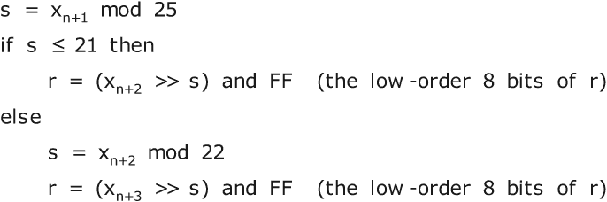
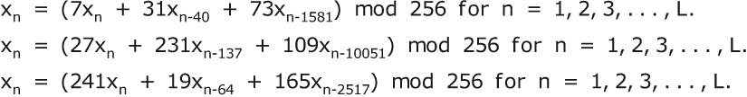

# 第十三章：流密码

本章涵盖

+   伪随机数生成器

+   用于将随机数与消息组合的函数

+   生成真随机数

+   散列函数

流密码与分组密码相反。流密码中的字符在遇到时被加密，通常一次一个。基本概念是将一系列消息字符与一系列密钥字符结合起来，以产生一系列密文字符。这种范式非常适合连续操作，其中消息在一端持续加密和传输，另一端持续接收和解密，没有暂停，或者只有短暂的暂停来更换密钥。

我们已经看到了一些流密码。第 5.9 节中的自动密钥和流动密钥密码，第 5.10 节中的转子机器，第 10.4 节中的哈夫曼替换，以及第 10.7 节中基于文本压缩的密码都是流密码的示例。

## 13.1 组合函数

最常见的流密码类型使用一个密钥单元加密一个明文单元。这些单元通常是字母或字节，但十六进制数字甚至比特也可以使用。密钥单元与明文单元结合使用基本上与第 11.8 节中的涟漪密码使用的组合函数相同，但使用密钥单元代替前一个单元。以下是类似的方法，其中 x[n] 是消息的第 n 个单元，k[n] 是密钥的第 n 个单元，A 和 B 是简单的替换，P 是通用多表替换。替换 A、B 和 P 应该使用密钥混合，而不是固定或内置的。

| **xor** | 异或 | x[n] 被 k[n]⊕x[n] 替换。 |
| --- | --- | --- |
| **sxor** | 替换并异或 | 有三种变体：x[n] 可以被 A(k[n])⊕x[n] 替换，或者 k[n]⊕B(x[n]) 或 A(k[n])⊕B(x[n])。也就是说，你可以替换 k[n] 或 x[n] 或两者都替换。（在已知明文的情况下，使用 A(k[n]) 而不是 k[n] 可以防止 Emily 恢复伪随机序列。） |
| **xors** | 异或并替换 | x[n] 被 A(k[n]⊕x[n]) 替换。 |
| **add** | 相加 | x[n] 被 k[n]+x[n] 替换。如常，加法是对字母表大小取模的。 |
| **madd** | 乘以并相加 | 也称为**线性替换**。x[n] 被 pk[n]+x[n] 替换，或者 k[n]+qx[n]，或者 pk[n]+qx[n]，其中 p 可以是任意整数，q 可以是任意奇整数。（如果你使用的字母表大小与 256 不同，q 必须与该大小互质。） |
| **sadd** | 替换并相加 | x[n] 被 A(k[n])+x[n] 替换，或者 k[n]+B(x[n]) 或 A(k[n])+B(x[n])。 |
| **adds** | 相加并替换 | x[n] 被 A(k[n]+x[n]) 替换。 |
| **poly** | 通用多表替换 | x[n] 被 P(k[n], x[n]) 替换。 |

由于**xor**或**sxor**可能会泄露关于其操作数的信息，我建议改用**xors**，这样在执行异或操作后进行简单替换以掩盖波形，即 A(k[n]⊕x[n])。

流密码也可以使用一个或多个先前的字符来加密当前字符。有许多组合方式。一个例子是 P(k[n]⊕x[n-i], x[n])，其中 i 是一个小整数。这种密码需要一个初始化向量来加密前 i 个字符。流密码也可以通过在几个组合函数之间切换来加强，例如周期性地在**sadd**的 3 种形式之间或**madd**之间进行切换，或者周期性地变化**madd**中的乘数 p 和 q。

## 13.2 随机数

前面表格中列出的流密码中使用的长密钥可以来自几个来源：

+   它们可能是一个数字列表，根据需要重复多次。这是从 16 世纪到 19 世纪的标准方法。

+   它们可能是通过数学过程生成的。这些数字称为*pseudorandom*，因为它们最终会重复，而不是真正的随机数，后者永远不会重复。生成这些数字的过程称为*pseudorandom number generator*（PRNG）。

+   它们可能是真正的随机数，可能是由一些物理过程生成的，例如来自爆炸星的伽马射线。这些过程通常对于密码学的需要来说太慢了，因此这些随机数通常会随着时间的推移而收集，并存储在计算机中以供以后使用。也就是说，它们可以连续收集，并且只在您需要发送消息时使用。

关于密码学的书籍和文章经常声称，你需要真正的随机数才能获得安全的密码。他们指出，已经数学证明了使用真正随机密钥的一次性密码本是不可破解的。这当然是正确的，前提是对于每个明文单元 p 和每个密文单元 c，都存在一个密钥单元 k 将 p 转换为 c，即 S(k, p) = c。真正的随机密钥足以使一次性密码本无法破解。然而，正如每个学过逻辑的人都知道的，条件可以是充分的，但不是必要的，反之亦然。

例如，要使一个整数成为质数，必须大于 1。这是必要的，但不充分，因为 4 是一个大于 1 的整数，但不是质数。要使一个整数成为合数，它必须是一个大于 1 的平方数。这是充分的，但不必要，因为 6 是合数，但不是平方数。

要求一次性密码本的密钥必须是真随机是过度的。为了使一次性密码本无法破解，密钥必须是*不可预测的*，也称为*密码学安全的*。使用真随机密钥，无论 Emily 知道多少个密钥单位，她都无法确定其他单位。使用不可预测的密钥，Emily 只需无法计算地确定其他单位。具体而言，Emily 需要做的工作量来确定另一个密钥单位必须大于 2^k，其中 k 是你选择的密钥大小（以比特为单位）。当密钥流仅为伪随机时，您无法再证明密码本是不可破解的，但这在实践中没有实际意义。

本章后面我将描述几种使伪随机数生成器具有密码学安全性的方案，并指出一个看起来安全但实际上是不安全的方案，即第 13.13 节中描述的 CG5。

之前列出的所有流密码都可以利用伪随机数生成器产生密钥流，因此让我们来看一些 PRNG 的变体，首先从上世纪 50 年代的一些经典方法开始。这些生成器使用一个小的初始值，称为*种子*或*初始状态*，以及一些简单的数学函数，从当前状态生成下一个状态，称为*状态向量*。常见的生成函数包括加法、乘法和异或。由于它们的速度快且易于实现，这些生成器今天仍然被广泛使用。

每个生成器都会产生一个整数序列，在依赖于种子的周期之后最终会重复。可能会有一个永远不会重复种子的重复数字序列，例如 1,2,3,4,5,4,5,4,5,4,5, ... ，但本书中的生成器都没有这种行为。周期受状态向量大小的限制。例如，一个状态向量为三个 31 位整数的生成器的周期不能超过 2⁹³。

## 13.3 乘法同余生成器

一个*乘法同余伪随机数生成器*使用两个参数，一个是乘数 m，一个是模数 p。从种子 s 开始，伪随机数序列 x[n] 通过递推生成。

换句话说，要获取下一个伪随机数，你需要将上一个数乘以 m，然后取模 p 的余数。种子可以是任何整数 1,2,3, ... ,p-1。模数 p 几乎总是选择为质数，因为质数产生最长的周期。选择 p 通常取决于您使用的计算机中寄存器的大小。对于 32 位寄存器，常见选择是素数 2³¹-1，即 2,147,483,647，这是由伯克利数论学家 Derrick H. Lehmer（不要与他的父亲伯克利数论学家 Derrick N. Lehmer 混淆）在 1949 年发布的这一类中的第一个 PRNG。

乘数 m 必须谨慎选择。乘法同余生成器的周期可以是任何均匀地整除 p-1 的整数。由于 p 是一个素数，且可能远大于 2，p-1 将是偶数，因此非常糟糕的选择 m，比如 p-1，可能会得到一个周期为 2 的结果。具有最长周期的乘数，即 p-1，称为 p 的 *原根*。这意味着 m、m²、m³、...、m^(p-1) 在模 p 下有不同的余数。对于乘法同余生成器，最好使 m 成为原根，以获得最长可能的周期。

幸运的是，这很容易做到。在范围为 2 到 p-2 的数中，平均约有不到 3/8 的数字是 p 的原根。这个确切的比率被称为 *阿丁常数*，以奥地利数学家埃米尔·阿丁（Emil Artin）的名字命名，他于 1937 年逃离纳粹德国，并在普林斯顿完成了他的职业生涯。它的值约为 .373956。如果您可以因式分解 p-1，那么很容易测试给定的乘数 m 是否是 p 的原根。我们知道 m 的周期必须整除 p-1，因此首先将 p-1 进行因式分解。假设 p-1 的不同素因子是 a、b、c 和 d。然后，您只需要测试 m^((p-1)/a) (mod p)，m^((p-1)/b) (mod p)，m^((p-1)/c) (mod p) 和 m^((p-1)/d) (mod p)。如果这些值中没有一个是 1，则 m 是一个原根。例如，如果 p = 13，则 p-1 的不同素因子为 2 和 3，因此您只需要测试指数 12/2 和 12/3，即 m⁶ 和 m⁴。例如，5 不是 13 的原根，因为 5⁴ = 625 ≡ 1 mod 13。

有有效的方法来通过连续的平方来计算 m^x。例如，要计算 m²¹，您可以连续计算 m²、m⁴、m⁸、m¹⁶、m²⁰、m²¹，只需进行 6 次乘法运算。您可以通过使用这些乘积来计算下一个幂值来获得进一步的效率。例如，如果要测试的下一个值是 m³⁷，您可以只使用 3 次乘法运算计算出 m³²、m³⁶、m³⁷。在每次乘法运算后计算模 p 的余数要比计算庞大的数 m²¹ 并在最后取余更有效。有更复杂的方案可以使用稍少的乘法运算，可能减少 10% 到 15%，但如果您只做几次，额外的努力是不值得的。

如果您使用的是乘法同余伪随机数生成器（PRNG），则重要的是要知道每个数字的大小显示出随机特性。要将生成器的输出 R 转换为范围在 0 到 N-1 的整数，正确的计算方式是⌊RN/p⌋，其中⌊x⌋表示“x 的地板”，意思是将 x 向下舍入到下一个较低的整数。例如，⌊27⌋是 27，⌊27.999⌋是 27。表达式⌊RN/p⌋略微偏向于较小的值，即，它会比较频繁地产生较小的数字。但是，当 p 远远大于 N，比如 p > 1000N 时，这对于加密目的并不重要。

历史旁注

顺便说一句，符号⌊x⌋和相应的⌈x⌉（读作“x 的 ceil”，意思是将 x 四舍五入到下一个更高的整数，因此⌈27.001⌉为 28）都是由肯尼斯·艾弗森（Kenneth Iverson）在 1962 年发明的，他是 APL 编程语言的创造者。APL 是第一种交互式编程语言。今天的计算机用户认为交互性理所当然。您按下一个键或点击鼠标，计算机就会执行某些操作。他们没有意识到这个概念必须被发明。在那之前，计算的标准模型是您通过卡片阅读器运行一叠卡片，计算机打印结果，几个小时后您得到一叠纸。

警告：不要使用(R mod N)作为您的随机数。R mod N 可能严重偏向低值。例如，如果模数 p = 11，N = 7，那么(R mod 7)的 11 个可能值为 0, 1, 2, 3, 4, 5, 6, 0, 1, 2, 3，因此 0, 1, 2 和 3 的生成频率是 4, 5 或 6 的两倍。

只要 m > √p，乘法同余生成器将具有良好的随机特性。最好是乘法逆 m' > √p。这意味着 m 的位数至少需要是 p 位数的一半。您希望 p 尽可能大，以便生成器具有长周期，同时希望 m 足够大，以便生成器是随机的。您可以走多远？m 和 p 的大小受计算机寄存器的大小限制。如果超过一个寄存器，速度将受到惩罚。

每个伪随机数 x[n]是通过将前一个数字 x[n-1]乘以 m 生成的。数字 x[n-1]可以有与 p 相同数量的位，因此如果 p 有 b 位，则 x[n-1]也可以有 b 位。由于 m 必须至少有 b/2 位，因此乘积 mx[n-1]可以有 3b/2 位。如果寄存器大小为 63 位，则 b 最多可以是 63 的 2/3，即 42，这意味着 m 最多可以有 21 位。最好使 m 大于√p。一个合理的折衷方案是 m 为 25 位，p 为 38 位。这样可以让周期长达 2³⁸。

使生成器不可预测所需的属性是生成的单位具有相等或均匀的频率，成对的单位具有相等的频率，三元组和四元组具有相等的频率，依此类推。实际上，您不需要超过八元组或最多十元组的字节。如果您想要绝对确定，可以将所需的密钥大小除以生成的单位的大小。例如，如果您的密钥大小为 128 位，PRNG 生成 4 位十六进制数字，则您可能需要使 n 元组在所有 n 值上的频率相等，直到 32。 （那些这样做的人显然是强迫症患者，应该寻求治疗。）即使对于 4 位随机数，也没有必要也没有用处超过 16 元组或最多 20 元组（sexdecuples 或 vigintuples），即 64 或 80 位。

Emily 需要超过 2⁶⁴或 2⁸⁰字节的已知明文才能利用这些不均匀的频率。即使 Sandra 从不更改她的密钥，Emily 也不可能积累那么多的材料。从长远来看，假设有一颗卫星以每秒 1 MB 的速率发送遥测数据。进一步假设，它同时使用两个不同的密钥流发送这些数据，而 Emily 拥有其中一个密钥。即使她以每秒 1 MB 的速度获取明文/密文对，她仍需要大约 585,000 年才能收集到 2⁶⁴字节。即使有 1000 颗卫星都使用相同的密钥，也需要 585 年。

如果对于每个 n 的所有值，n 元组的频率都相等，则您的生成器是真随机的。您已经找到了一种生成真随机数的数学算法。恭喜。去领取您的菲尔兹奖。

为了使元组频率在 n 元组中相等，通常需要生成器的种子本身至少是 n 元组。对于乘法同余生成器来说，单个单位和对频率是均匀的，但三元组频率从不均匀，而对于 n > 3 的 n 元组频率则远非均匀；其中大多数频率为 0。

如果你有几个已知明文字符，并且密码使得很容易从明文/密文对确定随机输出，即，如果组合函数是**xor**、**add**或**madd**，那么破解乘法同余密码就很简单。例如，如果密码通过对密钥字节和明文字节进行异或运算来获取密文字节，那么 Emily 所需要做的就是将明文字节与密文字节进行异或运算以获取密钥字节。

如果生成器有一个 31 位或 32 位的模，即使在个人电脑上，Emily 也可以尝试所有 2³¹或 2³²种种子的值。已知的明文字符仅用于验证。如果模数更大，例如 48 位或 64 位，则前 2 个或 4 个已知的明文字符用于限制搜索范围。第一个随机输出将当前生成器状态限制在一个窄范围内，即总范围的 1/256。第二个已知的明文字符给出第二个输出，将状态限制在该范围的 1/256，依此类推。

因此，单个乘法同余生成器在密码学上并不安全。可以使用更大的模数，使用卡拉兹巴或图姆-库克等大整数乘法技术，但这会牺牲这一类生成器的高速度。有更快的方法来生成密码安全的生成器，因此本书不会涉及大整数乘法方法。

## 13.4 线性同余生成器

*线性同余生成器*是对乘法同余生成器的扩展。它们在递推公式中添加一个线性常数项 c。从种子 s 开始，通过递推生成伪随机数序列 x[n] 的是公式是

换句话说，要获得下一个伪随机数，你将前一个数字乘以 m，加上 c，然后取该和对 P 的模。种子可以是任何整数 1、2、3、...、P-1。当满足以下三个条件时，生成器将具有最长可能的周期：

1.  c 与 P 互质，

1.  对于每个是 P 因子的素数 p，m 的形式为 pk+1，且

1.  如果 P 是 4 的倍数，则 m 的形式为 4k+1，

其中 k 可以是任意整数。这些被称为 T. E. Hull 和 A. R. Dobell 在 1962 年发表的*Hull-Dobell 条件*。

例如，假设 P = 30，即 2×3×5。那么 m-1 必须是 2、3 和 5 的倍数。换句话说，m 必须是 1。所以，如果 s = 1，c = 7，伪随机序列将是 1、8、15、22、29、...。这是一个等差数列，一点也不随机。因此，通常选择模数 P 为质数的幂，最常见的是 2。找到产生良好随机特性的 m、c 和 P 的值是困难的。

然而，线性同余生成器有一个很好的用途。如果你想产生一个具有极长周期的生成器，你可以将两个或多个模数为不同质数幂的线性同余生成器的输出相加，以获得具有良好随机特性和周期等于这些模数乘积的生成器。例如，假设你添加了以下三个 PRNG 的输出。我选择了 3 个模数尽可能大，但仍适合于 32 位机器字，我选择了乘数和常数以满足 Hull-Dobell 条件。除此之外，我任意选择了它们。

让 w[n] = (x[n]+y[n]+z[n]) mod 2³¹。通过将其右移 23 位来选择 w[n] 的高阶字节，即 v[n] = w[n]/2²³。只要 (1) 三个乘数中至少有一个，以及它的乘法逆元，大于其对应模数的平方根，且 (2) 其余两个乘数都不是 1 或 P-1，那么 v[n] 序列将具有良好的随机特性。v[n] 序列的周期为 2³¹3¹⁹5¹³ = 3.0468×10²⁷。

## 13.5 链式异或生成器

最简单的*链式异或生成器*操作的是一串比特，例如 10111。基本思想是将第一个比特与最后一个比特进行异或操作，删除第一个比特，并将新比特附加到字符串的末尾，即 x[i] = x[i-1]⊕x[i-n]。由于 n 位字符串有 2^n 种可能的值，而且由于全零字符串产生一系列全零，链式异或生成器的最长周期为 2^n-1。让我们用 3 位字符串的一个小例子来看一下。

经过 7 步后，初始字符串 001 重复，因此该生成器的周期为 7。这称为*完整周期*生成器。当 n 为 2、3、4、6、7、15 或 22 时，链式异或生成器具有完整周期。对于 n = 37，该生成器接近于完整周期的概率为 0.00057%。也就是说，99.99943% 的所有 37 位值形成一个大循环，而其余的属于较短的循环。对于某些目的，n = 37 可能是一个不错的选择。对于大多数 n 值，存在若干个重复的比特序列，有些短，有些长。它们的总长度为 2^n-1。只有对于完整周期生成器才能谈论*周期*。否则会有多个循环，可能长度不同。

假设你需要一个周期长于 2²² 的生成器，并且不愿意冒获得短周期的 0.00057% 的风险。你可以怎么做？一个选择是尝试其他生成函数。而不是使用 x[i] = x[i-1]⊕x[i-n] 的递归关系，尝试使用 x[i] = x[i-1]⊕x[i-j]⊕x[i-k]⊕x[i-n] 的递归关系，其中 j 和 k 的值使得 1 < j < k < n。这些生成器中很有可能有一些具有完整周期。但是请注意，具有 3 项的 x[i] = x[i-1]⊕x[i-j]⊕x[i-n] 的生成器永远不会产生完整周期。项数必须是偶数。

无论你选择哪个生成器，结果都是一系列比特序列。要得到伪随机的字节序列，将比特按照 8 位一组取出，即比特 1 到 8，比特 9 到 16，比特 17 到 24，依此类推。这需要为每个字节生成 8 位比特。有一种更快的方法。不是逐比特进行异或操作，而是一次异或一个字节。实际上，您是同时运行 8 个单比特生成器。这样，每次操作就可以获得一个完整的字节。如果你的编程语言支持，你可以使用完整的 32 位字，并每次获取 4 个字节。

在 13.1 节列出的任何组合函数都可以用于将伪随机流与明文组合成密码。如果 Sandra 选择**xor**、**add**或**madd**作为组合函数，那么密码将很容易让 Emily 解密，前提是她拥有足够的已知明文。她可以轻松确定与明文字符对应的随机输出。这使她可以重构密钥流的一部分。这一部分可以向前和向后延伸，仅通过进行异或操作就可以重构整个密钥流。

Sandra 可以使用一个技巧来迷惑 Emily。假设生成器产生一系列 32 位字，Sandra 将其分成四个单独的字节。Sandra 不一定总是从高阶位开始，而是每次可以从不同位置开始。等效地，Sandra 可以将 32 位字循环左移或右移，位移数量不同。例如，ABCDEF 循环左移 2 位得到 CDEFAB。位移的长度可以是在 0 到 31 范围内的重复数字序列。这样，Emily 无法将生成器的连续输出匹配起来以重构密钥流。

## 13.6 链式加法生成器

*链式加法生成器*，也称为*滞后斐波那契*生成器，类似于链式异或生成器，只是它们使用加法而不是异或。加法被理解为模 2^w，其中 w 是位大小，x[i] = (x[i-1]+x[i-n]) mod 2^w。w 的典型值为 15、31 和 63，使用有符号加法，或者 16、32 和 64，使用无符号加法。另一种看待 mod 2^w 运算的方式是忽略高阶位的进位。

因为加法会从一个位位置产生进位到下一个更高位位置，所以高位的周期是低位的两倍。每个字中低阶位的周期与具有相同种子的异或生成器的周期相同。这是因为加法与带进位的异或相同。如果链式加法生成器中低阶位的周期为 P，则高阶位的周期为 2^(w-1)P。

链式加法生成器是一种简单的方法，可以在很少的额外工作量下获得更长的周期。只需找到一个具有长周期的链式异或生成器，最好是完整周期，然后将其从单比特宽度扩展到完整字宽度。与乘法同余生成器一样，输出序列中最随机的部分是高阶端。对于伪随机字节序列，只使用每个字的高阶 8 位。

再次，您可以使用第 13.1 节中的任何组合函数将伪随机流与明文组合成密码。

## 13.7 移位和异或生成器

另一类 PRNG 是由佛罗里达州立大学的 George Marsaglia 发明的移位和异或生成器。Marsaglia 最著名的是开发了 Diehard 随机数测试套件。这些生成器使用两个作用于整数的运算符。

+   << *左移.* 例如，80<<2 将整数 80 左移 2 位，得到值 320。

+   >> *右移.* 例如，80>>2 将整数 80 右移 2 位，得到值 20。

被移出计算机字的高位或低位的位将会丢失。例如，25>>1 是 12，而不是 12.5。这些操作与循环左移 <<< 和右移 >>> 相对应，其中被移出计算机字一端的位将被放置在相反端。例如，如果 32 位计算机字中的十六进制数字为 12345678，则 12345678<<<4 得到 23456781，而 12345678>>>12 得到 67812345，因为每个十六进制数字有 4 位。如果字包含在较大的计算机寄存器中，则未使用的位需要清零。

在这个类中有几种不同的生成器。必须仔细选择位移的长度和方向，以使生成器具有长周期。以下是 Marsaglia 设计的两个 *Xorshift* 生成器的示例。它们具有长周期和强大的随机特性，尽管它们未通过一些更敏感的随机性测试。每个生成器使用左-右-左的模式中的 3 次位移和异或步骤来生成序列中的下一个数字。变量 y 用于保存中间值。任何正整数都是合格的种子。

## 13.8 FRand

FRand，即快速随机生成器，是我自己的创建。FRand 使用一个宽度为 W 的 S 个二进制字的数组，也就是说，它使用数组中每个字的低位 W 位来保存无符号整数值。周期取决于 S 和 W 的值。我发现 W = 29 效果最好，而且 S = 40 和 S = 64 给出了非常长的周期。种子数组可以看作是一个 40×29 位的矩阵。每一行是一个种子，每一列代表种子字中的一个位位置。

对于 S = 40，周期为 2¹¹⁶⁰-2⁴⁰，约为 1.566×10³⁴⁹，对于合格种子。如果至少有一个 40 个种子字中的一个既不全为零也不全为一，则该种子是 *合格* 的。该生成器有一个弱点。如果种子数组几乎完全为零，则生成器可能会产生数十甚至数百个连续的输出，其中大部分是零。在极端情况下，当种子数组包含 1159 个零和仅 1 个一时，至少需要 1120 个周期才能在每列中至少有一个 1。

最好是初始种子包含大量随机模式中的 1 和 0。获取适当的种子数组的一种方法是将表达为 UTF-8 代码的助记符或数字密钥，并将其哈希为一个 1160 位值。一个合适的哈希函数是

生成器一旦被初始化，伪随机序列就可以通过递推公式生成。此生成器的递推公式使用索引或标记符号 n。

每次通过种子数组时，当 n = 40 时，索引会重置为 1，并且下一个伪随机数将由 x[1] = (x[1]⊕x[40])>>>1 生成。也就是说，第一个 29 位字 x[1] 循环向右移动一个位位置。

这个伪随机序列通过了许多随机性测试，但远远达不到密码学安全的要求。为了产生一个安全的序列，诀窍是从 29 位字的不同部分获取每个连续的输出字节。伪随机序列本身可以用来选择这些位置。假设下一个 3 个伪随机输出分别是 a、b 和 c。取 s = a mod 25。如果 s 在 0 到 21 的范围内，则将 b 向右移动 s 个位置并取低 8 位。在这种情况下只生成 a 和 b。c 将为下一个伪随机数生成。如果 s > 21，则将 s 位置向右移动会留下少于 8 位。在这种情况下丢弃 a 并取 s = b mod 22。将 c 向右移动 s 个位置并将低 8 位作为随机输出。代数表示如下，

该过程平均使用 2.12 个伪随机输出来产生每个安全密钥字节。这样，密钥字节大约一半的时间来自偶数输出，另一半的时间来自奇数输出。生成器会以不规则的方式大约每 8 个周期在奇数和偶数之间来回切换。

## 13.9 梅森推土机

*梅森推土机* 是任何 PRNG 类别中周期最长的。它由广岛大学的松本真和西村拓士于 1997 年开发。它以法国神学家马林·梅森（Marin Mersenne，1588-1648）的名字命名，他以形式为 2^n-1 的素数而闻名，并因传播伽利略、笛卡尔、帕斯卡和费马等人的作品而广为人知。

*推土机* 具有良好的随机特性，尽管它在一些随机性测试中失败。它比本章描述的其他随机数生成器要慢得多。它的主要重要性在于其庞大的周期，即梅森素数 2¹⁹⁹³⁷-1，该数在 1971 年由 IBM 纽约州约克敦的 IBM 研究院的 Bryant Tuckerman 发现。IBM 研究院为此发现感到非常自豪，将“2¹⁹⁹³⁷-1 是质数”印在了其信笺和邮资表上。

与 FRand 一样，梅森推土机也存在一个缺点，即如果初始状态大部分为零，则可能需要许多周期才能变得看起来随机。对于梅森推土机，通常需要 10,000 或甚至 50,000 个启动周期才能开始使用输出。相比之下，FRand 软件包有一个函数，它可以在不需要任何启动周期的情况下初始化生成器。

## 13.10 线性反馈移位寄存器

*线性反馈移位寄存器*（LFSR）是电气工程师的宠儿，因为它在数字电路中实现起来非常简单。LFSR 使用一系列位 x[1]、x[2]、...、x[n]。下一个位通过对前面的几个位进行异或运算来生成，例如

使用 3 个反馈。当然，反馈的数量不一定是 3，但是奇数个反馈通常会比偶数个反馈给出更长的周期。

假设 i < j < k，则此 LFSR 将有 k+1 位位置。生成每个新位后，低阶位被移出，新位被放置在高阶位置，因此寄存器始终包含伪随机序列的最新的 k+1 位。

使用 LFSR 的一个明显缺点是它们速度较慢，因为它们需要 8 个周期才能生成每个伪随机输出字节。LFSR 也是伪随机生成函数中最弱的，因为它们完全是线性的。如果 Emily 有一些已知的明文，并且能够确定相应的关键位，则她可以通过解一组线性方程来重构整个伪随机序列，这很容易。如果 Sandra 使用**xor**、**add**或**madd**作为组合函数，Emily 可以确定关键位。

因此，伪随机输出通常在与明文结合之前通过非线性替换。这可以通过两种方式进行，按位或按字节。非线性按位替换是可能的，因为在每个周期中，寄存器中有 k+1 个位可访问。用作非线性函数输入的位称为*taps*，可以从寄存器的任何位置获取。使用这些非线性函数使得 Emily 更难确定关键位。

一个合适的非线性函数是*多数* *函数*。如果其输入位的大多数为 1，则此函数的值为 1，否则为 0。对于具有 3 个输入位 A、B 和 C 的情况，多数函数是 AB∨BC∨CA，其中 ∨ 是布尔 OR 函数。多数函数对于任何奇数个输入，如 3、5、7，等等，都是定义的。这个想法的一个扩展是使用 9 个 taps 和三个 3 位多数函数电路。9 位中的三个位进入每个电路。然后，将 3 个输出位通过第四个多数电路。

如果组合函数是**sxor**、**sadd**或**poly**，则字节替换是固有的。这些非线性替换的构造在第 12.3 节中详细讨论。可以将按位和按字节替换组合起来。生成输出字节中的每个 8 位都使用 taps 和非线性位函数，然后将这些电路的 8 个单个位输出馈入按字节替换中。

让我们看看 Emily 必须做些什么来破解一个 LFSR 密码。假设 Sandra 使用一个 40 位的硬件 LFSR， taps 位于位位置 3、6 和 9，进入到一个大多数功能电路 M 中，并且她天真地使用 **xor** 作为组合函数。进一步假设 Emily 有一些已知纯文本的字符，因此知道了一系列输出位。对于每个已知位，进入 M 的 3 个 LFSR taps 位置只缩小到了 8 个可能值中的 4 个。如果位是 0，则 3 个 taps 必须是 000、001、010 或 100。如果位是 1，则 3 个 taps 必须是 011、101、110 或 111。

经过 4 个周期，12 位已经进入了 3 个 taps，所以对于这 12 位有 4⁴ = 256 种可能的组合。这相比于 2¹² = 4096 种组合大大减少了。更好的是，从 Emily 的角度来看，最初位于位置 3 的位现在位于位置 6，而最初位于位置 6 的位现在已经移动到位置 9。这意味着一些 12 位组合可以被消除。可以消除的组合数量取决于输出位的序列。如果第一个和第四个输出位相同，则消除的组合较少。如果它们不同，则消除的组合较多。每个额外的已知输出位进一步减少了移位寄存器中可能组合的数量。

举个例子。假设 Sandra 使用一个 40 位的 LFSR，带有 3 个 taps，每个 taps 都进入到大多数功能中以产生每个输出位。还假设 Emily 知道设备的所有细节，并知道消息来自总部，所有消息都以 *GHQ* 开头。这给了她 24 位已知纯文本。如果她将这 24 位与密文的对应位进行异或运算，她就从设备中得到了 24 个输出位。对于这些输出位中的每一个，都有 4 种可能的 3 位输入组合来产生已知值。这就在 3 个 tap 位置产生了 72 位可能的位值。由于 LFSR 中的位每个周期向前移动一个位置，这些位组合会重叠，因此总的组合数量可以不断减少。

Sandra 应该从这个简要分析中学到什么？(1) 扩大移位寄存器，最好至少为 128 位。(2) 将 taps（触发器）远离得越远越好。(3) 不要均匀地分布 taps。在这里，3、6、9 是一个异常糟糕的选择。(4) 使用一种让对手难以确定关键位的组合函数。不要使用 **xor**、**add** 或 **madd** 作为组合函数。更好的选择是 **xors** 和 **adds**，但最佳选择是 **poly**。

## 13.11 估计周期

如果你是一个密码学爱好者，你可能想要尝试设计自己的伪随机生成器。本书不会涵盖如何测试 PRNG，这是一个很大的主题，但让我们看看你如何估计你的生成器的周期。该方法取决于状态向量的大小（第 13.2 节）。

如果状态向量很小，比如 31 位，您可以只运行您的生成器 2³¹个周期，看看何时重复。不幸的是，初始种子可能永远不会重复。有一个处理这种可能性的技巧。制作 2 个 PRNG 的副本，并使用相同的种子 S 进行初始化。然后逐步运行第一个副本，每次运行第二个副本 2 步。假设您发现在 3000 个周期后，这 2 个副本产生相同的状态向量。这意味着 R[3000] = R[6000]，因此您的生成器的周期至少为 3000，使用种子 S。

如果状态向量较大，比如 64 位，那么运行您的生成器潜在地 2⁶⁴个周期是不可行的。您仍然可以通过抽样来估计周期。制作一个表，比如 T = 1,000,000 个条目。这个表中的第 N 个条目将保存您的生成器产生值 N 时的周期数。最初，将这个表中的所有条目都设置为零，因为尚未产生任何值。选择范围在 1 到 T-1 之间的种子，并运行您的生成器，也许是 G = 1,000,000,000 个周期。在每个周期，如果生成的值 N 小于 T，则记录表中的周期号 N。如果条目不为零，则表示有重复项，这告诉您周期。例如，如果值 12795 在第 33000 个周期和第 73500 个周期再次产生，则该种子的生成器周期为 73500-33000 = 40500。

如果您找不到任何重复项，那么您可以通过查看生成了多少个 T 值来估计周期。如果表中的 E 个条目不为零，则生成的条目比例为 E/T。由于您运行了 G 个周期的生成器，估计周期为 G/(E/T) = GT/E。

正如我们在链式数字生成器（第 4.5.1 节）中看到的，一个生成器可能有几个不同的循环，有些长，有些短。您应该对生成器的周期进行多次估计，使用不同的种子。一个好的策略是首先使用种子 1。对于第二个种子，使用第一个种子未生成的最低值。对于第三个种子，使用第一个或第二个种子未生成的最低值。您可以通过制作累积表来做到这一点。在估计运行之间不要将其重置为零。如果在大约 20 到 100 次这样的运行中周期的估计是一致的，那么您可以确信您的生成器对大多数种子具有长周期。

## 13.12 加强生成器

加强 PRNG 的一种方法是使用一个*选择生成器*，将生成数字的操作与选择数字的操作分开。 这可以通过在数组中保留 N 个数字来完成，比如 32、64 或 256 个数字。 数组中的每个数字应该是所需随机输出的大小。 例如，如果要生成随机字节，则数组应包含 8 位数字。 首先对 PRNG 运行 N 个周期以产生初始数字，这些数字按生成顺序放入数组中。 然后使用新种子重新启动 PRNG。 然后使用生成器生成范围为 1 到 N 的伪随机数序列。 每个数字用于选择数组的一个元素。 该元素成为下一个伪随机输出。 然后使用 PRNG 用新的伪随机数替换所选数组元素。

这意味着第一个、第三个、第五个，... 随机数用于选择，而第二个、第四个、第六个，... 数字用于替换数组中的数字。 使用两个具有不同种子的 PRNG 的两个独立副本可能很方便，但这不会增加周期。 更好的策略是使用两个周期互质的不同生成器。 然后，组合生成器的周期是它们周期的乘积。 例如，如果数字是由具有周期 2³¹-1 的乘法同余生成器生成的，而数字是由具有周期 2³¹的线性同余生成器选择的，那么组合生成器的周期是 2⁶²-2³¹，或 4.612×10¹⁸。

4.612×10¹⁸的周期对于密码工作已经足够长，但选择生成器仍然不具有密码学安全性。 这是因为艾米莉可以穷举选择器序列并尝试所有 2³¹种可能的种子。 有足够的已知明文，这可能会给她第一个生成器的输出序列，这足以解决问题。

有几种可能的解决方法。 (1) 使用像**xors**、**adds**或**poly**这样的组合函数，这样艾米莉就很难确定随机输出。 (2) 使选择器生成器更大，比如说 63 位而不是 31 位。 (3) 使选择器生成器的种子更大，例如通过使乘数和/或加法常数成为种子的一部分，即生成函数 x[n+1] = (mx[n]+c) mod P 中的 m 和 c。 (4) 使用下一节中的技术来构建一个具有更长周期的选择器。

## 13.13 组合生成器

伪随机数生成器可以以各种方式组合，以获得更长的周期或更好的随机性属性，或者变得具有密码学安全性。 这些改进通常是相辅相成的。 你不会为了实现另一个而牺牲一个。 如果增加周期，通常会同时改善随机性。 有两类组合生成器，固定组合和可变组合。

固定组合

在固定组合中，有几个 PRNG，最好是周期互质的。这些可以是乘法同余、线性同余或 Xorshift 生成器。这些生成器的输出可以按位或按字节组合。一种按位的方法是从每个生成器中取一组固定的位，并将它们输入到某个组合函数中。例如，可以从 8 个生成器中分别取高阶位，或者从 4 个生成器中分别取两个高阶位。然后，这 8 位将被输入到一个高度非线性的替换中。替换步骤防止 Emily 将每个生成器的输出分离并单独解决它们。

一种按字节的方法是从每个生成器中取高阶字节，并通过对它们进行模 256 相加或者异或来组合它们。两个生成器可以通过将它们的输出相乘并取乘积的中间 8 位来组合。另一种技术是取线性组合，例如 (a[1]x[1]+a[2]x[2]+a[3]x[3]+a[4]x[4]) mod 256，其中 x[1]、x[2]、x[3] 和 x[4] 是来自四个 PRNG 的 8 位输出，并且四个系数 a[1]、a[2]、a[3] 和 a[4] 可以是 1 到 255 之间的任意奇数整数。这些系数可以针对每条消息不同。

例如，四个 PRNG 可以使用素数模 2³¹-1 和 4 个不同但固定的乘数来生成。这四个 31 位种子加上四个 7 位系数组成了 152 位的组合种子。

三个 PRNG 可以通过使用循环移位操作（第 13.7 节）来组合。使用 32 位无符号生成器时，32 位输出可以使用 x[1] + (x[2] >>>11) + (x[3] >>>21) mod 2³² 来组合。最佳移位量是 32 位寄存器大小的 1/3 和 2/3。如果你希望使用超过 3 个生成器，请尽可能使移位量均匀。例如，使用 5 个生成器时，移位量应该是字长的 1/5、2/5、3/5 和 4/5，四舍五入到最接近的整数。

另一个固定生成器 *CyGen*，通过循环移位来组合两个生成器 C 和 G。C 可以是任何大小，但 G 应该是 32 位或 64 位。在每个周期中，分别从 C 中取 5 或 6 位，以获取移位量。然后，从 G 中取得的输出将向左循环移动该数量的位置，以获得 CyGen 的输出。这使得 Emily 无法从其输出序列重构 G。

没有限制线性组合。例如，可以使用 x[n]+y[n]z[n] 或 x[n]+y[n]²+z[n]z[n-1]z[n-3] 将 3 个生成器组合起来。至少求和中的一项应该是线性的。可能性是无限的，当然，你可以在多种方法之间进行切换。

可变组合

可变组合的一个示例是第 13.11 节中显示的选择生成器。但是，让我用一个警示故事开始这一节。这里有一个组合生成器 *CG5*，似乎是绝对安全的，但实际上不是。

组合生成器 CG5 使用 5 个乘法同余生成器，每个都有不同的乘数和不同的 31 位素数模数。将这些生成器称为 G0、G1、G2、G3 和 SEL。（或者，SEL 可以是一个线性同余或 Xorshift 生成器，具有 2³¹周期。）生产生成器 G0 到 G3 用于产生伪随机数，选择生成器 SEL 用于选择 G0-G3 中的哪一个用于产生下一个伪随机输出。具体来说，SEL 的高 2 位确定了在 G0-G3 中选择哪一个。假设 SEL 生成了 10，这选择了 G2。然后 G2 生成器运行 1 个周期，其输出成为 CG5 的下一个输出。组合生成器的周期约为 2¹⁵⁵，具有良好的随机特性...但不会是密码学安全的。原因如下：

假设艾米莉有足够的已知明文，并考虑从 CG5 中得到的前 17 个输出。这 17 个输出中至少有 5 个必须由同一个生成器产生。（如果 4 个生成器最多产生 4 个输出，那么最多只能有 16 个输出，而不是 17 个。）从 17 个中选择 5 个项目的方式只有 6188 种。艾米莉可以尝试所有这些方式。这样一来，就有大约 1.33×10¹³种放置加种子的组合需要测试，然而，这可以大大减少。艾米莉知道这 5 个选择输出的每个的高 8 位。她不应该从 17 个输出的第一个开始，而应该从 5 个选择输出的第一个开始。然后，她只需要尝试 2²³个值，而不是 2³¹个值。这样一来，她的工作量就减少到了可管理的 5.19×10¹⁰个组合。CG5 组合生成器并不安全。

让我们看一个更安全的生成器。我将其称为*Gen5*。再次，组合生成器使用 5 个乘法同余生成器，每个都有不同的乘数和不同的 31 位素数模数。模数和乘数是固定的，并且选择得具有良好的随机特性。这次让我们称这些生成器为 G1、G2、G4、G8 和 SEL。只使用选择器 SEL 的 4 个高阶位。在这个 4 位数中，第一个位上的 1 表示选择 G1，第二个位上的 1 表示选择 G2，第三个位上的 1 表示选择 G4，第四个位上的 1 表示选择 G8。当选择少于两个生成器时，SEL 将再运行一个周期以生成新的选择。只使用 SEL 生成的 16 个可能的 4 位输出值中的 11 个，因此 SEL 将额外运行一个周期的时间为 5/16，额外运行两个周期的时间为 25/256，依此类推。

当选择两个或更多发生器时，它们每个都会运行 1 个周期，它们的输出将模 2³¹ 加在一起，以产生 Gen5 伪随机输出。未选择的发生器不会运行，因此 4 个发生器会异步运行。该输出略微偏向较低的数字，但对 Emily 来说并不足以利用。如果您担心这种偏差，可以（1）丢弃高阶位并使用和为输出字节的高阶位 2 到 9，或者（2）使用 Meld8 操作（第 12.3.7 节）。也就是说，通过将和的高阶 8 位与和的第二个 8 位进行异或运算来从 Gen5 发生器形成输出字节，即将位 1 到 8 的异或位与位 9 到 16 的位进行异或。

*****Emily 再也无法分离出任何一个发生器。Emily 可能看起来可以分离出其中的 6 对 Gi+Gj 中的一个，其中 i 和 j 可以是 1、2、4 或 8。这样的一对可以被视为单个发生器处理，然后稍后可以将 Gi 与 Gj 分离出来。让我们首先看看这种方法。为了求解 Gi 和 Gj 的种子，至少需要来自 Gen5 的 9 个随机输出。由于这些配对每次只发生 1/11 的概率，Emily 可能需要查看 89 个或更多的消息字符。这是因为，仅仅由于偶然，3 个或 4 个发生器的 5 个组合可能比 2 个发生器的 6 个组合更频繁地发生。

对于 89 个物品中的 9 个物品，大约有 6.356×10¹¹ 种可能的放置方式，因此 Emily 只需尝试 SEL 发生器的所有约 2³¹ = 2.147×10⁹ 个种子，这样 Emily 就可以找到所有 6 对 Gi+Gj 的下一个 10 个位置。这也让她可以计算出 Gi 和 Gj 在每次出现时已经被使用了多少次。例如，假设 G2+G4 出现在 Gen5 的第 14 个周期。在这 14 个周期中，可能有 6 个周期中使用了 G2，而 9 个周期中使用了 G4。现在 Emily 知道了 G2 的第 6 个输出加上 G4 的第 9 个输出的值。

如果 Emily 可以为 G2+G4 这样的 10 个输出值组合起来，那么她可以在大约 2^(31+31-8) = 2⁵⁴ = 1.801×10¹⁶ 次试验中确定这两个发生器的种子。这必须对 SEL 的约 2³¹ 个种子进行操作，因此总工作量约为 2⁸⁵ = 3.869×10²⁵。这相比于 Gen5 的暴力解决方案需要 2¹⁵⁵ 次试验有了巨大的改进，但远远不及 2¹²⁸ 次试验的目标。此发生器被评为 Nine.******

现在我们已经准备好进行致命一击了。这是 Gen5 的升级版本，我将其称为 *GenX*。GenX 由伪随机数生成器和密码两部分组成。GenX PRNG 将生成一个 10 位伪随机输出序列，密码将把密钥字节 k[n] 与消息字节 x[n] 结合起来产生密文。这将使密码超出 128 位密钥大小。

GenX 生成器只是 Gen5 生成器的扩展版本。它使用四个生产生成器 G1、G2、G4 和 G8，以及一个选择生成器 SEL。SEL 的高阶 4 位用于选择 2 到 4 个生产生成器的某种组合。所选的生产生成器运行一个周期，它们的输出相加模 2³¹ 以产生一个和 G。G 的高阶 10 位与下一个 10 位的 G 进行异或运算以产生 10 位输出。10 位输出被分为一个 8 位密钥字节 k[n] 和一个 2 位控制位 c[n]。

GenX 密码器将密钥字节 k[n] 与消息字节 x[n] 根据控制位 c[n] 使用混合的键控替换 S 进行组合。控制位 c[n] 决定了每个明文字节使用哪种组合函数。解释这 2 个控制位的一种可能方式是

所有的和都是模 256。Cipher GenX 被评为十。该密码的密钥是用于 G1、G2、G4、G8 和 SEL 的五个 31 位种子以及用于混合替换 S 的密钥，例如 SkipMix 密钥。

## 13.14 真随机数

所有在本章讨论过的生成随机数的技术都产生伪随机数。我看过的每一本讨论随机数的书都重复着这样的观念，即使用软件产生真正的随机数是不可能的。这是因为他们将自己限制在了一种太狭窄的可能方法范围内。在本节中，我将介绍一种使用软件批量生成真正随机数的可行方法。

文献中所有用于生成真正随机数的方法都依赖于诸如宇宙射线、热噪声、振动、核衰变等物理现象。这些方法对于加密目的来说太慢了。

相反，你可以通过一个 3 步过程产生真正的随机数。 (1) 从自然界中获取大量真正的随机数。 (2) 使它们的概率分布均匀。 (3) 通过从这个语料库中选择和组合数字来生成随机数。接下来的几节将详细介绍如何完成这些步骤。

自然界充满了随机性。地球上每一棵植物和树上每片叶子的形状、颜色和位置都是随机的。它们是风和微风、阳光透过叶片、从根部流上的养分、打在叶片上的雨滴和冰雹、咬过叶片的昆虫、鸟类、松鼠、地面震动以及许多其他因素的结果。每一个海洋上的波浪、每一个沙漠中的植物和岩石、每一条河流上的涟漪、每朵云、每一个海滩上的贝壳在大小、形状、颜色、位置、方向甚至速度上都是随机的。

这些随机性的一部分可以通过简单地拍摄这些地点来捕捉。你甚至不需要离开家。只需拿一把爆米花撒在有图案的表面上。你还可以使用你认识的人和你去过的地方的照片。有些照片是你从网站和电子邮件中下载的。还有成千上万张照片被操作系统和你使用的应用程序放在了你的计算机上。你可以使用网络浏览器找到数十亿张照片。作为一个实验，我编造了一个伪单词 ZRMWKNV，并搜索了图片。我得到了超过 6,000 个与 ZRMWKNV 相关的搜索结果，其中一些网站包含了数百张图片。

### 滞后线性加法

每个这样的图像文件包含大量的随机性，特别是如果分辨率很高，但字节值的分布远非均匀，也远非独立。通过使用*滞后线性加法*，将整个图像文件，包括头部在内，视为长度为 L 的一个长字节字符串，可以使分布变得平坦。以下是一个示例：

下标总是循环的。如所示，三次传递足够了，但随时可以使用更多。你不希望频率太均匀，因为那将不再是随机的。如果你想使用简化版本，比如 x[n] = (x[n]+x[n-179]) mod 256，请注意需要五次传递。确保在每次传递中使用不同的滞后。

这些系数 7、31 等并没有什么特别之处，我是随意选择的。它们可以是从 1 到 255 的任意奇整数。对于每次传递，滞后 40、1581 等应该被选择得一个远大于另一个。小步长，大步长。一个想法是使较小的滞后约为∛*L*，而较大的滞后约为∛*L*²。例如，如果图像文件大小为 1,000,000 字节，你可以分别使滞后约为 100 和约为 10,000。较小的滞后可以在 50 和 200 之间选择，而较大的滞后可以在 5000 和 20,000 之间选择。在滞后线性加法之后使用一个带有密钥的简单替换，使得艾米莉更难重建图像文件。

### 图像分层

另一种构建真随机序列的方法是取两个图像，使用某种组合函数（如**异或**或**加法**，参见第 13.1 节）将它们层叠在一起。一个好的方法是在组合之前对每个图像进行一次滞后线性加法传递，然后在它们被组合后进行最后一次传递。

三个图像可以使用非线性大多数函数（第 13.10 节）逐位进行组合。同样，在组合之前，我建议对每个图像进行一次滞后线性加法的传递，然后在它们被组合之后进行最后一次传递。即使三个图像中没有一个大小相同，也可以使用这种方法。将一个短图像对齐到与最大图像相同的位置，并将另一个短图像对齐到与最长图像相同的位置，就像这样：

当只有两幅图像重叠时，按字节模 256 进行相加。当所有三幅图像重叠时，使用大多数函数逐位进行组合，或者使用模 256 的线性组合，如 c[n]=(113x[n]+57y[n]+225z[n]) mod 256。系数可以是从 1 到 255 的任意奇整数。

对齐图像的另一种替代方法是通过重复来扩展短图像。在这个例子中，x 图像有 22 个字节，y 图像有 33 个字节。通过重复 x 的前 11 个字节，可以将 x 图像扩展到 33 个字节。这样，大多数函数可以在所有 33 个字节位置使用。实际上，这些图像将有数百万个字节。

## 13.15 刷新随机字节

很好。现在我们有一个名为 T 的表，里面有几百万个真随机字节。它们是真正的随机字节，因为如果艾米丽拥有除了一个字节之外的所有字节，这并不会使她能够确定缺失的那一个字节。桑德拉和莉娃都有一份拷贝。那么呢？我们肯定不能每次发送消息都重复这个过程。

利用 T 的一种方法是将其划分为用于分组密码的密钥。一百万个随机字节可以制作出 62,500 个每个 128 位的密钥。最终这一百万字节将被用完。如果桑德拉正在使用一个强大的分组密码，或许这并不重要。她可以重复使用密钥，只要艾米丽无法知道哪些消息使用了相同的密钥进行了加密。当然，桑德拉不能对流密码重复使用密钥。

假设桑德拉不愿意冒再次使用密钥的风险。一个解决方案是刷新随机数列表。桑德拉可以添加另一幅图像，但这意味着莉娃也必须有同样的图像的拷贝。如果图像来自桑德拉和莉娃都可以访问的网站，那么这可能是一个不错的策略。如果传输的密钥可能被截获，这可能是一个很好的策略。

另一种方法是使用滞后线性加法（第 13.14.1 节）刷新 T。称刷新后的表为 T[1]。现在桑德拉只需要传输 9 个系数和 6 个滞后，她就有另外 62500 个密钥可用。假设每个系数需要 1 字节，每个滞后需要 2 字节，桑德拉只需传输 21 字节即可生成 T[1]。然后为了选择消息的密钥，只需要知道该消息密钥在 T[1]中的位置。对此，两个字节足够了，因为所有位置都是 16 的倍数。当 T[1]用尽时，可以使用新的系数和滞后来构造 T[2]等等。

在第 13.5 节和 13.6 节中，线性函数用于确保生成器具有长周期。这里没有周期，因此没有这样的约束。可以使用一些非线性函数，例如

这里下标循环，a 和 b 是从 1 到 255 的奇整数，i、j 和 k 是介于 1 和 L-1 之间的整数。S 可以是一个固定的非线性替换或者一个变量密钥混合替换。函数 E(x)定义为

当你取 E(x[n-j]x[n-k]) mod 256 时，实际上是将 x[n-j]x[n-k]的各个字节相加。这比仅仅使用 x[n-j]x[n-k]更强，因为 x[n-j]x[n-k]有 3/4 的概率是偶数。

或者，桑德拉可以通过按 1 字节、跳过 3 字节、取下一个字节、跳过 2 字节、取 2 字节、跳过 4 字节等一些周期序列中的步骤，从 T 获得密钥。跳过可以很小，因此 2 或 3 个跳过可以编码在一个密钥字节中。可能如果艾米莉获得了随机源 T，她可以确定小跳过的序列。为防止这种情况，跳过可以与在选定字节上添加一系列数字相结合，对 256 取模，同样周期性。如果跳过的数量和添加的数量是互质的，比如 12 个跳过和 11 个添加，那么是最安全的。使用这种方法，每个消息密钥将使用 2 字节作为起点，6 字节来编码 12 个跳过，再加上 11 个添加，总共 20 字节，或者 160 位。这种方法可以称为*跳跃与添加*。

在这种类型的系统中，Emily 无法重建 T 是至关重要的。例如，Emily 可能随着时间的推移获得了许多消息的明文并恢复了它们的密钥。如果她还知道这些密钥在 T 中的位置，也许是因为桑德拉在每条消息中将位置传输给了 Riva，那么她可能能够重建 T 的部分。因此，T 本身不应该用于密钥。应该保留 T 以构建 T[1]、T[2]，...，然后可以将其划分为消息密钥。保留 T 可以保护桑德拉和 Riva，以防 T[i]中的任何一个丢失或损坏。T 可以称为*基础*密钥，T[1]、T[2]，...可以称为*派生*密钥。

即使 Emily 可以以某种方式重建 T[1] 或 T[2]，她也无法倒退恢复 T，因为 T 是真正的随机。如果 Emily 尝试所有可能的系数和滞后组合，没有任何东西能表明哪个是正确的随机字符串 T，因为有数以万计的字符串。

## 13.16 同步密钥流

在秘钥密码学中，Sandra 和 Riva 必须使用相同的密钥。通常这意味着要么（1）密钥被加密并与消息一起传输，要么（2）他们有一个密钥列表，并根据日期、时间或其他外部因素从列表中选择每个密钥。还有一种方法是流密码独有的。

Sandra 和 Riva 可以使用同步密钥流。这意味着 Sandra 和 Riva 都持续生成相同的密钥流。当 Sandra 加密一条消息时，她从她的密钥流中的下一个密钥字节开始，这也必须是 Riva 的密钥流中的下一个密钥字节。当 Riva 收到消息时，她必须从密钥流中的相同点开始。Sandra 和 Riva 必须在完全相同的时间从相同的初始种子开始生成。当 Sandra 和 Riva 之间有直接电缆连接，或者有视线塔到塔的连接，或者两者都从同一发射机接收过空中广播时，同步方法最为有用。它非常适合在狭小空间内传输数字化语音。

如果消息是通过具有节点或中继点有显著延迟的网络发送的，特别是分组交换网络，其中消息的部分可能通过不同路径到达并必须在接收端重新组装，发送方必须在传输开始时提供时间戳，比如在消息头中。

由于 Sandra 加密消息需要时间，消息从 Sandra 到 Riva 的传输也需要时间，似乎 Riva 必须比 Sandra 慢几微秒生成随机密钥。同样，当 Riva 发送消息给 Sandra 时，Sandra 也必须比 Riva 慢几微秒生成密钥。

有几种方法可以摆脱这一僵局。一种方法是让 Sandra 只在伪随机流中的特定周期开始消息。例如，Sandra 可能只在每 100,000 个周期开始一条消息。然后当 Riva 在第 123,456,789,123 个周期收到一条消息时，她知道密钥从第 123,456,700,000 个周期开始。如果消息接收时间更接近 100,000 的整数倍，比如第 123,456,701,234 个周期，Riva 可以尝试 123,456,700,000 和 123,456,600,000。Riva 需要存储最后两组 100,000 个伪随机数。100,000 个周期的数字可以根据 PRNG 的速度和两方之间的传输时间调整。

还有一个问题需要解决，即 Riva 如何检测到每个加密消息的起始和结束。如果通信通道有一个空闲状态，在该状态下既不传输零也不传输一，则没有问题。让通道在消息之间保持空闲。否则，让我们假设通道在空闲时发出一串稳定的零。在这种情况下，您需要在消息前后添加额外的 1 位，就像用引号括起消息一样，并要求在下一条消息开始之前必须传输至少 64 个零。在合法消息中发生 64 个零的几率微乎其微。 （此外，请注意，消息之间的平均时间实际上将超过 50,000 个周期；64 个周期只是最坏情况。）因此，当 Riva 检测到至少 64 个零后的 1 位时，她可以确信这是下一条消息的开始，当她发现 1 位后跟着 64 个或更多的零时，那标志着消息的结束。

## 13.17 哈希函数

哈希函数不是密码，但与密码密切相关，通常与密码学一起使用。在本节中，我将讨论哈希函数的两个用途，并为每个用途提供一个适用的哈希函数。

哈希函数经常用于搜索。假设您有一个人员列表，如客户、患者或学生，并且您经常需要搜索此列表以获取有关这些人的信息。哈希提供了一种快速搜索的方式，即通过将人的姓名转换为可以直接在表中找到的数字。例如，名称“John Smith”可以转换为数字 2307，其中表中的条目 2307 包含有关 John Smith 的信息。

这里有一个专为此目的设计的哈希。对于字母表中的每个字母 L，随机选择某个固定大小（例如 32 位）的二进制值 R(L)。要对名称进行哈希，只需对名称中每个字母的 32 位数字执行异或操作。该哈希的一个弱点是具有相同字母的名称将具有相同的哈希值。例如，ARNOLD、ROLAND 和 RONALD 的哈希值都相同。为了避免这个问题，在添加每个字母后，将哈希值向左循环移动 1 位位置。也就是说，

将最终的哈希值称为 H。H 可以通过缩放转换为大小为 T 的名称表的索引 I，公式为 I = ⌊HT/2³²⌋。例如，如果名称的哈希值为 917354668，表中有 5000 个条目，则索引为 ⌊917354668×5000/4294967296⌋ = ⌊1067.94⌋ = 1067。我们称这种哈希方法为 *Hash32*。

可能会有几个名称产生相同的索引。有各种方法用于处理这些索引冲突，例如使用一个单独的表来保存重复项，第二次对名称进行哈希以在表中选择不同的插槽，或将重复名称链接在一起。

哈希函数也用于消息认证。在这种情况下，整个消息被哈希为一个长的哈希值。假设是 16 个字节。这个哈希值必须以防篡改的方式发送给 Riva，例如通过一个可信赖的第三方，该第三方记录并加上时间戳的哈希值。然后 Riva 将对消息进行哈希处理并比较哈希值。如果它们不同，那么消息可能已被更改。用于此目的的哈希函数必须使得 Emily 无法修改消息而不改变哈希值成为不可行。也就是说，Emily 无法找到一个产生相同哈希值的不同消息。同样，Sandra 无法更改消息并声称她发送了更改后的消息，因为哈希值将不再匹配。

对于这个哈希函数，我们将使用 4 个高度非线性的替换，分别为 A、B、C 和 D。这些可能是公开已知的固定替换。值得花一些精力使这四个替换高度非线性且彼此之间的相关性最小化。基本操作是使用**异或**的组合函数将消息的每个字节与前 4 个字节进行组合，即执行异或操作，然后对结果进行简单的替换。让 H 是消息 M 的一个副本，以便消息在哈希处理过程中不被破坏。副本中的每个字符 H[n]都经过以下哈希处理：

这样，哈希的每个字节都依赖于前面的每个字节，并且每个后续的字节都依赖于它。

哈希需要一个初始化向量（第 11.10 节）以便对消息的前 16 个字节进行哈希处理。可以使用消息的前 16 个字节的副本。也就是说，最初字节 H[-15]到 H[0]与字节 H[1]到 H[16]相同，这些字节是消息的字节 M[1]到 M[16]相同。有了初始化向量，就可以将哈希从 H[1]传播到 H[L]，其中 L 是消息的长度。

这使得最后几个字节的哈希相对较弱。Emily 可能很容易改变消息的最后几个字节。解决方法是在消息结束后继续哈希处理。为此，当我们对消息的前 16 个字节进行哈希处理时，我们保存这些哈希值以供以后使用。当我们到达消息的末尾时，我们附加这 16 个字节并继续哈希直到扩展消息的末尾。这最后的 16 个字节成为消息的哈希值。将此哈希方法称为*Hash128*。

对于某些机器，使用机器的 32 位算术函数，每次对消息进行 4 字节的哈希可能更快。消息和哈希值被视为 L 个 32 位字的列表，而不是 4L 字节。哈希数组 H 最初是消息的一个副本。如果消息长度不是 4 字节的偶数倍，则会附加多达 3 个字节以填充最后一个字。H 的前两个字的副本被附加到前面，即 H[-1] = H[1] 和 H[0] = H[2]。在对消息的前 4 个字进行哈希后，这 4 个字将附加到消息的末尾。

这种哈希，称为 *HashPQ*，使用两个素数 P = 2³²-5 = 4294967291 和 Q = 2³²-17 = 4294967279，以及魔法乘数 R = 77788888，它是 P 和 Q 的一个原根。哈希操作为

如果总和超过 2³²-1，则通过简单地忽略额外的高位比特来将值截断为 32 位。也就是说，我们可以自由得到模 2³² 运算。H 数组的最后 4 个字是 16 字节哈希值。与 Hash128 相比，HashPQ 使用的存储空间更少，因为它不需要 4 个简单的替换。

Hash32、Hash128 和 HashPQ 都具有良好哈希函数所需的理想属性，即对输入的任何位或位的组合进行更改会导致输出中大约一半的位发生更改。这三种哈希都很快，并且可以在单个从左到右的传递中完成。
