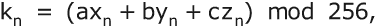

# 第十四章：一次性密码

本章涵盖

+   一次性密码密码

+   伪一次性密码，它近似于一次性密码

+   Diffie-Hellman 密钥交换

+   构建 Diffie-Hellman 和公钥密码所需的大素数

最著名的流密码是*一次性密码*。许多作家将这个术语限制为仅指明文和密钥流逐字节进行异或的密码。这在历史上是不准确的。第一个一次性密码密码是由加利福尼亚州萨克拉门托的银行家弗兰克·米勒于 1882 年发表的，目的是通过缩短电报消息来节省费用。米勒的电报代码使用 5 位数字代码组来表示商业电报中常见的单词和短语。为了保密，米勒提出了一个密码，其中包括将 3 位数字添加到每个 5 位数字组中。他的代码值足够小，以至于总和永远不会超过 99999。也就是说，代码都小于 99000。因此，一次性密码最初是一个十进制系统，而不是一个二进制系统。

赋予一次性密码其名称的系统是由德国 Pers Z S（信号情报机构）的密码学家沃纳·昆策在 1922 年左右设计的。昆策的系统基于标准的 5 位数字组外交代码。与米勒的密码类似，昆策的密码将密钥组添加到代码组中。昆策使用了 5 位数字密钥组，逐位地将其添加到代码组中，而不进行进位。因此，33333+56789 将导致 89012，而不是 90122。昆策将密钥分发在 50 张纸的本子中，每张纸包含 8 行，每行包含 6 个密钥组。这些本子的页面一次用于加密一条消息，然后被丢弃。因此得名一次性密码。后来的发展包括使用水溶墨水和水溶纸进行快速处理。

另一个版本的一次性密码是由英国作家和编剧（*Peeping Tom*）利奥（利奥波德·塞缪尔）·马克斯于约 1940 年发明的。它被英国间谍广泛使用。马克斯的版本使用字母而不是数字。发送者将密钥字母加到明文字母模 26，以获得密文字母。换句话说，马克斯的一次性密码是一个带有随机密钥的贝拉索密码。麻省理工学院教授克劳德·香农在 1940 年至 1945 年之间发明了相同的密码，苏联信息理论家弗拉基米尔·科特尔尼科夫在 1941 年或之前发明了一个版本，但其细节仍属机密。香农和科特尔尼科夫都提出了一次性密码无法被破解的数学证明。它仍然是唯一被证明无法破解的密码方法。

自从米勒的 1882 年一次性密码和昆策的 1922 年一次性密码都使用十进制加法作为它们的组合函数，以及马克斯的 1940 年一次性密码使用模 26 加法，任何人都很难断言��次性密码仅限于使用异或来组合密钥和明文。一次性密码的定义特征是

1.  关键是至少与消息一样长，

1.  密钥与真随机不可区分，

1.  每个密钥字符或块与一个明文字符或相同大小的明文块组合，并且

1.  密钥仅使用一次。

    任何满足这 4 个标准的密码都是一次性密码。然而，要证明一次性密码是无法被破解的，需要另一个更强的条件：

1.  任何给定的明文字符转换为任何给定的密文字符的概率相等。

说了这么多，让我们看看一个基于异或的历史密码，与一次性密码系统密切相关。

## 14.1 佛南密码

到 1918 年，许多外交任务已经不再由人类电报操作员发送和接收消息，然后需要手动输入。相反，消息被打孔到由法国电报工程师埃米尔·鲍多特于 1870 年发明的 5 列鲍多码或由新西兰记者唐纳德·默里于 1901 年发明的鲍多特-默里码的纸带卷中。（我不会详细介绍这些代码的细节，因为它们在 1870 年至 1950 年代之间几次改变，当西联电报公司在 1963 年停止使用它们时，鲍多特风格的代码完全被废弃了。）重要的特征是一个人类打字员将消息键入到一个 5 列纸带中，从而可以直接在接收端传输和打印而无需任何进一步的人类参与。

与摩尔斯密码一样，无论是鲍多码还是鲍多特-默里码都没有提供任何保密性。任何人都可以直接从磁带上读取消息。直到 1918 年，如果需要保密性，消息必须由人工密码员手动加密，然后被输入到磁带上，并由接收端的另一名职员手动解密。需要一种方法来加快这个过程。于是佛南出现了。

*佛南*密码由 AT&T 贝尔实验室的吉尔伯特·桑福德·佛南在 1918 年应陆军信号部的约瑟夫·O·莫伯格纳之邀开发。这个想法非常简单而巧妙。一个人类打字员会像以前一样将消息键入到磁带上，但实际传输的是字符代码与密钥代码的异或。密钥代码来自一个单独的纸带，其上打有看似随机的字符序列。在接收端，传输字符将与该磁带的副本进行异或运算，从而解密它们。每个磁带有 1000 个类似随机的字符，以便长消息每 1000 个字符重复一次密钥。

该图显示了两个包含明文和密钥的磁带，用于读取磁带的拾取器，用于将密钥与明文进行异或运算的电路，以及接收端的打孔机，该打孔机可能位于远程位置。打孔机可以根据设置替换为打印机或发送器。

这是我自己的图表，因为我找不到 Vernam 机器本身的图片，可能是因为它被列为机密。

我将密钥带称为“近似随机”，因为它们是由一个人在类似打字机的键盘上敲击而产生的，这是 Friden Flexowriter 的前身。结果是键盘中心附近的字符比角落附近的字符更经常使用。人类很难产生随机数或字符。但对于 1918 年来说，这是一个非常强大的密码。

许多来源错误地将 Vernam 密码称为一次性密码本，可能是因为它是第一个使用二进制消息与二进制密钥进行异或运算的密码。然而，Vernam 密码并不是一次性密码本，因为它是重复的。它有一个固定的 1000 个字符的周期。此外，一次性密码本早在 36 年前就由米勒发明了，并且最初是一个基于十进制的系统。

对于一个繁忙的大使馆，可能每天会有 100 个或更多的密码消息。如果大使馆与其他几个大使馆通信，就需要多套带子。用于华盛顿到柏林的带子将与用于柏林到华盛顿的交通的带子分开。所有带子都标有 6 位数的序列号。在发送每个消息之前，带子编号将以明文形式传输，即未加密。办事员们需要区分哪些带子是为哪个大使馆准备的，哪些带子已经使用过需要销毁。新的带子必须不断地提供给每个大使馆。

Vernam 很快设计了第二个版本，使用了两个带子，两个带子都与明文进行了异或运算。一个带子有 1000 个字符，另一个带子有 999 个字符，使有效周期为 999,000 个字符。同一两个带子可以在整个一天内使用，只需在每个带子上的不同位置开始每个消息即可。如果一个大使馆有，比如，100 个带子，那么可以在不同的日子使用不同的带子组合，只要纸带能支持。

很容易看出 Vernam 的 2 带机器如何扩展到 3 或 4 带。就我所知，这从未发生过，因为这些基于带子的机器很快就被转子机取代了（参见第 5.10 节）。

## 14.2 密钥供应

一次性密码本的主要问题是提供足够的密钥。纸带方法可能足够用于每天发送 100 条消息的 10 个站点，但对于每天发送 1000 条消息的 100 个站点来说是行不通的。

许多关于密码学的书籍和论文描述了以下难题：桑德拉和里瓦决定使用一次性密码交换消息。他们每个人都有一份长随机密钥的副本。他们逐段使用这个密钥，直到用完为止。现在他们需要另一个随机密钥。桑德拉可以选择并发送给里瓦，但需要加密以防艾米莉获取。最安全的方法是使用一次性密码对其进行加密，因此他们需要另一个与之长度相同的密钥来加密新密钥。同样，桑德拉可以选择并发送给里瓦，但该密钥也需要加密。因此，他们需要另一个密钥，无穷尽。

这个困境的解决方案是双管齐下的。首先，可以使用第 13.15 节的技术（如滞后加法）刷新随机密钥流。例如，每天一次，或者当各方决定时，可以从基础密钥派生一个新密钥。其次，这些派生的每日密钥不需要直接用作消息密钥。相反，可以从每日密钥构建消息密钥。这样，即使艾米莉恢复了任何消息密钥，她距离恢复基础密钥还有两层。接下来的几节将描述一些生成消息密钥的方法。

每种方法都旨在实现两个目标：要么（1a）该方法必须能够每天生成足够的消息密钥材料，以便没有两个消息密钥重叠，要么（1b）艾米莉不可能检测到消息密钥的重叠部分，以及（2）艾米莉不可能重建派生密钥或基础密钥的部分。

### 14.2.1 循环密钥

每日密钥是使用第 13.14 节的技术派生的。每日密钥的连续部分用于生成消息密钥，例如通过轻度加密。一个带有密钥的简单替换就足够了。我建议在连续密钥之间留下随机宽度的间隙，例如 1 到 32 字节。当到达每日密钥的末尾时，它会使用滞后线性加法（第 13.14.1 节）的单次传递来延长以供在消息量较大的日子使用。您可以通过想象每次发送消息时，其密钥加上任何间隙都会从每日密钥的前端移动到每日密钥的末尾，并使用滞后线性加法进行刷新来可视化这一点。桑德拉和里瓦必须同步进行此操作。

这在消息量较低且桑德拉和里瓦很少同时发送消息的情况下效果很好。对于更高的消息量，最好使用两个基础密钥和两个每日密钥，一个用于桑德拉到里瓦的消息，另一个用于里瓦到桑德拉的消息。

### 14.2.2 组合密钥

对于长度为*L*的每条消息，从每日密钥中取出长度为*L*的三个段。将这些段称为 x、y 和 z，并将它们在每日密钥中的起始位置称为 p[x]、p[y]和 p[z]。如果这些位置中的任何一个接近每日密钥的末尾，则该段可能回到开头。消息密钥的每个字节都是通过取 x、y 和 z 中相应字节的线性组合形成的。也就是说，

其中系数 a、b 和 c 可以是 1 到 255 之间的任何奇整数。三个系数 a、b 和 c 的值以及三个起始位置 p[x]、p[y]和 p[z]对于每条消息必须是不同的。这些可以事先商定，或者加密并与每条消息一起发送。

### 14.2.3 选择密钥

对于长度为 L 的每条消息，从每日密钥中随机选择两个不重叠的段。第一个段是*选择器*，s，长度为 L。第二个段是*库存*，x，长度为 256。为了加密消息中的第 n 个字符 m[n]，我们首先从选择器中取出相应的字节 p = s[n]。这个 p 选择了库存中取出密钥字节的位置，即 k[n] = x[p]。密钥字节 k[n]与消息字节 m[n]结合使用任何组合函数，如**异或**或**加法**。

在使用密钥字节 k[n]后，x[p]在库存中被替换为(ax[p]+b) mod 256。系数 a 和 b 必须满足 Hull-Dobell 条件（第 13.4 节），即 a≡1(mod 4)且 b≡1(mod 2)。实际上，库存 x 中的 256 个位置中的每一个都成为一个独立的线性同余伪随机数生成器（PRNG）。系数 a 和 b 可以对库存中的所有 256 个位置使用相同的值，也可以不同。一种选择是使用两对不同的 a 和 b 值，并根据某种固定模式选择第一对或第二对。无论使用多少对值，对于不同的消息，它们应该是不同的。

另一种更新库存的方案是将 x[p]替换为(ax[p]+bx[p-1]) mod 256，其中 a 和 b 是 1 到 255 之间的任何奇整数。您还可以选择将 x[p]替换为(ax[p]+bx[p-i]) mod 256，其中 i 是从 2 到 255 的任意整数。

由于 a 和 b 只有 8192 个可能的值，并且由于应避免值 a = 1，因此重复是不可避免的。然而，只要 Emily 无法确定每条消息使用了哪对值，这就不是问题。重要的是 Emily 无法累积多条她知道具有相同 a 和 b 值的消息。使用指示器的一个缺点是对手可能收集几条具有相同指示器的消息，因此他们知道这些消息具有相同的密钥。

## 14.3 指示器

在古典密码学中，通常会长时间使用同一把密钥，有时甚至长达几个月或几年。而在现代，密钥通常只用于单个消息。使用一次性密码本时，消息密钥必须只能使用一次。否则，艾米丽可能会将一条消息滑动到另一条消息上，并使用重合指数（第 5.7 节）来检测重叠。

对于适度的双向消息流量，桑德拉和里瓦可以使用一本小书，列出按照例如时间和星期几来使用的密钥。在计算机出现之前的一种常见做法是给每条消息编号。消息编号可以被加密并与消息一起发送。桑德拉和里瓦将使用消息编号在书中查找密钥。

当消息流量增加或有许多交换消息的参与方时，密钥本就变得不可行。即使将书本替换为计算机文件，情况也是如此。解决这个问题的一个方法是使用指示器。*指示器*是随消息一起发送的信息片段，接收方可以用来确定密钥。

在早期，指示器只是密钥本身，隐藏在消息中。例如，消息的第三组是密钥，或者前 8 组的第一个字符组成了密钥。稍微复杂一点的版本可能是，第二组的中间数字告诉您哪一组是密钥。这些类型的指示器的明显问题是，一旦艾米丽学会了系统，她就可以阅读所有的消息。即使艾米丽不知道这个系统，她也可以简单地尝试消息中的所有组，看看其中是否有一个是密钥。如果她找到了一些这样的密钥，那么她可能就能推断出模式。

更安全的方法是加密密钥并将其用作指示器。这就是二战期间德国人使用 Enigma 机器所做的。他们有一个特殊的设置，每天更换一次，用于加密消息密钥。他们首先将 Enigma 设置为每日设置，并使用该设置加密消息密钥两次。然后他们将机器重置为消息密钥，个别操作员会随机选择，并加密消息。波兰的*Bomba*利用了消息密钥的双重加密来推断这些密钥。（*bomba kryptologiczna*是由波兰首席密码学家玛丽安·雷耶夫斯基于 1938 年设计的一种用于破解德国 Enigma 消息的电机械设备。）当德国人意识到这一点时，他们停止了这种做法，波兰人被封锁了；他们不再能读懂 Enigma 消息。艾伦·图灵预见了这个问题，并设计了他的*Bombe*来处理密码词，或者是可能的明文。法国的 Enigma 破译机也被称为 bombe，据说是以*冻雪糕*（一种类似于圆顶形的冰淇淋，像阿拉斯加烤冰淇淋）命名的。

第 14.2 节描述了从每日密钥生成消息密钥的几种方法。每种方法都使用一小组参数来生成每个消息密钥，例如滞后线性加法的系数，或者每日密钥中的位置。这些参数集合非常适合用作指示器。

## 14.4 Diffie-Hellman 密钥交换

关于传统方法就说这么多。让我们谈谈一个更现代的方法。*Diffie-Hellman 密钥交换*是由斯坦福大学教授马丁·赫尔曼和他的研究助理贝利·惠特菲尔德·迪菲于 1976 年发明的，后者后来成为 Sun Microsystems 的员工。公钥密码学的基本概念是由加州大学伯克利分校本科生拉尔夫·默克尔于 1974 年发明的。

Diffie-Hellman 密钥交换的关键特点是，即使 Emily 拦截了他们交换的所有消息，Sandra 和 Riva 也可以建立一个安全的加密密钥。为了设置交换，Sandra 和 Riva 必须就一个大素数 P 和该素数的一个原根 w 达成一致。或者，Sandra 可以简单地选择 P 和 w 并将它们发送给 Riva。P 和 w 可以明文发送。回想一下第 13.3 节，找到原根是很容易的。对于大多数素数，2、3、5 或 7 中至少有一个是原根。

Sandra 选择一个秘密指数 s，并计算 x = w^s mod P。她将数值 x 发送给 Riva，但保留 s 的数值。Riva 选择一个秘密指数 r，并计算 y = w^r mod P。她将数值 y 发送给 Sandra，但保留 r 的数值。现在 Sandra 可以计算 y^s mod P，即 w^(rs) mod P，而 Riva 可以计算 x^r mod P，即 w^(sr) mod P。由于 w^(rs) = w^(sr)，Sandra 和 Riva 计算出相同的数值，他们可以将其用作加密密钥，或者将其分割成几个加密密钥。在第 13.3 节中描述了执行指数运算的有效方法。

一些作者（以及维基百科）将 Diffie-Hellman 密钥交换描述为一种公钥方法。他们谈论结合 Sandra 和 Riva 的公钥及其私钥。这是不正确的。Diffie-Hellman 中没有涉及公钥。即使将指数 r 和 s 视为密钥，它们也都是秘密密钥。

假设 Emily 拦截了 Sandra 和 Riva 之间的所有消息。那么 Emily 知道 P、w、x 和 y，即 w^s mod P 和 w^r mod P，但她不知道 s、r 或 w^(rs) mod P。确定 w^(rs) mod P 被称为*Diffie-Hellman 问题*。目前尚不清楚这是否与确定 r 和 s 相同，但它们被认为是同样困难的问题。在给定 P、w 和 x 或 y 的情况下确定 s 和 r 被称为*离散对数问题*。这被认为是一个非常困难的问题。当 P、r 和 s 足够大时，这个问题被认为是计算上不可行的。专家们对 P 必须有多大存在分歧，但常见的建议是 300 和 600 位十进制数字。一些实现允许 P 达到 1234 位十进制数字，即 4096 位。指数 r 和 s 可以小得多。专家建议范围从 40 位十进制数字到 150 位十进制数字。

一个名为*Silver-Pohlig-Hellman*算法，以 Roland Silver、Stephen Pohlig 和 Martin Hellman 命名，使得在 P-1 只有小因子时解决离散对数问题变得容易。该算法让你可以分别解决每个小因子。因此，Sandra 必须确保 P 是一个*安全*素数，即 P-1 至少有一个大因子，比如 q > 10³⁵。理想情况下，Sandra 应选择 P 为形式为 2Q+1 的素数，其中 Q 也是素数。对应的素数 Q 被称为 Sophie Germain 素数，以法国数论家玛丽-索菲·杰尔曼（Marie-Sophie Germain）命名，她还研究过声学和弹性学。如果 Q-1 和 Q+1 都有大素因子，那就更强大了。在下一节中，我们将明确构造 Q，使得 Q-1 有一个大素因子。很可能 Q+1 也有一个大素因子，仅仅是因为 Q 太大了。只有小因子的数字被称为*光滑数*。随着数字变大，它们变得非常罕见。

### *14.4.1 构造大素数，旧版

构建大素数的传统方法通常可以在许多网站上找到，它首先通过随机选择所需大小的奇数 N，然后测试 N 是否为素数。首先尝试几百个小素数。如果 N 可被其中任何一个整除，则 N 不是素数。重新选择。这种初步测试非常值得，因为它非常快速。接下来，通过应用概率素性测试来测试 N 是否为素数。最常见的测试是由加里·米勒和迈克尔·O·拉宾发明的*Miller-Rabin*测试。让 N-1 = 2^hd，其中 d 是奇数。也就是说，2^h 是能够整除 N-1 的最大 2 的幂。第一步是在范围 2 到 N-2 中选择一个基数 b，并测试 b^d≡1(mod N)是否成立。如果成立，则 N 通过测试。如果不成立，则查看 b^(2d)≡-1(mod N)是否成立，或者 b^(4d)≡-1(mod N)，依此类推。只要指数 2^gd 仍然小于 2^hd，就一直继续。如果找到这样一个值 g，则 N 通过了测试，b 被称为 N 的*见证者*。如果找不到这样的 g，则可以确定 N 不是素数，因此必须重新选择 N 的值。

如果 N 通过了测试，仍然有 1/4 的概率 N 是合数。如果你想将 N 不是素数的概率降低到 2¹²⁸的倒数 1，你将需要 64 次 Miller-Rabin 测试，每次都使用不同的底数 b。不幸的是，这仍然不能保证。Miller-Rabin 测试错误地将卡迈克尔数认定为素数。这些数字不是素数，但每个底数 b 都是证明数的见证者。这些数字是由伊利诺伊大学的罗伯特·卡迈克尔于 1910 年发现的。前几个卡迈克尔数是 561、1105、1729、2465、2821、6601、8911、10585、15841、29341 和 41041。卡迈克尔数倾向于有小的素数因子，因此通过 64 次 Miller-Rabin 测试，并且还发现 N 不可被前几百个素数中的任何一个整除，使得 N 是素数的可能性非常大。

这是一种寻找特定大小素数的好方法，但不能保证 N 是一个安全素数，并且比本节方法要慢得多。如果 S 是您需要的素数的大小，那么您需要找到一个素数的尝试次数大约是 ln(S)。因此，对于一个 500 位数的素数，您需要大约 ln(10⁵⁰⁰)或者大约 1151 次尝试，每次尝试需要 64 次 Miller-Rabin 测试和数百次试除。使用我在本节中提出的方法可以节省您几个小时甚至几个星期的计算机时间，这取决于您使用的计算机类型以及所需的素数的大小。

### 14.4.2 构建大素数，新的

你可以尝试找到一个大质数的一种方式是从任何大整数 N 开始，然后尝试 2N+1, 2N+3, 2N+5, ... 测试每个直到找到一个质数为止。对此的一种小改进是测试 6N+1, 6N+5, 6N+7, 6N+11, 6N+13, ... 。这样可以从测试中消除所有 2 和 3 的倍数。你也可以尝试 30N+1, 30N+7, 30N+11, 30N+13, ... 来消除 2、3 和 5 的倍数，类似的方法还有 2×3×5×7 = 210，以此类推。

测试一个给定的整数 N 是否为质数有多种方法。最简单的方法是试除法。要测试 N 是否为质数，尝试将 N 每个小于等于 √N 的质数整除。如果其中任何一个质数能整除 N，则 N 是合数，否则 N 是质数。试除法适用于约 N = 10¹²，可能是 10¹⁴，但对于更大的 N，试除法耗时太长。大多数其他的质数测试只是概率测试，告诉你这个数*可能*是质数。

有一种测试可以确定一个数字是质数：如果一个大于 1 的整数 N 有一个原根，那么它就是质数。回顾第 13.3 节，如果 r^(N-1) mod N = 1，并且 r^((N-1)/p) mod N ≠ 1 对于任何能整除 N-1 的质数 p 都成立，那么 r 是 N 的原根。要测试 N 是否为质数，你只需要对于 N-1 的每个不同的质因数 p，分别计算 r^x mod N，其中 x = N-1 和 x = (N-1)/p。让我们称这种方法为*原根质数测试*，或者简称为*根测试*。这种方法是由法国数学家爱德华·卢卡斯在 1876 年发明的，同样是那个创造了*斐波那契数*（第 3.4 节）这个术语的爱德华·卢卡斯。卢卡斯于 1891 年因一场悲剧性的汤事故去世。

只需尝试 2、3、5、7、11 和 13 作为可能的原根即可。如果 N 有原根，那么至少这 6 个值中的一个很可能是原根。如果这些值中没有一个是原根，请不要浪费时间尝试其他值。更高效的方法是转到下一个质数的候选项。

Lucas 的根测试的问题在于你需要分解 N-1，如果 N 有 300 个或更多的数字，那么分解 N-1 实际上是不可能的，至少在没有量子计算机的情况下是不可能的。这就是为什么你在许多讨论质数测试的书籍或网站中不会看到这个测试被提及的原因。

有一种方法可以避开这个障碍。记住，你的目标不是找到一般的质数测试方法。你的目标是获得一个大质数来用作 Diffie-Hellman 密钥交换的模数。所以，与其*找到*那个质数，你可以*构造*出这个质数。

关键是选择具有已知因子的 N-1。例如，你可以选择 N-1 具有 2^n 的形式，因此 N 将具有 2^n+1 的形式。N-1 的唯一质因数将是 2。要找到形式为 2^n+1 的素数，你只需要找到一个数字 b，使得 b^(N-1) mod N = 1，且 b^((N-1)/2) mod N ≠ 1。我建议你尝试 b = 2、3、5、7、11 和 13。如果这些都不是原根，那么跳过 N = 2^n+1，看看 N = 2^(n+1)+1 是否为素数。这个搜索将获得你素数 3、5、17、257 和 65537。尽管人们花费了数千小时的计算机时间搜索，但目前尚不清楚是否还有其他素数。这 5 个素数被称为费马素数，以法国数学家皮埃尔·德·费马特命名，因为他著名的边注是关于方程 a^n+b^n = c^n。

概述

在我详细介绍之前，让我概述一下构造一个大素数 P 的一般方法。该方法必须完成三件事：

1.  P-1 必须具有一个大的素数因子，以便 P 是安全的，

1.  每个候选的 P 应该具有较高的素数概率，以便你需要尽可能少的质数测试，

1.  P-1 应该具有较少的不同质因数，以便每个质数测试尽可能快速。

对于寻找大素数的任何搜索都将涉及测试数百甚至数千个候选者。让我们称预期测试次数为 E。这里的方法是使 P-1 的每个候选者成为两个数的乘积 cK。系数 c 将通过一系列相对较小的数字进行步进，通常与 E 相当。核 K 将是一个大素数、两个大素数的乘积或者最多 2 个质数的乘积的幂，p^aq^b，其中至少有一个是大素数。让我们先看看如何选择系数，然后再看如何选择核心。

系数

最简单的选择系数的方法是逐个遍历质数。由于系数必须是偶数，你需要使用每个质数的两倍，2×2、2×3、2×5、2×7，等等。让我们称这个方法为*PickPrimes*。*PickPrimes* 最小化了 cK 中不同质因数的数量。c 中最多有 2 个不同的质因数，在 K 中也最多有 2 个不同的质因数。然而，*PickPrimes* 对减少所需的测试次数几乎没有什么帮助。

第二种选择系数的方法是使它们具有 p^aq^b 或 p^aq^br^c 的形式，或类似的形式。这里的 p、q 和 r 是小的质数，如 2、3 和 5，或者 2、5 和 7。（在本节的后面我们将看到必须省略 3 的情况。）这样，P 就永远不可能是 2、3 或 5 的倍数，这显著增加了 P 是素数的机会。如果你使用这种方法，你可能想要预先计算并排序系数的列表。

核心

内核 K 必须至少有一个大素数因子 R。我建议 R 至少为 2¹²⁸，约为 3.4×10³⁸。如果你的对手拥有量子计算机，请将 R 至少设为 2²⁵⁶ = 1.16×10⁷⁷。那么，你从哪里获得这些素数呢？如果你愿意接受 30 位数的素数，你可以从 bigprimes.org 网站在线获取一些。

如果你期望生成许多大素数，或者非常大的素数，你可以自己生成。提前准备，建立一个各种大小素数的表。将此表命名为 PrimeTab。一定要保存 PrimeTab，这样每当你需要更多素数时，就不必重复此过程。你可以从小于 100 的 25 个素数开始你的素数表。你可能能够背诵这些，所以只需将它们输入程序中。接下来，如果你愿意，你可以使用试除法生成一些 3 到 12 位数的素数，比如每个尺寸 2 或 3 个素数。我建议你随机进行，这样每次使用此方法时都不会构造相同的素数（以及每个使用此方法的读者都不会生成相同的素数）。在这个阶段，PrimeTab 可能有大约 50 个素数。

构建 R（小步骤方法）

现在让我们开始尝试构造 R，即 Q-1 的大素数因子。你可以通过找到每个比上一个素数稍大一点的素数来逐步构建 R，也可以一次跳跃到那里。如果你期望生成许多大素数，请分步构建，以便 PrimeTab 后面可以有很多条目供以后使用。为了说明这两种技术，让我们以小步骤构造 R，并以一次巨大的飞跃构造 Q。

假设 PrimeTab 包含 k 个素数，p[1] < p[2] < p[3] < ... < p[k]。要构造下一个素数，首先从表中选择任意两个素数，比如 p[i]和 p[j]。让 r 为乘积 p[i]p[j]。如果 r < p[k]，你可能希望选择更大的 i 或 j，以免生成太多小素数。当然，你需要一些小素数，所以我建议当 p[i]p[j] < p[k]^(2/3)时选择更大的 i 或 j。首先，使用 Lucas 测试来确定 R = 2r+1 是否为素数。这很容易，因为你知道 R-1 的唯一素因子是 2、p[i]和 p[j]。如果 2r+1 不是素数，请尝试 4r+1、6r+1、10r+1 等，使用 PickPrimes 方法选择系数。当数字开始超过 20 位数时，找到一个素数可能需要每个素数 50 次或更多的尝试。

减少测试次数

当数字变得非常大时，你可以通过检查每个候选数 nr+1 是否可被许多小素数整除来节省时间，然后再寻找一个原根。例如，你可以验证 nr+1 是否不能被前 100 个素数中的任何一个整除。你可以通过提前计算 x[i] = r mod p[i]来使这个测试更快，其中 i 是前 100 个素数。然后，不是计算(nr+1) mod p[i]，其中 r 可能有几百位数，而是计算(nx[i]+1) mod p[i]，其中 x[i]只有 1 到 3 位数。也就是说，你只需进行一次试除（r mod p[i]），而不是对每个 n 值都进行一次。我们称这种方法为*PrimeCheck*。

**PrimeCheck**之所以有效是因为候选素数是按顺序选择的。你无法用传统方法找到大素数，因为候选素数是随机选择的。这使得对小素数的试除对这种方法更快，而且由于速度更快，你可以使用更多的小素数，比如 300 个而不是 100 个，从而减少所需的试验次数。

如前所述，如果 2、3、5、7、11 或 13 中没有一个是 nr+1 的原根，则跳过该候选数，并尝试下一个 n 值，直到找到下一个素数。由于这种方法每个候选数只使用 6 次测试，而传统方法使用 64 次测试，因此这种方法的速度是传统方法的 10 倍以上。将找到的每个素数添加到**PrimeTab**中。

构建 P 和 Q（巨大飞跃方法）

假设你的目标是找到一个 300 位的**Sophie Germain**素数。继续扩展**PrimeTab**，直到它至少有一个大素数，比如 R > 2¹²⁸。现在你已经准备好使用巨大的飞跃来生成你的 300 位素数。首先选择一个所需大小的目标 T，比如 T = 10³⁰⁰。可以使 P 任意接近目标值，但这对 Diffie-Hellman 密钥交换并不需要。T 只是一个所需的最小尺寸。

下一步是找到 Q。记住 Q 必须满足三个要求：Q 必须是素数，Q-1 必须是大素数 R 的倍数，且 P = 2Q+1 也必须是素数。找到 Q 的策略是从一些所有质因数都已知的种子数 t 开始，然后使用**PickPrimes**尝试 2t+1、4t+1、6t+1、10t+1 等。

警告：如果你让 t 成为 3 的倍数，那么 Q 将具有 3x+1 的形式。这意味着 P = 2Q+1 = 6x+3 将是 3 的倍数。让 t 成为 3 的倍数意味着 P 永远不可能是素数。

由于 T 是 P 的最小值，而 Q 约为 P/2，因此 t 应约为 T/2。要构造 t，从 PrimeTab 中最大的素数 R 开始。取小于 T/2 的最大 R 的幂，称为 R^r。例如，如果 T 为 10³⁰⁰，而 R 约为 10⁴⁰，那么 T/2 约为 5×10²⁹⁹，所以 r 为 7。这意味着 R^r 约为 10²⁸⁰。直接从 10⁴⁰跳到 10²⁸⁰是巨大的飞跃。这个 R^r 远远低于 5×10²⁹⁹，所以设定 t = R⁷S，其中 S 约为 5×10¹⁹。当 S < 10¹²时，您可以使用试除法找到大于 S 的下一个素数。如果这是 S'，那么 t 就是 R⁷S'。当 S > 10¹²时，您可以将 S'设置为 PrimeTab 中的一个素数和您必须选择的小于 10¹²的素数的乘积，或者您可以将 S'设置为素数的平方或立方。假设后者。在这个例子中，S 约为 5×10¹⁹。它的平方根约为 7,071,067,812。下一个更高的素数是 U = 7,071,067,851。因此，t 将是 R⁷U²。

现在你已经构建了 t，并且知道了它的所有素数因子，你可以开始搜索 Q，通过使用根测试测试 2t+1、4t+1、6t+1、10t+1 等。随机选择的数字 N 成为素数的概率约为 1/ln(N)。当 N 的数量级为 10³⁰⁰时，ln(N)约为 690。这意味着大约需要 690 次尝试才能找到 nt+1 形式的素数。P 也必须是素数，这也有约为 1/690 的概率。这意味着大约需要 690² = 476100 次尝试才能找到 Q = nt+1 和 P = 2Q+1，它们都是素数。这是很多次测试。

这些测试非常耗时，因此任何减少测试次数的技术都是宝贵的。在这种情况下，我们可以使用 PrimeCheck 的自然扩展。对于每个素数 p[i]，像之前一样计算 x[i] = t mod p[i]。对于每个 n 值，检查 nx[i]+1 是否能被 p[i]整除，以验证 Q 不是 p[i]的倍数，并且还要检查 2(nx[i]+1)+1，即 2nx[i]+3 是否能被 p[i]整除，以验证 P 不是 p[i]的倍数。这样你就可以从 x[i]列表中获得双倍价值。

秘密素数

对于一些密码，您可能需要使用一个只有您自己和您的合法通信者知道的秘密素数。您仍然可以使用本节的方法构造您的素数，但是，您需要确保任何对手都无法按照相同的步骤发现您的素数。我建议两项预防措施。（1）当您初始化 PrimeTab 时，不要选择 3 到 12 位数字大小的 2 或 3 个素数，而是随机选择 3 到 14 位数字大小的 5 到 10 个素数。目标是在 PrimeTab 中至少有 100 个初始素数。（2）使用构造 P、Q 和 R 的小步方法，最好在初始素数之外使用至少 100 个额外步骤。

精确大小

构建质数的巨大飞跃方法可以轻松修改为找到精确大小的质数。这是一个例子。假设您需要在 10³⁰⁰ 和 1.1×10³⁰⁰ 之间的质数。选择比 10³⁰⁰/2000000 稍大的 r，即 5×10²⁹⁴。使用 PickPrimes，但从 1000000 开始您的质数，即 1000003、1000033、1000037、1000039，依此类推。使用 PrimeCheck 来减少测试次数。

在 1,000,000 和 1,100,000 之间大约有 6700 个质数，在 10³⁰⁰ 和 1.1×10³⁰⁰ 之间的每 690 个数字中，大约有 1 个是质数，因此几乎可以肯定您会找到所需大小的质数。概率可以很容易地计算出来。在所需范围内的任何给定数字不是质数的几率是 689/690。所有 6700 个选择的数字都不是质数的几率是 (689/690)⁶⁷⁰⁰，或者是 0.00006。因此成功的机会是 99.994%。
