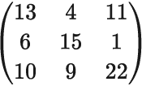
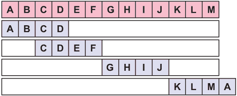
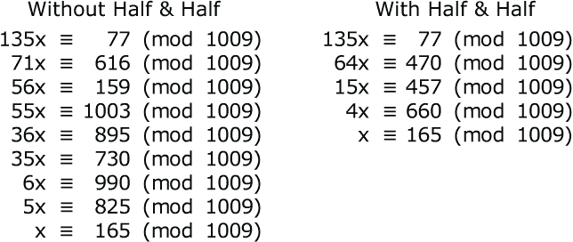

# 第十五章：矩阵方法

本章涵盖

+   使用整数矩阵乘法或环元素矩阵的加密

+   使用大整数和小整数的加密

+   解线性同余方程

+   构造环和可逆矩阵

矩阵是一种非常适合用于密码学的工具，因为它们可以在一次操作中对任意大的文本块进行加密。通常，消息中的每个块都被视为字节向量，意味着模 256 的整数。

当桑德拉使用矩阵来加密消息时，瑞娃必须使用该矩阵的逆矩阵来解密消息。让我们从讨论矩阵方法的技术开始，这是一种求逆矩阵的技巧。

## 15.1 求逆矩阵

有几种解决矩阵方程（比如 C = AP）的方法，例如已知明文的情况下。由于艾米丽知道 P 和 C，但不知道 A，她可以通过右乘 P' 来解方程得到 CP' = APP' = A。因此，艾米丽需要求 P 的逆。瑞娃则相反。她知道 A，但不知道 P，因此她需要求 A 的逆。将方程左乘以 A'，她得到 A'C = A'AP = P。

这里展示的方法有一个优点，即直接获得逆矩阵，而无需倒推的中间步骤，这是其他方法所必需的。该方法是将给定的矩阵与单位矩阵放在一个 n×2n 的双宽矩阵中。左侧通过*初等行变换*仅减少到单位矩阵。这些行操作应用于双矩阵的每一行，因此随着左半部分从原始矩阵变为单位矩阵，右半部分从单位矩阵变为原始矩阵的逆。

初等行变换包括（1）将一行乘以可逆常数，（2）交换两行，和（3）从另一行减去一个行的倍数。

该算法逐个将原始矩阵的元素转换为单位矩阵的元素，从左上角开始，然后向下处理左列。然后它对第二列执行相同的操作，依此类推。如果算法在任何时候被卡住，意味着活动列中的所有元素都是 2 的倍数，或者它们都是 13 的倍数，则该矩阵是不可逆的。如果这种情况发生在桑德拉身上，她需要尝试不同的矩阵 A。通常，只需在底部行的某个元素上加 1 即可。如果这种情况发生在艾米丽身上，她将需要更多的已知明文字符。这将给她一个（n+1）×n 矩阵。当她应用这个算法时，逆矩阵位于双宽矩阵的右上 n×n 部分。

这是一个 3×3 的例子。此矩阵适用于 26 个字母的英文字母表，因此矩阵元素是模 26 的整数。没有涉及到分数和负数。由于这是模 26 进行的，每个不是 2 的倍数且不是 13 的倍数的元素都有一个乘法逆元。这使得我们可以将每行的第一个非零元素变成 1，这样可以轻松地决定从任何其他行中减去哪个行的倍数。原始矩阵是

通过在右侧附加一个 3×3 的单位矩阵来将其扩展为双宽格式。

你立即陷入了困境，因为任何行的第一个元素都不是可逆的。我是故意这样做的，以展示一个非常有用的技巧。第一行的第一个元素是 13 的倍数，但不是 2 的倍数。第二行的第一个元素是 2 的倍数，但不是 13 的倍数。如果你简单地将第二行加到第一行，那么第一个元素就变成了 19，既不是 2 的倍数也不是 13 的倍数，因此它是可逆的。问题解决了。

19 的乘法逆元是 11 模 26，因为 19×11 = 209≡1 (mod 26)。你把第一行乘以 11，将矩阵的第一个元素变成 1。

现在，你可以通过从第二行减去顶部行的 6 倍，并从第三行减去顶部行的 10 倍来完成第一列。这将把第二行和第三行的第一个元素设为零。

是时候处理第二行了。第二行上第一个非零元素是 9。9 的乘法逆元是 3，因为 9×3 = 27≡1 (mod 26)。你把第二行乘以 3，将行的第一个元素变成 1。

这让你通过从第一行减去第二行，并从第三行减去 25 倍的第二行来完成第二列。注意，双宽矩阵的左侧逐渐变成单位矩阵。

差不多了。第三行上第一个非零元素是 21。21 的乘法逆元是 5，所以你把矩阵的底行乘以 5。

现在，你可以通过从第三行减去第一行的 9 倍，从第二行减去第一行的 19 倍，完成第三列。

完成了。双宽矩阵的左半部分现在保存着单位矩阵，右半部分是原始矩阵的逆矩阵。你可以通过将原始矩阵乘以逆矩阵来检查这一点。结果应该是单位矩阵——而确实如此。

## 15.2 转置矩阵

让我们从一个非常简单的矩阵方法开始，即*转置矩阵*，它在数学上等价于*置换矩阵*。这是一个方阵，每行和每列都恰好有一个 1。所有其他矩阵元素都是 0。如果你想要转置一个由 10 个字母组成的块，你可以将该块视为一个大小为 1×10 的行矩阵，并将其乘以一个大小为 10×10 的转置矩阵。结果将是一个 1×10 的矩阵，字母被转置了。

要将一个字母从块中的第 2 位置移到第 5 位置，你需要将第 2 行第 5 列的元素设置为 1。下面是一个 4×4 的转置矩阵的示例，它将消息块 ABCD 更改为 BADC。

单独使用转置矩阵并不特别实用，但是如果你有一个矩阵 M 对一个块进行替换，并且一个转置矩阵 T，你可以通过使用矩阵 MT 替换 M 来将它们合并为单个步骤。这样，你就可以在单个操作中获得替换和转置。

## 15.3 希尔密码

基于矩阵的最早的密码是*希尔密码*，由亨特学院的莱斯特·希尔于 1929 年发明，并发表在*美国数学月刊*上。类似的密码在 1924 年由当时还是十几岁的杰克·莱文发明，在 1926 年发表在*弗林周刊*上，一本通俗侦探杂志。*弗林周刊*的密码专栏由 M·E·奥哈弗负责，他发明了分数化的摩尔斯密码（第 4.4 节）。巧合的是，*弗林周刊*是肯德尔·福斯特·克劳森（也在第 4.4 节提到）发表许多故事的地方。莱文一生致力于推翻希尔的密码并推广自己的密码。

希尔密码操作的是 26 个字母的字母表，字母按某种乱序编号为 0 到 25。也就是说，在矩阵运算之前进行简单的替换。你将明文字母分成 3 个一组。这形成了一个列向量，即一个 3×1 矩阵，P。你将这个列向量在左边乘以一个 3×3 矩阵 A，然后加上一个列向量 B，得到密文向量 C。在矩阵表示中，这被写成 C = AP + B，使用模 26 的加法和乘法。最后，你将数字转换回字母，使用相同的字母到数字的对应关系。

不幸的是，许多作者将 *Hill 密码* 限制为该密码的一个弱化、削弱的版本。为了避免歧义，让我们对 Hill 密码的几个版本进行编号。Hill-0 是最弱的版本。您使用标准英语字母表，没有混合，并省略 B 向量，以便 C = AP。Hill-1 稍微强大一些。您仍然使用未混合的字母表，但 B 向量不为零。Hill-2 是 Hill 最初提出的版本。您使用混合字母表和非零的 B 向量。Hill3 是一个更强大的版本，您在其中使用一个混合字母表将字母转换为数字，但您使用另一个混合字母表将数字转换回字母。这类似于第 9.6.1 节中的共轭矩阵双重密码。

Hill 密码，即 Hill-2，如最初发布的那样，基本上是一种秘密方法密码。字母转换为数字以及矩阵 A 和 B 都是固定的。没有密钥。任何知道这种方法的人都可以像预期的接收者一样轻松阅读消息。大多数最近的书籍和网站讨论 Hill 密码时忽略了混合字母表，并集中于矩阵运算。如果使用了固定的字母到数字的转换，这是合法的，因为可以去掉已知的字母表混合。

让我们首先看一下 Hill-0 情况，其中 A 是一个未知的 n×n 矩阵，向量 B 是 0，所以 C = AP。这就是普通的矩阵乘法，我们在第 11.3 节中见过。Riva 可以通过将密文乘以矩阵 A 的*逆矩阵* A' 来解密消息。逆矩阵具有这样的性质，即 A'A = AA' = I，其中 I 是*单位矩阵*。在矩阵 I 中，每个对角元素为 1，每个其他元素为 0。单位矩阵类似于普通乘法中的数字 1，即对于每个数字 N，1×N = N×1 = N。对于矩阵，这意味着 IA = AI = A 对于每个方阵 A。如果 Emily 能确定 A'，她也可以解密消息。

这个 B = 0 版本的 Hill 密码容易受到已知明文攻击的影响。如果 Emily 有 n² 个已知明文字符，她可以将它们组成一个 n×n 矩阵。将此矩阵称为 P，并将相应的密文矩阵称为 C。那么 C = AP，其中 C、A 和 P 都是模 26 的 n×n 整数矩阵。有几种方法可以解决这个矩阵方程。一种方法如 15.1.1 节所示。

如果加法向量 B 不全为零，则艾米莉只需要更多已知明文的字符，她就可以从方程中消除 B。额外的已知明文字符可以形成一个列向量 P[2]，相应的密文字符可以形成一个列向量 C[2]。这些向量可以像这样从方程中减去：(C-C[2]) = A(P-P[2])。这与 C = AP 具有相同的形式，并且通过相同的方式解决，即通过求逆矩阵 P-P[2]。通过从 n×1 列向量中减去 n×n 矩阵，可以将 n×1 列向量从矩阵中减去，方法是从向量的第一个元素中减去矩阵顶行的每个元素，从向量的第二个元素中减去矩阵第二行的每个元素，依此类推。

假设你没有已知的明文。仍然可以解决 Hill-0 变体。继续假设一个秘密的 3×3 乘法矩阵，C = AP。乘以 A'，A 的逆矩阵，得到 P = A'C。在消息的每个块中，块的第一个明文字符仅取决于 A 的顶行。这只有 26³ = 17,576 种可能性，所以很容易尝试它们。每个顶行的组合将确定明文中位置 1、4、7 等位置的字母。对于每个这样的组合，统计字母频率。

你可以使用第 5.9.1 节中描述的高峰方法将这些字母频率与标准英语字母频率进行比较。选择那些匹配度最高的组合，比如前 1%，或者前 175 个组合。对于每个块的第二和第三个明文字母，使用逆矩阵 A'的第二和第三行。这为每个 3 行提供了 175 个可能的组合。现在你可以尝试这些组合的组合，以获得整个消息的可能重构。只需尝试 175³ = 5.36×10⁶种组合。第 1 行的组合给出每个块的第一个字母，第 2 行的组合给出每个块的第二个字母，第 3 行的组合给出每个块的第三个字母，因此你拥有每个字母。

现在你可以使用三字母组频率确定最有可能的明文。使用所有的三字母组，不仅仅是 3 个字母的块，还有跨块的三字母组。这与我们在第 5.10 节和第 8.2 节中使用的过程相同，所以我不会在这里重复所有细节。如果这无法产生令人满意的结果，请回到起点，并为每个字母选择前 2%或前 350 个组合。

Hill 密码 Hill-1 使用一个秘密的 3×3 乘法矩阵和一个秘密的 3×1 加法矩阵，但使用未混合的字母表，被评为三级。在矩阵操作之前和之后都进行密钥混合替换后，被评为五级。它可以被解密为一般的三字母替换密码。对于更大的矩阵，评级会增加。为了达到十级评级，矩阵必须至少为 8×8，并且 Hill-3 矩阵操作必须应用两次。以下是步骤。（1）使用一个键入的非线性替换将消息转换为数字形式。（2）将每个块乘以矩阵并添加列向量。（3）对数字进行第二次非线性替换。（4）将每个块乘以第二个矩阵并添加第二个列向量。（5）使用第三个键入的非线性替换将结果转换回字母。两个乘法矩阵可以固定，但用于混合字母表的 3 个密钥和 2 个加法列向量应该在每条消息中更改。将此密码称为*DoubleHill*。

## 15.4 Hill 密码，计算机版本

Hill 密码对密码员来说太复杂，无法手工完成。Hill 还创建了一个机械设备用于进行加密和解密。这是为了满足当时的专利法，允许对机器进行专利保护，但不允许对数学算法进行专利保护。然而，这种密码在实践中几乎没有被使用。

如今，在计算机时代，Hill 密码再次变得实用。对于计算机来说，矩阵乘法是小菜一碟。使用 10×10 矩阵比 3×3 矩阵更容易。对于已知明文攻击，艾米莉需要 100 个字符而不是 9 个字符。这几乎是不可能的，除非通过间谍活动或在战场上截获消息。使用标准字母表的秘密 10×10 矩阵的 Hill 密码评级为六级。使用秘密 10×10 矩阵的 Hill 密码，在矩阵乘法之前和之后进行密钥混合替换，被评为八级。

通过使用多个矩阵并选择每个块的矩阵，可以进一步加强 Hill 密码，可以周期性或随机选择矩阵。矩阵和明文块的大小可能不同。由于矩阵乘法不是可交换的，当你在左边或右边乘以一个矩阵时，你几乎总是得到不同的结果。当你在左边乘以一个矩阵时，每个明文块必须被视为一个列向量，但当你在右边乘以一个矩阵时，它必须被视为一个行向量。这表明通过交替使用不同的方向，可以获得更安全的密码，可以周期性或随机地交替。可变矩阵，可变块大小和可变方向。你可以自行选择或混合使用。

你也可以将置换与希尔密码结合起来，但并不是每种置换都能提高安全性。假设你正在使用希尔-0 或希尔-1 变种，并且在矩阵乘法之后转置每个区块中的字母。这与使用具有不同矩阵乘数的希尔密码是一样的。让 T 代表转置。在对 Hill-1 进行加密后应用 T 会得到 C = T(AP+B) = (TA)P+(TB)。你所做的一切就是使用 TA 代替 A，TB 代替 B。Emily 可以使用已知明文来解密密码，并且她永远不会知道有置换存在。如果你想在希尔-0 或希尔-1 中使用置换，你必须在不同的区块之间交换字母，或者在不同的区块中交换不同的字母。

令人惊讶的是，当你使用希尔-2 或希尔-3 时情况完全相同。这是因为简单的替换和置换是可交换的。如果 S 是任何简单的替换，T 是任何置换，M 是任何消息，那么 S(T(M)) = T(S(M))，因此 ST = TS。因此，无论你使用哪种希尔密码变种，如果你要添加一个置换步骤，你必须在不同的区块之间交换字母，或者在不同的区块中交换不同的字母，要么周期性地要么伪随机地。

另一个想法是在两侧都用矩阵乘以消息。正如前面提到的，当你将文本块左乘以矩阵时，它必须被视为列向量，但当你将其右乘以矩阵时，它必须被视为行向量。假设你正在使用 3×3 矩阵，加法矩阵 B = 0。通过单侧矩阵乘法，每个密文字符的表达式都有 3 项，每项都涉及一个明文字母和一个矩阵元素。通过双侧矩阵乘法，每个密文字符的表达式有 9 项，每项都涉及一个明文字母和 2 个矩阵元素的乘积。因此，明文字母的系数是二次的。在 81 个可能的二次系数中，有 27 个出现在这些表达式中。

对于希尔-0 和希尔-1 情况，Emily 仍然可以使用已知明文来解决这些方程。有一种简单的方法和一种困难的方法。困难的方法是使用 18 个已知明文字符来解决两个 3×3 矩阵中 18 个未知元素的 18 个二次方程。祝你好运！

用简单的方法，将 27 个二次系数视为单独的变量。这将把方程从 18 个变量的二次方程转变为 27 个变量的线性方程。忽略 27 个变量是如何从 18 个矩阵元素中形成的，只需将它们视为不可分割的单元。由于现在有 27 个未知数，艾米莉需要 27 个已知字母而不是 18 个。虽然不太可能，但有可能，尤其是如果她拦截了多条使用相同密钥的消息。例如，假设艾米莉知道每条从瑞典发出的消息都以单词 STOCKHOLM 结尾。由于 STOCKHOLM 的出现可能在 3 个字母块中的不同位置开始，3 条不同的消息可以给她 27 个已知字母的位置。她可以轻松解决这 27 个线性方程以获得 27 个系数。

从那里，解决 27 个一次项二次方程以找到 18 个矩阵元素很容易——但为什么要麻烦呢？明文字母和密文字母之间的关系都是以 27 个二次系数为基础的。对于艾米莉来说，知道这些系数是如何产生的并没有好处。

Hill-1 的情况与 Hill-0 基本相同。有 36 个未知数，所以艾米莉需要 36 个已知明文字符。否则，解决过程是相同的。Hill-2 和 Hill-3 没有可比的过程。最好将它们解决为三字母替换密码。

通过在每一侧使用不同大小的矩阵，并在每一侧以不同方式对齐矩阵，可以从双面矩阵乘法中获得更大的强度。以下是这些技术的两个示例。在第一个示例中，左侧乘法是由 3×3 矩阵进行的，而右侧乘法是由 4×4 矩阵进行的。由于 3×3 矩阵与 4×4 矩阵对头，如图所示，让我们称之为*Butthead 配置*。

这给出了一个有效的块大小为 12 个字符。由于每个右侧的 4×4 矩阵跨越两个左侧的 3×3 矩阵，每个密文字符依赖于 6 个明文字符，而不是 4 个。在这种配置下，生成每个密文字符只需 7 次乘法，因此这种方法非常快速。当混合字母表是秘密的，但矩阵是已知的时，Butthead 密码被评为六。如果混合字母表和矩阵都是秘密的，则被评为八。如果矩阵是 6×6 和 7×7 或更大，则评级提高到十。当然，桑德拉使用的矩阵大小应该是互质的。

*砖墙*是另一种推荐的双面矩阵乘法配置。在这里，所有矩阵都是相同大小，但它们的偏移量为宽度的一半，就像墙上的砖块一样。这张图解说明了这种方法。

注意到矩阵的边界从未对齐。这种配置没有块结构，或者等效地说，整个消息是一个单一的块。由于每个 4×4 右侧矩阵跨越两个左侧 4×4 矩阵，每个密文字母取决于 8 个明文字母。这对于高安全性工作是足够的。

如果您实际上使用 2×2 矩阵来处理第一个和最后一个块，那将使这些块变得薄弱和容易受攻击。这还要求您使用 1×1 和 3×3 矩阵来处理不均匀的消息长度。最好始终使用 4×4 矩阵。接下来的两个图示展示了如何对长度为 13 的消息执行此操作。第一个图示显示了左侧矩阵的放置，最后一个 4×4 矩阵与消息的右端齐平。

下一个图示显示了右侧矩阵的放置，偏移了 2 个字符。第一个和最后一个 4×4 右侧矩阵与消息的末端齐平。

将最后一个矩阵定位在最后一个左侧矩阵和最后一个右侧矩阵对齐。可以通过将其环绕到消息的开头来避免这种情况，就像这样。

当您在左侧矩阵乘法之前使用了混合密钥简单替换，并在右侧矩阵乘法之后使用了另一个，同时使用了大小为 6×6 或更大的秘密矩阵时，砖墙密码评级为十。

由于反转矩阵需要一些努力，因此最好使用固定矩阵进行左侧和右侧乘法。使用固定矩阵会削弱密码，但您可以通过在两个矩阵乘法步骤之间添加第三个简单替换来进行补偿。矩阵可以是任何偶数大小，如 6×6 或更大。与希尔密码相比，让我们称之为*珠穆朗玛峰密码*。珠穆朗玛峰密码评级为十。

## 15.5 大整数乘法

大整数乘法在一个重要方面类似于矩阵乘法：在矩阵乘法中，产品的每个元素是两个矩阵中的一个元素的乘积之和。在大整数乘法中，产品的每个数字是两个大整数中的一个数字的乘积之和。无论如何，这是我将这个主题放在矩阵章节中的理由。

一个 128 位块可以看作是 16 个字节，或者是 128 位整数的 16 个基于 256 的数字。如果您将两个这样的基于 256 的整数相乘，那就涉及 256 个乘积和 256 个加法（包括进位）。如果您使用的语言允许您将两个 32 位无符号整数相乘以获得 64 位无符号乘积，那么您只需要 16 次乘法和 16 次加法。如果语言允许 64 位整数与 128 位乘积相乘，那就更简单了。

有更快的方法可以乘以非常大的数字，比如 Karatsuba 和 Toom-Cook，但是对于乘以 128 位数字，甚至 256 位数字，这些方法的好处太小，不值得为了当前目的而使用，所以我不会介绍大整数乘法的机制。一些计算机语言会自动处理这些机制，因此用户永远不需要介入。

话虽如此，考虑一个密码，*Mult128*，其中消息以 128 位块为单位，每个块都乘以一个秘密的 128 位整数 M，对 2¹²⁸取模。换句话说，只使用 256 位乘积的低阶半部分，高阶半部分被丢弃。这意味着乘法中的一些中间产品不需要计算，因为它们只对乘积的高阶端有贡献。

利瓦可以通过将密文乘以 M 对 2¹²⁸取模的乘法逆元 M'来读取消息。当 M 为奇数时，这个逆元存在。让我们看看如何找到乘法逆元。

### 15.5.1 乘法和除法同余

我在本书的早期承诺过，我会根据需要逐步呈现所有必要的数学内容。这是其中之一。计算乘法逆元的方法涉及乘以线性同余式。在我展示如何做到这一点之前，让我们看一个示例来了解为什么这是一个问题。(我在第 3.6 节中使用了这个示例的部分内容。您可能希望在继续之前重新阅读该节。)

并不是所有的同余式都具有相同的强度。一些同余式很强，有唯一的解。一些同余式很弱，有许多解。同余式越强，提供的信息越多。考虑这些同余式，从最强到最弱排列：

这种不均衡的原因是，在除了这些同余式中的第一个以外的所有同余式中，ax≡b (mod n)，参数 a、b 和 n 有一个公因数。在 10x≡8 (mod 12)中，参数 10、8 和 12 有公因数 2，同余式有 2 个解。在 9x≡3 (mod 12)中，参数 9、3 和 12 有公因数 3，同余式有 3 个解。等等。公因数越大，解越多，同余式越弱。

当 a、b 和 n 有一个公因数 d 时，你可以将同余式除以 d。例如，9x≡3 (mod 12)有一个公因数 3\. 除以 3 得到 3x≡1 (mod 4)。你可以直观地解决这个问题。解是 x≡3 (mod 4)。检查一下，因为 3×3 = 9≡1 (mod 4)。将这个结果转换回(mod 12)，第一个解是 3 (mod 12)，然后通过添加 12/3 = 4 再次添加 4，得到另外两个解，即 7 (mod 12) 和 11 (mod 12)。

总结一下，如果 a、b 和 n 有一个公因数 d，那么就有 d 个不同的解。第一个解是满足 a/d≡b/d (mod n/d)的解，其他解相距 n/d。

让我们看看另外两种情况。再假设 ax≡b (mod n)，并且 a 和 n 有一个不整除 b 的公约数，例如 3x≡7 (mod 30)。那么这个同余方程没有解。相反，假设 a 和 b 有一个不整除 n 的公约数 d。那么你可以将 a 和 b 除以 d。例如，如果 10x≡25 (mod 37)，那么 2x≡5 (mod 37)。这可以通过在头脑中将 37 加到 5 上来解决，得到 2x≡42 (mod 37)。除以 2 得到 x≡21 (mod 37)。

就像你可以将 a 和 b 除以一个常数一样，你也可以将 a 和 b 乘以一个常数 m。这个 m 不能与 n 有公因数。换句话说，m 必须在模 n 下可逆。否则，你会使同余方程变弱并丢失信息。例如，假设给定 9x≡3 (mod 12)。这是一个有 3 个解的弱同余方程。如果你将 a 和 b 乘以 2，同余方程变为 18x≡6 (mod 12)，等价于 6x≡6 (mod 12)，有 6 个解。这个弱同余方程变得更弱。

你也可以相加和相减具有相同模数的同余方程。假设 ax≡b (mod n)和 cx≡d (mod n)。这些可以相加得到(a+c)x≡b+d (mod n)，或相减得到(a-c)x≡b-d (mod n)。这可以用来加强一组弱同余方程。例如，假设你有 9x≡3 (mod 12)和 8x≡4 (mod 12)。第一个同余方程有 3 个解，第二个有 4 个解。如果你将它们相加，得到 17x≡7 (mod 12)，化简为 5x≡7 (mod 12)，有唯一解 x≡11 (mod 12)。更聪明的是，如果你将两个同余方程相减，得到(9-8)x≡(3-4) (mod 12)，直接得到 x≡11 (mod 12)。

## *15.6 解线性同余方程

现在你知道如何安全地操作同余方程而不失强度，我们可以解决如何解线性同余方程 ax≡b (mod m)，其中 a、b 和 m 是给定常数，x 是我们试图找到的未知值。特殊情况下当 b = 1 时，x 是 a 对模 m 的乘法逆元。大多数教科书只提到一种叫做*扩展欧几里德算法*的技术。（欧几里德算法通常被归功于雅典的忒亚泰特，他比欧几里德早生活大约一个世纪。）那是一个非常好的方法。当模数较小或者模数有几个不同的小质因数时，可能是正确的方法。当因数分解未知且存在小因数的可能性时，这绝对是正确的方法。

然而，在密码学中，只有两种常见情况需要计算乘法逆元，当模数是质数时，以及当模数是 2 的幂时。本节将描述一种更简单、更直接的方法。

### 15.6.1 简化同余方程

解决同余式 ax≡b (mod m)的基本方法是反复减少 x 的系数。最简单的方法是*ResM*。它将同余式乘以一个整数 n，使得 x 的系数至少与模数一样大。即 a(n-1) < m ≤ an。你可以通过将 m/a 四舍五入确定 n 的值，所以 2.0000 保持为 2，但 2.0001 会变成 3。当系数对 m 取模时，结果是一个较小的系数。

让我们从一个简单的 ResM 示例开始，只是为了获得基本概念，并且在后面讨论变得复杂时更容易跟上。取同余式 38x≡55 (mod 101)。我们知道 101/38 = 2.658，所以我们将同余式乘以 3，然后对 101 取模，就像这样：

注意，x 的系数从 38 减少到 13。这可以再次减少。我们有 101/13 = 7.769，所以我们将同余式乘以 8，就像这样：

我们快到了。101/3 = 33.667，所以将最后的同余式乘以 34，x 的系数就减少到 1：

我们可以通过将 x = 36 代入原同余式 38x≡55 (mod 101)来检查这个结果。将 x 替换为 36 得到 38×36≡55 (mod 101)，即 1368≡55 (mod 101)，这是正确的。正确答案是 x≡36 (mod 101)。

### 15.6.2 一半一半法则

让我们看一个小的改进。我们可以称之为*一半一半法则*。大约一半时间，m/a 的小数部分小于 1/2，另一半时间大于 1/2。设 q = m/a。那么一半时间 qa 更接近 m，另一半时间(q+1)a 更接近 m。

一个数值示例可能有助于更清楚地理解这一点。让 m 为 101，让 a 为 40。那么 q = 101/40 = 2.525。分数.525 大于 1/2。如果你取 40×2，结果是 80，比 101 少 21。如果你取 40×3，结果是 120，比 101 多 19。所以 40×3 比 40×2 更接近 101。因此 n = 3 是最佳乘数。

假设，相反，a 是 41。那么 m/a = 101/41 = 2.463。这次分数.463 小于 1/2。如果你取 41×2，结果是 82，比 101 少 19。如果你取 41×3，结果是 123，比 101 多 22。所以 41×2 比 41×3 更接近 101。因此 n = 2 是最佳乘数。

总结一下，当 q = m/a 的小数部分小于 1/2 时，如果我们向下取整 q，na 更接近 m，但当 m/a 的小数部分大于 1/2 时，如果我们向上取整 q，na 更接近 m。使用 floor 和 ceil 符号（第 13.3 节），如果 frac(q) < 1/2，选择 n = ⌊q⌋，但如果 frac(q) > 1/2，选择 n = ⌈q⌉。听起来很容易，但有一个复杂之处。当 n = ⌈q⌉时，na 大于 m，所以你通过减去 m 的倍数来减少同余式，就像我们在本节开头所做的那样。当 n = ⌊q⌋时，na 小于 m，所以你通过从 m 的倍数中减去它来减少同余式。

从这里开始

由于 101/41 = 2.463，将同余式乘以 2，得到

从 101 的倍数中减去这个数，即

由于 101-82 = 19 并且 202-180 = 22，因此得到

为了说明这种改进有多大，让我们分别使用半分法和非半分法解一个同余式。

如果不使用半分法，则减少需要 8 步。使用半分法减少只需 4 步。对于不同的系数和模数，比例会有所不同，但 8:4 是相当典型的。使用半分法的 ResM 可以称为*ResMH*。

### 15.6.3 阶梯法

当整数非常大时，这仍然有点慢，因为我们要乘以和除以大数。可以使用*阶梯技术*来避免这种情况。它对每个步骤使用两个同余式。阶梯技术不是将 x 的系数乘以越来越大的数字使其接近模数的值，而是在每个同余式中将系数乘以一个小数使其接近前一个系数的值。这需要一个额外的同余式来启动该过程。为此，我们使用同余式 mx≡m(mod m)，它等价于 0x≡0(mod m)。

让我们看一个使用更大数字的例子：

由于 28338689/6114257 约为 4.635，乘以 5 并减去得到

在这里，6114257/2232596 约为 2.739，所以乘以 3 并减去得到

继续这样做，依次得到

每个例子都使用了一个素数模数。当模数是复合数时，情况变得更加复杂。我不会在这里覆盖所有这些复杂性。对于密码学最重要的情况是模数为 2 的幂，例如 2³²或 2¹²⁸。在这种情况下，您在每个阶段选择的乘数必须是奇数。因此，不要将乘数四舍五入到最接近的整数，而是始终向奇整数四舍五入。例如，3.14 将四舍五入为 3，3.99 也将四舍五入为 3。使用阶梯技术的 ResMH 可以称为*ResMHL*。

### 15.6.4 连分数

一旦有两个或更多的线性同余式，您可以使用一种称为*连分数*的技术更快地减少 x 的系数。连分数是一种通过分数紧密逼近十进制数的方法。考虑十进制数 R = .13579。R 在 1/7 和 1/8 之间。更准确地说，R 约为 1/7.3643。这也可以写成 1/7+.3643。注意加号+在分数的分母中。这表示加法在分母中完成，而不是将两个分数 1/7+.3643 相加。

分数.3643 可以近似为 1/2.745，或者 1/2+.745，所以 R 现在是 1/7+1/2+.745。这里.745 非常接近 3/4，因此近似可以是 1/7+1/2+3/4。要将其转换回普通分数，只需向后工作：

分数 11/81 是.13580，与.13579 仅相差.00001。正如你所见，这种方法提供了出色的近似值。

让我们再试一次来自 15.4.3 节的例子，

6114257x ≡ 90926 (mod 28338689).

对于第二个同余式，我们使用了 0 = 0 的技巧，

28338689x ≡ 28338689 (mod 28338689).

这里 6114257/28338689 是

获得接近的近似值的一个好法则是在大分母之前停止，本例中为 24。在 24 之前截断连分数得到

这计算出为 241/1117。

将 6114257 同余式乘以 1117 和 28338689 同余式乘以 241 然后相减得到

这将 x 的系数从 6114257 降低到 1020，降低了 5994 倍。因此，继续分数法比其他方法使用的步骤要少得多。然而，使用起来很棘手，因为一步的系数可能比下一步的系数大得多，例如 6829625069 与 1020。你可以通过交替使用连分数步骤和一半步骤来平衡系数。******

## 15.7 大整数密码

可以使用大整数乘法构建许多密码。第 15.3 节描述了 Mult128 密码，其中消息以 128 位块进行。每个块被视为 128 位整数，并乘以秘密的 128 位整数 M 模 2¹²⁸。为了得到良好的混合，乘数的每个字节都应该是非零的。这仍然很脆弱，因为每个密文块的低阶 n 位仅取决于明文和密钥 M 的低阶 n 位。这使得低阶字节的加密变为简单的替换。在乘法之前和之后执行简单的替换不能修复这个弱点。类似地，低阶 2 字节经历双字母替换，低阶 3 字节经历三字母替换。Mult128 评级为 Three。

修复低阶字节问题的超快速方法是将高阶字节与低阶字节组合起来，例如使用**xors**或**adds**组合函数。这将提高评级至 Five。一个更好的解决方案是使用**xors**或**adds**将高阶 8 字节与低阶 8 字节组合起来。这将评级提高至 Seven。这里是一个例子。

加强密码的一种方法是对 16 个字节进行置换，然而，有了足够的密文，Emily 可以检测出哪个字节位置的变异最小，因此必须是置换后的低位字节。*Permuted Mult128* 被评为四级。

更强大的方法是进行乘法、置换，然后再进行乘法。置换需要将弱的低位字节移到块的高位半部分。适合的置换有 (1) 颠倒字节的顺序，(2) 交换块的低位和高位半部分，或 (3) 以相反顺序交错低位和高位字节。如果使用十六进制数字 0 到 F 对字节进行编号，那么这 3 种置换可以表示为

如果你的编程语言允许你将该块视为 32 位字和单个字节进行操作，那么将 4 个字的顺序颠倒可能会更快，从而得到这种排列：

这个密码，称为 *MPM128*，被评为七级。

当你在这个过程中添加替换步骤时，安全性会提升。让 S[1]、S[2]、S[3] 和 S[4] 成为 4 个独立的混合很好的键入替换，让 P 是固定的置换 5BF4AE39D28C1706，让 M[1]、M[2] 和 M[3] 是乘以 3 个秘密的 128 位整数。然后密码 S[1]M[1]PS[2]M[2]S[3]PM[3]S[4]，称为 *Tiger*，被评为十级。

## 15.8 小整数乘法

使用普通的无符号 32 位乘法可以完成 Mult128 的迷你版本。128 位块被视为四个 32 位整数。这些整数中的每一个都与一个秘密的 32 位整数进行乘法，取模 2³²。这 4 个乘数必须是奇数，以便稍后进行解密。这产生了一个 32 位密码。要得到一个 128 位密码，这 4 个单独的 4 字节乘积可以被视为一个 16 字节块，并使用这个固定的 16 字节密钥转位混合（见第 7.6 节）：

这个转位后跟着第二个乘法步骤，再次将 16 字节块视为四个 32 位整数。你可以使用相同的乘数或新的乘数。然后是第二个转位，和另一轮乘法，所以有 3 轮乘法和两轮转位。这个密码被称为 Mult32，并被评为七级。它比任何 Mult128 密码变体都要快得多。

让我们将 128 位块的 16 个字节视为一个 4×4 字节矩阵。该矩阵的任何一行的 4 个字节都可以视为 32 位整数。通常情况下，整数的 4 个字节从左到右取出，最左边的字节为高位字节。但是，它们也可以按相反的顺序取出，最左边的字节为低位字节。考虑十六进制数 01020304。如果我们按照正常方式将其乘以十六进制数 01010101 对 2³²取模，结果是十六进制 0A090704。如果我们按照相反的顺序将其乘以十六进制数 01010101 对 2³²取模，结果是十六进制 0A060301。

类似地，我们可以将任何列中的 4 个字节视为 32 位整数，既按照自上而下的顺序，也按照自下而上的顺序。将两个水平方向称为东和西，两个垂直方向称为北和南。如果我们按照东、北、西、南的顺序将行和列乘以奇数 32 位整数对 2³²取模，这将提供彻底的混合。这需要 16 个单独的 32 位乘法器。总密钥大小为 16×31 = 496 位，而不是 16×32 = 512 位，因为乘法器必须是奇数。这种密码，可以称为*Compass*，评为 Eight。

要将评级提升到 Ten，可以添加一个或多个替换轮，例如，东、北、替换、西、南。更好的方法是，添加多个替换，比如东、替换、北、西、替换、南。将其称为*CompassS*。即使使用固定替换，如果它们高度非线性，CompassS 也评为 Ten。

使用小整数乘法的另一种方法是进行*循环乘法*。让块中每个 32 位行中的字节从左到右依次编号为 1、2、3、4，即从高位字节到低位字节。将其乘以奇数模 2³²。将字节 1 移动到低位，使顺序变为 2、3、4、1。再次乘以奇数模 2³²。重复两次，使每个字节都占据每个位置一次。即，字节按顺序 1234，然后 2341，3412，最后 4123。对 4×4 字节矩阵的 4 行中的每一行都要执行此操作，共进行 16 次乘法和 12 次循环移位。

接着对列执行相同的操作。总共有 32 次乘法和 24 次循环移位。这种循环乘法密码评为 Eight。可以有多达 32 个不同的 32 位乘法器作为密钥。

这一节的方法可以与第 15.4 节的方法以多种方式结合使用。这里只是一个例子，我将其称为*Mat36*。将消息按 36 个字符一组，这些字符被视为九个 32 位整数。这些整数形成了模 2³²的 3×3 整数矩阵。这个矩阵将与一个秘密的 3×3 可逆整数矩阵相乘。如果你简单地将另一个 3×3 矩阵乘在右边，那么这 9 个整数的低位字节将被弱加密。相反，将整个 36 字节块左移 16 位，然后将块右边乘以第二个秘密的 3×3 可逆整数矩阵。Mat36 评级为 Eight。

## 15.9 模 P 乘法

当乘法取模 2^n 时，低位字节会被弱加密，我们需要费点周折来解决这个弱点。当乘法取模一个素数 P 时，这个问题不会发生。有了一个大的乘数，产品的每一位都取决于明文的每一位。有一个不同的问题。假设你选择了一个素数 P < 2^n，以及一个乘数 M，其中 1 < M < P。这样你就可以安全地将从 0 到 P-1 的值乘以 M 模 P，所以 Riva 可以通过乘以 M'，M 的乘法逆元，来解密这些值。

然而，明文值 0 将保持不变，而 P 到 2^n-1 的明文值不能安全地相乘，因为结果会产生歧义。例如，当通过 M 模 P 相乘时，3 和 P+3 将产生相同的结果，因为 3M≡PM+3M(mod P)，所以 Riva 无法确定消息是 3 还是 P+3。这意味着从 P 到 2^n-1 的值必须保持不变。为了做到这一点，定义函数 modp 如下：

这个问题的一个解决方案是让 Sandra 对明文进行异或。这建议了一族*Modulo P 密码*。让我们确定 n = 64，意味着块大小为 8 字节，素数模数 P = 2⁶⁴-59 = 18446744073709551557，乘数 M = 39958679596607489，也是素数。

Sandra 通过选择一个秘密的 64 位常数 C[1]作为密钥，计算 x = modp(C[1]⊕B)+C[1]来加密 64 位明文块 B。这是这个系列中的第一个密码。称为*PMod1*。评级为 Five。这个系列中的第二个密码*PMod2*是 PMod1 的两次迭代，使用第二个 64 位常数 C[2]：

PMod2 评级为 Seven。这个系列中的第三个密码*PMod3*有 3 次迭代，评级为 Nine：

第四个成员*PMod4*评级为 Ten。它的总密钥大小为 256 位，是块大小的 4 倍：

每个加法都是模 2^n 进行的，而不是模 P。

四个 PModX 密码都非常快，因为大多数编程语言都直接支持 64 位的加法、乘法和模除。在某些计算机上，它们是单一的机器指令。这使得 PModX 密码能够以 4 或 8 个字节作为一个单位运行，而不是像 DES 那样将每个 4 位块单独处理。这类密码非常适合软件加密。PMod2 比 DES 更安全，因为密钥长度更大，而 PMod4 比 3DES 更安全。

对于模 P 的乘法还有第二种方法，可以消除不变的值。思路是将从 0 到 2⁶⁴-1 的整数范围分成两个单独的范围，每个范围使用不同的质数模数和不同的乘数。选择两个质数 P 和 Q，使得 P+Q = 2⁶⁴+2。大约有 1016 对这样的数字，所以很容易找到，例如 P = 9228410438352162389 和 Q = 9218333635357389229，以及两个小于 P 和 Q 的大乘数 M 和 N。麻烦的部分在于你必须将每个范围进行移位，以便仅乘以范围 1 到 P-1 或 1 到 Q-1 中的数字。通过重新定义 modp 函数来实现这一点。

通过重新定义的 modp 函数，PMod1 到 PMod4 密码与以前的工作方式相同，并且具有相同的评级。这张图展示了范围从 0 到 2⁶⁴-1 是如何被划分的。

## 15.10 进制转换

更改数字进制与乘以一个大整数紧密相关。当数字非常大时，更改数字进制是一个缓慢的操作，因此最好的策略是将消息分成块，并分别转换每个块。更改进制会模糊消息字节之间的分隔。

有两种将数字从一种进制转换为另一种进制的方法。你可以从低位开始计算，也可以从高位开始计算。很多人在学校学过这些技巧，但随着时间的推移往往会忘记。为了提醒大家，这里展示了两种方法。我们将使用低位技术将数字 1A87 从十一进制转换为七进制，然后再使用高位方法将其转换回十一进制。

使用低位技术，你要反复将数字除以新的基数。每个余数都成为转换后数字的下一个数字。以下是将 1A87 转换的步骤：

1A87÷7 等于 312，余数为 **4**。

312÷7 等于 49，余数为 **5**。

49÷7 等于 7，余数为 **4**。

7÷7 等于 **1**，余数为 **0**。

因此，十一进制中的 1A87 变为七进制中的 10454。

使用高位技术，你要反复将高位数字乘以旧的基数，然后加上下一个数字。以下是将 10454 转换的步骤：

**1**×7+**0** 等于 7。

7×7+**4** 等于 49。

49×7+**5** 等于 312。

312×7+**4** 等于 1A87。

如果这些数字看起来不太对，记住数字 7、49、312 和 1A87 都是以十一进制表示的。

你可以根据改变进制制作很多漂亮的密码。例如，一个 16 字节的块也是一个以基数 256 表示的 16 位数字。将该数字转换为另一个进制，比如 263。现在你可以对基数 263 的数字进行置换，或者执行替换，或者两者兼而有之。然后，你可以将其转换为基数 277，并做同样的事情。最后，你将其转换回基数 256。这需要一个 17 字节的数字来保存结果。你可以使用从 256 到 362 的任何进制。请记住，如果任何结果有一个前导数字 0，那么这个数字是必需的，以便 Riva 能够解密密文。

如果每个连续的基数都比前一个稍大，那么在每个阶段都需要相同数量的数字。只有在将数字转换回基数 256 时，数字的位数才会增加。没有理由要求这些基数必须是素数。

这是一个基于进制变换的分组密码概念。首先，从一个秘密的、混合良好的、基于密钥的简单替换 S 开始。S 操作的是字节，即从 0 到 255 的整数。S 可以扩展到大于 256 的进制，方法是保持大于 255 的任何数字不变。这样就消除了为每种可能的进制准备单独的替换表的必要性。选择 3 个数字基数 B[1]、B[2]和 B[3]，满足 256 < B[1] < B[2] < B[3] < 363。你还需要 3 个针对 16 个元素的带密钥的置换 T[1]、T[2]和 T[3]。这些元素是整数，可以大到 B[3]-1，因此它们每个都需要超过 1 个字节。

分组密码*3Base*包括以下步骤：（1）替换 S。（2）转换为基数 B[1]。（3）替换 S。（4）转置 T[1]。（5）转换为基数 B[2]。（6）替换 S。（7）转置 T[2]。（8）转换为基数 B[3]。（9）替换 S。（10）转置 T[3]。（11）转换为基数 256。 （12）替换 S。密码块由步骤 11 中的 16 个元素组成。第 12 步将块扩展为 17 字节。密码 3Base 评级为 Ten。

## *15.11 环

*环*是整数的抽象版本。也就是说，环是一组可以像整数一样进行加法和乘法运算的元素集合。你已经熟悉了几个环：整数、有理数、实数、模某个固定数的整数，也许还有复数和代数数。一些不太熟悉的环是多项式，其系数是环的成员，矩阵，其元素是环的元素，形式为 a +b√13，形式为 a +b∛7+c∛49，以及形式为 a +b√2+c√3+d√6 的数，其中 a、b、c 和 d 可以是整数、有理数或模某个固定整数的整数。

在我们讨论如何在密码学中使用环之前，让我们先制定环的正式规则。环加法用加号+表示，a+b，环乘法用并置表示，ab。

+   对于所有的环元素 a 和 b，a +b 和 ab 都是环的元素。（封闭性）

+   对于所有环元素 a、b 和 c，a +(b+c) = (a +b)+c。（加法的结合规则）

+   对于所有环元素 a 和 b，a +b = b +a。（加法的交换律）

+   存在一个环元素 0，使得 0+a = a +0 = a 对于所有环元素 a。（加法恒等式）

+   对于每个环元素 a，存在一个元素 -a，使得 a +(-a) = (-a)+a = 0。（加法的逆元素）

+   对于所有环元素 a、b 和 c，a(bc) = (ab)c。（乘法的结合律）

+   对于所有环元素 a、b 和 c，a(b +c) = ab +ac，且 (a +b)c = ac +bc。（分配律）

+   存在一个环元素 1，使得 1a = a1 = a 对于每个元素 a。（乘法的恒等式）

当添加一个加法逆元素时，通常会省略括号，因此 (-a)+b 变成 -a +b，而 a +(-b) 变成 a-b。

请注意，环乘法不一定是可交换的。如果环乘法是可交换的，则称该环为 *可交换环*。所有前述的例子都是可交换环。暂时假设我们讨论的所有环都是可交换的。如果环元素 a 有一个乘法逆元素 a'，使得 aa' = 1，则称 a 为 *可逆的*。在处理有限环时，建议尝试对所有可能的元素对进行乘法运算，以确定哪些元素是可逆的，并保留一个逆元素表以供快速参考。

一种利用环算术进行加密的简单方法是将第 11.8 节的涟漪密码与第 13.14.1 节的滞后线性加法结合起来。让我们选择环 ***R13***，其元素采用 *a* + *b*√13 的形式，其中 a 和 b 是十六进制数字，即模 16 的整数。两个十六进制数 a 和 b 组成一个表示字符的字节。例如，字母 X 在 ASCII 码中表示为十六进制 58，对应于 ***R13*** 环元素 5+8√13。

两个 ***R13*** 环元素 *a* + *b*√13 和 *c* + *d*√13 的加法为 (*a* + *c*) + (*b *+ *d*)√13，乘法为 (*ac* + 13*bd*) + (*ad* + *bc*)√13，其中所有的加法都是模 16 进行的。例如，如果 *x* = 2+3√13，*y* = 4+5√13，则 *x*+*y* 为 6+8√13，*xy* 为 11+6√13。

对于组合的涟漪 + 滞后线性加法密码，可以称为 *Lag Ripple*，将 x[n] 替换为 ax[n]+bx[n-i]+cx[n-j]，其中系数 a、b 和 c 是环的元素，这种情况下为 ***R13***，而滞后 *i* 和 *j* 是小整数，如 2 和 5。明文可以分成，比如，16 字节的块，但对于短消息，密码可以应用于整个消息。我们假设是后者。然后，加密将是

x[n] = ax[n] + bx[n-2] + cx[n-5] 对于 n = 1,2,3, ...,L。

这里 a 是 ***R13*** 的一个可逆元素，b 和 c 是 ***R13*** 的任意元素，L 是消息的长度。算术运算在环中进行。您可能会认出这是第 11.8 节中 **madd** 组合函数的变体。对于加密前几个字节，通常会使用环绕。 

对于使用已知的固定滞后进行单次通过的情况，滞后纹波的评级为 Two，因为可能的系数组合只有 256³种。通过在滞后纹波阶段之前和之后使用简单替代，评级增加到 Five。使用 3 次通过，每次通过的系数和滞后不同，评级变为 Six。

*三重纹波*使用 3 次通过，每次纹波通过前后使用秘密钥匙化的简单替代。每次通过都有不同的秘密系数和滞后。可选择为每次通过的消息从不同位置开始并循环。三重纹波评级为 Ten。

## 15.12 环上的矩阵

在 15.1 节和 15.2 节中，我们研究了希尔密码，它由将消息的每个块视为整数向量，并将该向量乘以模 26 或 256 的整数矩阵组成。整数模 26 或 256 没有什么神奇的。你可以使用任何环的元素来表示消息的字符。如果字符比环元素多，你可以使用环元素的成对或三元组，就像将 1 到 5 的整数对用于表示 25 个字母的 Polybius 方阵（9.1 节）一样。 

假设你使用的是***R13***上的矩阵，该环的元素形式为*a*+*b*√13。如果你将明文块视为包含 32 个十六进制数字而不是 16 字节的向量，并且为矩阵乘积的每个数字写出表达式，你会发现密文中的每个十六进制数字都是明文数字的线性组合。因此，在***R13***环上使用 16×16 的矩阵等效于在十六进制数字上使用 32×32 的矩阵，即模 16 的整数。因此，这样的密码仍然容易受到已知明文攻击。攻击需要至少 256 字节的明文。可能 16×17 = 272 字节就足够了。

你，发送者，可以轻松地通过在矩阵乘法之前和之后使用钥匙化的简单替代来击败这样的攻击。或者，你可以构建自己的环，一个除了你的合法通信者以外其他人都不知道的环。只要你能保密你的环，就没有人能对你的矩阵密码发起任何攻击。

## 15.13 构建环

一个包含 N 个元素的环，称为*阶数*为 N 的环，由两个 N×N 的表表示，即加法表和乘法表。构建环可以分阶段进行。让我们以构建一个包含 8 个元素的环为例进行演示。首先构建加法表。你从一开始就知道这个环必须有两个元素，0 是加法恒元，1 是乘法恒元。对于所有 a，和 0+a 和 a+0 都是已知的。这给了我们加法表的顶行和左列。

接下来，从第二行开始。策略是取第一个尚未分配值的和，为该和分配一个值，然后利用结合规则推断其他和的所有可能的值。假设你想要 1+1 = 2，2+1 = 3，3+1 = 4 和 4+1 = 0。利用结合规则，现在可以填写表的左上部分。例如，你可以确定 2+2 是多少，因为 2+2 = (1+1)+2 = 1+(1+2) = 1+3 = 4。

由于 4+1 = 0，因此 1 的加法逆元是 4，4 的加法逆元是 1。同样，2 是 3 的加法逆元，3 是 2 的加法逆元。那么我们应该给 5+1 赋什么值呢？它不能是 0，因为 4 和 5 不能同时是 1 的加法逆元。它也不能是 1，因为那样 5 就会是 0。它也不能是 2，因为 5+1 = 1+1 意味着 5 = 1。同样，5+1 也不能是 3 或 4。它也不能是 5，因为 5+5 = 5 意味着 5 = 0。那就只剩下 5+1 = 6 或 5+1 = 7。它们是等价的，所以假设 5+1 = 6。这强制使得 6+1 = 7 和 7+1 = 5。这意味着 5+1+1+1 = 5。这使得 1+1+1 = 0。由于我们已经知道 1+1+1 = 3，这意味着 3 = 0。不可能。这是一个死胡同。设置 4+1 = 0 不起作用。

出了什么问题？循环 1+1+1+1+1 = 0 有 5 个项。在一个阶数为 N 的环中，任何这样的循环的长度必须能够整除 N。由于 5 不能整除 8，因此无法完成加法表。这就留下了 3 个选择，将循环长度设为 2、4 或 8。如果选择循环长度为 8，则该环是模 8 的整数环。如果选择循环长度为 2，则加法与异或相同。由于目标是开发一个新环，所以只能选择循环长度为 4。加法表必须是

通过使用分配规则，现在可以推算出乘法表。例如，2×2 = 2×(1+1) = 2+2 = 0。

让我们称这个环为***R8***。它是一个可交换环，因为对于所有环元素 a 和 b，都有 ab = ba。注意环***R8***中只有 1 和 3 有乘法逆元，而且每个元素都是其自身的逆元。

有两个环值得特别提及，即高斯整数和四元数。

### 15.13.1 高斯整数

*高斯整数*是形式为 a+bi 的数字，其中 a 和 b 是整数，i 是虚数单位√-1。换句话说，高斯整数是实部和虚部都是整数的复数。对于密码学用途，a 和 b 可以是模 16 的整数。因此，高斯数 a+bi 可以用来表示十六进制数 ab。例如，字母 X，在十六进制 ASCII 码中是 58，将被表示为高斯整数 5+8i。

高斯整数的加法和乘法如下：

其中加法和乘法是用于密码学的模 16 运算。

### 15.13.2 四元数

四元数是爱尔兰数学家威廉·罗恩·哈密尔顿（William Rowan Hamilton）于 1843 年在都柏林三一学院（Trinity College Dublin）发明的，他是爱尔兰皇家天文学家，用于描述旋转体的运动。它们是形式为 a+bi+cj+dk 的数，其中 a、b、c 和 d 是普通数，i、j 和 k 是抽象单位。四元数的定义关系是 i² = j² = k² = ijk = -1。从这个关系中，您可以推导出这些乘法规则：

四元数乘法不是交换的。四元数经常被用作非交换环的典型例子。

四元数在物理学中被广泛用于表示球面上的点和固体的旋转等事物。通过让 a、b、c 和 d 成为模 16 或模 256 的整数，可以将其适应于加密用途。这将使每个四元数代表消息的 2 或 4 个字符。

使用四元数的另一种方法是让系数 a、b、c 和 d 成为模 2³² 的整数。您可以使用一组秘密的混合良好的 5 位、6 位或 8 位字符代码，以便每个系数可以分别表示 6、5 或 4 个字符。因此，整个四元数将代表消息的 24、20 或 16 个字符。您可以通过左乘或右乘一个秘密的四元数乘法器来加密消息四元数 M。由于四元数乘法不是交换的，左乘和右乘它更强大，比如 AMB。与普通乘法一样，每个分量中的低阶字节最弱，因此在第一次乘法后最好将整个 16 字节块循环左移 16 位位置。可以使用相同的字符代码集将乘积转换回标准 ASCII 字符，但最好使用不同的代码集，最好是不同大小的代码。

让我们称这种方法为*Qmult*。 Qmult 被评为十分。为了解密这条消息，Riva 必须左乘逆四元数 A'，右乘逆四元数 B'。 四元数 a+bi+cj+dk 的逆由 (a-bi-cj-dk)/(a²+b²+c²+d²) 给出。由于我们是在模 2³² 下工作，当 a²+b²+c²+d² 为奇数时，即当其中一个或三个系数为奇数时，a²+b²+c²+d² 将具有乘法逆元。

## 15.14 寻找可逆矩阵

要将矩阵用于希尔式密码，该矩阵必须是可逆的。可逆矩阵通常难以找到。如果环中的可逆元素数为 i，总元素数为 r，则随机 n×n 矩阵是可逆的概率为(i/r)*n*。对于***R8***环，i/r 为 2/8 = 1/4。(这与有理数或实数上的矩阵形成鲜明对比，在这些域上除了 0 之外的每个元素都有乘法逆元，因此几乎每个矩阵都是可逆的。)如果矩阵很小，通常可以通过随机选择元素，然后尝试最后一个元素或最坏的情况下最后两个元素的所有可能值来找到一个可逆矩阵。通过使用最后 1 或 2 个元素，您可以将矩阵减少到底部两行，而不必为每次试验都进行完整的减少。

在本书中我选择不讨论行列式，因为我不知道在密码学中有任何对它们的用途，然而，对于熟悉行列式的读者，如果一个矩阵的行列式值是环中的可逆元素，则矩阵是可逆的。特别地，一个整数矩阵是可逆的，仅当其行列式是+1 或-1 时。

当所需矩阵较大时，可能不可行*找到*一个可逆矩阵。相反，您需要*构造*一个可逆矩阵。您首先通过以两种特定形式之一构造一组所需尺寸的矩阵来开始：三角形和块对角线。以下是四种类型的三角形矩阵的 4×4 示例。

上三角矩阵的非零元素只在主对角线上或其上方（从左上到右下）。

如果对角线上的所有元素是可逆的，则三角矩阵是可逆的。如果反对角线上的所有元素是可逆的，则反三角矩阵是可逆的。这些矩阵的逆可以使用第 15.1.1 节的技术轻松找到。对于上三角和下反三角矩阵，应从右向左执行第 15.1.1 节的约化过程。

通用的可逆矩阵可以通过这些三角形形式相乘来构造。这必须谨慎进行。两个上三角矩阵的乘积仍然是上三角的，两个下三角矩阵的乘积仍然是下三角的。反三角矩阵没有这个性质。一个明智的做法是构造四种三角形类型的矩阵的一个矩阵，然后形成它们的乘积。如果三角矩阵是 A、B、C 和 D，它们的逆矩阵是 A'、B'、C'和 D'，那么乘积 ABCD 的逆矩阵是 D'C'B'A'。

除了三角矩阵外，分块对角矩阵还可以用来构造可逆矩阵。下面是一个 5×5 的分块对角矩阵示例。这个矩阵可以称为 2,3 型，因为它由一个 2×2 矩阵和一个 3×3 矩阵沿着 5×5 矩阵的对角线排列而成。

当两个相同类型的分块对角矩阵相乘时，结果是相同类型的分块对角矩阵。

使用分块对角矩阵的优点是您可以分别找到每个分块的逆矩阵。如果您将这些逆矩阵串联在对角线上，结果就是整个矩阵的逆矩阵。找到一个可逆的 16×16 矩阵可能不可行，但是找到四个 4×4 可逆矩阵并不是太具挑战性。您可以通过乘以其他类型的分块对角矩阵或一些可逆的三角矩阵来将您的可逆分块对角矩阵扩展到完整矩阵。

全力以赴。使用尽可能大的分块构造您的可逆分块对角矩阵，并使用 4 个三角矩阵，每种一个。您最终的可逆矩阵是这五个矩阵的乘积。******
