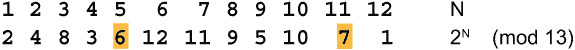

# 第十六章：三次通行协议

本章内容包括

+   基于指数的三次通行协议

+   基于矩阵乘法的三次通行协议

+   基于双边矩阵乘法的三次通行协议

第 2.2 节和第 2.3 节描述了现代密码学分为 3 个分支，即秘密密钥、公钥和个人密钥。到目前为止，本书仅描述了秘密密钥密码学的方法。公钥密码学在许多书中有描述，因此这里不会涉及。本章将讨论个人密钥密码学，这是密码学的较不为人知的第三个分支。个人密钥密码学有时被称为*无密钥*密码学，因为各方不需要传输或共享任何密钥。

个人密钥密码学的基本概念是，两个通信者 Sandra 和 Riva 各自有自己的个人密钥。这个密钥永远不会被传输或与任何其他人共享，甚至不会与彼此共享，因此没有可能通过窃听、拦截广播或任何其他形式的窃听来了解任何个人密钥。个人密钥密码学的巨大优势是你不需要提前设置任何东西。不需要有任何秘密、安全的通道来交换密钥。消息可以在公共通道上交换。不需要密钥服务器或其他基础设施。

个人密钥密码学是通过*三次通行协议*实现的，该协议是由以色列魏茨曼学院的阿迪·沙米尔于大约 1975 年发明的。为了说明这种方法，我想出了一个小故事：

曾经有一位国王爱上了邻国的女王。为了追求女王，国王希望送她一颗珍贵的宝石。国王有一个坚固的保险箱和一个防拆锁。但是他怎么能送钥匙呢？如果信使既有钥匙又有保险箱，他就可以打开箱子并偷走宝石。国王可以用第二位信使送钥匙，但他担心两位信使会在途中相遇并一起偷走宝石。女王提出了一个巧妙的解决方案。

国王会在保险箱上放上他的锁，并将其发送给王后。然后她会添加自己的锁，并带着两把锁把保险箱送回来。国王然后用自己的钥匙取下他的锁，并只带着王后的锁把保险箱送回来。然后她可以用自己的钥匙打开箱子并拿到宝石。

这里的两把锁代表两个加密，两把钥匙代表相应的解密。消息将使用发送者的加密函数加密，发送给接收者，使用接收者的加密函数加密，发送回发送者，使用发送者的解密函数解密，发送回接收者并使用接收者的解密函数解密。这意味着消息发送了 3 次，因此称为*三次通行协议*。

*****让我们来分解一下。假设消息是 M，Sandra 的加密和解密函数分别是 S 和 S'，Riva 的加密和解密函数分别是 R 和 R'。在第一次传递中，Sandra 用她的加密函数 S 加密消息 M 并将 SM 发送给 Riva。在第二次传递中，Riva 用她自己的加密函数 R 加密消息 SM 并将双重加密消息 RSM 发送回 Sandra。在第三次传递中，Sandra 将她的解密函数 S'应用于消息 RSM 以获得 S'RSM。这旨在去除 S 加密。只有当 R 和 S 可交换，或者 S'和 R 可交换时，才能实现这一点。这意味着 S'RSM = RS'SM = RM。这使得 Riva 可以去除她的加密并读取消息。

因此，为了使这个三次传递方案起作用，我们需要找到一个可交换的加密函数，或者两个彼此可交换的加密函数。我能立刻想到 3 个可交换的加密函数：加法、乘法和异或。很容易想象出一种加密方式，其中密钥与消息长度相同，加密包括逐字节将密钥加到消息中，或将消息字节乘以密钥字节，或将消息与密钥进行异或。这些都是一次性密码的简单形式。

这些都不安全。如果 Emily 设法获取所有三条加密消息，她可以轻松地去除加密。如果函数是加法，那么 3 条消息分别是 M+S、M+S+R 和 M+R。如果 Emily 将第一条和第三条消息相加，然后减去第二条消息，她会得到(M+S)+(M+R)-(M+S+R) = M。结果正是 M。当加密函数是乘法时，同样的方法也适用。3 条消息分别是(M×S)、(M×R)和(M×S×R)。再次进行(M×S)×(M×R)÷(M×S×R)运算得到 M。当加密函数是异或时，找到 M 甚至更简单，因为异或是其自身的逆运算。只需将 3 条加密消息进行异或运算，结果就是原始消息，(M⊕S)⊕(M⊕R)⊕(M⊕S⊕R) = M。

可交换的两个加密函数是替换和置换。这些也是不安全的。由于 Emily 会看到置换前后的消息，她可以轻易确定置换。

所需的是一对可交换的加密函数 S 和 R，使得即使 Emily 拥有 SM、RSM 和 RM，她也无法确定 M。

## 16.1 Shamir 的方法

Shamir 解决这个问题的方法是使用指数。设 p 是一个大素数，比如在 300 到 600 位十进制数字范围内。Sandra 将选择一个加密指数 s。相应的解密指数是 s'，使得 ss'≡1 (mod p-1)。这是根据费马小定理得出的，如果 0<a<p，则 a^(p-1)≡1 (mod p)。第 14.4.2 节描述了如何选择素数 p，第 15.4 节描述了如何确定 s'。同样，Riva 选择她的加密和解密指数 r 和 r'。这两个加密是可交换的，因为(M^s)^r = M^(sr) = M^(rs) = (M^r)^s。

Sandra 计算(M^s mod p)并将其发送给 Riva。Riva 计算(M^(sr) mod p)并将其发送回 Sandra。Sandra 计算(M^(srs)' mod p) = (M^r mod p)并将其发送回 Riva，最终 Riva 计算(M^(rr)' mod p) = M，这就是原始消息。这种方法被认为是安全的，因为确定 s 或 r 需要解决离散对数问题。正如第 14.4 节所讨论的，这个问题被认为在计算上是困难的。目前没有已知的可计算的算法。

这种方法非常慢。所有这些大数的指数运算和模数减少需要大量计算。下一节描述了一种解决方案的尝试。

## 16.2 Massey-Omura

*Massey-Omura*方法是由 ETH Zurich 的 James Massey 和 UCLA 的 Jim K. Omura 于 1982 年发明的。（他的名字在专利上列为 Jimmy Omura。他是我在 MIT 的同学，尽管我不记得他。）Massey-Omura 系统与 Shamir 系统本质上相同，只是模数的形式为 2^k。这意味着模 2^k 的余数可以通过简单地取数字的低 k 位来计算。这比计算模 p 的余数要快得多，后者基本上是通过使用这些 300 到 600 位数字进行长除法来完成的。

哪种方法更快的问题在几年来一直在计算机协会（ACM）和电气电子工程师学会（IEEE）的出版物中激烈讨论。

## 16.3 离散对数

Diffie-Hellman 密钥交换、Shamir 三次协议和 Massey-Omura 方法的安全性都取决于解决离散对数问题的难度。解决这个问题的三种流行算法是穷举枚举，适用于 10¹²，Daniel Shanks 的 baby-step giant-step 算法，适用于 10¹⁸，以及 John Pollard 的 rho 算法，适用于 10²²。然而，我们需要一个适用于 10³⁰⁰的算法。为了让人们对离散对数问题的困难有所了解，让我们看看一个解决它的复合方法。这不是你可以在家用个人电脑完成的事情。这需要一个具有大量存储空间的大型计算机，或者一个由许多个人合作工作的网络。或者，你可以跳过这一部分，只是接受离散对数问题是困难的。

### 16.3.1 对数

首先考虑在计算机出现之前人们如何计算普通对数。一种方法是取一个数字 b = 1.000001，费力地计算它的连续幂。你会发现 b⁶⁹³¹⁴⁸是最接近 2 的幂，而 b²³⁰²⁵⁸⁶是最接近 10 的幂。然后你会知道 log10 几乎是 693148/2302586，即 0.3010302。正确值是 0.3010300，所以这种方法给出了一个很好的近似值。

您可以在一个环中进行相同的操作，比如取模某个素数 p。假设桑德拉发送消息 6 模 13，里瓦返回消息 7 模 13。艾米莉想知道里瓦使用了什么指数进行加密。与其使用 1.000001 的幂，不如使用模 13 的一个原根，比如 2。由于模数较小，艾米莉可以轻松列举出模 13 的所有 2 的幂。

现在艾米莉知道桑德拉发送了 2⁵，里瓦回复了 2¹¹。所以 (2⁵)^r≡2^(5r)≡2¹¹ (mod 13)。这意味着 5r≡11 (mod 12)。您可以在脑海中解决这个问题。只需想想 11+12 = 23，23+12 = 35。由于 35 是 5 的倍数，即 5×7，这意味着 r 必须是 7。您可以用手计算器检查，6⁷ = 279936≡7 (mod 13)。桑德拉发送了 6，里瓦回复了 7，所以这是正确的。

### 16.3.2 素数的幂

艾米莉通过穷举法可以找到一种搜索方法，但是当 p 很大时，这种方法行不通。让我们尝试约翰·波拉德的*ρ 算法*中的一个思想。第一步是生成模 p 的多个幂序列，并寻找重复项。艾米莉可以同时使用多个原根进行这样的操作，每个核心一个原根。现在我们来把它加倍。如果 b 是模 p 的一个原根，她可以在一个处理器上计算出 b²、b³、b⁴、b⁵... (mod p)，在另一个处理器上计算出 b²、b⁴、b⁸、b¹⁶... (mod p)。这给了艾米莉每个使用的原根两个单独的幂序列。

除了原根，艾米莉还可以直接检查。桑德拉发送 SM，里瓦回复 RSM。艾米莉可以生成序列 (SM)²、(SM)³、(SM)⁴、(SM)⁵... 和 (SM)²、(SM)⁴、(SM)⁸、(SM)¹⁶...，以及 RSM 的类似序列。这给了艾米莉另外四个幂序列。

除了这些有序的幂序列之外，她还可以生成一些无序的序列。这些通常被称为*随机游走*或*醉汉游走*。一种方法是对生成的最后一个幂进行平方，然后将其乘以之前的某一个幂。艾米莉可以随机选择早期的幂，或者她可以使用列表的中间元素。例如，假设她已经有了幂 x、x²、x⁴、x⁸ 和 x¹⁶。对于下一个幂，她可以对 x¹⁶ 进行平方得到 x³²，然后乘以，比如说，x² 得到 x³⁴。对于下一个幂，她会对 x³⁴ 进行平方得到 x⁶⁸，然后再乘以另一个列表元素，比如说 x⁸，得到 x⁷⁶。依此类推。

艾米莉可以生成另一种随机游走，使用 2 或 3 个基本素数。每个基本素数应该是一个原根。从这些素数的乘积开始。要生成下一个乘积，她会随机选择其中一个素数并将其乘以。艾米莉拥有的序列越多，她就越快地开始得到结果。

### 16.3.3 崩溃

好了，现在艾米莉有了所有这些序列。然后呢？她在两个列表上寻找相同的数字。这被称为*碰撞*或*崩溃*。假设她发现 3¹⁷²⁹⁶⁴≡103⁴²⁹⁸⁷⁵⁵ (mod p)。通过解决同余式 172964r≡4298755 (mod p-1)，这使得她能够将 103 表示为 3 的幂（模 p）。该方法在第 15.4 节中描述。一旦她积累了足够的崩溃，她就可以建立一个链，例如 RSM≡19^a, 19≡773^b, 773≡131^c, ... , 103^y≡(SM)^z。将所有指数模 p-1 相乘，她将得到 RSM≡(SM)^r (mod p)。这个指数 r 就是瑞娃的加密函数。艾米莉破解了密码！

这并不像听起来那么简单。当 p 是一个 300 位数素数时，她需要大约 10¹⁵⁰个这样的幂才能开始看到任何崩溃。如果艾米莉有 100 万个处理器，每秒产生 100 万个这样的幂，她可能每年就可以生成 3×10¹⁹个。这意味着她需要大约 10¹³⁰年才能开始看到任何结果，直到她能建立这样一个链为止。此外，它将需要 10¹⁵⁰个字节的存储的倍数。

### 16.3.4 因式分解

不是每次生成新的幂时都要搜索崩溃，艾米莉可以尝试对其在模 p 下的残留进行因式分解。假设她成功地对 97^a (mod p)的残余进行了因式分解，并找到了 97^a≡11^b29^c83^d (mod p)。她可以解这个同余式得到 97。设模 p-1 的 a 的乘法逆元为 a'。将同余式提升至 a'次幂。97^(aa)'≡97≡(11^b29^c83^d)^a' (mod p)。将所有指数相乘并将它们减去模 p-1，结果是 97≡11^e29^f83^g (mod p)，其中 e、f 和 g 是一些值。（如果 p 有 300 位数字，实际值可能长达 300 位数字。）一旦她得到了一个质数基的表达式，比如说 97，在所有已经有和以后会找到的因式乘积中都可以替换这个值。

艾米莉将无法对每个幂的残留进行因式分解。对一个 300 位数进行因式分解非常困难，也就是说非常耗时。最好的策略是选择一个固定的质数基集 F(B)，比如说所有小于 B = 10⁶的质数，或者也许是所有小于 B = 10⁷的质数。F(B)被称为*因子基*。尝试仅使用因子基中的质数对每个幂进行因式分解。可以用这种方式进行因式分解的数字称为*B-平滑*。随着数字变大，B-平滑数字的比例会变得越来越小。在 300 位数中，B-平滑数很少见。当艾米莉找到每个因子时，数字的未因式分解部分就会减少。如果她已经尝试了基础集中的所有质数，数字的一些未因式分解部分仍然存在，她就不应再尝试进一步因式分解它。放弃这个幂并继续下一个幂会更有效率。

这就是 Emily 必须做的事情：继续生成产品并对它们对 p 取余的结果进行因式分解。仅保留 B-smooth 数字并丢弃其余。检查 B-smooth 数字中的崩溃情况。每次发现崩溃时，解决乘积中最大质数的同余式，以便需要越来越少的基本质数来表示每个乘积。她可以保留一个或多个专用于此任务的处理器。

假设 q^n 是一个质数的幂，并且其模 p 的剩余为 x。尝试使用基本集 B 中的质数因式分解 x。如果 x 不是 B-smooth，则尝试因式分解数 x+p，x+2p，x+3p，...。因式分解一个 301 位数或 302 位数的数并不比因式分解一个 300 位数的数更难。设置一个固定数量的这样的尝试，比如说，对于每个剩余设置 10 次尝试。

当她生成这些幂时，她需要特别强调 SM 和 RSM。记住，这个练习的目标是找到指数 r，使得(SM)^r≡RSM (mod p)。她在将 SM 和 RSM 都表示为基本质数的幂之前是无法做到的。首先，她应该开发出多个 SM 和 RSM 幂的序列。一旦她成功找到这样的表达式，她就会寻找表达式中尚未用较小质数的幂表示的质数。接下来重点放在这些质数上。继续直到 SM 和 RSM 都表示为单一质数的幂。她现在可以使用第 15.3.2 节的方法找到 r。

### 16.3.5 估算

假设她使用了 10⁶ 个基本质数，也就是说，质数达到了 B = 15,485,863。要将所有这些表示为单一质数将需要 10⁶ 个同余式。存储这些需要一个 10⁶×10⁶ 的指数矩阵。矩阵最初是稀疏的，但随着解决方案的进展而变得稠密，因此稀疏矩阵技术将不会有益。每个指数是一个 300 位数。这需要大约 10¹⁵字节，或 1 个*petabyte*的存储空间。截至撰写本文时（2022 年 3 月），世界上最大的超级计算机是位于奥克里奇国家实验室的 Summit 计算机，拥有 2.76 petabytes 的可寻址存储空间。

显然，运行时间取决于找到 B-smooth 数字需要多长时间。B-smooth 数字的密度由 de Bruijn 函数Ψ(p,B)给出，它给出了小于 p 的 B-smooth 整数的数量。这由荷兰数学家尼古拉斯·戈弗特·德布鲁因研究过。Ψ(x,x^(1/u))的值由精算师卡尔·迪克曼发明的迪克曼函数ρ(u)近似，其中ρ(u)是迪克曼函数。迪克曼函数ρ(u)由 u^(-u)近似。在这种情况下，x = 10³⁰⁰和 x^(1/u) = 15,485,863，所以 u = 41.725。因此，大约需要大约 41.725^(41.725) = 4.08×10⁶⁷次尝试才能找到每个 B-smooth 数字。

总的来说，将需要超过 10⁷³ 次尝试来找到 10⁶ 个 B-平滑幂。对每个数字进行因数分解可能需要多达 10⁶ 次试除，因此总共需要 10⁷⁹ 次试除。由于数字有 300 位，每次试除将需要 300 倍的操作。总共是 10⁸² 次操作。这比崩溃法的 10¹⁵⁰ 有了巨大的改进，但对于当前的计算机仍然是不可及的。

这表明对于可预见的未来，300 位数字已经足够了，也许可以维持 20 到 30 年。随着量子计算机的发展，这可能会改变，但目前 300 位数字是安全的。

## 16.4 矩阵三次传输协议

用于三次传递算法的 Shamir 和 Massey-Omura 方法都使用了指数运算。三次传递算法的另一种方法是使用矩阵。我们之前已经见过这种情况，比如 Hill 密码，第 15.1 节。消息被分成块。每个块被视为模 256 的整数向量。这个向量被一个模 256 的可逆方阵左乘或右乘。对于三次传递版本，Sandra 将有一个用于加密的矩阵 S 和其逆矩阵 S'，而 Riva 将有一个加密矩阵 R 和解密矩阵 R'。这些矩阵不是在模 256 整数上，而是在一个 256 个元素的环***R***上，消息的字符被视为该环的元素。假设消息块为 M，所以 Sandra 发送 SM 给 Riva，Riva 将 RSM 返回给 Sandra，Sandra 使用 S' 解密以获得 S'RSM = RM。现在 Riva 可以使用 R' 解密它，即 R'RM = M。

棘手的部分是使 S'RSM = RM。矩阵乘法不可交换，所以 Sandra 和 Riva 需要选择彼此可交换的特殊矩阵 S 和 R。明确地说，S 和 R 不是可交换矩阵。如果你随机选择一个矩阵 X，几乎可以肯定 SX ≠ XS 和 RX ≠ XR。这是一个重要的观点，所以让我重复一遍，S 和 R 不是可交换矩阵。它们不与大多数其他矩阵可交换。它们彼此可交换。

### 16.4.1 可交换矩阵族

Sandra 和 Riva 需要大量的这些矩阵，这样 Emily 就不能简单地尝试它们所有。这意味着他们需要一个大的可交换矩阵族**Ғ**，从中选择每个消息块的矩阵。

注意**Ғ**是一个可交换的矩阵族，而不是一组可交换的矩阵。重要的是要理解，可交换的是矩阵族，而不是矩阵本身。**Ғ**中几乎所有的矩阵都*不*可交换。它们彼此可交换，但与其他矩阵不可交换。

构造可交换矩阵族的最简单方法是从任意可逆矩阵 F 开始，并取其幂，F⁰、F¹、F²、F³、...，其中 F⁰ 是单位矩阵 I，而 F¹ = F。将 F 称为**Ғ**族的*生成矩阵*。

Sandra 和 Riva 每个消息块都需要使用不同的矩阵，否则 Emily 可能会在已知明文的足够消息块 M[i] 的情况下解出线性方程组 R(SM[i]) = RSM[i]。

### 16.4.2 乘法阶

要使**Ғ**族变得更大，你需要找到或构造一个具有很高乘法阶的生成矩阵 F。也就是说，需要找到一个最小的整数 n > 0，使得 F^n = I，至少要大于 10^（25），但最好更大。如果矩阵 F 是可逆的，这样的 n 总是存在的，并且 F 的乘法逆 F' 是 F^(n-1)。在第 15.8 节中给出了一种寻找可逆矩阵的方法。确定 F 的乘法阶有点艺术性。显然，一直计算 F 的连续幂直到 F^n = I 是不可行的，特别是当 n > 10^（25）时。但这是可以做到的。

要找到乘法阶，从 1×1 矩阵开始，即环元素。查看这些元素的乘法阶。这些可以通过枚举轻松找到，因为 n 的最大可能值是 255。可能的值是 2、3、7、15、31、63、127 和 255。更大矩阵的乘法阶往往是这些值的倍数。

假设环元素的乘法阶恰好是 2、7 和 31。当你尝试 2×2 矩阵时，首先将每个矩阵 A 提升到单元素阶的某个倍数，比如 2⁴7²31 = 24304。然后枚举 B = A²⁴³⁰⁴ 的幂。假设你发现 B⁵² = I。你现在可以确定 A 的乘法阶 m 能够整除 x = 24304×52 = 2⁶7²13×31，且是 2⁶13 的倍数。接下来应该尝试 A^(x/7) 和 A^(x/31) 看看它们是否为 I。如果 A^(x/7) 是 I，那么你就尝试 A^(x/49)。在这种情况下，最高的乘法阶可能是 2⁶7×13×31。

接下来你要处理 3×3 矩阵。如果除了 2、3、7、13 和 31 之外，2×2 矩阵的乘法阶中没有其他质因数出现，那么一个好的起始指数可能是 x = 2⁸7²13²31²。枚举 B = A^x 的连续幂，并重复缩小指数的过程。随着矩阵变大，乘法阶可能会增加一个无法通过枚举找到的因子。在这种情况下，你将需要猜测新的可能出现的质因数。

注意乘法阶序列中出现的模式。这需要一些侦探工作。例如，假设出现了 2³-1、2⁶-1、2⁹-1 和 2¹²-1。你不会直接看到这些，因为它们不全是质数。2⁶-1 = 63 = 3²7，2⁹-1 = 511 = 7×73 和 2¹²-1 = 4095 = 3²5×7×13。所以在质因数中找到 13 是指向“真正”因数可能是 2¹²-1 的线索，而找到 73 则强烈表明 2⁹-1 是一个因数。如果出现了 2³-1、2⁶-1、2⁹-1 和 2¹²-1，你应该期待很快出现 2¹⁵-1。如果这些全部出现，它们都可以被 7 整除，所以乘法阶将被 7⁴ 整除。

### 16.4.3 最大阶

艾米莉在这一切中的目标是尽可能地扩大家族**Ғ**，这样她和里娃就有很多选择来选择他们的矩阵 S 和 R。一个有用的技巧是观察因子集合之间的乘法阶数差异。例如，如果 A 的乘法阶数为 19m，B 的乘法阶数为 23m，那么 AB 的乘法阶数很可能是 19×23m=437m。如果这不起作用，那么 A'B 或 AB'可能具有乘法阶数 437m。

如果可能的话，桑德拉应该选择一个生成矩阵 F，其乘法阶数具有一个大素数因子，比如$m > 10^{35}$，以防止 Silver-Pohlig-Hellman 攻击（第 14.4 节）。桑德拉需要对各种$n$进行因式分解$2^n-1$，找到具有大素数因子的那些，并尝试用逐渐增大的矩阵找到一个乘法阶数可被其中一个$2^n-1$整除的生成矩阵。

### 16.4.4 艾米莉的攻击

假设桑德拉已经选择了 F 和**Ғ**，并且她已经向里娃发送了一条消息。由于桑德拉和里娃正在通过公共信道进行通信，比如互联网，假设艾米莉知道 F、**Ғ**、SM、RSM 和 RM。她的目标是找到 R 或 S，所以她有两次机会。让我们集中讨论艾米莉如何找到 R。艾米莉知道关于 R 的两件事。首先，她知道 SM 和 RSM 的值，这给了她 n 个线性方程，这些方程是关于 R 的$n²$个未知元素的。其次，她知道 R 在家族**Ғ**中，所以它必须与 F 交换，即 RF = FR。如果环***R***是可交换的，那么这给了她 n(n-1)个关于 R 的$n²$个元素的附加线性方程。

这有效的原因是矩阵方程 RF = FR 的左侧产生了形式为$r f$的项，其中$r$是 R 的未知元素，$f$是 F 的已知元素。右侧产生了形式为$f r$的项。由于环是可交换的，左侧项$r f$可以转换为形式$f r$，并与右侧项组合形成线性方程。

在$n²$个未知数的$n²$个线性方程中解决这些线性方程并找到$R$似乎很容易。但事实并非如此。回顾第 15.3.1 节，我们知道有强同余和弱同余。对于任何不是素数的有限环上的线性方程，情况也是如此。环大小有多少素因子，就有多少潜在的弱方程。在当前情况下，环大小为$2⁸$，有 8 个素因子，所以许多线性方程很可能是弱方程。如果环***R***选择得当，矩阵的典型大小可能是 30×30，或者 128×128，甚至 256×256，如果环的选择不佳。即使选择了合适的环，即使一半的方程是强的，你也会期望至少有$2^{450}$个解集合的 30×30=900 个方程。实际上，解的数量要多得多，因为可能有 4、8 或甚至 16 个解的方程。

Emily 有个好消息。Emily 可以解决 R' 而不是 R，而她得到的那 2⁴⁵⁰ 或更多的解中的任何一个都将是 R 的有效逆，让她通过 R'RM = M 获得消息。

### 16.4.5 非交换环

Sandra 和 Riva 看起来是失败的。Emily 赢得了这场战斗。

解决这种攻击的一个可能方法是让 Sandra 和 Riva 使用一个非交换环。非交换环的两个例子是矩阵和四元数（第 15.7.2 节）。你可以形成元素本身是矩阵或四元数的矩阵，或者反过来，系数是矩阵或四元数的四元数。但这些都不是好选择。你需要让它们变得非常大才能产生高乘法阶的矩阵。

更好的方法是使用第 15.7 节的技术构造你自己的环***N***。你应该选择一个具有许多具备以下特征的元素的环：(1) 可逆，(2) 具有高乘法阶，以及 (3) 非交换。要找到一个同时具有所有这些特征的环是一个棘手的平衡行为。例如，一个具有最大乘法阶元素（256 元素环的 255）的环不能有任何非交换元素。如果你能找到一个环，其中一半元素是可逆的，一半具有乘法阶约为环大小一半的元素，一半是非交换的，*dayenu*（这就足够了）。你不能同时达到这 3 个目标，但你可以在某些目标上超过其他目标，同时接近其他目标。

使用非交换环，矩阵方程 RF = FR 不再能线性化，因为不再确定 rf = fr。相反，矩阵方程导致一组*bilinear*方程。双线性方程中的一般项的形式为 axb，其中 a 和 b 是环的元素，x 是您希望确定的变量。虽然线性方程可以使用简单的系统方法解决，即高斯消元法，但对于双线性方程却没有这样的方法。甚至对于一个变量 x 的简单方程 ax+xb = c 也没有一个一般的解法。因此，在环上解双线性方程是“不可能的”。

### 16.4.6 解双线性方程

话虽如此，我现在将向你展示如何解决双线性方程。诀窍在于改变环***N***中元素的表示。我们已经看到了几个这样做的示例。在环***R13***中，元素表示为*a* + *b*√13。高斯整数表示为 a+bi。四元数表示为 a+bi+cj+dk。这里，i、j 和 k 是决定环行为的抽象单位的乘积，而 a、b、c 和 d 是环的可交换元素。四元数可以是非交换的，因为单位的乘法不是交换的，即，ij ≠ ji，ik ≠ ki，jk ≠ kj。只有一个单位时，高斯整数必然是可交换的。

*线性化*双线性方程的技巧是通过找到非交换环 ***N*** 的表示来完成的。这很容易做到。首先将 ***N*** 的元素划分为两组，A 和 B，其中 A 包含具有表示的元素，而 B 包含其余的元素。最初，A 是空的，B 包含环的所有元素。从取可交换的元素并将它们移到集合 A 开始。这些环元素将表示它们自己。它们是表示中的“a”项。选择任意剩余可逆元素作为单位 i。取所有可以表示为 a+bi 的环元素，其中 a 和 b 是环的可交换元素，并将它们从集合 B 移动到集合 A。到目前为止，A 的所有元素仍然是可交换的。

集合 B 不能为空，因为 ***N*** 不是交换的。我们已经注意到只有一个单位的环，如高斯整数，必须是可交换的。因此，从集合 B 中取出第二个可逆元素，并称其为第二个单位 j。这次，您将所有可以表示为 a+bi+cj 的元素从集合 B 移动到集合 A。可能仍然存在于集合 B 中的环元素。在这种情况下，您将重复这些步骤，但为简单起见，假设（1）只需要两个单位；（2）环中的所有元素都可以表示为 a+bi+cj，其中 i 和 j 是抽象单位；和（3）a、b 和 c 是环 ***N*** 的可交换元素。在实践中，您获得的单位数量可能取决于您选择的 i 和 j，因此您应该进行多次尝试以获得最少的单位。这很重要，因为更多的单位意味着在线性化时会有更多的方程。由于解一组线性方程所需的时间与方程数量的立方成正比，这对计算有很大影响。

回到矩阵方程 RF = FR，并将环元素表示为 a+bi+cj 的形式。 ***R*** 的未知元素将具有 x+yi+zj 的形式，其中 x、y 和 z 是未知的可交换环元素。 现在矩阵乘积 RF 的一个项将具有以下形式：

其中 i²、j²、ij 和 ji 将进一步扩展为 1、i 和 j 的线性组合，如 d+ei+fj。当然，实际的展开取决于环的选择以及哪些元素被选择为 i 和 j。

矩阵乘积 FR 中的项也必须进行相同的处理。最终，您将得到 2700 个未知数的 2700 个方程，而不是 900 个未知数的 900 个方程。这将将错误解的数量从 2⁴⁵⁰增加到 2¹³⁵⁰。这对 Emily 来说是个坏消息。错误的解决方案不允许她恢复消息。

### 16.4.7 弱点

**Ғ**家族将包括一些弱点，如对角矩阵和三角矩阵，艾米莉可以轻松求逆。这些弱点不应作为密钥使用。在从**Ғ**中选择矩阵时，请验证主对角线上下至少有一个非零元素。为了快速进行这个测试，只需验证 X[12]、X[13]和 X[23]中至少有一个非零，以及 X[21]、X[31]和 X[32]中至少有一个非零。否则拒绝 X 并重新选择。被拒绝的矩阵的百分比是可以忽略不计的。

### 16.4.8 加速方法

使用矩阵而不是指数的优势可能还不太明显。从**Ғ**家族中选择矩阵 S 或 R 需要对生成矩阵 F 进行大幂次运算。这与将大整数求大幂次有何区别或更快？区别在于准备工作。在 Shamir 和 Massey-Omura 方法中，桑德拉和瑞娃必须对对方收到的数字进行大幂次运算。由于他们事先不知道这个数字，所以他们无法做任何准备来加快指数运算。

然而，使用矩阵方法，生成矩阵 F 事先是已知的。桑德拉和瑞娃都可以提前生成一些 F 的幂次，然后保留这个基础矩阵幂集，这样他们就可以通过仅进行 1 或 2 次矩阵乘法来生成新的 F 的幂次。首先，他们可以仅使用 15 次矩阵乘法生成 16 个矩阵 F，F²，F⁴，F⁸，...，F³²⁷⁶⁸的集合。

如果他们只是做到了这一点，那么艾米莉也可以做到同样的事情。她会拥有与桑德拉和瑞娃相同的基础矩阵集，因此她可以轻松确定它们的加密矩阵 S 和 R。为了防止这种情况发生，桑德拉和瑞娃需要随机化他们的矩阵集。他们通过随机选择两个矩阵并将它们相乘来实现这一点。这个乘积将替换基础集中的其中一个矩阵。桑德拉和瑞娃独立地执行这个操作。彼此都不知道对方选择了哪些 F 的幂次。

在设置过程中，应该重复执行这个替换操作很多次，比如 1000 次，这样每个参与方的矩阵集就会彻底随机化。如果 1000 次看起来过多，记住，在 Shamir 方法中使用一个 300 位的素数，每次指数运算将需要约 1000 次乘法和 1000 次模重。桑德拉和瑞娃还需要保留他们矩阵的逆。每次他们将两个 F 的幂次相乘时，他们需要相应地将 F'的幂次相乘，这样他们就永远不需要求逆任何幂次。

此设置步骤，在发送第一条消息之前，只需执行一次。当您拥有这个扩展的生成矩阵集时，您可以通过仅进行一次矩阵乘法和一次其逆矩阵的乘法来生成用于发送消息的矩阵。您随机选择来自基本集的两个不同的矩阵 F^a 和 F^b，相乘得到 F^(a+b)，然后将 F^a 替换为 F^(a+b)，以便每次生成不同的矩阵。

使用这种技术，我发现矩阵方法对于 30×30 矩阵与 1024 位模数相比，约快 2100 倍，而不论是 Shamir 还是 Massey-Omura 指数方法。

## 16.5 双侧三步协议

前述矩阵方法中的矩阵乘法可以在左侧或右侧执行，这意味着消息可以被加密为 SM 或 MS。也可以在两侧同时进行乘法。在这种情况下，消息被分成 n²个字符的块，并且有两个独立的 n×n 矩阵的可交换的族，**Ғ** 和 **Ɠ**，其生成矩阵为 F 和 G。桑德拉将用来自 **Ғ** 的矩阵 S 和来自 **Ɠ** 的矩阵 T 加密消息，而丽娃将用来自 **Ғ** 的矩阵 R 和来自 **Ɠ** 的矩阵 Q 进行超加密。

桑德拉向丽娃发送加密的消息 SMT。丽娃进行超加密并发送回 RSMTQ。桑德拉通过使用逆矩阵 S'和 T'去除她的加密，发送 S'RSMTQT' = RMQ 回给丽娃，丽娃使用她的逆矩阵 R'和 Q'来解密，如 R'RMQQ' = M。对于短消息来说，双侧方法不实用，因为其块大小较大，但对于长消息来说，它比单侧方法快得多，因为每个块中有 n²个字符而不是 n 个字符。对于 30×30 矩阵，它可以比单侧方法快 15 倍，因此约比 Shamir 或 Massey-Omura 方法快约 30,000 倍。

艾米莉必须同时解出两个矩阵。让艾米莉拦截的三个矩阵分别称为 X、Y 和 Z，即 X = SMT，Y = RSMTQ 和 Z = RMQ。艾米莉知道 Y = RXQ 和 Z = S'YT'。看起来艾米莉需要解一个大型的二次方程组，而不是解线性或双线性方程。然而，如果这些方程分别乘以 R'、Q'、S 和 T，它们就会变成 R'Y = XQ、YQ' = RX、SZ = YT'和 ZT = S'Y。这些矩阵方程展开后会得到双线性方程。我们在第 16.4.6 节中看到了如何解决双线性方程。

艾米丽可以通过找到 R' 和 Q'，或者找到 S' 和 T' 来恢复 M。她可以选择解决这四个方程中的前两个或后两个中的任意一个。让我们继续以 30×30 矩阵的例子，并集中于解决 R'Y = XQ。R' 中有 900 个未知数，Q 中还有 900 个。这个矩阵方程在这 1800 个未知数中提供了 900 个双线性方程。艾米丽还知道 R' 在 **Ғ** 中，Q 在 **Ɠ** 中，所以 R'F = FR'，QG = GQ。每个方程都产生了额外的 30×29 = 870 个双线性方程。这给了艾米丽总共 2640 个双线性方程，1800 个未知数。通过改变环元素的表示，这些方程可以线性化。

这导致了 7920 个线性方程，5400 个未知数。当方程比未知数多时，系统被称为 *过度确定*。随着艾米丽减少方程组，多余的方程将被简单地舍弃。也就是说，7920×5400 矩阵的许多行变成了全零。它们可以移到矩阵底部并被忽略。最后，与单边情况一样出现了相同的困难，即存在大量的解决方案。由于双边方程组是过度确定的，它们比单边方程组更强大。另一方面，未知数是两倍多。不清楚哪种方法最终更强大。您可能会选择双边方法，因为它快得多。******
